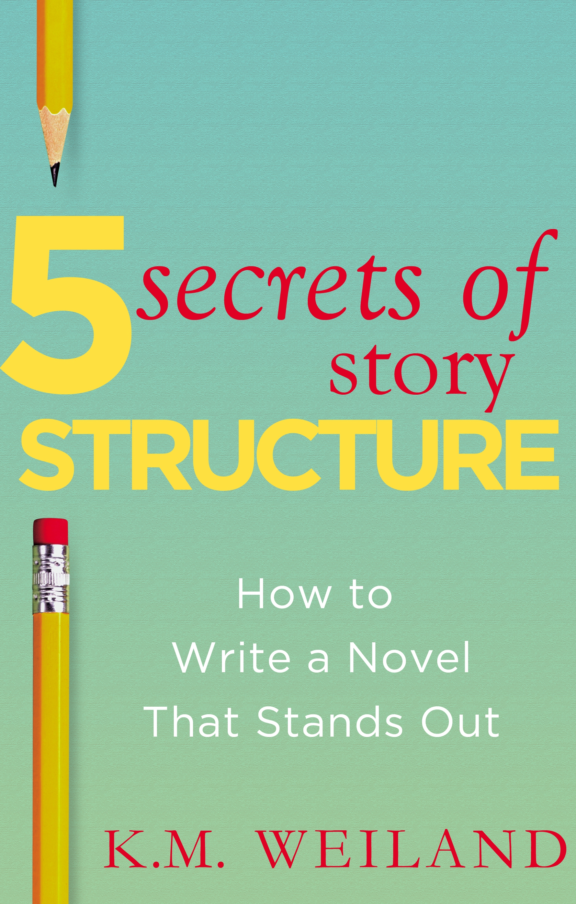
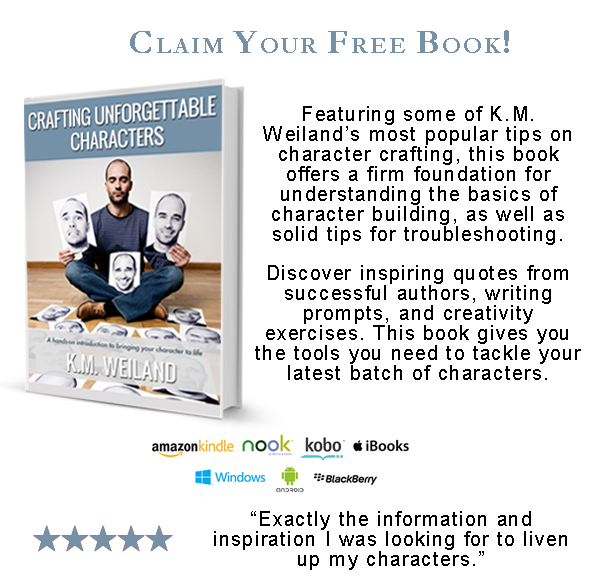
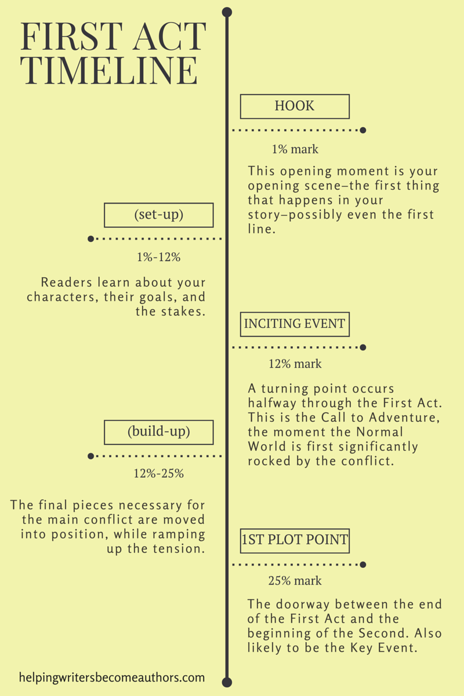
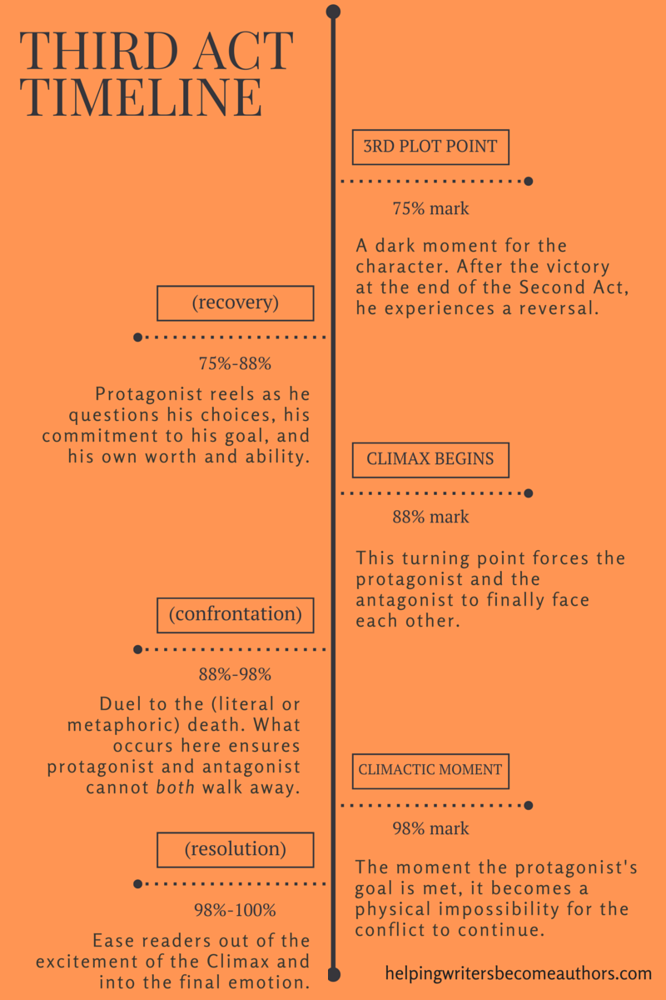
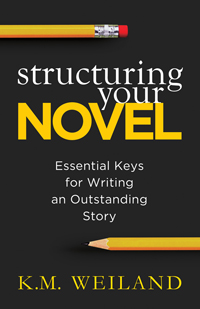
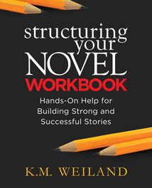

::: {}

:::

## **Contents**

\

[Title Page](#body.xhtml)

[Claim Your Free Book](#body1.xhtml)

[About the Book](#body2.xhtml)

[Introduction](#body3.xhtml)

[Chapter 1 How to Structure Your Novel - in 5 Minutes!](#body4.xhtml)

[Chapter 2 The Inciting Event](#body5.xhtml)

[Chapter 3 The Key Event](#body6.xhtml)

[Chapter 4 The Pinch Points](#body7.xhtml)

[Chapter 5 The Moment of Truth at the Midpoint](#body8.xhtml)

[Chapter 6 The Climactic Moment](#body9.xhtml)

[Chapter 7 Conclusion](#body10.xhtml)

[Appendix](#body11.xhtml)

[The Story Structure Database](#body12.xhtml)

[Story Structure in Action: Star Wars](#body13.xhtml)

[Claim Your Free Book](#body14.xhtml)

[Note From the Author](#body15.xhtml)

[Also by K.M. Weiland](#body16.xhtml)

[Copyright](#body17.xhtml)

THE 5 SECRETS OF STORY STRUCTURE

How to Write a Novel That Stands Out

 

K.M. Weiland

PenForASword Publishing

Get a free copy of acclaimed author K.M. Weiland's helpful book of character tips CRAFTING UNFORGETTABLE CHARACTERS.

 

Click here to get started:

[https://www.kmweiland.com/free-characters-book/](https://www.kmweiland.com/free-characters-book/)

Want to take your writing to the next level?

Discover the "secrets" of story structure other authors are overlooking!

 

If you've read all the books on story structure and concluded there has to be more to it than just three acts and a couple of plot points, then you're absolutely right! It's time to notch up your writing education from "basic" to "black belt." Internationally published author K.M. Weiland shares five "secret" techniques of advanced story structure.

 

In the multi-award-winning Structuring Your Novel, Weiland showed writers how to use a strong three-act structure to build a story with the greatest possible impact on readers. Now it's time to take that knowledge to the next level.

 

In this supplemental book, you'll learn:

 

- Why the Inciting Event isn't what you've always thought it is
- What your Key Event is and how to stop putting it in the wrong scene
- How to identify your Pinch Points---and why they can make the middle of your book easier to write
- How to create the perfect Moment of Truth to move your protagonist from reaction to action
- How to ace your story's Climactic Moment every single time
- And much more!

 

By the time you've finished this quick read, you'll know more about story structure than the vast majority of aspiring authors will ever know---and you'll be ready to write an amazing novel that stands above the crowd.

 

Take the next step in your evolution as a writer!

 

Join the discussion: #StructuringYourNovel

 

 

 

 

Introduction

 

IF THERE'S JUST one thing that matters to your success as a writer, it's story structure. Story structure is what allows authors to create stories that work every single time. Story structure is what allows you to quickly diagnose and remedy plot problems.

The fear that story structure is formulaic and difficult couldn't be farther from the truth. Story structure changed my life. The moment the foundational principles of this all-important technique clicked into place for me was the moment I came of age as a writer. Now it's your turn!

If you've read my IPPY and NIEA Award-winning book [Structuring Your Novel](http://www.amazon.com/Structuring-Your-Novel-Essential-Outstanding-ebook/dp/B00EJX08QA), you've already gained a foundation in story theory that will help your writing shine. In that book, we talked about why structure is make-or-break territory for every novel, how to create a strong three-act structure that will bring your story to life, and how to ensure your story is built to have the greatest possible impact on readers.

Now it's time to take that knowledge to the next level. (And if you haven't read Structuring Your Novel yet, don't worry---I'm going to give you a crash course in basic story structure in the next chapter.)

One of the most exciting things about being a writer is the never-ending journey of learning and discovery. Just when you think you've reached the end of a subject like story structure, you get to experience the exciting revelation that there's more!

This is exactly how I felt when I moved beyond the basics of the three-act structure to discover the five secret techniques of advanced story structure. Why are they "secret"? Simply because you don't see them discussed often---and when you do, they're often approached from a background of misconceptions.

In the following pages, you're going to learn how to master these five structural elements:

 

- The Inciting Event
- The Key Event
- The Pinch Points
- The Moment of Truth
- The Climactic Moment

 

By the time we're done, you'll know more about story structure than the vast majority of aspiring authors will ever know---and you'll be ready to write an amazing novel that stands above the crowd.

 

 

 

 

 

 

Chapter 1

How to Structure Your Novel - in 5 Minutes!

 

DOES THAT TITLE sound too good to be true? Well, it isn't. No, seriously, if you read at the same pace as me (and, yes, I timed myself), then by the time you've finished reading this chapter, you'll have learned how to structure an entire novel.

Who knew it was that simple, right? I didn't. I resisted structure for years, until one day I got hit in the face with a simple explanation of it. Just like that---in five minutes---it changed my entire approach to writing.

 

10 Steps to Story Structure

I divide the prominent aspects and turning points of structure into ten basic steps. Why ten? Because if you can ace these major moments in your story, the finer details tend to fall into place around them. We can all remember ten things, right?

What are these magic ten steps that are going to lead you to a stronger, more amazing, and (dare I say?) more fun story? Let's take a look.

The First Act

1. The Hook

What Is It? Your story begins with the hook. This is your first opportunity for catching your readers' attention and convincing them to read on. The Hook will always be a question (perhaps explicit, but probably implicit), piquing your readers' curiosity and urging them to find out, "What happens next?"

 

Where Does It Belong? The Hook must show up in your first chapter, preferably on the first page, and even more preferably in the first line.

 

2. The Inciting Event

What Is It? The Inciting Event is the turning point in the First Act when your character first brushes the story's main conflict. To identify your Inciting Event, ask yourself, "What event starts the ball rolling in my story's plot? Where does the conflict begin? What sets the story's action in motion?"

 

Where Does It Belong? The Inciting Event is the turning point halfway through the First Act (one of the secret pieces of story structure!). This timing allows for the story's Normal World to be properly established. Don't confuse the Inciting Event with the Hook. The Hook will be the first in the line of causal dominoes, bumping one scene into the other, but your protagonist won't come into direct contact with the main conflict until the Inciting Event later in the First Act.

 

3. The Key Event

What Is It? If the Inciting Event is where your protagonist first encounters the main conflict, the Key Event is what irrevocably engages your protagonist with that conflict. Even if you have a great big Inciting Event (like, say, the beginning of a war), it can't affect your character until the Key Event drags him into the mess (as would happen if he were drafted into the Army).

 

Where Does It Belong? The Key Event occurs toward the end of the First Act. Often, it will be so closely linked to the following First Plot Point as to be almost inextricable. Other times, the Key Event and the First Plot Point will be two distinct moments. More on the Key Event in Chapter 3.

 

4.  The First Plot Point

What Is It? The First Plot Point marks the end of the First Act and the beginning of the Second. This is where everything changes for your character. Up to now, the First Act has mostly concerned itself with setting up your character's Normal World and introducing the supporting characters, the settings, and, most importantly, the stakes. But now, the First Plot Point rocks that Normal World. Everything changes, and your protagonist will be forced to start reacting to the new status quo.

 

Where Does It Belong? The First Plot Point will occur roundabout the 25% mark in your book. This placement doesn't have to be absolutely precise, since a book is long enough to allow a less than exact structural timeline. But aim to have your major plot points dividing your book into rough quarters.

The Second Act

5. The First Half of the Second Act

What Is It? Your protagonist is going to spend the First Half of the Second Act in reaction mode (more on that in Chapter 5). The First Plot Point changed his world---and probably not for the better. For the next quarter of the book, right up until the Midpoint, he's going to be fighting to keep his head above water.

 

Where Does It Belong? The First Half of the Second Act will span (approximately) from the First Plot Point at the 25% mark to the Midpoint at the 50% mark.

 

6. The Midpoint

What Is It? The Midpoint is your story's second major plot point. This is where everything changes---again. Just as your character's world was rocked off its axis by the First Plot Point, now it gets shaken up all over again as he is struck with an all-important Moment of Truth (coming in Chapter 5). Before the Midpoint, he was thrown into reaction mode; now he is equipped to start taking action.

 

Where Does It Belong? The Midpoint belongs smack in the middle of your story, where it will also divide the Second Act in half.

 

7. The Second Half of the Second Act

What Is It? After the Midpoint, your character is going to start going on the offensive. He's no longer going to be willing to simply have the antagonist bring the battle to him. Instead, he starts throwing off his insecurities and implementing his own plans.

 

Where Does It Belong? The Second Half of the Second Act begins at the Midpoint and will continue all the way to the beginning of the Third Act, at the 75% mark in your story.

The Third Act

8. The Third Plot Point

What Is It? The Third Plot Point, as your final major plot point, is going to change everything once again. Whatever happens here is going to force your character to a low place. He's going to finally have to analyze his actions and his motivations and get down to the core of his own personal character arc. This is where he'll start to identify his own destructive (or perhaps just ineffective) mindsets and start rejecting the personal Lies that have held him back up to now.

 

Where Does It Belong? The Third Plot Point signals the beginning of the Third Act. As such, it needs to occur right around the beginning of your book's final quarter---at the 75% mark.

 

9. The Climax

What Is It? Your Climax is the point of the whole story. This is where the conflict must finally be resolved, for good and all, one way or the other.

 

Where Does It Belong? Although events will be heating up all the way through the Third Act, the Climax proper won't begin until around the 90% mark in your story, and the Climactic Moment itself won't hit until the very end---perhaps only a scene or two from the end of the book.

 

10. The Resolution

What Is It? The Resolution caps your story with finality. This important scene is the exhale to your Climax's inhale. Here, you give readers the opportunity to see how your character will react to the events of the Climax. How is he a different person from whoever he was in the beginning? How has the world changed around him? How does his future look from here?

 

Where Does It Belong? By this point, your story is essentially over, so there's no need to drag things out. Most Resolutions will only need a scene or two to tie off loose ends and leave readers with a satisfied feeling in the pits of their stomachs.

And there you have it. Five minutes later, and already you've got a basic grasp on what is perhaps the most important tool in any writer's arsenal: story structure.

 

 

 

 

 

 

Chapter 2

The Inciting Event

 

WHAT IS THE Inciting Event? That's a question just about any writer can answer. The trouble is that sometimes we all have a different answer.

 

- Is the Inciting Event the first thing that happens in the story?
- Is it the moment that kicks off the plot and the conflict?
- Is it the First Plot Point at the end of the First Act?
- Is it something in between?
- Is it something that happens before the story ever starts?

 

The chief trouble with identifying the Inciting Event is that the term is used rather wildly to apply to just about any of the above. One writer calls the Inciting Event "the Hook," another calls it "the First Plot Point." Argh! No wonder we're all so confused.

The confusion grabbed me in its claws as well. In [Structuring Your Novel](http://www.amazon.com/Structuring-Your-Novel-Essential-Outstanding-ebook/dp/B00EJX08QA), I originally wrote the following about the Inciting Event:

 

What's important isn't so much nailing down your Inciting Event to a specific place in the story, as it is presenting the Inciting Event at the optimal moment. Sometimes that means throwing the Inciting Event at readers right away, and sometimes that means holding off a bit.

 

I admit it: that's a little vague, isn't it?

Since writing the first edition of Structuring Your Novel, I've made some extremely interesting discoveries about the Inciting Event, which have helped me refine my own stories far more than did such vague notions. Let's all advance our understanding of this frustratingly important moment in our stories, shall we?

 

The Single Most Important Thing to Understand About "The Inciting Event"

The most important thing you can take away from this chapter is this: There isn't just one moment that can be called "the inciting event." There are three.

The vast majority of confusion over this structural pillar results from the fact that we find different writers referring to three very distinct moments in the story by the same name. I've been guilty of it too, if only because I hadn't yet grasped the differences between the three. These three different story structure moments are completely different from one another and all equally necessary to your story.

 

The 3 Different "Inciting Events"

1. The First Moment in the Story

Probably the most common understanding of the Inciting Event is that it's the first moment in your plot. This is the beginning of your story---possibly even the first sentence. This opening scene will introduce your main character and your story's overarching dramatic question. It's the first domino in the line of dominoes that forms your plot. It's the beginning of your story. If you open before this moment, then you've opened too soon.

 

Why We Think This Is the Inciting Event

It's no wonder we think of this moment as the Inciting Event. "Incite" seems to indicate the match striking the tinder of our plot. Therefore, this moment necessarily has to be the starting point, right? Well, yes and no. Yes, this first moment in your plot is what starts the whole thing moving. But, no, this moment is more about introducing your story than inciting it.

 

What It Really Is

This first crucial moment in your story is more properly the Hook. There is, of course, more involved in the Hook than just this (namely, its responsibilities to grab your readers' curiosity). But, for our purposes right now, suffice it that the Hook is the first structural moment in your story. It's the first interesting moment, and, as such, it's what flicks over that first domino and starts things rolling.

 

Where It Belongs

This opening moment---the Hook---belongs (surprise!) in the opening. It's your opening scene---the first thing that happens in your story---possibly even the first line.

 

What We Should Really Call It

The Hook.

 

Examples

- Bram Stoker's Dracula opens with Jonathan Harker arriving in Budapest on his way to meet with his strange client, Count Dracula. This moment launches the plot (after all, prior to Harker's meeting with Dracula, there is no story) and grabs reader curiosity.

   

- Stephen Spielberg's Raiders of the Lost Ark opens with the famous sequence in which Indy---dogged by his nemesis Belloq---infiltrates the South American temple and steals the golden idol. The sequence itself has nothing to do with the main conflict, but it brilliantly introduces the protagonist, grabs the viewer, and kicks off the rivalry between Indy and Belloq.

   

- Chris Wedge and Carlos Saldanha's Ice Age opens with the subplot character Scrat, whose single-minded pursuit of his acorn causes the Ice Age.

2. The First Plot Point

If the Inciting Event isn't the Hook, then perhaps it's the all-important big moment that happens at the end of the First Act: the First Plot Point. The First Plot Point is where your story gets going in earnest. Something dynamic and irreversible happens at this moment. It kicks your character forever out of the passivity of the Normal World and launches him into a desperate series of reactions as he scrambles to gain some control over the conflict.

 

Why We Think This Is the Inciting Event

This is the moment that fully engages your character in the conflict. He couldn't walk away now, even if he really wanted to. It's definitely a moment that incites your character. But if this is the first incendiary moment in your story, then your pacing is likely to be pretty dull. Remember, the First Plot Point is going to take place around the 25% mark in your story. Something had to happen in between the Hook and the 25% mark, right?

 

What It Really Is

The First Plot Point is just that---the First Plot Point. It's the doorway between the end of the First Act and the beginning of the Second. It's also very likely to coincide with the Key Event (which I'll get into in more detail in the next chapter).

 

Where It Belongs

The First Plot Point always ends the First Act. Optimally, it should be placed at the 25% mark.

 

What We Should Really Call It

The First Plot Point.

 

Examples

- In Dracula, the First Plot Point is the moment when the dreaded Count arrives (via spooky shipwreck) in England. Lots happens prior to this scene, but this is the moment that irrevocably engages all of the main characters in their mortal struggle with the vampire.

   

- In Raiders of the Lost Ark, the First Plot Point occurs when the Nazis burn down Marian's bar, forcing her to escape with Indy to Cairo. Again, lots happened prior to this, but this moment irrevocably launches the main plot by bringing the two primary characters together and sending them to the primary setting.

 

- In Ice Age, the First Plot Point happens when Manny and Sid rescue the human baby and meet Diego. This launches their main story goal (return the baby to his father) and the main conflict with the saber-tooth tigers.

3. The First Act's Turning Point

Now, at last, we reach the secret member of our trio of "Inciting Events." This is a vital structural moment, and yet most authors overlook it completely. Halfway through the First Act, something happens---a turning point.

Usually, this is the Call to Adventure (which the hero starts out by rejecting). It's the moment when his Normal World is significantly touched by the conflict for the first time. His world won't yet be engulfed by that conflict (not until the First Plot Point), but we might think of it as the moment when the match is officially lit and held over the tinder of the conflict.

 

Why We Think This is the Inciting Event

Technically, most writers don't think of this turning point as the Inciting Event for the simple reason that they really don't think about it at all. But let's do think about it now, shall we?

Aside from breaking up the potential monotony of the First Act and providing focus for the first quarter of the story, this turning point fulfills one of the most important roles in your story's beginning.

The first eighth of the story (from the Hook to this turning point) is all set-up. Readers are familiarizing themselves with your characters, figuring out the characters' goals, and learning the stakes. Readers need that time in order to get their bearings before the main conflict really starts heating up.

Then comes this all-important turning point at the 1/8th mark (around the 12% mark). It shakes everything up, redirects readers' focus to the primary conflict, and sends the protagonist hurtling right for the deciding moment of the First Plot Point.

The next eighth of the story (from the turning point to the First Plot Point) is where you then start positioning the final pieces necessary for the main conflict, while ramping up the tension to lead right into the First Plot Point.

 

What It Really Is

This turning point doesn't have a proper name other than the Inciting Event. It's the moment that truly launches the main conflict. It's inciting and (hopefully) exciting.

 

Where It Belongs

The Inciting Event---the turning point in the First Act---should optimally be placed at the 12% mark, halfway through the First Act. The timing is important because it gives you the space you need in the beginning of the book to get everything set up, and then provides the necessary space to build upon the Inciting Event before you reach the place of no return that is the First Plot Point.

 

What We Should Really Call It

The Inciting Event.

 

Examples

- In Dracula, the Inciting Event is the moment (back in Budapest) when Harker first witnesses the Count's unearthly powers when he sees Dracula crawling down the castle wall, upside-down.

   

- In Raiders of the Lost Ark, the Inciting Event occurs when Indy is summoned from his classroom and recruited by the U.S. government to track down the Ark of the Covenant.

   

- In Ice Age, the Inciting Event occurs when Manny the mammoth and Sid the sloth meet for the first time.

 

If we recognize the Inciting Event as this oft-overlooked turning point in the First Act, the entire structure of our beginnings becomes much clearer, much tighter, and much more effective. Take a look at some of your favorite books and movies. How are they using the time before the turning point to set up their stories---and then utilizing the turning point to tighten the focus up until the First Plot Point? Even more importantly, how can you do the same in your own stories?

 

 

 

 

 

 

 

Chapter 3

The Key Event

 

MAYBE YOU'VE HEARD of the Key Event as part of story structure. Maybe you haven't. If you haven't, then you just might belong to the less confused of the two parties. One of the questions I often hear about the Key Event is: What the heck is it?!

The first time I heard about the Key Event was while reading Syd Field's classic book Screenplay. He wrote:

 

The Inciting incident... sets the story in motion ... \[while\] the key incident \[is\] what the story is about, and draws the main character into the story line.

 

This was a total light-bulb moment for me because it helped me finally understand the Inciting Event and its oft-controversial role in the story.

Okay, so the Inciting Event and the Key Event are two different things. Got it.

But what about the Key Event and its relation to the First Plot Point? Are they different things? And if they are different, where does the Key Event belong in relation to the First Plot Point?

 

Are the Key Event and the First Plot Point the Same?

At first, the Key Event and the First Plot Point sound similar. They're both deeply personal moments. They both seem to be events from which the protagonist can't walk away. And they both seem to be points of no return.

No wonder we experience confusion over the issue!

For a long time, I thought the Key Event and the First Plot Point were the same thing. This is an easy---and not entirely incorrect---assumption. Why? Because very often the Key Event and the First Plot Point are so closely linked as to be inextricable. To the naked eye, they can look like the same thing.

But they're not.

The Key Event and the First Plot Point are two distinct and important sides of the same coin. In fact, the better analogy would be that they're the two sides of a single doorway. As such, they occur one right after the other, usually in rapid succession.

Think about how you cross through a doorway. You do it in a single step---one fluid motion. The act of leaving one room and entering the next are two distinct events, but they both happen thanks to that one action on your part---that one step.

That's how it happens in most stories, and that's why we often have a hard time figuring out the difference between the Key Event and the First Plot Point.

However, it doesn't always happen that way. There are stories in which the exit from the Normal World of the First Act and the entrance into the "adventure world" of the Second Act are two distinct moments. These stories are the solution to figuring out how the Key Event and the First Plot Point each operate.

 

The Key Event: Leaving the Normal World

The Key Event is when your character leaves the Normal World of the First Act. Often, this will be an actual physical departure from a physical setting:

 

- In P.J. Hogan's adaptation of Peter Pan, Wendy makes the hard decision to leave the Normal World of her London home and fly away with Peter Pan to Neverland, where she'll "never have to think about grown-up things again."

   

- In Charles Dickens's A Christmas Carol, Scrooge leaves his Normal World when the Spirit of Christmas Past touches him and whisks him right out of his bedroom in the twinkling of an eye.

 

But sometimes the departure from the Normal World isn't so much about leaving a physical setting as it is leaving a previously held mindset or complacent set of expectations:

 

- In The Great Escape, Big X---the leader of the escape organization among the Allied POWs---leaves the previously established Normal World of the "perfect" prison camp by calling "Meeting X" and recruiting his lieutenants for the huge escape he is planning.

 

- In How to Train Your Dragon, when Hiccup discovers the Night Fury dragon he has shot down, he leaves behind the Normal World in which he has never been able to overcome a dragon and was, therefore, the worst Viking in the village.

 

By the very act of leaving the previously established, relatively safe, very familiar Normal World of the First Act, the protagonist becomes inextricably involved with the conflict. No matter how you dice it, this departure is going to be extremely personal.

 

The First Plot Point: Entering the Adventure World

Right on the heels of this departure from the Normal World comes the First Plot Point. The First Plot Point is when your character steps into the "adventure world" of the Second Act. It's when he enters the main conflict. In some stories, this entrance will be obviously distinct from the Key Event's exit:

 

- In Peter Pan, Wendy and her brothers have a relatively long flight over the London rooftops and through the stars until finally they arrive in Neverland where the adventure revs into high gear and the main conflict with Captain Hook kicks off.

   

- In The Great Escape, Big X and his men enter the new adventure world of the Second Act when they begin physically digging their first escape tunnel.

 

In other stories, the First Plot Point will come directly on the heels of the Key Event. They're both part of the same scene, perhaps even the same moment, and are almost inextricable from one another:

 

- In A Christmas Carol, Scrooge's exit from his bedroom and his entrance into the supernatural adventure world of his own past happens all in one sentence: "...they passed through the wall, and stood upon an open country road, with fields on either hand."

   

- In How to Train Your Dragon, Hiccup's finding of the dragon Toothless (his departure from his Normal World) and his decision to let the dragon go rather than killing him (the entrance into the adventure world of the main conflict) happens all in a single, seamless scene.

 

This entrance into the adventure world fully involves the character with the conflict. After this, he can't turn around and re-enter his Normal World. He can only move forward in dealing with the main conflict.

A full understanding of the Key Event, its role in story structure, and its timing will help you write stronger, better defined First Plot Points---and that can only result in stronger, more powerful stories!

 

 

 

 

 

 

Chapter 4

The Pinch Points

 

YOU MAY HAVE heard of these little darlings called "Pinch Points"---or you may not have. Of all the important structural moments in your story, they're the most likely to be neglected. They get lost amidst all the excited chatter about their bigger, flashier brethren: the Plot Points. But Pinch Points---two of them, both occurring in the Second Act---are crucial to your story's structure.

A lot of confusion swirls around the subject.

 

- What are Pinch Points?
- How do they compare to Plot Points?
- Where do they belong in the story?
- What do they do?
- And what happens when you neglect them?

 

Let's find out!

 

What Are Pinch Points?

Pinch Points are (comparatively) small turning points that occur at the 37% mark (halfway between the First Plot Point and the Midpoint) and the 62% mark (halfway between the Midpoint and the Third Plot Point).

At their most basic level, Pinch Points are nothing more or less than a reminder of the antagonistic force's power to stymie the protagonist's goal. They provide new plot information that sets up the major events that will play out in the Midpoint and Third Plot Point, respectively. They also act as important foreshadowing for the confrontations that will occur during these Plot Points and during the Climax.

The Pinch Points are essentially a pacing trick that re-orients readers' attention during the long span of the Second Act. In some stories, you find Pinch Points that have no immediate effect upon the protagonist. The whole Pinch Point might take place in the antagonist's POV, with the protagonist never gaining specific knowledge about what has just happened---as in The Empire Strikes Back's First Pinch Point when the Emperor tells Darth Vader to hunt down Luke Skywalker as their "new enemy."

The best Pinch Points offer more than just simplistic turning points or sneak peeks into the antagonist's plans. To use your Pinch Points to their maximum potential, you need to make certain they create distinct moments that influence every scene leading up to their subsequent Plot Points.

 

The First Pinch Point

The First Pinch Point occurs at the 37% mark, a quarter of the way into the Second Act and halfway between the First Plot Point and the Midpoint.

Before the First Pinch Point: Reaction

The section of the story that leads up to the First Pinch Point is one of reaction.

The character has just emerged from the dramatic events of the First Plot Point at the end of the First Act. His world has completely changed, whether positively or negatively, and he is struggling to keep up with events. He's in reaction mode---which is not to be confused with passive mode (more on that in the next chapter).

He is aggressively pursuing his main story goal, but he doesn't quite have his feet under him. He's scrambling to comprehend the obstacles thrown in his way by the antagonistic force. At this point, there is a lot he has yet to understand---about himself, about his goal, about the antagonistic force, and about the nature of the conflict itself.

The First Pinch Point: New Clues

Halfway through the First Half of the Second Act comes the First Pinch Point. Whether this is a major scene or a small moment, it must cause the protagonist to feel the "pinch" of the antagonistic force.

 

- In Ridley Scott's Alien, the alien detaches from unconscious spacer Kane's face and disappears somewhere in the ship where the rest of the crew can't find it.

   

- In Henry James's Turn of the Screw, the governess witnesses the ghost of her predecessor Miss Jessel.

 

But there's more. This "pinch" needs to incorporate more than just a reminder of the antagonist's power. It needs to set up the next 1/8th of the story, in which the character will slowly begin to grow into a new awareness of his story's many truths---and specifically the truth about the nature of the conflict in which he is engaged.

Your First Pinch Point needs to provide your protagonist with new clues about the nature of the battle he is waging.

 

- In Alien, the crew realizes for the first time that the creature they are facing is entirely beyond anything they were expecting.

   

- In Turn of the Screw, the governess not only witnesses the ghost but recognizes that her young female ward can also see the ghost and is completely unconcerned by it.

After the First Pinch Point: Realization

Thanks as much to these clues as the pressure asserted by the antagonists, the Pinch Points in these examples act as turning points that swing their stories into a new direction and set up the epiphanies that will occur at their Midpoints' Moment of Truth.

In itself, the First Pinch Point does not reveal the true nature of the conflict to the protagonist. Rather, it foreshadows it by providing a peek at facts the protagonist has barely grasped as yet.

In the section of story to follow---between the First Pinch Point and the Midpoint---the character will still be in reaction mode, but he will also begin to move beyond it. As his realization grows, his reactions will become more and more informed, leading him right up to the Moment of Truth at the center of the story.

 

The Second Pinch Point

The Second Pinch Point occurs at the 62% mark,  three-quarters of the way into the Second Act and halfway between the Midpoint and the Third Plot Point.

Before the Second Pinch Point: Action

Armed with the new understanding he acquired at the Midpoint, the protagonist charges into the Second Half of the Second Act. He's no longer in reaction mode. He now understands what needs to be done to defeat the antagonist, and he aggressively takes action in pursuing his goal. Thanks to his new understanding, he begins making headway against the antagonistic force.

The Second Pinch Point: What's at Stake?

Lest everything seem to be going too well for the protagonist, the clever author then sticks in the Second Pinch Point. Once again, this moment acts to bring the antagonistic force front and center, to foreshadow the coming Third Plot Point, and to break up the remainder of the Second Act.

The Second Pinch Point also has its own unique job to fulfill. This time, it serves to remind both the readers and the protagonist of exactly what is at stake.

 

- In Alien's Second Pinch Point, Captain Dallas is captured by the alien and killed. His death leaves his crew without a leader, not only showing them what is in store for them but also leaving them to the chaos brought about by his lack of direction.

   

- In Turn of the Screw's Second Pinch Point, the governess's ward announces he knows the governess suspects him of being in league with the ghosts, and he tries to coerce her into allowing him to return to school. The governess's story goal is to rescue her young charges from the influence of the ghosts. She can't do that if she lets the children out of her sight, but she also fears the boy will be a bad influence on his sister if she allows him to stay.

 

The Second Pinch Point isn't as much about revealing new clues (although they can certainly play a part) as it is about slapping the protagonist in the face with the question of just how much he's truly willing to pay to defeat the antagonist and gain his goal.

After the Second Pinch Point: Renewed Push to Victory (and Defeat)

For the last eighth of the Second Act, following the Second Pinch Point and leading up to the Third Plot Point (at the 75% mark), the protagonist will be inspired to push forward in a renewed attack upon the antagonistic force. He'll give it his best shot---and it will pay off. At the very end of the Second Act, he will reach a moment of seeming victory, in which he appears to defeat the antagonistic force.

But it won't last. The Third Plot Point will turn it all around and land him in his greatest defeat yet---one foreshadowed by the emphasis on the stakes during the Second Pinch Point. From there, the character will enter the Third Act---the final quarter of the story---and its climactic final confrontation between the protagonist and the antagonistic force.

Once you understand the role and timing of the Pinch Points, you'll be able to navigate the lengthy Second Act with greater confidence and dexterity. Not only do the Pinch Points create important turning points within your story, they also influence everything that precedes and follows them. Pretty important, wouldn't you say?

 

 

 

 

 

 

 

Chapter 5

The Moment of Truth at the Midpoint

 

THE MIDPOINT IS your story's second major Plot Point. It lands at the 50% mark, halfway through the Second Act, and is the most dramatic turning point in your story.

The Midpoint's primary function is to present the Moment of Truth. This is the moment when the character finally realizes the central truth about the nature of the story's conflict.

It's instructive when watching movies to observe the protagonist's facial expressions prior to the Moment of Truth and then afterward. Before the Midpoint, he'll often look baffled as he struggles to keep up with the conflict. Then the light dawns in his eyes at the Midpoint, and from that moment on, there's a look of knowing determination on his face.

 

Reaction in the First Half of Your Story

The protagonist is going to spend that first half of the story feeling pretty off-balance. He doesn't completely understand what's going on, why it's happening, or why it's getting in the way of his personal goals. He may not even completely understand what it is he wants (although he definitely wants something).

The first time I watched Marvel's Captain America: The Winter Soldier, a light bulb went off in my head. It was a light bulb that did a fine job of illuminating the sticky question of how to shift your protagonist from reaction in the first half of your story to action in the second half---using your story's Midpoint.

If you're Steve Rogers, aka Captain America, what you want is to protect the values you believe in and use your rather elite skill set in a meaningful way. You don't want to be a stooge for a home-brewed Commie organization. You know bad things are going down at SHIELD, but you don't know why or who's behind them. You have no idea who to trust, especially after you're branded a fugitive and have to go on the run.

When a character is in his confused reaction period, he's going to spend most of his time sporting a concerned and wrinkled forehead. He's going to walk around looking a bit baffled as he struggles to keep up with the conflict and sort things out.

A Reactive Protagonist Doesn't Have to Be a Passive Protagonist

One of the stickiest questions any writer is likely to face is: What's the difference between a reactive protagonist and a passive protagonist?

By now, you know your protagonist needs to be reactive in the first half of the book. But isn't it also true your protagonist should never be passive?

Isn't reactive kinda like passive?

And, if so, doesn't that mean this passive/reactive protagonist is likely to scupper the first half of your book?

Good questions, all. Let's examine the differences between the reactive protagonist (yay!) and the passive protagonist (boo!).

 

What Is a Reactive Protagonist---and Why Does Your Story Need One?

Remember, the first half of your story is all about your protagonist being off-balance. The First Plot Point at the end of the First Act forced him out of his Normal World and into the adventure world of the Second Act. From there, he's going to spend the next quarter of the story---right up until the Midpoint---reacting to everything that has happened to him. What does this mean?

 

The Reactive Protagonist Is...

 

Off-Balance

I like to visualize the First Plot Point as something that comes along and physically smacks the protagonist. It literally knocks him off-balance. Some First Plot Points might fling him completely off his feet; others might only make him trip. But he's shaken up. He's scrambling to not only regain his feet, but to figure out what just hit him. He's reacting. He's not the one who did the hitting; he's the one who got hit. And now he has to compensate in some way.

 

Not in Control of the Conflict

This is probably the most important thing to understand about the reactive protagonist. His reactivity is almost solely the result of the fact he is not the one controlling the conflict. The antagonistic force is firmly in control at this point. Stuff is happening to the protagonist, and he can't stop it. He can't even properly combat it, because his balance is compromised. To add to our visual image, it's like he's being pelted with rocks while he's still trying to get back to his feet after that mighty whump at the First Plot Point.

 

Not in Possession of a Complete Understanding of the Conflict and the Antagonistic Force

This one is also crucial. Not only is the protagonist not in control of the conflict, but he doesn't even fully comprehend the conflict. He may not understand what's happening to him at all or even how it might be possible (such as Wikus's bewilderment over the transformation he is undergoing in Neill Blomkamp's District 9). At the least, he doesn't understand the antagonist's motives or how the antagonist is able to keep getting in the protagonist's way. He most definitely doesn't yet understand enough about the conflict to know what the antagonist's next move might be.

 

Not in Possession of a Complete Understanding of Himself and His Own Motives

Particularly if your protagonist is following a change arc, he's also going to be struggling to understand a lot of his own motives at this point in the story. He's in the grip of the Lie He Believes---and his blindness about himself, as much as any other factor, is causing him to get smacked around during this part of the story.

 

The Reactive Protagonist Isn't...

 

Passive

You saw this one coming. Just because a protagonist is reacting doesn't mean he's passive.

 

Goal-less

This is key. Your protagonist may be reacting---he may not be in control of the conflict---he may not fully understand what's going on. But he still wants something. He has a goal and he's moving toward it, or at least protecting his ability to move toward it later. In Steve Miner's Forever Young, protagonist Danny McCormick is in a totally reactive position when he wakes up after being frozen for fifty years, but he always has the very clear goal of finding his friend and figuring out what happened to him.

 

Stupid

We sometimes equate passivity with stupidity. We see this dopey character who's been knocked off his feet and is now being pelted with rocks---and he's just sitting there, taking it. Well, if that's what your character is doing, then he is passive and he is pretty stupid. But a reactive character is doing something: he's trying to regain his feet, he's trying to shield himself from the rocks. And even if he's not being too successful at it yet, that's most definitely not stupid.

 

Defeated

Passivity is also often equated with defeat---and rightfully so. That dopey character who's just sitting there taking a beating would only be doing that if he's already given up. But your character is reacting. He's not passive, and he's definitely not defeated.

 

What Is a Passive Protagonist---and Why Doesn't Your Story Need One?

Just by exploring what a good reactive character is and isn't, we already have a pretty decent idea of what a passive character must be. In Story, Robert McKee writes:

 

...the truly passive protagonist is a regrettably common mistake. A story cannot be told about a protagonist who doesn't want anything, who cannot make decisions, whose actions effect no change at any level.

 

The passive protagonist is one who either has no goal---or is making no effort to achieve his goal. If your character spends most of his time staring out the window or observing as other people do things, that's a good sign he's lapsed into passivity. Always ask yourself:

 

- What does my protagonist want in the overall story?
- What does he want in this scene?
- What is he doing to try to achieve it?

 

If the answer to any of these is nothing, then you know he's not reactive, he's passive. Say goodbye to passive protagonists and let them start reacting instead!

 

The Moment of Truth at Your Story's Midpoint

After the reactive period in the First Half of the Second Act, the Midpoint happens---and, along with it, the Moment of Truth. This is where everything changes for the protagonist. This all-important turning point in the Second Act provides him with a new understanding of the conflict, the antagonistic force, and his own goals in relation to them. Suddenly, he gets it.

If you're Captain America, then you suddenly learn from an old enemy (reincarnated as a super-computer) that the all-American organization you've been working for is actually the evil Hydra group you started out fighting way back in World War II. It's not a happy revelation. But suddenly everything starts to make way more sense.

At the Moment of Truth, a new light suddenly dawns in the protagonist's eyes. You can practically see the gears whirring and clicking in his head. All the clues he's picked up in the first half suddenly fall into place. His eyes might get wide, his mouth might fall open. He's shocked, but he's not bewildered anymore.

 

Action in the Second Half of Your Story

After the Midpoint, the character is suddenly armed with enough information to allow him to start fighting back. He doesn't have to continue merely shielding himself from the antagonistic force's assault. Now, he understands how to pick up some rocks and start chucking them back.

He will still probably be at a significant disadvantage in the conflict. But thanks to the Moment of Truth, he now has enough inside information to see the chink in his opponent's armor---and take advantage of it.

If you're Cap, then you may "look pretty happy for a guy who found out he died for nothing." A huge burden has been lifted from your shoulders because "you just like to know who you're fighting." And from there on, you do start fighting. You grab what you just learned and you put it to work by taking the battle directly to the antagonist's doorstep.

In the second half of the story, the protagonist is going to get his game face on. No more confusion, no more realization---just determination. He knows where he's going and how to get what he wants (although he's sure to run into further new developments), and nobody better get in his way.

It was while watching Winter Soldier that I first realized the shift from reaction to action is actually visible in the protagonist's face. This movie is an especially great example because it's also obvious in its demonstration of the reactions and actions themselves: Cap spends the first half running away from the antagonists and the second half running toward them.

Take a look at some of your favorite movies. Observe how the protagonist will be straining his brain to comprehend the conflict in the First Half. Watch the light dawn in his eyes at the Midpoint. And then take a look at how he shifts into determined and enlightened action in the second half.

The exact same principle should hold true in your books. Obviously, the shift in your protagonist's expression won't be visible to readers, but they should be seeing the exact same attitudes in your character's thoughts, dialogue, and action. As long as your story's Midpoint is facilitating this all-important shift in the middle of your story, your conflict is sure to progress in a powerful and resonant way.

 

 

 

 

 

 

Chapter 6

The Climactic Moment

 

YOUR STORY WILL contain many important moments. Actually, we could say with accuracy that every moment in your story is important, since any misstep could conceivably jar the whole line of dominoes out of sync. But the moment in your story is the Climactic Moment.

This moment is the reason your story is being told in the first place. It's what you've been building toward since the Hook in the first chapter. Needless to say, it's pretty darn important you get it right. Otherwise, all you've done is waste your readers' time with the previous 300+ pages.

Remember how upset everyone and his neighbor was with the climax of Lost? I never even watched the show, and I still couldn't help but feel the ripples in the Internet as disappointed (nay, outraged) fans howled their frustration when the show's Climactic Moment bombed.

A good Climactic Moment must fulfill several requirements, including pertinence, cohesion, and resonance. It is never an island. It is a continuation---a capping---of all that has come before. As such, the Climactic Moment itself is hugely dependent on the story that builds up to it, particularly its Third Act.

 

Building Up to the Climactic Moment

The Third Act opens around the 75% mark in your story with the Third Plot Point. As I discuss in [Structuring Your Novel](http://www.amazon.com/Structuring-Your-Novel-Essential-Outstanding-ebook/dp/B00EJX08QA), the Third Plot Point is a dark moment for your character. After the victory he seemed to accomplish at the end of the Second Act, he experiences a reversal. The full force of the conflict, its stakes, and its thematic importance coldcocks him.

It will appear as if things couldn't possibly get worse---and from an emotional standpoint at any rate, this is true. In many ways, this will be the climax of your character's inner arc, as he rounds the corner of the Lie he's been fighting throughout the book and finally comes face to face with the Truth. It's a hard Truth (otherwise, it wouldn't have taken him the entire story to recognize), and his need to embrace it will make this plot point all the more difficult---even though it's for his own good.

 

Examples

- In Victor Hugo's The Hunchback of Notre Dame, the Third Plot Point is La Esmeralda's public execution.

 

- In Stephen Hopkins's The Ghost and the Darkness, the Third Plot Point occurs when the hunters---Patterson and Remington---have their plan to capture the man-eating lions thwarted. The lions attack the new hospital for the railway workers and massacre everyone. The surviving workers then flee, leaving Patterson and Remington to face the lions alone.

 

After the Third Plot Point: Recovery

The section of the story after the Third Plot Point---from the 75%-88% marks in the book---will be a period of recovery for your characters. As Remington says in Ghost and the Darkness:

 

We have an expression in prize fighting: "Everyone has a plan until they've been hit." Well my friend, you've just been hit. The getting up is up to you.

 

Your character has just been hit. This is the moment that will make or break him. Will he rise again to conquer? Or will he fall deeper still and end in a tragic negative arc? He will spend this eighth of the story reeling, questioning all his choices, questioning his commitment to his story goal, questioning his own self-worth and ability.

If he is going to rise in a positive change character arc, he must finally reaffirm his beliefs, wholly embrace the new Truth he has learned, and rise empowered (if still hurting) to do battle. If you intend for him to fall into a negative arc, then the trauma he undergoes at the Third Plot Point must force him deeper into the darkness as he reaffirms his Lie and rises bent on destruction.

 

Examples

- In Hunchback of Notre Dame, Quasimodo saves La Esmeralda from death and carries her into the cathedral, demanding, "Sanctuary!"

   

- In Ghost and the Darkness, Patterson devises a new plan to trap the lions but manages to kill only one of them.

 

Third Act Turning Point: The Beginning of the Climax

Halfway through the Third Act comes the final turning point of the story. At the 88% mark, this final climactic turning point will launch the story's Climax. This turning point forces the protagonist and the antagonist to finally face each other in what will be (either literally or metaphorically) a duel to the death. Whatever occurs here will ensure they cannot both walk away from the conflict. One or the other of them will triumph and gain what he wants. The chips are all on the table now.

In most stories, this moment will launch a significant flurry of activity. The conflict will be nonstop from here right up until the Climactic Moment. Even stories that have utilized conflict throughout will show a significant up in the ante at this point. Ridley Scott's Black Hawk Down is essentially one long action scene, but we still see an obvious jump in the chaos when the convoy finally arrives to rescue the men trapped in Mogadishu.

Likewise, stories that don't feature obvious physical conflict will also offer consistent action of some sort in this period. In Cameron Crowe's We Bought a Zoo, the Climax begins when a terrible storm hits the zoo just before its opening day---prompting a flurry of activity as the staff tries to get everything ready.

 

Examples

- In Hunchback of Notre Dame, the Climax begins when the gypsies launch an all-out assault on the cathedral in an attempt to free La Esmeralda.

   

- In Ghost and the Darkness, the Climax begins when Patterson awakes to realize the surviving lion has killed Remington in the night.

 

Prior to the Climactic Moment: Confrontation

The remainder of the Third Act---from the 88% mark to the (roughly) 98% mark---will be all Climax. This section is all about the confrontation between the protagonist and the antagonist.

Sometimes (especially in movies with their shorter timelines) we see stories that essentially begin the big battles of their Climaxes with the Third Plot Point. When that happens, the turning point that leads into the Climax proper will always be one that scales the battle down from big armies to mano a mano between the protagonist and the antagonist.

Big battles are great, but most stories will need to circle back around to find their most intimate stakes during the Climax. If you're dealing with multiple antagonistic layers, you'll want to deal with and eliminate the least important (and least personal) antagonists first, so you can lead up to the grand finale with the one conflict that is truly the heart of your story. Captain America: The Winter Soldier did a great job with this, as it pitted protagonist Steve Rogers against his former friend Bucky in the final moments of the Climax.

 

Examples

- In Hunchback of Notre Dame, Quasimodo defends his cathedral by fighting off the gypsies, but he cannot save La Esmeralda from his master Frollo.

   

- In Ghost and the Darkness, Patterson lures the final lion into camp to have it out for good and all.

 

The Climactic Moment: The Real End of Your Story

What happens in the Climactic Moment tells readers what your story is really about. Even though your story will still have some loose ends to tie off in the Resolution, the Climactic Moment is the true end of your story. Whatever happens after this moment is non-essential because after this moment there is no longer any conflict: there is no longer any obstacle between your character and his goals.

 

Examples

- In Hunchback of Notre Dame, La Esmeralda is hanged.

   

- In Ghost and the Darkness, Patterson kills the final lion.

 

How to Identify the Climactic Moment

In most stories, the Climactic Moment is easy to identify. As the moment when the conflict ends, it offers a clear delineation between the flurry of goal-seeking and the peace that comes afterward.

When Patterson kills the second lion in Ghost and the Darkness, it is immediately apparent the story is over. The ferocious, blood-lusting lion falls at Patterson's feet, deathly still. Patterson takes a moment to process the adrenaline, then collapses himself.

In other stories---such as Hunchback of Notre Dame---the activity continues for another scene or two. After La Esmeralda dies, Quasimodo still has to deal with Frollo by hurling him to his death off the cathedral. So how can we know La Esmeralda's death---and not Frollo's---is the true Climactic Moment of this story?

Always ask yourself: When is the protagonist's (or the antagonist's) goal realized? The moment that goal is met, it becomes a physical impossibility for there to be any more obstacles in between the character and his goal.

No obstacles = no conflict. No conflict = no story.

La Esmeralda's death ends the conflict. Frollo gets what he wants in killing her (since he can't get what he really wants in seducing her), and Quasimodo's ability to even try to pursue his own goal of keeping her alive is obliterated.

 

What if You Have More Than One Climactic Moment?

Some stories will seem to have multiple Climactic Moments. This can sometimes happen in an attempt to fool the readers: Whoops! The bad guy's not dead after all! Or---as in Toy Story and It's a Wonderful Life---it can be the result of two layers of conflict being resolved separately.

However, there can only ever be one true Climactic Moment. Woody and Buzz's defeat of Sid isn't the conflict that's at the heart of the story; their return to Andy is their true goal.

Same with George Bailey. His desire to "live again" isn't the goal he's been chasing throughout the story; the true Climactic Moment is his spiritual union with the town when they save him from his debt in return for all the good he has done them over the years.

 

After the Climactic Moment: The Resolution

After the Climactic Moment, your story is over. But to type "The End" right after the Climactic Moment is usually going to present too abrupt an ending. You'll probably have a few loose ends to tie up[.](http://www.helpingwritersbecomeauthors.com/secrets-of-story-structure-pt-11/) Take advantage of this opportunity to enhance the thematic resonance of the Climactic Moment and ease readers out of the excitement and into the final emotion with which you want to leave them.

If you can write an amazing Climactic Moment, it probably means you've also been able to write an amazing story to support it. Ace this dot on the end of your story's exclamation point, and you'll leave readers with an amazing story that hits all the right notes of cohesion and resonance.

 

 

 

 

 

 

 

Chapter 7

Conclusion

 

I USED TO hate the whole idea that something as inherently artistic and instinctive as writing fiction could (or, worse, should) be forced to adhere to structure. The notion is so non-intuitive as to be dumb.

Structure = formula = cliché = what's-the-point?

No way I was going to try to stuff my creativity into the strait jacket of a preset structure created by some tweed-jacketed nincompoop out there in literary land.

Needless to say, I resisted the whole notion of structure for years.

And then, one day, I actually learned what structure was. The three-act structure, divided into eight distinct segments, suddenly made a whole lot more sense than this nameless framework of rigidity I'd been fearing. But I still wasn't convinced.

I grabbed my own published novels off the shelf and started flipping through them. And, lo and behold, I found something amazing: structure. Without my even knowing what structure was or why it worked, I had been instinctively structuring my own stories all along. I was flabbergasted.

That was when I started to get excited. I began examining my favorite novels and paying attention during movies. Structure was everywhere. Every single book and movie I'd ever enjoyed followed standard story structure to a T.

All that variety! All that brilliance! And structure was what was holding it up. Not inhibiting it or contorting it to fit stereotypes, but actually allowing the authors' creativity to flourish and succeed.

 

Why Your Book Needs to Be Structured

Does a book need structure to be published?

I admit it: this is a bit of a trick question. The obvious answer, after my little spiel, would seem to be yes. And it is.

Stories that aren't structured don't work. The rise and the fall of action are disproportionate. The story's setup in the First Act goes missing. The growth of character in the Second Act remains unconvincing. The personal paradigm shift in the Third Act falls flat. And the important plot points at the quarter mark, Midpoint, and three-quarters mark are less than stellar (or just MIA altogether).

If your story isn't resting on the foundation of a proper structure, its chances of succeeding out there in book world are going to fall somewhere in between slim and nil. But you already know your story won't succeed without proper structure---which is why you're reading this book!

 

Consciously Applying the Secrets of Story Structure to Your Books

Many authors are unconsciously using structure even before they realize how structure works. This is because, as humans (and particularly humans who have spent our lifetimes absorbing story structure through heavy reading and movie-watching), we have an inherent understanding of how stories are supposed to work. Bully for us, I say!

But this unconscious approach to structure is only the beginning. If you can build upon it with a conscious knowledge of what structure is and how it works, you can create successful stories on purpose rather than just by accident.

You now have the tools to fine-tune your story. You've taken your knowledge of story structure beyond the basic Three Acts and gleaned the understanding to guide and tighten every aspect of your story. Congratulations! Take this power you've earned and exercise it in writing strong and masterful stories that affect readers intellectually and viscerally.

And if you'd like even more info on story structure, check out my books [Structuring Your Novel: Essential Keys for Writing an Outstanding Story](http://www.amazon.com/Structuring-Your-Novel-Essential-Outstanding-ebook/dp/B00EJX08QA) and the [Structuring Your Novel Workbook](http://www.amazon.com/Structuring-Your-Novel-Workbook-Hands--ebook/dp/B00P72KYWA)---which will help you solidify your structural foundation in the Three Acts and the important Plot Points, as well as the all-important, but oft-neglected subject of scene structure.

As I discovered back when, story structure isn't the enemy in our pursuit of innovative creativity. Rather, story structure is our strongest ally.

 

Happy writing!

K.M. Weiland

 

 

 

 

 

 

 

Appendix

The Story Structure Database

 

BY NOW, YOU may be wondering how all these structural pieces look in action.

Nothing can teach you good storytelling like examples from the stories (both successful and otherwise) you have experienced yourself. I always encourage authors to pay attention to structure when reading books and watching movies. All you have to do is divide the total page count or running time in eighths and watch to see what happens near those moments.

However, sometimes it's handy to have someone else's opinion to back yours up or to clarify things.

That's where the [Story Structure Database](http://www.helpingwritersbecomeauthors.com/story-structures/) comes in. If you're unsure of a structural point in a story---or just want to spend some time browsing examples of story structure---you can search the database to find exactly what you're looking for.

Ever since I published [Structuring Your Novel](http://www.amazon.com/gp/product/B00EJX08QA) and the [Structuring Your Novel Workbook](http://www.amazon.com/gp/product/B00P72KYWA), I've received many requests for more examples of story structure from popular novels and films. I've shared as many pertinent examples as possible in posts on my website [Helping Writers Become Authors](http://www.helpingwritersbecomeauthors.com/), but then it hit me:

How awesome would it be to have an easily accessible database where authors could look up any story and find input on its important structural moments?

You can access the database [here](http://www.helpingwritersbecomeauthors.com/story-structures/). The database's home page will offer you all the most recent additions of book and movie titles. Use the options in the right column to browse for specific titles or genres. When you click on a title, you'll discover all its prominent structural points. Needless to say, there will be spoilers, so if you haven't read the book or watched the movie, click at your own risk!

To get you started and to help you gain an overall view of all the structural secrets we've talked about in this book, I've included the structural breakdown for Star Wars: A New Hope on the next page. You can also find links to the database entries for all the titles I've mentioned in this book, to help you in your further study.

 

Story Structure in Action: Star Wars

Inciting Event

After Artoo crash lands on the desert planet Tatooine on his "mission" for the captured Princess Leia, he and Threepio are purchased by Luke Skywalker's uncle. Shortly thereafter, Luke stumbles upon the message Leia installed in Artoo: "Help me, Obi-Wan Kenobi, you're my only hope."

This is the turning point halfway through the First Act in several obvious ways: it includes both a new setting and the introduction of the protagonist Luke Skywalker (note that introducing your protagonist this late is rarely a good idea). It's also the protagonist's first brush with the conflict. Up to this point, Luke has had no conscious connection to the Empire or the Rebellion.

His rejection of the Call to Adventure arrives a bit later when Obi-Wan tries to convince him to come to Alderaan and learn to be a Jedi, but Luke refuses, saying, "I've got to get back. I'm in for it as it is."

First Plot Point

After meeting Obi-Wan Kenobi and hearing Leia's full message, explaining she's given the Death Star plans to Artoo and that she needs Obi-Wan to deliver them to her father on Alderaan (the Key Event), Luke stumbles upon a Jawa massacre and realizes Imperial stormtroopers are tracking the droids. He races home to the farm, only to discover it's been torched and his aunt and uncle murdered.

This is a firm closing of the door to the Normal World for him. As he tells Obi-Wan, "There's nothing for me here now." He can only react to what's just happened and move forward into the (now very personal) conflict.

First Pinch Point

After hiring passage out of the Mos Eisley spaceport aboard Han Solo's Millennium Falcon, Luke and Obi-Wan are chased off-planet, under fire, by Imperial Star Destroyers.

The true pinch comes in the subsequent scene when Grand Moff Tarkin and Darth Vader use the Death Star to blow up Alderaan, while forcing Leia to watch. It's a skillful demonstration of their true power and a foreshadowing of the climactic conflict.

But note how the plot's turning point---Luke's escape from Mos Eisley and the beginning of his journey to Alderaan---is also nicely "pinched," thanks to the antagonistic presence of the pursuing Star Destroyers.

Midpoint

After emerging from lightspeed at the coordinates where Alderaan should have been, Luke and the others encounter the Death Star for the first time. The Falcon is pulled in by a tractor beam, and they barely escape by hiding in Han's smuggling compartments. Afterward, Luke discovers Leia is a prisoner aboard the Death Star. He and Han shift out of reaction and into action by deciding to go rescue her.

Second Pinch Point

After the rescue goes sadly awry, Luke, Leia, Han, and Chewie are forced to hide in a trash compactor. This proves a dangerous mistake, when a dianoga sewer slug tries to drown Luke and the Imperials then turn on the compactor in an attempt to crush them. They barely escape, thanks to Artoo's intervention.

Third Plot Point

Just as they make it back to the Falcon (false victory), Luke spots Obi-Wan dueling Darth Vader. Obi-Wan allows Vader to strike him down. The Falcon escapes but immediately comes under fire by TIE fighters.

The low moment here is pretty brief, but the film does a good job capitalizing on it by giving Luke a visible moment of grief over Obi-Wan's death: "I just can't believe he's gone."

Climax

After escaping to the Rebel base on Yavin IV, Artoo's schematics are used to formulate a plan of attack against the Death Star. Luke joins the X-Wing fighters and heads out to battle.

Climactic Moment

Luke "uses the Force" and makes a perfect shot to create the chain reaction necessary to blow up the Death Star.

Resolution

Luke and Han return to Leia on Yavin IV, where they are awarded medals.

 

For Further Study

 

- [Dracula](http://www.helpingwritersbecomeauthors.com/book-storystructure/dracula/) by Bram Stoker
- [Ice Age](http://www.helpingwritersbecomeauthors.com/movie-storystructure/ice-age/) directed by Chris Wedge and Carlos Saldanha
- [Raiders of the Lost Ark](http://www.helpingwritersbecomeauthors.com/movie-storystructure/indiana-jones-and-the-raiders-of-the-lost-ark/) directed by Steven Spielberg
- [Peter Pan](http://www.helpingwritersbecomeauthors.com/movie-storystructure/peter-pan-2003/) directed by P.J. Hogan
- [A Christmas Carol](http://www.helpingwritersbecomeauthors.com/book-storystructure/a-christmas-carol/) by Charles Dickens
- [How to Train Your Dragon](http://www.helpingwritersbecomeauthors.com/movie-storystructure/how-to-train-your-dragon/) directed by Dean DeBlois and Chris Sanders
- [The Great Escape](http://www.helpingwritersbecomeauthors.com/movie-storystructure/the-great-escape/) directed by John Sturges
- [Alien](http://www.helpingwritersbecomeauthors.com/movie-storystructure/alien/) directed by Ridley Scott
- [Turn of the Screw](http://www.helpingwritersbecomeauthors.com/book-storystructure/turn-of-the-screw/) by Henry James
- [Captain America: The Winter Soldier](http://www.helpingwritersbecomeauthors.com/movie-storystructure/captain-america-the-winter-soldier-2/) directed by Anthony Russo and Joe Russo
- [District 9](http://www.helpingwritersbecomeauthors.com/movie-storystructure/district-9/) directed by Neill Blomkamp
- [Forever Young](http://www.helpingwritersbecomeauthors.com/movie-storystructure/forever-young/) directed by Steve Miner
- [The Hunchback of Notre Dame](http://www.helpingwritersbecomeauthors.com/book-storystructure/the-hunchback-of-notre-dame/) by Victor Hugo
- [The Ghost and the Darkness](http://www.helpingwritersbecomeauthors.com/movie-storystructure/the-ghost-and-the-darkness/) directed by Stephen Hopkins
- [Toy Story](http://www.helpingwritersbecomeauthors.com/movie-storystructure/toy-story/) directed by John Lasseter
- [It's a Wonderful Life](http://www.helpingwritersbecomeauthors.com/movie-storystructure/its-a-wonderful-life/) directed by Frank Capra

Get a free copy of acclaimed author K.M. Weiland's helpful book of character tips CRAFTING UNFORGETTABLE CHARACTERS.

 

Click here to get started:

[https://www.kmweiland.com/free-characters-book/](https://www.kmweiland.com/free-characters-book/)

Note From the Author: Thanks so much for reading! I hope you've enjoyed exploring these advanced techniques of story structure. Did you know reviews are what sell books? If 5 Secrets of Story Structure was helpful to you, would you consider rating and reviewing it on Amazon.com? Thank you and happy writing!

 

Want more writing tips? Join my [mailing list](http://www.kmweiland.com/free-characters-book/) to receive my bi-monthly e-letter, full of writing tips, answered questions, creativity jump-starters, inspirational quotes, and updates about new books and workshops---as well as the free e-book Crafting Unforgettable Characters.

 

Join the discussion: [#StructuringYourNovel](http://www.twitter.com/hashtag/StructuringYourNovel?src=hash)

 

 

About the Author: K.M. Weiland lives in make-believe worlds, talks to imaginary friends, and survives primarily on chocolate truffles and espresso. She is the IPPY and NIEA Award-winning and internationally published author of the bestselling [Outlining Your Novel](http://www.amazon.com/gp/product/B005NAUKAC) and [Structuring Your Novel](http://www.amazon.com/gp/product/B00EJX08QA), as well as [Jane Eyre: The Writer's Digest Annotated Classic](http://www.amazon.com/gp/product/B00LLOOSWA), the dieselpunk adventure [Storming](http://www.amazon.com/Storming-Dieselpunk-Adventure-K-M-Weiland-ebook/dp/B0189V2IUQ), the medieval epic [Behold the Dawn](http://www.amazon.com/gp/product/B00332FJEO), and the portal fantasy [Dreamlander](http://www.amazon.com/gp/product/B00A9WU99Q). When she's not making things up, she's busy mentoring other authors through her blog [Helping Writers Become Authors](http://www.helpingwritersbecomeauthors.com/). She makes her home in western Nebraska. Visit her on [Facebook](https://www.facebook.com/kmweiland.author) or [Twitter](https://twitter.com/KMWeiland) to participate in her Writing Question of the Day ([#WQOTD](http://www.twitter.com/hashtag/WQOTD?src=hash)). You can email her at km.weiland@ymail.com.

Also by K.M. Weiland

 

 

Is Structure the Hidden Foundation of All Successful Stories?

 

"I have long wished for a book like this. Structuring Your Novel is so much more than a writing craft book---it's a recipe to help writers structure a deep, meaningful journey for their hero that will captivate readers from beginning to end."--- Angela Ackerman, Author of The Emotion Thesaurus

[Claim Your Copy!](http://www.amazon.com/Structuring-Your-Novel-Essential-Outstanding-ebook/dp/B00EJX08QA)

 

 

Discover the Proven Blueprint for Creating Stories That Sell!

 

Building upon the principles you've already learned, the Structuring Your Novel Workbook presents a guided approach to writing solid first drafts, identifying and fixing plot problems, and writing consistently good stories. Contains hundreds of incisive questions and imagination-revving exercises.

[Claim Your Copy!](http://www.amazon.com/Structuring-Your-Novel-Workbook-Hands-ebook/dp/B00P72KYWA)

 

 

5 Secrets of Story Structure

Copyright © 2016

K.M. Weiland

All rights reserved. No part of this publication may be reproduced, stored in a retrieval system, or transmitted in any form or by any means electronic, mechanical, photocopying, recording, or otherwise without the prior written permission of the publisher and copyright owner.

 

Published by PenForASword Publishing

 

ISBN: 978-1-944936-00-6
