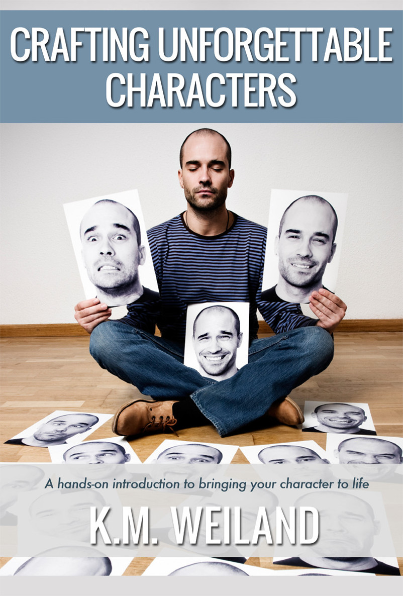
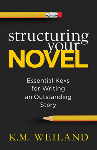

::: {}
<svg xmlns="http://www.w3.org/2000/svg" xmlns:xlink="http://www.w3.org/1999/xlink" version="1.1" width="100%" height="100%" viewbox="0 0 802 1186" preserveaspectratio="none">
`<image width="802" height="1186" xlink:href="cover.jpeg">`{=html}`</image>`{=html}
</svg>
:::

"The moment comes when a character does or says something you hadn't thought about. At that moment he's alive and you leave it to him."

---Graham Greene\

Introduction: Characters, the Most Important Facet of Your Story

 

A story is a composite of a thousand different pieces: plot, theme, action, dialogue, point of view, backstory, conflict, humor, pacing, setting, subtext---*ad infinitum*. Take one of these parts away, and the whole falls apart. But no one element is so vital as that of *character*. No matter how we dress them up in fancy new subgenres, no matter how many shocking plot twists we throw into the endings, no matter how complex and philosophical our themes, at the end of the day, stories will always be about people. The trick, of course, is making sure our stories feature people worth reading about.

Plot versus character is a hotly contested debate. Readers want thrilling, mind-tingling plots. They want to be wowed by the intricacies and the suspense. As a result, we can sometimes lose sight of the fact that plot is nothing without character. No character, no plot. You can conceive a gripping, brilliant plot, but unless you have the characters to back it up, most people couldn't care less.

In a February 2006 *Writer's Digest* article, legal suspense author James Scott Bell asserts that what makes characters unforgettable is the possession of "at least one of the following characteristics---grit, wit, and 'it.'" We love characters who are courageous, characters who are smart or funny, characters who have that special "star power," or what Bell described as "personal magnetism." But we also want characters that smack of realism. We want to read about people who are *real*, people who make us understand something about life that we may have missed and affirm things we already appreciate

So how do we go about creating these memorable personalities? In the following pages, you'll discover the basics of character building, as well as some tips for troubleshooting. You'll also discover writing prompts, creativity exercises, and inspiring quotes from successful authors.

The discussion of character is far too vast a subject to be covered in a 50-page e-book, but using the information herein, you'll have the tools you need to start making your latest batch of characters unforgettable.

\

Writing Prompt

Write a log line for each of your characters. A log line is the one sentence summary used to describe a plot and hook an agent or editor into reading more. Describe your character in a similar fashion: In one sentence, tell yourself who this character is and why readers are going to be interested in him.\

"First, place an instance of self talk very near your story's opening to immediately build characterization."

---Nancy Kress\

Interviewing Your Characters

 

How well do you know your characters? Like the back of my hand, you say? Do you know the color of your hero's eyes? Do you know where the bad guy went to college? Do you know your heroine's most embarrassing moment? Can you rattle off a list of your main character's idiosyncrasies? Typical expressions? Romantic history?

If any one of these questions has you fumbling for an answer, you're missing a prime opportunity to deepen your characters and expand your story. Over the years, one of the most useful tools I've run across is the "character interview." My own list started out as twenty or so basic questions regarding physical appearance and personality issues.

Now it contains over 100 precise and penetrating questions, designed to get my brain juices flowing and my characters talking.

The character interview has become a vital part of my outlining process. I'll often fill up half a notebook with narrative answers to the most probing questions about my characters' relationships, beliefs, and secrets. I refer to these lists constantly throughout the actual writing process, not only for on-the-spot inspiration, but for fact checking (How old was he when his mother died? Did he break his left or his right leg in that car accident?)

On the following pages, you'll find the list I've compiled for myself. Feel free to print and use it to get your own characters talking. But you might also want to keep in mind several other useful techniques, including the [enneagram](http://www.booklaurie.com/workshops_flaw.php), a personality test that aligns character traits to one of nine categories. Not only is it interesting reading, but it can also help round out a character and summarize his personality. Something I've found especially helpful is the "fatal flaw" that accompanies each personality.

Finally, should you run across a taciturn character who refuses to let you into his deeper psyche, try a "freehand interview." Instead of forcing your character into the rigidity of the set questions in a regular interview, just throw him onto the page and start asking him questions: *What's the matter with you? What are you hiding from me?* You might be surprised by the confessions you drag out of your characters.

All three of these tools can work miracles in breaking open the walls between author and character and forcing your characters to spill their guts and reveal their deepest motivations. Plus, it's grand fun!

 

**Character Interview**

Name:

Background:

Birthday:

Place of birth:

Parents:

What was important to the people who raised him:

Siblings:

Economic/social status growing up:

Ethnic background:

Places lived:

Current address and phone number:

Education:

Favorite subject in school:

Special training:

Jobs:

Salary:

Travel:

Friends:

How do people view this character:

Lives with:

Fights with:

Spends time with:

Wishes to spend time with:

Who depends on him and why:

What people does he most admire:

Enemies:

Dating, marriage:

Children:

Relationship with God:

Overall outlook on life:

Does this character like himself:

What, if anything, would he like to change about his life:

What personal demons haunt him:

Is he lying to himself about something:

Is he optimistic or pessimistic:

Morality level:

Confidence level:

How is he viewed by others:

Typical day:

Physical appearance:

Physical build:

Posture:

Head shape:

Eyes:

Nose:

Mouth:

Hair

Skin:

Tattoos/piercings/scars:

Voice:

What people notice first:

Clothing:

How would he describe himself:

What five words would he use to describe himself?

What five words would his best friend use?

Health/disabilities/handicaps:

Characteristics:

Personality type (choleric, sanguine, phlegmatic, melancholy):

Strongest/weakest character traits:

How can the flip side of his strong point be a weakness:

How much self-control and self-discipline does he have:

What makes him irrationally angry:

What makes him cry:

Fears:

Talents:

What people like best about him:

Interests and favorites:

Political leaning:

Collections:

Food, drink:

Music:

Books:

Movies:

Sports, recreation:

Did he play in school:

Color:

Best way to spend a weekend:

A great gift for this person:

Pets:

Vehicles:

What large possessions does he own (car, home, furnishings, boat, etc.) and which does he like best:

Typical expressions:

When happy:

When angry:

When frustrated:

When sad:

When afraid:

Idiosyncrasies:

Laughs or jeers at:

Ways to cheer up this person:

Ways to annoy this person:

Hopes and dreams:

How does he see himself accomplishing these dreams:

What's the worst thing he's ever done to someone and why:

Greatest success:

Biggest trauma:

Most embarrassing thing that ever happened to him:

What does he care about most in the world:

Does he have a secret:

If he could do one thing and succeed at it, what would it be:

He is the kind of person who:

What do you love most about this character:

Why will the reader sympathize with this person right away:

How is the character ordinary or extraordinary?

How is his situation ordinary or extraordinary?

Core Need:

Anecdote (Defining Moment):

History:\

Writing Prompt

Introduce your character from the POV of another player. What is the narrator's first impression of the character? What conclusions does he draw from the way the character dresses, handles his body, speaks to those around him? Are the narrator's conclusions correct? What does this tell you about both characters?\

"The best books come from someplace deep inside\.... Become emotionally involved. If you don't care about your characters, your readers won't either."

---Judy Blume\

Utilizing Character in Beginnings

 

If all of writing was as difficult as the first 50 pages, I probably would have wimped out years ago and found myself a new vocation (something easy and safe---like being a Walmart greeter or maybe the collector of the quarters from Laundromat machines). Despite the fact that, thanks to my outline, I already know every plot turn that will arrive in the pages to come, and that I've sketched my characters down to the most obscure detail, and that I've probably even imagined the half dozen splendid panegyrics that will appear on the glossy back cover---writing those first 50 pages is *always* a foray into dangerous and unknown territory.

It's no wonder, of course, that beginnings are difficult when you consider their weight in the overall story. Beginnings must accomplish all of the following:

 

- Give the readers a reason to care about what happens to the characters.
- Plant an irresistible hook.
- Introduce overall tone (satiric, dramatic, etc.).
- Introduce setting (time and place), conflict, and possibly theme.

 

In short, the beginning of every story is rather like a résumé. You flaunt your talents and hope the reader finds what he's looking for. Otherwise, you're never going to make it off the bookstore shelf.

*No problem,* you say. *I've got great characters and a killer plot. All I have to do is start writing.* Unfortunately, I've never met anyone who actually could do just that, although I suppose it's reasonable to suppose that the planet does possess a few such blessed writers. All I know is I'm not one of them. For me, as for the majority of novelists no matter their skill levels, beginnings are a tightrope act. And it's a long fall to the bottom if you miss your step.

So how, pray tell, does one go about avoiding that fatal misstep? Well, you write and you rewrite. And then you repeat.

Not what you were hoping to hear?

Me neither. So in the interest of keeping us both happy, allow me to throw out the single most helpful suggestion for a successful beginning:

Character.

Beginnings are all about character. If the reader doesn't find your character interesting, why should he stick around to follow this same boring character through the next 300 pages, no matter how brilliant your final plot twist may be? Readers aren't going to waste their time on characters who aren't brimming with life---and neither should we as writers. From the very first page, we have to give the readers a character they can't get out of their heads. But more important than just imbuing our cast with scintillating personalities and rapid-fire wit (although neither of these qualities should ever be underestimated), is giving the reader a reason to *care* about the characters.

Young authors are often encouraged to begin with action. The theory is that if you throw an obvious protagonist into a harrowing situation, the reader will love him just because he's in trouble. Not so. Someone in trouble may elicit a sympathetic response from me on a surface level. But to make me really concerned about what happens to this person, I first have to care about *him*.

Let's say we pick up a story that begins in the middle of a fistfight. Probably we will be at least marginally interested in what the fight is about. But we aren't going to particularly care who wins the fight unless we care about one of the contestants. Beginning the story with a fistfight is definitely a good idea (as opposed to, say, opening with the protagonist warming up before the fight), but unless you throw in a reason to make the reader care, you're probably sunk.

For years, I struggled with the idea of adding narrative to my openings. The "call to action," as it were, became a major stumbling block. My gut kept telling me I needed to introduce a *character*, not an event. I fought the idea, thinking I'd lose the reader's attention if I slowed down long enough to sketch a few important details about the protagonist. But it dawned on me, as I pondered this question, that I had *never* been turned off by a few artfully placed paragraphs of narrative in a beginning's opening. In fact, it was the straight action openings that completely turned me off.

Don't get me wrong: action (aka conflict) and suspense is the heart of any story and definitely an essential factor in a successful beginning. But, without a strong character introduction, action isn't going to be worth very much by itself.

This one facet of the beginning is the single most important factor, not just in opening a story, but in setting the tone for the entirety of the tale to follow. So what's the best way to introduce this dazzling character of yours, without overloading the reader with unnecessary facts? Following is a very nonexclusive list of suggestions that can be used, in any order and any combination:

 

- **Name the character.** Give the reader a name to build on. It's easier to sucker readers into caring for a character when they know his name. Obviously, this isn't a hard and fast rule, since numerous first-person narratives don't immediately name their characters (such as Daphne du Maurier's classic *Rebecca*, in which the main character is never named at all).
- **Show the character in a "classic moment."** If possible, use the opening scene to exemplify a part of the character's personality that will play a vital role later on. For instance, in my medieval novel [Behold the Dawn](http://www.amazon.com/gp/product/B00332FJEO/ref=as_li_ss_tl?ie=UTF8&camp=1789&creative=390957&creativeASIN=B00332FJEO&linkCode=as2&tag=httpwwwkmweil-20), I introduce my hero Marcus Annan, an infamous champion of the violent tourney games, in the midst of a competition in Italy.
- **Exemplify attitude.** Show the reader, through your character's words, actions, and internal narrative, how he views the world. Is he a cynic? An idealist? How does he view the conflict on which the story has opened?

 

Granted, character is only half of the delicate balancing act presented in a story's beginning. A good character in a boring story is still going to be about as flat as yesterday's soda. But if you can master the art of character introduction, you've already licked three quarters of the battle.

\

Writing Prompt

Write a short scene featuring your character in a "typical moment." Try to choose an activity that will allow your character to illustrate the core of his personality, as well as something that is a typical occurrence in his life. This doesn't mean you have to choose a mundane daily routine; if your character routinely gets into scrapes, his scrape could be something wildly out of the ordinary.\

"If your novel seems to be dragging, one of the first places to look is at the heart of your lead character. Is he giving up too easily? Has she been taking it too long? Are there too many scenes where he's thinking and not doing?"

---James Scott Bell\

**It's What Your Characters** Do **That Defines Them**

 

In the 2005 blockbuster hit *Batman Begins*, Bruce Wayne (Christian Bale) returns to Gotham City (ostensibly as an irresponsible playboy loser, and secretly as the unorthodox crime fighter known to the press and the public as Batman) and reencounters his old flame Assistant District Attorney Rachel Dawes (Katie Holmes). Rachel, who's not yet in the know about Bruce's alter ego, is unimpressed with his apparent apathy and superficiality. He attempts a cryptic explanation: "Inside, I am more." Rachel responds, "It's not who you are underneath. It's what you *do* that defines you."

What rings true for Batman also rings true for fictional characters everywhere. If we expect readers to take our characters seriously, if we expect them to be impressed, if we expect them to remember them long after the back cover has been closed---we can't rely on the characters' good intentions or impressive speeches. Just like Bruce Wayne, characters need to *do* something to prove themselves worth defining.

As writers, it's often very easy for us to talk on and on about our characters' intentions. If we're not careful, we often let our characters' mouths run away with them, as they spend chapter upon chapter sitting around discussing and planning their next move. But guess what? Most readers don't care about what your characters are *planning* to do. They only care when they actually do it.

This is so for a couple of reasons. Reason #1 is easily the most obvious, since it doesn't take a trigonometry professor to figure out that watching soldiers fighting in a battle is far more interesting than watching the politicians sit around in a boardroom discussing the battle. Action is always more attention grabbing than inaction. This isn't to say that scenes in the boardroom or periods of inaction are unacceptable---only that they need to be recognized for what they are and appropriately rationed.

The second reason is probably even more important. When we show our characters in action, we move beyond simply telling our readers who these people are ("Joe was a nice guy"), to the much more powerful plane of exhibiting the characters' actions and allowing readers to draw their own conclusions ("Joe emptied his wallet into the hand of the beggar on the corner").

Readers find it affirming when what they've been told about a character is proven by that character's actions. When we give our hero the opportunity to exhibit his bravery (or his cowardice), his empathy (or his selfishness), his brilliance (or his stupidity), we are doing more than just imparting the facts. We're bringing this character to life on the page. We're making him a living, breathing personality, who acts and reacts in a palpable way, just the same as the rest of us.

Seek out opportunities to let your character define himself by his actions. Don't let him stand around for pages, doing little more than talking or thinking. Shove him into the mayhem of life and force him to get his hands dirty. Create situations and scenes that will prove his strengths and his weaknesses, instead of forcing the reader to simply take your word for it. If you do, you'll emerge with a character---and a story---that's vibrant, visible, and memorable.

\

Writing Prompt

Names invariably carry certain preconceptions. (In fact, an entire name book was constructed to help parents--- and authors---choose a name based on what a survey revealed about the preconceptions connected to names: The Baby Name Survey Book by Bruce Lansky and Barry Sinrod.) Write down every preconception you have about your character's name. How can you effectively play on---or against---the stereotype? \

"A well-chosen name can evoke images and feelings in readers' minds before the character even walks on stage. Tolkien knew this. Doesn't 'Sauron' sound a bit like 'Satan'? And doesn't 'Frodo' remind us of that rotund, slow-moving, extinct bird, the dodo?"

---J.V. Jones

 

"Advice to young writers who want to get ahead without any annoying delays: don't write about Man, write about a man."

---E.B. White\

Creativity Exercise

Don't settle for obvious names. Look beyond Anglo-Saxon staples. A character named Gradikowski has a whole different set of possibilities from one named Griffith, even if you never discuss his ethnicity. Be wary of "hero" names---unless, of course, that's what you're going for. Naming every character something bold and adventurous dilutes the power of strong names.\

Naming Characters

 

Names are important. Mention a name, and instant preconceptions spring to mind. Although our names may not play a role in shaping our personalities, they certainly become a reflection of our background, our ethnicity, even our religion. They can even define our relationships. So it should come as no surprise that naming a character is probably the single most important moment in defining his personality and the role he will play in a story.

Names can prove both a tremendous stumbling block and a huge inspiration. For a long while, the hero of my fantasy [Dreamlander](http://www.amazon.com/gp/product/B00A9WU99Q/ref=as_li_ss_tl?ie=UTF8&camp=1789&creative=390957&creativeASIN=B00A9WU99Q&linkCode=as2&tag=httpwwwkmweil-20) was named Chris Foster. And for a long while, he refused to cooperate. He shuffled around, mumbled excuses, and was generally ineffective and callow. I changed his name to Chris Redston, and---presto chango!---strange and wonderful things started happening. Suddenly, I had an aggressive, swashbuckling hero on my hands. And all because of a simple name change.

I defy any parent to produce a more battered and dog-eared collection of name books than those I possess. (Unless, of course, you're a parent *and* an author.) I've spent many an hour thumbing through my collection of name books, skimming Internet name sites, and even blearing my eyes over the telephone book. I drive everyone around me crazy with my demands of "Help me think of a name." I read movie credits religiously, and I keep lists upon lists of names that strike my fancy. A character without a name---or, worse, a character with the wrong name---rankles in my brain like a mosquito bite I've sworn not to itch. As Mary O'Hara puts it in her *Making of a Novel*:

 

I work at their names awake and asleep, driving, resting, eating, visiting. For days or weeks I would struggle with one single character rightly to name him, actually a sort of mad seizure, shaking him by the throat--- "Tell me! Tell me! What is your name? Your real name?" \... For me, at least, the naming---right naming---is part of the very structure of the character. With the wrong name, the character looks wrong, talks wrong, does the wrong things.

 

I wish very much I had a magic equation to give you, to help you instantly find the perfect name for every character every time. But, in lieu of that, I offer a handful of the pointers I've always found helpful.

 

Avoid names that begin with the same letter.

It's been my policy (although admittedly not always strictly observed) to avoid using two names starting with the same letter in the same story. After being introduced to a character, most readers stop reading his name and simply recognize the character by the shape of the letters as their eyes skim over the page. If two characters share names that begin with the same letter---and particularly if the names are similar in size and shape---readers can easily misread and confuse them. For example, in *Dreamlander*, I had originally named one of my minor characters Choc. But when even I started confusing his name with my hero Chris's, I knew I had to change it.

 

Choose realistic names.

It's easy to get carried away with the naming game. Remember Anne Shirley and her penchant for outlandishly romantic names? Cordelia? Geraldine? Roselia De Vere? These names may have fit very well within Anne's romantic fantasies, but they would hardly have worked so well had L.M. Montgomery chosen to scatter them among her own characters.

Granted, some characters and some stories demand extraordinary names (can you imagine Dickens's *Christmas Carol* with a hero named Eric Schmidt?). But for the most part, it's much better to stray on the safer side and choose sensible, hard-working names. If you find yourself with a cast of characters who mostly bear names you've never run across in your own personal experience, you'd best hunker down and submit to inserting at least a couple Johns and Marys into the mix.

 

Choose historically and geographically accurate names.

In the same vein, it's also vital to seek out historically and geographically appropriate names. Because it's highly unlikely that a MacKensie Diaz would have been a lady-in-waiting to Queen Elizabeth I, the author of said MacKensie Diaz would be wise to change the name to something more fitting, lest she shove her readers right out of their bubble of suspended disbelief.

One of my characters in my historical western [A Man Called Outlaw](http://www.amazon.com/gp/product/B0033AHJPS/ref=as_li_ss_tl?ie=UTF8&camp=1789&creative=390957&creativeASIN=B0033AHJPS&linkCode=as2&tag=httpwwwkmweil-20) insisted her name was Aleis, but because I knew the name worked in neither the historical setting nor the geographical setting, I forced her into accepting Anna as a fair exchange.

 

Establish gender when using neutral names.

If you've chosen a gender-neutral name, such as Tracy or Drew or any other within the host of recent crossover names, be sure to immediately establish the character's gender. Don't open your story with a character named Kelly, only to reveal two paragraphs down that this Kelly person is actually a man.

 

Don't be afraid of changing names when necessary.

I very rarely nail my characters' names on the first attempt. In optimal situations, I have their names hammered down by the time I start the first draft, thus ensuring the names mesh perfectly with their personalities. But, despite my care, I inevitably find myself with at least one (six in my last project) character submitting an application for a name change.

This can be frustrating, not to mention perilous, when it occurs in the middle of the story. After all, the demand for a name change often signifies the necessity of some major overhauls in the character's general portrayal. But it's always worth the headache of dragging out the name books for one more go. A rose by any other name might smell as sweet, but a character with the wrong name causes one heck of a stink.

 

Name resources

- *The Greatest Baby Name Book Ever* by Carol McD. Wallace---A comprehensive and entertaining standby.

 

- *Character Naming Sourcebook* by Sherrilyn Kenyon---Organizes names alphabetically, by origin and popularity according to year.

 

- [Alchemist Name Generator](http://www.inkalicious.com/alchemist.html)---Generate forty random names (first and last) at a time.

 

- [Popular Baby Names](http://www.ssa.gov/OACT/babynames)---The Social Security Administration's records of baby names.

 

- [Behind the Name](http://www.behindthename.com/)---Provides the history and etymology of first names. Allows searches by meaning and includes a handy generator.

 

- [Victorian Era Names, A Writer's Guide](http://freepages.genealogy.rootsweb.ancestry.com/~poindexterfamily/OldNames.html)---Names from the turn of the century.

 

- [Fantasy Name Generator](http://www.rinkworks.com/namegen/)---Set the specifications to your needs and generate dozens of names at a time.

 

- [Sean Puckett---Random Word Generator](http://www.nexi.com/fun/rw/index.html)---According to the site: "\...if you want to generate some new girl's names, feed it a list of girls' names, and it will take them apart and discover how to make girls' names, then come up with a list of words that are very similar, but probably never before seen."\

- 

Writing Prompt

Think of the one action your character would never take. Then force him into a situation where he has no choice. What happens?\

Creativity Exercise

If you're stuck on a character and can't get him past 2-D into 3-D, try "casting" him. If your story were a movie, who would play this character? Assigning a flesh-and-blood person, complete with vocal and physical nuances, to your character might be just the trick for jumpstarting your imagination.\

"Try to key your descriptions to one or two features, an emotional sketch\.... Try recalling someone you met a long time ago; which features can you still visualize?"

---Anne Perry\

Describing Characters

 

Fiction once *began* with the face, with the act of observation of the faces of others. Does it still? It's arguable. I can imagine a skeptic wondering what difference it makes whether writers describe faces or not. Does anything of importance really hang in the balance? Who cares? Does it make any difference to the operations of the world? Who cares about the face anymore? Is reading the face still a survival skill \... and if so, for whom?

---Charles Baxter, *The Art of Subtext: Beyond Plot*

 

In recent years, a minimalist trend has surfaced regarding character descriptions. Common opinion these days states that physical descriptions are unnecessary, distracting, and even poor writing. "Dickens," these minimalists claim, "might have been able to get away with a page and a half of in-depth description, but that sort of verbosity is not only intolerable in modern fiction but even retroactively ridiculous." Having read far too many novelists who abuse and misuse the art of description, I'm in utter sympathy with whoever decided the character description was passé. But I'm not in agreement.

Most of the fuss over descriptions is primarily the result of two pitfalls:

 

**1.** Clichéd descriptions that add nothing to the characters, but rather render them as caricatures.

 

**2.** Inappropriate usage, placement, and emphasis.

 

Let me address these one at a time.

 

Clichés

The only reason any description deserves to be included in a novel is because it adds something vital to the narrative. A romantic heroine with Barbie blonde hair and a supermodel figure doesn't add much. Telling the reader the bad guy in a western is squinty-eyed, dark-browed, and narrow-lipped does nothing to bring freshness to the story. (But, of course, this is a problem that goes much deeper than description and finds its root in a clichéd *personality*.) But to take the other extreme and delete description entirely adds nothing either. You can't put *nothing* into a story, and expect the reader to gain *something*.

As readers, we read in order to be told about people other than ourselves. Can our understanding of these people really be complete without some concept of their appearance---and thus how other people perceive them and how they perceive themselves?

 

Inappropriate usage

Descriptions need not be long; sometimes a single detail can anchor a character more firmly in the reader's mind than a list of attributes two paragraphs long. Avoid "laundry lists" at all costs. Rattling off a character's hair color, eye color, height, and weight isn't going to bring the reader any closer to the character. Strive instead for "telling details" that highlight not only appearance but the character they represent.

As a child, I was fascinated with the phrase "Grecian nose" and felt quite sophisticated whenever I managed to work it into my stories. Never mind the fact that I had no idea what a Grecian nose looked like. I'm *still* not sure what it looks like, but I do know that it's a nonstarter as a descriptive aid, not only because it is unrecognizable to most readers, but because it brings nothing to the characterization table.

 

Inappropriate placement

I've heard the arguments that suggest readers don't like authors to describe characters because it interferes with the reader's preconceived image of the character. But I'm here to tell you that, as a reader myself, I want to know how the *writer* perceives the character. It is important, however, to make sure that the description is dropped into the narrative early enough to shape the reader's preconception. Don't wait until Chapter 15 to tell the reader that the hero is cross-eyed and has red- and green-striped hair.

 

Inappropriate emphasis

The amount of description we give any character needs to be in direct proportion to his importance in the story. Spending two paragraphs on a throwaway character will do nothing but misdirect---and probably frustrate---the reader. Outline your minor characters with one or two modifiers, and save your most impressive descriptive powers for the protagonists.

Character descriptions are great fun to craft, and when used correctly they can't help but hone the cutting edge of your story.

\

Writing Prompt

Force your character to work in a job in which he's terribly unsuited. How does he behave? Does he crumble under the pressure or rise to the occasion? Now put your character in a job at which he's excellent. How does his behavior differ?\

"Your goal isn't for the reader to say, 'Oh, so that's who she is,' but rather, 'Wow, who is that woman?'"

---Peter Gelfan\

Choosing Your Character's Career With Care

 

In the 1998 movie *Ever After*, the character Prince Henry (played by Dougray Scott) complains that "to be so defined by your position, to only be seen as what you are. You don't know how insufferable that is!" To which Drew Barrymore's character responds, "You might be surprised. A gypsy, for example, is rarely painted as anything else. They're defined by their status, as you are."

Like it or not, that's the truth. We're defined by what we do, by our jobs and our career choices. Mention a profession (mechanic, stock broker, bull rider), and definite images and presuppositions pop to mind. As writers, we can hardly afford not to take advantage of those presuppositions when crafting our characters. In the September 2009 issue of *The Writer*, Andre Dubus III pointed out:

 

I once heard a writer say that the *last* thing he does in the creation of a novel is to give his characters jobs. How, I wondered, can he ever begin to know them in their downtime if he doesn't know what they do all day (or night) first? ...our jobs say an awful lot about us on so many levels. They also influence what kinds of lives we end up living, what kind of people we're around, how we feel and think about ourselves in the world, etc.

 

Choosing your character's career should never be a slapdash decision, made on the fly and based on little more than impulse. What your character does for a living, even if it doesn't feature prominently in your story, will profoundly affect *who* he is and how he responds to the world around him. When writing my fantasy *Dreamlander*, I struggled for months with my main character Chris Redston. As a simple beat reporter, he just never seemed to have the guts and the panache I needed from him. But as soon as I tweaked his profession to make him a globe-trotting investigative journalist, his entire personality was instantly beefed up---even though he is never shown on the job in the book.

Sometimes, a career choice is so inherent to the plot that it's immediately obvious. In *A Man Called Outlaw*, my characters couldn't have been anything but ranchers. In *Behold the Dawn*, the story would have been entirely different had it focused on anyone but a competitor in the tourneys. However, there's no doubt that sometimes your character's career won't be central to your tale. In such instances, how do you go about selecting a career that will both define him and add to his character?

Bestselling mystery writer Elizabeth George, in her fantastic book *Write Away: One Novelist's Approach to Fiction and the Writing Life*, explains that she tries "...to give my characters either a job or a sideline that gives the reader a hint as to who they are." She encourages authors to look beyond the obvious (and often stereotyped) occupations. Instead of a doctor, why not a prosthetics manufacturer? Instead of a stock broker, why not a debt collector?

Browse the Yellow Pages for possible job matches for your character; keep your eyes open for interesting business signs as you drive through town; make a list of the careers of people whom you run across.

Choosing your character's career is a fun process that can often open up subplots and facets of personality you may never have thought of otherwise. Force yourself to look beyond the obvious, and don't always settle for the first notion that pops to mind. Just as you choose your own career with care, put the same amount of attention into choosing your characters' professions.\

Writing Prompt

Write a scene in which your main character does not appear, but in which two or more characters discuss him. Do you learn anything surprising about your character?\

"The character on the page determines the prose---its music, its rhythms, the range and limit of its vocabulary---yet, at the outset at least, I determine the character. It usually happens that the fictitious character, once released, acquires a life and will of his or her own, so the prose, too, acquires its own inexplicable fluidity. This is one of the reasons I write: to 'hear' a voice not quite my own, yet summoned forth by way of my own."

---Joyce Carol Oates

 

"\[Dickens had the\] power of making characters real existences, not by describing them but by letting them describe themselves."

---John Forster

 

"The moment you write a character who doesn't add to the story, you've written one too many."

---W.G. James\

What Dickens Can Teach Us About Complex Characters

 

In *Our Mutual Friend*, Charles Dickens's final completed novel, he presents for us one of his most comprehensive and well-rounded tales. Herein is all the darkness of *Hard Times*, the cynicism of *Martin Chuzzlewit*, but also the optimism and hopefulness of *David Copperfield* and *Nicholas Nickleby*. G.K. Chesterton wrote of *Our Mutual Friend* that it "marks a happy return to the earlier manner of Dickens at the end of Dickens's life."

In it, Dickens introduced the dark tale of a murdered heir and the unexpected turn of events that results when his body is fished from the Thames by unsavory "waterside character" Gaffer Hexam and his beautiful daughter Lizzie. The overarching greed of mankind, both the unabashed grasping of lowlife grubbers and the sophisticated cultivating of social climbers, runs rampant when a sketchy will leaves the entirety of the murdered man's fortune to two kindly and ridiculous servants, Mr. and Mrs. Boffin. As the "Golden Dustman" and his wife rise to wealth and power, they bring with them the victim's would-be fiancée---the beautiful and mercenary Bella Wilfer---and an earnest stranger---John Rokesmith---who pledges himself as secretary to the beleaguered Mr. Boffin.

Overflowing with subplots---including that of the *nouveau riche* Mr. and Mrs. Veneerings, naïvely determined to leave their mark on high society; the mismatched and conniving newlyweds Albert and Sophronia Lammle; the scheming Silas Wegg, hired by Mr. Boffin to read him *The Decline and Fall of the Roman Empire*; and Eugene Wrayburn and Bradley Headstone, the two unworthy young men who seek the favor of the lovely and modest Lizzie Hexam (and about whom I will have more to say in a bit)---*Our Mutual Friend* claims for itself a place among the most complex of Dickens's works---and at the same time one of the simplest. Nowhere is this better demonstrated than in his characters.

As a writer, to strive for and achieve complexities of character---both sympathetic and repulsive---is one of the highest marks of success. Without character, story is little more than a fixed narrative, a colorless journey from A to B. Without characters of *complexity*, a story is nothing more than a farce, a gaudy stereotype. And without characters of *realistic* complexity, a story lowers itself to the realm of the ridiculous and the pointless.

Although what Dickens offers us in *Our Mutual Friend* does at times dip into the unrealistic (such as when he asks readers to believe that the ingenuous Mr. Boffin is capable of sustaining a lengthy charade of miserliness), he has also given to classic literature several wonderfully complete characters.

The three that particularly stand out are Eugene Wrayburn and Bradley Headstone---the two men in love with Gaffer Hexam's daughter Lizzie---and Lizzie's young friend and protector, the crippled Jennie Wren.

Dickens---whose characters, although not always black and white, almost always give to the reader an immediate presupposition of their alignment in the story (good guy or bad guy)---bestows upon his readers a special treat in the creation of Wrayburn and Headstone. Both men are attracted to Lizzie Hexam's beauty, both men are selfish in their treatment of her (Wrayburn toys with her without ever intending to marry her; Headstone pursues her obsessively, even after she refuses his hand). But each man presents a complicated personality that leaves the reader wondering, *Do I like this man or not?*

Wrayburn is careless and indolent, telling his friend Mortimer Lightwood that he is undecided as to whether he will respond honorably to Lizzie Hexam or not. Upon being spurned, Headstone lashes out in jealous violence, swearing to Lizzie that he will destroy Wrayburn before that gentleman gains the opportunity to disgrace her.

Both also present their sympathetic sides: Wrayburn's kindness to Lizzie in comforting her after her father's death and in providing her the opportunity to educate herself reveal a better nature lurking beneath his ennui. He charms all those who know him with his jovial and playful antics, and he is deeply loved by his friend Mortimer Lightwood. In itself, perhaps, the love and attachment of the honorable Lightwood does more to win over the reader's affections than any particular act of Wrayburn's. For the writer, it is an interesting concept: If a character can be loved by another character, he will, at the very least, be found sympathetic by the reader.

Bradley Headstone, on the other hand, initially presents the aura of respectability. As the headmaster of the reputable school attended by Lizzie's younger brother Charley, he presents every indication of being a good and upright man, right down to his "decent black coat and waistcoat, and decent white shirt, and decent formal black tie, and decent pantaloons of pepper and salt, with his decent silver watch in his pocket and its decent hairguard round his neck." But from the beginning, the reader also glimpses the man's inflexibility. Although he genuinely wishes to raise Lizzie to the honorable estate of marriage, he never once considers her feelings in the matter. And when he realizes he has a rival in Eugene Wrayburn---a man who does not even trouble himself to reach Headstone's level of decency and respectability---the schoolmaster is driven into a state of insane rage.

He is never a likable character, and yet the reader is still able to maintain sympathy for him. While Wrayburn's intentions toward Lizzie remain ambiguous even to himself, Headstone never intends anything but propriety in his attentions to her. He is, at least initially, a more upright man than the cavalier Wrayburn, and when he is spurned in favor of such a man, he is understandably offended.

Headstone presents a fine archetypal villain: never likable, always understandable, and usually, even in his darkest moments, ever so slightly sympathetic.

Finally, we come to Jennie Wren, the young, deformed spitfire who, I feel, is the finest character in the book. A decidedly minor character, Jennie transforms her every scene with keen insight and acerbic wit. Dickens, with his perceptive eye for the grotesque and his fine sensibility for the fantastic, transformed the pathetic figure of an alcoholic's crippled daughter into a captivating and indomitable young woman.

The bare fact that her "back's so bad and \[her\] legs are so queer" is hardly enough to align her in the reader's affections. But add to that her determination to conquer life despite her handicaps (and their inevitable affect on other people, her peers in particular), her incisive wit, and her undeniable intelligence---and she presents a formidable scene-stealer.

Altogether, these three characters, along with an accompanying host of Dickens's trademark buffoons and archetypes, bring his final entry into the literary world to a level of sophistication not found in most of his earlier works.

\

Writing Prompt

Write a scene in which what your character doesn't do tells more about him than what he does do.\

Creativity Exercise

When you're digging into the heart of your character to discover his core motivation, help yourself out by assigning him a theme song. Sometimes the subliminal power of music upon our subconscious is more powerful than our logical left-sided brains.\

"If there is no possibility for change in a character, we have no interest in him."

---Flannery O'Connor\

The All-Important Link Between Theme and Character

 

Theme is a slippery concept. The prevailing wisdom among writers is that if you apply any deliberate force to your theme, you'll end up with a heavy-handed Aesop's fable. On the other hand, a story without a theme is shallow escapism at best and an unrealistic flop at worst. Theme is a hugely important factor in a memorable story. Vivid characters, witty dialogue, and killer plot twists can certainly carry a story by themselves, but without theme they will never deliver their full potential. And yet, no theme at all is often far better than a poorly delivered theme.

If you concentrate too much on theme, you risk alienating your audience through moralizing. But if you squelch all thoughts of theme, you're likely to rob your story of its central life force, its heartbeat, its *meaning*. So what's a writer to do?

The secret of theme lies entirely in the hands of your characters. As with almost every other aspect of story, character is the vital key to making your theme come to unforgettable life. Ultimately, theme is the lesson your characters will have learned (or failed to have learned) by the end of the story. Theme is inherent in your characters' struggles and, therefore, to the story itself. The best of themes well up effortlessly and even unconsciously from the heart of the characters' actions and reactions.

In Joseph Conrad's classic *Lord Jim*, the saga of a young sailor who is haunted by his one cowardly act, the theme could perhaps be summed up as the repercussions of betrayal. Because the theme is a natural outflowing of Jim's initial action (saving his own life instead of aiding his ship's drowning passengers) and his subsequent reactions (fleeing in shame, hiding out on an Indonesian island, and, ultimately, learning from his initial mistake and refusing to save his own life when the island comes under attack), Conrad's vicarious views on the subject can never be construed as moralizing or off point. Indeed, the theme is at the very heart of the novel. Without it, *Lord Jim* would merely have been a rambling tale featuring the journeys of an ambiguous and forgettable young man.

The key to strong theme is strong character progression. The changes your character undergoes in the chapters between the inciting incident and the climax will define your theme. But these changes *must* flow naturally from the characters. If Conrad hadn't presented Jim as an idealistic young man who desperately regretted his actions aboard the *Patna*, the ending in which Jim chooses to sacrifice himself on the island would never have rung true. It would have come across as forced and unrealistic. Conrad would have been guilty of moralizing---that blackest of authorial sins---and *Lord Jim* would certainly have never reached its classic status.

So how do you go about implementing theme? Or perhaps the better question would be---*should* you go about implementing theme? It's been my observation that most writers tend to avoid deliberate thoughts of theme in their first drafts. Then, typically somewhere in the middle of the novel, the characters will do or say something that suddenly dangles the scarlet thread of theme in front of the delighted author's nose.

While I personally wouldn't go so far as to ignore theme entirely (from the moment of a story's conception, I have my eyes stretched wide to catch that first glimpse of a possible theme), I do believe the single most important trick for capturing the sometimes elusive and always ephemeral theme is to pour myself into creating authentic characters who react to their various crucibles in authentic ways.

Before you start writing, make sure you're familiar with your stories "thematic questions." You may not know the answers yet, but being aware of the questions means you'll be more likely to recognize the answers when they appear. Below are some of these questions:

 

- **What's the main character's internal conflict?** (For most novels, this is a question that gets answered *very* early, since it will drive the entirety of the story.)

 

- **Which of the main character's views will change as a result of the story's events? How and why?** (This is where you'll find the underlying force of your theme. Your character's views will define his actions, and his actions will define the story.)

 

- **How will the main character demonstrate his respective views and attitudes at the beginning and the end of the story?** (This is an extension of the previous question, but it is vital because its answer will demonstrate the changes to the reader.)

 

- **Is there any particular symbolism that can reinforce the theme and the character's attitude toward it?** (Like theme itself, symbolism is often overstated and therefore generally better when culled organically from your unconscious mind. For example, sometimes you'll find yourself using a particular color or image to represent something; if the symbol proves effective, you can later go back and strengthen it throughout the story.)

 

- **How can I use the subtext (the unstated) to exemplify the theme, so I won't have to spell it out for the reader in so many words?** (When it comes to theme, the unstated is almost always more powerful than the direct. Often, in real life, when we find ourselves learning lessons and changing views, we can't immediately define the changes in precise language. And neither should your character. Lord Jim didn't have to *tell* us his actions on the island were a direct result of his earlier cowardice; it was obvious from the subtext and would, in fact, have weakened if Conrad had mentioned it outright).

 

Story without theme is like ice cream without milk. But to be effective, theme must be organic and, often, understated. Like all the finer points of writing, theme is an art, but one worth mastering.

\

Writing Prompt

Put your character in a situation in which he behaves badly without alienating the reader. It's tougher than you might think!\

"They say, best men are moulded out of faults...."

---William Shakespeare\

Likability Is Overrated

 

As writers, we want readers to love our characters. We want them to connect with the men and women who inhabit our stories. We want them to empathize so strongly that they are moved to laughter and to tears right along with these imaginary people we've created. So, naturally, we want our characters to be as likable as possible. Right?

Well, maybe not.

At first glance, it makes sense that the likability factor would be the single most important consideration a reader has in, well, *liking* a character. But I'm going to posit that likability is overrated.

When I was in the throes of writing my fantasy *Dreamlander*, I did my usual routine of worrying readers wouldn't like my hero. I wracked my brain, trying to come up with brilliant and dramatic ways of convincing them he was really worth their affection. But, ironically enough, when I decided to rewrite the story halfway through, I ended up scribbling "make Chris grumpier" on my notes for almost every scene. Why? Wouldn't it have been a better move to instruct myself to "make Chris nicer"?

Turns out likability, or niceness, is often the least important factor in convincing a reader your character is worth his time. Niceness is a dime a dozen. In fact, characters who ooze nothing but niceness are often saccharine, exasperating, and anything but charismatic. Think of a handful of the most memorable characters you've encountered in literature and film. I'm willing to bet a good-sized chunk of money that the characteristic that stands out most is not niceness. Rather, we connect with the characters who are *interesting*.

Such classic characters as Scarlett O'Hara, Sam Spade, Emma Woodhouse, and Philip "Pip" Pirrup have remained with us for decades, and longer, not because they were model citizens, but because they were fascinating in their realness and in their foibled humanity. To look at this from a personal vantage point, when I survey the hordes of characters who've tumbled out of my brain over the years, the ones who have garnered a chief place in my undying affection are the ones who are more than a little rough around the edges.

Dichotomies drive fiction. When we write characters who are fighting both their circumstances and their own natures, we create characters who are instantly real. And, thus, instantly interesting. Forget niceness. Niceness doesn't enchant readers and doesn't sell books. This doesn't mean, of course, that characters can't be good or moral. It doesn't mean the only hero worth reading about is the anti-hero. But nobody wants to read about perfection. What readers want is reality. And the reality is that imperfection is by far the more appealing option. A character's charisma is what draws readers back, not his likability.

So take a good, long look at your latest story and grab a few minutes to analyze your characters. Relinquishing your grip on likability will not only produce stronger characters, it will also up the conflict ante and squash clichés. Who knows, maybe you'll be scribbling "make Chris grumpier" all over your manuscripts too!

\

Creativity Exercise

Make a list of your favorite characters. Then make a list of the traits that made them your favorites (e.g., courage, compassion, intelligence, wit, etc.). How can you apply these traits to your own characters?

\

"I have always been more interested in creating a character that contains something crippled. I think nearly all of us have some kind of defect, anyway, and I suppose I have found it easier to identify with the characters who verge on hysteria, who were frightened of life, who were desperate to reach out to another person. But these seemingly fragile people are often the strong people really."

---Tennessee Williams

 

"Plot springs from character \... I've always sort of believed that these people inside me---these characters---know who they are and what they're about and what happens, and they need me to help get it down on paper because they don't type."

---Anne Lamott\

11 Dichotomous Characters---And Why They Work

 

Fiction writing doesn't offer many shortcuts or magic formulas. But today I am going to give you a secret ingredient in that coveted recipe for memorable and realistic characters. What is this ingredient? Dichotomy.

If we expect our characters to jump off the page into three-dimensional living color, we have to give them multifaceted personalities. Human personalities are wonderfully (and sometimes frustratingly) varied. No one is 100% good or 100% bad; there are multitudinous shades of gray in all of us. And so it should be with our characters. Take a look at the following list of classic characters and the dichotomies that made them so memorable.

 

**1. Long John Silver** in *Treasure Island* by Robert Louis Stevenson

You'd expect a treasure-hungry, bloodthirsty pirate to be bad right down to the tip of his peg leg, but few of these swashbuckling bad boys reached the legendary status Captain Silver attained thanks to his friendship with an upright youngster named Jim Hawkins. Silver may have been a nasty cutthroat, but his affection (and his actions to back it up, even when the going got tough) made him worth remembering.

 

**2. Aunt Abby & Aunt Martha Brewster** in *Arsenic and Old Lace* directed by Frank Capra

At the center of Capra's madcap classic are two of the sweetest little old ladies you're likely to find anywhere this side of your grandmother. In fact, they're so sweet viewers would be likely to pass them off as maudlin clichés---were it not for their unforgettable desire to help lonely old men... by poisoning them.

 

**3. Mr. Darcy** in *Pride & Prejudice* by Jane Austen

What discussion of dichotomous characters would be complete without mentioning the multi-faceted Mr. Darcy, whose brooding paradox of arrogance and bashfulness, tactlessness and generosity hoisted him to the top of the pile as one of literature's most fanatically loved characters?

 

**4. George Bailey** in *It's a Wonderful Life* directed by Frank Capra

Grumpy, disillusioned, dissatisfied George Bailey appears on our television screens every Christmas. He's an unhappy and even unlikable man for much of the movie, but what we love---what we keep coming back to see year after year---is the inherent goodness, the unfailing selflessness hidden away beneath all that grumbling. We resonate with George Bailey, because we see that same mixture of good and bad every time we look in the mirror.

 

**5. Alan Breck Stewart** in *Kidnapped* by Robert Louis Stevenson

Alan Breck Stewart, the brash Jacobite soldier, isn't most people's idea of a gentleman---anymore than he is protagonist David Balfour's. Rough and rude and crude as he may be, Stewart's last impression upon us is his unfailing honesty and integrity. But neither his brashness, nor his uprightness, would be nearly as memorable in isolation.

 

**6. Jack Aubrey** in the Aubrey/Maturin series by Patrick O'Brian

O'Brian's deft ability to sketch characters has given us the inherently flawed and inherently lovable lifelong royal seaman Jack Aubrey. Aubrey's brilliance at sea and in battle contrasted with his naïveté and even ineptitude regarding matters on land gives him a marvelous stamp of authenticity.

 

**7. Jason Bourne** in *The Bourne Identity* directed by Doug Liman

Killers with a conscience are perhaps one of the most common dichotomies in fiction. But few are as well rounded as the movie version of amnesiac assassin Jason Bourne. The entire story is driven by the question *Why would a man with an obviously integral sense of morality willingly choose to become a professional killer?*

 

**8. Mr. Magorium** in *Mr. Magorium's Wonder Emporium* by N.E. Bode and Juliana Baggott

This whimsical children's story is certainly a stretch on reality. But the age-old wisdom and the intrinsic innocence of toy-shop owner Mr. Magorium still resonates. How can a man who knows so much still maintain such a childlike sense of wonder and imagination? The question is never answered, but we end up being so fascinated by the character of Mr. Magorium that we hardly care.

 

**9. King Kong** in *King Kong* directed by Peter Jackson

The great ape of classic cinema may not be the best character ever put on film, but he remains memorable simply because he presented such a beautiful dichotomy: a primal, instinctive killer who bestowed his own version of kindness and gentleness on the one person he loved.

 

**10. Léon** in *Léon (The Professional)* directed by Luc Besson

More or less duped into being a killer for hire, émigré Léon lives a life of silence and loneliness, bestowing his affections only in his diligent care of his Japanese peace lily. Jean Reno's characterization gives us a brilliantly subtle character, whose seeming simplicity only adds deeper layers to what could have so easily been a cookie-cutter character.

 

**11. Tom Doniphon** in *The Man Who Shot Liberty Valance* directed by John Ford

Rough and ready homesteader Tom Doniphon rides roughshod over pretty much everybody, including his longtime girl Hallie. But when the cards are on the table and he has to choose between keeping Hallie and doing the right thing, he proves that what you see isn't always what you get.

\

About the Author

 

K.M. Weiland lives in make-believe worlds, talks to imaginary friends, and survives primarily on chocolate truffles and espresso. She is the author of the historical western [A Man Called Outlaw](http://www.amazon.com/gp/product/B0033AHJPS/ref=as_li_ss_tl?ie=UTF8&camp=1789&creative=390957&creativeASIN=B0033AHJPS&linkCode=as2&tag=httpwwwkmweil-20), the medieval epic [Behold the Dawn](http://www.amazon.com/gp/product/B00332FJEO/ref=as_li_ss_tl?ie=UTF8&camp=1789&creative=390957&creativeASIN=B00332FJEO&linkCode=as2&tag=httpwwwkmweil-20), and the fantasy [Dreamlander](http://www.amazon.com/gp/product/B00A9WU99Q/ref=as_li_ss_tl?ie=UTF8&camp=1789&creative=390957&creativeASIN=B00A9WU99Q&linkCode=as2&tag=httpwwwkmweil-20), as well as the Amazon bestsellers [Outlining Your Novel](http://www.amazon.com/gp/product/B005NAUKAC/ref=as_li_ss_tl?ie=UTF8&camp=1789&creative=390957&creativeASIN=B005NAUKAC&linkCode=as2&tag=httpwwwkmweil-20) and [Structuring Your Novel](http://www.amazon.com/gp/product/B00EJX08QA/ref=as_li_ss_tl?ie=UTF8&camp=1789&creative=390957&creativeASIN=B00EJX08QA&linkCode=as2&tag=httpwwwkmweil-20). When she's not making things up, she's busy mentoring other authors through her blog [Helping Writers Become Authors](http://www.helpingwritersbecomeauthors.com). She makes her home in western Nebraska. Visit her on her website [kmweiland.com](http://www.kmweiland.com), [Facebook](https://www.facebook.com/kmweiland.author), or [Twitter](https://twitter.com/KMWeiland) to participate in her Writing Question of the Day (#WQOTD). You can email her at km.weiland@ymail.com.

\

Can outlining help you write a better story?

 

 

[Buy now.](http://www.amazon.com/gp/product/B005NAUKAC/ref=as_li_ss_tl?ie=UTF8&camp=1789&creative=390957&creativeASIN=B005NAUKAC&linkCode=as2&tag=httpwwwkmweil-20)

 

"Not into outlining? Then someone did not demonstrate it for you the way Weiland has in her book. If you can make a quick trip grocery list, you can outline your next manuscript to benefit your process, using Weiland's guide."---Leslie Hultgren

\

Is structure the hidden foundation of all successful stories?

 

 

[Buy now.](http://www.amazon.com/gp/product/B00EJX08QA/ref=as_li_ss_tl?ie=UTF8&camp=1789&creative=390957&creativeASIN=B00EJX08QA&linkCode=as2&tag=httpwwwkmweil-20)

 

"I have long wished for a book like this. Structuring Your Novel is so much more than a writing craft book---it's a recipe to help writers structure a deep, meaningful journey for their hero that will captivate readers from beginning to end."---Angela Ackerman, Author of *The* *Emotion Thesaurus*
