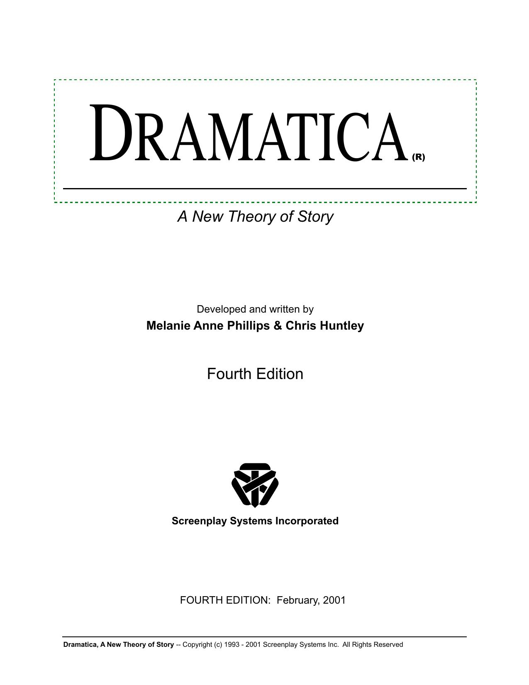
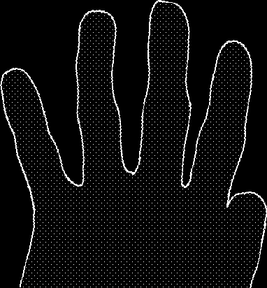

::: {}
<svg xmlns="http://www.w3.org/2000/svg" xmlns:xlink="http://www.w3.org/1999/xlink" version="1.1" width="100%" height="100%" viewbox="0 0 1275 1650" preserveaspectratio="none">
`<image width="1275" height="1650" xlink:href="cover.jpeg">`{=html}`</image>`{=html}
</svg>
:::

[DRAMATICA (R)](http://www.dramatica.com/)

 

*A New Theory of Story*

 

Developed and written by

 

**Melanie Anne Phillips & Chris Huntley**

 

Fourth Edition

 

**Screenplay Systems Incorporated**

 

FOURTH EDITION: February, 2001

 

**Dramatica, A New Theory of Story** \-- Copyright (c) 1993 - 2001 Screenplay Systems Inc. All Rights Reserved 1.

## *The Dramatica Theory was developed by Melanie Anne*

 

*Phillips and Chris Huntley and was not researched nor*

*based upon any other theories of story design or analysis.*

 

*NOTE: This special fourth edition is only available in*

*electronic form and differs from the third edition in one sig-*

*nificant aspect. Some of the terminology in this version has been updated to match the language changes made in the*

*4.0 version of the Dramatica software. Otherwise, this*

*version is comparable to the third edition published in 1996.*

 

Copyright Notice

Copyright © 1993, 1994, 1996, 2001 by Screenplay

Systems Incorporated. ALL RIGHTS RESERVED. No part of this publication may be reproduced, transmitted, tran-

scribed, stored in a retrieval system, or translated into any

human or computer language, in any form or by any means whatsoever, without the express written permission of

Screenplay Systems Incorporated, 150 East Olive Avenue, Suite 203, Burbank California 91502, United States of

America. Phone: (818) 843-6557. Internet Electronic Mail

[Address: DRAMATICA@SCREENPLAY.COM](mailto:dramatica@screenplay.com)

 

Trademarks

Dramatica is a trademark of Screenplay Systems Incor-

porated. Scriptor and Screenplay Systems are trademarks of Screenplay Systems Incorporated. References may be

made in this manual to \"Macintosh\"; this name is a trade-mark of Apple Computer, Inc. References may be made in

this manual to IBM and-Windows; this name is a trademark

of IBM &/or Microsoft, Inc. All other trademarks are held by their respective owners.

 

ISBN 0-918973-01-6 *Last updated: February 2, 2001*

 

**Dramatica, A New Theory of Story** \-- Copyright (c) 1993 - 2001 Screenplay Systems Inc. All Rights Reserved 2. ***A c k n o w l e d g m e n t s***

 

The authors would like to thank all those who have been

influential in guiding our paths and inspirational in shining a

light for us to follow. Though each of us can point to scores of such friends, relatives, associates and distant pioneers,

Chris would particularly like to thank Stephen Greenfield for bugging him (for 10 years!) about writing down the stuff in

this book, and Melanie would like to thank her mother,

whose brilliance laid the foundations for many of the insights that ultimately led to the Dramatica theory.

 

The concise and extensive support materials contained in

this book would not have been possible without the help and

input of many dedicated and insightful contributors. While gratefully acknowledging everyone\'s efforts, we would like to

give a special thank you to members of the industry who attended our early seminars, our compatriots in the aca-

demic community who reviewed and scrutinized our work for

accuracy. In addition, special thanks goes to Mark Haslett, who started as an intern with the Dramatica Project and

developed into a master of the theory, and contributed many side notes and corrections to this book. Finally, our deepest

appreciation to Sandy Stone, Mary Parrillo, Katy Monahan-

Huntley, and J.D. Cochran (associates with the Dramatica Project), and to all our friends and relatives who suffered our

long-winded requests for opinions of these materials per-haps more than we suffered in creating them. Our profound

gratitude to a gathering of great minds in support of a new

idea.

 

**Dramatica, A New Theory of Story** \-- Copyright (c) 1993 - 2001 Screenplay Systems Inc. All Rights Reserved 3.

## F O R E W O R D F O R E W O R D F O R E W O R D F O R E W O R D F O R E W O R D

( O N W A R D ) ( O N W A R D ) ( O N W A R D ) ( O N W A R D ) ( O N W A R D )

 

I know. You don\'t read forewords. You always skip them.

I understand.

Just don\'t skip this one.

*Looking at story in a new way is like*

*falling into a fast river of cold water*

*with all your clothing on: it\'s a big shock.*

 

Dramatica is a theory, a paradigm, a model, a philosophy of story.

It\'s got a different perspective on many of the ideas you may have already learned in books and classes on writing, or from the raw experience of writing.

*At first, you struggle,*

*intensely aware of your situation.*

*Will you get whisked away?*

*Smash head first into a rock?*

 

It takes some time to get used to Dramatica\'s unique perspective,

novel terminology, and dramatic concepts that predict relationships between character, theme, plot and genre.

*Kick off your shoes,*

*shed some of your excess clothing.*

*You can always get dressed later on.*

*Right now, you need to get accustomed*

*to your new environment.*

 

What is story? What are the underlying principles? The begin-

ning of this book introduces concepts about story that will amaze many, surprise others and confuse the rest (this is normal!).

*Shooting the rapids,*

*quite unsure if you\'re going to make it,*

*you dodge a few nasty-looking bounders.*

*Whew!*

 

Throughlines. Throughlines. Perspectives. Overall Story and

Subjective characters. Dynamic pairs. Contagonists. Thematic Issues. Where did all this stuff come from?

*A low branch, conveniently hanging over the water.*

*You reach for it as you get whisked*

*over the thundering waterfall,*

*sailing through thin air into\...*

 

**Dramatica, A New Theory of Story** \-- Copyright (c) 1993 - 2001 Screenplay Systems Inc. All Rights Reserved 4.

Storyforming. Story Encoding. Story Weaving. Story Recep-

tion. As you move through these Four Stages of Communication, things begin to look more familiar.

*\...a nice, calm, shallow pool of water.*

*You\'re alive!*

*Heck, the water\'s not cold --- it\'s refreshing.*

*You might even want to stay in for a while\...*

 

You begin to see how Dramatica can be used to accurately

describe story problems, fix faulty structure, and improve storytelling. Wow!

*\...As you paddle toward the shore,*

*you notice a group of familiar faces*

*applauding you: friends,*

*fellow writers, your agent.*

 

The journey to learn more about the mysterious art and craft of

creating stories is always worth the effort. As you approach the end of the book, much of what you\'ve read will come together. After the final page turns, I hope Dramatica will occupy a unique place in your heart and mind when considering this thing we call \"story.\"

*Your best friend extends a hand*

*to hoist you out of the water.*

*You\'re buck ass naked, but who cares?*

*You just had an adventure.*

 

Stephen Greenfield

President, Screenplay Systems

Chief Software Architect, Dramatica

 

**Dramatica, A New Theory of Story** \-- Copyright (c) 1993 - 2001 Screenplay Systems Inc. All Rights Reserved 5.

## ***TA B L E O F C O N T E N T S***

 

Acknowledgments \...\...\...\...\...\...\...\...\...\...\...\...\...\...\...\...\...\...\...\...\...\...\...\...\...\...\... 3

 

Foreword (Onward) \...\...\...\...\...\...\...\...\...\...\...\...\...\...\...\...\...\...\...\...\...\...\...\...\...\.... 4

 

Dramatica & the Creative Writer \...\...\...\...\...\...\...\...\... 13.

 

Grand Argument Stories \...\...\...\...\...\...\...\...\...\...\...\...\...\...\...\...\...\...\...\...\...\...\...\...\...\...\...\...\...\.... 14. The Scope of Dramatica \...\...\...\...\...\...\...\...\...\...\...\...\...\...\...\...\...\...\...\...\...\...\...\...\...\...\...\...\...\.... 16. Author\'s Intent \...\...\...\...\...\...\...\...\...\...\...\...\...\...\...\...\...\...\...\...\...\...\...\...\...\...\...\...\...\...\...\...\...\...\..... 17. When to Use Dramatica \...\...\...\...\...\...\...\...\...\...\...\...\...\...\...\...\...\...\...\...\...\...\...\...\...\...\...\...\...\.... 17. How this Book is Arranged \...\...\...\...\...\...\...\...\...\...\...\...\...\...\...\...\...\...\...\...\...\...\...\...\...\...\...\...\... 19.

 

*S e c t i o n 1 : T h e E l e m e n t s o f S t r u c t u r e*

 

Foundations \...\...\...\...\...\...\...\...\...\...\...\...\...\...\...\...\...\...\...\...\...\...\...\...\...\...\...\...\... 20.

The Story Mind \...\...\...\...\...\...\...\...\...\...\...\...\...\...\...\...\...\...\...\...\...\...\...\...\...\...\...\...\...\...\...\...\...\...\... 20. The Four Throughines \...\...\...\...\...\...\...\...\...\...\...\...\...\...\...\...\...\...\...\...\...\...\...\...\...\...\...\...\...\...\.... 21.

 

Character \...\...\...\...\...\...\...\...\...\...\...\...\...\...\...\...\...\...\...\..... 26.

 

Introduction to Characters \...\...\...\...\...\...\...\...\...\...\...\...\...\...\...\...\...\...\...\...\...\... 26.

The Hero is a Four Letter Word \...\...\...\...\...\...\...\...\...\...\...\...\...\...\...\...\...\...\...\...\...\...\...\...\...\..... 26. Overall Story and Subjective Characters \...\...\...\...\...\...\...\...\...\...\...\...\...\...\...\...\...\...\...\...\...\... 27.

 

Overall Story Characters \...\...\...\...\...\...\...\...\...\...\...\...\...\...\...\...\...\...\...\...\...\..... 28.

Archetypal Characters \...\...\...\...\...\...\...\...\...\...\...\...\...\...\...\...\...\...\...\...\...\...\...\...\...\...\...\...\.... 28. Protagonist \...\...\...\...\...\...\...\...\...\...\...\...\...\...\...\...\...\...\...\...\...\...\...\...\...\...\...\...\...\...\...\...\...\...\... 28. Antagonist \...\...\...\...\...\...\...\...\...\...\...\...\...\...\...\...\...\...\...\...\...\...\...\...\...\...\...\...\...\...\...\...\...\...\.... 29. Reason & Emotion \...\...\...\...\...\...\...\...\...\...\...\...\...\...\...\...\...\...\...\...\...\...\...\...\...\...\...\...\...\...\... 30. Sidekick & Skeptic \...\...\...\...\...\...\...\...\...\...\...\...\...\...\...\...\...\...\...\...\...\...\...\...\...\...\...\...\...\...\.... 31. Guardian & Contagonist \...\...\...\...\...\...\...\...\...\...\...\...\...\...\...\...\...\...\...\...\...\...\...\...\...\...\...\.... 31.

Complex Characters \...\...\...\...\...\...\...\...\...\...\...\...\...\...\...\...\...\...\...\...\...\...\...\...\...\...\...\...\...\...\...\.... 33.

Drivers and Passengers \...\...\...\...\...\...\...\...\...\...\...\...\...\...\...\...\...\...\...\...\...\...\...\...\...\...\...\.... 34.

Drivers \...\...\...\...\...\...\...\...\...\...\...\...\...\...\...\...\...\...\...\...\...\...\...\...\...\...\...\...\...\...\...\...\...\...\...\...\...\...\.... 35. Passengers \...\...\...\...\...\...\...\...\...\...\...\...\...\...\...\...\...\...\...\...\...\...\...\...\...\...\...\...\...\...\...\...\...\...\...\...\... 36. Drivers and Passengers in \"Star Wars\" \...\...\...\...\...\...\...\...\...\...\...\...\...\...\...\...\...\...\...\...\...\..... 37.

Archetypes in \"Star Wars\" \...\...\...\...\...\...\...\...\...\...\...\...\...\...\...\...\...\...\...\...\...\...\...\...\...\...\.... 37.

Drivers and Passengers in \"The Wizard of Oz\" \...\...\...\...\...\...\...\...\...\...\...\...\...\...\...\...\...\..... 38.

Archetypes in \"The Wizard of Oz\" \...\...\...\...\...\...\...\...\...\...\...\...\...\...\...\...\...\...\...\...\...\...\.... 38.

Drivers and Passengers in \"Jaws\" \...\...\...\...\...\...\...\...\...\...\...\...\...\...\...\...\...\...\...\...\...\...\...\...\.... 39.

Archetypes in \"Jaws\" \...\...\...\...\...\...\...\...\...\...\...\...\...\...\...\...\...\...\...\...\...\...\...\...\...\...\...\...\...\... 39.

 

**Dramatica, A New Theory of Story** \-- Copyright (c) 1993 - 2001 Screenplay Systems Inc. All Rights Reserved 6.

Action and Decision Elements of Drivers and Passengers \...\...\...\...\...\...\...\...\...\...\...\..... 41.

Recap of Archetypals \...\...\...\...\...\...\...\...\...\...\...\...\...\...\...\...\...\...\...\...\...\...\...\...\...\...\...\...\..... 41. Splitting Archetypes into Action and

Decision Characteristics \...\...\...\...\...\...\...\...\...\...\...\...\...\...\...\...\...\...\...\...\...\...\...\...\...\...\...\.... 42. Split Archetypes in Quads \...\...\...\...\...\...\...\...\...\...\...\...\...\...\...\...\...\...\...\...\...\...\...\...\...\...\.... 44.

The 16 Motivation Elements in \"Star Wars\" \...\...\...\...\...\...\...\...\...\...\...\...\...\...\...\...\...\...\...\..... 45. The 16 Motivation Elements in \"The Wizard of Oz\" \...\...\...\...\...\...\...\...\...\...\...\...\...\...\...\..... 46. The 16 Motivation Elements in \"Jaws\" \...\...\...\...\...\...\...\...\...\...\...\...\...\...\...\...\...\...\...\...\...\...\.... 49. Grouping the 16 Motivation Elements \...\...\...\...\...\...\...\...\...\...\...\...\...\...\...\...\...\...\...\...\...\...\.... 50. \"Star Wars\" Characters in Four Motivation Quads \...\...\...\...\...\...\...\...\...\...\...\...\...\...\...\...\... 52. \"Oz\" Characters in Four Motivation Quads \...\...\...\...\...\...\...\...\...\...\...\...\...\...\...\...\...\...\...\...\... 53. \"Jaws\" Characters in Four Motivation Quads \...\...\...\...\...\...\...\...\...\...\...\...\...\...\...\...\...\...\..... 55. Complex Motivation Characteristics \...\...\...\...\...\...\...\...\...\...\...\...\...\...\...\...\...\...\...\...\...\...\...\.... 56.

Rules for Building Characters? \...\...\...\...\...\...\...\...\...\...\...\...\...\...\...\...\...\...\...\...\...\...\...\..... 56.

Complex Characters in \"Gone With the Wind\" \...\...\...\...\...\...\...\...\...\...\...\...\...\...\...\...\...\...\... 58. Complex Motivation Characters in \"Real Window\" \...\...\...\...\...\...\...\...\...\...\...\...\...\...\...\...\... 60.

Principal Characters in \"Rear Window\" \...\...\...\...\...\...\...\...\...\...\...\...\...\...\...\...\...\...\...\..... 60. Characteristic Lists in \"Rear Window\" \...\...\...\...\...\...\...\...\...\...\...\...\...\...\...\...\...\...\...\...\.... 61.

Other Character Dimensions \...\...\...\...\...\...\...\...\...\...\...\...\...\...\...\...\...\...\...\...\...\...\...\...\...\...\...\... 63. The Sixty-Four Element Question \...\...\...\...\...\...\...\...\...\...\...\...\...\...\...\...\...\...\...\...\...\...\...\...\.... 65. Mapping the Archetypal Pattern \...\...\...\...\...\...\...\...\...\...\...\...\...\...\...\...\...\...\...\...\...\...\...\...\...\.... 66. Archetypal Methodologies \...\...\...\...\...\...\...\...\...\...\...\...\...\...\...\...\...\...\...\...\...\...\...\...\...\...\...\...\.... 67. Complex Dimensional Patterns \...\...\...\...\...\...\...\...\...\...\...\...\...\...\...\...\...\...\...\...\...\...\...\...\...\..... 68.

 

Subjective Characters \...\...\...\...\...\...\...\...\...\...\...\...\...\...\...\...\...\...\...\...\...\...\...\... 70.

The Main Character: One of A Kind \...\...\...\...\...\...\...\...\...\...\...\...\...\...\...\...\...\...\...\...\...\...\...\.... 71. Subjective Characters in the Overall Story \...\...\...\...\...\...\...\...\...\...\...\...\...\...\...\...\...\...\...\...\... 74. The Crucial Element \...\...\...\...\...\...\...\...\...\...\...\...\...\...\...\...\...\...\...\...\...\...\...\...\...\...\...\...\...\...\...\.... 75.

 

Problem Solving and Justification \...\...\...\...\...\...\...\...\...\...\...\...\...\...\...\...\...\... 77.

What are Justifications? \...\...\...\...\...\...\...\...\...\...\...\...\...\...\...\...\...\...\...\...\...\...\...\...\...\...\...\.... 77. What is Problem Solving? \...\...\...\...\...\...\...\...\...\...\...\...\...\...\...\...\...\...\...\...\...\...\...\...\...\...\.... 78.

Why we Justify \...\...\...\...\...\...\...\...\...\...\...\...\...\...\...\...\...\...\...\...\...\...\...\...\...\...\...\...\...\...\...\...\... 80. A Simple Example of Problem Solving \...\...\...\...\...\...\...\...\...\...\...\...\...\...\...\...\...\...\...\...\... 81. Defining the Problem \...\...\...\...\...\...\...\...\...\...\...\...\...\...\...\...\...\...\...\...\...\...\...\...\...\...\...\...\...\... 84.

The Justified Main Character \...\...\...\...\...\...\...\...\...\...\...\...\...\...\...\...\...\...\...\...\...\...\...\...\..... 86.

 

Theme \...\...\...\...\...\...\...\...\...\...\...\...\...\...\...\...\...\...\...\...\...\.... 88.

 

What Exactly IS Theme? \...\...\...\...\...\...\...\...\...\...\...\...\...\...\...\...\...\...\...\...\...\.... 88.

Describing the Story\'s Problem \...\...\...\...\...\...\...\...\...\...\...\...\...\...\...\...\...\...\...\...\...\...\...\..... 89. Chart of Dramatica Classes \...\...\...\...\...\...\...\...\...\...\...\...\...\...\...\...\...\...\...\...\...\...\...\...\...\.... 89. Throughlines \...\...\...\...\...\...\...\...\...\...\...\...\...\...\...\...\...\...\...\...\...\...\...\...\...\...\...\...\...\...\...\...\...\... 90. Chart of Dramatica Types \...\...\...\...\...\...\...\...\...\...\...\...\...\...\...\...\...\...\...\...\...\...\...\...\...\...\.... 92. Concerns \...\...\...\...\...\...\...\...\...\...\...\...\...\...\...\...\...\...\...\...\...\...\...\...\...\...\...\...\...\...\...\...\...\...\...\... 93. Chart of Dramatica Variations \...\...\...\...\...\...\...\...\...\...\...\...\...\...\...\...\...\...\...\...\...\...\...\...\.... 94.

 

**Dramatica, A New Theory of Story** \-- Copyright (c) 1993 - 2001 Screenplay Systems Inc. All Rights Reserved 7.

Issues \...\...\...\...\...\...\...\...\...\...\...\...\...\...\...\...\...\...\...\...\...\...\...\...\...\...\...\...\...\...\...\...\...\...\...\...\..... 96. Chart of Dramatica Elements \...\...\...\...\...\...\...\...\...\...\...\...\...\...\...\...\...\...\...\...\...\...\...\...\..... 98. Problems \...\...\...\...\...\...\...\...\...\...\...\...\...\...\...\...\...\...\...\...\...\...\...\...\...\...\...\...\...\...\...\...\...\...\...\... 98.

 

Matching Points of View to the Chart \...\...\...\...\...\...\...\...\...\...\...\...\...\...\..... 101.

Overall Story Throughline \...\...\...\...\...\...\...\...\...\...\...\...\...\...\...\...\...\...\...\...\...\...\...\...\...\..... 102. Main Character Throughline \...\...\...\...\...\...\...\...\...\...\...\...\...\...\...\...\...\...\...\...\...\...\...\...\..... 105. Impact Character Throughline \...\...\...\...\...\...\...\...\...\...\...\...\...\...\...\...\...\...\...\...\...\...\...\..... 107. Subjective Story Throughline \...\...\...\...\...\...\...\...\...\...\...\...\...\...\...\...\...\...\...\...\...\...\...\...\... 109.

 

Throughlines and Beyond \...\...\...\...\...\...\...\...\...\...\...\...\...\...\...\...\...\...\...\...\.... 111.

Concerns \...\...\...\...\...\...\...\...\...\...\...\...\...\...\...\...\...\...\...\...\...\...\...\...\...\...\...\...\...\...\...\...\...\...\.... 112. Issues \...\...\...\...\...\...\...\...\...\...\...\...\...\...\...\...\...\...\...\...\...\...\...\...\...\...\...\...\...\...\...\...\...\...\...\...\... 114.

Problems \...\...\...\...\...\...\...\...\...\...\...\...\...\...\...\...\...\...\...\...\...\...\...\...\...\...\...\...\...\...\...\...\...\...\.... 116.

The Thematic Argument \...\...\...\...\...\...\...\...\...\...\...\...\...\...\...\...\...\...\...\...\...\.... 117.

Premise and the Thematic Argument \...\...\...\...\...\...\...\...\...\...\...\...\...\...\...\...\...\...\...\...\... 117.

 

Additional Story Points \...\...\...\...\...\...\...\...\...\...\...\...\...\...\...\...\...\...\...\...\...\...\... 121.

 

Plot \...\...\...\...\...\...\...\...\...\...\...\...\...\...\...\...\...\...\...\...\...\...\.... 124.

 

Plot vs. Storyweaving \...\...\...\...\...\...\...\...\...\...\...\...\...\...\...\...\...\...\...\...\...\...\..... 124.

 

Plot Story Points \...\...\...\...\...\...\...\...\...\...\...\...\...\...\...\...\...\...\...\...\...\...\...\...\...\... 125.

Goal \...\...\...\...\...\...\...\...\...\...\...\...\...\...\...\...\...\...\...\...\...\...\...\...\...\...\...\...\...\...\...\...\...\...\...\...\...\... 126. Requirements \...\...\...\...\...\...\...\...\...\...\...\...\...\...\...\...\...\...\...\...\...\...\...\...\...\...\...\...\...\...\...\...\... 127. Consequences \...\...\...\...\...\...\...\...\...\...\...\...\...\...\...\...\...\...\...\...\...\...\...\...\...\...\...\...\...\...\...\.... 127. Forewarnings \...\...\...\...\...\...\...\...\...\...\...\...\...\...\...\...\...\...\...\...\...\...\...\...\...\...\...\...\...\...\...\...\... 127. Dividends \...\...\...\...\...\...\...\...\...\...\...\...\...\...\...\...\...\...\...\...\...\...\...\...\...\...\...\...\...\...\...\...\...\...\... 128. Costs \...\...\...\...\...\...\...\...\...\...\...\...\...\...\...\...\...\...\...\...\...\...\...\...\...\...\...\...\...\...\...\...\...\...\...\...\.... 128. Prerequisites \...\...\...\...\...\...\...\...\...\...\...\...\...\...\...\...\...\...\...\...\...\...\...\...\...\...\...\...\...\...\...\...\.... 128. Preconditions \...\...\...\...\...\...\...\...\...\...\...\...\...\...\...\...\...\...\...\...\...\...\...\...\...\...\...\...\...\...\...\...\... 128.

Plot Progression \...\...\...\...\...\...\...\...\...\...\...\...\...\...\...\...\...\...\...\...\...\...\...\...\...\.... 130.

Acts \...\...\...\...\...\...\...\...\...\...\...\...\...\...\...\...\...\...\...\...\...\...\...\...\...\...\...\...\...\...\...\...\...\...\...\...\...\...\...\.... 132.

Another View: 3 Act Progressions \...\...\...\...\...\...\...\...\...\...\...\...\...\...\...\...\...\...\...\...\...\.... 133.

Sequences \...\...\...\...\...\...\...\...\...\...\...\...\...\...\...\...\...\...\...\...\...\...\...\...\...\...\...\...\...\...\...\...\...\...\...\..... 135.

Three Act Progressions \...\...\...\...\...\...\...\...\...\...\...\...\...\...\...\...\...\...\...\...\...\...\...\...\...\...\...\... 137. Four Act Progressions \...\...\...\...\...\...\...\...\...\...\...\...\...\...\...\...\...\...\...\...\...\...\...\...\...\...\...\..... 137.

Scenes \...\...\...\...\...\...\...\...\...\...\...\...\...\...\...\...\...\...\...\...\...\...\...\...\...\...\...\...\...\...\...\...\...\...\...\...\...\..... 138.

What\'s in a Scene? \...\...\...\...\...\...\...\...\...\...\...\...\...\...\...\...\...\...\...\...\...\...\...\...\...\...\...\...\...\... 138. Characters in Scenes \...\...\...\...\...\...\...\...\...\...\...\...\...\...\...\...\...\...\...\...\...\...\...\...\...\...\...\...\... 138.

Events \...\...\...\...\...\...\...\...\...\...\...\...\...\...\...\...\...\...\...\...\...\...\...\...\...\...\...\...\...\...\...\...\...\...\...\...\...\...\... 140.

Events and Throughlines \...\...\...\...\...\...\...\...\...\...\...\...\...\...\...\...\...\...\...\...\...\...\...\...\...\...\... 140. Events Masquerading as Scenes \...\...\...\...\...\...\...\...\...\...\...\...\...\...\...\...\...\...\...\...\...\...\... 140.

 

**Dramatica, A New Theory of Story** \-- Copyright (c) 1993 - 2001 Screenplay Systems Inc. All Rights Reserved 8.

Genre \...\...\...\...\...\...\...\...\...\...\...\...\...\...\...\...\...\...\...\...\...\... 141.

 

Modes of Expression \...\...\...\...\...\...\...\...\...\...\...\...\...\...\...\...\...\...\...\...\...\...\..... 142.

Grid of Dramatica Genres \...\...\...\...\...\...\...\...\...\...\...\...\...\...\...\...\...\...\...\...\...\...\...\...\...\..... 143.

 

*S e c t i o n 2 : T h e A r t o f S t o r y t e l l i n g*

 

Foundations \...\...\...\...\...\...\...\...\...\...\...\...\...\...\...\...\...\...\...\...\...\...\...\...\...\...\...\.... 149.

The Four Stages of Communication \...\...\...\...\...\...\...\...\...\...\...\...\...\...\...\...\...\...\...\...\...\...\..... 150.

 

Stage 1: Storyforming \...\...\...\...\...\...\...\...\...\...\...\...\.... 153.

 

Introduction to Storyforming \...\...\...\...\...\...\...\...\...\...\...\...\...\...\...\...\...\...\...\.... 153.

Inspiration \...\...\...\...\...\...\...\...\...\...\...\...\...\...\...\...\...\...\...\...\...\...\...\...\...\...\...\...\...\...\...\...\...\...\... 153. Structure \...\...\...\...\...\...\...\...\...\...\...\...\...\...\...\...\...\...\...\...\...\...\...\...\...\...\...\...\...\...\...\...\...\...\..... 153. Communication \...\...\...\...\...\...\...\...\...\...\...\...\...\...\...\...\...\...\...\...\...\...\...\...\...\...\...\...\...\...\...\... 154.

 

Character Dynamics \...\...\...\...\...\...\...\...\...\...\...\...\...\...\...\...\...\...\...\...\...\...\...\... 155.

Resolve: Change or Steadfast? \...\...\...\...\...\...\...\...\...\...\...\...\...\...\...\...\...\...\...\...\...\...\.... 157. Growth: Stop or Start? \...\...\...\...\...\...\...\...\...\...\...\...\...\...\...\...\...\...\...\...\...\...\...\...\...\...\...\... 158. Approach: Do-er or Be-er? \...\...\...\...\...\...\...\...\...\...\...\...\...\...\...\...\...\...\...\...\...\...\...\...\...\... 160. Mental Sex: Male or Female? \...\...\...\...\...\...\...\...\...\...\...\...\...\...\...\...\...\...\...\...\...\...\...\.... 161.

 

Plot Dynamics \...\...\...\...\...\...\...\...\...\...\...\...\...\...\...\...\...\...\...\...\...\...\...\...\...\...\.... 163.

Driver: Action or Decision? \...\...\...\...\...\...\...\...\...\...\...\...\...\...\...\...\...\...\...\...\...\...\...\...\...\... 164.

Limit: Timelock or Optionlock? \...\...\...\...\...\...\...\...\...\...\...\...\...\...\...\...\...\...\...\...\...\...\...\... 165. Outcome: Success or Failure? \...\...\...\...\...\...\...\...\...\...\...\...\...\...\...\...\...\...\...\...\...\...\...\... 166. Judgment: Good or Bad? \...\...\...\...\...\...\...\...\...\...\...\...\...\...\...\...\...\...\...\...\...\...\...\...\...\..... 166.

 

Storyforming Structural Story Points \...\...\...\...\...\...\...\...\...\...\...\...\...\...\...\... 167.

Selecting the Throughlines in Your Story \...\...\...\...\...\...\...\...\...\...\...\...\...\...\...\...\...\...\... 167. Picking the Proper Classes for the Throughlines in Your Story \...\...\...\...\...\...\...\... 170.

 

Selecting Plot Story Points \...\...\...\...\...\...\...\...\...\...\...\...\...\...\...\...\...\...\...\...\... 175.

Static Plot Story Points \...\...\...\...\...\...\...\...\...\...\...\...\...\...\...\...\...\...\...\...\...\...\...\...\...\...\...\...\...\.... 175. Progressive Plot Story Points \...\...\...\...\...\...\...\...\...\...\...\...\...\...\...\...\...\...\...\...\...\...\...\...\...\...\... 185.

Acts \...\...\...\...\...\...\...\...\...\...\...\...\...\...\...\...\...\...\...\...\...\...\...\...\...\...\...\...\...\...\...\...\...\...\...\...\...\... 186.

Selecting Thematic Story Points \...\...\...\...\...\...\...\...\...\...\...\...\...\...\...\...\...\... 188.

 

Selecting Character Story Points \...\...\...\...\...\...\...\...\...\...\...\...\...\...\...\...\..... 191.

Change Characters and the Crucial Element \...\...\...\...\...\...\...\...\...\...\...\...\...\...\...\...\... 192.

 

**Dramatica, A New Theory of Story** \-- Copyright (c) 1993 - 2001 Screenplay Systems Inc. All Rights Reserved 9.

Steadfast Characters and the Crucial Element \...\...\...\...\...\...\...\...\...\...\...\...\...\...\...\... 193.

 

Stage 2: Storyencoding \...\...\...\...\...\...\...\...\...\...\...\..... 194.

 

Introduction to Storyencoding \...\...\...\...\...\...\...\...\...\...\...\...\...\...\...\...\...\...\.... 194.

 

Encoding Overall Story Characters \...\...\...\...\...\...\...\...\...\...\...\...\...\...\...\..... 197.

Archetypal Characters \...\...\...\...\...\...\...\...\...\...\...\...\...\...\...\...\...\...\...\...\...\...\...\...\...\...\...\..... 198. Complex Characters \...\...\...\...\...\...\...\...\...\...\...\...\...\...\...\...\...\...\...\...\...\...\...\...\...\...\...\...\.... 201.

 

Encoding Subjective Characters \...\...\...\...\...\...\...\...\...\...\...\...\...\...\...\...\...\... 204.

The Main Character is not necessarily the Protagonist \...\...\...\...\...\...\...\...\...\...\...\... 204. Encoding Mental Sex \...\...\...\...\...\...\...\...\...\...\...\...\...\...\...\...\...\...\...\...\...\...\...\...\...\...\...\...\... 205.

 

Encoding Theme \...\...\...\...\...\...\...\...\...\...\...\...\...\...\...\...\...\...\...\...\...\...\...\...\...\... 208.

Encoding the Overall Story Theme \...\...\...\...\...\...\...\...\...\...\...\...\...\...\...\...\...\...\...\...\...\... 209. Encoding Theme for the Other Throughlines \...\...\...\...\...\...\...\...\...\...\...\...\...\...\...\...\... 210.

 

Encoding Plot \...\...\...\...\...\...\...\...\...\...\...\...\...\...\...\...\...\...\...\...\...\...\...\...\...\...\..... 214.

Encoding Progressive Plot Story Points \...\...\...\...\...\...\...\...\...\...\...\...\...\...\...\...\...\...\...\...\..... 215.

Signposts and Journeys \...\...\...\...\...\...\...\...\...\...\...\...\...\...\...\...\...\...\...\...\...\...\...\...\...\...\..... 215. Main Character Throughline Plot Progression \...\...\...\...\...\...\...\...\...\...\...\...\...\...\...\.... 218. Impact Character Throughline Plot Progression \...\...\...\...\...\...\...\...\...\...\...\...\...\...\.... 220. Subjective Story Throughline Plot Progression \...\...\...\...\...\...\...\...\...\...\...\...\...\...\...\... 223.

 

Encoding Genre \...\...\...\...\...\...\...\...\...\...\...\...\...\...\...\...\...\...\...\...\...\...\...\...\...\.... 226.

 

Medium & Format \...\...\...\...\...\...\...\...\...\...\...\...\...\...\...\...\...\...\...\...\...\...\...\...\.... 226.

 

Stage 3: Storyweaving \...\...\...\...\...\...\...\...\...\...\...\...\... 227.

 

Storyweaving and Structure \...\...\...\...\...\...\...\...\...\...\...\...\...\...\...\...\...\...\...\.... 228.

Storyweaving Static Story Points \...\...\...\...\...\...\...\...\...\...\...\...\...\...\...\...\...\...\...\...\...\...\...\...\.... 231. Storyweaving Characters \...\...\...\...\...\...\...\...\...\...\...\...\...\...\...\...\...\...\...\...\...\...\...\...\...\...\...\...\... 232.

Storyweaving and Storytelling \...\...\...\...\...\...\...\...\...\...\...\...\...\...\...\...\...\...\.... 233.

Spatial Techniques \...\...\...\...\...\...\...\...\...\...\...\...\...\...\...\...\...\...\...\...\...\...\...\...\...\...\...\...\...\...\...\..... 233.

Building Size \...\...\...\...\...\...\...\...\...\...\...\...\...\...\...\...\...\...\...\...\...\...\...\...\...\...\...\...\...\...\...\...\.... 233. Red Herrings \...\...\...\...\...\...\...\...\...\...\...\...\...\...\...\...\...\...\...\...\...\...\...\...\...\...\...\...\...\...\...\...\.... 233. Meaning Reversals \...\...\...\...\...\...\...\...\...\...\...\...\...\...\...\...\...\...\...\...\...\...\...\...\...\...\...\...\...\... 233. Message Reversals \...\...\...\...\...\...\...\...\...\...\...\...\...\...\...\...\...\...\...\...\...\...\...\...\...\...\...\...\...\... 234.

Temporal Techniques \...\...\...\...\...\...\...\...\...\...\...\...\...\...\...\...\...\...\...\...\...\...\...\...\...\...\...\...\...\...\.... 234.

Building Importance \...\...\...\...\...\...\...\...\...\...\...\...\...\...\...\...\...\...\...\...\...\...\...\...\...\...\...\...\..... 234. Non-Causality \...\...\...\...\...\...\...\...\...\...\...\...\...\...\...\...\...\...\...\...\...\...\...\...\...\...\...\...\...\...\...\...\... 234. Out of Sequence Experiences \...\...\...\...\...\...\...\...\...\...\...\...\...\...\...\...\...\...\...\...\...\...\...\.... 235. Flashbacks and Flash-forwards \...\...\...\...\...\...\...\...\...\...\...\...\...\...\...\...\...\...\...\...\...\...\..... 235.

 

Storyweaving Tips \...\...\...\...\...\...\...\...\...\...\...\...\...\...\...\...\...\...\...\...\...\...\...\...\.... 237.

 

**Dramatica, A New Theory of Story** \-- Copyright (c) 1993 - 2001 Screenplay Systems Inc. All Rights Reserved 10.

Tips for Short Stories \...\...\...\...\...\...\...\...\...\...\...\...\...\...\...\...\...\...\...\...\...\...\...\...\...\...\...\...\...\...\.... 237. Tips for Episodic Television Series \...\...\...\...\...\...\...\...\...\...\...\...\...\...\...\...\...\...\...\...\...\...\...\.... 238.

Characters in Episodic Series \...\...\...\...\...\...\...\...\...\...\...\...\...\...\...\...\...\...\...\...\...\...\...\..... 238. Plot in Episodic Series \...\...\...\...\...\...\...\...\...\...\...\...\...\...\...\...\...\...\...\...\...\...\...\...\...\...\...\.... 239. Theme in Episodic Series \...\...\...\...\...\...\...\...\...\...\...\...\...\...\...\...\...\...\...\...\...\...\...\...\...\..... 240. Genre in Episodic Series \...\...\...\...\...\...\...\...\...\...\...\...\...\...\...\...\...\...\...\...\...\...\...\...\...\...\.... 240.

Tips for Multi-Story Ensemble Series

and Soap Operas \...\...\...\...\...\...\...\...\...\...\...\...\...\...\...\...\...\...\...\...\...\...\...\...\...\...\...\...\...\...\... 241.

Tips for Novels \...\...\...\...\...\...\...\...\...\...\...\...\...\...\...\...\...\...\...\...\...\...\...\...\...\...\...\...\...\...\...\...\...\..... 243. Tips for Motion Pictures \...\...\...\...\...\...\...\...\...\...\...\...\...\...\...\...\...\...\...\...\...\...\...\...\...\...\...\...\...\... 244.

The Rule of Threes \...\...\...\...\...\...\...\...\...\...\...\...\...\...\...\...\...\...\...\...\...\...\...\...\...\...\...\...\...\... 244. Hand-offs \...\...\...\...\...\...\...\...\...\...\...\...\...\...\...\...\...\...\...\...\...\...\...\...\...\...\...\...\...\...\...\...\...\...\.... 245.

 

Stage 4: Story Reception \...\...\...\...\...\...\...\...\...\...\..... 248.

 

About the Audience \...\...\...\...\...\...\...\...\...\...\...\...\...\...\...\...\...\...\...\...\...\...\...\..... 248.

Writing for Oneself \...\...\...\...\...\...\...\...\...\...\...\...\...\...\...\...\...\...\...\...\...\...\...\...\...\...\...\...\...\...\...\..... 250.

The Author as Main Character \...\...\...\...\...\...\...\...\...\...\...\...\...\...\...\...\...\...\...\...\...\...\...\.... 250.

Writing for Groups \...\...\...\...\...\...\...\...\...\...\...\...\...\...\...\...\...\...\...\...\...\...\...\...\...\...\...\...\...\...\...\...\... 252. A Quick Lesson in Propaganda \...\...\...\...\...\...\...\...\...\...\...\...\...\...\...\...\...\...\...\...\...\...\...\...\...\... 253. Adaptation \...\...\...\...\...\...\...\...\...\...\...\...\...\...\...\...\...\...\...\...\...\...\...\...\...\...\...\...\...\...\...\...\...\...\...\..... 260.

 

::: {}
:::

## Epilogue

 

The Leftovers \...\...\...\...\...\...\...\...\...\...\...\...\...\...\...\...\...\...\.... 266.

 

Is That All There Is? \...\...\...\...\...\...\...\...\...\...\...\...\...\...\...\...\...\...\...\...\...\...\...\...\...\...\...\...\...\...\...\... 266.

 

Constructive Criticism \...\...\...\...\...\...\...\...\...\...\...\...\..... 268.

 

Jurassic Park: *Building a Better Dinosaur \...\...\...\...\...\...\...\...\...\...\...\...\...\...\...\...\...\...\...\....* 268.

 

Dramatica Reference Material

 

1 Vocabulary \...\...\...\...\...\...\...\...\...\...\...\...\...\...\...\...\...\...\.... 275.

Vocabulary Grammar \...\...\...\...\...\...\...\...\...\...\...\...\...\...\...\...\...\...\...\...\...\...\...\...\...\...\...\...\...\...\.... 275. Dramatica Vocabulary\...\...\...\...\...\...\...\...\...\...\...\...\...\...\...\...\...\...\...\...\...\...\...\...\...\...\...\...\...\...\... 278. Dramatica Synonyms \...\...\...\...\...\...\...\...\...\...\...\...\...\...\...\...\...\...\...\...\...\...\...\...\...\...\...\...\...\...\... 331.

 

2 Semantic Items \...\...\...\...\...\...\...\...\...\...\...\...\...\...\...\...\... 336.

Semantic List \...\...\...\...\...\...\...\...\...\...\...\...\...\...\...\...\...\...\...\...\...\...\...\...\...\...\...\...\...\...\...\...\...\...\.... 336. Classes \...\...\...\...\...\...\...\...\...\...\...\...\...\...\...\...\...\...\...\...\...\...\...\...\...\...\...\...\...\...\...\...\...\...\...\...\...\.... 336. Types \...\...\...\...\...\...\...\...\...\...\...\...\...\...\...\...\...\...\...\...\...\...\...\...\...\...\...\...\...\...\...\...\...\...\...\...\...\...\.... 336.

 

**Dramatica, A New Theory of Story** \-- Copyright (c) 1993 - 2001 Screenplay Systems Inc. All Rights Reserved 11.

Variations \...\...\...\...\...\...\...\...\...\...\...\...\...\...\...\...\...\...\...\...\...\...\...\...\...\...\...\...\...\...\...\...\...\...\...\...\.... 337. Elements \...\...\...\...\...\...\...\...\...\...\...\...\...\...\...\...\...\...\...\...\...\...\...\...\...\...\...\...\...\...\...\...\...\...\...\...\..... 338.

 

3 Structural Models \...\...\...\...\...\...\...\...\...\...\...\...\...\...\...\... 339.

The Dramatica Structural Model \...\...\...\...\...\...\...\...\...\...\...\...\...\...\...\...\...\...\...\...\...\...\...\...\..... 339. 4 Classes \...\...\...\...\...\...\...\...\...\...\...\...\...\...\...\...\...\...\...\...\...\...\...\...\...\...\...\...\...\...\...\...\...\...\...\...\.... 340. 16 Types \...\...\...\...\...\...\...\...\...\...\...\...\...\...\...\...\...\...\...\...\...\...\...\...\...\...\...\...\...\...\...\...\...\...\...\...\..... 341. 64 Variations \...\...\...\...\...\...\...\...\...\...\...\...\...\...\...\...\...\...\...\...\...\...\...\...\...\...\...\...\...\...\...\...\...\...\..... 342. 64 Elements \...\...\...\...\...\...\...\...\...\...\...\...\...\...\...\...\...\...\...\...\...\...\...\...\...\...\...\...\...\...\...\...\...\...\...\... 343.

 

**Dramatica, A New Theory of Story** \-- Copyright (c) 1993 - 2001 Screenplay Systems Inc. All Rights Reserved 12.

Dramatica and the Dramatica and the Dramatica and the Dramatica and the Dramatica and the

 

 

Creative Writer Creative Writer Creative Writer Creative Writer Creative Writer

 

**A Place to Start**

 

Mastering the craft of writing requires a skill in communication and a flair for style.

Through communication, an audience receives meaning. Through style, an author achieves impact. The Dramatica theory of story explores both aspects of the writing

process providing structural guidelines for clarifying communication and artistic tech-

niques for enhancing style.

Accordingly, this book is divided into two principal sections: *The Elements of Struc-*

*ture* and *The Art of Storytelling*. Separating these two aspects of the writing craft allows us to see more deeply into each. This arrangement also splits the experience of writing

into two parts, when in practice, they are usually blended in a simultaneous effort.

Many other books have been written which explore the blended creative process. In contrast, this is a book of theory, and is designed more to educate, than to inspire. Still,

the motivation to write is one of inspiration. So, before we rush headlong into a de-tailed, accurate, and revolutionary explanation of story, let us put everything in context

by describing the relationship of Dramatica with the Creative Writer.

 

**Communication**

 

The process of communication requires at least two parties: the originator and the

recipient. In addition, for communication to take place, the originator must be aware of

the information or feelings he wishes to transmit, and the recipient must be able to determine that meaning.

Similarly, storytelling requires an author and an audience. And, to tell a story, one

must have a story to tell. Only when an author is aware of the message he wishes to impart can he determine how to couch that message so it will be accurately received.

 

**Dramatica, A New Theory of Story** \-- Copyright (c) 1993 - 2001 Screenplay Systems Inc. All Rights Reserved 13.

It should be noted that an audience is more than a passive participant in the storytelling process. When we write the phrase, \"It was a dark and stormy night,\" we

have communicated a message, albeit a nebulous one. In addition to the words, an-other force is at work creating meaning in the reader\'s mind. The readers themselves

may have conjured up memories of the fragrance of fresh rain on dry straw, the trem-

bling fear of blinding explosions of lightning, or a feeling of contentment that recalls a soft fur rug in front of a raging fire. But all we wrote was, \"It was a dark and stormy

night.\" We mentioned nothing in that phrase of straw or lightning or fireside memories. In fact, once the mood is set, the less said, the more the audience can imagine. Did the

audience imagine what we, the authors, had in mind? Not likely. Did we communicate?

Some. We communicated the idea of a dark and stormy night. The audience, however, did a lot of creating on its own. Did we tell a story? Definitely not!

 

**Grand Argument Stories**

 

The question arises: Is telling a story better than telling a non-story? No. Stories are not \"better\" than any other form of communication --- just different. To see this

difference we need to define \"story\" so we can tell what a story is and what it is not.

Herein lies a political problem. No matter how one defines \"story,\" there will be an author someplace who finds his favorite work has been defined out, and feels it is

somehow diminished by not being classified as a story. Rather than risk the ire of countless creative authors, we have limited our definition to a very special kind of story:

the Grand Argument Story.

As its name indicates, a Grand Argument Story presents an argument. To be Grand, the argument must be a complete one, covering all the ways the human mind might

consider a problem and showing that only one approach is appropriate to solving it. Obviously, this limits out a lot of creative, artistic, important works --- but not out of being

stories, just out of being Grand Argument Stories. So, is a Grand Argument Story better

than any other kind? No. It is just a specific kind.

 

**Dramatica, A New Theory of Story** \-- Copyright (c) 1993 - 2001 Screenplay Systems Inc. All Rights Reserved 14.

**What\'s In A Grand Argument Story?**

A Grand Argument Story is a conceptually *complete* story with

both an emotional and logical comprehensiveness. There are a number of qualities which determine whether a story is a Grand

Argument or not. These are seen in the story\'s Structure, Dynam-

ics, Character, Theme, Plot, and Genre.

**Structure**: the underlying relationship between the parts of a

story describe its structure. A Grand Argument Story has a very

specific structure which will be explored thoroughly in the first half of this book entitled *The Elements of Structure*.

**Dynamics**: the moving, growing, or changing parts of a story

describe its dynamics. A Grand Argument Story has eight essential

dynamics which are explored in the second half of this book entitled

*The Art of Storytelling*.

**Character**: Grand Argument Stories deal with two types of

Characters: Overall Story Characters and Subjective Characters. These Characters provide the audience with the experience of

moving through the story in both a passionate and an intellectual

sense.

**Theme**: Theme, in a Grand Argument Story, is tied to every

structural and dynamic element. Theme provides the various bi-

ases and perspectives necessary to convey the story\'s subject matter or meaning.

**Plot**: Plot in a Grand Argument Story is the sequence in which a

story\'s thematic structure is explored. Plot details the order in which

dramatic elements must occur within that story.

**Genre**: Genre in a Grand Argument Story classifies the

audience\'s experience of a story in the broadest sense. Genre

takes into account the elements of structure, dynamics, character, plot, and theme to define significant differences between various

complete Grand Argument Stories.

These parts of a Grand Argument Story combine in complex

relationships to create its Storyform. A Storyform is like a blueprint

which describes how these parts shall relate in a particular story ,

regardless of how they are symbolized for the audience. It is such a Storyform which allows such different stories as West Side Story

and Romeo and Juliet, or Cyrano de Bergerac and Roxanne to share the same meaning while bearing little resemblance to each

other. What these two pairs of stories share is virtually the same

Storyform.

 

**Dramatica, A New Theory of Story** \-- Copyright (c) 1993 - 2001 Screenplay Systems Inc. All Rights Reserved 15. **The Free-form Author**

 

While some authors write specifically to make an argument to an audience, many others write because they want to follow their personal muse. Sometimes writing is a

catharsis, or an exploration of self. Sometimes authoring is a sharing of experiences, fragmented images, or just of a point of view. Sometimes authoring is marking a path

for an audience to follow, or perhaps just presenting emotional resources the audience

can construct into its own vision. Interactive communications question the validity of a linear story itself, and justifiably so. There are many ways to communicate, and each

has just as much value as the next *depending upon how one wishes to affect one\'s audience.*

 

**The Scope of Dramatica**

 

With all these forms of communication, isn\'t Dramatica severely limited in addressing only the Grand Argument Story? No. The Grand Argument model described by Dra-

matica functions to present all the ways a mind can look at an issue. As a result, all other forms of communication will be using the same pieces, just in different combina-

tions, sequences, or portions. In our example, we indicated that the less we said, the

more the audience could use its imagination. A Grand Argument Story says it all. Every point is made, even if hidden obscurely in the heart of an entertainment. Other forms of

communication use \"slices\" of the model, chunks, or levels. Even if an author is un-aware of this, the fact that human minds share common essential concepts means that

the author will be using concepts and patterns found in the Dramatica model.

 

**Symbolizing Concepts**

 

It has been argued that perhaps the symbols we use are what create concepts, and therefore no common understanding between cultures, races, or times is possible.

Dramatica works because indeed there ARE common concepts: *morality*, for example.

Morality, a common concept? Yes. Not everyone shares the same definition of morality, but every culture and individual understands some concept that means \"morality\" to

them. In other words, the concept of \"morality\" may have many different meanings --- depending on culture or experience --- but they all qualify as different meanings of

\"morality.\" Thus there can be universally shared essential concepts even though they

drift apart through various interpretations. It is through this framework of essential concepts that communication is possible.

 

**Communicating Concepts Through Symbols**

 

How can essential concepts be communicated? Certainly not in their pure, intuitive

form directly from mind to mind. (Not yet, anyway!) To communicate a concept, an

 

**Dramatica, A New Theory of Story** \-- Copyright (c) 1993 - 2001 Screenplay Systems Inc. All Rights Reserved 16. author must symbolize it, either in words, actions, juxtapositions, interactions --- in some form or another. As soon as the concept is symbolized, however, it becomes culturally

specific and therefore inaccessible to much of the rest of the world.

Even within a specific culture, the different experiences of each member of an audi-

ence will lead to a slightly different interpretation of the complex patterns represented by

intricate symbols. On the other hand, it is the acceptance of common symbols of com-munication that defines a culture. For example, when we see a child fall and cry, we do

not need to know what language he speaks or what culture he comes from in order to understand what has happened. If we observe the same event in a story, however, it

may be that in the author\'s culture a child who succumbs to tears is held in low esteem.

In that case, then the emotions of sadness we may feel in our culture are not at all what was intended by the author.

 

**Author\'s Intent**

 

Simply having a feeling or a point of view does not an author make. One becomes

an author the moment one establishes an intent to communicate. Usually some intrigu-ing setting, dialog, or bit of action will spring to mind and along with it the desire to share

it. Almost immediately, most authors leap ahead in their thinking to consider how the

concept might best be presented to the audience. In other words, even before a com-plete story has come to mind most authors are already trying to figure out how to tell the

parts they already have.

As a result, many authors come to the writing process carrying a lot of baggage:

favorite scenes, characters, or action, but no real idea how they are all going to fit to-

gether. A common problem is that all of these wonderful inspirations often don\'t belong in the same story. Each may be a complete idea unto itself, but there is no greater

meaning to the sum of the parts. To be a story, each and every part must also function as an aspect of the whole.

Some writers run into problems by trying to work out the entire dramatic structure of

a story in advance only to find they end up with a formulaic and uninspired work. Con-versely, other writers seek to rely on their muse and work their way through the process

of expressing their ideas only to find they have created nothing more than a mess. If a way could be found to bring life to tired structures and also to knit individual ideas into a

larger pattern, both kinds of authors might benefit. It is for this purpose that Dramatica

was developed.

 

**When to Use Dramatica**

 

For some authors, applying Dramatica at the beginning of a creative project might be

inhibiting. Many writers prefer to explore their subject, moving in whatever direction their muse leads them until they eventually establish an intent. In this case, the

storytelling comes before the structure. After the first draft is completed, such an author

 

**Dramatica, A New Theory of Story** \-- Copyright (c) 1993 - 2001 Screenplay Systems Inc. All Rights Reserved 17. can look back at what he has created with the new understanding he has arrived at by the end. Often, much of the work will no longer fit the story as the author now sees it.

By telling Dramatica what he *now* intends, Dramatica will be able to indicate which parts of the existing draft are appropriate, which are not, and what may be needed that is

currently missing. In this way, the creative process is both free and fulfilling, with Dra-

matica serving as analyst and collaborator.

 

**Following the Muse**

 

A number of authors write with no intent at all. They apply themselves to recording their journey through a topic or subject or simply wander, musing. The resulting work is

almost always open to all kinds of interpretation, yet may elicit strong emotions and conclusions in virtually everyone who observes the work. Even when an author mean-

ders, he does so with the same mental tools everyone shares. So although no intended

message might be conveyed, the subconscious patterns of the author\'s mental pro-cesses are recorded in the work. For those authors who prefer a more freeform ap-

proach, the concept of a Grand Argument Story is generally useless. It is not that the Dramatica model cannot describe the nature of their communication. Rather, a freeform

author simply has no need of it.

 

**Dramatica as a Tool**

 

None of the creative techniques an author might use are better or worse than others. They are simply different approaches to the creative process. The key is to find the

ones that work for you. Sometimes what works is not to create a full argument, but to

break the rules, shatter expectations, and play with the minds of your audience mem-bers. Even here Dramatica can help. Because it defines a complete argument, Dra-

matica can assist in predicting the effect that breaking an argument will have on the message going to the audience: it can describe how the communication has been

altered. When all is said and written, Dramatica provides authors with a tool for under-

standing the process of communication, if and when they want it.

 

**Dramatica, A New Theory of Story** \-- Copyright (c) 1993 - 2001 Screenplay Systems Inc. All Rights Reserved 18. ***H o w T h i s B o o k I s A r r a n g e d***

 

Part of what makes a story great is its underlying dramatic structure and part is the manner in which that structure is related to an audience, often called \"storytelling\".

Therefore, this book is divided into two principal sections: *The Elements of Structure*

and *The Art of Storytelling.*

In The Elements of Structure you will explore the essential components that occur in

all complete stories as they appear in *Character*, *Theme*, *Plot*, and *Genre*. In the Art of

Storytelling you will examine the Four Stages of Communication that occur between an author and an audience: *Storyforming*, *Storyencoding*, *Storyweaving*, and *Reception*.

By the time you have finished, you will have gained a whole new understanding of

what stories are and a whole new set of tools for creating them.

For a glimpse of how some of Dramatica\'s basic concepts can be employed to

improve a story, you might want to take a look at a constructive criticism of the motion picture Jurassic Park appearing in the Epilogue section.

You will note that the majority of examples provided in this book are drawn from

motion pictures. This stems from the authors\' personal backgrounds in the motion picture industry. Dramatica, however, is a theory of story --- *not* a theory of screenplay.

All of the dramatic concepts presented here are equally applicable to any medium of story expression.

***Note about Pronoun Usage:*** Some characters are best looked at by their dramatic

functions. To help keep this perspective, we use the impersonal pronoun \"it\" when referring to such characters. Other characters are best explored in terms of their

growth. To help draw the reader into a closer relationship with such a character, we use the personal pronoun, \"he\".

Earlier editions of this book used \"she\" as the personal pronoun. Because of this

uncommon usage, readers were jarred out of a relationship with personal characters, rather than being drawn in, defeating our purpose. As a result, this edition employs

masculine pronouns.

 

**Dramatica, A New Theory of Story** \-- Copyright (c) 1993 - 2001 Screenplay Systems Inc. All Rights Reserved 19.

Section One: Section One: Section One: Section One: Section One:

 

 

The Elements of Structure The Elements of Structure The Elements of Structure The Elements of Structure The Elements of Structure

 

***Foundations***

 

**Central Concepts**

 

In Dramatica, there are some central concepts that prove immediately useful. Pre-senting these up front reveals the practical side of the theory and provides a firm foun-

dation for more in-depth explorations to come.

These central concepts are:

 

1. The Story Mind

2. The Four Throughlines

3. The Overall Story Throughline

4. The Main Character Throughline

5. The Impact Character Throughline

6. The Subjective Story Throughline

7. The Grand Argument Story

 

**The Story Mind**

 

One of the unique concepts that sets Dramatica apart from all other theories is the assertion that every complete story is a model of the mind\'s problem solving process.

This *Story Mind* does not work like a computer, performing one operation after another

until the solution is obtained. Rather, it works more holistically, like our own minds, bringing many conflicting considerations to bear on the issue. It is the author\'s argu-

ment as to the relative value of these considerations in solving a particular problem that gives a story its meaning.

To make his case, an author must examine all significant approaches to resolving

the story\'s specific problem. If a part of the argument is left out, the story will have holes. If the argument is not made in an even-handed fashion, the story will have incon-

sistencies.

 

**Dramatica, A New Theory of Story** \-- Copyright (c) 1993 - 2001 Screenplay Systems Inc. All Rights Reserved 20.

Characters, Plot, Theme, and Genre are the different *families* of considerations in the Story Mind made tangible, so audience members can see them at work and gain

insight into their own methods of solving problems. Characters represent the motiva-tions of the Story Mind (which often work at cross purposes and come into conflict).

Plot documents the problem solving methods employed by the Story Mind. Theme

examines the relative worth of the Story Mind\'s value standards. Genre establishes the Story Mind\'s overall attitude, which casts a bias or background on all other consider-

ations. When a story is fully developed, the model of the Story Mind is complete.

 

**The Four Throughlines**

 

It is not enough, however, to develop a complete Story Mind. That only creates the argument the audience will be considering. Equally important is how the audience is

positioned relative to that argument.

Does an author want the audience to examine a problem dispassionately or to experience what it is like to have that problem? Is it more important to explore a pos-

sible solution or to weigh the benefits and drawbacks of alternative solutions? In fact, all of these points of view must be developed for a story to be complete.

An author\'s argument must go beyond telling audience members what to look at. It

must also show them how to see it. It is the relationship between object and observer that creates perspective, and in stories, *perspective creates meaning*.

There are four different perspectives which must be explored as a story unfolds in

order to present all sides of the issue at the heart of a story. They are the Overall Story Throughline, the Main Character Throughline, the Impact Character Throughline, and

the Subjective Story Throughline.

 

**The Overall Story Throughline**

 

The first perspective is from the Overall Story Throughline, so called because it is the most dispassionate look at the Story Mind.

Imagine the argument of a story as a battle between two armies. The Overall Story

view is like that of a general on a hill overlooking the battle. The general focuses on unfolding strategies and, from this perspective, sees soldiers not by name but by their

function on the field: foot soldier, grenadier, cavalryman, scout. Though the general

may care very much for the soldiers, he must concentrate on the events as they unfold. Because it emphasizes events, the **Overall Story Throughline** is often thought of as

plot, but as we shall see later, plot is so much more.

 

**Dramatica, A New Theory of Story** \-- Copyright (c) 1993 - 2001 Screenplay Systems Inc. All Rights Reserved 21. **The Main Character Throughline**

 

For a story to be complete, the audience will need another view of the battle as well:

that of the soldier in the trenches. Instead of looking *at* the Story Mind from the *outside*, the **Main Character Throughline** is a view *from* the *inside.* What if that Story Mind

were our own? That is what the audience experiences when it becomes a soldier on

the field: audience members identify with the Main Character of the story.

Through the Main Character we experience the battle as if we were directly partici-

pating in it. From this perspective we are much more concerned with what is happening

immediately around us than we are with the larger strategies that are really too big to see. This most personally involved argument of the story is the **Main Character**

**Throughline**.

As we shall explore shortly, the Main Character does not have to be the soldier leading the charge in the battle as a whole. Our Main Character might be any of the

soldiers on the field: the cook, the medic, the bugler, or even the recruit cowering in the bushes.

 

**The Impact Character Throughline**

 

To see the third perspective, keep yourself in the shoes of the Main Character for a

moment. You are right in the middle of the story\'s battle. Smoke from dramatic explo-

sions obscures the field. You are not absolutely sure which way leads to safety. Still, before there was so much turmoil, the way was clear and you are confident in your

sense of direction.

Then, from out of the smoke a shadowy figure appears, solidly blocking your way.

The shadowy figure is your Impact Character. You can\'t see well enough to tell if he is

friend or foe. He might be a compatriot trying to keep you from stepping into a mine field. Or, he might be the enemy luring you into a trap. What to do! Do you keep on

your path and run over this person or try the other path instead? This is the dilemma that faces a Main Character.

To completely explore the issue at the heart of a story, an Impact Character must

present an alternative approach to the Main Character. The **Impact Character Throughline** describes the advocate of this alternative path and the manner in which he

impacts Main Character.

 

**The Subjective Story Throughline**

 

As soon as the Main Character encounters his Impact, a skirmish ensues at a per-

sonal level in the midst of the battle as a whole. The two characters close in on one another in a theatrical game of \"chicken,\" each hoping the other will give in.

The Main Character shouts at his Impact to get out of the way. The Impact Charac-

 

**Dramatica, A New Theory of Story** \-- Copyright (c) 1993 - 2001 Screenplay Systems Inc. All Rights Reserved 22. ter stands fast, insisting that the Main Character change course and even pointing toward the fork in the road. As they approach one another, the interchange becomes

more heated until the two are engaged in heart-to-heart combat.

While the Overall Story battle rages all around, the Main and Impact Characters fight

their private engagement. The **Subjective Story Throughline** describes the course

this *passionate* battle takes.

 

**The Four Throughlines Of A Story You Know**

 

Here are some examples of how to see the four throughlines of some well known

stories. Completed stories tend to blend these throughlines together in the interest of smooth narrative style. From a structural point of view, however, it is important to see

how they can be separated.

 

**Star Wars**

Overall Story Throughline: The Overall view of Star Wars sees

a civil war in the galaxy between the Rebels and the evil Empire.

The Empire has built a Death Star which will destroy the Rebels if it

isn\'t destroyed first. To even hope for a successful attack, the Rebels need the plans to the Death Star which are in the posses-

sion of a farm boy and an old Jedi master. These two encounter many other characters while delivering the plans, ultimately leading

to a climactic space-battle on the surface of the Death Star.

Main Character Throughline: The Main Character of Star Wars

is Luke Skywalker. This throughline follows his personal growth

over the course of this story. Luke is a farm boy who dreams of

being a star pilot, but he can\'t allow himself to leave his foster parents to pursue his dreams. He learns that he is the son of a

great Jedi Knight. When his foster parents are killed, he begins studying the religion of the Jedi: the Force. Surviving many danger-

ous situations, Luke learns to trust himself more and more. Ulti-

mately he makes a leap of faith to trust his feelings over his com-puter technology while flying into battle as the Rebel\'s last hope of

destroying the Death Star. It turns out well, and Luke is changed by the experience.

Impact Character Throughline: The Impact Character of Star

Wars is Obi Wan Kenobi and this throughline describes his impact (especially on Luke Skywalker) over the course of the story. Obi

Wan is a wizened old Jedi who sees everything as being under the mystic control of the Force. He amazes people with his resiliency

and ability, all of which he credits to the Force.

 

**Dramatica, A New Theory of Story** \-- Copyright (c) 1993 - 2001 Screenplay Systems Inc. All Rights Reserved 23.

Subjective Story Throughline: The Subjective Story throughline

of Star Wars describes the relationship between Luke and Obi Wan.

Obi Wan needs Luke to help him and he knows Luke has incredible potential as a Jedi. Luke, however, needs to be guided carefully

because his desires are so strong and his abilities so new. Obi

Wan sets about the manipulations which will help Luke see the true nature of the Force and learn to trust himself.

 

**To Kill A Mockingbird**

Overall Story Throughline: The Overall view of To Kill A Mock-

ingbird sees the town of Maycomb with its horns locked in various attitudes over the rape trial of Tom Robinson. Due-process has

taken over, however many people think this case should never see

trial. As the trial comes to fruition, the people of the town argue back and forth about how the defense lawyer ought to behave and

what role people should take in response to this alleged atrocity.

Main Character Throughline: The Main Character of To Kill A

Mockingbird is Scout and her throughline describes her personal

experiences in this story. Scout is a young tom-boy who wants things in her life to remain as simple as they\'ve always been. Go-

ing to school, however, and seeing the town\'s reaction to her father\'s work introduces her to a new world of emotional complexity.

She learns that there is much more to people than what you can

see.

Impact Character Throughline: The Impact Character point of

view in To Kill A Mockingbird is presented through Boo Radley, the

reclusive and much talked about boy living next door to Scout. The mystique surrounding this boy, fueled by the town\'s ignorance and

fear, make everyone wonder what he is really like and if he\'s really as crazy as they say.

Subjective Story Throughline: The Subjective Story view of To

Kill A Mockingbird sees the relationship between Scout and Boo

Radley. This throughline explores what it\'s like for these two char-

acters to live next door to each other and never get to know one another. It seems any friendship they might have is doomed from

the start because Boo will always be locked away in his father\'s house. The real problem, however, turns out to be one of Scout\'s

prejudice against Boo\'s mysterious life. Boo has been constantly

active in Scout\'s life, protecting her from the background. When Scout finally realizes this she becomes a changed person who no

longer judges people without first trying to stand in their shoes.

 

**Dramatica, A New Theory of Story** \-- Copyright (c) 1993 - 2001 Screenplay Systems Inc. All Rights Reserved 24.

**Summary - The Grand Argument Story**

 

 

We have described a story as a battle. The overview that takes in the full scope of

the battle is the *Overall Story Throughline*.

Within the fray is one special soldier through whom we experience the battle first-

hand. How he fares is the *Main Character Throughline*.

The Main Character is confronted by another soldier, blocking the path. Is he friend

or foe? Either way, he is an obstacle, and the exploration of his impact on the Main

Character is the *Impact Character Throughline*.

The Main and Impact Characters engage in a skirmish. Main says, \"Get out of my

way!\", and Impact says, \"Change course!\" In the end, the steadfast resolution of one

will force the other to change. The growth of this interchange constitutes the S*ubjective Story Throughline*.

Taken together, the four throughlines comprise the author\'s argument to the audi-ence. They answer the questions: What does it feel like to have this kind of problem?

What\'s the other side of the issue? Which perspective is the most appropriate for deal-

ing with that problem? What do things look like in the \"big picture?\"

Only through the development of these four simultaneous throughlines can the Story

Mind truly reflect our own minds, pitting reason against emotion and immediate advan-tage against experience in the hope of resolving a problem in the most beneficial man-

ner.

 

**Moving On**

 

Now that you\'ve added Story Mind, Overall Story Throughline, Main Character Throughline, Impact Character Throughline, and Subjective Story Throughline to your

writer\'s vocabulary, you have all the background you need to explore a whole new world of understanding: the Dramatica Theory of Story.

 

**Dramatica, A New Theory of Story** \-- Copyright (c) 1993 - 2001 Screenplay Systems Inc. All Rights Reserved 25.

The Elements of Structure: The Elements of Structure: The Elements of Structure: The Elements of Structure: The Elements of Structure:

 

 

C h a r a c t e r C h a r a c t e r C h a r a c t e r C h a r a c t e r C h a r a c t e r

 

***Introduction to Characters***

 

**Hero Is a Four Letter Word**

 

It is easy to think of the principal character in a story as \"the hero.\" Many beginning writers tend to base their stories on the adventures or experiences of a hero. As writers

become more mature in their craft, they may come to think of their central character as a \"protagonist,\" or perhaps a \"main character.\" And yet, through all of this, no consistent

definitions of any of these terms have ever been agreed upon. Before we proceed then,

it seems prudent to establish what Dramatica means by each of these concepts.

A Main Character is the player through whom the audience experiences the story

first hand.

A Protagonist is the prime mover of the plot.

A Hero is a combination of both Main Character and Protagonist.

In other words, a hero is a blended character who does two jobs: move the plot

forward and serve as a surrogate for the audience. When we consider all the charac-ters other than a Protagonist who might serve as the audience\'s position in a story,

suddenly the concept of a hero becomes severely limited. It is not wrong, just limited.

The value of separating the Main Character and Protagonist into two different char-

acters can be seen in the motion picture, To Kill a Mockingbird. Here, the character,

Atticus, (played by Gregory Peck) is clearly the Protagonist, yet the story is told through the experiences of Scout, his young daughter.

Later on, we will explore many other ways in which the Main Character can be

employed in much less archetypal terms than as a hero. For now, the key point is that Dramatica identifies two different kinds of characters: those who represent an audience

point of view, and those who fulfill a dramatic function.

 

**Dramatica, A New Theory of Story** \-- Copyright (c) 1993 - 2001 Screenplay Systems Inc. All Rights Reserved 26. **Overall Story and Subjective Characters**

 

The reason there are two kinds of characters goes back to the concept of the Story

Mind. We have two principal views of that mind: the Overall Story view from the outside looking in, and the Subjective view from the inside looking out. In terms of the Story

Mind, the Overall Story view is like looking at another person, watching his thought

processes at work. For an audience experiencing a story, the Overall Story view is like watching a football game from the stands. All the characters are most easily identified

by their functions on the field.

The Subjective view is as if the Story Mind were our own. From this perspective, only two characters are visible: Main and Impact. The Main and Impact Characters

represent the inner conflict of the Story Mind. In fact, we might say a story is of *two* minds. In real life, we often play our own devil\'s advocate, entertaining an alternative

view as a means of arriving at the best decision. Similarly, the Story Mind\'s alternative

views are made tangible through the Main and Impact Characters. To the audience of a story, the Main Character experience is as if the audience were actually one of the

players on the field. The Impact Character is the player who blocks the way.

To summarize then, characters come in two varieties: Overall Story and Subjective. Overall Story Characters represent dramatic functions; Subjective Characters represent

points of view. When the Main Character point of view is attached to the Protagonist function, the resulting character is commonly thought of as a *hero*.

 

**Looking Forward**

 

In the next chapter we will begin an in-depth exploration of Overall Story Characters.

Here we will meet the Protagonist, Antagonist, and several other archetypes. Next we

will dissect each archetype to see what essential dramatic elements it contains. Finally, we will examine how those same elements can be combined in different, non-archetypal

patterns to create more realistic and versatile *complex* characters.

Then we will turn our attention to the Subjective Characters: Main and Impact. We

will examine how the audience point of view is shifted through the Main Character\'s

growth. We will also explore the forces that drive these two characters and forge the belief systems they posses.

 

**Dramatica, A New Theory of Story** \-- Copyright (c) 1993 - 2001 Screenplay Systems Inc. All Rights Reserved 27. ***Overall Story Characters***

 

**Archetypal Characters**

 

**Introduction to Archetypes**

 

Archetypes exist as a form of storytelling shorthand. Because they are instantly

recognizable, an author may choose to use archetypal characters for a variety of rea-sons --- because of limited storytelling time or space, to emphasize other aspects of

story such as Plot or Theme, to play on audience familiarity, etc. The main advantage of Archetypes is their basic simplicity, although this can sometimes work as a disadvan-

tage if the characters are not developed fully enough to make them seem real.

 

There are eight Archetypal Characters: Protagonist, Antagonist, Reason, Emotion,

Sidekick, Skeptic, Guardianand Contagonist. Several of these are familiar to most

authors. Some are a bit more obscure. One is unique to Dramatica. We will introduce all eight, show how they interact, then explore each in greater detail.

 

**Protagonist**

 

**Players and Characters?**

 

In our earlier discussion of what sets the Subjective Characters apart from the Over-all Story Characters, we described how authors frequently assign the roles of both

Protagonist AND Main Character to the same *player* in the story.

The concept of \"player\" is found throughout Dramatica and differs from what we mean by \"character.\" Dramatica defines a character as a set of dramatic functions that

must be portrayed in order to make the complete argument of a story. Several functions may be grouped together and assigned to a person, place, or thing who will represent

them in the story. The group of functions defines the nature of the character. The

personage representing the functions is a player.

In other words, a player is like a vessel into which a character (and therefore a set of

character functions) is placed. If more than one Overall Story Character is placed into a single player, the player will appear to have multiple personalities. This is clearly seen in

the dual characters contained in player, Dr. Jekyll & Mr. Hyde, or the many personalities of Sybil.

 

**Dramatica, A New Theory of Story** \-- Copyright (c) 1993 - 2001 Screenplay Systems Inc. All Rights Reserved 28. **Describing the Protagonist**

 

No doubt the most well-known of all the Archetypal Characters is the Protagonist. As with all the Archetypal Characters, there is a specific \"shopping list\" or \"recipe\" of

dramatic functions that describes the Protagonist. In this regard, the archetypal Pro-tagonist is the chief proponent and principal driver of the effort to achieve the story\'s

goal.

At first, this description seems far too simple for even the most archetypal of Pro-tagonists. This is because the Main Character is so often combined with the Protago-

nist when Archetypal Characters are used, that we seldom see a Protagonistic player

representing the archetypal functions alone.

Still, pursuing the goal is the essential function of the Protagonist, and beginning

here we can construct a network of relationships that describe the remaining arche-

types. As a side note, the entire exploration of the Subjective Story is an independent job of the Main Character. For purposes of describing the Archetypal Protagonist,

therefore, we will be considering only its role in the Overall Story Throughline as just another player on the field (albeit a crucial one).

So, for our current needs, the Archetypal Protagonist can be considered the chief

proponent and principal driver of the effort to achieve the story\'s goal.

 

**Antagonist**

 

**What is an Antagonist?**

 

The Archetypal Antagonist is diametrically opposed to the Protagonist\'s successful

attainment of the goal. Often this results in a Protagonist who has a purpose and an Antagonist comes along and tries to stop it. Sometimes, however, it is the other way

around. The Antagonist may have a goal of its own that causes negative repercussions. The Protagonist then has the goal of stopping the Antagonist. For purposes of estab-

lishing a consistent way to analyze how all Archetypal Characters relate to the goal of

any story, Dramatica defines the Protagonist\'s goal as the story\'s goal, regardless of which kind it is.

 

**Antagonist and the Impact Character**

 

Just as the Protagonist is often \"doubled up\" with the function of the Main Character,

the Antagonist is sometimes (though less frequently) combined with the Impact Charac-ter. The Impact Character is fully explored in the Subjective Characters section of this

book. For now, a simple description of the Impact Character will serve our purposes.

Just as the Antagonist opposes the Protagonist in the Overall Story, the Impact Character stands in the way of the Main Character in the Subjective Story. Note we did

 

**Dramatica, A New Theory of Story** \-- Copyright (c) 1993 - 2001 Screenplay Systems Inc. All Rights Reserved 29. not say the Impact Character *opposes* the Main Character, but rather *stands in the way*. The Impact Character\'s function is to represent an alternative belief system or world

view to the Main Character, forcing him to avoid the easy way out and to face his per-sonal problem.

When combining the Impact Character and the Antagonist in the same player, it is

essential to keep in mind the difference between their respective functions, so that both dramatic purposes are fully expressed.

 

**Reason & Emotion**

 

**Why Reason and Emotion Characters?**

 

Having briefly described the Protagonist and Antagonist, we can already see how they represent basic functions of the Story Mind. The Protagonist represents the drive

to try and solve a problem; the Antagonist represents the drive to undermine success.

These two characters teeter back and forth over the course of the story as each in turn gains the upper hand.

Even in the most Archetypal terms this conflict is an insufficient process to fully describe an argument, for it fails to address many other basic concerns that will natu-

rally occur in the minds of audience members, and must therefore be incorporated in

the Story Mind as well. That is why there are six other Archetypal Characters. Just as Protagonist and Antagonist form a pair, the other six Archetypal Characters form three

other pairs. The first of these is made up of Reason and Emotion.

 

**Reason and Emotion Described**

 

The Reason Archetypal Character is calm, collected, and cool, perhaps even cold. It makes decisions and takes action wholly on the basis of logic. (Remember, we say

*wholly* because we are describing an *Archetypal* Character. As we shall see later, *Complex* Characters are much more diverse and dimensional.)

The Reason character is the organized, logical type. The Emotion character who is

frenetic, disorganized, and driven by feelings.

It is important to note that as in real life, Reason is not inherently *better* than Emo-tion, nor does Emotion have the edge on Reason. They just have different areas of

strength and weakness which may make one more appropriate than the other in a given context.

Functionally, the Emotion Character has its heart on its sleeve; it is quick to anger, but also quick to empathize. Because it is frenetic and disorganized, however, most of

its energy is uncontrolled and gets wasted by lashing out in so many directions that it

ends up running in circles and getting nowhere. In contrast, the Reason Character seems to lack \"humanity\" and has apparently no ability to think from the heart. As a

 

**Dramatica, A New Theory of Story** \-- Copyright (c) 1993 - 2001 Screenplay Systems Inc. All Rights Reserved 30. result, the Reason Character often fails to find support for its well-laid plans and ends up wasting its effort because it has unknowingly violated the personal concerns of

others.

In terms of the Story Mind, Reason and Emotion describe the conflict between our

purely practical conclusions and considerations of our human side. Throughout a story,

the Reason and Emotion Archetypal Characters will conflict over the proper course of action and decision, illustrating the Story Mind\'s deliberation between intellect and heart.

 

**Sidekick & Skeptic**

 

The next pair of Archetypal Characters are the Sidekick and the Skeptic, who repre-

sent the conflict between confidence and doubt in the Story Mind. The Sidekick is the

faithful supporter. Usually, a Sidekick is attached to the Protagonist. Sometimes, how-ever, they may be supporters of the Antagonist. This gives a good clue to the way

Dramatica sees Overall Story Characters: The purpose of the Sidekick is to show faithful support. That does not determine *who* or *what* it supports, but just that it must

loyally support someone or something. Other dynamics of a story will determine who

the Sidekick needs to be attached to in order to make the story\'s argument, but from the standpoint of just describing the Archetypal Characters by themselves, the Sidekick

faithfully supports.

The Sidekick is balanced by the Skeptic. Where the Sidekick has faith, the Skeptic disbelieves; where the Sidekick supports, the Skeptic opposes. The nature of the

Skeptic is nicely described in the line of a song\... \"Whatever it is, I\'m against it.\" In the Story Mind, it is the function of the Skeptic to note the indicators that portend failure. In

contrast, the Sidekick notes the indicators that point to success. The interactions be-

tween Sidekick and Skeptic describe the Story Mind\'s consideration of the likelihood of success.

 

**Guardian & Contagonist**

 

**What are the Guardian and Contagonist?**

 

Finally we come to the remaining pair of Archetypal Characters. The first of these archetypes is a common yet often loosely defined set of functions; the second arche-

type is unique to Dramatica. The first of these characters is the Guardian. The Guard-ian functions as a teacher/helper who represents the Conscience of the Story Mind.

This is a protective character who eliminates obstacles and illuminates the path ahead.

In this way, the Guardian helps the Protagonist stay on the proper path to achieve success. Balancing the Guardian is a character representing Temptation in the Story

Mind. This character works to place obstacles in the path of the Protagonist, and to lure

 

**Dramatica, A New Theory of Story** \-- Copyright (c) 1993 - 2001 Screenplay Systems Inc. All Rights Reserved 31. it away from success. Because this character works to hinder the progress of the Pro-tagonist, we coined the name \"Contagonist\".

 

**Contagonist: \"Whose side are you on?\"**

 

Because the Contagonist and Antagonist both have a negative effect on the Pro-

tagonist, they can easily be confused with one another. They are, however, two com-pletely different characters because they have two completely different functions in the

Story Mind. Whereas the Antagonist works to stop the Protagonist, the Contagonist

acts to deflect the Protagonist. The Antagonist wants to prevent the Protagonist from making further progress, the Contagonist wants to delay or divert the Protagonist for a

time.

 

As with the Sidekick, the Contagonist can be allied with either the Antagonist or the

Protagonist. Often, Contagonists are cast as the Antagonist\'s henchman or second-in-command. However, Contagonists are sometimes attached to the Protagonist, where

they function as a thorn in the side and bad influence. As a pair, Guardian and

Contagonist function in the Story Mind as Conscience and Temptation, providing both a light to illuminate the proper path and the enticement to step off it.

 

**Archetypes --- a Balanced Part of the Complete Argument**

 

As a group, the Archetypal Characters represent all the essential functions of a

complete Story Mind, though they are grouped in simple patterns. Because the Arche-types can be allied in different ways, however, a degree of versatility can be added to

their relationships.

 

**Dramatica, A New Theory of Story** \-- Copyright (c) 1993 - 2001 Screenplay Systems Inc. All Rights Reserved 32. ***Complex Characters***

 

**What is a Complex Character?**

 

Complex Characters are created from the same set of dramatic functions as Arche-types. The principal difference is that the Archetypal Characters group together func-

tions that are most similar and compatible, and Complex Characters don\'t. This means

that although Archetypal Characters may conflict with one another, an Archetypal Char-acter is never at odds with its own drives and attitudes. This is why the Archetypal

Characters so often appear to be less developed than Complex Characters or perhaps less *human*.

To create characters who more closely represent our own inconsistencies, we must

redistribute their functions so they are less internally compatible. As this results in many more levels of exploration and understanding, we refer to any arrangement of character

functions other than an Archetypal grouping to be Complex. A character containing such a grouping is a *Complex Character*.

 

**Archetypes and Complex Characters Together**

 

A single story may have both Archetypal and Complex Characters. The decision of

how to group the functions is completely open to an author\'s storytelling desires. The

problem is, until one is aware of exactly what these functions are and how they relate, it is impossible to make meaningful decisions about how to combine them. These essen-

tial functions are at such a basic level that they form the elemental building blocks of Overall Story Characters. Therefore, we refer to these functions as character *Elements*.

Listing them gives no feel for the end product, much as just listing the Periodic Chart of

Elements in chemistry gives no feel for the natures of the compounds that might be engineered through combining them.

As a result, the best way to present the character Elements with meaning is to start

with the Archetypal Characters (who by definition contain all the Elements) and break them down, step by step, level by level, until their elemental components are exposed.

In this manner, understanding is carried down to the Elements, which may then be combined in non-archetypal ways to create Complex Characters.

 

**Dramatica, A New Theory of Story** \-- Copyright (c) 1993 - 2001 Screenplay Systems Inc. All Rights Reserved 33. ***Drivers and Passengers***

 

**Dynamic Pairs**

 

We have now created four distinct pairs of Archetypal Characters. Each pair pre-

sents the birthing ground of a particular kind of conflict. Two Characters bonded in such a relationship constitute a *Dynamic Pair*. Here are the Eight Archetypal Characters

organized by Dynamic Pairs.

 

PROTAGONIST ANTAGONIST

 

GUARDIAN CONTAGONIST

 

REASON EMOTION

 

SIDEKICK SKEPTIC

 

**Functions of Dynamic Pairs**

 

We can easily see how these Archetypal pairs represent a broad analogy to a hu-man mind dealing with a problem. The Protagonist represents the desire to work at

resolving the problem. Its Dynamic Pair, the Antagonist represents the desire to let the problem grow. As with the Archetypal Characters, we all face an internal battle between

making decisions based upon Reason or upon Emotion. Like the functions of the Side-

kick and Skeptic, the Story Mind will contain a struggle between Faith and Disbelief. And finally in an Archetypal sense, the Mind will be torn between the Contagonist\'s

temptation for immediate gratification and the Guardian\'s counsel to consider the conse-quences.

 

**Forcing the Story Forward**

 

There is another useful grouping of the Archetypal Characters which helps uncover their essential Elements. Four of the characters seem to be the prime movers of the

story, and it is their interactions that determine the thrust of the effort to address the

story\'s problem. The other four are \"back seat drivers\" --- perhaps highly interested in the outcome, but rather than forcing the plot, they *influence* those who do force the plot.

Remember, these descriptions are only applicable in a general way but serve to make comparisons between similar traits of characters. In Dramatica, we group four similar

items that are interrelated into a simple table called a *quad*. So, we can create a quad

of Driver Characters and a quad of Passenger Characters.

 

**Dramatica, A New Theory of Story** \-- Copyright (c) 1993 - 2001 Screenplay Systems Inc. All Rights Reserved 34. ***Drivers***

 

**The Driver Quad**

 

**Quad One: The Driver Characters**

 

PROTAGONIST

GUARDIAN CONTAGONIST

 

ANTAGONIST

 

In simple stories, the Protagonist, Antagonist, Guardian, and Contagonist

are all major drivers of the story. Whatever the object of their efforts, Pro-

tagonist will be trying to achieve it, Antagonist will be trying to prevent its

achievement, Guardian will act to aid the achievement, and Contagonist will

act to hinder (although Guardian and Contagonist may not be directly con-

cerned with the goal itself or even each other). Regardless of their personal

levels of awareness, each of these Characters seen *Objectively* acts with a

unique drive that represents a basic Motivation of the Story Mind.

For example, if the Protagonist wants to build a shopping center, the

Antagonist will not want it built. The Contagonist might get an injunction

delaying construction so it can profit from a stock deal, even though it may

like to see the center built eventually, and the Guardian might find a legal

loophole to overturn the injunction, perhaps just as a by-product of another

matter it is representing in court.

Remember, these Overall Story Characters are not judged by how THEY

see the story, but how WE see them *affecting* the story.

 

**Dramatica, A New Theory of Story** \-- Copyright (c) 1993 - 2001 Screenplay Systems Inc. All Rights Reserved 35. ***Passengers***

 

**The Passenger Quad**

 

**Quad Two: The Passenger Characters**

 

SIDEKICK

 

REASON EMOTION

 

SKEPTIC

 

Unlike the first quad, these four Characters are not the prime movers of the story, but

rather ride the coattails of the Driver Characters. If not for the Drivers, the Passengers

would not even be involved with the problem. Each represents an approach or attitude in the story: Sidekick is forever faithful while Skeptic is forever doubting; Reason acts on

the basis of logic and Emotion responds from feelings. Of course, each of these Char-acters also has its own motivations, but seen Objectively as part of the Story Mind they

represent different approaches and attitudes toward solving the problem.

Before we sub-divide the Archetypal Characters into their basic Elements, let\'s get a better feel for them by examining the Drivers and Passengers in several well known

stories.

 

**Dramatica, A New Theory of Story** \-- Copyright (c) 1993 - 2001 Screenplay Systems Inc. All Rights Reserved 36. ***Drivers and Passengers in Star Wars***

 

**Archetypes in Star Wars**

 

Most people would agree that Luke Skywalker is the Protagonist in Star Wars and Dramatica sees it the same way. The Empire itself, embodied in the Gran Mof Tarkin

and his troops, is the force *diametrically* opposed to the story\'s goal of destroying the

Death Star, and is therefore the Antagonist. Obi Wan Kenobi is the Guardian, protecting Luke and company and providing \"moral\" guidance, whereas Darth Vader is the

Contagonist, representing the temptation of the \"Dark side of the Force\" and hindering progress at every turn.

Han Solo functions as the Skeptic, arguing his disbelief in the Force as well as his

opposition to just about every course of action anyone tries to take. R2D2 and C3PO jointly fill the role of Sidekick, forever faithful to whomever they are assigned. Princess

Leia is Reason, coldly calculating (although this is tempered in the storytelling), calm-headed and the real planner of the group. Chewbacca, in contrast, responds frequently

with little or no thought and acts solely on the basis of his feelings, which clearly defines

him as Emotion.

(It should be noted that R2D2 and C3PO have a well developed *sub-plot* between

them, that is forefront as the movie opens. This gives them much more personality and versatility, and spells out differences between them that would not occur if they both

simply shared the sidekick function. Sub-plots are dealt with later in the Storyweaving

section of this book.)

 

**Drivers and Passengers in *Star Wars***

 

Having delineated our eight characters in *Star Wars*, let us organize them into Driv-ers and Passengers.

 

**Driver Characters**

 

***PROTAGONIST*** - LUKE

 

***GUARDIAN*** - OBI WAN ***CONTAGONIST*** - DARTH

 

***ANTAGONIST*** - EMPIRE

 

**Passenger Characters**

 

***SIDEKICK*** - R2D2 + C3PO

 

***EMOTION*** - CHEWBACCA ***REASON*** - LEIA

 

***SKEPTIC*** - HAN

 

**Dramatica, A New Theory of Story** \-- Copyright (c) 1993 - 2001 Screenplay Systems Inc. All Rights Reserved 37. ***Drivers and Passengers in The Wizard of Oz***

 

**Archetypes in *The Wizard of Oz***

 

We can label Dorothy as the Protagonist in The Wizard of Oz with some confidence. Certainly the Scarecrow seems to be Reason since he is the planner of the group (\"I\'ll

show you how to get apples!\"), but he is not very calm or collected. In fact, he is quite

the opposite. Similarly, the Tin Man looks like Emotion as he cries in the poppy field, yet he is anything but frenetic when he rusts himself from the tears. Clearly, our original

Archetypes don\'t seem quite as true-to-form as they did in Star Wars.

Let\'s file that away for later and press on. The Cowardly Lion fills the role of Skeptic

and Toto performs as the Sidekick. Glinda is an unabashed Guardian and the Wicked

Witch of the West balances her as the Contagonist. But just a moment here\... Doesn\'t the Wicked Witch act more like an Antagonist? Indeed she does, yet she seems to also

fill the same role compared to Glinda as Darth Vader fills compared to Obi Wan. As-suming for a moment that the Wicked Witch IS the Contagonist, then who is the Antago-

nist?

There is only one major character yet unaccounted for ---the Wizard himself.

The Wizard as Antagonist? Somehow it doesn\'t sound quite right. At this point it

becomes apparent that the characters in Oz are not all exactly Archetypal. Something

is going on with the Scarecrow and Tin Man and the Witch and the Wizard that doesn\'t quite fit. Exploring these shortcomings of the Archetypal Character model as applied to

Oz will ultimately offer some insight into the essential character Elements.

For the time being, however, let\'s pencil in the Witch as Antagonist and the Wizard

as the Contagonist so we have a place to start. Here are the Eight Simple Characters

of The Wizard of Oz in Quad format, ignoring any inconsistencies for the moment.

 

**Drivers and Passengers in *The Wizard of Oz***

 

**Driver Characters**

 

***PROTAGONIST*** - DOROTHY

 

***GUARDIAN*** - GLINDA ***CONTAGONIST*** - WIZARD

 

***ANTAGONIST*** - WICKED WITCH

 

**Passenger Characters**

 

***SIDEKICK*** - TOTO

 

***EMOTION*** - TIN MAN ***REASON*** - SCARECROW

 

***SKEPTIC*** - LION

 

**Dramatica, A New Theory of Story** \-- Copyright (c) 1993 - 2001 Screenplay Systems Inc. All Rights Reserved 38. ***Drivers and Passengers in Jaws***

 

**Archetypes in *Jaws***

 

Chief Brody fills the Protagonist\'s shoes in *Jaws*, and few would doubt that the Shark is the Antagonist. Hooper, with all his gizmos, takes the Reasonable stand, while Quint,

who simply hates sharks, functions as Emotion. The Mayor is a strong Contagonist and

Brody\'s wife is a weak Sidekick although it almost seems as if Hooper fills that role sometimes as well. Once again, more versatility is needed than the Archetypal Charac-

ters provide.

We still need a Guardian --- someone to protect Brody as well as stress the proper

moral course. Simply put, *Jaws* has no character that performs BOTH functions.

Rather, the **moral** half of the Guardian\'s role is played by Hooper who reminds Brody of his duty and urges him into taking action against the shark problem, while the **protec-**

**tive** role is filled in turn by the land itself, Hooper\'s boat, and ultimately Quint\'s boat.

 

**Non-Archetypal Roles in *Jaws***

 

There is no reason why a character must be a *person*. A boat can be a player as well as a person, as long as it can demonstrate its function to the audience. Again, in

Dramatica, the point of a story is to illustrate all aspects of the Story Mind dealing with a

problem. As long as each aspect is accounted for, the specific carrier of that Element is *structurally* irrelevant and may only have storytelling ramifications.

So far we have not determined the Skeptic in *Jaws*. Who refuses to believe evi-

dence of the shark problem or the need for taking action against it? Clearly the Mayor embodies that characteristic well, and yet was previously identified as the Contagonist.

Obviously some \"doubling up\" is going on here. If we look at who is across from whom in quad form, we can see some of the basic dramatic Character conflicts in *Jaws*.

 

**Dramatica, A New Theory of Story** \-- Copyright (c) 1993 - 2001 Screenplay Systems Inc. All Rights Reserved 39. ***Drivers and Passengers in*** **Jaws**

 

**Driver Characters**

 

***PROTAGONIST*** - BRODY

 

***GUARDIAN*** - HOOPER ***CONTAGONIST*** - MAYOR

 

***ANTAGONIST*** - SHARK

 

**Passenger Characters**

 

***SIDEKICK*** - WIFE

 

***EMOTION*** - QUINT ***REASON*** - HOOPER

 

***SKEPTIC*** - MAYOR

 

From this breakdown, we see a good example in both the Mayor and Hooper of single players who actually portray two distinct Archetypal characters. The Mayor func-

tions as Contagonist and Skeptic, whereas Hooper portrays both Guardian and Reason. Some of these broad labels fit better than others, which is why there are actually some

Complex Character arrangements in *Jaws* as well, that do not quite fall into the strict

Archetypal mold.

 

**Dramatica, A New Theory of Story** \-- Copyright (c) 1993 - 2001 Screenplay Systems Inc. All Rights Reserved 40. ***Action and Decision Elements of***

 

***Drivers and Passengers***

 

**Recap of Archetypal Characters**

 

Now that we have become familiar with Archetypal characters and some of their

limitations, let us recap our list of the eight Archetypal Characters as a prelude to resolv-ing the inconsistencies we saw in The Wizard of Oz and Jaws:

 

**PROTAGONIST**: The traditional Protagonist is the driver of the story: the one who forces the action. We

root for it and hope for its success.

 

**ANTAGONIST**: The Antagonist is the character directly opposed to the Protagonist. It represents the

problem that must be solved or overcome for the Protagonist to succeed.

 

**REASON**: This character makes its decisions and takes action on the basis of logic, never letting feelings

get in the way of a rational course.

 

**EMOTION**: The Emotion character responds with its feelings without thinking, whether it is angry or kind,

with disregard for practicality.

 

**SKEPTIC**: Skeptic doubts everything --- courses of action, sincerity, truth --- whatever.

 

**SIDEKICK**: The Sidekick is unfailing in its loyalty and support. The Sidekick is often aligned with the

Protagonist though may also be attached to the Antagonist.

 

**GUARDIAN**: The Guardian is a teacher or helper who aids the Protagonist in its quest and offers a moral

standard.

 

**CONTAGONIST**: The Contagonist hinders and deludes the Protagonist, tempting it to take the wrong

course or approach.

 

**Dramatica, A New Theory of Story** \-- Copyright (c) 1993 - 2001 Screenplay Systems Inc. All Rights Reserved 41. **Splitting Archetypes Into Action and**

 

**Decision Characteristics**

 

Re-examining the list, we can learn something new that will help us in analyzing The

Wizard of Oz and Jaws: each of the Eight Archetypal Characters contains one charac-teristic pertaining to actions and another characteristic pertaining to decisions.

 

**PROTAGONIST \_\_\_\_\_\_\_\_\_\_\_\_\_\_\_\_\_\_\_\_\_\_\_\_\_\_\_\_\_\_\_\_\_\_\_\_\_\_\_\_\_\_\_\_\_\_\_\_\_\_\_\_\_\_**

*Action Characteristic*:

Pursues the goal. The traditional Protagonist is the driver of the story: the one who

forces the action.

*Decision Characteristic*:

Urges the other characters to consider the necessity of achieving the goal.

 

**ANTAGONIST \_\_\_\_\_\_\_\_\_\_\_\_\_\_\_\_\_\_\_\_\_\_\_\_\_\_\_\_\_\_\_\_\_\_\_\_\_\_\_\_\_\_\_\_\_\_\_\_\_\_\_\_\_\_\_\_**

*Action Characteristic*:

The Antagonist physically tries to prevent or avoid the successful achievement of the

goal by the Protagonist.

*Decision Characteristic*:

The Antagonist urges the other characters to reconsider the attempt to achieve the goal.

 

**GUARDIAN \_\_\_\_\_\_\_\_\_\_\_\_\_\_\_\_\_\_\_\_\_\_\_\_\_\_\_\_\_\_\_\_\_\_\_\_\_\_\_\_\_\_\_\_\_\_\_\_\_\_\_\_\_\_\_\_\_\_**

*Action Characteristic*:

The Guardian is a helper who aids the efforts to achieve the story goal.

*Decision Characteristic*:

It represents conscience in the mind, based upon the Author\'s view of morality.

 

**CONTAGONIST \_\_\_\_\_\_\_\_\_\_\_\_\_\_\_\_\_\_\_\_\_\_\_\_\_\_\_\_\_\_\_\_\_\_\_\_\_\_\_\_\_\_\_\_\_\_\_\_\_\_\_\_\_\_**

*Action Characteristic*:

The Contagonist hinders the efforts to achieve the story goal.

*Decision Characteristic*:

It represents temptation to take the wrong course or approach.

 

**Dramatica, A New Theory of Story** \-- Copyright (c) 1993 - 2001 Screenplay Systems Inc. All Rights Reserved 42. **REASON \_\_\_\_\_\_\_\_\_\_\_\_\_\_\_\_\_\_\_\_\_\_\_\_\_\_\_\_\_\_\_\_\_\_\_\_\_\_\_\_\_\_\_\_\_\_\_\_\_\_\_\_\_\_\_\_\_\_\_\_**

*Action Characteristic*:

This character is very calm or controlled in its actions.

*Decision Characteristic*:

It makes its decisions on the basis of logic, never letting emotion get in the way of a rational course.

 

**EMOTION \_\_\_\_\_\_\_\_\_\_\_\_\_\_\_\_\_\_\_\_\_\_\_\_\_\_\_\_\_\_\_\_\_\_\_\_\_\_\_\_\_\_\_\_\_\_\_\_\_\_\_\_\_\_\_\_\_\_\_**

*Action Characteristic*:

The Emotional character is frenzied or uncontrolled in its actions.

*Decision Characteristic*:

It responds with its feelings with disregard for practicality.

 

**SIDEKICK \_\_\_\_\_\_\_\_\_\_\_\_\_\_\_\_\_\_\_\_\_\_\_\_\_\_\_\_\_\_\_\_\_\_\_\_\_\_\_\_\_\_\_\_\_\_\_\_\_\_\_\_\_\_\_\_\_\_\_**

*Action Characteristic*:

The Sidekick supports, playing a kind of cheering section.

*Decision Characteristic*:

It is almost gullible in the extent of its faith --- in the goal, in the Protagonist, in success, etc.

 

**SKEPTIC \_\_\_\_\_\_\_\_\_\_\_\_\_\_\_\_\_\_\_\_\_\_\_\_\_\_\_\_\_\_\_\_\_\_\_\_\_\_\_\_\_\_\_\_\_\_\_\_\_\_\_\_\_\_\_\_\_\_\_\_**

*Action Characteristic*:

The Skeptic opposes --- everything.

*Decision Characteristic*:

It disbelieves everything, doubting courses of action, sincerity, truth --- whatever.

 

**Dramatica, A New Theory of Story** \-- Copyright (c) 1993 - 2001 Screenplay Systems Inc. All Rights Reserved 43. **Split Archetypes in Quads**

 

Having split them in two, we can see that each of the Archetypal Characters has an

attitude or Decision characteristic and an approach or Action characteristic. When we

arrange both characteristics under each of the eight Archetypes in our Driver and Pas-senger Quad format, we get a graphic feel for the Archetypal Overall Story Characters

and the Elements they represent.

 

**Driver Quad**

 

**PROTAGONIST**

Pursue-Consideration

 

**GUARDIAN** **CONTAGONIST**

Help-Conscience Hinder-Temptation

 

**ANTAGONIST**

Prevent-Re-consideration

 

**Passenger Quad**

 

**SIDEKICK**

Support-Faith

 

**EMOTION** **REASON**

Uncontrolled-Feeling Control-Logic

 

**SKEPTIC**

Oppose-Disbelief

 

In Dramatica, we refer to these 16 characteristics as the *Motivation* Elements be-cause they describe what drives the Archetypal Characters.

 

**Dramatica, A New Theory of Story** \-- Copyright (c) 1993 - 2001 Screenplay Systems Inc. All Rights Reserved 44. ***The 16 Motivation Elements in Star Wars***

 

**Elements of *Star Wars* Characters**

 

Let\'s see how well these sixteen Motivation Elements line up with the characters we have examined so far. As Protagonist, Luke does indeed seem to be both the **pursuing**

character and the one who urges all to **consider** the need to achieve the goal (\"We\'ve

got to help the Princess!\"). The Empire definitely wants to **prevent** Luke from succeed-ing, and urges him and all others to **reconsider** the propriety of his actions - *reconsider*

*or you will die*. Obi Wan provides a sense of **conscience,** at the same time **helping** Luke when he gets into trouble. Darth, on the other hand, clearly represents the **tempt-**

**ing** \"Dark side of the Force,\" as well as **hindering** Luke\'s progress, the Rebel\'s

progress, and even hindering progress by the Empire itself!

R2D2 and C3PO are ever **faithful** and **supportive**, and Han is the perennial **disbe-**

**liever** and **opposer**. Chewbacca acts on his **feelings** and behaves in an **uncontrolled** way, and Leia is extremely **controlled** and driven by **logic**.

Charted out, the assignment of characteristics to the various characters has a good

feel to it.

 

**Character Quads with Elements**

 

**Driver Quad**

 

***PROTAGONIST***-LUKE

Pursue-Consideration

 

***GUARDIAN***-OBI WAN ***CONTAGONIST***-DARTH

Help-Conscience Hinder-Temptation

 

***ANTAGONIST***-EMPIRE

(Avoid)Prevent-Reconsideration

 

**Passenger Quad**

 

***SIDEKICK***-R2D2 + C3PO

Support-Faith

 

***EMOTION***-CHEWBACCA ***REASON***-LEIA

Uncontrolled-Feeling Control-Logic

 

***SKEPTIC***-HAN

Oppose-Disbelief

 

**Dramatica, A New Theory of Story** \-- Copyright (c) 1993 - 2001 Screenplay Systems Inc. All Rights Reserved 45. ***The 16 Motivation Elements in The Wizard of Oz***

 

***Archetypal Elements of \"Oz\" Characters***

 

Returning to Oz, Dorothy is both **pursue** and **consideration**. Toto is **faith** and **sup-**

**port.** The Cowardly Lion is clearly **disbelief** and **oppose**, and Glinda is **conscience**

and **help**. But here is where breaking the Eight Archetypal Characters into 16 charac-teristics solves our previous problems.

 

**Tin Man and Scarecrow Swap Meet**

 

When we look at the Scarecrow he appears to exemplify **logic** but his approach,

rather than being in **control**, is quite **uncontrolled**. Similarly, although the Tin Man is undoubtedly **feeling**, his demeanor is just as surely described by **control.**

 

**Archetypal Arrangement**

Reason Emotion

Decision Element logic feeling

Action Element control uncontrolled

 

**Wizard of Oz**

Scarecrow Tin Man

Decision Element logic feeling

Action Element uncontrolled control

 

Apparently, the Scarecrow and the Tin Man have swapped characteristics: logic

goes with uncontrolled and feeling goes with control. In a sense, both of these Charac-

ters now contain two Elements that are at odds with each other. The Action Element does not reflect the Decision Element. This creates two very interesting Characters who

have an additional degree of depth to them: an internal friction, inconsistency, or con-flict. This is the kind of arrangement that begins to make characters more complex.

 

**Dramatica, A New Theory of Story** \-- Copyright (c) 1993 - 2001 Screenplay Systems Inc. All Rights Reserved 46. **Witch and Wizard Ways**

 

But what about the Witch and the Wizard? What is it that makes them diverge from the Archetypal molds? Could it be a similar \"swapping\" of Elements? As it turns out, it

is a *similar* swapping, but not exactly the same. To be the Archetypal Contagonist, the Wizard would have to be **temptation** and **hinder**. To be the Antagonist, the Witch

would have to be **reconsideration** and **prevent**. But rather than swapping an Action

Element for another Action Element, the Witch ends up with **both** Action Elements and the Wizard with **both** Decision ones!

 

**Archetypal Arrangement**

 

**Antagonist** **Contagonist**

Decision Elements reconsideration temptation

*Action Elements* *prevent (avoid)* *hinder*

 

**Wizard of Oz**

 

**Wizard** **Witch**

Decision Elements reconsideration

temptation

Action Elements prevent (avoid)

hinder

 

**Dramatica, A New Theory of Story** \-- Copyright (c) 1993 - 2001 Screenplay Systems Inc. All Rights Reserved 47. **\"Oz\" Elements in Quads**

 

When we put this information into our Quad formation, the Elements do not line up in a simple way.

 

**Driver Quad**

 

***PROTAGONIST***-DOROTHY

Pursue-Consideration

 

***GUARDIAN***-GLINDA WIZARD

Help-Conscience Temptation-Reconsideration

 

WICKED WITCH

Prevent-Hinder

 

**Passenger Quad**

 

***SIDEKICK***-TOTO

Support-Faith

 

TIN MAN SCARECROW

Control-Feeling Uncontrolled-Logic

 

***SKEPTIC***-LION

Oppose-Disbelief

 

Everyone still has two characteristics; however, the arrangements are not Archetypal

for *all* the Characters in The Wizard of Oz*.* As a result, the Archetypal role names have been removed where they do not apply.

 

**Dramatica, A New Theory of Story** \-- Copyright (c) 1993 - 2001 Screenplay Systems Inc. All Rights Reserved 48. ***The 16 Motivation Elements in Jaws***

 

**Elements of Jaws Characters**

 

Brody, as Protagonist, is very nicely **pursue**, and certainly with his bell-ringing and whistle-blowing Brody is **consideration** as well. Hooper does provide the sense of

**conscience** and **helps** Brody. The Mayor definitely **hinders** our Protagonist and dishes

out plenty of **temptation** to give up the quest. Certainly the shark forces **reconsidera-tion** of the propriety of the goal and goes out of its way to **prevent** Brody from accom-

plishing his goal of adjusting its feeding habits. Brody\'s wife is his **faithful supporter**. Hooper adds to his functions by filling the role of **logic** as well, yet he is very **uncon-**

**trolled** in his approach, as made evident by the variety of devices he employs to no

apparent success. Quint is clearly operating from his **feelings**, but his approach is very simple and in **control**. The Mayor, in addition, supplies us with **disbelief** and **oppose**.

 

**Driver Quad**

 

***PROTAGONIST***-BRODY

Pursue-Consideration

 

***GUARDIAN*** - HOOPER ***CONTAGONIST*** - MAYOR

Help-Conscience Hinder-Temptation

 

***ANTAGONIST*** - SHARK

(Avoid)Prevent-Reconsideration

 

**Passenger Quad**

 

***SIDEKICK***-WIFE

Support-Faith

 

QUINT HOOPER

Control-Feeling Uncontrolled-Logic

 

***SKEPTIC***-MAYOR

Oppose-Disbelief

 

**Dramatica, A New Theory of Story** \-- Copyright (c) 1993 - 2001 Screenplay Systems Inc. All Rights Reserved 49. ***Grouping the 16 Motivation Elements***

 

**A Better Way to Group Elements**

 

A better way to organize these characteristics is to separate the Action Elements from the Decision Elements. Of course, since the Eight Archetypal Character Types

describe a specific pairing of Action characteristic to Decision characteristic, when we

separate the sets, we cannot keep the Archetypal Character names as their contents are split. Nevertheless, it is much more useful to arrange the Elements by their similar

natures rather than by the simple arrangement contained in the Archetypal Characters.

With 16 characteristics, we can create four quads of four characteristics each. This

grows from having a Driver Character Quad and a Passenger Character Quad, then

splitting each in two (Action Quad and Decision Quad), giving us four Quads: the Action Driver Quad, the Decision Driver Quad, the Action Passenger Quadand the Decision

Passenger Quad.

 

**Motivation Element Quads**

 

**Action Driver Quad** **Decision Driver Quad**

 

Pursue Consideration

 

Help Hinder Conscience Temptation

 

Prevent Reconsideration

 

**Action Passenger Quad** **Decision Passenger Quad**

 

Support Faith

 

Uncontrolled Control Feeling Logic

 

Oppose Disbelief

 

**Dramatica, A New Theory of Story** \-- Copyright (c) 1993 - 2001 Screenplay Systems Inc. All Rights Reserved 50. **Using the Quads to Gain Meaning**

 

In Dramatica, a group of four Quads is called a Set. Note how the set above pro-vides additional meaning. For example, when dealing with a problem of Action in terms

of Drivers, one would have the choice to Pursue, Prevent, Help, or Hinder. When a Character represents the Drive to Pursue, it applies itself to achieving the goal. Al-

though it may also want the goal to be achieved, a Help Character focuses its efforts on

being useful to the Pursuit of the goal rather than instigating its own effort. This explains the functions of and relationship between the Protagonist\'s Drive (Pursue) and the

Guardian\'s Drive (Help).

Similarly, when a Protagonist\'s Drive is Pursue, an Antagonist\'s Drive is Prevent. And, of course, the Contagonist Hinders the Protagonist\'s Pursuit. In fact, when we

consider all four Quads, we can obtain a very precise understanding of why the Eight Archetypal Characters are created as they are and exactly how they relate.

 

**Complex Arrangements of Character Elements**

 

So far we have only explored sixteen different character Elements. One way to create complex characters is by assigning these sixteen Elements to characters in non-

archetypal patterns. However, as great as the number of potential characters that can be created is, this limited set of sixteen Elements is *still* not sufficient to describe all the

rich complexities of the Overall Story Characters we see in sophisticated stories. This is

because these sixteen Elements only represent character *Motivations*. In fact, we call them the Sixteen Motivation Elements.

 

**Characters Do Not Live By Motivations Alone**

 

Like real people, characters are driven by Motivations, but they also aspire to differ-

ent *Purposes*, employ different *Methodologies* in the effort to achieve those purposes, and use different *Means of Evaluation* to determine the effectiveness of their efforts.

The old adage that one should create three dimensional characters falls short by one

dimension. Fully realized characters are four dimensional possessing an Action and Decision Element in each dimension.

In the following sections we will explore two kinds of character complexity. First we will look at ways to rearrange the Motivation Elements, and second, we will outline how

to bring the other three character dimensions into play.

 

**Dramatica, A New Theory of Story** \-- Copyright (c) 1993 - 2001 Screenplay Systems Inc. All Rights Reserved 51. ***Star Wars Characters in Four Motivation Quads***

 

Once again, to enhance our \"feel\" for these relationships, let\'s add the

names of the Characters in Star Wars to the Quads.

 

**Star Wars**

 

**Action Driver Quad** **Decision Driver Quad**

 

Luke Luke

*Pursue* *Consideration*

 

Obi Wan Darth Obi Wan Darth

*Help* *Hinder* *Conscience* *Temptation*

 

Empire Empire

*Prevent* *Reconsideration*

 

**Action Passenger Quad** **Decision Passenger Quad**

 

R2D2/C3PO R2D2/C3PO

*Support* *Faith*

 

Chewbacca Leia Chewbacca Leia

*Uncontrolled* *Controlled* *Feeling* *Logic*

 

Han Han

*Oppose* *Disbelief*

 

As before, the amazingly pure Archetypal Characters of Star Wars translate into a completely symmetrical pattern. Each Character has an Action Quad characteristic and

a Decision Quad characteristic. Each pair of Characters is in direct opposition, both

internally and externally. Further, Driver Archetypes are represented exclusively in the Driver Quads and Passenger Archetypes are found entirely within the Passenger

Quads.

 

**Dramatica, A New Theory of Story** \-- Copyright (c) 1993 - 2001 Screenplay Systems Inc. All Rights Reserved 52. ***\"Oz\" Characters in Four Motivation Quads***

 

**The Wizard of Oz**

 

**Action Driver Quad** **Decision Driver Quad**

 

Dorothy Dorothy

*Pursue* *Consideration*

 

Glinda Wicked Witch Glinda Wizard

*Help* *Hinder* *Conscience* *Temptation*

 

Wicked Witch Wizard

*Prevent* *Reconsideration*

 

**Action Passenger Quad** **Decision Passenger Quad**

 

Toto Toto

*Support* *Faith*

 

Scarecrow Tin Man Tin Man Scarecrow

*Uncontrolled* *Control* *Feeling* *Logic*

 

Lion Lion

*Oppose* *Disbelief*

 

In looking at these patterns, the Passenger Characters in The Wizard of Oz seem

very much like the Passenger Characters in Star Wars, with that one notable exception of the \"flipping\" of Logic and Feeling in relation to Control and Uncontrolled. In other

words, the two Characters simply traded places on one Dynamic Pair of Elements in a

single Quad. It makes sense that a stereotypical Reason Character would be logical AND controlled, and a stereotypical Emotion Character would be feeling AND uncon-

trolled. But if you simply flip the Action Characteristics in relation to the Decision Char-acteristics, far more versatile Characters are created ---characters whose approach is

no longer in *complement* to their attitude, but in *conflict* with it. In a sense, these Char-

acters are made more interesting by creating an inequity *within* them even as they continue to represent methods of problem solving within the Story Mind.

Looking at the Wizard and the Wicked Witch we see that the other kind of swapping of characteristics also creates much less stereotypical Characters. Rather than a

tempter, the Wicked Witch becomes a completely action-oriented pest not only trying to

prevent Dorothy from achieving her goal, but hindering her every step on the way as

 

**Dramatica, A New Theory of Story** \-- Copyright (c) 1993 - 2001 Screenplay Systems Inc. All Rights Reserved 53. well. The Wizard becomes a purely decision-oriented tempter who represents taking the apparent easy way out while also (through his fearsome reputation, embodiment, and

requests) urging Dorothy and her friends to reconsider their decisions. This lack of action characteristics may help explain why the Wizard is so obviously absent during

most of the story, although his influence is felt throughout. Obviously, the nature of the

combinations of characteristics has a great impact on which decisions and actions the audience will expect and accept from a Character.

 

**Dramatica, A New Theory of Story** \-- Copyright (c) 1993 - 2001 Screenplay Systems Inc. All Rights Reserved 54. ***Jaws Characters in Four Motivation Quads***

 

**Jaws**

 

**Action Driver Quad** **Decision Driver Quad**

 

Brody Brody

*Pursue* *Consideration*

 

Hooper Mayor Hooper Mayor

*Help* *Hinder* *Conscience* *Temptation*

 

Shark Shark

*Prevent* *Reconsideration*

 

**Action Passenger Quad** **Decision Passenger Quad**

 

Wife Wife

*Support* *Faith*

 

Hooper Quint Quint Hooper

*Uncontrolled* *Controlled* *Feeling* *Logic*

 

Mayor Mayor

*Oppose* *Disbelief*

 

Clearly, the Driver Character characteristics in Jaws are as simple as those in Star

Wars. In fact, they are identical in terms of which characteristics are combined into a single Character. However, when we look at the Passenger Character characteristics,

we see a new phenomenon: some of those Elements are present in the Driver Charac-

ters, two of whom are doing multiple duty.

The Mayor represents Temptation and Hinder as a Driver Character but also repre-

sents the Passenger characteristics of Disbelief and Oppose. Hooper, a Driver in Con-science and Help, also represents Logic and Uncontrolled, putting him in conflict with

Quint. It is clear that these \"multi-characteristic\" Characters are much more complex in

their make-up and therefore in their interactions than Archetypes. For this reason we refer to them as Complex Characters.

 

**Dramatica, A New Theory of Story** \-- Copyright (c) 1993 - 2001 Screenplay Systems Inc. All Rights Reserved 55. ***Complex Motivation Characteristics***

 

**Rules for Building Characters?**

 

The question now becomes, \"Is there a definitive set of rules that govern how char-acteristics may or may not be combined without violating the analogy of the Story

Mind?\" Let\'s find out.

 

**A Character Cannot Serve Two Masters**

 

The first thing we notice when examining the Motivation Characters is that there is

never an instance where a Character contains **both** characteristics in a Dynamic Pair. This makes common sense: \"One cannot serve two masters.\" Essentially, how can you

be AGAINST something at the same time you are FOR it? So, our first rule of combin-ing characteristics is: **Characters should never represent more than one character-**

**istic in a Dynamic Pair.**

 

**Can\'t Serve Two Masters at the Same Time\....**

 

Sounds good, but what if you want to create a Character who represents one view and then the other. For example, if you had a one-woman show, you would need to

combine ALL 16 Motivation characteristics into one person. This is accommodated by

the difference between a character and a *player*. In a one-woman show, even if it is a single story argument, there might be a multitude of characters but only one player. The

key to keeping them separate is that the player changes from one character to another, never simultaneously portraying more than one, such as by donning different apparel or

adopting a different voice.

In light of this additional information we add a second rule of thumb to our first: **Players should never represent more than one character *at a time*.**

 

**The Meaning of Overall Story Character Elements**

 

In truth, there are many valid reasons for combining opposing characteristics in one body. An example is Doctor Jekyll and Mister Hyde. As Jekyll and Hyde, this player has

a split personality representing, in effect, two *Characters* in the same body.

Dramatica sees a player as a shopper filling a grocery sack full of characteristics.

You can select whatever you want, as long as you don\'t put in both Elements of a Dy-

namic Pair. You can also carry as many bags as you can handle.

 

**Dramatica, A New Theory of Story** \-- Copyright (c) 1993 - 2001 Screenplay Systems Inc. All Rights Reserved 56.

But wouldn\'t a fixed grouping of characteristics prevent a Character from growing? For the answer, look back at what these characteristics really are. They are the prob-

lem-solving processes within the Story Mind *seen Objectively*. They are Overall Story Characters. Objectively, characters remain the same; it is *Subjectively* that they grow

as points of view change. In a sense, the Overall Story nature of characters describes

their innate disposition, in which no changes can be made. The Subjective nature of characters describes their learned behavior, which is what can be evolve in the course

of a story.

What does all this mean in a practical sense to us as Authors? First, Dramatica tells

us there are only 16 Motivations to spread among our players. If we use the same

characteristic twice, it clutters our story. If we neglect to employ one, there will be a hole in our story\'s argument. Finally, we have a great deal of flexibility to create unique and

memorable characters while fulfilling all the requirements an audience will look for in a Story Mind.

 

**Dramatica, A New Theory of Story** \-- Copyright (c) 1993 - 2001 Screenplay Systems Inc. All Rights Reserved 57. ***Complex Characters in Gone With the Wind***

 

**Simply \"Gone With The Wind\"**

 

As an exercise, let\'s take a look at how the Motivation characteristics are repre-

sented and combined in some familiar well-written stories. Why don\'t we tackle some-thing simple like Gone With the Wind.

\"Simple?\" you say. In terms of thematics, Gone With the Wind is an extremely rich

and complex story. But in terms of the characters, GWTW is no more complex than any of the other stories we have analyzed so far. Let\'s see how.

 

**Scarlett and Rhett**

 

A list of the most notable Characters might include: Scarlett O\'Hara, Rhett Butler,

Ashley Wilkes, Melanie Wilkes, Scarlett\'s sister Suellen, Frank Kennedy, Scarlett\'s father Gerald O\'Hara, and Prissy. Taking them one at a time, we can see the stuff they

are made of.

Intuitively, we sense that Scarlett and Rhett are the two most important characters.

Looking at the 16 characteristics, Scarlett is clearly Pursue. She pursues Rhett, she

pursues Ashley, she pursues the tax money, she pursues a fortune. She is motivated to get people to consider things they normally would not. Based on this analysis we will

call Scarlett PURSUE and CONSIDERATION.

Rhett, on the other hand, spends most of his time avoiding. He avoids getting in-

volved in the war, and by his contraband dealings he avoids financial hardship. He

avoids Scarlett\'s advances, avoids the firing squad, avoids paying her the tax money, and on and on. Nonetheless, it is Rhett that continually urges Scarlett (and everyone

else) to reconsider their actions. So Rhett comes down as AVOID and RECONSIDERA-TION.

Comparing Scarlett to Rhett, each contains one action characteristic and one deci-

sion characteristic. Solely in terms of Motivations, Scarlett and Rhett are Archetypal Protagonist and Antagonist.

 

**Melanie and Ashley**

 

There is little to disguise Ashley\'s effect as TEMPTATION upon Scarlett. Just be-

cause he never *actively* tempts her does not diminish his actual temptation value. And

this is a good point to file away for later: **A character does not have to actively or even consciously employ a characteristic to represent it.**

Looking for Ashley\'s physical characteristic, although it is not strongly drawn, we find

 

**Dramatica, A New Theory of Story** \-- Copyright (c) 1993 - 2001 Screenplay Systems Inc. All Rights Reserved 58. him to be HINDER. Now since his physical self is designed to be the source of Scarlett\'s temptation, Hinder has been down-played to make him more attractive. Nev-

ertheless, he repeatedly jeopardizes Scarlett\'s situation. Temptation and Hinder make Ashley a Contagonist.

Melanie, in complement to Ashley, is CONSCIENCE and HELP. She continually

tutors Scarlett in the \"correct\" morality, simultaneously cleaning up the real world messes that Scarlett leaves in her wake. Melanie is forever smoothing ruffled feathers

and it is she who handles the hiding of the Yankee renegade soldier that Scarlett shoots. Conscience and Help make Melanie the Guardian.

It is interesting to note the Character pairings designed into this story. Scarlett

(Pursue and Consideration) is paired with Rhett (Avoid and Reconsideration). Ashley (Temptation and Hinder) is paired with Melanie (Conscience and Help). Obviously,

Margaret Mitchell had an amazingly intuitive sense of where the dramatic potentials lie.

(But then, we knew that already, didn\'t we?) Let\'s see if this pattern continues.

 

**Frank Kennedy, Suellen O\'Hara, Gerald O\'Hara, and Prissy**

 

Scarlett\'s screaming sister Suellen plays nicely as FEELING and UNCONTROLLED,

making her the Emotion Character. Her choice of husband, Frank Kennedy (who is snatched by Scarlett) is again, an opposite. Kennedy, by virtue of his steadfast busi-

ness development and religion of practicality defines LOGIC. And also by virtue of his steadfast business development and resistance to diverging from his plans demon-

strates that he represents CONTROL (restraint). Kennedy fits nicely as the Reason

Character, again, in a complementary posture to his intended bride.

Finally, we reach a most telling pair. First, we perceive Scarlett\'s father Gerald

O\'Hara has FAITH. He believes that a war will never happen, then believes the South will win. Even when they have already lost he won\'t give up his faith. He goes into a

fantasy world rather than admit his faith is in error. On the flip side, he constantly OP-

POSES Scarlett\'s wishes. In the opening scene, Scarlett wants love but her father is pushing real estate. After the fall, he keeps jumping in with inane comments about the

way Scarlett is handling the house. Consistently (albeit gently) he opposes her.

Prissy, on the other hand, has no faith at all. She is absolutely convinced that no

matter what the situation, the worst will happen. She is a DISBELIEVER pure and true.

And yet, she SUPPORTS Scarlett in every self-serving endeavor she instigates. As with other characters we have examined, Mr. O\'Hara and Prissy have swapped characteris-

tics, this time between the Skeptic and Sidekick. They are a complementary pair. This is a wonderful twist from a thematic standpoint, pairing and swapping characteristics

between a rich white landholder and a poor black slave.

 

**Dramatica, A New Theory of Story** \-- Copyright (c) 1993 - 2001 Screenplay Systems Inc. All Rights Reserved 59. ***Complex Characters in Rear Window***

 

**Principal Characters in Rear Window**

 

If there is anything that can be seen as \"typical\" about a Hitchcock film it would be his forefront use of thematics. Rear Window is no exception. As with Gone With the

Wind, the enjoyment of the story comes largely from what happens between the lines.

But unlike GWTW, the characters in Rear Window are relatively complex.

At first glance, it may seem that there are quite a few characters, what with the

neighbors and all. There\'s the Composer, trying to sell his first hit song. There\'s Miss Lonely Heart, who can\'t get a date. We see a lot of Miss Torso who exercises in front of

her open window. Upstairs is the Couple With the Dog, downstairs, the Sunbather.

And, of course, Thorwald the murderer.

More prominent, of course, is Jeffries and the characters we see in his apartment:

his girlfriend Lisa; Doyle, the detective; and his Nurse. (It is important to note that

Thorwald also shows up in Jeffries\' apartment near the end of the story and is the only neighbor to do so.)

 

**The Top Five**

 

The purpose of characters is to show how aspects of the Story Mind deal with a

problem. And this is what determines that the neighbors are not Overall Story Charac-ters. Aside from Thorwald, they all have their own little stories, but only interact with

each other peripherally, if at all. Their private stories enhance the thematic atmosphere

of the overall story but neither advance nor clarify the plot.

If we eliminate all the neighbors who do not interact, we pare our list down to five

actual characters: Jeffries, Lisa, Doyle, Nurse, and Thorwald. If Rear Window is well written, we would expect all sixteen motivation Elements to be distributed among these

five. Let\'s see if they are.

 

**Elements of the Top Five**

 

Who represents FAITH? Unquestionably Jeffries. He maintains his belief that a murder has been committed in the face of objections by each of the other characters.

Lisa can\'t talk him out of it and neither can his Nurse. Thorwald denies it by his actions

and Doyle is not convinced until after the proof is irrefutable. In fact, Doyle personifies DISBELIEF, even while HELPING Jeffries gain information to which he would not other-

wise have access. Lisa comes around to accepting the possibility and so does Nurse. Thorwald already *knows* the truth, but Doyle is *never* convinced until he sees the proof

with his own eyes.

 

**Dramatica, A New Theory of Story** \-- Copyright (c) 1993 - 2001 Screenplay Systems Inc. All Rights Reserved 60.

In addition, Doyle relies on LOGIC to support his disbelief. He will not accept Jeffries\' contentions without logical arguments. Then is Jeffries FEELING? No. Jeffries

does not disregard Logic in his considerations; he merely can\'t supply it. Jeffries urges the others to CONSIDER what he knows and what he suspects. Lisa, on the other

hand, continually acts on impulse without regard for logic, illustrating nicely the charac-

teristic of FEELING.

If Jeffries is CONSIDERATION, we would expect his nemesis, Thorwald, to cause

RECONSIDERATION, and he does. Thorwald\'s apparently guilt-free actions are a constant force that urges Jeffries (and the others) to RECONSIDER. All we ever see of

him is that he acts *methodically* to carry out his plan, whatever that might be. It is his

methodical approach that makes Thorwald the CONTROL Character as well. He wastes no time or energy on anything but the task at hand, whereas Jeffries dabbles at

whatever fills his view, even when it interferes with his goal of getting the goods on Thorwald. Jeffries plainly illustrates the Element of being UNCONTROLLED.

 

Even though Lisa SUPPORTS Jeffries in his quest, she manages to HINDER his efforts through distraction and re-direction of their conversations. She clearly TEMPTS

him to give up PURSUING this crazy scheme. In contrast, Jeffries\' Nurse OPPOSES

his efforts, even while providing a moralistic philosophy or CONSCIENCE to his every comment. And, of course, Thorwald would prefer to AVOID the whole thing.

 

**Characteristic Lists**

 

If we take a slightly different form, we can arrange the five Characters as

column headings and list their characteristics beneath them.

 

**Rear Window**

 

JEFFRIES LISA DOYLE NURSE THORWALD

Faith Temptation Disbelief Conscience

Consideration Feeling Logic Re-Consideration

Uncontrolled Support Oppose Controlled

Pursue Hinder Help Avoid

 

**Dramatica, A New Theory of Story** \-- Copyright (c) 1993 - 2001 Screenplay Systems Inc. All Rights Reserved 61. **Rear Window Characters in the Motivation Set**

 

Assigning the Character names of Rear Window to the Motivation Char-

acteristic Quads we get:

Jeffries

PURSUE

 

Doyle Jeffries

HELP CONSIDERATION

 

Nurse

Conscience

 

Lisa

HINDER

 

Thorwald Lisa

AVOID TEMPTATION

 

Thorwald

RECONSIDERATION

 

Lisa

SUPPORT

 

Thorwald Doyle

CONTROLLED LOGIC

 

Jeffries

FAITH

 

Jeffries

UNCONTROLLED

 

Nurse Doyle

OPPOSE DISBELIEF

 

Lisa

FEELING

 

Using the grid above we can predict the principal conflicts of Rear Window simply

by noting which characters are in Dynamic (diagonal) positions and the issues (Ele-ments) over which each pair will diverge.

In summary, the set of sixteen Motivation Elements offers a valuable tool for under-

 

**Dramatica, A New Theory of Story** \-- Copyright (c) 1993 - 2001 Screenplay Systems Inc. All Rights Reserved 62. standing some of the essential building blocks of Overall Story Characters and how they can be distributed to create both Archetypal and Complex characters.

 

***Other Character Dimensions***

 

**What\'s the Purpose?**

 

When authors describe their characters, they are often asked to state a characters\'

motivations. A common reply might be, \"The character Jane wants to be president.\"

Often that is accepted as a valid motivation. In fact, becoming president is Jane\'s *Purpose,* not her motivation. Her motivation may be that she felt no control over her life

as a child. Or she might be motivated by a love of the natural world, hoping to instigate a national conservation plan. She might be motivated by a desire for an equal rights

amendment.

Just knowing what her purpose is does not tell us anything about what Jane is driven *by* but only what she is driven *toward*. Any of the stated motivations would be sufficient

to explain Jane\'s purpose of becoming president. Conversely, if Jane\'s motivation were

the first example - a lack of control over her life as a child - several different purposes might satisfy that motivation. She might become a school teacher, a drill sergeant, or a

religious leader. Clearly, motivations do not specifically dictate purposes, nor are pur-poses indicative of any particular motivations.

 

**Step into the Fourth Dimension\....**

 

In Dramatica, we refer to Motivation as a Character Dimension. Often it is said that characters must be three-dimensional to seem like real people. Dramatica sees *four*

dimensions as necessary to flesh out a character. Motivations and Purposes are the

first and last dimensions, but that is not enough. Motivation gives a character the force to move, Purpose gives a character a direction in which to move. But how is he actually

going to get to where he wants to go? For this, he needs a Methodology, which is the third dimension of character. Methodologies describe the kinds of approaches a char-

acter might use in its efforts to achieve its purposes.

This might seem like enough dimensions. After all, we have a beginning (motiva-tion), a middle (methodology), and an end (purpose). Still, there is one remaining di-

mension lacking: Evaluations. Evaluations are the standards by which characters measure their progress.

 

**Dramatica, A New Theory of Story** \-- Copyright (c) 1993 - 2001 Screenplay Systems Inc. All Rights Reserved 63. **All right, Buddy\... Where\'s the conflict?!**

 

As an example of the concept of Evaluation, imagine two business partners who share motivations, methodologies and purposes. They might agree on what drives

them (a motivation to be independent), what they want to achieve (a purpose of creating a thriving business), and how to achieve that (word-of-mouth advertising as a methodol-

ogy). Still, they might argue if sales are up but satisfaction is low because one evalu-

ates based on gross sales and the other evaluates based on customer satisfaction. Their word-of-mouth methodology brings in more business because their prices are

good, but repeat business is non-existent because of poor customer satisfaction. As a result, the two partners argue all the time, even though they agree in all three dimen-

sions of Motivation, Methodology, and Purpose.

Difficulties can arise between characters in any one of the four dimensions, even though they might agree completely in one or more of the other dimensions. In short,

characters are never fully developed unless they are represented in all four dimensions,

and they may come into conflict over any combination of Motivations, Methodologies, Means of Evaluation, or Purposes.

 

**Dramatica, A New Theory of Story** \-- Copyright (c) 1993 - 2001 Screenplay Systems Inc. All Rights Reserved 64. **The Sixty-Four Element Question**

 

Each of the character dimensions contains sixteen Elements, as we have already seen with Motivations. Each character dimension is referred to as a *Set* of Elements.

All four Sets come together to create what is called a *Chess Set* (due to its eight by eight grid) as illustrated below:

 

Purpose Set Evaluation Set

 

Knowledge Ability Actuality Aware Proven Theory Effect Trust

 

Desire Thought Self Aware Perception Hunch Unproven Test Cause

 

Order Equity Inertia Projection Accurate Expectation Result Ending

 

Inequity Chaos Speculation Change Determina- Non- Unending Process

tion Accurate

 

Consider Logic Pursuit Control Certainty Probability Proaction Inaction

 

Feeling Reconsider Uncontrolled Avoid Possibility Potentiality Protection Reaction

 

Faith Conscience Support Help Deduction Reduction Acceptance Evaluation

 

Temptation Disbelief Hinder Oppose Production Induction Re- Non-

evaluation acceptance

 

Motivation Set Methodology Set

 

**Dramatica, A New Theory of Story** \-- Copyright (c) 1993 - 2001 Screenplay Systems Inc. All Rights Reserved 65.

A good way to get a feel for the content of and relationships between character dimensions is through the Archetypal Characters. Beginning with the Motivation Set,

when we superimpose the Archetypal Characters onto the character Elements, an \"archetypal pattern\" appears as follows:

 

Consider Logic Pursuit Control

Protagonist Reason Protagonist Reason

 

Feeling Reconsider Uncontrolled Avoid

Emotion Antagonist Emotion Antagonist

 

Faith Conscience Support Help

Sidekick Guardian Sidekick Guardian

 

Temptation Disbelief Hinder Oppose

Contagonist Skeptic Contagonist Skeptic

 

***Mapping the Archetypal Pattern***

 

The archetypal pattern formed in the Motivation Set clearly illustrates the consis-tency and balance of the character Elements. In each quad of four Elements, the items

that are diagonal from one another hold the greatest potential for conflict because they

are exact opposites.

For example, Pursuit is the opposite of Avoid. As a result, when we place the Pro-

tagonist on the Motivation of Pursuit, we would expect the Antagonist to represent

Avoid. As we have illustrated in the previous section, that is exactly the case. Similarly, when we place the Reason Archetype on Logic, it comes as no surprise to find Emotion

residing on Feeling, since it is diagonal from Logic. In fact, every pair of Archetypes that are in a diagonal relationship will generate the greatest dynamics between them. This

is why we call two Elements in diagonal opposition a *Dynamic Pair*.

 

Consider Logic Pursuit Control

Protagonist Reason Protagonist Reason

 

Feeling Reconsider Uncontrolled Avoid

Emotion Antagonist Emotion Antagonist

 

**Dramatica, A New Theory of Story** \-- Copyright (c) 1993 - 2001 Screenplay Systems Inc. All Rights Reserved 66. ***Archetypal Methodologies***

 

Shifting our attention to the Methodology Set, a very useful thing becomes evident. Because the Methodology Elements are also arranged in Dynamic Pairs, we can simply

duplicate the Archetypal pattern from the Motivation Set and the Archetypal Characters will cover the Methods they represent in stories as well.

 

Motivation Set Methodology Set

 

Consider Logic Pursuit Control Certainty Probability Proaction Inaction

Protagonist Reason Protagonist Reason Protagonist Reason Protagonist Reason

 

Feeling Reconsider Uncontrolled Avoid Possibility Potentiality Protection Reaction

Emotion Antagonist Emotion Antagonist Emotion Antagonist Emotion Antagonist

 

Faith Conscience Support Help Deduction Reduction Acceptance Evaluation

Sidekick Guardian Sidekick Guardian Sidekick Guardian Sidekick Guardian

 

Temptation Disbelief Hinder Oppose Production Induction Re-evaluation Non-acceptance

Contagonist Skeptic Contagonist Skeptic Contagonist Skeptic Contagonist Skeptic

 

For example, a Protagonist who is Motivated by Pursuit employs a Methodology of Pro-action, and a Skeptic who is Motivated to Oppose employs a Methodology of Non-

Acceptance.

This Archetypal Pattern continues through all four character dimensions such that a

Protagonist will be motivated by Pursuit, employ a Methodology of Pro-action, Evaluate

its progress by the Effect it has, and strive toward achieving Actuality as its Purpose. Each of the Archetypal Characters follows the same pattern for both its External and

Internal characteristics, resulting in an alignment of character Elements in four dimen-sions.

 

**Dramatica, A New Theory of Story** \-- Copyright (c) 1993 - 2001 Screenplay Systems Inc. All Rights Reserved 67. ***Complex Dimensional Patterns***

 

Most stories tend to emphasize one dimension over the others. Character Motiva-tions are often made most prominent. Still, many stories are written that compare the

methods used by characters, question their purposes, or carry a message that a Means

of Evaluation is actually the cause of the problem. Some characters become famous for characteristics other than Motivations, such as a notable detective who employs a

methodology of Deduction.

Being aware of all four character dimensions adds a level of versatility in creating complex characters as well. Characters might be Archetypal in one dimension, but fall

into complex patterns in another. Also, a character may have three Motivations that drive it, yet strive toward a single Purpose that it hopes will satisfy all three. Some

characters may not be represented at all in one or more dimensions, making them both

more complex and less well-rounded at the same time. To fully make the argument of any story, however, all sixty-four Elements must be represented in one character or

another. In addition, a key point to remember is: Unless a character represents *at least one* Element, it is not fulfilling a dramatic function and is therefore being employed for

storytelling only.

 

**What\'s In a Pair?**

 

Finally, we can use our Chess Set of Elements to learn something more about our

character\'s relationships. In each quad of Elements, we find not only Dynamic (diago-

nal) Pairs, but horizontal and vertical pairs as well. Horizontal Elements are called Companion Pairs, and vertical Elements are Dependent Pairs. Each kind of pair de-

scribes a different kind of relationship between the Elements, and therefore between the characters that represent them.

In addition to the three types of pairs, we can look at each Element as a separate

component and compare it to the overall nature of the quad itself. This Component approach describes the difference between any given Element and the family of Ele-

ments in which it resides (quad). Therefore, the degree of individuality the characters

represent within the \"group\" can be explored.

 

***Dynamic*** ***Companion*** ***Dependent*** ***Components***

***Pairs*** ***Pairs*** ***Pairs***

 

Dynamic Pairs describe Elements with the greatest opposition to one another. Whenever two opposing forces come together they will create either a positive or nega-

 

**Dramatica, A New Theory of Story** \-- Copyright (c) 1993 - 2001 Screenplay Systems Inc. All Rights Reserved 68. tive relationship. They can form a *synthesis* and create something greater than the sum of the parts or they can simply tear away at each other until nothing is left (*destructive*).

Within a quad, one of the Dynamic Pairs will indicate a positive relationship, the other a negative one. Which is which depends upon other story dynamics.

Companion Pairs contain the Elements that are most compatible. However, just

being compatible does not preclude a negative relationship. In a positive Companion Pair, characters will proceed along their own paths, side by side. What one does not

need they will offer to the other (*positive impact*). In a negative Companion Pair, one character may use up what the other needs. They are not against each other as in a

negative Dynamic Pair, but still manage to interfere with each other\'s efforts (*negative*

*impact*).

Dependent Pairs are most complementary. In a positive sense, each character

provides strengths to compensate for the other\'s weaknesses (*cooperation*). Together

they make a powerful team. In its negative incarnation, the Dependent Pair Relation-ship has each character *requiring* the other in order to proceed (*codependency*).

Components describe the nature of the Elements in relationship to the overall quad. On the one hand, the individual characters in a quad can be a group that works together

(*interdependency*). The group is seen to be greater than the individual characters that

comprise it, at the risk of overwhelming the individuality of its members. This is con-trasted by identifying the disparate nature of each character in the quad (*indepen-*

*dency*). Seen this way, the characters are noted for their distinguishing characteristics at the risk of losing sight of shared interests.

Dynamic Relationships are the most familiar to writers, simply because they gener-

ate the most obvious kind of conflict. Companion and Dependent Pairs are used all the time without fanfare, as there has previously been no terminology to describe them.

Components are useful to writers because they allow characters in groups to be evalu-ated in and out of context.

By constructing characters with thought and foresight, an author can use the position

of Elements in the Chess Set to forge relationships that are Dynamic in one dimension while being Companion and Dependent in others. Characters created with Dramatica

can represent both the *structural* Elements of the Story Mind\'s problem solving tech-

niques and the *dynamic* interchange between those techniques.

 

**Summary**

 

Altogether we have outlined four dimensions of characteristics, each fostering an aspect of the eight Archetypes. Each of the Archetypes can be sub-divided into internal

and external Elements resulting in a total of sixteen Elements in each dimension --- a

total of sixty-four characteristics from all four dimensions with which to build characters. Complex character can be created by stepping out of the archetypal patterns and rela-

tionships.

 

**Dramatica, A New Theory of Story** \-- Copyright (c) 1993 - 2001 Screenplay Systems Inc. All Rights Reserved 69. ***Subjective Characters***

 

In The Elements of Structure: Foundations we described four throughlines in a story- the Overall Story Throughline, Main Character Throughline, Impact Character

Throughline, and Subjective Story Throughline. The Overall Story Throughline de-

scribes the relative value of the approaches of the Overall Story Characters. The Main Character Throughline describes the point of view and growth of the Main Character.

The Impact Character Throughline describes the alternative point of view and growing impact of the Impact Character, and the Subjective Story Throughline describes the

ongoing argument between the Main and Impact Characters as to whether the Main

character should change or not.

A good way to think of these four throughlines is as four different points of view

through which the audience relates to the Story Mind --- the same four points of view we

all use in all of our relationships. The Main Character represents the \"I\" point of view. The Impact Character represents the \"you\" perspective. The Subjective Story

Throughline covers the \"we\" perspective, and the Overall Story Throughline explores the \"they\" perspective. Taken together, the four points of view range from the most

personal to the most impersonal, and provide all of the angles we use to examine the

nature of our problems and the relative value of alternative solutions.

We have previously looked at the Elements of Character from a purely objective

perspective. When we stand in the shoes of a character, however, we get an entirely

different perspective. Rather than seeing how the events of a story relate to one an-other, we become more concerned with how events effect us personally. Providing this

experience is the purpose of the Main Character.

 

**Dramatica, A New Theory of Story** \-- Copyright (c) 1993 - 2001 Screenplay Systems Inc. All Rights Reserved 70. **The Main Character: One of a Kind**

 

There is only one Main Character in a story. Why is this? Because each complete story is a model of the Story Mind which reflects our own minds, and in our minds we

can only be one person at a time. At any given moment, we have a position in our own thoughts. Our state of mind in regard to a particular problem reflects the biases of the

position on which we stand. If a story is to fully involve an audience, it must reflect this

point of view.

 

**What Is the Story Mind?**

Dramatica is built on the concept that the structure and dynam-

ics of a story are not random, but represent an analogy to a single

human mind dealing with a problem. We call this concept the Story Mind. A Story Mind is not a character, the author, or even the

audience, but the story itself. It\'s as if the audience\'s experience of

a complete story were like looking inside of someone\'s head. Every act and scene, the thematic progression and message, the climax,

plus all the characters and all that they do represent the parts and functions (or *thoughts* if you will) of the Story Mind.

A complete story successfully argues all possible sides of its

message, thus it will address all the possible human perspectives on that specific issue. That is how the structure and dynamics of a

single story create a single Story Mind. This is also why characters

are common elements in all stories, along with theme, plot, acts and scenes. Each of these represent the way in which essential

human psychology is recreated in stories so that we can view our own thought processes more objectively from the outside looking in.

 

Now before we go on, it is important to note that there can be many Main Characters in a completed work, but there will be only one Main Character in a completed story.

This is because a *work* is the finished product an author puts before an audience, and may contain a single story, several stories, or several partial and complete stories all

woven together or at least nestled in the same fabric of storytelling. This means that a

book or a movie, a stage play or teleplay, may have no Main Character at all, or it may have many. But for any single story in that work, there will be only one Main Character.

A Grand Argument Story does not allow the audience to stand in the shoes of every

character, every Element, and see what the story looks like from there. Such a work would simply be too big to handle. Rather, the purpose of a Grand Argument Story is to

determine if the Main Character is looking at the problem from the right place, or if he should change his bias and adopt another point of view instead.

 

**Dramatica, A New Theory of Story** \-- Copyright (c) 1993 - 2001 Screenplay Systems Inc. All Rights Reserved 71. **An Alternative Point of View**

 

There is also one other very special character who represents the argument for an alternative point of view. The character who spends the entire story making the case for

change is called the Impact Character, for he acts as an obstacle to the direction the Main Character would go if left to his own devices.

As with each of us, the last thing we tend to question when examining a problem is

ourselves. We look for all kinds of solutions both external and internal before we finally (if ever) get around to wondering if maybe we have to change the very nature of who we

are and learn to see things differently. We *can* learn to like what we currently hate, but it

takes a lot of convincing for us to make that leap.

When a Main Character makes the traditional *leap of faith* just before the climax, he

has explored all possible means of resolving a problem short of changing who he is.

The Impact Character has spent the entire story trying to sell the Main Character on the idea that change is good, and in fact, pointing out exactly how the Main Character ought

to change. The clock is ticking, options are running out. If the Main Character doesn\'t choose on way or the other, then failure is certain. But which way to go? There\'s no

clear cut answer from the Main Character\'s perspective.

 

**A History of Success**

 

The Main Character came into the story with a tried and true method for dealing with

the kind of problem featured in the story. That method has always worked for the Main

Character before: it has a long history. Suddenly, a situation arises where that standard approach *doesn\'t* work, perhaps for the first time ever. This marks the beginning of the

story\'s argument. As the story develops, the Main Character tries everything to find a way to make it work anyway, holding out in the hope that the problem will eventually go

away, or work itself out, or be resolved by the tried and true method.

Along the way, the Impact Character comes into the picture. He tells the Main Char-acter there is a better way, a more effective approach that not only solves the same

problems the Main Character\'s tried and true method did, but solves this new one as well. It sounds a lot like pie in the sky, and the Main Character sees it that way. Why

give up the old standby just because of a little flak?

As the story develops, the Impact Character makes his case. Slowly, an alternative paradigm is built up that becomes rather convincing. By the moment of truth, the long-

term success of the old view is perfectly balanced by the larger, but as of yet untried,

new view. There is no clear winner, and that is why it is a leap of faith for the Main Character to choose one over the other.

 

**Dramatica, A New Theory of Story** \-- Copyright (c) 1993 - 2001 Screenplay Systems Inc. All Rights Reserved 72.

**Main Character Resolve:** Does the Main Character ultimately

 

Change or Remain Steadfast?

 

In completely empathizing with the Main Character of a story,

we practically become this person. There are certain dynamics we expect to be able to determine about a Main Character as part of

experiencing things from his point of view. One of these is called

Main Character Resolve.

Main Character Resolve answers the question \"Does the Main

Character ultimately Change or Remain Steadfast?\" At the begin-ning of the story the Main Character is driven by a particular motiva-

tion. When the story ends, he will either still be driven by the same

motivation (Steadfast) or have a new motivation (Change).

Main Character Resolve really describes the relationship be-

tween the Main Character and the Impact Character. The impact of

the Impact Character is what forces the Main Character to even consider changing. If the Main Character ultimately does change, it

is the result of the Impact Character\'s effect on the Main Character\'s perspective. If, on the other hand, the Main Character

remains steadfast, then his impact on the Impact Character will

force the Impact Character to change.

 

Some Examples:

Star Wars: Main Character: Luke Skywalker (Change)

Impact Character: Obi Wan Kenobi (Steadfast)

 

The Story of Job: Main Character: Job (Steadfast)

Impact Character: The Devil (Change)

 

To Kill A Mockingbird: Main Character: Scout (Change)

Impact Character: Boo Radley (Steadfast)

 

The Fugitive: Main Character: Dr. Richard Kimble (Steadfast)

Impact Character: Agent Gerard (Change)

 

It should be noted that the Impact Character need not even know he is having that kind of effect on the Main Character. He may know, but he may easily not even be

 

**Dramatica, A New Theory of Story** \-- Copyright (c) 1993 - 2001 Screenplay Systems Inc. All Rights Reserved 73. aware. Main Characters are defined by the point of view, Impact Characters by the impact on that point of view.

 

**A Leap or a Creep?**

 

As a final thought in this brief introduction to Subjective Characters, the \"leap of faith\" story is not the only kind that occurs. Equally reflective of our own mind\'s pro-

cesses is the *slow change* story where the Main Character gradually shifts his perspec-tive until, by the end of the story, he is seen to have already adopted the alternative

paradigm with little or no fanfare.

Usually, in such stories, a particular dramatic scenario occurs near the beginning of the story and is then repeated (in some similar manner) near the end. The Main Char-

acter reacted one way in the first scenario and then the audience gets a chance to see if he responds the same way again or not. In the Slow Change story, the Main Character

may never even realize he has changed, but we, the audience, are able to evaluate the

worth of the journey the Main Character has been through by seeing whether the Main Character has been changed and whether that is for better or worse.

In our current Western culture, especially in Hollywood-style motion pictures, the

leap of faith story is favored. In other media and cultures, however, the Slow Change story predominates. In theory, each reflects the way our minds shift belief systems:

sometimes in a binary sense as a single decisive alternation, and other times in an analog sense as a progressive realignment.

 

**Subjective Characters and the Overall Story**

 

One of the most common mistakes made by authors of every level of experience is to create a problem for their Main Character that has nothing to do with the story at

large. The reasoning behind this is not to separate the two, but usually occurs because an author works out a story and then realizes that he has not made it personal enough.

Because the whole work is already completed, it is nearly impossible to tie the Main

Character\'s personal problem into the larger story without a truly major rewrite. So, the next best thing is to improve the work by *tacking on* a personal issue for the Main Char-

acter in addition to the story\'s problem.

Of course, this leads to a finished piece in which either the story\'s issues or the Main

Character\'s issues could be removed and still leave a cogent tale behind. In other

words, to an audience it feels like one of the issues is out of place and shouldn\'t be in the work.

Now, if one of the two different problems were removed, it wouldn\'t leave a complete

story, yet the remaining part would still feel like a complete *tale*. Dramatica differenti-ates between a \"tale\" and a \"story\". If a story is an argument, a tale is a statement.

 

**Dramatica, A New Theory of Story** \-- Copyright (c) 1993 - 2001 Screenplay Systems Inc. All Rights Reserved 74. Whereas a story explores an issue from all sides to determine what is better or worse overall, a tale explores an issue down a single path and shows how it turns out. Most

fairy tales are just that, tales.

There is nothing wrong with a tale. You can write a tale about a group of people

facing a problem without having a Main Character. Or, you could write a personal tale

about a Main Character without needing to explore a larger story. If you simply put an Overall Story-tale and a Main Character tale into the same work, one will often seem

incidental to the real thrust of the work. But, if the Main Character tale and the Overall Story-tale both hinge on the same issue, then suddenly they are tied together intimately,

and what happens in one influences what happens in the other.

This, by definition, forms a Grand Argument Story, and opens the door to all kinds of dramatic power and variety not present in a tale. For example, although the story at

large may end in success, the Main Character might be left miserable. Conversely,

even though the big picture ended in failure, the Main Character might find personal satisfaction and solace. We\'ll discuss these options at great length in The Art Of

Storytelling section. For now, let us use this as a foundation to examine the relationship between the Subjective Characters and the Overall Story.

 

**The Crucial Element**

 

The point at which the Overall Story and the Main Character hinge is appropriately

called the *Crucial Element*. In fact, the Crucial Element is one of the sixty-four Overall

Story Character Elements we have already explored. When we look at the Overall Story Character Elements as the soldiers on the field (from our earlier example), there is

one special Element from which the audience experiences an internal perspective on the story. This is the Main Character position in the Overall Story, and the Element at

that point is the Crucial Element. As a result, whichever Overall Story Character repre-

sents the Crucial Element should be placed in the same player as the Main Character. In that way, what happens during the Main Character\'s growth will have an impact on

his Overall Story function. Similarly, pressures on his Overall Story function caused by the story\'s situations will influence his decision to change or remain steadfast.

We can see that a Protagonist will only be a Main Character if the Crucial Element is

one of the Elements that make up a Protagonist. In other words, a Protagonist has eight different Elements, two from each dimension of character. If one of them is the

Crucial Element, then the player containing the Protagonist must also contain the Main Character. This means that there are really eight different kinds of *heroes* that can be

created. An action hero might have a Crucial Element of Pursue, while a thinking hero

might have a Crucial Element of Consider. Clearly, the opportunities to create meaning-ful Main Characters who are NOT Protagonists are also extensive.

The Impact Character has a special place in the Overall Story Character Elements as well. We have already discussed Dynamic Pairs. As it turns out, the point at which

an Impact Character will have the greatest dramatic leverage to try and change the

 

**Dramatica, A New Theory of Story** \-- Copyright (c) 1993 - 2001 Screenplay Systems Inc. All Rights Reserved 75. Main Character is the other Element in the Dynamic Pair with the Crucial Element. In simpler terms, the Main and Impact Characters are opposites on this crucial issue.

Often one will contain the story\'s problem, the other the story\'s solution.

In the Overall Story Character Element set, if the Main Character (and Crucial Ele-

ment) stands on Pursue, the Impact Character will occupy Avoid. If the Main Character

is Logic, the Impact Character will be Feeling. In this manner, the essential differences between two opposite points of view will be explored both in an objective sense, looking

from the outside in, and also in a subjective sense, from the inside looking out. All four throughlines come into play (Overall Story, Main Character, Impact Character, and

Subjective Story), and by the end of the story, the audience will feel that the central

issue of concern to the Story Mind has been fully examined from all pertinent angles.

To summarize, a complete story requires that both the Overall Story and Subjective

views are provided to an audience, and that they are hinged together around the same

central issue. This is accomplished by assigning the Main and Impact Characters to the Overall Story Characters who contain either the story\'s problem or solution Elements.

The Element held by the Main Character becomes the Crucial Element, as both the Overall and Subjective Stories revolve around it.

 

**The Crucial Element: Where Subjective meets Overall Story**

The Crucial Element will be an item which is at the heart of a

story from both the Overall Story and Subjective points of view. How this happens depends greatly on the Main Character. The

Crucial Element is the connection between the Main Character and

the Overall story and makes the Main Character special enough to be \"Main.\" This issue at the heart of the Main Character is themati-

cally the same issue which is at the heart of the Overall Story.

 

For Example:

To Kill A Mockingbird Crucial Element is INEQUITY

Inequity is the problem which is causing all of the conflict around

the town of Maycomb. The trial of Tom Robinson brings all of the

towns\' people into squabbles about inequity in the treatment of different races, inequity among the social classes of people, their

levels of income, and their educations.

Scout, as the Main Character, is driven by her personal problem

of inequity. This is symbolized most clearly in her fear of Boo

Radley. Kept at the margins of the Overall Story dealings with the problem of inequity, Scout however comes to see her prejudice

against Boo Radley as being every bit as wrong.

 

**Dramatica, A New Theory of Story** \-- Copyright (c) 1993 - 2001 Screenplay Systems Inc. All Rights Reserved 76. ***Deep Theory:***

 

The following section delves deeply into the inner workings of a Main Character and how that character grows over the course of a story. The material covered will address

the following questions: How does a Main Character come to have a particular prob-

lem? How does that problem come to relate to the Overall Story as well? If the Main Character has a problem, why doesn\'t he just solve it? How can an Impact Character

bring a Main Character to the point of change?

This discussion can get pretty theoretical at times, and is presented more for those who are interested in details, rather than as essential reading. If you have an interest in

theory, read on! If not, you may wish to skip to the next chapter on Theme, or jump ahead to The Art Of Storytelling for a more practical approach.

 

**Problem Solving and Justification**

 

**What are Justifications?**

 

At the moment we act in response to a problem, each of us sees our approach as justifiable. If we later regret our actions or are called to task, we all have reasons why

we should not be blamed or at least not held accountable. We call these reasons \"Justi-

fications.\" To us, these justifications legitimize our actions. To others who find our actions unwarranted, our reasons seem more like excuses, and our actions unjustified.

Sometimes, we ourselves may be unsure if we are justified in our actions or not because there is a conflict between what our reason and our feelings are telling us.

When we see no clear-cut response, we go with the side of ourselves that makes the

stronger case.

 

**Excuses, Excuses!**

 

To convince ourselves (and others) that our actions are justified, we say things like,

\"This is going to hurt me more than it\'s going to hurt you,\" \"It\'s for your own good,\" I had to teach him a lesson,\" \"She had it coming,\" I had no other choice,\" \"I couldn\'t help

myself,\" \"There was nothing I could do,\" \"It was the right thing to do,\" \"The end justifies the means,\" etc. Each of these statements tries to imply that even though feeling says

this is wrong, reason makes a stronger case that it is right (or vice versa).

Whenever the \"proper\" response is unclear, the legitimacy of our actions is open to interpretation. If there were a way to stand outside of it all and take a truly objective

view, we could see absolutely which actions were justifiable and which were not. Unfor-

tunately, we are not afforded this objective view in real life. So, we create stories to try and approximate the objective truth.

 

**Dramatica, A New Theory of Story** \-- Copyright (c) 1993 - 2001 Screenplay Systems Inc. All Rights Reserved 77. **The Author Giveth; the Audience Taketh Away**

 

An author builds an argument that the Main Character was either justified or not in his actions, then \"proves\" the point by concluding the story with an outcome of success

or failure and a judgment of good or bad. In this way, the author hopes to convince an audience that actions taken in a particular context are appropriate or inappropriate. The

audience members hope to become convinced that when the proper course of action is

unclear, they can rely on a more \"objective\" truth to guide them.

In real life, only time will tell if our actions will ultimately achieve what we want and if

that will bring us more happiness than hurt. In stories, it is the author who determines

what is justified and what is not. Within the confines of the story, the author\'s view IS objective truth.

The author\'s ability to decide the validity of actions \"objectively\" changes the mean-

ing of justification from how we have been using it. In life, when actions are seen as justified, it means that everyone agrees with the reasons behind the actions. In stories,

reasons don\'t count. Even if all the characters agree with the reasons, the author might show that all the characters were wrong. Reasons just explain *why* characters act as

they do. Consensus regarding the reasons does not determine correctness.

 

**What is Problem Solving?**

 

All characters are driven by their justifications, but only some of the actions they take will end up solving a problem. From the author\'s \"objective\" view, approaches that lead

to solutions are \"problem solving\". Approaches that do not are simply justifications.

The process of \"problem solving\" describes the paths an author promotes as being the most appropriate approaches to the story\'s problem. The process of justification

describes all paths that are not as appropriate.

In a binary sense, the best path of all will be represented by either the Main or Im-

pact character. The remaining character of the two will represent the worst path. Of

Main and Impact, one will be problem solving, the other justifying. All the remaining characters represent alternative approaches between the two extremes.

From an author\'s perspective, though it is important to know how things will turn out,

it is equally important to know how things got started. How is it that people can become so misguided? How is it that characters can become so justified?

 

**Dramatica, A New Theory of Story** \-- Copyright (c) 1993 - 2001 Screenplay Systems Inc. All Rights Reserved 78. **Problems Start Innocently Enough\....**

 

It is the nature of people and characters as well, to try and find a source of joy and a resolution to that which hurts them. This hurt might be physical suffering or mental

torment. The resolution may be to rearrange one\'s environment or to come to terms with the environment as it is. Regardless of the source of the inequity or the means

employed to resolve it, all thinking creatures try to maximize their pleasure and minimize

their pain. That is the primal force which drives us in our lives, and the dramatic force that drives a story.

If our environments would instantly respond to our desires and if our feelings would

immediately adjust to new attitudes, all inequities between ourselves and our environ-ments would be equalized at once. Unfortunately, this is not the case. Rather, to solve

external problems we must apply effort to rearrange the material that surrounds us, and to solve internal problems we must adopt a series of paradigm shifts to arrive at a per-

spective that minimizes our anguish.

 

**Getting to the Heart of the Problem**

 

Because it takes time to resolve inequities, problem solving can be defined as a process we engage in over time. Step by step we chip away at pieces of a problem

until we arrive at a solution. We meet pre-requisites that give us the resources to fulfill the requirements that must be accomplished to clear the way to our goal. Or, we

change the nature of the forces at work that determine the processes that sustain the inequity, so that it dissolves when its foundation is eroded.

Problem solving requires identifying the source of the inequity and/or the kind of

effort that will bring an end to it. Each of these requirements depends upon an accurate assessment of the mechanism that generates the inequity, and therein lies the opportu-

nity for error.

 

**Characters, Problems, and Justification**

 

Stories are about one character who is truly problem solving and a second character

who believes they are problem solving but are in error. One will be the Main Character

and the other the Impact Character. In terms of the Story Mind, these two characters represent our own inability to know in advance if the method we have chosen to apply to

a problem will lead to success or failure. When our approach leads to failure Dramatica does not refer to the process as problem solving, but calls that process *Justification*.

 

**Dramatica, A New Theory of Story** \-- Copyright (c) 1993 - 2001 Screenplay Systems Inc. All Rights Reserved 79. **Why We Justify**

 

It is important to note that no one justifies because they are stupid or mean. They

are simply adopting the best approach they can conceive, based on their life experi-ence. Neither justification nor problem solving are intrinsically good or bad. In fact, they

are really the same process, the only difference being how things ultimately turn out.

With the value of hindsight we can judge if the decisions made and actions taken were appropriate, but we cannot judge this as the effort is happening since none of us can

see the future. So, no character or person can be certain whether their approach to an inequity will resolve it, not effect it, exacerbate it, or create another inequity somewhere

else that might be even more disturbing. All any of us can do - all any of us EVER do is

to make the decisions and take the actions our experience dictates as the best options toward resolving our inequities.

 

**Poor, Misguided Souls\....**

 

From this perspective, no character is bad, merely misguided. However, that is not the only perspective. If we step into the story and see a misguided character doing

hurtful things to others and even to ourselves, from OUR life experience we determine

that character must be stopped. Perhaps we argue with them, try to educate them, fight with or kill them or just write them off, severing our emotional ties and letting them spiral

down into self destruction because it is the only way to avoid being dragged down with them.

Or, we might argue with them and find ourselves convinced of their point of view, try

to educate them but learn something instead, fight with them and lose or be killed, or be written off BY them or hold on to them and be dragged down as well, or drag them down

with us.

The point is, both Main and Impact characters will feel they are right, believe in what they do, try to convince or thwart their counterpart and ultimately prove to be correct or

misguided.

 

**Uniqueness Means Never Having to Say, \"I Agree\"**

 

As we are driven by life experiences and since the experiences of each of us are

unique, it is no wonder we come into conflict and confrontation over most everything we can think of. Stories are about the incompatibility of two life experiences as they relate

to the best way to resolve an inequity.

If a character stands by his life experience, then it stands to reason his approach served him well in other scenarios. Similarly, his counterpart has had different life

experiences that served him equally well. In the context of the current inequity in ques-tion, each life experience generates an approach incompatible with the other. In one

context, each set of experiences was problem solving. In the current context, one will

be seen to be problem solving, the other justification.

 

**Dramatica, A New Theory of Story** \-- Copyright (c) 1993 - 2001 Screenplay Systems Inc. All Rights Reserved 80. **Tell Me A Message, Mommy\....**

 

This is the purpose and function of story: to show that when something has previ-ously served you well one hundred percent of the time, it may not continue to hold true,

or conversely, that it will always hold true. Either message is equally valid and depends wholly upon the author\'s personal bias on the issue, which arbitrarily determines the

slant of the message. Obviously, the outcome is not arbitrary to the author, but it is

completely arbitrary to the story.

Whether the Main Character is change or steadfast, the outcome success or failure,

and the judgment good or bad, determines the audience\'s position in relationship to the

correct and incorrect approaches to the problem, and therefore the impact of the mes-sage upon them.

 

**Step By Step, Slowly We Argued\....**

 

So far we have only identified the difference between problem solving and justifica-tion in terms of the results they create. From this point of view, no character can tell for

sure if he is on the right or the wrong track until he sees the results. This is fine for the

characters, but an author will want to fashion a story so that judgment is passed on each action and decision as it is taken. This is what constitutes the theme of the story

and builds the emotional side of the story\'s argument event by event until (hopefully) the audience is buried under overwhelming evidence to support the author\'s message and

contentions.

Note the difference between the result-oriented *rational* argument and the more holistic *passionate* argument. In a story, when all is said and done, the author hopes to

convince the audience of his point of view both in terms of its reasonable nature and that it simply feels good as well. In this manner, the audience members adopt the

author\'s bias on the issue and are moved to alter their behavior accordingly in their

everyday life. In a broader sense, participating in the story has added to the life experi-ence of the audience and will affect their future choices for problem solving.

To carry an emotional appeal to an audience, a story must not only show the results of a method of problem solving, but must document the appropriateness of each step as

well. To do this as an author requires an understanding of the *process* of problem

solving and its justification counterpart. Let us examine both.

 

**A Simple Example of Problem Solving**

 

Imagine a waitress coming through the one-way door from the kitchen into the res-taurant. Her nose begins to itch. She cannot scratch her nose because her hands are

full of plates. She looks for a place to lay down the plates, but all the counter space is

cluttered. She tries to call to a waiter, but he cannot hear her across the noisy room.

 

**Dramatica, A New Theory of Story** \-- Copyright (c) 1993 - 2001 Screenplay Systems Inc. All Rights Reserved 81. She hollers to a bus boy who gets the waiter who takes her plates so she can scratch her nose. Problem solved! Or was it justification?

What if she could have solved the problem just by shrugging her shoulder and rub-bing her nose? Then there were two possible solutions, but one was much more direct.

Rationally, either one would serve as well in that particular context, yet one was much

more efficient and therefore more emotionally satisfying because it required less un-pleasant work than the other method.

 

**There\'s a Problem In Your Solution!**

 

If the waitress could not use her hand to scratch her nose, then using her shoulder was another potential solution to the same problem. However, trying to find a place to

put down the plates is a generation removed from solving the original problem. Instead of trying to find another way to scratch her nose, she was using her problem solving

efforts to try and solve a problem with the first solution. In other words, there was an

obstacle to using her hand to scratch her nose, and rather than evaluating other means of scratching she was looking for a place to get rid of her plates. When there was a

problem with that, she compounded the inefficiency by trying to solve the plate problem with the solution devised to solve the problem with the first solution to the problem: she

tried to flag down the waiter. In fact, by the time she actually got her nose scratched,

she had to take a round-about path that took up all kinds of time and was several gen-erations removed from the original problem. She made one big circle to get to where

she could have gone directly.

But, what if there was a limit: her itching nose was about to make her sneeze and drop everything. Then, going on that long circular path might mean she would sneeze

and fail, whereas the only appropriate path would be to use her shoulder to scratch before she sneezes. But what if her stiff uniform prevents her shoulder from reaching

her nose? AND what if the extra time it took to try the shoulder actually delayed trying

the round-about method just long enough to make her sneeze before the waiter arrived? If she had only taken the great circle route in the first place, she would have had just

enough time to solve the problem.

 

**Paying the Price For a Solution**

 

Clearly, problem solving turns into justification and vice-versa, depending on the

context. So how is it that achieving results in the rational sense is not the only deter-mining factor as to which is which? Simply because sometimes the costs that must be

paid in suffering in a long, indirect path to a goal far outweigh the benefits of achieving

the goal itself. When we try to overcome obstacles that stand between us and a goal (pre-requisites and requirements) we pay a price in effort, resources, physical and

emotional hardship. We suffer unpleasant conditions now in the hope of a reward later. This is fine as long as the rewards justify the expenses. But if they do not, and yet we

 

**Dramatica, A New Theory of Story** \-- Copyright (c) 1993 - 2001 Screenplay Systems Inc. All Rights Reserved 82. continue to persevere, we cannot possibly recoup enough to make up for our losses, much as a gambler goes into the hole after losing her intended stake.

 

**My Kingdom for a Solution!**

 

Why is it that we (as characters) throw good money after bad? This occurs because we are no longer evaluating what we originally hoped to achieve but are trying to solve

the problems that have occurred with the solutions we have employed. In the case of our waitress, she wasn\'t thinking about her nose when she was calling to the waiter or

yelling to the bus boy. She was thinking about the problem of getting their attention.

Because she lost sight of her original objective, she could no longer tally up the accru-ing costs and compare them to the benefits of resolving the inequity. Rather, she com-

pared each cost individually to the goal at hand: putting down the plates, calling to the waiter, yelling at the bus boy. And in each case, the *individual* costs were less than the

benefits of resolving the *individual* sub-goals. However, if taken as a whole, the sum of

the costs may far outweigh the benefits of resolving the original problem. And since the pre-requisites and requirements have no meaning except as a means to resolving that

original problem, any benefits she felt by achieving those sub-goals should have had no bearing on determining if the effort was worth the benefits. But, as she had lost sight of

the original problem, that measurement could not be made. In fact, it would never occur

to her, until it was too late to recoup the costs even if the problem came to be resolved.

Does this mean the only danger lies in the round-about path? Not at all. If it were to

turn out that there were NO direct paths that could work, ONLY an indirect one could resolve the problem at all. And if the existence of the problem is such that its inequity is

not just a one time thing but continues to cause friction that rubs one physically or

mentally raw, then the inequity itself grows the longer the problem remains, which justi-fies ANY indirect method to resolving the issue as long as the rate at which the costs

accrue is less than the rate at which the inequity worsens.

 

**Accelerating Inequities!**

 

But let\'s complicate this even more\... Suppose the inequity doesn\'t worsen at first,

but only gets worse after a while. Then what may have been the most appropriate

response for problem solving at one stage in the game becomes inappropriate at a later stage. In such a complex web of changing conditions and shifting context, how is an

individual to know what choices are best? We can\'t. That is the point: we can never know which path is best because we cannot predict the future. We can only choose

what our life experience has shown to be most often effective in similar situations and

hope for the best. It does not matter how often we re-evaluate. The situation can change in unpredictable ways at any time, throwing all of our plans and efforts into new

contexts that change their evaluation from positive to negative or the vice versa.

Stories serve as collective truisms, much like the way insurance works. Through

 

**Dramatica, A New Theory of Story** \-- Copyright (c) 1993 - 2001 Screenplay Systems Inc. All Rights Reserved 83. them we strive to contain the collective knowledge of human experience so although we cannot predict what will happen to any specific individual (even ourselves) we can tell

what is *most likely* the best approach to inequity, based on the mean average of all individual experience.

 

**Strategy vs. Analysis**

 

Although we have covered a lot of ground, we have only covered one of two kinds of problem solving/justification: the effort to resolve an inequity. In contrast, the second

kind of problem solving/justification refers to efforts made to understand inequities so

that we might come to terms with them. In a sense, our initial exploration has dealt with strategies of problem solving whereas this other area of exploration deals with defining

the problem itself.

 

**Defining the Problem**

 

We cannot move to resolve a problem until we recognize the problem. Even if we

feel the inequity, until we can pinpoint it or understand what creates it, we can neither arrive at an appropriate response or act to nip it at its source.

If we had to evaluate each inequity that we encounter with an absolutely open mind,

we could not learn from experience. Even if we had seen the same thing one hundred times before, we would not look to our memories to see what had turned out to be the

source or what appropriate measures had been employed. We would be forced to consider every little friction that rubbed us the wrong way as if we have never encoun-

tered it. Certainly, this is another form of inefficiency, as \"those who do not remember

the past are condemned to repeat it.\"

In such a scenario, we would not learn from our mistakes, much less our successes.

But is that inefficiency? What if we encounter an exception to the rules we have come to live by? If we rely completely on our life experience, when we encounter a new

context in life, our whole paradigm may be inappropriate.

 

**You Idiom!**

 

We all know the truisms, \"where there\'s smoke, there\'s fire,\" \"guilt by association,\"

\"one bad apple spoils the bunch,\" \"the only good (fill in the blank) is a dead (fill in the

blank).\" In each of these cases we assume a different kind of causal relationship than is generally scrutinized in our culture. Each of these phrases asserts that when you see

one thing, another thing will either be there also, or will certainly follow. Why do we

make these assumptions? Because, in context, they are often true. But as soon as we apply them *out of context* they are just as likely false.

 

**Dramatica, A New Theory of Story** \-- Copyright (c) 1993 - 2001 Screenplay Systems Inc. All Rights Reserved 84. **Associations in Space and Time**

 

When we see something occur enough times without exception, our mind accepts it as an absolute. After all, we have never seen it fail! This is like saying that every time

you put a piece of paper on hot metal it will burn. Fine, but not in a vacuum! You need oxygen as well to create the reaction you anticipate.

In fact, every time we believe THIS leads to THAT or whenever we see THIS, THAT

will also be present, we are making assumptions with a flagrant disregard for context. And that is where characters get into trouble. A character makes associations in their

backstory. Because of the context in which they gather their experiences, these asso-

ciations always hold true. But then the situation (context) changes, or they move into new areas in their lives. Suddenly some of these assumptions are absolutely untrue!

 

**Hold on to Your Givens!**

 

Why doesn\'t a character (or person) simply give up the old view for the new? There are two reasons why one will hold on to an outmoded, inappropriate understanding of

the relationships between things. We\'ll outline them one at a time.

First, there is the notion of how many times a character has seen things go one way, compared to the number of times they\'ve gone another. If a character builds up years of

experience with something being true and then encounters one time it is not true, they will tend to treat that single false time as an exception to the rule. It would take as many

false responses as there had been true ones to counter the balance.

 

**Context is a Sneaky Thing**

 

Of course, one is more sensitive to the most recent patterns, so an equal number of

false items (or alternative truths) is not really required when one is aware he has en-

tered a new situation. However, situations often change slowly and even in ways we are not aware. So context is in a constant state of flux. If something has always proven

true in *all contexts up to this point* then one is not conscious of entering a whole new context. Rather, as we move in and out of contexts, a truism that was ALWAYS true

may now be true sometimes and not true at other times. It may have an increasing or

decreasing frequency of proving true or may *tend* toward being false for a while, only to *tend* toward being true again later. This kind of dynamic context requires that some-

thing be seen as false as often as it has been seen as true in order to arrive even at a neutral point where one perspective is not held more strongly than the other.

 

**Dramatica, A New Theory of Story** \-- Copyright (c) 1993 - 2001 Screenplay Systems Inc. All Rights Reserved 85. **Building Paradigms**

 

The second reason characters hold onto outmoded views is that they have built

other views upon the outmoded ones. In fact, this is how we learn. We see something as an unerring truth, stop considering it every time we see it and accept it as a given.

Then, we assemble our givens, look for patterns and accept the relationships *between*

*givens* as being givens in their own right. Layer upon layer we weave an intricate web of interconnections, some based on the order in which things are expected to occur,

some based on items or activities we associate as always occurring together.

 

**Strength in Paradigms**

 

When we encounter something at the top level of the most recently determined

givens, it can be a relatively small feat to rethink our conclusions. If one of our base

assumptions was wrong, however, there may be no way to reconcile the occurrence with our understanding without completely dismantling the foundations of our whole

belief system. Not an easy task! It is much easier to discount the variance as an ex-ception. Even more important, because we have not added the unusual incident to our

knowledge base, but simply let it bounce off, the next occurrence of the same \"new\"

truth will meet with the same strength of resistance as the first. We can hold onto our old paradigm unless so many *different* new truths hit us all at once that it becomes

easier to create a new paradigm than to try and dismiss them all.

 

**The Justified Main Character**

 

This is the nature of the Main Character\'s struggle in a story. He has either built up

an understanding of how to try and solve problems that no longer fits, or he has built up an understanding of what causes problems that is no longer correct. The backstory

builds upon one of these scenarios. A context is established that creates one kind of

problem solving regarding a specific problem. The story begins when the context changes and the problem solving technique is no longer appropriate. The question then

becomes whether the Main Character should Change to conform to the new situation or remain Steadfast until things get back to \"normal.\"

 

**Dancing Toward Neutral Ground**

 

The story unfolds as the Main and Impact Characters argue over direct vs. indirect,

repetition vs. framework, strategy vs. analysis, and problem solving vs. justification. As the story progresses, it is the Impact Character\'s function to force the Main Character

through all four of these conflicts, each representing a different \"level\" of justification (problem solving) until they both stand at the neutral point where one means of problem

solving/evaluation is as good as the next. This is the moment of the Leap of Faith,

 

**Dramatica, A New Theory of Story** \-- Copyright (c) 1993 - 2001 Screenplay Systems Inc. All Rights Reserved 86. where life experience has been completely counterbalanced by what has been recently learned. This is the moment the Main Character must step into the void with absolutely

no personal experiences to guide him, and choose to continue with the path he has always taken or adopt a new one.

The story then resolves in Success/Good, Success/Bad, Failure/Good, Failure/

Bad. These four resolutions are the \"Author\'s Proof,\" wherein he states his per-

sonal bias as to what the most appropriate and inappropriate choices were.

 

**Sequence and the Passionate Argument**

 

From this perspective, we can see how the sequence in which dramatic events occur has tremendous impact not on the structure of a story, but on the meaning de-

rived from that structure. The \"feel\" of the passionate argument will be determined by the order in which the Main Character passes through the levels of justification to face

the real source of the story\'s inequity.

This sequence affects not only character, but plot and theme as well, and is there-fore a complex series of cycles within cycles that is unpredictable during the viewing of

a work, but falls into understanding at the conclusion or *denouement*. Because it is so

complex, this is the part of Dramatica best left to computer calculation or to the intuition of the author himself.

 

**Dramatica, A New Theory of Story** \-- Copyright (c) 1993 - 2001 Screenplay Systems Inc. All Rights Reserved 87.

The Elements of Structure: The Elements of Structure: The Elements of Structure: The Elements of Structure: The Elements of Structure:

 

 

T h e m e T h e m e T h e m e T h e m e T h e m e

 

***What Exactly*** **Is *Theme?***

 

It seems every author is aware of theme, but try to find one who can define it! Most

will tell you theme has something to do with the mood or feel of a story. But how does that differ from *genre*? Others will say that theme is the message of the story. Some

will put forth that theme is the *premise* of a story that illustrates the results of certain kinds of behavior.

Taking each of these a bit farther, a story\'s mood or feel might be \"anger\". A mes-

sage might be \"nuclear power plants are bad\". A premise could be \"greed leads to self-destruction.\" Clearly each of these might show up in the very same story, and each has

a somewhat thematic feel to it. But just as certainly, none of them feels complete by itself. This is because each is just a different angle on what theme really is.

In fact, theme is perspective. Perspective is relationship. Theme describes the

*relationship* between what is being looked at and from where it is being seen. This is why theme has traditionally been so hard to describe. It is not an independent thing like

plot or character, but is a relationship *between* plot and character.

As a familiar example, think of the old adage about three blind men trying to de-

scribe an elephant. Each is like a character in a story, and their investigation of the

beast is like the plot. One, feeling the tail comments, \"It is long and thin like a snake.\" Another, feeling the ear replies, \"No, it is wide and flat like a jungle leaf.\" The final inves-

tigator feels the leg and retorts, \"You are both wrong! It is round and stout like a tree.\" How each of those men *felt* about the elephant, how they *understood* it, depended upon

his point of view, and the fact that it was an elephant. It is also true, that had another

animal been the object of study, the perspective would have changed as well.

*Where* we are looking from are the four points of view represented by the four

throughlines (Overall Story, Main Character, Impact Character, and Subjective Story). In

stories, *what* we are looking at is the problem that the Story Mind is considering. So, to truly understand perspective (and therefore theme) we must be able to accurately

describe the nature of the story\'s problem, and then see how its appearance changes when seen from each different point of view.

 

**Dramatica, A New Theory of Story** \-- Copyright (c) 1993 - 2001 Screenplay Systems Inc. All Rights Reserved 88. **Describing The Story\'s Problem**

 

When we seek to classify something, we try to narrow its definition, such as when we

ask if something is animal, vegetable, or mineral. When classifying problems that might be of concern to the Story Mind, the first thing we might want to know is if the problem is

an external issue (such as an intolerable situation) or an internal one (such as a bad

attitude). External problems occur in a Situation (Universe) (or environment), Internal problems occur in a Fixed Attitude (Mind).

Further, some problems don\'t have to do with states of things (an external situation

or an internal attitude) but are processes that have gone awry. An external process falls in the category of Activity (Physics), which simply means physical activity of some kind.

An internal process which results in a problem has to do with Manipulation (Psychol-ogy), which simply means a manner of thinking. Note that a manner of thinking (Psy-

chology) is different than a fixed attitude (Mind). Manipulation (Psychology) describes

problems like spending too much time with details, whereas Fixed Attitude (Mind) prob-lems would be more like a prejudice.

Having identified four categories by which we might classify the nature of the Story

Mind\'s problem, we can arrange them in a quad pattern, much as we did earlier with the Character Elements.

 

**Universe** **Physics**

A Situation An Activity

 

**Psychology** **Mind**

A Manner of Thinking A State of Mind

 

Since these four categories classify the problem, Dramatica refers to them as

CLASSES.

 

**Dramatica, A New Theory of Story** \-- Copyright (c) 1993 - 2001 Screenplay Systems Inc. All Rights Reserved 89. **More Resolution**

 

So far, we have been able to roughly determine that a problem might be an external or internal state or process, represented by the four Classes. Already we can get a

more refined view of the problem we will be describing in our story. We need only consider which of these four Classes best describes the problem about which we want

to write.

For example, if we have an idea for a story about people trapped underwater in a sunken ship, that would be an external problem, best described as a state of things. An

external state is the definition of a Situation (Universe) problem, so this story idea takes

place in the Situation (Universe) Class.

If we wish to write about a harrowing trek through the jungle to a lost city, we are

describing an Activity (Physics) problem: an external activity from which difficulties arise.

A story exploring a father who will not let his daughter marry below her station in life is best described as a Fixed Attitude (Mind) problem, for it stems from a fixed attitude.

And finally, an author who wishes to comment thematically on a group of friends manipulating each other would select Manipulation (Psychology) as his Class of prob-

lem, for the thematic issue at hand is changing one\'s manner of thinking. Again, this

differs from changing one\'s Mind (about something).

It is important to note that ALL FOUR Classes will ultimately play a role in every

complete Grand Argument Story. As we shall explore a bit later, each Class will de-scribe the problem as it appears from a different throughline.

 

**Throughlines**

 

Earlier we illustrated how one could see four throughlines of

Star Wars. Below are illustrations of how Star Wars\' four

throughlines would be seen in terms of *Throughlines*.

 

Star Wars

Overall Story Throughline: Activity (Physics) (the Class of

Activities)--- Star Wars is about a war between the Empire and the

Rebellion. There is not any set location where this needs to take place, rather it is an exploration of the feints, attacks, and battles

that occur between the two forces.

Main Character Throughline: Situation (Universe) (the Class of

Situations)--- Luke Skywalker is a whiny farm-boy from a small

desert planet. He has a tremendous amount of unrealized talent because his father was a Jedi, but everyone sees him as a kid from

the edge of the galaxy.

 

**Dramatica, A New Theory of Story** \-- Copyright (c) 1993 - 2001 Screenplay Systems Inc. All Rights Reserved 90.

Impact Character Throughline: Fixed Attitude (Mind) (the Class

of Fixed Attitudes) --- Obi Wan Kenobi lives in the world of the

Force. His attitude about the Force\'s power and impact, the exist-ence of the Light and Dark sides of the Force, and the importance

of the Force is unshakable.

Subjective Story Throughline: Manipulation (Psychology) (the

Class of Ways of Thinking) --- Obi Wan clearly manipulates Luke

through psychological means. He attempts to coerce Luke to help him get to Alderaan, which Luke resists; Obi Wan does not reveal

the fate of Luke\'s aunt and uncle to Luke even though Obi Wan is

clearly not surprised when he hears the news; Obi Wan purposely keeps Luke in the dark about his resources while bartering with Han

Solo, hushing him up when Luke can barely contain himself; Obi Wan keeps Luke under his thumb by doling out information about

the Force, the Empire, the Past, and everything else; and it\'s Obi

Wan who whispers into Luke\'s head at several critical moments\... \"Run, Luke, run!\" and \"Trust your feelings, Luke.\"

 

At this point, we have achieved a clearer understanding of our story\'s theme by

classifying the story\'s problem. In our own lives, however, this would not be enough information to identify the problem clearly enough to begin solving it, and so it is with the

Story Mind as well. We need to dig deeper and be more precise if we are to eventually pin-point the source of the story\'s problem so it can be addressed at the root.

 

**Dramatica, A New Theory of Story** \-- Copyright (c) 1993 - 2001 Screenplay Systems Inc. All Rights Reserved 91.

To increase our precision, we can sub-divide each of the Classes into different TYPES of problems within each Class, much as the classification \"animal\" and \"veg-

etable\" are sub-divided into various species.

 

Past Progress Understanding Doing

 

Future Present Obtaining Learning

 

Conceptualizing Being Memory Preconscious

 

Becoming Conceiving Subconscious Conscious

 

As you can see, the TYPE level of resolution on our story\'s problem is much more

refined. Already the names of the Types carry much more of a thematic feel than those of the broad-stroke Classes. Some of the Types seem more familiar than others. This

is because our culture has its own built-in biases and favorites and tends to focus on

certain kinds of problems more than others.

If we compare the Types in one Class to those in the others, we can see how the

chart does not cater to our culture\'s biases. Rather, it presents a neutral set of sub-

categories so that any kind of problem an author might wish to address is treated with equal weight.

One of the first things we can begin to feel about the Types is that their position within each quad has an influence on the nature of the Type, which is reflected in its

name. For example, in the upper left hand corner of the Situation (Universe) Class we

find the Type, \"Past.\" By comparison, in the upper left hand corner of the Fixed Attitude (Mind) Class we find the Type, \"Memory.\" The balance of the chart can be easily illus-

trated in the phrase, \"Past is to Situation (Universe) as Memory is to Fixed Attitude

 

**Dramatica, A New Theory of Story** \-- Copyright (c) 1993 - 2001 Screenplay Systems Inc. All Rights Reserved 92. (Mind).\" In fact, all of the categories and sub-categories we have explored (and the two remaining levels to be presented) share this kind of relationship.

We have found that it really helps to get a feel for a story\'s problem by running this kind of comparison over in our minds as we examine the chart. Patterns of relation-

ships begin to emerge, and the process of choosing the Class and Type of problem at

the heart of our story\'s theme becomes almost a game.

 

**Concerns:**

Choosing the Type most prominent in a particular throughline

sets up the Concerns which will be most important from that point of

view. To demonstrate how this might work, let\'s look at the Con-cerns of Star Wars.

 

Star Wars

Overall Story Concern: Doing (Engaging in an activity)--- The

Empire is building the Death Star and searching for the location of

the Rebels; the Rebels are attempting to keep their location secret; the smuggler is trying to deliver passengers to Alderaan to earn the

money he needs to pay off his boss; the passengers are trying to transport the plans of the Death Star to the Rebels who will deci-

pher the plans and launch an attack on the Empire.

Main Character Concern: Progress (The way things are go-

ing)--- Luke Skywalker is constantly concerned with how things are

going --- \"At this rate I\'ll never get off this rock!\" He is impatient and

never satisfied with how things are progressing. Once he gets off of Tatooine, he is concerned with how long it will take for him to

become a Jedi Knight --- the progress of his training. When Obi Wan gets sliced by Darth Vader, Luke\'s loss is compounded by the

fact that he has lost a friend and a tutor. When they get to the

Rebel base, he is concerned about how preparations are going and eventually with his own progress as a pilot in the Rebel attack on

the Death Star.

Impact Character Concern: Impulsive Responses \[Precon-

scious\] (Immediate responses)--- In order to be truly \"one with the Force,\" a persons must completely let go of himself and let the

Force act through him. This allows the Force to guide one\'s un-

thinking responses and reflexes and to become an unbeatable power for good or evil. This is Obi Wan\'s greatest concern and his

efforts here impact everyone around him, especially Luke.

Subjective Story Concern: Playing A Role \[Being\] (Temporarily

adopting a lifestyle)--- Obi Wan wants Luke to be the faithful stu-

 

**Dramatica, A New Theory of Story** \-- Copyright (c) 1993 - 2001 Screenplay Systems Inc. All Rights Reserved 93.

dent, while Luke just wants to be a Hero without really understand-ing what good it does to be quiet and controlled like Obi Wan.

Luke\'s farm-boy lifestyle is not at all in sync with his true nature as Obi Wan sees him. Obi Wan knows that Luke is the son of a Jedi

and therefore he tries to manipulate Luke out of being what he\'s

not.

 

Limitations of space prevent us from describing each and every Type through ex-ample. At the back of this book, however, you will find an appendix with a complete

definition of each, as well as reproductions of the complete chart of categories.

Even with this degree of refinement, our story\'s problem has still not been identified with the precision required to truly focus our theme. It is time to move into the next level

of the problem chart.

When we sub-divide the Types, we can establish four different VARIATIONS of each. This creates the extended chart below:

 

Fate Prediction Fact Security Instinct Senses Wisdom Skill

 

Interdiction Destiny Threat Fantasy Interpre- Conditioning Experience Enlighten-

tation ment

 

Openness Delay Work Attract Approach Self Pre- Strategy

Interest requisites

 

Choice Pre- Repel Attempt Morality Attitude Analysis Pre-

conception conditions

 

State of Situation Knowledge Ability Truth Evidence Value Confidence

Being

 

Circum- Sense of Desire Thought Suspicion Falsehood Worry Worth stances Self

 

Rationali- Commitment Permission Need Closure Hope Investigation Appraisal

zation

 

Responsi- Obligation Expediency Deficiency Dream Denial Reappraisal Doubt

bility

 

**Dramatica, A New Theory of Story** \-- Copyright (c) 1993 - 2001 Screenplay Systems Inc. All Rights Reserved 94.

Now we can finally begin to see some familiar thematic topics: morality, fate, commit-ment, and hope, for example. We can also see a number of unfamiliar terms that we

may not have considered before in regard to theme. As before, Western culture (as do all cultures) favors certain areas of exploration and virtually ignores others. For an

author who wishes to explore new ground, these unfamiliar terms provide a wealth of

options. For the author who writes for the mainstream, all the old standbys are there, but with much more detail than before.

One thing you will not find on this chart are terms like \"love\" or \"greed.\" Although these concepts figure prominently in many discussions of theme, they are more descrip-

tive of subject matter, rather than the perspectives one might take *about* that subject

matter. For example, suppose we decide to write a story about love. All right, what kind of love? Brotherly love? Romantic love? Paternal, lustful, spiritual, or unrequited love?

Clearly, love is in the eye of the beholder. In other words, love is shaded by the nature of the object that is loved.

In our chart of Variations, we find terms such as \"Attraction\", \"Obligation\", \"Desire\",

or \"Instinct\", each of which can be used to describe a different kind of love.

Similarly, you won\'t find \"Greed\" on this chart, but you will find \"Self-Interest\" (near

the lower left corner of the Activity (Physics) Variations). \"Self-Interest\" is not as emo-

tionally charged as \"Greed\" but it more clearly defines the issues at the center of a rich man\'s miserliness, a poor man\'s embezzlement, and also a loving parent who must

leave her child to die in a fire in order to save herself. And other Variations like \"Fan-tasy\", \"Need\", \"Rationalization\", or \"Denial\" would each reflect a different kind of

\"Greed\".

It is not our purpose to force new, sterile and unfamiliar terminology on the writers of the world. It is our purpose to clarify. So, we urge you to pencil in your favorite terms to

the chart we have provided. Stick \"love\" on \"Attraction\", place \"Greed\" on \"Self-Inter-est\", if that is how the most seem to you. In this manner, you will create a chart that

already reflects your personal biases, and most likely incorporates those of your culture

as well. The original bias-free chart, however, is always available serve as an neutral framework for refining your story\'s problem.

As a means of zeroing in on the Variation that best describes the thematic nature of

your story\'s problem, it helps to look at the Variations as pairs. Just as with characters, the Variations that are most directly opposed in nature occur as diagonals in the chart.

A familiar dynamic pair of Variations is Morality and Self-Interest. The potential conflict between the two emerges when we put a \"vs.\" between the two terms: Morality vs. Self-

Interest. That makes them feel a lot more like the familiar kind of thematic conflict.

Later we shall return to describe how each dynamic pair in the chart can form the

basis for a thematic premise in your story. We will also show how this kind of dynamic

conflict does not have to be a good vs. bad situation, but can create a \"lesser of two evils\" or \"better of two goods\" situation as well.

 

**Dramatica, A New Theory of Story** \-- Copyright (c) 1993 - 2001 Screenplay Systems Inc. All Rights Reserved 95.

**Issues**

Identifying the Variation which is most suited to the central

explorations of a throughline sets up the Issue of thematic concepts to be explored from that point of view. To demonstrate how this

might work, let\'s look at the Issues of Star Wars.

Star Wars

Overall Story Issue: Skill (Practiced ability)--- Everyone in this

galaxy compares themselves to one another in terms of their skills;

piloting a spacecraft, fighting their way out of tight situations, and standing up for themselves. The princess immediately evaluates

her rescuers (Han, Chewbacca, and Luke) in terms of their appar-ent lack of skill. The entire war between the Rebellion and the

Empire is a match between skills and experience. The Empire has

a great deal of experience in quashing upstart groups, but its skills at doing so are rusty. The Rebellion, which has far less experience,

is made up of great numbers of raw talent like Luke. Skill is an advantageous quality in this story.

Main Character Issue: Fantasy (Belief in something unreal)---

Fantasy is an important part of Luke Skywalker\'s life. He has no idea what wars are really like, but he wants to hear all he can about

them because his fantasy is to be a hero in one. He plays with toy space ships, he is intrigued by messages from damsels in distress,

and he cares more about these fantasies than about the hum-drum

life of farming on a desert planet. These fantasies help set him apart from the unimaginative people around him (e.g. his uncle), yet

they also make him seem exceedingly inexperienced and naive (as he is almost killed in Mos Isley cantina). Fantasy is advantageous

for Luke.

Impact Character Issue: Worth (A rating of usefulness or desir-

ability to oneself)--- Obi Wan\'s impact forces considerations of what

should be thought to have true worth (as opposed to objective

value). Obi Wan makes it clear that he believes the Force is what everyone should see as having the greatest worth in the galaxy,

and then he backs up his opinion by using it to get himself and others out of tight jams. He also appears at first to be a nutty old

hermit, but is revealed to be a person of great worth in the eyes of

Princess Leia, an important leader in the Rebellion. Because Obi Wan shows that things are seldom what they seem, his impact

often causes people to reevaluate what they find of worth and what they don\'t. These re-evaluations of worth generally lead to a

greater understanding --- especially for Luke Skywalker. Obi Wan

shows Worth to be advantageous.

 

**Dramatica, A New Theory of Story** \-- Copyright (c) 1993 - 2001 Screenplay Systems Inc. All Rights Reserved 96.

Subjective Story Issue: Ability (The innate capacity to do or

be)--- The most focused aspect of Luke\'s and Obi Wan\'s relation-

ship has to do with developing the abilities of a Jedi Knight. When Luke is either improving his own abilities or admiring Obi Wan\'s,

everyone sees this relationship as a positive one for both people

involved. Obi Wan\'s influence helps Luke see abilities which he didn\'t ever allow himself to see, such as the ability to leave home

and join the Rebellion. Clarifying these abilities, however, would not be positive to their relationship if these two didn\'t also share

similar desires. Fortunately for them, every time Obi Wan uncovers

a new ability, such as being able to use a light saber without look-ing, it makes Luke want more. These kinds of demonstrable abili-

ties make others, such as Han Solo, see that there really is some-thing good happening between this teacher and student---even if it

does involve ancient religion. Ability in this relationship is advanta-

geous.

 

**Dramatica, A New Theory of Story** \-- Copyright (c) 1993 - 2001 Screenplay Systems Inc. All Rights Reserved 97.

We still have one final level of the thematic chart of a story\'s problem to encounter. In fact, we have already encountered it. It is the very same chess set of sixty four

Character Elements we created earlier:

 

Knowledge Ability Actuality Aware Proven Theory Effect Trust

 

Desire Thought Self Aware Perception Hunch Unproven Test Cause

 

Order Equity Inertia Projection Accurate Expectation Result Ending

 

Inequity Chaos Speculation Change Determina- Non- Unending Process

tion Accurate

 

Consider Logic Pursuit Control Certainty Probability Proaction Inaction

 

Feeling Reconsider Uncontrolled Avoid Possibility Potentiality Protection Reaction

 

Faith Conscience Support Help Deduction Reduction Acceptance Evaluation

 

Temptation Disbelief Hinder Oppose Production Induction Re- Non-

evaluation acceptance

 

Each Variation can be sub-divided again into four Elements. And, it turns out that

when we get to the heart of the thematic issues in a story, no matter what kind of prob-

lem we began with it all comes down to the same thing: Character. Not surprising at all, really. Characters represent the different ways the Story Mind can go about solving the

story\'s problem. The Main Character sits on the Crucial Element, and must either stick with it, if it is the solution, or abandon it if it turns out to be the problem itself.

**Problems**

Identifying the Element at the heart of each throughline puts a

specific name on the Problem which drives that throughline through

the story.

 

**Dramatica, A New Theory of Story** \-- Copyright (c) 1993 - 2001 Screenplay Systems Inc. All Rights Reserved 98.

Star Wars

Overall Story Problem: Test (A trial to determine something\'s

validity)--- Rather than trusting in the design and efficiency of the Death Star, the Empire determines it must have a test run on

Alderaan. This clues Princess Leia, Obi Wan, and subsequently

the Rebellion, as to the terrifying nature of what they are facing. This also allows the Rebellion forces to prepare for the worst which

is the Empire\'s undoing. The Rebellion, on the other hand, does not fully trust their information about the Empire\'s secret weapon

and tests its accuracy by waiting until they actually have the plans

in their hands. Had they trusted their initial reports they could have moved the base and remained out of the Empire\'s reach.

Main Character Problem: Test (A trial to determine something\'s

validity)---Luke is constantly driven to test his skills --- as a wannabe Jedi, as a daring doer, as a marksman, and eventually as

a pilot. By constantly testing himself, he gets into situations that he would have avoided if he had confidence (or trust) in himself. For

example, he knew better than to go alone into the Sand people\'s

territory; the scuffle he created at the bar could easily have been avoided; the messy breakout of the Princess was partially moti-

vated by his testing his limits.

Impact Character Problem: Unproven (A rating of knowledge

that has not been tested)--- Due to his devout faith in the Force, Obi

Wan is driven by the idea that everything remains unproven --- even if common sense might dictate otherwise. He finds exceptions to

every generality that people mention around him. The impact of his character is to make others draw their most cherished beliefs into

question, because the true nature of \"the Force\" is so unimagin-

able, yet so powerful.

Subjective Story Problem: Non-Accurate (Not within toler-

ances)--- Obi Wan\'s secrecy and misleading comments to Luke keeps their relationship off balance. Obi Wan attempts to lure Luke

away with him to Alderaan, then feigns indifference when Luke

wimps out; Obi Wan marginally warns Luke to be careful at the cantina without giving Luke a real idea of the dangers within; Obi

Wan\'s vagueness about the necessary \"pains\" associated with Luke\'s Jedi training (like getting zapped by the trainer robot) jostles

their relationship.

 

We need to take a breather here! Much new material has been covered and it takes

quite some time to assimilate. We suggest you put the book down for a while, ponder what we\'ve just explored, have a snack, watch a program on TV, and then return once

 

**Dramatica, A New Theory of Story** \-- Copyright (c) 1993 - 2001 Screenplay Systems Inc. All Rights Reserved 99. the dust has settled. If we could, we\'d provide some soothing mood music right about now. Since that is a bit difficult, we\'ll do the next best thing - pull it all together in a

simplified image.

Because each level \"falls\" under the one above it, we can create a \"3-D\" representa-

tion of the thematic chart that illustrates its nested nature:

 

Physics

 

Universe

M ind

 

Psychology

 

The Dramatica Structural Model

This projection gives a good feel for how Classes, Types, Variations, and Elements

relate to one another. We start at the top by loosely classifying our story\'s problem, then sub-divide each Class into Types. Each Type is refined into Variations and then

defined in terms of its basic Elements. Remember, our purpose here is only to identify

the components of theme. Later in THE ART OF STORYTELLING we will illustrate how to construct and develop your story\'s theme.

 

**Dramatica, A New Theory of Story** \-- Copyright (c) 1993 - 2001 Screenplay Systems Inc. All Rights Reserved 100. **Matching Points Of View To The Chart**

 

To reiterate: Theme is perspective. Perspective is created by the relationship be-

tween two things: what is being looked at and where it is being seen from. In stories, what is being looked at is the nature of the problem and its ramifications.

To define the story\'s problem we start with its Class, then find out what Type of

problem it is within that Class. Next we see what Variation of that Type the problem is and then finally work down to the Elemental nature of the problem, which is reflected in

Character.

Now we need to see what each of those aspects of the problem looks like from each of the four points of view an audience will expect in a complete story. Let\'s begin with

the Class level.

 

**Dramatica, A New Theory of Story** \-- Copyright (c) 1993 - 2001 Screenplay Systems Inc. All Rights Reserved 101. ***Overall Story Throughline***

 

A*ll four* of the Classes of problem (Situation (Universe) - a situation, Fixed Attitude (Mind) - a fixed attitude, Activity (Physics) - an activity, and Manipulation (Psychology) -

a manner of thinking) will show up in a complete story. As it turns out, one will represent

the way the Overall Story view sees the problem, one the Main Character\'s view of it, one the Impact Character\'s view, and the remaining Class will tell us how the problem

looks from the Subjective Story view.

The first key, then, to creating thematic perspectives in a story is to assign each of the four throughlines to the four Classes in the structure. Once this is accomplished,

the most broad stroke foundations of the author\'s biases on the story\'s issues have been laid.

As an example, objectively, the problem in a particular story might seem to be a

situation. This means that the Overall Story point of view and the Situation (Universe) Class would be matched or linked in such a story. When we *assign* a point of view to a

Class, we say that Class is the point of view\'s *Throughline*. In other words, all that we

see in our hypothetical story from the Overall Story view can be found in the Situation (Universe) Class, so the Situation (Universe) Class is the Overall Story Throughline.

**Assigning a point of view to a Class creates the perspective, and therefore changes the way dramatic items in that Class appear.**

For example, if Situation (Universe) is the Overall Story Throughline, the story at

large would be about a situation that affects all the characters in the story to some degree. Such a story might be about people in a post-nuclear holocaust world, prison-

ers of war in a concentration camp, or two teenagers from rival gang families who have fallen in love. In each case, the external situation is the cause of the story\'s problems,

when we see them objectively. Also in each case, all of the characters in the story will

be affected by the same situation, which is the definition of the problem when seen from the \"they\" point of view, like that of the general on the hill watching the battle. The

audience will want to see what the problem looks like from this point of view to feel that the issues of the story have been fully explored.

In contrast, if the Main Character point of view were assigned to the Situation (Uni-

verse) Class, the Situation (Universe) Class would become the Main Character Throughline. In a different hypothetical story with this arrangement, only the Main

Character would be in the situation; the other characters would be involved in one of the remaining Classes. In such a story where Situation (Universe) is the Main Character

Throughline, the situation might be that the Main Character is second in command on a

battleship, has a physical deformity like The Elephant Man, or particular race or sex. In other words, the Main Character will be best described as a result of his personal situa-

tion, which will be some external condition that is causing difficulties only for that char-acter. Quite a difference from an Overall Story situation that affects *all* the characters in

a story (including the Main Character).

 

**Dramatica, A New Theory of Story** \-- Copyright (c) 1993 - 2001 Screenplay Systems Inc. All Rights Reserved 102.

Before we move to the Type, Variation, and Element levels, let\'s take a brief look at each of the sixteen Class/throughline combinations that might be created.

 

**Situation (Universe) as Overall Story Throughline**

 

When Situation (Universe) is the Overall Story Throughline the story\'s troubles are best described as pertaining to a Situation. This will be an overview concept: all of the

Overall Story Characters in the story will see the common source of their troubles as emanating from an external situation. Just because the situation is external and objec-

tive does not mean it must be without feeling, but simply that the situation is not per-

sonal to the audience.

 

**Activity (Physics) as Overall Story Throughline**

 

An Overall Story Throughline of Activity (Physics) means the story\'s troubles are

caused by an activity gone wrong. This might be an activity engaged in by people or existing in nature. Either way, the \"perpetuation\" of this activity is what generates all the

difficulties faced by the Overall Story Characters. There is often the tendency to think of

an activity in the large scale, making it macroscopic; larger than life. But dry rot works as well as a marauding horde in creating problems big enough to drive a story. The only

constraint is that the activity must be an external one that is causing the difficulties.

 

Situation vs. Activities

 

It is easy to think of kinds of activities that border on being situations. For example,

we might want to tell a story about a disease. If the story\'s problem stems from *having* the disease, it is a situation. If the story\'s problem is actually caused by *fighting* the

disease, it is an activity. Because all four Classes will show up in a complete story, it is

likely that both having and fighting the disease will show up as things unfold. The the-matic question here is: which one is seen objectively, or phrased another way, which

one is best seen as the cause of the problems for *all* the characters throughout the entire story - having it or fighting it?

 

**Fixed Attitude (Mind) as Overall Story Throughline**

 

Fixed Attitude (Mind) is an internal state, describing problems which come from fixed attitudes. When Fixed Attitude (Mind) is chosen as the Overall Story Throughline, the

problems that affect all the characters will stem from internal attitudes and fixations. For

example, an Overall Story Throughline of Fixed Attitude (Mind) might be about how prejudice affects a town or how a humiliating memory affects a kingdom. In contrast,

Situation (Universe) and Activity (Physics) Overall Stories deal with external states and

 

**Dramatica, A New Theory of Story** \-- Copyright (c) 1993 - 2001 Screenplay Systems Inc. All Rights Reserved 103. processes. A selection of Fixed Attitude (Mind) as the Overall Story Throughline specifi-cally means that the source of the difficulties between all the Overall Story Characters is

best seen as a problematic state of mind.

 

**Manipulation (Psychology) as Overall Story Throughline**

 

Manipulation (Psychology) is an internal process, describing problems which come

from the ways in which people think. When Manipulation (Psychology) is chosen as the Overall Story Throughline, the problems that affect all the characters will stem from

manipulations and conflicting processes of thought. As opposed to the fixed attitudes

described in the Fixed Attitude (Mind) Class, Manipulation (Psychology) is about prob-lems which arise from manners of thinking. For example, an Overall Story Throughline

of Manipulation (Psychology) might be about the problems caused in a regiment that has been overly trained to follow orders or in a dysfunctional family which is trying to

manipulate each other into a nervous breakdown.

 

**Dramatica, A New Theory of Story** \-- Copyright (c) 1993 - 2001 Screenplay Systems Inc. All Rights Reserved 104. ***Main Character Throughline***

 

Because an audience identifies most strongly with the Main Character, choosing a Main Character Throughline is like asking your potential audience, \"Where\'s your mind

at?\" This Throughline describes the realm in which the Main Characters operates.

Each Class, therefore, provides a completely different mind set for the Main Character.

 

**Situation (Universe) as Main Character Throughline**

 

Situation (Universe) is a Class of situations. A Situation (Universe) Main Character finds himself in a situation. The situation in question can be a social status issue, such

as being a certain race or gender or being queen or king. It could be a predicament

such as being a rock star, or it could be a physical condition such as having an ex-tremely large nose or exceptional beauty. Each of these illustrations shows a Main

Character as being defined by the situation in which he is found.

 

**Fixed Attitude (Mind) as Main Character Throughline**

 

A Fixed Attitude (Mind) Main Character will be defined as holding onto a fixed atti-tude. Such a character might be suffering from a prejudice, haunted by a suppressed

memory, or unable to shake a crush on the kid down the street. In each case, it is a

fixed state of mind that causes the Main Character\'s difficulties.

 

**Activity (Physics) as Main Character Throughline**

 

An Activity (Physics) Main Character is a person of action. For example, he might be doing something just to do it, or he might be trying to obtain or achieve something.

Other activities of an Activity (Physics) Main Character might be learning or seeking to

understand something. At first learning and understanding might seem too internal to be Physics, but consider that these activities are *applied* externally. Learning is gather-

ing information about something and understanding is seeking the meaning of some-thing. This is quite different than coming up with original thought which *would* be inter-

nal.

 

**Manipulation (Psychology) as Main Character Throughline**

 

A Main Character Throughline of Manipulation (Psychology) indicates an individual

who is best described by how he thinks. This could be a flighty person, someone who

jumps to conclusions, or even a calculating, manipulative person. In each of these scenarios, the opinions the Main Character holds are not what sets him apart, but rather

the kinds of mental processes he goes through. Though there may be many Overall Story Characters who represent manners of thinking, only the Main Character will pro-

 

**Dramatica, A New Theory of Story** \-- Copyright (c) 1993 - 2001 Screenplay Systems Inc. All Rights Reserved 105. vide the audience with the experience of thinking that way.

 

The Main Character has Class

 

Clearly, the nature and concerns of a Main Character change radically from Class to

Class. If you are most interested in exploring your Main Character in a story, then choosing the Main Character Class before any others is the way to approach develop-

ing a story. Keep in mind, though, that once a Class has been assigned to one of the four Throughlines in a story, it cannot be assigned to any of the others. So whatever

you might pick for your Main Character\'s Class will not be available for the Overall Story,

Subjective Story or Impact Character.

 

**Dramatica, A New Theory of Story** \-- Copyright (c) 1993 - 2001 Screenplay Systems Inc. All Rights Reserved 106. ***Impact Character Throughline***

 

It is important to be clear about the difference between the Main Character and the Impact Character. The audience looks through the Main Character\'s eyes, and through

them looks *at* the Impact Character. Through the Main Character, we feel what it is like

to be in a particular predicament. With the Impact Character we see an external view of what someone else looks like in the same predicament. Since we cannot really climb

into and become this character, we can only judge him by how he affects the characters and events around him.

 

As an example, if a Main Character were handicapped, during the duration of the

story the audience members would also feel handicapped, suffering the problems this creates as if it were a problem in their own lives. If the Impact Character were handi-

capped, the audience would examine the problem from the outside, learning more about the difficulties logistically, not experientially. The focus would be on how this handicap

impacts others. \"Impact\" is the key word to keep in mind when examining the story\'s

problem in the Impact Character Throughline.

 

**Situation (Universe) as Impact Character Throughline**

 

An Impact Character with a Throughline of Situation (Universe) will impact others

because of his social status, race, gender, physical attributes, position or station. What-ever the situation might be, it provides the alternative paradigm to the Main Character\'s

view of things.

 

**Activity (Physics) as Impact Character Throughline**

 

An Activity (Physics) Throughline Impact Character will be a person whose actions in

the areas of Learning, Understanding, Doing, or Obtaining (the four Activity (Physics) Types) make a case against the Main Character\'s point of view. At the end of such a

story, the audience will not have experienced what it feels like to engage in these activi-

ties, but will know a lot about what *impact* these activities have.

 

**Fixed Attitude (Mind) as Impact Character Throughline**

 

The Fixed Attitude (Mind) Impact Character exhibits a fixation or attitude dealing

primarily with memories, desires, immediate responses or considerations. It is this attitude that causes the Main Character to reconsider and/or justify his position.

 

**Dramatica, A New Theory of Story** \-- Copyright (c) 1993 - 2001 Screenplay Systems Inc. All Rights Reserved 107. **Manipulation (Psychology) as Impact Character Throughline**

 

A Manipulation (Psychology) Impact Character influences others through direct manipulation or may just have an impact because of the way in which he thinks. In

either case, the focus of this Throughline is an external view of how thought process affect those whom come in contact with them.

 

**Dramatica, A New Theory of Story** \-- Copyright (c) 1993 - 2001 Screenplay Systems Inc. All Rights Reserved 108. ***Subjective Story Throughline***

 

The Subjective Story Throughline is the realm of the story\'s Passionate Argument. This is where the author creates meaning for the audience\'s emotional appraisal of a

story\'s message. The primary focus is on the *relationship* between the Main and Impact

Characters. Since the Main and Impact Characters are, by definition, at odds with one another, the Subjective Story Throughline forms the background against which the

battle between them is fought. As a result, choosing a Class as the Subjective Story Throughline affects how a story *feels* to an audience.

 

**Situation (Universe) as Subjective Story Throughline**

 

A Subjective Story Throughline of Situation (Universe) has the Main and Impact

Characters at odds over a situation that exists between them. This could be a marriage contract, business partnership, a chain of military command, being caretaker for an

invalid, any kind of employment situation, etc. To properly illustrate a Subjective Story Throughline of Situation (Universe), you will need to create a situation that is principally

limited to some sort of relationship between the Main and Impact Characters that in-

volves the past, present, progress, or future.

 

**Activity (Physics) as Subjective Story Throughline**

 

If Activity (Physics) is the Subjective Story Throughline, the Main and Impact Charac-

ters will be grappling over an activity. This could be an activity that is leading toward a purpose or just something engaged in for its own rewards. It might even be a detrimen-

tal activity engaged in as a means of punishing oneself to relieve guilt. Both Main and Impact may be striving to out-do each other at this activity, or one may be for the activity

and the other against it. In any case, the activity lies at the heart of the difficulties be-

tween them and forms the subject of the story\'s passionate argument if Activity (Phys-ics) is the Subjective Story Throughline.

 

**Fixed Attitude (Mind) as Subjective Story Throughline**

 

When Fixed Attitude (Mind) is selected as the Subjective Story Throughline, fixed attitudes or mind-sets form the battleground of the Main and Impact Characters. How

many fixed attitudes can we see as a personal point of contention between two people?

A prejudice, political view, religion, an attitude toward a child or parent, or a feeling of worthlessness would do the trick. A scenario that portrays the troubles between the

Main and Impact Characters as revolving around a fixed state of mind, will successfully represent Fixed Attitude (Mind) as the Subjective Story Throughline.

 

**Dramatica, A New Theory of Story** \-- Copyright (c) 1993 - 2001 Screenplay Systems Inc. All Rights Reserved 109. **Manipulation (Psychology) as Subjective Story Throughline**

 

Manipulation (Psychology) as the Subjective Story Throughline has the Main and Impact Characters diverging over a manner of thinking. Phrases like, \"You always get

this way when we argue,\" and \"No, I don\'t - it\'s *you* that keeps changing subjects,\" are referring not to a particular attitude, but a manner of thinking that is not appreciated

between the Main and Impact Characters. When the way one goes about working

something out becomes the issue between the Main and Impact Characters, the Sub-jective Story Throughline will be Manipulation (Psychology).

 

**Dramatica, A New Theory of Story** \-- Copyright (c) 1993 - 2001 Screenplay Systems Inc. All Rights Reserved 110. ***Throughlines and Beyond***

 

As we have seen, each of these sixteen perspectives has a slightly different flavor as a result of the particular point of view linked with a specific Class. This alone is a

more quantitative way to look at Theme than has previously been available, yet we still

have three more levels of the thematic structure to explore! Each level will have its own kind of perspectives. For convenience, we call the thematic perspectives created at any

level *story points*, which simply means that is how we appreciate a problem at that level from that point of view.

Due to practical constraints on the size of this book, we won\'t be able to go into as

much detail for story points at the Type, Variation, and Element levels as we might like. What we *can* do is provide a general description of the story points found in each

throughline. Once one gets a feel for how a throughline changes the meaning of a

structural item in general, one can apply that understanding to any item in the structure and arrive at an accurate dramatic appreciation.

To recap, the Main Character Throughline represents the audience point of view in a

story. The Impact Character Throughline is the opposing point of view the audience is asked to consider. The Subjective Story Throughline contains the passionate argument

between those two points of view. The Overall Story Throughline is the realm of the practical argument about the relative value of all approaches that might be taken in

regard to the story\'s central problem *including those of the Main and Impact Characters*.

So, a Main Character *Throughline* explores what it looks like and feels like to have a particular kind of problem (often seen as drive). The Impact Character Throughline

explores what kind of impact someone with that kind of problem (or drive) has on the people and events around him. The Subjective Story Throughline determines which is

the better position to be in personally between Main and Impact, according to the au-

thor. The Overall Story Throughline determines which is the better position to be in for the benefit of everyone else.

Keeping these points of view in mind, let\'s see what other story points are created at the Type, Variation, and Element levels.

 

**Dramatica, A New Theory of Story** \-- Copyright (c) 1993 - 2001 Screenplay Systems Inc. All Rights Reserved 111.

## ***CONCERNS***

 

Just as the combination of a throughline and a Class creates a Throughline in which the problem appears from that point of view, the combination of a throughline and a

Type creates an area of Concern. So, there will be an Overall Story Concern, a Main

Character Concern, an Impact Character Concern and a Subjective Story Concern in every complete story. As its name implies, a Concern reflects the area in which the

problem will be of greatest concern for each throughline.

 

**Overall Story Concern**

 

The Overall Story Concern is the area in which all of the characters share a common

concern. This might be a single item they are all concerned about, or it might be that

each of them has a personal concern of this nature. For example, if the Overall Story Concern was the Type \"Obtaining\", then all the characters would be concerned with

Obtaining something. In such a story, everyone might be trying to Obtain the same thing, such as a buried treasure. In another story with an Overall Story Concern of

Obtaining everyone might be trying to Obtain something different. The Protagonist

might want to Obtain the treasure, but the Reason Character might want to Obtain a diploma. The nature of the Concern is shared, not necessarily the specific manifesta-

tion of it.

Later, in the Plot and Encoding sections, we will touch on how one can pull these

different items of Obtaining together into the same story. In the example above, the

Protagonist could be a treasure hunter wanting to Obtain the treasure. The Reason Character who wants to Obtain a diploma in archeology joins the Protagonist\'s team

because he seeks the quest for the treasure as the basis for his doctoral thesis. Tying items together in this manner is not a structural aspect of story, but one of storytelling,

and is therefore beyond the scope of this section on The Elements of Structure.

Keep in mind that a Concern of Obtaining might also mean a Concern of *getting rid of* something. Whether one wants to Obtain or wants to stop Obtaining does not

change the nature of the *area* of Concern. So, for this appreciation and all the following,

remember to consider it as either meaning *not enough of something* or *too much of something*.

 

**Main Character Concern**

 

As one would expect, the Main Character Concern is of interest only to the Main Character. This appreciation describes the area in which the Main Character is most

worried or interested in regard to the way it sees the problem.

If Obtaining were the Main Character Concern, the Main Character alone would be

trying to get or get rid of (hold on to or refuse to hold on to) something. None of the

 

**Dramatica, A New Theory of Story** \-- Copyright (c) 1993 - 2001 Screenplay Systems Inc. All Rights Reserved 112. other characters would share this Concern because the other throughlines are all in other Classes with different Types. This divergence is what gives a story some breadth

and a sense of completeness for an audience. Rather than focusing on just one issue, every point of view regarding the story\'s problem falls into a different Throughline with

its own unique Concern.

Similarly, a Main Character with a Concern of Memory would be trying to remember, to forget, to establish a memory, or to prevent one from forming.

 

**Impact Character Concern**

 

Because the Impact Character Throughline is looked at in terms of its impact, the Concern here will be seen as the area in which the Impact Character has its greatest

effect. A way of phrasing this is to say that the Impact Character\'s impact primarily Concerns this area. So, an Impact Character Concern of Obtaining here would de-

scribe an Impact Character who changes what is or can be Obtained (or refused) be-

cause of his impact on the people and events around him.

 

**Subjective Story Concern**

 

The Subjective Story Concern describes the area of greatest conflict or divergence

between the Main and Impact Characters. They might see eye-to-eye everywhere else, but when it comes to the Subjective Story Concern, they always come to blows. It is the

nature of the way the thematic structure is created that the Concern of the Subjective

Story Throughline will seem to grow out of the Main and Impact Concerns.

If the Subjective Story Concern were Obtaining, the Main and Impact would argue

over whether or not they should have something. It might be something only one of them has or can have (who should have it?) or it might be something they must either

have together or not at all.

 

**Wrapping Up Our Concerns**

 

As we have seen, matching a Type with a throughline creates a Concern. Each Concern provides a deeper appreciation of a different side of the story\'s problem for the

audience.

 

**Dramatica, A New Theory of Story** \-- Copyright (c) 1993 - 2001 Screenplay Systems Inc. All Rights Reserved 113. ***Variations On A Theme***

 

Moving down to the Variation level, we find story points that further refine the under-standing of the story\'s problem as it is seen from each throughline. Each of these is

called a *Issue* for it describes the *Issue* of subject matter that is appropriately explored

in regard to the Concerns in a given Throughline. In a sense, the Issue might be thought of as the thematic topic for each throughline.

 

**Overall Story Issue**

 

This appreciation describes the kind of value judgments that seem to pertain to all the characters and events in a story. For example, a Issue of Morality will have a dy-

namic counterpoint of Self-Interest. This means the thematic conflict in the Overall

Story Throughline would be Morality vs. Self-Interest. Because Morality is the Issue, it would be in the forefront and appear as the topic or subject matter of the Overall Story

Throughline\'s Theme.

Because Morality is the *Overall Story* Issue, it will appear almost everywhere. In a hypothetical story, we might see a man taking candy from a baby, a headline proclaim-

ing that a company\'s profits are up, while behind the newsstand we see the company dumping toxic waste in the background. Illustrations of the Overall Story Issue can

focus on the characters or can act as a flavoring for the story as a whole. We shall explore this in greater detail in the Encoding section.

 

**Main Character Issue**

 

The Main Character Issue (and its counterpoint) represent the thematic conflict of

personal interest to the Main Character. It will be seen in the kinds of things this charac-ter notices which no one else does. Because it is so personal a value judgment, the

author can use this appreciation to whisper his point of view, rather than shouting it overtly, as might happen with the Overall Story Issue. Because it is so personal, the

Main Character Issue helps bring humanity to the Main Character. It is through the

issues explored through the Issue that the audience can identify not only with the Main Character\'s head but his heart as well.

 

**Impact Character Issue**

 

The Impact Character Issue provides a way of evaluating the appropriateness of the Impact Character\'s impact. The Impact Character Issue and Counterpoint act as a

balance or scale against which the results of the Impact Character\'s point of view are weighed. This is where an author can truly tip the balance as to which point of view the

 

**Dramatica, A New Theory of Story** \-- Copyright (c) 1993 - 2001 Screenplay Systems Inc. All Rights Reserved 114. audience comes to favor. Later we shall explore how that balance might be tipped back and forth over the course of the story, making a more realistic and less heavy-handed

statement of the author\'s bias.

 

**Subjective Story Issue**

 

The Subjective Story Concern describes the area of shared concern for the Main

and Impact Characters. The Subjective Story Issue and Counterpoint describe why they come to blows over it. The Main Character will believe the Subjective Story Issue

(or counterpoint) is the value standard that should be used when looking at the Subjec-

tive Story Concern. As a result, The Main Character will see the Concern in a particular light. In contrast, the Impact Character will believe the other Variation (Issue or counter-

point) is the proper way to evaluate the Concern. Since this standard of measure re-sults in different conclusions about the Concern, the Main and Impact Characters come

into conflict. They use these two points as they argue over two issues: what should be

done about the Concern, and which is the best way to look at it.

 

**Dramatica, A New Theory of Story** \-- Copyright (c) 1993 - 2001 Screenplay Systems Inc. All Rights Reserved 115. ***It\'s Elemental!***

 

Finally, we have arrived at the most basic and precise level of understanding in regard to a story\'s problem: the Element level. It is here that the source of difficulties

experienced in each throughline can be found. The Overall Story Problem is something

that will affect all of the characters and all that they do.

In contrast, the Main Character\'s Problem will be the source of his drive. Ultimately, it

may turn out to be (or reflect) the Overall Story Problem, or have the potential to solve

the Overall Story Problem, if only the Main Character can bring himself to apply it.

The Impact Character Problem is the source of his drive as well, but rather than

being experienced by the audience as to what is driving them it will be examined from

the outside, \"What is driving *him* or *her*.\"

Lastly, let\'s examine the Subjective Story Problem. Unlike the Problems in each of

the other throughlines, this one is not about an item, but a relationship - the relationship between Main and Impact. What is at the heart of their disagreements? What is the

most essential issue from which all their conflict grows? The Subjective Story Problem

describes the most refined view of what drives (or pulls) the Main and Impact Charac-ters apart.

 

At this point we have defined all of the principal thematic perspectives in a story. We

have determined that any Problem might be understood in terms of its Class, Type,

Variation, and Element. We have further described that the story\'s central Problem itself can never be seen directly, but will be approximated by exploring how it appears from

four different points of view. Each view will provide its own understanding of the nature of the Problem\'s Class, Type, Variation, and Element. Each of these is called an appre-

ciation. When all the story points are considered together in the mind of the audience,

the author\'s bias on the issues at the heart of a story is established.

 

**Dramatica, A New Theory of Story** \-- Copyright (c) 1993 - 2001 Screenplay Systems Inc. All Rights Reserved 116. ***Deep Theme***

 

What we have done so far is describe the Elements of Theme. Now we have to put them in motion as well.

 

**The Thematic Argument**

 

What moves Theme forward is the Thematic Argument. Why an argument? Be-cause unless the audience shares the author\'s bias on the story\'s issues, it will not

accept a blanket statement that the author\'s proposed way of dealing with a particular problem is the best. The audience really does want to be convinced - it wants to learn

something useful in real life while being entertained at the same time. But, unless an

author can successfully make an emotional argument supporting his bias through his Theme, he will not be able to change the heart of his audience.

 

**Premise and the Thematic Argument**

 

One of the most familiar attempts to describe the nature of the thematic argument relies on a concept called the *premise*. A premise usually takes this form: *Some activity*

*or character trait leads to a particular result or conclusion*. An example of this would be *Greed leads to Self-Destruction*. A premise can be very useful in describing what a

thematic argument is about in a nutshell, but provides very little information about how

that argument will proceed.

In regard to the example above, there are many ways in which greed might lead to

self-destruction. In addition, each of the four throughlines has its own view of the the-

matic nature of the problem, so each one needs its own thematic argument. The tradi-tional premise looks at a story\'s Theme from one point of view only. If greed leads to

self-destruction, is this a problem for everyone, just for the Main Character, just the Impact Character, or does it perhaps describe the nature and outcome of the relation-

ship between Main and Impact? We simply don\'t have enough information to determine

that. As a result, the traditional premise is fine for summing up a story, but does little to help an author create a thematic argument.

Dramatica\'s view of a thematic argument begins not with a conflict - the thematic conflict. Each of the throughlines has its own thematic conflict which we have already

described to some degree during our discussion of Issue.

The Issue itself forms one side of the thematic conflict and the Counterpoint forms the other. As indicated earlier, you won\'t find Greed in Dramatica\'s thematic structure,

but you will find Self-Interest. The Counterpoint for Self-Interest is the dynamically opposed to it in the chart, which is Morality. Thus, the premise of a thematic argument

dealing with Greed might begin with the conflict, Self-Interest vs. Morality.

The advantage of the thematic conflict is that it spells out *both* sides of the thematic

 

**Dramatica, A New Theory of Story** \-- Copyright (c) 1993 - 2001 Screenplay Systems Inc. All Rights Reserved 117. argument Both Issue and counterpoint must be played against one another over the course of the story if the author is to make a case that one is better than the other.

The component of traditional premise which describes growth is reflected in the phrase \"leads to.\" In some cases this may also be \"prevents,\" \"creates,\" \"hinders\" or

any other word or words that indicate the relationship of the topic (such as Greed) to the

conclusion (such as self-destruction). Again, this describes what an audience comes to understand at the end of a story, but does not give a clue about how to develop that

understanding while creating a story.

Because it begins with a conflict rather than a topic, Dramatica\'s version of a the-matic argument supports an author creating as many scenes or events as he may

choose in which the Issue is weighed against the Counterpoint. Each time the Issue or Counterpoint is illustrated it can be a shade of gray and does not have be shown in

terms of all good vs. all bad. Using our example from above, in a series of scenes Self-

Interest might be shown to be moderately positive, largely negative, slightly negative, then largely positive. At the end of the story the audience can sum up or average out all

the instances in which they have seen.

Similarly, the counterpoint of Morality in its own scenes might be largely positive,

moderately positive, largely negative and largely negative again. At the end of the story

the audience will sum up the counterpoint and determine whether Morality by itself is a positive or negative thing.

The audience does not consciously work out these averages. Rather, it is simply affected by the ongoing layering of value judgments created by the author\'s bias. In

fact, audience members are constantly balancing the Issue against the counterpoint in

their hearts until the story is over and they are left feeling more toward one or the other.

The advantage of this approach is that an author does not have to be heavy-handed

by saying only negative things about one side of the thematic conflict and only positive

things about the other. An audience will be much more open to a balanced emotional argument where decisions are seldom black and white.

Finally, as reflected in traditional premise, an audience will want to see the ultimate results of adhering to one value standard over another. In our example of Greed, it led

to Self-destruction. This is a generic conclusion. It could mean either a failure in one\'s goals or a personal loss of the heart.

Dramatica sees goals and yearnings as two different things: one born of reason and

one born of emotion. How completely we achieve our goals determines our degree of satisfaction. How well we accommodate our yearnings determines our degree of fulfill-

ment. So, one thing we need to know at the end of thematic argument is whether or not

our goals ended in success or failure, and also whether or not things feel good or bad.

The degree of success or failure, good or bad, is determined in storytelling. The

thematic story points of Success, Failure, Good, and Bad simply indicate on which side

of the fence the conclusion settled. As a result, there are two different aspects to the conclusion of a Dramatica thematic argument --- the outcome (Success or Failure) and

 

**Dramatica, A New Theory of Story** \-- Copyright (c) 1993 - 2001 Screenplay Systems Inc. All Rights Reserved 118. the Judgment (Good or Bad).

 

From these considerations we can see that four broad conclusions to a thematic

argument are possible:

1\. The Success/Good conclusion or Happy Ending

 

2\. The Failure/Bad conclusion or Tragedy

 

3\. The Success/Bad conclusion or Personal Tragedy

 

4\. The Failure/Good conclusion or Personal Triumph

 

It is important to note that a Failure/Good story, for example, does not mean the

Failure is Good but that in spite of a lack of satisfaction, the feel of the story is fulfilling. Such is the case in the motion picture Rain Man in which Charlie (Tom Cruise) fails to

get the inheritance, yet overcomes his hatred of his father. This is a Personal Triumph.

Similarly, Success/Bad stories are like Remains of the Day in which Mr. Stevens (Anthony Hopkins) successfully maintains the household through thick and thin, yet in

the end finds himself empty and alone. This is a Personal Tragedy.

 

**Dramatica, A New Theory of Story** \-- Copyright (c) 1993 - 2001 Screenplay Systems Inc. All Rights Reserved 119. **Sewing Together The Themes**

 

In this section we have learned that the traditional premise is too blunt a tool to do more than describe the gist of a finished work. In contrast, Dramatica\'s concept of a

thematic argument is explored through thematic conflict, development of the relative value of different standards, and concluded with an assessment of both the level of

satisfaction and fulfillment. Such an approach is much more in line with the organic flow

of a story\'s emotional impact as felt through Theme, and is much more accessible as a creative guideline.

 

**The Storyform: How Does All This Stuff Hold Together?**

 

In our present exploration of Theme we are looking at Thematic

Story Points one by one. From this point of view Story Points can appear rather independent, with each carrying its own meaning

which needs to be determined and developed.

This point of view is deceptive, however. The meaning which

Story Points hold is partly in their individuality and partly in their

relationships to each other. The nature of any single Appreciation has an impact on how to see every other Appreciation in that story.

All together, the collective impact of a specific arrangement of Story Points describes the underlying structure of a single complete story.

The connections these Story Points have with one another is

exceedingly complex. Beyond the obvious links between such items as Throughlines/Concerns/ and Issues, the web of dramatic

relationships between the Story Points of a single story can only be kept fully consistent using a computer.

The purpose of this section, The Elements of Structure, is just to

catalogue the pieces of story structure. The second half of this book, titled The Art of Storytelling, will explore exactly how creating

a story determines what relationships will exist between that story\'s

Story Points.

 

**Dramatica, A New Theory of Story** \-- Copyright (c) 1993 - 2001 Screenplay Systems Inc. All Rights Reserved 120. ***Additional Story Points***

 

Throughline, Concern, Issue, and Problem are not the only story points in Dra-matica. In fact, there are six other story points for each of the four throughlines, plus

others that affect the whole story. Whether or not an author consciously considers them

while writing, these story points will clearly appear in every complete story.

 

**Additional Element Level Story Points:**

 

At the Element level where we already found each throughline\'s Problem, each of

the four throughlines also has three additional story points. Since each throughline has a Problem, it is not surprising that each also has a Solution. The Solution is found

directly opposite the Problem in the thematic structure. For example, the Solution for

too much or too little *logic* is more or less *feeling*.

If a Problem were seen as a disease, its Solution would be a cure. A disease will

also have symptoms, and treatments for those symptoms. This is reflected in the same

quad as the Problem and Solution in each throughline, where one of the remaining Elements will be the Focus (symptom) or Direction (treatment). The reason they are

called Focus and Direction is that characters, like real people, find their attention drawn to the difficulties caused by a problem more than to the problem itself. Whether the

Focus and Direction we are considering falls in the Overall Story, Main, Impact, or Subjective Story Throughline, they represent the symptoms of the Problem which draw

attention (Focus) and what the characters try to do about it (Direction).

In the Overall Story Throughline, the Focus is where all the characters concentrate, as that is where their troubles are most apparent. The Direction is how they respond to

try and alleviate those troubles. If the story were a body with a disease (Problem),

sometimes a cure must be found and one must ignore the symptoms, not worry about a treatment, and concentrate on a cure. Other times, the cure cannot be found, but if one

simply treats the symptoms, the body will recover enough to heal itself.

In the Main Character Throughline, the decision as to whether or not to change is

intimately tied to whether the Main Character is driven by the Focus toward a Direction

of effort, or whether he seeks the cure. The Main Character cannot tell which is the correct approach, but a final decision at a leap of faith (or the more gradual shift from

one approach to the other) will ultimately determine whether the conclusion of the the-matic argument ends in Success or Failure and Good or Bad.

In the Impact Character Throughline, the Focus is where this character hopes to

have the greatest impact, and Direction is how he wants things to change as a result of that impact.

Focus in the Subjective Story Throughline is the actual topic over which Main and Impact Characters argue because it gets their attention. The audience will see the real

Problem between them, but the Main Character and Impact Character will only see the

 

**Dramatica, A New Theory of Story** \-- Copyright (c) 1993 - 2001 Screenplay Systems Inc. All Rights Reserved 121. Focus. Subjective Story Direction describes the direction in which the argument tends to lead.

 

**Additional Variation Level Story Points**

 

At the Variation level each of the four throughlines has two additional story points. They function roughly the same way in each throughline, but are most similar in be-

tween the Main and Impact Character Throughlines and between Overall Story and Subjective Story Throughlines.

Both Main and Impact have a Unique Ability and a Critical Flaw. In the Main Charac-

ter, the Unique Ability represents some trait or quality that has the potential to allow that character to resolve his Problem. The Critical Flaw, however, undermines that Unique

Ability. If the Main Character is ever to solve his troubles, he must overcome his Critical Flaw in order to fully employ his Unique Ability.

Because the Impact Character is seen in terms of his impact, his Unique Ability

describes the quality he possesses that enables him to have a special impact on the Main Character (in trying to change the Main Character\'s point of view). The Impact

Character\'s Critical Flaw is another quality that undermines that impact.

In the Overall Story and Subjective Story Throughlines, these same two items are better described as the Catalyst and Inhibitor. Catalyst and Inhibitor act as the accel-

erator and brake pedal on the forward progress of each throughline. In the Overall Story Throughline, bringing in the Catalyst moves the plot forward more quickly, apply-

ing the Inhibitor slows things down. This is a structural aid in pacing a story.

In the Subjective Story Throughline, Catalyst and Inhibitor control the rate at which the relationship between Main and Impact Characters will develop. More Catalyst can

bring a confrontation to a head, more Inhibitor can delay it. Because Catalyst, Inhibitor, Issue, and counterpoint are all Variations, the proper choice of these items insures that

the pacing of the story will seem to come from inside the structure, rather than being

arbitrarily imposed by the author.

 

**Additional Type Level Story Points**

 

At the Type level, each of the four throughlines has one additional appreciation. It is

called a Benchmark, because it is a measure of the growth of each throughline. The Benchmark provides a category in which the progress of each throughline can be

charted. For example, an Overall Story Benchmark of Obtaining might be seen in the

characters gathering cash receipts in their efforts to afford tuition. In the Main Character Throughline, a Benchmark of Obtaining might be the unused concert tickets on a shy

man\'s bed stand from all the times he bought them but then was too afraid to ask some-one out to the show.

 

**Dramatica, A New Theory of Story** \-- Copyright (c) 1993 - 2001 Screenplay Systems Inc. All Rights Reserved 122. **What about the Class level?**

 

The Class level has no additional story points, since it only has four items and each

is already spoken for as the four Throughlines.

 

**Is That About It?**

 

Please keep in mind that this section of the Dramatica Theory Book deals with The

Elements Of Structure. It describes what the pieces are, not how to put them together.

That comes later in The Art Of Storytelling.

 

**Dramatica, A New Theory of Story** \-- Copyright (c) 1993 - 2001 Screenplay Systems Inc. All Rights Reserved 123.

The Elements of Structure: The Elements of Structure: The Elements of Structure: The Elements of Structure: The Elements of Structure:

 

 

P l o t P l o t P l o t P l o t P l o t

 

***Plot vs. Storyweaving***

 

A common mistake made when considering plot is to assume that plot refers to the

sequence of events in a finished story. A more accurate view considers that there is a difference between the progression of events in a story\'s structure, and the order in

which these are revealed to an audience.

As an example of the difference between the two, we can look to the novel The

Bridge of San Luis Rey by Thorwald Wilder. The book opens with five travelers falling to

their deaths as the bridge they are crossing collapses. The remainder of the book documents how each of the travelers came to be on that bridge at that time. Clearly,

the progression of events for the characters was quite different than the order of revela-tion granted to the audience.

In contrast, the novel Slaughterhouse Five by Kurt Vonnegut Jr. follows the adven-

tures of a Main Character who lives his life out of chronological order. In this case, the mixed-up progression of events is *part* of the plot\'s structure, not simply part of the

storytelling.

The key difference between these two aspects of plot is that there is an internal logic

to the plot\'s structure from the character\'s point of view and there is an order in which

that logic is revealed to the audience.

Looking toward motion pictures for examples, films such as Pulp Fiction or Remains

of the Day present their plots in quite a different order than the events *actually* occurred.

In each of these stories, there is an internal logic to the sequence of events as they occurred in the structure. Then, that sequence is mixed up in order. This new arrange-

ment has a completely different affect on how an audience will respond to each story, yet does not alter the internal logic at all. In other words, if Pulp Fiction or Remains of

the Day were re-edited to reveal the plot in chronological order, the message of the

story\'s structure would remain the same, but the viewing experience for the audience would be completely changed.

A prime example of this kind of impact shift can be seen in the film and video ver-

sions of the movie, Once Upon a Time in America. The story explores the changing

 

**Dramatica, A New Theory of Story** \-- Copyright (c) 1993 - 2001 Screenplay Systems Inc. All Rights Reserved 124. relationships of a group of friends from their days as poor children during the Depres-sion to their ultimate stations in life as old men in today\'s society. In its original theatri-

cal release, episodes from several different periods in their long history together were jumbled up, so that the audience would see them as old men, then young boys, old men

again, and then teenagers. A large part of the enjoyment in watching this film was to try

and sort out how one thing would eventually lead to another, and also to determine why some expected things didn\'t happen after all. In a sense, viewing the movie was like

assembling a jigsaw puzzle.

In the video release, however, the story was re-edited to chronological order. All the

same pieces were there, but the story lost much of their charm, appearing ludicrously

simple and predictable in this new form.

The point is: the plot of a story describes the internal logic or sequence of events

that lead the characters from their situations and attitudes at the beginning of the prob-

lem to their situations and attitudes when the effort to solve the problem is finally over. Once that has been established, an author may choose to rearrange the order in which

those events are revealed to the audience. This rearrangement may be integral to the feel of the finished work, but has no effect on the internal logic. As a result, such a

technique falls into the realm of storytelling. In Dramatica, storytelling techniques of this

nature are called *Storyweaving*. Storyweaving is fully explored in the portion of this book dealing with The Art of Storytelling. Here, we will only examine the nature of the

plot itself.

 

***A Thematic Side To Plot***

 

Plot has two sides: One side deals with the sequence of what happens next. The other side is thematic in nature and determines what the plot is about. Terms that

describe the sequence of plot include *Acts*, *Chapters*, and *Scenes*. Terms that describe

the thematics of plot include *Goal*, *Requirements*, and *Consequences*. We\'ll examine the thematic side of plot first.

 

**Plot Story Points**

 

As with the thematic perspectives we have already explored, plot thematics are also

called story points. What sets these apart is that they do not fall in any single throughline. In fact, they are scattered among all four throughlines. This is because

these plot story points represent the collective impact of all four throughlines combined.

So, when we speak of Goal, we are not talking about one throughline\'s goal. Rather, we are referring to the Story Goal, which is derived from and impacts all four throughlines.

The story-wide effect of plot story points can be clearly seen in-so-far-as the Main

 

**Dramatica, A New Theory of Story** \-- Copyright (c) 1993 - 2001 Screenplay Systems Inc. All Rights Reserved 125. Character, Impact Character, and Overall Story Characters will *all* be caught up in the ripples caused by the quest for the Story Goal. Even the Subjective Story Throughline

will be impacted by the nature of the goal and the effort to achieve it.

There are eight Plot Story Points that stand at the center of all four throughlines.

They are the story *Goal*, *Requirements*, *Consequences*, *Forewarnings*, *Dividends*,

*Costs*, *Prerequisites*, and *Preconditions*. All of these story points can be found at the Type level of the Thematic Structure.

In stories that reflect Western culture - particularly in American culture - the Story

Goal is traditionally found in the Overall Story Throughline. This results in a story in which the Goal pertains to all of the Overall Story Characters. The Goal, however,

might just as appropriately be found in the Main Character Throughline, or either of the other two. In such a story, the overall Goal could appear to be whatever the Main Char-

acter was hoping for or working toward, regardless of what was of concern to the Over-

all Story Characters.

In fact, it is the Concerns in each throughline that might also double up as the Story

Goal. This has the effect of tying all four throughlines\' Concerns together into the issues central to the story as a whole. The relationship among the eight plot story points re-

mains the same no matter which throughline serves as their anchor point. Therefore,

we shall describe the nature of the eight Plot Story Points as they appear when the Story Goal is also the Overall Story Throughline Concern. For other perspectives, one

merely needs to shift into a different point of view, such as that of the Main Character. The story points themselves would remain the same, only what they are applied to

would change.

 

**Story Goal**

 

The Story Goal will share the same Type as the Overall Story Concern. What then

is the difference between a Goal and a Concern? A Concern simply describes the

category of the kinds of things the Overall Story Characters are most worried about. The Story Goal describes a specific item that is a shared concern. For example, if the

Overall Story Concern is Obtaining, then all the characters would be worried about Obtaining something important to each of them. One might wish to Obtain a diploma,

another to Obtain a lost treasure. A Story Goal of Obtaining in the same story might be

everyone\'s desire to Obtain a pirate map. The map would bring recognition leading to a diploma for one character and a lost treasure to another. In such a story, the audience

will be waiting to see if the Goal is Obtained or not *because of the character concerns that such an outcome will affect*.

 

**Story Requirements**

 

In order to achieve a particular Type of Story Goal, a necessary Type of Require-ments must be met. Requirements can come in two varieties. One is a series of steps

 

**Dramatica, A New Theory of Story** \-- Copyright (c) 1993 - 2001 Screenplay Systems Inc. All Rights Reserved 126. that must be achieved in a particular order. The other is more like a shopping list that must be filled, no matter the order in which it is completed. Step Requirements can be

accomplishments such as winning a series of preliminary bouts to qualify for a shot at the title. List Requirements can be items that must be gathered, such as clues or ingre-

dients. Regardless of the Step or List nature of the Requirements for a particular story,

they must all fall into the category described by the Requirement\'s Type.

 

**Story Consequences**

 

What happens if the Goal is not achieved? The Consequences are suffered. In

some stories, the characters may already be suffering Consequences as the story opens. The Goal then becomes that one thing which will bring an end to the suffering.

In this case, the character\'s troubles are the Consequences of *not yet having achieved the Goal*. Just as in real life, sometimes Goals are a reward, other times Goals bring

relief. It all depends on whether the situation starts out good, but could still be im-

proved, or whether it starts out bad and needs to be corrected.

 

**Story Forewarnings**

 

Just as progress in meeting Requirements indicates how close the Goal is to being

attained, the progress of Forewarnings indicates how close the Consequences are to being imposed. Forewarnings can be as simple as cracks forming in a dam or as subtle

as an increasing number of missed appointments. Characters are not only running

toward the Goal, but trying to outrun the Consequences as well. Tension increases when one is both the pursuer and the pursued. For stories in which the Consequences

are already in place, Forewarnings indicate how close things are to making the Conse-quence permanent. An example of this kind of Forewarning can be found in Walt

Disney\'s production of Beauty And The Beast. Here, petals falling off a rose portend the

point at which the prince must remain a beast forever.

 

**Driver And Passenger Plot Story Points**

 

Just as there are Driver and Passenger characters, there are Driver and Passenger Plot Story Points as well. Goal, Requirements, Consequences, and Forewarnings are

the Drivers and set the course of a story\'s plot. The next four story points, Dividends,

Costs, Prerequisites, and Preconditions, are the Passengers which *modulate* the course of the plot set by the Drivers.

 

**Story Dividends**

 

During the effort to achieve the goal, certain benefits are enjoyed or accrued along the way. These serve to add motivation for the characters to continue. No one likes to

 

**Dramatica, A New Theory of Story** \-- Copyright (c) 1993 - 2001 Screenplay Systems Inc. All Rights Reserved 127. keep his nose to the grindstone for an extended duration in the hope of ultimately re-ceiving a reward. Similarly, if one is already suffering a Consequence, simply accepting

that torment while working toward relief quickly becomes unbearable. In a like manner, characters need to enjoy small rewards along the way - little perks that make the jour-

ney bearable and the effort tolerable.

 

**Story Costs**

 

Just as positive benefits accrue during the effort to achieve the goal, so do negative

costs have to be paid. Every time a character endures some displeasure as a result of

trying to achieve the goal, this additional price is a Cost. Costs and Dividends modulate the intensity of the Overall Story Character\'s drive toward the Goal. These characters

cannot know if they will ultimately succeed or not. As a result, putting in effort is some-thing of a gamble. Just as with a slot machine in a casino, every spin that simply takes

one\'s money is a Cost. Every small pay-out is a Dividend. By properly balancing the

two, motivation to continue in hopes of a jackpot can be maintained, for each Dividend is seen as *proof* that rewards can be had, and even if the Costs outweigh the Dividends,

the Goal would cover those costs and leave much more profit besides. Of course, as with gambling, characters may slowly accrue so many costs that even the achievement

of the goal would not cover the physical or emotional debt.

 

**Story Prerequisites**

 

Any effort requires supplies, often called *essentials*. The effort to achieve the Goal also requires these essential Prerequisites, without which progress cannot be made.

Only by gathering what is needed can an attempt be made to meet a story\'s Require-ments. Prerequisites might be a certain kind of transportation, an amount of money, a

grade point average, or the approval of a bureaucrat. As long as the item in question is

essential to mounting the effort to achieve the Goal, it is a Prerequisite. Prerequisites themselves do not bring the Goal any closer, which is why they are not Requirements.

All they do is define the raw materials or foundations that must be in place before the quest for the Goal can proceed.

 

**Story Preconditions**

 

In contrast to Prerequisites, Preconditions are like *riders* that are tacked on to the ends of bills being voted on in Congress. With such a bill, the Goal might be to help an

endangered species. One of the Requirements would be to pass a bill that gives the

species legal status as being endangered. One of the Prerequisites would be to get enough votes to pass the bill. One of the Preconditions for getting a block of votes

would be to add a rider on the bill that provides subsidies to the tobacco industry. Clearly the rider has nothing to do with the original bill, and might even be philosophi-

 

**Dramatica, A New Theory of Story** \-- Copyright (c) 1993 - 2001 Screenplay Systems Inc. All Rights Reserved 128. cally at odds with its intent. But, to get the job done, concessions must be made.

In a like manner, Preconditions in a story are non-essential constraints or costs

placed on the characters in exchange for the help of someone who controls essential Prerequisites. This might be the only Bedouin who can supply camels so an expedition

can cross a desert, who insists they take his uncontrollable daughter with them.

In the movie, The Karate Kid, the Protagonist is a young boy who wants to be a Karate Champion. To achieve this goal, he must meet the Requirements of winning

preliminary bouts. To win these bouts, the Prerequisites are that he receive additional

training from a master. The master, who controls this Prerequisite, adds a precondition. He insists that the young boy learn new moves by doing chores around the master\'s

house that incorporate those moves, \"Wax on\... Wax off.\" Clearly, there are other ways to learn Karate than doing chores, but this Precondition was brought about by the

master\'s desire that the boy learn humility along with his skill.

 

**In Summary**

 

These eight Plot Story Points are the touch points between plot and Theme. Without

them, the plot would simply be a series of events that held no particular meaning. With

them, the plot supports the thematic argument, and through it touches the other The-matic Story Points including those such as the Main Character Problem, which lie at the

heart of what drives a story\'s characters. In this manner, Theme stands as a bridge connecting character to plot so that what characters do thematically impacts the pro-

gression of events, and events that occur thematically impact the way characters think.

 

**Dramatica, A New Theory of Story** \-- Copyright (c) 1993 - 2001 Screenplay Systems Inc. All Rights Reserved 129. ***Plot Progression***

 

There are Overall Story Throughline story points, Main Character story points, Im-pact Character story points and Subjective Story Throughline story points. There are

even story points that are the synthesis of all four points of view such as Goal, Require-

ments, and Consequences. These central story points seem the most plot-like because they affect the Concerns of all four throughlines.

As varied as all of these story points are, there is one quality they share: they stay

the same from the beginning to the end of a story. For example, if a story\'s Goal is Obtaining, that never changes during the course of the story. If the Main Character\'s

Problem is Logic, then Logic is always that character\'s Problem from \"Once upon a time\" to \"They all lived happily ever after.\" True, the Main Character may solve his

Problem, but he will never magically stop being driven by one kind of Problem and start

being driven by another. Story Points of this stable nature are called Static Plot Points.

Static Story Points are thematic in nature because they form a bias or commentary

on the story as a whole. Even the eight Plot Story Points have a Theme-like feel to

them, for they describe what the plot is about. But there is more to plot that this. In fact, there is a completely different *kind* of appreciation that moves from one issue to another

as a story develops. These are called Progressive Plot Points, and it is through them that the explores a series of events in the Overall Story Throughline, the growth of the Main Character,

the changing nature of the Impact Character\'s impact, and the development of the relation-

ship of the Main and Impact Characters in the Subjective Story Throughline.

We can see that each of the four throughlines has, in a sense, a plot of its own, yet

they all affect one another in some consistent manner. What is it that makes them separate, yet binds them together? A good way to get a feel for this kind of relationship

is to think of a story as a football game being covered by four different referees. The

\"real\" plot of the game is the series of events that take place on the field. Not one of the four referees can truly observe all the events, for each can only see what is visible from

his position. A referee on the opposite side of the field, however, might see interactions that were completely masked or hidden from the first position, whereas the first referee

would report activities not visible from the other side.

Based on what he believes to be happening from his position, each of the referees will call penalties or allow play to continue. Often, the other referees will simply accept

that judgment and play will continue. Occasionally though, two or more referees will disagree as to what transpired simply because the events actually looked different from

each of their perspectives. In this case, the umpire steps in to moderate the referees

and determine what the call should be, even if he did not see the play himself.

In stories, each throughline is like one of these referees. Each provides an angle on

the events of the story as they unfold. When something appears unfavorable from one of those points of view, the characters in that Throughline cry foul and invoke a penalty

to alter the course of action. Each of the throughlines is affected by the series of events

that transpire, and conversely, each throughline can have an impact on the course of

 

**Dramatica, A New Theory of Story** \-- Copyright (c) 1993 - 2001 Screenplay Systems Inc. All Rights Reserved 130. future events. This is how all four throughlines seem to have plots of their own, yet affect one another in a consistent manner. And, just as the umpire must sometimes

step in to settle disagreements, so the author steps in from time to time to side with one throughline or another and allow a penalty or revoke it.

In the end, the true plot of the story is never seen directly, but simply synthesized as

the result of all four throughline plots taken into consideration. As Taoist philosophy would explain it, \"The Tao that can be spoken is not the eternal Tao.\" As Dramatica

would have it, \"The plot that can be seen is not the actual plot.\"

How then shall we know what must happen in a story\'s plot? This we can learn by examining the mechanism of the Progressive Story Points that occur in each

throughline. In this manner, we can *plot* the course of events as seen from each point of view. The synthesis of these into a single understanding of the story\'s central plot is

what will then occur in the minds of our audience members as the plots unfolds.

 

**Progressive Story Points**

 

So just what *are* Progressive Story Points? Chances are, you are already familiar

with them. They are Acts, Sequences, Scenes, and Events. The Progressive Story

Points are not unlike the way we measure time in Days, Hours, Minutes, and Seconds. We can see that a Minute does not stand independently, but is *nested* within an Hour,

which is in turn nested within a Day. Similarly, Scenes are story points that happen within an Act. Events are nested in Scenes which are nested in Sequences which are

nested in Acts.

No event stands alone, but will bear something of the flavor or identity of the larger units in which it resides and the smaller units it contains. If this begins to sound like the

thematic story points we have already explored, it is no accident. Throughline, Con-cern, Issue, and Problem narrow the issue of the story when the story is seen as a

state. Act, Sequence, Scene, and Event narrow the issue of the story when the story is

seen as a process. The Static Story Points tell us what a story is about. The Progres-sive Story Points tell us how a story unfolds. Taken together, the Static and Progressive

Story Points convey a story\'s meaning.

 

**Dramatica, A New Theory of Story** \-- Copyright (c) 1993 - 2001 Screenplay Systems Inc. All Rights Reserved 131. ***Acts***

 

Each Class in the Thematic Structure has four Types in the level just below the Class. In the Activity (Physics) Class, for example, the four Types are Learning, Under-

standing, Doing, and Obtaining. Because the Activity (Physics) Class will be assigned

as the Throughline of one of the four throughlines, one of these Types will be that throughline\'s Concern. For this example, let us assume that Activity (Physics) is the

Overall Story Throughline, and the Concern is Obtaining.

Because a Concern is a Static Appreciation, it will be felt throughout the story. Therefore, the Overall Story Characters will remain concerned with Obtaining from the

beginning to the end of the story. Even so, these characters do not simply sit around being concerned with possessing something, rather, they proceed through a series of

endeavors in the attempt to Obtain it (or get rid of it). As it turns out, each of the four

Types in a Throughline represents a stage in this attempt.

In our example, the story might begin with the characters Learning something that

ultimately brings them to an Understanding. Eventually they Understand enough to

start Doing something, and when they have Done enough, they just might Obtain what-ever it is they are after. The four stages of this endeavor, then, would be Learning,

Understanding, Doing, and Obtaining, in that order.

Another story might start with the characters Doing something. Once they have

Done enough, they Obtain something. As they come to examine what they have Ob-

tained, an Understanding grows until, after years of accepting what was, they finally begin to Learn again.

The Types in a Throughline can be explored in any order. Each different order, however, will create a different meaning. As an analogy to this, imagine two events: a

slap in the face and a scream. A slap followed by a scream might seem as if someone

were crying out from having been hit. A scream followed by a slap, however, might seem as if someone was hysterical and being brought to her senses. The order in

which events occur changes their Progressive meaning, even though their Static mean-ing might remain the same. This same dynamic holds true for Acts as well, so that the

order in which the Types are explored changes the Progressive meaning of that

throughline\'s view of the plot at large.

Each Type in a throughline will be the subject matter of one of four Acts in that

throughline. The order in which the Types are explored determines the Progressive meaning of that throughline\'s evolution.

 

**Dramatica, A New Theory of Story** \-- Copyright (c) 1993 - 2001 Screenplay Systems Inc. All Rights Reserved 132. **Another View: 3 Act Progressions**

 

Some two thousand years ago, Aristotle proposed that every functional plot should have a beginning, a middle, and an end. Since that time, this notion has evolved into a

widely held view that there should be three Acts in a complete story. Act one sets up the dramatic potentials. Act two plays these potentials against each other. Act three

describes how it all turned out.

At first, a three act progression might seem in conflict with Dramatica\'s four act view. As we shall see, however, the two actually go hand in hand.

 

2

**3** 3

1 **2**

**4**

**1**

 

The illustration above shows how a plot that covers four different Acts will automati-

cally generate three different transitions as the subject matter shifts from one concern to the next. In a sense, we might think of a throughline\'s plot as a road.

 

City \"A\" City \"B\" City \"C\" City \"D\"

 

Journey #1 Journey #2 Journey #3

 

At the beginning of the road is the point of departure: City A. At the end of the road is the destination: City D. Along the way are two other cities, B and C. The first leg of

the journey begins at City A and ends at City B. The second leg begins at B and ends

at C. The final journey begins at City C and ends at the destination, City D.

At each city is a signpost that gives its name. The four signposts in a throughline\'s

plot are the names of the Types. The order in which they will occur in the plot deter-mines where they fall along the road. Between the four signposts are three journeys,

each of which can be described as traveling from one signpost to the next.

 

**Dramatica, A New Theory of Story** \-- Copyright (c) 1993 - 2001 Screenplay Systems Inc. All Rights Reserved 133.

Returning to an earlier example, Signposts A, B, C, and D might be Learning, Under-standing, Doing, and Obtaining. The Three journeys in this plot would then be Learning

-\> Understanding, Understanding -\> Doing, and Doing -\> Obtaining. With four sign-posts and three journeys, each throughline\'s plot actually has *seven* different Progres-

sive Story Points that are required for that perspective to be complete.

When Aristotle saw a beginning, middle and end, he was seeing Signpost A, all three journeys lumped together, and Signpost D. When successive generations of writers

evolved a three act structure, it became very difficult to determine, \"What happens in Act 2?\" as all three journeys and two of the signposts were simply blended into \"the middle\".

By adopting a Four Act *structure* which coincides with three *dynamic* acts, the true

nature of a throughline\'s plot is far easier to understand and construct.

 

**Dramatica, A New Theory of Story** \-- Copyright (c) 1993 - 2001 Screenplay Systems Inc. All Rights Reserved 134. ***Sequences***

 

Just as Theme has story points that are more character oriented, some more aligned to plot, others that pertain most strongly to genre, and those that are closest to the heart

of Theme itself, Progressive Story Points also touch on all four aspects of the Elements

of Structure.

Acts are the most plot-like of the Progressive Story Points, and accordingly fall in the

Type level of the structure. Sequences, on the other hand, occur at the Variation level

and therefore, like the Issue, are the most Theme-like of the Progressive Story Points.

 

**What Is A Sequence?**

 

Sequences deal with a quad of Variations much as Acts deal with a quad of Types.

The quad we will be interested in is the one containing the Issue, as that is the item at the heart of a throughline\'s Theme. Returning to our example story about an Overall

Story Throughline in the Activity (Physics) Class with a Concern of Obtaining, we shall

say the Issue is Morality, as illustrated in the quad below.

 

Self

Approach

Interest

 

Morality Attitude

 

If Morality is the Issue, then Self-Interest is the counter-point. Theme is primarily derived from the balance between items. When examining the quad of Variations con-

taining the Issue, we can see that the Issue and counter-point make up only one pair

out of those that might be created in that quad. We have also seen this kind of balance explored in the chapter on Character where we talked about three different kinds of

pairs that might be explored: Dynamic, Companion, and Dependent.

Just as with character quads, we can make two diagonal pairs, two horizontal pairs,

and two vertical pairs from the Variations in the Issue quad. For the Morality quad,

these six pairs are Morality/Self-Interest, Morality/Attitude, Morality/Approach, Self-Interest/Attitude, Self-Interest/Approach, and Attitude/Approach. Each of these pairs

 

**Dramatica, A New Theory of Story** \-- Copyright (c) 1993 - 2001 Screenplay Systems Inc. All Rights Reserved 135. adds commentary on the relative value of Morality to Self-Interest. Only after all six have been explored will the thematic argument will have been fully made. It could go in

a manner as follows:

 

Morality/Self-Interest

 

On face value, which appears to be the better of the two?

 

Morality/Attitude

 

When Morality is the issue, how do we rate the Attitude of

those espousing it?

 

Morality/Approach

 

When Morality is the issue, how do we rate the Approach of

those espousing it?

 

Self-Interest/Attitude

 

When Self-Interest is the issue, how do we rate the Attitude of

those espousing it?

 

Self-interest/Approach

 

When Self-Interest is the issue, how do we rate the Approach

of those espousing it?

 

Attitude/Approach

 

Overall, which should carry more weight in regard to this

issue?

 

By answering each of these questions in a different thematic sequence, the *absolute*

value of Morality compared to Self-Interest will be argued by the impact of the six differ-ent *relative* values.

 

**Dramatica, A New Theory of Story** \-- Copyright (c) 1993 - 2001 Screenplay Systems Inc. All Rights Reserved 136. ***How Sequences Relate To Acts***

 

**Three Act Progressions**

 

With six thematic Sequences and three dynamic Acts, it is not surprising that we find

two Sequences per Act. In fact, this is part of what makes an *Act Break* feel like an Act Break. It is the simultaneous closure of a Plot Progression and a Theme Progression.

The order in which the six thematic sequences occur does not affect the message of a

story, but it does determine the thematic experience for the audience as the story un-folds. The only constraints on order would be that since the Issue is the heart of the

thematic argument, one of the three pairs containing the Issue should appear in each of the three dynamic Acts. Any one of the other three pairs can be the other Sequence.

 

**Four Act Progressions**

 

The three dynamic Acts or Journeys in a throughline\'s plot represent the experience of traversing the road through the story\'s issues. The four structural Acts are more like

a map of the terrain. As a result, a more structural kind of thematic Sequence is associ-

ated with the Types directly.

Beneath each Type is a quad of four Variations. From a structural point of view, the

Act representing each Type will be examined or judged by the four Variations beneath it.

In our ongoing example, the Act dealing with Obtaining would be examined in terms of 5

Morality, Self-Interest, Attitude, and Approach. The difference between this and the

thematic sequences we have just explored is that Obtaining is judged by each Variation in the quad separately, rather than each Variation in the quad being compared with one

another. It is an upward looking evaluation, rather than a sideways looking evaluation.

In this manner, a thematic *statement* can be made about the subject matter of con-cern in each of the four structural Acts. The six Sequences constitute an *argument*

about the appropriateness of different value standards.

 

**Dramatica, A New Theory of Story** \-- Copyright (c) 1993 - 2001 Screenplay Systems Inc. All Rights Reserved 137. ***Scenes***

 

By the time we get down to scene resolution, there are so many cross-purposes at work that we need to limit our appreciation of what is going on in order to see anything

in the clutter. First, however, let\'s touch on some of the forces that tend to obscure the

real function of scenes, then strip them away to reveal the dynamic mechanism be-neath.

 

**Resolution and Sequence**

 

Earlier we spoke of plot in terms of Types. We also speak of plot here in terms of four resolutions: Acts, Sequences, Scenes, and Events. Both of these perspectives are

valid story points *depending on the purpose at hand*. Because all units in Dramatica are

related holographically, no single point of view can completely describe the model. That is why we select the most appropriate view to the purpose at hand. Even though look-

ing at plot in terms of Types is useful, it is true that \"plot-like\" twists and turns are going on at the scene resolution as well. However, these dynamics are not truly *part* of the

scene, but merely *in* the scene. An Act, Sequence, Scene, or Event is really a temporal

container --- a box made out of time that holds dynamics within its bounds. Much like filters or gratings with different-sized holes, the resolutions \"sift\" the dynamics trapping

large movements at the highest levels and allowing smaller nuances to fall all the way down to the Elements.

 

**What\'s in a Scene?**

 

At the scene resolution, the effects of Types and Variations can be felt like the tidal pull of some distant moon. But scenes are not the resolution at which to control those

forces. Scenes are containers that hold Elements --- anything larger cannot get

crammed in without breaking. So the richness we feel in scenes is not solely due to what the scene itself contains, but also to the overall impact of what is happening at

several larger scales.

What then does a scene contain? Scenes describe the *change* in dynamics be-tween Elements as the story progresses over time. And since Elements are the building

blocks of characters, scenes describe the changing relationships between characters.

 

**Characters and Scenes**

 

Characters are made up of Motivations, Methodologies, Means of Evaluation, and

Purposes. These terms also describe the four major sets of Elements from which the characters are built. The driving force of a character in a given scene can be deter-

mined, such as whether their argument is over someone\'s motivations or just the

method they are employing.

 

**Dramatica, A New Theory of Story** \-- Copyright (c) 1993 - 2001 Screenplay Systems Inc. All Rights Reserved 138. **6 Goes Into 24 Like Theme Goes Into Scenes**

 

We have spoken of the three and four act story points of story. It was illustrated how both divisions are valid to specific tasks. When dealing with scenes, we find that no

scenes ever hang between two acts, half in one and half in the other, regardless of a three or four act appreciation. This is because there are exactly 24 scenes created at

the Element level: six per act in a four act appreciation, eight per act in a three act

appreciation. In both cases, the scenes divide evenly into the acts, contributing to the \"feel\" of each act break being a major turning point in the progress of the story.

Sequences, on the other hand, exist as a six part partition of the story. Therefore,

they divide evenly into a three act appreciation but not into a four. Since the four act view is objective, sequences --- as they define Thematic movements --- are truly an

experiential phenomenon in the subjective appreciation and lose much of their power objectively.

 

**Dramatica, A New Theory of Story** \-- Copyright (c) 1993 - 2001 Screenplay Systems Inc. All Rights Reserved 139. ***Events***

 

One of the fascinating aspects of the Dramatica model is that it is recursive. It represents one full cycle of the consideration of a problem. In fact, a story\'s dramatics

are such that at the end one has returned to reconsider the beginning. Mirroring this

looping effect, the smallest dynamic units in the model merge right back into the largest structural units. Time doubles back to meet Space so a decision can be made as to

which one really contains the solution.

 

**Events and Throughlines**

 

In Plot, the most defined resolution --- Events --- is actually described by the most

broad stroke structural units: Classes. To recap, there are four Classes: Situation (Universe), Fixed Attitude (Mind), Activity (Physics), and Manipulation (Psychology).

Each is represented as an Event. An Event is an occurrence --- something that changes (or remains the same) enough to be noticed by an audience. The dynamics of

that incident create dramatic meaning at its most delicate level.

There are four Events within the boundaries of each scene. This means that in addition to character relationships, each scene must also describe a Situation, an Activ-

ity, a Manner of Thinking and a State of Mind. All four Classes should be represented to

complete a scene. Immediately, one thinks of action \"scenes\" that just show something blowing up or deliberation \"scenes\" where nothing moves. How can these be scenes if

they don\'t contain all four Classes? They can\'t. In fact, they are Events.

 

**Events Masquerading as Scenes**

 

Twenty-four scenes are *required* for a complete Grand Argument Story. However, if one breaks down those scenes a bit farther, it can be noted that 96 Events occur in a

complete story as well.

The \"red herring\" that obscures this temporal division is caused by changing loca-tions. For example, if an Activity (Physics) Event (action) takes place in the jungle, then

is followed by a Manipulation (Psychology) Event (deliberation) back home in England, the change in location tends to make one feel that two different scenes have occurred.

Yet, if the story is well designed, it will be noted that the Fixed Attitude (Mind) and Situa-

tion (Universe) Throughlines are also represented just before, during or just after.

This is all part of storytelling: to bring emphasis to certain aspects of the argument

or exploration and to diminish others. Three Events may occur in one location, to be followed by the fourth in another. Still, they have filled only one Scene.

 

**Dramatica, A New Theory of Story** \-- Copyright (c) 1993 - 2001 Screenplay Systems Inc. All Rights Reserved 140. The Elements of Structure: The Elements of Structure: The Elements of Structure: The Elements of Structure: The Elements of Structure:

 

G e n r e G e n r e G e n r e G e n r e G e n r e

 

Previously, we have seen that the characteristics which build the Overall Story Char-

acters reside at the Element level of the Thematic Structure. Theme itself emanates most strongly from the Variation level. Plot is generated in the Types. It should not be a

surprise, therefore, to find that Genre is most influenced at the Class level. In fact,

matching a point of view to a Class creates a story\'s Throughlines, and it is these Throughlines that have the greatest *structural* impact on Genre.

As one moves up the Dramatica structure, looking from Character to Theme to Plot,

the structural components (the Elements, Variations, and Types) take on a *decreasing* significance to the finished work compared to the storytelling aspects involved. Overall

Story Characters are very easy to define solely in terms of their Elemental dramatic functions. Theme is a bit less tied to the structure as it explores the comparison be-

tween two dramatic Variations whose balance must be established by the author in the

process of storytelling. Plot can be looked at rather precisely in terms of Acts, but is less so when it comes to thematic Sequences. At the Scene resolution of Plot a large

part of what goes on is storytelling. At Event resolution, determining exactly what events ought to occur is almost exclusively storytelling, with the events falling into four

broad structural categories.

Following this progression it stands to reason that Genre, which centers on the Class level just above where Plot is found, would be the least structural of story aspects

and also the most influenced by storytelling. And so it is.

In a casual sampling of traditional Genres, we immediately notice that Genre some-

times refers to the setting of a story, as in *Westerns* or *Science Fiction.* Other times, it

describes the relationships between characters such as *Love Stories* and *Buddy Pic-tures*. Genre might pertain to the feeling an audience gets from a story as in *Comedy*

and *Horror Stories*. Even styles of storytelling can have their own Genres like *Musicals* or *Character Studies*.

With all these different duties performed by the word Genre, how can we hope to

define it? An attempt is made by video rental stores. All the old standards are there dividing the movies on their shelves: *Action*, *Drama*, *Children\'s*. This is fine for picking

out what you want to watch some evening, but not much help to authors trying to create

stories of their own.

 

*Producer: \"Write me a war story!\"*

*Writer: \"O.K. What do you want, something like M.A.S.H. or*

*Platoon or The Great Escape?\"*

 

**Dramatica, A New Theory of Story** \-- Copyright (c) 1993 - 2001 Screenplay Systems Inc. All Rights Reserved 141.

Traditional Genre categories are really only useful for grouping finished works. The overall feel of a story is created from a blending of many different components that have

an impact on the audience. These range from the underlying dramatic structure (story-form) through the subject matter (encoding) and style (weaving) to audience expecta-

tions (reception).

The traditional concept of Genre is most useful to writers by keeping them mindful of the \"flavor\" of their story, no matter if they are working on character, plot, or theme.

Genre would be a lot more useful if it could be clearly defined. This is where Dramatica can help.

Dramatica intends to help writers construct the deep structure which underlies their

stories. This framework functions as the dramatic skeleton upon which the specifics of a story are built. Story encoding then places muscle on the skeleton, Story weaving

clothes the creation, and Reception affects how the audience might react to such a

thing.

When considering Genre from an author\'s point of view --- rather than the traditional

audience point of view --- the most critical aspect will be structural. That is where the foundation is laid, upon which the storytelling will be built. The first step of seeing

Genre this way is to look at the four Classes. These four Classes indicate the nature of

the subject matter that will be covered in a story\'s Genre. To recap, the four Classes are:

\-- Situation (Universe) -- an external state; commonly seen as a situa-

tion.

 

\-- Activity (Physics) -- an external process; commonly seen as an activ-

ity.

 

\-- Fixed Attitude (Mind) -- an internal state; commonly seen as a fixed

attitude or bias.

 

\-- Manipulation (Psychology) -- an internal process; commonly seen as

a manner of thinking or manipulation.

 

**Modes of Expression**

 

Next, we want to consider a new concept: four *modes of expression* through which

the story\'s structure can be conveyed to an audience. The four modes of expression are:

\-- Information -- focusing the audience on knowledge.

 

\-- Drama -- focusing the audience on thought.

 

\-- Comedy -- focusing the audience on ability.

 

\-- Entertainment -- focusing the audience on desire.

 

**Dramatica, A New Theory of Story** \-- Copyright (c) 1993 - 2001 Screenplay Systems Inc. All Rights Reserved 142.

The Dramatica Classes describe what the audience will see. The modes describe in what light they will see them. When we match the two categories, we begin to control

the feel our story will generate within the audience.

This is analogous to the manner in which Throughlines are created by attaching a

point of view to a Class. Throughlines are part of the Story Mind itself and represent

how a mind shifts its perspective to consider all sides of an issue. Genres, while also creating perspectives, do so outside of the Story Mind and represent the four different

ways an audience can look *at* the Story Mind as a finished work they are receiving.

The following \"Grid of Dramatica Genres,\" shows the four Dramatica

Classes along one axis, and the four modes of expression along the other.

 

**Grid of Dramatica Genres**

 

**Situation** **Activity** **Fixed Attitude** **Manipulation**

**(Universe)** **(Physics)** **(Mind)** **(Psychology)**

 

IInformation Where/What How it What it Why it\'s ***(Education)*** it is works means important

 

Drama Exploration Action Bias Growth ***(Serious)*** Drama Drama Drama Drama

 

Comedy Situation Physical Comedy of Comedy of

***(Humor)*** Comedy Comedy Manners Errors

 

Entertainment Entertainment Entertainment Entertaining Entertainment ***(Diversion)*** through through Concept through

Atmosphere Thrills Twists

 

**\-- Where/What it is** -- (Information/Situation (Universe)) -- an examination of events and

situations with an emphasis on the past, present, progress, and future \"state of things\"

(e.g. Documentary, Historical and Period Pieces).

 

**\-- How it works** -- (Information/Activity (Physics)) -- an examination of how specific pro-

cesses work with an emphasis on instruction (e.g. Educational, Informational, Instruc-

tional).

 

**\-- What it means** -- (Information/Fixed Attitude (Mind)) -- an examination of opinions and

points of view with an emphasis on the context in which they are made (e.g. Inspira-

tional, Motivational).

 

**\-- Why it\'s important** -- (Information/Manipulation (Psychology)) -- an examination of

value systems with an emphasis on providing context relevant to the audience\'s per-

sonal life (e.g. Persuasion, Propaganda).

 

**Dramatica, A New Theory of Story** \-- Copyright (c) 1993 - 2001 Screenplay Systems Inc. All Rights Reserved 143.

**\-- Exploration Drama** -- (Drama/Situation (Universe)) -- a serious exploration of how the

 

\"state of things\" is unbalanced (e.g. Courtroom, Crime, and Classroom dramas).

 

**\-- Action Drama** -- (Drama/Activity (Physics)) -- a serious take on how problems are

created by ongoing activities (e.g. Espionage and War dramas).

 

**\-- Bias Drama** -- (Drama/Fixed Attitude (Mind)) -- a serious take on what types of con-

flicts arise from incompatible attitudes (e.g. Obsession and Prejudice dramas).

 

**\-- Growth Drama** -- (Drama/Manipulation (Psychology)) -- a serious take on the attempts

to overcome difficulties resulting from manipulations and/or evolving identities (e.g.

Coming of Age and Dysfunctional Family dramas).

 

**\-- Situation Comedy** -- (Comedy/Situation (Universe)) -- humor derived from the difficul-

ties created by placing characters in some sort of predicament (e.g. TV Sitcoms).

 

**\-- Physical Comedy** -- (Comedy/Activity (Physics)) -- pratfalls, slapstick, and other forms

of humor derived from physical activities gone awry (e.g. The Three Stooges and much

of Charlie Chaplin\'s work)

 

**\-- Comedy of Manners** -- (Comedy/Fixed Attitude (Mind)) -- humor derived from diver-

gent attitudes, biases, or fixations - frequently noted as drawing room comedies (e.g.

Jack Benny or Oscar Wilde\'s The Importance of Being Ernest).

 

**\-- Comedy of Errors** -- (Comedy/Manipulation (Psychology)) -- humor derived from mis-

interpretation or, in psychological terms, attribution error (e.g. Abbott and Costello\'s

Who\'s on First and several Shakespeare comedies including Twelfth Night).

 

**\-- Entertainment through Atmosphere** -- (Entertainment/Situation (Universe)) -- enter-

tainment derived from new, unique, or interesting settings or backgrounds (e.g. Disas-

ter, Fantasy, Horror, Musical, and Science Fiction)

 

**\-- Entertainment through Thrills** -- (Entertainment/Activity (Physics)) -- entertainment

derived from new, unique, or interesting activities/experiences --- much like thrill rides

at an amusement park (e.g. Action Adventure, Suspense)

 

**\-- Entertaining Concept** -- (Entertainment/Fixed Attitude (Mind)) -- entertainment de-

rived from new, unique, or interesting ideas (e.g. High Concept piece)

 

**\-- Entertainment through Twists** -- (Entertainment/Manipulation (Psychology)) -- enter-

tainment derived from new, unique, or interesting forms of audience manipulation (e.g.

Mysteries, Thrillers)

 

**Dramatica, A New Theory of Story** \-- Copyright (c) 1993 - 2001 Screenplay Systems Inc. All Rights Reserved 144.

This grid illustrates how the mode of expression can change the impact a Class will have on an audience. If the Activity (Physics) Class is expressed in terms of Informa-

tion it would seem like a \"How to\" story. If Comedy is chosen as the mode of expres-sion, however, the Activity (Physics) Class looks more like a story involving physical

humor or \"slapstick.\"

The beauty of the grid is that it provides authors with a \"shopping list\" of the kinds of impact they may wish to have upon their audience. Take time to fully examine the table.

Look at the brief explanation of each mode/Class combination. Unlike most of the previous information in this book, this table lends itself to an intuitive feel that ties in

much more closely with the Art of Storytelling than with the Elements of Structure.

Taken together, Classes and modes of expression determine the feel of the subject matter in a story. Still, there is one aspect of Genre remaining: positioning the audience

in relationship to the subject matter. To do this, we can make use of the four Dramatica

*Throughlines*. As a brief recap, they are:

\-- Main Character Throughline -- the first person point of view (I)

matched with a Class, this Throughline provides the audience with a \"down in the trenches,\" personal view of the story.

 

\-- Impact Character Throughline -- the second person point of view

(you) matched with a Class, this Throughline provides the audience with a \"what\'s impacting me,\" impersonal view of the story.

 

\-- Subjective Story Throughline -- the first person plural point of view

(we) matched with a Class, this Throughline provides the audience

with a \"what\'s it like to be in this type of a relationship,\" passionate

view of the story.

 

\-- Overall Story Throughline -- the third person point of view (they)

matched with a Class, this Throughline provides the audience with a \"big picture,\" dispassionate view of the story.

 

By positioning the audience\'s four points of view on the Class/modes of expression

grid, we can accurately predict the feel our story will have.

 

**EXAMPLE #1:**

 

Situation Activity Fixed Attitude Manipulation

(Universe) (Physics) (Mind) (Psychology)

 

Comedy Situation Physical Comedy of Comedy

*(Humor)* Comedy Comedy Manners of Errors

 

*Throughlines* *Overall* *Main* *Subjective* *Impact*

*Story* *Character* *Story* *Character*

 

**Dramatica, A New Theory of Story** \-- Copyright (c) 1993 - 2001 Screenplay Systems Inc. All Rights Reserved 145.

Suppose we wanted to write a Comedy with the Overall Story Throughline of Situa-

tion (Universe) and the Main Character Throughline of Activity (Physics). We could assign all of the Throughlines to the grid in the Comedy mode of expression like above.

If we are good storytellers, all four throughlines would have a consistently humorous

(comedic) feel to them. The Overall Story would be a situation comedy; the Main Char-acter would be a physically goofy or funny person(e.g. Stanley Ipkiss in *The Mask*); the

Impact Character might be someone who is constantly being mistaken for someone else or mistaking the Main Character for someone else; the Subjective Story relation-

ship between the Main and Impact Characters would be conflicting over silly or exagger-

ated differences of opinion.

Though a story like this covers all of the storyforming bases, its single mode of

expression lacks the emotional depth that comes from variety. This monotone form of

storytelling is fine (and often preferable) for some forms of storytelling. Many audi-ences, however, prefer to have greater variety of expression in their stories. As it

stands, this example story lacks any educational intent (Information), any sense of seriousness (Drama), and any pure diversions (Entertainment).

How does one diversify? Assign each Throughline to a different mode of expression.

A story of such a completely mixed arrangement has no single, overriding feel to it. What it gives up in consistency, however, it gains in variety.

The Overall Story (Situation (Universe)/Entertainment) would be set in some unique or viscerally intriguing setting (perhaps a Western, the distant future, or the dark side of

the moon) in which something is amiss. In this setting we find our Main Character

(Activity (Physics)/Comedy), perhaps clumsy (e.g. Inspector Clouseau from The Pink Panther), or overly active like *Ace Ventura*. Providing a nice contrast to the humorous

nature of the Main Character are the serious impact of Impact Character\'s manipula-tions (Manipulation (Psychology)/Drama). Finally, we add the Subjective Story relation-

ship (Fixed Attitude (Mind)/Information) as it describes how the Main and Impact Char-

acters\' fixed attitudes conflict over \"what it all means.\"

This is the heart of Dramatica\'s approach to Genre. At its most basic level it is a

choice between four modes of expression. At its most exciting and elegant, it concerns

the sophisticated relationship and dynamics that are created when the four modes of expression, the four structural Classes, and the four Throughlines are brought together.

The Class/modes of expressions grid allows authors to select Throughlines using their feelings and intuition. By carefully setting these Dramatica relationships in a story, you

can create a powerful Genre experience for your audience with exactly the impact you

intended.

Finally, there is a greater depth to Dramatica theory that offers more information

about what is really going on in Genre. It may be more than you really need to consider

for your style of writing and the kinds of stories you create. If you\'d like to explore this final aspect of The Elements of Structure, read on.

 

**Dramatica, A New Theory of Story** \-- Copyright (c) 1993 - 2001 Screenplay Systems Inc. All Rights Reserved 146.

The Class/modes of expression table we have been using makes it appear as if a throughline must remain in one mode for the duration of a story. In fact, this is only the

Static Appreciation of Genre. In actual practice, the Genre of a story develops as the story unfolds, so that it may appear to be simply a Drama as it begins, by the time it is

over it will have defined exactly what kind of Drama it is.

In this respect, beginning as one among a broadly identifiable group of stories and ending up where no other story has gone before, each and every story develops its own

*unique* Genre by the time it is over. The manner by which this happens pertains to the *Progressive Appreciation* of Genre, which we will now explore.

First of all, once a throughline is assigned to a Class, thereby creating a

Throughline, that particular combination will remain for the duration of the story. There-fore, when we examine how the Mode/Class table is laid out, we can see that each

Throughline will fall in a vertical column and stay there. The Progressive nature of

Genre is seen when each Throughline *slides* up and down its particular column so that during the story it may touch on all four modes of expression. The fact that each

Throughline is always in its same Class gives them consistency; the ability to shift modes of expression gives them versatility.

Just as with Progressive Plot story points there *are* limits to how a Throughline can

move from one mode to another. Like the Acts in Plot, Throughlines must move through modes of expression in a particular order. The rule of thumb is that a Throughline

cannot *skip over* a mode (according to the order used in the table) but must go through each mode of expression in between to get to the desired one.

The reason for this limitation is that neither the human mind nor the Story Mind can

shift mental gears from, say, first gear to third gear without going through second gear. Modes of expression are largely emotional concerns, and as such, the human mind

must be allowed to experience the transition from one emotional state to the next if it is to feel natural.

A good example of the awkwardness that results from ignoring this rule of thumb

can be found in the motion picture, Hudson Hawke, starring Bruce Willis. The filmmak-ers made a valiant effort to break convention and have a serious heist thriller jumbled

up with comedy and even song and dance numbers in the middle of a robbery! This

might have worked, had the audience been taken through the intermediate modes. Alas, such was not the case and therefore the story simply came out jumbled and im-

possible to get a grip on emotionally.

It should be noted that sometimes in the process of storytelling an author will want to

shock an audience. This can be accomplished in a number of ways, including breaking structure or skipping the transitional modes of expression. These kinds of techniques

are fully explored in the Storyweaving section of The Art of Storytelling. For now, our

discussion is limited to what a consistent progression of Genre would be.

If you have closely examined the table, you may have wondered if the mode at the

top (Information) could ever connect to the mode at the bottom (Entertainment) without

 

**Dramatica, A New Theory of Story** \-- Copyright (c) 1993 - 2001 Screenplay Systems Inc. All Rights Reserved 147. having to go through both Drama and Comedy first. The answer to this question is, \"Yes.\"

If you were to clip the Class/modes of expression table out of this book (not recom-mended!) you could bend it around from top to bottom to make a cylinder. When pre-

sented in this form, it can be seen that Information is actually right next to Entertain-

ment. So, during the course of a story, a single Throughline might shift up or down or all around, as long as it stays within its Class column.

Taken together, all four Throughlines could shift from scene to scene into different

relative positions, not unlike a combination lock, making the story all comedic at one time, serio-comic at another, and so on. By the end of the story, the progressive shift of

Throughlines provides the combination for the unique Genre of a story.

 

**Dramatica, A New Theory of Story** \-- Copyright (c) 1993 - 2001 Screenplay Systems Inc. All Rights Reserved 148.

Section Two: Section Two: Section Two: Section Two: Section Two:

 

 

**The Art of**

 

**Storytelling**

 

***Foundations***

 

**Introduction to Storytelling**

 

All complete stories exhibit two principal aspects: an underlying dramatic structure

which contains the story\'s inherent meaning and a secondary meaning which is created by the manner in which that structure is presented in words and symbols. In practice,

neither aspect of story can exist without the other, for a structure which has not been

made tangible in some form cannot be communicated and similarly no mode of expres-sion can be created without something to express.

The first half of this book explored The Elements Of Structure. Its purpose was to

define the essential components that occur in the dramatic structure of all complete stories. These components fell into four principal categories: Character, Theme, Plot,

and Genre.

This half of the book explores The Art Of Storytelling, which documents the process

of conceptualizing and conveying a story. This process passes through four distinct

stages: Storyforming, Storyencoding, Storyweaving, and Reception.

An author might begin either with Structure or Storytelling, depending upon his

personal interests and/or style. If you come to a concept that is unfamiliar or unclear, you may wish to use the index to reference that topic in The Elements Of Structure or to

take advantage of the extensive appendices at the back of the book.

 

**Dramatica, A New Theory of Story** \-- Copyright (c) 1993 - 2001 Screenplay Systems Inc. All Rights Reserved 149. **The Four Stages of Communication**

 

There are four stages of communication that stand between an author and an audi-ence when a story is related. Stage one is Storyforming, in which the arrangement and

sequence of dramatic story points are determined. Stage two is Encoding where the Storyform story points are translated into topics and events that symbolize the essential

dramatic concepts in terms the author anticipates will have meaning to an audience.

Stage three is Storyweaving, where all the independent illustrations are woven together into a synthesized whole that is the story as it will be presented to an audience. Stage

four is Reception in which the audience assigns meaning to what they observe the work to be, hopefully decoding the intent of the author with some degree of accuracy.

 

**The Four Stages of Communication**

In bringing a story to an audience, through any media, there are

four distinct *stages of communication* through which the story will

pass. When an author is developing a story or looking for ways in which to improve it, a good idea is always to evaluate how the story

is working at each of these stages individually. Problems can exist in any single stage or bridge across into many. Seeing where the

problem lies is half the work of fixing it.

**The Four Stages are:**

**Stage 1**: Storyforming --- at which point the structural design

and dynamic settings of an idea are conceived. This is where the

original meaning of the story is born, the meaning which the author wants to communicate.

**Stage 2**: Storyencoding --- where the symbols with which the

author will work are chosen. Stories are presented through charac-

ters, setting, and other particulars which are meant to symbolize the

meaning of the story. No symbols are inherently part of any Story-form, so the choices of *how* a particular Storyform will be

*Storyencoded* must be considered carefully.

**Stage 3**: Storyweaving --- where the author selects an order

and emphasis to use in presenting his encoded story to his audi-

ence in the final work. The way in which to deliver a story to an audience, piece by piece, involves decisions about what to present

first, second, and last. The potential strategies are countless: you

may start with the beginning, as in Star Wars, or you my start with the end, as in Remains of the Day, or with some combination, as in

The Usual Suspects. What you most want the audience to be thinking about will guide your decisions in this stage, because

choices made here have the most effect on the experience of

receiving the story as an audience member.

 

**Dramatica, A New Theory of Story** \-- Copyright (c) 1993 - 2001 Screenplay Systems Inc. All Rights Reserved 150.

**Stage 4**: Reception --- where the audience takes over, inter-

preting the symbols they\'ve received and making meaning of the

story. The audience is a very active participant in its relationship with a story. It has preconceptions which affect how it will see

anything you put in front of it. The audience is presented with a

finished, Storywoven work and hopes to be able to be able to inter-pret the work\'s symbols and decipher the Storyforming intent of the

authors behind the work. The accuracy with which this is accom-plished has a lot to do with how the story was developed in the

other three stages of communication.

There are many ways to play with any one of these stages and

many reasons for doing so. It all depends on what impact the

author wants to make with his work.

 

**Genre, Plot, Theme, and Character**

 

In each of the four stages of story communication, authors have recognized four

aspects of storytelling at work: Genre, Plot, Theme and Character. In other words, first there must be a Storyforming stage in which Genre, Plot, Theme, and Character are

designed as dramatic concepts. Next is the Encoding stage where Genre, Plot, Theme,

and Character are symbolized into the language of the culture. Stage three, Storyweav-ing, sees the author blending the symbolic representations into a seamless flow that

presents the symbols for Genre, Plot, Theme, and Character to an audience. The final stage of Reception puts the audience to work decoding the symbols to appreciate the

author\'s intent as represented in Genre, Plot, Theme, and Character.

Naturally, with so many internal steps and story points, the opportunity for miscom-munication is considerable. In addition, since the audience members are looking from

stage four back to stage one, they are in fact authors of their own Reception. In this

role the audience may create meaning that is fully supported by the symbology, yet never intended by the author.

 

**How Dramatica Fits In**

 

The study of Reception theory is well documented in many books, articles, and essays. The process of storytelling is brilliantly covered by many inspired teachers of

the art, including Aristotle himself. Dramatica provides a view of story never before seen so clearly: an actual model of the structure and dynamics that lie at the heart of

communication - the Story Mind itself. By using the structure of story as a foundation,

the process of communication becomes much more accurate, giving the author much more control over the audience experience.

 

**Dramatica, A New Theory of Story** \-- Copyright (c) 1993 - 2001 Screenplay Systems Inc. All Rights Reserved 151. **Author as Audience**

 

With the author at one end of the communication chain and the audience at the other, it is not unusual for an author to cast himself in the role of audience to see how

the story is working. In other words, many authors approach their story not so much as the creator of the work, but as its greatest fan. They look at the blended result of Story-

forming, Storyencoding, Storyweaving and Reception and judge the combined impact

even as they write it. This can be extremely valuable in making sure that all stages of communication are working together, but it carries hidden dangers as well.

When an author adopts the audience perspective, he compresses all four stages

together. Thus, Genre, Plot, Theme, and Character become complete, yet their compo-nents become nebulous and much harder to define. This makes it very easy to tell if

something is going wrong, but much harder to determine which part of the process is at fault.

To avoid this problem, Dramatica suggests first building a Storyform that spells out

the dramatic story points necessary to fashion a complete argument in line with one\'s intent. Then, referring to this structure while encoding (or symbolizing) the storyform, an

author can make sure that missing or inconsistent pieces of the storyform are not

masked under clever storytelling.

 

**Emphasis Where Emphasis is Due**

 

Encoding simply creates scenarios and events that illustrate the Storyform\'s dra-

matic story points. In the Encoding stage, no illustration is more important than another. The emphasis is provided by the nature of the illustration. For example, a Goal of

Obtaining might be encoded as the attempt to win a fifty dollar prize or the effort to win the presidency of a country.

Further emphasis is set in the third phase of communication, Storyweaving, when

the illustrated story points are actually written into the work, favoring some with ex-tended coverage while de-emphasizing others with mere lip service. In this manner, the

portions of a Storyform structure which are more central to an author\'s personal inter-ests rise to the surface of the work while those of less interest sink to the bottom to form

a complete but minimalist foundation for the story\'s argument.

In short, it is fine to stand back and admire one\'s handiwork, criticize it, and see if all its parts are working together. The audience point of view, however, is not a good

perspective from which to fashion a work.

In keeping with this philosophy, this book began by outlining The Elements Of Struc-

ture. Now it is time to shift mental gears and outline the process of communication itself

as expressed in The Art Of Storytelling.

 

**Dramatica, A New Theory of Story** \-- Copyright (c) 1993 - 2001 Screenplay Systems Inc. All Rights Reserved 152.

The Art of Storytelling

 

 

Stage One: Storyforming Storyforming Storyforming Storyforming Storyforming

 

***Introduction to Storyforming***

 

**Inspiration**

 

When an author begins work on a story, he seldom has the whole thing figured out in

advance. In fact, he might start with nothing more than a bit of action, a scrap of dia-logue, or perhaps only a title. The urge to write springs from some personal interest one

wants to share. It could be an emotion, an experience, or a point of view on a particular subject matter. Once inspiration strikes, however, there is the compelling desire to find

a way to communicate what one has in mind.

Another thing usually happens along the way. One creative thought leads to an-other, and the scope of what one wishes to communicate grows from a single item into

a collection of items. Action suggests dialogue which defines a character who goes into action, and on and on. Ultimately, an author finds himself with a bag of interesting

dramatic elements, each of which is intriguing, but not all of which are connected. It is

at this point an author\'s mind shifts gears and looks at the emerging work as an analyst rather than as a creator.

 

**Structure**

 

The author as analyst examines what he has so far. Intuitively he can sense that some sort of structure is developing. The trick now is to get a grip on the \"big picture.\"

Four aspects of this emerging story become immediately apparent: Character, Theme,

Plot, and Genre. An author may find that the points of view expressed by certain char-acters are unopposed in the story, making the author\'s point of view seem heavy-

handed and biased. In other places, logic fails, and the current explanation of how point A got to point C is incomplete. She may also notice that some kind of overall theme is

partially developed, and that the entire work could be improved by shading more dra-

matic elements with the same issues.

So far, our intrepid author has still not created a story. Oh, there\'s one in there

somewhere, but much needs to be done to bring it out. For one thing, certain items that have been developed may begin to seem out of place. They don\'t fit in with the feel of

 

**Dramatica, A New Theory of Story** \-- Copyright (c) 1993 - 2001 Screenplay Systems Inc. All Rights Reserved 153. the work as a whole. Also, certain gaps have become apparent which beg to be filled. In addition, parts of a single dramatic item may work and other parts may not. For

example, a character may ring true at one moment, but turn into a klunker the next.

Having analyzed, then, the author sets about remedying the ailments of his work in

the attempt to fashion it into a complete and unified story. Intuitively, an author will

examine all the logical and emotional aspects of his story, weed out irregularities and fill in cracks until nothing seems out of place in his considerations. Just as one might start

with any piece of a jigsaw puzzle, and in the end a larger picture emerges, so the story eventually fills the author\'s heart and mind as a single, seamless, and balanced item,

greater than the sum of its parts. The story has taken on an identity all its own.

 

**Communication**

 

Looking at the finished story, we can tell two things right off the bat. First, there is a

certain logistic dramatic structure to the work. Second, that structure is expressed in a

particular way. In Dramatica, we call that underlying deep dramatic structure a Story-form. The manner in which it is communicated is the Storytelling.

As an example of how the Storyform differs from the Storytelling, consider Romeo

and Juliet and West Side Story. It is easily seen that dramatics of both stories are essentially the same. Yet the expression of those dramatics is completely different.

Storytelling dresses the dramatics in different clothes, couches the message in specific contexts, and brings additional non-structure material to the work.

The structure of a story is like a vacant apartment. Everything is functional, but it

doesn\'t have a personality until someone moves in. Over the years, any number of people might occupy the same rooms, working within the same functionality but making

the environment uniquely their own. Similarly, the same dramatic structures have been around for a long time. Yet, every time we dress them up in a way we haven\'t seen

before, they become new again. So, part of what we find in a finished work is the actual

Grand Argument Story and part is the Storytelling.

The problems most writers face arise from the fact that the creative process works

on both storyform and storytelling at the same time. The two become inseparably blended, so trying to figure out what really needs to be fixed is like trying to determine

the recipe for quiche from the finished pie. It can be done, but it is tough work. What is

worse, an author\'s personal tastes and assumptions often blind him to some of the obvious flaws in the work, while over-emphasizing others. This can leave an author

running around in circles, getting nowhere.

Fortunately, another pathway exists. Because the eventual storyform outlines all of the essential feelings and logic that will be generated by a story, an author can begin by

creating a storyform first. Then, all that follows will work together for it is built on a consistent and solid foundation.

To create a storyform, an author will need to make decisions about the kinds of

 

**Dramatica, A New Theory of Story** \-- Copyright (c) 1993 - 2001 Screenplay Systems Inc. All Rights Reserved 154. topics he wishes to explore and the kinds of impact he wishes to have on his audience. This can sometimes be a daunting task. Most authors prefer to stumble into the an-

swers to these questions during the writing process, rather than deliberate over them in advance. Still, with a little consideration up front, much grief can be prevented later on

as the story develops.

 

***A u d i e n c e I m p a c t***

 

There are eight questions about a story that are so crucial and powerful that we refer

to them as the *essential* questions. Determining the answers to these can instantly clarify an embryonic story idea into a full fledged story concept. Four of the questions

refer to the Main Character and four refer to the overall Plot. Taken together, they

crystallize how a story feels when it is over, and how it feels getting there.

 

**Character Dynamics**

 

Both structure and dynamics can be seen at work in characters. Structural relation-ships are seen most easily in the Overall Story Characters who serve to illustrate fixed

dramatic relationships that define the potentials at work in a story from an objective

point of view. Dynamic relationships are seen more easily in the Subjective Characters who serve to illustrate growth in themselves and their relationships over the course of a

story.

The Subjective Characters are best described by the forces that drive them, rather

than by the characteristics they contain. These forces are most clearly seen (and there-

fore best determined) in reference to the Main Character. There are four Dynamics that determine the nature of the Main Character\'s problem-solving efforts. The four Charac-

ter Dynamics specify the shape of the Main Character\'s growth. Let\'s explore each of the four essential character dynamics and their impact on the story as a whole.

 

**Dramatica, A New Theory of Story** \-- Copyright (c) 1993 - 2001 Screenplay Systems Inc. All Rights Reserved 155.

**Character Dynamic Examples**

 

Main Character Resolve:

*Change Characters: Hamlet in Hamlet; Frank Galvin in The*

*Verdict; Wilber in Charlotte\'s Web; Rick in Casablanca; Michael*

*Corleone in The Godfather; Scrooge in A Christmas Carol; Nora in A Doll\'s House*

*Steadfast Characters: Laura Wingfield in The Glass Menagerie;*

*Jake Gittes in Chinatown; Clarice Starling in The Silence of the Lambs; Chance Gardener in Being There; Job in the Bible*

 

Main Character Growth:

*Start Characters: Laura Wingfield in The Glass Menagerie;*

*Rick in Casablanca: Scrooge in A Christmas Carol; Nora in A Doll\'s House*

*Stop Characters: Hamlet in Hamlet; Frank Galvin in The Ver-*

*dict; Wilber in Charlotte\'s Web; Jake Gittes in Chinatown; Clarice Starling in The Silence of the Lambs; Chance Gardener in Being*

*There; Job in the Bible; Michael Corleone in The Godfather;*

 

Main Character Approach:

*Do-er Characters: Frank Galvin in The Verdict; Wilber in*

*Charlotte\'s Web; Jake Gittes in Chinatown; Clarice Starling in The Silence of the Lambs; Michael Corleone in The Godfather;*

*Be-er Characters: Laura Wingfield in The Glass Menagerie;*

*Rick in Casablanca: Scrooge in A Christmas Carol; Hamlet in*

*Hamlet; Chance Gardener in Being There; Job in the Bible; Nora*

*in A Doll\'s House*

 

Main Character Mental Sex:

*Female Mental Sex Characters: Laura Wingfield in The Glass*

*Menagerie; Nora in A Doll\'s House*

*Male Mental Sex Characters: Frank Galvin in The Verdict;*

*Wilber in Charlotte\'s Web; Jake Gittes in Chinatown; Clarice Starling in The Silence of the Lambs; Michael Corleone in The*

*Godfather; Rick in Casablanca: Scrooge in A Christmas Carol; Hamlet in Hamlet; Chance Gardener in Being There; Job in the*

*Bible*

 

**Dramatica, A New Theory of Story** \-- Copyright (c) 1993 - 2001 Screenplay Systems Inc. All Rights Reserved 156. **Main Character Resolve: Change or Steadfast?**

 

The first Essential Character Dynamic determines if the Main Character will be a changed person at the end of a story. From an author\'s perspective, selecting Change

or Steadfast sets up the kind of argument that will be made about the effort to solve the story\'s problem.

There are two principal approaches through which an author can illustrate the best

way to solve the Problem explored in a story: One is to show the proper way of going about solving the Problem, the other is to show the wrong way to solve the Problem.

\-- To illustrate the proper way, your Main Character *must* hold on to his

Resolve and remain Steadfast if he is to succeed, because he truly is on the right path.

 

\-- To illustrate the improper way of dealing with a Problem, your Main

Character *must* change to succeed, for he is going about it the wrong way.

 

Of course, Success is not the only Outcome that can befall a Main Character. An-other way to illustrate that an approach for dealing with a Problem is proper would be to

have the Main Character Change his way of going about it and fail. Similarly, the im-

proper way can be illustrated by a Main Character that remains Steadfast and fails.

So, choosing Change or Steadfast really has nothing directly to do with being correct

or incorrect; it just describes whether the Main Character\'s ultimate Resolve is to stay the course or try a different tack.

Just because a Main Character should remain Steadfast does not mean he doesn\'t

consider changing. In fact, that is a temptation with which he is constantly faced: to give up or alter his approach in the face of ever-increasing opposition.

Even if, in spite of difficulties and suffering, the Main Character remains steadfast, the audience may still not want him to ultimately succeed. This is because simply being

steadfast does not mean one is correct.

If the audience is shown that a character is misguided yet remains steadfast, the audience will hope for his ultimate failure.

Similarly, a Change Main Character does not mean he is changing all the time. In

fact, in most cases, the Change Main Character will resist change, all the way to the moment of truth where he must choose once and for all to continue down his original

path, or to jump to the new path by accepting change in himself or his outlook.

Regardless of the benefits to be had by remaining steadfast, the audience will want

the Change Main Character ultimately to succeed if he is on the wrong path and

changes. However, if he does not change, the audience will want him to lose all the benefits he thought he had gained.

Your selection of Change or Steadfast has wide-ranging effects on the dynamics of

your story. Such things as the relationship between the Overall and Subjective Story

 

**Dramatica, A New Theory of Story** \-- Copyright (c) 1993 - 2001 Screenplay Systems Inc. All Rights Reserved 157. Throughlines and the order of exploration of your thematic points is adjusted in the Dramatica model to create and support the ultimate decision of your Main Character to

either change or remain steadfast.

 

**Main Character Growth: Stop or Start?**

 

The second essential question determine the direction of the Main Character\'s

growth.

Whether or not a Main Character eventually Changes his nature or remains Stead-

fast, he will still grow over the course of the story, as he develops new skills and under-

standing. This growth has a direction.

Either he will grow into something (Start) or grow out of something (Stop).

A Change Main Character grows either by adding a characteristic he lacks (Start) or

by dropping a characteristic he already has (Stop). Either way, his make up is changed in nature. As an example we can look to Ebeneezer Scrooge in Dickens\' A Christmas

Carol.

Does Scrooge need to Change because he is miserly or because he lacks generos-

ity? Scrooge\'s Problems do not stem from his active greed, but from his passive lack of

compassion. It is not that he is on the attack, but that he does not actively seek to help others. This reflects a need to Start, rather than Stop. This difference is important in

order to place the focus of conflict so that it supports the overall argument of the story.

In contrast, Steadfast Main Characters will not add nor delete a characteristic, but will grow either by holding on against something bad, waiting for it to Stop, or by hold-

ing out until something good can Start.

For a Steadfast Character, growth is not a matter of Change, but a matter of degree.

Change is still of concern to him but in his environment, not in himself. Conversely, a

Change Character actually alters his being, under the influence of situational consider-ations. This helps clarify why it is often falsely thought that a Main Character MUST

Change, and also why Steadfast characters are thought not to grow.

To properly develop growth in a Main Character one must determine whether he is Change or Steadfast and also at the direction of the growth.

A good way to get a feel for this dynamic in Change Characters is to picture the Stop character as having a chip on his shoulder and the Start character as having a hole in

his heart. If the actions or decisions taken by the character are what make the problem

worse, then he needs to Stop. If the problem worsens because the character fails to take certain *obvious* actions or decisions, then he needs to Start.

Of course, to the character, neither of these perspectives on the problem is *obvious*, as he must grow and learn to see it. The audience can empathize with the character\'s

failure to see himself as the source of the problem even while recognizing that he

should or should not change because the audience is shown another view the character

 

**Dramatica, A New Theory of Story** \-- Copyright (c) 1993 - 2001 Screenplay Systems Inc. All Rights Reserved 158. does not get: the objective view. It is here that Start and Stop register with the audience as being obvious.

Essentially, if you want to tell a story about someone who learns he has actually been making the problem worse, choose Stop. If you want to tell a story about some-

one who has allowed a problem to become worse, choose Start.

A Steadfast Main Character\'s Resolve needs to grow regardless of Start or Stop. If he is a Start Character, he will be tempted by indications that the desired outcome is not

going to happen or is unattainable. If he is a Stop Character, he will find himself pres-

sured to *give in*.

Remember that Growth in a Steadfast Character is largely seen in his environment.

His personal growth is seen as a matter of degree.

 

**Dramatica, A New Theory of Story** \-- Copyright (c) 1993 - 2001 Screenplay Systems Inc. All Rights Reserved 159. **Main Character Approach: Do-er or Be-er?**

 

The third essential question determines the Main Character\'s preferential approach to problem-solving.

By temperament, Main Characters (like each of us) have a preferential method of

approaching Problems. Some would rather adapt their environment to themselves through action, others would rather adapt their environment to themselves through

strength of character, charisma, and influence.

There is nothing intrinsically right or wrong with either Approach, yet it does affect how one will respond to Problems.

Choosing \"Do-er\" or \"Be-er\" does not prevent a Main Character from using either Approach, but merely defines the way they are likely to first Approach a Problem. The

Main Character will only use the other method if their preferred method fails. Having a

preference does not mean being less able in the other area.

Do-er and Be-er should not be confused with active and passive. If a Do-er is seen

as active physically, a Be-er should be seen as active mentally. While the Do-er jumps in and tackles the problem by physical maneuverings, the Be-er jumps in and tackles

the problem with mental deliberations.

The point is not which one is more motivated to hold his ground but how he tries to hold it.

A Do-er would build a business by the sweat of his brow.

A Be-er would build a business by attention to the needs of his clients.

Obviously both Approaches are important, but Main Characters, just like the real

people they represent, will have a preference.

A martial artist might choose to avoid conflict first as a Be-er character, yet be quite capable of beating the tar out of an opponent if avoiding conflict proved impossible.

Similarly, a school teacher might stress exercises and homework as a Do-er charac-

ter, yet open his heart to a student who needs moral support.

When creating your Main Character, you may want someone who acts first and asks

questions later, or you may prefer someone who avoids conflict if possible, then lays waste the opponent if they won\'t compromise.

A Do-er deals in competition, a Be-er in collaboration.

The Main Character\'s effect on the story is both one of rearranging the dramatic potentials of the story, and also one of reordering the sequence of dramatic events.

 

**Dramatica, A New Theory of Story** \-- Copyright (c) 1993 - 2001 Screenplay Systems Inc. All Rights Reserved 160. **Main Character Mental Sex: Male or Female?**

 

The fourth Essential Character Question determines a Main Character\'s problem-solving techniques to be linear or holistic.

Much of what we do as individuals is learned behavior. Yet, the basic operating

system of the mind is cast biologically before birth as being more sensitive to space or time. We all have a sense of how things are arranged (space) and how things are going

(time), but which one filters our thinking determines our Mental Sex as being Male or Female, respectively.

Male Mental Sex describes spatial thinkers who tend to use linear Problem solving

as their method of choice. They set a specific Goal, determine the steps necessary to achieve that Goal, then embark on the effort to accomplish those steps.

Female Mental Sex describes temporal thinkers who tend to use holistic Problem

solving as their method of choice. They get a sense of the way they want things to be, determine how things need to be balanced to bring about those changes, then make

adjustments to create that balance.

While life experience, conditioning, and personal choice can go a long way toward

counter-balancing those sensitivities, underneath all our experience and training the

tendency to see things primarily in terms of space or time still remains. In dealing with the psychology of Main Characters, it is essential to understand the foundation upon

which their experience rests.

How can we illustrate the Mental Sex of our Main Character? The following point by

point comparison provides some clues:

 

*Female:* looks at motivations *Male:* looks at purposes

*Female:* tries to see connections *Male:* tries to gather evidence

*Female:* sets up conditions *Male:* sets up requirements

*Female:* determines the leverage points *Male:* breaks a job into steps

that can restore balance

*Female:* seeks fulfillment *Male:* seeks satisfaction

*Female:* concentrates on \"Why\" *Male:* concentrates on \"How\"

and \"When\" and \"What\"

*Female:* puts the issues in context *Male:* argues the issues

*Female:* tries to hold it all together *Male:* tries to pull it all together

 

In stories, more often than not, physical gender matches Mental Sex. From time to

time, however, gender and Mental Sex are cross-matched to create unusual and inter-esting characters. For example, Ripley in Alien and Clarice Starling in The Silence of

the Lambs are **Male Mental Sex** characters. Tom Wingo in The Prince of Tides and

 

**Dramatica, A New Theory of Story** \-- Copyright (c) 1993 - 2001 Screenplay Systems Inc. All Rights Reserved 161. Jack Ryan in The Hunt for Red October are **Female Mental Sex**. In most episodes of The X Files, Scully (the female F.B.I. agent) is **Male Mental Sex** and Mulder (the male

F.B.I. agent) is **Female Mental Sex**, which is part of the series\' unusual feel. Note that Mental Sex has nothing to do with a character\'s sexual preferences or tendency toward

being masculine or feminine in mannerism ---it simply deals with the character\'s prob-

lem-solving techniques.

Sometimes stereotypes are propagated by what an audience expects to see, which

filters the message and dilutes the truth. By placing a female psyche in a physically male character or a male psyche in a physically female character, preconceptions no

longer prevent the message from being heard. On the downside, some audience mem-

bers may have trouble relating to a Main Character whose problem-solving techniques do not match the physical expectations.

 

**Wrapping Up Character Dynamics**

 

We have presented four simple questions, yet each carries such weight in regard to the way an audience will be struck by a story that knowing the answers provides a

strong sense of guidelines for an author in the construction of his message. The one seeming drawback is that each of the questions appears binary in nature, which can

easily lead to concerns that this kind of approach will generate an overly structured or

formulaic story. One should keep in mind that this is just the first stage of communica-tion, storyforming, which is intended to create a solid structure upon which the other

three stages can be built.

As we proceed through this process, we shall learn how the remaining three stages bring shading, tonality, and more of a gray-scale feel to each of these questions. For

example, the question of Resolve leads to other questions in each of the other stages that determine such things as how *strongly* the Main Character has embraced change

or how weakly he now clings to his steadfastness, how big was the scope of the change

or how small the attitudes that didn\'t budge, how much does change or steadfast really matter to the state of things in the story: will it alter everything or just a few things in the

big pond. In the end, the Character Dynamics firmly yet gently mold the point of view from which the audience will receive its most personal experiences in the story.

 

**Dramatica, A New Theory of Story** \-- Copyright (c) 1993 - 2001 Screenplay Systems Inc. All Rights Reserved 162. ***P l o t D y n a m i c s***

 

**Plot Dynamics Examples**

*Story Driver*

*Action Stories: Hamlet; The Silence of the Lambs; Being*

*There; A Christmas Carol; Rain Man*

*Decision Stories: The Verdict; Chinatown; The Glass Menag-*

*erie; Casablanca; The Godfather; The Story of Job; Charlotte\'s Web; A Doll\'s House*

 

*Story Limit*

*Optionlock Stories: Hamlet; The Silence of the Lambs; Being*

*There; The Verdict; Chinatown; The Glass Menagerie;*

*Casablanca; The Godfather; The Story of Job; Rain Man; A Doll\'s House*

*Timelock Stories: Charlotte\'s Web; American Graffiti; High*

*Noon; 48 hrs; A Christmas Carol*

 

*Story Outcome*

*Success Stories: The Silence of the Lambs; Being There; A*

*Christmas Carol; The Verdict; Chinatown; Casablanca; The*

*Godfather; The Story of Job; Charlotte\'s Web*

*Failure Stories: Hamlet; The Glass Menagerie; Rain Man; A*

*Doll\'s House*

 

*Story Judgment*

*Stories with a Judgment of Good: Being There; A Christmas*

*Carol; The Verdict; Casablanca; Charlotte\'s Web; Rain Man; A Doll\'s House*

*Stories with a Judgment of Bad: Hamlet; The Silence of the*

*Lambs; Chinatown; The Godfather; The Glass Menagerie*

 

**Dramatica, A New Theory of Story** \-- Copyright (c) 1993 - 2001 Screenplay Systems Inc. All Rights Reserved 163. **Overall Story Driver: Action or Decision?**

 

Action or Decision describes how the story is driven forward. The question is: Do Actions precipitate Decisions or vice versa?

At the end of a story there will be an essential need for an Action to be taken and a

Decision to be made. However, one of them will be the roadblock that must be removed first in order to enable the other. This causal relationship is felt throughout the story

where either Actions would never happen on their own, except that Decisions keep forcing them, or Decisions would never be made except that Actions leave no other

choice than to decide. In fact, the \"inciting event\" that causes the story\'s Problem in the

first place will also match the kind of Driver that will be required to resolve it. This \"bookends\" a story so that its Problem and solution are both precipitated by the same

kind of Driver: Action or Decision.

Stories contain both Action and Decision. Choosing one does not exclude the other. It merely gives preference to one over the other. Do Actions precipitate Decisions, or do

Decisions precipitate Actions?

This preference can be enhanced or nearly balanced out by other dynamic ques-

tions you answer about your story. It\'s really a matter of the background against which

you want your Main Character to operate.

The choice of background does not have to reflect the nature of the Main Character.

In fact, some very interesting dramatic potentials can be created when they do not match.

For example, a Main Character of action (called a Do-er) forced by circumstance to

handle a deliberation-type problem would find himself at a loss for the experience and tools he needs to do the job.

Similarly, a deliberating Main Character (called a Be-er) would find himself whipped

into a turmoil if forced to resolve a problem requiring action.

These mixed stories appear everywhere from tragedy to comedy and can add an

extra dimension to an otherwise one-sided argument.

Since a story has both Actions and Decisions, it is really a question of which an

author wants to come first: chicken or egg? By selecting one over the other, you in-

struct Dramatica to establish a causal order between dynamic movements in the Action line and the Decision line.

 

**Dramatica, A New Theory of Story** \-- Copyright (c) 1993 - 2001 Screenplay Systems Inc. All Rights Reserved 164. **Overall Story Limit : Timelock or Optionlock?**

 

Limit determines the kind of constraints which will ultimately bring a story to a con-clusion.

For an audience, a story\'s limit adds dramatic tension as they wonder if the charac-

ters will accomplish the story\'s goal. In addition, the limit forces a Main Character to end his deliberations and Change or Remain Steadfast.

Sometimes stories end because of a time limit. Other times they draw to a conclu-

sion because all options have been exhausted. Running out of time is accomplished by a Timelock; running out of options is accomplished by an Optionlock.

Both of these means of limiting the story and forcing the Main Character to decide are felt from early on in the story and get stronger until the moment of truth.

Optionlocks need not be claustrophobic so much as that they provide limited pieces

with which to solve the Problem. They limit the scope of the Problem and its potential solutions.

Timelocks need not be hurried so much as they limit the interval during which some-thing can happen. Timelocks determine the duration of the growth of the Problem and

the search for solutions.

Choosing a Timelock or an Optionlock has a tremendous impact on the nature of the tension the audience will feel as the story progresses toward its climax.

A Timelock tends to take a single point of view and slowly fragment it until many

things are going on at once.

An Optionlock tends to take many pieces of the puzzle and bring them all together at

the end.

A Timelock raises tension by dividing attention, and an Optionlock raises tension by focusing it. Timelocks increase tension by bringing a single thing closer to being an

immediate problem, Optionlocks increase tension by building a single thing that be-comes a functioning problem.

One cannot look just to the climax to determine if a Timelock or Optionlock is in

effect. Indeed, both Time and Option locks may be tagged on at the end to increase tension.

A better way to gauge which is at work is to look at the nature of the obstacles

thrown in the path of the Protagonist or Main Character. If the obstacles are primarily delays, a Timelock is in effect; if the obstacles are caused by missing essential parts, an

Optionlock is in effect.

An author may feel more comfortable building tension by delays or building tension

by missing pieces. Choose the kind of lock most meaningful for you.

 

**Dramatica, A New Theory of Story** \-- Copyright (c) 1993 - 2001 Screenplay Systems Inc. All Rights Reserved 165. **Overall Story Outcome: Success or Failure?**

 

Although it can be tempered by degree, Success or Failure is easily determined by seeing whether or not the Overall Story Characters achieve what they set out to achieve

at the beginning of the story.

Certainly, the Overall Story Characters may learn they really don\'t want what they thought they did, and in the end not go for it. Even though they have grown, this is

considered a Failure --- they did not achieve what they originally intended.

Similarly, they may actually achieve what they wanted, and even though they find it unfulfilling or unsatisfying, it must be said they succeeded.

The point here is not to pass a value judgment on the worth of their Success or Failure, but simply to determine if the Overall Story Characters actually did succeed or

fail in the attempt to achieve what they set out to achieve at the beginning of the story.

 

**Main Character Judgment: Good or Bad?**

 

Judgment determines whether or not the Main Character resolves his personal angst.

The rational argument of a story deals with practicality: does the kind of approach

taken lead to Success or Failure in the endeavor. In contrast, the passionate argument of a story deals with fulfillment: does the Main Character find peace at the end of his

journey?

If you want an *upper* story, you will want Success in the Overall Story and a Judg-

ment of *Good* in the Overall Story.

If you want a tragedy, you will want the objective effort to fail, and the subjective journey to end badly as well.

Life is often made of trade-offs, compromises, sacrifices, and re-evaluations, and so

should be stories. Choosing Success/Bad stories or Failure/Good stories opens the door to these alternatives.

If we choose a Failure/Good story, we can imagine a Main Character who realizes

he had been fooled into trying to achieve an unworthy Goal and discovers his mistake in time, or a Main Character who discovers something more important to him personally in

the course of trying to achieve the Goal. Each of these would be called a \"personal triumph.\"

A Success/Bad story might end with a Main Character achieving his dreams only to

find they are meaningless, or Main Character who makes a sacrifice for the success of others but ends up bitter and vindictive. Each of these would be a \"personal tragedy.\"

Because Success and Failure are measurements of how well specific requirements

have been met, they are by nature objective. In contrast, Good and Bad are subjective value Judgments based on an appreciation of the Main Character\'s personal fulfillment.

 

**Dramatica, A New Theory of Story** \-- Copyright (c) 1993 - 2001 Screenplay Systems Inc. All Rights Reserved 166. ***Storyforming Structural Story Points***

 

By answering the eight essential questions we greatly refine our understanding of the way our story will feel to our audience. The next task is to clarify what it is we intend

to talk about. In the Theme section of The Elements of Structure we were introduced to

the various Story Points an audience will look for in the course of experiencing and evaluating a story. Now we turn our attention to examining the issues we, as authors,

must consider in selecting our story\'s Appreciation\'s. We begin with the Story Points that most affect Genre, then work our way down through Plot and Theme to arrive at a

discussion of what goes into selecting a Main Character\'s Problem.

 

**Selecting the Throughlines in your story**

 

One of the easiest ways to identify the four Throughlines in your story (Overall Story,

Subjective Story, Main Character, and Impact Character) is by looking at the characters that appear in each Throughline. Who are they? What are they doing? What are their

relationships to one another? Clearly identifying the characters in each throughline will make selecting the thematic Throughlines, Concerns, Issues, and Problems for the

throughlines much easier.

 

**For the Overall Story Throughline:**

 

When looking at the characters in the Overall Story Throughline, identify them by the roles they play instead of their names. This keeps them at a distance, making them a

lot easier to evaluate *objectively*. For instance, some of the characters in Shakespeare\'s Hamlet might be the king, the queen, the ghost, the prince, the chancel-

lor, and the chancellor\'s daughter, while the characters in The Fugitive might be the

fugitive doctor, the federal marshal, the dead wife, the one-armed man, and so on. By avoiding the characters\' proper names you also avoid identifying with them and confus-

ing their personal concerns with their concerns as Overall Story Characters.

 

**Dramatica, A New Theory of Story** \-- Copyright (c) 1993 - 2001 Screenplay Systems Inc. All Rights Reserved 167.

**Aren\'t the Main Character and the Impact Character also**

 

**part of the Overall Story?**

The Main Character and the Impact Character will each have a

role in the Overall Story in addition to their explorations of their own

throughlines. From the Overall Story point of view we see all the story\'s Overall Story Characters and identify them by the functions

they fulfill in the quest to reach the Overall Story Concern. The

Overall Story throughline is what brings all of the characters in the story together and describes what they do in relation to one another

in order to achieve this Concern.

It is extremely important to be able to separate the Main Charac-

ter throughline from the Overall Story throughline in order to see

your story\'s structure accurately. It is equally important to make the distinction between the Impact Character and the Overall Story.

Exploring these two characters\' throughlines in a story requires a complete shift in the audience\'s perspective, away from the overall

story that involves *all* the characters and into the subjective experi-

ences that only these two characters have within the story. Thus, each of these throughlines should be considered individually.

The Main Character and the Impact Character will, however,

each have at least one function to perform in the Overall Story as

well. When we see them here, though, they both appear as Overall

Story Characters. In the Overall Story all we see are the character-istics they represent in relation to the other Overall Story Charac-

ters.

So if your Main Character happens to be the Protagonist as

well, then it is purely as the Protagonist that we will see him in the

Overall Story. If your Impact Character is also an Archetypal Guardian, then his *helping* and *conscience* are all you should con-

sider about that character in the Overall Story.

In every story, these two will at least be called upon in the Over-

all Story to represent the story\'s Crucial Element and its dynamic

opposite. It is possible that the Main and Impact Characters could have no other relationship with the Overall Story than these single

characteristics. The point is that their importance to the Overall Story should be thought of completely in terms of these and any

other Overall Story characteristics which are assigned.

 

**Dramatica, A New Theory of Story** \-- Copyright (c) 1993 - 2001 Screenplay Systems Inc. All Rights Reserved 168. **For the Subjective Story Throughline:**

 

When looking at the characters in the Subjective Story Throughline, it is best to look at the Main and Impact Characters by their relationship with each other in lieu of their

names. The Subjective Story Throughline is the \"We\" perspective, (i.e. first-person plural) so think entirely in terms of the relationship *between* the Main and Impact Char-

acters, not the characters themselves. Thus, \"the relationship between Dr. Richard

Kimble and Sam Gerard\" is the focus of the Subjective Story Throughline in The Fugi-tive, whereas The Verdict focuses on \"the relationship between Frank Galvin and Laura

Fischer.\"

 

**For the Main Character Throughline:**

 

When looking at the Main Character\'s Throughline, all other characters are unimpor-

tant and should not be considered. Only the Main Character\'s personal identity or

essential nature is meaningful from this point of view. What qualities of the Main Char-acter are so much a part of him that they would not change even if he were plopped

down in another story? For example, Hamlet\'s brooding nature and his tendency to over-think things would remain consistent and recognizable if he were to show up in a

different story. Laura Wingfield, in The Glass Menagerie by Tennessee Williams, would

carry with her a world of rationalizations and a crippling propensity to dream if we were to see her appear again. These are the kinds of things to pay attention to in looking at

the Main Character Throughline.

 

**For the Impact Character Throughline:**

 

When considering the Impact Character\'s Throughline, look at their identity in terms

of their impact on others, particularly the Main Character. Think of the Impact Character

in terms of his name, but it\'s the name of someone *else*, someone who can really get under your skin. In viewing the Impact Character this way, it is easier to identify the kind

of impact that he has on others. Obi Wan Kenobi\'s fanaticism (regarding *using the force)* in Star Wars and Deputy Marshal Sam Gerard\'s tenacity (in *out-thinking his prey*)

in The Fugitive are aspects of these Impact Characters that are inherent to their nature

and would continue to be so in any story they might be found in.

 

**Dramatica, A New Theory of Story** \-- Copyright (c) 1993 - 2001 Screenplay Systems Inc. All Rights Reserved 169. ***Picking the proper Classes for the Throughlines in***

 

***your Story***

 

Which is the right *Class* for the Main Character *Throughline* in your story? For the

Overall Story Throughline? For the Subjective Story Throughline? For the Impact Character Throughline? Assigning the appropriate Dramatica Classes to the

Throughlines of your story is a tricky but important process.

There are four *Throughlines* or *throughlines* in a story: the Main Character, the Impact Character, the Subjective Story, and the Overall Story. These throughlines

provide an audience with various points of view from which to explore the story. The four audience points of view can be seen as *I*, *YOU*, *WE*, and *THEY* as the audience\'s

point of view shifts from empathizing with the Main Character, to feeling the impact of

the Impact Character, to experiencing the relationship between the Main and Impact Character, and then finally stepping back to see the big picture that has *everyone* in it

(all of THEM). Each point of view describes an aspect of the story *experience* to which an audience is privy.

There are four Classes containing all the possible kinds of problems that can be felt

in those throughlines (one Class to each throughline): Situation (Universe), Fixed Attitude (Mind), Activity (Physics), and Manipulation (Psychology). These Classes

suggest different areas to explore in the story. The areas can be seen as *SITUATIONS*, *FIXED ATTITUDES or FIXATIONS*, *ACTIVITIES*, and *MANNERS OF THINKING or*

*MANIPULATION*.

 

**Domains** **Classes**

Objective Story *(They* ) Universe Physics Subjective Story *Situation* *Activity* *(We)*

Main Character *(I)* Psychology Mind

Obstacle Character *Manipulation* *Fixation* *(You)*

 

In Dramatica, a story will contain all four areas to explore (Classes) and all four

points of view (throughlines). Each Class will be explored from one of the throughlines. The combination of Class and throughline into a Throughline is the broadest way to

describe the meaning in a story. For example, exploring a Main Character in terms of

his situation is quite different than exploring a Main Character in terms of his attitude, the activities he is involved in, or how he is being manipulated. Which is right for *your*

story?

Pairing the appropriate Class with the proper throughline for your story can be diffi-

cult. An approach you may find useful is to pick a throughline, adopt the audience

 

**Dramatica, A New Theory of Story** \-- Copyright (c) 1993 - 2001 Screenplay Systems Inc. All Rights Reserved 170. perspective that throughline provides, and from that point of view examine each of the four Classes to see which feels the best.

Each of the following sections present the four Classes from one specific audience perspective. For best effect, adopt the perspective described in the section and ask the

questions as they appear in terms of your own story. One set of questions should seem

more important or relevant from that perspective. *NOTE: Selecting a throughline/Class relationship (or Throughline) indicates much about the emphasis you wish to place in*

*the context of your story. No pairing is better or worse than another. One pairing will be, however, most appropriate to what you have in mind for your story than the other*

*three alternatives.*

 

Dynamic Pairs of Throughlines

 

Each of the throughlines in a story can be seen as standing alone or as standing in

relation to the other throughlines. When selecting which Classes to assign the

throughlines of your story, it is extremely important to remember two relationships in particular among the throughlines:

 

***The Overall Story and Subjective Story throughlines will always be a dynamic pair***

And\...

***The Main Character and Impact Character throughlines will always be a dynamic pair***

 

These relationships reflect the kind of impact these throughlines have on each other in every story. The Main and Impact Characters face off throughout the story until one

of them Changes (indicated by the Main Character Resolve). Their relationship in the Subjective Story will help precipitate either Success or Failure in the Overall Story

(indicated by the Story Outcome).

What these relationships mean to the process of building the Throughlines in your story is that *whenever you set up one Throughline, you also set up its dynamic pair.*

For example, matching the Main Character throughline with the Situation (Universe) class not only creates a Main Character Throughline of Situation (Universe) in your

story, it also creates an Impact Character Throughline of Fixed Attitude (Mind). Since

Fixed Attitude (Mind) is the dynamic pair to Situation (Universe) in the Dramatica struc-ture, matching one throughline to one of the Classes automatically puts the other

throughline on the opposite Class to support the two throughlines\' dynamic pair relation-ship.

Likewise, matching the Overall Story throughline with Manipulation (Psychology) to

create an Overall Story Throughline of Manipulation (Psychology) will automatically

 

**Dramatica, A New Theory of Story** \-- Copyright (c) 1993 - 2001 Screenplay Systems Inc. All Rights Reserved 171. create a Subjective Story Throughline of Activity (Physics) at the same time. The rea-soning is the same here as it was for the Main and Impact Character throughlines. No

matter which Class you match with one of the throughlines on the Dramatica structure, the dynamic pair of that class will be matched to the dynamic pair of that throughline.

 

**Who am I and what am I doing?**

 

When looking from the Main Character\'s perspective, use the first person singular (I) voice to evaluate the Classes.

\-- If the Main Character\'s Throughline is Situation (Universe) (*e.g. Luke*

*in Wars or George in Who\'s Afraid of Virginia Woolf?*), questions like the following would arise: What is it like to be in my situation? What

is my status? What condition am I in? Where am I going to be in the future? What\'s so special about my past?

 

\-- If the Main Character\'s Throughline is Activity (Physics) (*e.g. Frank*

*Galvin in The Verdict or Dr. Richard Kimble in The Fugitive*), ques-tions like the following would be more appropriate: What am I in-

volved in? How do I get what I want? What must I learn to do the things I want to do? What does it mean to me to have (or lose)

something?

 

\-- If the Main Character\'s Throughline is Fixed Attitude (Mind) (*e.g.*

*Scrooge in A Christmas Carol*), you would consider questions such

as the following: What am I afraid of? What is my opinion? How do I react to something? How do I feel about this or that? What is it that

I remember about that night?

 

\-- If the Main Character\'s Throughline is Manipulation (Psychology)

(*e.g. Laura in The Glass Menagerieor Frank in In The Line of Fire*),

the concerns would be more like: Who am I really? How should I act? How can I become a different person? Why am I so angry, or

reserved, or whatever? How am I manipulating or being manipu-

lated?

 

**Who are YOU and what are YOU doing?**

 

When considering the Impact Character\'s perspective, it is best to use the second

person singular (\"You\") voice to evaluate the Classes. This is best imagined as if one is addressing the Impact Character directly, where *\"You\"* is referring to the Impact Charac-

ter.

\-- If the Impact Character\'s Throughline is Situation (Universe) (*e.g.*

*Marley\'s Ghost in A Christmas Carol*), you might ask them: What is it

 

**Dramatica, A New Theory of Story** \-- Copyright (c) 1993 - 2001 Screenplay Systems Inc. All Rights Reserved 172.

like to be in your situation? What is your status? What condition are you in? Where are you going to be in the future? What\'s so special

about your past?

 

\-- If the Impact Character\'s Throughline is Activity (Physics) (*e.g. Jim in*

*The Glass Menagerie or Booth in In The Line of Fire*): What are you

involved in? How do you get what you want? What must you learn to do the things you want to do? What does it mean to you to have

(or lose) something?

 

\-- If the Impact Character\'s Throughline is Fixed Attitude (Mind) (*e.g.*

*Obi Wan in Star Wars or Martha in Who\'s Afraid of Virginia Woolf?*):

What are you afraid of? What is your opinion? How do you react to that? How do you feel about this or that? What is it that you remem-

ber about that night?

 

\-- If the Impact Character\'s Throughline is Manipulation (Psychology)

(*e.g. Laura Fisher* in *The Verdict or Sam Gerard* in *The Fugitive*):

Who are you really? How should you act? How can you become a different person? Why are you so angry, or reserved, or whatever?

How are you manipulating or being manipulated?

 

**Who are WE and what are WE doing?**

 

When considering the Subjective Story perspective, it is best to use the first person

plural (\"We\") voice to evaluate the Classes. *We* refers to the Main and Impact Charac-ters collectively.

\-- If the Subjective Story\'s Throughline is Situation (Universe) (*e.g. The*

*Ghost & Hamlet\'s pact in Hamlet or Reggie & Marcus\' alliance in The Client*), consider asking: What is it like to be in our situation? What is

our status? What condition are we in? Where are we going to be in the future? What\'s so special about our past?

 

\-- If the Subjective Story\'s Throughline is Activity (Physics) (*e.g.*

*George & Martha\'s game in Who\'s Afraid of Virginia Woolf?*): What are we involved in? How do we get what we want? What must we

learn to do the things we want to do? What does it mean to us to have (or lose) something?

 

\-- If the Subjective Story\'s Throughline is Fixed Attitude (Mind) (*e.g.*

*Frank & Laura\'s affair in The Verdict or Dr. Kimble & Sam Gerard\'s relationship* in *The Fugitive*): What are we afraid of? What is our

opinion? How do we react to that? How do we feel about this or that? What is it that we remember about that night?

 

\-- If the Subjective Story\'s Throughline is Manipulation (Psychology)

 

**Dramatica, A New Theory of Story** \-- Copyright (c) 1993 - 2001 Screenplay Systems Inc. All Rights Reserved 173.

(*e.g. Obi Wan & Luke\'s relationship in Star Wars*): Who are we really? How should we act? How can we become different people?

Why are we so angry, or reserved, or whatever? How are we ma-nipulating or being manipulated?

 

**Who are THEY and what are THEY doing?**

 

When considering the Overall Story perspective, it is best to use the third person plural (\"They\") voice to evaluate the Classes. *They* refers to the entire set of Overall

Story Characters (protagonist, antagonist, sidekick, etc.) collectively.

\-- If the Overall Story\'s Throughline is Situation (Universe) (*e.g. The*

*Verdict, The Poseidon Adventure, or The Fugitive*), consider asking:

What is it like to be in their situation? What is their status? What

condition are they in? Where are they going to be in the future? What\'s so special about their past?

 

\-- If the Overall Story\'s Throughline is Activity (Physics) (*e.g. Star*

*Wars*): What are they involved in? How do they get what they want?

What must they learn to do the things they want to do? What does it

mean to them to have (or lose) something?

 

\-- If the Overall Story\'s Throughline is Fixed Attitude (Mind) (*e.g. Hamlet*

*or To Kill A Mockingbird*): What are they afraid of? What is their opinion? How do they react to that? How do they feel about this or

that? What is it that they remember about that night?

 

\-- If the Overall Story\'s Throughline is Manipulation (Psychology) (*e.g.*

*Who\'s Afraid of Virginia Woolf?* or *Four Weddings and a Funeral*):

Who are they really? How should they act? How can they become different people? Why are they so angry, or reserved, or whatever?

How are they manipulating or being manipulated?

 

**Dramatica, A New Theory of Story** \-- Copyright (c) 1993 - 2001 Screenplay Systems Inc. All Rights Reserved 174. ***Selecting Plot Story Points***

 

Plot Story Points come in two varieties: Static Story Points, and Progressive Story Points. Static Story Points are dramatic items such as Goal, Requirements, and Conse-

quences, and may also include the Concerns of each throughline. Progressive Story

Points deal with the order in which each Throughline\'s Types are arranged to become a throughline\'s Acts. In this section we shall first explore the issues involved in selecting

the Static Plot Story Points, then turn our attention to what influence the order of Acts will have on our story\'s impact, and consequently on our audience.

 

**Static Plot Story Points**

 

**Story Goal**

 

A story\'s Goal is most often found in the Overall Story Throughline for stories written in our culture. Aside from that bias, the story Goal might just as properly be found in

any of the four Throughlines. As we now consider how to select the Goal for our story,

we need to know a little bit more about what a Goal really does for an audience, and what kinds of control over our audience we can exercise simply by choosing where we

place the Goal.

An audience sees a story\'s Goal as being the central objective of the story. As such, it will be of the same nature as the Concern of one of the four Throughlines. Which one

depends upon which throughline an author wants to emphasize in his storytelling. For example, suppose your Main Character and his experiences are the most important

thing to you, the author. Then you will most likely want to make the Main Character\'s

Concern your story Goal as well. On the other hand, if your story is about a problem that is affecting everyone, you will probably want to make the Overall Story Throughline

Concern your story Goal.

Each throughline will have its own Concern. When the audience considers each

throughline separately, it will focus on that Concern as being the principal objective *from*

*that point of view*. When the audience considers the story as a whole, however, it will get a feel for which throughline is most emphasized by the author\'s storytelling, and will

see that throughline\'s Concern as the overall story Goal.

Since emphasis is a gray-scale kind of process, the story Goal may appear to be a

highly focused issue in some stories and of lesser concern in others. In fact, all four

throughlines might be equally emphasized, which would result in an audience being unable to easily answer the question, *what was this story about?* Just because no

overall Goal is identifiable does not mean the plot necessarily has a hole. It might mean that the issues explored in the story are more evenly considered in a holistic sense, and

the story is simply not as Goal-oriented. In contrast, the Concern of each Throughline

*must* appear clearly in a complete story, for Concerns are purely structural story points which are developed through storytelling, but not dependent upon it.

 

**Dramatica, A New Theory of Story** \-- Copyright (c) 1993 - 2001 Screenplay Systems Inc. All Rights Reserved 175.

When selecting a Goal, some authors prefer to first select the Concerns for each Throughline. In this way, all of the potential objectives of the story have been pre-

determined and the author then simply needs to choose which one to emphasize. Other authors prefer not to choose the Goal at all, since it is not truly an essential part of

a story\'s *structure*. Instead, they select their Concerns and then let the muse guide

them in how much they emphasize one throughline over another. In this way, the Goal will emerge all by itself in a much more organic way. Still, other authors like to select

the Goal before any of the Concerns. In this case, they may not even know which Throughline the Goal will ultimately be a part of. For this kind of author, the principal

question they wish to answer is, *what is my story about?* By approaching the selection

of your story Goal from one of these three directions, you can begin to create a story-form that reflects your personal interests in telling this particular story.

There are four different Classes from which to choose our Goal. Each Class has four unique Types. In a practical sense, the first question we might ask ourselves is

whether we want the Goal of our story to be something physical or something mental.

In making this decision we are able to limit our available choices to Situation (Universe)/ Activity (Physics) (physical goals) or Fixed Attitude (Mind)/Manipulation (Psychology)

(mental goals). Instantly we have cut the sixteen possible Goals down to only eight.

Next we can look at the names of the Types themselves. In Situation (Universe): Past, Progress, Present, and Future. In Activity (Physics): Understanding, Doing,

Learning, and Obtaining. In Fixed Attitude (Mind): Memory, Impulsive Responses \[Pre-conscious\], Contemplation \[Conscious\], and Innermost Desires \[Subconscious\]. In

Manipulation (Psychology): Developing A Plan \[Developing A Plan \[Conceptualizing\]\], Playing A Role \[Being\], Conceiving An Idea, and Changing One\'s Nature \[Becoming\].

Some are easy to get a grip on; others seem more obscure. This is because our culture

favors certain Types of issues and doesn\'t pay as much attention to others. This is reflected in our language as well so that even though the words used to describe the

Types are quite accurate, many of them require a bit more thought and even a definition before they become clear. (Refer to the appendices of this book for definitions of each).

Whether you have narrowed your potential selections to eight or just jump right in

with the whole sixteen, choose the Type that best represents the kind of Goal you wish to focus on in your story.

 

**Requirements**

 

Requirements are the essential steps or circumstances which must be met in order to reach the story\'s Goal. If we were to select a story\'s Requirements before any other

appreciation, it would simply be a decision about the kinds of activities or endeavors we

want to concentrate on as the central effort of our story. If we have already selected our story\'s Goal, however, much has already been determined that may limit which Types

are appropriate to support that Goal.

Although the model of dramatic relationships implemented in the Dramatica software

 

**Dramatica, A New Theory of Story** \-- Copyright (c) 1993 - 2001 Screenplay Systems Inc. All Rights Reserved 176. can determine which are the best candidates to be chosen for a given appreciation, the ultimate decision must rest with the author. \"Trust your feelings, Luke,\" says Obi Wan to

young Skywalker. When selecting story points that advice is just as appropriate.

 

**Consequences**

 

Consequences are dependent upon the Goal, though other story points may change

the nature of that dependency. Consequences may be expressed as what will happen if the Goal is not achieved or they may be what is already being suffered and will continue

if the Goal is not achieved. You should select the Type that best describes your story\'s

down-side risk.

One of the eight essential questions asks if the direction of your story is Start or

Stop. A Start story is one in which the audience will see the Consequences as occur-ring only if the Goal is not achieved. In a Stop story, the audience will see the Conse-

quences already in place, and if the Goal is not achieved the Consequences will remain.

Choosing the Type of Consequence does not determine Start or Stop, and neither does choosing Start or Stop determine the Type of Consequence. *How the Conse-*

*quence will come into play*, however, is a Start/Stop issue. Since that dynamic affects

the overall feel of a story, it is often best to make this dynamic decision of Start or Stop before attempting the structural one of selecting the Consequence Type.

 

**Forewarnings**

 

Forewarnings appear as a signal that the Consequences are imminent. At first, one might suspect that for a particular Type of Consequences, a certain Type of

Forewarnings will always be the most appropriate. Certainly, there are relationships between Forewarnings and Consequences that are so widespread in our culture that

they have almost become story law. But in fact, the relationship between Forewarnings

and Consequences is just as flexible as that between Requirements and Goal.

Can the Forewarnings be anything at all then? No, and to see why we need look no

further than the fact that Consequences and Forewarnings are both Types. They are never Variations, or Elements, or Classes. But, within the realm of Types, which one will

be the appropriate Forewarnings for particular Consequences depends upon the impact

of other story points.

When selecting the Type of Forewarning for your story, think of this appreciation both

by itself and also in conjunction with the Consequences. By itself, examine the Types to

see which one feels like the area from which you want tension, fear, or stress to flow for your audience and/or characters. Then, in conjunction with the Consequences, deter-

mine if you see a way in which this Type of Forewarning might be the harbinger that will herald the imminent approach of the Consequences. If it all fits, use it. If not, you may

need to rethink either your selection for Forewarnings or your choice for Consequences.

 

**Dramatica, A New Theory of Story** \-- Copyright (c) 1993 - 2001 Screenplay Systems Inc. All Rights Reserved 177.

**Driver and Passenger Plot Story Points**

 

The eight static plot story points should be seen in relation to

one another. Each of them will affect how the others appear, and a

rise in the presence of one will always begin a ripple in the pres-

ence of the others.

One way to predict their relationship with each other in your

story is to arrange them into two quads and then explore the rela-

tionships which these quads create. The nature of these story points will be different for every story, however the story points will

always have these *driver* and *passenger* quad arrangements.

 

*Driver Plot Story Points*

 

Goal

Requirements Forewarnings

Consequences

 

*Passenger Plot Story Points*

 

Dividends

Prerequisites Preconditions

Costs

 

**Dividends**

 

Dividends are benefits accrued on the way to the Goal. Goal, Requirements, Con-

sequences, and Forewarnings are all Driver Story Points in Plot. Dividends are the first of the Passenger Story Points. As such, we see it used in storytelling more as a modi-

fier than a subject unto itself. Still, since authors may choose to emphasize whatever they wish, Dividends may be lifted up to the forefront in a particular story and take on a

significance far beyond their structural weight.

No matter what emphasis Dividends are given in your story, they are still modifiers of

the Goal. As such, when selecting the Type of Dividends for your story, consider how

well your choice will dovetail with your Goal. Sometimes Dividends are very close in nature to the Goal, almost as natural results of getting closer to the Goal. Other times

Dividends may be quite different in nature than the Goal, and are simply positive items or experiences that cross the characters\' paths during the quest.

 

**Dramatica, A New Theory of Story** \-- Copyright (c) 1993 - 2001 Screenplay Systems Inc. All Rights Reserved 178.

As with the Driver Story Points, this choice is not arbitrary. The dynamics that deter-mine it, however, are so many and varied that only a software system can calculate it.

Still, when one has answered the essential questions, it is likely one\'s writing instincts have become so fine-tuned for a story as to sense which kinds of Dividends will seem

appropriate to the Goal *under those particular dynamic conditions.*

 

**Costs**

 

Costs function much like negative Dividends. They are the detrimental effects of the

effort to reach the Goal. Look at the Requirements for your story and see what Type of

Costs might make that effort more taxing. Look at the Consequences for your story and see what Type of Costs might seem like an indicator of what might happen if the Goal is

not achieved. Look at the Forewarnings and determine the Type of Costs that en-hances, or possibly obscures the Forewarnings from your characters. Finally, look at

the Dividends and try to find a Type for Costs that balances the positive perks. To

balance Dividends, Costs need not be an exact opposite, but simply have the opposite (negative) effect on the characters.

 

**Prerequisites**

 

Prerequisites determine what is needed to begin meeting the Requirements. When selecting Prerequisites, keep in mind they are to be used in your story as *essential*

steps or items that must be met or gathered in order to attempt a Requirement. As

such, the appropriate Type of Prerequisites is much more heavily influenced by the Type of Requirements than the Type of Goal.

Prerequisites may open the opportunity for easy ways to bring in Dividends, Costs, or even Preconditions (which we shall discuss shortly.) Certain Types of considerations

may be more familiar to you than others as a result of your personal life experience. As

such, they will likely be a better source of material from which to draw inspiration. Choosing a familiar Type will help you later on when it becomes time to *illustrate* your

story points in Storyencoding.

 

**Preconditions**

 

Preconditions are *non-essential* steps or items that become attached to the effort to

achieve the Goal through someone\'s insistence. A keen distinction here is that while Pre-requisites are almost always used in relation to the Requirements in a story, Pre-

conditions are likely to apply to either Requirements or the Goal itself. As such, both

Goal and Requirements should be taken into account when selecting Preconditions.

Think about the sorts of petty annoyances, frustrations, and sources of friction with

which your characters might become saddled with, in exchange for assistance with

 

**Dramatica, A New Theory of Story** \-- Copyright (c) 1993 - 2001 Screenplay Systems Inc. All Rights Reserved 179. some essential Prerequisite. If you were one of your characters, what kind of Precondi-tions would most irritate you?

Story Points of this level are usually presented as a background item in storytelling. Draw on your own experiences while making this selection so that the level of nuance

required can grow from your familiarity.

 

**Plot Appreciation Examples:**

GOAL:

*The Story Goal in Hamlet is **Memory**:* Everyone wants to be

comfortable with the memory of King Hamlet. Most wish to accom-

plish this by erasing the memory entirely, but Hamlet wants to keep it alive and painful.

*The Story Goal in The Godfather is **Obtaining**:* The Overall

Story goal of the Godfather is for the Corleone family to reclaim their place of power and find a new \"Godfather\" to maintain this

status.

 

REQUIREMENTS:

*The Story Requirements in Hamlet are **Innermost Desires***

***\[Subconscious\]**:* Hamlet must get Claudius to expose his true

nature, his lust for power and Gertrude, before anyone will believe

Hamlet\'s accusations.

*The Story Requirements in The Godfather are **Doing**:* In order

for a new Don Corleone to regain his family\'s former stature and

power, he must do things which demonstrate his superiority in the rivalry among the New York families. This is accomplished with the

hits on Barzini, Tessio, and Moe Green on the day Michael \"settles all family business.\"

 

CONSEQUENCES:

*The Story Consequences in Hamlet are **The Past**:* If the

memory of King Hamlet is not allowed to rest, a repetition of the

past murder will (and does) occur. King Claudius kills Hamlet to maintain his position as king.

*The Story Consequences in The Godfather are **Changing***

***One\'s Nature \[Becoming\]**:* If the Corleone family fails to reclaim

their power then they will be forced to become one of the secondary

families in the New York crime scene, a fate which hasn\'t been theirs for a very long time.

 

**Dramatica, A New Theory of Story** \-- Copyright (c) 1993 - 2001 Screenplay Systems Inc. All Rights Reserved 180.

FOREWARNINGS:

 

*The Story Forewarnings in Hamlet are **Changing One\'s Nature***

***\[Becoming\]**:* Hamlet starts becoming the crazy person he is pre-tending to be. This alerts everyone, including King Claudius who

plots against Hamlet, that Hamlet will not let the memory of his father die peacefully.

*The Story Forewarnings in The Godfather are **Progress**:* When

Don Corleone realizes that it was the Barzini family who had been orchestrating his downfall all along, the Barzini\'s have already

made quite a lot of progress towards becoming the new top family in New York. The progress of the loyalty of other families falling in

line with Barzini threatens to cut off Michael\'s chance to re-establish

his family\'s stature.

 

DIVIDENDS:

*The Story Dividends in Hamlet are **Developing A Plan \[Con-***

***ceptualizing\]**:* There is a general sense of creative freedom

among the members of King Claudius\' court exemplified by Polonius\' advice to Laertes on how to take advantage of his trip

abroad. Hamlet finds that suddenly many ordinary things can be used to help in his objective of manipulating the truth out of King

Claudius, and he takes pleasure in them. The play becomes a trap,

every discussion becomes an opportunity to investigate people\'s true opinions. These are all dividends of the efforts made in this

story.

*The Story Dividends in The Godfather are **The Future**:* The

struggle in the world of organized crime over how drugs will be

distributed is costly, but it lays the ground work for what will one day be their biggest money making industry. Michael\'s choice of assas-

sinations that make him New York\'s new \"Godfather\" also ensures

his family a safe move to Las Vegas in the future.

 

COSTS:

*The Story Costs in Hamlet are **Understanding**:* In Hamlet,

understanding is seen as a high price to pay --- sometimes too

high. King Claudius comes to the understanding that Hamlet is on to him and won\'t stop pushing until his father\'s death is avenged;

Ophelia comes to the understanding that Hamlet does not love her

and is also responsible for her father\'s death, so she loses her

 

**Dramatica, A New Theory of Story** \-- Copyright (c) 1993 - 2001 Screenplay Systems Inc. All Rights Reserved 181.

mind; Queen Gertrude comes to the understanding that her son is probably insane and her new husband is a murderer; etc.

*The Story Costs in The Godfather are **Innermost Desires***

***\[Subconscious\]**:* As the struggle for power in New York\'s under-

ground continues, all of the people involved suffer emotional dam-

age which hits them in their subconscious. For example, Tom\'s pain over the fact that he is not really the Don\'s son is exacerbated

by the death of Sonny; Don Corleone suffers for the future of his family as his sons are killed or forced to become criminals like

himself; Sonny is forced to suffer the insult of living with a brother-

in-law who beats Sonny\'s sister; the \"Turk\" is forced into a traumatic position when the Don is only wounded during a murder attempt;

Kaye is forced to bury her suspicions that her husband is involved in organized crime.

 

PREREQUISITES:

*The Prerequisites in Hamlet are **Future**:* Before Hamlet can

begin the work of exposing Claudius, he must know when the

appropriate people will be around so he can put his plans (such as the play) into place.

*The Prerequisites in The Godfather are **Playing A Role \[Be-***

***ing\]**:* Because Michael, the new candidate for the title of Don Corleone, had intended to avoid being in his family\'s business,

others are forced to temporarily fill in the vacancy left by his wounded father. Michael himself believes he is temporarily becom-

ing involved with the Mafia up until the point when he has truly

become the new \"Godfather.\"

 

PRECONDITIONS:

*Preconditions in Hamlet are **Obtaining**:* Hamlet needs hard

evidence of his uncle\'s murderous actions --- his own preconditions

are that he cannot allow himself to go on the word of the Ghost alone.

*Preconditions in The Godfather are **Impulsive Responses***

***\[Preconscious\]**:* In order for someone to be a good Don, they have to have the correct kinds of immediate responses. Sonny was

\"not a good Don,\" because he was too hot-headed. A precondition, which Michael fulfills, is that he have the instincts to guide the

family well. He demonstrates these when he has no frightened

responses while protecting his father at the hospital and when he immediately insists on killing the \"Turk\" himself; once again when

 

**Dramatica, A New Theory of Story** \-- Copyright (c) 1993 - 2001 Screenplay Systems Inc. All Rights Reserved 182.

he accepts the news of Tessio\'s betrayal without blinking an eye or betraying himself at any point through Impulsive Responses \[Pre-

conscious\]; etc. When Sonny\'s hot-headed attempts to muscle the Corleone\'s back to the top failed, it became apparent that there are

preconditions set as to who could be the next \"Godfather.\" Only

someone with a steel control over his Impulsive Responses \[Pre-conscious\] could be cool enough to successfully lead the Corleone

family back to prominence.

 

**Dramatica, A New Theory of Story** \-- Copyright (c) 1993 - 2001 Screenplay Systems Inc. All Rights Reserved 183. **Summary On Selecting Static Plot Story Points**

 

We have examined some of the considerations that go into selecting Static Plot Story Points. Independent of any other dramatics, any Type might be selected for any

of these story points. When additional structural story points are already chosen, how-ever, one must consider their impact as well in making a selection.

In Western culture, the Goal is most often found in the Overall Story Throughline,

however, it might be equally appropriate in any of the four Throughlines. In conjunction with the eight essential questions the relationship between the Static Plot Story Points

may place them evenly throughout the Throughlines, or may favor some Throughlines

more than others.

All things considered, these eight Static Plot Story Points are not solely structural

items (though grounded in structure) but are also affected by how they are emphasized

in storytelling.

 

**Static & Progressive Plot Story Points:**

There are two kinds of plot story points, *Static* ones which do

not change and *Progressive* ones which transform as the story

continues. To see each kind of appreciation in your story you need to alter your point of view.

Static plot story points are *Goal, Requirements, Consequences,*

*Forewarnings, Dividends, Costs, Prerequisites,* and *Preconditions.*

Since these static plot story points remain constant in nature from

the beginning of the story to the end, the perspective from which to see them is to look at the story as a *whole*, as if it were one single

thing. These story points should seem to be in effect no matter what part of the story you look at. The Goal will always be present

and identifiable, the Consequences will always be looming, etc.

Their presence at any point in the story may be understated or right up front, but the clearer they remain throughout the story, the stron-

ger the story\'s plot will be from this point of view.

Progressive Plot story points are *Acts, Sequences, Scenes,* and

*Events*. These story points describe the experience of moving

*through* the story so it is important to look at them in sequence. Whichever kind of progressive appreciation you are looking at, it is

how they relate from one item to the next which is most important

aspect about them to understand.

 

**Dramatica, A New Theory of Story** \-- Copyright (c) 1993 - 2001 Screenplay Systems Inc. All Rights Reserved 184. ***Progressive Plot Story Points***

 

The structure of a Grand Argument Story can be thought of a house the characters need to explore. The Overall Story Characters will be looking for clues to a treasure.

The Main Character is thinking of buying the house and the Impact Character is trying to

sell it to him. The plot is like a sight-seeing tour through this story house. The house itself has three floors each of which is separated into two wings. Each wing has four

rooms. This is like a story with three acts, each of which is separated into two se-quences, each of which has four scenes.

Our characters begin on the ground floor and enter the first room in the first wing.

This room is like the first scene in the first sequence (wing) of the first act (floor) of the story. Here, they look around, opening drawers, checking under the furniture and peer-

ing out the windows, if any. Each little area of investigation is an event in the first

scene.

The Overall Story Characters are trying to discover a treasure map. The Main Char-

acter is looking for termites and problem plumbing and the Impact Character is pointing

out the conveniences. When they have all finished, they have a pretty good idea about the value of this room, either as a source of clues to the treasure or as a place to live.

Still, they have learned all they can here, and it is time to move on.

The characters now enter a second room, which is still in the same wing on the

same floor. This is like the second scene in the first sequence (wing) in the first act

(floor). Again, they investigate. They may find this room to be geared more to function than the last. Or, it might be designed more for entertainment. It may or may not have

windows or more than one doorway to other rooms. In fact, part of the interest (and possibly suspense) for them is which room they will be taken to visit next.

When they have fully explored four rooms (scenes), it is time to move on to the next

wing (sequence). One of the rules of our tour is that the characters cannot leave a room (scene) until it is fully explored, cannot leave a wing (sequence) until all the rooms

(scenes) on that floor of the wing have been explored, and cannot leave a floor (act) until all the rooms (scenes) on that floor in both wings (sequences) have been explored.

In the second wing, our characters also find four rooms and explore them one after

another. Once they have finished, the entire first floor (act) has been examined in its entirety. Now it is time to go up to the next floor and continue their tour of the house.

On the second floor they look through the four rooms in the first wing, the four in the second, and thereby complete that level and move up one more to the third and final

floor. Here they repeat the same procedure until, at last, the entire house has been fully

explored.

At this point, the characters have gathered all the information they are going to be

given about the house. If the Overall Story Characters have gather enough clues to find

the treasure, their problem is solved. If the Main Character buys the house, he is a change character. The question then remains, is he solving his problem of having a

 

**Dramatica, A New Theory of Story** \-- Copyright (c) 1993 - 2001 Screenplay Systems Inc. All Rights Reserved 185. place to live or buying into even more problems with the faulty plumbing.

We can see that the Main Character\'s decision is based partly on what was in the

house and partly on the order in which things were presented. We all know that first impressions are powerful, even if they are later proven to be inaccurate. How the Main

Character decides must conform to the combination of both these influences.

Similarly, the order in which the Overall Story Characters gather clues will have an influence on whether they are able to put the pieces together or not. Assumptions can

easily be made that would not have been made if the information was presented in a

different order.

In the end, an audience will reject our story\'s argument either if there are rooms

missing (static) or if they are visited in an order that doesn\'t reflect the outcome (pro-gressive). It is important, therefore, to pay as much attention to the Progressive Plot

Story Points as the Static ones. Because Acts are the largest resolution of the Progres-

sive Story Points they have the greatest influence on the flow of a story\'s plot, and therefore deserve significant attention.

 

**ACTS**

 

Each throughline has its own four structural acts, which are like the three floors and

the roof of our story house. Each of the dynamic acts is like the journey that explores the rooms on one of the three floors. As already discussed, when we choose a Class to

be a particular Throughline, the four Types in that Class become the names of the four

structural acts. We might write those names on cards and place them in front of us. We can then rearrange those cards until we establish an order that reflects the concern with

which we want that throughline to begin, the intermediate concerns, and the concern of interest when that throughline concludes. Most likely, our decision will be based not

only on the logistics of our story, but just as heavily on how this order feels, both to us

and hopefully to our audience. When we have settled on an order, we can be confident that throughline reflects the proper journey to reach the conclusion we have envisioned

for it.

If we establish an order for each of the throughlines, we might feel our act level work

is done. That would be true if the throughlines were not connected. As we already

know, however, there is a strong connection between the four throughlines, for each really represents only one angle on the same overall story. All four throughlines are

really happening simultaneously, just as the characters in our story house all take the tour at the same time. To truly understand the impact of our decisions for act order, we

must lay out all four sets of our cards in parallel rows, side by side, and compare what is

happening in the same act in all four throughlines.

 

**Dramatica, A New Theory of Story** \-- Copyright (c) 1993 - 2001 Screenplay Systems Inc. All Rights Reserved 186.

**OS Act #1** **OS Act #2** **OS Act #3** **OS Act #4**

 

Objective Story Objective Story Objective Story Objective Story

Learning Understanding Doing Obtaining

 

**MC Act #1** **MC Act #2** **MC Act #3** **MC Act #4**

 

Main Character Main Character Main Character Main Character

Present Past Progress Future

 

**OC Act #1** **OC Act #2** **OC Act #3** **OC Act #4**

 

Obstacle Character Obstacle Character Obstacle Character Obstacle Character

Preconscious Memory Subconscious Conscious

 

**SS Act #1** **SS Act #2** **SS Act #3** **SS Act #4**

 

Subjective Story Subjective Story Subjective Story Subjective Story

Concerning Conceptualizing Being Becoming

 

As we can see in the illustration above, the flavor of our story as a whole depends

both on the order of acts within each throughline and the combination of the acts from all four throughlines. When our plot is laid out in this manner, we may elect to make a

few changes in one or more throughline\'s order to more accurately represent the overall

concerns of our story\'s progression as we envision it.

It is important to remember when making these decisions that the order we\'re talking

about reflects only the *internal* logic of the story, not necessarily the order in which it will be revealed to the audience. How exposition is presented to the audience is a whole

different area of concern that is covered extensively in Storyweaving. Here we simply

want to make sure that the act progression in each of the throughlines supports the outcomes, judgments, and conclusions of our story both from a logical and emotional

perspective.

Obviously, such considerations must rely heavily on intuition. That is why it is often

best to select all of the static story points before determining the progressive story

points. That extra familiarity with your story will go a long way toward clarifying your intent, thereby providing a more solid foundation for your intuition. In addition, for those

who find constructing act order a daunting task, the Dramatica software model is able to *calculate* the best progression for each throughline\'s acts, based on your selection of

static story points. In this manner, authors who would like some guidance in designing

their plots can approach their stories by subject matter and have that input translated into the key stages of plot development and character growth.

 

**Dramatica, A New Theory of Story** \-- Copyright (c) 1993 - 2001 Screenplay Systems Inc. All Rights Reserved 187. ***Selecting Thematic Story Points***

 

**Selecting a Issue**

 

A Issue is the thematic focus of a throughline. The focus, when explored with its counterpoint and then coupled with a conclusion, *creates* a premise. A throughline\'s

Issue is found at the Variation level of the thematic structure. Variations, as part of the

balanced structure, do not provide value judgments to thematic foci as to whether they are good, bad or indifferent. These interpretations are deciphered by the audience from

the interaction of *all* the dynamics of a story. For example, whether or not the Main Character succeeds or fails can have a big influence on the value of a thematic focus,

even though success and failure are not Variations.

 

**Focus and Point of View**

 

An author might select the Variation \"Morality\" as the thematic focus, making the

thematic conflict Morality vs. Self-Interest. But which is better between the two? Both are. And both are worse. It really depends on the context. The author\'s message

might be to speak out in favor of putting others first, or that one must first take care of oneself before one can help others. Either point of view can be argued, as long as it is

argued completely and makes sense in context.

Because it is simply the point of focus, one might argue for a Issue of Morality by either showing that Morality is a good thing or that Self-interest is bad. Of course, both

Variations will take their turn at the forefront in the exploration of the pair, yet one will seem to be the pivot point around which the throughline revolves. Is the throughline\'s

message *about* Morality or *about* Self-Interest? The answer to that question deter-

mines the thematic Issue.

 

**Thematic Quads**

 

Although the exploration of a thematic focus will develop nuance and detail, the

focus itself (as well as the thematic counterpoint) must be pure so the issues at stake

are clear. This provides a balanced, delineated argument at the heart of the thematic exploration, much as there must be a clear storyform at the heart of the storytelling. To

accommodate this need for clarity, one must zero in on the specific Issue at the heart of a throughline\'s argument. With so much balance involved, choosing the right one for

your story is not always an easy thing to do. There is a method one can apply, however,

that makes it a bit easier and even rather fun.

As described earlier in the section on Theme, there are 64 Variations, grouped into

four sets of 16. Each set has four quads as illustrated below. We can start by selecting

a set, then a quad, then a conflict and finally a Issue, similar to the manner in which we

 

**Dramatica, A New Theory of Story** \-- Copyright (c) 1993 - 2001 Screenplay Systems Inc. All Rights Reserved 188. originally explored the thematic structure by starting with the broad stroke Classes and then sub-dividing each into Types, then Variations, and finally Elements.

 

**Dramatica\'s 64 Thematic Variations**

 

Situation Variations Activity Variations

(Universe) (Physics)

 

Fate Prediction Fact Security Instinct Senses Wisdom Skill

 

Interdiction Destiny Threat Fantasy Interpre- Conditioning Experience Enlighten-

tation ment

 

Openness Delay Work Attract Approach Self Pre- Strategy

Interest requisites

 

Choice Pre- Repel Attempt Morality Attitude Analysis Pre-

conception conditions

 

State of Situation Knowledge Ability Truth Evidence Value Confidence

Being

 

Circum- Sense of Desire Thought Suspicion Falsehood Worry Worth stances Self

 

Rationali- Commitment Permission Need Closure Hope Investigation Appraisal

zation

 

Responsi- Obligation Expediency Deficiency Dream Denial Reappraisal Doubt

bility

 

Manipulation Variations Fixed Attitude Variations

(Psychology) (Mind)

 

**Dramatica, A New Theory of Story** \-- Copyright (c) 1993 - 2001 Screenplay Systems Inc. All Rights Reserved 189.

Approach Self

 

Interest

 

Morailty Attitude

 

Perhaps the easiest way to get a *feel* for one\'s theme is to take each quad by itself, and experience the four Variations all at once to get a sense of the relationships be-

tween them. In the Morality/Self-Interest quad, for example, the other two Variations are

Approach and Attitude. It is the nature of these Variations that the good or bad nature of one pair will be *measured* by the other pair. In this case, if either Morality or Self-

Interest was selected as the focus, the contrast between them would be measured in terms of Attitude and Approach. If Attitude and Approach were to be explored, they

would be measured by Morality and Self-Interest.

 

**Grazing for Themes**

 

Let\'s assume you have not yet selected any other story points. Begin by picking the

throughline you want to work with, i.e., Overall Story, Main Character, etc. Don\'t con-sider what Class that throughline might be attached to. Then, keeping that throughline

in your mind, get a feel for the Variations in each Class by simply letting your eyes wander over each set of sixteen and treating them as a single item. Eventually one set

should emerge as having the best overall feel for that throughline. In other words, the

Variations in that set best express the kinds of thematic issues you will want to explore in that throughline.

Now, think of the sixteen Variations in that set as four groups of four. Each group is

called a *quad*, and has a unique flavor that defines the four Variations in it as being part of the same family. Consider all four quads in the set, getting a feel for each one. Then

zero in on the quad that best exemplifies the family of subject matter you wish to ad-dress in that throughline.

In the quad you have selected there are two different diagonal pairs of Variations.

Pick the diagonal pair (dynamic pair) of Variations that illustrates the thematic conflict you wish to explore. Finally, choose one of the two Variations in the pair to be the focus

of your theme, and you have your Issue. The other Variation in the pair is your thematic counterpoint.

In this manner, you can begin with a feeling and end up with a specific dramatic

choice that will affect not only theme, but character and plot as well.

 

**Dramatica, A New Theory of Story** \-- Copyright (c) 1993 - 2001 Screenplay Systems Inc. All Rights Reserved 190. ***Selecting Character Story Points***

 

**A Bridge between Subjective and Overall Story\...**

 

What is so special about the Main Character? The Main Character is uniquely

qualified to illustrate both the Overall Story and Subjective problems. This is because

he contains the one character Element that is central to both the Overall Story and Subjective problems. As a result, neither problem can be resolved without his participa-

tion. Therefore, selecting the Main Character\'s Problem requires the consideration of other Elements as well.

The Main Character need not be the source of the problem, but might contain the

Element crucial to the solution. This is why it is so easy to make the Protagonist the Main Character. The Protagonist is pursuing the Overall Story goal already; why not

have him pursue the subjective one as well? If he is taking the correct approach in the author\'s view, he contains the solution. If he is taking the incorrect approach, he con-

tains the problem. Either way, the Main Character, as Protagonist or not, is the linchpin

that holds the Overall and Subjective Stories together.

The act of pursuing a goal and being crucial to achieving it are two completely differ-

ent things. For example, it might be the Main Character\'s insight or resolve that spurs

the Protagonist on to success or distracts it into failure. Either way, the Main Character *precipitates* the outcome of the story by changing or by remaining steadfast in regard to

that crucial Element.

 

**Dramatica, A New Theory of Story** \-- Copyright (c) 1993 - 2001 Screenplay Systems Inc. All Rights Reserved 191. **The Problem Quad**

 

In the quad of Elements containing the Problem Element, there is also its counter-part, the Solution Element, which is indeed the solution to that particular problem.

There are also two remaining Elements in the quad: the Focus and the Direction. If the Problem is a disease and the Solution the cure, then the Focus is the primary symptom

of the story\'s problem and the Direction is that symptom\'s most appropriate treatment.

 

Problem Focus

 

Direction Solution

 

As indicated, Main Characters do not have to contain the Element that is the cause

of the problem. But if they do not contain the Problem Element, they will contain one of the other Elements in this crucial quad.

For example, we might determine that we want the problem and solution to be

found in the quad containing Logic, Feeling, Control and Uncontrolled. Any one of these can be the problem.

 

Logic Control

 

Uncontrol Feeling

 

If we select Feeling as the problem, then Logic will be the solution. If we select

Control as the problem, then Uncontrolled will be the solution. Once we determine one pair to be the Problem-Solution pair, the other pair is the Focus-Direction pair.

 

Focus is simply descriptive of what the Main Character believes the problem to be; Direction is what they feel the solution is. So, for every actual Problem and Solution,

there is a corresponding Focus and Direction. Which Element is focus and which is

direction is determined by other dynamics at work in the story.

 

**Change Characters and the Crucial Element**

 

In the case of a *Change* Main Character, he will either contain the Problem or Solu-

tion Element. In the case of a *Steadfast* Main Character, he will either contain the

Focus or the Direction Element.

 

**Dramatica, A New Theory of Story** \-- Copyright (c) 1993 - 2001 Screenplay Systems Inc. All Rights Reserved 192.

Why would a Change Main Character contain the problem or solution? In a sense, the inequity of the story is not just in the Main Character or in their environment, but

exists between the two. It is created out of an imbalance in the distribution of Elements. When a Main Character solves a problem by changing, he restores balance either by

taking an Element from himself and placing it back in the environment where it belongs,

or by grabbing an Element out of the environment and putting it within himself where it is needed. If he must give up an Element, he contains the solution to the problem. If he

must receive an Element, he contains the problem. Either way, the Main Character must change his internal make-up: his very nature.

 

**Steadfast Characters and the Crucial Element**

 

For a Steadfast Main Character, the imbalance is not seen by him to be between

himself and the environment, but wholly within the environment. In this case, the Main

Character takes an Element from one place and moves it to another to restore balance. If the story is built around the Element that needs to be moved, the Main Character

contains the focus. If the story is built around the hole that needs to be filled, the Main Character contains the direction.

The real essence of the Crucial Element is that the Main Character is responsible for

either getting rid of something undesirable or obtaining something desirable, either within himself or in his environment. If accomplished, the Main Character restores

equilibrium and both the Overall Story and Subjective problems are resolved.

 

**Wrapping Up The Selection Of Story Points**

 

We could write endlessly on how to evaluate each appreciation. But in truth, there is

no mechanical way to make these choices. Any choice is just as good as any other. It is only when the author\'s feelings and intents come into play that one selection proves

better than another.

When previous selections have already been made, however, then the logistics of the story\'s argument begin to take a degree of control. The more selections that are

made, the greater that control becomes until all remaining selections have already been

pre-determined by the author\'s earlier choices.

Understanding which story points have the greatest influence on others goes a long

way to helping an author make appropriate choices that keep his message and the feelings generated by his story\'s structure consistent. Still, such considerations are

intuitive in nature, and when intuition fails, it helps to employ the model of the relation-ships between story points contained in the Dramatica software.

 

**Dramatica, A New Theory of Story** \-- Copyright (c) 1993 - 2001 Screenplay Systems Inc. All Rights Reserved 193.

The Art of Storytelling

 

 

Stage Two: Storyencoding Storyencoding Storyencoding Storyencoding Storyencoding

 

***Introduction To Storyencoding***

 

Storyencoding is simply the process of turning the *raw* story points of a storyform structure into the flesh and blood people, places, and events of a story that can be told.

As an example, suppose in our storyform we have selected an Overall Story Throughline of Situation (Universe). As we have learned, this means that the Overall

Story throughline revolves around an external situation. Now, when it comes to actually

writing our story, we are not going to put down on paper, \"The Overall Story throughline was revolving around an external situation.\" Our audience would have a lot of trouble

getting involved with that! Instead, we\'re going to connect that bare appreciation to something concrete so the audience can relate to what we\'re talking about.

To make this appreciation real, we ask ourselves, \"What kind of a situation is it?\" On

author might choose to say, \"The situation around which my Overall Story throughline revolves is that a group of travelers are trapped in a sunken ship.\" That fulfills the

dramatic function called for by the appreciation that the Overall Story Throughline is

Situation (Universe).

Another author might choose to encode an Overall Story Throughline of Situation

(Universe) by saying, \"The situation around which my Overall Story throughline revolves is that the parents of five children have died in a car crash, leaving the children to fend

for themselves.\"

Clearly, each appreciation might be encoded in any number of ways. Which way you choose depends only on the kinds of subject matter you wish to explore. How you

encode each appreciation will determine much of the setting of your story in a Genre sense, the kinds of things that might happen in you plot, the thematic issues that are

likely to rise to the surface, and the nature of the people populating your story.

Once the concept of encoding is understood, another issue often comes up: \"Story-forming and then Storyencoding doesn\'t seem like a very organic way to go about

creating a story.\" Well, we can\'t argue with that. You see, most authors are attracted to

a story not by the underlying structure, but by some element of storytelling. It could be a setting or a character or a bit of action --- anything that stimulates the imagination. In

fact, *most* authors don\'t even think about a message at this stage. What gets them

 

**Dramatica, A New Theory of Story** \-- Copyright (c) 1993 - 2001 Screenplay Systems Inc. All Rights Reserved 194. started is some intriguing concept, and the remainder of their effort in developing that concept is to try and build a story around it.

At first, things go very smoothly. But at some point along the way there is a hole and no inspiration to fill it. Or, there are some incompatibilities or inconsistencies and no

idea how to fix them. It is at this point that authors beat their heads against the wall, run

in circles screaming and shouting, and tell their story to every remaining friend they have in hope of getting some comment that will clear the creative skies.

It is a lot easier if you have a storyform.

If you already *know* what your story is about, then all you need to do is illustrate it. Rather than being constraining, this process is liberating. You can let your imagination

run wild, then hold up each new inspiration to the storyform and see if there is an appre-ciation that idea will encode. You may have to tweak it a bit to make sure it will commu-

nicate the appreciation accurately, but if your intuition is pretty much on the mark, then

just about anything you come up with is likely to be a part of the puzzle and simply needs to be nuanced a bit to slip it into the job it really ought to be doing.

Some of the story points in your storyform will already be encoded. In fact, they were encoded before you created the storyform; that\'s how you knew which story points

to select. If you are using the Dramatica software, after making a limited number of

selections (perhaps twelve or even fewer!) all the remaining story points are selected by the Story Engine. In other words, the model of story programmed into the software has

calculated the dramatic influence of the selections you\'ve made and determined that all the remaining story points for a balanced and complete story structure.

In the case above, many of the story points predicted by the Story Engine may not

yet connect with anything you have already developed. Rather, you find in your Story-form a Goal of Obtaining, for example, and wonder, \"Obtaining *what*? What are my

characters after?\" This is when you think about what you *do* know about your story.

Maybe it takes place in a circus. Then a Goal of Obtaining could be getting to perform in the center ring, or winning a place as a permanent attraction in a new mega-amuse-

ment park. Your story might be about a mountain man, and his Goal of Obtaining might be to find a wife, or to get a ranch of his own. It really doesn\'t matter *how* you encode

an appreciation, as long as the encoding carries the message of the story through one

more stage of communication between author and audience.

Finally, if you are not using the Dramatica software, you will have selected your story

points by feel or topic. Some may have been chosen as appropriate to specific ideas you are working with, but the rest just seemed appropriate to the story you have in your

mind and/or in your heart. We\'re back to intuition again here. And once again, you will need to examine those story points which do not yet have specific encoding in your

story and ask your muse to suggest something.

 

**Dramatica, A New Theory of Story** \-- Copyright (c) 1993 - 2001 Screenplay Systems Inc. All Rights Reserved 195.

In the end, even if the storytelling may be atrocious it will at least make sense if it is built on a sound storyform.

The remainder of this section presents hints and tips for encoding all four aspects of story: Character, Theme, Plot, and Genre. By far, Character is the most complex of

these for it requires the greatest subtlety and nuance to fashion believable people who

still manage to fulfill their dramatic functions. As a result, you will find the character section the longest of the lot, and also, due to its importance, the first one we address.

 

**Dramatica, A New Theory of Story** \-- Copyright (c) 1993 - 2001 Screenplay Systems Inc. All Rights Reserved 196. ***Encoding Overall Story Characters***

 

Although encoding places the argument of a story in the context of real life, the storyform itself is not real life at all. It is an analogy to the mind\'s problem-solving pro-

cess. We all know what it is like to face problems in our own lives. However, we have

no way of knowing what our manner of dealing with problems looks like from the out-side; from a more objective viewpoint. Storyforms deal with only one problem, which is

seen from two principal directions: the inside *and* the outside. When we look at the problem from the inside, we can connect with experiences we all have had. The view is

familiar and we relate emotionally to situations that touch our personal nerves. In fact,

we tend to substitute our own experiences in place of what we observe in the story. This subjective view holds our feelings and gives credibility to the objective view.

 

**Out of Body Experiences**

 

When we take an external view of a story, however, we no longer identify with the Story Mind directly but view it more like we would in an \"out of body\" experience. It is if

we had stepped out of our own heads, then turned around to see what we were thinking.

It is from this view that the author makes his rational argument, telling the audience, \"If it feels like *this* from the inside, you\'ll want to be doing *that.\"*

Even this simple message carries value for an audience since the audience mem-bers can benefit from good advice born of experiences they have not had to suffer

personally. In this way, when similar situations occur to them subjectively they can recall

the objective dictum from the story giving them at least one plan to try.

 

**Characters as the Author\'s Contentions**

 

All the ways of considering each problem are represented by a story\'s characters.

Because they represent parts of the argument, Overall Story Characters must be called in the proper order and combination to support each of the author\'s contentions. This all

sounds very complex and manipulative. It is. But as authors, when we are on a roll we

don\'t stop to consider each aspect of what we are doing. Rather, it all synthesizes together into the smooth flow of creativity that we \"feel\" through our writer\'s instincts. If

the complexity is not there beneath it all, however, there will be noticeable holes in our plot and inconsistent characters.

Dramatica identifies every point of view that is essential to the Overall Story argu-

ment. It allows an author to divvy them up amongst his characters, then tracks the progress of the characters through the story. In this way, an author can cut loose with

creative fervor until the muse fails. Then he can call on Dramatica to locate the end of the thread so he can begin to weave it again.

 

**Dramatica, A New Theory of Story** \-- Copyright (c) 1993 - 2001 Screenplay Systems Inc. All Rights Reserved 197. ***Archetypal Characters***

 

Just because characters are Archetypal does not mean they cannot be fresh and interesting. Archetypal Characters have just as many diverse characteristics as Com-

plex Characters. The only difference is how these characteristics are divided among

your story\'s characters. When an equal number are given to each character and when all the elements making up each character are from a single \"family\" of elements, Ar-

chetypal Characters are created. In this sense, an Archetypal Character set is like an alignment of the planets: each individual orbit is complex, but we choose to observe

them when they are all lined up in a clear and simple pattern.

Nonetheless, we must still explore all aspects of each character to make the Story Mind\'s argument fully. However, since there is such consistency to the way the ele-

ments are distributed, the audience will anticipate the content of each character, allow-

ing an author the luxury of using shortcuts to describe them. In fact, once a character is outlined enough to establish its Archetypal tendency, an author can leave out the rest of

the information since the audience will fill it in anyway. In a sense, a character is guilty of being Archetypal until proven otherwise.

 

**A Sample Story Using Archetypes**

 

When an author wishes to concentrate primarily on action or entertainment, it is often best to take advantage of the Archetypal arrangement to fully make the story\'s

argument with a minimum of exposition. The characters still need to be interesting in

order to involve an audience in their story. To illustrate how even Archetypal characters can be intriguing, let\'s create story using only Archetypes and dress them up in some

attractive storytelling.

 

**Creating a Protagonist**

 

We want to write a simple story using Archetypal Characters. We can create a

PROTAGONIST called Jane. Jane wants to\... what?\... rob a bank?\...kill the monster?\...

stop the terrorists?\... resolve her differences with her mother? It really doesn\'t matter; her goal can be whatever interests us as authors. So we\'ll pick \"stop the terrorists\"

because it interests us. All right, our Protagonist --- Jane --- wants to stop the terrorists.

 

**Creating an Antagonist**

 

Dramatica says we need an ANTAGONIST. Antagonist by definition is the person who tries to prevent achievement of the goal. So, who might be diametrically against

the completion of the task Jane wants to accomplish? The Religious Leader whose

dogma is the source of inspiration that spawns the acts of terror?\... The multinational

 

**Dramatica, A New Theory of Story** \-- Copyright (c) 1993 - 2001 Screenplay Systems Inc. All Rights Reserved 198. business cartel that stands to make billions if the terrorists succeed in their scheme?\... Her former lover who leads the elite band of criminals? We like THAT one! Okay, we

have our Protagonist (Jane) who wants to stop the terrorists who are led by her former lover (Johann).

 

**Creating a Skeptic**

 

Two simple Characters down, six to go. Dramatica now tells us we need a SKEP-TIC. Who might oppose the effort and disbelieve in the ultimate success of good Jane?

A rival special agent who doesn\'t want to be left in the dust by her glowing success?\... Her current love interest on the force who feels Jane is in over her head?\... Her father,

the Senator, who wants his daughter to follow him into politics? Good enough for us.

So we have Jane who wants to stop the terrorists, pitted against her former lover Johann who heads the criminal band, and opposed by her father, the Senator.

 

**Creating a Sidekick**

 

To balance the Skeptic, we\'re going to need a SIDEKICK. We could bring back her current lover but *this* time have him knowing how much ridding the world of scum-

sucking pigs appeals to Jane so he remains steadfastly behind her. Or we might em-ploy her Supervisor and mentor on the force who knows the depth of Jane\'s talent,

wants to inspire other young idealists to take action against threats to democracy, or

prove his theories and vindicate his name in the undercover world\... We\'ll use the Supervisor. So here\'s Jane who wants to stop the terrorists, pitted against her former

lover Johann, the head of the band who wants to stop her, opposed by her father, the Senator, and supported by her Supervisor.

 

**Creating a Contagonist**

 

Let\'s bring in a CONTAGONIST: the Seasoned Cop who says, \"You have to play by the rules\" and thwarts Jane\'s efforts to forge a better modus operandi?\... Or, the Ex-

Con with a heart of gold who studies the classics and counsels her to base her ap-proach on proven scenarios?\... Or, her friend Sheila, a computer whiz who has a bogus

response plan based on averaging every scenario every attempted? Computer whiz it

is. So Jane wants to stop the terrorists, is pitted against the head of the band (her former lover Johann) who wants to stop her, opposed by her father, the Senator, sup-

ported by her Supervisor, and tempted by her friend Sheila, the computer whiz.

 

**Creating a Guardian**

 

Keeping in mind the concept of Dynamic Pairs, we are going to want to balance the

Computer Whiz with a GUARDIAN. The Master of the Oriental martial arts who urges her to \"go with the flow\" (\"Use The Force, Jane!\")?\... The Ex-Con again who urges,

 

**Dramatica, A New Theory of Story** \-- Copyright (c) 1993 - 2001 Screenplay Systems Inc. All Rights Reserved 199. \"Get back to basics\"?\... or perhaps the Seasoned Cop who paves the way through the undercover jungle?\.... We like the Seasoned Cop. Note how we could have used him

as Contagonist, but elected to use him as Guardian instead. It\'s totally up to us as authors which characteristics go into which players. Jane wants to stop the terrorists, is

pitted against the head of the band (her former lover Johann) who wants to stop her, is

opposed by her father, the Senator, supported by her Supervisor, tempted by her friend Sheila the computer whiz, and protected by the Seasoned Cop.

 

**Creating Reason and Emotion Characters**

 

Since we really like some of our earlier concepts for Characters, let\'s use the Ex-Con as REASON, stressing the need to use classic scenarios. We\'ll balance her with the

Master of the Oriental martial arts, who maintains Jane\'s need to break with the West-ern approach by letting loose and following her feelings.

Well, that seems to cover all eight Archetypal Characters: Protagonist, Antagonist,

Skeptic, Sidekick, Contagonist, Guardian, Reason and Emotion. Finally, we have Jane who wants to stop the terrorists and is pitted against the head of the band (her former

lover Johann) who wants to stop her, is opposed by her Father, the Senator, is sup-ported by her Supervisor, tempted by her friend Sheila the computer whiz, protected by

the Seasoned Cop, urged by the Ex-Con to copy the classics, and counseled by the

Master of Oriental martial arts to let loose and follow her feelings.

 

**The Same Old Story?**

 

This is beginning to sound like a lot of many stories we\'ve seen before. Why have

we seen this so many times? Because it is simple and it works. Of course, we have limited ourselves in this example to the Archetypal Characters, not even taking advan-

tage of the Complex Characters we could also create.

When you keep in mind the Dramatica rules for mixing and matching characteristics to create Complex Characters, you have an astronomical number of possible people (or

non-people) who might occupy your story. Because of the structure of inter-relation-ships Dramatica provides, they will all fit together to the greatest potential and nothing

will be duplicated or missed. As a result, the Story Mind will be fully functional; the

argument fully made.

 

**Dramatica, A New Theory of Story** \-- Copyright (c) 1993 - 2001 Screenplay Systems Inc. All Rights Reserved 200. ***Complex Characters***

 

It is not the content that makes characters complex, but the *arrangement* of that content. We all know people who have one-track minds or are so aligned as to be

completely predictable (and often, therefore, boring!) People who are more diverse

contain conflicting or dissimilar traits and are much more interesting to be around. So it is with characters.

Imagine building characters to be like playing Scrabble. There are a given number

of letter tiles, no more, no less. The object is to create words until all the tiles have been employed. The game won\'t feel \"complete\" if any tiles are left over. Now imagine a set

of words that are all the same length and use up all the letters so none are remaining. Suppose there is only one combination of letters that will accomplish this. If we build

characters that way, we get the one and only Archetypal set. There\'s nothing wrong

with playing the game that way, but after a few zillion times, seeing the same limited set of words over and over again wears pretty thin. It is much more interesting to create a

wide vocabulary of all kinds and sizes of words.

 

**Archetypes Have Their Place, But\....**

 

Archetypal Characters have their place, mind you. If an author\'s focus is on Plot or

Theme, he may want to create easily identifiable Archetypes as a shorthand to save space and time. As soon as the edges of an Archetypal Character are sketched out,

audiences (who have seen these Archetypes time and again) will fill in the rest, pending

information to the contrary. In this way, an author can free up time or pages for aspects of the story which may be much more interesting to him.

As a result, Complex Characters are often the first things torn down in an effort to

conserve media real estate. This leads to a glut of action-oriented stories populated by stick-figure people. Whenever there is a glut in one place, you will find a deficiency

somewhere else. The imbalance between glut and deficiency creates demand. Box office is directly proportional to demand. No more need be said.

 

**Dramatica, A New Theory of Story** \-- Copyright (c) 1993 - 2001 Screenplay Systems Inc. All Rights Reserved 201. **Four Dimensional Characters**

 

All characters, Archetypal or Complex, have four levels or Dimensions in which they

may contain characteristics. These are:

1\. Motivations

 

2\. Methodologies

 

3\. Means of Evaluation

 

4\. Purposes

 

Archetypal Characters contain one characteristic in each of these areas that de-

scribes how they deal with external problems. They also contain one each that de-scribes how they deal with internal problems. Altogether they possess eight character-

istics.

 

**Swap Meet**

 

The easiest way to create Complex Characters is to simply swap a few Elements

between one Archetypal Character and another at the same level. This results in

evenly-balanced characters who aren\'t nearly as predictable as Archetypes. When the points of view are mixed so that the focus of a scene or act changes from Methodolo-

gies to Motivations, for example, the manner in which a character responds might also shift dramatically.

Even more Complex Characters can be built by giving more characteristics to some

and fewer to others. For example, one character might have two Motivations, three Methodologies and so on. Another character might only have Purposes but no Motiva-

tions or any of the others. Those characters having the most characteristics will be called upon more frequently to appear, thereby strengthening their presence with an

audience.

 

**A Character Cannot Serve Two Masters**

 

An author can create characters for any purpose, to be played like cards at particular

points in the hand. The only \"rules\" of character construction caution against any char-

acter containing more than one Element of a dynamic pair. In addition, it is best to avoid assigning a character more than one Element from the same quad as the charac-

ter would then represent conflicting points of view on the same issue.

At first, this might seem desirable as it would create internal conflict. But in the case

of Overall Story Characters, they are seen from the outside. We cannot perceive their

internal deliberations. Any internal conflict simple weakens their Overall Story function.

 

**Dramatica, A New Theory of Story** \-- Copyright (c) 1993 - 2001 Screenplay Systems Inc. All Rights Reserved 202. **Overall Story Throughline Characteristics**

 

Elements are the most refined resolution of the problem in a story. Beneath each

Variation are four Elements that make up the parts of that Variation and are also defined by its umbrella. One of the four elements under the Issue is the Problem of the story in

its most essential form. Another of the four will prove to be the Solution. A third element

is the Focus of the story, where the Problem appears to principally manifest itself. The final element represents the Direction that is taken in response to the Focus.

Each of these elements has a specific and recognizable function even in traditional

story theory. For example, we know that characters often work not toward the real solution but to a perceived solution. And characters frequently grapple with a problem

that is ultimately recognized as only a symptom of the real problem.

 

**The \"Crucial\" Element**

 

As indicated elsewhere, stories are *really* about inequities and their resolutions.

When the four principal elements are considered in this light, the Problem element

appears more like the essence of the inequity. The Solution becomes the essence of what is needed to restore balance. Depending upon the dynamics of the story, one of

the four elements is \"lifted up\" as the prominent point of view. It becomes the *Crucial Element* upon which all other lesser inequities in the story center. It is Crucial because

if it comes into balance all the remaining inequities of the story are forced to balance themselves as well. If not balanced, none of the others can be resolved.

 

**Overall Story Elements and the Subjective Characters**

 

Elements serve to show what the inequity looks like from all possible points of view

and thereby hone in on the source: the one bad apple in the basket. All 64 Elements in this level must be represented in character form in order to fully explore the story\'s

inequity. Of all these, two special characters bear special attention: the Main and Impact.

The Main and Impact characters do double-duty by carrying the Subjective Storyline

and also playing an Overall Story role by being assigned to two different players that contain an Overall Story function. The player containing the Main Character always

contains the Crucial Element in its Overall Story role. However, that element does not always have to be the Solution. It might be the Problem, Focus, or Direction Element,

depending upon the dynamics. It is this duality that makes those two players the linch-

pins of the story: the hinge upon which the Overall Story AND Subjective Problems and throughlines converge.

The player containing the Impact Character also contains the Element diagonal to the crucial element: the other half of the dynamic pair. In this way as a Main Character

or Impact Character comes to eventually change or remain steadfast, the subjective

 

**Dramatica, A New Theory of Story** \-- Copyright (c) 1993 - 2001 Screenplay Systems Inc. All Rights Reserved 203. problem influences how that player will respond in regard to the Overall Story Element it also contains. Like magnets with North and South poles, what happens on the Subjec-

tive side will influence the Overall Story stand, and when pressures force a change in the Overall Story stand, it will influence the Subjective point of view. It is no surprise

that this relationship between Overall Story and Subjective dynamics in characters has

seemed so indefinably obscure for so long.

 

***Encoding Subjective Characters***

 

Although authors use Subjective Characters all the time they unfortunately view the Subjective functions simply as other aspects of Overall Story Characters. In fact, the

two functions are most often blended into a single concept of character that does double-duty. This is dangerous since every aspect of the argument must be made

twice: once Objectively and once Subjectively. If both roles are blended, this can

appear redundant. As a result, important points in the separate arguments may be missing. In a temporal medium such as motion pictures, it is often the Subjective argu-

ment that suffers as the focus is on more Overall Story action. In novels, the Overall Story is often flawed as the spatial nature of a book favors the Subjective view.

Just because a medium favors one view over the other does not mean anything can

be neglected. All parts of both arguments must be present in order to create an effec-tive synthesis in the mind of the audience regardless of the emphasis a medium may

place on each view.

 

**The Main Character is Not Necessarily the Protagonist**

 

Many authors are not aware that a Protagonist does not have to be the Main Char-

acter. When we stop to think about it, many examples come to mind of stories in which

we experience the story through the eyes of a character other than a Protagonist. Yet when it comes to writing our own stories, many of us never diverge from a Protagonist/

Main combination.

There is nothing wrong with this combination. In fact, as long as both characters are

represented in the single player, such a blend is a fine Archetypal Character. The point

is: there are other ways.

Subjective Characters range from the Main Character with whom we identify to all

the \"other soldiers in the trenches\" around us as we experience the battle together. They are friends and foes, mentors and acolytes. We see in them characteristics of

Worry, Instinct, Experience and Doubt. Rather than functioning as approaches the way

the Overall Story Characters appear to do, the Subjective Characters function as atti-tudes.

 

**Dramatica, A New Theory of Story** \-- Copyright (c) 1993 - 2001 Screenplay Systems Inc. All Rights Reserved 204. **\"We\'re Both Alike, You and I\...\"**

 

The Main and Impact Characters are counterparts. They represent the two principal sides to the argument of the story. Because they are dealing with the same issues a

case can be made that they are not too far apart. This often results in such familiar lines as \"We\'re both alike,\" \"We\'re just two sides of the same coin,\" \"I\'m your shadow

self,\" and so on. In contrast, though they are concerned with the same things, they are

coming at them from completely opposing views. This leads to common line such as \"We\'re nothing alike, you and I,\" or \"We used to be friends until you stepped over the

line.\"

 

**Evil Twins?**

 

Many authors picture the Impact Character as a negative or evil twin. Although this

can be true, it has little to do with the Impact Character\'s dramatic function. For ex-ample, if a Main Character is evil and needs to change, their Impact might be a virtuous

steadfast character. Or *both* characters might be evil, with the resolve of one contrast-ing the change in the other. In any case, the function of the Main and Impact Charac-

ters is to show two opposing sides of the same issue. That is their story function: to

show what happens when one changes and the other remains steadfast on a particular issue.

 

***Encoding Mental Sex***

 

Both Males and Females use the same techniques, but in different contexts. As a

result, what is problem solving for one may actually be justification for the other. In fact, for the four perspectives in any given story, in one Throughline both male and female

mental sex characters will see a given approach as problem solving, while in another

Throughline both will see it as justification. The third Throughline would be problem solving for one mental sex and justification for the other and the fourth just the reverse.

Men TEND to use linear problem solving as their first method of choice. In linear

problem solving, they set a specific goal, determine the steps necessary to achieve that goal, and embark on the effort to accomplish those steps. Gathering facts, or success-

fully achieving requirements all deal with seeing a number of definable items that must be brought together to make the mechanism work in the desired manner.

This is a very spatial view of problem solving, as it sees all the parts that must be

accomplished and/or brought together to resolve the problem or achieve the goal.

Women TEND to use holistic problem solving as their first method of choice. In

holistic problem solving, steps are not important and there may not even be a specific

 

**Dramatica, A New Theory of Story** \-- Copyright (c) 1993 - 2001 Screenplay Systems Inc. All Rights Reserved 205. goal to achieve but simply a new direction desired. As a result, the RELATIONSHIPS BETWEEN things are what is measured and adjusted to create a change in the forces

that determine that direction. Unlike male problem solving, there is no causal relation-ship stating that THIS leads to THAT. Instead, COMBINATIONS of changes in the way

things are related alters the dynamics of the situation rather than the structure, and

changes context rather than meaning.

This is a very temporal view of problem solving, as it looks at the way things are

going and tries to alter relationships so that the direction of the forces that create the problem is deflected.

 

Now, men and women use both techniques. Also, women may become trained to use the linear method first, and men may develop a preference for the holistic method

as their primary problem solving approach. These are preferences made through con-

scious choice, training, or experience. Underneath it all, the brain\'s operating system for problem solving will either be linear or holistic. This is what sets men and women

apart from each other. No matter how much common ground they come to from train-ing, experience and conscious choice, there is always that underlying level in which

they can never see eye to eye, because they have intrinsically different outlooks.

So, when choosing male or female mental sex, we are not concerned with the up front and obvious, we are concerned with that hidden level at the foundation of the Main

Character\'s psyche that dictates a linear or holistic approach to the problem regardless of what is done consciously.

That\'s why the issue becomes vague - because it is not cut and dried in the Main

Character nor is it up front. It is just their tendency at the lowest most basic part of their mind to go linear or holistic.

How can we illustrate this in a Main Character? The following point by point com-parison can help:

 

*Female:* looks at motivations *Male:* looks at purposes

*Female:* tries to see connections *Male:* tries to gather evidence

*Female:* sets up conditions *Male:* sets up requirements

*Female:* determines the leverage points *Male:* breaks a job into steps

that can restore balance

*Female:* seeks fulfillment *Male:* seeks satisfaction

*Female:* concentrates on \"Why\" *Male:* concentrates on \"How\"

and \"When\" and \"What\"

*Female:* puts the issues in context *Male:* argues the issues

*Female:* tries to hold it all together *Male:* tries to pull it all together

 

**Dramatica, A New Theory of Story** \-- Copyright (c) 1993 - 2001 Screenplay Systems Inc. All Rights Reserved 206.

As we can see, though both men and women will use both techniques depending on context, one kind comes first or takes priority. Which one is the principal technique is

determined by mental sex. So, if you keep in mind that this all may be overshadowed by other learned techniques, you can illustrate male and female problem solving techniques

as a TENDENCY to employ those listed above, all other things being equal.

 

**Building a Mind for the Audience to Possess**

 

When an audience looks at the Overall Story Characters, they see the Story Mind

from the outside in. When an audience empathizes with the Main Character, they see

the story from the inside out. In order for the audience to be able to step into the shoes of the Main Character and look through his eyes, he must possess a complete mind for

the audience to possess. And that perhaps is the best way to look at it: the audience takes possession of the Main Character\'s mind. That\'s why you hear people in a movie

yelling, \"NO\.... don\'t do that!!!\" to a Main Character who is about to enter the shed where

the slasher is waiting.

However, the question arises: who is taking possession of whom? As authors we

direct our Main Character to take control of the audience\'s hearts and souls. We make them feel what the Main Character feels, experience what he experiences. It\'s a pretty

sinister occupation we engage in. But that is how a story stops being a spectacle and

worms its way into the heart.

 

**Dramatica, A New Theory of Story** \-- Copyright (c) 1993 - 2001 Screenplay Systems Inc. All Rights Reserved 207. ***Encoding Theme***

 

The trick in encoding theme is to make sure the audience knows what the argument is about without coming right out and saying it, and also to make sure the argument is

made without the audience ever feeling manipulated or that the point is being made in a

heavy handed fashion. In this section we will explore methods of achieving these pur-poses for theme in general and also suggest tips and considerations specific to the

themes of each of the four throughlines.

 

**What Are You Talking About?**

 

Without theme, a story is just a series of events that proceeds logistically and ends

up one way or another. Theme is what gives it all meaning. When encoded, theme will

not be a universal meaning for all things, but a smaller truth pertaining to the *proper* way of dealing with a *particular* situation. In a sense, the encoding of theme moves the

emotional argument of the story from the general to the specific. It the argument is made strongly enough, it may influence attitudes in areas far beyond the specific, but to

be made strongly, it must limit its scope to precise encoding.

If our thematic conflict is Morality vs. Self-interest, for example, it would be a mistake to try and argue that Morality is *always* better than Self-Interest. In fact, there would be

few people whose life experience would not tell them that sometimes Self-Interest is the better of the two. Keep in mind here that Dramatica defines Morality as \"Doing for

others with no regard for self\" and Self-Interest as \"Doing for self with no regard for

others.\" This doesn\'t mean a Self-Interested person is out hurt to others, but simply that what happens to others, good or bad, is not even a consideration.

As an example, Morality might be better if one has plenty of food to share during a

harsh winter and does so. Morality might be worse if one subjugates one\'s life rather than displease one\'s peers. Self-Interest might be better if a crazed maniac is charging

at you and you kill him with an ax. Self-Interest might be bad if you won\'t share the last of the penicillin in case you might need it later. It really all depends on the context.

Clearly, the very first step in encoding thematic story points is to check the definitions

first! Dramatica was designed to be extremely precise in its definitions in order to make sure the thematic structure represented all the shades of gray an audience might expect

to see in a thematic argument. So, before you even consider the conflict, read the definition which will help define where the real conflict lies.

Unlike other story points which really only need to show up once to be encoded into

a story, thematic story points will need to show up several times. A good rule of thumb is that each conflict should be explored at least once per act. In this way, the balance

between the two sides of the conflict can be examined in all contexts appropriate to

story\'s message.

 

**Dramatica, A New Theory of Story** \-- Copyright (c) 1993 - 2001 Screenplay Systems Inc. All Rights Reserved 208.

Further, it is heavy handed to encode the entire conflict. It is much better to show one side of the conflict, then later show the other side in a similar situation. In this

manner, the relative value of each side of the thematic conflict is established without the two ever being directly compared. In each act, then, what are some methods of encod-

ing the two sides of the thematic conflict? This depends on which throughline is in

question.

 

**Encoding the Overall Story Theme**

 

The Overall Story theme is an emotional argument that is story wide. Its connection

to the Overall Story makes this theme \"objective\", *not* any unemotional feeling that may be implied by the title. To encode the Overall Story theme one must come up with

scenes, events, comments, or dialogue that not only pertains to the thematic conflict, but at least imply that this particular issue represents the central imbalance in value

standards that affects *everyone* in the story. In fact, it is often better that the Overall

Story theme be encoded through incidental characters or background incidents so that the message is not tainted by association with any other dynamics in the story.

For example, our Main Character is walking down the hall of a ward in a Veteran\'s hospital with a doctor who is an incidental character whose purpose in the story is only

to provide exposition on a particular point. While they are walking, the doctor, an older

man, notes that he is out of breath trying to keep up with our Main Character. He com-ments, \"I can\'t keep up with you young guys like I used to.\" Moments later, a double

amputee wheels across their path, stops, says cheerfully to the Main Character, \"As soon as they fix me up, I\'m going to be a dancer again!\" and wheels off. The doctor

then remarks, \"He\'s been like that since they brought him here.\" The Main Character

asks, \"How long?\" The doctor says, \"Nineteen sixty-eight.\"

What thematic conflict is at work here? The doctor\'s comments represent Closure

(accepting an end). The patient\'s comments reflect Denial (refusing to accept an end).

By itself, this short thematic encoding will not make the conflict clear. But as the story continues to unfold, several different encodings will eventually clarify the item they all

share in common.

What\'s more, in this example, it is clear by the way we presented the conflict, Clo-

sure is seen as a better standard of value that Denial. It would be just as easy to have

the doctor appear run-down by life and having no hope, while the patient is joyous. In such a case, the message would have been the reverse. The doctor, representing

Closure, would be seen to be miserable, and the patient who lives in a dream world of Denial would have happiness.

Theme encoding is an effort of subtle balance. Simply shifting a word or a reaction,

even slightly, can completely tip a well balanced argument. That is why many authors

 

**Dramatica, A New Theory of Story** \-- Copyright (c) 1993 - 2001 Screenplay Systems Inc. All Rights Reserved 209. prefer more black-and-white thematic statements than a gentle thematic argument. In truth, it is the ability to get away from the binary that brings richness and depth to the

emotional content of a story.

One other thing we might notice about our example is that we might evaluate

whether Closure or Denial is better by seeing how each camp fared in regard to Hope

and Dream. Why Hope and Dream? They are the other two Variations in the same quad as Closure and Denial. We can see that the doctor has no Hope, but the patient

still has Dreams. By showing that lack of Hope causes misery and an abundance of Dreaming bring joy, the case is made that the doctor who represents Closure does not

achieve as beneficial a result as the patient who represents Denial.

Clearly this thematic message is not true in every situation we might encounter in real life. In the context of our latter example, however, we are saying that for this par-

ticular kind of problem (the Overall Story Problem) Denial is a better way to go.

Our next concern is that even with a more balanced argument, it still seems one-sided. The way to alleviate this attribute is to have some thematic moments occur in

which Closure turns out to be better than Denial . By so doing, we are admitting to our audience that even for the kind of Overall Story Problem we are dealing with, neither

Closure nor Denial is a panacea. As a result, the audience begins to be excitedly drawn

toward the end of the story, because only then can it average out all the incidents of Closure and Denial and see which one came out on top and by how much.

Theme encoding requires skill and inspiration. Because it must be approached by feel, rather than by logic, it is hard to learn and hard to teach. But by understanding the

nature of the gentle balance that tips the emotional argument in favor of the Issue or its

counterpoint, one can consciously consider when and where and how to encode the theme, rather than simply winging it and hoping for the best. Knowing the storyform for

your theme makes it far easier to draw the audience into feeling as you want them to.

 

**Encoding Theme for the Other Throughlines**

 

The Main Character theme follows many of the same guidelines as the Overall Story

theme. In fact, the basic approaches of illustrating the conflict by indirect means, calling

on the other two Variations in the thematic quad and having the balance between Issue and counterpoint shift back and forth are good rules of thumb for all four throughlines.

The principal difference in theme encoding from one throughline to another is where the conflict is directed.

For the Main Character Throughline, only the Main Character will be aware of the

thematic conflict in that Throughline. It might still be illustrated by contrasts between incidental characters or in non-essential actions or events, but no one will notice but the

Main Character. For example, our Main Character in a motion picture might be sitting in

 

**Dramatica, A New Theory of Story** \-- Copyright (c) 1993 - 2001 Screenplay Systems Inc. All Rights Reserved 210. a diner and look out the window to see a hungry man sifting through a trash can for some food. The focus shifts (as the Main Character ostensibly shifts his attention) to

bring to clarity another man sitting in front of the window getting up to leave from his plate of half-eaten food. No one else is in a position to see this except our Main Char-

acter (and through him, the audience).

The above example would be a VERY subtle beginning of an argument about Moral-ity vs. Self-Interest. In and of itself, there is not enough to say which is the Issue and

which is the counterpoint. Also, this example merely sets up that there are haves and have-nots, but does not yet place a value judgment, for we do not even know which of

the two men is representing Morality and which Self-interest.

An interesting turn would be to have a Maitre\'d notice our Main Character looking at the hungry man through the window and run over to say, \"I\'m sorry, Monsieur, I\'ll have

my waiter tell him to leave.\" Our Main Character says, \"No, wait\...\" He reaches into his

pocket, pulls out his last hundred francs and, giving it to the Maitre\'d says, \"Bring him some food instead.\"

Still watching from the window, our Main Character sees the waiter taking a plate of food to the hungry man. As soon as he arrives, the hungry man beats the waiter over

the head, takes his wallet, and runs off. The food has fallen into the garbage. Now,

what have we said through our encoding about the relative value of Morality vs. Self-Interest as experienced by the Main Character? Also, which one is the Issue?

In our Main Character example, we did not feel like we were judging the Main Char-acter himself because of the results of his actions. Rather, we were making a judgment

about the relative value of Morality and Self-Interest. In contrast, the Impact Character

theme encoding is designed to place a value judgment on the Impact Character himself.

Impact Characters are looked at, not from. As such, we want to evaluate the appro-

priateness of their actions. Part of this is accomplished by showing whether the Impact

Character\'s influence on the balance between Issue and counterpoint results in positive or negative changes.

Suppose we keep everything from our Main Character example in the diner the same, except we substitute the Impact Character instead. All the events would tran-

spire in the same order, but our point of view as an audience would have to shift. The question for the audience would no longer be, \"How am I going to respond in this situa-

tion?\" but would become, \"How is *he* going to respond in this situation?\"

The point of view shot through the window might no longer be appropriate. Instead, we might shoot from over the shoulder of the Impact Character. Further, we would want

to make sure the audience does not get too drawn in toward the Impact point of view.

So, we might have another customer observing the whole thing. Or, we might simply choose camera positions outside the diner to show what happens, rather than staying in

the whole time looking out as we did with the Main Character.

 

**Dramatica, A New Theory of Story** \-- Copyright (c) 1993 - 2001 Screenplay Systems Inc. All Rights Reserved 211.

Novels, stage plays, and all different media and formats present their own unique strengths, weaknesses, and conventions in how one can appropriately encode for a

given throughline. Knowing which ones to use and inventing new ones that have never before been used comprises a large part of the craft and art of storytelling.

Finally, let us briefly address thematic encoding for the Subjective Story Throughline.

Theme in the Subjective Story Throughline describes the meaning of the relationship between the Main and Impact Characters. There are two distinct ways to evaluate

everything that goes on in the relationship and these two ways don\'t lead to the same conclusions. The thematic Issue and counterpoint reflect these two different means of

evaluation.

In most relationships, everyone involved seems to have an opinion about what\'s best to do. That\'s the way it always is in a story. As the Impact Character Throughline and

the Main Character Throughline have an impact on each other, so do the Overall and

Subjective Stories. Therefore, both Overall Story and Subjective Characters will have opinions to express about how the *relationship* between the Main and Impact Charac-

ters is going. Remember, it\'s this *relationship* that makes the Subjective Story.

The variety of places to find opinions about the Subjective Story relationship means

the Issue and Counterpoint in the Subjective Story need not come exclusively from the

Main and Impact Characters. They could be brought up and argued without the pres-ence of either the Main Character or Impact Character.

Of course, these two characters will be involved at some point as well. When they\'re together, they\'re likely to be arguing the two sides of the Subjective Story\'s Thematic

issue and providing the Thematic Conflict. When they do, however, it is a good idea to

avoid just giving one character the Issue and the other character the Counterpoint. That would lead to a simple face off over the issues without really exploring them. Instead,

have them swap arguments, each using the Issue, then the Counterpoint as their *weapon*. Neither of them is solely a villain or a good guy from this personal point of

view.

Giving your Overall Story Characters conversations about this relationship is a good way to express Issue vs. Counterpoint without involving the Main or Impact Characters.

This will help avoid unintentionally biasing the audience against either of them.

The real issue is, which is the best way to look at the relationship?

We all know stories involving newlyweds where the father of the bride argues that

his daughter\'s fiancee is not good enough for her since the boy has no job nor means to provide for her. In these stories, the mother will often counter the father\'s argument by

saying the two kids *really* love each other, so what could be better?

In that example, father and mother may be Overall Story Characters arguing about the best way to look at the Subjective Story between the Main and Impact Characters

(the daughter and son-in-law). In the end, one way of seeing the kids\' romance will

prove to be the better way of evaluating the relationship.

 

**Dramatica, A New Theory of Story** \-- Copyright (c) 1993 - 2001 Screenplay Systems Inc. All Rights Reserved 212.

The thematic resolution may be that the Subjective Story relationship appears ter-rible from one standard of evaluation and only poor from the other, in which case these

people haven\'t got much of a relationship. Or, a relationship may appear mundanely workable from one standard and thrilling from the other. Or, one may see it as highly

negative and the other sees it as highly positive. These are all potential conflicting

points of view about a relationship and these discrepancies give the Subjective Story theme its depth.

The important job of the writer is to balance the argument so there is a real question as to which way of seeing the relationship is using the best standard of evaluation.

Then the audience is not just being sold a biased bill of goods, but is being presented a

much more realistic tableau.

 

**Dramatica, A New Theory of Story** \-- Copyright (c) 1993 - 2001 Screenplay Systems Inc. All Rights Reserved 213. ***Encoding Plot***

 

Encoding Static Plot Story Points is very simple. One need only figure out what it is. How and when it is going to actually show up in the story is a completely different issue

and is part of Storyweaving.

The way to approach the encoding of Static Plot Story Points is more or less the same for all of them. As an example, let us consider something fairly conventional: a

Goal of Obtaining. Obtaining what? That is what encoding determines. The Goal might

be to Obtain the stolen diamonds, a diploma, or someone\'s love. In each case, Obtain-ing has been effectively encoded. Which one you might choose is dependent only upon

your personal muse.

Interestingly, there are many ways to stretch an appreciation to fit preconceived story ideas. Suppose that we want to tell a story about a woman who wants to be President.

It might be he wants to be elected to the office. That would encode a Goal of Obtaining. Or, he might want to have people believe he was the President on a foreign trip. That

would be a Goal of Playing A Role \[Being\]. He might already hold the office but feel that

he is not authoritative enough and wants to Become presidential. That would encode a Goal of Changing One\'s Nature \[Becoming\].

Clearly, there are ways to bend a story concept to fit almost any appreciation. And, in fact, that is the purpose of encoding - to create a symbol that represents an

appreciation\'s particular bend. So, going around the remaining Types, we might also

have a Goal about discovering a president\'s Past, how much legislative Progress a president is able to make, the Future of the presidency, whether the president is able to

address Present concerns, to Understand the president\'s vision, Doing what is neces-sary regardless of chances for reelection, Learning the President\'s hidden agenda,

Developing A Plan \[Conceptualizing\] a new order, Conceiving An Idea a new kind of

political leverage, trying to evoke the Memory of a past president\'s greatness, respond-ing with Impulsive Responses \[Preconscious\] should the president be attacked, trying to

curb a president\'s subconscious drives until after the election, making the president Conscious of a problem only he can solve.

Each of the above encodings deals with the presidency, but in a completely different

way. This allows an author to stick with the subject matter that interested him in the first place, yet still make sure the Story Goal is accurately encoded. And why even bother?

Because the wrong perspective creates the wrong meaning. Anything that is not prop-erly encoded will work against the dramatics of your story, rather than with them, and

your story\'s overall message and experience will be weakened.

 

**Dramatica, A New Theory of Story** \-- Copyright (c) 1993 - 2001 Screenplay Systems Inc. All Rights Reserved 214. **Encoding Progressive Plot Story Points**

 

Progressive Plot Story Points are also relatively straight forward. At act resolution

there is a simple method for encoding Signposts and Journeys that also establishes the plot aspects of your story\'s scenes.

 

**Signposts and Journeys**

 

When we develop a plot, we are in effect planning a Journey for our characters. In this respect, we might imagine our plot as a road. We have already discussed how that

road might be thought of as containing four signposts which define three journeys. Our characters\' *Point of Departure* is marked by the Type at Signpost #1. This Type is the

name of the town at which we are beginning our Journey. In our example, the charac-

ters are in the good borough of Learning.

We have also planned a destination for our characters. Again, in our example, we

wish our characters to arrive at the village of Obtaining. Obtaining\'s city limits are

marked by Signpost #4.

In order for our characters to experience the Journey we intend, we also want them

to pass through the towns of Understanding and Doing along the way. Once they have arrived at Obtaining, they will have covered all the ground we want them to.

Our Plot is not only made up of Signposts, but also the experience of traversing the

road *between* the Signposts.

 

Signpost #1 Signpost #2 Signpost #3 Signpost #4

 

Journey #1 Journey #2 Journey #3

 

If we have four Signposts, we can see three Journeys between them. The Sign-

posts merely provide our audience with an impartial map of the checkpoints along the

way. It is the Journeys, however, that involve our audience in the experience of cross-ing that ground.

Some writers have learned to create stories in a *Three Act Structure*. Others have

worked in a *Four Act Structure*. In fact, *both* are needed to map out the terrain *and* involve the audience.

Now that we know the names of the Signposts in our Overall Story, it is time to

describe the kinds of Journeys that will take place on the road between them.

 

**Dramatica, A New Theory of Story** \-- Copyright (c) 1993 - 2001 Screenplay Systems Inc. All Rights Reserved 215. **Example:**

 

In our example, the three Journeys are:

*Topic 1. Learning* *\-\-\-\-\-\-\-\-\-\-\-\-\-\-- \>* *Topic 2. Understanding*

 

*Topic 2. Understanding \-\-\-\-\-\-\-\-\-\-- \> Topic 3. Doing*

 

*Topic 3. Doing* *\-\-\-\-\-\-\-\-\-\-\-\-\-\-- \>* *Topic 4. Obtaining.*

 

For a hypothetical story, we might then encode each Signpost and Journey as fol-

lows:

 

Signpost #1

 

**Type 1.** Learning

*Our characters Learn that a number of robberies have occurred in-*

*volving diamonds.*

 

Journey #1

 

**Type 1.** Learning---------\> **Type 2.** Understanding

*As our characters Learn about the robberies that have occurred, they*

*become aware of similarities in the crimes. Eventually, the similarities are too much to be coincidental.*

 

Signpost #2

 

**Type 2.** Understanding

*Our characters arrive at the Understanding that there is one multi-*

*national consortium involved in the heists.*

 

Journey #2

 

**Type 2.** Understanding ---------\> **Type 3.** Doing

*The more our characters Understand about the consortium, the more*

*they are able to figure out which smaller organizations are involved, as*

*well as the names of specific individuals. Eventually, the characters Understand enough of the organization of the consortium to try and put*

*someone on the inside.*

 

Signpost #3

 

**Type 3.** Doing

*Our characters track down and infiltrate the consortium.*

 

**Dramatica, A New Theory of Story** \-- Copyright (c) 1993 - 2001 Screenplay Systems Inc. All Rights Reserved 216.

Journey #3

 

**Type 3.** Doing ---------\> **Type 4.** Obtaining

*Our characters get in tighter and tighter with the consortium until they*

*are finally trusted enough to be employed in heist. Through a series of*

*dangerous maneuvers, our characters are able to get word of the heist back to their organization, who alert the authorities.*

 

Signpost #4

 

**Type 4** . Obtaining

*Our characters retrieve the stolen diamonds.*

 

As you can see, the Signposts outline the direction

events will take. The Journeys help bring them to life.

 

**Dramatica, A New Theory of Story** \-- Copyright (c) 1993 - 2001 Screenplay Systems Inc. All Rights Reserved 217. **Main Character Throughline Plot Progression**

 

By now you should be familiar with the concept that the Main Character represents a

point of view for the audience. In fact, the audience stands in the shoes of the Main Character and sees what he sees and feels what he feels.

In the Overall Story Throughline, the Plot Progression concentrates on the kinds of

activities in which the Overall Story Characters are involved. In the Main Character Throughline, Plot Progression describes the stages of the Main Character\'s Growth.

Each Type in the Main Character Throughline reflects the Main Character\'s primary

concern at that point in his development. Eventually, he will grow enough to deal with the issue closest to his heart: the Main Character Concern. Let\'s look at an example of

how you might encode this by continuing to develop the story we presented for Type

Order Plot Progression of the Overall Story.

 

**Example:**

 

In this fictitious story example, the Main Character Throughline has been chosen to

be Situation (Universe). The Type order selected for the Main Character is as follows: Past, Progress, Present, and lastly Future.

 

Signpost #1

 

**Type 1.** Past

*The Main Character is a law enforcement agency Department Chief*

*with political aspirations. He has zero tolerance for officers of the law who have accepted payoffs from organized crime. As the story opens,*

*his chief Concern of the moment is the past history of graft in his depart-*

*ment.*

 

Journey #1

 

**Type 1.** Past ---------\> **Type 2.** Progress

*The Main Character investigates Past instances of Consortium influ-*

*ences in his department. Using this historical information, he gets closer to infiltrating the Consortium.*

 

Signpost #2

 

**Type 2.** Progress

*The Main Character decides his agents are too weak to resist stealing*

*money from the Consortium. Therefore, he takes the case himself, going*

*undercover and slowly snaking his way into the heart of the Consortium over a period of some months.*

 

**Dramatica, A New Theory of Story** \-- Copyright (c) 1993 - 2001 Screenplay Systems Inc. All Rights Reserved 218.

Journey #2

 

**Type 2.** Progress ---------\> **Type 3.** Present

*The more the Main Character gets deeper into the Consortium, the*

*more he is trusted with the Consortium\'s funds. Also, he finds himself in*

*something of a Godfather position in which local businesses and organi-zations come to him for help. For a while, he is able to either deny them*

*or pacify them.*

 

Signpost #3

 

**Type 3.** Present

*Now, well established in the Consortium, the Main Character is faced*

*with a situation in which an important Children\'s Hospital will be closed\... unless he uses some of the Consortium\'s ill-gotten gains to provide the*

*necessary funding.*

 

Journey #3

 

**Type 3.** Present ---------\> **Type 4** Future

*The Main Character gives in to the needs of others, violating his own*

*zero tolerance code of ethics because of the serious needs of the chil-*

*dren. Still, he is able to get the goods on the Consortium enough to stop some of their local plans, though not enough to damage the consortium*

*at core level. When he is \"brought in from the cold\" by his agency, they treat him as a hero for his success. In contrast, he is troubled by his own*

*ethical failing. He gave in to the temptation to take the money.*

 

Signpost #4

 

**Type 4** Future

*Though he is in a better position than ever to break into the political*

*scene and demand strict adherence to a code of ethics, his grand words*

*about his Future are now just ashes in his mouth, as he sits miserably in his office pondering his shortcomings, drained of ambition.*

 

**Dramatica, A New Theory of Story** \-- Copyright (c) 1993 - 2001 Screenplay Systems Inc. All Rights Reserved 219. **Impact Character Throughline Plot Progression**

 

The Impact Character in a story never stands alone, but is always evaluated in terms

of his impact on the Main Character. When encoding the Impact Character Throughline Plot Progression, this is equally true. Unlike the Main Character Type Order which

reflects the Main Character\'s Growth from one concern to another, the Impact Character

Type Order reflects the progression of the Impact Character\'s impact on the Main Char-acter. In other words, each of the four Impact Character Types describes a chink in the

Main Character\'s armor, a weakness that is exploited by the Impact Character. This forces the Main Character to consider issues that will ultimately bring him to Change or

remain Steadfast.

For example, in our sample story, the Impact Character Throughline is in the Fixed Attitude (Mind) Class. As a result, the Impact Character Throughline Types are Memory,

Impulsive Responses \[Preconscious\], Contemplation \[Conscious\], and Subconscious.

This means that the Impact Character will (in some order) force the Main Character to remember (Memory), to respond differently when there is no time for consideration

(Impulsive Responses \[Preconscious\]), to become aware of something (Conscious), and to desire something (Subconscious).

Encode the Impact Character\'s Types by the impact the Impact Character has in that

area of concern on the Main Character. In this way, your Impact Character will *force* your Main Character to grow to a point of potential Change. That is the function and

purpose of the Impact Character in a story.

 

**Dramatica, A New Theory of Story** \-- Copyright (c) 1993 - 2001 Screenplay Systems Inc. All Rights Reserved 220. **Impact Character Throughline Type Order Encoding**

 

**Example:**

 

In this fictitious story example, the Impact Character Throughline has been chosen as Fixed Attitude (Mind). The Type order selected for the Impact Character is as fol-

lows: Impulsive Responses \[Preconscious\], Contemplation \[Conscious\], Memory, and lastly Subconscious.

(Note to authors: The Impact Character need not be physically present in order for

his impact to be felt!)

 

Signpost #1

 

**Type 1.** Impulsive Responses \[Preconscious\]

*The Impact Character is a happy-go-lucky kind of guy. He sees jus-*

*tice and honor as being flexible, dependent upon the situation. His very*

*attitude causes unthinking responses (Impulsive Responses \[Precon-*

*scious\]) in the Main Character, who reacts to every instance of the Impact Character\'s sliding scale of values as if he were shocked with an electric*

*prod. The Impact Character\'s actions force the Main Character to lose his temper, make threats he later regrets, and smash things in a fit of self-*

*righteous rage.*

 

Journey #1

 

**Type 1.** Impulsive Responses \[Preconscious\] ---------\> **Type 2.** Contemplation

\[Conscious\]

*As the Main Character becomes more obsessed with infiltrating the*

*Consortium and edges toward putting himself under cover, the Impact Character\'s flexible ways infuriate him more and more. Eventually, the*

*Impact Character has had enough of this, and begins to intentionally exhibit his easy attitude in front of the Main Character, so he can make*

*him aware of situations in which rigid views just won\'t work.*

 

Signpost #2

 

**Type 2.** Contemplation \[Conscious\]

*The Impact Character carries the argument to the Main Character that*

*no one is immune to temptation. Going under cover in the Consortium*

*will surely cause the Main Character to break if he does not learn to bend. Prophetically, the Impact Character makes the Main Character aware*

*(Conscious) that there are some situations in which a fixed code of ethics creates a paradox where one must re-examine one\'s ideals.*

 

**Dramatica, A New Theory of Story** \-- Copyright (c) 1993 - 2001 Screenplay Systems Inc. All Rights Reserved 221.

Journey #2

 

**Type 2.** Contemplation \[Conscious\] ---------\> **Type 3.** Memory

*Coming to see that even though the Main Character is now aware of*

*the issues involved, he still does not relent in his plans, The Impact Char-*

*acter begins to bring up \"the old days\" when they were both beat cops together, fresh out of growing up in the same neighborhood. The Impact*

*Character uses the Main Character\'s memories to drive home the point that the Main Character was also flexible in those days, and they laughed*

*at the stiffs who usually ended up getting killed or going crazy.*

 

Signpost #3

 

**Type 3.** Memory

*The Main Character has gone so deeply under cover that no one at*

*the agency has heard from him in days. The Impact Character contacts and meets with the Main Character, finding him caught in a web of self-*

*doubt, unable to choose between sticking with his code or helping the*

*children\'s hospital. The Impact Character forces the Main Character to remember their days growing up together in the same neighborhood.*

*Recalling how the Main Character\'s thinking was not always so black and white, he urges the Main Character to learn a lesson from those memo-*

*ries and bend with the wind, rather than snap under the pressures that*

*are upon him.*

 

Journey #3

 

**Type 3.** Memory ---------\> **Type 4** Subconscious

*Unable to be in further contact with the Main Character who remains*

*under cover, the Impact Character gets a few old friends from the early days to cross paths with the Main Character in the attempt to loosen him*

*up. Each has been told by the Impact Character to remind the Main*

*Character about \"the old days\" and how much fun they used to have, how many dreams they shared before they got \"locked in\" to the system.*

 

Signpost #4

 

**Type 4** Subconscious

*Now that the Main Character is back in the agency, the Impact Char-*

*acter passes judgment upon him. He tells the Main Character to look to*

*his heart - look to all the noble things the Main Character had hoped to do in the political realm. The Impact Character asks the Main Character how*

*he feels now, knowing that he has violated the very ideals he had in-*

*tended to run on. \"What does your heart tell you now?\" he asks of the Main Character, then walks out leaving the dejected Main Character*

*alone.*

 

**Dramatica, A New Theory of Story** \-- Copyright (c) 1993 - 2001 Screenplay Systems Inc. All Rights Reserved 222. **Subjective Story Throughline Plot Progression**

 

It is always best to work on the Subjective Story Throughline last since it describes

the growth of the relationship between the Main and Impact Characters, and therefore needs to call upon what was previously determined for them.

Imagine for a moment that the Main Character is a boxer. As an audience we stand

in his shoes, effectively becoming him for the duration of the story. We look in the far corner and see our opponent, the Impact Character warming up for the bout. As the

fight begins, we pass through changing concerns represented by the Main Character

Throughline Type Order. As the fight progresses, the Impact Character lands some telling blows. These are described by the Impact Character Type Order.

Outside the ring sit the judges. They do not stand in the shoes of the Main Charac-

ter, nor are they concerned, fearful, or impacted by the Impact Character\'s attack. Rather, the judges watch two fighters circling around the issues - maintaining the same

relationship between them as adversaries, but covering different ground in the ring.

So it is with the Subjective Story Throughline Type Order. As the first round begins,

the Main and Impact Characters converge on a particular issue. They argue the issue,

each from his own point of view. Once they have thrashed that topic into submission, they move on to another area of friction and continue sparring.

 

**Example:**

 

In this fictitious story example, the Subjective Story Throughline has been chosen to be Manipulation (Psychology). The Type order selected for the Subjective Story is as

follows: Developing A Plan \[Conceptualizing\], Conceiving An Idea, Playing A Role \[Being\], and lastly Changing One\'s Nature \[Becoming\].

 

Signpost #1

 

**Type 1.** Developing A Plan \[Conceptualizing\]

Developing A Plan \[Conceptualizing\] *means working out a plan,*

*model, belief system, or paradigm. In the Subjective Story, the Main and*

*Impact Characters quickly come into conflict about how to look at the relationship between organized crime and law enforcement. The Main*

*Character argues that law enforcement is like a breakwater, holding back*

*an ocean of anarchy. The Impact Character sees the system more like an ecology, where each kind of activity has its place in an ever-changing*

*environment.*

 

**Dramatica, A New Theory of Story** \-- Copyright (c) 1993 - 2001 Screenplay Systems Inc. All Rights Reserved 223.

Journey #1

 

**Type 1.** Developing A Plan ---------\> **Type 2.** Conceiving An Idea

*As new information about the increasing number of diamond heists*

*builds, both the Main and Impact Characters approach the problem,*

*arguing over how to put the clues into a meaningful pattern. When they discover the international Consortium, the Main Character looks for ways*

*to stop it completely, while the Impact looks for ways to divert it. Based on his views, the Main Character Conceives of the need to place one of*

*his agents deep within the Consortium as a mole. The Impact Character*

*argues that the Main Character is thinking about it all wrong. They should be working out how to make the heists too difficult and costly a venture so*

*the Consortium will go elsewhere to greener pastures.*

 

Signpost #2

 

**Type 2.** Conceiving An Idea

Conceiving An Idea *means coming up with an idea or determining a*

*need. They finally come up with the idea of using the Main Character as the mole in an undercover operation, agreeing that this will be the best*

*way to proceed given their two points of view. They both believe that this plan will not only achieve their purposes, but will also make the other see*

*the error of his ways. The Main Character believes he will be able to*

*prove that he can stop the Consortium dead in its tracks, and the Impact Character believes the Main Character will be forced to compromise and*

*change his point of view.*

 

Journey #2

 

**Type 2.** Conceiving An Idea ---------\> **Type 3.** Playing A Role \[Being\]

*As the Main and Impact Character come up with more ideas to help*

*him rise among the Consortium, they realize they are still not seeing eye*

*to eye on how to run this operation. The Main Character starts acting more and more impatient with the Impact Character, being more and*

*more like the role he is playing to be in among the sting. The Impact Character starts taking on a different role, that of the Main Character\'s*

*nagging conscience*.

 

**Dramatica, A New Theory of Story** \-- Copyright (c) 1993 - 2001 Screenplay Systems Inc. All Rights Reserved 224.

Signpost #3

 

**Type 3.** Playing A Role \[Being\]

Playing A Role \[Being\] *means acting a role or playing a part. With the*

*Main Character now on the inside of the Consortium, he adopts the role*

*of an up-and-coming organized crime boss. The Impact character is only allowed to see him while playing the role of his long-time friend and*

*priest. Having to meet under the gaze of criminals, their relationship becomes one of play-acting.*

 

Journey #3

 

**Type 3.** Playing A Role ---------\> **Type 4** Changing One\'s Nature

*In their meetings, the Impact Character argues that if the Main Char-*

*acter is determined to follow through in his plan, and successfully become*

*a mole in the Consortium, the Main Character needs to play the role better than he has been. This will mean acting ruthlessly and letting a*

*few people get hurt. The Main Character argues that he will not cross his*

*personal line, even if that choice blows his cover: if he acted like them, he says he would be no better than they are. The Impact Character points*

*out that if the Main Character doesn\'t bend his own code a little more, they will both become suspected narcs and probably be exposed. This*

*comes down to the choice between letting crime money be used to save*

*the children\'s hospital or letting the hospital be shut down, and the Main Character chooses to save it.*

 

Signpost #4

 

**Type 4** Changing One\'s Nature \[Becoming\]

Changing One\'s Nature \[Becoming\] *means truly transforming one\'s*

*nature. The Impact Character points out to the Main Character that The*

*Main Character is no longer the self assured champion of righteousness*

*he once was. He points out that there was no escaping the change that the Main Character made in his personal code to be able to bring the*

*Consortium to some measure of justice. The Main Character responds that the angst he is suffering is a test of his moral fiber. Those who stand*

*against the pressure and survive Become stronger for it. He throws the*

*Impact Character out of his office yelling that they will never work to-gether again, but it is clear that the Main Character has seen too much in*

*himself and has become convinced that his moral ethics are no longer as powerful as they used to be.*

 

**Dramatica, A New Theory of Story** \-- Copyright (c) 1993 - 2001 Screenplay Systems Inc. All Rights Reserved 225. ***Encoding Genre***

 

As previously discussed, Genre is only slightly influenced by a storyform. This is because only four story points have a structural influence on Genre: the four

Throughlines. Once each Throughline has been encoded, all the rest of the nebulous

realm called Genre consists of storytelling preferences.

We have already explored the meaning of each Throughline appreciation in the

Genre portion of The Elements of Structure. In the next section on Storyweaving, we

will touch on many writing techniques that help to fashion Genre.

For now, let us simply recall that a story\'s Genre does not spring forth full-grown from

the very first word. Rather, it begins as a generalization and gradually evolves into a

more and more refined overall feel and tone until it becomes a unique Genre repre-sented only the this single story.

As a caution, keep in mind that trying to be completely unique up front often alien-ates an audience. Conversely, failing to develop enough unique refinements over the

course of a story makes it less than memorable. A safer approach is to start with the

same general nature as any one of thousands of other stories and then slowly mold a new realm. This is much more audience-friendly and will still create a one-of-a-kind

experience.

 

**Medium and Format**

 

Up to this point, we have explored the encoding process as if storyform and

storytelling were the only concerns. This is only true in a theoretical sense. In practice, a story cannot be transmitted from author to audience except across a medium. The

medium in which a story is presented both limits the tools available to the author, and

provides uniquely useful tools. For example, motion pictures are not known for the capacity to present stories told in taste or touch or smell. Stage productions, however,

have made effective use of all three. Also, a novel allows a reader to jump ahead if he desires, and examine aspects of the story out of order, something one cannot do in a

movie.

Stories in many media are recorded to play back directly to the audience. Others are recorded as cues to performers and translated through them to the audience. Still

others are not recorded at all and simply told. There can be as many media as there

are means of conveying information.

Even within a single medium there may exist several formats. For example, in televi-

sion there are half-hour three-camera formats, half-hour single-camera formats, one-hour and two-hour and mini-series formats. Also, time is not the only quality that defines

a format. Soap operas, episodic series, and multi-throughline episodic series are but a few variations. Each of these formats offers dramatic opportunities and each operates

under constraints. By exploring their demands and benefits, the process of encoding

can be related to best advantage in each.

 

**Dramatica, A New Theory of Story** \-- Copyright (c) 1993 - 2001 Screenplay Systems Inc. All Rights Reserved 226.

The Art of Storytelling

 

 

Stage Three: Storyweaving Storyweaving Storyweaving Storyweaving Storyweaving

 

***Introduction To Storyweaving***

 

Of the Four Stages of Communication, Storyweaving is most like what authors usually think of as the writing process. It is here that we gather everything we know

about our story and decide how to present it to our audience.

Some authors are *planners* and like to work out everything before they write a word.

For them, the Storyweaving process is simply determining the most interesting way to

relate a story that, for them, is already complete in their minds. Another breed of author consider themselves *organic* writers, and jump headlong into the writing process, only

discovering what their stories are about along the way. Most authors fall somewhere between these two extremes, working out portions of their stories to varying degrees,

then jumping in with the intent to become inspired by the writing process to fill in the

gaps.

Which technique is best? Whichever works for you. Writing should be a positive

experience, not drudgery. If you are having headaches instead of triumphs, you might

want to consider changing the balance between your degree of preparation and your spontaneous exploration. For anyone destined to write, the best mix can be found.

Of course, the proper mix of structure and stream of consciousness may change for an author from day to day. Some days may be good for working on the framework of a

story. Other days it may be best to simply dive in and write. And the best mix can also

change depending upon the subject matter or even the medium or format. Writing is not a science but an art. Still, like any art, science can improve the tools of the trade to

make artistic expression more enjoyable and the finished product more reflective of the author\'s intent. This is where Dramatica can help.

As aids to structure, the Storyforming and Storyencoding stages of communication

describe everything necessary to construct a complete argument. As tools for organic writing, Storyweaving and reception provide techniques that create results. As you

approach a story, you will likely want to draw on many of these tools to fashion the story you have in mind in the manner that brings the most creative fulfillment.

Having now set the stage, as it were, of how Storyweaving fits into the writing pro-

cess, let\'s explore some of the tricks of the trade.

 

**Dramatica, A New Theory of Story** \-- Copyright (c) 1993 - 2001 Screenplay Systems Inc. All Rights Reserved 227. ***STORYWEAVING and STRUCTURE***

 

Part of the purpose of Storyweaving is to communicate the underlying dramatic structure or message of a story. The other part is to make that process of communica-

tion as interesting and/or effective as possible. In addition, the manner in which the

structure is expressed can have a great impact on how the audience receives the mes-sage which extends far beyond simply understanding the message.

Our first job then is the somewhat mundane task of describing how a structure can

been communicated through exposition. Once we have laid this foundation, we can cut ourselves free to consider the enjoyable aspects of using weaving techniques to build

suspense, create comedy, shock an audience, and generally have a good time putting the frosting on the cake.

 

**Space and Time Together Again**

 

By now, you should be familiar with the concept that part of a story\'s structure is

made up of Static Story Points and part consists of Progressive Story Points. It is here in Storyweaving that we must find a way to blend the two together so all aspects of our

story can unfold in concert.

In the Plot section of Storyencoding, we learned how the four structural and three

dynamic acts of each throughline could be seen as four signposts that defined three

journeys. Although there are many ways we might weave all of this into a story, there is one very straightforward method that is useful to illustrate the basic concepts.

First of all, think of each signpost and each journey not as an act, but as a Story-weaving scene. From this perspective, we can see that there will be twenty-eight

scenes in our story (four signposts and three journeys in each of four throughlines). If

we were to write the Type of each signpost on a card and then write the Types that describe the beginning and ending of each journey on a card, we would end up with

twenty-eight cards, each of which would represent a Storyweaving scene. (It would be a good idea to put all the signposts and journeys from each throughline on a different

color card so we could easily tell them apart.)

Now, we have in front of us twenty-eight scenes. Each one has a job to do, from a structural point of view. Each one must express to an audience the appreciation it

represents. This is the process of encoding the signposts and journeys as we did in the

Plot section of Storyencoding. We might write that encoding right on each card so that we can tell at a glance what is going to be happening in that scene.

It is at this point we can begin to Storyweave. What we want to determine is the order in which those twenty-eight scenes will be played out for our audience. A good

rule of thumb for a straightforward story is that the scenes in each throughline ought to be kept in order. So, Signpost 1 will be followed by Journey 1 which is in turn followed

by Signpost 2 and Journey 2, etc.

 

**Dramatica, A New Theory of Story** \-- Copyright (c) 1993 - 2001 Screenplay Systems Inc. All Rights Reserved 228.

Now we run into a bit of a sticky wicket: because all four throughlines are actually happening simultaneously from a structural point of view, we would have to have all four

Signposts 1 from all four throughlines occur at the same time! Of course, this might be difficult unless we were making a movie and used a four-way split screen. Still, some of

our most sophisticated authors find ways use a single event to represent more than one

dramatic point at a time. This technique requires experience and inspiration.

A much more practical approach for those using Dramatica for the first time is to put

one of the Signposts 1 first, then another, a third, and finally the last. Which of the four Signposts 1 goes first is completely up to our personal tastes, no limitations whatsoever.

Although this is not as complex as describing all four throughlines at once, it is a much

easier pattern to weave and has the added advantage of providing better clarity of communication to our audience.

Next, we will want to Storyweave all four Journeys 1. We might decide to move

through them in the same order as the Signposts or to choose a completely different sequence. Again, that has no structural impact at all, and is wholly up to our creative

whims.

Just because we have absolute freedom, however, does not mean our decision will

have no effect on our audience. In fact, the order in which each scene crops up deter-

mines which information is a *first impression* and which is a *modifier*. It is a fact of human psychology that first impressions *usually* carry more weight than anything that

follows. It takes a lot of undoing to change that initial impact. This is why it is usually better to introduce the Main Character\'s Signpost 1 before the Impact Character Sign-

post 1. Otherwise, the audience will latch onto the Impact Character and won\'t switch

allegiance until much farther into the story. Clearly, if our weaving has brought the audience to think the Impact Character is the Main Character, we have failed to convey

the real structure and meaning of our story. So, just because we have freedom here doesn\'t mean we won\'t be held accountable.

Using the technique described above, we could order all of the Signposts and Jour-

neys for all four throughlines until we have established a Storyweaving sequence for all twenty-eight scenes.

Before we move on to the next step of this introduction to building Storyweaving

scenes, we can loosen up our constraints even a bit further. We don\'t have to present all four Signposts and then all four Journeys. Together, each Signpost and Journey pair

moves a throughline from where it starts right up to the edge of the next act break. Each pair feels to an audience as if they belong in the first act for that throughline.

Therefore, as long as the Signposts precede their corresponding Journeys, the order of

exposition can stick with one throughline for both Signpost and Journey or jump from a Signpost to another throughline before returning to the corresponding Journey.

 

**Dramatica, A New Theory of Story** \-- Copyright (c) 1993 - 2001 Screenplay Systems Inc. All Rights Reserved 229.

Taking this more liberal approach, we might begin with Main Character Signpost 1 and Journey 1 (as illustrated below), then show Overall Story Signpost 1, then Impact

Character Signpost 1, Overall Story Journey 1, Subjective Story Signpost 1 and Journey 1, and end with Impact Character Journey 1. In this manner, the Signposts and Jour-

neys in each throughline stay in order, but we have much more latitude in blending the

four throughlines together.

 

**MC Card #1** **MC Card #2** **OS Card #1** **OC Card #1**

 

Main Character Main Character Objective Story Obstacle Character

Signpost #1 Journey #1 Signpost #1 Signpost #1

 

**OS Card #2** **SS Card #1** **SS Card #2** **OC Card #2**

 

Objective Story Subjective Story Subjective Story Obstacle Character

Journey #1 Signpost #1 Journey #1 Journey #1

 

**Dramatica, A New Theory of Story** \-- Copyright (c) 1993 - 2001 Screenplay Systems Inc. All Rights Reserved 230. ***Storyweaving Static Story Points***

 

By now, we have let our feelings be our guide in establishing a sequence for the twenty-eight Storyweaving scenes. Our next task is to figure out how to illustrate all of

our remaining story points within those scenes.

One of the first things we might notice is that the Throughline of each throughline is probably already expressed in the kinds of material we encoded for each Signpost and

Journey. That is because the Types are simply a more detailed breakdown within each

Throughline. All the remaining story points, however, will probably have to be ad-dressed directly.

Since we have already woven all the crucial Progressive Story Points into our

scenes, the rest are Static Story Points, and they *all* share one common quality: they must show up at least once, but can show up as many more times as you like. Again,

we have a lot of freedom here. As long as we illustrate each appreciation somewhere, we have fulfilled our obligation to our structure. Anything beyond that is just technique

that may make the story experience for our audience a more involving one.

So, let\'s take Goal. We might spell out the Goal in the very first Storyweaving scene and never mention it again. Hitchcock often did this with his famous \"MacGuffin\", which

was simply seen as an excuse to get the chase started. Or, we might bring up the Goal once per act to make sure our audience doesn\'t lose sight of what the story is all about.

In fact, that is another good rule of thumb: even though once will do it, it is often best to

remind the audience of each Static Appreciation once per act. As we shall later see, this concept forms the basis of The Rule of Threes, which is a very handy writer\'s tech-

nique.

Another thing we might do with a Static Appreciation is hint at it, provide pieces of

information about it, but never actually come out and say it. In this manner, the audi-

ence enjoys the process of figuring things out for itself. Since we are obligated to illus-trate our structure, however, we better make sure that by the end of the story, the audi-

ence has enough pieces to get the point.

For each kind of Static Appreciation author\'s have created many original way in

which they might be woven into a scene through action, dialogue, visuals, even chang-

ing the color of type in a book. We suggest making a list of all your story points and then peppering them into your scenes in the most interesting and non-cliché manner

you can. Even if you aren\'t overly clever about some of them, at least the structure has been served.

 

**Dramatica, A New Theory of Story** \-- Copyright (c) 1993 - 2001 Screenplay Systems Inc. All Rights Reserved 231. ***Storyweaving Characters***

 

Lastly, a word about weaving characters into your story. In this regard, there is a huge difference between weaving a Subjective Character and an Overall Story Charac-

ter. In fact, at this juncture the weaving of Subjective Characters is much easier. Just

through creating scenes based on the Signposts and Journeys in the Main and Impact Character Throughlines, much of their character has been woven into the story. Then,

by illustrating these character\'s Static Story Points the job pretty much finishes itself.

Overall Story Characters, however, are another matter altogether. Overall Story Characters have functions, and therefore to be woven into a story they must exercise

those functions. With archetypes it is a relatively easy affair. There are eight arche-types. Each must be *introduced* so the audience knows what function they represent.

Each must be *dismissed* so the audience knows how they ended up. And, each must

*interact* to show the audience which problem solving techniques work better than oth-ers. Introductions, Interactions, and Dismissals: another Rule of Threes again.

The most obvious and important interactions between archetypal characters occur

between dynamic pairs, such as the Protagonist and Antagonist or Reason and Emo-tion. The two sides of each argument between functions must be played against each

other to show which archetype fares better.

In addition, each interaction must go through the three steps of development: set-up,

conflict, and resolution. This means that the argument over function between each

dynamic pair of archetypes must first be established. Then, the approaches must actually come into conflict. Finally, one of the two opponents must be shown to better

the other.

Putting all this together, we have eight introductions, eight dismissals, and four

interactions with three steps in each. This amounts to twenty-eight character *events*

that must occur in a story using archetypes. As one might suspect, with twenty-eight character events and twenty-eight Storyweaving scenes, it dovetails nicely to put one

character event in each Storyweaving scene.

Now, you don\'t have to do this. It\'s just one simple way of getting the whole job

done. In keeping with this kind of approach, you might choose to touch on theme in

each of the scenes, and explore at least one aspect of a Static Appreciation in every scene as well. This would certainly make sure the entire structure was related. But it

also runs the risk of creating a monotone feel to your story.

Loading up one scene with many story points, then clearing the boards to concen-trate on only one, can liven up the party. In addition, all of this has been based on an

assumption of one Signpost or Journey per Storyweaving scene. Although that is the simple way to Storyweave, there are many more ways to convey the structure of a story.

Let\'s take a look at some of them.

 

**Dramatica, A New Theory of Story** \-- Copyright (c) 1993 - 2001 Screenplay Systems Inc. All Rights Reserved 232. ***Storyweaving And Storytelling***

 

There are two kinds of storytelling: techniques, those that affect the arrangement of things (spatial) and those that affect the sequence of things (temporal). In Dramatica

theory, we have cataloged four different techniques of each kind.

 

**Spatial techniques:**

 

**Building size (changing scope)**

 

This technique holds audience interest by revealing the true size of something over

the course of the story until it can be seen to be either larger or smaller than it originally

appeared. This makes things appear to grow or diminish as the story unfolds.

Conspiracy stories are usually good examples of increasing scope, as only the tip of

the iceberg first comes to light and the full extent is ultimately much bigger. The motion

picture The Parallax View illustrates this nicely. Stories about things being less exten-sive than they originally appear are not unlike The Wizard Of Oz in which a seemingly

huge network of power turns out to be just one man behind a curtain. Both of these techniques are used almost as a sub-genre in science fiction stories, recently notable in

Star Trek The Next Generation.

 

**Red herrings (changing importance)**

 

Red herrings are designed to make something appear more or less important than it

really is. Several good examples of this technique can be found in the motion picture

The Fugitive. In one scene a police car flashes its lights and siren at Dr. Kimble, but only to tell him to move along. In another scene, Kimble is in his apartment when an

entire battalion of police show up with sirens blazing and guns drawn. It turns out they were really after the son of his landlord and had no interest in him at all. Red herrings

can inject storytelling tension where more structurally related weaving may be lethargic.

(Note the difference from changing size, which concentrates on the changing extent of something, rather than re-evaluations of its power.)

 

**Meaning Reversals (shifting context to change meaning)**

 

Reversals change context. In other words, part of the meaning of anything we consider is due to its environment. The phrase, *guilt by association*, expresses this

notion. In Storyweaving, we can play upon audience empathy and sympathy by making it like or dislike something, only to have it find out it was mistaken. There is an old

Mickey Mouse cartoon called Mickey\'s Trailer which exemplifies this nicely. The story

opens with Mickey stepping from his house in the country with blue skies and white

 

**Dramatica, A New Theory of Story** \-- Copyright (c) 1993 - 2001 Screenplay Systems Inc. All Rights Reserved 233. clouds. He yawns, stretches, then pushes a button on the house. All at once, the lawn roll up, the fence folds in and the house becomes a trailer. Then, the sky and clouds

fold up revealing the trailer is actually parked in a junkyard. Certainly a reversal from our original understanding.

 

**Message Reversals (shifting context to change message)**

 

In the example above, the structure of the story actually changed from what we thought it was. In contrast, when we shift context to create a different message , the

structure remains the same, but our appreciation of it changes. This can be seen very

clearly in a Twilight Zone episode entitled, Invaders, in which Agnes Moorhead plays a lady alone on a farm besieged by aliens from another world. The aliens in question are

only six inches tall, wear odd space suits and attack the simple country woman with space age weapons. Nearly defeated, she finally musters the strength to overcome the

little demons, and smashes their miniature flying saucer. On its side we see the Ameri-

can Flag, the letters U.S.A. and hear the last broadcast of the landing team saying they have been slaughtered by a giant. Now, the structure didn\'t change, but our sympathies

sure did, which was the purpose of the piece.

 

**Temporal techniques:**

 

**Building importance (changing impact)**

 

In this technique, things not only appear more or less important, but actually become

so. This was also a favorite of Hitchcock in such films as North By Northwest and television series like MacGuyver. In another episode of The Twilight Zone, for example,

Mickey Rooney plays a jockey who gets his wish to be big, only to be too large to run the race of a lifetime.

 

**Non-causality**

 

There is often a difference between what an audience expects and what logically must happen. A prime example occurs in the Laurel and Hardy film, The Music Box.

Stan and Ollie are piano movers. The setup is their efforts to get a piano up a quarter mile flight of stairs to a hillside house. Every time they get to the top, one way or an-

other it slides down to the bottom again. Finally, they get it up there only to discover the

address is on the second floor! So, they rig a block and tackle and begin to hoist the piano up to the second floor window. The winch strains, the rope frays, the piano

sways. And just when they get the piano up to the window, they push it inside without incident.

 

**Dramatica, A New Theory of Story** \-- Copyright (c) 1993 - 2001 Screenplay Systems Inc. All Rights Reserved 234.

After the audience has been conditioned by the multiple efforts to get the piano up the stairs, pushing it in the window without mishap has the audience rolling in the aisles,

as they say.

 

**Out of sequence experiences (changing temporal relation-**

**ships)**

 

With this technique, the audience is unaware they are being presented things out of

order. Such a story is the motion picture, Betrayal, with Ben Kingsley. The story opens and plays through the first act. We come to determine whom we side with and whom

we don\'t: who is naughty and who is nice. Then, the second act begins. It doesn\'t take long for us to realize that this action actually happened *before* the act we have just

seen. Suddenly, all the assumed relationships and motivations of the characters must

be re-evaluated, and many of our opinions have to be changed. This happens again with the next act, so that only at the end of the movie are we able to be sure of our

opinions about the first act we saw, which was the last act in the story.

A more recent example is Pulp Fiction in which we are at first unaware that things

are playing out of order. Only later in the film do we catch on to this, and are then

forced to alter our opinions.

 

**Flashbacks and flash-forwards (sneak previews and**

**postviews)**

 

There is a big difference between flashbacks where a character reminisces and

flashbacks that simply transport an audience to an earlier time. If the characters are

aware of the time shift, it affects their thinking, and is therefore part of the story\'s struc-ture. If they are not, the flashback is simply a Storyweaving technique engineered to

enhance the audience experience.

In the motion picture and book of Interview With The Vampire, the story is a struc-

tural flashback, as we are really concerned with how Louis will react once he has fin-

ished relating these events from his past. In contrast, in Remains Of The Day, the story is presented out of sequence for the purpose of comparing aspects of the characters

lives in ways only the audience can appreciate. Even Pulp Fiction employs that tech-nique once the cat is out of the bag that things are not in order. From that point forward,

we are looking for part of the author\'s message to be *outside* the structure, in the realm

of storytelling.

 

**Dramatica, A New Theory of Story** \-- Copyright (c) 1993 - 2001 Screenplay Systems Inc. All Rights Reserved 235. **Technique Wrap-up**

 

As long as the audience is able to discern the story\'s structure by the time it is over,

the underlying argument will be clear. Beyond that, there is no law that says if, when, or in what combinations these Storyweaving techniques can be brought into play. That is

part of the art of storytelling, and as such is best left to the muse.

 

The one area we have not yet explored is the impact medium and format have on Storyweaving techniques. Not to leave a stone un-turned, Dramatica has a few tips for

several of these.

 

**Dramatica, A New Theory of Story** \-- Copyright (c) 1993 - 2001 Screenplay Systems Inc. All Rights Reserved 236. ***Tips for Short Stories***

 

**How to Make Short, a Story**

 

The Dramatica model contains an entire Grand Argument Storyform. There is simply

not enough room in a short story, however, to cover all aspects of a Grand Argument. The worst thing to do is arbitrarily hack off chunks of the Grand Argument Story in an

attempt to whittle things down. A better solution is to limit the *scope* of the argument.

This can best be done by focusing on a single Class or eliminating a level of resolution (such as Overall Story Characters or Theme).

 

**Two Ways to Limit Scope**

 

When limited to one Class, the story will be told from only one point of view: Main Character, Impact Character, Overall Story Throughline, or Subjective Story

Throughline. Because storyforms are holographic, the gist of the argument is made but only \"proven\" within the confines of that point of view.

When limiting to fewer resolutions, a whole level of examination is removed, effec-

tively obscuring a portion of the exploration and leaving it dark. Again, the gist of the topic is explored but only in the illuminated areas.

In the case of a single-Class story, the argument appears one-sided, and indeed it

is. In the limited-resolution story, the exploration of the topic seems somewhat shallow but is complete as deep as it goes.

 

**Ultra-Short Stories**

 

When writing VERY short stories, these two methods of \"paring down\" the informa-tion are often combined, resulting in a loss of perspective AND detail. So how small can

a story be and still be a story? The minimal story consists of four dramatic units in a quad. This is the tiniest story that can create an interference pattern between the flow

of space and time, encoding both reason and emotion in a way than can be decoded by

an audience. However, ANY quad will do, which leads to a great number of minimal stories.

 

**Dramatica, A New Theory of Story** \-- Copyright (c) 1993 - 2001 Screenplay Systems Inc. All Rights Reserved 237. ***Tips for Episodic Television Series***

 

**Characters in Episodic Series**

 

**Keeping Characters Alive**

 

Unlike single stories that are told from scratch, television stories have \"carry-over.\"

That which is established becomes embedded in the mythic lore of the series, creating

an inertia that strangles many fine concepts before their time. This inertia can be a very good thing if it forms a foundation that acts as a stage for the characters rather than

burying the characters under the foundation.

To keep a limber concept from succumbing to arthritis in this concrete jungle, creat-ing characters who can portray the full Element level of the structural storyform and

making choices that shift the dynamics from episode to episode are required to keep things lively.

 

**Archetypal Characters**

 

Many episodic series rely on Archetypal Characters who can be counted on to re-

spond in the same way from episode to episode. This caters to the strengths of televi-sion series with a loyal audience: the ability to create friends and family on which one

can rely.

The first few episodes of a series usually bring in the \"Villain of the Week\" (essen-

tially a new Archetypal Antagonist each time) while the Archetypal roles are becoming

established for the regular cast and the mythic lore is being outlined. This formula wears thin rather quickly as the characters fall into predictable relationships with each

other. They assume standard roles from which they never vary until the series loses its ratings and is canceled.

 

**Swapping Roles**

 

A solution to this growing inflexibility is to change the formula after a few \"establish-ing\" episodes. If one keeps the Overall Story Characters the same for stability but

swaps the Subjective Character roles, the dynamics of the character inter-relationships

change even while the structure remains the same. This means the Protagonist is still the Protagonist, Reason is still Reason and so on, but Reason may be the Main Char-

acter of the week and Protagonist the Impact Character. By shifting Subjective Charac-ter roles, several season\'s worth of character variations can be created without any

repeats and the loyal audience\'s attention is retained.

To further break up the routine, occasional stories can focus on one of the Overall

 

**Dramatica, A New Theory of Story** \-- Copyright (c) 1993 - 2001 Screenplay Systems Inc. All Rights Reserved 238. Story Characters as Protagonist and Main Character in his own story, without the other cast members. For this episode only, a whole new ensemble is assembled as if it were

a story independent of the series. Obviously, too much of this weakens the mythic lore, so this technique should be used sparingly.

 

**Characters of the Week**

 

On the other hand, many successful series have been built around a single charac-ter who travels into new situations from week to week, meeting a whole new cast of

characters each time. This forms the equivalent of an anthology series, except the Main

Character recurs from week to week.

A means of generating character variety is to occasionally assign this recurring

character to roles other than that of Protagonist. Instead of telling every episode as revolving around the recurring character, have that character be Guardian or Antagonist

or Skeptic to some other Protagonist. This technique has allowed many \"on the road\"

series to remain fresh for years.

 

**Plot in Episodic Series**

 

Plot is the aspect of episodic series most plagued with formula. This is because of a

predictable *Dramatic Circuit*. A Dramatic Circuit is made up of a Potential, Resistance, Current, and Outcome. Each of these aspects must be present to create the flow of

dramatic tension.

Conventions have been established that often follow the order indicated above. Each episode begins with the potential for trouble either as the first act in a half-hour

series or as the teaser in an hour series. In half-hour series, the next act brings in a Resistance to threaten conflict with the Potential. Hour-long series present an act

establishing the status quo that the Potential is about to disrupt, then present an act on

the Resistance. Next follows the Current act in which Potential and Resistance conflict. In the final act, Potential and Resistance \"have it out\" with one or the other coming out

on top. Some series favor the Potential winning, others the Resistance, still others alternate depending on the mood of the producers, writers and stars.

Some feel this kind of formula is a good pattern to establish because the audience

becomes comfortable with the flow. Sometimes this is true, but unless the Character, Theme, and Throughline of each episode varies the audience will wind up getting bored

instead. More interesting approaches vary which function of the Dramatic Circuit comes first and jumble up the order of the others as well. Starting with an Outcome and show-

ing how it builds to a Potential, then leaving that Potential open at the end of the story

can make plots seem inspired. Many a notable comedy series has its occasional bitter-sweet ending where all the pieces don\'t come together.

 

**Dramatica, A New Theory of Story** \-- Copyright (c) 1993 - 2001 Screenplay Systems Inc. All Rights Reserved 239. **Theme in Episodic Series**

 

Often in episodic series, \"themes\" are replaced with \"topics.\" Although Dramatica refers to the central thematic subject as a Topic, common usage sees topics as hot

subjects of the moment. This makes topics an element of storytelling, not storyform. Frequently, the actual thematic topic is missing or only hinted at in the exploration of a

news topic.

For example, the \"topic of the week\" in a typical series might be \"Babies for Sale.\" But is that a Theme? Not hardly. What is interesting about Babies for Sale? Are we

exploring someone\'s Strategy or Worry or Responsibility or Morality? Any of these or

any of the 60 other Variations could be the thematic topic of \"Babies for Sale.\"

To involve the audience emotionally, the theme of each episode must be distinct,

clearly defined and fully explored in essential human ways --- not just revolving around

a news item.

 

**Genre in Episodic Series**

 

Series can be comedies, action stories, love stories --- whatever. The key point to

consider is that Dramatica Throughlines work in any Genre. To keep a \"high\" concept from bottoming out, rotate through the Throughlines, using a different one each week.

There are only four Throughlines: a Situation, an Activity, a Manner of Thinking and a State of Mind. A Situation Comedy (Situation) is quite different from a Comedy of Errors

(a Manner of Thinking). Whatever Genre the series is cast in, bouncing the episodes

through the Throughlines keeps the Genre fresh. In addition, jumping among genres from time to time can spice up the flavor of a series that has begun to seem like left-

overs from the same meal, week to week.

 

**Dramatica, A New Theory of Story** \-- Copyright (c) 1993 - 2001 Screenplay Systems Inc. All Rights Reserved 240. ***Tips for Multi-Story Ensemble Series and Soap Operas***

 

**Subplots**

 

The least complex form of the Multi-Story Ensemble Series employs the use of subplots. Subplots are tales or stories drawn with less resolution than the principal

story. They hinge on one of the principal story\'s characters other than the Main Charac-

ter. This hinge character becomes the Main Character of the subplot story.

Subplots are never essential to the progression of the principal plot and only serve to

more fully explore issues tangential to the principal story\'s argument. \"Tangent\" is a good word to use here, as it describes something that touches upon yet does not inter-

fere with something else.

Subplots may begin at any time during the course of the principal story, but should wrap up just before the principal climax, or just after in the denouement (author\'s proof).

 

**Relationships of Subplots to Plot**

 

Since subplots are essentially separate stories, they may or may not reflect the values and concerns of the principal story. This allows an author to complement or

counterpoint the principal argument. Frequently a subplot becomes a parallel of the

principal story in another storytelling context, broadening the scope of the principal argument by inference to include all similar situations. In contrast, the subplot may

arrive at the opposite conclusion, indicating that the solution for one storytelling situation is not universally appropriate.

There can be as many subplots in a story as time allows. Each one, however, must

hinge on a character who is essential to the principal story (as opposed to a character merely created for storytelling convenience). Each character can only head up a single

subplot, just as the Main Character of the principal story cannot carry any additional subplots. However, the Main Character can (and often does) participate in a subplot as

one of its Overall Story characters.

 

**Multi-Story Formats**

 

Other than subplots, Multi-Story Series can contain several stories that are not

related at all. In this case, there may be two or more completely independent sets of

characters who never cross paths. Or an author may choose to interweave these independent stories so that the characters come into contact, but only in an incidental

way. In a sense, this form is sort of a \"spatial anthology\" wherein multiple stories are told not in succession but simultaneously.

Perhaps the most complex form of the Multi-Story Ensemble Series is when both

 

**Dramatica, A New Theory of Story** \-- Copyright (c) 1993 - 2001 Screenplay Systems Inc. All Rights Reserved 241. subplots and separate stories are employed. Often, the subplots and the separate stories both use the principal story\'s characters as well as characters that do not come

into play in the principal story.

 

**Stretching Time**

 

An over-abundance of storytelling becomes difficult to conclude within the limits of

even a one-hour show. Therefore, single episodes can be treated more like acts with stories sometimes running over four or more episodes. Each episode might also con-

tain subplots staggered in such a way that more than one may conclude or begin in the

middle of another subplot which continues over several episodes.

Obviously, a lot of cross-dynamics can be going on here. It is the author\'s job as

storyteller to make sure the audience is aware at all times as to which story or subplot they are seeing and what the character\'s roles are in each context. This is essential,

since no internal storyform is controlling all of the independent stories. They are held

together here only by the connective tissue of storytelling.

 

**Dramatica, A New Theory of Story** \-- Copyright (c) 1993 - 2001 Screenplay Systems Inc. All Rights Reserved 242. ***Tips for Novels***

 

Novels, like all forms of prose, employ \"stretchy time\" where (unlike plays) individual audience members can proceed through the work at their own pace. They can also re-

experience important or personally meaningful sections and skip sections. As a result, in novels an author can play with storytelling in ways that would be ineffective with the

audience of a stage play.

More than most formats, the author can meander in a novel without losing his audi-ence. This is a wonderful opportunity to explore areas of personal interest, develop a

particularly intriguing character, harp on a message or engage in a fantasy in public.

Of course, if you intend to tell an actual story in your novel, then the storyform has to

be in there somewhere. However, with stretchy time in effect, time is not of the essence

and one can afford to stray from the path and play in the fields on the way to Grandmother\'s house.

 

**Dramatica, A New Theory of Story** \-- Copyright (c) 1993 - 2001 Screenplay Systems Inc. All Rights Reserved 243. ***Tips for Motion Pictures***

 

**The Rule of Threes**

 

Many rules and guidelines work fine until you sit down to write. As soon as you get

inspired, creative frenzy takes over and the muse bolts forward like a mad bull. But

there is one rule of thumb that sticks out like a sore thumb: the Rule of Threes.

 

**Interactions and the Rule of Threes**

 

Overall Story Characters represent dramatic functions which need to interact to

reflect all sides of solving the story problem. The first interaction sets the relationship between the two characters. The second interaction brings them into conflict. The third

interaction demonstrates which one fare better, establishing one as more appropriate than the other.

This is true between Protagonist and Antagonist, Protagonist and Skeptic, Skeptic

and Sidekick --- in short, between all essential characters in a story. A good guide while writing is to arrange at least three interactions between each pairing of characters. In

this manner, the most concise, yet complete portrayal can be made of essential story-form dynamics.

 

**Introductions**

 

Each of the characters must be introduced before the three interactions occur, and they must be dismissed after the three interactions are complete. These two functions

set-up the story and then disband it, much like one might put up a grandstand for a parade and then tear it down after the event is over. This often makes it feel like there

are five acts in a story when three are truly dynamic acts and two have been \"borrowed\"

from the structure.

The introduction of characters is so well known that it is often forgotten by the au-

thor. A character\'s intrinsic nature must be illustrated *before* he interacts with any of the Overall Story Characters. This is so basic that half the time it doesn\'t happen and the

story suffers right from the start. (Keep in mind that an author can use storytelling to

\"fool\" his audience into believing a character has a given nature, only to find out it made assumptions based on too little information in the wrong context.)

Introductions can be on-camera or off. They can be in conversation about a charac-ter, reading a letter that character wrote, seeing the way they decorate their apartment

--- anything that describes their natures.

 

**Dramatica, A New Theory of Story** \-- Copyright (c) 1993 - 2001 Screenplay Systems Inc. All Rights Reserved 244. **Dismissals**

 

The Rule of Threes should be applied until all of the primary characters are played against each other to see what sparks are flying. Once we get the picture, it is time to

dismiss the company. Dismissals can be as simple as a death or as complex as an open-ended indication of the future for a particular character. When all else fails, just

before the ending crawl a series of cards can be shown: \"Janey Schmird went on to

become a New Age messiah while holding a day job as a screenplay writer.\"

The point is, the audience needs to say good-bye to their new friends or foes.

 

**Hand-offs**

 

**Hand-offs and Missing Links**

 

Often we may find that a particular point of view needs to be expressed in a given scene but the character that represents that view has gone off to Alaska. Why did we

send him to Alaska? Well, it seemed like a good idea at the time. But now\... Do we go

back and rewrite the entire plot, have him take the next flight home or blow it off and let the lackluster scene languish in his absence?

None of the above. We could do those things, but there are two other choices that often prove much more satisfying as well as less destructive to what has already been

written. One method refers to characters in absentia, the other is the hand-off.

 

**Characters in Absentia**

 

The function of characters in a scene is not to establish their physical presence, but

to represent their points of view on the topic at hand. As long as they fulfill that mandate

and throw their two-cents into the mix, their actual presence is not required.

As authors, how can we represent a character\'s point of view in a scene without

having to haul him in and place him there? Perhaps the easiest way is to have other

characters talk about the missing character and relate the opinion that character would have expressed if he had been present. For example, one character might say, \"You

know, if Charlie were here he\'d be pissed as hell about this!\" The conversation might continue with another character taking a contrary position on what old Charlie\'s reaction

might be until the two have argued the point to some conclusion much as if Charlie had

been there in spirit.

Other techniques might use an answering machine message, a letter, diary or video

interview from the character in question that is examined in the course of a scene. Many current stories use a murder victim\'s videotaped will to include him in scenes

involving his money-grubbing heirs. More subtle but potentially even more effective is for one character to examine the apartment, studio, or other habitat of a missing charac-

 

**Dramatica, A New Theory of Story** \-- Copyright (c) 1993 - 2001 Screenplay Systems Inc. All Rights Reserved 245. ter and draw conclusions based on the personality expressed in the furnishings and artifacts there. Even the lingering effect of processes a character started before he left,

or other characters\' memories of the missing character can position him in the midst of intense dramatic interchanges without his actual attendance.

Still, for some storytelling purposes, a live body is needed to uphold and represent a

point of view. If there is just no way to bring the character who contains those charac-teristics into the scene personally, an author can assign a proxy instead. This is accom-

plished by a temporary transfer of dramatic function from one character to another called a hand-off.

 

**What is a Hand-off?**

 

A hand-off occurs when one *player* temporarily takes on the story function of a missing *player*. This new player carries the dramatic flag for the scene in question, then

hands it back to the original player upon his return.

Doesn\'t this violate the Dramatica guideline that every Overall Story Character is the sole representative of his unique characteristics? Not really. Having one character be

the sole representative of a characteristics is a guideline, not a law. The essential part

of that guideline is that a character does not change his internal inventory of character-istics during the course of the story. A *player*, however, is not bound by that restriction.

In a hand-off the player is not actually giving up a characteristic because he isn\'t around when another character is using it, so technically the first player is never seen

without it. But due to this, he cannot share characteristics with other players *at the*

*same time*. If he did, two characters might be trying to represent the same point of view in the same scene, making dramatic tension just go limp.

 

**How to Do Hand-offs**

 

When we employ the hand-off, we actually create two players to represent the same trait at different times. It is reminiscent of time-sharing a condo. In any given scene, a

single point of view might be represented by character \"A\" or by character \"B,\" but never by both in the same scene.

Most often, one of the players will be a *major* player and the other just a \"plot device\"

player of convenience who appears for one scene and is never heard from again. Such players just fill in the gaps. Sometimes, both players prove intriguing to the author and

each becomes a major player. The difficulty then arises that at the climax of the story,

both players might still be alive and kicking and therefore suddenly converge in an awkward moment. No matter what you do, it\'s going to be klunky. Still, if you must

have both present, it\'s best to either make a statement in the story that they have the same characteristic(s), thereby binding them in the mind of the audience, or deal with

them one after another.

 

**Dramatica, A New Theory of Story** \-- Copyright (c) 1993 - 2001 Screenplay Systems Inc. All Rights Reserved 246.

A special case exists when (for whatever reason) an author decides to terminate a player from the story. This can be a result of sending the player to its death, to the

Moon or just having it leave at some point and not return. Often, this technique is used to shock an audience or throw them a red herring. Unless the functions represented by

the discontinued player reappear in another player, however, part of the story\'s argu-

ment will disappear at the point the original drops out. In the attempt to surprise an audience by killing off a major player, many an author has doomed an otherwise func-

tional storyform.

There are two primary ways in which a discontinued player\'s functions can continue

without him. Certainly the easiest is to bring in a new player who is dramatically identi-

cal to the first, although its personal attributes are usually quite different. Often the storytelling requirements of a plot deem one player more suited to part of a story and

another player to be more in line with the rest. By killing off the first player but continu-ing its dramatic function through a new player, both purposes can be served to the best

storytelling effect without a loss of dramatic continuity. The major caveat is that the

audience must be made aware that this \"dead hand-off\" has occurred so it does not suddenly sense a vacuum in the story\'s argument. This may require a fair amount of

introduction to solidly place the new player in the old role.

The second technique for replacing a player yet continuing the character\'s functions is to divide the functions among several new players, each representing only a portion

of what had previously been contained in one. Naturally, these new players would be less complex than their predecessor, which may diminish nuance at certain levels of the

story. On the plus side, this method scatters the functions into new bodies, allowing for external conflicts between functions that were previously blended into a single indi-

vidual. Once again, informing the audience of who got what is essential to the smooth

progression of this type of hand-off.

 

**Dramatica, A New Theory of Story** \-- Copyright (c) 1993 - 2001 Screenplay Systems Inc. All Rights Reserved 247.

## THE ART OF STORYTELLING

 

 

STAGE 4: S S S S ST O R Y T O R Y T O R Y T O R Y T O R Y R R R R RE C E P T I O N E C E P T I O N E C E P T I O N E C E P T I O N E C E P T I O N

 

***About the Audience***

 

**What do you have in mind?**

 

Few authors write stories without at least considering what it will be like to read the

story or see it on stage or screen. As soon as this becomes a concern, we have

crossed the line into Reception theory. Suddenly, we have more to consider than what our story\'s message is; we now must try to anticipate how that message will be re-

ceived.

One of the first questions then becomes, how do we *want* it to be received. And from this, we ask, what am I hoping to achieve with my audience. We may wish to

educate our audience, or we may simply want to bias them. Perhaps we are out to persuade our audience to adopt a point of view, or simply to pander to an existing point

of view. We might provoke our audience, forcing them to consider some topic or incite

them to take action in regard to a topic. We could openly manipulate them with their informed consent, or surreptitiously propagandize them, changing their outlook without

their knowledge.

No matter what our author\'s intent, it is shaped not only by who we are, but also by

who the audience is that we are trying to reach.

 

**Who are you talking to?**

 

You are reading this book because you want to use the Dramatica theory and/or

software to help you record something you are thinking about or feeling. For whatever reasons, you have decided you want to record something of yourself in a communicable

form.

A primary question then becomes: to whom do you intend to communicate? You might simply wish to communicate to yourself. You may be documenting transient

feelings that you wish to recall vividly in the future. Or you may want to capture the

 

**Dramatica, A New Theory of Story** \-- Copyright (c) 1993 - 2001 Screenplay Systems Inc. All Rights Reserved 248. temporal ramblings of your chain of thought and then stand back to see what pattern it makes. Self-searching is often a primary objective of an author\'s endeavor.

 

**Writing for Someone Else**

 

What if you are writing not for yourself but to reach someone else? It might be that you hope to reach a single individual which can be done in a letter to a friend, parent, or

child. You might be composing an anecdote or speech for a small or large group, or you could be creating an industrial film, designing a text book, or fashioning a timeless work

for all humanity.

In each case, the scope of your audience becomes more varied as its size in-creases. The opportunity to tailor your efforts to target your audience becomes less

practical, and the symbols used to communicate your thoughts and feelings become more universal and simultaneously less specific.

The audience can thus range from writing for yourself to writing for the world. In

addition, an author\'s labors are often geared toward a multiplicity of audiences, includ-ing both himself and others as well. Knowing one\'s intended audience is essential to

determining form and format. It allows one to select a medium and embrace the kind of

communication that is most appropriate --- perhaps even a story.

 

**Dramatica and Communication Theory**

 

Exploring all avenues of communication is far beyond the scope of this initial imple-

mentation of the Dramatica Theory. To be sure, Dramatica (as a model of the mind) has much to offer in many diverse areas. However, for the practical purposes of this soft-

ware product, we cannot cover that much ground. Rather, we will briefly touch on major perspectives in the author/audience relationship that can also serve as templates for

translation of the Grand Argument Story perspective into valuable tools for other forms

of communication. In this manner, the usefulness of this specific software implementa-tion can extend beyond its immediate purpose. (What does this say about OUR in-

tended audience?)

 

**Dramatica, A New Theory of Story** \-- Copyright (c) 1993 - 2001 Screenplay Systems Inc. All Rights Reserved 249. ***Writing for Oneself***

 

In the Great Practical World of the Almighty Dollar Sign, it might seem trite or tan-gential to discuss writing for oneself (unless one expects to pay oneself handsomely for

the effort). In truth, the rewards of writing for oneself DO pay handsomely, and not just

in personal satisfaction. By getting in touch with one\'s own feelings, by discovering and mapping out one\'s biases, an author can grow to appreciate his own impact on the work

as being in addition to the structure of the work itself. An author can also become more objective about ways to approach his audience. (And yes, one can gain a lot of per-

sonal insight and satisfaction as well.)

 

**The Author as Main Character**

 

As an experiment, cast yourself in a story as the Main Character. Cast someone with whom you have a conflict as the Impact Character. Next, answer all the Dramatica

questions and then go to the Story Points window. Fill in as many of the story points as seem appropriate to you. Print out the results and put them aside.

Now, go back and create the same story again --- this time with your \"opponent\" as

the Main Character and YOU as the Impact Character. Once again, fill in the story points and print them out. Compare them to the first results. You will likely find areas in

which the story points are the same and other areas in which they are different.

These points of similarity and divergence will give you a whole new perspective on the conflicts between you and your adversary. Often, this is the purpose of an author

when writing for himself. Thoughts and feelings can be looked at more objectively on paper than hidden inside your head. Just seeing them all jumbled up together rather

than as a sequence goes a long way to uncovering meaning that was invisible by just

trotting down the path. After all, how can we ever hope to understand the other person\'s point of view while trying to see it from our perspective?

A wise woman once said, \"Don\'t tell me what you\'d do if you were me. If you were me, you\'d do the same thing because I AM ME and that\'s what I\'m doing! Tell me what

*you\'d* do if you were in my situation.\"

 

**Documenting Oneself**

 

Another purpose in writing for oneself is simply to document what it was like to be in

a particular state of mind. In a sense, we jot down the settings of our minds so that we

can tune ourselves back into that state as needed at a later date. The images we use may have meaning for no one but ourselves, and therefore speak to us uniquely of all

people. The ability to capture a mood is extremely useful when later trying to communi-cate that mood to others. To bring emotional realism to another requires being in the

mood oneself. What better intuitive tool than emotional snapshots one can count on to

 

**Dramatica, A New Theory of Story** \-- Copyright (c) 1993 - 2001 Screenplay Systems Inc. All Rights Reserved 250. regenerate just the feelings one wants to convey. To make an argument, *accept* the argument. To create a feeling, *experience* the feeling.

 

**Who is \"Me\"?**

 

A simple note is stuck to the refrigerator door: \"Call me when you get home.\" Who is \"me?\" It depends on who you are asking. Ask the author of the note and he would

say it was \"myself.\" Ask the recipient of the note and they would say, \"It\'s him.\" So the word \"me\" has different meanings depending upon who is looking at it. To the author, it

means the same when they wrote it as when they read it as an audience. To the in-

tended audience, however, it means something quite different.

In life, we assume one point of view at a time. In stories, however, we can juxtapose

two points of view, much as we blend the images from two eyes. We can thus look AT a Main Character\'s actions and responses even as we look through his eyes. This cre-

ates an interference pattern that provides much more depth and meaning than either

view has separately.

 

**My \"Me\" is Not Your \"Me\"**

 

When writing for others, if we *assume* they share our point of view, it is likely that we

will miss making half of our own point. Far better are our chances of successful com-munication if we not only see things from our side but theirs as well. Overlaying the two

views can define areas of potential misunderstanding before damage is done. Still,

\"Call me when you get home\" is usually a relatively low-risk communication and we suggest you just write the note without too much soul-searching.

 

**Dramatica, A New Theory of Story** \-- Copyright (c) 1993 - 2001 Screenplay Systems Inc. All Rights Reserved 251. ***Writing for Groups***

 

**What Binds a Group?**

 

Groups are not clumps. They are conglomerations of individuals, bound together (to various degrees) by an aspect of shared interests or traits. Sometimes the common

theme can be an ideology, occupation, physical condition, or situation. Sometimes the

only thread of similarity is that they all gathered together to be an audience.

Do readers of novels \"group\" as an audience? Certainly not in the physical sense,

yet fans of a particular writer or genre or subject matter are bound by their common interest. Regular viewers of a television series start out as individuals and become a

group through bonding of experience. They know the classic \"bits\" and the characters\'

idiosyncrasies. In fact, the series\' audience becomes a group representing a fictional culture that ultimately becomes one more sub-cultural template in actual society. Works

can indeed *create* groups as well as attract them.

 

**What Binds Us All Together**

 

What of the \"captive\" audience that has no sense of what they are about to experi-

ence, yet are gathered in a classroom or reception room or boardroom or theater? What of the audience attending the first telecast of a new series, knowing little of what

to expect?

Underneath all the common threads binding an audience together is a group of individuals. Each one is responsive to the same essential mental processes as the

next. It is this intrinsic sameness --- not of ideas but of the way in which ideas are

formed --- that makes us all part of the group we call humans. At this most basic level, we are all part of the same group.

 

**Symbolic Identification**

 

Throughout this book we have stressed the difference between story*forming* and story*telling*. A clear communication requires succinct storyforming. Communicating

clearly requires appropriate storytelling.

What makes storytelling appropriate? The fact that the symbols used to encode the

storyform are both understood in denotation and connotation by the intended audience.

If the audience misreads the symbols, the message will be weakened, lost, or polluted.

Identifying with one\'s audience is not enough: one must also *identify* one\'s audi-

ence. It is all well and good to feel part of the group. But it can be a real danger to

assume that identification with a group leads to clear communication in appropriate symbols or clear reception by all audience members.

 

**Dramatica, A New Theory of Story** \-- Copyright (c) 1993 - 2001 Screenplay Systems Inc. All Rights Reserved 252. ***A Quick Lesson in Propaganda***

 

***Propaganda**, n. 1. any organization or movement working for the propa-*

*gation of particular ideas, doctrines, practices, etc. 2. the ideas, doctrines,*

*practices, etc. spread in this way. **(Webster\'s New Twentieth Century***

***Dictionary)***

***Propaganda**: 3. a storyforming/storytelling technique used to impact an*

*audience in specific ways, often employed to instigate deliberation and/or*

*action. **(Dramatica)***

 

Propaganda is a wondrous and dangerous story device. Its primary usage in stories is as a method for an author to impact an audience long after they have experienced the

story itself. Through the use of propaganda, an author can inspire an audience to think

certain ways, think about certain things, behave certain ways, and take specific actions. Like fire and firearms, propaganda can be used constructively and destructively and

does not contain an inherent morality. Any morality involved comes from the minds of the author and his audience.

This section is not about the morality of propaganda. It is designed as a primer on

how to create and employ propaganda in stories. With that in mind, let\'s get down to the nitty-gritty.

 

**The Basics of Propaganda**

 

The human mind seeks to understand itself and the world around it. It does this through various ways including organizing information into meaningful patterns. De-

pending on the quantity of the information and the accuracy of its interpretation, a mind will identify a pattern (or several potential patterns) and supply the apparently \"missing\"

pieces to make the pattern, and therefore meaning, complete. This pattern matching

and filling in of missing pieces is intrinsic to the processes that create the human \"mind.\" By choosing which piece(s) of the storyform to omit, authors can manipulate the impact

a story will have on the minds of their audiences.

In its most basic form, propaganda is a way for authors to have an audience share their point of view. Closed (or complete) stories allow authors to present their points of

view in the form of an argument which the audience can then take or leave. Open (or incomplete) stories require their audiences to supply the missing pieces in order to get

meaning from the story. Just creating an open story, however, does not create propa-

ganda. There must be a pattern to what is missing .

The amount and nature of the missing pieces have a tremendous effect on the

story\'s propagandistic impact. If you leave too much out of your story, an audience may not make the effort to \"fill-in-the-blanks.\" The story may then be interpreted by the

audience as meaningless. If, however, you selectively leave out specific pieces of the

storyform, the audience may unknowingly fill in those holes with aspects of its personal

 

**Dramatica, A New Theory of Story** \-- Copyright (c) 1993 - 2001 Screenplay Systems Inc. All Rights Reserved 253. experience. In this way, the story changes from an argument made by the author **to** the audience, to an argument made by the author **and** the audience. Unwittingly, the audi-

ence begins to share the author\'s point of view and perhaps even become coconspira-tors in its propagation: ergo, propaganda.

Since a propaganda story is based upon a tenuous relationship between an audi-

ence and an author, both perspectives should be considered to understand the tech-niques that can be used and the results that can be achieved.

 

**The Audience**

 

Knowing (or preparing) your audience can have a tremendous effect on how your

propaganda will impact them. Here are some rules of thumb:

\-- The more specific the symbols you use to encode your story, the

more limited an audience it will affect. The less specific the symbols,

the greater potential audience.

 

\-- The more specific the symbols used to encode the story, the greater

the likelihood it will have an impact on the portion of the audience

that understands the symbols. The less specific the symbols, the less impact the story will have.

 

\-- The more familiar an audience is with the symbols used to encode a

story, the more susceptible they are to propaganda. The less famil-iar, the less susceptible.

 

**The Author**

 

Here are the things an author should consider while creating a propaganda story:

 

**1. Nature of Impact**

 

How you want to impact your audience? Do you wish to play with your audience\'s:

\-- Motivations (what drives them)

 

\-- Methodologies (how they go about doing things)

 

\-- Purposes (what they are striving for)

 

\-- Means of evaluation (how they measure their progress --- their per-

sonal yardsticks)?

 

Pick only one as the area of primary impact. This will become the area of the story-form that you purposefully omit when storytelling. The remaining three areas will be

used to support your intent by drawing attention away from the missing piece(s).

 

**Dramatica, A New Theory of Story** \-- Copyright (c) 1993 - 2001 Screenplay Systems Inc. All Rights Reserved 254. **2. Area of Impact**

 

What part of your audience\'s world-view do you wish to impact?

\-- View of the world around them --- \"objective reality\" (Overall Story)

 

\-- View of relationships (Subjective Story)

 

\-- View of themselves (Main Character)

 

\-- View of others (Impact Character)

 

Choose one of the perspectives. This will be the domain in which to place the \"hole\" in the storyform. The area of impact determines which part of your audience\'s world-

view the propaganda will \"infect.\"

 

**3. Type of Impact: Specific vs. General**

 

Do you want the impact on your audience to be of a specific nature, or of a broader, more general nature?

The more specific you make the propaganda, the more specific and predictable its impact will be on an audience. The upside (from an author\'s point of view) is that spe-

cific behavior (mental or physical) can be promoted or modified. The downside is that

specific propaganda is more easily identifiable and therefore contestable by the audi-ence.

Specific propaganda is achieved by intentionally not encoding selected story story points, such as the Main Character\'s motivation or the story Outcome (Success or

Failure). The audience will supply the missing piece from its own personal experiences

(e.g. the Main Character\'s motivation in Thelma and Louise.; what happened to Louise in Texas that prevents her from ever going back is specifically *not* mentioned in the film

--- that blank is left for the audience to fill).

The more general you make the propaganda, the less specific but all-pervasive its impact will be on an audience. Instead of focusing impact on the audience\'s motiva-

tions, methodologies, purposes, or means of evaluation, generalized propaganda will tend to bias the audience\'s perspectives of their world. The upside (from an author\'s

point of view) is that generalized propaganda is difficult for an audience to identify and

therefore more difficult to combat than the specific form of propaganda. The downside is that it does not promote any specific type of behavior or thought process and its direct

impact is less discernible.

General propaganda is achieved by intentionally not encoding entire areas of the

story\'s structure or dynamics. For example, by leaving out almost all forms of the story\'s internal means of evaluation, Natural Born Killers forces its audience to focus on

the methodologies involved and question its own (the members of the audience) means

of evaluation.

 

**Dramatica, A New Theory of Story** \-- Copyright (c) 1993 - 2001 Screenplay Systems Inc. All Rights Reserved 255. **4. Degree of Impact**

 

To what degree do you wish to impact your audience? The degree to which you can impact an audience is dependent on many variables not the least of which are your

storytelling skills and the nature of the audience itself. There are some basic guidelines, however, that can mitigate and sometimes supersede those variables when skillfully

employed.

 

**Shock as Propaganda**

 

One tried-and-true method is to control what an audience knows about the story before experiencing the storytelling process so that you can shock them. Within the

context of the story itself (as opposed to marketing or word-of-mouth), an author can prepare the audience by establishing certain *givens*, then purposefully break the story-

form (destroy the givens) to shock or jar the audience. This hits the audience at a

Impulsive Responses \[Preconscious\] level by soliciting an instantaneous, knee-jerk reaction. This type of propaganda is the most specific and immediately jarring on its

audience. Two films that employed this technique to great effect are *Psycho* and *The Crying Game*.

*Psycho* broke the storyform to impact the audience\'s Impulsive Responses \[Precon-

scious\] by killing the main character twenty minutes or so into the film (the \"real\" story about the Bates family then takes over). The *shock* value was enhanced through mar-

keting by having the main character played by big box office draw Janet Leigh (a good storytelling choice at the time) and the marketing gimmick that no one would be allowed

into the movie after the first five or ten minutes. This \"gimmick\" was actually essential

for the propaganda to be effective. It takes time for an audience to identify on a per-sonal level with a main character. Coming in late to the film would not allow enough

time for the audience member to identify with Janet Leigh\'s character and her death would have little to no impact.

*The Crying Game* used a slightly different process to achieve a similar impact. The

first twenty minutes or so of the film are used to establish a bias to the main character\'s (and audience\'s) view of reality. The \"girlfriend\" is clearly established except for one

important fact. That \"fact,\" because it is not explicitly denoted, is supplied by the mind

of the main character (and the minds of the audience members). By taking such a long time to prep the audience, it comes as a shock when we (both main character and

audience) find out that *she* is a *he*.

 

**Awareness as Propaganda**

 

Another method is to be up-front about the nature of the propaganda, letting your

audience know what you are doing as you do it to them. This impacts an audience at a Contemplation \[Conscious\] level where they must actively consider the pros and cons of

 

**Dramatica, A New Theory of Story** \-- Copyright (c) 1993 - 2001 Screenplay Systems Inc. All Rights Reserved 256. the issues. The propaganda comes from controlling the givens on the issues being discussed, while the audience focuses on which side of the issues they believe in.

A filmic example of this technique can be seen in *JFK*. By choosing a controversial topic (the assassination of President Kennedy) and making an overly specific argument

as to what parties were involved in the conspiracy to execute and cover-up the assassi-

nation, Oliver Stone was able to focus his audience\'s attention on how \"they\" got away with it. The issue of who \"they\" were was suspiciously contentious as the resulting

media bru-ha-ha over the film indicated. Who \"they\" were, however, is not the propa-ganda. The propaganda came in the form the story\'s *given* which is that Lee Harvey

Oswald had help. By the end of the story, audiences found themselves arguing over

*which* of the parties in the story were or were not participants in the conspiracy, accept-ing the possibility that people other than Oswald may have been involved.

 

**Conditioning as Propaganda**

 

Presenting an audience with an alternative life experience is yet another way to impact your audience. By ignoring (or catering to) an audience\'s cultural bias, you can

present your story as an alternative reality. This impacts an audience by undermining or reinforcing their own personal Memories. By experiencing the story, the message/

meaning of the story becomes part of the audience\'s memory base.

The nature of the propaganda, however, is that the story lacks context, which must be supplied by the audience. Thus personalized, the story memory is automatically

triggered when an experience in the audience\'s real life summons similarly stored

memories. Through repeated use, an audience\'s \"sensibilities\" become conditioned.

In Conditioning propaganda, audience attention is directed to causal relationships

like *When A also B* (spatial), and *If C then D* (temporal). The mechanism of this propa-ganda is to leave out a part of the causal relationships in the story, such as *When A also*

*B* and *If ?? then D*. By leaving out one part, the objective contextual meaning is then

supplied automatically by the audience. The audience will replace *??* with something from its own experience base, not consciously considering that a piece is missing be-

cause it will have emotionally arrived at the contradiction: *When A also B and then D.*

This type of propaganda is closest to the *traditional* usage of the term with respect to

stories, entertainment, and advertising. For example, look at much of the tobacco and

alcohol print advertising. Frequently the Main Character (the type of person to whom the advertisement is supposed to appeal) is attractive, has someone attractive with

them, and appears to be well situated in life. The *inference* is that when you smoke or drink, you are also cool, and if you are cool then you will be rich and attractive. The

connection between \"cool\" and \"rich and attractive\" is not really in the advertisement but

an audience often makes that connection for itself. In Conditioning propaganda, more than in the other three forms of propaganda, the degree of impact on your audience is

extremely dependent on your audience\'s life experience outside the story experience .

 

**Dramatica, A New Theory of Story** \-- Copyright (c) 1993 - 2001 Screenplay Systems Inc. All Rights Reserved 257.

*Crimes and Misdemeanors* is a film example that employs this conditioning tech-nique of propaganda. The unusual aspect of the film is that it has two completely sepa-

rate stories in it. The \"Crimes\" story involves a self-interested man who gets away with murder and personally becomes completely OK with it (a Success/Good story). The

\"Misdemeanors\" story involves a well meaning man who loses his job, his girl, and is left

miserable (a Failure/Bad story). By supplying two competing stories instead of one, the audience need not supply its own experiences to arrive at a false context while viewing

this work. Audiences will come to stories, however, with a particular cultural bias. In our culture, Failure/Bad stories which happen to nice people are regrettable, but familiar;

Success/Good stories about murderers are uncommon and even \"morally reprehen-

sible.\"

The propaganda comes into effect when the audience experiences in its own life a

Failure/Bad scenario that triggers a recollection of the Success/Good story about for-getting the grief of having murdered --- an option that the audience would not normally

have considered. Lacking an objective contextual meaning that sets one over the other,

both stories are given equal consideration as viable solutions. Thus, what was once inconceivable due to a cultural or personal bias is now automatically seen as a possible

avenue for problem-solving.

 

**Misdirection as Propaganda**

 

The most subtle and possibly most effective form of propaganda from a single expo-

sure is the use of misdirection as a way to impact an audience\'s Subconscious. Like \"smoke and mirrors\" used by magicians, this form of propaganda requires focusing the

audience\'s Conscious attention in one place while the real impact is made in the Sub-

conscious. Fortunately for propagandistic minded authors, this is one of the easiest forms of propaganda to create.

This technique comes from omitting parts of the storyform from your storytelling.

What you leave out becomes the audience\'s blind spot, and the dynamic partner to the omitted storyform piece becomes the audience\'s focus. The focus is where your

audience\'s attention will be drawn (the smoke and mirrors). The blind spot is where your audience personalizes the story by \"filling-in-the-blank.\" The story\'s argument is

thus linked directly to the audience\'s subconscious, based on the context in which the

story is presented.

Let\'s look at some dynamic pairs of partners that appear in a storyform. The follow-

ing pairs concern the *nature* of the impact on your audience:

 

Motivation \<--\> Purpose

Means of \<--\> Methodology

Evaluation

 

**Dramatica, A New Theory of Story** \-- Copyright (c) 1993 - 2001 Screenplay Systems Inc. All Rights Reserved 258.

Should you wish to impact your audience\'s motivations, omit a particular motivation in the story . The audience, then, focused on the purpose they can see will automati-

cally supply a motivation that seems viable to them (e.g.: *Thelma and Louise* ).

Here are the storyform dynamic pairs that relate to story/audience *perspectives*:

 

Overall Story Perspective \<--\> Subjective Perspective

Main Character Perspective \<--\> Impact Character Perspective

 

Combining a *nature* with a *perspective* gives an author greater control over a story\'s propaganda. For example, if you wish to impact your audience in how they view the

means of evaluation employed by the world around them, omit the Overall Story means of evaluation elements and the audience\'s attention will be distracted by focusing on the

methodologies employed (e.g.: *Natural Born Killers*).

 

**A Word Of Warning**

 

Propaganda is powerful but using it involves risks. It is like a virus or engaging in germ warfare. Once an audience is exposed to a propagandistic message, the only

way they can neutralize it is to balance it with an equal but opposite force. Audiences frequently don\'t like to think they are being manipulated. If the audience becomes

aware of the nature of your propaganda, the equal but opposite force can take the form of a backlash against the author(s) and the propaganda itself. Look at the strong reac-

tion against advertisers who \"target\" their advertising to specific demographic groups

(e.g. African Americans, women, Generation X, etc.), particularly if they are trying to sell liquor, tobacco products, or other items considered \"vices\" in America.

Once released, propaganda is difficult to control and frequently becomes subject to

real world influences. Sometimes propaganda can benefit from real world coincidences: The China Syndrome\'s mild propaganda about the dangers of nuclear power plants got

a big boost in affecting its audience because of the Three Mile Island incident; the media coverage of the O.J. Simpson murder case may not have tainted potential jurors,

but Natural Born Killers\' propaganda against the media\'s sensationalization of violence

got a little extra juice added to its punch. Often real life or the passage of time can undermine the effectiveness of propaganda: it is possible that Reefer Madness may

have been effective when it first came out, but audiences today find its propaganda against drug use obvious, simplistic, risible and, more importantly, ineffective.

 

**Dramatica, A New Theory of Story** \-- Copyright (c) 1993 - 2001 Screenplay Systems Inc. All Rights Reserved 259. ***A Word About Adaptation***

 

\"Read the book; see the movie!\" \"Now a major motion picture!\" \"A novelization\...\"

\"A new musical based on the stage play\...\" \"\...based on the book\...\" \"\...based on the hit

movie!\" \"The timeless story of\...\" \"\...a classic tale\...\" \"\...updated for today\'s audience\...\"

\"\...colorized\...\" \"\...reformatted to fit your screen\...\" \"edited for television.\"

It\'s the same old story. Or is it? Is a story really the same when translated from one

medium to another and if not, how is it different? What qualities *must* be changed to

maintain a story\'s integrity? To adapt adeptly an author needs to know the answers to these questions.

Before we can investigate answers, it would be prudent to define some terms. First,

what do we mean by \"adaptation?\" Simply, adaptation is the process of translating a story from one medium to another. What is a \"medium?\" A medium is a physical facility

for storing information *and* the processes involved in retrieving it. Finally, what is \"story?\" For our purposes we shall define story as any information an author wishes to

communicate to an audience (including considerations, experiences, and feelings).

So, putting it all together, *adaptation* is the process of translating information from one physical facility for storage and retrieval to another in such a way that it can be

communicated to an audience. Sounds pretty cold, doesn\'t it. That\'s because this is simply the logistic description of adaptation.

A more organic description might be: Adaptation is the process of reproducing an

audience experience in another medium. That has a better feel to it, but is much less precise. Also, we can clearly see a difference in the purpose of each approach, as

indicated above when we spoke of the new story\'s identity versus its integrity. One seeks to maintain the parts, the other to be true to the whole. And that is the paradox at

the heart of the adapter\'s dilemma: should authors strive to accurately recreate the

structure or to faithfully reproduce the dynamics? More to the point, why can\'t we do both?

The answer lies with the media themselves. Every medium has its own strengths and weaknesses. Often what can be easily accomplished in one medium is either

difficult or even impossible to achieve in another. Books are not very good at directly

communicating sounds or visual atmospheres. The motion picture, on the other hand, is a poor medium for directly communicating a characters\' inner thoughts and feelings.

In each case, indirect means must be employed to accomplish what might be di-

rectly communicated in the other medium. To successfully adapt a work, an author must determine what to add or remove in order to achieve the same effect as the origi-

nal medium.

It would seem that adaptations will always fail to capture some aspect of the original, either in substance or essence. That is true, but it does not have to be a fatal problem.

An audience tends to regard certain aspects of a story as being essential. As long as an adaptation retains and/or recreates those essential elements, the audience will find

 

**Dramatica, A New Theory of Story** \-- Copyright (c) 1993 - 2001 Screenplay Systems Inc. All Rights Reserved 260. the effort successful.

Beyond the essential, other elements may be more or less fully developed than in

the original, providing something of the same flavor while allowing the latitude to tailor the piece for the new medium. The question then becomes how to determine which

items are essential and how deeply they need to be developed, on a case by case

basis.

The first step is to do a complete analysis of the original work. Just reading the book

a hundred times or watching the movie until images are imbedded on your retina is not

good enough. You don\'t want to know a work just from the inside out, but you want to know it from the outside in as well --- the way the audience sees it. To develop both an

understanding and an empathy for the story, it helps to examine it in terms of the Four Stages of Communication.

The Four Stages of Communication describe the manner in which the author\'s

original intent makes its way from his mind into the minds of his audience. Stage one is Story *forming*, in which the author first defines the message for himself. Stage two is

Story *encoding*, where the author comes up with images and events to symbolize the message. Stage three is Story *weaving*, which is the process of arranging these im-

ages into scenes and acts. Stage four is Story *Reception,* which describes the relation-

ship of the audience to the work. By analyzing how each of these stages functions in a story, an author can make sure that the adaptation will connect at *all* levels of apprecia-

tion.

 

**Storyforming**

 

A key concept of traditional narrative theory is that the narrative itself is transportable among media. The narrative is not the complete story, but simply the essential dramat-

ics of the deep structure. In Dramatica, we call this the Storyform. Dramatica is very

precise about what this underlying dramatic argument contains.

Each of the elements that must appear in a complete storyform is called an *appre-*

*ciation*, because it is necessary for the audience to *appreciate* the story from that per-spective to prevent a hole in the dramatic argument. Some story points are structural in

nature, such as the story\'s *goal,* or the Main Character\'s *unique ability*. Others are more

dynamic, such as the Main Character\'s *mental sex,* or the story\'s *limit* through the impo-sition of a *timelock* or an *optionlock.*

When analyzing a work to be adapted, it is sometimes difficult to separate the story-

form from the storytelling. A good rule of thumb is to think of the storyform as the author\'s logistic argument and the storytelling as the *emotional* argument.

A good example of this can be seen by comparing Romeo and Juliet to West Side Story, Cyrano de Bergerac to Roxanne, or Heart of Darkness to Apocalypse Now. In

each pair, the storyform is very nearly the same, while the storytelling is quite different.

An example of a poor adaptation that failed at the storyforming level was the transla-

 

**Dramatica, A New Theory of Story** \-- Copyright (c) 1993 - 2001 Screenplay Systems Inc. All Rights Reserved 261. tion of A Christmas Carol into the motion picture Scrooged, starring Bill Murray.

In the original Dickens story, Scrooge is a character who must *start* doing something,

rather than *stop* doing something. Scrooge is not best described as pro-actively hurting people but more as allowing suffering to continue due to his lack of action. He has a

hole in his heart. The ghost of Christmas Present presents him with two children, *Want*

and *Need.* They serve to illustrate the problems Scrooge perpetuates through his lack of generosity.

In the modern adaptation, Bill Murray\'s character is portrayed as someone who must

*stop* doing something. He is show as pro-actively harmful to a number of people. But when the argument is made for him to change, he is still presented with those who want

and are needy. That argument is simply not appropriate to a character who needs to stop. As a result, the attempt to make a more pro-active villain, updated for our time,

failed because the supporting argument contained in the remainder of the storyform was

not adjusted accordingly.

Use your Dramatica software to arrive at the single storyform that best describes the

work you are adapting, and then make sure that if you decide to change anything, you run another storyform to learn what else must be changed as well. You may discover

that only minor changes need to be accommodated, or you may find out that the story-

form needs to be altered so heavily that the item you intended to change would scuttle any sense of familiarity with the original.

 

**Storyencoding**

 

If the storyform is the skeleton, the story encoding is the meat. Let\'s take a single storyforming appreciation and see how encoding can flavor its meaning. Suppose the

goal of the original story is to obtain the stolen diamonds. Without changing the story-form, we might adapt that to obtaining the stolen gold. We could also change it to

obtaining a diploma, obtaining someone\'s love, or obtaining the office of President of the

United States. Each and every one of these examples has a goal of obtaining, but each also has a different flavor depending solely upon the encoding.

Often, encoding is more important to an audience than anything else. Encoding determines the setting, the subject matter, the size and scope of the issues. Substitut-

ing stolen gold for stolen diamonds would probably be interchangeable to most audi-

ence members. Substituting obtaining a diploma would not.

Encoding is the first stage that is open to authors\' interpretation. As such, it is impor-

tant to fully illustrate the original story\'s storyform completely, so that all the specific

symbols used by the original author can be documented. Then, the process is to sort through the list, see which are essential, which are peripheral but must be given lip-

service, and which can or even should be cut, due to the specifics of the new medium.

It is important to note that when delving into this much detail, it is easy to miss the

forest for the trees. For example, if we elected to change \"stolen diamonds\" to \"stolen

 

**Dramatica, A New Theory of Story** \-- Copyright (c) 1993 - 2001 Screenplay Systems Inc. All Rights Reserved 262. gold\" but still had our Main Character working for De Beers, we might have created a problem.

This is not to say that every encoding appreciation must be consistent with all the others in flavor. In fact, many stories are appealing simply because the juxtapose

contrasting symbols. The key is to make sure you maintain the same relationship

*between* the flavors. Much like adapting a recipe for a culinary feast, you might substi-tute salt for sugar, but then you must also substitute vinegar for sour cream. The overall

flavor would be completely different, but the relationship between flavors is maintained. That level of pattern-recognition is well within the grasp of most audiences. How many

times has The Simpsons replicated famous scenes from famous movies in a completely

different context? This works because the *internal* relationships remain consistent.

 

**Storyweaving**

 

Storyweaving is the process of unfolding the symbols of your story for the audience.

It is where suspense, tension, mystery, and surprise are created. When adapting genres such as horror, thriller, and murder mystery, it should be noted that the experien-

tial mood is almost storyform and storyencoding dependent. It is the weaving that takes center stage, and is therefore the most crucial aspect to maintain in an adaptation.

With murder mysteries particularly, the manner in which the cat is let out of the bag

defines the audience experience. A great deal of the appeal of a Sherlock Holmes mystery, for example, is due to the steps through which the chase becomes afoot.

Holmes has been successfully translated to virtually every time and place in human

history changing both storyform and storyencoding until nothing remains of the original because the *feel* remains the same due to the way the case unravels. In many re-

spects, the Holmes stories are identified by their exposition template, and that is why the audience comes to the work.

This is the same stage of communication that is emphasized in The Twilight Zone

(the first series, the movie adaptation, and the adapted second series), The Outer Limits (first series and adapted series), and virtually every Stephen King book and movie. Did

you ever wonder *why* some of King\'s best works don\'t translate well to the screen? The adaptations that don\'t work change the storyweaving, which is the identifying trademark

of the King experience.

Make sure you examine the manner in which the audience is let in on the secrets of the story to be adapted. Is the story an Extrovert that lets it all hang out from scene

one? Is it a Flirt that flaunts it but takes its time in delivering? Is your story an Introvert that must have its secrets coaxed out one at a time, or is it a Liar that fools us with red-

herrings and mis-directions?

Unless you strive to maintain the original\'s personality, much of the charm may be lost in the translation. A recent example of this kind of mistake occurred in bringing The

Beverly Hillbillies to the big screen. In the original series, the storyweaving personality

 

**Dramatica, A New Theory of Story** \-- Copyright (c) 1993 - 2001 Screenplay Systems Inc. All Rights Reserved 263. was much like a British comedy of manners in which the cultured and proper are forced by circumstances to accommodate unsophisticated bumpkins. Enter Politically Correct

storyweaving. Suddenly, the focus of comedy shifts from manners to physical comedy.

The slapstick gags are funny enough, but that is not what the audience expected.

The Beverly Hillbillies the audience grew up with, was nowhere to be found in this

movie. The personality associated with the title was not maintained. Interestingly, if there had been no original series, the motion picture would likely have been much

funnier to an unbiased audience. When creating an original work, storyweaving consid-erations can be limited to exposition of the storyform. When adapting a work, story-

weaving must also take into account the expectations of the audience, described in the

fourth stage of communication, Story Reception.

 

**Story Reception**

 

We started in Storyforming with the message, encoded it into symbols, transmitted

those symbols through storyweaving, and now that multi-plexed signal arrives at the receiver: your audience. Problem is, they all might be tuned to a different channel!

Some members of your audience will be familiar with the original work itself. Some

may have experienced it many times. Others will have heard about it from a friend, but never actually saw or read the original. Many have only seen the advertisements, or the

book review, or the trading cards, or the lunch box. A few have never heard of it at all and just stumbled upon your adaptation. You may want to play on in-jokes and setups

that require prior knowledge. How about that scene in Superman: The Movie when

Clark runs up to the phone booth to change and there\'s somebody using the phone? It would not be very funny to someone who does not recognize it as a twist on the ex-

pected pattern.

In addition, there is really no such thing as an audience, except when defined as a

collection of individuals who experience a work. They may have nothing else in com-

mon, so you can\'t expect them to respond as a single unit. What buzz words can you safely use? Which obscure buzz words do you want to use anyway because you ex-

pect they will catch on and become all the rage? How much biased, special-interested, politically correct, atheistic, agnostic, faithful, black, brown, white, red, yellow, young,

old, middle-aged, female, male, gay, straight, bi, Republican, Democrat, Independent,

Catholic, Protestant, Jewish, Buddhist, brilliant, stupid, insane, and emotionally-chal-lenged baggage are audience members going to carry to your adaptation?

Part of the adapter\'s job is to identify the audience. An equally important job is to identify *with* the audience. This puts a burden on the author of an adaptation that the

author of an original work usually does not share.

When creating an original story, one often has the luxury of writing whatever one wants, and then hoping the finished piece finds its audience. In contrast, the adept

adapter must consider the full spectrum of the *new* audience. Usually, if a work is being

 

**Dramatica, A New Theory of Story** \-- Copyright (c) 1993 - 2001 Screenplay Systems Inc. All Rights Reserved 264. considered for adaptation, it is because there is some following for the original. The adaptation is intended to not only appeal to that audience but exceed it and attract a

wider crowd.

How do you adapt a work for the masses? Simple. Make sure the story works not

only as an adaptation, but on its own merits as well. Never violate dramatic integrity

solely for the sake of adaptive integrity. Better to disappoint a few diehard fans than to disappoint the potential legions of new fans.

Conversely, there are those projects where the size of the new audience is unimpor-

tant. The purpose of this kind of adaptation is to supply those few diehard fans with a new medium of enjoyment for their favorite story. In this case you must be faithful to

every detail, even if it turns out a work that can\'t stand on its own merit.

Either approach is reason enough to shape the nature of the adaptation.

Seldom can both be done at the same time. More than anything, Story

Reception is where the author decides for whom they wish to write. Once

you have identified that group, you must get into their heads, to get into their

hearts.

 

**In Summary**

 

Adaptation is no simple task. It requires familiarity with both the logistics and pas-

sion of the original, from the inside out and the outside in. To achieve this familiarity, one must resonate with the original on many levels, best examined through the Four

Stages of Communication.

 

\-- **Storyforming:** Storyform the original and then create a new story-

form to reflect any changes you make in the adaptation.

 

**\-- Storyencoding:** Delineate the original encoding and determine what

must be lifted verbatim, what might be altered, and what could or

should be eliminated.

 

**\-- Storyweaving:** Reproduce the storyweaving personality to faithfully

reproduce the dramatic flavor.

 

**\-- Story Reception:** Determine the prior knowledge and expectations

of your audience.

 

In conclusion, and above all, to your new audience be true, for then how canst thee

be false to the original?

 

**Dramatica, A New Theory of Story** \-- Copyright (c) 1993 - 2001 Screenplay Systems Inc. All Rights Reserved 265.

## E E P I L O G U E P I L O G U E P I L O G U E P I L O G U E P I L O G U E

 

 

***The Leftovers***

 

Is That All There Is? Is That All There Is? Is That All There Is? Is That All There Is? Is That All There Is?

 

Dramatica is a theory of Story. But behind Dramatica is a whole new understanding

of the mind\'s problem solving and justification processes. In fact, the model of the mind derived from the intrinsic relationships inherent in stories form the basis of a theory of

psychology called Mental Relativity.

Mental Relativity describes the mind\'s pattern making capability and explains in detail how and why we see such things as spirals in a sea shell, a galaxy, or strands of

DNA. Mental Relativity outlines the structural/dynamic relationships that form the matrix of self-awareness itself. Mental Relativity connects with low-level neurology at one end

and high-level psychology at the other, bridging the gap between the biochemical func-

tioning of the brain and the elusive essence of self.

Through Mental Relativity, insights are provided not only into story, but many other

areas as well such as:

 

\-- Music: predictive in determining the emotional impact of melodies,

harmonies, rhythm, and meter.

 

\-- Personal Problem Solving: Assists in prioritizing concerns and

choosing a consistent perspective for all considerations.

 

\-- Interpersonal Relationships: Allows for adopting a truly objectified

view of discrepancies between individuals.

 

\-- Manipulation (Psychology): Provides an understanding of the exact

mechanism for the creation and dissolution of Justifications.

 

\-- Quantum Physics: The mathematical equations and formulas by

which the model operates hold meaning in regard to the Uncertainty

 

**Dramatica, A New Theory of Story** \-- Copyright (c) 1993 - 2001 Screenplay Systems Inc. All Rights Reserved 266.

Principle, Tendency Theory, Synchronicity, and the connection be-tween packets of energy and particles of mass.

 

\-- Biology/DNA: By providing a dynamic model based on *frictals*, a

clear view can be provided of the *processes* involved in DNA trigger-

ing, and neural processing.

 

\-- Social Systems/Trends: All large scale patterns that ebb and flow

come into greater focus through frictal ordering.

 

\-- Astrophysics: Black holes and Quasars can be modeled in great

detail using the same processes that describe the mental acceptance

of givens in relationship to spontaneous creative thought.

 

Obviously many of these potential applications have not been fully devel-

oped. Some are only the promise of a theory that describes the mind\'s

pattern making process. It is our hope that others more versed in these

disciplines than ourselves will see the potential as implemented in Dramatica

and apply it to their specific areas of interest.

 

**Dramatica, A New Theory of Story** \-- Copyright (c) 1993 - 2001 Screenplay Systems Inc. All Rights Reserved 267. Constructive Criticism Constructive Criticism Constructive Criticism Constructive Criticism Constructive Criticism

 

***Analysis of Jurassic Park***

 

Building a Better Dinosaur

 

(*The following analysis provides a glimpse of how some of Dramatica\'s basic con-*

*cepts can be employed to improve a story. Use this as an example of how many as-pects of the theory can be brought together in a practical sense.)*

The film Jurassic Park is wonderfully entertaining. The concepts are intriguing, the visuals stunning. Everything it does, it does well. Unfortunately, it doesn\'t do enough.

There are parts missing, little bits of \"story DNA\" that are needed to complete the chain.

To be fair, these problems largely result from the mostly faithful adherence to the dra-matic structure of the book upon which the movie is based.

Storyform, the structure and dynamics of a story, is not medium dependent. What works in one medium will work in all others. Storytelling, however, must vary signifi-

cantly to take advantage of the strengths and avoid the weaknesses inherent in any

format. Jurassic Park makes this storytelling translation very well, but the flawed dra-matics were nearly lifted intact, shackling the movie just like the book with a Pterodactyl

hanging \'round its neck.

Yet criticisms are a dime a dozen. Suggestions for improvement are much more

rare. Fortunately that is the strong suit of the Dramatica theory. Here is one plan for

building a better dinosaur.

 

**Dramatica Background**

 

As a starting point, Dramatica denotes a difference between a Tale and a Story. A

Tale describes a series of events that lead to success or failure. It carries the message that a particular way of going about solving the problem is or is not a good one. But a

Story is an argument that there is *only one* right way to solve a problem. It is a much more potent form that seeks to have the audience accept the author\'s conclusions.

To gain an audience\'s acceptance, an argument (Story) must appeal to both logic

and feeling. To make the logical part of this argument, all the 1 *inappropriate* ways a

 

**Dramatica, A New Theory of Story** \-- Copyright (c) 1993 - 2001 Screenplay Systems Inc. All Rights Reserved 268. problem might be approached need to be addressed and shown to fail. Each one must be given its due and shown not to work, except the one touted by the author. This is

accomplished by looking at the characters and the plot objectively, much like a general on a hill watching a battle down below. The big picture gives a clear view of the scope

of the battle and the ramifications of the individual soldiers\' actions and decisions.

To make the emotional part of the argument, however, the audience must become involved in the story at a personal level. To this end, they are afforded a Subjective view

of the story through the eyes of the Main Character. Here they get to participate in the battle as if they were actually one of the soldiers in the trenches. It is the differential

between the Subjective view of the Main Character and the Overall Story view of the

whole battle that generates dramatic tension from which the message of the story is created.

By comparing the two views, the argument is made to the audience that the Main

Character must change to accommodate the big picture, or that the Main Character is on the right track and must hold on to their resolve if they hope to succeed. Of course,

the Main Character cannot see the big picture, so they must make a leap of faith near the end of the story, deciding if they want to stick it out or change.

Now this relationship between the Main Character and the Overall story makes him

a very special character. In fact, he holds the key to the whole battle. He is the crucial element in the dramatic web who (through action or inaction) can wrap the whole thing

up or cause it to fall apart. As a result, the personal problems he faces reflects the nature of the Overall Story problem of the story at large.

To the audience there are two problems in a story. One is the Overall Story problem

that everyone is concerned with; the other is the Subjective problem that the Main Character is personally concerned with. Although the problems may be greatly different

in the way they are manifest, they both hinge on the crucial element in the Main Charac-ter as their common root. So, to be a complete argument a story must explore an

Overall Story AND a Subjective problem, and show how they are both related to the

same source.

 

**Jurassic Park Analysis:**

 

Jurassic Park attempts to be a story (not a tale) but does not make it because its

exploration of the Subjective problem is lacking.

The Overall Story problem is clearly shown to be caused by the relationship of Order to Chaos. The message of the logical side of the argument is that the more you try to

control something, the more you actually open yourself up to the effects of chaos. As Princess Leia put it to the Gran Mof Tarkin in Star Wars, \"The more you tighten your

grip, the more star systems will slip through your fingers.\"

If Order is seen as the problem, then Chaos would be the solution. This is vaguely

alluded to in Jurassic Park when the Tyrannosaurus comes in unexpectedly and wipes

 

**Dramatica, A New Theory of Story** \-- Copyright (c) 1993 - 2001 Screenplay Systems Inc. All Rights Reserved 269. out the Raptors, unknowingly saving the humans. Although the point is not strongly stated, it is *sort of* there in the background. We will come back to this point later to

show how it should have been a much more dramatically integral event than it was. The important concept at the moment is that as far as it goes, the Overall Story is fairly

close to what it should be, which is true of most action-oriented stories.

It is the Subjective Story that fails to fulfill its dramatic mandate in Jurassic Park. To see how, we must go back to the very beginning of the film, to our Main Character, Dr.

Alan Grant.

As the Main Character, Dr. Grant contains the crucial element, so we would expect him to intersect the Overall Story\'s problem by representing Order or Chaos. Clearly

the author intended him to represent Order. This means that he contains what has been established as the Problem Element (the inappropriate attitude or approach that is

the underlying source of the Story\'s troubles), rather than the Solution Element, and as

such must Change if he is to succeed.

The first scene with Grant at the dig *should have* illustrated his love of Order. All the

elements were there: a disruptive boy, a randomly sensitive computer, a helicopter that comes out of nowhere and disrupts the dig. All of these things *could have* illustrated

Grant\'s hatred of Chaos and his quest for Order. Using the same events and incidents,

the point might have been made in any number of ways, the easiest being a simple comment by Dr. Grant himself.

Unfortunately without any direct allusion to Order being his primary concern, Dr. Grant comes off simply as finding disruptions inconvenient, faulty equipment annoying,

and kids as both.

Why is it so important to set up the nature of the problem so early? Well, one of the major problems with the Jurassic Park storyform is that we really don\'t know what the

problem is supposed to be until near the end of the first act. Certainly almost every

movie-goer must have been aware that this was a picture about an island where cloned dinosaurs come to life, and then run amok wreaking havoc --- that\'s all story*telling*. But

that alone doesn\'t say *why* this problem occurred. The \"Why\" is the heart of the story-*form*: the reason, if you will, for having a story to tell. If the point of contention had been

established up front, the whole thrust of the picture would have been given direction

from scene one.

Just stating that Dr. Grant shares the same problem as the story is not enough. The

relationship between his view of the problem and the Overall Story view of the problem is what explores the concept, makes the argument, and allows the Main Character to

grow. Ultimately, it is the differential between the two views of the problem that brings a Changing (versus Steadfast) Main Character to suspect the error of his ways and make

a positive leap of faith. He sees the problem outside himself, then finds it inside himself.

He changes the inside, and the outside is forced to follow suit.

What does this mean for Jurassic Park? As it is, Doctor Grant\'s attitude toward John

Hammond\'s ability to control the dinosaurs is one of skepticism, but not because of

 

**Dramatica, A New Theory of Story** \-- Copyright (c) 1993 - 2001 Screenplay Systems Inc. All Rights Reserved 270. Order, because of Chaos. Grant simply agrees with Ian Malcolm, the mathematician. This makes the same point through two characters. Instead, Grant\'s function should not

be to tout Chaos, but to favor Order. Only this point of view would be consistent with his feelings toward children.

As illustrated in the meeting scene with Hammond, Ian, and Elissa, Grant jumps

from representing one approach to representing the opposite, neutralizing his effective-ness in the story as owner of the crucial element and taking the wind out of the dramatic

sails.

This problem could have been easily avoided and replaced with strong drama by having Dr. Grant continue to believe that the park is unsafe, *but for a different reason*.

(*Note: The following proposed scene is designed to illustrate how Grant\'s and Ian\'s positions on what is needed for the park to be safe is different. The storytelling is mini-*

*mal so as not to distract from the storyforming argument.*)

 

GRANT

How can you be sure your cre-

ations won\'t escape?

 

HAMMOND

Each compound is completely en-

circled with electric fences.

 

GRANT

How many fences?

 

HAMMOND

Just one, but it is 10,000 volts.

 

GRANT

That\'s not enough\....

 

HAMMOND

I assure you, even a T-Rex re-

spects 10,000 volts!

 

**Dramatica, A New Theory of Story** \-- Copyright (c) 1993 - 2001 Screenplay Systems Inc. All Rights Reserved 271.

## GRANT

No, I mean not enough fences.

It\'s been my experience that Dr.

Malcolm is right. You can\'t

count on things going the way you

expect them. You need back-ups

to your back-ups. Leave a soft

spot and Chaos will find it. Put

three fences around each com-

pound, each with a separate power

source and then you can bring

people in here.

 

MALCOLM

That\'s not the point at all!

Chaos will happen no matter how

much you prepare. In fact, the

more you try to control a situa-

tion, the greater the potential

that chaos will bring the whole

thing down.

 

In the above scene, Grant stresses the need for even MORE control than Hammond

used. This clearly establishes his aversion to giving in to chaos. Ian illustrates the difference in their points of view by stating that the greater the control you exercise, the

more you tighten the spring of chaos.

What would this mean for the middle of the story? Plenty. Once Grant and the

children are lost in the open with the thunder lizards, he might learn gradually that one

must allow Chaos to reach an equilibrium with Order. Several close encounters with the dinos might result in minor successes and failures determined by applying Order or

allowing Chaos.

As it stands, Dr. Grant simply learns to care about the children. But what has really changed in him? What did he learn? Would it not have been more dramatically pleas-

ing to have the children teach him how chaos is not just a disruptive element, but some-times an essential component of life? And would it not make sense for someone who

has spent his whole life *imagining* the way dinosaurs lived to be surprised by the truth

when he sees them in person? What a wonderful opportunity to show how the orderly interactions he had imagined for his beloved beasts are anything but orderly in the *real*

world. So many opportunities to teach him the value of Chaos, yet all we get is \"They DO travel in herds\... I was right!\" Well, that line is a nice place to start, especially if you

spend the rest of the story showing how wrong he was about everything else. Truly a

good place from which to start growing.

Perhaps the most disappointing aspect of the Subjective Storyline is the meaning-

less manner in which they escape in the end. Grant and the kids are sealed in the

 

**Dramatica, A New Theory of Story** \-- Copyright (c) 1993 - 2001 Screenplay Systems Inc. All Rights Reserved 272. control room, but the Raptors are right outside. The girl struggles to get the computer up so they can get the door locked. This of course, merely delays the Raptors until the

helpless humans can escape into another Raptor attack. Then out of nowhere, T-Rex conveniently barges in, kills the Raptors and allows the humans to escape? Why? Why

*then*? Was T-Rex just waiting in the wings for his cue?

Let\'s describe one possible ending that would\'ve tied in Chaos, Dr. Grant\'s personal problem of Order in the Subjective throughline, his growth as a character and eventual

change, AND have all this *force* a successful outcome in the Overall Story Throughline.

Imagine that earlier in the story, when the power went down it only affected some of the electric fences, not all. So only some of the areas were open to the roving dinos.

Rather than having Elissa get the power back on for the fences, she merely powers up the computer system, but even with power to the computer restored no one can boot it

up.

Dr. Grant and the kids make it back to the control room, barely escaping the T-Rex who is trapped by one of the functional electric fences. They climb over the fence on a

tree knocked down by the Tyrannosaurus. The Raptors are at the door of the control room, the girl goes to the computer to lock the door. She locks it, then tells Grant she

can bring up the rest of the fences. There might be some kind of visual reminder in the

room (such as a dino picture) that Grant (and the audience) associate with his major learning experience with the kids about the need to accept Chaos. Grant almost allows

her to bring up the power, then yells for her to stop. He tells her not to bring it up, but to actually *cut* the power on *all* of the fences, as he truly come to believe that Chaos will

somehow help them.

The girl pauses for a beat, unsure if she should follow his instructions. Then, based on *her* learning experience which established her trust in Grant, she puts aside her

personal assessment and brings all the fences down. By opening all the compounds, all the dinosaurs are released, allowing Chaos to rule the day while the dinosaurs rule

the Earth.

Why would Grant do this? His argument for Order was based on logic. Over the course of the story, he was presented another argument that affected his feelings. So,

when the moment of truth arrives, he must choose between what his head and his heart

are telling him. His intellect makes a very definitive case that bringing the fences up will re-establish Order. But his gut instincts now insist that is the last thing they should do.

By letting Chaos reign, says his instinct, somehow things will work out. He doesn\'t have any clue HOW they will work out, just a strong feeling that bringing down the fences is

what he must do if they are to survive.

Now, how do we convey all Grant\'s considerations to the audience so that it will

understand all of this? Simple! First we see briefly see the computer display showing

the power going off around the various compounds, including that of our old friend, T-Rex. Just as before, the Raptors break in, the humans escape onto the dino skeletons.

NOW, when T-Rex charged in to save the day, it is solely because of Dr. Grant\'s deci-

 

**Dramatica, A New Theory of Story** \-- Copyright (c) 1993 - 2001 Screenplay Systems Inc. All Rights Reserved 273. sion to cut the power to the fence that was holding him in. Indeed, Grant\'s invitation to Chaos has saved them.

Having learned his lesson about the benefits of Chaos and the folly of Order, Grant is a changed man. The author\'s proof of this being the correct decision is the group\'s

salvation, courtesy of T-Rex.

Equilibrium is established on the island, Grant suddenly loves kids, he gets the girl, they escape with their lives, and all because the crucial element of Order connected

both the Overall Story and Subjective throughlines.

Certainly, Dramatica has many more suggestions for Building a Better Dinosaur, but, leapin\' lizards, that\'s enough for an introduction to the theory!

 

**Dramatica, A New Theory of Story** \-- Copyright (c) 1993 - 2001 Screenplay Systems Inc. All Rights Reserved 274.

## R R E F E R E N C E E F E R E N C E E F E R E N C E E F E R E N C E E F E R E N C E

 

 

P P A R T A R T A R T A R T A R T 1 1

 

**Vocabulary**

 

***V o c a b u l a r y G r a m m a r***

 

Dramatica\'s terminology has its own grammar with structures, designations, and usages which are reflected in the vocabulary listings. The individual Vocabulary listings

are constructed as follows:

 

**Vocabulary Item****\--** *\[the type of item\]* \-- if a Vocabulary term is a semantic item, the term\'s Dynamic Pair

(*dyn.pr.* ) will be noted \-- short definition \-- long definition \-- synonyms (*syn.*)

 

Example:

**Chaos \--** *\[Element\]* \-- *dyn.pr.* Order\<---\>Chaos \-- random change or a lack of order \-- Chaos is disorder,

randomness, anarchy. The Chaos characteristic is brilliant at cutting through a Gordian knot. But

then it just keeps cutting every rope it sees until the chandelier falls on its head. It \"stirs the pot\" just

to see what will bubble up to the top \-- *syn.* randomness, anarchy, disorder, formlessness,

noncohesion

 

The types of items which will be noted in the Vocabulary references

include:

 

**Structural Semantic items:**

 

***\[Classes\]***

 

The 4 basic areas a story can affect (Situation (Universe), Activity (Phys-

ics), Manipulation (Psychology), Mind).

 

**Dramatica, A New Theory of Story** \-- Copyright (c) 1993 - 2001 Screenplay Systems Inc. All Rights Reserved 275. ***\[Types\]***

 

The 16 basic categories of what can be seen from a specific point of view

or Class.

 

***\[Variations\]***

 

The 64 terms which describe the thematic message and its development

within a story as well as the ways of evaluating this message (semantic

items).

 

***\[Elements\]***

 

The 64 descriptions which represent the highest resolutions of ap-

proaches and attitudes required to solve a story\'s problem (semantic items).

 

**Story Points items:**

 

***\[Overview Story Points\]***

Items relating to the widest appreciation of your entire story, including the

Character and Plot Dynamics which describe its dramatic mechanism and

basic feel.

 

***\[Character Dynamics\]***

Items relating to your Main Character\'s essential nature, behaviors, and

attitudes.

 

***\[Plot Dynamics\]***

 

Items relating to the entire story (both Overall and Subjective Story) in

terms of the forces that drive the plot forward and the outcome to which they

lead.

 

***\[Structural Items\]***

 

Items relating to the thematic arenas to be emphasized in a particular

Storyform, focusing on goals, events, and activities.

 

***\[Archetype\]***

 

A specific type of character reflecting one of eight quintessential arrange-

ments of 64 Characteristics required to solve a story\'s problem.

 

**Dramatica, A New Theory of Story** \-- Copyright (c) 1993 - 2001 Screenplay Systems Inc. All Rights Reserved 276. ***\[Dynamic Pairs\]***

 

Implied by every term is a specific term that is its reciprocal. Together

they create a paired unit where the presence or absence of one affects the

presence or absence of the other. Every term that is a structural semantic

item is part of a dynamic pair.

 

***\[Storyform\]***

 

The skeletal blue print of story points that are at work in any single story.

It contains the story points at work in the story which are independent of how

an author chooses to illustrate them.

 

***\[Throughlines\]***

 

The story story points that are developed from the four distinct perspec-

tives common to all stories (the Overall Story, Subjective Story, Main Charac-

ter, and Impact Character perspectives) create a line of observations, from

each of those points of view, which can be followed through the course of the

story. These are called the throughlines, one throughline for each perspec-

tive.

 

***\[Storyforming\]***

 

Determining the story points that will be explored in a story, the perspec-

tives from which they will be explored, and the order in which these explora-

tions will occur within the world of a story is called Storyforming. This is

independent of any Storytelling and instead deals with ordering the pieces

common to all stories.

 

***\[Storytelling\]***

 

Illustrating a storyform with the cultural signs and artistry that an author

feels are appropriate to his story.

 

***\[Storyweaving\]***

 

Combining the Storytelling of a story with its Storyform.

 

**Dramatica, A New Theory of Story** \-- Copyright (c) 1993 - 2001 Screenplay Systems Inc. All Rights Reserved 277.

## ***D r a m a t i c a V o c a b u l a r y***

 

**Ability \--** Most terms in Dramatica are unique, **Accurate \--** *\[Element\]* \-- *dyn.pr.* Non-accurate\<---

however, four items have two uses, serving \>Accurate \-- being within tolerances \-- Not all

both as Variation and Element. This is a result concepts work all the time. When an under-

of the fundamental importance of the concepts standing has uses within limitations or is mostly

represented by these four items: Thought, or often true, it can still provide a useful way of

Knowledge, Ability, and Desire. looking at the broad issues. The more accu-

rate an understanding, the more specifically

*\[Variation\]* \-- *dyn.pr.* Desire\<---\>Ability

one can apply it with certainty. The character

\-- being suited to handle a task; the innate

possessing the Accurate characteristic will

capacity to do or be \-- Ability describes the

accept rough approximations and will make

actual capacity to accomplish something.

judgments and perform activities that are

However, even the greatest Ability may need

\"within tolerance\" or \"good enough\" for the

experience to become practical. Also, Ability

purpose at hand. The advantage is that little

may be hindered by limitations placed on a

energy is wasted on \"the law of diminishing

character and/or limitations imposed by the

returns.\" The disadvantage is that appraising

character upon himself. \-- *syn.* talent, knack,

things as Accurate can lead to gross generali-

capability, capacity, faculty

zations. If the character containing Accurate is

*\[Element\]* \-- *dyn.pr.* Desire\<---\>Ability not careful it may assume that an understand-

\-- being suited to handle a task; the innate ing applies to every instance all the time \-- *syn.*

capacity to do or be \-- An aspect of the Ability within tolerance, sufficient, adequate, accept-

element is an innate capacity to do or to be. able, passable

Although all characters will have abilities of one

**Act \--** \[Structural Term\] \-- The largest sequential

sort or another, only the character containing

increments by which we can measure the

the Ability characteristic will seem to have them

progress of a story \-- an Act is a noticeable

all. This does not mean he have developed

division in the dramatic flow of a story which is

any of his Abilities, but just that he has the

created by the convergence of the elements of

capacity to do so. The positive side is that the

Character, Theme, and Plot. This division has

character containing the Ability Characteristic

been noticed in studies of narrative dating back

can develop any skill he may need. The

thousands of years, but never with the preci-

negative side is that just because something

sion with which we see it in Dramatica. A

can be done does not mean it should be done.

complete storyform contains all the thematic

In other words, sometimes Ability is more a

story points that will be explored in a story, the

curse than a blessing because it can motivate

perspectives from which they will be explored,

a character to exercise capacities that may be

and the order in which they will be explored

negative \-- *syn.* innate capacity, capability,

from those perspectives. When a particular

talent for, inherent proficiency

perspective has explored the nature of a Type

**Acceptance \--** *\[Element\]* \-- *dyn.pr.* Non-accep- by paying tribute to the Variations connected

tance\<---\>Acceptance \-- a decision not to with it, that perspective has completed an act.

oppose \-- When a character represents Accep- Each perspective has its own throughline and

tance, it simply adapts to whatever comes its there are four acts for every throughline,

way without opposition. Of course, this can making up a complete storyform.

eliminate many potential conflicts by refusing to

**Action \--** *\[Plot Dynamic\]* \-- in terms of the Overall

stand against inequity. On the other hand, if

Story plot, actions force decisions \-- All stories

the source of the inequity keeps churning out

have both Action and Decision, however one

trouble Acceptance will allow that negative

will take precedence over the other. Typically,

process to continue unencumbered \-- *syn.*

one defines an Action story as having more

acquiescence, tolerance, allowance for,

Action or more intense Action than a Decision

consent, submission

 

**Dramatica, A New Theory of Story** \-- Copyright (c) 1993 - 2001 Screenplay Systems Inc. All Rights Reserved 278.

story. This view is overly influenced by how the success. When the Main Character\'s appraisal

story is told rather than what it represents. matches the reality of the situation, his assess-

Dramatica takes a different view of Action and ment of the Work required is said to be Actual.

Decision. Either Actions force the need for **Actuality \--** *\[Element\]* \-- *dyn.pr.* Perception\<---

Decisions or Decisions force the need for \>Actuality \-- an objective reality --- the way

Actions in order to advance the plot. Over the things are \-- Actuality refers to the true state of

course of the story as a whole (independent of things. A character who represents Actuality

the nature of the Main Character), if Actions sees right through image and pretense,

precipitate the progression of the plot, it is an preferring to get to the heart of the matter. It

Action story. The question to ask in regards to also will not accept foregone conclusions until

any particular story is which comes first to they have materialized. It feels that without

move the story along?---not which is there substance there is no meaning. The problem

more of. Action stories will begin with an is that anything that does not meet its strict

Action, be marked at the beginning and end of definitions is ignored as irrelevant. It is often

every Act by an Action, and will end with a surprised when the undefined or unformed

climactic Action. If it were not for unforced turns out to be very real \-- *syn.* the true state

Actions taking place in an Action story, the of things, objective reality, factuality, demon-

story would dwindle until another Action strable existence, demonstrable reality

occurred.

**Analysis \--** *\[Variation\]* \-- *dyn.pr.* Strategy\<---

**Activity (Physics) \--** *\[Class\]* \-- *dyn.pr.* Manipula- \>Analysis \-- evaluation of the situation and/or

tion (Psychology)\<---\>Activity (Physics) \-- an circumstances \-- Analysis sits on one side of

activity \-- The Activity (Physics) Class is one of planning and strategy sits on the other. Analy-

action. Whereas the Situation (Universe) sis is the interpretation of available data in

Class describes a fixed situation, Activity order to establish the approach most likely

(Physics) is a Class of dynamics. Situations succeed. If the Analysis is faulty, it limits the

evolve, develop, and change. Activities are potential of a Strategy. If a Strategy is faulty, it

engaged in and endeavors undertaken. \-- *syn.* limits the effectiveness of Analysis \-- *syn.*

an activity, an enterprise, an initiative, an evaluation, examination, breakdown of situa-

endeavor, an operation tion, close investigation, scrutinization **Actual Dilemma \--** *\[Overview Appreciation\]* \-- The

**Antagonist \--** *\[Archetype\]* \--An archetypal Overall

Main Character\'s decision to change results in

Story player who is in every way opposed to

success \-- In an Actual Dilemma, the Main

the Protagonist \-- Antagonist and Protagonist

Character cannot succeed if he keeps to the

are diametrically opposed. If one is pursuing,

path he began on. Unless he changes, he is

the other avoids. If one is avoiding, the other

doomed to failure. Of course, the Main Char-

pursues. If one\'s goal is to cause something,

acter cannot see the future and therefore can

the other\'s goal is to prevent the same thing

never be absolutely sure if he should change

and vice versa. Together, Antagonist and

or not. That is why Main Characters must often

Protagonist form a Dynamic Pair centered

make a \"leap of faith\" at the moment of climax

around the core issue of the Overall Story

and decide to Change or Remain Steadfast.

Problem in stories which contain these arche-

Other times, the Main Character is slowly

typal characters. In order for one to succeed

drawn towards his Resolve of Changing or

the other MUST fail.

Remaining Steadfast, however it is still clear

which way he\'s gone by the end of the story. In **Apparent Dilemma \--** *\[Overview Appreciation\]* \--

stories where the Main Character Changes The Main Character\'s decision to change

and, succeeds as a result, he is said to have results in failure \-- Apparent Dilemma de-

been in an Actual Dilemma. scribes a story where the Main Character

mistakenly believes he is on the wrong path.

**Actual Work \--** *\[Overview Appreciation\]* \-- The An Actual Dilemma story, by contrast, is one in

Main Character\'s decision to remain steadfast which the Main Character\'s original path

results in success \-- A Work story is one in cannot lead to success. If the Main Character

which remaining steadfast is the path to Changes when only Remaining Steadfast

 

**Dramatica, A New Theory of Story** \-- Copyright (c) 1993 - 2001 Screenplay Systems Inc. All Rights Reserved 279.

would have led to success, he is said to have **Approach \--** *\[Variation\]* \-- *dyn.pr.* Attitude\<---

been in an Apparent Dilemma. \>Approach \-- one\'s methodology of doing or

**Apparent Work \--** *\[Overview Appreciation\]* being \-- Approach is the manner in which a \-- The

Main Character\'s decision to remain steadfast character chooses to seek the solution to a

results in failure \-- Apparent Work describes a problem. This might be a specific method or

story where the Main Character mistakenly just a general set of tools or guidelines that is

believes he is on the proper path. An Actual deemed appropriate for the job. These tools

Work story is one in which Remaining Stead- can be physical or mental ones, depending

fast is the path to success. If the Main Charac- upon the nature of the problem and the deter-

ter maintains his course when indeed he needs mined solution \-- *syn.* method, procedure,

to Change, he is said to have been in an style, manner, manner of doing, one\'s own

Apparent Work story. way.

**Appraisal \--** *\[Variation\]* **Archetypal Characters \--** Of all the ways the 64 \-- *dyn.pr.* Reappraisal\<---

\>Appraisal \-- an initial understanding \-- When Overall Story Character elements of Dramatica

determining which parts of evidence he should might be grouped, there is one arrangement

investigate and which parts he doubts and that is akin to an alignment of the planets.

therefore chooses to ignore, a character makes When all elements from one \"family\" of like

an initial Appraisal of where the evidence elements are placed in each character, eight

seems to be leading. Although there is not Archetypal Characters are created. They are

enough evidence to really draw a conclusion, Archetypal because their homogeneous nature

the100re is enough to indicate the direction accommodates all levels a character must

evidence seems to be leading. That which is have to be fully dimensional, yet line up by

not in line is doubted, and the more out of line, content so well there is little internal disso-

the more doubt. That which is in line is investi- nance. Archetypal Characters are useful in

gated. Of course, since this Appraisal is based stories that seek to concentrate on plot, action,

on insufficient evidence, the big picture can or external themes. This is because they do

change dramatically over the course of investi- not \"get in the way\" or clutter the Author\'s

gation. Yet, like everyday people, a character purpose. However, because they are so

is strongly influenced by first impressions and predictable, Archetypal Characters are not

can become attached to an Appraisal and fail easily used to explore the human psyche and

to see that the direction of evidence has are most readily employed in stories designed

changed \-- more for entertainment than message. *syn.* first impression, preliminary

understanding, initial approach, initial assimila- **Argument** \-- \[*Dramatica Term*\] \-- the underlying

tion. message that is made by a story\'s combined

structure and dynamics \-- The dispassionate

**Appreciations** \-- *See Story Points*

argument is the story\'s contention that a

**Approach \--** *\[Character Dynamic\]* \-- The Main particular approach is the most appropriate one

Character\'s preferred method of general to solve a problem or achieve a goal in a given

problem solving \-- By temperament, Main context. The passionate argument is the

Characters (like each of us) have a preferential story\'s contention that one world view is better

method of approaching problems. Some would than another in terms of leading to personal

rather adapt their environment to themselves, fulfillment. An author can use his story\'s

others would rather adapt themselves to their argument to convey a personal message

environment. There is nothing intrinsically right directly, or indirectly if he makes an exagger-

or wrong with either approach, yet it does affect ated argument *supporting* what he is against.

how one will respond to problems. Choosing The argument of a story exists within the story

\"Do-er\" or \"Be-er\" does not prevent a Main and, if it is complete, it can be discerned

Character from using either approach, but whether the author realizes it\'s there or not.

merely defines the way he is likely to first (Also see Grand Argument Story.)

approach a problem, using the other method

only if the first one fails. **Attempt \--** *\[Variation\]* \-- *dyn.pr.* Work\<---\>Attempt

\-- applying oneself to something not known to

 

**Dramatica, A New Theory of Story** \-- Copyright (c) 1993 - 2001 Screenplay Systems Inc. All Rights Reserved 280.

be within one\'s ability \-- When there is a that the course of one, both or neither of them

question as to the match-up of one\'s abilities to may be altered by the interaction. The only

the demands of a task, one may still elect to way an audience can be sure what, if anything,

attempt to complete the task. However, has changed course is to plot one more

sometimes a character has lost sight of the dramatic point past the climax, as part of Act 4

purpose of the task or underestimated his to illustrate the new direction of the Overall

progress and has actually done the work while story and Main Character. This might be the

continuing to try beyond the point originally \"?\" after the words \"The End\" in a monster

aimed at. Why does one beat a dead horse? story or a formerly mean man sharing his

Why does a billionaire struggle to earn one sandwich with a stray dog on the way home.

more million? \-- *syn.* try, uncertain undertak- The purpose is simply to illustrate that the

ing, speculative endeavor, dubious effort, suspected effect of the climax has or has not

endeavor, unlikely venture truly resulted in a change in course. As such, it

**Attitude \--** *\[Variation\]* functions as the Author\'s Proof and is a key \-- *dyn.pr.* Approach\<---

\>Attitude \-- one\'s demeanor while doing or component of the denouement.

being \-- Attitude describes the manner in which **Avoid\--** *\[Element\]* \-- *dyn.pr.* Pursuit\<---\>Avoid \--

a character proceeds with an approach. One stepping around, preventing or escaping from a

character might be hard-driven, another laid problem rather than solving it \-- Like its coun-

back. One may be willing to sacrifice efficiency terpart Pursue, the Avoid characteristic causes

for the sake of a pleasant approach. Another a character to be a real self-starter. The

might sacrifice pleasure in order to make the difference is that just as strongly as Pursuit

approach most efficient. Sometimes an tries to close in on the something, Avoid tries to

approach can be pushed too hard or not hard escape it. Avoid can take the forms \"escape\"

enough. It requires not only the proper ap- or \"prevent\" depending upon whether the focus

proach but the appropriate attitude to arrive at of the effort is an object or a process. Avoid

the solution to a problem. \-- *syn.* demeanor, might be seen as running away, but that has its

manner of approach, countenance, behavioral place. And certainly, when seen as \"prevent\" it

outlook, perspective on doing might be applied to stopping something very

**Attraction \--** *\[Variation\]* negative from happening. Of course, it could \-- *dyn.pr.* Repulsion\<---

\>Attraction \-- drawing or being drawn to also prevent something positive or really just

something \-- How hard should one try? How be running away from something that should

much work should one do? This is modulated be faced. Pursue and Avoid are not value

by the Attraction of what one is trying to judgments but directions. \-- *syn.* evade,

achieve. Attraction is a directional factor that dodge, elude, escape, steer clear of, prevent

indicates what lies ahead is a positive reward. **Aware \--** *\[Element\]* \-- *dyn.pr.* Aware\<---\>Self-

When a character strives toward a goal, he Aware \-- being conscious of things outside

passes many veils along the way. Each one is oneself \-- A character that represents Aware-

a curtain to the future that must be ripped away ness misses nothing that happens around him.

to see what lies beyond. Attraction describes A drawback is he may forget to figure himself

the nature of the curtain itself. Can you judge into the equation. \-- *syn.* outward perceptive-

the pleasure of a book by the art on its cover? ness, external sensitivity, consciousness of the

In the parable of the carrot and the stick, external, responsive

Attraction is the carrot. \-- *syn.* allure, entice-

**Backstory \--** *\[Storytelling\] \--* Although often embel-

ment, charm, captivate, appeal, draw, lure

lished greatly in the storytelling, Backstory is

**Author\'s Proof \--** *\[Storytelling\] \--* the epilogue or nothing more than a description of how a Main

follow-up to a story that proves the \"outcome\" Character\'s justification built up over time,

of the story is real or imagined, good or bad \-- leading him to intersect with the story\'s prob-

Technically speaking, the moment of climax in lem, or how a story problem developed over

a story is the intersecting point where the time, leading it to intersect with the Main

nature of the Main Character crosses paths Character. Backstory outlines the sequence of

with the nature of the Overall story. It is here events and the combination of forces that

 

**Dramatica, A New Theory of Story** \-- Copyright (c) 1993 - 2001 Screenplay Systems Inc. All Rights Reserved 281.

make the Main Character the central connect- **Being** \-- *See Playing A Role*

ing point between the subjective and Overall **Benchmark \[Stipulation\]** **\--** *\[Type\] \--* the indicator

Story problem. Backstory need not be pre- of the depth of a throughline\'s difficulties \-- The

sented to the audience as it is not essential to Benchmark is a measuring stick which is used

the story\'s argument about how to or how not to judge progress in whichever throughline it is

to solve a problem. However, inclusion of operating in. In the Overall Story, it is used to

Backstory can offer the additional benefits of see how close the Overall Story Characters

showing the audience how to avoid the prob- think they are to solving their problem. It

lem before it becomes a problem. Sometimes describes where they apply their efforts, and

Backstory is presented at the beginning of thus is where they look to see how it is coming

storytelling, making it appear to be part of the along.

story itself into which it can smoothly and

seamlessly segue. More often, Backstory is **Blind Spot \--** *\[Character Appreciation\]* \-- The

explored episodically in Flashbacks or through motivations of the Subjective Characters which

other forms of revelation. Sometimes the focus they are unable to see about themselves \--

of the storytelling is on the Backstory itself and Both the Main Character and the Impact

the story is told episodically through Character (who stands in the Main Character\'s

flashforwards. Even more complex implemen- path) are driven by their particular motivations.

tations not only present Backstory episodically In a story, each has a prime motivation that

but also out of order, leaving it to the audience describes the one issue in each that they

to ultimately put the pieces together and cannot see in themselves. It is *because* they

thereby solve a riddle necessary to solving the cannot see it in themselves that it works below

problem of the story itself. the level of their consciousness to motivate

them. Because they cannot see it, it is called a

**Bad \--** *\[Plot Dynamic\]* \-- The Main Character Blind Spot. In a change character, the Blind

ultimately fails in resolving his personal prob- Spot is the actual source of the problem

lems \-- If at the end of the story the Main common to both the Overall and Subjective

character is still nagged by his personal stories. In a steadfast character, the Blind Spot

problem, then the judgment of the story can be represents what drives him to become the

considered bad. Even though the effort to agent of the common solution to both the

achieve the story\'s goal may result in success, Overall and Subjective stories. In either case,

this is not necessarily a good thing for the Main although other characters may see it quite

Character. In fact success might be obtained clearly in the Main and Impact Characters,

in the Overall story even though the Main neither Main nor Impact can see the Blind Spot

Character fails to resolve his personal prob- in themselves.

lems. Conversely, the effort to achieve the

story goal might end in failure, yet with the **Both \--** *\[Overview Appreciation\]* \-- both women

Main Character ultimately overcoming his and men will tend to empathize with the main

personal problems. Regardless of whether the character in this story \-- Although there is much

Overall story ends in Success or Failure, if the common ground in a story that is appreciated

Main Character fails to resolve his personal equally by women and men, some dramatic

problems, the outcome is deemed Bad. messages speak to one group more profoundly

than the other. One particular area of differ-

**Be-er \--** *\[Character Dynamic\]* \-- The Main Charac-

ence is the relationship of female and male

ter prefers to adapt himself to his environment -

audience members to the Main Character. In

- Every Main Character will have a preference

some stories an audience member will feel

to deal with problems by either physical effort

Empathy with the Main Character, as if he/she

or by mental/emotional effort. When a Main

were standing in the Main Character\'s shoes.

Character prefers adapting himself to the

In other stories, an audience member will feel

environment over working directly in the

Sympathy, a less intense emotional attach-

external environment to resolve problems, he

ment, for the Main Character as if the Main

is a Be-er.

Character is a close acquaintance. The

**Becoming** \-- *See Changing One\'s Nature* dynamics that control this for women and men

 

**Dramatica, A New Theory of Story** \-- Copyright (c) 1993 - 2001 Screenplay Systems Inc. All Rights Reserved 282.

are quite different. \"Both\" indicates that, as a must be either the Main Character or the

result of this storyform\'s dynamics, both male Impact Character but cannot be both. A

and female audience members will tend to Change Character cannot tell until the end of

empathize with the Main Character. Neither the story whether or not he will change, and

will sympathize. even then, a Change Character has no way of

**Catalyst \--** *\[Variation\]* knowing whether or not changing will lead to \-- The item whose presence

always pushes the story forward toward the success or to resolving his personal problem.

climax \-- The Catalyst is what creates break- However, in every story, either the Main

throughs and seems to accelerate the Character or the Impact Character will Change

throughline it is affecting. In both the Overall in response to the other\'s Steadfastness and

and Subjective Stories there occur dramatic become that story\'s Change Character.

\"log-jams\" when things seem to be approach- **Change \--** *\[Character Dynamic\]* \-- The Main

ing a halt. This is when the Catalyst is neces- Character changes his essential nature while

sary, for its introduction will either solve the attempting to solve his problems \-- Every Main

puzzle that\'s holding things up or else make Character represents one special character

the puzzle seem suddenly unimportant so the element. This element is either the cause of

story can continue. the story\'s problem or its solution. The Main

**Cause \--** *\[Element\]* Character cannot be sure which it represents \-- *dyn.pr.* Effect\<---\>Cause \--

the specific circumstances that lead to an effect since it is too close to home. Near the climax

\-- The character containing the Cause charac- of the story, the Main Character must demon-

teristic is concerned with what is behind a strate whether he is going to stick with his

situation or its circumstances. This can lead it original approach in the belief that it is the

right to the source of trouble, the source of solution or jump to the opposite trait in the

control. However, sometimes many things belief he has been wrong. In \"Leap of Faith\"

came together to create a particular effect. In stories this will occur during a \"moment of

that case, the Cause characteristic may fail by truth.\" In \"Non-Leap of Faith\" stories this will

either looking for a single source or trying to occur over the course of the story and be

address them all while ignoring the option of assessed for Change or Steadfastness in the

simply dealing with the effect. \-- end of the story. When a Main Character *syn.* reason

for, effector, source, agent, antecedent abandons his original story-long approach for

its counterpart, he is said to Change.

**Certainty \--** *\[Element\]* \-- *dyn.pr.* Potentiality\<---

**Change \--** *\[Element\]* \-- *dyn. pr.* Inertia\<---\>Change

\>Certainty \-- a conclusion that something is

\-- an alteration of a state or process \-- Change

absolutely true \-- The character representing

is the force that alters. A characteristic repre-

the Certainty characteristic is not a risk taker.

senting change is quick to adapt but also

It must be completely sure before it takes

cannot leave well enough alone. It feels that if

action or accepts information as true. The

things have been one way long enough to

slightest potential for error or change will stop it

establish a pattern, it is time to change it. \--

in its tracks. On the plus side, it never goes

*syn.* altering, altering force, modify, reshape,

out on a limb far enough to break it; on the

adjust, adapt

minus side, it might never get out far enough to

get the fruit either. Many opportunities are lost **Changing One\'s Nature \[Becoming\] \--** *\[Type\]* \--

to it because it hesitates until it is too late. \-- *dyn.pr.* Playing A Role \[Being\]\<---\>Changing

*syn.* sureness, definiteness, having no doubts, One\'s Nature \[Becoming\] \-- transforming one\'s

total reliability, indisputability, irrefutability, nature \-- Changing One\'s Nature \[Becoming\]

unmistakability, certitude, conviction means achieving an identity with something.

**Change Character \--** *\[Character Appreciation\]* This is different from \"being\" which merely \--

the subjective character who changes his requires posing as something. To become, one

approach or attitude in a story \-- The Change must do more than just pretend to be by

Character is the single character who mimicking all the traits of what one wants to *does*

change in a story in an attempt to resolve his become. Rather, one must also lose all those

personal problem. The Change Character parts of oneself that are inconsistent with what

 

**Dramatica, A New Theory of Story** \-- Copyright (c) 1993 - 2001 Screenplay Systems Inc. All Rights Reserved 283.

one wants to become. \"Giving up\" a part of in that they do double duty by having a special

oneself is always the hardest part of becoming relationship with the audience and pulling their

and the reason so many characters spend a lot weight as Overall Story Characters as well.

of time \"being\" without ever becoming \-- *syn.* This is because they are concerned both with

embodying, manifesting, personifying, incarnat- the Main Character\'s personal problem and

ing, transforming also the Overall Story problem.

**Chaos \--** *\[Element\]* \-- dyn.pr*.* Order\<---\>Chaos \-- **Charge \--** *\[Dynamic Term\] \--* Since there are two of

random change or a lack of order \-- Chaos is each kind of pair in a quad (Dynamic, Depen-

disorder, randomness, anarchy. The Chaos dent and Companion), it is useful to have a

characteristic is brilliant at cutting through a way of identifying each one by its position in

Gordian knot. But then it just keeps cutting the quad. Dramatica uses the concept of a

every rope it sees until the chandelier falls on dramatic CHARGE to accomplish this. As with

its head. It \"stirs the pot\" just to see what will electrical charges, positive or negative does

bubble up to the top. \-- *syn.* randomness, not mean one is good and the other bad but

anarchy, disorder, formlessness, noncohesion simply that they have opposite attributes. So in

**Character \--** *\[Dramatica Definition\] \--* a quad the Dynamic (diagonal) pair that is In Dramatica,

there are two major divisions of Characters: the negatively charged simply means that it runs

Subjective Characters and the Overall Story from the upper right item in the quad to the

Characters. In the most frequently told kinds of lower left unit of the quad. The other Dynamic

stories, Subjective Characters are the smaller pair is referred to as positively charged. The

group, consisting of only the Main Character top Companion (horizontal) pair is positive; the

and the Impact Character. Both of these are bottom Companion pair is negative. The left

concerned with providing the audience with a Dependent (vertical) pair is positive; the right

Subjective view of the story. There can be, and Dependent pair is negative. By using the

frequently are, many more Overall Story than CHARGE method, any pair in any quad can be

Subjective Characters. An Overall Story directly and specifically referred to.

Character is defined as a specific collection of **Choice \--** *\[Variation\]* \-- *dyn.pr.* Delay\<---\>Choice -

dramatic *Elements or characteristics* that - making a decision \-- Choice is simply a

remains consistent for the entire story. There decision as to which is the best path toward

are sixty four elements in the Dramatica resolving a problem. A character will ponder all

Structure which represent the building blocks the information and factor in all his feelings and

of Characters. All sixty four elements must be arrive at a decision. Sometimes a character

used to fully develop the story\'s argument. To will choose before all the information is in. This

have meaning to an audience, the group of can lead him to take steps that may ultimately

elements that makes up each Overall Story prove to be counter-productive or even self-

character must present a consistent viewpoint destructive. On the other hand, such intuitive

(with regards to the story goal/problem) during leaps can bypass a number of obstacles on the

the course of the story. In this way the relative way to a story\'s conclusion. Still, \"snap judg-

attributes of each of these elemental ap- ments often lead to regrets for those whose

proaches can be clearly explored during the only exercise is jumping to conclusions.\" ---

course of the story. Sixty four elements may at Dramatica fortune cookie \-- *syn.* decision,

first sound too limited to create interesting selection, determination, pick

characters, but when you consider that the

**Circumstances \--** *\[Variation\]* \-- *dyn.pr.* Situa-

number of arrangements of the elements is

tion\<---\>Circumstances \-- the relationship of

multiplied by the way the might be grouped, the

oneself to the environment \-- Circumstances

total number of characters that can be created

describes the way a character feels about his

is in the millions. In regard to story, the Overall

environment. Whereas Situation is rated in

Story Characters present the story to the

terms of satisfaction, Circumstances are rated

audience and the Subjective Characters allow

in terms of fulfillment. Emotion, therefore, is

the audience to participate in the story. Be-

the standard of measurement a character uses

cause of this, Subjective Characters are unique

to evaluate his Circumstances. Often a

 

**Dramatica, A New Theory of Story** \-- Copyright (c) 1993 - 2001 Screenplay Systems Inc. All Rights Reserved 284.

character must accept unfulfilling Circum- *syn.* finishing, completion, resolution, recursive

stances because he needs the benefits of the **Co-Dynamic Pair \--** *\[Structural Term\] \--* When one

Situation. Or a character may accept an of the two dynamic pairs in a quad is selected

unsatisfying Situation because it comes with as the \"Reference Pair,\" the remaining dynamic

fulfilling Circumstances. Over the course of a pair is referred to as its CO-DYNAMIC PAIR.

story, the balance between the two measure-

ments can vary greatly. \-- **Commitment \--** *\[Variation\]* \-- *dyn.pr.* Responsibil- *syn.* how things

stand emotionally, emotional evaluation of the ity\<---\>Commitment \-- a decision to stick with

environment, value of existing conditions, something regardless of the consequences \-- A

relationship to others commitment forms the essence of the stead-

fast character. When a character makes a

**Class****\--** *\[Structural Term\]* \-- The broadest classifi- commitment, it is a decision not to quit regard-

cation of where problems can exist \-- The less of the obstacles that may come. This

possible places where problems can exist can allows the character to accept much higher

be divided into four areas, and we call these costs on the way to a goal than he would if he

areas the four Classes. The Classes are re-evaluated every time something went

separated by distinctions between inner and wrong. A problem arises, however, when one

outer states and processes. Situation (Uni- of those obstacles turns out to be impassable.

verse) and Activity (Physics) represent external If a character reaches this point, he cannot

states and processes respectively, and Fixed achieve the goal. But since he is Committed,

Attitude (Mind) and Manipulation (Psychology) he does not re-evaluate and instead continues

represent internal states and processes to beat his head against a brick wall. \-- *syn.*

respectively. Though Classes have the same dedication, devotion, steadfastness, zeal

names as Throughlines, they represent only a

structural ordering of semantic terms and are **Companion Pair \--** *\[Structural Term\] \--* In any

not the same as Throughlines which are more given quad, the two top items share a relation-

dynamic story points created by matching a ship between them in the same way the bottom

Class with one of the four throughlines. two share a relationship. What separates the

two pairs is what dramatic focus they create.

**Closure \--** *\[Variation\]* \-- *dyn.pr.* Denial\<---\>Clo-

Each pair in each quad will be focused in a

sure \-- bringing something to an end \-- Closure

slightly different place, creating a gradual shift

can be seen in two ways. One, it can be an

in the model from one point of view to its

ending. In this sense, it prevents what has

opposite. In many quads, the top pair will

happened from being changed; it protects a

appear to be more oriented toward the environ-

memory or a situation because the window of

ment in comparison to the bottom pair which is

opportunity for change has ended. In the other

more oriented toward the mind. Either the top

sense, Closure can be seen as a continuance.

or bottom pair can be referred to as a Compan-

This is because a process made into a closed

ion Pair, meaning that the two items that make

loop will just go on forever, repeating the same

up the pair are companion rather than in

course. In some stories Closure settles all the

conflict.

dramatic potentials to show that the issue of

the story has been resolved. In other stories, **Complex Characters \--** Whenever even a single

Closure is used to show that even though the element is added or removed or swapped in an

immediate problem has been resolved, the Archetypal character, that character becomes

volatile relationships among the characters is Complex. The more elements that differ from

never-ending. Closure is useful in letting one the Archetypal, the more complex the character

know when the job is done. Negatively, becomes. Characters in a story need not all be

Closure tries to bring everything to a conclu- Archetypal or all be complex. Making some

sion even if it is a continuously growing pro- characters more complex than others is a

cess that is completely open-ended. The valuable storytelling tool that allows for more

attempt to stop such an evolution would be exploration of certain areas of the story while

either fruitless or disastrous. But is a process underplaying others.

closed or not? When is a career at an end? \-- **Conceiving An Idea \--** *\[Type\]* \-- *dyn.pr.* Develop-

 

**Dramatica, A New Theory of Story** \-- Copyright (c) 1993 - 2001 Screenplay Systems Inc. All Rights Reserved 285.

ing A Plan \[Conceptualizing\]\<---\>Conceiving An ing stories. \-- *syn.* habituation, trained re-

Idea \-- coming up with an idea \-- Conceiving sponse, accustomed response, adaptive

An Idea is the process of arriving at an idea. If adjustments

there were no artificial light in the world, one **Confidence \--** *\[Variation\]* \-- *dyn.pr.* Worry\<---

might conceive the need for some form of \>Confidence \-- belief in the accuracy of an

electric torch. That would be conceiving. But expectation \-- Confidence points to the future.

the design of an actual incandescent bulb It is not a rating of the present situation but a

versus a fluorescent one would require con- positive evaluation of how things will turn out.

ceptualizing a specific implementation of the Confidence, therefore, is a great motivator in

idea one has conceived. Conceiving An Idea unknown situations. This is because Confi-

need not come before conceptualizing. For dence is not based on predicting a situation but

example, a common dramatic technique is to on the experience of past situations. The

give a character a very clear mental image of downside is that Confidence erodes the

an object or arrangement that holds the motivation to prepare for the unexpected. If

solution to the story\'s problem. But the charac- past experience has always shown that even

ter does not know the solution lies in the the most threatening disasters have worked

conceptualization. It is only when he finally themselves out, then one will ignore potential

conceives of the need for a particular kind of danger that may turn out to be real. We see

solution that he realizes he had the answer all this in history time and time again, such as the

along. Simply put, Conceiving An Idea defines way the people of Pompeii remained in their

the question, Conceptualizing clarifies the homes while Vesuvius bellowed smoke for the

answer \-- *syn.* originating, inventing, devising, umpteenth time. \-- *syn.* hopeful prospects,

engendering, hatch ideas positive expectations, faithful anticipation,

**Conceptualizing \--** *See Developing A Plan* optimism

**Concern (Overall Storyline) \--** *\[Type\] \--* the goal **Conscience \--** *\[Element\]* \-- *dyn.pr.* Temptation\<---

or purpose sought after by the Overall Story \>Conscience \-- forgoing an immediate benefit

characters \-- The Overall Story Concern is the because of future consequences \-- Conscience

area which all the Overall Story Characters are is the motivation that negative consequences

hoping to have a good grasp of by the end of are unavoidable if a present desire is acted

the story. Their goals and purposes will all upon. Conscience can serve a character well

share some aspect of the Type item which is in overcoming strong transient desires that

their story\'s concern. There is also a Subjec- would bring disasters upon him. If the negative

tive Story Concern which is the area of concern consequences are purely imaginary, however,

between the Main Character and the Impact Conscience constricts the free expression of

Character. This is also a Type item which one\'s heart .\-- *syn.* forgoing for fear of conse-

describes the nature of what the Main and quences, forgo, forbearance, temperance,

Impact Characters are seeking from each abstinence, restraining oneself

other.

**Conscious \--** *See Contemplation*

**Conditioning \--** *\[Variation\]* \-- *dyn.pr.* Instinct\<--- **Consequence (Overall Storyline) \--** *\[Type\] \--* The

\>Conditioning \-- responses based on experi- area that best describes the result of failing to

ence or training \-- Conditioning describes achieve the goal \-- For every goal there is a

learned responses to various stimuli. Similar to consequence. Consequence describes the

Instinct in that the Consciousness in not results of failing to achieve the goal. This

involved until after the fact, Conditioning differs predisposes the goal to be something desirable

insofar as it was not inherent in the basic but this is not necessarily true. Sometimes the

nature of a character but acquired though difference between goal and consequence can

training or familiarity to impose its triggers on be one of choosing the lesser of two evils.

the mind. Since Instincts are intrinsic and More optimistically put, goal and consequence

Conditioning is learned, they frequently come might be measures of magnitude of two

in conflict over how to respond. This concept favorable outcomes. Sometimes the Conse-

alone has provided the theme for many intrigu- quence will occur if the goal is not met, other

 

**Dramatica, A New Theory of Story** \-- Copyright (c) 1993 - 2001 Screenplay Systems Inc. All Rights Reserved 286.

times the consequence already exists and can relearn how to weigh an issue so his conclu-

only be eliminated by meeting the goal. So if sions are less destructive to himself and/or

they are close in their negative or positive others. \-- *syn.* considerations, sensibilities,

value, it may be difficult to be sure which is the cognizant, ability to consider, sensible, in-

consequence and which is the goal. An easy formed contemplation, contemplation

way to be certain is to see which one the Main **Control \--** *\[Element\]* \-- *dyn.pr.* Uncontrolled\<---

Character hopes to achieve. \>Control \-- a method based on organization

**Consider \--** *\[Element\]* \-- *dyn.pr.* Reconsider\<--- and constraint \-- The Control characteristic

\>Consider \-- weighing pros and cons \-- A causes a character to methodically direct its

Consideration is the act of deliberation. A actions and deliberations to the specific

character possessing the Consideration purpose at hand. This leads to a great degree

characteristic keeps pondering an issue, of focus. The drawback is that when one

running it over in his mind. Once he has focuses, one loses peripheral vision. The

latched onto a topic, he refuses to let it go until purpose can become so all consuming that

it is resolved. This trait aids in keeping one\'s many peripheral yet essential parts of the

motivations impervious to erosion. On the equation are ignored until it is too late to save

other hand, the Consideration characteristic the whole project \-- *syn.* regulate, organized

may not let sleeping dogs lie. Therefore it can management, steer, conduct, guide, manipu-

lead to stirring up all kinds of negative reac- late, focused organization

tions. \-- *syn.* deliberate, contemplate, ponder, **Cost (Overall Storyline) \--** *\[Type\] \--* the price that

weigh in the mind, mull must be paid while meeting the requirements

**Contagonist \--** *\[Archetype\] \--* An Archetype of the goal \-- Requirements are not always met

representing the motivations of temptation and just by applying effort. Sometimes they involve

hinder \-- A concept unique to Dramatica, the trade-offs necessitating the acceptance of loss

Contagonist is the character that balances the in another area in order to meet the require-

Guardian. If Protagonist and Antagonist can ment. The damages sustained in the process

archetypically be thought of as \"Good\" versus of meeting the requirement are the Cost of

\"Evil,\" the Contagonist is \"Temptation\" to the achieving the goal. Cost should not be con-

Guardian\'s \"Conscience.\" Because the fused with Consequence. Consequence is a

Contagonist has a negative effect upon the state of things that either exists and will be

Protagonist\'s quest, it is often mistakenly vanquished by the goal or will come to exist

thought to be the Antagonist. In truth, the unless the goal is achieved. In contrast, Cost

Contagonist only serves to hinder the Protago- builds over the course of the story all the way

nist in his quest, throwing obstacles in front of to the climax. Sometimes by the end of the

his as an excuse to lure him away from the story, the consequence of not achieving the

road he must take in order to achieve success. goal is far less than the cumulative cost of

The Antagonist is a completely different achieving it. If there is a single large cost to be

character, diametrically opposed to the paid right at the moment of the climax, the

Protagonist\'s successful achievement of the Main Character may decide he has paid

goal enough already and determine the goal is just

not worth it, electing to stop trying. If there is

**Contemplation \[Conscious\] \--** *\[Type\]* \-- *dyn.pr.*

no large cost at the end, the Main Character

Memory\<---\>Contemplation \[Conscious\] \--

may decide to keep on going for an insignifi-

considerations \-- When one has all the facts,

cant goal motivated by the thought of how

knows all the impact --- both positive and

much they already invested. In the words of

negative; when one is fully aware of detrimen-

the songwriter/singer Don McLean, \"The more

tal consequences and still decides on the poor

you pay, the more it\'s worth.\"

course of action, there is something wrong with

the way one arrives at conclusions. This is the **Critical Flaw \--** *\[Variation\] \--* The Subjective

subject of stories focusing on the Contempla- Character trait that inhibits the effectiveness of

tion \[Conscious\]. The key here is not to that Subjective Character\'s Unique Ability \-- To

redefine who a character is but to lead him to balance the Main Character\'s extraordinary

 

**Dramatica, A New Theory of Story** \-- Copyright (c) 1993 - 2001 Screenplay Systems Inc. All Rights Reserved 287.

status conveyed by his Unique Ability, he must ready motivation. This is a useful tool for

also be shown to be especially vulnerable in Authors since it allows for the subtle relation-

one area as well. This vulnerability is called his ship of unused, inferred, threatened, or antici-

Critical Flaw. The Main Character\'s Critical pated dramatic interactions that shape the

Flaw is his Achilles heel that prevents him from fabric of a story in ways other than conflict.

being too one-sided. Just as with Unique **Decision \--** *\[Plot Dynamic\]* \-- in terms of the

Ability, the Critical Flaw can be quite mundane Overall Story plot, decisions force actions \-- All

as long as it can threaten him with failure from stories have both Action and Decision. Typi-

an unprotectable direction. The specific Critical cally, one defines a Decision story as having

Flaw must be unique to the Main Character in more intense Deliberation than Action. This

the story. However, the more common the view is overly influenced by how the story is

Critical Flaw is to the audience, the more it will told rather than what it represents. Dramatica

identify with the Main Character\'s predicament. takes a different view of Action and Decision.

In Start stories, the Critical Flaw inhibits the Either Actions force the need for Decisions or

Main Character from using his Unique Ability. Decisions force the need for Actions in order to

In Stop stories, the Critical Flaw undoes the advance the plot. Over the course of the story

work done by the Unique Ability after the fact. as a whole (independent of the nature of the

Only when the Main Character learns to either Main Character) if Decisions precipitate the

Start or Stop as required by the story can the progression of the plot, it is a Decision story.

Critical Flaw be avoided, allowing his Unique

Ability to solve the problem. The Impact **Deduction \--** *\[Element\]* \-- *dyn.pr.* Induction\<---

Character in any story also has a Unique Ability \>Deduction \-- a process of thought that deter-

which makes him uniquely qualified to thwart mines certainty \-- Deduction is the process of

the Main Character. But in his character as thought that arrives at a determination of what

well is a Critical Flaw which prevents him from is by limiting out all that cannot be. It has been

just totally overwhelming the Main Character. said, \"When you have ruled out the impossible,

This is again a trait which is unique to this whatever is left, no matter how improbable,

particular character, but its effects are felt in a must be true.\" The characteristic representing

different area than the Main Character Critical Deduction will arrive at conclusions by eliminat-

Flaw because of the Impact Character\'s ing all competing theories that have holes until

different purposes. only one remains. This is fine for cutting away

the nonsense and discovering understanding,

**Crucial Element \--** *\[Element\]* \-- The single ele- unless the competing theories were not all the

ment in the story that needs to be exchanged available theories and the real answer was

for its dynamic pair in order to correct the never even considered. Also, Deduction often

imbalance that began the story fails to look for situations in which alternative

**Current \--** *\[Dynamic Term\] \--* The flow of a truths exist. A famous story had a detective

process \-- One way to measure the relation- narrowing down murder suspects only to

ship of items in a quad is to classify them as discover that they all did it! \-- *syn.* drawing a

Potential, Resistance, Current, and Outcome conclusion, process of elimination, demonstra-

(or Power). In this manner, we can see how tive reasoning, narrowing to a single point

dramatic components operate on each other

**Deficiency \--** *\[Variation\]* \-- *dyn.pr.* Permission\<---

over the course of the story. Current simply

\>Deficiency \-- motivation based on lack \--

means the flow of a process. When a dramatic

When a character lacks something in the

current exists it does not necessarily create

sense of having Deficiency, he may not even

change. Rather, until it is directed to a specific

comprehend what he lacks. But this lack

purpose as Power, the current will have no

drives him and fulfilling the lack would end the

impact at all. So in a quad, assigning one of

drive caused by the Deficiency. Deficiency is

the items as the current does not mean it will

closely related to Need, but where Needs are

alter the course of the story. Instead, it might

always defined by their context and the pur-

function to encourage purpose by providing a

pose which makes them seem necessary,

Deficiency does not require a purpose. When

 

**Dramatica, A New Theory of Story** \-- Copyright (c) 1993 - 2001 Screenplay Systems Inc. All Rights Reserved 288.

a character lacks, he is NOT content with what down, stubbornness

he has and REQUIRES something more in **Dependent Pair** \-- *\[Structural Term\] \--* A pair of

order to become content. Fulfilling a lack may items whose relationship is complementary \--

appear to be the last thing a character Needs In any given quad, the two items directly above

because it does not lead to his purpose, but and below each other are referred to as a

once the lack has been taken care of, a Dependent Pair. Since a quad consists of four

character may find his purpose has changed items, it therefore contains two Dependent

and his Need has been eliminated. \-- *syn.* Pairs.

inadequacy, insufficiency, deficit, unfulfilled

need **Desire \--** Most terms in Dramatica are unique,

however four items have two uses, serving

**Delay \--** *\[Variation\]* \-- *dyn.pr.* Choice\<---\>Delay \-- both as Variation and Element. This is a result

putting off until later \-- Delay is the decision not of the fundamental importance of the concepts

to make a decision. Whenever the options are represented by these four items: Thought,

too closely balanced to see a clear path, Knowledge, Ability, and Desire.

whenever there is not enough information to be

confident of an outcome, a character will Delay. *\[Variation\]* \-- *dyn.pr.* Ability\<---\>Desire

The purpose is to wait until one gathers more \-- the motivation to change one\'s situation or

information or until the situation changes to circumstances \-- Desire describes an aware-

present a clear best course. But how long ness that something better exists than what

does one wait? And what if something dis- currently is. This doesn\'t mean things have to

tracts the character and he forgets to check be bad now, just that one perceives something

and see if things have changed? Now the better. The key word here is \"perceives.\"

character has left a problem unresolved, and Desires are based not on what is truly better

unless it intrudes upon his thinking, it will never but on what one imagines will be better. Often

be thought of again. Yet deep within him, he there is a large gap between the two. (Recall

will be influenced to avoid what created that the story of the dog with the bone which

problem or to take steps to protect against its jumped into the pond to get the bone from his

recurrence. Until the original problem is reflection and ended up with no bone at all.)

addressed and a choice of path is made, the Little tension is produced if a character can try

character will not be free of the problem\'s out his desires at no cost. But great tension is

influence. \-- produced when he must give up something *syn.* put off, retard, postpone,

defer, suspend, prolong, procrastinate good forever in the belief that something else is

better. (\"Do you want \[desire\] what\'s in the box

**Denial \--** *\[Variation\]* \-- *dyn.pr.* Closure\<---\>Denial

or what\'s behind door number 3?\") \-- *syn.*

\-- the refusal to let something go \-- Denial is

want, favor, like, covet, prefer, wish, aspire

the refusal to accept that something is or has

become closed. How many people continue to *\[Element\]* \-- dyn.pr*.* Ability\<---\>Desire

make a point after they have won the argu- \-- the motivation to change one\'s situation or

ment? More than just not accepting a conclu- circumstances \-- The Desire element is the

sion, Denial can also be not accepting that a essence of motivation. A characteristic repre-

process will just keep repeating. A repeating senting Desire is mindful of a future in which

process has a cycle. In a story, a character situation or circumstances are improved. This

comes into such a circle at one point and does not mean that it is unhappy with what it

follows it around back to start. At that point, a has but rather that it can imagine something

theme of Denial would have that character better. On the plus side, Desire primes the

refusing to believe that he has been just been characteristic to seek to better its environment

chasing his own tail. At the leap of faith he will or itself. On the minus side, Desire is not

just push off again and keep on circling a no- always coupled with an ability to achieve that

win situation in the hopes it will change this which is Desired. In this case, Desire may no

time around. Inertia does not always travel in longer be felt as a positive motivator but as a

straight lines. \-- negative lack and may become a measure-*syn.* not accepting, refusal to

end, unwillingness to let go, refusal to back ment of one\'s limitations and constraints \-- *syn.*

drive, motivational goal, unfulfillment, source of

 

**Dramatica, A New Theory of Story** \-- Copyright (c) 1993 - 2001 Screenplay Systems Inc. All Rights Reserved 289.

discontent, essence of motivation \-- house is. A character that deals with conceptu-

**Destiny \--** *\[Variation\]* alizing would be well aware of the kind of \-- *dyn.pr.* Fate\<---\>Destiny -

- the future path an individual will take \-- solution that will eliminate the problem but

Destiny is the path to a particular fate or spend his time trying to devise a specific way

through a series of fates. Fates are experi- of achieving that solution \-- *syn.* visualizing,

ences or conditions one must encounter along imagining, envisioning, visualizing implementa-

the way as one\'s Destiny directs one\'s course. tion

The nature of Destiny is such that no matter **Dilemma Stories versus Work Stories \--** A

how much a character is aware of the nature distinction between stories where the Main

and location of an undesirable fate, nothing he Character decides to Change and where the

can do is enough to pull him off the path. Main Character remains Steadfast \-- Work

Characters often try to deny Destiny by jump- describes the activities of a Main Character

ing to an entirely different path only to discover who remains steadfast and resolute throughout

that all roads lead to Rome. \-- *syn.* inescap- the story. This kind of character believes in the

able path, predetermined trajectory, set direc- correctness of his approach to the problem and

tion of the future, inevitable path, unavoidable sticks by his guns come what may. Dilemma

trajectory describes the situation of a Main Character

**Determination \--** *\[Element\]* who ultimately changes at the end of the story. \-- *dyn.pr.* Expecta-

tion\<---\>Determination \-- a conclusion as to the This kind of character becomes convinced that

cause behind a particular effect \-- Determina- he cannot solve the problem with his original

tion is an evaluation of the forces driving a approach and adopts a new approach. So a

process. This allows one to anticipate future Work Story is concerned with a Steadfast Main

effects or to take action to stop or enhance a Character and a Dilemma Story concerns itself

current effect. However, it may just be that a with a Change Main Character. However, just

completely different set of forces is really because the Main Character has decided to

behind the process, causing one to put his remain Steadfast or to Change does not mean

efforts in the wrong place. When a person he made the right choice. Only in the end will

swims directly toward the shore, the current he find out if he succeeded or failed. If in a

can carry his far down shore. As long as the Work Story the Steadfast Main Character really

character possessing Determination sticks with should have Changed and fails because he did

a particular concept of the powers that be, not, then it was really an Apparent Work Story

there is the potential it may not get what it since work alone could not solve it. If in a

expects. \-- Dilemma Story the Change Main Character *syn.* ascertaining causes, discover-

ing causes, finding the reasons why, figuring really should have remained Steadfast and

out factors, discerning antecedents fails because he did not, then it was really an

Apparent Dilemma Story since there wasn\'t

**Developing A Plan \[Conceptualizing\] \--** *\[Type\]* \-- actually a dilemma after all. Steadfast means

*dyn.pr.* Conceiving An Idea\<---\>Developing A Work, Change means Dilemma. These are

Plan \[Conceptualizing\] \-- visualizing how an modified by their pairing with Success, which

idea might be implemented \-- Developing A means Actual, and Failure which means

Plan \[Conceptualizing\] means coming up with Apparent

a practical implementation of an idea. It is not

**Dilemma \--** The Main Character Changes \-- A

enough to simply have the idea. To conceptu-

Dilemma story is one in which the Main Char-

alize, one must develop an actual mental

acter believes his path cannot lead to success.

model of how such an idea might be made

In the end, when the Main Character Changes,

manifest. In other words, one might have an

he may or may not jump to the correct path so

idea to build a spacious house. But to concep-

he may or may not succeed. Either way,

tualize the house one must imagine everything

Dilemma describes a story where the Main

that makes up the house --- the design, the

Character Changes.

layout, the colors and textures, everything that

is essential to understanding what that specific **Direction\--** *\[Character Dynamic\]* \-- *See Growth*

**Direction (Overall Storyline)** \-- *\[Element\]* \--

 

**Dramatica, A New Theory of Story** \-- Copyright (c) 1993 - 2001 Screenplay Systems Inc. All Rights Reserved 290.

*\[Response\];* the apparent remedy for the tinue on an otherwise costly path

principal symptom of the story problem \-- **Do-er \--** *\[Character Dynamic\]* \-- As an approach,

Characters do the best they can to deal with the Main Character prefers to adapt his envi-

the Overall Story Problem, but because the ronment to himself \-- Every Main Character will

Overall Story Characters of a story are all have a preference to deal with problems by

looking at the problem from their subjective either physical effort or by mental/emotional

point of view, they can\'t get enough distance to effort. When a Main Character prefers working

actually see the problem right away. Instead in the external environment, he is a Do-er.

they focus on the effects of the problem, which

is called the Overall Story Focus, and choose **Doing \--** *\[Type\]* \-- *dyn.pr.* Obtaining\<---\>Doing \--

to follow what they feel will be a remedy, which engaging in a physical activity \-- Doing is the

is called the Overall Story Direction. process of being physically active. In and of

itself, Doing does not require any purpose but

**Direction Element (aka Perspective Element) \--** simply describes engaging in a process, task,

A Subjective Character can never be sure if or endeavor, whether for pleasure or by

what he believes to be the source of the necessity or compulsion. \-- *syn.* performing,

problem really is the source of the problem. executing, effecting action, acting

Regardless, based on his belief he will deter-

mine a potential solution or Direction in which **Domain \--** *\[Throughline\] \--* *See Throughline*

he hopes to find the solution. The dramatic **Domain Act Order \--** *\[Plot Structure\] \-- See*

unit that describes what a Subjective Character *Throughline Act Order*

holds as the path to a solution is his Direction

**Doubt \--** *\[Variation\]* \-- *dyn.pr.* Investigation\<---

Element.

\>Doubt \-- questioning validity without investi-

**Disbelief \--** *\[Element\]* \-- *dyn.pr.* Faith\<---\>Disbe- gating to be sure \-- Here Doubt is defined as

lief \-- the belief that something is untrue \-- the lack of faith that evidence leads to a certain

Disbelief is not the same thing as a lack of conclusion. This means that even though

faith. Lack of faith is the absence of absolute evidence supports a particular concept, the

confidence that something is or will be true. character is unwilling to abandon the belief that

Disbelief is absolute confidence that something alternative explanations can be found. Cer-

is not true. Disbelief may make one a skeptic tainly this approach has the advantage of

but sometimes it makes a character the only keeping one\'s mind open. But sometimes a

one with the confidence to tell the Emperor mind can be too open. If a character Doubts

\"You have no clothes!\" \-- *syn.* refusal to too much, he will not accept solid evidence no

accept, distrust, find unconvincing, find false, matter how conclusive. This can prevent the

unpersuadability character from ever accepting the obvious truth

**Dividend (Overall Storyline) \--** *\[Type\] \--* and continuing to labor under a delusion. \-- the

benefits gathered while meeting the require- *syn.* pessimism, uninformed misgivings,

ments of the goal \-- Although meeting the uncertainty, trepidation, distrust

requirements of a goal can incur costs, it can **Dream \--** *\[Variation\]* \-- *dyn.pr.* Hope\<---\>Dream \--

also provide dividends along the way. Some- a desired future that requires unexpected

times solving one of the pre-requisites or developments \-- Dream describes a character

attaining one of the pre-conditions of the who speculates on a future that has not been

requirement has its own reward. Though these ruled out, however unlikely. Dreaming is full of

rewards are not individually as significant as \"what ifs.\" Cinderella Dreamed of her prince

the promised reward of the goal, sometimes because it wasn\'t quite unimaginable. One

cumulatively they are enough to cause a Main Dreams of winning the lottery even though one

Character to quit while he\'s ahead and avoid a \"hasn\'t got a hope.\" Hope requires the expec-

particularly large cost that would be unavoid- tation that something will happen if nothing

able if the goal were to be achieved. Other goes wrong. Dreaming has no such limitation.

times, a particularly large dividend may loom Nothing has to indicate that a Dream will come

just ahead in the story, providing the Main true, only that it\'s not impossible. Dreaming

Character with a boost in motivation to con- can offer a positive future in the midst of

 

**Dramatica, A New Theory of Story** \-- Copyright (c) 1993 - 2001 Screenplay Systems Inc. All Rights Reserved 291.

disaster. It can also motivate one to try for one puts all one\'s efforts into dealing with the

things others scoff at. Many revolutionary Effect while ignoring the cause. Should a

inventors have been labeled as Dreamers. Still mayor add to the police force to battle crime or

and all, to Dream takes away time from doing, improve social services? \-- *syn.* result, conse-

and unless one strikes a balance and does the quence, outcome, culmination, the ensuing

groundwork, one can Dream while hopes go **Element \--** *\[Structural Term\]* **\--** There are 64

out the window for lack of effort. \-- *syn.* aspire, elements in each class. The same 64 ele-

desiring the unlikely, pulling for the doubtful, ments appear in every class, arranged differ-

airy hope, glimmer, far fetched desire ently by position. Elements represent the most

**Driver \--** *\[Plot Dynamic\] \--* the kind of activity refined and highly detailed approaches and

focused upon in the effort to solve the story\'s attitudes in the attempt to solve the story\'s

problem \-- Action or Decision describes how problem. Primarily, they are the building blocks

the problem of the Story will primarily be of the characters. To fully argue the thematic

explored. The primary concern is the kind of message, it must be addressed from all

storytelling you want to do. If you want action possible directions. This is accomplished by

to be the focus of your storytelling, choose making sure that all 64 elements are divided

action. If you want deliberation to be the focus among a story\'s Overall Story characters. If an

of your storytelling, choose decision. It\'s that element is not used it will leave a hole in the

simple. logic or emotion of the story. If one is used

**Dynamic Pair \--** *\[Structural Term\] \--* more than once, it will obscure the point by A pair of items

whose relationship is that they are extreme showing it in two different incarnations. The

opposites \-- In any given quad, Dynamic Pairs reason that elements are repeated from class

are represented as two items that are diagonal to class is that they represent the heart of the

to each other. A quad consists of four items problem. When all else is stripped away, the

and therefore contains two Dynamic Pairs. problem must be evaluated by these same

Their relationship can imply conflict, or it can building blocks no matter where it was ap-

imply synthesis. These are the negative and proached from. The reason that the elements

positive aspects of Dynamic Pairs. are arranged differently from class to class is

that the way they are grouped depends upon

**Dynamics \--** Dramatic forces that determine the the direction from which the story approaches

course a story will take. **\--** The power of a story them. When the story is approached from a

is divided between two realms. First is the given class, it is like looking at the problem

structure that represents the dramatic poten- from a particular direction. All the same

tials that exist in character, plot, and theme at elements are seen, but from a different point of

the beginning of a story. Second are the view.

dynamic forces that will act upon the dramatic

**Emotion \--** *\[Archetype\]* **\--** An Archetype who

potentials to change the relationship between

represents the motivations of Feeling and

characters, change the course of the plot and

Uncontrolled \-- The Emotional Archetypal

develop the theme as the story unfolds. In

Character reacts passionately to turns of

Dramatica, choices between alternative forces

events without considering the consequences

such as \"Success or Failure\" and \"Change or

or best course to achieve his purpose. Fre-

Steadfast\" determine the dynamics that will act

quently portrayed as a \"screamer\" or \"big dumb

upon a story.

ox\" this character is really not stupid. He

**Effect \--** *\[Element\]* \-- *dyn.pr.* Cause\<---\>Effect \-- actually represents feeling and frenzy. So his

the specific outcome forced by a cause \-- nature is to feel deeply about issues but be

Effect is the end product of an effort or series unable to focus that heartfelt intensity in any

of efforts. One might argue its pros and cons, useful direction. Rather, he tends to go off the

yet ignore how the Effect came to be in the first deep end and thrash out aimlessly, frequently

place. On the plus side, concentrating on to the detriment of himself and those around

Effect keeps the effort focused on the problem them. Such a character can prove to be a

or goal. On the minus side, it can lead to Trojan horse by storytelling him into the

beating a dead horse. Failure may follow if

 

**Dramatica, A New Theory of Story** \-- Copyright (c) 1993 - 2001 Screenplay Systems Inc. All Rights Reserved 292.

enemy\'s camp where he will almost certainly around. By \"robbing Peter to pay Paul\" he

wreak havoc. might be moving resources back and forth in a

**Empathy \--** way that stresses the whole system which Empathy describes the complete

identification of the audience with the Main might crumble from the strain \-- *syn.* balance,

Character such that the audience sees the fairness, parity, equilibrium, level, even

story through his eyes. **Essence \--** *\[Overview Appreciation\] \--* the primary

**Ending \--** *\[Element\]* dramatic feel of a story \-- A story can be \-- *dyn.pr.* Unending\<---

\>Ending \-- coming to a conclusion \-- The appreciated as the interaction of dynamics that

Ending characteristic causes a character to converge at the climax. From this point of

look toward the conclusion in every process or view, the feel of the dramatic tension can be

situation. He may wish to prevent it or to defined. Dramatic tension is created between

hasten it, but his primary concern is when it\'s the direction the Main Character is growing

going to be over. A very useful trait in dealing compared to the author\'s value judgment of

with steps or phases. Not very useful if the that growth. A Change Main Character will

process or situation is really un-ending. Since either grow out of something or grow into

the character representing the Ending charac- something. In the first case, he possesses a

teristic assumes that everything must end characteristic that he will let go. In the second

sooner or later, he cannot accept that some case, he adds a new characteristic to his

things never end. Some relationships will last make-up. But is he correct in stopping some-

a lifetime, come what may. But if one partner thing he has been doing or starting to do

believes it can end, he will always worry, something new? This is determined by the

looking for signs of its demise. If he was an author\'s value judgment of Good or Bad.

Ending person, Prometheus was sorely When a Main Character Stops doing some-

mistaken. (Weeds grow back and Rust never thing Bad, that is positive. When a Main

sleeps!) \-- Character Starts doing something Good, that *syn.* conclusion, finish, completion,

termination, close also is positive. However, when a Main

Character Starts doing something Bad or Stops

**Enlightenment \--** *\[Variation\]* \-- *dyn.pr.* Wis- doing something Good, these are negative.

dom\<---\>Enlightenment \-- an understanding Positive and Negative affect where the audi-

that transcends knowledge \-- Not all meaning ence places its focus on the story. In a Positive

comes from experience. The mind has the story, the focus is on the effort to find the

ability to synthesize abstract truth that has not solution. In a Negative story, the focus in on

been or cannot be observed. When a charac- the effort to escape the problem.

ter is able to come to an understanding of the

**Evaluation \--** *\[Element\]* \-- *dyn.pr.* Re-evalua-

whole that exceeds the sum of the observed

tion\<---\>Evaluation \-- an appraisal of a situa-

parts, he is said to be Enlightened. A truly

tion and/or circumstances \-- Evaluation is the

refined thematic conflict can be explored in the

meaning a character finds in a situation or

relationship between the practical Wisdom

circumstances. Rather than just grappling with

born of great experience and the aesthetic

the bits and pieces, the character creates an

Enlightenment born of great insight \-- *syn.*

understanding of how all the parts fit together.

insight, illumination, intuitive discernment,

This gives him a better grasp of how to deal

transcendent comprehension

with the issue. The danger is that once he has

**Equity \--** *\[Element\]* \-- *dyn.pr.* Inequity\<---\>Equity - Evaluated, the situation or circumstances

- a balance, fairness, or stability \-- Equity is change, yet he is still using the old evaluation

balance. The Equity characteristic makes a as a unit of measure. Meanings change over

character want everything to work out fair and time and need to be updated to maintain

square. He will spend his time trying to main- accuracy \-- *syn.* appraisal, analysis, assess-

tain balance and will judge the acceptability of ment, survey, examination

a situation by its apparent equilibrium. On the

downside, he may not realize that without **Evidence \--** *\[Variation\]* \-- *dyn.pr.* Suspicion\<---

inequity there is no motivation and hence no \>Evidence \-- information supporting a belief \--

progress. Also, there may not be enough to go Evidence is information one gathers to develop

 

**Dramatica, A New Theory of Story** \-- Copyright (c) 1993 - 2001 Screenplay Systems Inc. All Rights Reserved 293.

an understanding about something. When to social standing. Expediency is as important

looking at Evidence, a character does not an emotional motivation as Need is a motivator

necessarily have to know exactly what he is of reason. Since Expediency is based on

looking for, just that the information pertains to avoiding future punishments or disappoint-

the nature of what he is trying to learn about. ments that may or may not be real, dramatic

As a result, he tends to examine the Evidence tension can be easily created between the

only in terms of whether or not it is something subjective and Overall Story views. A way to

that falls into a pre-determined category. think of Expediency is that when it pops up,

Therefore, errors can occur when the Evidence characters who are being influenced by it will

(although it pertains to the subject of interest) think of it in terms of \"Should.\" \"I should really

actually holds much more information in do this, even though I may not want to.\" \-- *syn.*

another area. This can lead a character to \"not advisability, convenience, prudent efficiency

see the forest for the trees\" because he is **Experience \--** *\[Variation\]* \-- *dyn.pr.* Skill\<---

looking at the small picture and ignoring the big \>Experience \-- the gaining of familiarity \--

one. For example, in a mystery a detective Experience refers to the cumulative effect of

may be looking for Evidence of who committed observing or participating in mental or physical

a murder, when in truth the victim died of activities until they become familiar. However,

natural causes which is clearly indicated if the just because the activities become second

detective had only thought to look for that \-- nature does not mean a character is necessar-

*syn.* proof, indicator, supporting information, ily good at them. To excel, a character need

corroborating facts, grounds for belief, substan- both Experience AND the innate Skills that can

tiation be honed by that experience. If either is **Expectation \--** *\[Element\]* \-- *dyn.pr.* Determina- lacking or deficient, the character\'s real ability

tion\<---\>Expectation \-- a conclusion as to the will be less than its Experiential potential. \--

eventual effect of a particular cause \-- Expecta- *syn.* familiarization, level of practice, season-

tion is the projection of what one expects to ing, accumulated feelings, accumulated

find at the end of a path. Expectations allow dealings with

one to anticipate and make plans for both **Fact \--** *\[Variation\]* \-- *dyn.pr.* Fantasy\<---\>Fact \--

rewards and troubles. However, if the charac- belief in something real \-- Fact is something

ter representing Expectation does not occa- that is truly real as opposed to just seeming to

sionally question the basis of his projections, be real. Of course, from a character\'s subjec-

he may find the world has turned under his feet tive view, when something seems to be real it

\-- *syn.* anticipated results, eventual outcome, is impossible to tell from actual fact. No matter

presumed prospects, probable denouement, how strongly a belief, understanding, or

likely consequences knowledge of something is held, subjectively

**Expediency \--** *\[Variation\]* \-- *dyn.pr.* Need\<--- there is always the possibility some change in

\>Expediency \-- most efficient course consider- the situation or additional information will prove

ing repercussions \-- It is important not to it to be unfactual. Optical illusions are a good

consider Expediency as only meaning effi- case in point. The moment a character ac-

ciency. In terms of story, Expediency de- cepts something as fact is the moment a

scribes what a character *feels* he must do or thematic conflict might begin to grow. Never-

be in order to avoid potential consequences. theless, Fact represents beliefs that turn out to

These consequences can come from his be real. \-- *syn.* belief in the genuine, ultimately

environment, in the form of disapproval by real beliefs, truly real beliefs, authentic notion,

others, or from within in the form of self- authentic idea, correct knowledge, correct

recrimination. If the perceived consequences beliefs

are internal, Expediency feels like a \"moral\"

**Failure \--** *\[Plot Dynamic\]* \-- the original goal is not

pressure but is really the emotional retribution

achieved \-- Every overall story throughline in a

one flails against oneself for not living up to

Grand Argument Story has at its beginning a

one\'s own self-image. If they are external,

desired outcome to be sought after. Ultimately,

Expediency feels like peer pressure or a threat

the characters will either achieve that outcome

 

**Dramatica, A New Theory of Story** \-- Copyright (c) 1993 - 2001 Screenplay Systems Inc. All Rights Reserved 294.

or Fail to do so. The reasons for Failure (and ings that are not accurate. Neither one can be

in fact the Failure itself) may not be bad. For consciously intentional or one would be aware

example, in the course of trying to arrive at an of the untruth of the Fantasy. Fantasies are not

outcome, the characters may decide it was necessarily bad. In fact, they can be the best

wrong to want it or learn that achieving it would way for a character to clarify the nature of his

hurt people. Whatever the reason, be it goal. Maintaining the Fantasy allows one to

nobility or no ability, if the outcome desired at practice responses so that Fantasy might

the story\'s beginning is not achieved, the story actually turn into fact. Of course, when one

ends in Failure. lets a Fantasy grow such that it extends

**Faith \--** *\[Element\]* beyond the goal and into the means of evaluat- \-- *dyn.pr.* Disbelief\<---\>Faith \--

accepting something as certain without proof - ing progress toward the goal, the Fantasy can

- Faith is a belief in something without the become self-sustaining and only imagined

support of proof. Since the future is uncertain, progress is ever made \-- *syn.* false belief, faith

Faith in one\'s ability to arrive at one\'s purpose in the imaginary, delusion, erroneous convic-

is a very strong motivator. However, when one tion

has Faith, it cannot be argued with since it **Fate \--** *\[Variation\]* \-- *dyn.pr.* Destiny\<---\>Fantasy -

does not rely on logic or proof. The danger of - a future situation that will befall an individual -

Faith is that it does not allow one to determine - The distinction between Fate and destiny is

if obstacles are signs that ones motivations are an important one. Destiny is the direction

misplaced, because the obstacles seem to be one\'s life must take, Fate is any given moment

tests that must be overcome through steadfast along that direction. So whereas one can have

belief \-- *syn.* acceptance without proof, stead- many Fates, one can only have one destiny.

fast belief, confidence in unproven, credence, Fate describes a state of situation and circum-

unquestioned trust stance that exists at a particular point in time.

**Falsehood \--** *\[Variation\]* In other words, Fate is something of an out- \-- *dyn.pr.* Truth\<---

\>Falsehood \-- that which has been shown to come, or perhaps a step --- just one of a

be erroneous \-- Falsehood does not mean number of Fates along the path of one\'s

incorrect but in error. In other words, what is destiny. Characters often either make the

presented may be absolutely accurate and yet mistake of assuming that they have only one

not reflect what is really going on. Perhaps Fate and are therefore stuck with it, or they

only a portion of the truth is expressed or more mistakenly believe they can achieve their

information than is pertinent causes one to destiny without \"passing through\" unattractive

misconstrue. A danger is that Falsehood can fates that lie along the path. The nature of a

get away from the control of its creator. Once Fate is that no matter how you try to avoid it, it

an error has been passed off as truth, some tracks you. All options that you might exercise

will continue to accept it as truth even if it is still lead to that Fate. That is what also defines

recanted by the person that gave the False Destiny as the limitations on free will that force

account \-- you to arrive at your Fate no matter how you *syn.* erroneousness, untruth,

erroneous notion, mistaken, astray, dishonest alter what you do or what kind of person you

are. If we all knew the future, there would be

**Family** \-- *\[Structural Term\] \--* In the Dramatica no free-will \-- *syn.* inevitable events,

structure, all units are divided into four major unpreventable incidents, eventual events,

groups according to their most general natures. destined occurrence, destined events, unavoid-

These groups are *Elements*, *Variations*, *Types,* able situations

and *Classes*. Each of these groups is called a

**Feeling \--** *\[Element\]* \-- *dyn.pr.* Logic\<---\>Feeling -

Family.

- an emotional sense of how things are going \--

**Fantasy \--** *\[Variation\]* \-- *dyn.pr.* Fact\<---\>Fantasy Feeling is the mental process of seeking the

\-- belief in something unreal \-- Fantasy is most fulfilling course or correct explanation

something that although seemingly real, truly is based on emotion. The Feeling characteristic

not. Fantasies exist subjectively so they can believes \"ya gotta have heart.\" It cares not for

either be misinterpretations of the meaning of what is efficient or even practical as long as it

actual things or internal fabrications of mean-

 

**Dramatica, A New Theory of Story** \-- Copyright (c) 1993 - 2001 Screenplay Systems Inc. All Rights Reserved 295.

is \"feels\" right. This makes the Feeling charac- what an audience expects to see which filters

teristic very empathetic to the emotional the message and dilutes the truth. By placing

atmosphere in a situation, yet apt to ignore or a female psyche in a male character, precon-

pay little attention to necessities \-- *syn.* empa- ceptions no longer prevent the message from

thy, emotional sensibility, affective outlook, being heard. The word of warning is that this

sentiment, emotional assessment technique can make a Main Character seem

**Female Mental Sex \--** *\[Character Dynamic\]* \"odd\" in some hard to define way to your \-- The

Main Character uses female problem solving audience. So although the message may fare

techniques \-- A choice of female creates a better, empathy between your audience and

Main Character whose psychology is based on your Main Character may not.

assessing balance. A female Main Character **Female \--** *\[Overview Appreciation\]* \-- women will

resolves inequities by comparing surpluses to tend to empathize with the main character in

deficiencies. The manner employed in resolv- this story; men will tend to sympathize \--

ing the inequity will involve creating a surplus Although there is much common ground in a

where a surplus is desired, creating a defi- story that is appreciated equally by women and

ciency where a deficiency is desired, creating a men, some dramatic messages speak to one

surplus so a deficiency is felt elsewhere, group more profoundly than the other. One

creating a deficiency so a surplus will be felt particular area of difference is the relationship

elsewhere. Through the application of one\'s of female and male audience members to the

own force, hills and valleys can be created and Main Character. In some stories an audience

filled either to directly address the inequity or to member will feel Empathy with the Main

create a change in the flow of energies that will Character, as if he/she were standing in the

ultimately come together in a new hill or Main Character\'s shoes. In other stories, an

disperse creating a new valley. These are the audience member will feel Sympathy for the

four primary inequity resolving techniques of a Main Character, as if the Main Character is a

female character. It is important to note that close acquaintance. The dynamics that control

these techniques are applied both to others this for women and men are quite different.

and to oneself. Either way, manipulating \"Female\" indicates that as a result of this

surplus and deficiency describes the approach. storyform\'s dynamics, female audience mem-

When selecting female or male, typically the bers will tend to empathize with the Main

choice is as simple as deciding if you want to Character. Male audience members will tend

tell a story about a man or a woman. But there to sympathize

is another consideration that is being employed **Fixed Attitude (Mind) \--** *\[Class\]* \-- *dyn.pr.* Situa-

with growing frequency in modern stories \-- tion (Universe)\<---\>Fixed Attitude (Mind) \-- a

putting the psyche of one sex into the skin of fixed attitude \-- The Fixed Attitude (Mind) Class

another. This does not refer only to the \"sex describes a fixed attitude. This can be a bias,

change\" comedies but also to many action prejudice, or even a \"positive\" opinion about

stories with female Main Characters (e.g. anything at all. The key is that the attitude is

Aliens) and many decision stories with male fixed, meaning it is accepted as a given and

Main Characters (Prince of Tides). When an not re-evaluated. Often the Fixed Attitude

author writes a part for a woman, he/she would (Mind) Throughline is represented by a group

intuitively create a female psyche for that of people who share a common bias for or

character. Yet by simply changing the name of against something. \-- *syn.* attitude, fixation,

the character from Mary to Joe and shifting the position on an issue, fixed point of view,

appropriate gender terms, the character would disposition

ostensibly become a man. But that man would

not seem like a man. Even if all the specific **Flashbacks and Flashforwards** \-- *\[Storytelling\] \--*

feminine dialogue were changed, even if all the Storytelling techniques for developing the story

culturally dictated manifestations were altered, and the backstory simultaneously \-- Often the

the underlying psyche of the character would purpose of telling a story is not just to docu-

have a female bias rather than a male bias. ment the effort to solve a problem but to

Sometimes stereotypes are propagated by convey understanding as to how such a

 

**Dramatica, A New Theory of Story** \-- Copyright (c) 1993 - 2001 Screenplay Systems Inc. All Rights Reserved 296.

problem came to be in the first place. If the and help force the limit of the story and bring

author wants to develop both story and the Main Character to the moment where he

backstory simultaneously during the course of can be assessed in terms of his Main Charac-

the storytelling by alternating between them, ter Resolve. These Forewarnings could be a

two primary techniques are available: the quick look at a growing crack in the dam which

Flashback and the Flashforward. In the no-one sees, or it could be a mad scientist

Flashback, the story proper is assumed to take installing the final component in his doomsday

place in the present. Flashbacks then reveal device; however it is represented, its nature will

key episodes in the development of the prob- be described by the Type appreciation of

lem (the Backstory), sometimes in the past, to Forewarnings.

underscore or contrast specific points in the **Future** (The Future)**\--** *\[Type\]* \-- what will happen or

story as appropriate and as desired. In the what will be \-- A story focusing on the Future

Flashforward, the Backstory is assumed to concerns itself with what will be. This does not

take place in the present and the story is require the story to be \"set\" in the Future ---

revealed to the audience in episodes illustrat- only that the Future state of external and/or

ing the future outcome of forces presently put internal issues is the subject that is being

into play. In either case, by the end of the addressed. A character centered on Future

storytelling, both Backstory and Story have may be trying to discover what will be or may

been fully illustrated to the extent desired to be trying a achieve a particular state of affairs

convey the intended message down the line. In both the Story and Character

**Focus \--** *\[Element\] \-- \[Symptom\];* the principal sense, the end is more important than the

symptom of the story problem \-- When a Main present although it still may not justify the

Character is at odds with his surroundings, a means \-- *syn.* what is to come, what will be,

problem exists between himself and his prospect, prospective \-- *dyn.pr.* Progress

environment. The actual nature of this gap **Gathering Information \--** *See Learning*

between Main Character and environment is

described by the Problem Element. The nature **Goal (Overall Storyline) \--** *\[Type\] \--* the central

of what is required to restore balance is objective of a story \-- A Goal is that which the

described by the Solution Element. This is the Protagonist of a story hopes to achieve. As

Overall Story view of the problem. The Main such, it need not be an object. The Goal might

Character, however, is not privy to that view but be a state of mind or enlightenment; a feeling

must work from the Subjective view instead. or attitude, a degree or kind of knowledge,

From the Subjective view, the problem does desire or ability. Although it is his chief con-

not appear to be cern, the Goal which a Protagonist seeks is not *between* the Main Character

and the Environment, but wholly in one or the necessarily a good thing for him nor is it

other. Sometimes a Main Character is a \"Do- certainly attainable. Only through the course of

er\" type and will perceive and first try to solve the story does the value and accessibility of the

the problem in the environment. Other times a Goal clarify. Dramatica points out the nature of

Main Character is a \"Be-er\" who will first try to Goal that is consistent with an Author\'s dra-

solve the problem by adapting to the environ- matic choices, but it remains for the Author to

ment. A \"Do-er\" focuses the problem in the illustrate that nature. For any given category of

environment; a \"Be-er\" focuses the problem in Goal, an unlimited number of examples might

himself. The Focus Element describes the be created.

nature of how the problem appears to the Main **Good \--** *\[Plot Dynamic\]* \-- If at the end of the story

Character when he places it wholly in one area the Main Character is no longer nagged by his

or the other. personal problems, the judgment of the story

**Forewarnings (Overall Storyline) \--** *\[Type\] \--* can be said to be Good \-- The Main Character the

indications that the consequence is growing ultimately succeeds in resolving his personal

more imminent \-- Whether or not the Conse- problems \-- Even though the effort to achieve

quences ever befall the Main Character, there the story\'s goal may result in success, this is

are Forewarnings that indicate their approach not necessarily a good thing for the Main

Character. In fact, success might be obtained

 

**Dramatica, A New Theory of Story** \-- Copyright (c) 1993 - 2001 Screenplay Systems Inc. All Rights Reserved 297.

in the Overall Story even though the Main differently depending on if the Main Character

Character fails to resolve his personal prob- Changes or Remains Steadfast.

lems. Similarly, the effort to achieve the story If a character must change, he has one of

goal might end in failure yet the Main Charac- these two kinds of problems. Either he is

ter ends up overcoming his personal problems. bullheaded in sticking with an inappropriate

Regardless of whether the Overall Story ends approach or he simply doesn\'t use an ap-

in Success or Failure, if the Main Character proach that would be appropriate. In the \"too

succeeds in resolving his personal problems much\" scenario, the character comes off as

the outcome is deemed Good. aggressively obstinate. In the \"too little\" **Grand Argument Story \--** *\[Dramatica Term\]* **\--** A scenario the character comes off as stubbornly

story that illustrates all four throughlines ignorant. The \"too much\" Change Character

(Overall Story, Subjective Story, Main Charac- needs to \"stop.\" The \"too little\" Change

ter, and Impact Character) in their every Character needs to \"start.\"

appreciation so that no holes are left in either If the Main Character remains Steadfast,

the passionate or dispassionate arguments of though, then the kinds of problems they\'ll face

that story \-- A Grand Argument Story covers all will involve either holding out for something to

the bases so that it cannot be disproven Start or holding out for something to Stop.

because, from the perspective that it creates, it Metaphorically, the Steadfast Character is

is right. There are four views in a complete either a storm trying to weather away an island,

story which look at all the possible ways the or an island trying to hold out against a storm.

story could be resolved from all the possible Both Change and Steadfast Characters\'

perspectives allowed; these are represented by Growth can be called \"Start\" or \"Stop.\"

the perspectives created by matching the four

Throughlines with the four Classes---(the **Guardian \--** *\[Archetype\] \--* An archetype that

Overall Story, Subjective Story, Main Charac- represents the motivations of Conscience and

ter, and Impact Character Throughlines Help \-- This Archetypal character acts as

matched up with the Classes of Situation teacher/helper to the Protagonist. As Con-

(Universe), Activity (Physics), Manipulation science, he provides the audience with the

(Psychology), and Fixed Attitude (Mind) to story\'s assessment of what is good and bad in

create the four perspectives of the particular the world it describes. In his Dynamic Pair

story they are operating in). Every complete relationship, the Guardian counterbalances the

storyform explores each of these perspectives efforts of the Contagonist to hinder progress

entirely so that their view of the story\'s problem and tempt the Protagonist from the proper

is consistent and that they arrive at the only path. Since, according to Archetypal conven-

solution that could possibly work, allowing the tion, the Protagonist must ultimately face the

givens built into the story from the start. When Antagonist without assistance, both the Guard-

this is done, a Grand Argument has been made ian and Contagonist must be dramatically

and there is no disproving it on nullified before the climax of the story so that

its own terms. You may disagree that the they cannot interfere. This often occurs as a

things it takes for givens really are givens, but separate confrontation between them, just prior

as an argument it has no holes. to the Protagonist meeting the Antagonist, or it

may occur concurrently, but concludes before

**Growth \--** *\[Character Dynamic\]* \-- The way a

the actual climax of the story is reached.

character grows in his attempt to solve his

problems, toward either \"Start\" or \"Stop\" \-- **Help \--** *\[Element\]* \-- *dyn.pr.* Hinder\<---\> Help \-- a

Change Characters see their problems as direct assistance to another\'s effort to achieve

being inside themselves. Steadfast Characters their goal \-- The Help characteristic assists

see their problems as being outside them- another\'s efforts. This can be a real boon to

selves. Sometimes a problem is created by someone struggling to achieve. Sometimes,

too much of something, other times by too little. however, someone doesn\'t want any help. He

Growth describes whether a problem is \"too either wants to do it on his own or what he is

much\" of something, or \"too little.\" It appears trying to do has been misread by the character

representing the Help characteristic who is

 

**Dramatica, A New Theory of Story** \-- Copyright (c) 1993 - 2001 Screenplay Systems Inc. All Rights Reserved 298.

actually hindering him. Did you hear the one suspicion. The danger is acting upon it as if it

about the Boy Scout who helped the little old were fact. \-- *syn.* intuition, premonition,

lady across the street and then she bashed impression, suspicion

him with her handbag because she had been **Impact Character \--** *\[Subjective Character\]* \-- The

waiting for a bus? \-- *syn.* aid, assist, support, Subjective Character that forces the Main

bolster, abet Character to face his personal problem \--**Hinder \--** *\[Element\]* \-- *dyn.pr.* Hinder\<---\>Help \-- a Every Main Character has a single Impact

direct detraction from another\'s effort to Character that forces him to face his personal

achieve their goal \-- The Hinder characteristic problems. From the Main Character\'s point of

strives to undermine another\'s efforts. This view, the Impact Character may seem to be

might be seen as a negative, as it often is. But *blocking* the road to the solution of the Main

sometimes a character functions to hinder an Character\'s personal problem, or he may seem

\"evil\" character, disrupting his plans. Hinder to be trying to knock the Main Character off the

merely indicates the effect on the plans not road to the solution. In a more objective view,

whether that is a good or bad thing. \-- *syn.* the Impact Character functions to block the

retard, obstruct, impede, fetter, undermine, Main Character from sweeping his personal

block, burden, encumber, thwart problem under the carpet, forcing the Main

**Hope \--** *\[Variation\]* Character to address it directly. In every act, a \-- *dyn.pr.* Dream\<---\>Hope \-- a

desired future if things go as expected \-- Hope story problem is introduced that requires the

is based on a projection of the way things are Main Character to expose his personal prob-

going. When one looks at the present situation lem in order to solve the story problem. It is

and notes the direction of change, Hope lies the Impact Character that creates the most

somewhere along that line. As an example, if personal tension for the Main Character.

one is preparing for a picnic and the weather Frequently, the Main Character is chosen by

has been sunny, one Hopes for a sunny day. If the author to be the Protagonist as well, and

it was raining for days, one could not Hope but often the Impact Character function is com-

only Dream. Still, Hope acknowledge that bined with the Guardian or the Contagonist. In

things can change in unexpected ways. That this way, they each do double duty as prime

means that Hoping for something is not the movers of both the objective and subjective

same as expecting something. Hope is just the concerns of the story. This arrangement is not

expectation that something will occur unless essential, however, and in many cases it is

something interferes. How accurately a prudent to assign the Main and Impact Charac-

character evaluates the potential for change ter roles to characters other than the Protago-

determines whether he is Hoping or dreaming. nist and Guardian/Contagonist in order to

When a character is dreaming and thinks he is clearly explore the relationship between the

Hoping, he prepares for things where there is Overall Story and Subjective problems of the

no indication they will come true. \-- story. *syn.*

desired expectation, optimistic anticipation, **Impact Character\'s Concern \--** *\[Type\] \--* The area

confident aspiration, promise, encouraging of the Impact Character\'s cares, interests, or

outlook goals \-- The Impact Character will be interested

in achieving some degree of growth or control

**How Things Are Changing \--** *See Progress*

over things described by this appreciation.

**Hunch \--** *\[Element\]* \-- *dyn.pr.* Theory\<---\>Hunch \-- This could be in terms of concrete or abstract

a conclusion based on intuition \-- A Hunch is things, depending partly on the Impact

an understanding arrived at by circumstantial Character\'s Throughline and partly on the twist

evidence. The phrase \"where there\'s smoke, the author wants to put on that Throughline.

there\'s fire\" describes the concept. The

advantage is that when evidence mounts, even **Impact Character\'s Critical Flaw \--** *\[Variation\] \--*

without direct connections, one may draw an The item that undermines the Impact

analogy that has a substantial likelihood of Character\'s efforts \-- The Impact Character\'s

being correct as in \"I\'ve seen that pattern Critical Flaw undermines his effectiveness

before!\" Of course, a Hunch is merely a against the Main Character in general, but

 

**Dramatica, A New Theory of Story** \-- Copyright (c) 1993 - 2001 Screenplay Systems Inc. All Rights Reserved 299.

especially in regards to his Unique Ability. The the Impact Character though, the inequity does

Impact Character in any story has a Unique not appear to be *between* himself and the

Ability which makes him uniquely qualified to Environment but wholly in one or the other.

thwart the Main Character. But in his character The Focus Element describes the nature of

as well is a Critical Flaw which prevents him how the problem appears to the Impact Char-

from just totally overwhelming the Main Char- acter from his Subjective point of view. Focus

acter. This is again a trait which is unique to really describes the effects of the Impact

this particular character. Character Problem element, but because the

**Impact Character\'s Direction \--** *\[Element\] \--* Problem element is on the level of his own The

direction of the Impact Character\'s efforts \-- An motivations, Subjective Characters can never

Impact Character can never be sure if what he see his actual problems without solving them.

believes to be the source of his problem really **Impact Character\'s Problem \--** *\[Element\] \--* The

is the source of his problem. Regardless, source of the Impact Character\'s drive \-- In

based on his way of seeing things, he will every Impact Character there exists some

determine a potential solution or Direction in inequity that is driving him. If the Impact

which he hopes to find the solution. The Character Changes something in himself in

dramatic unit that describes what a Subjective response to the Main Character\'s Steadfast-

Character believes is the path to a solution is ness, it is this item, his Problem, which he

his Direction. changes by exchanging it for his Solution. If

**Impact Character\'s Throughline \--** *\[Throughline\] -* the Impact Character is Steadfast, though, then

*-* he holds onto his problem, deepening his The broadest description of the Impact

Character\'s impact in a specific story \-- Every- resolve to keep the same motivations at the

thing that emanates from what the Impact end of the story as he had when he began the

Character does and represents which primarily story.

relates to his impact alone, as opposed to **Impact Character\'s Issue \--** *\[Variation\] \--* the

specific relationships he has with other charac- nature of The Impact Character\'s efforts \-- An

ters, can be said to be part of the Impact Impact Character\'s Issue captures the essence

Character Throughline. There are four different of what that character will represent in the

Throughlines in the structure of any story, story. The nature of the things he does,

represented by the combination of each of the intends to do, and effectively means to the

four Classes with each of the four passionate argument of the story are all linked

throughlines--- the Overall Story Throughline, in this appreciation.

the Subjective Story Throughline, the Main

**Impact Character\'s Solution \--** *\[Element\] \--* what

Character Throughline, and the Impact Charac-

is needed to truly satisfy The Impact

ter Throughline. The Impact Character

Character\'s motivation \-- The Solution Element

Throughline describes, in the broadest single

is the \"flip side\" of the Problem Element. For

term, what the Impact Character represents

the Impact Character, it is the element that

and the area in which the Impact Character

would alleviate the Impact Character\'s drive

operates within the story.

which his Problem Element supplies. It is not

**Impact Character\'s Focus \--** *\[Element\] \--* Where necessarily applied during a story, but it exists

the Impact Character\'s attention is most in every story nevertheless.

directed \-- The Impact Character concentrates **Impact Character\'s Benchmark \--** *\[Type\] \--* The

his attention where he thinks his problem lies. standard against which the Impact Character\'s

Just as in the Main Character, an inequity concern is measured \-- The way of telling how

exists in the Impact Character between himself much the Impact Character is dealing with the

and his environment which is driving him. The issues at stake for him in the story is by

actual nature of this inequity is described by choosing an item in the story and using it as a

the Impact Character Problem Element. The measuring stick. This can be subtle or obvi-

nature of what is required to restore balance is ous, illustrated perhaps by the number of

described by the Impact Character Solution empty beer cans next to an alcoholic\'s bed, the

Element. From the Subjective view afforded to severity of a facial tick, or the amount of

 

**Dramatica, A New Theory of Story** \-- Copyright (c) 1993 - 2001 Screenplay Systems Inc. All Rights Reserved 300.

perfume a character puts on. However it is \-- Induction is the process of thought that

illustrated, it needs to be there to give both the determines where an unbroken line of causal

audience and the Impact Character some way relationships leads. The purpose is to see if it

of judging how deep his concern is and how far is possible that something connects to some-

along in the story he is. thing else. The character containing the

**Impact Character\'s Unique Ability \--** *\[Variation\] \--* Inductive characteristic has an advantage in

The item that makes the Impact Character taking seemingly unrelated facts and putting

uniquely able to thwart the Main Character \-- them in an order that establishes a potential

The reason the Impact Character is able to causal relationship. This allows him to arrive at

carry half of the Subjective Story is his unique conclusions that \"limit in\" something as a

suitability to take the opposite position to the possibility. The drawback is that the conclusion

Main Character on the Crucial Element of the only illustrates one possibility out of an un-

story. The Impact Character Unique Ability known number of possibilities. Unlike deduc-

gives the Impact Character a power which no tion, Induction does not rule out competing

one else in the story has to be able to affect the theories until only one remains. Rather,

Main Character. The nature of this power is Induction simply determines that a particular

what is described by this appreciation. theory is not ruled out. Problems occur when it

is assumed that simply because a causal

**Impulsive Responses \[Preconscious\]****\--** *\[Type\]*  - relationship might exist that it does exist. This

- *dyn.pr.* Innermost Desires \[Subconscious\]\<--- leads to blaming and holding responsible both

\>Impulsive Responses \[Preconscious\] \-- people and situations that were not actually the

immediate responses \-- Built into the mind is real cause. Only if all possible Inductions are

an instinctual base of reactions and attitudes compared can the likelihood of any single one

that cannot be altered but merely compensated be determined \-- *syn.* postulate, predicate,

for. When a story\'s problem revolves around conjecture, infer, hypothesize, determine

the unsuitability of someone\'s essential nature possibility

to a given situation or environment, the central

issue is the Impuslive Responses. The solu- **Inequity \--** *\[Element\]* \-- *dyn.pr.* Equity\<---\>Inequity

tion lies in the character conditioning himself to \-- an unbalance, unfairness, or lack or stability

either hold his tendencies in check or develop \-- When a character focuses on Inequity he is

methods of enhancing areas in which he is evaluating in terms of what is wrong or unfair

naturally weak in reason, ability, emotion, or with a situation. No matter how much is

intellect. \-- working right or how much is good, it is the part *syn.* unthinking responses, imme-

diate responses, impulse, impulsive response, that is out of balance that occupies his atten-

instinctive response, innate response, reflex tion. A character with this trait will spot trouble

before anyone else, but he will also never be

**Inaction \--** *\[Element\]* \-- *dyn.pr.* Protection\<--- satisfied unless absolutely everything is

\>Inaction \-- taking no action as a means of worked out \-- *syn.* imbalance, unfair, disparity,

response \-- Inaction does not mean simply unequal, uneven, disproportionate

sitting still. The Inactive characteristic might

**Inertia \--** *\[Element\]* \-- *dyn.pr.* Change\<---\>Inertia -

choose to allow a course of action by not

- a continuation of a state or process \-- Inertia

interfering. Or it might refuse to move out of

is a tendency to maintain the status quo. That

harm\'s way, thereby forming a resistance to the

which is moving wants to keep moving. That

progress that drives the harm. Both of these

which is at rest wants to stay at rest. An

are efficient tools for altering the course of an

Inertia-oriented character concerns himself

interaction. However, the Inactive characteris-

with keeping things on an even keel. He tries

tic may also drag its feet in all areas and form a

to avoid or prevent anything that rocks the

resistance to both good and bad things so that

boat. He also does not adapt well to change. -

its influence simply hinders everything but

- *syn.* tendency to continue, a change resistant

changes nothing. \-- *syn.* passive reaction,

pattern, continuation, following an established

inactive response, achieve through not doing

direction

**Induction \--** *\[Element\]* \-- *dyn.pr.* Deduction\<---

\>Induction \-- a means of determining possibility **Innermost Desires \[Subconscious\]****\--***\[Type\]* \--

 

**Dramatica, A New Theory of Story** \-- Copyright (c) 1993 - 2001 Screenplay Systems Inc. All Rights Reserved 301.

dyn.pr*.* Impulsive Responses \[Precon- witness accounts frequently employ Interpreta-

scious\]\<---\>Innermost Desires \[Subconscious\] tion (and its Dynamic Partner, Senses) to great

\-- basic drives and desires \-- Innermost De- dramatic advantage \-- *syn.* construe, rendition,

sires \[Subconscious\] describes the essential rendering meaning, elucidate, translating

feelings that form the foundation of character. meaning

These feelings are so basic that a character is **Intuitive \--** *See Female Mental Sex*

often not aware of what they truly are. When

the Innermost Desires \[Subconscious\] is **Inverse \--** *\[Structural Term\] \--* Anytime a pair of

involved, a character is moved right to the fiber items is being considered, each item in the pair

of his being. \-- is referred to as the INVERSE of the other *syn.* libido, id, basic motiva-

tions, basic drives, anima **Investigation \--** *\[Variation\]* \-- *dyn.pr.* Doubt\<---

**Instinct \--** *\[Variation\]* \>Investigation \-- gathering evidence to resolve \-- *dyn.pr.* Conditioning\<---

\>Instinct \-- intrinsic unconditioned responses \-- questions of validity \-- Investigation is a pro-

Instinct describes those built- in responses to active word for it describes a character who

situations and circumstances that are not makes an effort to seek out evidence. Obvi-

learned, yet drive one to comply with their ously this usually tends to bring one closer to a

urges. How much sway they have over an conclusion sooner than without the effort. But

individual depends both upon the nature of the Investigation can cause trouble since the

instinct and the intensity of conditioning against character must pre-determine where to look.

the instinct that he has experienced by acci- This leads to a meandering path through the

dent, design, or choice. When one acts or evidence that may miss whole pockets of

responds according to instinct, there is no essential information. Sometimes a single

conscious consideration beforehand. Only missed piece can flip the entire conclusion 180

after the fact does the consciousness become degrees. So Investigating to one\'s satisfaction

aware that an instinct has been triggered. depends on random success and the limits of

Nonetheless, one can learn to inhibit instinctual one\'s tenacity, not necessarily on learning what

commands until the consciousness has the the whole picture is. \-- *syn.* inquiry, research,

opportunity to consider the propriety of con- probe, sleuthing, delving, query

forming to it. \-- *syn.* involuntary drive, innate **Issue \--** *\[Variation\]* \-- The thematic meaning of the

impulse, unconditioned response, automatic Throughline being explored \-- Each of the four

response, unconditioned motivation Throughlines: Overall Story, Subjective Story,

**Interdiction \--** *\[Variation\]* Main Character, and Impact Character, have a \-- *dyn.pr.* Prediction\<---

\>Interdiction \-- an effort to change a pre- thematic nature which is described by its Issue.

determined course \-- Interdiction is the effort to The Overall Story Issue, for example, de-

change the course of one\'s destiny. Once a scribes the nature of the Overall Story Charac-

character determines that his destiny is pulling ters\' efforts in that story. Whatever kinds of

him toward an undesirable fate, he tries to things are done by the Overall Story Charac-

Interdict and thereby avoid the fate. But has ters in relation to the Story Goal can be said to

he correctly identified the course of his destiny be linked thematically by this particular item.

or in actuality is what he sees as Interdiction is **Item \--** *\[Structural Term\] \--* Sometimes it becomes

just another pre-destined step toward his fate? convenient to group a number of units of

\-- *syn.* altering the future, interfering with the similar nature together and treat the group as if

predetermined, hindering the inevitable, it were a single unit itself. When units are

escaping the predestined grouped together in this manner the larger

**Interpretation \--** *\[Variation\]* entity is referred to as an item. \-- *dyn.pr.* Senses\<---

\>Interpretation \-- determination of possible **Judgment \--** *\[Plot Dynamic\]* \-- The author\'s

meaning \-- Once an observation is made, its assessment of whether or not the Main Char-

meaning must be Interpreted by the mind. acter has resolved his personal problem \-- The

Even if seen exactly as it happened, the forces notion that the good guys win and the bad guys

or intents behind what is seen are often lose is not always true. In stories, as in life, we

misconstrued. Stories revolving around eye often see very bad people doing very well for

 

**Dramatica, A New Theory of Story** \-- Copyright (c) 1993 - 2001 Screenplay Systems Inc. All Rights Reserved 302.

themselves (if not for others). And even more situations where it would be better to accept.

often we see very good people striking out. If Because we cannot know if a point of view

we only judged things by success and failure, it should be held onto or given up and reexam-

wouldn\'t matter if the outcome was good or bad ined, we have no way of being certain that we

as long as it was accomplished. The choice of are approaching a problem correctly. But

Good or Bad places the author\'s moralistic either way, we will not question our Justifica-

judgment on the value of the Main Character\'s tion, only the propriety of applying it to a

success or failure in resolving his personal particular instance. In the case of a Main

problems. It is an opportunity not only to Character who must remain steadfast, he

address good guys that win and bad guys that needs to hold onto his Justifications long

fail, as well as good guys that fail and the bad enough to succeed with them. But in the case

guys that win, but to comment on the success of a Main Character who must change, he

or failure of their growth as human beings. needs to give up his Justifications and re-

**Justification \--** examine his basic understanding. Stories The complex hierarchy of experi-

ence and expectation that helps one reconcile explore the relationship of the inequity between

exceptions to personally held truths while the way things are and the way the Main

maintaining our position on those personally Character sees them or would have them be.

held truths \-- All understanding comes from Then it can be evaluated by the audience as to

determining connections between processes whether or not the decision to remain steadfast

and results, causes and effects. All anticipation or change was the proper one. So Justification

comes from accepting these connections as is neither good nor bad. It simply describes a

unchanging and absolute. In this manner we mind set that holds personal experience as

are able to respond to new situations based on absolute knowledge, which is sometimes just

our experience and to plan for the future based what is needed to solve the problem and other

on our expectations. But our knowledge of our times is actually the cause of the problem.

world and ourselves is incomplete. We are **Knowledge \--** Most terms in Dramatica are

constantly learning and redefining our under- unique, however four items have two uses,

standing and our anticipation. Sometimes we serving both as Variation and Element. This is

have built up such a complex hierarchy of a result of the fundamental importance of the

experience and expectation that it becomes concepts represented by these four items:

easier (more efficient) to formulate or accept Thought, Knowledge, Ability, and Desire.

what might seem an unlikely and complex *\[Variation\]* \-- dyn.pr*.* Thought\<---

explanation than to redefine the entire base of \>Knowledge \-- that which one holds to be true -

our knowledge. After all, the enormity of our - Knowledge is something a character holds to

experience carries a lot of weight compared to be true. That does not necessarily mean it IS

a single incident that does not conform to our true but just that the character believes it is.

conclusions. Unfortunately, once conflicting The gulf between what is known and what is

information is explained away by presupposing true can create enormous misconceptions and

an unseen force it is not integrated into the inaccurate evaluations. \-- *syn.* held truth,

base of our experience and nothing has been maintained information, presumed facts,

learned from it. The new and potentially accepted ideas

valuable information has bounced off the

mental process of Justification, having no *\[Element\]* \-- *dyn.pr.* Thought\<---

impact and leaving no mark. This is how \>Knowledge \-- that which one holds to be true -

preconceptions, prejudices, and blind spots are - The Knowledge characteristic urges a charac-

created. It is also how we learn, for only by ter to rely on what is held to be true. The

accepting some things as givens can we build Character representing Knowledge will tap the

complex understandings on those foundations. resources of its information to find parallels and

Justification also creates the motivation to understanding that he can apply to the issue at

change things rather than accept them, but in hand. The advantage of Knowledge is that one

so doing also creates a blind spot that keeps need not learn what is already known, thereby

us from seeing a solution in ourselves in skipping non-essential re-evaluations and

 

**Dramatica, A New Theory of Story** \-- Copyright (c) 1993 - 2001 Screenplay Systems Inc. All Rights Reserved 303.

getting a head start with solving a problem. spective or with a new approach. It is not

The difficulty is that Knowledge can be wrong. important if one is learning to arrive at a

Without re-evaluation dogma sets in --- rigor particular understanding or just to gather data.

mortis of thought, leading to inflexibility and As long as the focus is on the process of

closed minded-ness because the Character gaining information, Learning is the operative

believes no re-consideration is needed since word. \-- *syn.* cultivating experience, acquiring

the subject is already \"known.\" \-- *syn.* learn- information, collecting data, gathering knowl-

edness, held truths, authoritative certainty, edge

generally agreed upon truths **Level** \-- *\[Structural Term\] \--* The relationship **Leap of Faith** \-- Having run out of time or options between families (Elements, Variations, Types

and come to the moment of truth, the Main and Throughlines) of dramatic units is similar to

Character decides to either Change or remain turning up the power on a microscope: each

Steadfast with no way of knowing which will has a different resolution with which to examine

best lead him to his goal or resolve his per- the story\'s problem. Throughlines take the

sonal problem \-- No Main Character can be broadest view. Types are more detailed.

sure that he will succeed until the story has Variations are even more refined and Elements

completely unfolded. Up until that moment, provide the greatest detail available in a story.

there is always the opportunity to change one\'s Each of the families, therefore, represents a

approach or one\'s attitude. For example, a different level of resolution or simply a different

Main Character may determine that what he Level.

thought was the true source of the problem **Limit \--** *\[Plot Dynamic\]* \-- The restricted amount of

really is not. Or he may reconsider his motiva- time or options that, by running out, forces the

tion to try and resolve it; whether he should story to a climax \-- The Limit is what forces the

give up or try harder. Again, there is no way for story to a close. One of the functions of a story

him to tell with certainty which path will lead to is to give the audience the value of experi-

success. Nevertheless, when these scenarios ences it has not had itself by living through the

close in on a single moment in the story, the Main Character. As such, the Main Character

moment of truth, where the Main Character has in the story Changes or Remains Steadfast

their last opportunity to remain steadfast in and hopes for the best, and we learn from his

their approach and attitude or to change either accomplishments or disappointments. Yet,

or both, there will be a Leap of Faith. After even a Main Character would not jump into the

that, all that remains is to see it to its conclu- void and commit to a course of action or

sion, good or bad. That moment of truth is decision unless forced into it. To force the

called the Leap of Faith because the Main Main Character to decide, the story provides all

Character must choose a course and then the necessary information to make an edu-

commit himself to it, stepping into the unknown cated guess while progressively closing in on

with blind faith in a favorable outcome or the Main Character until he has no alternative

resignation to an ostensibly poor one. but to choose. This closing in can be accom-

**Learning \--** *\[Type\]* \-- *dyn.pr.* Understanding\<--- plished in either of two ways: either running

\>Learning \-- gathering information or experi- out of places to look for the solution or running

ence \-- Learning describes the process of out of time to work one out. Running out of

acquiring knowledge. It is not the knowledge options is accomplished by an Optionlock; a

itself. When a portion of a story focuses on deadline is accomplished by a Timelock. Both

learning, it is the gathering of an education that of these means of limiting the story and forcing

is of concern, not the education that ultimately the Main Character to decide are felt from early

has been gathered. Learning need not be an on in the story and get stronger until the

academic endeavor. One might learn to climax. Optionlocks need not be claustropho-

express one\'s feelings or learn about love. bic so much as they only provide limited pieces

Learning does not even require new informa- with which to solve the problem. Timelocks

tion as sometimes one learns simply by looking need not be hurried so much as limiting the

through old information from a different per- interval during which something can happen.

 

**Dramatica, A New Theory of Story** \-- Copyright (c) 1993 - 2001 Screenplay Systems Inc. All Rights Reserved 304.

Once an established Limit is reached, however, that prevents him from being too one-sided.

the story must end and assessments be made: Just as with Unique Ability, the Critical Flaw

is the Outcome Success or Failure? is the can be quite mundane as long as it can

Judgment Good or Bad? is the Main Character threaten him with failure from an unprotectable

Resolve Change or Steadfast? etc. direction. The specific Critical Flaw must be

**Logic \--** *\[Element\]* unique to the Main Character in the story. \-- *dyn.pr.* Feeling\<---\>Logic \-- a

rational sense of how things are related \-- However, the more common the Critical Flaw is

Logic is the mental process of choosing the to the audience, the more it will identify with the

most efficient course or explanation based on Main Character\'s predicament. In Start stories,

reason. The Logic characteristic exemplifies the Critical Flaw inhibits the Main Character

the theory behind \"Occam\'s Razor,\" that the from using his Unique Ability. In Stop stories,

simplest explanation is the correct explanation. the Critical Flaw undoes work done by the

Therefore, the Logic characteristic is very Unique Ability after the fact. Only when the

efficient but has no understanding or tolerance Main Character learns to either Start or Stop as

that people do not live by reason alone. As a required by the story can the Critical Flaw be

result, the character with the Logic characteris- avoided, allowing his Unique Ability to solve the

tic often ignores how other\'s \"unreasonable\" problem.

feelings may cause a very real backlash to his **Main Character\'s Direction \--** *\[Element\] \--* The

approach. \-- *syn.* linear reasoning, rationality, efforts of the Main Character to solve his

structural sensibility, syllogistics apparent problems \-- A Main Character can

**Logical \--** *See Male Mental Sex* never be sure if what he believes to be the

source of his problem really is the source of his

**Main Character \--** A story has a central character problem. Regardless, based on his apparent

that acts as the focus of the audience\'s emo- problems he will determine a potential solution

tional attachment to the story. This Main or Direction which he hopes will work as a

Character is the conduit through whom the solution. The dramatic unit that describes what

audience experiences the story subjectively. a Main Character holds as the path to a

The Main Character may be the Steadfast solution is the Main Character Direction.

Character who needs to hold on to his resolve

**Main Character\'s Throughline \--** *\[Throughline\] \--*

or the Change Character who alters his nature

the general area in which The Main Character

in an attempt to resolve his problems. Either

operates \-- Everything the Main Character

way, it is mostly through his eyes that we see

does and represents that primarily relates to

the passionate argument of the story, if not also

him alone, as opposed to specific relationships

the dispassionate argument.

he has with other characters, can be said to be

**Main Character\'s Concern \--** *\[Type\] \--* The Main part of the Main Character Throughline. There

Character\'s personal objective or purpose, the are four different perspectives in the structure

area of the Main Character\'s concern \-- The of any story represented by the combination of

Main Character Concern describes the kinds of each of the four Classes with each of the four

things the Main Character is striving to attain. Throughlines--- the Overall Story Throughline,

This could be in terms of concrete or abstract the Subjective Story Throughline, the Impact

things, depending partly on the Main Character Throughline, and the Main Character

Character\'s Throughline and partly on the twist Throughline. The Main Character Throughline

the author wants to put on that Throughline. describes in the broadest single term what the

**Main Character\'s Critical Flaw \--** *\[Variation\] \--* the Main Character represents and the area in

quality that undermines The Main Character\'s which the Main Character operates within the

efforts \-- To balance the Main Character\'s story.

extraordinary status conveyed by his Unique **Main Character\'s Focus \--** *\[Element\] \--* where The

Ability, he must also be shown to be especially Main Character believes the problem to be;

vulnerable in one area as well. This vulnerabil- where the Main Character\'s attention is fo-

ity is called his Critical Flaw. The Main cused \-- When a Main Character is at odds

Character\'s Critical Flaw is his Achilles heel with his surroundings, a problem exists be-

 

**Dramatica, A New Theory of Story** \-- Copyright (c) 1993 - 2001 Screenplay Systems Inc. All Rights Reserved 305.

tween himself and his environment. The actual Main Character should be this way\"). If the

nature of this gap between Main Character and Main Character should not be a certain way,

environment is described by the Problem we say it is a \"Stop\" story as he must stop

Element. The nature of what is required to being a certain way. If the Main Character

restore balance is described by the Solution should be a certain way, we say it is a \"Start\"

Element. This is the Overall Story view of the story as he must start being a certain way. So

problem. The Main Character, however, is not in a sense the Problem Element is not by itself

privy to that view and must work from the the cause of the story\'s problem, but works in

Subjective view instead. From the Subjective conjunction with the Solution Element to create

view, the problem does not appear to be an imbalance between two traits that need to

*between* the Main Character and the Environ- be balanced. The choice to present one as a

ment but wholly in one or the other. Some- negative trait defines it as the Problem Element

times a Main Character is a \"Do-er\" type and and its positive partner becomes the Solution

will perceive and first try to solve the problem Element.

in the environment. Other times a Main **Main Character\'s Benchmark \--** *\[Type\] \--* the

Character is a \"Be-er\" who will first try to solve nature of the Main Character\'s effort to solve

the problem by adapting to the environment. A his personal problem; the standard by which

\"Do-er\" focuses the problem in the environ- the Main Character judges the degree of his

ment; a \"Be-er\" focuses the problem in himself. concern \-- the way of telling how much the

The Focus Element describes the nature of Main Character is dealing with the issues at

how the problem appears to the Main Charac- stake for himself in the story is by choosing an

ter when he places it wholly in one area or the item in the story and using it as a measuring

other. stick. This can be subtle or obvious, illustrated

**Main Character Problem \--** *\[Element\] \--* source of perhaps by the number of empty beer cans

The Main Character\'s motivation; the source of next to an alcoholic\'s bed, the severity of a

the Main Character\'s problems \-- In every Main facial tick, or the amount of perfume a charac-

Character there exists some inequity that is ter puts on. However it is illustrated, it needs

driving him. If the Main Character Changes to be there to give both the audience and the

something in himself at the leap of faith, it is Main Character some way of judging how deep

this item, his Problem, which he changes by his concern is and how far along in the story he

exchanging it for his Solution. If the Main is.

Character is Steadfast, though, he holds onto **Main Character\'s Unique ability \--** *\[Variation\] \--*

his problem, deepening his resolve to keep the the quality that makes The Main Character

same motivations through the end of the story uniquely qualified to solve the story\'s problem/

as he had when he began the story. achieve the goal \-- Just as a requirement **Main Character\'s Issue \--** *\[Variation\] \--* the nature defines the specific nature of things needed to

of The Main Character\'s efforts; the Main achieve a particular goal, Unique Ability defines

Character\'s thematic focus \-- A Main the specific quality needed to meet the require-

Character\'s Issue captures the essence of ment. Unique Ability is another way in which

what that character will represent in the story. the Main Character is identified as the inter-

The nature of the things he does, intends to do, secting point between the Subjective and

and effectively means to the passionate Objective stories as it is only he who ultimately

argument of the story are all linked in this has what it takes to meet the test of the

appreciation. requirement and thereby achieve the goal. The

Unique Ability need not be anything extraordi-

**Main Character\'s Solution \--** *\[Element\] \--* what is

nary but must be the one crucial quality

needed to truly satisfy The Main Character\'s

required that is shared by no one else. Fre-

motivation; the solution to the Main Character\'s

quently, the Unique Ability is in keeping with the

problems \-- The Solution Element is the \"flip

Main Character\'s position or profession,

side\" of the Problem Element. In a story, the

however it can be much more interesting to

focus may be on the Problem Element (\"The

assign an incongruous Unique Ability. In either

Main Character should not be this way\") or the

focus may be on the Solution Element (\"The

 

**Dramatica, A New Theory of Story** \-- Copyright (c) 1993 - 2001 Screenplay Systems Inc. All Rights Reserved 306.

approach, it is essential to illustrate the exist- an author writes a part for a man, he/she would

ence of the Unique Ability in the Main Charac- intuitively create a male psyche for that charac-

ter several times throughout the story, even if it ter. Yet by simply changing the name of the

is not employed until the climax. In this way, it character from Joe to Mary and shifting the

becomes integrated into the nature of the Main appropriate gender terms, the character would

Character and does not seem conveniently ostensibly become a woman. But that woman

tacked on when it is ultimately needed. Also, would not seem like a woman Even if all the

the Unique Ability can be extremely mundane. specific masculine dialogue were changed,

The key is that the ability does not have to be even if all the culturally dictated manifestations

unique by nature, but just possessed uniquely were altered, the underlying psyche of the

in that specific story by the Main Character. character would have a male bias rather than a

Clever storytelling may arrange the climax of female bias. Sometimes stereotypes are

the story so that some completely ordinary and propagated by what an audience expects to

insignificant Unique Ability makes the differ- see which filters the message and dilutes the

ence in the outcome of a cosmic struggle. truth. By placing a male psyche in a female

**Main vs. Impact Story \--** *See Subjective Story* character, preconceptions no longer prevent

the message from being heard. The word of

**Male Mental Sex \--** *\[Character Dynamic\]* \-- The warning is that this technique can make a Main

Main Character uses male problem solving Character seem \"odd\" in some hard to define

techniques \-- A choice of male selects a way to your audience. So although the mes-

psychology for the Main Character based on sage may fare better, empathy between your

causal relationships. A male Main Character audience and your Main Character may not.

solves problems by examining what cause or

group of causes is responsible for an effect or **Male \--** *\[Overview Appreciation\]* \-- men will tend to

group of effects. The effort made to solve the empathize with the main character in this story;

problem will focus on affecting a cause, women will tend to sympathize \-- Although

causing an effect, affecting an effect, or there is much common ground in a story that is

causing a cause. This describes four different appreciated equally by women and men, some

approaches. Affecting a cause is manipulating dramatic messages speak to one group more

an existing force to change its eventual impact. profoundly than the other. One particular area

Causing an effect means applying a new force of difference is the relationship of female and

that will create an impact. Affecting an effect is male audience members to the Main Charac-

altering an effect after it has happened. Caus- ter. In some stories an audience member will

ing a cause is applying a new force that will feel Empathy with the Main Character, as if he/

make some other force come into play to she were standing in the Main Character\'s

ultimately create an impact. These are the four shoes. In other stories, an audience member

primary problem solving techniques of a male will feel Sympathy for the Main Character, as if

minded character. It is important to note that the Main Character is a close acquaintance.

these techniques can be applied to either The dynamics that control this for women and

external or internal problems. Either way, men are quite different. \"Male\" indicates that

manipulating cause and effect is the modus as a result of this storyform\'s dynamics, male

operandi. When selecting female or male, audience members will tend to empathize with

typically the choice is as simple as deciding if the Main Character. Female audience mem-

you want to tell a story about a man or a bers will sympathize.

woman. But there is another consideration that **Manipulation (Psychology) \--** *\[Class\]* \-- *dyn.pr.*

is being employed with growing frequency in Activity (Physics)\<---\>Manipulation (Psychol-

modern stories: putting the psyche of one sex ogy) \-- a manner of thinking \-- The Manipula-

into the skin of another. This does not refer tion (Psychology) Class is where the evolution

only to the \"sex change\" comedies but to many or change in an attitude is explored, unlike the

action stories with female Main Characters Fixed Attitude (Mind) Class which describes

(e.g. Aliens) and many decision stories with the nature of a fixed state of mind. This is a

male Main Characters (Prince of Tides). When more deliberation-oriented class where the

 

**Dramatica, A New Theory of Story** \-- Copyright (c) 1993 - 2001 Screenplay Systems Inc. All Rights Reserved 307.

focus is not on the attitude itself, but whether it **Morality \--** *\[Variation\]* \-- *dyn.pr.* Self Interest\<---

is changing for better or for worse. \-- *syn.* \>Morality \-- doing or being based on what is

ways of thinking, thinking process, activity of best for others \-- Not to be taken as a spiritual

the psyche, manipulation of others or religious sense of right and wrong, Morality

**Memory \--** *\[Type\]* here is intended to describe the quality of \-- *dyn.pr.* Contemplation

\[Conscious\]\<---\>Memory \-- recollections \-- The character that puts others before self. This is

Past is an objective look at what has hap- not, however, always a good thing. If a charac-

pened. In contrast, Memory is a subjective ter is besieged by Self-Interested parties that

look at what has happened. Therefore, grasp and take whatever they can, Morality (in

Memory of the same events varies among this limited sense) is most inappropriate. Also,

individuals creating many different and possibly Morality does not always require sacrifice. It

conflicting recollections. Often one\'s current simply means that a Moral character will

feelings come from memories, both pleasant consider the needs of others before his own. If

and unpleasant. Many a taut story revolves the needs are compatible, it can create a win/

around a character\'s effort to resolve open win scenario where no one need suffer. \-- *syn.*

issues from his memories. \-- selflessness, altruism, benevolence, generosity *syn.* linear

reasoning, rationality, structural sensibility, **Motivation \--** The elements that represent the

syllogistics drives behind a character\'s Purposes \-- Motiva-

**Mental Sex \--** *\[Character Dynamic\] \--* tion is the force that drives a character in a a determina-

tion of the Main Character\'s mental operating particular direction. In order for the problem in

system \-- Much of what we are as individuals is a story to be fully explored, all motivations

learned behavior. Yet the basic operating pertaining to that topic must be expressed.

system of the mind is cast biologically before This is accomplished by assigning characteris-

birth. Talents, intellectual capacity, instincts --- tic elements that represent these motivations to

all of these are not learned but inherited. the various objective characters. In this way,

Among these traits are those specific to different characters represent different motiva-

females and others specific to males. To be tions and the story problem is fully explored. In

sure, we can go a long way toward balancing creating Overall Story Characters for a given

out those traits yet that does not eliminate story, 16 of the 64 elements will be selected as

them nor diminish their impact. In dealing with the Motivation elements of that character set.

the psychology of a Main Character, it is **Nature \--** *\[Overview Appreciation\] \--* the primary

essential to understand upon which foundation dramatic mechanism of a story \-- The nature

his experience rests. of a story will be one of four possibilities: Actual

Work Story, Actual Dilemma Story, Apparent

**Methodology \--** the elements a character will

Work Story, or Apparent Dilemma Story. A

implement to achieve his Purposes \-- When a

story can be appreciated as a structure in

character is motivated toward a particular

which the beginning, middle, and end can all

purpose, there remains the decision of what

be seen at the same time. From this point of

means should be used to reach it. Not every

view, the Objective and Subjective throughlines

possible Methodology is as appropriate as

can be compared. The Overall Story

every other under unique circumstances. For

Throughline determines if the solution to the

example, if one wants to pound in a nail, a

problem can be found in the environment or if

wrench would not work as well as a hammer.

the problem is actually caused by a character

In fact, sometimes the whole problem in a story

flaw of the Main Character himself. The

is created because someone is using the

Subjective throughline determines if the Main

wrong tool for the right job. In creating Overall

Character will remain steadfast in the belief the

Story Characters for a given story, 16 of the 64

problem can be solved in the environment or

elements will be selected as the Methodology

will change in the belief that he himself is the

elements of the character set.

cause of the problem. When the Main Charac-

**Mind** \-- *See Fixed Attitude* ter remains steadfast, he spends the entire

story doing work to try and solve the problem.

 

**Dramatica, A New Theory of Story** \-- Copyright (c) 1993 - 2001 Screenplay Systems Inc. All Rights Reserved 308.

This is called a Work Story. If the Main Char- characters being dogged by a relentless

acter is correct in believing the solution to the Problem, the story feels negative. Another way

problem lies in the environment it is an Actual to appreciate the difference is to look at the

Work story. If the steadfast Main Character is Main Character. An audience can sense

wrong and is the true cause of the problem, it whether the author feels a Main Character

is an Apparent Work story since he believes should or should not change. If the character

Work is all that is necessary and that is not the is growing toward the proper choice, the story

case. When the Main Character changes, he feels positive. If he is growing toward the

has come to believe that he is the real cause of improper choice, the story feels negative. Both

the problem. This is called a Dilemma Story these views are created by the friction between

because the Main Character spends the story the Overall Story view that indicates what is

wrestling with an internal dilemma. If the Main truly needed to solve the problem and the

Character is correct in believing that he is the Subjective view of the Main Character as to

source of the problem, then it is an Actual what *seems* to be the solution to the problem.

Dilemma Story. If he is incorrect and changes, **Neither \--** *\[Overview Appreciation\]* \-- both men

even though the problem was truly in the and women will tend to sympathize with the

environment, it is an Apparent Dilemma Story. main character in this story \-- Although there is

Each of these four combinations creates a much common ground in a story that is appre-

different mechanism in order to arrive at the ciated equally by women and men, some

climax with the appropriate match up between dramatic messages speak to one group more

the true location of the problem and the Main profoundly than the other. One particular area

Character\'s assessment of where to find the of difference is the relationship of female and

solution. male audience members to the Main Charac-

**Need \--** *\[Variation\]* \-- *dyn.pr.* Expediency\<--- ter. In some stories an audience member will

\>Need \-- that which is required \-- Needs are feel Empathy with the Main Character, as if he/

always based upon a purpose. It is often she were standing in the Main Character\'s

assumed that Need describes something shoes. In other stories, an audience member

absolutely required in an objective sense. But will feel Sympathy for the Main Character, as if

Need is really a subjective judgment of what is the Main Character is a close acquaintance.

lacking to fulfill a requirement. To illustrate this, The dynamics that control this for women and

we might consider the statement, \"We all need men are quite different. \"Neither\" indicates that

food and water.\" This statement seems to as a result of this storyform\'s dynamics, neither

make sense, but is not actually correct. In male and female audience members will tend

truth, we only need food and water if we want to empathize with the Main Character, both will

to live. For a paralyzed patient who wishes to sympathize.

be allowed to die, the last thing he *Needs* is **Non-Acceptance \--** *\[Element\]* \-- *dyn.pr.* Accep-

food and water. Clearly, need depends upon tance\<---\>Non-Acceptance \-- a decision to

what one subjectively desires. That which is oppose \-- The character containing the Non-

required to fulfill that desire is the subjective Acceptance characteristic will not compromise.

Need. \-- *syn.* subjective necessity, urge, He stands his ground regardless of how

demand, imperative unimportant the issue may be. Certainly, this

**Negative Feel \--** *\[Overview Appreciation\]* \-- the characteristic nips attrition in the bud but also

problem is closing in on the objective charac- loses the benefits of give and take relation-

ters \-- Overall, stories feel like \"uppers\" or ships. \-- *syn.* run counter to, reject, decline,

\"downers.\" This is not a description of whether repudiate, resist, refusal to compromise

or not things turn out okay in the end, but a

**Non-Accurate** \-- *\[Element\]* \-- dyn.pr*.* Accurate\<---

sense of direction created by the kind of

\>Non-Accurate \-- not within tolerances \-- Non-

tension that permeates the story up to the

Accurate describes a concept that is not

moment of climax. When the focus is on

functional for the purpose at hand. There may

characters doggedly pursuing a Solution, the

be some value in the concept in other areas,

story feels positive. When the focus is on

but for the intended use it is not at all correct.

 

**Dramatica, A New Theory of Story** \-- Copyright (c) 1993 - 2001 Screenplay Systems Inc. All Rights Reserved 309.

The Non-Accurate characteristic will find the come into conflict with new information, if he is

exceptions to the rule that ruin an argument. open, he will not be biased or blind to it. He

This makes it nearly immune to generaliza- puts openness above holding on to a point of

tions. Unfortunately this can also make it view. Of course, this can easily be carried to

unable to accept any explanation or concept extremes, when someone seems to have no

that has an exception, even if the exception opinion at all and just goes with whatever

has no real effect on how the concept is being anyone else says. Some degree of pre-

applied. Anything that is not right all the time conception is necessary to benefit from the

for every use is rejected as Non-Accurate \-- value of one\'s own experience. \-- *syn.* broad

*syn.* not within tolerance, insufficiency, inad- mindedness, tolerancy, willingness to reevalu-

equacy, deviancy, deficient to the purpose ate, receptiveness

**Objective Story \--** *See Overall Story* **Oppose \--** *\[Element\]* \-- *dyn.pr.* Support\<---

**Obligation \--** *\[Variation\]* \>Oppose \-- an indirect detraction from \-- *dyn.pr.* Rationaliza-

tion\<---\>Obligation \-- accepting a task or another\'s effort \-- The Oppose characteristic

situation in exchange for someone\'s potential causes a character to speak out against any

favors \-- Obligation is a mental trick we play effort, although he does not actively engage in

when we accept a poor situation now in the preventing it. As in \"the Loyal Opposition,\" an

hopes it will lead to a better one later. If we do opposing view can be useful in seeing the

not feel Obligated, we know we are really in negative side of an endeavor. However it can

control of the situation since we can leave at also wear thin really fast with the constant nag,

any time. However, we would then lose any nag, nag. \-- *syn.* object to, speak out against,

chance of a reward at the end and even risk argue against, protest, dispute, show disap-

consequences that might befall us as a result proval of, detract from

of leaving. But by focusing on the hope of a **Optionlock \--** *\[Plot Dynamic\]* \-- the story climax

reward and protection from consequences, our occurs because all other options have been

current suffering can be tolerated and we feel exhausted \-- If not for the story being forced to

we have no choice but to stick it out. The a climax, it might continue forever. When a

problem is that as long as we continue to feel story is brought to a conclusion because the

we have no choice, the suffering can increase characters run out of options, it is said to

way beyond any realistic hope of recouping contain a Optionlock. As an analogy, one

and yet we \"must\" stay. \-- *syn.* agreement, might think of a story as the process of examin-

pledge, contract, accepted compulsion, emo- ing rooms in a mansion to find a solution to the

tional contract story\'s problem. Each room in the mansion will

contain a clue to the actual location of the

**Obstacle Character \--** *See Impact Character*

solution. In an optionlock, the Overall Story

**Obtaining \--** *\[Type\]* \-- *dyn.pr.* Doing\<---\>Obtain- Characters might be told they can examine any

ing \-- achieving or possessing something \-- five rooms they want, but only five. They must

Obtaining includes not only that which is pick the five rooms ahead of time. They can

possessed but also that which is achieved. For take as long as they like to search each one

example, one might obtain a law degree or the and go thoroughly examine four of the rooms.

love of a parent. One can also obtain a After getting through their fourth pick they are

condition, such as obtaining a smoothly given a choice: based on the clues they have

operating political system. Whether it refers to found so far, do they wish to stick with their

a mental or physical state or process, obtaining original fifth room or pick another room instead

describes the concept of attaining \-- *syn.* out of all that remain? Either choice may lead

controlling for oneself, possessing, having, to success or failure, but because running out

keeping. of options forced the choice it is an Optionlock

**Openness \--** *\[Variation\]* \-- *dyn.pr.* Preconcep- story. This choice represents the Optionlock

tion\<---\>Openness \-- willingness to re-evaluate which brings the story to a close and forces

\-- Openness simply means entertaining alter- such story points as Main Character Resolve

natives. When a character\'s pre-conceptions (Change or Steadfast), Outcome (Success or

 

**Dramatica, A New Theory of Story** \-- Copyright (c) 1993 - 2001 Screenplay Systems Inc. All Rights Reserved 310.

Failure), and Judgment (Good or Bad). direction of efforts in the Overall Story \-- *see*

**Order \--** *\[Element\]* *Direction.* \-- *dyn.pr.* Chaos\<---\>Order \--

an arrangement in which patterns are seen \-- **Overall Story Dividends** \--\[Type\] \-- The area

The character containing the Order character- that best describes the dividends accrued while

istic is concerned with keeping things orga- trying to achieve the goal \-- *see Dividends.*

nized. Change is not a problem as long as it is **Overall Story Throughline** \-- *\[Class\]* \-- The

orderly. However, sometimes you can\'t get domain in which the Overall Story takes place

there from here and the whole system has to \-- *see Throughline.*

be blown apart to rebuild from the ground up.

Sometimes a little chaos needs to reign so that **Overall Story Focus** \-- *\[Element\]* \-- Where

a log jam can be broken or a process speeded attention is focused in the Overall Story \-- *see*

up. The character representing Order is an *Focus.*

organization fiend. \-- *syn.* structure, patterned **Overall Story Forewarnings** \--\[Type\] \-- The area

arrangement, organization, patterned forma- that best describes the imminent approach of

tion, formation, configuration, patterned the story consequences \-- *see Forewarnings.*

sequence

**Overall Story Goal** \--\[Type\] \-- The common goal

**Outcome \--** *\[Plot Dynamic\]* \--an assessment of of the objective characters \-- *see Goal.*

how things ended up \-- When one is creating a

**Overall Story Inhibitor** \-- *\[Variation\]* \-- The item

story, one must consider how it all comes out.

that impedes the Overall Story\'s progress \--

This will not just be a description of the situa-

The Overall Story Inhibitor is what prevents a

tion but also of what potentials remain and how

story from just rushing full speed to the solu-

they have changed over the course of the

tion. It is like a brake mechanism which can be

story. Often, an author may wish to show the

applied as the author pleases. The introduc-

Outcome of a dramatic movement at the

tion of this item will always slow the progress of

beginning or middle rather than the end. In this

the story and it works as the antidote to the

way the audience will focus more on how that

Overall Story Catalyst.

eventuality came to be rather than trying to

figure out what is going to happen. **Overall Story Line \--** the plot as it concerns the

story goal \-- The Overall Story Line is a distinct

**Overall Story Catalyst** \-- *\[Variation\]* \-- The item act by act sequence of events that involves all

whose presence always pushes the Overall of the Overall Story story points and none of

Story forward \-- The Overall Story Catalyst is the Subjective Story story points. It represents

what creates breakthroughs and seems to the dispassionate argument of the story,

accelerate the development of the Overall emphasizing events and relationships in a

Story. In both the Overall and Subjective purely cause and effect way. This is not to say

Stories there occur dramatic \"log-jams\" when that it has nothing to do with the meaning of a

things seem to be approaching a halt. This is story, only that it is not the WHOLE story.

when the Catalyst is necessary, for its introduc- Meaning in stories comes from comparing the

tion will either solve the puzzle that\'s holding Overall Story view of a story with the Subjec-

things up or else make the puzzle seem tive view that comes from within the story.

suddenly unimportant so the story can con-

tinue. **Overall Story Preconditions** \--\[Type\] \-- The

area that best describes the conditions im-

**Overall Story Concern** \-- *\[Type\]* \-- The area of posed on meeting the story\'s requirements \--

concern in the Overall Story \-- *see Concern.* *see Preconditions.*

**Overall Story Consequence** \--\[Type\] \-- The area **Overall Story Prerequisites** \--\[Type\] \-- The area

that best describes the result of failing to that best describes what is needed to meet the

achieve the goal \-- *see Consequence.* story requirements \-- *see Prerequisites.*

**Overall Story Costs** \--\[Type\] \-- The area that **Overall Story Problem** \-- *\[Element\]* \-- The source

best describes the costs incurred while trying of the Overall Story\'s problems \-- *see Problem*

to achieve the goal \-- *see Costs.*

**Overall Story Issue** \-- *\[Variation\]* \-- The Overall

**Overall Story Direction** \-- *\[Element\]* \-- The

 

**Dramatica, A New Theory of Story** \-- Copyright (c) 1993 - 2001 Screenplay Systems Inc. All Rights Reserved 311.

Story\'s thematic focus \-- *see Issue* to both Overall Story and Subjective views by

**Overall Story Requirements** the author. When the audience is only shown \-- \[Type\] \-- The

area that best describes the requirements that information that the Main Character also

must be met prior to achieving the goal \-- receives, it is in the Subjective perspective. *see*

*Requirements.* When the audience receives additional infor-

mation that the Main Character does not

**Overall Story Solution** \-- *\[Element\]* \-- The receive, it is in the Overall Story perspective.

solution to the Overall Story\'s problems \-- *see* The dramatic potentials of a story are largely

*Issue* created by the differential between the Overall

**Overall Story Benchmark** \-- *\[Type\]* \-- The Story and Subjective perspectives. At appro-

standard by which progress is measured in the priate times, Dramatica aids the author in

Overall Story \-- The Overall Story Benchmark focusing his attention on the perspective that

is the gauge that tells people how far along the will most effectively support his dramatic

story has progressed. It can\'t say how much intentions.

longer the story may go, but in regards to **Overview Story Points \--** Story points items

seeing how far away the goal is, both the relating to the widest appreciation of your

Overall Story Characters and the audience will entire story, including the Character and Plot

look to the stipulation in order to make any kind Dynamics which describe its dramatic mecha-

of judgment. This Type item describes the nism and basic feel are called Overview Story

nature of the measuring stick which will be Points. For example, Essence, Nature, Reach,

used in the story. Apparent or Actual Dilemma stories, etc.

**Overall Story Type Order \--** *\[Plot Structure\] \--* the **Past** (The Past) **\--** *\[Type\]* \-- *dyn.pr.* Present\<---

kind of activity employed to arrive at a solution \>Past \-- what has already happened \-- The

to the story\'s objective problem, act by act \-- As past is not unchanging. Often we learn new

the Overall Story progresses act by act, it things which change our understanding of what

covers the Overall Story Perspective (the past events truly meant and create new story

Perspective created by matching the Overall points of how things really fit together. A Story

Story Throughline with one of the four Classes) that focuses on the Past may be much more

Type by Type around the quad of Types which than a documentation of what happened.

it contains. These four explorations make up Frequently it is a re-evaluation of the meaning

the four acts and describe the kinds of things of what has occurred that can lead to changing

that will have to happen in order to arrive face one\'s understanding of what is happening in

to face with the Overall Story Problem. the present or will eventually happen in the

**Overall Story versus Subjective Perspectives \--** future. \-- *syn.* history, what has happened,

In Dramatica, we can examine a story from the former times, retrospective

outside as a dispassionate observer, noting the **Perception \--** *\[Element\]* \-- *dyn.pr.* Actuality\<---

relationship of Character to Plot to theme. We \>Perception \-- the way things seem to be \--

can also examine a story from the inside, by Perception is a point of view on reality. In truth,

stepping into the shoes of the Main Character we cannot truly get beyond perception in our

to discover how things look to himself. In the understanding of our world. A character that

first case, we see the story like a general represents Perception is more concerned with

watching a battle from atop a hill. We are the way things seem than what it is. Therefore

concerned with the outcome, but not actually he can be caught off-guard by anything that is

involved. This is the Overall Story perspective. not what it seems. \-- *syn.* appearance, how

In the second case, we see the story from the things seem to be, discernment, a particular

point of view of a Main Character. This is more reading of things, a point of view on reality, a

like the view of a soldier in the trenches. We way of seeing

are watching the same battle, but this time we

are personally involved. This is the Subjective **Permission \--** *\[Variation\]* \-- *dyn.pr.* Deficiency\<---

perspective. An audience is provided access \>Permission \-- one\'s ability based on what is

allowed \-- Permission means Ability limited by

restrictions. These constraints may be self

 

**Dramatica, A New Theory of Story** \-- Copyright (c) 1993 - 2001 Screenplay Systems Inc. All Rights Reserved 312.

imposed or imposed by others. When a what it appears to be. Stories often focus on

Character considers what he can or cannot do, someone who wants to \"be\" something without

he is not assessing his ability but the limitations actually \"becoming\" it. The important differ-

to his ability. When one worries about the ence is that to \"be\" requires that all the ele-

consequences born of disapproval or self- ments of what one wants to be are present in

loathing, one halts for the lack of Permission. oneself. To \"become\" requires that there are

The frustration of a character suffering a vice- no elements in oneself that are not in what

grip on his ability may eventually erupt in an one wants to become \-- *syn.* pretending,

explosive reaction if the noose gets too tight. \-- appearing, acting like, seeming as, fulfilling a

*syn.* constrained ability, limited capability, role

restricted capacity, hindered performance, **Positive Feel \--** *\[Overview Appreciation\]* \-- the

allowed limitations, restrained utility objective characters in the story are closing in

**Perspective \--** *\[Throughline\] \[Class\]* \-- The combi- on the problem \-- An author can pass judgment

nation of one of the four throughlines with one on the appropriateness of a Main Character\'s

of the four Classes \-- To complete the creation approach to the problem. When a Main

of one of the four perspectives (or Character\'s approach is deemed proper, the

Throughlines) for any particular story, a audience hopes for him to remain steadfast in

throughline must be matched to a Class so that that approach and to succeed. Regardless of

the place which the perspective is looking from whether he actually succeeds or fails, if he

is defined and the nature of the perspective is remains steadfast he wins a moral victory and

defined. The four throughlines include the the audience feels the story is positive. When

Overall Story, the Subjective Story, the Main the approach is deemed improper, the audi-

Character, and the Subjective Character and ence hopes for him to change. Whether or not

they are the four places where a perspective or the Main Character succeeds, if he changes

Throughline can be assigned. Situation from an improper approach to a proper one he

(Universe), Activity (Physics), Manipulation also win a moral victory and the story feels

(Psychology), and Fixed Attitude (Mind) are the Positive.

four classes which represent the four broadest **Positive versus Negative \--** Positive and Negative

classifications which describe the nature of a are not evaluations of the ultimate outcome of

perspective. In every story, each throughline is a story, but evaluations of how the story feels

assigned one Class. Then the pair relation- during its course toward the outcome. Does

ships of the Classes and the terms which fall the story feel like it is drawing closer to a

under them suddenly apply to the Perspectives satisfying and fulfilling conclusion or farther

which have been created by this merging of away from an unsatisfying, unfulfilling conclu-

throughlines and Classes. Only by fully sion? Then it is positive. Does the story feel

exploring all four perspectives can a Grand like it is drawing closer to an unsatisfying and

Argument Story be completed. unfulfilling conclusion or farther away from a

**Physics \--** *\[Class\]* \-- *See Activity* satisfying, fulfilling conclusion? Then it is

negative. Any given story will have either a

**Playing A Role \[Being\] \--** *\[Type\]* \-- *dyn.pr.*

positive or negative feel to it. This is caused by

Changing One\'s Nature \[Becoming\]\<---\>Play-

a combination of two kinds of dynamics, one of

ing A Role \[Being\] \-- temporarily adopting a

which describes the Main Character, the other

lifestyle \-- \"Being\" is an elusive word, subject to

describes the Author. Every Main Character\'s

inconsistent common usage. For purposes of

personal problem is either caused because he

story, Playing A Role \[Being\] is meant to

is doing something he needs to stop or be-

describe the condition of existing in a certain

cause he is not doing something he ought to

manner. This does not mean that whomever or

be. In other words, his problem exists because

whatever is being a particular way is truly of

he needs to remove or add a trait. In a sense,

that nature to the core. In fact, it may be put

the Main Character must either move toward

on, as an act or to deceive. However, as long

something new or move away from something

as there is nothing more or less to the function-

old. That alone does not give a positive or

ing of person or thing, it can be said to \"be\"

 

**Dramatica, A New Theory of Story** \-- Copyright (c) 1993 - 2001 Screenplay Systems Inc. All Rights Reserved 313.

negative feel to a story, as what he is moving plied. Rather, until a Resistance interacts with

toward or away from could be good or bad. a Potential, the Potential has nothing to act

Every Author has feelings about which traits against and will remain latent. So in a quad,

are good ones to have and which are bad. assigning one of the items as the Potential

Just because a Main Character successfully does not mean it will become active in the

solves his problem by removing or adding a story. Instead, it might function to deter the

trait does not mean he has become a better Resistance item from a certain course rather

person for it. The Author\'s message may be than risk conflict with Potential. This is a useful

that failure in problem-solving is preferable to tool for Authors since it allows for the subtle

diminishing one\'s overall character. So the relationship of unused, inferred, threatened, or

Author\'s identity is exposed to the audience by anticipated dramatic interactions that shape the

passing a value judgment on whether removing fabric of a story in ways other than conflict.

or adding a trait (Start or Stop) was good or **Potentiality \--** *\[Element\]* \-- *dyn.pr.* Certainty\<---

bad. Taken together, Start and Stop, and a \>Potentiality \-- a determination that something

value judgment on what the Main Character is has the capacity to become true \-- The element

growing in relation to of *good* or *bad* create of Potentiality drives a character to take risks

four combinations. Two of these are positive on long odds. Always looking at what is not

and two of them are negative. Start and *good* specifically ruled out, he is even beyond the

means the Main Character is moving toward realm of possibility and spends his time focus-

something good and that feels positive. Stop ing on the greatest possible potential. As long

and *bad* means the Main Character is moving as there is no reason why something should

away from something bad and that also feels not be a certain way, the character represent-

positive. Start and *bad* means the Main ing Potentiality acts as if it is. Of course this

Character is moving toward something bad and leads him to see benefits and dangers others

that feels negative. And Stop and *good* means might miss, but it also leads him to starve on

the Main Character is moving away from \"pie in the sky.\" This characteristic always

something good and that feels negative as looks at what might be, never stopping to take

well. stock of what is. \-- *syn.* chance, precarious-**Possibility \--** *\[Element\]* \-- *dyn.pr.* Probability\<--- ness, focusing on the uncertain, going with the

\>Possibility \-- a determination that something improbable

might be true \-- The Possibility element en- **Power (Outcome) \--** *\[Dynamic Term\] \--* One way to

dows a character with an open-minded assess- measure the relationship of items in a quad is

ment of his environment and relationships. to classify him as Potential, Resistance,

However, it gives less weight to the single most Current, and Power (or Outcome). In this

likely explanation, looking instead at the whole manner, we can see how dramatic components

range of known alternatives. Since the most operate on each other over the course of the

likely scenario does not always happen, the story. Power simply means the effect of a

Possibility element aids in having \"Plan B\" process. When a dramatic Power exists it

ready. On the downside, this characteristic does not necessarily create change. Rather,

may \"over think\" things and lose track of what until it is applied for the necessary period of

is most probable. \-- *syn.* plausibility, viability, time by Current, the Power will have not have

conceivable eventualities, open assessment the impact sufficient to affect change. So in a

**Potential \--** *\[Dynamic Term\] \--* One way to mea- quad, assigning one of the items as the Power

sure the relationship of items in a quad is to does not mean it will alter the course of the

classify them as Potential, Resistance, Current, story. Instead, it might function to direct effort

and Outcome (or Power). In this manner, we by providing a specific target. This is a useful

can see how dramatic components operate on tool for Authors since it allows for the subtle

each other over the course of the story. Poten- relationship of unused, inferred, threatened, or

tial simply means a latent tendency toward anticipated dramatic interactions that shape the

some attitude or action. Though a dramatic fabric of a story in ways other than conflict.

Potential may exist, it is not necessarily ap-

**Preconception \--** *\[Variation\]* \-- *dyn.pr.* Precon-

 

**Dramatica, A New Theory of Story** \-- Copyright (c) 1993 - 2001 Screenplay Systems Inc. All Rights Reserved 314.

ception\<---\>Openness \-- unwillingness to re- of fates. Fates are experiences or conditions

evaluate \-- Preconception is a pre-conception one must encounter along the way as one\'s

that prevents one from entertaining information destiny directs one\'s course. The nature of

contrary to a held conclusion. When one shuts destiny is such that no matter how much a

his mind to additional data, there is no way to character is aware of the nature and location of

realize that the conclusion might be in error. an undesirable fate, nothing he can do is

Contradictory observation no longer becomes enough to pull him off the path. However, if

part of experience so experience ceases to one could know the future course, one could

grow. Obviously, this can lead to all kinds of prepare for each eventuality in order to mini-

actions and attitudes that work to the detriment mize or maximize its effect. \-- *syn.* foresight,

of oneself and others. On the other hand, foreseeing, anticipation, envisioning one\'s

Preconception can steel one against temporary future, prophecy, forecast, foretell, prognosti-

exceptions that tempt one to veer from the true cate

path. Question \-- Is it bad to have Precon- **Prerequisites (Overall Storyline) \--** *\[Type\] \--* the

ceptions against evil? \-- *syn.* prejudice, closed essential parameters that must be met to

mindedness, narrow mindedness, intolerancy, complete the requirement \-- Pre-requisites are

stubbornness, unwillingness to reevaluate the essential or necessary steps or accom-

**Preconditions (Overall Storyline) \--** *\[Type\] \--* plishments that must be achieved in order for

unessential restrictions imposed on the effort to something to occur. If a goal has a single

reach the goal \-- When meeting the require- requirement, there may be many pre-requisites

ment is made contingent upon some non- to achieving that requirement.

essential restriction, the extra baggage is **Prerequisites \--** *\[Variation\]* \-- *dyn.pr.* Precondi-

referred to as Pre-conditions. Depending upon tions\<---\>Prerequisites \-- preliminary steps that

the nature of the Pre-conditions and the nature must be met \-- Prerequisites are the essential

of a character, it may turn out that although the or necessary steps or accomplishments that

pre-requisites will achieve the goal, the goal must be achieved in order for something to

itself is improper and only the Pre-conditions occur. If a goal has a single requirement, there

can actually solve the problem. Misplaced may be many prerequisites to meeting that

emphasis is a common thematic exploration. requirement. \-- *syn.* essential steps, necessary **Preconditions \--** *\[Variation\]* \-- *dyn.pr.* Prerequi- requisites, compulsory stipulation

sites\<---\>Preconditions \-- limitations tacked on

**Present** (The Present) **\--** *\[Type\]* \-- *dyn.pr.* Past\<---

to an effort \-- When access to resources

\>Present \-- the current situation and circum-

necessary to meeting pre-requisites is made

stances \-- \"Present\" does not refer to the way

contingent upon some non-essential accom-

things are going, but to the way things are. It is

plishment or limitation, the extra baggage is

a here and now judgment of the arrangement

referred to as Pre-conditions. Depending upon

of a situation and the circumstances surround-

the nature of the Pre-conditions and the nature

ing it. A story that focuses on the Present is

of a character, it may turn out that although the

not concerned with how events led to the

pre-requisites will achieve the goal, the goal

current situation nor where the current situation

itself is improper and only the Pre-conditions

will lead, but defines the scenario that exists at

can actually solve the problem. Misplaced

the moment . \-- *syn.* how things stand, the

emphasis is a common thematic exploration. \--

here and now, current situation, as of this

*syn.* provision, prescribed specification,

moment

imposed stipulation, limiting parameters,

imposed limitations **Proaction \--** *\[Element\]* \-- *dyn.pr.* Reaction\<---

\>Proaction \-- taking initiative action to achieve

**Preconscious****\--** *see Impulsive Responses* one\'s goals \-- The Proactive characteristic will

**Prediction \--** *\[Variation\]* \-- *dyn.pr.* Interdiction\<--- urge a character to begin problem solving on

\>Prediction \-- a determination of a future state his own. This character will be a self-starter

of affairs \-- Prediction explores the effort to who is up and at it the moment he realizes a

learn the course of one\'s destiny. Destiny is potential problem exists. Sometimes, however,

the path to a particular fate or through a series a potential problem may not actually material-

 

**Dramatica, A New Theory of Story** \-- Copyright (c) 1993 - 2001 Screenplay Systems Inc. All Rights Reserved 315.

ize and would have disappeared in short order of thought that determines potential. Almost

by itself. Proaction may actually cause the like deduction in reverse, rather than arriving at

problem to occur by irritating the situation. a present truth by limiting out what cannot be,

Worse yet, the character representing Production arrives at a future truth by limiting

Proaction may act before the true nature of the out what can not happen. Anything that

problem is seen, leading him to cause damage remains has potential. The problem for the

to innocent or non-responsible parties, some- character representing the Production charac-

times actually aiding the real source of the teristic is that Potentiality is often mistaken for

problem. \-- *syn.* to initiate action, execute, Certainty if he fails to realize that any over-

undertake, commit, implement looked or unknown information can completely

**Probability \--** *\[Element\]* alter the course of the future. \-- *syn.* determin- \-- *dyn.pr.* Possibility\<---

\>Probability \-- a determination of likelihood \-- ing potential, noticing possibilities, ruling out

The character having the Probability character- future impossibilities, discovering of potential

istic puts its beliefs and efforts behind what is **Progress \--** *\[Type\]* \-- *dyn.pr.* Future\<---\>Progress

most likely. It is not as bound to safety as a \-- the way things are going \-- Progress con-

character containing the Certainty characteris- cerns itself with change \-- what direction and

tic, yet will still only take \"calculated\" risks. It is how fast? It is not so important where things

always playing the odds and changes direction were, are, or will be, but rather how the

in mid-stride if the odds change. This allows it struggle between inertia and change seesaws

to steer clear of many dangers but also tends over the course of the story. \-- *syn.* flowing,

to make it fickle. \-- *syn.* likelihood, prospective, advancing, proceeding, moving forward,

predictable, promising developing step by step, graduated, staging,

**Problem (Overall Storyline) \--** *\[Element\] \--* successive, procession, the way things are the

underlying cause of the story\'s difficulties \-- Of going

all the Elements, there is a single one that **Projection \--** *\[Element\]* \-- *dyn.pr.* Speculation\<---

describes the essence of the story\'s problem. \>Projection \-- an extension of probability into

The inclusion of this element in an Overall the future \-- Projection is a means of anticipat-

Story Character identifies him as the Main or ing events and situations by extending the line

Impact Character. This is because it makes of how things have been happening into the

that character the only one who can solve both future. A character that represents Projection

the Overall Story and Subjective problems in a has a good grasp of what he might look for in

single stroke by addressing the problem things to come. However, this character will

(changing). give great weight to past experience so abrupt

changes in direction might be ignored until it is

**Problem Solving Syle \--** *See Mental Sex*

too late. \-- *syn.* anticipation, how things will be,

**Process \--** *\[Element\]* \-- *dyn.pr.* Result\<---\>Pro- most likely, probable

cess \-- the mechanism through which a cause

leads to an effect \-- A Process is a series of **Protagonist \--** *\[Archetype\]* \--An archetype who

interactions that create results. The character represents the motivations of Pursuit and

representing Process will concentrate on Consider \-- An Overall Story Character

keeping the engine running smoothly. Unfortu- charged with the responsibility of pursuing a

nately, he often forgets to look where the car is solution to the story\'s objective problem. An

actually going. Sometimes the experiences objective problem does not mean it can\'t be

along the way are the important part, other personal. Rather, it means that all of the

times it is arriving at the destination. \-- dramatically functioning characters in the story *syn.*

chain of interactions, manner of procedure, are concerned about the outcome. The true

cause/effect relation, progression, ongoing pull Archetypal Protagonist pursues the solution

or tendency against the Antagonist. In other stories a close

cousin of the Protagonist shares all the same

**Production \--** *\[Element\]* \-- *dyn.pr.* Reduction\<--- elements except he tries to avoid the

\>Production \-- a process of thought that Antagonist\'s plan. For the Pursuing Protago-

determines potential \-- Production is a process nist the goal is to cause something. For the

 

**Dramatica, A New Theory of Story** \-- Copyright (c) 1993 - 2001 Screenplay Systems Inc. All Rights Reserved 316.

Avoiding \"Protagonist\" the goal is to prevent ing stories are told about characters who

something. struggle to achieve a Purpose that really will

**Protection \--** *\[Element\]* not meet their Motivation or about characters \-- *dyn.pr.* Inaction\<---

\>Protection \-- an effort to prevent one\'s con- who achieve a Purpose for the wrong Motiva-

cerns from being vulnerable to interference \-- tion. But other, less common arrangements

Protection is the act of building one\'s defenses sometimes present more Deliberation oriented

against actual and potential threats. Certainly, stories where the character achieves a Pur-

preparing for problems brings a character pose near the beginning and then must search

advantages should the problems occur. to find a Motivation that gives it value, or a

However, the very act of building defenses can character who has a strong Motivation but

be interpreted as a threat to others who rely on must search for the Purpose that truly accom-

Proaction and thereby precipitate the very modates it.

aggression the character had tried to protect **Pursuit \--** *\[Element\]* \-- dyn.pr*.* Avoidance\<---

against. Also, a character representing Protec- \>Pursuit \-- a directed effort to resolve a prob-

tion may stifle another\'s need for risk-taking or lem \-- The character representing Pursuit is a

become so wrapped up in preparations that real self-starter. The Pursuit characteristic

there are no resources left to use for advance- leads a character to determine what he needs

ment. \-- *syn.* defense, safeguard, preserva- to achieve and then make a bee-line for it.

tion, precaution This may seem admirable and it can be.

**Proven \--** *\[Element\]* Unless of course he is trying to pursue some- \-- *dyn.pr.* Unproven\<---

\>Proven \-- a rating of knowledge based on thing bad for himself and/or for others. In fact,

corroboration \-- Proven refers to an under- it may be that the object of the Pursuit doesn\'t

standing that has been shown to be correct want to be pursued. \"If you love something let

enough times to enough people to hold it as it go\... If it loves you, it will come back. If it

fact. The character representing Proven will doesn\'t come back, hunt it down and kill it.\" \--

judge truth only by what has been sufficiently *syn.* seek, go after, attempt to achieve, look

verified. This makes it wary of unsubstantiated for, directed effort

rumors, evidence, or conclusions. In the **Quad \--** *\[Structural Term\] \--* For every dramatic

negative column, determining something is unit, three others can be found that possess a

Proven requires drawing an arbitrary line that similar quality. A relationship exists in this

says, \"Enough it enough, it\'s true!\" The group of four units that allows them to act as

moment one assumes that the understanding potentiometer controlling dramatic direction

is Proven, one ceases to look for exceptions. and flow. These groups can be represented as

When a connection is made between two a square divided into four quadrants --- hence

events or people on the basis of a series of the name QUAD. In each quad of four dra-

\"Proven\" facts, all it takes is one exception to matic units, special relationships and functions

ruin the argument. \-- *syn.* verified, confirmed, exist between diagonal, horizontal, and vertical

corroborated, established, demonstrated, pairs.

shown

**Range \--** *\[Variation\]* \-- *See Issue*

**Psychology** \-- *See Manipulation* **Rationalization \--** *\[Variation\]* \-- *dyn.pr.* Obliga-**Purpose \--** The intentions which any character tion\<---\>Rationalization \-- a logical alternative

has in a story \-- Purpose and Motivation are used to mask the real reason \-- Rationalization

often confused. Whereas Motivation is the is the attempt to have your cake and eat it too.

*reason* or *emotion* that the character must fulfill When a character expects that catering to his

or satisfy, Purpose is the specific way he desires will bring about some cost or punish-

intends to do so. Sometimes a character will ment, he tries to do what he\'d like in a way he

attempt to satiate his Motivation by achieving thinks will avoid retribution. One way is to

several Purposes, each of which does part of come up with an excuse. Rationalization

the job. Other times, a single Purpose can involves fabricating an artificial reason for one\'s

assuage multiple Motivations. Many interest- attitude or actions that will excuse them. The

reason must make sense as being a possible

 

**Dramatica, A New Theory of Story** \-- Copyright (c) 1993 - 2001 Screenplay Systems Inc. All Rights Reserved 317.

actual cause of the character\'s activities. In character Proactive and another Reactive, a

fact, it might very well have been the reason, much more real and powerful interaction is

except that it wasn\'t, which is what makes it a created. \-- *syn.* response, reply, acting from

Rationalization. \-- *syn.* fabricated excuse, stimulus, goaded to action

ulterior explanation, false justification, artificial **Reappraisal \--** *\[Variation\]* \-- *dyn.pr.* Appraisal\<---

reason \>Reappraisal \-- a reconsideration of a conclu-

**Reach \--** *\[Overview Appreciation\] \--* the manner in sion \-- When one has made an initial appraisal

which the audience identifies with the Main as to where preliminary evidence seems to be

Character \-- The Reach of a story describes leading, there comes a time when one must

the relationship between the audience and the make a Reappraisal of the evidence to see if

Main Character. An audience might Empathize its direction has changed. This tends to keep

with a Main Character in which case the one on the right track. But characters, like

audience identifies with the Main Character everyday people, are influenced by what has

and sees the story through his eyes. Alterna- occurred most recently --- \"What have you

tively, an audience might Sympathize with the done for me lately?\" As a result, during

Main Character in which case it stands next to Reappraisal a character might discount the

the Main Character as if it were a close ac- body of evidence in favor of that which is most

quaintance. The story dynamics that deter- fresh in his mind. \-- *syn.* reassess, rechecking,

mine Empathy or Sympathy are different for checking up, re-examining a conclusion,

men than for women. Women tend to identify reevaluating a conclusion

and Empathize with a Main Character of either **Reason \--** *\[Archetype\]* \-- An Archetype who

sex who is limited by a Optionlock. Men tend represents the motivations of Logic and Control

to only Empathize with male Main Characters. \--The Reason Archetypal Character evaluates

Women tend to Sympathize with a Main and acts solely on the basis of calm logic,

Character of either sex who is limited by a never becoming enraged, passionate or

timelock. Men tend only to Sympathize with emotionally involved in a decision. Although

female Main Characters. As a result of these common in simple stories, the Reason charac-

dynamics, sometimes both women and men ter is hard to empathize with. As a result, it is

will Empathize, sometimes women only, one of the characters most often altered

sometimes men only, sometimes neither (both slightly from its archetypal arrangement to

will Sympathize). It should be noted that these provide more potential for empathy from the

are tendencies only. Training, experience, and audience. A frequent choice is to swap the trait

personal choice in any individual audience of calm with the Emotional character\'s trait of

member can slip the balance wholly to the frenzy. The result is that both characters

other side. Nevertheless, at the subconscious become more interesting, the Reason charac-

level these tendencies will hold true. ter being both logical and frenetic, the Emo-

**Reaction \--** *\[Element\]* \-- *dyn.pr.* Proaction\<--- tional character being highly passionate yet in

\>Reaction \-- actions made in response \-- The control

Reaction characteristic leads a character to

**Reconsider \--** *\[Element\]* \-- *dyn.pr.* Consider\<---

strike back at the source of a problem. Reac-

\>Reconsider \-- questioning a conclusion based

tion is less precipitous than Proaction requiring

on additional information \-- The Reconsidera-

the problem to materialize before it acts. It

tion characteristic represents the drive to re-

does not take preemptive first strikes nor does

examine one\'s conclusions to see if they are

it turn the other cheek. As a result, it often

still valid. This leads to a pragmatic approach

waits too long to tackle a problem that could

to one\'s own beliefs but also undermines

easily have been prevented, then gets in a

resolve with every new obstacle that crosses

brawl that actually becomes a problem. Many

one\'s path. \-- *syn.* re-examining conclusions,

authors try to pit one Proactive character

rethinking, to mull over again, further delibera-

against another. This actually diminishes the

tion, additional scrutiny

drama of the conflict as both characters are

taking the same approach. By making one **Reduction \--** *\[Element\]* \-- *dyn.pr.* Production\<---

\>Reduction \-- a process of thought that deter-

 

**Dramatica, A New Theory of Story** \-- Copyright (c) 1993 - 2001 Screenplay Systems Inc. All Rights Reserved 318.

mines probability \-- Reduction is a process of or that something unsavory lies behind. This is

thought that compares the likelihood of several the nature of Repulsion. The warning is, \"I\'d go

incomplete lines of deduction. Sometimes back if I were you\" or \"Don\'t spit into the wind.\"

there is not enough information to fully deduce But does the curtain truly represent something

the ultimate truth in a matter. However, there is distasteful that waits beyond or is it simply a

enough information to narrow the field of false front, a mask to scare off the less tena-

possibilities. When all the possibilities are cious? \-- *syn.* unattractive, repellent, forebod-

considered, each can be rated on its individual ing, unsavory, pushing away, forcing back

merits as to how much each has. The potenti- **Requirements (Overall Storyline) \--** *\[Type\] \--* the

alities are compared, arriving at the most likely necessary pre-cursor to achieving the goal \--

conclusion. This allows the Reduction charac- Achieving a goal is not a one-step activity.

teristic to act with a greater degree of confi- Rather, all the cogs and wheels of a situation

dence than if no \"favorite\" theory or explanation must be adjusted and realigned first in order to

had emerged. Of course, dealing with incom- enable the goal. That can entail taking a

plete data is a horse race where even the most certain number of steps in sequence and/or

unlikely explanation may surge ahead when involve \"tuning\" the orchestra of the dramatics

the last piece is in place and prove to be the until they support the harmony of the goal.

actual fact of the matter. It is when the Reduc- Both the sequential and holistic approach to

tion characteristic gives probability the weight these pre-requisites and pre-conditions are

of certainty or fails to reevaluate that problems described by the nature of the overall require-

can arise. \-- *syn.* determining probability, ment to achieving the goal. In other words, the

comparisons of potentiality, measurement of requirement describes the condition requisite

likelihood, judging probabilities to the goal and is made up of pre-requisites

**Reevaluation \--** *\[Element\]* \-- *dyn.pr.* Evalua- and pre-conditions.

tion\<---\>Reevaluation \-- a reappraisal of a **Resistance \--** *\[Dynamic Term\] \--* One way to

situation or circumstances \-- Reevaluation is measure the relationship of items in a quad is

the act of reconsidering one\'s first impressions. to classify them as Potential, Resistance,

This may be in regard to a person, situation, Current, and Outcome (or Power). In this

goal, or even oneself. Reevaluation is a manner, we can see how dramatic components

helpful characteristic in dispelling incorrect operate on each other over the course of the

initial assessments of the meaning behind story. Resistance simply means a tendency

things, but is a real drawback when a person or toward inertia. When a dramatic Resistance

situation conspires to lure one\'s understanding exists it does not necessarily come into play.

away from an accurate Evaluation. Perhaps a Rather, until a Potential interacts with a Resis-

series of coincidences or a concerted effort can tance, the Resistance will have no impact at

present information that conflicts with an earlier all. So in a quad, assigning one of the items as

Evaluation that was actually quite on the mark. the Resistance does not mean it will alter the

A character containing the Reevaluation course of the story. Instead, it might function to

characteristic can be swayed by new mislead- deter the Potential item from a certain course

ing information and form new, mistaken under- rather than risk conflict with Resistance. This

standings. \-- *syn.* reappraisal, further assess- is a useful tool for Authors since it allows for

ment, subsequent analysis, scrutiny of first the subtle relationship of unused, inferred,

impressions threatened, or anticipated dramatic interactions

**Repulsion \--** *\[Variation\]* \-- *dyn.pr.* Attraction\<--- that shape the fabric of a story in ways other

\>Repulsion \-- pushing or being pushed away than conflict.

from \-- A character\'s path to his goal is blocked

**Response \--** *See Direction*

by many curtains. The future beyond each

cannot be seen until he has passed through to **Resolve \--** *\[Character Dynamic\] \--* the degree to

the other side. Sometimes the curtain itself is which the Main Character feels compelled to

attractive, encouraging one to continue. Other remain on the quest \-- There are two major

times it is negative, indicating danger or loss, ways in which an author can illustrate the best

way to solve the problem explored in a story.

 

**Dramatica, A New Theory of Story** \-- Copyright (c) 1993 - 2001 Screenplay Systems Inc. All Rights Reserved 319.

One is to show the proper way of going about **Security \--** *\[Variation\]* \-- *dyn.pr.* Threat\<---\>Secu-

solving the problem, the other is to show the rity \-- an evaluation of one\'s protections \--

wrong way to solve the problem. To illustrate Before one can expand to greater achieve-

the proper way, your Main Character should ments, it is important to protect what one has

hold on to his resolve and remain steadfast already achieved. When a character is con-

because he truly is on the right path. To cerned with Security, he builds defenses

illustrate the improper way of dealing with a against threats both known and anticipated.

problem, your Main Character must change for However, actual dangers may or may not fall

he is going about it the wrong way. within the ability of the protections to keep one

**Responsibility \--** *\[Variation\]* secure. Subjectively, a character must deter- \-- *dyn.pr.* Commit-

ment\<---\>Responsibility \-- the belief that one is mine when he feels secure, based on his

best suited to accomplish a task \-- The instinct experience. For example, a famous comedian

for survival is paramount under normal circum- once related that he always bought so many

stances. Still, even animals throw themselves groceries he had to throw many away when

into danger to help a human friend. The drive they spoiled. This, he said, was because he

that overcomes self-interest is Responsibility. had gone hungry so often as a child. When a

Responsibility exists when one cares more for character\'s experiences motivate him to over or

others than for oneself. The problem occurs under prepare for dangers, Security may

when a character believes he knows what is actually become a danger itself. \-- *syn.* evalua-

best for someone and that someone doesn\'t tion of safety, measure of safeguards, appraisal

agree. \"It\'s for your own good,\" and \"This is of one\'s protections, gauge of defenses

going to hurt me more than you\" are two **Self-Aware \--** *\[Element\]* \-- *dyn.pr.* Aware\<---\>Self-

expressions that exemplify this attitude. Aware \-- being conscious of one\'s own exist-

Sometimes the character is right in believing ence \-- When a character possesses Self-

he knows best, other times not. But either way, Awareness he fully appreciates all his feelings,

Responsibility can cause problems when it is thoughts, abilities, and knowledge. Everything

imposed on another rather than offered to he experiences or observes is couched in

them. Responsibility can both be given or terms of his own point of view. As the down-

taken. \-- *syn.* assumed propriety, believed side, he may not be able to understand that

appropriateness, self designated aptness, some things that happen don\'t pertain to him at

accepted suitability all and in fact happen best without him. \-- *syn.*

**Result \--** *\[Element\]* self-conscious, conscious of one\'s existence, \-- *dyn.pr.* Process\<---\>Result -

- the ramifications of a specific effect \-- Result self-perceiving, self-appreciating, self-cogni-

is a holistic view of all the end products of a zant

process. When a cause generates an effect, **Self-Interest \--** *\[Variation\]* \-- *dyn.pr.* Morality\<---

how does the effect upset the overall balance \>Self-Interest \-- doing or being based on what

of a situation? In a balance of power, one must is best for oneself \-- In its pure form, Self-

consider the results of arming an ally not just Interest is defined as the quality of ALWAYS

the immediate effect of strengthening its choosing what is best for oneself with NO

military. The character possessing the Result consideration as to the effect on others. This

characteristic considers the ripples that might does not require ill intent toward others. A

occur because of a given effect. The negative character who is Self-Interested simply focuses

aspect is that it often over-thinks the situation on the personal ramifications of decisions. In

until its considerations are ranging far beyond fact, in stories that show the evil nature of an

the scope of any real concerns. This can oppressive society or regime, Self-Interest can

inhibit useful actions for insignificant reasons. be a very positive thing. \-- *syn.* self-serving,

Stop a new factory that will create jobs to self-centered, narcissistic, selfishness, self-

protect a previously unknown species of gnat? absorbed, egocentric

It depends on the scope of the concern. \-- *syn.*

**Sense-Of-Self \--** *\[Variation\]* \-- *dyn.pr.* State of

ramifications of an effect, consequence,

Being\<---\>Sense of Self \-- one\'s perception of

repercussion, impact, end product

oneself \-- Simply put, Sense of Self is our own

 

**Dramatica, A New Theory of Story** \-- Copyright (c) 1993 - 2001 Screenplay Systems Inc. All Rights Reserved 320.

Self Image. A character may not truly know the Protagonist, the Sidekick is identified by

who he is but he always knows who he thinks what his qualities are, not by who he is working

he is. This inward-looking view may be right on for. In fact, the Sidekick might be attached to

the mark or not even close. The difficulty a the Antagonist or not attached at all. His

character has is that from inside himself it is function is to represent the qualities of faith and

impossible to be sure who he is. All he can do support, not specifically to be in service of any

is take clues from the reaction of those around other character. However, if the Sidekick is

him. Interesting storytelling sometimes places bound to the Protagonist, he can be effectively

a character among those who provide a used to mirror the Author\'s feelings about the

warped feedback that creates a false Sense of conduct of the Protagonist. Moving scenes

Self in the character. This erroneous image can be created by a misguided Protagonist

may be far better, far worse, or simply different actually alienating the faithful, supportive

than his actual state of being. Other stories Sidekick. Although the Sidekick would never

force a character to come to grips with the fact turn against the Protagonist, he can turn away

that he is wrong about himself, and the opin- from him, leaving rather that being a party to

ions of others are accurate. In a Main Charac- something he finds immoral or disappointing.

ter, the differential between Sense of Self and **Situation (Universe) \--** *\[Class\]* \-- *dyn.pr.* Fixed

State of Being is part of what separates the Attitude (Mind)\<---\>Situation (Universe) \-- a

Subjective from the Objective story situation \-- The Situation (Universe) Class is

throughlines. \-- *syn.* perception of self, self where any fixed state of affairs is explored,

image, self identity, self attribution such as an institution, system, or situation that

**Senses \--** *\[Variation\]* \-- *dyn.pr.* Interpretation\<--- remains stable and unchanging. The point

\>Senses \-- sensory observations \-- Senses may be to show that the system is good, bad,

refers to the raw data supplied to the mind to or neutral, but the focus must be on the system

interpret. Sometimes the data is accurate, not on how the system is changing. \-- *syn.* a

other times it is faulty even before the mind situation, a set of circumstances, state of

gets hold of it. Senses describes the overall affairs, predicament, environment, milieu

accuracy of an observation (such as seeing a **Situation \--** *\[Variation\]* \-- *dyn.pr.* Circum-

crime or checking the results of a test). When stances\<---\>Situation \-- the arrangement of

taken in conjunction with its Dynamic Pair of one\'s environment \-- Situation describes the

Interpretation, all manner of error or accuracy ins, outs, and practical considerations of the

can be created. This provides the author with environment in which a character finds himself.

a powerful storytelling tool to create comedies Throughout a story, the situation may evolve or

and tragedies based in error and misunder- may remain constant, depending upon the

standing. \-- *syn.* perceptual data, raw sensa- essence of the message and the nature of the

tions, sensory impressions, immediate impres- plot. Since it is limited to the practical, Situa-

sions, perceptions tion can only be measured and/or interpreted

**Set \--** *\[Structural Term\] \--* A set is a grouping of 16 though Reason. \-- *syn.* how things stand

units. Although the set contains four separate rationally, a reasoned evaluation of environ-

quads and the units are all in specific positions ment, arranged context, environmental state,

according to their natures, the quads are not surroundings, predicament

considered in the set. This is because the

**Skill \--** *\[Variation\]* \-- *dyn.pr.* Experience\<---\>Skill \--

concept of the set is to define a group of 16

practiced ability \-- Skill is the innate potential to

that all have similar natures. In other words, a

accomplish either that which is physical or

set is an umbrella that equally covers each of

mental. It does not require the practical

16 individual units in a group.

experience necessary to tap that potential, just

**Sidekick \--** *\[Archetype\] \--* An Archetype who that the latent capacity exists. Skill might be

represents the motivations of Faith and Sup- seen as raw physical ability, talent, or intellec-

port \-- The Sidekick is the absolutely faithful tual or emotional aptitude which may or may

and supportive member of the Archetypal not ever be developed. \-- *syn.* proficiency,

character set. Although frequently attached to aptitude, competence, adeptness, degree of

 

**Dramatica, A New Theory of Story** \-- Copyright (c) 1993 - 2001 Screenplay Systems Inc. All Rights Reserved 321.

expertise, practiced ability, honed ability **State-of-Being \--** *\[Variation\]* \-- *dyn.pr.* Sense of

**Solution \--** *\[Element\] \--* Self\<---\>State-of-Being \-- one\'s true self \-- the specific element

needed to resolve the story\'s problem \-- The State of Being describes the actual nature of a

Solution Element is the \"flip side\" of the Prob- character. The character himself is often not

lem Element. In a Change story, for instance, aware of the true nature of his being. In fact,

the focus may be on the Problem Element there may be no one at all who fully under-

(\"The Main Character should not be this way\") stands all that he is. However, in the communi-

or the focus may be on the Solution Element cation between Author and Audience, the

(\"The Main Character should be this way\"). So essence of a character must be fully explained

in a sense the Problem Element is not by itself or the story\'s message will be obscured. \-- *syn.*

the cause of the story\'s problem, but works in essence, one\'s true self, true self, essential

conjunction with the Solution Element to create nature, core being

an imbalance between two traits that need to **Steadfast Character** *{Character Appreciation}* **\--**

be balanced. The choice to present one as a the Subjective Character who ultimately retains

negative trait defines it as the Problem Element his original approach or attitude from the

and its positive partner becomes the Solution beginning of the story to the story \-- Every

Element. In Steadfast stories, the Solution Subjective Character (both the Main and

Element represents the nature of the things Impact Character) represents one special

that would resolve the Overall Story Problem. character element. This element is either the

Again it is the \"flip side\" of the problem, but it cause of the story\'s problem or its solution.

has exclusively to do with the Overall Story The Subjective Character cannot be sure

since the Main Character does not, in these which he represents since it is too close to

cases, share the same problem as the Overall home. Near the climax of the story, each

Story. Subjective Character must demonstrate

**Speculation \--** *\[Element\]* whether he has stuck with his approach in the \-- *dyn.pr.* Projection\<---

\>Speculation \-- an extension of possibility into belief that it is the solution or jumped to the

the future \-- Speculation is the effort to deter- opposite trait in the belief that he is the cause

mine what could conceivably happen in the of the problem. There will only be one Stead-

future even though it is not the most likely fast Character in every story, however when a

scenario. Speculation leads a character to Subjective Character decides to stick with his

expect the unlikely in the event that it actually story-long approach, he is said to Remain

occurs. Difficulties arise when Speculation Steadfast.

runs rampant and a character puts effort into **Steadfast \--** *\[Character Dynamic\]* \-- The Main

preparing for things that are so unlikely as to Character sticks with his essential nature while

be unreasonably improbable. \-- *syn.* prognos- attempting to solve the problem \-- Every Main

tication, surmising possibilities, conjecturing Character represents one special character

element. This element is either the cause of

**Start \--** *\[Character Dynamic\]* \-- The audience

the story\'s problem or its solution. The Main

wants something in the story, which is directly

Character cannot be sure which he represents

connected to the Main Character, to begin \--

since it is too close to home. Near the climax

Start means something different in a story

of the story, the Main Character must demon-

where the Main Character has a Resolve of

strate whether he has stuck with his original

Change than in a story where the Main Char-

approach in the belief that it is the solution or

acter has a Resolve of Steadfast. If the Main

jumped to the opposite trait in the belief he has

Character must Change because he lacks an

been wrong. When a Main Character decides

essential trait, then he must Start doing or

to stick with his story-long approach, he is said

being something they currently are not. If the

to remain Steadfast.

Main Character is holding out Steadfastly until

something begins in his environment, then he **Stipulation\--** *\[Type\] \-- See Benchmark*

is waiting for something to Start. The term **Stop \--** *\[Character Dynamic\]* \-- The audience

simply describes an aspect of the growth which wants something in the story, which is directly

happens in the Main Character. connected to the Main Character, to desist \--

 

**Dramatica, A New Theory of Story** \-- Copyright (c) 1993 - 2001 Screenplay Systems Inc. All Rights Reserved 322.

Stop means something different in a story story is stripped of all its details and

where the Main Character has a Resolve of Storytelling, what is left are the story points and

Change than in a story where the Main Char- thematic explorations that make up a Story-

acter has a Resolve of Steadfast. If the Main form. When a story fully illustrates the Story-

Character Changes because he possesses a form it is working from it will make a complete

detrimental trait, then he Stops doing or being argument without any \"plot holes\" because the

something he has been. If the Main Character argument of a story is its Storyform.

is Steadfast in holding out for something **Storyforming versus Story telling** \-- There are

outside himself to be brought to a halt, he is two parts to every communication between

hoping that it will Stop. The term simply author and audience: the storyforming and the

describes an aspect of the growth which storytelling. Storyforming is the actual dra-

happens in the Main Character. matic structure or blueprint that contains the

**Story Mind \--** The central concept from which essence of the entire argument to be made.

Dramatica was derived is the notion of the Storytelling is the specific way the author

Story Mind. Rather than seeing stories simply chooses to illustrate that structure to the

as a number of characters interacting, Dra- audience. For example, a story might call for a

matica sees the entire story as an analogy to a scene describing the struggle between morality

single human mind dealing with a particular and self-interest. One author might choose to

problem. This mind, the Story Mind, contains show a man taking candy from a baby. An-

all the characters, themes, and plot progres- other might show a member of a lost patrol in

sions of the story as incarnations of the psy- the dessert hoarding the last water for himself.

chological processes of problem solving. In Both what is to be illustrated and how it is

this way, each story *explores* the inner work- illustrated fulfill the story\'s mandate. Another

ings of the mind so that we (as audience) may way of appreciating the difference is to imagine

take a more objective view of our decisions five different artists each painting a picture of

and indecisions and learn from the experience. the same rose. One may look like a Picasso,

**Story versus Tale \--** one a Rembrandt, another like Van Gogh, yet A tale describes a problem

and the attempt to solve it, ultimately leading to each describes the same rose. Similarly,

success or failure in the attempt. In contrast, a different authors will choose to tell the same

story makes the argument that out of all the Storyform in dramatically different ways.

approaches that might be tried, the Main **Storyforming \--** the process of creating the

Character\'s approach *uniquely* leads to suc- dramatics of a unique story by arranging

cess or failure. In a success scenario, the structure and dynamics \-- When an author

story acts as a message promoting the ap- thinks of the way he wants his story to unfold in

proach *exclusively*; in the failure scenario, the terms of the point he wants it to make and how

story acts as a message *exclusively* against his characters will solve their problems, what

that specific approach. Tales are useful in that author is doing is Storyforming. Before

showing that a particular approach is or is not a Dramatica, the tendency was to actually blend

good one. Stories are useful in promoting that the two processes of Storyforming and

a particular approach is *the only* good one or Storytelling together so that authors thought of

*the only* bad one. As a result of these differ- what they wanted to say and how they wanted

ences, tales are frequently not as complex as to say it more or less simultaneously. But

stories and tend to be more straight forward these are really two distinct acts which can be

with fewer subplots and thematic expansions. done separately, especially with the help of

Both tales and stories are valid and useful Dramatica.

structures, depending upon the intent of the

**Story Points** \-- Commonly shared dramatic

author to either illustrate how a problem was

concepts \-- Story Points are items of dramatic

solved with a tale or to argue how to solve a

meaning that are common to all stories. When

specific *kind* of problem with a story.

a person attempts to deal with troubles, certain

**Storyform \--** *\[Dramatica Term\]* \-- The structural considerations and perspectives are commonly

and dynamic skeleton of a story \-- When a adopted; \"goals,\" for example, \"requirements,\"

 

**Dramatica, A New Theory of Story** \-- Copyright (c) 1993 - 2001 Screenplay Systems Inc. All Rights Reserved 323.

and \"consequences.\" Stories, which represent **Subjective Story Concern \--** *\[Type\] \--* The area of

analogies to this problem solving process, also concern between the Main Character and the

incorporate these aspects. In Dramatica, these Impact Character \-- The nature of the things

shared considerations are referred to as \"story which the Main and Impact Characters want

points.\" from their relationship; the Subjective Story

**Strategy \--** *\[Variation\]* Concern describes how the audience sees the \-- *dyn.pr.* Analysis\<---

\>Strategy \-- a plan to achieve one\'s purpose or concern of the Main and Impact character\'s

a plan of response \-- The specific plan or relationship with each other being.

series of interconnected plans that are in- **Subjective Story Catalyst \--** *\[Variation\] \--* The

tended to produce a desired result is called a item that acts as the catalyst to move the

Strategy. The sophistication of a strategy can subjective story forward \-- The Subjective Story

range from complex to non-existent (if a Catalyst is what creates breakthroughs and

character prefers to wing it). Sometimes a seems to accelerate the Subjective Story. In

strategy is on the mark, other times it is com- both the Overall and Subjective Stories there

pletely inappropriate to its intended purpose. occur dramatic \"log-jams\" when things seem to

Either way, for the audience to appreciate its be approaching a halt. This is when the

apt or inept construction, the plan must be Catalyst is necessary, for its introduction will

spelled out in full. In storytelling, Strategy can either solve the puzzle that\'s holding things up

define limits and draw out parameters for a or else make the puzzle seem suddenly

story. This is a useful variation to use for unimportant so the story can continue.

connecting theme to plot. \-- *syn.* scheme, **Subjective Story Direction \--** *\[Element\] \--* The

tactic, plan, ploy, decided approach direction of efforts in the subjective story; the

**Subconscious** \-- See Innermost Desires *apparent* remedy for the symptom of the

difficulties between the Main Character and

**Subjective Story Line \--** the story as it relates to

The Impact Character \-- Subjective Characters

the conflict between the Main and Impact

do the best they can to deal with the Subjective

Characters \-- The passionate argument of a

Story Problem, but because the Main and

story is carried by the relationship between the

Impact Characters are all looking at the prob-

story\'s Subjective Characters--- namely, the

lem from their subjective points of view, they

Main and Impact Characters. The examination

can\'t get enough distance to actually see the

of their internal states and the articulation of

problem right away. Instead they focus on the

the story\'s passionate argument makes up the

effects of the problem, which is called the

Subjective Story Line. This is not the view from

Subjective Story Focus, and choose to follow

within the shoes of either the Main or Impact

what they feel will be a remedy, which is called

Characters, but is rather like an objective view

the Subjective Story Direction.

of their subjective relationship. It is a view of

their story together which always sees both of **Subjective Story Throughline \--** *\[Throughline\] \--*

them. the general area in which the subjective story

**Subjective Story Type Order \--** *\[Plot Structure\] \--* takes place \-- *see Throughline.*

the kind of activity employed to arrive at a **Subjective Story Focus \--** *\[Element\] \--* the princi-

solution to the story\'s subjective problem, act pal symptom of the difficulties between the

by act \-- As the Subjective Story progresses Main Character and the Impact Character,

act by act, it covers the Subjective Story where attention is focused in the subjective

Perspective (the Perspective created by story \-- When there is a problem in the rela-

matching the Subjective Story Throughline with tionship between the Main and Impact charac-

one of the four Classes) Type by Type around ter, they look at it from their subjective point of

the quad of Types which it contains. These view and cannot see its actual nature because

four explorations make up the four acts and it lies on the level of their motivations. Instead

describe the kinds of things that will have to they focus their attention on what they believe

happen in order to arrive face to face with the to be the source of their problems which is

Subjective Story Problem. really an effect of the problem. This area is

called the Subjective Story Focus.

 

**Dramatica, A New Theory of Story** \-- Copyright (c) 1993 - 2001 Screenplay Systems Inc. All Rights Reserved 324.

**Subjective Story Problem \--** *\[Element\] \--* the will always slow the progress of the Subjective

underlying cause of the difficulties between the Story. It works as the antidote to the Subjec-

Main Character and the Impact Character \-- tive Story Catalyst.

This is the actual source of the inequity be- **Subplot** \-- *\[Storytelling\] \--* An amplification of a

tween the Subjective Characters which lies at branch or aspect of a storyform \-- Subplots are

the level of their motivations. Only by applying often misunderstood to be secondary subordi-

the Subjective Story Solution can the effects of nate stories running in parallel to the main

this inequity finally be dealt with. story. Such secondary stories are a valid **Subjective Story Issue \--** *\[Variation\] \--* the the- storytelling technique but they are not Sub-

matic focus between the Main Character and plots. A Subplot in not a separate independent

the Impact Character \-- The nature of the story but an amplification of a branch or aspect

activities which make up the relationship of the main story. Each Subplot is, indeed, a

between the Main and Impact Characters story in its own right but it is connected to the

which is the Subjective Story is described by main story through one of the objective charac-

this item. The Subjective Story Issue describes ters. This objective character does double duty

the way the relationship between the Main and as the Main Character (a subjective character)

Impact Characters will work thematically in the in the subplot. As a result, it is inappropriate to

Grand Argument of the story, so at the same hinge a subplot around either the Main or

time it generally describes the kinds of things Impact Characters of the main story as the two

that will pop up to illustrate this theme. story lines would become blurred and create

**Subjective Story Solution \--** *\[Element\] \--* confusion as to the message intended. In the

specific element needed to resolve the difficul- order to keep Subplots from appearing to be

ties between the Main Character and The the main story, it is important to draw them with

Impact Character \-- This is the item which will, less detail. This does not mean they should be

if introduced, restore balance in the Subjective incomplete or sketchy, rather that the Subplot

Story and neutralize the effects of the Problem should be explored in less depth. There can

by replacing it. It may not be actually imple- be as many Subplots as there are objective

mented, but if it were adopted in the relation- characters. A large number of subplots will

ship between the Main and Impact Characters, become unwieldy, however, and can need-

it would end the source of their conflict and lessly complicate the telling of a story, blurring

change their relationship. or diverting the audience\'s understanding of

the main story. Similar to the Main Character

**Subjective Story Benchmark \--** *\[Type\] \--* The of the main story, the Main Characters of the

standard by which growth is measured in the subplots should be limited to one story each.

Subjective Story \-- The Subjective Story Not all \"multiple plot\" stories consist of subplots

Benchmark is the gauge that tells people how attached to a main plot. Frequently in serial

far along the Subjective story has progressed. programs such as soap operas, certain forms

It can\'t say how much longer the story may go, of episodic television, and some written serials

but in regards to seeing how far away the such as comic strips, several complete stories

concerns are, both the Main and Impact run in parallel, connected only by their common

Characters, as well as the audience, will look setting or by using the same ensemble of

to the stipulation in order to make any kind of characters. In this form of storytelling, charac-

judgment. This Type item describes the nature ters do double duty, playing multiple roles in a

of the measuring stick which will be used in the number of separate plots which really do not

Subjective story. directly affect each other. The point of note is

**Subjective Story Inhibitor \--** *\[Variation\] \--* The that an author should be aware of the differ-

item that impedes the subjective story\'s ence between subplot and multiple plot con-

progress \-- The Subjective Story Inhibitor is structions so that the proper dramatic connec-

what prevents the Subjective Story from just tions can be made to create the greatest

rushing full speed to the solution. It is like a impact.

brake mechanism which can be applied as the **Success \--** *\[Plot Dynamic\]* \-- the original goal is

author pleases. The introduction of this item achieved \-- Every overall story throughline in a

 

**Dramatica, A New Theory of Story** \-- Copyright (c) 1993 - 2001 Screenplay Systems Inc. All Rights Reserved 325.

Grand Argument Story has at its beginning a the intricacies in a story\'s storytelling and

desired outcome to be sought after. Ultimately, Overall Story elements rather than its emo-

the characters will either Succeed in achieving tional side.

that outcome or fail to do so. However, Suc- **Symptom \--** *See Focus*

cess is not always a good thing. For example,

it may be that a character succeeds at some- **Temptation \--** *\[Element\]* \-- *dyn.pr.* Conscience\<---

thing hurtful or evil. Even a well intentioned \>Temptation \-- the urge to embrace immediate

character might achieve something that he is benefits despite possible consequences \--

unaware will cause harm. Whatever its quality, Temptation is the draw to belief that the

worth or ramifications, if the outcome desired negative consequences of an action are

at the story\'s beginning is achieved, the story imaginary or can be avoided. Often this is just

ends in Success. a pipe dream, and when one gives into Temp-

tation one must pay a price. However, just as

**Support \--** *\[Element\]* \-- *dyn.pr.* Oppose\<--- often one can avoid negative consequence and

\>Support \-- an indirect assistance given to indulge one\'s desires. It is our Faith and

another\'s efforts \-- Support is not direct help. Disbelief in consequences that defines the

Direct help is actively joining someone in an struggle between Conscience and Temptation.

effort. Support is aiding the effort without (\"Psssst\... We\'ve got this new Dramatica

actually participating in it. For example, a program that will solve all your story problems

character possessing the Help characteristic but it\'s going to cost you some bucks\...\") \--

would join someone in digging a ditch. The *syn.* indulge, embracing immediate benefits,

character representing Support would provide intemperance, immoderation

a shovel and cheer them on. Support is a fine

thing to keep one\'s spirits up, but is awfully **Tendency \--** *\[Overview Appreciation\] \--* the degree

frustrating when you just need someone to to which the Main Character feels compelled to

lend you a hand. \-- accept the quest \-- Not all Main Characters are *syn.* commend, extol,

endorse, back, compliment, laud well suited to solve the problem in their story.

They may possess the crucial element essen-

**Suspicion \--** *\[Variation\]* \-- *dyn.pr.* Evidence\<---

tial to the solution yet not possess experience

\>Suspicion \-- questioning a belief based on

in using the tools needed to bring it into play.

evidence \-- Suspicion is a preliminary conclu-

Like most of us, Main Characters have a

sion arrived at with insufficient evidence. It is

preference for how to go about solving prob-

valuable in helping one know what kinds of

lems. Some prefer to immediately take action.

things to look for in gathering additional

We call these characters Do-ers. Others prefer

evidence. But it can also be a detriment

to deliberate first to determine if the problem

because once a character suspects something,

might go away by itself or perhaps they can

he is less likely to examine all the evidence for

adapt to it. We call these characters Be-ers.

a completely alternative explanation. \-- *syn.*

When a Do-er finds himself in a story driven by

wary approach, partially justified apprehensive-

Action he is quite at home. Similarly, when a

ness, informed doubt, doubt based on evi-

Be-er finds himself in a Decision driven story,

dence, sensible caution

he is quite content. Both of these combination

**Sympathy \--** *\[Overview Appreciation\]* **\--** The lead to Main Characters who are more than

audience will care about the Main Character, Willing to accept the quest for a solution to the

but it will not identify with him \--Sympathy story\'s problem. They are comfortable with the

describes the relationship of the audience to a tools they will be required to use. But if a Do-

Main Character whom it cares about yet does er is placed in a Decision story or a Be-er is

not identify with. To identify with the Main drawn into an Action story, the Main Character

Character, empathy is needed, but some story will be very Unwilling to participate in the quest

forms do not allow for empathy from either at all for the tools he must use are not in his

male or female audiences, and some exclude area of experience. Willing Main Characters

both at once. But sympathy can still be a force the plot forward. Unwilling Main Charac-

strong emotion, and creating a storyform which ters are dragged along by circumstances

will elicit sympathy can be a way to emphasize beyond their control.

 

**Dramatica, A New Theory of Story** \-- Copyright (c) 1993 - 2001 Screenplay Systems Inc. All Rights Reserved 326. **Test \--** *\[Element\]* \-- *dyn.pr.* Trust\<---\>Test \-- a trial description of linear connections

to determine something\'s validity \-- To test is to **Thought \--** *\[Element\]* \-- *dyn.pr.* Knowledge\<---

try out a supposition to determine if it is correct. \>Thought \-- the process of consideration \--

\"Run it up the flagpole and see if people salute When a character represents Thought, he

it\" is the concept here. Any explanation that illustrates the process of consideration. Unlike

makes sense has the potential to be correct or the logic element that is only concerned with

incorrect once it is actually tried in \"the real arriving at a conclusion via reason, Thought

world.\" The Test characteristic will always want deliberates both logical and emotional aspects

to try things out before using it. This can weed of a problem, not particularly to decide an issue

out faulty items before they break down when so much as to examine it from all perspectives.

one relies on them. However, it can also waste This has the advantage of illuminating every

time when it is of the essence or waste one of side of an issue, but has the potential disad-

the three wishes just to see if it works. \-- *syn.* vantage of Thought becoming an endless loop

trial of validity, examination, audit, inspection, where consideration runs round in circles,

scrutinization chasing its mental tail and never coming to rest

**Theme** \-- \[Dramatica term\] \-- The author\'s state- in a decision. \-- *syn.* the process of consider-

ment about the relative worth of different value ation, thinking, contemplation, mental atten-

standards as they are compared in all contexts tion, running over in your mind

essential to the story. \-- Theme is developed **Thought \--** *\[Variation\]* \-- *dyn.pr.* Knowledge\<---

by creating varying perspectives within a story \>Thought \-- the process of consideration \--

on an issue which is central to the story. Thought is not always directed. Often it

Presenting these perspectives in such a way wanders, experiential and without conscious

that the most appropriate one, according to the purpose. Thought might be about a topic or

author, moves to the forefront conveys theme simple random musings or creative daydream-

to an audience. Theme occurs in both progres- ing or inspiration. At its most essential level,

sive and static elements of a story\'s structure Thought is simply the mental force of change

and is a consideration in all four stages of that rearranges the inertia of knowledge. \-- *syn.*

communication (Storyforming, Storyencoding, consideration, contemplation, ponderence,

Storyweaving, and Reception). musing, reflection **Theory \--** *\[Element\]* \-- *dyn.pr.* Hunch\<---\>Theory -

**Threat \--** *\[Variation\]* \-- *dyn.pr.* Security\<---\>Threat

- an unbroken chain of relationships leading

\-- an evaluation of one\'s vulnerabilities \--

from a premise to a conclusion \-- A Theory is

Threats are indicators or warnings that danger

an unbroken web of relationships that de-

lurks. Avoiding real danger can be enhanced

scribes a mechanism. To be a theory, the

by acting at the first sign of a Threat. However,

actual mechanism of each relationship in the

reading the indicators is a subjective endeavor.

Theory must be known as well. Unless it is

One\'s biases and experiences may lead to

understood how point A gets to point B, it might

inaccurate assessments of Threats. They may

just be coincidental. For example, if two

be real or imagined. When a character avoids

completely different and separate mechanisms

actions or behaviors because he perceives a

are working in the same area, it may appear

Threat that is truly imaginary, he might stunt his

that one is causing a certain effect when it is

own progress toward his purpose based on an

really the other. Developing Theories gives the

unreal fear. \-- *syn.* perceived danger, indica-

character representing Theory the ability to

tion of peril, perceived vulnerability, warning,

understand and predict how things work and fit

detected hazard

together. The drawback is that he will not

accept an obvious relationship unless all its **Throughline \--** *\[Dramatica Term\]* \-- The sequence

steps can be discovered. As a result, many of story points over a story that describe one of

\"common sense\" approaches and understand- the four Perspectives in a story \-- The

ings are not used, despite their proven value. \-- Throughlines are really the four structural

*syn.* perspectives which each move toward facing structured explanation, concrete hypoth-

esis, systematized descriptive knowledge, its own problem as the story reaches a climax.

The Overall Story, Subjective Story, Main

 

**Dramatica, A New Theory of Story** \-- Copyright (c) 1993 - 2001 Screenplay Systems Inc. All Rights Reserved 327.

Character, and Impact Character Throughlines timing mechanism on a safe, or the poison that

all have their own distinct story points which takes effect in 24 hours- anything that has a

have to be illustrated to create a Grand Argu- specific deadline and needs to be prevented or

ment Story, but Storytelling choices can be achieved. The other way to force a story to

made to accentuate a particular throughline end is with a optionlock which limits how many

and emphasize it more than the others and things the characters can try to solve the

create stories that have an unusual feel to problem --- trapped aboard a spaceship with a

them. vicious creature with no one coming to the

**Throughline \[Domain\] \--** *\[Throughline\] \--* rescue, trying to escape from Alcatraz, strug- An item

that describes the area in which any one of the gling to save a relationship --- anything that

four throughlines occurs---Main Character, has a specific scope and needs to be resolved.

Impact Character, Overall Story, and Subjective So in short, in a timelock the characters run out

Story \-- There are four Throughlines in every of time, in a optionlock the run out of options.

complete story, each representing a different As a side note, timelocks and optionlocks can

perspective in the structure of that story. One co-exist but only one can be the real limit that

is assigned to the Overall Story Throughline forces the climax.

and contains the story points attributed to the **Timelock \--** *\[Plot Dynamic\]* \-- the story climax is

dispassionate argument of the story while also forced by a time limit \-- If not for the story being

describing the area in which the Overall Story forced to a climax, it might continue forever.

occurs. Another is for the Subjective Story When a story is brought to a conclusion

Throughline and contains the story points because the characters run out of time, it is

which concern the passionate argument of the said to contain a Timelock. As an analogy, a

story and describe the relationship between the story might be thought of as the effort to find

Main and Impact Characters. The Main and the solution to the story\'s problem which is

Impact Character Throughlines are each hidden in one of the rooms of a mansion. Each

assigned Throughlines as well, which contain room contains a clue to the actual location of

the story points attributed to their character and the solution. The Main Character is told he

describe the area in which they each operate. may search as many rooms as he likes in five

Each Throughline is the matching of a particu- minutes. At the end of five minutes he is given

lar Class (either Situation (Universe), Activity a choice. Based on the clues he has already

(Physics), Manipulation (Psychology), or Fixed found, he must decide if the solution is in one

Attitude (Mind)) with a particular throughline of the rooms he already searched or in one of

(either Overall Story, Main Character, Impact the rooms he has not yet searched. Either

Character, or Subjective Story). Each choice may lead to success or failure, but

Throughline describes the general area in because running out of time forced the choice

which the problems of its throughline will lie it is a Timelock story. The choice represents

and from what perspective the audience will be the Timelock which brings the story to a close

directed to view those problems. Throughlines and forces such story points as Main Character

determine large, genre-like positions in the Resolve (Change or Steadfast), Outcome

relationship of audience to story. (Success or Failure), and Judgment (Good or

**Throughline Act Order \--** *\[Plot Structure\] \--* Bad). the

area in which the solution to the story\'s prob- **Trust \--** *\[Element\]* \-- *dyn.pr.* Test\<---\>Trust \-- an

lem is sought, act by act acceptance of knowledge as proven without

first testing its validity \-- To Trust is to accept

**Timelock versus Optionlock \--** The two kinds of

without trial. Whether a concept, relationship,

limits that can force a story to its climax \--

person, or mechanism, it will be accepted by

Stories would go on forever unless they were

the character possessing the Trust characteris-

limited in some way, forcing an end to action

tic without supportive evidence. This helps him

and/or decision. One way to bring a story to a

to get on with the job at hand in the most

conclusion is with a timelock which limits how

efficient manner, but opens him up to disas-

long the characters have to solve the problem.

trous surprises when an assumption is proven

The limit might be a bomb set to go off, the

 

**Dramatica, A New Theory of Story** \-- Copyright (c) 1993 - 2001 Screenplay Systems Inc. All Rights Reserved 328.

incorrect at a critical moment. \-- *syn.* untried **Uncontrolled \--** *\[Element\]* \-- *dyn.pr.* Control\<---

acceptance, untested belief in, accept implicitly, \>Uncontrolled \-- a disorganized response \--

assumed dependability, unquestioned reliance The character representing Uncontrolled

on spreads himself very thin by expending his

**Truth \--** *\[Variation\]* energy and motivation in all directions at once. \-- *dyn.pr.* Falsehood\<---\>Truth

\-- that which has been proven correct \-- Truth As a result, he is fully involved in his environ-

is more than facts and accuracy. Truth is ment, which covers all the bases. Yet, be-

meaning. Whenever someone is quoted out of cause his attention is randomly distributed,

context, what is reported may be factual and there is not single direction to his thrust.

may be accurate but it is not Truthful. Meaning Therefore, the Uncontrolled character fre-

depends upon intent and purpose. That is the quently spends a lot of energy getting no-

beauty of the legal system --- that even if where. \-- *syn.* unregulated, disorganized,

someone is caught red-handed, the jury can unfocused, rampant, unguided, open, frenzy

acquit because it feels there were mitigating **Understanding \--** *\[Type\]* \-- *dyn.pr.* Learning\<---

circumstances. The problem with Truth is that \>Understanding \-- appreciating the meaning of

it is an interpretation and therefore open to something \-- Understanding is different from

debate. One person\'s Truth is another\'s knowledge. From knowledge one gets aware-

Falsehood. \-- *syn.* honesty, correct informa- ness, from Understanding one gets meaning.

tion, correct notion, verity To obtain meaning requires not only knowing

**Type \--** *\[Structural Term\]* the substance of its nature but the context of its **\--** The 16 terms which

are grouped directly beneath the Classes essence. In other words, one must not only

which are the next most general areas in which define what something is but how it fits into the

problem elements can lie \-- There are 16 Types larger picture as well. To this end, Reason

in the Dramatica structure, four to each Class. describes the function and Emotion defines the

The Classes each represent a different point of purpose. So Understanding is not just an

view and the Types in that Class represent a intellectual pursuit but requires an empathy

more refined exploration of that point of view. with the meaning as well. It is useful to note

In a sense, Types describe the basic catego- that many Eastern and ancient philosophies

ries of what can be seen from a given point of define Understanding as \"becoming one with\"

view. Just as Throughline level story points that which is being considered. Until one joins

create genre-like brush strokes in the story his subject in unity, he cannot understand it. \--

structure, Type level story points determine the *syn.* comprehending, grasping, appreciating,

nature of the plot. obtaining meaning, acquiring meaning

**Unique Ability \--** *\[Variation\] \--* The item that

**Unending \--** *\[Element\]* \-- *dyn.pr.* Ending\<---

makes the Main Character uniquely able to

\>Unending \-- a continuance without cessation -

resolve the Overall Story Problem; the item

- The Unending characteristic sees nothing as

that makes the Impact Character uniquely able

ever coming to completion. What others may

to thwart the Main Character\'s efforts \-- Just as

see as an end, this characteristic sees as a

a requirement defines the specific nature of

change of direction. For example, obtaining a

things needed to achieve a particular goal,

diploma is seen not as an end of college but as

Unique Ability defines the specific quality

another step in one\'s career (which is Unend-

needed to meet the requirement. Unique

ing). This has an advantage of \"never saying

Ability is another way in which the Main Char-

\'die\',\" which helps the motivation stay alive to

acter is identified as the intersecting point

keep trying. On the other hand, seeing a bad

between the Subjective and Objective stories

thing as unending can rob one of motivation.

as it is only he who ultimately has what it takes

Also, when something is really over, the

to meet the test of the requirement and thereby

character representing Unending can\'t see it.

achieve the goal. The Unique Ability need not

This might be a former relationship or a current

be anything extraordinary but must be the one

job that he takes for granted. \-- *syn.* continual,

crucial quality required that is shared by no one

ongoing, perpetual, ceaseless, interminable,

else. Frequently, the Unique Ability is in

incessant, perennial

 

**Dramatica, A New Theory of Story** \-- Copyright (c) 1993 - 2001 Screenplay Systems Inc. All Rights Reserved 329.

keeping with the Main Character\'s position or to join the quest. Once the Main Character is

profession, however it can be much more enticed or coerced into beginning the journey

interesting to assign an incongruous Unique toward a solution, he requires outside encour-

Ability. In either approach, it is essential to agement or compulsion to keep up the effort.

illustrate the existence of the Unique Ability in **Value \--** *\[Variation\]* \-- *dyn.pr.* Worth\<---\>Value \--

the Main Character several times throughout the objective usefulness or desirability of

the story, even if it is not employed until the something in general \-- Value is a good indica-

climax. In this way, it becomes integrated into tor by which to predict its import to others.

the nature of the Main Character and does not However, no one really thinks completely

seem conveniently tacked on when it is ulti- objectively so there is always a degree of

mately needed. Also, the Unique Ability can be personal preference included in a determina-

extremely mundane. The key is that the ability tion of Value. Difficulties arise when a charac-

does not have to be unique by nature, but just ter neglects the personal worth someone else

possessed uniquely in that specific story by the may or may not find in something of specific

Main Character. Clever storytelling may value. For example, a Boss may find it of no

arrange the climax of the story so that some direct Value, but placing a candy bar on each

completely ordinary and insignificant Unique employees desk for them to find in the morning

ability makes the difference in the outcome of a can have a lot of worth to the employee.

cosmic struggle. Indirectly, then, Value is returned to the Boss in

**Unit \--** *\[Structural Term\] \--* Dramatica breaks down the form of a better day\'s work. But seeing the

the components of story into the smallest indirect Value is difficult from the subjective

possible building blocks that have meaning for view. Learning to see items and actions not

an author. These essential building blocks are just for their intrinsic Value, but for their condi-

called Units. tional Value is a strong thematic message. \--

**Universe** *syn.* utility, objective appraisal, general useful- \-- *See Situation*

ness

**Unproven \--** *\[Element\]* \-- *dyn.pr.* Proven\<---

**Variation \--** *\[Structural Term\]* **\--** The 64 items that

\>Unproven \-- a rating of knowledge that has

represent the thematics under which problem

not been tested \-- Unproven describes an

elements can occur \-- The variations describe

understanding suspected to be true but not

the thematic message and the development of

substantiated enough to call it fact. The

that message in the story. Variations are

character representing Unproven will not

measuring sticks by which the author wishes

accept anything as fact just because the theory

his message to be evaluated. It is the discrep-

has worked so far. No matter how many times

ancy between opposing ways of evaluating the

or how many ways evidence builds to support

meaning of the story that creates the thematic

the contention, Unproven will not be satisfied

statement as to which is the best way or that

until the conclusion is absolutely drawn in hard

one way is no better or worse than another.

data not just road tests. This keeps the

There are 64 Variations in the Dramatica

character representing Unproven from jumping

structure, 16 to each Class.

to conclusions, but makes him less able to

accept the obvious conclusion unless it is **Willing \--** *\[Overview Appreciation\]* \-- The Main

directly observed in a way that is not open to Character willingly participates in the effort to

alternative interpretation. \-- *syn.* unverified, find a solution to the story problem \-- Willing

unconfirmed, unestablished, undemonstrated, describes a Main Character who is self-

untried motivated to find a solution to the story\'s

**Unwilling \--** *\[Overview Appreciation\]* problem. Even if the going is tough, he re- \-- The Main

Character unwillingly participates in the effort to quires no outside encouragement or compul-

find a solution to the story problem \-- Unwilling sion to keep up the effort.

describes a Main Character who would prefer **Wisdom \--** *\[Variation\]* \-- *dyn.pr.* Enlightenment\<---

not to become involved in neither the problem \>Wisdom \-- understanding how to apply

nor the search for a solution. As a result, some Knowledge \-- Wisdom is the meaning of what

sort of leverage must be applied to \"force\" him is known. A Character may be aware of facts

 

**Dramatica, A New Theory of Story** \-- Copyright (c) 1993 - 2001 Screenplay Systems Inc. All Rights Reserved 330.

but unless he sees the pattern that organizes based on a projection of negative experience.

those facts, the knowledge alone may be When in the past seemingly innocuous situa-

useless. Wisdom, therefore, does not describe tions have developed into disasters, one learns

just being aware of something but understand- to Worry at the slightest evidence of instability.

ing how many bits of knowledge fit together .\-- Worry has the positive quality of motivating one

*syn.* mental mastery, integrated understand- to prepare for the worst. If the worst happens,

ing, seasoned understanding, comprehension, the character representing Worry is truly

astute cogency prepared. But how often does the worst

**Work \--** *\[Plot Dynamic\] \-- See Driver* actually happen? The downside is that re-

sources one might use to make advances are

**Work \--** *\[Variation\]* \-- *dyn.pr.* Attempt\<---\>Work \-- wasted just trying to protect the status quo.

applying oneself to something known to be And those who worry tend to avoid unknown

within one\'s ability \-- When a task lies within situations that might hold substantial rewards. -

one\'s known abilities, effort applied to the task - *syn.* anxiety, concern, apprehension, misgiv-

is Work. There are no surprises; no short- ings

comings. But has one accurately judged both

one\'s abilities and the demands of the task? If **Worth \--** *\[Variation\]* \-- *dyn.pr.* Value\<---\>Worth \-- a

not, perhaps the task is not achievable or of a rating of usefulness or desirability to oneself \--

size that one must increase one\'s abilities Worth describes the subjective value of an item

before undertaking it. \-- or action to an individual. Of course, this *syn.* appropriate

undertaking, suitable task, manageable labor, a varies greatly from individual to individual. This

performable activity is the nature of garage sales \-- one woman\'s

trash is another woman\'s treasure. Making

**Worry \--** *\[Variation\]* \-- *dyn.pr.* Confidence\<--- choices on the basis of Worth is an efficient

\>Worry \-- concern for the future \-- Like confi- way to get the most with one\'s resources. But

dence, Worry looks toward the future but is there may be all kinds of potential locked in

something a character considers worthless

 

***D r a m a t i c a S y n o n y m s***

 

because objectively it has great Value. For matica, the patterns of a \"Z\" (either forward or

example, Native Americans used gold simply backward, from top to bottom or bottom to top)

as a decoration. To them it had little other drawn through the four items of a quad de-

Worth. Of course to Europeans it had signifi- scribes one of the sequences in which dra-

cant Value. A character who ignores potential matic units might be brought into play.

value because of low Worth can live to regret

the deals he makes in a story, both physically

and emotionally. \-- *syn.* subjective value,

**Ability** \-- *\[Element\]* \-- innate capacity, capability,

individual appraisal, personal importance

talent for, inherent proficiency

**Z Pattern \--** *\[Dynamic Term\] \--* There is a relation-

**Ability** \-- *\[Variation\]* \-- talent, knack, capability,

ship between the function of dramatic items

capacity, faculty

and the order in which they interact. Changing

the order can drastically affect how an audi- **Acceptance** \-- *\[Element\]* \-- acquiescence, toler-

ence interprets the meaning of events and ance, allowance for, consent, submission

information. For example, if a person makes a **Accurate** \-- *\[Element\]* \-- within tolerance, sufficient,

rude comment and is slapped, an audience will adequate, acceptable, passable

react differently than if a person is slapped then

**Activity (Physics)** \-- *\[Class\]* \-- an activity, an

makes a rude comment. One of the ways in

enterprise, an initiative, an endeavor, an

which drama is built is to control the order in

operation

which events happen. To do this, there must

be some standard or measure that defines the **Actuality** \-- *\[Element\]* \-- the true state of things,

\"at rest\" or \"initial\" order of events. In Dra- objective reality, factuality, demonstrable

 

**Dramatica, A New Theory of Story** \-- Copyright (c) 1993 - 2001 Screenplay Systems Inc. All Rights Reserved 331.

existence, demonstrable reality **Conceiving An Idea** \-- *\[Type\]* \-- originating,

**Analysis** inventing, devising, engendering, hatching \-- *\[Variation\]* \-- evaluation, examination,

breakdown of situation, close investigation, ideas

scrutinization **Conditioning** \-- *\[Variation\]* \-- habituation, trained

**Appraisal** response, accustomed response, adaptive \-- *\[Variation\]* \-- first impression, prelimi-

nary understanding, initial approach, initial adjustments

assimilation **Confidence** \-- *\[Variation\]* \-- hopeful prospects,

positive expectations, faithful anticipation,

**Approach** \-- *\[Variation\]* \-- method, procedure,

optimism

style, manner, manner of doing, one\'s own way

**Attempt** **Conscience** \-- *\[Element\]* \-- forgoing for fear of \-- *\[Variation\]* \-- try, uncertain undertaking,

speculative endeavor, dubious effort, endeavor, consequences, forgo, forbearance, temper-

unlikely venture ance, abstinence, restraining oneself

**Attitude** **Contemplation \[Conscious\]** \-- *\[Type\]* \-- consider- \-- *\[Variation\]* \-- demeanor, manner of

approach, countenance, behavioral outlook, ations, sensibilities, cognizant, ability to

perspective on doing consider, sensible, informed contemplation,

contemplation

**Attraction** \-- *\[Variation\]* \-- allure, enticement,

charm, captivate, appeal, draw, lure **Consider** \-- *\[Element\]* \-- deliberate, contemplate,

ponder, weigh in the mind, mull

**Avoid** \-- *\[Element\]* \-- evade, dodge, elude, escape,

steer clear of, prevent **Control** \-- *\[Element\]* \-- regulate, organized man-

agement, steer, conduct, guide, manipulate,

**Aware** \-- *\[Element\]* \-- outward perceptiveness, focused organization

external sensitivity, consciousness of the

external, responsive **Deduction** \-- *\[Element\]* \-- drawing a conclusion,

process of elimination, demonstrative reason-

**Cause** \-- *\[Element\]* \-- engender, induce, elicit, ing, narrowing to a single point

determinant, reason for, factor, effector, source,

agent, antecedent **Deficiency** \-- *\[Variation\]* \-- inadequacy, insuffi-

ciency, deficit, unfulfilled need

**Certainty** \-- *\[Element\]* \-- sureness, definiteness,

having no doubts, total reliability, indisputability, **Delay** \-- *\[Variation\]* \-- put off, retard, postpone,

irrefutability, unmistakability, certitude, convic- defer, suspend, prolong, procrastinate

tion **Denial** \-- *\[Variation\]* \-- not accepting, refusal to end,

**Change** unwillingness to let go, refusal to back down, \-- *\[Element\]* \-- altering, altering force,

modify, reshape, adjust, adapt stubbornness, uncompliant

**Changing One\'s Nature \[Becoming\]** **Desire** \-- *\[Element\]* \-- drive, motivational goal, \-- *\[Type\]* \--

embodying, manifesting, personifying, incarnat- unfulfillment, source of discontent, essence of

ing, transforming motivation

**Chaos** **Desire** \-- *\[Variation\]*\-- want, favor, like, covet, \-- *\[Element\]* \-- randomness, anarchy,

disorder, formlessness, noncohesion prefer, wish, aspire

**Choice** **Destiny** \-- *\[Variation\]* \-- inescapable path, predeter- \-- *\[Variation\]* \-- decision, selection, determi-

nation, pick mined trajectory, set direction of the future,

inevitable path, unavoidable trajectory

**Circumstances** \-- *\[Variation\]* \-- how things stand

emotionally, emotional evaluation of the **Determination** \-- *\[Element\]* \-- ascertaining causes,

environment, value of existing conditions, discovering causes, finding the reasons why,

relationship to others figuring out factors, discerning antecedents

**Developing A Plan \[Conceptualizing\]** \-- *\[Type\]* \--

**Closure** \-- *\[Variation\]* \-- finishing, completion,

visualizing, imagining, envisioning, visualizing

resolution, recursive

implementation

**Commitment** \-- *\[Variation\]* \-- dedication, devotion,

steadfastness, zeal **Disbelief** \-- *\[Element\]* \-- refusal to accept, distrust,

 

**Dramatica, A New Theory of Story** \-- Copyright (c) 1993 - 2001 Screenplay Systems Inc. All Rights Reserved 332.

find unconvincing, find false, unpersuadability ity, affective outlook, sentiment, emotional

**Doing** assessment \-- *\[Type\]* \-- performing, executing, effecting

action, acting **Fixed Attitude (Mind)** \-- *\[Class\]* \-- attitude, fixation,

**Doubt** position on an issue, fixed point of view, \-- *\[Variation\]* \-- pessimism, uninformed

misgivings, uncertainty, trepidation, distrust disposition

**Future** \-- *\[Type\]* \-- what is to come, what will be,

**Dream** \-- *\[Variation\]* \-- aspire, desiring the unlikely,

prospect, prospective

pulling for the doubtful, airy hope, glimmer, far

fetched desire **Help** \-- *\[Element\]* \-- aid, assist, support, bolster,

**Effect** abet \-- *\[Element\]* \-- result, consequence, out-

come, culmination, the ensuing **Hinder** \-- *\[Element\]* \-- retard, obstruct, impede,

**Ending** fetter, undermine, block, burden, encumber, \-- *\[Element\]* \-- conclusion, finish, comple-

tion, termination, close thwart

**Enlightenment** **Hope** \-- *\[Variation\]* \-- desired expectation, optimis- \-- *\[Variation\]* \-- insight, illumination,

intuitive discernment, transcendent compre- tic anticipation, confident aspiration, promise,

hension encouraging outlook

**Equity** **Hunch** \-- *\[Element\]* \-- intuition, premonition, \-- *\[Element\]* \-- balance, fairness, parity,

equilibrium, level, even impression, suspicion

**Evaluation** **Impulsive Responses \[Preconscious\]** \-- *\[Type\]* \-- \-- *\[Element\]* \-- appraisal, analysis,

assessment, survey, examination unthinking responses, immediate responses,

impulse, impulsive response, instinctive

**Evidence** \-- *\[Variation\]* \-- proof, indicator, support- response, innate response, reflex

ing information, corroborating facts, grounds

for belief, substantiation **Inaction** \-- *\[Element\]* \-- passive reaction, inactive

response, achieve through not doing

**Expectation** \-- *\[Element\]* \-- anticipated results,

eventual outcome, presumed prospects, **Induction** \-- *\[Element\]* \-- postulate, predicate,

probable denouement, likely consequences conjecture, infer, hypothesize, determine

possibility

**Expediency** \-- *\[Variation\]* \-- advisability, conve-

nience, prudent efficiency **Inequity** \-- *\[Element\]* \-- imbalance, unfair, disparity,

unequal, uneven, disproportionate

**Experience** \-- *\[Variation\]* \-- familiarization, level of

practice, seasoning, accumulated feelings, **Inertia** \-- *\[Element\]* \-- tendency to continue, a

accumulated dealings with change resistant pattern, continuation, follow-

ing an established direction

**Fact** \-- *\[Variation\]* \-- belief in the genuine, ultimately

real beliefs, truly real beliefs, authentic notion, **Innermost Desires \[Subconscious\]**\-- *\[Type\]* \--

authentic idea, correct knowledge, correct libido, id, basic motivations, basic drives,

beliefs anima

**Faith** **Instinct** \-- *\[Variation\]* \-- involuntary drive, innate \-- *\[Element\]* \-- acceptance without proof,

steadfast belief, confidence in unproven, impulse, unconditioned response, automatic

credence, unquestioned trust response, unconditioned motivation

**Falsehood** **Interdiction** \-- *\[Variation\]* \-- altering the future, \-- *\[Variation\]* \-- erroneousness, untruth,

erroneous notion, mistaken, astray, dishonest interfering with the predetermined, hindering

the inevitable, escaping the predestined

**Fantasy** \-- *\[Variation\]* \-- false belief, faith in the

**Interpretation** \-- *\[Variation\]* \-- construe, rendition,

imaginary, delusion, erroneous conviction

rendering meaning, elucidate, translating

**Fate** \-- *\[Variation\]* \-- inevitable events, meaning

unpreventable incidents, eventual events,

destined occurrence, destined events, unavoid- **Investigation** \-- *\[Variation\]* \-- inquiry, research,

able situations probe, sleuthing, delving, query

**Knowledge** \-- *\[Element\]* \-- learnedness, held

**Feeling** \-- *\[Element\]* \-- empathy, emotional sensibil-

 

**Dramatica, A New Theory of Story** \-- Copyright (c) 1993 - 2001 Screenplay Systems Inc. All Rights Reserved 333.

truths, authoritative certainty, generally agreed performance, allowed limitations, restrained

upon truths utility

**Knowledge** \-- *\[Variation\]* \-- held truth, maintained **Playing A Role \[Being\]** \-- *\[Type\]* \-- pretending,

information, presumed facts, accepted ideas appearing, acting like, seeming as, fulfilling a

**Learning** role \-- *\[Type\]* \-- cultivating experience,

acquiring information, collecting data, gathering **Possibility** \-- *\[Element\]* \-- plausibility, viability,

knowledge conceivable eventualities, open assessment

**Logic** \-- *\[Element\]* \-- linear reasoning, rationality, **Potentiality** \-- *\[Element\]* \-- chance, precarious-

structural sensibility, syllogistics ness, focusing on the uncertain, going with the

**Manipulation (Psychology)** improbable \-- *\[Class\]* \-- ways of

thinking, thinking process, activity of the **Preconception** \-- *\[Variation\]* \-- prejudice, closed

psyche, manipulation of others mindedness, narrow mindedness, intolerance,

**Memory** stubbornness, unwillingness to reevaluate \-- *\[Type\]* \-- remembering, recollections,

reminiscence, recalling, retention **Preconditions** \-- *\[Variation\]* \-- provision, prescribed

**Morality** specification, imposed stipulation, limiting \-- *\[Variation\]* \-- selflessness, altruism,

benevolence, generosity parameters, imposed limitations

**Need** **Prediction** \-- *\[Variation\]* \-- foresight, foreseeing, \-- *\[Variation\]* \-- subjective necessity, urge,

demand, imperative anticipation, envisioning one\'s future, prophecy,

forecast, foretell, prognosticate

**Non-Acceptance** \-- *\[Element\]* \-- run counter to,

reject, decline, repudiate, resist, refusal to **Prerequisites** \-- *\[Variation\]* \-- essential steps,

compromise necessary requisites, compulsory stipulation

**Non-Accurate** **Present** \-- *\[Type\]* \-- how things stand, the here and \-- *\[Element\]* \-- not within tolerance,

insufficiency, inadequacy, deviancy, deficient to now, current situation, as of this moment

the purpose **Proaction** \-- *\[Element\]* \-- to initiate action, execute,

**Obligation** undertake, commit, implement \-- *\[Variation\]* \-- agreement, pledge,

contract, accepted compulsion, emotional **Probability** \-- *\[Element\]* \-- likelihood, prospective,

contract predictable, promising

**Obtaining** \-- *\[Type\]* \-- controlling for oneself, **Process** \-- *\[Element\]* \-- chain of interactions,

possessing, having, keeping manner of procedure, cause/effect relation,

**Openness** progression, ongoing pull or tendency \-- *\[Variation\]* \-- broad mindedness,

tolerance, willingness to reevaluate, receptive- **Production** \-- *\[Element\]* \-- determining potential,

ness noticing possibilities, ruling out future impossi-

**Oppose** bilities, discovering of potential \-- *\[Element\]* \-- object to, speak out

against, argue against, protest, dispute, show **Progress** \-- *\[Type\]* \-- flowing, advancing, proceed-

disapproval of, detract from ing, moving forward, developing step by step,

**Order** graduated, staging, successive, procession, \-- *\[Element\]* \-- structure, patterned arrange-

ment, organization, patterned formation, the way things are going

formation, configuration, patterned sequence **Projection \--** *\[Element\]* \-- anticipation, how things

**Past** will be, most likely, probable \-- *\[Type\]* \-- history, what has happened,

former times, retrospective **Protection** \-- *\[Element\]* \-- defense, safeguard,

preservation, precaution

**Perception** \-- *\[Element\]* \-- appearance, how things

seem to be, discernment, a particular reading **Proven** \-- *\[Element\]* \-- verified, confirmed, corrobo-

of things, a point of view on reality, a way of rated, established, demonstrated, shown

seeing **Pursuit** \-- *\[Element\]* \-- seek, go after, attempt to **Permission** \-- *\[Variation\]* \-- constrained ability, achieve, look for, directed effort

limited capability, restricted capacity, hindered

**Rationalization** \-- *\[Variation\]* \-- fabricated excuse,

 

**Dramatica, A New Theory of Story** \-- Copyright (c) 1993 - 2001 Screenplay Systems Inc. All Rights Reserved 334.

ulterior explanation, false justification, artificial impressions, perceptions

reason **Situation (Universe)** \-- *\[Class\]* \-- a situation, a set **Reaction** \-- *\[Element\]* \-- response, reply, acting of circumstances, state of affairs, predicament,

from stimulus, goaded to action environment, milieu

**Re-appraisal** \-- *\[Variation\]* \-- reassess, rechecking, **Situation** \-- *\[Variation\]* \-- how things stand ratio-

checking up, re-examining a conclusion, re- nally, a reasoned evaluation of environment,

evaluating a conclusion arranged context, environmental state, sur-

roundings, predicament

**Reconsider** \-- *\[Element\]* \-- re-examining conclu-

sions, rethinking, to mull over again, further **Skill** \-- *\[Variation\]* \-- proficiency, aptitude, compe-

deliberation, additional scrutiny tence, adeptness, degree of expertise, prac-

**Reduction** ticed ability, honed ability \-- *\[Element\]* \-- determining probability,

comparisons of potentiality, measurement of **Speculation** \-- *\[Element\]* \-- prognostication,

likelihood, judging probabilities surmising possibilities, conjecturing

**Re-evaluation** \-- *\[Element\]* \-- re-appraisal, further **State-of-Being** \-- *\[Variation\]* \-- essence, one\'s true

assessment, subsequent analysis, scrutiny of self, true self, essential nature, core being

first impressions **Strategy** \-- *\[Variation\]* \-- scheme, tactic, plan, ploy, **Repulsion** \-- *\[Variation\]* \-- unattractive, repellent, decided approach

foreboding, unsavory, pushing away, forcing **Support** \-- *\[Element\]* \-- commend, extol, endorse,

back back, compliment, laud

**Responsibility** \-- *\[Variation\]* \-- assumed propriety, **Suspicion** \-- *\[Variation\]* \-- wary approach, partially

believed appropriateness, self designated justified apprehension, informed doubt, doubt

aptness, accepted suitability based on evidence, sensible caution

**Result** \-- *\[Element\]* \-- ramifications of an effect, **Temptation** \-- *\[Element\]* \-- indulge, embracing

consequence, repercussion, impact, end immediate benefits, intemperance, immodera-

product tion

**Security** \-- *\[Variation\]* \-- evaluation of safety, **Test** \-- *\[Element\]* \-- trial of validity, examination,

measure of safeguards, appraisal of one\'s audit, inspection, scrutinization

protections, gauge of defenses

**Theory** \-- *\[Element\]* \-- structured explanation,

**Self-Aware** \-- *\[Element\]* \-- self-conscious, con- concrete hypothesis, systematized descriptive

scious of one\'s existence, self-perceiving, self- knowledge, description of linear connections

appreciating, self-cognizant

**Thought** \-- *\[Element\]* \-- the process of consider-

**Self-Interest** \-- *\[Variation\]* \-- self-serving, self- ation, thinking, contemplation, mental atten-

centered, narcissistic, selfishness, self-ab- tion, running over in your mind

sorbed, egocentric

**Thought** \-- *\[Variation\]* \-- consideration, contempla-

**Sense of Self** \-- *\[Variation\]* \-- perception of self, tion, ponderence, musing, reflection

self image, self identity, self attribution

**Threat** \-- *\[Variation\]* \-- perceived danger, indication

**Senses** \-- *\[Variation\]* \-- perceptual data, raw of peril, perceived vulnerability, warning,

sensations, sensory impressions, immediate detected hazard

**Trust** \-- *\[Element\]* \-- untried acceptance, untested

belief in, accept implicitly, assumed depend-

 

**Dramatica, A New Theory of Story** \-- Copyright (c) 1993 - 2001 Screenplay Systems Inc. All Rights Reserved 335.

ability, unquestioned reliance on

**Truth** \-- *\[Variation\]* \-- honesty, correct information, correct notion, verity

**Unending** \-- *\[Element\]* \-- continual, ongoing, perpetual, ceaseless, interminable, incessant, perennial

**Uncontrolled** \-- *\[Element\]* \-- unregulated, disorganized, unfocused, rampant, unguided, open, frenzy

**Understanding** \-- *\[Type\]* \-- comprehending, grasping, appreciating, obtaining meaning, acquiring mean-

ing

**Unproven** \-- *\[Element\]* \-- unverified, unconfirmed, unestablished, undemonstrated, untried

**Value** \-- *\[Variation\]* \-- utility, objective appraisal, general usefulness

**Wisdom** \-- *\[Variation\]* \-- mental mastery, integrated understanding, seasoned understanding, comprehen-

sion, astute cogency

**Work** \-- *\[Variation\]* \-- appropriate undertaking, suitable task, manageable labor, a performable activity

**Worry** \-- *\[Variation\]* \-- anxiety, concern, apprehension, misgivings

**Worth** \-- *\[Variation\]* \-- subjective value, individual appraisal, personal importance

 

R R E F E R E N C E E F E R E N C E E F E R E N C E E F E R E N C E E F E R E N C E

 

P P A R T A R T A R T A R T A R T 2 2

 

***Semantic Items***

 

***D r a m a t i c a \' s S t r u c -*** that appear in the structural part

of the Dramatic model. The

***t u r a l S e m a n t i c*** items have been subdivided into

 

***I t e m s*** four parts based on their struc-

tural nature: Classes, Types,

Variations, and Elements.

 

The following is an alpha-

betical list of the semantic items Classes (Throughlines)

 

**Dramatica, A New Theory of Story** \-- Copyright (c) 1993 - 2001 Screenplay Systems Inc. All Rights Reserved 336.

1. Fixed Attitude (Mind)

2. Activity (Physics) 13. Confidence

3. Manipulation (Psychology) 14. Deficiency

4. Situation (Universe) 15. Delay

Types (Concerns) 16. Denial

1. Changing One\'s Nature \[Becoming\] 17. Desire

2. Playing A Role \[Being\] 18. Destiny

3. Conceiving An Idea 19. Doubt

4. 20. Dream Developing A Plan \[Conceptualizing\]

5. Contemplation \[Conscious\] 21. Enlightenment

6. Doing 22. Evidence

7. 23. Expediency The Future

8. Learning 24. Experience

9. Memory 25. Fact

10. Obtaining 26. Falsehood

11. The Past 27. Fantasy

12. Impulsive Responses \[Preconscious\] 28. Fate

13. The Present 29. Hope

14. Progress 30. Instinct

15. The Innermost Desires \[Subconscious\] 31. Interdiction

16. Understanding 32. Interpretation

Variations (Issues)

33. Investigation

1. Ability

34. Knowledge

2. Analysis

35. Morality

3. Appraisal

36. Need

4. Approach

37. Obligation

5. Attempt

38. Permission

6. Attitude

39. Preconception

7. Attract

40. Preconditions

8. Choice

41. Prediction

9. Circumstances

42. Prerequisites

10. Closure

43. Rationalization

11. Commitment

44. Reappraisal

12. Conditioning

 

**Dramatica, A New Theory of Story** \-- Copyright (c) 1993 - 2001 Screenplay Systems Inc. All Rights Reserved 337.

45. Repel 12. Consideration

46. Resolution 13. Control

47. Responsibility 14. Deduction

48. Security 15. Desire

49. Self-Interest 16. Determination

50. Sense-of-Self 17. Disbelief

51. Senses 18. Effect

52. Situation 19. Ending

53. Skill 20. Equity

54. State-of-Being 21. Evaluation

55. Strategy 22. Expectation

56. Suspicion 23. Faith

57. Thought 24. Feeling

58. Threat 25. Help

59. Truth 26. Hinder

60. Value 27. Hunch

61. Wisdom 28. Inaction

62. Work 29. Induction

63. Worry 30. Inequity

64. Worth 31. Inertia

32. Knowledge

Elements (Problems)

33. Logic

1. Ability

34. Non-acceptance

2. Acceptance

3. 35. Non-Accurate Accurate

4. 36. Oppose Actuality

37. Order

5. Avoid

6. 38. Perception Aware

7. 39. Possibility Cause

40. Potentiality

8. Certainty

41. Proaction

9. Change

10. Chaos 42. Probability

11. Conscience 43. Process

44. Production

45. Projection

46. Protection

 

**Dramatica, A New Theory of Story** \-- Copyright (c) 1993 - 2001 Screenplay Systems Inc. All Rights Reserved 338.

47. Proven

48. Pursuit

49. Re-evaluation

50. Reaction

51. Reconsideration

52. Reduction

53. Result

54. Self-Aware

55. Speculation

56. Support

57. Temptation

58. Test

59. Theory

60. Thought

61. Trust

62. Unending

63. Uncontrolled

64. Unproven

 

R R E F E R E N C E E F E R E N C E E F E R E N C E E F E R E N C E E F E R E N C E

 

P P A R T A R T A R T A R T A R T 3 3

 

***Structural Models***

 

**Dramatica, A New Theory of Story** \-- Copyright (c) 1993 - 2001 Screenplay Systems Inc. All Rights Reserved 339. ***T h e D r a m a t i c a S t r u c t u r a l M o d e l***

 

Physics

Universe

M ind

Psychology

 

The Dramatica Structural Matrix is a framework for holding dramatic topics pertinent

to Genre, Plot, Theme, and Character in relationships that describe their effect upon one another. During the process of storyforming, these topics (called \"themantics\") are

re-arranged much as a Rubik\'s cube might be scrambled, all in response to the author\'s

 

**Dramatica, A New Theory of Story** \-- Copyright (c) 1993 - 2001 Screenplay Systems Inc. All Rights Reserved 340. choices regarding the impact they wish to have on their audience. As a story unfolds, the matrix unwinds, scene by scene and act by act until all dramatic potentials, both

large and small have been completely explored and have fully interacted.

 

***4 C l a s s e s***

 

**Universe** **Physics**

A Situation An Activity

 

**Psychology** **Mind**

A Manner of Thinking A State of Mind

 

**Dramatica, A New Theory of Story** \-- Copyright (c) 1993 - 2001 Screenplay Systems Inc. All Rights Reserved 341. ***1 6 T y p e s***

 

**Situation** **Activity**

**(Universe)** **(Physics)**

 

Past Progress Understanding Doing

 

Future Present Obtaining Learning

 

Conceptualizing Memory Being Preconscious

 

Becoming Conceiving Subconscious Conscious

 

**Manipulation** **Fixed Attitude**

**(Psychology)** **(Mind)**

 

***6 4 V a r i a t i o n s***

 

Dramatica\'s 64 Thematic Variations

 

Situation (Universe) Activity (Physics)

Variations Variations

 

**Dramatica, A New Theory of Story** \-- Copyright (c) 1993 - 2001 Screenplay Systems Inc. All Rights Reserved 342.

Fate Prediction Fact Security Instinct Senses Wisdom Skill

 

 

Interdiction Destiny Threat Fantasy Interpre- Conditioning Experience Enlighten-

tation ment

 

Openness Delay Work Attract Approach Self Pre- Strategy

Interest requisites

 

Choice Pre- Repel Attempt Morality Attitude Analysis Pre-

conception conditions

 

State of Situation Knowledge Ability Truth Evidence Value Confidence

Being

 

Circum- Sense of Desire Thought Suspicion Falsehood Worry Worth stances Self

 

Rationali- Commitment Permission Need Closure Hope Investigation Appraisal

zation

 

Responsi- Obligation Expediency Deficiency Dream Denial Reappraisal Doubt

bility

 

Manipulation (Psychology) Fixed Attitude (Mind)

Variations Variations

 

***6 4 E l e m e n t s***

 

**Dramatica, A New Theory of Story** \-- Copyright (c) 1993 - 2001 Screenplay Systems Inc. All Rights Reserved 343.
