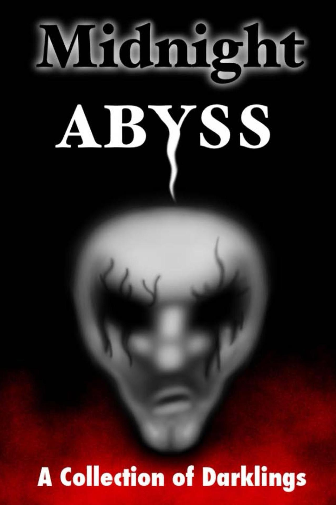

::: {}
<svg xmlns="http://www.w3.org/2000/svg" xmlns:xlink="http://www.w3.org/1999/xlink" version="1.1" width="100%" height="100%" viewbox="0 0 1279 1920" preserveaspectratio="none">
`<image width="1279" height="1920" xlink:href="cover.jpeg">`{=html}`</image>`{=html}
</svg>
:::

Midnight Abyss

::: {}
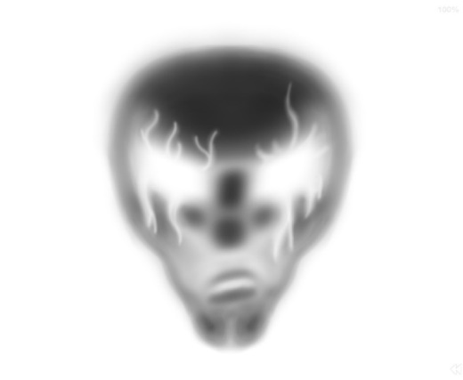
:::

A Collection of Darklings

Copyright © 2013 Midnight Abyss

All rights reserved.

ISBN:  1492966234

ISBN-13:  978-1492966234

Creeping closer, ever darker

Flash a spark, find your marker

The candle snuffed, a dampened hiss

A darkling's maw,

the Midnight Abyss

\* \* \*

A huge thank you to our graphic designer, Travis Baribeau.      

INTRODUCTION

::: {}

:::

IT ALL STARTED in a bar one lonesome, stormy October night. Greg and Shaun compared battle wounds and old exes while nursing watery beer. Their blurry eyes were set on a pair of off-duty vixens. Kelleigh and Anisa played at a demure ignorance from across the stale, smoke-filled room. Reconsidering their chances, the ladies summoned them over with a bottle of rum and a few cheap cigars.

The boys struggled to stand, and it took a few moments for the world to right itself. With a shot of courage, they made their play.

Suddenly, there was a thwap-whump-whump of the saloon doors as Matt strode in. "Is he here?" he asked, furious and crazed. The scimitar he brandished was soiled with dried blood.

\"Who the hell are you looking for?\" grumbled Jennifer from underneath her dusty felt hat. She placed her six-shooter on the table with a deliberateness that only the foolish would fail to heed.

\"Me,\" said Doug from behind the bar. \"The maggot is here for me.\"

Everyone stared as he slowly finished wiping the last of the glasses, folded the cloth and reached for his trusty shotgun. It was show time.

A crash echoed through the building as a rent in the seedy joint's roof opened up. A cloud of over-sized bats flew in followed by the monstrosity of a troll known as Ray. He landed squarely on the table, eager for a fight.

Bright lights shone from below as Theresa rose from her crypt, her angelic fire sparking from fingertip to fingertip in anticipation.

The assembled group looked at each other and someone said:

\"Let's write a book.\"

To be continued...

\* \* \*

No, not really. We all just met on WritersCarnival.ca, the best writing community on Earth.

::: {}

:::

DEBT COLLECTORS

Gregory K. Shipman

A native East Baltimorean, but now a Fairbanks, Alaska resident, Gregory K. Shipman has a day job which often extends into the evening hours. His passion is writing about the steamy, noir side of life... past, present and future. He has yet to earn a dime from his scribbles but has the satisfaction of knowing it's all non-taxable. Greg is an active member of the on-line community, Writer's Carnival, the Community Writer's Group of Fairbanks, and a board member of The Fairbanks Drama Association. He lives a life of hardly quiet desperation with his pet laptop and unreliable Jeep. He enjoys Jazz, Blues, Theater and the occasional diabetic coma...

THE DIMLY LIT hallway seems to go on forever. The sound of a distant ringing phone echoes off the drab painted walls. An old man moves slowly towards a door at the far end with his head bent and back stooped. Carefully, he steps as though avoiding something at his feet. The hallway is empty save for him. Anyone else present would have heard a rhythmic clumping sound reminiscent of Captain Ahab walking the midnight deck of the Pequod.

\* \* \*

Roberta watches her screen and picks up the next call when the computer signals. The name displayed is Louis Clayton Furr. She presses the pick-up icon on the monitor and her headphone signals with a hiss.

"Good evening," she says, after hearing a pleasant-sounding 'Hello?' in her earpiece, "may I speak to Mr. Furr please?"

"This is he. Or him, if you prefer."

"Mr. Furr, I am required by law to inform you that this is an attempt to collect a debt."

"Oh my. To whom do I owe money?"

Roberta feels a chill from the penetrating voice. Although it is deep and melodic, she has the sense of someone running their nails across a blackboard.

"Well Mr. Furr, you have an outstanding balance of ten thousand eight hundred dollars with Fallenhot Credit Services. Can we clear this up for your peace of mind?"

"Well young lady, my mind was peaceful until now. I don't recall this bill. When was this?"

"We're an agency sir, and I don't have the records in front of me. It is, however, your bill, and we do want to keep this out of court."

"Sounds serious, my dear. I'm an old man living on pension and the occasional can of cat food when times are especially lean. I haven't had any credit in over ten years. Is this that old?"

"Mr. Furr, we should just work on your obligation. Our client seeks restitution. Please let's settle this now. Send me a good faith check in the amount of one hundred dollars and then we'll make payment arrangements."

"Well, Roberta Gilchrist, seems like you have all the answers. Where are you calling from?"

Roberta hesitates. "I never gave my name. How do you know my name?"

"I must have heard it somewhere, my dear. Where are you calling from?"

Completely unnerved the woman replies, "From my office, sir."

"Don't that beat all? I'm thinking you're sitting in that bedroom of yours on Pope Street, inside your little white house with the overdue mortgage payments. You're wearing that tacky orange pull-over with those horrid red shorts. Your hair could stand a comb, and those Big Macs you eat are downright unkind to your hips."

The chill the woman feels now has to do with more than the deep voice. "Who are you?"

"Louis Furr, young lady, just Louis Furr. This account you speak of is eleven-years-old. It's been paid. I'm meticulous with things like that."

"Sir?"

"I can't be sued. You know that. The original company went bankrupt and sold this erroneous debt. There have been others like you. Your company bought the dead debt for one hundred dollars, and then falsified the dates to put it on my credit report. If I send you money, even a dollar, you know it would be a legal admission of a debt owed. There is no client, and you, my dear, are being a very naughty girl."

Roberta's hands are shaking uncontrollably. She doesn't speak.

"Is this how you want to earn a living? Isn't your life bad enough already? You are behind on your bills, your husband left you five years ago and your mother's dying of cancer. Your fifteen-year-old daughter hates you. You haven't had sex in two years unless you count that device in your bottom left dresser drawer."

The headset she wears feels as if it weighs a ton. She tries to speak, but only a squeak comes out.

"This company you work for preys on the poor and unfortunate. You and they are bottom-feeders. You give honest collectors a bad name, and you participate in planting grief in others. For shame. I have, however, some good news and bad news for you."

Roberta can only listen.

"Your seventeen-year-old son, Larry, is no longer a pothead, and that's the good news. The bad news is he's graduated to heroin."

A moan escapes her lips.

"And speaking of seventeen-year-olds, Freddy Beaumont was that age two years ago when he was bagging at Safeway. You were, I believe, forty at the time. Wasn't it the Wednesday night of your daughter's school play that you propositioned him? She was only thirteen, and you skipped her important play so you could have sex with little Freddy in the school's visitors lot. Quite an experience in that Ford Taurus rocking the way it was. More bad news, my dear. The young man was also a male prostitute. The Aids virus took him out last year. That might explain your night sweats, dry cough, and constant fatigue."

Roberta Gilchrist is now on her knees. Tears are flowing, and sobs replace the earlier moan. She can only think of razor blades and wrists.

Louis Clayton Furr glances casually at his exceptionally long fingernails and gently hangs up the phone.

\* \* \*

Steven Taylor has attained business success. His office is chrome and glass. The suits he wears, somewhat dated but stylish, are Bill Blass originals. His dark hair is 'Hollywood' and his tanned skin the product of a salon. A private slot in the underground garage corrals his new Porsche Boxer.

Mr. Taylor is V.P. of Operations at Dam and Able. The letterhead suggests the company is a law firm. However, this is no law firm. It is a collection agency. It has no clients; nor does it represent any. It buys old debt for pennies on the dollar and then uses any and all methods to collect from the unsuspecting and unfortunate. Some of the debt is real, though up to fifteen years old. Some of the debtors are victims of identity theft. All are beyond the statute of limitations in most states, but that doesn't stop collection agencies like this. Steven Taylor, husband of Mary, and father of little Ralphie and petite Lucy pulls a six figure yearly salary and impressive bonuses. The latter comes from the 'green blood' sucked from the financially depleted 'near corpses' who are the targets of the firm. Mr. Taylor is forty-five and a prince among the 'collection vampires'.

This morning he has a difficult account programmed into his computer. The total receivable is ten thousand eight hundred dollars. The agency bought it for one hundred dollars. They expect to collect two thousand dollars on it while promising to write off the rest. But another 'vampire agency' will buy it and continue sucking. Steven typically handles ten to twenty of these accounts a week. His success rate is upwards of seventy percent.

The computer signals the call has been picked up, and the V.P.'s headset is activated.

Mr. Taylor hears a firm and resonant, "Hello?"

"May I speak with Mr. Louis Furr?"

"You are speaking to him," says Mr. Furr. "Who is this please?"

"I am calling from the law offices of Dam and Able. We represent a client with whom you have a debt... Fallenhot Credit Services. You have an outstanding balance of ten thousand eight hundred dollars. Our client has authorized settlement of four thousand dollars if you accept today. If not we will be forced to start legal proceedings immediately."

"And if I pay the money today the debt is paid in full?"

"Absolutely. We can assure you of that."

"And if I can't pay you will sue me?"

"We will."

"But I paid the initial debt years ago."

"Our client says otherwise."

"What if I haven't the money?"

"Borrow it. Take out a second mortgage. Sell your car. Call your children. We are doing our part by offering this settlement."

"But, Mr. Steven Taylor, you can't sue me on an eleven-year-old debt. You can't legally report me to a credit bureau. The statute of limitations is long gone. And you have no client, nor are you a law firm."

"How do you know my name?" asks Taylor.

"Lucky guess. Sorry to hear about the unfortunate suicide of Roberta Gilchrist."

"I don't know what you're talking about."

"Of course you do, Mr. Taylor, of course you do. Just like you know you're attempting to take advantage of me. Will you use the bonus from this to help buy another suit? You did notice the one you have on today has a small tear in the pants. That won't help your image in the office. Your little girlfriend, Marie in accounting, should have mentioned it this morning when you stopped by to give her money for an abortion. You should have used protection."

"What the hell are you talking about?" Taylor looks around his office; sure there must be cameras there. "Who the hell are you?"

"Louis Furr," the voice says, deeper now than a moment ago. "I hope blood's not getting on your shirt from that nosebleed you've got."

Taylor puts his hand to his face, "What nose bleed?"

"I do apologize. I'm a bit premature. I mean the one starting now!"

At that very instant blood squirts from Steven Taylor's nose. He leaps from his seat in fear and shock. "Oh My God!" he shouts.

"I don't think so," Furr says quietly, "I don't think so. I imagine there's blood all over your shirt now. You might want to think about going home to change, but that wouldn't be a good idea."

The bloodied man is still quite shaken. "Why not?"

"Right now your wife, Mary, is in bed with your father, George. Perhaps it would be less traumatic if you wait until this afternoon when she's in bed with the exterminator."

"I don't believe a single word you've said." Tears are in Taylor's eyes.

"Oh yes you do. The nosebleed convinced you, my friend."

"What do you want from me, Mr. Furr."

"I have all I want, Mr. Taylor. There's nothing I need from you. However, I have some good news and some bad news for you. The bad news is your embezzling has been discovered. When you took money to pay off your gambling debt, the boys you paid off are the same boys who own this collection agency. Small world. They're sending a shooter over to meet you in the parking garage."

The V.P. of Operations at Dam and Able develops a massive headache. His heart is pounding, and his breathing is erratic.

"The good news is the shooter will never reach you. You'll never pay for your embezzlement. You'll never have to think of your cheating wife or your pregnant girlfriend again. And you'll not see little Ralphie go to jail in eight years. Need I mention you shall miss lovely Lucy becoming an alcoholic in five? Oh dear, I just did. Here's the problem. You have two arteries about to burst. One at the base of the brain, and one near your heart. Both will go in thirty seconds. Technically your life will end from an aneurysm of the brain and an aortic aneurysm. Unlike the blood debt you've lived on, you will not be returning from the grave."

"Who are you," he gasps with his last breath, "who are you?"

"Just a debtor, my dead friend, just an ensnared debtor."

\* \* \*

The office is small and neat. A rectangular oak desk, a matching oak chair, and a small red globe lamp are the only furnishings. The hardwood floor is spotless. The bare walls are painted off-white. Centered on the desk is a 1910 Bell telephone. It's an original, and its black surface shows no wear. Neither the phone nor the lamp has wires or batteries. There are no windows, but there is a frosted glass panel in the only door. The name, 'Fallenhot Enterprises', is in bold black letters in the center.

The room is bathed in red light from the lamp. Dancing shadows on the wall suggest tormented figures. The phone rings on the desk. Mr. Furr suddenly appears from nowhere. He walks over to the desk and picks up the receiver. "Hello?"

A professional sounding female voice responds, "May I speak with Mr. Louis Furr, please?"

"This is he."

"Mr. Furr, I am required by law to inform you this is a legal attempt to collect a debt."

"Oh my," he says, breaking into a feral grin, "this sounds serious."

His fangs are pearly white, and sharp. As he stands, his long red tail swings rhythmically left to right and back again. His left hoof is stationary, his right hoof taps rhythmically. Just above the bottom of the frosted glass panel is his name, Lou C. Furr; and below that, Collector of Debts.

"Please continue my dear," he says as he strokes his neatly trimmed Van Dyke, "I'm all ears."

::: {}
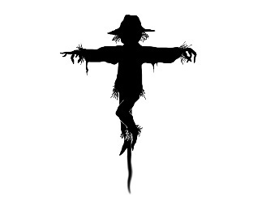
:::

EDDIE ZERO

Doug Langille

Doug Langille is a husband, father, and shameless technophile living the good life in Nova Scotia. He is also a grandfather, bird keeper, dog owner and cat butler.  By day, Doug fights the good fight working in I.T. at the Nova Scotia Community College. When asked to describe his work, he says: \"I think stuff up and write it down\". He does other stuff, too.  Doug has recently rediscovered his passion for writing, drawing inspiration from his favorite authors, including: Stephen King, Clive Barker, Jack Whyte, Philip K. Dick and Robert W. Service. He doesn't usually talk about himself in the third-person, but when he does he tends to bend the truth a little.

I DIDN'T KILL him. He was already dead.

The room was pitch black when I awoke. I fell asleep leaning against the back of the door. My shoulders tingled as my circulation returned. It didn't help much. With my arms restrained like they were, it was nearly impossible to take a full breath. My head swam as my eyes adjusted to the dark. The sparks and flashes of dust motes disoriented me, awash in a sea of teaming life where darkness reigned.

The power had been out for a couple of days, from what I surmised from the dim glow ebbing and flowing through the wire-reinforced glass in the door. There was no real way to be sure though. Time was elastic for me at the best of times. These days? Well, let's just say things were different.

The hot, stale air reeked of my own sweat and stink, and his as well, I suppose. My foot shot out to kick him, landing with a wet thud. In some ways, I was thankful for the dark. The air exchangers were out, but there must have been some venting somewhere. My breathing grew frantic again, so I closed my eyes against the murk and did the breathing exercises Doctor Goodwin taught me. She was my favorite. She always smiled at me. At least she did when she possessed a face. Bastards.

We were in group session when the arse fell out of the world. Doctors Goodwin and Meier were running the show with a stuffed bear as a talking stick. Barry, Emma and Hughie went first, leaving me and Haley. I grew bored with Hughie's crying and Barry's whimpering, as he rocked back and forth. Haley stood, walked around her chair clockwise, and then counter-clockwise, humming a nursery rhyme. Meier guided her back to her seat. Man, these people were nuts.

Goodwin cell buzzed. She glanced at the number and excused herself to take it. I watched her shapely legs swish away with approval. I hate to see you go, but I love to watch you leave, I mused. Hughie stuffed that damnable bear in my face, blocking my view, and shook it like a rattle. I wanted to punch him. That was probably why I was in restraints.

"It's your turn, Eddie," said Meier. "Do you have anything to share this morning?"

"Fuck you."

Meier shook his head and bent forward to scribble in his chart. The bald spot looked like a tantalizing target. Goodwin came back, put her hand on her colleague's arm, and handed him a note. His glasses fell from his face and dangled around his neck from the chain that later facilitated his untimely demise.

The security alarm clanged as the double-doors at the back of the ward burst open. A small crowd of dishevelled-looking people broke into the room. They were all bloody and torn, but moved with a swiftness I hadn't thought possible. Immediate pandemonium erupted in a melee of gore and violence. Frozen in shock, I witnessed the escalation. Three assailants gnawed on Goodwin\'s pretty face after tackling her to the ground. Barry vomited all over his pajamas, but it didn't matter. He didn't make it out of the circle. None of them did.

Meier and I clambered over and around each other trying to get out the south door. I threw my body against the press bar and fell through. Still bound in the jacket, I panicked and yelled as I violently flopped around on the floor like a fish out of water. Meier, wide-eyed and bleeding, helped me stand and we bolted to the cell block to hide.

It wasn't until later I realized he'd been bitten.

\* \* \*

I kicked Meier again. Nothing. I didn't mind hunger, but hated being thirsty. Drinking from the toilet had to be pretty much the lowest point of my miserable life.

The dark got to me. At first there was a lot of noise, but it'd been relatively quiet for some time. No screaming. No growling. With the power off, I faintly made out the sounds of the street below. Sirens. Gunfire. There was an explosion last night, but nothing in the ward.

Pacing around the cell helped me think. It wasn't mine, but Marky's. I can't remember. We weren't exactly reading room numbers, if you know what I mean. A lucky break in one hand and a dumb-ass move in the other, we hid in a cell that automatically sealed when closed. It needed to be unlocked from the outside. Nice.

Meier and I cowered like children, holding our breath. I begged him to take the jacket off, but he refused. Paranoid or just an asshole, who knows? Rotten fucker. Glad he's dead. No, I won't take it back.

The good doctor found Jesus, Allah and Buddha. He hedged his bets, I thought. Sometime after the first couple of long hours, he raved and babbled. The crowd of crazies on the other side of the door heard him and screamed incoherently, banging on the metal. The emergency lights were still on, and I worried they'd figure it out. They weren't likely getting inside without a working brain cell to spare. It was Meier who drove me batty.

All at once, he got quiet and passed out. Eventually, the crazies begged off to find other faces to peel and limbs to eat. I bent over him to listen for breathing. It would've been much easier with hands, of course. Nothing.

He sprang forward and growled like the freaks outside. I'd seen enough zombie movies to guess where this was going. I didn't get out of his way in time. He tripped over me, fell forward and slammed his head on the toilet with a dull thud. Not waiting to see if it slowed him down, I jumped on his back and dug my heels into his pudgy hips. Using my teeth, I grabbed the chain of his glasses and leaned back with all my weight, pinning him with my knees on his shoulders. His back arched so he couldn't get up. Meier kept trying to reach me with his hands, but his middle-age lifestyle didn't permit the flexibility. He gurgled and sputtered as he twisted and flailed. I rode him like a rodeo bull. Yippie!

Why the chain or spectacles didn't break, I have no idea. Thank you, Jeebus. With one of his jerks he threw me off, but I managed to hold on to the glasses. His neck snapped audibly and I lost a couple teeth. Meier shit himself and died again. That was that.

As I crossed the cell for the millionth time, I booted him again for good measure and stopped. Did I hear something? Was someone yelling? Yup. Words, not growls. It was Haley. Shit, of all my saviours, it had to be the obsessive-compulsive. I kicked the door with my feet. "Haley! Over here!"

"Haley!" Fuck, I tired of saying her name. "Haley, can you please open the manual door lock? Pull it out, turn it one-quarter, and push it back in. That's all you gotta do." I had this place cased. I paid attention. I knew how things worked.

I saw her pacing back and forth through the glass, leaving little bloody footprints on the tile with her elasticized paper booties. Back and forth, chewing on her nails. "Eddie, I can't!" she squeaked. She was crying, of course. That was useful. "I can't make it three! It needs to be three! Doctor Goodwin said it was okay, but it's not!"

For Christ's sake, why did I draw this winner? "Listen to me. It is three. Three steps. Three God-forsaken, monkey-fightin' steps. Pull, twist, and push. Count 'em, Haley."

"No." She let out a huff of air. The motion shook her small frame. How old was she? Fourteen? She put her lower lip atop her upper and sat on the floor, arms and legs crossed. "You're being mean to me, Eddie. Doctor Goodwin said you had to be nice to me. Remember? I won't let you out until you say sorry."

I fought to not tear this little bitch a new one. I walked over and gave Meier another boot, then another one, real hard. I stretched my back as far as the jacket allowed. My shoulders cracked with the stress. My hands were wet with sweat and probably blood. I clenched my fists, digging my nails into my palms. With great effort, I forced myself to relax my hands. The tingle from the change in blood circulation made them hurt. I ignored it.

"Haley, I'm sorry." I put on my 'good guy' voice. I don't usually take this pansy-arse out to play. I wanted to kick my own ass. Embarrassing. "Please, let me out. We'll figure this out together? Are you hungry? I know how to score us some food." My stomach rumbled at the thought, despite my rising gorge from the cell's stench of shit, puke and rot. Time to get the hell out of here.

"Thank you, Eddie. Apology accepted. Was that so hard?" I bit my tongue. More blood. She then stood up, now coated in syrupy red. She approached the door and did pretty much what I expected. Pull, push, pull, push, pull, push. Pull. Twist right, left, right, left, right, left. Twist right. Push, pull, push, pull, push, pull. Push.

Man, this was killing me. "Okay, Haley, open the door." Turn, turn, turn. Open. I was free. Cool air rushed in from the hallway, and I enjoyed the freshness of it.

Haley stood a couple paces away, afraid of me. Good. She should be. "Haley, would you be so kind as to undo these buckles?" I made my best 'good guy' smile. Oscar worthy. I turned my back to her and she crept forward. Her little fingers trembled as she fiddled with the straps. It took forever!

I shook her and the jacket off. It fell to the floor with a thud and clang. Too loud. I pinwheeled my arms to bring them back to life. They felt extremely light, but strong. "Two or three days?"

"Only two days, Eddie," she said. "I saw it on Doctor Goodwin's watch. I took it from her. It's pretty. She let me play with it once." Haley jingled it on her wrist for me to see. It was too big for her. My annoyance heated up. Bye-bye, 'good guy'.

I pivoted on my heels and reached her in one step. She yelped like a wounded puppy when I grabbed her by the hair and pulled her face closer to mine, forcing her to stand on her tiptoes. That was fine with me. I held her in place for a three-count and then let her go. She nearly fell, but managed to keep her footing.

"Haley, now you listen to me. I'm nuts, but you're crazy. If you weren't a kid, I'd drop you like a sack of moldy potatoes. If you want to live, you best heel and keep up." I softened my tone, point made. I said, "You hungry? Let's hit the staff lunchroom first. Stay on your guard. The bastards could be anywhere."

She nodded. "Yes, Eddie." Good girl.

It wasn't supposed to be a terribly complicated affair to find us some grub. Ha! I turned to Haley. "You ready?"

She nodded and eked out "Y-yes, Eddie." The girl skittered around me, a couple paces away, lest I grab her by the scruff again. Hey, whatever kept her on her toes.

"We gotta get out of this block and to the stairwell on the other side of the common room. Let's go. Stay behind me." Like a beaten dog, she complied.

Unable to see, the dark hallway left me feeling exposed. The waxed tile floor glowed with the ambient light from the high windows. Without the hum of machinery, I was conscious of the sound of our progress. Our breathing. Our shuffling. The wet, slurping noise as we hit an area slick with bodily fluids and other sticky bits. We came across four bodies between Marky's cell and the monitoring station. Well, there were four separate heaps. Everything was torn and ripped apart. One pile contained too many arms and another had too few heads. Haley kept trying to identify them.

"That one is Grace. She was nice. And that one was Elias. He always touched himself down there when I saw him. Gross. Here is Paula... mixed with Charles. Some of him anyway."

"Haley," I hissed.

"Yes, Eddie?" she sounded almost chipper. What the fuck?

"Haley, shut the hell up before I punch you."

"Okay," she sang. If we weren't already in a nuthouse, I'd swear she was losing her marbles. Can you do that twice? I shook my head. Focus, Eddie. Food. That's all you need. Fix you right up.

We came close to the common room door, and I counted another six corpse-piles. Thanks, Haley. At least her naming ritual was done. The room ahead shone brighter because of a skylight, but I couldn't see inside as the glass was smeared with red and black. What I did make out would have made me shit my pants if I'd been well-fed. It was a good thing Haley slinked behind me, because the last thing we needed was a scream-fest. A shadow moved around in the common room.

"Turn around and keep an eye behind us while I scope this door."

"Eddie, I hear something." Haley squinted into the murk behind us. "There's something coming. Hurry!"

I heard the scrape of frantic movement. Something was coming for sure. A low growling swelled from Heap Number Four. A grunt and then some movement. Haley wailed "No, no, no, no, no..."

My hands still ached from the restraints, causing me to fumble with the latch of the door handle. A heat, red and furious, formed behind my eyes as the adrenaline surged forward. I balled my left hand into a fist and smashed it down on top of the latch as I yanked with my right.  The door wouldn't budge. The palm of my left hand did little to cushion the blow. My whole arm registered the pain. The predatory sounds behind us grew louder. There was more than one. Oh Fuck.

Terrified and useless, Haley frantically pawed at my back. The rage part of me wanted to lash out at her, to throw her to the dark. I fought the urge. It was too short-sighted. I brought my left arm around again on the stuck latch. It finally gave way. The door opened explosively with the force of my yank. Haley and I fell backwards on the floor, closer to the advancing, and hungry, threat.

The light from the common room spilled down the hallway, lighting it up like a flare. There were nine distinct movements. Nine ways to die. Their growls got louder, becoming screams as they reacted to the light. Three retreated from the brightness, but the other six surged forward. I grabbed Haley by the wrist, dragged her to her feet and pulled her with me as I leaped across the threshold into the open room.

Wheeling to face the maw, I yelled back to Haley, who stood dumbed by shock. "Get over here! Help me close this fucking door!" She skidded over and contributed her weight. I slammed the steel door shut and hit the emergency bolt lock as the mass of flesh and bone assaulted the now sealed door. It was savage and raw, but the sound of crushing bodies and breaking limbs were muted by the insulating reinforcement.

I took Haley's hand and together we turned to face the horrors of the common room.

An abundance of light spilled from above. The skylight of the common room exposed the brilliance of the summer sun. After the dark of the ward, my eyes issued their complaint. A dull throb grew in my forehead with the same blistering cadence as my bruised hand. I shivered with excess adrenaline even though the room warmed with the sunlight. The putrescence of decay emanated here.

To the left of the door hung Doctor Andrews. He swayed back and forth gently, casting a long shadow. His neck tilted at a queer angle. I guess that'll happen when you string yourself up to a basketball net with your own necktie. One shoe sat on the floor below him. The calf of his left leg was split open and half-eaten. Precious little remained aside from the tendons and ligaments. It looked like his bandaged right bicep had taken a bite as well. I wondered if the good doctor did some last bit of public service in removing himself from the zombie gene pool. What I didn't really get was why he moved. We were alone. Sorta.

There were close to thirty people here when shit went down. Now, bits of shredded human littered the common room floor. It looked like the worst kind of food fight at summer camp. I remember a riot back in the prison's cafeteria. Best workout ever. That was a good day. Today was not. Haley sat in the middle of the room, legs splayed, cradling the head of what looked like Emma. I didn't see the rest of her, if there even was a 'rest of her' any more. Haley sang lightly. "Pockets full of posies. Ashes, Ashes\..."

"They all fall down." I don't know why I joined in. The little bitch's voice was melodic and infectious, I guess. Second verse, same as the first! This was too much. I stepped over Barry. At least I thought it was him. Bloody blubber, puke and shit. Check, check and check! I caught myself from falling. Christ on a cracker, this floor was greasy! I crouched in front of Haley. "Quit the fucking singing." I spoke slowly. She stopped immediately.

That worked for about a second-and-a-half. Still playing rock-a-bye with Emma, a low moan rose from her. It grew louder and louder as her young emotions boiled over. What the Hell? We didn't have time for this. I grabbed Haley by the shoulders, probably a little rougher than intended. I wasn't known to be a gentle soul. "Haley, you need to stop." She didn't. I looked back at the door we came through. The banging and clawing stopped. "Look at me, for fuck's sake." Nothing but that god-awful wailing.

I stood up and walked around her, running dirty fingers through dirty hair. My hands balled up into fists as the girl continued. I snapped around and let my backhand fly to shut her up. It wasn't until after she'd flown backwards that I registered I'd hit her with an open hand. Emma's head wobbled out of sight behind an overturned table.

I closed my eyes and lifted my head to the ceiling and muttered, "Oh, fuck." I approached Haley who flinched away from me. Rightfully so. At least she stopped with the noise. "Haley, I won't hit you again." I lied, of course. How was I to know that? I held out three fingers. "Haley, how many fingers do you see? Count them."

She looked up warily, the dark expression of her eyes partially hidden by wayward hair. She brushed it away from her face and focused on my hand, the one that struck her, now held aloft. "One, two, three. Three fingers, Eddie. Please don't hit me, Eddie. I'll be good. I'll be quiet."

"You'll be safe with me, Haley. But you gotta buck up. Can you do this?" I asked, summoning my good-guy persona again.

"That's what Mom used to say," she said quietly. I knew from group her mother was recently pushing up daisies. At this little girl's hand, no less. That's why she vacationed here with us. It's good to keep track of these things. It's good to remember the little details. I'd have to be more careful. No channelling 'Mommy Dearest' with this one. No siree, Bob.

Haley's eyes widened as they darted from meeting my gaze to over my shoulder. "Eddie..." she gasped. Shit.

The force of the blow sent me tumbling on top of Haley, in a tangled mass of arms and legs. My feet kept slipping on the greasy floor, failing to find purchase. The weight of our attacker fell upon us. I kept my limbs moving in an attempt to avoid being bit. All I pictured was fucknuts hanging over there with bits missing. Not this cat. Nope. Time to get my head in the game.

My arms found solid floor and I threw my body backwards. All I smelled was rot, strong enough to taste. Haley screamed, and so did the stinky fuck behind me. It sounded female. I managed to turn in to a crouch before it leaped at me.

I grabbed the first thing I found. Batter up! Barry's leg felt heavy at the meatier end as I swung. Bits of flesh and blood splattered me as it made contact with the zombie bitch's face. It didn't slow her down, so I swung again. Crack. The leg broke, bending across her head. I tossed the shattered limb aside. Even in death, Barry was a useless tit.

Haley suddenly jumped on the larger woman's back, repeatedly jabbing her head with a shard of broken glass. Crazy bitch. It howled in fury, trying to figure out how to deal with the unfriendly backpack.

A second undead bastard joined the fray and plucked Haley off. She turned around and cut it across the jugular, spraying putrid blood all over her face. He dropped her. Haley scurried over to where I squatted. She helped me wrench a metal leg from the upturned table.

We stood for a moment, squared off with the two monstrosities. I held my new bludgeon and Haley wielded her glass sabre. Her hands trembled as they gripped the blood-soaked cloth wrapping the makeshift hilt. Two more walking shitbags joined from the east entrance of the common room. Damn.

I looked at Haley. "You ready for this? This is where you shine. Pretend these ugly-ass losers are your mom. Don't stop until they do."

Haley's eyes flashed a hurtful fury at the mention of her mother. Point made. Motivation. Then she did something I didn't expect. She smiled. Widely. This kid definitely had a streak in her. For a split second, I wasn't clear who was going to get the business end of her intent. She wasn't either.

She nodded to the gruesome foursome, as they fanned out. Any theory I harbored of these being stupid movie-zombies went out the window. This would be a dance of tactics, guile and luck.

"Let's do this, Eddie. I'll head left, you right. Race ya to the middle," Haley whispered, excited and light.

I nodded slowly. She enjoyed this. My gut feelings about this little girl were on the mark.

Charging forward, we screamed like banshees.

Haley and I stood in the center of the room and surveyed our victory. We were soaked in the salty gore of hard-won blood and sweat. I waded my way over the ruin of flesh and bone to where Haley proudly admired her handiwork. With the table leg, I jabbed at the remains of the torso from the first bitch on the scene. My hand throbbed with the punishment. It started to swell, likely fractured. Add 'First Aid Station' to the list of visits in our little adventurous foray.

Haley wiped her brow with the remnants of her shirt, baring her midriff. So many scars, burns and cuts. The miserable cow masquerading as a mother used her as an ashtray, among other things. I looked back at Haley's face and caught myself smiling at the fresh smear of God-knows-what on her forehead.

"You missed a spot," I said and pointed to the top of her head.

She reached up and drew her finger across the works, examining the gob. "Gross!" she said, wrinkling her nose. At that moment, she was more child than killer. "Eddie, I got Nurse Chumley all over me."

The absurdity of her response was too much to bear. I broke into an uncontrollable fit of laughter. Haley's giggle joined mine in this shared little joke of battle. We were beyond speech. It was all about emotional release in the face of madness, possibly on the verge of it. My ribs made their bruised and abused status known, cutting short my guffaws. When Haley saw me wince, she stopped as well. Her eyes displayed genuine concern. "You okay, Eddie?"

I nodded and forced a smile, the good-guy one. "I'm fine. Gotta get the number of that truck. What about you? Check for bites."

"I'm fine. It's only a couple of scratches."

Fuck that noise. Something wasn't right. "Take your clothes off. Now!"

"But, Eddie..." Haley looked at me as if I commanded her to kill a puppy. She'd done worse.

"Listen, you contrary little bitch. I'm not pinching for a peepshow. Show me your back, the shit you can't see. Then show me your arms and legs. I'll do the same. Gotta trust each other."

She nodded meekly and did as she was told. Good girl. No room for teenage modesty today. Her hands and arms took the brunt of the damage. There would be plenty more scars to add to her collection. Man, this kid's seen some action. My back didn't fare so well. There looked to be three deep gashes across my right shoulder to the small of my back. Fingernails. Fuck. It was weird I didn't feel them. That didn't give me the warm and fuzzies.

We left the room at the west, where the nursing station kept its patrons safe and medicated. We hit pay-dirt. Haley dressed my back from the medical kit and wrapped my hand. I did the same for her battered arms. Raggedy Ann and Andy, all patched up for another day of play. No meds though. Staying straight for once was probably the best thing either one of us could do anyway. I spied a water bottle with 'Janice' written across the side in block letters with a Sharpie. My thirst forced me to drink greedily before handing the rest over to Haley. She scored a blood-sprayed, half-box of granola bars. We were too hungry to discriminate.

"I'm tired, Eddie."

I looked around the inside of the nurses' station. It was cozy, but most importantly, the doors and windows were equipped with rolling metal shutters. This stood as a fine little fortress. I turned back to Haley. "Me too. We'll camp here."

We grabbed a stack of blankets, hospital-issued cotton. Pulling down the metal shutters made an obscene amount of noise. Our hideout wouldn't be much of a secret for long.

I laid on my side, facing the door, hands still clutching the table leg as I tried to get comfortable. Haley spread out under the counter top and dropped immediately to sleep.

It was a while before I nodded off, listening to the dark, my imagination running wild. At some point, I dozed then woke to find myself flat on my back with Haley curled up to me.

I ran my fingers through her hair and touched her cheek. She shivered as if fevered. Maybe it was me. I fell into a fitful sleep, praying for daybreak.

Guys like me never dream about nice things, only nightmares. Tonight wasn't any different. In this Hell-trip of a brain-cramp, I was locked up again in a hospital being hunted by zombies with a teenage psycho chick as backup. Wait a minute. Shit. Not dreaming.

"Eddie?" Haley's small voice broke through the radio static of my thoughts. "What are we going to do? I don't want to die in here."

"No shit," I quipped. That wasn't high on my list either. "We're getting the Hell outta here. It's been quiet. What time is it?"

Haley bent under the emergency light and wiped the face of Goodwin's watch. It was broken. She shrugged. It probably didn't matter much. It was time to skedaddle.

With that, we left our tin cage and ventured out.

On the other side of the station sat a shelf of linens and scrubs too fresh looking to pass up. We took turns standing guard outside the small washroom. The water was cold, but felt good on my face. I peered over my shoulder, peeking in the mirror at the festering mess brewing on my back. It looked angry but alive. I hoped that signalled good news.

There was a pipe wrench in the can that hefted better in my hands than the table leg. Haley upgraded as well. Someone had a birthday. Maybe it was Chumley. Who cares? The six-inch blade whipped and chopped the air as Haley welded it as an extension of her arm. This wasn't her first rodeo.

Haley skipped down the hallway, pointing out the sights. The corpses here were largely staff, from what Haley reported. I was satisfied they didn't fucking move. Evisceration and dismemberment did that to a person. There weren't enough bodies, only rage and food. Where the Hell was everyone else? I remember the lockdown bells going off during the initial swarming of the common room during group. That seemed a lifetime ago.

"Haley, hold up." I bent over the bloody torso of some miserable fool in a lab-coat. The badge said he was Assistant Director Stevens. I took the badge at face value as there wasn't one left to verify. But, hey, we scored a swipe card. Aside from emergency lights, the doors outside the ward were all electronically keyed.

The girl stood over me and looked up and down the hallway. She touched my shoulder. It burned. "Eddie, where are all the guards?"

Good question. It was all lab coats, scrubs and johnny shirts. Nothing but dead and infected folk. From a tactical perspective, that didn't bode well. "We have to get off this floor. Now."

We sprinted to the stairwell at the end of the dim hallway. Human ruin blurred past as we went. The smell of it all no longer bothered me. Even for me, this marked a new low. My feet hurt. Hospital slippers weren't meant for athletics.

My numb hands fumbled with the swipe card. The blood beat in my head as my heart thumped in my chest. The card fell from my hands. Haley picked it up and unlocked the door. I flung it wide and we went through.

The stairwell was brightly-lit. Did the power come back on? No. High windows.

"Which way, Eddie?"

"Down."

The metal steps ground painfully into our feet as we descended the first flight. Sneakers. We should have relieved a few folks back on the ward. Not smart, Eddie. Gotta do better.

The crash of the door below deafened us. Haley and I saw the dance of seven or eight red dots hit the wall three flights down. This would be all shoot-first-questions-later kinda action.

Haley looked frightened. That was helpful. "What now?"

"Up. We go up."

Haley and I managed to gain two flights before the echo of gunfire threatened to rupture my eardrums. I remember stopping my ascent at the first report, closing my eyes and waiting for the sting of the lead rain. It didn't. I looked up at Haley. She looked down at me, then beyond to the melee below.

"Eddie, those aren't soldiers."

I turned and saw a dozen men in black jumpsuits, vests and ball caps. They brandished automatics. I couldn't tell what kind, but it didn't matter. They weren't pointed at us, but at the door to the floor below the ward. It was open and the squad dumped hot metal inside like rice at a wedding. It didn't change anything. The men were overwhelmed by the onslaught. There were too many of them.

"Climb, Haley. Hurry."

By the time we reached the top floor, the guns fell silent with empty magazines. Soon after, the screaming stopped, the sound of men and women being eaten alive finished. Haley and I looked at each other in unspoken understanding. Our own end would be quite different.

We slipped inside the door to the top floor and heard the lock click behind us. Another windowless door stood in front of us. We were in some kind of ante-room, small and dark, more so after the glare of the bright stairwell. The buttons on the keypad glowed their request. I swiped the card and waited. Pin code. Shit.

"Birthday," Haley said.

"What?"

"Try his birthday, Eddie. It should be on the card."

It was. The keypad made a beep and there was a clunk as the mechanism turned. I turned to Haley. "Thanks," I said. "Doesn't mean you get a fucking gold star or anything."

"Whatever, Eddie," she said as she skipped ahead of me through the open door. What the hell was wrong with this kid? "You coming?" she asked. Her eyes danced. Haley looked possessed with our little game of hide-and-seek.

"Hold up," I said. Things were too quiet in here, lit solely by the emergency exit signs and all the office doors closed. It was clean, antiseptic clean, hospital clean. Well, some hospitals anyway. After what we'd seen below, this was the last thing I expected. Double-doors loomed at the far end.  "You got your knife?" One, two, three came her swipes in the reddish lamplight. I felt under-armed as I hefted my heavy pipe wrench. "Let's go. Slowly."

We made our way to the end of the corridor. I pushed one of the doors gently with the business end of the wrench and found it gave easily. Haley and I crept through. I looked about the large area. This was more like it.

The main room was huge, with what looked like smaller procedure rooms circling the perimeter. Another set of double-doors stood exactly opposite to our position. There were high windows, much like the common room back on the ward floor. I had no idea what time it was, only that it was still daylight.

The center of the space drew our attention. We easily imagined how things were setup, orderly and all scientific-like. To the left would be row upon row of gurneys with straps running the length, facility for at least twenty beds. At the right stood a bank of heavy metal shelving filled with stainless steel cages. We didn't bother counting them. This was nowhere near orderly. This was chaos.

Cage doors hung ajar as if torn. Gurneys were askew, straps snapped and shredded. Some were toppled over. One bed and its hookups were smashed into the cage-wall. Blood and ruin coated everything. There were no bodies, human or otherwise.

Haley and I found ourselves in the center of the wreckage back-to-back, her eyes watching the left, while I guarded the right. My heart pounded against the brain noise of the quiet room. I realized we were both holding our breath. "Breathe, Haley," I said. She reached behind with her shield hand for mine and laced my fingers. I let her. She was cold.

Then the goddamned monkeys showed up.

The absurdity of the approaching troop stunned me for a few moments. Sure, I expected there to be monkeys. That's what the cages were for. But there was a difference between knowing a thing from putting two-and-two together and seeing that same thing running towards you with teeth bared screaming bloody blue murder.

"Eddie," Haley said, as she squeezed my hand. "Their fur is full of blood."

I shook her hand off, and time slowed. I looked to the procedure room where the parade began. It was human soup. The lab nerds must have sought safety and were picked off like fish in a barrel, a barrel full of monkeys now.

I swung my wrench and clocked the first one in the head, sending it tumbling wildly to the right. I nearly lost my footing with the inertia. The return arc nabbed two more. My foot connected with one under the jaw. Lights out, little fucker. By the time I brought the wrench around again, three more were in flight as they leapt towards my head. I clipped one as I ducked. The other two were on me before I righted myself.

Haley didn't fare any better. The cake knife extended the reach of her swing slightly. She was quick and most effective when she caught the monkeys with the tip. Sprays of chimp blood whipped across the room in an abstract artist's fit of passion. She took out six or seven of them before the blade became lodged in the neck of one screaming bag of fur. Just like that, she was disarmed.

I bashed two heads together with a satisfying crunch when a gunshot thundered.  I turned to glimpse Haley with her arms outstretched choking a wriggling monster Hell-bent on biting her face. Then with another boom, its head exploded, showering the girl in dead monkey juice.

The second shot did the trick. The remainder of the troop yelped in panic and scurried back to the barrel room. Our apparent savior made chase and threw the door closed behind them as he shot a straggler.

He turned to us. "You guys alright? Are you bit?"

Haley and I quickly took stock and shook our heads. There was a lot of blood, but none of it ours.

"We're good," I said, not mentioning the festering scratches on my back. Haley kept the peace as well. That's my girl. She learns fast. "Where the Christ did you come from?"

"I'm Barney. I was in the can when shit hit the fan out here. Where'd you sprout up from?"

"Ward-floor." There wasn't any point hiding that fact. We were in patient scrubs. "I'm Eddie. This is Haley."

Barney was obviously a security guard, a little overweight, but tall and strong-looking. The room was cool, but he dripped with sweat. He didn't come across as being all that bright. The man had the gear though. He still held his service weapon and wore a nightstick. The riot-gear vest he sported was too small for him, but made carrying spare clips easy.

He stuck his giant mitt out and I shook it. "Good to see normal folk for a change," he said enthusiastically before turning to Haley. "Welcome to the lab, kiddo." She smiled brightly at him and shook his hand with her whole arm. Barney saw her as a little helpless girl. I knew better.

"How long have you been here, Mister Barney?" Cute, Haley. Cute.

"Fifteen years," he said with a smirk. "Four days since the lockdown, three of them with only me and my little friends. The squints didn't make it."

"Well, something made it off the floor. It's a shit show out there," I said.

Barney nodded. "Yeah, whatever these jokers were working on, jumped from chimp to human."

"By accident or on purpose?" Haley asked. Good question. She yanked her knife out of the dead chimp with a wet gurgle and pop.

He didn't answer, probably because he didn't know. Instead, he said, "I called for backup."

"If you mean the rented guns, don't count on 'em. The bastards didn't make it past the second floor."

"Jesus. We're on our own then." He looked beaten, defeated and somewhat smaller.

Haley went over and hugged him. "It's okay, Mister Barney." I didn't expect empathy from the girl. She was chock full of surprises lately.

"You best stay clear of me, Haley." He gripped her shoulders, pushed her back to arms-length away and let go. He rolled up his sleeve and showed us his bandaged arm. It weeped pus and stank like rot, reminding me of good ol' Meier. "It's been a rough couple of days. The fever and puking started this morning.  I probably don't have long."

Barney wasn't stupid after all. He knew the score.

The decision to kill Barney wasn't hard. Getting it done was a bitch.

I worked in the chemical room, putting together a poor-man's flame thrower by mixing hand sanitizer with lab-grade ether in a plant mister. It's funny what can be found if you're observant. Barney's yellow knuckles told me he kept a lighter handy, even if he was out of smokes. I'd pinch it later.

When I came out of the room, Haley and Barney stood facing each other several paces apart. She wore his vest. I stopped. He pleaded with her.

"Do it."

Haley's hands shook. It wasn't that she couldn't kill. Nope, that wasn't the issue. She'd never fired a gun before.

"What if I miss, Barney?"

"You won't. Use both hands. Relax your grip. Don't lock your arms. Breathe deep and slow, sight along the barrel as you do. Hold your breath and squeeze the trigger."

The monkeys pounded and screamed at the wire mesh glass of the door as if they knew what was afoot. Neither Haley nor Barney took notice of them or me. It was their moment.

"I'm scared," she said.

"Do it," he said through clenched teeth, struggling for control. "Do it or I'll hurt you."

The gun roared, Barney toppled to the side and was still. Keeping a wary eye on Haley, I cautiously walked over, grabbed the nightstick, and dug through his pockets for the lighter. Score. I smelled the sour metallic mix of burnt gunpowder and fresh blood. Haley watched me with detachment, her mouth slightly agape. The gun hung limply at her side.

"Haley," I said. No response. I flicked the lighter. It was one of those butane torch types. Perfect. I gave her time. I hefted and worked the baton, a fine tool. I waited a little more before meeting her gaze again, cold and dead.

"Haley," I repeated and moved towards her. "Give me the gun."

"No," she said quietly. So it was going to be this way? Okay-fine.

I thought about simply taking it from her, but something about her demeanor made me reconsider. "Give me the fucking gun, Haley."

Like a doll brought abruptly to life, her whole body moved at once. Her hand tightened around the grip of the pistol and her arm raised deliberately and leveled the barrel at me.

"No," she said slowly, this time more forceful and decisive. The scared little girl vanished. I had no idea who this was in her place.

A few things happened at once. The security glass of the barrel room cracked and splintered as the hairy freaks threw each other at the little window. The double-door we came through forever ago burst open and a gang of fucked up misfits burst on the scene. Former patients, doctors and jarheads mingled together in zombie-harmony.

With a hoard to the left of us and a troop of rabid chimps pouring out from the right, it was easy to miss the small miracle of Barney's resurrection. He stood up, staggered and shook his head as he gained his footing. A flap of skin at his temple wagged to and fro. Haley's aim fired true but not perfect.

"Ah, shit," Barney cursed, as he first looked at the encroaching parties, then at what was clearly now Haley's gun.

Haley and I looked at each other and stifled a shared laugh at the absurdity.

"Hey, Barney. Catch," I said as I tossed him back his baton. He caught it with one hand and gave it a twirl.

"Time to go to work," he said as he assumed a fighting stance. Barney swung the baton like it was part of his arm. I was impressed the large man moved with such grace, especially given his recent brush with death and the stink of what was to come. That kind of training marked him as a rare breed.

Haley fired in to the crowd repeatedly until she ran out of ammo. Every shot hit its mark, but they hardly made a dent in the fray. She held only the cooks' knife and fell back to guard our rear. We were being forced backward an inch at a time.

Even Barney's acrobatics could not change our fate. We were being out-flanked. The lone weapon left having any effect was my fire mist. A few of the monkeys caught ablaze right away, making for a weird game of cricket as Barney batted them with his nightstick. I'm not sure a troop of flaming zombie monkeys was more or less dangerous. Their fear of fire granted us a small perimeter, a bubble of sorts.

When our backs hit the double doors of the opposite side of the room, my plant mister finally gave up the ghost with a melted nozzle. As luck would have it, it wasn't a moment too soon. The odor of propane filled the room.

"You guys smell that?" I asked.

"Smells like barbeque," said Haley.

"Roasted monkey meat smells like pork," Barney chimed. "So does human. Don't ask."

I didn't need or want to. Instead, I said, "Look at the broken gas-lines. This place is filling up quickly. We gotta jet."

Haley's eyes went wide as she understood. "Eddie, we have to do it."

"I know. We will."

The hoard must have worked out that we had no fire juice left and came forward in earnest. We took it as our exit cue and backed through the doors. Barney jammed his nightstick in the handles while Haley dropped the lock pins on the floor. I took care of the upper ones, buying us a few extra minutes.

"The roof access is over here," said Barney.

The three of us sprinted to the exit and clambered up the metal stairs emptying out on to the roof. The night air was cool, fresh and dizzying. It hit me like a sucker punch. I heard the whump-whump of helicopter blades amid the yells of frantic people. I saw shifting spotlights, scurrying men in black-ops regalia and a half-dozen moving hazmat suits. I couldn't make out what anyone said. They were still out of earshot, but came closer.

Haley touched my hand. "You promised, Eddie. Set this place to burn."

I showed her the butane lighter and said, "I'll be right back," knowing it wasn't a promise that could be kept. I turned to head back down the stairs not thinking about consequences anymore. Haley wanted to see this through and so did I, even if it was a one way trip.

Barney's hand hit my chest and stopped me short. He looked at me, warrior to warrior. "I'll do it." He indicated his wounded arm. "My goose is cooked anyway. Let me do this."

I held his stare a few seconds longer and handed him the lighter.

Barney's last words before he ducked back inside were a simple truth. "Besides, you need each other."

As Haley and I sat huddled in the back of the rising helicopter, we felt the warm wind of Barney's firestorm. We'd be okay.

::: {}

:::

DOUBLE VISION

Anisa A. Claire

Anisa A. Claire is a property manager by day and an eclectic author by night. She is also the creator and co-owner of Writer's Carnival, www.writerscarnival.ca, a successful, online writing community. She has multiple publications in e-zines such as Long Story Short, 69 Flavors of Paranoia, The Short Humour Site, and Blood Magazine. She has placed in, and won, various contests, and completed last year's 3-Day Novel competition. Anisa is an animal-loving, Halloween fanatic. When she isn't out ridding the world of zombies with her weapons of choice, Brussels sprouts and spatulas, she can be found surfing the net for inspiring ways to create zombie-buddies from felt and other random what-have-you's.

THE EARLY MORNING sun peeked through the curtains, and the radio alarm clock played on low volume. Noise sensitivity had been a life-long struggle for Sarah, and waking to anything loud completely ruined her day. Her mother bought the clock radio to soothe her little girl's tantrums, and twenty years later, Sarah still used it.

Sliding her legs over the edge of the bed, Sarah wiggled her feet into her worn slippers and stood to leave. Shaking the last remnants of sleep from her mind, she headed for the staircase, unaware of the rubber dog toy that lay in her path until it connected with her foot.  Arms flailing, she over-corrected and slid across the newly waxed hardwood floor.  The stairway railing provided a jarring end to this undignified mode of transportation.  Taking a deep breath, she braced herself then turned to investigate.

Sarah lived by routine, some people would go so far as to call her actions obsessive compulsive. To her, that wasn't the case. She simply liked things to be neat and tidy, everything just seemed easier that way. As she grabbed the stuffed duck from the floor, the memory of cleaning it up immediately came back to her.

The dog had four toys: the duck, the ball, the rope, and the rubber bone---exactly in that order. Duck, ball, rope and bone. There's no way she'd forget to put the duck away if she'd put the other three in the basket on the shelf above the crate. It just wasn't possible.

Arriving at the kennel, Sarah discovered the ball, the rope and the rubber bone exactly where she'd left them the night before. Panic set in. How could this have happened? No, no, no. This can't happen. Not again. She stopped, took ten deep breaths, and then continued to the stairs, on the verge of losing control.

The thought of the duck being in the wrong place disturbed Sarah's routine, and she had to fight the idea of canceling her whole day.   No good would come from her staying home. In fact, it would only make the situation worse. So, like a robot, she methodically prepared for departure.

Turn burner dial, fill kettle, swish three times.  Place on stove facing left. Eat apple, make sandwich, brush hair. Grab keys from hook and go to bus stop. Repeat list three times then start. She repeated the list three times out loud and then began the process. If the steps were laid out, things would just be easier.

\* \* \*

Lily paced back and forth.  I know that crazy bitch is in here. Where the fuck is she? I saw her on the bus again today, and she was staring at me. Just staring, like she knew who I was or something. She doesn't have a fucking clue. Fuck her.

Lily hated being the center of attention; she hated even being noticed. If she could have it her way, she would just melt into the cracks of the seats on the bus. That would suit her just fine. Leaving the house made her nauseous, but she had to make a living somehow. Social Services would only help with living expenses if they had an evaluation from the doctor, but Lily refused to comply. Instead, she suffered through every painstaking minute of every painstaking day... trudging on like a soldier.

After waiting all afternoon, and then late into the night, Lily came over to Sarah's house. Tonight, she would kill Sarah. She would find the irritating nametag that nosey busybody wore all the time, and she would burn it. Then she would trash the whole house just because she knew it would make that prying bitch's skin crawl, even after she was dead. Fuck, Sarah. Fuck her. I can't stand that stupid bitch.

Ideas toiled back and forth in Lily's mind on how to kill Sarah. She'd been planning this for a long time, except whenever she came to see it through, Sarah disappeared. Lily couldn't figure it out for the life of her. She knew Sarah's schedule inside and out because she sat, night after night, watching her from the bushes in Sarah's backyard. The view allowed Lily to peer into the majority of the windows facing the back of the house.  She watched Sarah's evening cleaning routine while she downed a bottle of Gin, her favorite kind of hard liquor. Nothing ever changed. Not ever. That is, until she came to kill her.

Silently, Lily slid Sarah's kitchen window open, knowing the paranoid bitch only ever left that particular one unlocked. Leaving the lights off, she found her way to the staircase then crept up the stairs. With every step she grew more excited. The time had finally come, she felt in her soul. Reaching the top, she stopped to catch her breath. All she had to do now was walk into the bedroom and smother Sarah with a pillow then all of the daily anxiety would be gone. The bus would once again be hers, and she'd finally be able to ride in peace.

When Lily rounded the corner, her heart raced, and she let out a tiny giggle. The blankets were in a mound on the bed, formed in the shape of a human body. Lily proceeded. Hovering over the side, she ever-so-slowly grabbed an unused pillow and lifted it over Sarah. With all her force, Lily slammed the pillow down, expecting to hit Sarah's face. Sarah wasn't there.

"Fuck! Fuck, fuck, fucking fuck!" Lily wailed into the darkness. "This isn't happening. No, no, no.  This can't be happening. Not again."

\* \* \*

Sarah stumbled out of bed the next morning feeling unwell. She forgot about her slippers and went straight to the living room instead of the kitchen. She looked disheveled, and her knees and elbows were bruised. After collecting her thoughts, Sarah made breakfast. Opening the door to the freezer, she pulled out a bottle of vodka and poured it into a tall, ice-filled glass. In one gulp, she downed the liquid fire.

Next, Sarah brewed a pot of coffee. Even in her altered state, she managed to place precisely four spoons of sugar into the steaming, hot cup. Only this time, she topped it up with Kahlua. Standing in one spot, Sarah lifted the mug to her mouth to sip. Lift, sip.  Lift, sip... until it was gone. Immediately after returning the cup to the sink, Sarah collapsed, head bouncing off the corner of the counter on the way down. The whole room spun, as she crawled to the phone.

Sarah woke in the hospital.

\* \* \*

"Sarah? Are you awake?" A strange voice asked.

"Yes? Yes, I think so," Sarah managed to say.

"You took a pretty big spill in your kitchen and knocked yourself out. Do you remember anything?"

"I remember drinking coffee, but that's all. I drank the coffee and then felt dizzy."

"Okay, that's good. At least you're recalling some of it. Don't worry, dear. The rest will come back to you eventually. Just give it some time."

Sarah saw that the strange voice came from a nurse standing beside the bed, changing an I.V. bag. "Try and get some rest. I'll be back in a bit to check on you. Would you like me to phone someone? Nobody was listed as an emergency contact... "

"No, that's fine. I live by myself."

"Alright, I'll be back to check on you soon."

\* \* \*

Lily stared into the mirror, face skewed. Blood dripped from where the I.V. needle was just moments ago. Red spots speckled her nose from the tape on the tubes she'd ripped out, and her head pounded.  She turned to shut the door beside her, locking it when it clicked closed.

How did I get here? Lily stood, staring at her reflection. Her vision doubled, so she blinked, attempting to clear it. When she opened her eyes, a different face stared back at her. Lily nearly jumped from her skin. Sarah.

Sarah gasped, touching the mirror. She'd seen that face before but couldn't quite place where. Grabbing a piece of Kleenex, Sarah dabbed the blood dripping down her arm then twisted the tap handles so she could wet her face.  The cold water felt good on her burning skin. Sarah lifted her head, returning it to the reflection in the mirror. What stared back wasn't Sarah.

Lily slammed her fists on the edge of the sink, screaming at the top of her lungs, "Get out of here! Get out of here! You have no right being here. Leave this fucking instant, you stupid bitch!"

Sarah watched the image in the mirror thrash around. She saw the other woman's lips moving, like she was yelling something. Sarah took a step back, reaching for the door handle. She heard the nurse on the other side telling her to unlock the door.

"Leave now. Leave right now! Get out of here," Lily yelled, froth building at the corners of her mouth. Being in public, she didn't want to kill her, but Sarah wouldn't leave. She knew what she had to do next. Witnesses or not, and without thinking, she smashed her fists into the mirror, exploding the glass on impact.

"Sarah? Are you okay? What's happened? Talk to me Sarah, open the door, please!" The nurse shouted from the other side.

Lily snatched a shard from the ground and slid it across Sarah's throat. "You demented bitch! Why were you always staring at me? WHY? Just tell me why," Lily cried out.

The door crashed open, and the frantic nurse came flying in. Sarah was covered in blood, her eyes rolled to the back of her head as she took a deep, trembling breath.

"Sarah, listen to me.  Put that glass down, okay?"

Lily burst out laughing. She laughed so hard her throat gurgled. She laughed and laughed some more.  Tears rolled down her cheeks. Then, in her final attack, she sliced Sarah's wrists to ensure Sarah wouldn't survive.

Sarah's head fell back, grip loosened, and the shard of glass fell from her hand, clanking as it landed beside her on the floor.

::: {}
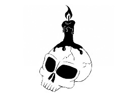
:::

ALDRICH

Raymond Tobaygo

Raymond Tobaygo's favorite genres are science fiction, science fantasy, fantasy and horror.  His favorite authors are Bear, Bradbury, Bova, Clancy, Koontz and Herbert.  He is an active member of the Writer's Carnival, writing workshop community. He also belongs to Writer's Digest and Fanstory. Raymond is sixty-six years old, and is a former teacher with a Master's degree in education and psychology.

A THICK MIST hung heavy in the late night air. Aldrich, an immensely tall, dignified man, along with Bromartin and Cedric, held their torches low to see the uneven ground. Flanked by Bladwin, Tomkins and Roberts, the men sought the source of the woman's screams. The noise had been so startling it woke the villagers from their sleep.

Armed with bows, arrows, belt daggers, boot knifes, and torches, each man moved forward cautiously. The woman's screams were nerve-shattering. Unfazed, the men continued on towards the source. They covered five newly-plowed fields and knew the wide meadow ahead led to the forest beyond.

Torches held low to see if any large creature had flattened the pasture's grass, they proceeded in this manner for one hundred paces. Aldrich stopped and lifted his torch. In the distance he could see the forest's foreboding outline.

Aldrich and his men took deep breaths and entered its blackness.

As they drew nearer to the source, the screams faded. Concerned, the men stopped to light their second torches. Blessing themselves, they called upon God to protect them.

They counted the paces, their senses tortured by the stillness. The men knew the forest's sounds, save this night for a faint muffled scream. Through the mist they saw the massive oak's outline, and from behind it, the source of the screams.

Aldrich motioned Roberts and Cedric to guard the front of the immense tree, while he and the remaining men would approach the back of the tree from either side. With Aldrich holding his torch and boot knife, they ventured forward. Movements precise; every step held to listen, they continued in this manner until they reached the backside of the huge oak. What they saw terrified and puzzled them.

"By the Lord Almighty Jesus Christ, this cannot be," Aldrich said. Next to a new born-babe lay a young woman. The only time they had witnessed this type of barbarity was during the crusade. Aldrich studied the mutilated woman. Who has done this to her? By all that is holy, it must be the act of a depraved individual.

Aldrich lowered his torch and immediately noticed her finger nails had been ripped from her cut off fingers. He held the torch only to see her head upon her gutted stomach.

Cedric and Roberts came from the front of the tree, and upon seeing the naked young lady, made the sign of the cross. "Aldrich, is this the devil's work?"

"I think not, Cedric, look closer."

The woman's eyes had been gouged out and her nose, ears and breasts cut off. Even with the mutilations they knew it was the young woman with child that went missing from the village three days past. Bromartin knelt next to the corpse. "The midwives said Adenia was soon to give birth." He traced the sign of the cross on her forehead. "Adenia, you did not deserve this fate. This is not the work of the Devil, Cedric and Roberts, but of a man with a heart as black as pitch."

Bromartin moved the torch down over her body until all could see that her legs had been broken and her toes had suffered the same fate as her fingers. Next to her feet lay one deep depression, not a cloven hoof or a three-toed impression, only one large circular mark that led nowhere.

"But what of the baby?" Tomkins asked.

Aldrich moved toward the small form and knelt to lift the babe. Its lips and mouth deeply stained, the baby barely moved. Aldrich shoved the end of the torch into the soft earth then brought the baby to his body. Looking at Adenia, he sheathed his boot knife then gathered her torn clothing to wrap the baby. He was about to lift the torch when he and the men heard a muffled groan followed by the sound of breaking twigs. Aldrich placed the baby gently on the ground behind him. He unslung his bow and quickly notched an arrow. The noises continued, but drew no closer, staying out of the torches' reach. With a nod of his head, six arrows flew, producing a loud sucking sound, the signal they had struck something soft. The noise seemed to draw closer. Within mere seconds six more arrows disappeared into the darkness.

They heard the same sucking sounds. The men's arrows were notched again, but did not leave their bows. The noises had ceased.

Confusion overrode fear as Bladwin, Tomkins and Bromartin moved toward the noise's source. Torches waist high, they came upon small piles of black sulfur powder and several large circular prints, but nothing more. They returned to the other men and told of what they had found.

"If it bleeds sulfur, we can kill it," Bromartin said.

His bow slung over his back, Aldrich reached down and picked up the baby. He loosened the torch from the ground and joined the others working their way back through the mist. They lit their last torch and returned to the village following the path they had walked on earlier.

Aldrich held the baby tightly to give it warmth. We must make our way back to the village with this poor babe. Once Adenia's husband and parents have the child, we shall mount a search to show the elders what we discovered under the great oak. He looked down at the babe and smiled. "I have seen far too much death and butchery this night. Soon you will be with those who love you."

The mist remained dense limiting their vision to just a few, the torches barely helped to make headway on their return to the village. They stopped momentarily to make the sign of the cross.

The babe stirred in the makeshift swaddling, yet did not cry out. In the distance he and the men heard faint voices, but could not quicken their pace due the uneven nature of the freshly plowed fields.

\* \* \*

At the massive oak, a shadow form returned to the corpse and consumed the flesh until only bone and hair remained. It slowly pulled out the arrows from its hideous form sniffing each one to identify their source. Not seeing the baby, it made a low guttural sound. The humans had taken the bait. When the baby awakens, I will know everything about the hamlet. The beast then vanished into the heavy mist.

\* \* \*

At the village's outskirts the men saw bobbing torches approaching them. Soon the village elders had the men and the baby within the large meeting hall. Torches extinguished, the elders, mid-wives and wet nurses fussed over the baby. In the building were Adenia's husband and parents. Aldrich and Bromartin knew of no better way to tell them what they had found. Amidst the cries of anguish and sorrow, Aldrich vowed to bring her body back by the morn.

Satisfied, all focused on the babe.

"Well done men," praised head village elder, Cravis. "As you said we will leave at the sun's rising this day. The six of you will take me and village elders, Palken and Abrakos, along with flaxen bags to bring back the remains. We will travel to the great oak to see for ourselves what you and the men explained this night."

So they come to gather the corpse. A confused lot they shall be upon finding only bone and hair. I shall watch unseen. The village of Dankforth will I ravage without pity. Once I have devastated the hamlet, I shall move on to the next wretched settlement three crusaders inhabit. Time is my ally, and for the poor wretched crusaders of this doomed village, their nemesis.

The sun rose, and the mist gradually disappeared. Aldrich and the five men rode their horses accompanied by Dankforth's elders, Clovis, Abrakos and Palken.

They arrived at the enormous tree; the men dismounted and tethered their horses to the nearest undergrowth. Arrows notched on their bowstrings, they slowly approached the far side of the tree expecting to find the young woman's mutilated body. "I do not understand?" said Bromartin, a tall, balding man of sinewy build. "What remains are only bits of bone and hair. What happened to the body, Aldrich?"

"I cannot tell you my friend. This I did not expect."

"What type of funeral can we give Adenia with these pitiful remains?" Clovis asked.

"We know of no animal that could devour a human in one sitting," said Roberts tightly.

"Whatever foul manner of this creature be, it is a beast unfamiliar to our experiences. We have seen and witnessed many a strange sight during our journey to Jerusalem, but nothing like this," Aldrich replied.

"This night past we struck something twelve times until it was silenced. We made toward it only to find many small piles of sulfur and several large round tracks that led nowhere. I know not what we face," Roberts said. "Whatever this ungodly creature be, it possesses supernatural strength to have ripped off Adenia's head and survive twelve arrow strikes."

"We must have hurt the creature, for all we heard were sucking noises." He paused, "but what say you, Cedric, to what I found beyond the oak?" Tomkins, a short, heavy-set man with a barrel chest, threw down twelve broken arrows, all covered with a faint black powder up to their fletching. "Not only did this creature break the arrows, but it escaped into the night."

"No!" Aldrich said. "Our arrows hurt the beast or it would not have retreated after the second volley. Instead of red blood, it bleeds black sulfur."

"Aye," added Bladwin, "though it possesses enormous strength to pull out our arrows. We hurt it that it could not press home its attack."

"I agree with Bladwin," Bromartin said, "the six of us placed twelve arrows into it which would have brought a wolf or bear to its knees." Bromartin looked about until his eyes fell upon Roberts. "And what say you, Roberts?"

Roberts, with the same build as Aldrich except having flowing black hair streaked with gray, spoke: "I doubt not what Aldrich or my friends said this mourn. If this beast does its bidding under the stars in the mist, how can we destroy such a creature if we cannot see it? The blood oath the six of us swore to the village elders to be Dankforth's protector is binding. This thing, be it from hell, or the spirit world, we are honor-bound to destroy this abomination."

Clovis looked sternly at Aldrich. "Of this," he gestured toward what little remained the body, "what further evidence have you found?"

"Several piles of black sulfur where our arrows wounded the beast along with several tracks the likes we have never seen." Aldrich said. "I and my men will search for more signs of Adenia while you and the elders bring her remains back to the church for proper burial."

Satisfied, Clovis and the two elders gathered the bits of bone and hair and returned to the village.

"This thing we must hunt, Aldrich," Roberts said. "Along with our bows, I would feel much safer with spears and swords over daggers and boot knives."

"It shall be as you request. Each quiver will hold our arrows and with my sword I will keep my dagger and boot knife to be used against the creature."

"And I shall do the same, Aldrich," Bromartin agreed. "Better to have as many weapons against what we must find and kill."

The men spoke in unison, pledging they would follow Aldrich's commands.

\* \* \*

In the meeting hall the midwives had cleaned the baby but were unable to remove the stain about its mouth. Finished, they wrapped it in swaddling clothes so the wet nurses could take turns feeding the baby. The child looked healthy. The wet nurses remarked at the young babe's appetite and its ability to seemingly focus its dark brown eyes on the faces of those feeding and caring for him. A few of the women felt uncomfortable with this: it was if the baby was trying to read their thoughts. Aside from this, the baby acted normal, sleeping, eating and soiling undergarments as any newborn would.

They seem to adore you, Borech. You have them fooled and off guard. Well done for a fortnight, but beware those who now search my tracks. They are suspicious of what they found in the forest and are determined to track through it to kill me.

They will never catch you, Yuugoth my mother, before my transformation. Then I shall help you defeat these pitiful souls then dine upon their lifeless forms.

My child, the man they address as Aldrich had returned from the crusades with his companions, spilling much Saracen blood. It is said upon their trip home their arrows and swords were blessed by the Pope. These men are warriors and are loyal to a fault. This village may not be the ripe pickings of past settlements we sated our appetites on during our travels. My senses tell me their meat shall give us powers we have not felt for a long time. The village of Dankforth is a dish we cannot refuse.

\* \* \*

Aldrich strode into the main hall. "Elder Clovis, we have found nothing more of Adenia, only more tracks of the beast leading deeper into the forest toward the old Roman fortress of Praxisnorum. We will eat then return to track the beast. If we do not return by tomorrow morn, you are to dispatch riders to the villages to our north and west by midday."

"We shall, Aldrich. Though they ride plough horses and those that pull Forney carts, they have made the journeys before. They are familiar with the road's features as they are known by the villagers."

"Elder Clovis, we will require six torches for each man and a horse to carry food and water for the hunt. Will this present a problem for the elders?"

"No, Aldrich. You shall have what you require."

"Many thanks, elder Clovis. We will look for tracks today before we return to the village. Before sunrise on the morrow, we shall depart to track the beast. All of us are eager for the chase." Aldrich turned to face his men. "We will not turn back until we have killed the creature. Remember well all signs so we can add them to the map that hangs in the meeting hall."

Aldrich turned to face Bromartin and the men. "We now track the beast. Do not let the creature's markings escape your memories."

"The track we found next to the corpse, we found many that retreat from where we wounded it. All head east," Bromartin said.

"Aye, they do," Tomkins replied, "but they appear larger than the first tracks."

"Their gait is wider so it travels faster," said Roberts.

"Cedric and Bladwin you eyed the tracks, what say you?" Aldrich said.

"We agree with Roberts, Aldrich," Tomkins said. "Besides the longer gait, the tracks settle deeper than those first witnessed."

"By what we know of the tracks, this is a beast which has never been revealed to any man," Bromartin said.

"All the more reason we track and kill it. From deep within my soul I feel it is evil," Tomkins added.

They tracked the beast that morn and part of the midday until Aldrich's head ached with foreign thoughts. As he turned to ask Bromartin or Roberts to take the lead, he saw his men shaking their heads. It is as I feared, the closer we draw to this abomination the more it fills our heads with doubt and despair. With considerable effort Aldrich told his men to return the way they came.

The men retreated until the feelings vanished.

"What foul thing played with our thoughts?" asked Cedric.

"Yet it did not play with our wits," Aldrich said calmly. "We were blessed by the Pope to fight evil no matter what form. Though we escaped the creature's grip, it unwittingly told me the babe in our village is as evil as the creature we hunted. We must make toward our horses."

As they neared their horses, a gasping Tomkins spoke. "Aye, I felt it too. Aldrich, its evil is growing within the forest. It must be destroyed, for we now know it is under the beast's control."

Cedric agreed. "As the creature becomes stronger it affects the child."

"We must kill the baby," Aldrich added. "We all must be of one mind as we enter the village."

A chorus of 'Ayes' followed. They had taken their horses far into the woods before dismounting. The sudden, intense image of Dankforth burning filled their minds. Each man looked at the other and nodded in agreement before running towards their steeds as if pursued by banshees.

Once they reached their horses, each man, exhausted, took a knee and drank water from their goatskin bags. Their thirst sated, they mounted their horses. The men made their way through the forest until they reached open ground, where they began a mad dash to Dankforth.

\* \* \*

They tracked me into the forest to destroy me. My attempt to control their minds proved useless. You must begin the changing before the men arrive so you can kill what villagers you find. This will leave the village for us to ravage and feed upon. Do the women suspect you?

No, Yuugoth. They suspect nothing as they fuss and care over me as if I was one of their own, but I do not have the strength to do so.

You must! Aldrich and his men suspect otherwise. They retreat towards their horses. You must change as the sun sets, for by early morn they will arrive to crush you.

If I transform now, it births a creature strong enough to kill the woman, but beyond this, I promise nothing.

Release your evil, and let the beast loose to devour those in the hall. Once done, I will follow the horsemen's path to Dankforth.

\* \* \*

Bladwin was the first to notice a thin black column of smoke coming from Dankforth as night lifted, and he alerted the weary men. Aldrich looked into Bladwin's tired eyes and nodded. Without a spoken word they spurred their steeds towards the village. Though each man's thoughts private, all knew instinctively it was the baby.

Within the hall, a black impenetrable mist had enveloped the baby and expanded slowly until it was larger than any man. As the mist cleared, it revealed the unrecognizable remains of the wet nurse. The creature had a large cat-like head with saber teeth that glowed bright red. The same red outlined the large eye as black as the mist whence it came. The creature was outlined in broken patterns of red with paws showing long sharp claws. Its tail, nearly the length of its body ended with long red blades. From its large mouth came a low, vibrating guttural sound.

The three women in the hall tried to escape, but the creature was upon them. In the brief, futile struggle for life, lit candles were knocked over, starting a fire that spread quickly over the dry wood.

The villagers, after a hard struggle, managed to keep the fire from spreading. Exhausted, skin and clothing covered with black-gray ash, they watched in horror as the creature slowly emerged from the rubble.

"Quickly, to the church!" the village's elders shouted.

The creature snarled, but did not press the attack. Sounds of anguish, fear and confusion mixed with the strong shouts for able-bodied men to grab pikes.

\* \* \*

Yuugoth, you did not tell me this insignificant hamlet had a house of God or men with long, pointed weapons.

They matter not. I now follow those who sought me. With the horsemen you must use caution; the arrows they carry can be deadly. Burn all the buildings, and kill all those not inside the church.

Why cannot I destroy the church and ravage those within?

Patience, Borech. You may have them after I have had my way with the horsemen. I shall enjoy flaying their skin as I listen to their agonized screams. Now go and satisfy your blood lust.

\* \* \*

Horses foaming at the mouth, Aldrich tasked the others to keep pace.

Roberts first noticed the smoke was contained to one area of the village until he saw smaller plumes from different locations. He spurred on his horse until he was even with Aldrich. "It appears more of the village burns, Aldrich."

Aldrich pulled on the reigns. Puzzled, confused looks covered their faces as they circled him nervously. "Whatever is burning our village will expect us to ride directly into Dankforth. We shall enter from the back and put our arrows into the beast. Bromartin, Roberts and Tomkins, you will approach the village from the blacksmith's stable while Cedric and Bladwin approach from behind the church. I will enter by the main road. All arrows are to be strung. If you disagree, now is the time to speak."

Bromartin spoke first. "Your words tell us you have experienced this before, Aldrich?"

"When I was separated from you near Jerusalem, I encountered three settlements that suffered the fate which besieges our village. At first I thought it the work of bandits, or, as we were near Jerusalem, the much hated Characins. To my fear and disbelief, we found the villages inhabitants burned in a barbaric manner. In all my fighting with you my friends, this I had never witnessed. All the buildings were burned lest the village had a house of God. Inside these structures we found people who had starved to death, yet we found no means to keep them in. They appeared to choose the sanctuary of God and a slow and agonizing death to what lay outside."

"By the heavens," Cedric said, "we must approach the village with great haste before all are lost!"

"Aye, I agree!" Roberts shouted. "The longer we delay, the more villagers will perish!"

"And we shall, as planned," Aldrich reassured. "Remember, the men in the village are armed with pikes. If they fight it may help us. Our only hope is our people have made it to the church. NOW RIDE AND STRIKE AS PLANNED."

\* \* \*

Yuugoth, our prey have long sharp poles that wounded me thrice. The remaining quarry escaped into the church. I tried to enter but was hurled back several lengths. It is cursed.

Patience, Borech, holy water must be present. Search the remaining village, and kill all things living. When done, burn everything to the ground. Be quick about your task for the riders approach.

As you wish, Yuugoth, but my wounds burn deep.

All the more reason, my son, to release your vengeance upon the village until I arrive to sup upon their bones.

\* \* \*

Aldrich stopped. "We will dismount here and enter the village as planned. You will be of no use if thrown from your horse. Do not be afraid of what you see. It can, and will, be killed by our arrows. Now go, and may God be with you."

As Aldrich planned, Bromartin was the first to dismount, followed by Tomkins, and Roberts. Two body lengths apart, bows at the ready, they moved forward. Tomkins whispered he smelled sulfur. Bromartin and Roberts nodded and slowly pushed forward.

Cedric and Bladwin noticed the horses in the stable were pushing against the wooden gate. Bladwin opened it, and the horses bolted. The stench of sulfur offended their senses. Bows taught they quietly moved forward, but heard nothing save the sound of crackling embers.

Three buildings distant they caught a fleeting glimpse of a dark creature. Cedric and Bladwin looked at each other as they made the sign of the cross. Senses alive, they proceeded, back-to-back, down the street that led to the village green.

Dismounted, Aldrich brazenly entered the village and challenged the creature to show itself.

As he did this, Bromartin, Roberts and Tomkins moved slowly forward. The reek of sulfur amidst the crumbled, smoking ruins became stronger. From the burnt structures, the creature pounced on Tomkins and tore at his flesh. Stunned momentarily, Tomkins screams brought Roberts and Bromartin to action. Within moments, each unleashed three arrows. The creature let out a hideous shriek then bounded away. They rushed to Tomkins side only to hear him whisper, "Take care of my family," as the life drained from his mauled body.

Cedric and Bladwin did not hear the ruckus and continued their search, the smell of sulfur fading, until they reached the burnt shell of the village's hall. Here they stopped and listened. They heard the sounds of crumbling structures, but nothing more as they made their way towards the village green.

The sulfur smell was overpowering. Cedric turned to his right and saw the tale of the beast disappear behind an untouched building. He touched Bladwin's shoulder and motioned that the creature was trying to flank them. Without hesitation, they ran to the village green and waited.

Aldrich continued to hurl insults at the beast until he approached the green. Cedric and Bladwin, hearing his voice, shouted until Aldrich acknowledged their location.

Bromartin and Roberts heard the faint voices. With silenced caution, they made their way towards the others. Four buildings from the green, the odious smell of sulfur caused them to wince. An ear-splitting roar and the creature emerged fifteen paces from them. Seeing Tomkins's lifeless body, their bows let loose, Robert's arrow striking the beast just below its large black eye while Bromartin's hit the chest. The men let loose another volley striking the creature in the shoulder and neck. The creature shrieked and ran towards the village green.

\* \* \*

Yuugoth, the wounds I suffer drain my strength. I no longer have the power to burn. The horsemen hunt me like a common creature. I have killed one, but their projectiles repelled me from killing more. I must hide to regain strength or I shall die.

Borech, you must remain strong. Go back to the slain horsemen and devour everything. This will give you the strength you seek.

I am losing black mist. I will seek out the dead meat and consume it before I kill the horsemen.

No! You must wait for my arrival. Together we will smite all.

My pain is great Yuugoth! After I devour the meat, I shall butcher them and drink their blood.

Borech, my child, you must listen to me. You must wait.

For them to hunt me? NO. I will kill and devour them!

\* \* \*

On the village green, the five men formed a circle and waited for the creature to strike.

"The smell of sulfur is weak, Aldrich. We must fetch Tomkins and bring him to us," Bromartin said.

"I agree, before this ungodly thing devours him. Cedric, Bladwin and Roberts, you are to remain here and watch for the creature while Bromartin and I retrieve Tomkins." Aldrich looked about. "Fortunately, the green will keep the fires from spreading. Our arrival must have stopped the beast from doing its bidding. Keep sharp, and may God be with us."

Both left the green and headed for the narrow street where Tomkins lay. The buildings, having burned fiercely, were now smoldering skeletons and crumbled heaps amidst a blanket of smoke-filled haze. Side-by-side, bows drawn, they slowly moved forward until Bromartin saw the creature's outline atop Tomkins's body.

His arrow struck true as did Aldrich's. Within seconds, the creature approached and lashed out at Bromartin with its scythe-like tale, severing his head. Briefly stunned, Aldrich let loose three arrows in rapid succession that struck the creature's head, causing it great agony. Aldrich realized he could do nothing for his friend and backed out toward the green as the beast clawed at the arrows.

He joined Roberts, Bladwin and Cedric. They heard the beast draw near. As it cleared the lane, they saw it oozed black mist. Barely fifteen paces from the men it paced slowly back and forth until it stopped, its huge red-lined black eye fixated on its prey.

Sweat drenched their clothing. They faced many dangers during the crusade, but nothing this evil. Aldrich spoke, his words low and precise. "It is set to charge. Aim for the eye. Should it turn sideways, step back and beware its tale as it took Bromartin's head as you would knock a pumpkin from a pole. Let your arrows be true and strike the creature until it dies."

"Blessed Mother of Christ, what is it we face, Aldrich?" Cedric whispered.

"Aye, it bleeds black sulfur as did the creature in the forest," added Bladwin.

"Pray tell us what we face, Aldrich?" asked Roberts.

The cat-like creature paced to and fro as it looked for a weak spot to strike. It focused on Cedric and bound towards him only to have four arrows pierce its eye. Its' momentum carried it into Cedric knocking him to the ground, its dead weight crushing him. The remaining three men let loose two volleys of arrows to ensure its death. The black mist drained from its still body until nothing remained but its grotesque skeleton atop Cedric.

"Roberts, Bladwin, instruct the village elders to oversee those in the church to gather haste all manner of food and water before they return to it. Tell the pike men to join us on the green. We will need their weapons to fight what comes."

"Before we fight, what did we slay, Aldrich, at the price of three of our crusader brothers?" Cedric asked.

"Do first as I ask thee, my brothers, and I will tell you and the pike men."

Roberts looked at Bladwin who gave a brief nod. "Fair enough, Aldrich. We can wait till then."

\* \* \*

Borech, answer me! I must know of your condition and that of the hamlet I approach. Borech, I must know. After several attempts, Yuugoth realized Borech was dead. Rage, denial and utter disbelief filled her. Why did not the villagers fear Borech? What breed of men are these, that no village could kill before? No matter, they shall feel my full wrath and vengeance as I pull the bones from their bodies and drink their blood.

\* \* \*

As the villagers continued to store food and water in the church, Aldrich knelt and took stock of the men about him. Aside from Roberts and Bladwin, from the fifteen pike men, only two remained. They were joined by the four village's four huntsman. Unsure only eleven men could kill what approached, he began his explanation.

"When I was separated from you, my brothers, I was with a French scouting party. We came upon a village without church or other building of worship. All that remained were burnt corpses and charred piles wood. Later that day we captured seven Characins who told of the creature which lies upon poor Cedric. This thing was under the spell of an evil, a one-eyed, clawed cloud-mist that even the evil Muslim Jiins avoided. This knowledge they gave freely, telling us it was controlled by a Characin sorcerer called, Akbarmun. They told us it sacked numerous Muslim towns, until the sorcerer was killed by a crusader which freed the beast."

"But why us?" interjected Roberts.

"And why now, Aldrich?" Bladwin added, his voice tainted with uncertainly.

"It hunts those who fought against the Characins and killed its master. Look about you. Our village had ten plus seven which heeded the call to arms. Of those, only five remain; you, Bladwin, me and the two pike men, Jameson and Wainforth. The Characins said what approached would be pure evil."

Wainforth spoke with measured courage. "Those of us who dipped the heads of our pikes in holy water found they penetrated the thing wounding it."

"Our arrows killed," said Roberts, "because they were blessed by the Pope. Now, with our blessed arrows spent, we must dip our remaining arrows in holy water. Our swords need not holy water as they were blessed. All arrow heads, knives and daggers, including those of our slain comrades, are to be dipped into the holy water as Jameson and Wainforth did with their pikes. We must do this now so we can plan our strategy."

\* \* \*

Yuugoth made its way from the forest and into the open meadows before the village's plowed fields. They await my coming. I shall enter where Borech's bones remain and splinter their bones and eat their marrow. They are a feeble lot which I shall slay with great pleasure.

\* \* \*

The villagers safely in the church, Aldrich's plan was acted upon. The pike men would stand guard at the church's locked door. Roberts, with two huntsmen, would take position at the southern entrance to the green. Bladwin and a huntsman would guard the northern approach. Aldrich, along with the last huntsman, would lie in wait between the stable and blacksmith's area.

The wind started as a soft caressing of one's cheek only to be followed an intense sulfur-laden smell. Aldrich and the huntsman were the first to see the cloud-like body enter the village from the east and make for the town's green where Roberts and the huntsman stood guard.

Aldrich and the huntsman circled around the village's outskirts. They slowly gained ground until he heard Roberts's shouts.

Aldrich and the huntsman moved forward and saw the creature gradually make its way toward Robert's position.

Roberts and the huntsmen let their arrows fly only to see them disappear into the cloud. At that moment, Aldrich and his huntsman let loose their arrows with the same results. Bladwin and his huntsman fired two volleys into it only to see their arrows vanish as well.

The creature groaned as more arrows found their mark. Enraged it made towards Roberts's position only to feel two deep, burning probes enter its side from the pike men. Infuriated, it swung its arm-like vestige at both men, cutting them in half.

As it turned it exposed its great eye, which Roberts and two huntsmen struck with ease.

Its pain unbearable, it charged the men as three arrows penetrated just below the eye. Within seconds it enveloped the men. Roberts plunged his sword into the cloud. The muffled screams enraged Aldrich.

Bladwin and Aldrich, with the remaining huntsmen, ran from the green to the village's only two story dwelling.

Yuugoth saw this and made for them.

From the top windows they could see the cloud was rapidly losing its black mist.

"We must aim for the eye to kill it," Aldrich commanded.

"Between us we have nine arrows, Aldrich," said the taller of the huntsmen.

"I have three,' Bladwin said.

"And I five," said Aldrich.

There was a tremendous shriek. The creature's eye, now no more than thirty paces from the building, moved towards the men. On Aldrich's command, they let loose their arrows, each striking the creature's eye which poured black sulfur. With one final effort, the creature crashed into the building, knocking it down.

Upon seeing this, the village elders opened the church doors and raced toward the building to look for survivors. There was movement. It was the huntsman Bryce. They carefully lifted him from the debris and laid him on the village green. Though he had a broken arm and leg, and cuts to his face and arms, the elders knew he would survive.

More digging and another body stirred. It was the huntsman, Mangroth. He was in a bad way: two broken legs, a broken wrist and a long gash across his back. He too was carried to the green and laid next to Bryce.

After more digging they found the still bodies of Aldrich and Roberts. To the villagers' confusion, neither man was marked. It was though they would sit up at any moment and talk. In their hands were boot knives and daggers covered with in sulfur.

Three days later, all which helped kill both beasts were laid to rest in a section of the cemetery consecrated for the heroes of the Battle of Dankforth.

::: {}
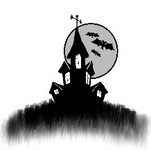
:::

QUEEN OF THE NIGHT

Kelleigh Elizabeth Perry

Kelleigh Elizabeth Perry is a full-time Registered Nurse at a Children's Hospital by night, and a writer of all things horrific and supernatural by day. She is also the co-founder, co-owner of Writer's Carnival, www.writerscarnival.ca, a successful, online writing community.  Her self-published work, Unique, won the 2012 Hollywood Book Festival, fan-fiction category. She has also won multiple online writing contests. She currently lives outside of Seattle with her small army of bunnies, secretly dreaming that someday a handsome vampire will come along and turn her.

THREE VILLAGES AWAY, just after twilight stomped out any vestige of the day, I heard the rumblings indicative of an impending battle. It was clear there was blood to be shed, and the lycanthropes were stirring the pot. My curiosity piqued when vaguely familiar voices rose above the din of the pack. Unthinkable, those of my own species, created from my blood alone, would dare risk their lives fighting with dogs on the eve of a full moon. Who were these fools, these indiscriminate night-walkers, who so carelessly toyed with the gift of eternal life which I bestowed upon them? I rushed through the darkness toward the noise of the scuffle, creeping among the shadows of the buildings, desperate to see the faces of these traitors and the mongrels.

Standing with my back against the cool bricks, I slid my tongue across my fangs, delighting in the pain as they tore into the fleshy muscle. 'The Queen's Kiss', it was called. Just a taste of my blood could save the most terminally injured from certain death and provide immortality. I alone am The Creator, and I alone shall be the one to destroy them. I delight in the first embrace, the feeling of their lips upon my own, and the passionate affair when they realize that their feelings and emotions are heightened. With all of their faculties eternally enhanced, I welcome them into the family. They seek me out, but the pleasure is always mine and only occasionally theirs.

From my vantage point I could see the mutts' faces, slowly and painfully mutating. I enjoyed listening to their screams of agony as their bones twisted and broke, their backs hunched, and their as their bones twisted and broke, their backs hunched, and their hands and feet became paws. They are among the ugliest of supernatural beings, and all should be vanquished from the face of the earth, but that would take time. My family was growing, but it was not yet at the capacity to which it would need to be to destroy the werewolf line. Besides, I was having the time of my afterlife adding to my exquisite collection. Now these four threatened to break off a branch of the family tree. Over my undead body!

I sensed the others circling nearby, vampires and werewolves alike. The eight who stood before me were only a small number of those who would undoubtedly come forward to defend their own kind. Four facing four, fangs bared, ready for battle, my children stood idly by waiting for the others to complete their transformation. Fools! Respect is one thing, but not when your life belongs to me. Who were these rebels, these careless, angst ridden bastards? If they lived through this fight I might just kill them myself. If only I could see their faces.

I turned to find a following of sweet and supple young vampires waiting, hoping to be chosen as my evening concubines. Raising my head, I flashed my fangs. They dispersed quickly. Tonight would not be their night. I rushed through the alleyways to the side of the local pub. Its windows were dark. The owner must have heard the ruckus in the streets and shut the place down. Good. The last thing I needed was a drunken gang of humans distracting us. Peering out into the square, I caught sight of one of the men. Blasphemy! This wasn't a group of newborns, but my trusted, original circle who stood in front of the beings who could end their lives only during the full moon. Tonight!

The normally icy blood boiled in my veins, for these were the most precious of my lot, my prize studs, who I called upon regularly. They were not to be lost to a dog-fight. A door slammed behind me as a man ran out of the back of the bar. I saw the worried faces of his friends gazing out the window, smiled wickedly over at them, and in a flash I was on him, biting down into the delicate arteries and veins in his neck. The screams my act elicited only made me want to kill him more. I waved over two of my beautiful girls and handed him over to them. Turning back to the men in the window with blood running down my chin, I hissed and ran towards them. Laughing at the comical display of men tripping over tables, chairs and one another, I resumed my position and awaited the first move.

The hounds growled viciously as my boys stood smirking back at them. I knew not what their plan of attack would be, and I grew increasingly anxious as the seconds ticked away. My coven slowly emerged from the shadows, and the sound of the panting wolves pulsed in my ears. It was revolting. I felt many eyes trained on me as they awaited some sort of signal, however I was just as ill at ease as they were, and obviously less informed.

At once, the werewolves pounced, knowing that it would take just one small bite to take down the eldest, strongest and most beloved of my flock. I started to advance towards them, but was halted by a small army of young vampires, holding tight around my waist, my wrists and ankles. They knew they were risking their eternal lives by attempting to thwart my advances, yet they held their ground and kept me at bay. I watched as the dogs came crashing down on those beautiful bodies, and I yelled out. A hand reached around and covered my mouth. A brave soul risking his limb, as I would have gladly bitten it off had I not seen what had become of the warriors.

Four heads rolled away from their bodies, bloodied and severed, each returning to its human form. Four stunning men stood victoriously with silver blades in hand, daring the rest of the pack to attack. I watched as dozens of silver blades were extracted from baggy clothes all around the square, and doggies dropped off one-by-one as my brood ran out from the tree-line. Several of my own were injured, seven fatally as their hearts were torn from their bodies by the canines' gaping maws. I wrestled my way out onto the square, caressing each of their faces and allowing them one final kiss before death stole them away.

The carnage was massive. Bodies lay scattered throughout the village square. The streets ran with blood, and the mutts paid the ultimate sacrifice. I ran to my boys, embraced them each in turn before violently biting into their necks. Let that be a lesson to them. They would not be welcomed into my good graces or my body for many nights to come. I would spread the wealth, and let them fester for a while. They each knew what they were missing, and believe me, they would certainly miss it. I kicked one of the severed heads into the street as I made my way back to my lair, carefully choosing my mates for the night. Both he and she were more than willing.

As I gazed out the window of my boudoir, I could see a bright orange light as the bodies of the fallen were burned for all to see. My attention was short-lived; I had my own fires to set. The two chosen ones awaited as three humans were led into the room. It was only right to feed before the night's activities. I stood before them, assigning each victim to their death, keeping the female for myself. I whispered in her ear, "You've no idea how lucky you are, my pet," before making the kill. As we enjoyed our blood meals, I heard distant howls of anguish and loss. I laughed at their pain.

Perhaps that will teach them never to mess with The Queen of the Night.

::: {}
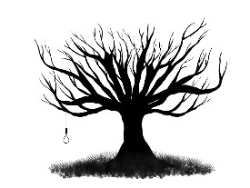
:::

STRANGE STARS

Shaun Adams

Shaun Adams lives and works on the Isle of Wight. He has turned his hand to different things over the years including a short stint as a gravedigger. Writing is his passion and he indulges it whenever time allows, which is not as often as he'd like. Shaun has self-published two short story collections and been published in several magazines both online and in print. He is enjoying a prolonged second childhood before slipping gently into old age and absentmindedness. He has had a love affair with reading his whole life. Horror, science fiction, fantasy and westerns all float his boat, providing him with inspiration for his own writing. Shaun's future writing plans include another short story collection and a novella or two.

\"I will sweep away everything in all your land,\" says the Lord. \"I will sweep away both people and animals alike. Even the birds of the air and the fish in the sea will die. I will reduce the wicked to heaps of rubble, along with the rest of humanity,\" says the Lord.

Zephaniah 1:2-6

THE WOMAN IN the black-boned corset looked up, as Cameron Rose stepped through the bat-wing doors of the honky-tonk, a sardonic smile trembling on her ruby lips. A silhouette bathed in dawn's light, Cameron shook his head, agitating uncountable reams of swirling dust motes.

"I'm not going to waste time with excuses, but I came back as soon as I could."

The big man took a step forward.

"You're too late handsome, much too late," she said.

"Who did this?" His voice cracked on the words, and his right hand rested on the handle of the sawn off side-by-side shotgun tucked into the intricate leather belt slung around his hips.

"It hurts, sweetheart. It hurts so..."

The renegade biker moved toward Lily, falling to his knees in spilled beer and sawdust, and he touched his forehead to her knee.

"Did...did you find a way back?" Lily asked.

Cameron shook his head.

"I don't think there is any escape from Bile County. I think we got a one-way ticket, Lily. Along with every other lost soul that ends up in this crazy fucked up world of weird skies and strange stars."

"You will find a way back to our world; I know you will, my love."

Lily's words came out as little more than a whisper.

Cameron watched the inky flower of Lily's lifeblood slowly blossoming on the floor beneath her chair. Felt her shaking hand rest upon his grizzled head.

"I'm going home now, my darling. England in July, that's where I'll be."

Her last words impaled his already breaking heart.

Cameron stared at the ugly hole in Lily's belly. The flow of blood from the ragged intrusion in her flesh had all but ceased and there was a smell. He looked closer. A faint almost ephemeral phosphorescent taint adhered to the wound site. He looked up and saw the vitality fading from the eyes of the woman he loved above all else.

"Lily, don't leave me like this."

There was no reply. It felt like invisible hands were squeezing Cameron's throat. Lily had given up the ghost. Cameron's mind drifted, a funeral barge untethered, unmanned. He knelt before her, hot tears dripped from his eyes to mingle with the already congealing blood. A watery, yellow discharge began to bubble out of the hole in her stomach and a dark fire ignited within Cameron's soul.

He turned at the sound of footsteps. Men from town, his old friend Saint among them. They shuffled their feet, uneasy in the presence of another's grief.

"It was an interloper, Cameron. A lunatic, two townies dead, Milo Thomas and the butcher, they hacked him to pieces with his own cleaver and hung the parts in his shop window. Milo, he dropped dead of a seizure when he saw what happened to the poor butcher\..."

Saint faltered, unable to look his friend in the eye.

"Nobody tried to stop him?" Cameron asked. The question hung in the air, a thinly veiled accusation.

The men in the room eyed each other nervously.

"He came out of nowhere at dawn. Caught us off guard..." Again, Saint's voice trailed off.

It was not lost on Cameron that Saint said two townsfolk. It irked him that even his friend still viewed Lily as an outsider. He shrugged off the urge to rail at their xenophobic traits. These people had good reason to fear outsiders, even ones who had lived among them for years. He got to his feet and stood with his head bowed before Lily's warm corpse.

"Burn the entire building, Saint. When you're done, throw the quizmaster in the butcher's shop, burn that too. Do it now."

A hapless townie gasped as Cameron spun on his heel, barged through the gathered group and out the bat-winged doors to the street

"Ain't natural that a man can move so fast."

Saint stared the complainer down.

"Shut the fuck up and do like he says."

Outside, Cameron's motorcycle reclined on its stand, metal ticking as it cooled.

"Every man needs a shovel," he growled, admiring the old Harley Davidson.

He swallowed hard, trying to clear the blockage in his throat, his eyes stung. In the magenta sky above, the blistering orb of the sun crawled to its zenith.

On the butcher's door a ragged piece of paper fluttered in the hot breeze, pinned there by a thin bladed knife. Cameron crossed the street, triggering dust devils with each footfall.

The note said, 'We bury our dead here. Don't interfere!!!' The ink was still wet.

Cameron removed the knife, screwed the note into a ball, and tossed it into the street. They might not be averse to a change from tradition if told about the plague, he thought. Almost absentmindedly, he slipped the knife into an empty sheath on his belt.

He turned as the townies came out of the honky-tonk. The door swung shut behind them. Tendrils of smoke coiled out from a side window and dispersed on the wind. His stomach churned at the thought of Lily left alone inside. The townies departed, subdued. Saint alone remained, standing beside Cameron's V-twin Shovelhead.

Deep within the labyrinth of his mind, Cameron weighed the situation. He wanted to leave immediately, hunt down the interloper. He heard explosions inside the honky-tonk, fire discovering the alcohol behind the bar and getting frisky with it.

Fire would purify Lily but not those other wretched souls. If their bodies went into the ground this whole town would die. He knew this to be true.

Saint could stay here to supervise this clusterfuck but he knew he wouldn't leave his old friend alone. He crossed the street.

"I'm so sorry, Cameron. I was out repairing fences. By the time I got here..."

"I know."

Cameron placed a hand on Saint's shoulder.

"He came to town on a motorcycle, like yours. Left in a hurry."

"Then we need to move fast, saddle up that mare of yours. We need to get to the dead center of town."

"Oh, you mean the boneyard." There was no warmth in Saint's smile.

"Yep, that murdering bastard was a plague carrier. You know what I'm talking about."

Saint grimaced. A memory of tortured flesh and teeth rising through dark soil crossed his mind. He'd ridden with Cameron before when the big man travelled through Bile County.

"I'm willing to bet a couple of burials are taking place today. Who's new in town?" asked Cameron.

The tin tabernacle bled rust into a parched hillside northwest of town. Cameron's bike chugged up the track in low gear. Saint plodded alongside on his old dun mare.  The bone yard claimed the southern slope of the rise. The two men came to a halt at the cemetery gate in the shade of a towering stone angel with a broken wing and bullet holes for eyes.

The chapel's corrugated sides rattled in the hot wind that scoured the hilltop. Cameron considered the terraced slopes and pathways of the cemetery to be a strange facet of this place of dry bones and immortal souls.

He drew brass binoculars from his saddlebags and scanned the terraces.

"I see them, Saint, two diggers, a woman, a preacher man."

"That'll be Pastor Clyde and his wife, zealots both."

"The diggers?"

"Pension men, paid by the town council."

Cameron's neck tingled. A bewitching signal danced along his spine. Rusty hinges creaked. He cried a warning, drew a knife that had only recently pinned a note to a door in town. A fiery discharge bloomed from the tabernacle door. The man's throat opened in a tacky red ribbon even as he tried to chamber another round. His eyes reflected his dying thought. 'It ain't natural that a man can move so fast.'

"I ain't got time for this," Cameron said.

He turned and strode down through the terraces to confront Pastor Clyde and his followers. Saint had to jog in order to keep pace with him, his crop of sandy hair bouncing atop his head.

The small group ahead of them looked agitated. The two pension men climbed out of the holes they had been digging and clutched their long handled shovels warily. The pastor appeared to be having a heated discussion with his wife, their arms gesticulating wildly, heads so close together they appeared to be kissing.

Cameron approached to within ten feet, halted, drew the sawn off shotgun from his belt and let its presence sink in. The hired gravediggers threw down their shovels and ran off back in the general direction of the town. Saint grinned. For old men, he thought, they moved fast. He was having a struggle catching his own breath after keeping up with his friend.

"Pastor Clyde?"

At first, Cameron thought the pastor meant to ignore him, but slowly the man straightened up and turned to face him. When he smiled, the man's teeth seemed too big for his face; thin black strands of hair crisscrossed his sunburned head. It wasn't the teeth or the bad comb over that intrigued Cameron though, it was the man's clothing.

"Don't recollect seeing you in town last time I visited, Pastor. That's a fancy outfit you're wearing. It's not often we see a turquoise shell suit around here."

Pastor Clyde didn't miss a beat. He stepped forward opening his hands palms out in a friendly gesture, his smile never wavered.

"Ah, now then, Mr. Rose. Yes indeed. We only arrived recently, came to minister the sick, aid the needy. Spread the word."

Cameron's eyes flickered between the Pastor and his wife. While the Pastor remained outwardly friendly and calm, the woman beside him fidgeted. Eyes cast down, shifting from one foot to the other. Her long black dress swayed as she moved, scattering dust from around her feet like a witch's broom.

"What word would that be?" Cameron asked, his trigger finger tensing imperceptibly.

"Please, Sir. I'm just carrying out the wishes of the good people of this town. Laying the recently departed to rest in a seemly manner," the Pastor said. His wife's long bony fingers gripped his arm.

"He knows," she hissed.

With a banshee like howl, she ran to Cameron's left in a feint designed to draw his attention. The Pastor leapt forward, arms raised, his face a spitting mask of hate.

Saint couldn't pick up on all the subtleties of the interaction, but he had teamed up with Cameron Rose enough times to know when the big man needed back up. He slipped unnoticed behind the Pastor and his wife; he stooped to pick up a discarded gravedigger's shovel, and waited. When the woman took off, he was ready. He swung it with all his might, the flat part of the metal blade hit her full in the face, stopping her in her tracks with a ringing thud.

Cameron expected nothing less. He paid her no mind, and when the Pastor charged, he squeezed both triggers of the shotgun. It discharged a full load of lead shot into the man's face, erasing it and the bad comb over crowning it in a welter of crimson spray.

"What's a shell suit then?" Saint asked.

"A fashion faux pas long ago and far away from here, I met Lily in England." Cameron said.

Saint shook his head, bemused. He placed the tip of the shovel on the back of the woman's neck and stepped on it hard. He didn't bother to mention that he had no idea what England was any more than he knew what a shell suit was.

"How did you know, Cameron?"

"That they were in league with the plague carrier? I saw it in their eyes. Saw the hunger and the madness."

Saint shrugged, there was a lot he didn't know about his friend, but he accepted the big man's judgment on these matters.

He did not know how anyone could stoop to such evil deeds as helping a plague carrier, luring one toward an unwary town, planting their seeds in the earth. He was grateful that when night came, nothing would be clawing its way back out of the ground in search of living flesh in his town.

His town?

A moment of understanding struck Saint with the same force he'd used to swing the gravedigger's shovel at the woman's head. He could not stay here. If he did, the people of this town would hang him for a murderer alongside Cameron. Together they would dance on thin air, become the bloated fruit of the gallows tree.

It did not matter that he was born among them, people who lived and died without ever going beyond the outskirts of town, deeply religious souls who mistrusted the outside world.  

They knew nothing of plague bearers and their followers.

\* \* \*

Together they piled up the corpses of the Pastor and his wife along with the remains of the two unfortunate victims from town.

"Where do you think the plague bearer will go?" Saint asked.

"North East by my reckoning. Cranville. He'll follow the road."

"But that's...nobody in their right mind goes there."

"Yeah, I guess he'll find that out."

The blue ice in Cameron's eyes chilled Saint to the marrow.

"Well, what are we waiting for? If we ride now we can be there soon after sunset," Saint said, with more confidence in his voice than he felt in his heart.

Soon after midday, a man on a motorcycle and a man on a horse rode northeast away from a cemetery on a hill. Behind them, a column of oily black smoke rose into the sky.

Ruby Keller woke sometime after midnight, disturbed from sleep by Dominic thrashing beside her. Her world was silent, born deaf and orphaned in the first three years of her life, she survived twelve seasons on her wits alone. Though not true kin, Dominic was like a brother to her, they looked out for each other.

Pale fingers of light from a three quarter moon pierced the gloom of their resting place beneath the town hall porch, arcing down through the cracks in the wooden boards above them. In a mining town like Cranville, orphan children were a sad reality of a harsh working environment but little provision was made for them. They survived as best they could.

Reaching over, Ruby placed a hand on Dominic's shoulder, gently shaking him until he woke from the nightmare gripping him. His eyes opened wide. She placed the first finger of her right hand to her lips indicating he should be quiet. Something was moving out on Main Street.

During their time together, they had developed an effective sign language that enabled them to communicate almost anything. She used it now to alert Dominic they could be in danger. Together they shuffled forward using knees and elbows until they had a better view of the street.

Normally, there would be nothing to fear from adults. People in Cranville rarely partied or got drunk. Working in the slope mines surrounding this desert town soon exhausted any desire for regular hard drinking.

In the small hours of the night, an orphan child's worst fear would be a pack of coyotes getting confident enough to wander in from the desert and grab what they could. Just the previous summer, a young girl had died that way, her ragdoll body dragged off into the night.

Ruby shuddered at the thought of it. In another six months, both she and Dominic would be old enough to apply for jobs in the mines. Then, she thought, their circumstances would begin to improve.

Despite the warmth of the night, Dominic's hand felt cold when it grabbed her wrist. She followed the direction his finger pointed. Her heart skipped a beat in her chest.

A column of figures approached along Main Street from the southwest, bathed in moonlight. They looked like men, but they were not. Ruby was sure of it. She looked at Dominic to check if he was seeing what she was seeing. His terrified expression told her he was.

They came up Main Street like an invading army, creatures that looked like men. They were impossibly tall; some wore long black cloaks from head to foot while others were virtually naked apart from strange trinkets dangling from their necks, wrists and ankles. At the head of the procession, two of these creatures supported an enormous pole from which hung a ragged cloth banner covered in blood red symbols she did not recognize. The figures not wearing cloaks had short, muscular torsos and long, pale limbs. There was no hair on any part of their bodies, but perhaps worst of all, in their faces they had vertical slits for eyes and no discernible mouths.

Dominic's grip on her wrist had grown so tight it hurt. She turned to look at him. His face was ashen, his eyes wide. She tried to pull away but he would not let go.

The terrible procession continued, grew level and began to pass by. Ruby hardly dared draw breath as the pale limbs and black cloaks drifted past. She viewed it all from a place of silence. She may have been deaf but there was nothing wrong with her sense of smell.  Her nose wrinkled, offended by the strange odors that accompanied the column of men but not men. Odd perfumes, pungent, cloying, filled the night air, but underpinning that heady mixture there was something else, the smell of rotting flesh making her want to gag.

Midway along the column, a vehicle of sorts hove into view, a great black cage on wheels pulled by a team of the pale-limbed creatures. It reminded Ruby of a birdcage she had once seen in a shop window. There were no birds in this one, only people with vacant staring eyes.  

\* \* \*

Obadiah pressed a calloused thumb to his nose and blew a thread of snot from one nostril. Splattering the sterile bedrock, it sizzled in the heat.

He saw movement. Desperate, the orphan boy bolted, running into the desert. Obadiah grinned, exposing his three remaining teeth. He raised a Smith & Wesson 500 revolver with both hands and fired.

The boy's scalp lifted as the bullet from Obadiah's pistol tore through his skull. He staggered on a few more steps, brainless as the scarecrow from The Wizard of Oz, before sagging to the ground in an awkward heap. Obadiah did a little dance, kicking up dust with his worn out boots. He flapped his arms like chicken wings.

"Haw, I done fucked his shit up, God. I was on him like a hobo on a ham sandwich, for sure."

He came to a standstill, stared out into the empty desert and sighed.

Obadiah placed the handgun to his temple and smiled.

"I'm the last human. The crown is mine. You gotta give it to me now, God."

His nicotine-stained index finger tightened on the trigger of the gun, its muzzle burned the skin on his forehead. Somewhere a bell tinkled.

Obadiah's brow puckered. He wanted to believe it was just the wind, but there was not even the ghost of a breeze to stir a lazy dust devil. He lowered his weapon and turned to glare at the town behind him.

\* \* \*

The carcasses of dead people littered Main Street, but no flies swarmed on them. There were no birds in the sky, not even a feral dog skulking in the shadows. The world had become an empty place, except...the bell tinkled again.

Obadiah turned on his heel. The door of the shop stood open. He could see the brass bell above it, still reverberating on its steel spring. He raised his gun, pointing it at the dark interior and waited.

Nothing, he licked cracked lips with a tongue that felt like sandpaper. He glanced up at the shop sign and read its faded, peeling lettering: INK DONE While U WAIT!

Obadiah recognized a sign from God when he saw one. It was in a tattoo parlor that God had first spoken to him back in Atlantic City U.S.A., commanding him to go out and kill, and so Obadiah obeyed. He wasn't in Atlanta now, he wasn't even sure if he was in America, He was a stranger in a strange land doing God's work. God had promised Obadiah a golden crown to wear in heaven if he was the last man standing.

Doing God's work had become more difficult, not easier as Obadiah thought it would. There were so few people here they were hard to find and each time he thought he had killed the last one, another popped up. It was like playing that Whac-A-Mole game that frustrated him as a kid.

Obadiah lowered his weapon and scratched absent-mindedly at his crotch with his free hand.

"I think God wants me to go in there," he said aloud to the corpse of an old man lying close to him.

Dressed in baggy, faded denim coveralls, the old man continued to lay in the street, way past the point of having an opinion either way.

According to the signpost Obadiah passed, he was in a town called Cranville. He hadn't seen much life so far since arriving. Why was that?

The dead man stared sightlessly from empty eye sockets. Obadiah wondered briefly if there were others doing God's work besides him. He shrugged off the idea, turned away from the corpse and headed toward the shop doorway. His shadow stretched away before him, long and thin. That bell didn't ring by itself.

\* \* \*

Inside the shop, the day's heat magnified to a stifling intensity. Obadiah's skin prickled, sweat ran freely from his pores. Framed images of tattoo designs hung all around the wood clad walls. A green sofa and two mismatched armchairs filled most of the floor space of a small waiting room.

"Business looks to be a bit slow today," Obadiah said to the empty waiting room.

He looked thoughtfully at a door with a stick on sign that said Warning! Tattoos make me horny! Obadiah stepped over to the door and turned the handle.

\* \* \*

Ruby Keller stood watching the door handle turn. There was no sound. She had been deaf from birth but she was a survivor. She had been watching when the bad man came to town. She saw him flush out her friend from his hiding place and follow him out into the desert. The bad man came back to town alone. The bad man killed Dominic.

Together they had survived a massacre. That's what they did, Dominic and her, they survived. The town had gone to hell in the small hours but come dawn they were still alive, until the bad man walked into town.

She picked up a rotary tattoo gun from its station next to a large reclining chair and shrank back against the wall, waiting. She couldn't be sure if she had remembered to lock the door or not. There was no longer any electricity; she couldn't remember when the town generators stopped working. She didn't need it though. If the bad man came through the door, she would stab him with the needle at the business end of the tattoo gun. She would keep stabbing as long as she could.

\* \* \*

Obadiah released his grip on the door handle. Someone had locked it from the other side. He stepped back from the door frowning. Warning! Tattoos make me horny!

The sign mocked him. The heat is making me stupid, he thought. Someone's in there, they could have shot me through the door when I tried the handle. Why didn't they? He chewed on his lip, came to a decision, he would shoulder open the door, rush in and shoot anything that had a heartbeat. Somewhere far off he thought he heard the low roar of a motorcycle engine coming closer.

Saint's dun mare was beat. They had ridden through the heat of the day. Over the last sixty or so miles Cameron kept dropping back on the throttle of the Harley so his friend's horse could keep pace. They made good time, reaching the outskirts of Cranville as the sun dipped toward the southern horizon.

They eased their rides to a halt at the side of the road. Not much of a road, just hard packed earth the color of red ochre. Beside them, a tall wooden signpost bore the town's name. The blackened letters burned into the bleached wood included a population count of 980. Somebody had scored a line through that number.

Saint and Cameron dismounted, stretching and shaking their weary limbs. Bones cracked and popped in the dry desert heat. Both men grimaced.

"Getting too old for this shit," Saint said.

"You and me both."

Saint favored his friend with a sideways glance, eyebrows rising. To him the big man looked the same now as the day they had met.

"You're as fast as ever you were," he drawled.

Cameron did not reply, instead he began to unfasten two of the five gallon Jerry cans fixed to a cradle over the Harley's back wheel. These were plastic, containing water; the other two were metal fuel carriers for the bike.

He hefted the water cans, testing them for content.

"There's enough for the horse to drink well, and a cup each for us."

Saint nodded. Cameron wouldn't be drawn on his unusual physical abilities or other acumens. Saint might rib him from time to time, but in all the years he had known the man, he had never come right out and asked him about it. He figured that if Cameron were so inclined he would talk about it one day. Otherwise, it was none of Saint's business.

"Here, you'll need this."

Saint stared at the object Cameron retrieved from the bike's pannier bags.

"What is it?"

"Collapsible bucket. Picked it up down south."

Saint shook his head in wonder. Down south, where the great Bile Swamp lay, there were trading posts, markets. Many strange and wonderful things came from there, strange people too and other things, darker, dangerous things.

When Saint was a child, he listened to stories his grand pappy told him about the Bile Swamp and what came out of it. Tales to give children nightmares, tales his grandma refused to listen to. She would stamp her feet, curse her husband for an old fool and go around the house checking all the windows and doors were shut against the night.

Cameron left Saint to water his horse and walked along the hard packed road a few yards closer to town, before taking out his brass telescope.

Cranville, a black sprawl of clapboard structures rising from the red desert sands, shimmered beneath the intensity of the magenta sky. Toward the south, the fierce disc of the sun slid toward the horizon.  Already the sky there grew darker, like a bruise swelling, spreading, growing.

Somewhere out in the desert, a coyote howled. A plaintive sound, a chill finger touching Cameron's spine. Lily was gone. If he survived the next few hours, he believed that coyote's cry would haunt his dreams for many years to come.

Cameron was still watching the town when Saint finished seeing to his mare's needs.

"Well, what do you see?" Saint asked, offering a tin cup full of water.

Cameron closed the telescope with a snap and pocketed it, taking the water with a nod.

"Nothing, not a damn thing, but he's there. I'm sure of it."

"That's what I was afraid of," Saint said.

"You afraid of a man, Saint?"

"You know that ain't the case, Cameron. There are plenty of other things to be afraid of in Cranville."

Saint remembered his grandma shutting the doors and windows of their little house against the night. He shuddered.

"Might he have doubled back, Cameron, or gone elsewhere?"

"No, he's still here..." Cameron said. He gulped the water down and passed the tin cup back to Saint. "...And here he's going to stay."

Saint watched open mouthed as his friend placed the empty Jerry cans back on his motorcycle. He then sat astride the machine pumping the kick-start. It fired on the third kick.

"Come on, Saint, stop fly catching. We're going into town."

Climbing back into the saddle of his mare, Saint mumbled, "What flies? There are none, no damn birds either." His statement was lost in the roar of the Harley's engine as Cameron pulled away, spurts of red dust rising from the back wheel of the bike, Saint followed on behind chasing their shadows into Cranville.

Obadiah had changed his mind, but not about kicking the door, the one with the damned stick on sign. He'd changed his mind about shooting anything behind it with a heartbeat. He might need something to bargain with or use as a shield.

The door flew off its hinges when he put his boot to it. He laughed when he saw the dirty faced little vixen waiting for him. The little bitch had claws, tried to stab him with a tattoo gun. He laughed, continued to laugh as he dragged her out of the Tattoo shop by her long knotted hair, hair as red as the desert.

She continued to struggle as he pulled her to the middle of Main Street. He wrapped her long knotted hair around her own neck and around his hand twice, lifting her until she stood on tiptoe. He pulled his revolver from its custom-made holster and ran the cold black muzzle down her left cheek. She ceased struggling and watched two figures approaching along the street, one on a machine she did not recognize, the other on horseback.

Obadiah watched them too. He licked his lips. Things weren't going well for him today. Freaking Whac-A-Moles popping up all over the place.

These two fellas didn't look much like moles, they looked like trouble to Obadiah. He wanted that golden crown God had promised him. He didn't want anyone else getting their filthy hands on it. He needed to play things carefully. The girl was a bargaining chip. He just had to hope these men liked little girls in one way or another. He held the girl out in front of him, so they could get a good look at her and put on his best welcoming smile.

Half way down Main Street, Saint and Cameron stopped, dismounted and came forward on foot. A cool breeze drifted in from the desert, stirring eager dust devils to life. The sun had slipped below the horizon.

"He the one?" Murmured Saint under his breath.

Cameron just nodded. Saint licked his lips, plague carriers made him uncomfortable.

"That's close enough, gentlemen." Obadiah jiggled the gun in his hand, drawing attention to it.

"What happened here mister, have you any idea?" Saint asked, hands on hips. He nodded toward the dead who lay all around.

Obadiah frowned, the dead didn't bother him. He liked them just fine the way they were. Why were the newcomers dragging them into the conversation? He was beginning to get a headache. He noticed the man talking carried no weapon. The other one though, the big man, he had a sawn off shotgun holstered in his belt. Perhaps things weren't so bad after all. He definitely had the advantage.

"Let the girl go and we can talk." The big man spoke for the first time.

Obadiah's gun had alternated between the two but now settled on the one with the shotgun, the one giving him orders. He licked his lips and held the girl higher, ignoring the choking sound coming from her mouth.

"Here's the deal. Take the girl, she's all yours. I'm sure you have...needs. I'll just walk in the other direction, see."  

Sweat beaded Obadiah's brow. He jerked his head toward the road behind him.

"No deal," Cameron said.

It felt to Obadiah as if his brain had grown too large for the confines of his skull. It hurt to think. In the gathering dusk, he saw movement further down the street, coming from beneath the town hall steps. A small figure dragged itself out from beneath the wooden porch and stood dusting itself off.

"Do you see that, over there, a kid? They're like rats around here."

Pointing with the muzzle of his handgun, Obadiah tried to draw Cameron's attention to the boy now walking towards them. Cameron's eyes remained fixed on Obadiah, but Saint looked over his shoulder.

"Yep, he's right. There's a boy walking this way."

Obadiah squinted at the child until realization dawned on him. Something cracked beneath his hand. He turned his attention to the red headed girl. He must have squeezed too tight, her head sagged, limp and lifeless.

The boy stood alongside Cameron and Saint. For a moment, Obadiah clearly saw the damage his bullet had done when it cleaved a path through the child's skull out in the desert.

"That's not possible. I killed you."

Obadiah pointed the gun at the boy whose head had now become complete again. It shook in his hand.

"You've run out of bargaining chips," Cameron said. He took a step forward.

Something caressed the back of Obadiah's hand; he made an odd squawking sound and dropped the dead girl. Instead of folding up, collapsing to the floor like an empty sack, Ruby's feet connected with the ground and she remained standing. Her eyes opened. She moved her head from side to side; it cracked as before and returned to a natural position. She smiled when she saw that Dominic had returned.

Saint sprinted to the left, toward the tattoo parlor's open door, remembering the feint the Pastor's wife had attempted. It worked all too well for him.

Obadiah tracked him, squeezed off a shot. The bullet went wide, punched through the shop's clapboard wall.

He never got a chance for a second shot. He had less than a second to register the blur that bore down on him. Cameron hit him in the face with the butt of the sawn off shotgun, smashing his nose. He keeled over backward, landing on the hard packed dirt of the street.

A magnificent profusion of strange stars glittered like diamond dust above the town of Cranville. Between them, Cameron and Saint had lashed Obadiah's unconscious body to an old cartwheel. They hauled him up to a sturdy signpost. Saint knelt, picked up some sunbaked earth from the street and rubbed it between his hands.

"I feel dirty, Cameron."

"You've no cuts have you, bites, scratches, wounds? It's my guess that's how the plague gets in."

"That's not what I meant."

Saint nodded toward the man hanging from the wheel.

"I don't like what we're doing. It feels wrong."

"We have no choice," Cameron said, his face set hard like stone. "We leave him for the Necromancers, let them judge him."

"You think they're still here?"

Cameron nodded.

The Necromancers, Saint didn't even like to say the name out loud, yet another tribe of interlopers. Why they chose Cranville nobody could say. They slaughtered the townsfolk, the children, well, Saint hardly dared believe half of the rumors about what happened to them. It was said that the Necromancers used their victims for dark magic practices, seeking to find a way out of Bile County, to whatever world they called home. It seemed they had failed.

Saint knew his friend also searched for a way home. He guessed Cameron and Lily were interlopers long ago. They also longed to find a way back to a place where the stars were not strange, but they never sought to harm anyone in the process.

"He's coming round."

Something, a shadow perhaps, stirred at the edge of Saint's vision. He got up from his kneeling position. He was sure there were now less dead bodies lying in the street.

"Hey, what the fuck! Set me down!"

Obadiah was awake. Cameron thought he looked pissed. Or maybe it was the damage the butt of his shotgun had done to the man's face that made him look so ugly.

"There's no sense you struggling, mister. We ain't about to let you go," Saint said.

"You don't understand, I'm doing God's work. Killing is my business."

"But you're not killing, are you? You're spreading the disease, sentencing innocent people to a terrible reanimation, turning them into mindless eaters of living flesh."

It was Cameron who spoke. He looked up at Obadiah spread-eagled on the wheel, and the symbolism was not lost on him. It was as if they had crucified the anti-Christ himself.

"Cameron."

All around them the dead were walking, among them Ruby Keller and Dominic. These weren't plague victims. Not the undead but truly dead.

Cranville was a town of ghosts.

"We should go," Saint said.

Cameron looked out toward the desert, where the surface shafts of the slope mines stood. Eerie green light shone from their openings.

"I think you're right."

Obadiah began to strain against the ropes that held him, thrashing his head from side to side, and bubbles of yellow liquid burst upon his lips.

Figures were emerging from the mineshafts. Impossibly tall, men but not men, some in black robes, others, naked, pale and curious.

"C'mon, we're leaving," Cameron said.

Saint followed him down the street in silence. There was nothing to say that could be heard over the roar of Obadiah's furious ranting.

They passed by, and inadvertently through, some of the wandering ghosts that roamed Main Street. Most paid them no attention, though a few seemed angry at the presence of the living in their town.

Columns of Necromancers streamed from the mineshafts, heading in toward the center of town, drawn by Obadiah's shouts and threats. They were almost at the place where Cameron's bike and Saint's horse waited when the big man stopped abruptly. Saint almost collided with his back.

Thinking Necromancer's cut them off, Saint prepared to fight before he realized what his old friend was looking at. Ahead of them, standing still amidst the endlessly roaming ghosts, Lily waited next to Cameron's motorcycle.

"I see you ditched that damn silly trapper's hat."

Cameron hesitated only a moment, and then he was at her side. Saint waited at what he hoped was a respectful distance. More of the roaming ghosts seemed to be giving him the evil eye.

"Lily, I..."

"It seems even in death one cannot leave Bile County. This is where the dead live, my love, you can't stay here."

Cameron reached out, touched Lily's lips with trembling fingers. To his relief she felt solid. She responded by moving closer.

Saint stood by. Angry ghosts jostled him, turned to leer at him. They bumped against his mare, causing the normally placid beast to pull at her tether, her eyes rolling. Saint pushed through the ghostly crowd, intent upon reaching his horse before she ran off into the night. Behind them, an unearthly scream split the night. The Necromancers had judged Obadiah and found him wanting.

Looking back, Saint could see pale figures striding down the street. They reminded him of the long shadows that had preceded him and Cameron when they came to this place. Saint managed to keep his horse from bolting by throwing himself up into the saddle.

"We go now, or stay here forever," he hollered.

Lily pushed Cameron gently but firmly away.

"I'm home now, my darling. It will always be England in July in my heart. Think of me every now and then, won't you?"

\* \* \*

At dawn on the following day, Cameron and Saint slipped into a cave some sixty miles southwest of Cranville. They drank clear cool spring water that bubbled up within the cave's interior. Tired beyond measure, they prepared themselves to sleep the rest of the day, sheltered from the heat of the desert sun.

Neither had a home to which they could return, but they were alive and that was enough. Saint dreamed of travelling. He visited worlds far beyond Bile County, worlds in which strange stars filled the night sky.

Cameron's sleep was dreamless, untroubled by the lonely howling of the coyote.

::: {}

:::

DEAL WITH A DEVIL

Matthew X. Gomez

Matthew was born and raised in the suburbs of New York City, though he now inexplicably finds himself much further south than he ever anticipated. Now he lives in Columbia, Maryland, with his wife, two children, and two cats. He has been writing for forever, getting his real start writing for a number of student run publications in high school and college. He has been previously published by Death Throes and Dark Futures, and his work can frequently be encountered at writerscarnival.ca.  He possesses a number of esoteric skills, not the least being fencing and historic swordplay, which, if he weren't a writer, would be pretty useless. Matthew hopes to have an anthology of his own short stories out in 2014.

THE MAN WALKING down the dirt road kicked up dust with every step, a cloud of brown hovering over him.  His eyes were locked straight ahead, focused on the ramshackle shack in front of him. The wood of the shack was the same pervasive brown as the dirt surrounding it. He could hear the creak of a rocking chair, the plucking of a guitar carried by the wind. A bobcat's skull hung over the door.

"You Jeb Johnson?" the walker asked, his hand dropping to the six-gun in his belt.

The man in the chair looked up. His 'face' didn't belong to him, stolen from some poor soul and nailed to his skull. Probably from the last one that came out this way. Judging from the horns sticking up through the pale leather, whatever was under the mask wasn't human.

"I've been called that at times," the thing sitting in the chair said. With yellowed claws, it continued plucking at the guitar which was stained a deep dark red from old spilled blood. The strings shone silver in the harsh desert sun. The skull of the bobcat turned slowly, opening its mouth to show nothing but blackness behind.

"Easy there, Silas," the guitar player said. "He ain't here to do more than talk, ain't that right, Warren Jacobs? You obviously know who I am, what I am, and you knew where to find me. So you've got some smarts. And you stopped to ask my name, even though you know what I am, so you're polite. You've got two things going for you right there. So, the question is, what is it you want from me?" The thing in the chair leaned forward, setting the guitar to one side. "What can old Jeb do for you?"

"I want revenge," Warren replied. "Rufus Killane and his gang, well, they killed my wife and daughter. They burned my home to the ground." He took his hat off, flipped his hair back to show the ruin where his right eye should have been. "Left me for dead. Well, I'm not dead yet."

The thing called Jeb spat into the dust where it sizzled and ate into the ground. "You've got a gun. You're motivated. Don't see as you need much more."

Warren laughed, harsh and hard. "I'm one man. Killane runs with nine others, all just as hard as him, and all of them steeped in sin."

"And if I told you I was mighty fond of sin? That Rufus and his ilk were like children when compared to me? That I'd be more likely to gut you and feast on your liver than help you? What would you say then, Mister Jacobs? Would you take your fancy pistol and see about putting an end to me?"

Warren placed his hat back on his head. "I reckon I'd just as well be pissing in the wind than trying to kill you. I would tell you I'd be in your debt and would sorely owe you."

Jeb ran a crooked, cracked claw under his human mask and scratched the flesh underneath with a sound like flint rubbing sandstone. "My debt, huh? I hate collecting those. One of the reasons why I moved out this way in the first place. Can't you do better?"

Warren kicked his feet in the dust. "Not sure I've got more to offer. I've my gun, and the clothes on my back, but that's about it. What more would you want anyway?"

Jeb smiled, a truly horrible sight. The teeth in his mouth were too many, too sharp, and the color of a freshly skinned deer. "Well, now, I've got just the thing. Come on up to the porch and we'll talk. You can play guitar, right?"

\* \* \*

Warren walked into the camp, Jeb's guitar slung over his shoulder. The old monster told him it belonged to someone who tried to bring his wife back from the dead. It didn't work out so well for him. 'Course, it hadn't looked like a guitar then. Things have a way of changing.

Warren picked a slow dirge as he walked in. The outlaws rose up, reaching for their pistols and rifles. They froze as the mournful notes reached them, clutched at blinded eyes, at ears deaf to everything but the baleful song of Warren's guitar. Seizures overtook them, and they collapsed, trembling on the ground. By the time Warren reached the chorus, they coughed black blood into the ground, their hands clawing at the dirt and rocks as pain ripped through their bodies. One bandit, bigger than the rest, managed to draw his pistol. He started to aim it at Warren, but instead placed it under his own chin before pulling the trigger.

Rufus was there, in the middle of the camp, red tears streaming from his eyes. He clutched his stomach, coughing bits of himself up into the dust. "What are you? What devil from Hell?"

Warren smiled, a sad, tired old thing. It had been a long time since such an expression graced his face. "Been a while, Mister Killane. Don't reckon as you'd remember me." Warren looked around, saw the rest of the gang was lying still and silent. "Well, looks like it's down to you and me." He set the guitar down.

"What are you talking about?" Killane shouted, no longer able to hear his own words.

Warren pulled a big hunting knife from his belt, and approached Killane. The outlaw tried to scramble away but only managed to sprawl onto his back. He fumbled for his gun, but his fingers were clumsy and unresponsive.

"You killed my wife and my little girl. You burnt my home. You cut out my eye and joked while you did it. Well, I went and made myself a deal, and you're seeing the results."

"Deal? What deal?" Rufus screamed.

Warren answered by cutting. Seemed old Jeb Johnson needed a new face.

::: {}

:::

VESSELS

Theresa Briscoe Tschetter

Theresa chose to place her serious writing pursuits on hold while raising her family, and she has no regrets. With her children growing older and needing her attention less, she began a search for a new support community. After joining Writer's Carnival, the muse within her awoke after dozing for some time. She has renewed her dreams and enjoys participating in poetry readings and poetry slams, and has received 2nd and 3rd places in contests, with an honorable mention in another. With the support of her fiancé, Lee, her children, and with the collaboration with her co-authors, Theresa is pursuing her first venture in dark fiction.

Revelation 12:7-9 Then war broke out in heaven. Michael and his angels fought against the dragon, and the dragon and his angels fought back.  But he was not strong enough, and they lost their place in heaven. The great dragon was hurled down---that ancient serpent called the devil, or Satan, who leads the whole world astray. He was hurled to the earth, and his angels with him.

Isaiah 34:14 And wild animals shall meet with hyenas; the wild goat shall cry to his fellow; indeed, there the night bird settles and finds for herself a resting place.

\* \* \*

ARI BOLTS STRAIGHT up in bed, gasping for air. His muscular chest, naked and soaked with sweat, confines his pounding heart. Piercing screams echo inside his mind. Darkness escapes from within, consuming the shadows. The nightmare is the same horror from his childhood, and he wonders if he will ever find peace.

Something is wrong. Another presence looms near.

Lightning slashes silver through the starless night as the storm's minions attack the glass. Ari grasps the quilt his mother made him long ago, pulling it to his chin. Secluded in the shadow of a granite cliff, with lodge-pole pines as the only sentries for the night, Colorado storms are daunting.

Memory whispers of this evening\'s Harvest moon, now shrouded in darkness. He tries to find comfort in this thought. Crisp air and golden aspens symbolize his time for change. Tomorrow, he will be moving on.

Ari wonders why he is naked, searching the corners of his mind for a glimmer. There was a woman. Relieved, he reaches for her. Sadness stings his heart as he realizes she is gone.

He wonders why they never stay. They admire his golden hair, brilliant blue eyes, and ability to make them laugh. The sex is pleasing, and he caresses their soft bodies afterward. Their pillow talk carries them off to sleep. Yet he always wakes alone.

Holly was different. Her name brings a smile to his lips. Ari met her six months ago. Her chestnut hair and eyes of jade transfixed him immediately. She possessed a gentle magnetic strength. Their daily conversations grew from casual to comfortable. They shared secrets.

Breathe.

Thunder hammers lightning bolts into his heart. Instead of counting measures between breaths, he finds himself counting seconds between flashes and concussions. The storm is moving closer.

It is coming.

After years of practice, he still struggles to find inner peace.

Focus on the inner light. Deep breaths, relax. Focus.

His memory flashes to this morning. A pastel sunrise slipped through the clouds. After a short prayer, he showered, wrapped in a clean towel, and walked seven steps to the dresser. He opened the drawer, closed it, and opened it twice more before choosing dark blue socks, a matching shirt and black jeans. He completed his routine before walking leisurely to the White Orchid. Upon entering, melodic sounds of gentle stringed instruments and bamboo flutes welcomed him. A large Zen garden was being raked smooth by a bald man wearing hemp sandals and a Hawaiian shirt. Ari found his seat in the corner, facing the room. The menu sported items such as hummus, taro chips, and wheat grass.

Holly was his waitress, as usual. She brought his cup of chamomile tea. He added seven drops of honey, stirred counterclockwise seven times. He saw her questioning look. "To keep the boogeyman away." He watched her walk away.

She was fluid, transforming the simplest tasks into art. Her hands were brushes, the world her palette. A mother of pearl comb kept her hair pulled back, but one unruly strand managed to escape. Laughter played on plump lips. Flowing skirts and peasant blouses hinted at her ample curves. Ari asked her once if she danced. The light in her eyes dimmed. "I took classes for a while." A long pause, then a soft click of her tongue. "It was a long time ago."

Ari ordered an almond milk smoothie and quinoa with berries. It wasn't what he was craving. He craved meat, raw, bloody meat. His mother removed it from his diet years ago. In the past, he gave himself the luxury of indulging once a year, but he didn't care for his feelings afterward. Meat wasn't an option. Holly was the only temptation here.

He steeled his courage and hid his trembling hands. In between the humorous banter from the other patrons and himself, he blurted out, "Have dinner with me tonight, to celebrate."

"Celebrate what?" she asked. He promised to fill her in over dinner.

Holly considered carefully, while he chanted silently, "say, yes... say yes." She agreed to meet him at Daphne's, a small Mediterranean restaurant. Ari had no idea Holly had her own agenda.

Ari completed his business at his office, said his goodbyes, and then walked to Daphne\'s. He slowed his walk a block from the restaurant and watched her from a distance. She stood in front of the restaurant, holding a beaded bag and a denim jacket. Her arms were tanned darker than her legs. She spent more time in a garden than in a salon. A white cotton dress hugged her body, and freckles adorned glowing shoulders. A silver necklace with a jade stone glinted against her bronzed skin. Ari's heart skipped when her smile greeted him. Her hair was damp and smelled of lavender.

\* \* \*

His mind plunges to the depths of darkness once again. A gust of wind tosses something metal against the house. His heart pounds for several empty seconds, then memories surface once more.

\* \* \*

They agreed on the vegetable plate with spanakopitas, falafel, and tomato and mozzarella salad. Ari suggested the Argillae Grachetto wine. Holly nibbled on olives and finished her first glass before their food arrived. Ari listened to soft 70\'s tunes above his head and tried to think of something intelligent to say.

"So." Holly's voice caused him to jump. "What sort of work do you do?"

"I'm a rural consultant."

Ari explained his family worked with scientists and missionaries all over the world to help farmers in struggling countries grow healthier, more substantial crops. It was a noble notion, but Ari chose this profession because he enjoyed traveling.

"What do you mean?" She played with her necklace.

"Every year on the fall equinox, I move to a different place.

We started the habit when I was little. I'm not sure why." His voice trailed off. "I have OCD, you know, Obsessive Compulsive Disorder. At least the doctors diagnosed it when I was a kid. I do the exact same thing all the time." She cocked her head. "Exactly the same thing?"

He blushed. "Well, a few things are different. Anyway, we've got houses all over the place. Most of them are way out in the boonies. New Mexico, Texas, Wyoming. Actually, we've got about twenty places in the States, and a couple in other countries." Ari brought his glass to his mouth, and then lowered it. "I don't mean to sound like I'm bragging. It's not like they're huge mansions. Just simple houses. Each one has its own caretaker and is completely furnished. It makes it easier to move from place to place without having to pack over and over." Ari paused. "As luck would have it, the house I'm in now is my family home, where I was born. Tomorrow, I\'m off to a new place."

"Must be nice." Holly tore off a chunk of pita bread. "I never could understand people who live in one place all their lives. I need change. I want to see the world."

He chewed slowly, considering his response. "So... the OCD thing doesn't bother you?"

"No. Why should it? Everybody has something. Your 'something' seems pretty tame. You should see some of the things I've done."

"Should I be worried?"

"Hmm," she teased. "Maybe."

"Maybe there's more to me than you know," he replied.

She laughed. "What do you consult farmers and ranchers on, exactly?"

"Everything." He took a bite of cheese. "Finances to seeds. Machinery. Eco-friendly fertilizers, weed and pest control." He took another bite. "Mmm, this is good."

"Pest control? You mean like grasshoppers and stuff?"

"Yeah, but more. A lot of times, there are moles, gophers, prairie dogs. They can really tear up the land. Tunnels make the soil erode, crap for drainage and animals getting hurt. We try to help them get rid of the critters, ya know? Without poisoning the dog or Mr. Jones' grandkids, see?"

She finished chewing on a bite of pastry. "Do you just trap them and move them into little condos?"

He grinned. "Well, it would be the best thing for the moles. But they can't afford the rent."

"You have a little sarcasm on your chin there, Sparky." She wiped his mouth with her napkin. He played along, enjoying her touch.

"Seriously, relocation doesn't always work. We tried releasing owls into the area. But the gophers just move into Farmer Brown\'s pasture, and Farmer Brown don't take too kindly to new tenants. Unfortunately, most people just wanna kill 'em. The easiest way is to gas them." She cringed. "I know. It makes me sad too. Poor little things just wanna eat. But the gas seems to be the quickest way, and it's better than drowning them."

"What kind of gas is it?"

"Zinc phosphide. It's a little powder you mix with water. It reacts with water to make phosphine gas. It fills the tunnels and kills them pretty quick. It is toxic, caustic, and flammable. Nasty stuff." He chuckled lightly. "Smells like garlic. It won't keep the vampires away, but it will melt your face off. Definitely not something you want lying around the house. Now, can we change the subject? Something about gassing gophers isn't setting too well with my meal." He took a sip of wine. "Tell me about you."

"Not much to tell, really. I had a perfect life until I was nine. Both parents, sweet little three bedroom house, little sister, Golden Retriever." She took a long drink, a bite of her salad, another long drink. Ari refilled her glass silently, knowing there was more. Holly's eyes dimmed as she looked down at the table. "They were all killed in a terrible accident. Fire. Even the damn dog. I was spending the night with a friend. My creepy grandparents raised me. I rebelled, became a free spirit, moved to Colorado. My cousin, Robert, owns White Orchid. But I\'m ready to move on." She sighed. "Such is life. Now, more about you. I know there's more to you than gopher assassin."

He laughed and gave her hand a tight squeeze. She smiled and squeezed back. Without qualms, he told her about having no memory before his seventh birthday. His first memory was of waking in the dark, the taste of copper in his mouth. His screams brought his mother and father running. The click of the light switch revealed an ugly scene. He was covered in blood. A dead raccoon lay in his bed; stomach ripped open, wide eyes staring at him. Then the nightmares began.

"Oh wow. So did you ever find out what happened?" She looked concerned, but not disgusted, as he had feared.

He shook his head. "No. All I know is we moved to another town, and I couldn't stand the taste of raccoon." A nervous chuckle escaped him. "Sorry, bad joke."

"No worries." She encouraged him to continue.

In elementary school, a boy named Paul challenged him over the front row seat. Ari's teeth ripped the mocking smile from his face. Both boys were taken away in ambulances. Paul went to the emergency room. Ari went to a mental institution. The archaic methods did more harm than good. Restraints and electro-therapy only served to open a portal to the depths of his madness. His mother removed him from the institution with a wad of cash and a promise to relocate. He was schooled at home.

Puberty was difficult for all young boys, but his surge in testosterone brought erotic dreams mingled with nightmares. The morning sheets were wet with semen mixed with blood. His memory neglected to inform him of the circumstances. "Mom wouldn't let me eat meat anymore. She said it made me crazy. She wouldn\'t allow me to play sports, be around girls, or hang out with other kids. Not that they wanted to hang out with me. I was a total nerd. Socks with sandals, ugly glasses, dorky haircut," he mused.

"Hmm, sexy."

Ari handed his napkin to her. "Who\'s being sarcastic now?"

"Touche\'. Please go on. I want to know how a young boy who had a taste for raccoon becomes a man with a fondness for gophers."

"Homeopathic remedies, yoga, rituals, prayers. And one little psych med I take every morning."

"A real success story."

"Do you really think so?"

"You were a child with an uncontrollable illness. I don\'t see anything scary in you now."

He shrugged his shoulders.

She reached for his hand. "No violent tendencies in the last few hours or so?"

"No. I\'ve been in control for years now." Ari continued. "I graduated with honors, but nobody gave a shit. And after eight years of college, I am now a walking alphabet. None of which I actually need because I work with my parents, but it does impress the girls."

She chuckled and tipped her glass to him. "Shall we order another bottle of wine to celebrate?"

"What are we celebrating now?"

Holly smiled and raised her head. "Silly man. I'm going with you."

"What?"

"Oh, why not? We like each other, right? I want to leave, and you just happen to be leaving. If it doesn\'t work out, we go our separate ways."

Ari escorted her to her apartment, holding hands under the enormous moon. Multicolored leaves skittered around their feet like frantic mice. Somber clouds congregated above the mountains."Storm\'s coming." He caught a golden aspen leaf and placed it into his pocket.  

"What's the leaf for?" she asked.

"If you catch a falling leaf on the first day of fall, you won't catch a cold all winter. Tomorrow\'s first day, but I figure this is close enough." He shrugged. "At least Mom always said so. She was superstitious about a lot of things."

"Like what?"

"Well, she always told me to keep salt on the threshold for good luck. I get out of the bed exactly the same way every day, stir the tea seven times, and keep garlic in every room. Burn sage in a new house." His uncomfortable laugh penetrated the silence. "My mother is a nut."

"Odd." She reached for her necklace, holding the jade stone in her hand. "My grandmother always told me the same things."

Ari watched the storm brewing while she packed her belongings into a duffel bag and a small wooden chest. They called a cab to take them to his house. The driver complained about the drive up the mountain. "You will take us." Ari's sharp eyes drove the point home. He shoved a hundred dollar bill into the man's fat hand.

\* \* \*

Lightning illuminates his room once more. Shadows gyrate on the wall. Slight rustling stills his breath before the thunder cracks. Flesh rises on his damp skin. He listens, a long moment, hears only the silence of the night.

Someone is near.

Trepidation holds him to his bed. Focus... there's nothing here. It's just a dream. He inhales deeply, suspends his breath, and releases the negative energy as he had been taught. He tries to envision Holly's face. He feels his mind drifting, muscles releasing, warmth returning to his fingertips. Then panic clutches his throat as his mind travels unwillingly to memories that are not his own.

\* \* \*

Martin Dunlap was never afraid of hard work. He worked on a ranch to pay for college at Texas A&M and graduated in 1956. He earned a degree in Agricultural Science and another in Business Finance. He eventually purchased a small farm and ranch consultant firm. His roommate, Roger Stewart, worked to develop innovative, Eco-friendly methods. They became rich in their partnership. Martin married and had a daughter, Rachael. She was raised traveling with her parents, working with missionaries in Third World desert locations. She fell in love with Martin's vision and with Roger's son, David.

During a cooperative mission to Bethlehem, David placed a simple gold ring on her hand as a symbol of his love. Rachael\'s ivory skin and blonde hair complimented David's tall muscular frame and dark features. They were disappointed to learn they weren\'t allowed to share sleeping quarters. They settled for time alone in the markets.

Sandstone buildings with red tile roofs lined narrow cobblestone streets. More than three hundred street vendors welcomed them with vibrant embroidered fabrics, pottery, and antiquities. A sea of carts overflowed with produce, teas, and coffees. Exotic curry, spicy cinnamon, and smoky barbeque cut through lingering smells of rotting garbage and too many people. Old women sat silently and formed chocolate truffles by hand. Waves of blaring horns and chattering vendors drowned out the hiss of lamb fat dripping into open fires. One insistent vendor waved his skinny arms, yelling. "See Azzan's wares! Ancient! True!" A second vendor, leathered from years in the desert sun, offered them sticky bites of baklava to entice them.

David was drawn to a red clay oil lamp. It was shaped like a small leaf with the stem turned upward, with two small holes. Small markings resembling wheels and suns covered the surface. Cotton was stuffed into the holes to protect it from breaking.

Rachael discovered a simple, gray pitcher with a fat bottom and a small handle. A small chip on the opening was the only flaw. Azzan said, "Is from the time of Jesus." Rachael detected a faint scent through the cotton; earthy, spicy, and woody. The vendor explained it was galbanum, rosewood, and frankincense. "Anointing oil. Is good for soul, is good for teeth." Azzan displayed a horse-like grin.

"Hmm..." Rachael turned to explore elsewhere.

"How do I know this stuff is genuine?" David asked.

"It has a seal and a certificate of authenticity," Azzan stated in a monotone, rehearsed voice. "These were formed from the same earth as Adam."

"And Lilith," claimed the older vendor.

Azzan waved his hand to shush him. "Yoni\!"

"Who is Lilith?" David had asked.

\* \* \*

Ari's heart races as he struggles to understand. What are these memories? His bladder twinges. He summons the courage to leave his bed.

The rain is gone, but lightning flashes near. Fat drops cling to the panes, silver with the return of the moon. The sharp hoot of an owl travels on the crisp breeze. Ari's feet tingle from the chill of tile. He reaches for the light switch. The familiar click disappoints him. Damn. He digs in a drawer, finds a candle and a box of matches. The odor of sulfur fills his nostrils. The flame reveals the face in the mirror, and it is not his own. Dark stains matting the hair on his chest...not sweat, but blood. No! How could this be?

\* \* \*

"You know Alphabet of Ben Sira?" Yoni asked. The younger vendor raised his hands and walked away.

"No, I've never heard of it," David replied.

The graying vendor began his story, speaking in Arabic. Rachael translated. "There are many stories about Lilith. Some say she was a fallen angel, cast from Heaven because of her insatiable sexual appetite. Lilith was Adam's first wife. In Genesis 1:27 it says 'male and female He created them.' Lilith was fashioned from the earth at the same time as Adam. Eve was Adam's second wife fashioned from his rib. The Bible doesn't say this until the second chapter of Genesis. Lilith was disobedient to Adam because she would not submit to him. She uttered the true name of God and flew into the air.

"Legend says Lilith joined with Samael, another fallen angel. She gave birth to one hundred evil babies a day, until God punished her. He castrated Samael and cursed her with infertility, and killed many of her babies. In their rage, Lilith and Samael became the incubus and the succubus. They are demons of the night, seducing men and women in their sleep.

"Lilith was furious with God because she was being punished. She traveled through the night, killing newborn babies. Three angels found her in the Red Sea, and demanded she repent. Lilith made a promise to not harm babies who are protected by an amulet with the names of the three angels. The names of these angels are Senoy, Sansenoy, and Semangelof. This is how you say them in English.

"Lilith gathers the seed of men and gives it to Samael. The incubus can then make babies with women. These babies are cambion. They are intelligent, beautiful, and very convincing. Merlin the magician was one of these babies. Merlin was the son of a demon, but chose to serve God. Madness overtook Merlin, but he could not die. The Lady of the Lake trapped him in a hawthorn tree where he resides to this day."

David scoffed. "Merlin. Nonsense. Why haven't we heard of these night demons before?"

"Lilith is mentioned in the Bible, although not by name. In the book of Isaiah. She is sometimes called a 'screech owl.' The Hebrew word is 'Lilith'. Christians have left out some of these stories. Just because something is not in the Bible, doesn't mean it didn't happen." He dropped a coin onto the bricks. "You see? This event is not in the Bible. It does not mean it did not occur."

David and Rachael bought the pottery, along with an embroidered prayer shawl and praying hands carved from olive wood. Yoni claimed the wood was from a branch pruned from a blessed tree, hundreds of years old.

Before she left, Azzan hurried to place a silver necklace into her hand. He whispered urgently, "Amulet... has the angels on it. You are both virgins, yes?"

"What a thing to ask!" Rachael tried to give back the amulet, but the man insisted.

"Wear it. Place it over bed when you first sleep with your husband. Keep away demons. When you are pregnant. Over the door for baby's room. Protect your baby when he is born," he whispered.

"Thank you." She smiled and took David's hand.

When David and Rachael arrived back in the United States, they decided to live at Rachael's house. They spent the first day settling in the house, unloading boxes, and buying groceries. Neither of them would admit they were nervous about their first night together. Awkward smiles during dinner made them feel like children.

Rachael showered first. She slipped a silky white gown over her head, blushing as the fabric slid down her body. While David showered, she removed the cloth from each of the vessels. Dusty smells defined their age.

"It's hard to believe these may have been formed from the same earth as Adam." David had slipped up behind her, making her jump.

"His story was pretty crazy, huh?"

"Yeah, it was. The ancient stories fascinate me. I wonder if there's any stock in the stories about Lilith and Samael." He lit a stick of sandalwood incense.

"Who knows?" Rachael spread the prayer shawl on the mantel. She placed the small wooden hands in the center, adjusting them carefully. The little leaf shaped lamp rested next to the hands. Scents from the perfume bottle drifted to her nose. "I just love the smell of this oil. It's supposed to be holy." She set the bottle on the shelf, nicking her finger on the opening. A small drop of blood stained the clay. "Ouch!" She stuck her finger in her mouth, sucking softly.

David pulled her hand to his mouth, kissing it.

Her blood stirred. "A lot of the other stories from the Bible are unbelievable, but as Christians, we are supposed to believe them."

"Mm-hmm." David continued kissing her hand, drawing her fingers one by one into his mouth.

She spoke again, partly for distraction. "If it is true, I don't know how I feel about it. I almost feel sorry for them. It would be terrible to be punished so severely there was no hope of redemption."

"Yeah, I suppose you've got a point there." He nuzzled the back of her neck, making her giggle. She leaned back against him as he encircled her waist. "Rae? Are you about ready to call it a night?"

She touched the hands. "Yes, but first I want to say a house blessing." Together, they prayed God would bless them in their marriage, and all who entered.

"Here, help me take this off." She reached for the amulet.

"What's this for?"

"Azzan told me to wear it, and then put it over our bed when we, well, on our first night together. It's supposed to protect us from the incubus and the succubus." She lifted her golden hair.

"Ooh, creepy." David lifted her into his arms, eliciting a squeal. He carried her into their bedroom, unaware they were not alone. Deep within the ancient vessels, the spirits breathed. One of them found the promise of life in the tiny drop of Rachael's blood.

In the morning's light, Rachael wrapped up on the couch with a cup of coffee. She reflected on her night with David, humming. Her thoughts were interrupted by a faint sense of someone else in the room. Drifting in the steam, a woman's face appeared. The cup shattered on the floor.

David rushed into the room. "What's happened?"

"You wouldn't believe me." Her face was pale.

"Try me." David sat on the couch while Rachael told him what happened. "Well, I can't explain it, but I do believe you."

David lit a stick of lavender incense, attempting to calm their nerves. He slid under the blanket beside Rachael. The smoke drifted into the image of the face again. As they watched, the smoke curled around the perfume bottle and the lamp.

"Could it be? Do you think it's Lilith and Samael?"

"What on earth makes you think that?" David said.

"Well, it's something. Why not?"

David sat quietly, forehead furrowed. "Well if it is, what do we do about it?"

"Well, maybe we can help them."

"Help them? Are you crazy?"

"No, think about it. If it is them, then we have to deal with them somehow. We have the amulet, but what if we forget to put it on the bed? What about when we have kids?" Her words rushed out before she could change her mind. "And if it is them, maybe they just want a chance to be redeemed. Wouldn't you want a chance?"

"Well, how are we going to make this work? I don't know about you, but I wasn't taught how to revive demons in CPR class." David scratched his head.

"The vessels are made of clay. Maybe the same clay as Adam. Maybe if we pray, maybe if there is some special prayer we can say..." Her voice trailed off. She knew it sounded crazy.

Lilith entered Rachael's dreams. "A chance, our last chance." Rachael rose from her bed and stood in front of the mantel. She lit the candles and incense. She pressed her mouth to the tiny drop of blood on the bottle, breathing in the holy perfume, sharing her breath. Lilith told Rachael the words to say, spoken in an ancient tongue.

\* \* \*

Ari shakes his head violently to escape the memory. Raindrops escape the gutter and keep perfect cadence on a rusty pail outside. His heart holds a less measured beat. The candle light distorts his image, his features glowing red, melting into the silver flashes from the storm.

The steady dripping is hypnotic, confusing, and seems to come from inside the house. The hairs rise on the back of his neck. The sound is behind him.

He turns slowly, pulling the curtain back from the shower to reveal the gruesome truth. Not rain. Blood, matching cadence with the rain, splashing into a glistening pool.

"Holly." His vile mouth does not deserve to hold her name. "No, Dear God, no."

Her tender bare breasts, held lovingly just hours before, now slick from the recent carnage. One pink nipple is replaced with a gaping wound. The other breast wrenched from its place, now hanging from her side. Lovely fingernails are jagged and bloody, torn to the quick from fighting her attacker. Where life should have been welcomed, a wasteland spans from her breasts to the mound of her womanhood. Her ribcage glows as white as ivory, but no sweet music lives here.  Her tender abdomen gapes open; green bile floats on the remnants of her last meal. Their last meal together.

Ari rushes to the toilet, vomit building in his throat. As he kneels on the numbing floor, softness brushes his face. Her beautiful chestnut hair, vibrant in the sun just hours earlier, partially ripped from her scalp, spilling over the porcelain. Once sparkling eyes now clouded with the shroud of death, staring from inside the bowl. He scrambles against the wall and heaves between his legs.

Ari crumples to the floor, reality spinning. How could this have happened? He has no memory of this. He battles to remember what had happened, but his mind surrenders once more to the memories of others.

\* \* \*

David woke, hearing voices. Walking into the living room, he saw a flicker of candle light from the mirror above the mantel. His mind clouded from sleep, he was confused by the two faces in the room. Rachael stood in a pink T-shirt and panties.

The other woman was naked, covered partially by her flowing red hair. David shook his head. Although Rachael was the most beautiful woman he had ever known, this woman was the most erotic. Her lips were the deep red of a ripe strawberry. Every curve of her body was suited for the palm of a man's hand, or the bow of his mouth. Her eyes reached into the pits of his desire, and he couldn't turn away.

"David. It's okay. This is Lilith."

David stared at them. "I can't. What if...?"

"David, all they want is a chance. Just a chance, like all of the rest of us." Rachael touched his face. "They are under very strict doctrine. They can stay here, we can help them." He nodded his head.

Rachael took David's hand and led him to the oil lamp. A small knife pricked his finger, dropping a speck of blood into the lamp. His breath entered the opening. Lilith told him the words to say.

David watched as the smoke encircled the lamp, creating a haze. He stood in disbelief as a man appeared. He was bronzed perfection, with golden hair and eyes like fire. David\'s hand closed around Rachael\'s.

Lilith moved to Samael. She held the amulet to him. Together, they spoke the words in the ancient language intended to chase the evil from them. The final words were, "Senoy, Sansenoy, and Semangelof."  Each word expressed terror and anguish. Forcing each new breath into their bodies, their faces contorted with pain. Samael's muscular frame withered. Lilith's breasts melted into faded tallow, hanging from her skeleton. Crimson flesh was woven with threads of sinew. Hair thinned and fell to the floor. Wrinkles creased her perfect mouth into a gray void, filled with screams. Samael's eyes widened, silent witness to her torture. He reached for her. As she grasped his hand, the terror stopped.  

"What the hell just happened?' David demanded.

"The demons didn't want to leave the vessels." Rachael rushed to the kitchen to bring them water.

"Vessels? What do you mean?" David asked

"They became the vessels, just as we are vessels for God." She turned to Samael. "Is it over?"

Samael shook his head. "No, our bodies will heal, but our pain will endure." He drank the cool water. "I must warn you. The demons are not completely gone. They are like smoke. They can be many places at once."

Lilith added, "We must prove ourselves to be worthy of God, living as flesh beings. You are very kind to allow us to stay, but none of us can be tempted. Your union is holy, but ours is not. You must keep the amulet above your bed always. Coupling with us would be disastrous to us all."

There wasn't supposed to be a child. None of them knew Rachael was already expecting.

\* \* \*

Ari leans his head forward, between his knees, ignoring the filth. The curtain on his memory rises. He forces himself to relive the night.

\* \* \*

When Holly and he arrived just hours before, he escorted her through the house, giving her a tour. She admired the hardwood floors, stone tiles, and the rock fireplace. The little prayer hands on the mantel drew her attention. "This is beautiful."

"It's from Bethlehem. It's made from blessed olive wood. Funny thing, I can't touch it without getting a funny feeling in the pit of my stomach."

"And what is this?' She touched a small piece of pottery. It was red, shaped like a leaf.

"I have no idea. I don't even know where it came from. Probably left here by the last renters. It\'s strange, it wasn\'t there before."

"Are you sure?" Holly jerked her hand back. "It feels warm."

"Hell yes, I\'m sure. I have OCD. Remember?"

His stereo system captured her attention. He invited her to choose some CD's. "It holds five discs. Piped into every room in the house. We'll have music all night."

"Cool." She flipped through the collection, placing discs into the player. "Oh! You have my favorite. Stevie Nicks, Wildheart. Most people love 'Stand Back' and the one with Tom Petty. My favorite song on here is 'Nightbird.' It's so sad. It\'s haunting and beautiful."

She placed the disc in with the others and pushed the buttons until the song began to play. Her skirt brushed against her bare legs as she swayed, singing to the lyrics.

He moved closer to her, heat rising in his loins.

Stevie sings of someone walking away.

He took her in his arms. "You won't walk away, will you?"

She looked up into his eyes. "No. I'm here."

He kissed her as Stevie sang.

\*Stevie Nicks, Wildheart. 1983.

\* \* \*

Lilith and Samael remained with Rachael and David during the pregnancy. They decided the baby needed to remain a secret, in case something went wrong. The baby was due in November, and Lilith planned for them to be away during the birth. Although she felt none of the rages from her demon self, she feared the worst. Rachael wore the amulet during the day, and it was hung above the doorway each night.

The beauty of an autumn day began with a Colorado sunrise, golden and magnificent. The two women were in the orchard picking apples, and the men were stacking wood and getting the home ready for winter. Dark clouds gathered on the crest of the mountain range, and a frigid wind whisked through the valley. Rachael reached to put the hood of her sweater over her head. She gasped as she realized the amulet wasn't around her neck. Screams sent David racing to find it. Her labor began as the storm arrived. When he returned, Rachael lay on the ground in a pool of blood.

Rain turned to icy pellets as they carried Rachael to the house. The baby was coming. There was no time to drive into town. Lilith sobbed, unable to help her friend. Samael felt a stirring in his being. Neither of them knew what they were capable of doing. They needed to get away. Grabbing Samael by the arm, Lilith ran into the blinding snow.

David was left to deliver the baby and console his wife. Her unearthly screams escorted the child into the world. Her eyes saw him for too short of a time before the light went out in them.

David had no time to grieve for her. The baby was not breathing.

He pressed on his son's chest repeatedly, trying to stimulate the tiny heart. He pressed his quivering lips over the cold blue ones, puffing gently. The baby's gray eyelids snapped open, revealing an ethereal blue, but there was no light within. The spirits within reached into David's breath and removed all life. David said one final silent prayer, not for himself, but for the child. The strength of the demons faded into submission as humanity warmed the infant's blood. Ari took a deep breath and cried.

Lilith and Samael returned to the house to discover the baby, lying between his lost parents. They recognized themselves in the baby immediately. During the sacrament which gave them life, the demons had attached themselves to Rachael's unprotected womb. They considered killing the child, to rid the world of this concentrated evil, but Rachael and David were alive in the child as well. He was naked and shivering on the cold floor. Lilith picked him up and felt a warmth from deep within herself. She looked at Samael. He bowed his head and prayed.

Consistent with all cambion, Ari did not draw a human breath until he was seven. Ari was a beautiful and brilliant child with Rachael's blonde hair and David's dark, muscular frame. He was unaware of his precarious perch on humanity. He was an enigma, wandering between possessing wisdom beyond his years and an incurable innocence. Ari could handle many things, but change was not one of them. Anger would press him to fits of rage, followed by amnesia. He was a paradox; he felt the heat of the Satan, but he wanted to serve God. Lilith taught him ancient meditations and prayers to control his impulses. Above all, he was required to wear the amulet at all times.

She forbade him to be with girls at any cost. The dangers of any child fathered by him would be devastating. The demons would escape. As a cambion, Ari could not be killed by humans, but he could be trapped for eternity. If demons killed him, they would absorb his power, becoming stronger. Lilith and Samael would lose their chance at redemption if they lost control of the demons.

When Ari became a man, he followed the regimen, thinking it held his illness in check, fearing the institution again should he fail. But once a year, the demons awoke. They waited. They watched.

Lilith watched as well.

Each year on the fall solstice, Ari would feel the stirrings deep inside. He would choose a woman, court her, and take her home. Ari would remove the amulet and hang it above the doorway. But the demons were already in the room. Ari's seed would find the woman's ripe womb. The demons would begin their work.

Lilith decided long ago murder was a forgivable sin. Releasing demons upon the world was not. The demons were getting stronger, and had summoned others to join in their hunt. Madness was winning. Samael could not bear the struggle with temptation and hid himself in the home, constantly praying.       The evil in herself grew stronger with each passing year. Other demons were close to finding them and conspiring to gain their power. Lilith couldn't hide Ari any longer. Ari's soul would be lost soon if she didn't act. She had seen him with Holly and saw his love for her. This woman was different from the others. Holly wore a necklace of silver with a stone of jade, so Lilith was unable to see inside her soul. She feared Holly was a succubus, for she held a power over Ari. She feared if this woman were to birth a child, the cambion would be more powerful than any who had walked the earth.

Ari continued his regimen rather than submitting to the demonic calls through his dreams. She would not be able to release the demons through him to kill Holly. Regrettably, she made plans for what she must do. She said a prayer asking for understanding, if not forgiveness. Then she spoke the true name of God and flew into the air.

The Nightbird had returned.

\* \* \*

Flickering images. Dancing. Her dress on his bedroom floor. His amulet with her necklace on the dresser. Making love to Holly. Green eyes filled with passion, trust, even love. Her hair covered his damp chest as they drifted off to sleep, music still playing in the background.

Holly screaming, her flesh ripped from her, her eyes wide with disbelief and terror. She reached out for a brief glimpse of humanity, not knowing it was in vain. Humanity had no home here.

Frozen veins carry the truth through his heart. All of those women, ripped to shreds by his hands. He recalls the coppery taste of their blood in his mouth. But why? He stands and staggers to the sink. He stares with horror at this man he does not know. His hand finds the drinking glass and hurls it, shattering the mirror. A violent sound escapes his throat, releasing centuries of rage and despair.

The nightmare was real.

\* \* \*

The owl watched Ari leave the previous morning. She returned to her human form and entered the home. Lilith placed the oil lamp on the mantel. Samael's spirit was trapped once again by the words she had spoken, by the holy oils, and by the scrap of cotton cloth once held by Jesus. Her hand touched the lamp tenderly one last time.

From the bottle in her pocket, she poured the granules into Ari\'s bathroom sink. The scent of garlic filled the room. She used some dried lavender to cover the poison. If fate was kind, he would die quickly.

\* \* \*

Ari turns on the water, splashing his face. Noxious gas rises from the sink, filling his eyes with stinging tears. Sliver edges of the mirror melt in the candlelight, curling into fascinating ribbons. They rise in a cloud of confusion, distorting the vile reality. Choking on fumes, he gropes for answers. Truth cuts through his anguish, carrying another memory.

\* \* \*

Holly fought for her life, nails digging into her attacker's face. His mother's face.

Ari grabbed his mother\'s long red hair, throwing her to the floor. "Mother! What are you doing?" He placed himself between the two women, pushing his mother back, to no avail.

His mother screamed through her tears, "She'll destroy us all! She's pregnant!"

Ari watched in disbelief as his mother changed. Lilith appeared behind him, wielding razor sharp weapons similar to the talons of a raptor. Evil shrieks mingled with cries for mercy. Holly\'s silken flesh opened with crimson threads, unraveling her essence. No demons lay within.

Holly\'s voice trembled. "Why?"

\* \* \*

Ari succumbs to his grief. Sobs escape his raw throat. He has no will to attempt escape. Thick gas evicts the air from his lungs. Saliva dotted with crimson blood bubbles from his blackened lips. Rotting flesh slides down his leg, splattering onto his bare foot. Flame finds fuel, ignites. Charred skin on his hands withers to faded parchment. With an immense purge, demons vacate his soul in a fury. Repentant prayers escape on a whisper. The smoke blinds him, but not before he meets the eyes of the owl. The Nightbird leaves her perch on the aspen and flies into the night.

::: {}

:::

THE COST OF REVENGE

Jennifer M. Zeiger

Jennifer M. Zeiger has wanted to write novels since the seventh grade.

Why then? Because that's when she finally figured out reading and stopped having to guess on her tests. She found a world of magic in books. So, although she's worked in retail, candy making, and rock climbing... her true passion lies in writing. Jennifer lives in the beautiful state of Colorado with her husband, dog, and two cats. She graduated with her Bachelors in English in 2008 with minors in Accounting and Recreation. (Gotta have a mix of everything, right? It helps the writing.) For inspiration, Jennifer loves to read John Flanagan, Brent Weeks, Anne Mccaffrey, Cassandra Clare, and Brandon Sanderson. Fantasy with a little scifi mixed in.

THE CHILL AIR felt wonderful on his burned skin. The wounds, after a week, were darkened scabs. Pulling his sleeves up, he let the soft wind brush across the burns and settled back against a tree while he eyed the flicker of their campfire. Out here, where they couldn't see, was his refuge, where he observed and planned.

He'd left everything behind but the clothes he wore, a skin of water and weapons. He gathered food from the forest as he went and hunted each night. Now, after tracking the murderers for over a week, his clothes weren't much to speak of, but his weapons were sharp. That's all that mattered.

Kill them now.

"Not yet. I want to see their home, to destroy it like they destroyed mine." His whisper sounded harsh after such a long silence. At the mention of home, his mind's eye brought up the cluster of log cabins he used to live in. He shook the image away before he could recall the black smoke and ashes that replaced the buildings. He didn't want to see the blackened corpses he'd tried to pull free.

You'll burn their home?

"Of course."

He crept closer as the murderers settled into sleep. They looked so peaceful, so secure, as they laid out their bedrolls and banked the fire. They didn't even post a sentry. It'd be so easy to slip in and slice their throats.

Too easy.

He agreed. The murderers slipped in and sliced Mallory and Zane's throats as they slept. His wife and son never even knew what happened. He wanted the murderers to know exactly what was happening when he killed them.

\* \* \*

He followed them for two more days deep into the woods where 'civilized' people didn't go. Great outcroppings of rocks interrupted the tress now and then, but otherwise it was a solid expanse of foliage.

Crouching low, he watched from behind a rock as the five men followed a trail between two boulders. Only after they were gone from sight did he follow.

The caution wasn't needed. The men never looked back, but he was a careful man and if, by chance, they spotted him, his revenge wouldn't be so sweet.

They're slowing.

"Must be close," he agreed.

The five continued on through the rocks until a cave opened up to their right. They disappeared inside.

This must be it.

A thrill ran through him. He tasted the sweet tang of success on his tongue. Waiting for a bit, to let the five settle into their home, he approached the cave. Faint light flickered deep within.

He trailed a hand along the wall. Dirt crunched beneath his steps but the chatter of voices below covered the sound.

Finally, he spotted them. Except they were no longer five. One man carried a child on his shoulders as another hugged a woman while trying to steal food off the table behind her. A third sat on the floor with two boys. He kept pulling treasures from his pack for them to cry in delight over.

Those treasures were stolen from the village they destroyed. The man pulled out a carved wooden horse and the two boys grabbed it at the same time. They pulled at it, fighting for possession.

Zane's carving. He shook his head and looked away, fighting tears. His son's skilled fingers could carve any image. He'd inherited his mother's slender hands.

Sweet revenge just became sweeter.

"They killed my family for trinkets."

Something scraped the floor behind him. Jumping, he hugged himself against the dark wall of the tunnel and waited.

There it was. In a small hole in the tunnel wall, something moved. Silently he reached into the hole while pulling his knife. He encountered flesh. A person. Latching onto the person's arm, he pulled her out...and froze.

Kill her!

He couldn't. Bright eyes stared at him in terror. They slanted up at the corners, just like Mallory's. The girl was tied and gagged. She whimpered when he didn't lower his knife.

She'll give you away. Kill her.

Sheathing the knife, he shook his head. He motioned for silence with a finger against his lips and pulled the gag from her mouth.

"What are you doing here?"

She cringed away from his rough words.

"They're going to sell me," she whispered.

"Of all th---" he cut off before his voice rose with his anger. Pulling his knife again, he cut her ties. She cringed at his sudden movement but then stared at her loose wrists.

"What's your name?" she asked.

He thought for a second. "Patrick."

"Thanks, Pa---"

"Go." He pointed up the tunnel. Something in him didn't want to hear her gratitude. "You don't want to be here." Forgetting her, he turned back to the murderers in the cave.

You'll regret that.

"No I won't."

"What?"

He swung around. The girl was watching over his shoulder, her eyes wide and lips pinched in concern.

"Go." He shoved her toward the tunnel.

She stumbled back but then planted her feet.

"What are you doing here?" she asked.

"I followed them here after they killed my family."

Don't tell her. She's just keeping you from your revenge. They deserve to die.

"They'll die," he muttered.

The girl's mouth gaped. She glanced at the families below.

"You---you mean to kill them?"

"They murdered my family!" He shrank back from the cavern at the volume of his voice. Thankfully the chatter in the cave was still loud enough to cover his mistake.

"But---but how does that make you any different? You'll be a murderer of families too!" She spun and ran but not before her eyes clouded with tears.

Patrick stared after her.

It'll be justifiable revenge. They'll kill more families for trinkets if you don't.

"But what does that make me?"

The hand of justice.

"It's still murder and of children no less."

They'll grow up to be their fathers.

He shuddered and clutched his knife in a white knuckled grip.

"They deserve it." he pulled his sword.

Yes.

But the girl's eyes haunted him. Tear-filled eyes of innocence named him murderer. Zane would have given him the same look if he'd been here.

"Gah!" Patrick shoved his sword back into its sheath and pivoted on his heel.

Go back! They killed Mallory and Zane. They deserve death.

"Not by my han---"

Then you'll die with them.

The earth rumbled. The ground shook beneath his feet and trickles of dirt showered his head. Screams filled the cave behind him. He glanced back but a boulder smashed into the ramp down into the cavern. He couldn't reach them.

Racing up the tunnel, he careened into walls like a drunkard. Falling rocks smacked his arms and head and blood trickled from broken skin. Seeing light ahead, Patrick made one last push and flew from the cave just as a deep concussion to the air sounded behind him.

Then dust, dirt and air whooshed from the cave as it collapsed. He stumbled and fell to his knees. Shocked, he turned and sat, staring at what used to be a cave. No one else made it out.

"I would've been inside."

Yes. And I would've claimed your murderous soul.

Patrick shuddered as goose bumps covered his flesh. His breath caught as a dark shape separated from him. Empty, bottomless eyes stared at him from a shadowy face just like his own.

I would've killed you as you murdered them. The shade said. Then I would've claimed your body as my own. The shade dissipated like smoke, and the voice was gone. With it went the angry desire for revenge Patrick had been clinging to.

"Oh God," he slumped to lean against a rock. The ground still shuddered beneath him.

"What was that?!" The young girl ran from her hiding place to fling her arms around him.

Patrick hugged her back. "My own personal demon, I think." His words stuttered in his throat. He'd almost lost his soul.

MOONLIGHT MONSTERS

::: {}

:::

Through eyes of stained glass turmoil seen,

nightly torments fathom a dream.

A semblance of truth exhumed beneath a body of lies revealed,

creaking skin thy lips are dust and shall remain forever sealed.

Moonlight monsters run and hunt in forms so pale insipid,

claw and fang in flesh invested take root within a mind encrypted.

Shadows flicker while floorboards creak

unleashed hells demons human blood to seek.

Lips aquiver eyes agog sweating fear so sweet,

behind the walls within the crawlspace moonlight monsters trick or treat.

-Shaun Adams

::: {}

:::

ELODIE

Anisa A. Claire

I AWOKE COVERED in warm blankets. The pain in my stomach had disappeared, but the smell of frying meat saturated the air, stirring my hunger. Nothing made sense. My head was fuzzy, but certain things stuck in my memory. The lakes drying up and the plants wilting couldn't have been a dream. The memories were too vivid. Yet, a glass of water sat beside me, and vegetables hung from the tent ceiling, drying.

"Where do you come from, girl?" a low voice echoed in my ears. I jumped back, gasping.

"W-who are you?" I asked, trying not to sound afraid. "Show yourself."

"Extend to me this simple courtesy, for it was I who saved your life. So, let me ask again. Where do you come from, girl?" The voice seemingly came from nowhere, but at the same time, came from everywhere.

"Hazleton," I answered in one big exhale. "I came from Hazleton." If the person at the other end of the voice spoke the truth, my debt was much larger than a simple answer in exchange for my life.

Mist materialized from the shadows, wrapping through and around itself. Stretching up and out, piece by piece, until it formed into an elderly woman before my eyes. Pressed up against the tent as far as I could manage, I observed every inch of her. She remained semi-transparent, though fully visible. Her wrinkled hands and the ageing around her warm eyes made me guess her to be around eighty years old. White hair flowed down her back, trailing a few inches behind her bare, callused feet.

"Child," she whispered, approaching me. "Your sweet soul is compromised. Are you aware of this?"

"Compromised?"

"There is a darkness set deep within you, shrouding my vision. I cannot see beyond it. Something laid claim to you, and it's hanging on like a leech to a wound."

"D-darkness? I don't understand. What horrible things are you suggesting? I'm a little hungry, very tired, but nothing more than that. I'm fine. Really."

"A man in your life," the old woman said, staring directly into my eyes, "he drank, no?"

"My father, yes, I was told he drank himself to an early grave."

"This man, he is the one responsible for the plague you carry within you. After your mother parted from this world, he sold you. Whoever bought you is an evil force, something far worse than I've ever encountered." She placed her soft hand tightly over mine, and when she did, my heart pulsed. I struggled to regain composure. "There's never been a darkness I couldn't see through. Not until you, sweet child."

"How do you know all of this?" I inquired gently, not wanting to upset the lady who so kindly took me in, but also not believing what she'd just said. Magic and darkness, comprised souls. Smart people stayed away from this kind of talk, kept their nose to the ground, their minds out of danger. Not me, though. Not this time. I needed to know more. Longed to know more.

"Visions, child," she replied, matter-of-factly. "This curse has been with me since birth, and has followed me into the approaching days of death."

"Do you know who placed this darkness inside of me? You said my father sold me, but who actually planted it there?" I had a difficult time remembering my father by this point. I didn't know much about him, and what memories remained were hazy at best. I often wondered if they were memories at all or if I'd just heard a particular story so many times that I'd turned it into a memory.

"I cannot see far enough past it to reveal the identity of the capture. It is someone you know very well."

"I've only ever known one person well, his name is Teival. He took care of us orphans when nobody else would. Our conditions were less than fair at the best of times, but Teival did all he could for us."

"Teival, you say?" The old woman stopped to clear her throat. "Listen. I will feed you, and give you clothing, but then you must be on your way. This is no place for a child such as yourself, and I am not equipped to properly care for you. You must keep moving, Elodie. Never stop." The old woman turned around in what seemed like an attempt to end the conversation. The mention of Teival scared her, chilled her to her core.

The hairs on the back of my neck stood up. "I never told you my name."

"Of course you did, child. It was but a reflection from your mind's eye." Her soft gaze chased away any feelings of uncertainty. "I mean you no harm," she promised.

"But there's nothing out there for me. No food or water, no people. Or at least there won't be," I pleaded with the woman, but she didn't want to hear me. She couldn't hear me. Her mind was already made up. I needed to leave.

"Just keep moving. Steer clear of any of those orphans you grew up with. Do you hear me?"

I glanced to the ground, nodding. Something about her made me want to listen. She'd just warned me against my brother and sister, and deep down, I knew she was right. They needed to be avoided at all costs.

The woman scurried around the tent, cramming different items into a large, leather sack. She took the deer meat from the fire, handing it to me on a wooden block, and then pulled a trunk from under the bed and lifted the lid. Inside laid a pile of material. She sifted nearly to the bottom before pulling out a stack of greens, browns and oranges. With a flick of the wrist they turned into a pair of pants, a shirt, and a warm looking jacket.

"These will keep you from freezing and hopefully help you blend in a little better," she said, handing me the garments. "You'll be faced with many a challenge, child. It is the way life must be for you. Never give up. Do you understand?"

Again, though I wanted to say so much more, all I could muster was a simple, "Yes, ma'am."

After changing, I filled my stomach with food and water. The old woman wasted no time sending me on my way. I didn't want to go. The affection she'd shown me was the closest I'd ever come to real compassion. However, I refused to burden the old woman and left without further complaint.

The last thing my savior said to me was, "Head East, child, to the shores of Rupert. You will find what you are looking for there." I'd never been to Rupert before but heard many great things about it. An abundant amount of water flowed through the riverbeds, plants grew wild and animals roamed free. Though I hadn't known her long, I trusted her.

Every day I walked as far as my small feet would carry me, and slowly, mile by mile, the landscape began to change. The further I went, the more food became available. A few berries hung from bushes speckling the sides of the trails, mushrooms sprouted from tree bases. The weather normalized. The storms became fewer, but still, there were no clean water sources available.

After an especially long, grueling day, I set up camp under the protection of a small dugout in the base of a boulder, falling asleep as soon as I rested against my backpack.

I awoke to whispers in my head, echoing back and forth in an incoherent fashion. Stop, stop! I screamed silently. I'd drunk enough water and knew I wasn't hallucinating. Despite my inner pleas, the voices continued, zooming in and out like a bee seeking honey.

Where i-s-s she? I know she's close.

Yeah, real close. Wait until she sees what we have in store for he-r-r-r

Springing from the hole, I stumbled through the forest and ran until I could run no more. The voices faded then became stronger, then faded, and then got stronger. Finally, they were so loud my own voice became muted. A searing pain encased my trembling body. My chest felt like it had ruptured, I clutched it, dropping to the ground. Sweat poured from my brow, and I could hardly form a thought, let alone push words out of my mouth.

Here... Here... Here... She's HERE.

The bushes in front of me rustled and from them emerged two bodies. Behind them, tied to a rope, another figure followed. Rubbing my eyes, I blinked, and Ollie, Fatima and the old woman who helped me a few days ago came into focus.

Stay strong, child, if you can hear me... please stay strong. Fall not to their temptations, no matter how much you want to.

"Ollie? Fatima? Is that you?" I asked, slowly gathering the strength to stand.

Of course it's us, fool. Ollie's voice was loud and clear, but his lips never moved. Hollow green eyes stared back at me.

"What are you doing with that woman?"

Teival sent us.

"I don't understand. Why aren't your lips moving when you speak? I can hear you, but it's all in my head."

Too many questions, all of which will be answered later. In the meantime, we have a situation to deal with. This woman practices sorcery against the wishes of Teival. Sorcery is a threat to our father, and what threatens him must die. Prove that you're with us, Elodie. Put this woman to death.

"I---What? This woman saved me, Ollie. I won't repay her kindness with death. Have you lost your mind? Teival wouldn't condone this kind of behavior. Let her go this instant." I took a step forward to test his reaction. He didn't appear to notice. "What's gotten into you?"

You have no choice. The witch has been warned, but she continues to conduct magic. If you don't kill her, we will. And trust me when I say, it won't be pretty.

Stay strong, child. I've lived a long, full life. I am ready to leave this world.

My stare shifted from Ollie to the woman. Her wrists bled where the rope cut in, her once-warm face dripped with signs of exhaustion. Puffy, black bags surrounded her eyes, and sections of her hair had been hacked off. It was a horrifying sight.

At the time, I didn't know how to speak to her the way she spoke to me. I didn't want to put her at risk of encountering more harm by revealing her ability to communicate with me in the same way Ollie and Fatima could. I wanted nothing more than to tell her to run, to not give up, and to never look back. I wanted to tell her it was okay. That I knew Ollie and Fatima, and I wouldn't allow them to hurt her any more than they already had. But I couldn't tell her anything. All I could do was listen.

Well, Elodie? What are you waiting for?

"Ollie, what are you doing? Surely Teival will understand once I explain how much she helped me."

Without hesitation, Ollie turned and whaled on the old woman, and in hardly a glimpse, his face contorted, twisting into a vacant gaze. He punched her in the stomach, the head. Fatima ran around her in circles, smacking her with a stick, a hint of pleasure splashed across her porcelain face.

"No, please! What are you doing? Let her go. Give me a chance to speak with Teival," I screamed.

They didn't acknowledge my existence. Instead, they continued with the thrashing, beating the old woman over and over again, all the while chanting a familiar childhood song.

Ring-around-the-rosie, pocket full of posies. Hush-ah... Hush-ah...

I tried to run to the helpless woman, but something stopped me in my tracks. A force beyond my comprehension pushed back at me.

We all fall down!

No, child! Don't come near me. If you touch me while I'm dying your fate will be their fate. Don't give these child reapers what they want. Sta.. str---

Ring-around-the-rosie...

Tears flooded my face. I couldn't let the woman die, but at the same time, I needed to honor her final wishes.

Pocket full of posies...

"Fatima, please listen to me. Teival will understand, he'll be merciful, just let her go," I sobbed. "Let her go, please, Fatima."

Ollie and Fatima continued until the old woman lay in a heap on the ground, blood pouring from her body. Long after she'd stopped breathing, they kept kicking her. Hush-ah! Hush-ah! They chanted as Ollie grabbed the front of her neck and dug his fingernails into her flesh. He looked up at me, flashing a crooked grin, and in one quick movement, ripped her throat out and tossed it to the side.

We all fall down. This time he mouthed the words I heard in my head. His pale cheeks rising and falling with every word.

I screamed and fell to the ground, clawing at the air in front of me, desperately trying to get to her dead, limp body. What I remembered most were her eyes staring at me the entire time. Those once beautiful, caring eyes soon became glazed and lifeless. When I reached her, I placed a shaky hand on her shoulder, knowing she'd already left this world. A surging pain pounded through my chest, knocking the wind out of me and causing me to stumble. I collapsed on top of her.

Go on then, Elodie. Run. Run as fast as you want, but never forget... We'll take from you until there is nothing left to take. Everything you love will suffer. Even the lands will suffer. Just as they have back in Hazleton. You'll see. You'll see how Teival reacts when his children don't obey him.

Ollie giggled, turning his fair, freckled face to Fatima. The twins linked arms and skipped off into the bushes. Fatima's dark pigtails bounced up and down off of her slight shoulders while Ollie lifted his feet from the ground, clicking his heels together in the air.

Remembering the old woman's words, I swore to be strong for her. My soul may have been compromised, as she said, but over her dead body would I allow them to take my heart. I knelt beside her and closed her eyes. Tears flowed freely, I couldn't help myself. My shoulders shook as I sobbed uncontrollably. Nothing made sense. Fatima and Ollie were family. They were innocent orphans who grew up in the alleys of Hazelton. Just like me.

The moon glowed overhead, and leaves rustled in the distance. The near-silence calmed me, and I fell into a deep slumber, curled up beside the old woman. I couldn't bear to leave her alone on the eve of her death. Her murder played out in my head on repeat. How could I have just stood idle, watching them beat her to death? Were Fatima and Ollie really the epitome of evil? They couldn't be. I knew them.

\* \* \*

The next morning, I departed the murder scene a changed person. Still a child, but no longer naïve to the ways of the world.  I needed to find Teival... to set things straight. If he was the mastermind pulling the puppet strings for Ollie and Fatima, he would pay.  Finding him wasn't going to be easy, though. Before, he seemed to appear whenever I thought about him. I'd never really known where to look for him, per se. That's the way it had always been, and now with Hazelton gone, he could literally be anywhere. That left only one logical option, I had to find Fatima and Ollie in order to get to Teival.

Living in the streets taught survival skills, but more importantly for this situation, it taught me how to track people. I set out in the direction Ollie and Fatima disappeared to after tearing the old woman's throat out. After walking for a while, I realized there was no sign of them. It was almost like they were ghosts. No footprints, no scuffs in the dirt, not even broken twigs or left behind food remnants. I sat on the ground in an exasperated huff. They had to have left something behind, some trace of their existence. I just had to find it.

With not a lot of food left, and needing to think about what to do next, I found a stick to whittle into a makeshift spear. If there were any rodents, birds, or small animals nearby, I would need something to kill them with. Unfortunately, I knew far too many ways to make rat meat taste good, even out in the middle of nowhere with little to nothing to cover the rancid taste. The one and only good thing about rats is that they're everywhere. They survive anything. Even when all other life forms shrivel up and die, like back in Hazelton, rats always find a way to live.

I kept trekking, not wanting to stop or slow for any reason. Food would come, I had faith and knew sitting around waiting for it would do no good. I pulled an odd, contorted berry from a nearby bush to keep from getting too hungry. The sun, hot and scorching, pounded down as I continued on. A midday rest would be in order soon, before I passed out from the intense heat. Luckily for me, a creek trickled not too far from where I stood.

Kneeling, I cupped my hands, and dipped them into the somewhat muddy water. Most people would consider drinking dirty water to be desperate times, but for me, it was a daily reality. No food, unclean water and smelly clothes were a part of everyday life. Filthy as it may have been, the water felt good on the dry walls of my throat. It was exactly what I needed to motivate me to continue moving.

As I attempted to stand, my chest pulsated, knocking the breath from my lungs. Darkness flooded my vision, tunneling into a vortex. With drool strung from my lips, I fell to my knees and dropped my hands into the dirt. My stomach contracted violently as its contents spilled onto the ground in front of me, and I struggled to not follow directly behind. Pressure compressed in my ears then released, and then compressed and released, causing an intolerable whooshing sensation throughout my entire body. I was ready to die, and then the world disappeared.

\* \* \*

Ah, here you come. Follow the light and bring yourself closer to me. Let go, Elodie.

Memories flashed. The good, the bad, the old woman's brutal murder. Everything I'd ever experienced flickered through the darkness. Alongside the visions came searing pain. I was paralyzed. Trapped within myself. Memories continued to flood my senses like a magician shuffling a deck of cards faster than I could comprehend. Then, in a jarring motion, it all stopped, revealing one final card, death.

I opened my mouth in an attempt to scream.

Uh-oh. Silly, Elodie. You have no voice here.

Mustering every ounce of strength I had, I threw my thoughts back at the familiar voice lurking in my head.

Tei...vel. Help me.

I will if you let me. Let go of yourself, and come to me, child.

I wanted nothing more than to listen to his voice, to Teival, the man who raised me, but something was terribly wrong. He wanted me to let go, to venture out of my body, and to join him in the spirit worlds. The world between worlds. A place I knew little about, but what I did know told me to run the other way.

Never.

Where will you go then, if not with me? You're in a suspended state. Not of the world you left behind and yet, not part of the world beyond. You'll spend the rest of time trapped in a loop, Elodie. Is that what you want? To live eternity in your own wretched spiral?

A cycle formed, and once again my memories flashed. The good, the bad, the old woman's kindness. Everything I'd ever experienced flickered through the glowing white. Alongside the visions, a sense of euphoria. I was paralyzed. Trapped within myself. Memories continued to flood my senses like a magician shuffling a deck of cards faster than my brain could comprehend. Then in a jarring motion, it all stopped, revealing one last card, the devil.

I opened my mind and fully took in my surroundings.

Ah, is it all making sense now, Elodie? Let go of yourself, so we can get going.

If there was a way in there had to be a way out. I just had to find it. With limited strength, I knew my thoughts needed to be hidden, afraid that no matter how quiet they were, Teivel would hear them. I tucked them deep within myself, and then stepped out to face him. With every forward step I took, my strength returned to me, bit by bit.

Mmmm... I have great plans for you, child. Imagine what fiery worlds we can trample together, the two of us. You, the daughter of a drunk, who once rode so proudly a top his white horse. A man who fell from victory and sold you into a life of war and famine.

What worlds, Teivel? Where is Ollie? Fatima?

Then, before my eyes, four horses appeared. The first, more beautiful than life itself, stood in all of its glory, white as the clouds above. The second, as rich as the seas I'd never seen, and as red as the blood of the old woman who died at the hands of Ollie. The third, so pale it was translucent, stirred the dirt of the Netherlands with its hoof. Finally, the fourth horse, black as midnight, towered over me with eyes of coal and a mane of billowing smoke.

Your father's fall from grace was the perfect storm, and I made sure to be there to put the pieces together. From victory, pestilence needed to form, and so it did, through you. You were the key to unlocking the white horse from good... to evil. A revelation, ah?

Everything suddenly made sense. Ollie said he'd joined Teivel after his father sold him for supplies to fight the war amongst the people of Hazelton. Then Fatima, his twin, came shortly after when their father sold her, too, for food to fight the famine following the war. Finally, Death befell the people, and when my father failed to save my mother, he took to drinking. He left his victorious life behind and sold me to feed the alcoholic disease that plagued him.

Take the white one, Elodie. It suits you stunningly.

Teivel mounted the Pale horse, and when he did, Ollie and Fatima popped into view.

We've been waiting for you, Elodie. Glad to see you've decided to join us after all. Sorry about your friend. What was her name? The white witch?

I forced the emotion boiling inside of me back down and managed to keep a perfectly straight face, as I conversed with him in my head.

Who cares? All that matters is that I saw the errors of my ways. I should have joined you, and instead, I betrayed you. Will you ever be able to forgive me, dear brother?

Ollie raised his hand in the air and then swiftly dropped it. The Red horse knelt, and he climbed onto its rippling, muscular back. Then Fatima did the same to the Black horse. Her face looked shattered, no longer a picture of innocence. Her lips were cracked, caked in dry blood, and her teeth were rotted. The skin sloughed from her arms, and patches of bone stuck from various spots on her body. She was deteriorating.

Come on, Elodie, ride with us. Ollie's voice whispered in my head.

Without thinking, I charged straight for Ollie. In six enormous steps, I arrived at the side of his ruthless-looking red steed. My fingers wrapped tightly around Ollie's foot, and I yanked with all my might. Ollie crashed down in front of me. His face bounced off the ground, clanking his teeth together as he skidded to a stop. The crimson horse reared up, and then smashed its hooves down right beside my head, making me wince. It came dangerously close to smashing my skull open.

In an adrenaline charged rage, I jumped on top of Ollie's fallen body, wildly swinging my arms, punching anywhere my fists would connect. A flash smeared across my vision. Next thing I knew, Fatima squatted in front of me, staring me down, but her actions didn't intimidate me. Instead, I sprang off Ollie, tackling Fatima to the ground by wrapping my arms around her in one fluid motion. She fell backwards like a sack of rocks.

Anger swelled inside of me, and what little bit of control I had left was gone. I could no longer control myself. Pent up fury spilled out of me, as my whole life, from living in the streets of Hazelton, to watching the old woman's brutal murder, all came flying out at the same time. Not unlike an enraged, feral animal, froth spewed from the sides of my mouth. My feet kicked out, my fists connected with flesh, and I sank my teeth into Fatima's rotting arm. But nothing hurt the twins. They never even flinched.

Red painted my vision, and abruptly, my memories flashed. The good, the bad, the old woman's lifeless eyes. Everything I'd ever experienced flickered through the blackness. Alongside the visions, agonizing pain. I was no longer paralyzed. No longer trapped within myself. Memories flooded my senses like a magician shuffling a deck of cards faster than I could comprehend. Then, in one jarring motion, it all stopped, revealing the white witch.

Precisely then, the dirt beneath my feet grumbled, and a giant crack burst from the ground. I jumped back just in time to avoid falling into the void. Landing with a thud, there was a gnawing pain in my stomach and lungs where the wind was knocked out. With two blood streaked, dirty hands, I rubbed the debris from my eyes and saw Teivel's horse buck him into the colossal fracture. The screeching in my head dropped me to my knees. It was similar to the sounds of a dying hog and must have belonged to Teivel because the noise quieted at the same rate he fell.

The white witch didn't look any different than the first time we met. She was luminous, and I could feel her power pulsing through my body. Ollie and Fatima hung, suspended in mid-air beside her. Their small, rotting bodies frozen in time.

Child. I recognized the voice in my head. We were as one after you stayed with me on the eve of my death. My power became your power, and I owed you a debt. That is why I waited in limbo for you, here, in these wastelands. My time with you, however, is limited, as I am tethered to Teivel and must follow him to the depths of Hell.

Hell? What? No! Stay here with me. We'll figure this out together.

It was a cost I was willing to pay. Since the passing of my human body, my powers are nearly unrivaled.  Walking the pits of Hell with him would bring me great pleasure.  This way, at least, I would know he's securely locked in. Once the scales are balanced and nature is satisfied, this situation will right itself, Elodie, and I will end up where I belong. At peace, resting with my ancestors.

The selfless strength of the old woman broke my heart.

Now, child, you must choose what to do next. Ollie and Fatima are slated to join Teivel... but with the sacrifice of a good and willing heart,I can restore them to their previous state, before Teivel nurtured the evil in them.

I'll sacrifice myself, I thought loudly

Not so fast. The old woman answered. In sacrificing yourself, that doesn't mean you get to pass on.  It's quite the opposite. You will be stuck in this world between worlds, child. There is no guarantee you will ever get out. What good you have remaining will have to be used to bring the twins back, and you will be left here to rebuild yourself.  The scales may never tip in your favor.

Restore them. I knew what had to be done. My path in the real world ended here.  The twins deserved a second chance, and if the only way to do that was by sacrificing my own life, I would do it.  No question.

The white witch nodded and lowered Ollie and Fatima back down to the ground, an unspoken understanding between us. First, she breathed into Fatima's mouth. Her rotted face regenerated to its porcelain color. Where chunks of bone had previously stuck out, the skin healed before my eyes. Fatima's lips filled back out, and her glazed eyes returned to vibrant. Next, the old woman knelt over Ollie while she breathed into his mouth, too. His contorted face twisted back into a natural state, his skin returned to a normal color, and the deep pink scars scattered over his body disappeared. Before either of them woke, the witch chanted some inaudible thing, and they vanished.

They will return to their bodies and wake confused with no memories of the horrid things they did while under the control of Teivel. You, on the other hand, will never forget, sweet child.

I nodded, wanting so badly to hug the old woman who'd just saved my brother and sister and who'd sent the man responsible for all of this down to Hell. It wasn't possible, though, because the old woman was a mere image of herself; a see-through version only for familiarity's sake. And I felt my humanity slowly slipping from my grasp.

You're headed down a hard road, Elodie.  One filled with trying times, and a lot of navigating.  I wish you well, and hope I won't have to return one day to collect your rotted soul.  With that, she disappeared, leaving me and the four horses standing by ourselves in the wake of the destruction. The reality of my decision began to sink in.

The thing about the Netherworld, as I would come to learn, was that the landscape reflected your projected feelings. When the old woman left, I felt alone, desolate, and out of sorts, and in turn, the lands were barren, dark, and full of hopelessness. The opposite of being locked in the cell of a prison, you were left to roam the vastness of your mind as far as your eye could see, with no one to guide you.

Lightening cracked in the distance, momentarily lighting the skies. I wanted to cry, to show some kind of emotion, but nothing surfaced. My soul was blackened, compromised, as the white witch had once told me. The thunder in the distance roared, echoing through the vacant lands, stirring the horses. I'd never felt so hollow. Looking to the midnight sky, into the abyss, I found myself wondering what to do next.

Not dead, nor alive, my ghostly existence didn't need nutrition like my human one, so I didn't need to eat. There were no books to read, no people to interact with, and nothing to do but wander. I now understood what had happened to Hazleton. Why it shriveled up the way it had. Teivel wanted us to ride as the four horsemen together, as a family, to be the bearers of the apocalypse. He originated from the Netherworlds, from Hell to be specific, and when his emotion got the better of him, it reflected in the landscape around him, just as it now was for me.

Lightening glimmered across the horizons, and roaring thunder again followed. It felt like an earthquake. The horses stirred. I reached for the white one, but it spooked, skittering away from me. I turned to the red one, holding my hand in the air the same way Ollie had, and then dropped it. The stallion didn't respond. I hurled my thoughts at the black horse, to see if that would get me any further ahead.

It was similar to screaming while totally alone, in silence. To say I was frustrated would be an understatement. It seemed anger and bitterness were my only range in emotion. Lightening cracked directly above me this time, and the thunder that followed was so loud it sounded like giant footsteps running toward me. I covered my ears and dropped to the ground in shock. The horses took off galloping into the distance, and I spun on my foot. A humongous hoof, covered in flowing white hair, came into focus.

Before me stood a monstrous, coal-colored Clydesdale with a mane of snow. A loud cracking noise filled the air, and from its back stretched massive, black wings. Steam snorted from its nostrils, and its hoof clawed the ground. The magnificent beast stared down at me, and then closed its wings and knelt, allowing me to climb on.

As soon as she stood, our purpose was clear. Together we would wander the Netherworld as one; forever seeking, never stopping. We found our way into the other realms, and we would ride, and conquer as the lone horseman of the apocalypse, Vengeance.   

::: {}

:::

A LOVE, DARKLY

Doug Langille

ALICE GAVE ME a furtive glance as she handed me a glass of lemonade. She was nervous. I could sense a slight tremble in her voice as she offered a drink to Darcy. As usual, he was oblivious.

"A drink, Honey? How's the wall coming along?" she asked.

My best friend took the sweet juice and downed it in one shot. He wiped the sweat from his brow with the sleeve of his shirt then answered our favorite redhead. "We're almost done, just a few more bricks."

Darcy took pride in his projects. Whether at work or at home, he threw himself in. Nothing was left to chance. Every detail accounted for. The basement renovation was no exception. The dry storage partition was the last step, and he was particular about his choice of cinderblock.

"One more bucket of mortar to mix, Bobby. I'll do that while you sweep out the room one last time. Alice, sweetheart, can you give him a hand?"

We'd been friends since we were in junior high when we rode bikes and played hockey together. The one thing we never did was compete for girls. It wasn't really a problem anyway. The outgoing one of the pair, I always lucked out, but could never keep a relationship for long. Darcy the strikeout king, made the perfect wingman. After college, we grew up. I married and divorced while Darcy struggled. Part of me always thought him jealous of me; if he only knew.

I held out my hand to help Alice step into the small space. Her touch was electric. It took everything I could muster not to kiss her and hold her close, to Hell with the consequences. She held the flashlight while I swept the room. We worked in tense silence as we waited for Darcy to return, each alone with our thoughts.

I was genuinely happy when he found Alice. She was beautiful and smart, and my friend could finally be happy. But, nothing lasts forever. Darcy worked too hard, leaving Alice alone and lonely. It was easy for me to love her and steal two years of forbidden passion. It's crazy, but with her, I found my own peace.

Neither of us expected to be faced with the barrel of a shotgun.

Darcy didn't mince words. "You're supposed to be my friend, Bobby. Alice is my wife."

I was at a loss for words and ashamed for all three of us. My stomach sank and my head swam.

"Darcy, please. Don't do this," Alice whimpered with tears streaking her dusty cheeks.

"I love you." That's all he said to her. I don't think he possessed words for anything more. He turned to me. His voice was level and monotone, a forced steely detachment. "You win. You always do. She's yours now, forever. Fill it in, Bobby."

I stared at the end of the double barrels for a brief moment and then met Darcy's gaze. All I saw was doom. I felt Alice's presence at my side. "No, Darcy. No," she pleaded to deaf ears.

Quick-drying cement has a unique odour. Time raced faster than I could fathom as I set the blocks in the mortar. It wasn't long before the only sound was our own panicked breathing. The job was finished. Alice and I held hands as the batteries of her flashlight winked out. The darkness swallowed us.

\* \* \*

I let the curtain slide closed as I watched Darcy's car turn the corner. He'd be at the hardware store a good while, picking out the perfect kind of material to finish the damnable wall downstairs. I begrudgingly agreed to help him with yet another project. He practically begged me. It was unnecessary, of course. I'd do anything to spend time at his house, even if it meant working in stifling heat through the dead of night.

I figured he'd be gone at least an hour. Good. I turned to look at Alice and smiled.

She leaned against the doorframe separating the living room from the hallway. The sun sat low enough in the sky to cast her in silhouette, the shape of her body visible through the thin shift she wore. My God, she was beautiful. Even after all this time, I still became giddy and light-headed whenever I was near her. The air was close, despite every window being open. There was no breeze to spirit away the veil of sweat making her glisten. She smelled slightly of vanilla. I would always be lost to her spell.

Alice smiled back at me as she clicked and clacked on her phone. I talked her into signing up for Twitter a couple of weeks ago. Darcy didn't know. It was one of those things only she and I shared.

"I love you, Alice," I said, as I continued to study her, absorbing her presence.

She set the phone on the coffee table, slowly walked over and traced the back of her fingers along the side of my face to the tip of my chin. My heart skipped as she rose on her toes and whispered. "I love you, too." Her lips were soft and warm, familiar and enticing.

There was a buzz and musical bleep from across the room. "I thought you saved all your tweets for me," I teased.

"I was being stalked by cats on the Internet. I just had to stalk them back," she said as she moved to check her new vice. I watched her bemusedly. Clickety-clack. Clackity-click. Alice blanched and froze. "Bobby," she gasped softly.

She handed the phone to me. It was probably a tweet from some random spambot feline. There wasn't any text, only a link to a picture. It was a photo of Alice and I caught in an embrace, in this very house. We were getting careless.

"What if it's Darcy? Do you think he knows?" Alice asked, her eyes dancing with worry.

I did my best to reassure her and shook my head. "He can barely operate the television remote, Sweetheart. This is someone else."

"Who? The mailman?" Her sharp tone affected me. It wounded me.

"Maybe it's your sister, her way of telling us to be a little more discrete." It was as plausible a reason as any. That was Jane's MO, and it drove Alice nuts. Thinking it could be Darcy was awful, and it made my stomach sick with guilt. The man was my best friend, but my soul was bound to hers.

"I don't want us to be a secret anymore, Bobby. I don't think I can do this anymore."

I didn't want to answer her. We both felt things were reaching a head. Something needed to end soon, it was too much to bear. I couldn't continue to share her. It was as simple and as complex as that.

I deleted the tweet and dropped the phone back on the table. Gathering Alice up in my arms, I held her close, kissing the top of her head and then her neck. She sighed a lustful purr as she gave herself to me. We rocked gently together in silence, intoxicated by the stolen moments.

Our reverie was interrupted when we saw blades of reflected light pass over the room as Darcy pulled up. The sun hid behind clouds as the waning light took on a deep orange pallor. It would be dark soon.

Alice pressed her hands against my chest. She was shaking. "He's back," she said. Those two words were full of sadness and longing. I knew them well.

"Damn it all to Hell." I gave her one last kiss, deep and long. Time was always too short. I wouldn't let her go. I couldn't.

She broke our embrace and tried to steady her voice. "Go help him bring the stuff in, it's hot. I'll make some lemonade."

Alice headed to the kitchen, and I watched her disappear around the corner. She was, at that moment, an apparition, a mirage of the heart. There were too many things between us. We were acting like teenagers. It wasn't fair to Darcy, but damn him. Alice was no more his, than she was mine. Alice belonged to Alice. I think what hurt the most was she still loved him. She wouldn't give him up, and I wouldn't either. Darcy's my friend, my best friend, and he deserved a better one in me.

I was suddenly angry with him. I wanted to walk out the door to his car, grab him by the throat and tear it apart. The picture of his ruined, lifeless face stood vividly in my mind, as did the sanguine elation of satisfaction accompanying the effort. Then I pivoted my mind's eye and saw Alice's broken heart. The fury left. All that remained was the crippling guilt. I went outside to help Darcy carry the materials from the car.

\"Hey, Bobby.\" Darcy's face was a sea of sweat even though there was only a sliver of daylight left. It was even muggier outside.

The tall poplars out front were heavy with hundreds of starlings, chattering and chortling in a noisy flourish. It was as if they were deliberating and judging the devices of human frailty. There was no shortage of it to consider. A large blackbird, probably a crow or raven, landed on the streetlight opposite the feathered assembly. With one bleating caw, the convention disbanded and scattered skyward, meeting adjourned. The lone bird remained, presiding over his domain.

I nodded and gave a weak smile to my friend as I grabbed an armload of cinderblocks. "Alice is inside. It's a little cooler. She said something about fresh lemonade for later.\"

Darcy grabbed the pail of quick-dry mortar and the new trowel. We went inside and down to the basement. I setup the fans while he strung the lights and suddenly felt anxious to get this job done. It was too hard for Alice with such closeness, so she left us to our work. We heard Billie Holiday's haunting melodies floating from upstairs, filling the air, making the dust dance in the beams of lamplight. The music was charged and beautiful. It kept Darcy and I lost in our thoughts as we worked away. We were building a wall, maybe more than one.

I thought about the first time I saw Alice five years ago. Darcy was excited for me to meet her, and I was glad he finally met someone. In between relationships myself, and feeling down, it was my selfish delight when Alice's sister, Jane, joined us. In a twisted turn of fortune, my wingman managed to setup a double-date. I remember staring at him with awe and suspicion as we pulled in to pick up the ladies. He grinned widely, thoroughly pleased with himself.

\"Bobby, this is Jane,\" beamed Darcy as he introduced me to my date. Jane was indeed a vision, dark-hair and a pretty green dress. Then I saw Alice. She was every bit the woman as Jane in a deep-blue print with short-cropped copper hair. The girls together were captivating. I stared like a fool. Darcy brought me out of my stupor as he pecked Alice on the cheek. "Hello, Sweetheart,\" he said. A spark of jealousy licked my heart before I turned my attention to Jane.

\"Pleased to meet you, Jane,\" I said while I took her hand and made a gallant show as I bowed and kissed it. It was Darcy's time to shine, and my turn to play wing. The evening went exceedingly well and continued that way for almost a year; Darcy and Alice, me and Jane. Now Jane was all in, but I only went through the motions. I simply didn't love her. A part of me resented Jane and Darcy. I couldn't recognize it at the time, but it was always about Alice. Jane knew this too. We always talked around it with unspoken accusations. It didn't end well for us, and things were never the same between the girls. I never told Darcy the rotten truth of it all. Jane blamed Alice for my failings. She hated her for it.

Oh God. Jane. What have you done?

\* \* \*

I used to be afraid of the dark when I was a kid. I would sleep with a night light. Even as I got older, I always kept a flashlight in the night stand. I would be comforted by the glow of the alarm clock, breaking the night with its bright red digits. These days, my phone served the purpose. It kept silent vigil over me as I slept, lifting the curtain of night with ease.  

I had no such guardian now. This was the pure dark of my fears. As the realization of our predicament washed over me, I felt the familiar rise of panic. I was the helpless eight-year-old all over again. The air was thickly hot with dust and sweat. The room was designed to be airtight. We wouldn't last long.

Alice's fingers laced mine, not tightly, but not nearly ready to be freed either. She was scared too. "We're going to die in here, Bobby," she said quietly. It was neither question nor plea, only a bare observation.

I didn't dispute her. "Yeah," I said. What else was there to say that wasn't a lie? I reached to touch her face with my free hand. I didn't need to see to light the image. I knew every inch of her by memory, the curve of her nose, the fine hair of her neck's nape, the softness of her mouth and the swell of her breasts. She shivered as I brushed her lips with my fingertips.

She let me go and backed away. I couldn't tell where she was. Even when she spoke, it was impossible to orient her in the room. "I called Jane," she said.

"When?" I asked. Oh god.

"About an hour ago, while you two were down here. We argued."

The music. "We didn't hear you."

"That was the point, Bobby. She sent the tweet. She's here, in the house, somewhere. "

"Jane's a part of this with Darcy, isn't she?"

"Oh, Bobby, she's still so angry. She went on and on about how I stole you from her, about how much prettier I was than her, and that I always got the good ones while she was left alone. She said I was greedy, selfish, and wanted both of you for myself." Alice stopped. I reached for her in the murky dark, my arms swinging slowly, finding no purchase. I felt like I was going to fall. My hands scraped the fresh cinderblock.

"Alice?" No response. I could hear her breathing in the hitching way of silent tears. "Alice?"

"Why did you choose me over Jane?" Her voice was low and even.

"I can't explain it. It was always you. When I kissed Jane, it was you I kissed. When we made love, it was you. It was always supposed to be you. When Jane left me after the big fight, I felt free, but needed to leave and escape. Darcy was so happy and smitten with you. I knew I wasn't strong enough."

"Why didn't you, Bobby? Why didn't you leave me and Darcy be?"

"I don't know. He took you for granted, Alice. He wasn't right for you. Maybe I wanted to blame it on him, but that's not really fair, is it? The truth is I'm in love with you, my best-friend's wife. I'd do anything to be with you."

I could sense Alice in front of me and she said, "Jane's crazed now. She's never let you go and never forgiven me."

"This is so screwed up." I found her hand and brought it to my face. Were Jane and Darcy any crazier than us? What made this okay?

"I think she aimed to punish us. She said she told Darcy we had to pay. I didn't see this coming. I love Darcy, but I don't really know him at all, not like you." Alice drew away again, not as far.

I wondered how long Darcy really knew about us. This took a lot of planning. Did Jane confirm what he denied? The mist lifted, exposing four flawed souls and their pack of lies. I became light-headed. The air wasn't fresh from the start. It smelled foul and tasted of guilt and death. I saw the loneliness in the dark light and lost myself to it. I caught my body falling and sat on the cool concrete floor.

Then she was beside me, always beside me. Alice and I held each other tight. We faced the forever black together. This was our tomb. We deserved each other.

The nausea passed, but the lack of oxygen made me sleepy. Alice passed out. I felt her chest move slightly as her breathing grew shallower. I couldn't tell if my own eyes were open or closed. All I saw was gray. It probably didn't matter anyway. My legs felt like weights under water. My arms stopped tingling a while ago. I waited for Death to make its claim.

Scraping and banging, a shaft of light then a rush of cool fresh air. My brain was sluggish. I didn't understand what was happening as Darcy helped me out of the room. I couldn't stand, let alone walk.

"Alice," I said.

"Jane's got her," he said. I turned and saw her struggle to lift her sister. Darcy went over and picked her up easily. Alice's arms wrapped around Darcy's neck. She was alive, but barely. He carried her upstairs. I managed to get to my feet and followed them on shaky legs. No one spoke.

They gave us water and waited. We waited in silence. Alice started to come around. "Darcy, I'm sorry," she began, weak and gravelly.

"Don't," cut off Darcy. His voice was quiet and firm, his eyes a dull flame quelling an endless rage. The emotions of the room were a tempest of shame, bitterness and anger. The potential for fury filled the air. We were at the precipice facing the void, facing the black. A single word was all it would take to topple this truce. Time froze as we regarded each other, unsure of what to do next.

Jane broke the moment, ending the impasse. "Darcy, let's go." He nodded and took one last long look at me, then Alice. He kissed her. Then my one-time best friend followed my lover's sister through the front door and out of our lives.

I was uncertain how much strength and love Alice and I shared to pick up the pieces. I knew we were damned, perhaps from the very beginning.

::: {}
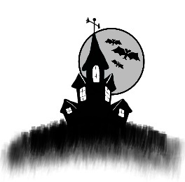
:::

DISSECTION

Cold steel ripping through pale flesh

Screams erupting, breaking silence

The feel of the knife,

cutting, tearing

Glorious pain!

Metallic scent fills the air

Blood streaming down flesh

Faster and faster it flows.

Screams give way to shrieks of agony

Organs exposed

Snake-like intestines slither

Liver, a beautiful shade of puce

Shining in the dim light.

Knife slicing through supple breasts

Heart is the key

Tears streaming down cheeks

Hands securely tied.

It beats

Within cavity of bone

Life sustaining, without it, Death

Ripped from the incision

Life obliterated.

Organ contracting

Final beats in my hand

Rest in Misery

Mother

-Kelleigh Elizabeth Perry

::: {}
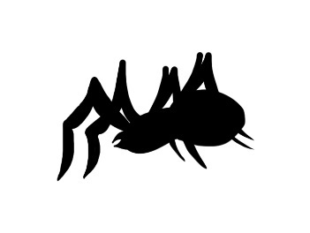
:::

DAWG DAYS

Gregory K. Shipman

IF I HEAR one more idiot weatherman say 'It's not the heat... it's the humidity', I'll shoot him--- and not a merciful head shot either. As they throw the last shovelful on his grave I'll correct him, 'It's both heat and humidity, brotha!'

If you read a calendar hanging on any wall you'll see it's September, 2055. The particular day's not important since one is much like the other. The heat is not only pervasive but constant. Back in 2010 the world became really serious about destroying itself. And naturally, the 'world' is defined as the human population. The planet's other species were simply along for the ride.

By 2020, Global Warming was a fact. When Alaska hit 100 degrees in December, 'political hoax' became a little used phrase. Winter had, by then, disappeared except in the polar caps and even there the drastic changes were felt by the resident species. In short order polar bears, arctic fox, penguins and cold water fish and mammals ceased to be. By 2030, these species were little more than postage stamp imprints. Nothing more than reminders of what once was. Everything from the Rainforests to the Polar Caps went screwy. Life as we know it is no longer life as we knew it.

The 'wave' is in its fifth day. The typical temps of a hundred are now one hundred-and-twenty-five. And, partner, it's a killer fifth day.

The city is boiling, and people are beyond bitchy. The forecast is for more of the same, both the boiling and the bitchiness. Bad news for people watching their utility bills sky-rocket from the production of manufactured-air 24-7. But it's worse news for poor people who have no icy air, no relief and plenty of boiling blood in over-cooked bodies. Most of those people live in my zip code.

Where I'm from three meals a day is a luxury and AC is what you don't have. Around here there are blocks of brick-front row houses soaking up the heat. The heat, radiating off the brick and concrete, is more than a little intense. It is so intense that the phrase, 'Go to Hell' is now a welcoming greeting.

There are no breezes; they went the way of the Dodo bird. There are few ways to escape the heat, and those few require money. And some of them require lots of money. The rich are protected, the poor are roasted. Except for the grossly elevated temperatures, life has always been this way.

Kids are listless, babies scream and adults are powder kegs waiting for the inevitable lit fuse.

It's 2pm and I'm escaping the brutal part of the heat on shady steps outside of Saint Bartholomew Church. Situated on the western side of the block and smack dab on one of the four corners, the building blocks direct sunlight. Thank you, Catholic Jesus! Saint Bart's is a neighborhood mainstay. The church has a soup kitchen, nursery and compassionate priests.

They throw quite a spread for those attending evening Mass on Sundays. You can bet your assets that puts quite a few non-Catholics in those pews. Hungry people are easily converted--- at least until the meals are over.

The Catholic Church, worldwide, has struggled to stem the suffering from the Global Warming Pandemic. The GWP has killed more people than can be counted. Disease, pestilence, weather and, of course, the elevated temperatures have turned Planet Earth into Planet Hell. The Vatican has reacted with prayer, money and more prayer. None of which worked, but at least they reacted.

Many Sundays my mama had us sitting on those hard wooden benches waiting for the end of Mass so we could get our grub on. I was a mousey little kid in those days. I wore mostly second-hand clothes, ate mostly second-hand food and learned that life ain't copasetic when your mother's a junkie. The first rule of survival for junkies is to do what you gotta do. For my mother, a needle in the arm is the number one 'do'. She somehow managed to keep me fed until I took over doing it at ten-years-old. At thirty-five, I'm still doin' what's gotta be done.

In 2035, a new pestilence birthed itself in the form of an old legend. Creatures akin to zombies appeared. By 2025, intravenous drug use was favored by thirty-five percent of the population. Many of the newer users came to drugs to escape the reality of a world on its ass. It appears that when the world finally gasps its last, half the population will face the 'final down' on a 'final high'.

In 2028, a radical religious group packed up bags and parishioners and moved to the jungle region of Brazil. They had been headquartered in Florida. When they left most people said, 'Now if we could just do something about the snakes'. In 2029, unknown to officials, they began distributing a new illegal drug worldwide. The drug, soon to be called 'Chill', gave the user a euphoric and instant high. The temperature became more symbiotic than adversarial to them. Joy of the present replaced fear of the future.

Within five years, the drug had achieved its intended purpose. Working with the user's body fluids the drug produced a condition called 'Chill Effect\'. The victims are called Chill Zombies.

\* \* \*

Hamlet Johnson is occupying the spot next to me, and as usual philosophizing as only a career wino can. No one is sure who 'Hamlet' was before he became a wino, but he's the only wino I know who regularly quotes Shakespeare. That's how he got this street moniker.

"Moses," he says, while glancing up and down the sweltering street as though relief will pull up in a yellow cab, "people are the worst of the mammals at adapting to their environment. God gave us more brainpower than the other mammals but left out the gift of adaptation. We got no natural physical endowments to protect us from this heat. That's why we used our brain power to invent air conditioning."

"Then I wish them people-mammals would bring a few of those inventions down thisaway," I reply.

Hamlet chuckles while wiping his face with a rag that started life as a baby's diaper. "Man's biggest invention is money, Moses. If you ain't got some a dat, you ain't got nothin'."

"Amen, brother. Money is the only luxury that buys other luxuries."

"Of course them Chill Zombies is another thing, Moses. They want the heat. They need the heat, and they'll keep fighting until the temperature goes to one-fifty and we go to gone."

"You got that right, Hamlet. The Chill Nation, which started out as a crazy religious group hatched a pretty insidious plan. Not only does a Chill Zombie desire the heat but, as the condition sets in, requires the heat. They no longer need or want food for sustenance. Their skin, which turns a dull red, develops cells just below the surface which transfers the heat in the air to nutrients for the body. The more heat there is, the more nutrients they get."

Hamlet nods, but I can tell this is more information than he wants. Like many people around the globe, he knows the Chill Nation has their own scientists who are constantly trying to push the Earth's temperature to one-hundred-fifty degrees, the temperature needed to sustain a worldwide Chill Zombie population. If they cannot achieve that temperature, the Chill Zombies will begin dying off through malnutrition.

Those in the Chill Nation easily number two hundred thousand. They are the leaders and the task-masters. None are Zombies, but all are fanatics. They believe that when the Earth's temperature reaches the desired one hundred and fifty degrees, God will take them into heaven as his special angels while the Chill Zombies will serve as an Earthly army against Satan's hordes who shall climb from Hell to claim the Earth. The Earth which Satan believes is rightly his.

While the Chill Nation is waiting to ascend to heaven, they use part of their billions to build underground communities to escape the heat.

In 2037, my mother became a Chill Zombie. In 2038 she died of malnutrition. A few Chill Zombies cannot even partially feed on temperatures lower than one-hundred-fifty. My mother was one.

Hamlet suddenly looks serious, or at least as serious as a wino can look. "Why you still up in here, my man?"

I give him my confused look. It often comes in handy. "What you mean?"

"You got smarts, bro, I can tell. You were in the Chill Wars in the forties and came back in one piece. You dress like a college prof, slip in and outta street talk regularly and you polite most of the time. You don't shoot the needle, suck the pipe or kiss the bottle so why ain't you out there skimmin' the rich man's green so you can have an underground crib with cool air and a grateful dame?"

"This is my home, Hamlet. It's where I hang my hat. It's where my daddy abandoned me, and my mamma died when I was eighteen. It's a training ground for survival. So I got this sentimental attachment thing goin' on."

Hamlet gives me another serious look before breaking into a grin which rearranges the constant accumulation of sweat on his face. "That's eloquent, Mr. Moses Golden. Mighty, mighty eloquent... but total bullshit. If you don't want to answer just say so rather than blowin' smoke up my ass."

I smile back. "Fair enough, dude. I don't want to answer."

"Solid," Hamlet replies. "Anyway, even with this heat you adapt pretty good to your environment. You one good mammal... and one good man!"

"Bullshit, bro."

"I'm serious, man... like Shakespeare say, What a piece of work is a man, how noble in reason, how infinite in faculties, in form and moving how express and admirable, in action how like an angel, in apprehension how like a god! The beauty of the world, the paragon of animals---and yet, to me, what is this quintessence of dust? Man delights not me--- nor woman neither, though by your smiling you seem to say so."

A clap from me and Hamlet bows his head slightly. Beads of his sweat drop to a certain death on the hot skillet of a granite church step.

"Where you work?" asks Hamlet.

"I'm an accountant," I answer.

"For who?" he pushes.

"I freelance," I reply.

"Where you learn that?"

"It's what I did in the Chill Wars."

"Where were you at during your time in the Wars?" Hamlet asks.

"Mostly in South America."

"And you were an accountant?"

"Yeah, brother-man. When they needed the books balanced they called on me. I'm good with that kinda stuff. It's what I do best."

"And that's what you did? That's what you did while the brothas was getting' their asses shot from hell to kingdom come by them heat-lovin' zombies and their puppet-masters? You sat in an air-conditioned office balancin' books?"

"I did my part. The best way I could. It's what I do best."

"Right on," said Hamlet, "You do what you gotta. You also be gone quite a bit. What up with dat?"

Wanting to put an end to his questions I give him a stern look before saying, "I got clients in other places with books needing to be balanced. And what you doin' now? Practicin' to be a detective?"

"Just makin' conversation," he says. "Just passin' the time. Runnin' my mouth cools me off."

Across the street, a black '54 Lexus pulls up to the curb. Two young boys peel off from a crowd of five and walk over to the car. They're dropping sweat like Hippies dropped acid almost a hundred years ago.

The boys are standing outside of a cut-rate liquor store called 'Sam's'. Sam, the original owner, is long gone as is a string of subsequent owners. The present owner makes his cash in the lucrative Chill drug trade, and a good bet is his ownership is not on any piece of paper in any state office.

The young boys standing outside are part of his drug crew, and the corner they are on is one of his more profitable markets. Chill is still a desirable product and as much as the police try, they cannot stem the trade. Many people, who would not normally shoot drugs, finally do so to escape the draining effects of the heat. This is especially true for those who cannot afford air conditioning or expensive living quarters in underground bunkers.

Inside the luxury car sits Benny. Some call him 'Fat Benny'; but never to his face. Benny owns the store, the drugs being sold and the boys slingin' it. Benny also owns most of the corners in this section of East Baltimore. The cops never can touch Benny 'cause Benny never touches the drugs. That's what he hires others for. Benny is also known as 'Murder B'. and he lives up to that name by ruthlessly ordering hits on anyone in his way. It's hard to make a case against Benny when he makes it a short walk from being a witness to being a corpse. Crossing Benny is like injecting cancer cells. With cancer, however; there's a better survival rate.

Benny is a high-ranking member in the Army of the Chill Nation. For years he has provided the Nation with a continuing supply of cash. He's responsible for creating millions of Chill Zombies and has recruited thousands of soldiers into the elite core of the 'Two Hundred Thousand'.

I turn to Hamlet. "How 'bout a cold drink to do battle with this heat, dude?" Then a slight hesitation before adding, "It's my treat."

"Don't know about a cold drink, Moses, but I sure could use a lift-me-up libation. You know--- a loaf of bread, a jug of wine and thou. I'll pass on the loaf of bread and thou--- not that I'm ungrateful mind you."

"Is that a Shakespeare quote?" I ask.

"Nope," he replies, "some cat name of Omar Khayyam. Thought I'd branch out a bit. Don't pay to be too predictable."

"Got that right," I say. "How 'bout I give you a twenty, you get me a cold Nehi Orange soda, and you get whatever suits your thirst buds and the change can stay in your bank vault."

The wino's eyes are like saucers. "Never look a gift horse in the mouth, or anyplace else for that matter. What up with this generosity?"

"Workin' my way into heaven," I answer.

"Though this be madness, yet there is method in't."

"Shakespeare?" I ask.

"Ain't nothin' but the truth, brother-man... nothin' but the truth."

A wrinkled twenty goes from my pocket to Hamlet's wet mitt, and he scoots across the softened blacktop street. I'm sure he's already thinking of all the wine he can get with the change from that twenty. And I'm sure the windfall will ease his nervousness around the drug dealers across the street.

Low-life predators usually pick on those weaker than themselves. I've often seen them push or trip winos just to get a laugh. Hamlet would have hesitated to go to the store if it weren't for the thought of the change from the twenty. As Hamlet said, 'Though this be madness...'

In the poorer haunts around the country these low-life pushers are called 'One-Fiddies'. They will never really make it into the family of the Two Hundred Thousand, and at some point they will become Chill Zombies because they will continue to live in the 'furnace'. Eventually, like so many others, they will succumb to the brutal heat and allow the Chill to take over. The One-Fiddie street name refers to the desire for the one hundred and fifty degree nirvana. The Nation considers the One-Fiddies nothing more than disposable flunkies. Life is a chessboard and the pawns never see the final checkmate.

I watch as Hamlet runs into the store without interference from the drug boys. The two boys at the Lexus barely glance up as he goes by. Both are concentrating on their boss, Benny, who is speaking to them from his partially open window.

Five minutes later Hamlet comes out with his bagged wine bottle in one hand and my cold bottle of soda in the other. He's nervous as he hurries down the three steps and hits the cracked concrete sidewalk no more than six feet from the teenage dealers.

One looks in his direction and shouts, "Where you goin' you ole smoke-hound and where you get cash for booze?"

Hamlet, as I suspected, ignores him and continues moving. Winos have no rules of engagement.

As he reaches the curb, he's less than two feet from the back of the Lexus.

The kid yells at him again, only louder. "Hey, old man, didn't you hear me?"

Hamlet spins towards the sound of the raised voice and, in his nervous state, stumbles. The cold and slippery bottle slides out of his hand as he reaches instinctively for the trunk of the car to steady himself. Like most winos would, he concentrates on making sure his wine bottle is secure in his other hand. The soda bottle skitters noisily across the polished trunk as his hand contacts the hot metal of the car.

There are instant shouts from all the boys on the corner, and the curb-side rear door opens at the same time the driver's door swings outward. I'm already pushing myself off the steps and moving across the street.

Hamlet who has steadied himself, quickly removes his hand from the hot trunk lid. At these temps, it's likely burned. I can't see his eyes but have no doubt they are fixed on the two boys near the car. They look about sixteen or seventeen. Both are skinny in oversized football jerseys and too-large faded jeans. The fashion from sixty years ago still prevails. One kid has a gleam in his eye that tells me he gets off on violence yet likely isn't seasoned enough to be a pro. He's already got his right hand under his jersey and, dollars to doughnuts, a 'nine' will be in it when it comes out.

Benny has made it out of the car and stands a step or two behind the young thug. He, too, has his attention fully on Hamlet. The driver of the car, a thick brother with a completely shaved head, has the look of a killer. He, unlike his boss, pays no attention to Hamlet. My bet is he dismissed Hamlet as a potential threat within seconds of getting out of the air-conditioned car. His attention is directly on me as I approach the scene. He's sizing me up. He's a bodyguard to Benny, and he must know his job or it wouldn't be his. Benny is way too important to the Nation not to have the best of everything.

This brother's kind is far from rare. He's a killer. He's a cold, efficient and dispassionate killer. It's in his eyes; even with his dark shades in place. He's likely so good that the Nation rewards him with a cozy air-conditioned underground bungalow complete with a freezer full of ice cubes and other comfort items.

I throw my hands up and move to the outside of Hamlet.

With him between me and the car, the stage is now set.

"Look brothers," I begin, "I'm sorry about the bottle on the car. My man is a little woozy from the heat, and he slipped. If there's damage, I'm willing to cover it." I keep my voice calm and non-confrontational, with enough 'shake' in it to show fear.

The young thug smells blood, and he has the gun out and pointing at Hamlet. He's in that stance you see on rap videos from the end of the last century-- arm extended and the gun held sideways. He's probably living his life as a rap video; most of these low-life thugs do.

Benny looks at me and then demands, "Who the hell are you?"

"Nobody," I stutter, "just a guy from across the street. I was a year behind you in school--- was in the eighth and ninth grade with your sister, Roxie."

By now the young boy is in Hamlet's face. He's got his gun almost in my man's nose. Hamlet's shaking and sweating. The sweat's from more than just the heat. The kid's face is part grin, part sneer and nothing resembling humanity or compassion.

I've seen this all before. So many times in so many places I've seen this before. These are jackals trying to be lions. They envision easy prey, helpless prey, and so they bare their fangs. The mind-set is one of the reasons humanity is in this sorry state. At the turn of the century, the once proud lions on the planet became jackals. They went after easy prey. They fed on the half-dead. They thought only of themselves, devouring not only the flesh of the weak, but their own. The world, over time, became a giant roasting pan. The jackals of the world thought themselves cooks, but soon found out they were inside the pan also.

As for Benny, he finally nods his head as recognition eventually takes hold. He's dressed in a loud Hawaiian style shirt, big and loose. His pants are neatly pressed black silk with pleats in the front. He has a pair of black sandals strapped on his feet, and the pants length is just right to gently break the creases. All in all he's a plus-size GQ mannequin. But, a very dangerous one.

"I don't like people messin' up my ride," he says.

"It was an accident," I reply, "He didn't mean to do it."

"Can't the alky talk for himself?" Benny asks.

"He's scared," is my quick reply.

"Should be," Benny says as he stands next to his young gunny. "I should have Peanut here put a bullet in both your brains."

Hamlet moans quietly and looks down at the ground. Perhaps he's praying or maybe just waiting for a bullet to crash into his brain. Or he could be doing both.

I glance over at the bodyguard who's watching this scene with dispassion. He has not pulled his gun out thinking the situation is under control, and his boss is in no danger. He doesn't see Hamlet as a threat. To him, he's another stumblebum wino. And from the look he gives me I'm just a chump with his hands in the air praying I won't get shot.

He's likely right about Hamlet, but he's made a mistake in his assessment of me. In this kind of business mistakes are both deadly and costly.

I suddenly swing my left hand down and grab the gun-hand of the young punk. In the same motion, I twist his hand violently causing him to release the weapon as he yelps in pain. I grab the gun and swing quickly towards the bodyguard.

He proves to be quick. He reaches for his gun and has it cleared from his belt in seconds. He's quick but not quick enough. The bullet from my 'borrowed' gun enters his brain before his own weapon is half raised. He 'ragdolls' to the ground as I swing the gun and pull the trigger a second time. The youngster drops without a sound. A quick glance tells me the major threat is leaking blood and brains in the street. The hot and softened blacktop is frying both. If the gunster has an underground bungalow, he won't be needing it anymore.

The other boys ran as soon as the first shot was fired. Survival of the swiftest replaces the fittest. They aren't paid killers, they're slingers of dope. Recognizing one's limitations is a sound survival tactic.

I figure Benny isn't armed. He makes no move so I must figure right. Hamlet seems dazed and disoriented, but continues to hold his bottle of wine. Practice makes perfect. I gently push him aside as I point the gun directly at Benny.

"What the hell you doin'?" he asks.

"Balancing the books," I say.

"What you mean?"

"You've been an asset to the Nation, Fat Benny. I'm moving you out of that column."

"I'll simply be replaced by another member."

"Job security for me, Fat Man. I'll be waiting for your replacement."

"Who are you?"

"Your sister Roxie's classmate."

"Bullshit."

"Check the school records. Oh wait. This is the end of the story for you. The only checking you'll do is to check out." My smile, though genuine, is still mocking.

"Why are you doing this?"

"Benny, Benny, Benny. It beats a nine-to-five."

"How about we make a deal?"

"My boss don't like me freelancing. Doin' deals on the side is freelancin'. Besides, he's pissed off at you and the Nation."

Benny wipes the sweat from his eyes and then says, "Hey! Why aren't you sweating in this heat?"

"I'm acclimated."

I can see he's puzzled, and I don't see the logic in more conversation, so I shoot him twice in the chest. He drops. I pull my cell phone from my pocket and dial 911. The first cops show up in minutes. It pays to have a mayor who insists on promptness and professionalism from his boys in blue. I gently put the young gunny's weapon on the ground and slowly raise my hands. Hamlet watches me as though I'm from another planet and the mother ship might be arriving at any minute.

\* \* \*

An hour has passed, and I'm cooling my heels in a police cruiser. Given the brutal temperature outside, this air-conditioned cruiser isn't a bad place to be. The first uniformed cop on the scene placed my hands behind my back and put me in handcuffs. Five minutes later, after being seated on the curb, a uniformed sergeant stood me up and removed the cuffs but only to put my hands in front and re-cuff me before sliding me into the cruiser. He told me this would be more comfortable until a detective arrives to take my statement. That was mighty considerate of him given I just littered the street with three dead bodies.

Twenty minutes later a smartly dressed young detective named Foster takes my statement. I tell him everything... except the truth. Hamlet had tripped on the curb after coming out of the store. He had accidentally hit their car. They got mad and pointed guns at him. I'd been sitting on the church steps and came over to see if I could calm everyone down. No one calmed down. The young kid--- the dead one--- tried to shoot Hamlet. I wrestled his gun from him and shot in self-defense. I had to shoot the big man because he had his gun out and threatened to kill me. The third man, the fat one in the Hawaiian shirt, also had a gun, and he fired it at me and missed. I shot him twice before he could shoot again. He became the third dead man.

I leave out the part about my setting the whole thing up or that I expected everything to happen pretty much as it did and for Hamlet to react pretty much as he did.

I told Hamlet I was an accountant in the Chill Wars and continued as a freelancer when I got back. I told him I balanced books for a living. And I do but only for my boss and it usually entails killing someone, or a group of someone's, to make corrections. I use bullets instead of erasers. Perhaps contract killer is a more fitting word than 'accountant' but accountant sounds so much more civilized and, after all, in a way I do settle accounts. Euphemisms make life so much easier to digest.

Fat Benny got on my list because Fat Benny, like all my other 'corrections' pissed my boss off. My boss felt the Nation was freelancing on his turf. Their religion is skewed and their logic isn't. So now Fat Benny's not around anymore. Planting a weapon on Benny after he was dead completed the scene. And so another set of books balanced, and another account closed. My boss prefers I work in secret. No need to broadcast our work. We prefer the shadows. There's no need to burden this detective with something as inconsequential as the truth.

And while I'm on the subject of the truth, there may have been a thing or two that I've left out. Somewhere in my younger years, when my mother found herself in a jail cell, and when heroin had her in its grip, she found herself going through torturous withdrawal. She screamed out, in the dark and cold of that clinging cell, for help from God. She screamed and screamed, begged and begged but to no avail. She heard no answering voice until she finally heard a whispered reply.

'Missy,' it said. 'I am here.'

'Who are you?' she asked.

'Who would you like me to be?'

'My savior,' my mother groaned.

'And so I shall be,' this whispering voice said.

'Take away this pain, this hunger, and this need.'

'Oh I shall,' replied the voice, 'I most certainly shall, but only the pain. You must keep the hunger and the need. Without it your life has no meaning, no direction and no worth.'

'Then take the pain. Please take it now!'

'I shall, child. But first we must bargain. You give to me and so shall I give to you.'

'Give you what, My God. What can I give you?'

'I am not your God.'

'Then you are...'

'Speak not of names, Missy, but rather of gifts. Do you not pain? Am I not here to release you?'

My mother moaned. 'You want my soul.'

'Of course not,' it whispered with its voice wrapped in a sneer. 'I want the soul of your son, Moses.'

'My son?' She whispers as though a louder voice on her part will make it so. 'I can't do that. I can't give you his soul.'

'Of course you can. I can't take his soul until he dies and he's now but a child. He has his whole life ahead of him. By the time he's reached the end, who knows what will have happened. Maybe if he leads a good life there might be intervention.'

'You mean...?'

'Far stranger things have happened. You want to be free of this pain. I will make it immediate. Moses has his life ahead of him. He's a child.'

'My mother whimpered like a puppy. 'Will you swear to it?'

'Swear to what, Missy Golden?'

'That you won't take his soul until he's dead.'

The voice whispered gently. 'I swear I won't take Moses' soul until he's dead.'

The next day a delivery truck hit me, and dragged me fifty feet before spitting me out like an annoying bit of gristle.

Sometime later a medical examiner pronounced me dead.

Satan sent me back, and I continued my life as though I was alive. The Chill Nation will not succeed. The two hundred thousand will not go to Heaven... or Hell. My boss has a special pit waiting for them.

The temperature will hit one hundred-and-fifty. Life as we know it will end on this spinning ball. The next Garden of Eden will have a different Adam and Eve. This time the boss won't need a serpent in there.

I am here to do my Master's bidding, and I will until the time is right not to. After all, that's what double agents do. And I am Moses Golden... am I not?

\* \* \*

"I don't know why they lost their tempers and wanted to kill Hamlet. All he did was fall on the car," I say to the detective. "It must be the heat. It drives people crazy."

Foster looks up from the small notepad he'd been writing in and replies, "It's not the heat... it's the humidity."

DARKLINGS

::: {}
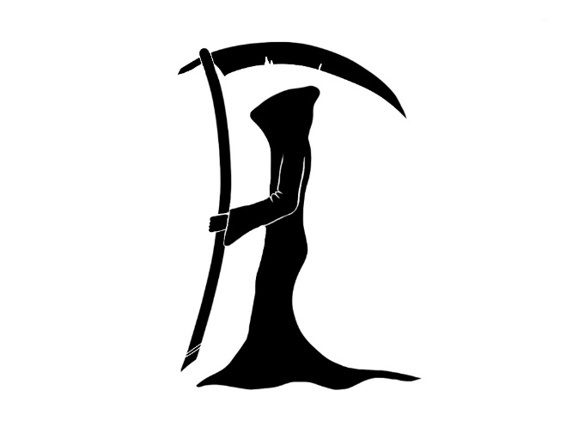
:::

This autumn moon gives birth to flight

Upon the wings of death

Darkling's claim this hallowed night

They\'ll steal your every breath

They come to feast upon your dreams

They know your every fear

Throughout the night, you'll hear the screams

So keep your loved ones near

Whispers in the cool night air

They dance the Devil's tune

Make a wish, say a prayer

They\'re coming for you soon

So, as you settle in tonight

Prepare for your own sake

Make sure you turn on every light 

\... and be sure to stay awake

-Anisa A. Claire

::: {}
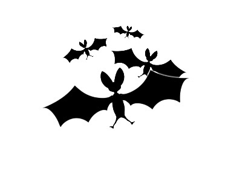
:::

ORBS

Jennifer M. Zeiger

THE TUNNEL NO longer held its shape. Fissures dug deep into the walls and large chunks of rock had broken free, littering the floor under Shira's hands and knees. She shivered at the thought of the freezing that broke apart the rock. In the fissures, where ice crystals tended to form, powdery dust caked the surface.

It'd been a while since Shira used a Dweller tunnel. Her father would beat her for lowering herself to Dweller standards, but it wasn't likely he'd find out. He wouldn't fit in the tunnel to find her. She barely fit herself, and she wasn't fully-grown.

"Ow!" Shira pulled her hand back and scowled at where the sharp edge cut into her palm. It didn't draw blood though, so she placed her hand with more care and continued to crawl forward. Catching a wing, she stifled another cry. She backtracked enough to pull her feathers from the snag.

When she reached the end of the tunnel, she stepped into the kitchens and straightened. Two sets of eyes watched her. One set was so old, wrinkles bordered his eyes and mouth and dark spots dotted his skin. The other was so young he shouldn't be in the kitchens at all. He was too young for labor even by Flier standards.

"Tunnels are worse than I remember," she admitted as she dusted herself off.

"Fliers don't care, they don't see it," the old man said with a wry smile. Except for the lack of wings and his clear age, he could have been a Flier. Shira had never been able to figure why everyone assumed Fliers were better than Dwellers.

"Think they would, it's the foundation to the Eyrie."

The old man scoffed, but it turned into a cough that almost rocked him from his seat.

"Mayel," Shira sank to her knees beside his chair. She clasped his hand and felt the shaking he tried to conceal. "What's wrong? Why'd you call for me?" Usually the old man came to her. This was the first time he'd ever asked her to visit him in the village.

"I'm sick," he tried to grin but failed.

"He's dying," the little boy whispered with tears in his dark eyes.

Shira's heart clenched. She grasped at the first possible solution.

"Maybe the Eyrie's Elders would let you into the Birthing Chamber," she suggested. The chamber was used for pregnancy, but she'd heard of people sleeping there to heal illnesses too.

Mayel made a negative sound deep in his throat. He wiped his pale face with a cloth.

"A Dweller so near the orbs? They'd kill me to prevent it."

Shira wanted to deny it but couldn't.

"I wouldn't ask this, Shira, but the Dwellers need me." Mayel's breath came in shallow gasps. "Steal an orb for me. Steal the blue and white."

Shira stilled. Steal an orb?

"I can't," she said, "it'll burn out."

Again that painful, negative sound. "Some of your father's teaching? An orb's not so fragile as he says."

"What about the shield against the cold?" Shira cringed. It was a selfish question when the Eyrie had ten orbs and the Dwellers had none. The orbs' power did not reach the base of the mountain where the Dwellers lived.

"Have I ever lied to you?" Mayel asked.

Shira shook her head. He'd always been honest, even when it was deeply painful.

"One orb, Shira, is enough to shield the entire Eyrie. Only one."

She rested her forehead on their clasped hands and felt his trembling even as he tried to give her hand a squeeze in comfort.

"Miro," she said to the boy, "meet me in the statue hall at noon tomorrow. Now," She grasped both sides of Mayel's wrinkled face between her hands as she stood, "go home before the darkness turns to ice." She kissed his forehead and stepped away.

She watched Miro lead Mayel from the kitchens into the fast gathering night. They made it into a hut before the ice began to form. As full darkness fell, the outside of the hut turned shiny with ice. They'd cut it extremely close, and that, more than anything, told Shira how important Mayel's request was.

Shira spun and crawled back into the tunnel as the ice crept its way into the kitchen. She moved as fast as the tight space allowed but even still, the splintering of freezing rock and the frigid breath of fast freezing air nipped at her until she reached the shielded air of the Eyrie above.

\* \* \*

No Dweller could reach the orbs, and no Flier would touch them for fear of them burning out. This played well into Shira's haphazard plan. They left the orbs unguarded except the brief moments, morning and night, when the Elders entered to maintain the shutters.

When breakfast was called the next morning, Shira ate quickly and left, saying she needed more lessons on storm currents. However, when she exited the Great Hall, she turned left toward the Heaven's Chamber, not right toward the classes.

She'd never been in the Chamber before. Finding it empty, she ducked inside and gazed in wonder.

Only Elders entered the Chamber to open the shutters at night. She'd always wondered why their faces glowed with soft light. Now she suspected she knew. The domed ceiling above held ten orbs swirling with color. They filled the room with warmth to the point that it felt like she walked through warm water instead of air. They bathed her skin in tingles. Shira's eyes pricked with tears.

When the shutters were open, the orbs' light created a shield throughout the Eyrie's walls against the cold. All her life, she'd felt their warmth at night but never before had she felt so enveloped.

Shaking her head, Shira reminded herself why she was here. If she was found, she had no good reason to be in the Chamber.

Mayel needs an orb.

She spotted the blue and white one to her left. Spreading her wings, she flew through the thick air until she hovered before it where it rested in a shallow depression at the crown of the domed ceiling.

Shira reached for the blue and white orb but pulled back. Was Mayel using her? Yes. But he's dying. He'd never lied to her like her father. The more she learned about the orbs, the less she trusted what her father said.

Just do it.

She grasped the orb and pulled it free. It didn't flare or sputter. While she sank to the ground, she held her breath. Then she checked the light of the orb in her hand against that of the ones on the ceiling. It burned just as brightly.

Father lied.

The knowledge tasted bitter on her tongue. She folded the orb into a scarf she'd brought. It didn't conceal its light, but it was better than carrying the orb through the halls exposed. If she hurried, everyone would still be eating.

\* \* \*

Shira crouched in an unused hall of the Eyrie. She held her wings close to her shoulders while her back rested snug against an alcove where a statue used to stand. The crumbled remains of the statue littered the floor at Shira's feet. It was one more sign of the deterioration of their world.

Mayel loved to point out such spots. It was his way of showing Shira what the other Fliers refused to see. Even in her fifteen years, she'd seen the crumbling of stone and the ice crystals in the cracks expanding little by little every night. This statue was whole when she was a child. Her world was dying, and her father refused to believe it.

Shira held her treasure close to her chest, afraid looking at it would decay it like everything else around her. However, she couldn't resist peeking as the warmth of the orb soaked into her slender fingers. Holding her clasped hands out, she marveled at the glow. The orb's light turned her skin red and she could almost make out her skeleton beneath. So much light. So much warmth.

She cracked her thumbs apart to gaze at the orb as its glow touched her face. It fit easily in her hands and swirled blue and white, unconcerned that it'd been removed from its place in the Heaven's Chamber.

Her father said they couldn't be moved, that the orb would burn out within seconds, leaving the world darker and colder. But she'd stolen it several hours ago. Checking, Shira confirmed it glowed just as powerfully now as when it hung against the ceiling.

Mayel was right. The Eyrie was hoarding the orbs.

Shira wiped moisture from her eyes with the backs of her hands. Mayel needed the warmth and light now.

A scraping filled the hall. She held the orb close and folded her wings across her front like she was cold. The posture almost hid the glow. Almost.

"Shira?"

She relaxed. Miro turned the corner to her left. His dirty face held huge, nervous eyes. Being caught here, a ground Dweller in the Eyrie, would mean his death. His eyes calmed a little at the sight of her, but he still scanned the hall like something would pop out of the stone to eat him.

"Hold out your hands," Shira instructed.

Miro cupped his hands as though he were begging and his mouth gaped when Shira retracted her wings. Beautiful light and warmth. Shira's hands pulsed from holding it.

"Hold it tight." She transferred the orb to his small hands and closed his fingers around it with her own.

"This'll help," she promised.

Miro swallowed. "Thank you."

He darted away. The scraping filled the hall, and then Shira was alone. She held her hands close while they were still warm. Mayel would get better. He had to.

Pushing to a standing position, Shira stepped out of the alcove and stretched her limbs. Her wings touched the ceiling. That's why the hall was unused; most adult Fliers couldn't walk it comfortably. Shira didn't know how or why, but her people had grown in stature and now the older parts of the Eyrie were not made to contain them.

But they were lovely for a young girl yet to grow wings. That's how she'd met Mayel. She'd been exploring and found him scavenging supplies. Instead of screaming about the ground Dweller, she'd stepped forward to touch his dirty, wrinkled face.

Shira sniffed. She scrubbed her face with her hands and rubbed her eyes before stepping out into the games arena. As she walked into the open and dove from the walkway to join the other Fliers in a game of ball, she plastered a smile on her lips.

\* \* \*

The loss of the orb was discovered that evening when the Elders entered the Heaven's Chamber to open the shutters.

Shira ducked into her room before the general panic swept her up in its wake. Cries of shock echoed beyond her door. Would nine orbs be enough to keep the Eyrie warm? What if more were stolen? Who would do such a thing?

Shira tucked her wings close and gazed out her window. Touching the windowsill, she checked her fingers. They came away clean. This close to the core of the Eyrie no signs of the cold touched the stone yet. It would though. Even with ten orbs it would eventually seep in because the base of the Eyrie was cracking. It would spread.

Down below, at the roots of the mountain, small dots shifted about. Ground Dwellers. All of whom survived without the light and warmth of the orbs. It could be done.

Although, with the world decaying, the ground Dwellers were dying. They dug deep underground to escape the cold. It helped for a while but the cold was spreading, and they couldn't dig fast enough to escape it.

Shira was still staring at the moving dots when the door opened behind her. She didn't turn to see who entered. Only one person would come in without knocking.

"I think a ground Dweller stole the orb," her father announced without a greeting.

Shira snorted. "How? By growing wings?"

"It's---" he cut short. "You're right. It's unlikely. I just can't believe a Flier would do this." He threw down his coat and joined her at the window.

"Since it's been moved, it burned out, right?" Shira asked, clutching her hands together to hide their shaking.

A grunt was the response. Shira glanced at him from beneath her lashes, taking in the soft glow of his skin that all Elders had. Shirkan Golden-Feather cut a stern figure, and his face was bitter at the moment.

He lied on purpose. She hadn't been sure, but his response said a lot without words. It also showed he didn't know who actually stole the orb.

"I must go calm the others." He spun away, collected his jacket and left, the door thudding closed behind him.

Shira's stomach clenched. Even if she'd been curled in the corner sobbing, he would have acted the same. He stopped by only because it appeared right.

Returning to her window observations, Shira stepped up onto the ledge and jumped. Her wings spread and caught the updraft from the mountain. She drifted for a time high above and then dropped lower until she could make out actual features of the ground Dwellers.

There was a stark difference between them and the Fliers. A frailty to their limbs, hollow cheeks and sunken eyes. Not a one stood taller than Shira's shoulder. A few cast her dark looks, but none openly defied her. How could her father think a ground Dweller stole the orb? Few of them had the strength to climb into the Eyrie, much less somehow get to the ceiling of the Heaven's Chamber.

Shira winged higher and spotted several Fliers take off above. She coasted to the Eyrie wall to land on a balcony.

The Fliers headed into the village below. By the time they landed, most of the Dwellers were out of sight. Although they wouldn't openly defy the Fliers, they would hide from them. It was one advantage to their diminutive stature. The Dwellers didn't just live on the ground, they worked in it, digging deep tunnels no Flier could fit in.

Leaning on the balcony railing, Shira covered her mouth before she openly chuckled. The Fliers moved door to door. They'd disappeared inside only to come out empty handed.

"Something amusing?"

Shira started. Spinning, she saw Elder Lalinna hobbling toward her.

"Forgive me, Elder," Shira bowed with her wings spread over her head in shame. "I didn't think when I landed. I didn't realize this was your balcony."

Lalinna waved off her concern. She came to lean against the railing beside Shira and watched the happenings below.

"They are a bit amusing, aren't they?" Lalinna asked.

"I just don't see the point," Shira admitted. "We can't chase them below ground, and, even if they did take the orb, it'd be burned out by now."

Shira watched the Elder's face as she said the last part. Lalinna started out nodding but then she stilled. Her eyes, sharp even in old age, narrowed. She focused on the ground below, on the village and the futile efforts of the two Fliers, but her fingers tapped the balcony railing, and her lips pinched in.

"I would've thought your father more forthcoming with you," she said.

Shira's heart beat hard against her ribs. None of the other Elders ever spoke openly with her. Perhaps because Lalinna rarely left her rooms now, she craved conversation. Even the glow in her skin was softened and dulled by time.

"Forthcoming?" she asked. Only through great care did she keep from clasping the Elder's hands in interest. Even still, her fingers twitched.

Lalinna noted the movement, but what she thought of it Shira couldn't tell.

"We Elders are a cautious group. Too cautious perhaps. Because of who you are, I'll tell you this, young Shira, the orbs were not ours to begin with. They were not originally in the Heaven's Chamber."

Shira's mouth went dry. "We moved them here? They didn't burn out? Where did they sit originally?" She cut off as the old Flier turned calculating eyes on her. Those dark eyes didn't miss much.

"It's called the Hunt."

Shira gasped.

"Yes," Lalinna continued, "history class teaches it was about food and, on some level, it was. Food grows better near an orb, but at its core, the Hunt was a race to claim the orbs. Flight was an advantage but," the old Flier stooped and picked up a large pot full of dirt, "we didn't understand the orbs like the Dwellers. I fear we still don't."

Hefting the pot, the Elder pitched it at the doorway. Shards crashed to the floor along with dirt. Part of the trim on the door crumbled and beneath the missing chunk ran spidery fissures.

Shira couldn't resist. She stepped over to run her fingers along the cracks. She'd seen them in the outlying tunnels but not so close to the core of the Eyrie.

"We can't see it yet, but our home's dying."

The words sounded so much like Mayel. Shira glanced at Lalinna to make sure she hadn't changed into the aged Dweller.

"Why?"

"We meddled with things we didn't understand."

"Can we fix it?"

"Perhaps. Although, pride is very bitter to swallow."

Shira returned to her spot at the railing. She never would've hoped an Elder would speak of this, much less admit they'd lied about the orbs.

"What would we have to do to fix things?"

Lalinna didn't answer. She turned to lean her back against the railing. Those dark eyes watched Shira with an unwavering gaze.

"Too quick, girl," she shook her head. "I tested you and you failed."

"I'm sorry?" Shira shrank from the look on the Elder's face. Any kindness Shira had seen in those old eyes was now gone.

"Indoctrinated all your life to our given right to the orbs, our superiority over other races, and a single example of wrong," she waved a skeletal hand at the doorway, "convinces you we're ruining the world?" Lalinna snorted. "No. You've heard this before but not from your father. You sympathize with the Dwellers!"

Shira's heart beat so hard it might have wings of its own. Her stomach rolled.

Lalinna's lips twitched. "One side effect to handling orbs all my life," she said, "I can see their trails. What they've touched. Besides, a Dweller can't get to the ceiling of the Heaven's Chamber."

The Elder grasped Shira's hands in a grip that turned her fingertips white. She flipped Shira's hands palms up.

"They're glazed with light," she said, flinging Shira's hand away from her like they dirtied her just by touching them.

Shira hugged her middle. She couldn't deny something the Elder could see with her own eyes.

"You don't still have the orb," Lalinna said. "I see the trail down there. It ends in the village and just disappears." The Elder eyed her, waiting for a response.

Shira backed a step. Did her father know of Lalinna's sight? Would he believe her over the Elder? No. Resoundingly no. He favored her not at all.

"What are you going to do?"

"For your father's sake, I'll give you this one chance. Go. You threw your fate in with the Dwellers when you stole the orb. Now hope they will accept you. If I see you again in the Eyrie, I'll have them clip your wings." She pointed toward the door.

Shira glanced at it. If Lalinna could see the light on her hands, some of the others might too, and there were a lot of people in the hall right now. Instead of heading for the door, she planted a foot on the railing and shoved off into the air. She glanced back to see Lalinna's expression, but the Elder was no longer at the railing. Instead, she was inside her rooms, dressing in her official robes. A messenger boy stood beside her.

As Shira dove toward the village, she shivered at the change in temperature. As one flew higher, the colder it became. But not here. Here the Eyrie was always noticeably warmer than the village below.

She knew now the difference wasn't natural. It was upsetting the world. But maybe she could set part of it right. Banking to the side, Shira caught the up draft of the mountain instead of landing like she'd intended.

Reaching her balcony, she closed her wings and landed, hitting the ground running.

She threw together a bag of clothing and the few treasured items she couldn't leave behind. A brush that was her mother's, a necklace her grandfather passed on when he died, and a book of poems her father gave her on her tenth birthday.

It was the only thing he'd ever given her.

Shira shrugged the pack over her shoulder before peeking into the hall.

Lalinna was preparing for council. That meant everyone had been called to the Great Hall.

As she'd hoped, the hallway was empty. Making her way toward the Heaven's Chamber, she stopped just before the last turn before the doors. To the right of the doors was a set of spiral stairs. At this point, the area would be guarded.

The air around her was warm, almost like a soft blanket sliding over her skin. Even outside the Chamber, the orbs' warmth affected the air. Shira regretted she wouldn't get to feel their full power again. She wasn't headed for the Chamber this time.

This time she aimed to take the spiral stairs to the room above it. As she'd pulled the orb free that morning, she found a small door behind the glowing ball large enough for an orb to pass through. She thought she knew where that door led. Women in the last term of pregnancy slept above the orbs in the Birthing Chamber. The Elders said it was for a blessing on the child from the heavens.

Shira visited her mother there when she was pregnant with a new child. It hadn't bestowed a blessing. Birth killed both child and mother.

Shira had stared at the floor during the birthing just outside the alcove her mother screamed in. She'd been afraid to look, to see her mother bleeding. The round stones of the floor still came into her dreams. Silvery stones, warm on the feet and smooth from many soles. Each alcove had an entry stone at the center of the entrance in the floor that glowed slightly around the edges. A single, perfectly round, glowing stone.

Why she hadn't questioned it sooner, she wasn't sure. Perhaps because she hated the memory.

Shira looked around the corner and spotted two Elders with their glowing faces. They fidgeted from one foot to another.

Cupping her hands around her mouth, Shira whispered, "Mallor, Acosta. Come look."

The whisper bounced, as she'd hoped, against the high, angled ceiling of the hall. The Elders looked at each other.

"No one's in there," Mallor insisted.

"Someone's in there," Acosta said.

They opened the Chamber doors and looked inside. Not seeing anyone, they both stepped into the room for a closer look.

Shira darted to the stairs. She took them two at a time, using her wings for balance until she reached the small door at the top. She had it closed behind her before the Elders emerged below. Pulling her hand from the handle, she clasped her fingers into a fist. Stop shaking. Throwing her voice wouldn't work on the way out. She'd have to make a run for it.

She mentally shoved the thought aside as she stepped away from the door and walked the hallway up to the Birthing Chamber. It curved around the outside wall and, now that she'd put it together, Shira knew this hallway spiraled around the top of the Heaven's Chamber. Reaching the top, she glanced around the birthing alcoves. No one was present. They hadn't had a pregnancy in years.

Picking an entry stone at random, Shira knelt to touch the silvery surface. It was almost too warm for comfort. She rummaged in her pack for her mother's brush. When she found it, she inserted the handle next to the stone's edge and lifted it from the floor.

It came free without a sound and there, nestled against the ceiling below, sat an orb. Its light was soft. Shira's eyes pricked like they had before when so close to an orb. It was like it was aware and sad.

Shira extracted the orb and carefully tucked it amongst her clothing in her pack. It wouldn't hide the glow but it wasn't like she was going to get out unnoticed anyway.

She considered taking more, and then decided against it. she wasn't sure how the Dwellers hid the first one. If they couldn't hide this second one, they'd be in serious trouble from the Fliers.

Slinging her pack back over her shoulder, Shira stood. The Birthing Chamber smelled of blood and birthing fluids. They tried to clean the place but the smells lingered in a musty sort of way like they were soaked into the stones and part of the alcoves now.

She shuddered as she headed for the door, but the handle turned in her hand. Backing away, the door swung open.

Acosta gapped at her.

Shira dropped her wings loosely over her shoulders and pack and grinned at the Elder. He was younger than the others. Perhaps he wouldn't see.

"Strange times," she shrugged. "Father asked me to check if anyone was in the Birthing Chamber when the council was called."

"But how---"

"I need to go join him now," she cut over him, "so if you'll excuse me."

Instinctively, he held the door and made space for her to pass on the stairs. She smiled at him and took her time descending. She almost made the corner before Mallor called from the Heaven's Chamber.

"Miss Shira? You're glo---"

She took off running. The hall followed the outside of the Eyrie until it passed the Great Hall. The noise coming from it was enough to drown out Mallor's voice. Everyone was chattering. Something must have unsettled them, for usually only the Elders spoke.

"Enough!" It was her father's voice. "We've brought before you conclusive evidence this Dweller was a part of the scheme."

She'd been headed for the nearest open balcony, which sat at the other end of the narrow hall past the Great Hall but she stopped short as she caught a glimpse of a Dweller through the press of people.

Dark head, narrow shoulders, dirty little face. He could have been any Dweller but he wasn't. He was Mayel's boy, Miro.

"Hang him," someone spoke up.

Agreement sounded from around the Hall, reinforced by everyone's fears.

"Interrogate him first," shouted a voice over the general clamor.

"Hang him upside down from the balcony," another chimed in.

Shira felt sick. Her ears rang with the angry voices like a bell in her skull. Miro was just a boy.

Those dark brown eyes were huge as the Eyrie debated his fate. Shira didn't have a clue what evidence her father produced but the boy's guilt was a foregone conclusion.

"I warned you, girl." Lalinna grasped her arm in a bony grip and shoved her toward the Hall.  "It's time to clip your wings."

Shira draped her wings close. Somehow the Elder hadn't seen the orb's glow in her pack yet. She stumbled through the crowd and lost sight of Miro until the Elder shoved her into the open center of the Hall. Then she spotted him being held on the balcony by her father while another Elder fitted a noose over his dark head.

"You monsters!" she pushed back against Lalinna's grip and the old woman flared her wings to keep from falling over.

Yanking her arm free, Shira bared her teeth at the Elder and spun away before Lalinna grabbed for her again.

"Let him go. He's only a boy. Let him go!"

"She's glowing, stop her!" Lalinna's shout mingled with her own, making them both unintelligible.

People backed away as Shira raced toward the balcony. Her father turned, the look on his face shifting from surprise to shock and then to the angry scowl she knew so well.

Her father handed Miro over to the other Elder and caught Shira before she could reach the boy. She struggled but couldn't stop them from cinching the noose tight against his throat. Then they started tying the other end to the railing.

"Let the Dwellers see his punishment," someone said.

"She's got an orb!" Lalinna again.

"No!" With a sudden twist, Shira broke loose. She stepped, reached for Miro, and was shoved from behind, perhaps by an over zealous person trying to catch her. She couldn't stall her forward momentum. Slamming into the boy, they tumbled over the railing.

Miro screamed and screamed. They hadn't finished tying the rope off. His weight tore it loose, and it flapped behind him like some mindless tail. Snatching at Miro's feet, Shira pulled him against her chest and gave her wings a flap. It slowed their fall but the combined weight ripped tendons. Shira sobbed as she attempted another flap. Something snapped in her back and fierce pain lanced into her spine.

The ground was coming up too fast. Dozens of faces looked up at them with horror.

Shira tried to spread her wings, to stall their momentum. Only the left wing responded. It sent them into a crazy spin as the ground and faces grew larger.

With one last effort, she flared her wing, spun around and slammed, back first, onto the ground with a crunch of bone. At first there was nothing except white pain. Then there were dozens of Fliers in the sky above and shouts nearby.

"Get below. They're coming. Get---"      

"Mi---Miro?" Shira asked.

No one answered. Miro's weight was removed from her and someone grasped her as though to pick her up.

She screamed.

\* \* \*

Someone kept asking for Miro. Over and over and over.

"Shh, he's fine." The voice wasn't familiar.

Shira tried to look around, but everything was blurred like she was still spinning in flight. She asked for Miro again.

"Shhh. He's alive. And in a bit better shape than you. Hold this."

An object was set on her stomach. Instinctively, she moved her hands to hold it. The motion felt stiff and restricted as her hands folded around the object, she sighed. Warmth and light. Her body relaxed and she gave up trying to see as she held the orb tight.

\* \* \*

Shira frowned as she opened her eyes. The walls were close and rough with a shiny texture. She shook her head and blinked.

"Not what you're used to but it grows on you after a time."

Shira gasped. "Mayel?"

"Yours truly," he swept a low bow.

"You're better." It was an understatement. The shaking of his hands, the frailty to his movements, the pale, sweaty skin were all gone and so were his wrinkles and liver spots. Everything that marked him as old.

"Much better," he agreed as he came to sit beside her bed.

"You're not Mayel's son or something?" Shira reached a hand out to touch his cheek.

He grinned. "No."

"Then what?" she waved her hand at him.

"Now you see one close held secret of the orbs. You did well in stealing a second one. It saved your life."

"I don't understand."

"The orbs are shields, as you've been taught, but each one holds a secondary use. The first one you stole, the blue and white, heals diseases. The second one, the green and blue, mends and grows bones." Mayel stood and reached to help Shira sit up. "May I?"

She nodded, and he gently lifted her shoulders until she was sitting. He leaned her forward to lift her wing away from her back.

Shira expected pain but she could only stare as he flared the feathers to their full length.

"It'll be awhile before they're strong enough to fly but the bones are whole." He folded the wing back against her shoulder. "I'm sure your father's beyond angry."

She remembered the fall and swallowed back tears. "He pushed us."

Mayel grasped her hand.

"He and others have been out looking for us," he said.

"How have you kept the orbs? Lalinna can see them."

A wry grin pulled at his lips. "I know. But she can't see them through quartz." He pointed at the ceiling, "and the Fliers are afraid to come too far below. We are shielded now."

They fell silent and listened to the cracking of the earth above as night fell and ice froze it solid. The orbs protected their small area but did nothing for the surface of the earth.

"We can defend ourselves now," Mayel said.

Shira squeezed his hand, but she couldn't help wondering what she'd started.

THE CLOWN

::: {}

:::

What lies beneath the painted mask?

A heart of black, a soul of glass?

Sharpened teeth and rotted tongue,

Come on kids, let's have some fun!

A peel of white and rubber nose,

The stink of sweat and watery rose.

Wriggly things in frenzied hair,

Come on kids, into my lair!

Magic cast and belly laugh,

A blade, a rope to cut in half.

Bright green eyes and reddish smile,

Come on kids, and stay a while!

Chuckle, chuckle, bone and knuckle,

Glove and fist, belt and buckle.

Beg and plead, kneel and pray,

Come on kids, it's time to play!

Worm and squirm and shouts of pain,

Quiet now, it's all in vain.

Relax, relax. It's time to go.

Come on kids, enjoy the show.

\-Doug Langille

::: {}
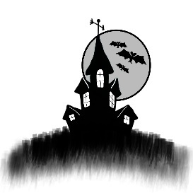
:::

WITHIN THESE WALLS

Kelleigh Elizabeth Perry

FIFTEEN YEARS AGO, just after Allie was born, her parent's bought a large Victorian house in the little town of Elmhurst. They all loved the eccentric touches the previous owners had designed into the structure of the home. Secret passageways, originally meant for pets to run through, were the perfect size for Allie to crawl around in as a child.  A special room hidden behind a stately old armoire provided her hours of entertainment. Her own room, nicknamed Narnia after her mother's favorite childhood book, could only be described as a young girl's dream.

The bed was tucked between two floor-to-ceiling bookshelves filled with beautiful leather bound classics. Gauzy fabric draped over thick wooden beams and strewn with tiny twinkling lights added to the magical feel of the room. Soft light provided by strategically placed lamps and a luminescent wall behind the bed bathed the room in an ethereal glow. Large windows and intricately carved French doors across the room led out to a balcony with morning glories creeping around the twisted iron bars.

The rest of the house had been decorated with expensive one-of-a-kind pieces her mother, Aileen, purchased when she travelled. Allie's father, Dr. Spencer Montgomery, was a surgeon at the General Hospital. With her father working most of the time, and her mother bitten by the travel bug, Allie spent much of her time alone in the house. She didn't usually mind. Her imagination would run rampant, and keeping herself entertained had never been a problem, but she was lonely. Allie longed for companionship.

When she wasn't in school, Allie stayed in the house. Her parents were kind but very strict, and this was one of their rules. Though well-liked by her teachers, most of the kids felt her to be too stand-offish, and not being able to socialize outside of school made maintaining friendships difficult. In the summer she'd swim in the family's pool, or lie in the sun writing pages upon pages of poems and short stories. When the weather got cold, she'd sit by the large fireplace in her bedroom, as the flames danced over freshly cut wood, and pour through her ever growing collection of books.  

One unseasonably warm day in March Allie arrived home from school early after having suffered stomach pains while in her last period class. To her surprise, her father's car sat in the driveway. Excited to have some company for a change, she rushed up the front steps and barreled through the front door only to come to an abrupt stop. Dr. Montgomery stood in the entranceway with a young boy, his large palm planted on the young man's shoulder. Allie recognized him from school.

"Allison, this is Brent Donaldson from down the street. He was just dropping off something for your mother." Dr. Montgomery smiled. Allie reached out and timidly shook his hand.

"I think we might have a few classes together. Anyway, I have to get going. My mom gets nervous when I don't stop at home right after school." Brent nervously rubbed his hand over his dark hair. "See you tomorrow, Allie. Bye, Dr. Montgomery." Brent rushed to the door and took off jogging down the street.

"What a nice young man, don't you think, Allison?"

"Yeah, he's a really nice guy, very popular at school."

"Well I have to hurry back to the hospital. I've got three surgeries this afternoon, so if you see your mother, tell her I won't be home until very late."

"Okay, I'll let her know." Allie put her bag on the table near the door and began searching for her history book. Her father's hand, like a vice, suddenly gripped her arm.

"Don't forget." He looked sternly into her eyes. "She has to know I won't be home for dinner, do you understand?" Allie nodded as he loosened his grip and his eyes softened. "Alright, I'll see you at breakfast tomorrow." He kissed the top of her head and walked out the front door, whistling as he made his way to his car.

Still stunned and confused by his tone, Allie gathered her books and rushed up to her room. She sat for a few moments going over the strange events that had just taken place before losing herself in a chapter on The Great Depression. With history done, she quickly completed her math assignment before starting her chemistry lab report. By now, her eyelids were heavy. She tried to fight it but soon succumbed to sleep amidst the notebook and textbook strewn bed.

A knocking in the wall woke Allie with a start. Every now and then the pipes banged and the sound resonated throughout the old house. As a small child, she played a game where she tried to match the noises by knocking on the wall. Most of the time it was short lived and she got bored, but one day in particular, she remembered the noises sounding as though they were answering her. For over an hour she knocked on the wall and heard a clanking response. She told her parents about it at breakfast the next morning. They exchanged a glance and her mother told her it was just a coincidence, and she should stop playing silly games. Her time would be better spent improving her reading and writing skills.

Until now, Allie hadn't thought twice about the noises in the wall, but this time they seemed somehow different; the pattern almost frantic. She reached her hand out to touch the wall, catching a glimpse of her wristwatch as she did. In a panic, Allie rushed down the stairs to find her mother in the living room going over a list of items she needed to pack for her next trip. This time she was going to The Netherlands. Allie had never been invited along on these journeys.

"Mother," she blurted out, causing Aileen to startle, "I meant to tell you father won't be home for dinner."

"I'd have figured as much by now, my dear, had he not called earlier and told me himself. It's nine-thirty, and dinner is usually at seven. I tried to wake you, but you were sound asleep, so I've left a platter for you in the refrigerator." Her mother smiled.

"Please, don't tell him I forgot to let you know he'd be late."

"I won't, now off with you. I need to finish my list before bed."

"Alright, thank you, Mother." Allie slipped out of the living room and took her plate from the refrigerator. After only a few bites of chicken, she threw the rest of the cold, dry meat and potatoes away. Rinsing her plate in the sink and opening the dishwasher, Allie was surprised to see two plates already in the otherwise empty machine. Why would there be two already if just she and her mother were home? Maybe her mother had eaten at seven and gotten hungry again before Allie had come down. Allie shrugged it off, grabbed an apple from the bowl on the marble island, and headed back up to her room to finish her homework.

\* \* \*

Months passed and school let out for the summer. Allie spent most of her days poolside, reading a new set of books her mother bought for her on her most recent trip. When it rained, she sat in her room filling notebooks with stories and poetry, or journaling about her dreams and aspirations. As the school year began, Allie was excited to get away from the house for even a few hours a day. She'd started to feel as though it were a prison.

One day, early in September, Allie bumped into Brent Donaldson in the hallway. Color crept up her neck and into her cheeks. Some of her writings over the summer had included Brent, and she found herself thinking about him more and more each day. She stood, frozen, unable to speak, as he smiled at her and said hello.

"How have you been, Allie? I didn't see you this summer. Were you away?" Brent appeared genuinely interested, making Allie even more nervous.

"N-n-no," she stammered, "I was home. I usually just stay in and around the house."

"Oh, well did anything interesting happen?" He looked nervous and a little frightened when he asked.

"Well, I got some new books, and I did a lot of writing."

"That's all, huh?" Allie watched as relief washed over his face. "I'm glad to hear it." Brent flashed a beautiful white smile and ran his hand through his hair.

"How was your summer?" she asked.

"Great, my family spent a month at the beach, and a group of us rented a cabin in the mountains for a week. If I'd known you were home, I would have invited you along."

Allie blushed. "My parents wouldn't have let me go. They're really strict about how I spend my time."

"Right, I forgot. Anyway, I'll see you around, Abby." He slung his backpack over his shoulder and took off down the hall.

Allie stood staring after him, confused. Had Brent Donaldson just called her Abby? No, he knew her name; they'd been in school together since the third grade. It must have been her imagination. The ringing of the bell startled her back to reality, and she raced down the hallway to her first class.

In early October the entire junior class was assigned a project. They were to work with a partner to write a research paper on a controversial scientific topic. Allie hated these kinds of projects. She was always chosen last and ended up working with the only other unfortunate soul who no one wanted to work with. This time, however, they were to be assigned partners. The list had been posted outside the science room door, and everyone crowded around to see who they were paired up with. Guys were high fiving each other, girls either giggled or groaned, and then there was Brent. He stood next to the list smiling broadly as Allie approached.

"It looks like we'll be working together on this one." He pointed at their names halfway down the page. "I already have some ideas about which topic we should choose. Let's meet at lunch and talk."

"Okay," she replied, timidly, "where do you want to meet?"

"I usually eat by the old oak tree on the edge of campus. It's between the gym and the football field. Bring your lunch, and we can try to pin down a topic and a focus."

Allie knew exactly where Brent ate lunch. She'd made it a point to avoid him by eating in the cafeteria. Now he was asking her to have lunch alone with him. She couldn't decide if this would be a dream come true or her worst nightmare. Both terrified and exhilarated, she agreed, and they parted ways heading to their next class.

As each minute ticked by, Allie became more and more nervous. Word had spread that Brent asked her to have lunch with him, and many of the other girls were jealous. She overheard one group talking about it as she made her way to her locker.

"Can you believe Brent Donaldson asked Allison Montgomery to have lunch with him?"

"As if they would ever work out as a couple\..."

"He doesn't even know her name. He kept calling her Abby."

They all started giggling before walking away. Allie hid her face in her locker as tears streamed down her face. She had never done anything to these girls, yet they taunted her and talked behind her back. Even worse, they confirmed her earlier suspicion; Brent had indeed called her Abby. She was so embarrassed to have thought he might be interested in her. How could he be if he couldn't even remember her name?

She considered standing him up for their lunch together, but since it involved a school project, she swallowed her pride and walked out to the oak tree. Brent was already there waiting. He waved her over.

"Hey, Allie, come sit down." He patted the ground next to him. "I have an idea for our topic I think you'll really like."

"Okay, what are you thinking?" She asked as she settled on the soft grass.

"How about Nature versus Nurture, and we could use your dad as a reference?"

"My dad? Why would we ask him? He's a surgeon."

Brent stared back at Allie, fear and shock flashing in his eyes. "Oh, that's right, he's a surgeon. For some reason I thought he was in research. Forget I said anything, we can choose another topic."

"No, I like the topic. We'll just have to find a different source to reference." She smiled at him. "Are you okay?"

"Yeah, I'm fine, Abby. No worries."

"Did you just call me Abby?"

Brent's eyes were as big as saucers. "Did I? I'm sorry." He squirmed awkwardly.

"It's fine. You've said it before though, is there a reason?"

"No, it was just a slip. Listen, I have to go. I'll call you and we can make plans to meet and write the paper. What's your number?"

"Oh, okay," she said, disappointed. After giving her number, he quickly gathered his things and took off toward the gym.

\* \* \*

Later that night, Allie sat in her bed surrounded by books on twins and the 'Nature vs. Nurture' phenomenon. There were so many fascinating stories of siblings separated at birth, brought up in different households, and in different living situations. Some ended up complete opposites, while others ended up with similar personalities, likes and dislikes. Without noticing the passage of time, Allie found herself awake past midnight pouring over her research and taking notes, when the pipes suddenly started banging in the walls. It had been months since she last heard them clanking away, and it startled her causing her to jump and scatter the books and paper everywhere.

She placed her hand against the wall to feel the vibrations. Thinking back to her childhood, she knocked the same rhythm on the wall. The banging stopped, and for a few moments, it was silent. Allie pushed her ear up against the wall. At first, she heard nothing more than the slight buzzing of the electrical wires, but moments later she heard something more. The muffled voices of two individuals having a conversation reverberated through the drywall. Pulling her head away, she thought it must be her parents talking somewhere downstairs, but when she listened again, it became clear that both voices were female.

Her mother left for London the day before, so Allie wasn't sure who it was she could be hearing. Quietly slipping out of her bed, she tip-toed out into the hallway and down the staircase to investigate. With her robe wrapped tight around her body and her slippers gliding across the marble tiles of the hallway, she moved unnoticed toward the room directly beneath her bedroom, her father's study. The door hung slightly ajar, so she pushed gently to get a better view. To her surprise, Allie found her father at his desk, furiously typing away on his laptop. He looked up when he heard the door squeak.

"Allison, what are you doing awake at this hour? It's nearly one o'clock."

"I'm sorry, Father. I was studying and thought I heard someone talking down here. I must have been mistaken."

Her father looked at her with a furrowed brow. "What do you think you heard?"

"Just two people talking with one another. I thought they were female, but now I see that couldn't have been the case. I hope I didn't disturb you. I'm going to back to bed. Goodnight."

"Before you go, can you tell me where you heard these 'voices'?"

Allie hesitated for a moment. "Well...I heard the pipes knocking next to my bed. I put my ear to the wall and thought I heard a conversation, but I couldn't make it out, only soft mumbling."

"What have your mother and I told you about those pipes, Allison? I thought you had outgrown this silly obsession with them. It's just the hot water running through cold metal, nothing more. Now off with you, and I don't want to hear any more about those pipes, understand?"

"Yes, Father." Allie turned and pulled the door closed behind her. She knew what she heard. There were definitely people talking somewhere nearby, but where? The house sat on a five acre lot with no neighbors on either side within screaming distance, never mind just talking. She heard a telephone ringing as she got back to her room. It must have been her mother calling to check in on her and her father. After lying in bed for what seemed like hours thinking about the strange voices, Allie finally fell into a fitful sleep.

She woke to the sound of rain against her window late in the morning. Saturdays were not usually meant for sleeping in at the Montgomery home. Her father always made sure she woke at eight to have breakfast with him in the large dining room. Her mother would also join when she was home every few weeks. Glancing at the clock next to her bed, Allie noted the time, ten-thirty, and quickly got herself up. After a quick shower, she dressed and went down to find out why her father had not woken her---only to find a note on the corkboard in the kitchen.

'Allison, I just got called into work for an emergency surgery. I'll be home late tonight.'

How strange. Her father had never been called in to work for any type of emergency. Now she would have to spend the day alone, cooped up in the house. It was probably for the best, though, as her father had the only computer with internet access in the house. Perhaps she could go online and do more research for her project. She made herself some eggs and toast, ate quickly in the kitchen, and went into the study to start working. Dr. Montgomery had very strict rules about her internet use, but since this would be research for a school project, Allie figured he wouldn't mind. She settled herself in his large office chair and carefully moved his paperwork out of the way.

As she pushed some of his files aside, one in particular caught her eye. A large stamp said 'CONFIDENTIAL' on the front, and unlike his other files, this one was very thick. She knew better than to open it, but she did look at the tab for a name. Understandably, there were no real identifiers, only the letters 'NvN' handwritten in the space. Setting it aside, she turned the computer on and got to work. After two hours had gone by, Allie had a large stack of printouts and she turned the screen off and headed out to the kitchen for a snack.

Taking a yogurt from the fridge, she walked into the living room and settled down on the overstuffed couch, pen in hand, ready to take notes on her research. Before she even had a chance to take a bite of her yogurt, Allie was interrupted by the ringing of the doorbell. She rushed over and looked through the peephole, wondering who could possibly be stopping by today. When she saw who it was, her heart started pounding and her knees nearly buckled under her.

"Hi, Brent," she said as she opened the door, "I wasn't expecting to see you today."

"Hey, Allie, can I come in and talk to you for a minute?"

"Sure? Is it about the project?" She moved aside ushering Brent into the foyer. He peeled his soaking wet jacket and hat off, and Allie took them and hung them in the closet.

"No, I didn't come to talk about the project. I wanted to apologize for running off on you yesterday at lunch. I know it seemed really awkward, and I wanted to explain."

"Why don't you come into the living room and sit down. I'll start a fire and you can dry off while we talk."

"Thanks, but let me start it."

"Okay, can I get you anything to eat or drink?"

He smiled at her causing Allie to blush. "If you're offering, I'm starving."

"No problem, I'll make a few sandwiches and some cocoa. Does that sound alright?"

"Sounds perfect, thanks, Allie."

She pointed out the firewood and matches and then headed back into the kitchen. Standing by the sink, Allie grabbed onto the counter for support as her heart rate slowed and the color left her cheeks. She took a few deep breaths to calm down before preparing lunch. Sandwiches were easy, but she worried the whole time that Brent might not like the way she made them. He could be allergic to tomatoes, or he might be lactose intolerant, and the cheese would make him sick. The sound of the kettle boiling on the stove snapped her back to reality. She mixed the cocoa and put everything on a tray and carried it all to the living room.

The fire crackled in the hearth and Brent stood close, warming his hands and drying his clothes. She placed the tray on the coffee table, and he came and sat down near her on the couch. Both ate in silence. Brent polished off his sandwich and yogurt before Allie had finished half of hers. He leaned back on the couch and sipped his cocoa.

"So, what did you came to talk about?" She asked him, hoping to break the awkward silence in the room.

"Oh yeah, I wanted to say how sorry I am for leaving so quickly yesterday. I know it probably seemed like I blew you off, and that wasn't the case at all. The truth is, I like you Allie, and I got embarrassed when I called you Abby and brought up your father's research. I didn't mean to make you uncomfortable." He stared at her, waiting for a response.

Allie never dreamed Brent Donaldson had feelings for her. She didn't even realize he knew she existed until that day in March when he'd been dropping something off to her father. "You like me? Seriously?"

"Well, yeah. You're really pretty, and you don't worry about what everyone else thinks about you like those other shallow girls at school. Plus, you're really smart, and I like that I can talk to you about school stuff and know we're on the same level."

Allie was speechless. No boy had ever liked her before, and she wasn't sure how to react, so she just sat there, staring at Brent. After a few moments, she processed what he had said to her. "What did you mean when you said my father's research?"

"The 'Nature vs. Nurture' project he's been working on. He has a lot of stuff on the subject, so I thought we might be able to use some of it to our benefit. Of course I know we can't actually ask him about it, but maybe we can look around and see what he has on the subject. It would give us a big advantage."

"I think you're mistaken. My father is a surgeon, and he's almost always at the hospital. He doesn't have time to do any additional research. Besides, I'm sure he would have told me about it if he was. He tells me about his work all the time."

"You said that yesterday, but he's not a..." Brent got cut off by the sound of the front door opening. Dr. Montgomery walked in carrying an armful of mail and his briefcase which he dropped when he saw Allie and Brent.

"What are you doing here?" he boomed. His face twisted with anger as he stared directly at Brent. "I told you not to come bother my daughter again."

"Father, Brent and I are working on a school project and..."

"I wasn't speaking to you, Allison," he cut her off. "Go to your room."

"But we..."

"I said, go to your room. Brent and I need to have a little talk." Embarrassed and confused, Allie ran out of the room and up the stairs. She wanted to hear the conversation but knew he'd know if she didn't go into her room. Closing the door, she flopped down on her bed as tears rolled down her cheeks. A boy finally said he liked her, and her father could ruin it all. She cried until she heard her father's footsteps coming up the stairs. Wiping her tears, she sat up on the bed and waited.

"Allison, may I come in please?" Her father didn't wait for an answer. He came into the room and stood over Allie. "Whatever that boy said to you is a lie, do you understand me? I don't ever want to find him in this house again. What were you thinking allowing him in with neither your mother nor myself home?"

"He stopped by to talk, and we are partnered up for a project at school. I thought we might be able to work on it a little."

"Well, I'll be in touch with the school tomorrow to get that changed. You are not to be around him anymore."

"But, Father, he likes me, and I like him. I hoped to have your permission to maybe go out with him sometime."

"Absolutely not, and this subject is closed. I don't even want to hear his name uttered in my presence. Is that clear?"

"It is, but our topic is 'Nature vs. Nurture' and he thought you might be able to help us out on our paper."

"He said what? Never mind, I've heard enough. Here," her father shoved her printouts into her hands, "and don't let me catch you in my study when I am not home again, young lady." He stormed out of the room, slamming the door behind him.

Allie spent the rest of the evening feeling sorry for herself and for Brent. She knew her father could be very frightening. Deciding it would be best to wait until the next day to call him, she slowly fell into a fitful and worried sleep.

\* \* \*

As the sun's rays stretched across the floor and slowly crept up to Allie's bed, she began her daily routine. First a shower, followed by breakfast with her father in the dining room, and then back to her room to enjoy some alone time writing. It was unseasonably warm that day, so she grabbed her book bag and gathered all of her papers together. The pool in the back yard had been covered since Labor Day Weekend, but the lounge chairs were still out, so she settled herself down in one and got to arranging her work. Their paper wasn't due for nearly two weeks, but Allie liked to have everything done ahead of time. She didn't work well under pressure.

Remembering she had planned to call Brent, she flipped open her phone to find a strange text message he must have sent her the night before.

'You have to save Abby. Check the gate at the back of the property. Your father is lying to you about everything!'

What did he mean? Who is this Abby he kept bringing up? She thought it would be best to call him and find out what he'd meant. After dialing, Allie waited to hear Brent's voice answer, but instead she heard an unfamiliar voice.

"Brent Donaldson's phone, can I help you?"

"Oh, um, I hope so, this is Allie Montgomery. Brent and I are doing a school project together, and I wanted to talk to him about it if I could."

"Brent was hit by a car last evening. He's in a coma. I'm one of the doctor's taking care of him and thought you might be a family member calling. Do you know how I can get in touch with them? We haven't been able to reach them by phone, and he only had his school I.D. card on him at the time. It's Saturday so we haven't been able to get I touch with the school to get his address, and no one has filed a missing person's report on him yet."

"He's where? What happened? When did they find him? Who hit him?" Allie asked, flustered. How had father not heard about this and told her this morning?

"A hit and run, and that's all I can say, sweetie. I'm sorry, but I can only give out medical information to family."

Allie hung up after giving the doctor Brent's address, staring at the text he'd sent her. What gate at the back of the property? The only one she could think of led to a small side garden where her father kept his tools and an old car. Brent must have been mistaken. And who is this Abby she kept hearing about?

"Allison," her father strode over to her. "I just got word that your 'friend' has been in an accident. I'm going to the hospital to see if there is anything I can do."

"Father, can I please come? I need to see that he's okay. It's my fault he was out at that time, after all. If I hadn't offered him something to eat and drink, maybe he would have left sooner."

"No! I told you last night you aren't to see him anymore and I meant it, I'll be back later." With that, he headed back into the house, and a few moments later, Allie heard his car fired up in the driveway and take off down the street.

Furious, Allie jumped up and rushed into the house. She slipped into her father's study and turned on the computer, determined to find out something more about the accident. As the bulky machine went through its loading process, she scanned his desk. Her eyes came to a rest on the thick folder labeled 'NvN'. She picked it up, listened carefully to ensure she was alone in the house, and flipped the cardstock open. Inside were two smaller files, one labeled AM1 and the other AM2. Brimming with curiosity, Allie flipped open the first file.

Her infant eyes stared up from the glossy finish of a classic photograph. Mother posed next to her looking beautiful in a gliding rocker. A copy of her birth certificate, listing her full name, Allison Katherine Montgomery, along with her parents' names, clung to the front of the folder, attached with a paperclip. The second folder made her breath catch in her throat.

Allie had always been told she was the only child her mother had ever been able to conceive. Ignoring the rest of the files contents, she pushed it aside and opened the next one, slowly, afraid of what she might find. Inside, a similar picture of a baby and her mother looking down. The baby's face appeared identical to Allie's own infantile features. Her mother sat in an old spindle rocker, her robe tattered and worn, and the baby in little more than a cloth diaper.

There must have been a mistake. Allie didn't have any siblings, but when she saw the birth certificate in this file, it couldn't be denied. Her parents had lied to her. On the line for 'Child's Name' it said Abigail Noreen Montgomery. Both were marked with the same familiar birthday, July 16, 1998.

Tears brimmed in her eyes as horrible thoughts ran through her head about what must have happened to Abigail and why she had never heard about her. None of these thoughts, however, were anywhere near as horrifying as the truth which soon would be revealed. Her body, wracked with terror and sadness, shook as she tried to put the files back together. She placed them back in the main folder and rushed out of the room up the stairs to her bedroom. She spent the rest of the afternoon alternately crying and wondering what could have possibly happened to her sister, and how she had lived fifteen years without ever knowing about her.

\* \* \*

As night fell, Allie still hadn't heard from her father, and her mother had yet to make her nightly call to check in on the two of them. She made a quick trip to the kitchen and heated up the leftover spaghetti from the previous night before heading back up to her room. Her head spun after the discovery in her father's study. Perhaps this is why her mother travelled so much and her father worked so frequently. They must blame her, in a way, for being the one to have lived and thrived. Their guilt over losing Abigail must have been why Allie lived such a pampered yet sheltered life. It all started to make sense, but one question remained unanswered. Why hadn't they told her about her sister?

In her silent bedroom, Allie tried to piece together the events of the last few days. The voices in the wall, Brent's strange behavior at school, the mention of her father's research she had known nothing about, the text message, the files in her father's study. It all had to mean something. Suddenly, it clicked. She jumped off her bed, ran down the stairs and out to the back of the house. The old wooden door in the fence looked overgrown with ivy and weeds, but as she got closer she realized the vegetation wasn't real. It had been glued onto the gate to give the appearance of an unused passageway. She tore off the plastic flora and unlatched the door.

The opposite side of the fence didn't look at all as she remembered it. No old car, no tools scattered around, in fact, a dirt pathway leading to what looked like a solid wall stood in its place. She had a feeling the wall wasn't what it appeared, and started searching around for some clue as to what it might be hiding. Feeling along the bottom with her hands, Allie hit upon a lever which caused the wall to open inward. A small set of stairs led down to a dirty, concrete foundation floor. She hesitated. Without some source of light, she couldn't see more than five feet in. Frightened of what she might find if she ventured any farther, Allie turned around and fled back into the yard.

The last vestiges of light disappeared behind the hills as dusk fell. She tried to put the fake foliage back on the gate as best she could before heading back into the house.  Slipping in through the kitchen, she searched around through the drawers trying to find a flashlight. Interrupted by her father's voice emanating from the study, Allie froze.

"What do you mean he's awake? He wasn't supposed to live through the crash. I hit him hard enough to break every bone in his body. Is he talking?" Her father paused as the person on the other end of the line answered. "Never mind, I'll come and take care of it myself.  If he tells anyone about the girls nearly sixteen years' worth of research could be ruined. I just need to go tell Allison I'm heading back for another surgery and then I'm on my way. Don't let anyone in to see him before then, do you understand? Good," he huffed as he slammed down the phone cursing.

Allie couldn't believe what she'd just heard, and there wasn't any way for her to get past the study without being seen. Thinking quickly, she hurried around the kitchen island and opened and slammed the door, feigning just having come in from the yard. Dr. Montgomery, having heard the door, headed into the kitchen.

"Is everything okay, Father? You look flushed." Allie tested the waters to ensure he didn't know she had overheard his conversation.

"No, Allison. It's not. I'm afraid your friend Brent took a turn for the worse and is not expected to live through the night. I'm going back to the hospital to see if there is anything else we can do for him."

"Please let me come" she pleaded, "I need to say goodbye."

"We've already discussed this, and, besides, I don't want you exposed to this kind of tragedy. He's gone and his broken body is merely a shell at this point. I'm sorry, but I have to go." He turned his back as tears fell from her eyes and her blood boiled with rage.

"You're lying to me. I heard you on the phone. You're the one who hit him, and you did it on purpose. You were trying to kill him." Nearly hysterical, Allie ran at her father and lashed out, hitting and kicking him as hard as she could. He quickly subdued her.

"What did you hear, Allison? Tell me!" he screamed as he shook her.

She gulped at the air, desperate to catch her breath. "I know about Abigail. I know I had a sister. What did you do to her? Why didn't you tell me? She's still alive. I saw the file in your study. Father, what have you done?"

Her father's face went ghostly pale. For a moment, Allie thought he might hit her, but instead he fell to his knees sobbing. Holding his head in his hands, he tried to regain his composure. A deafening silence followed. Allie didn't know if she should run or call the police. Her mind couldn't make sense of it all, only adding to her fear and confusion.

All at once, a blood-curdling scream pierced the air. Dr. Montgomery looked up as the sound filled the kitchen. "No! This can't be happening. It's too soon."

Allie didn't wait for him to get up. She rushed to the wall and listened. Another scream and a woman's voice trying to comfort its source filtered through the sheetrock. Her father jumped to his feet and rushed to the back door. Allie followed as he tore through the yard, yanked open the gate, and lumbered over to the secret door in the wall. He hit the latch on the ground and the door opened inward. The screaming became more intense, and Allie instinctively knew she had to find the source, even if it meant following her father into the dark hallway.

He hit a switch on the wall she hadn't seen before, and the tunnel illuminated. They were in a portion of the house Allie never knew existed, and the sounds of the two women grew louder with each step. This underground passageway had been set-up like a maze, allowing only those who knew their way through to reach the endpoint. After a series of twists and turns around blind, dark corners, the two finally came to a large metal door. Her father pulled a tarnished key ring from his pocket and fumbled to find the one matching the door in the dim, fluorescent light.

Once unlocked, the metal door swung open to reveal a room identical in size and shape to Allie's own bedroom. She looked around, slowly absorbing a horrifying contrast to the opulence of her retreat from the world. A metal-framed bed, with only a thin mattress, stood against the wall where Allie's own bed resided in her room. A tiny desk with a few notebooks and pencils sat up against the opposite wall, and where there should have been windows, a framed area with a painting of the back yard hung. Where her flooring boasted thick, lush carpeting, this room had concrete with painted areas to look like throw rugs. A small hole in the wall revealed a dumb-waiter which must have connected in some way to the house. Its rope and pulley system seemed archaic next to the exposed brass pipes in the niche.

A young girl lay half naked on the bed. Her face matched Allie's identically, and a swollen abdomen, continuous screaming, and moans could only mean one thing; she was having a baby. Her mother, who should have been in the South of France, turned when she heard Allie and her father enter the room. Aileen held tightly to the young girl's hand as Dr. Montgomery moved to the end of the bed.

"What happened? She isn't due for over three weeks. What have you done?" Allie had never seen her father speak to her mother in such a way.

"I didn't do anything. Her water broke an hour ago. I tried calling you, but no one answered, and when I tried again a few minutes ago, the line beeped back with a busy signal."

The girl on the bed appeared to be in so much pain she could barely speak, but her eyes met Allie's and both girls instantly knew who the other was.

"Abby?" Allie cautiously walked over to the bedside. Her sister nodded her head just as a contraction rendered her speechless, and she yelled out in agony.

"Shit, here it comes. Push, Abigail," their father said as the baby slid out. Abby cried and their mother tried to comfort her, but the baby didn't move or make a noise. Dr. Montgomery placed it in a blanket on the floor and tried to clear it's airway as its tiny body turned blue. He panicked and started doing CPR as the baby lay lifeless.

"What happened? Why isn't it crying? Where's Brent? He has to know the baby's here." Abby's anxiety grew with each word.

"Brent? How do you know him?" Allie was shocked to hear his name.

"He's the baby's father," Abby said as she stared down at the baby. "Please, someone call him, now!"

Finally it all made sense. The pieces of this puzzle all began falling into place when she heard a tiny cry coming from the blanket on the floor. Before her eyes, the baby pinked up and started moving.

"Give me my baby," Abby demanded, as her father picked up the blanket.

"No, Abigail. The experiment has been compromised, and this baby cannot stay here. I shouldn't have revived it, and now I have to get rid of it."

"The hell you will." The girls' mother jumped from her chair and snatched the baby from him. She handed it over to Allie as she pulled out a small hand gun from beneath her robe, the same one she'd been wearing in the picture Allie found in her father's study. "I've let you use our daughters for your ridiculous research for far too long. Enough is enough, Spencer. It's over, now get out."

"Aileen, you're a part of this too, and just as guilty as I am; pretending to go abroad every few weeks to spend an equal amount of time with each of the girls. If I go down, you're coming with me." He lunged at her, causing Aileen to drop the gun. The two hit the concrete slab hard, and everyone heard the sound as Dr. Montgomery's head came into contact with the floor. Blood pooled all around him, his eyes grew wide, and his mouth opened in a silent scream. Allie ran to her sister's bedside, cradling the baby in her arms as their mother picked herself up off the floor, tears rolling down her cheeks.

"No! Spencer, wake up. You have to wake up!" Her pleas were unanswered. Dr. Montgomery had died. Their mother sobbed over his lifeless body, the girls watching in disbelief, as the baby's cries echoed through the barren chamber.

Allie handed the infant to Abby and watched as she carefully unfolded the blanket. "It's a boy."

Allie looked back and forth between her sister and parents. Her father's body remained still as her mother curled into a ball beside him. Feeling dizzy and lightheaded, the room began to close in on her. She heard Abby's voice screaming her name before her world went black.

\* \* \*

Allie slowly woke the following day in a cold, white hospital room. Unable to open her eyes right away, she heard the unfamiliar voices of doctors and nurses, her mother's occasional quiet weeping, and the blips of the monitors. She didn't remember much of what had happened, and she called out for Abby who sat in a wheelchair across from her bed holding a beautiful baby in her arms.

"What happened?" Allie croaked out.

"You passed out and hit your head on the floor. We didn't think you were going to make it through the night." Abby reached for Allie's hand. "I'm so happy you're okay. Mother told me everything. Rest a while and I'll explain later."

"I've been asleep for an entire day. Please, tell me now," Allie replied, anxious to hear what her sister knew. Her head throbbed. She reached up and winced feeling a sizable lump where her skull hit the concrete.

"Are you sure you're ready for this?" Abby's face reflected concern for her sister.

"I need to know, Abby."

For the next hour, Abby told Allie everything she had learned. Their father had come up with his 'experiment' when their parents found out they were having twins. He had forced their mother into participating in the 'Ultimate Nature vs. Nurture Project', as he liked to call it. They split their time equally between the girls. Their father was actually a research assistant posing as a surgeon to account for his time spent away from Allie. The two weeks each month their mother left to go on her lavish trips were spent with Abby in what Allie now learned wasn't just a bedroom, but an entire underground compound. It had been constructed identically to the upper level of the house, complete with three bedrooms two bathrooms, and a laundry room. Not having a matching downstairs, it lacked a kitchen, so when Allie had heard the banging of the pipes all of these years, it had actually been Abby trying to get her parent's attention to send her down a meal on the dumb-waiter.

The execution of the plan had been flawless. Both girls were fed the same food and allowed the same amount of time to sleep each day, but Abby hadn't been given access to a proper education. She only saw the outside world at night while Allie slept, and those were just brief thirty minute outings into the yard. She'd been given drugs and alcohol as a child, addicted to heroin at age twelve, and then forced to suffer through withdrawals when her father abruptly stopped supplying it, giving her sugar pills instead. He'd brought Brent in to impregnate Abby so he could study the life of a single teenage mother with no resources. It hadn't taken much to get him to perform the act. Dr. Montgomery had drugged his daughter and Brent enough that it took very little persuasion. Their mother hadn't known about either of these experiments until it was too late.

The plan had backfired, however, when Brent stopped taking the medication Dr. Montgomery had given him and his memories started coming back. When their father found Brent and Allie alone in the house, he'd been afraid the boy told his daughter what he'd been forced into doing, so he ran Brent down with his car hoping to to kill him. When he found out about the school project and the topic they had chosen, he knew he had to get rid of Brent once and for all.

"He's not dead though, is he? Brent didn't die from the crash." Allie suddenly remembered the conversation she had overheard her father having.

"No, in fact he just got moved out of the ICU. They let him come up and see me and the baby this morning. He kept calling me Allie and making me giggle. They said the crash affected his memory a little, but he should have a full recovery."

"That's what first made me suspicious! He called me Abby a few times a school. He never came out and told me about you, but he tried to point me in the right direction. He sent me a text on his way home. It must have been just before Father hit him."

"He saved my life and Brenson's..." Abby's words drifted off.

"Is that the baby's name?"

"Yeah. I wanted to combine Brent's and yours. You both saved us and got us out of that horrible place." Allie felt honored.

"So where do we go from here?"

Abby smiled. "I'm not sure," she looked down at Brenson, "but now that we're together, it can only get better."

Their mother walked in the room, flanked by police officers, looking nervously at the girls and the baby. She had tears in her eyes. "Allie, are you alright?" She cautiously stepped toward the bedside. The officers remained near the doorway allowing her to have a moment with her family.

Allie couldn't decide if she wanted to hug her mother or strangle her for what she'd done. She was just as guilty as their father, even if she didn't know the full extent of what he'd done to Abby.

"I'm fine, Mother," she replied, coldly. "You can go. I don't want to see you right now."

"I wanted to apologize to you girls for everything that happened. I didn't know how far your father had taken his obsession. You deserved better lives, both of you, and I'm so sorry."

Allie adjusted the prongs delivering oxygen in her nose. "You've said your peace, now get out."

"I understand why you're angry, Allison. We've all been hurt terribly. You have no idea what I went through, the abuse I had to withstand over the years, so your father could conduct his 'experiment'. There is really only one way I can rectify it so we can all be at peace." She looked over her shoulder and saw Brent being wheeled in the room to see Allie. In a flash, she withdrew a lighter from her pocket, and before the girls had a chance to protest, she flicked it on and held it over the nozzle on the wall labeled 'Oxygen'.

The explosion could be heard for miles, and with that, Dr. Montgomery's project and legacy were wiped out for good.

GOES BUMP IN THE NIGHT

::: {}

:::

I used to be frightened

as darkness would fall

of monsters in closets

with nightmarish calls

'Neath covers I cowered

as walls seemed to bleed

and ghouls running rampant

performed horrible deeds

Soft scratching I'd hear

and vampires I'd see

as they floated on dead mists

and beckoned to me

My childhood was spent

in such terrible fright

from all of those things

that go bump in the night

That fear has been conquered

I don't tremble or shake

as I cruise through the mean streets

selling drugs that you take

Those visions you're seeing

and demons you hear

that's the magic white powder

changing all you hold dear

You'll scream from the horror

perhaps slash both your wrists

still I'll serve you the madness

from the vials in my fist

I wear smiles on my cold face

as I take all your bread

and the poison you're shooting

takes your soul to its bed

Now that I sell the nightmares

and have shed my past fright

label me as the creature

that goes bump in the night

-Gregory K. Shipman

::: {}
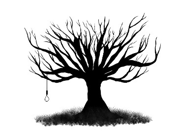
:::

LILY OF THE VALLEY

Shaun Adams

THE NOISE BEGAN when Tina turned off the light. Almost as if whatever it was took that as a cue.  I was tired and laid there for a moment attempting to process what I heard, not such a good idea in the dark. The skittering, sliding noises coming from right above my head appeared to be coming from the attic.

My brain attempted to identify the sounds in a calm, sensible fashion. It must be a mouse or rat, perhaps a pigeon, or some other bird.  These all seemed plausible. Were those feathery sounds? I wasn't sure.

My Imagination kicked in big time, sending me images of a clown with deadlight eyes and teeth made of nails sitting on the ceiling. Were those marbles he rolled across the ceiling or somebody's gallstones?

Dark, isn't it? Fuck gravity, we all float up here above your head, friend.

The words echoed inside my head like vipers hissing in a pit. In daylight, I would have laughed but in the dark, it didn't seem all that funny. Damn you, Stephen King, and thanks for all the memories.

Tina's hand slid over and grabbed my arm beneath the duvet.

"John, what the fuck is that?" she whispered urgently. Her nails dug deep into my flesh. I twisted out of her grip and reached up for the light cord.

"Not sure, sweetheart, but I'm going to find out."

Waving my hand about in the darkness, I frowned a little when I couldn't find the cord where it should be. In my mind's eye, the clown grinned down at me holding it just out of reach. I stretched my hand out a little further to the right and, to my relief, could feel the cord. I pulled it and the light clicked on.

There was nothing on the ceiling. The sound continued however.

"Must be something in the attic," I said, swinging my legs out from under the duvet.

"It was crazy of me to let you talk me into moving here," Tina said.

I turned to look at her. Only the top of her head was visible resting on the pillow.

"Your grandmother left it to you in her Will. I thought you'd jump at the idea of owning this pile."

"I lived here as a child. My grandmother was an evil bitch."

Wow, you hold that grudge, sweetheart. Never let it go. I kept that to myself and thought of something safer to say.

"Well, she must have thought kindly of you, darling."

"She was mean and sadistic. Moving here was a bad idea. I left here as soon as I could. I never want to be the kind of person she was, so spiteful and cruel."

"What's done is done. You could never be like her." I said trying to play it down. "Let me sort out this little problem and we can talk about the rest in the morning."

"It better not be rats, or I'm not even going to bother unpacking. First thing tomorrow I'm moving back to the old house."

"We're in a new house in the countryside, Tina. You have to expect these things."

I didn't bother mentioning how we couldn't move back to the old house as it had already been sold. I got up and reached for jeans. I'd slung them carelessly on the floor moments earlier. After a long day, moving all our worldly belongings from one house to another, I'd been looking forward to a decent night's sleep. Now it seemed as if my day was not over after all.

"If I'm not back in fifteen minutes call for reinforcements," I said.

"Just leave the bedroom light on, and don't make too much noise."

Tina's hand shot out from under the duvet and pulled a pillow over her head using it like a giant earmuff.

I couldn't blame her for being off with me; after all it was my fault we had to move from the old place. I slipped out of the bedroom and closed the door behind me.

I headed downstairs for my aluminum combination ladder. While there, I slipped on a pair of my work boots. Standing on the rungs of a ladder barefoot is an uncomfortable experience. I also grabbed a flashlight from my toolbox, shouldered the ladder and carried it back up the stairs.

Reaching the landing, I looked up at a hinged trapdoor held in place by four sliding bolts.

With the ladder positioned, I climbed up it and pushed upward against the trapdoor with the heel of my hand relieving the weight from the bolts then released them one by one.

The door was heavier than I expected, solid. It caught me off guard. I could feel the ladder wobble beneath me as I changed position to ease the door downward until it hung from its hinges. Beads of sweat formed on my forehead and ran into my eyes despite the cool night air.

Managing to keep my balance, I climbed upward into the dark opening above me.

At the top of the ladder, I hesitated, listening for the noises I'd heard while lying in bed. I grabbed the flashlight from my pocket and wasn't impressed by what I saw.

Thick black cobwebs hung from dusty rafters like mourning lace. I pulled myself up through the square hole and sat with my legs dangling. It was cold, no insulation. I shone the flashlight around taking in the red brick chimneybreast with its flaking mortar, the wormy rafters and yellow rows of roof tiles. The attic was mostly empty apart from a jumbled pyramid of old tea chests. I stood up, being careful not to catch my head on the sloping beams and moved from joist to joist, taking care not to tread in between for fear of putting my foot through the bedroom ceiling below me.

The stack of tea chests held a treasure trove of personal items I guessed had belonged to Tina's grandmother. There were framed photographs thick with dust, a silver teapot, china plates, all manner of bric-a-brac. I handled each piece carefully, examining them in the beam of the flashlight. Halfway down one crate, I discovered a brown parcel and lifted it out, blowing dust off its cover. I'd completely forgotten why I was up there in the first place. I opened the package and pulled out an exquisite wedding gown. It was the most beautiful thing I'd ever seen. I shook out the creases and held it against me, holding one sleeve in my hand as if about to dance with it.

I closed my eyes and, for a moment imagined, I could smell perfume. Lily of the valley, a woman's voice whispered in my ear. The dress began to fill out beneath my arms, to take on a most pleasing shape. As it swelled and took form, so 'little John' began to swell and strain in my jeans. My breathing slowed and before I knew it, I was dancing.

"John? John. Oh my god, what are you doing."

Tina's top half stared at me from the trapdoor opening.

"Wait, it's not what you..." I got no further. By my side, a withered face grinned at me. A corpse in a wedding dress. I pushed it away and turned toward Tina but she was descending the ladder, closing the trapdoor behind her. How she found the strength, I do not know but I heard the bolts sliding back into place leaving me trapped in the attic with her dead grandmother.

"She's not good enough for you, John. Let me show you what a real woman can do."

The words crackled from grandmother's desiccated lips in a cloud of dust like spores escaping a puffball.

Panic knotted my stomach. My hard-on shrank as swiftly as it had stirred.

"Tina," I screamed the words turning away from the shriveled husk as it advanced towards me. I stepped face first into a hanging web and it enveloped my face like a shroud making me gasp, sucking its filthy blackness into my mouth. Blindly I stumbled forward and felt the floor give way beneath me, ancient lath and plaster disintegrating beneath my weight.

I fell a long way into darkness and then finally hit something soft and bounced.

Frantically I wiped at my face, trying to pull away the filthy spider web but there was nothing there.

I felt Tina's hand slide over and grab my arm beneath the duvet.

"John, what the fuck is that?" she whispered urgently.

Laying there in the bed, I listened to the skittering, sliding noises coming from right over my head.

::: {}

:::

COMES A SLAYER

Matthew X. Gomez

"HEY MISTER!" A girl called out. She looked underfed, her skinned-knees indicating a hard scrabbled life in the dust and the dirt. Her hair was a burnt orange color, the same shade as the dusty ground, and freckles speckled her face. She perched on the split rail fence leading into the no-horse town. I shouldered my worn leather tinker pack and kept walking, one foot following the other.

"Hey Mister!" she called again, more insistent and demanding this time. "Where's your sword?"

I stopped, leaning lightly against the spear that doubled as my walking stick. It was half again as tall as I was with steel bands wrapped around the shaft and a cast iron butt-cap. The head of the spear was forged steel with a razor sharp point and barbs along the top edge. A short-hafted axe hung from a strap on my belt, its narrow crescent blade gleaming in the sunlight. A dagger as long as my forearm hung from the opposite side.

"My what?" I asked, adjusting the brim on my hat. The sun was bright, and I wanted to get a better look at my impromptu interrogator. She was about eleven or twelve, not quite a child but not quite a woman either.

"Your sword, Mister. Don't all heroes carry one?" She kicked her bare feet against the fence post, making it thrum. "You're here for the dragon, aren't you?"

"I'm here for the dragon, all right. I wouldn't call myself a hero though," I said, pulling on the mule\'s rope to get it walking again. I was sure the beast\'s previous owner had told me its name, but as far as I was concerned 'Mule' was as good a thing to call it as anything else. It answered to 'Mule' in any event, and all it needed to do was carry my gear.

Now that I was closer, I could get a better look at the town. It had the usual general store and inn, and I counted two taverns at least. One of them probably doubled as a brothel, but mid-morning was hardly the usual time for such business to be conducted. From the ringing notes of a hammer striking metal there was a smithy nearby, and an acrid tang announced the presence of a tannery.

My stomach grumbled fitfully, reminding me the last time I ate anything was the night before. My feet ached from the miles trudged into dust behind me. I tethered Mule to the hitching post outside the closer of the two taverns and made my way inside.

"That's an awfully big stick you're carrying, Mister," the man behind the bar said. He was a big man gone soft, probably a former soldier-for-hire who found a quiet spot to retire. A functional looking two-handed axe hung behind the bar within easy reach. The ceiling was relatively low, the tip of my spear grazing the bare wood. The common room was cramped, filled with long tables and benches, most of which were unoccupied.

"Is it a problem?" I asked. The smell of roasting meat was a pleasant change from the tannery outside, but it did remind me how hungry I was and how tired I was of eating my own cooking.

"No problem." The tavern keeper smiled broadly revealing broken and missing teeth. "You've got coin?"

"I'm here about the dragon."

The man's eyes narrowed to slits and the grin vanished so completely I wondered if I'd ever seen it. "Another fool, are you? Well I don't give credit, especially not to dead men. You want to eat, well, you either pay or you get out. People who come to kill the dragon don't usually stick around for long, and none of them come back."

I snorted, pulled a pouch of coins out of my jerkin and placed it on the worn-smooth bar top. "I've coin enough."

The bartender's smile reappeared. "Good enough for me then. Let me get you a plate. Roast meat and root vegetables, plus some of my own home brew?"

I nodded. "I've been traveling a while. Can you recommend a place to stay?"

The bartender yelled an order into the back kitchen before turning back to me. "What's that?" he asked. "Oh well, there is just the one inn. A couple of people around here might be taking boarders as well, but I know the inn has vacancies."

"Is it any good?"

The bartender shrugged. "It's all right," he said. "Nothing too fancy, but the beds aren't full of vermin and you can get company if you don't mind spending a bit of coin. The keeper is my brother-in-law. He's not a bad sort, all considered."

"Thanks, I'll keep it in mind," I replied. A short, heavy set girl pushed through the door from the kitchen and deposited a platter of meat and vegetables in front of me along with a tankard of the home brew. The meat looked tough and stringy, and the vegetables were more than a tad suspect. If the surrounding area was having trouble with a dragon, I should be happy there was still food. The beer though, was rich, dark, and strong with a pleasant malt taste to it.

"I'm guessing the farms around here are getting hit hard," I said around a particularly tough bit of beef. I already knew the answer, had seen the signs as I approached the town. I'd seen more than one homestead reduced to a burnt out shell, the ruins still smoldering in places. Someplace else, you might think it was raiders, but there weren't any bodies. A full grown dragon wouldn't let all that meat go to waste.

"Six so far," the bartender confirmed. He noted my empty tankard and swapped me for a full one. Good man, that. "About one a week. Mayor's been trying to get more of the outliers to come in, and some have. Most of them are a stubborn lot though."

"They wouldn't be farmers if they weren't stubborn," said a voice behind me. I turned to see a corpulent red faced dressed in fur and wearing a thick silver chain of office around a neck swallowed by a triple chin. He'd be the mayor then. Flanking him were two toughs, axes and long knives hanging from their belts and both staring hard at me from lowered brows. I think they were trying to be intimidating. "You are a slayer then?" the mayor asked.

"One of the best," I replied.

"You don't look so tough to me," the tough on the right said. "What makes you one of the best?"

Sighing, even though I half-anticipated the question, I reached into my jerkin and produced a leather folio. The mayor's goons went for their axes at my approach, and I smiled when the mayor told them to stand down. Spreading out the contents of the folio revealed three scales, each the size of my hand. The first was the color of a blazing hearth fire, the second was as black as a chunk of coal, and the third was the color of new grass in spring.

"Three dragons?" the mayor breathed, his eyes wide in his piggy face. "Truly you are a prodigy, sir."

"Or a liar," muttered one of the toughs. I smiled at him.

The mayor reached out to touch one of the scales, but I swept them into the folio and tucked it back into my jerkin.

"Where is the rest of your crew?" one of mayor's guards asked. The question made me reassess his intelligence. Maybe he wasn't dumb muscle after all. It was true: most dragon hunters worked in teams of at least ten to fifteen. Some professional bands held upwards of thirty full-time members with any number of additional hangers-on and camp followers. Anything less than ten was generally considered folly at best and suicide at worst.

"It's just me," I said, taking a long pull from my tankard. "Have any other hunters tried to rid you of your dragon problem?"

"The Band of the Red Hand went up into the hills ten days ago," the mayor replied. "They haven't come back and the dragon attacked another farm three days ago."

I had never heard of the Red Hand, but wasn't surprised. Usually when word got out of a dragon sighting, amateurs started crawling out of the woodwork like termites from a rotten log. Most were young sons of minor nobility looking to make a name for themselves. Others were soldiers, most of whom had experience fighting ogres or possibly the odd giant. Nothing could prepare them for the sheer pants-soiling terror of going up against a winged avatar of destruction. The most successful hunters made sure to employ at least one wizard. Of course, it was something of a challenge to find a wizard who would rather risk being flambéed by a giant lizard than live safely in quiet contemplation.

"How many in the band?" I asked.

"Fifteen," the mayor replied. "They had someone claiming to be a wizard with them."

"All right," I replied. Nothing they were saying was dissuading me from making my own journey up into the hills. Even after ten days it would be easy enough to follow the trail of fifteen men.

I turned back to the bar but the mayor and his flunkies hadn't moved. "Was there something else?" I asked.

"Err, yes... that is we were wondering how long you were planning to stay in town," the mayor explained. I didn't have to see him to smell the nervous sweat on his skin. Could be he was as scared of me as he was of the dragon. Could be he had good reason to be.

"Just tonight," I said, trying to sound reassuring but probably sounding tired. "I thought I'd get a good night sleep, resupply, and head out in the morning."

The mayor cleared his throat, trying to give his voice the extra weight of authority it sorely lacked. "I don't want any trouble," he said. "Some of you hunters can get a bit out of hand."

I snorted. "Worse than a dragon?"

"He said, 'No trouble,'" one of the toughs, the smart one, repeated.

"Yeah, yeah, I heard him."

The mayor and his bodyguards left the tavern without so much as a fare thee well or a good luck. They didn't hurl any curses at my back either, so there was that. The bartender checked my tankard and passed me another full one. Like I said: good man. "Don't mind the mayor," he said. "The last group through here got a bit out of hand."

"Not my problem," I said, slowly sipping my beer, making a mental list of what I'd need. Food for one thing, as my rations were getting perilously low and I didn't have a good sense of how long it was going to take me to find the dragon. I could sense it out there, a tingling down at the base of my spine. It wasn't precise though, and I knew I'd be out in the wilderness for a time.

"You think you'll find the Red Hand out there?"

I took a long time answering, savoring my beer and the buzz it brought before answering. "Fifteen men aren't going to be sneaking up on anything, least of all a dragon. Even if I do come across them, I don't think any of them are coming back alive. Dragons don't much like being hunted."

"But you've killed three of them. How'd you do that?"

I gave the bartender a twisted grin and rested my finger across my lips. "Trade secret," I said. "My thanks for the beer and the food." I paused, looked around at the tavern, imagined it engulfed in flames.

"I should go see about those supplies. Will my mule be all right out there?"

"Shouldn't be an issue," the bartender replied.

I thanked him, paid my tab, and exited the tavern. The sky was cornflower blue, the sun, high and hot, baking the ground and bleaching the wood of the buildings. I made my way across the street to the general store, feeling eyes on me. Word had evidently spread of my presence and strangers were probably rare so my arrival elicited curiosity. As long as they were content to look and didn't feel the need to pester me, well, then it didn't bother me any. I was used to being stared at.

The general store was much like other stores on the frontier. Sides of salted beef and pork hung from the high beams of the ceiling. Sacks of grain were stacked high. Staples like salt and sugar were neatly organized on shelves. I noted picks and shovels, saw blades and wagon tongues. A solitary cat gazed at me enigmatically from atop one of the stacks of grain.

A stout middle aged woman, her hair tucked up under a blue scarf, came out of the back. She tried twisting her frown of disapproval into a welcoming smile, failed, and settled for a neutral sort of contempt. "What do you want then?" she asked.

"I need supplies. I'll take six pounds each of pork and beef, some salt, sugar and a week's worth of hardtack. Do you have any coffee?"

The woman grunted. "What does this look like to you, the Capitol? There is a merchant comes around once a month or so. He brings some coffee. I usually sell out the same day. Mayor buys it all. You should know I don't take credit."

"I know, I know," I said. "I've got coin to pay." The woman's dour expression brightened by a fraction.

"You're the dragon hunter everyone's going on about, aren't you?" she asked as she started bundling my supplies.

"I'll take fifty feet of that rope too," I said, pointing to the coil in question. "Wait, what? News does travel fast around here."

She shrugged. "What did you expect? It's a small town. Do you think you'll find the Band of the Red Hand?"

I picked up an iron pot, turning it over in my hands, before setting it back down. "Alive you mean? Not likely."

I turned to see the woman biting her lip, her eyes moist, making me regret my honesty.

"Your man went with them?" I asked.

She shook her head. "My son. I forbade him from going, we fought, and he went anyway. He's not even sixteen." The woman wasn't quite blubbering, but was close to it. Feeling clumsy and awkward I reached out and touched her arm.

"I'll look for him," I said. It wasn't going to make much difference. Dragons weren't known for leaving survivors or taking prisoners, and the odds of a boy, even one born and raised on the frontier, surviving out in the wilderness were slim.

"Thank you," she said.

I picked out a few more items: a spare flint and steel, the pot I'd been eyeing, and I even splurged on a small steel mirror and a new razor. Most importantly I picked up a local map of the area. Even if it wasn't completely accurate, it would give me a better sense of where I was going than without one. "The local smith made this?" I asked, holding the razor up in the light so it gleamed off of the blade. "Exceptional work."

"My husband's work," the woman said, the pride evident in her voice. "He was a smith in the army before he mustered out."

I paid for the goods and arranged to have them picked up in the morning. As it happened to be midafternoon, I found myself with some time on my hands. I resisted the urge to go back to the tavern, as tempting as it was to be around people. An early start was called for, and time spent in a tavern has a way of getting away from me. I still needed to answer the question as to what I was going to do with myself for the remainder of the day.

I left the store angry at myself for promising the woman I'd look for her brat, and angry at her for asking. I tried to imagine myself in her place, but soon shook my head at the effort of it. It had been a long time since I'd seen my family, and I had long since abandoned any notions of starting again. I broke free of my reverie as I passed into the cool interior of the inn.

I saw my friend, the mayor, having swapped his furs and chain of office for more functional linen tunic and breeches. His two bravos lounged in the lobby, one of them offering me a half-hearted wave. There was no animosity there, only casual professionalism. I tipped my hat back at the one who waved.

A tired looking woman, half falling out of her dress, her face flushed with drink, pushed to her feet and made a half-hearted attempt to saunter over to me. She pressed herself against me, but I grabbed her wrist as she slid her hand into my jerkin.

"What?" she breathed into my face. She was trying to be seductive, but the cheap rotgut she'd been drinking made me want to gag.

"Bit early, isn't it?" I asked, pushing her away.

"Since when is it ever too early for a bit of fun, big man?" she asked. "Or do you not like my particular flavor?" She let out a too loud and brash laugh before slumping back into her chair, skinny legs lewdly spread and eyes half-closed.

"A room for the night then is it?" I wasn't sure when the mayor appeared next to me, but there he was. "That'll be two merchants," he said as I reached for my purse. "Company's extra, of course," he said, indicating the whore with a shake of his jowls.

"Two merchants?" I grumbled. Usually that much coin would buy you a room for a week with some left over. "You wouldn't be trying to gouge me here, would you?"

The mayor's eyes hardened. "Times are tough. You don't like the price, you can find lodging elsewhere. We don't serve food here either so don't ask. And I need the coin up front."

Grumbling, I fished two silver coins out of my purse and dropped them into the ham-sized hand of the mayor. He smiled, displaying two rows of perfectly white teeth. His eyes didn't get any softer though.

"Are you going to want company tonight?" he asked.

The whore was snoring softly in the chair. Her dress had fallen a bit more, revealing almost all of one sagging breast.

"Oh, not her," the mayor assured me. "I have other girls working for me. She works the day shift. Unless of course you prefer boys..."

Shaking my head, I tried and failed to keep my feelings of distaste from showing on my face. "Won't be necessary," I said. "I'll take the room. I do expect my mule to be seen to, though, and don't think you'll be charging me more for that."

"I'll have it seen to," the mayor said.

The room itself was small and spartan; a bed, a wardrobe, a chamber pot, and a wash bowl. The door at least latched from the inside, ensuring a modicum of privacy. I took off my weapon belt, sat on the bed, pushed off my boots and stretched. My body ached from travelling and the bed was warm and soft: a far cry from my usual accommodations of hard ground for my bed and my pack for a pillow.

I closed my eyes for what felt like a moment, but when I opened them, it was dark outside my window. I listened carefully to the noises of the inn, but other than the distinct sound of a headboard banging into a wall somewhere below me, the building was quiet.  My stomach grumbled fitfully, but I promised I would take care of it come morning.

That night, the nightmares came. The old farm blazing. My wife, my parents, engulfed in fire. My sister, snatched from the ground and dropped from such a height it shattered all of her bones. Again, I saw myself race into the farmstead, saw myself grab my grandfather's spear. Stumbling back into the courtyard, choking on the smoke, looking for the winged devil who destroyed my home, my family.

It saw me, its awful yellow eyes gleaming as it swooped down on me. I braced the spear, the point piercing its chest, and the impact sending me sprawling, its body covering mine. I remember the blood, black hot and thick, so much of it entering my mouth, filling me with dread power.

I sat up, hands clutching the sheets, covered in sweat. Only a dream. Settling back into the bed, I closed my eyes, slowly started counting back from one thousand. At some point, sleep took me.

When I woke again, it was to a light rapping on my door. I grumbled something unintelligible, sat up, pulled on my boots and walked to the door.

"What is it?" I half growled, grabbing my axe from my belt and holding it loose and dangerous back behind my leg. Admittedly, I am not at my best first thing in the morning.

"It is morning, sir," a voice, young and female, said. "Master Biggles asked me to wake you up."

"Who?" I asked, rubbing the dirt from the corner of my eyes.

"The mayor."

"Oh." I unlatched the door. Standing there was a pretty girl, couldn't have been any older than sixteen. She had the same red hair and freckles as the girl who had greeted me outside of town. I wondered if they were sisters. She was carrying a tray laden with cold meat, cheese and what looked and smelled like porridge. My stomach chose that moment to remind me of my earlier pledge.

"All that for me?" I asked, stepping aside so she could enter the room.

She nodded. "Master Sloe over at the tavern thought you would want something to eat before you went on your way."

Smiling, I picked up a slice of ham, folded it over, and popped it into my mouth. I turned to see the girl still looking at me. "Was there anything else?" I asked.

"Is it true you are here to kill the dragon?"

I laughed. "Why does everyone keep asking? Do you get a lot of heavily armed strangers just passing through?"

She shrugged. "We get them on occasion. Most of them are veterans and deserters looking for a new life. We hoped the Red Hand would have taken care of the problem, but the dragon is still out there and the Band hasn't come back."

I cut a thick slice off of the loaf of bread. I placed a generous amount of the ham and cheese on top of it, then topped it off with another thick slice of bread.

"What's that?" she asked.

"This?" I responded, pausing with the food halfway to my mouth. "A trick I learned from an old campaigner."

"Seems a bit odd," she said.

"So was he." I took a bite, set it back on the platter and finished getting ready. I buckled my weapon belt, and slung my satchel over my shoulder before picking up my spear and taking another bite out of my sandwich.

"Have you killed any dragons?" She stepped between me and the door.

I looked down at her and thought about lying. "Three."

"You think you'll be able to kill this one?"

I tried to push past her, but she deftly stepped in front of me again. "Well I won't be able to if you keep me from leaving," I said. "But yes, I don't expect this one to be any different."

I finally managed to get past her and make my way downstairs. Mule was waiting for me outside, already laden with the supplies I'd purchased.

Finishing my sandwich, I unhitched him. "Ready then?" I asked.

Mule gave me a baleful look and rolled his eyes, which I figured was as close to agreement as I was going to get. There were no crowds gathered to see us off, no women offering a favor to bring me luck or to safely see me on my way. I figured they'd been disappointed enough when the Red Hand failed to exterminate the dragon, and had decided one man wasn't going to have much more success.

From what I gathered, the dragon was attacking farms up to the north of the town so I decided to start my search there.  The road out of town wasn't anything more than hard-packed dirt, and the grass alongside was the yellow-browned result of too much sun and not enough rain. The map I picked up wasn't the most accurate or detailed, but it did show a number of farms a few miles out. I selected one, owned by someone named Mudder, apparently, and made it my goal for the day. At around midday, I stopped to let Mule have a rest and to eat something myself. The landscape hadn't changed, and if it wasn't for the fact I could no longer see the town, it was as if I hadn't made any progress. I studied the sky, but it was empty except for a few fluffy cotton clouds. I didn't even see any birds. I sighed, picked up my spear and used it to leverage myself to my feet.

The afternoon was much like the morning, only hotter. It wasn't long though before I saw a few wisps of black smoke coming from the general direction of my intended destination. I cursed and tugged on Mule's reins. I'd been hoping to sleep indoors, but that didn't seem likely. My suspicions were confirmed when I came over the crest of the hill. The farm house and associated buildings were little more than charred timbers. The chimney was still mostly intact, and the surrounding fields had been spared destruction, but even from a distance I could make out the still, blackened bones in the courtyard.

Mule started getting ornery, not wanting to get closer. The smell of wood smoke and burnt flesh grew stronger. Taking a bit of cloth, I tied it around my mouth and nose as I moved around the remains. There were ten bodies on the ground, all of them adults. I saw the smashed open cellar door, black smoke rising from the hole. Bile rose up in my throat and forced it back down, forced myself to look at the scene with something resembling professional detachment.

It seemed evident some of the homesteaders at least tried to present a defense.  I saw more than a few half-molten blobs of iron and steel, as well as about a dozen arrows scattered here and there.  The prints on the ground were a confused mess, and I was having a hard time getting a sense of how big a dragon I was dealing with. It was conceivable even a younger dragon could wreak this much destruction, but I found it unlikely. Then it struck me. Not only was there no livestock, there weren't any animal bodies at all. The dragon must have carried most of them off, which gave me a better sense of its size. Even a thirty foot dragon would struggle with a full grown milk cow, preferring to feast on it on the spot. The dragon I was after was considerably larger if all of the livestock was gone. Chances were, its lair wasn't too far away either. Of course, tracking any flying creature is next to impossible. Luckily for me, I knew a way to cheat.

After I filled my waterskins from the well, first ensuring there weren't any bodies in there fouling the water, I spent about an hour scraping through the ash and dirt and checking under the corpses of the farmers. I finally found what I was looking for, a thick scale the size of my palm. Given what the villagers told me about the dragon, and now what I saw, I wasn't surprised to see it was a deep burnished red. It wasn't that reds were more or less dangerous than any other type of dragon, but they did have a well-deserved reputation for malice and a taste for destruction and wanton murder.

Having found what I wanted, I left the charred bones and ruined homestead behind me. Mule was where I left him, idly sniffing at the sere grass. I drew my dagger from my belt and dug a rough circle around me, making sure it was unbroken. I drew the sigils of tracking and sigils of the Tyrant Lizard along the outside of the circle, then drew a second circle on the outside of the first one. Kneeling, I placed the dragon scale before me. I pricked my finger with the long knife, letting the drops of blood fall on the scale. I twisted my mouth, my tongue and teeth aching as I spat out the magic words. That's the thing about magic they don't tell you in the stories. Magic hurts. Most mortal frames aren't intended to channel forces capable of fundamentally changing the way the world works. Sure, there are alternatives, but most of those are deeply unpleasant and require a steady supply of victims to take the strain for you. I've heard of some practitioners who went so far as to give up mortality in an attempt to avoid the burdens of magic, but that came with other problems.

The magic I gathered coalesced around the dragon scale as little motes of light grew more numerous and luminous as I watched. The scale started shaking, then spinning, before finally coming to a rest, a now faint glow permeating it. I picked it up, scuffing the circle with my foot. I turned, holding the scale up in front of me. As I pointed it in a northerly direction, it began to shake and its glow intensified. I smiled, walked over to Mule and took the pack saddles off of him. I unpacked my bed roll, made sure Mule was watered, fed, and hobbled, had a bite of something to eat myself, and lay down to sleep.

I woke to the sound of rustling in the tall grass. I rolled to my feet, hands loose on the haft of my spear, half a dozen spells of attack and defense springing to mind. Standing a fair distance away was a man, a wild shock of red hair standing from his head, and naked as a jaybird. He tilted his head to one side and studied me.

"You are a slayer?" he asked, speaking the ancient language of the dragons.  "Come to slay the dragon, man-meat?" he asked this time in the language common to the area, though his accent was strange. As he stepped closer, I saw the red scales covering his arms, legs, chest and neck, saw where his hands ended in black talons.

"Could be I have," I replied, in dragon.

He laughed then, a deep dark sound full of dread and malice. His eyes narrowed and I saw they were red also, and slitted like a lizard's. "Man-meat came alone? I've killed fifteen of your brothers!" he roared and I could feel the heat of his breath even from the distance separating us.

I shrugged. "Weren't my kin, and I've killed three of your kind," I replied.

That brought him up short. "You lie," he hissed. As I watched something moved under his skin, unnatural ripples and waves and I wondered how close he was to losing control.

I reached into my jerkin, pulled out the three dragon scales there, tossed them on the ground between us.

The dragon sniffed. "Scales prove nothing."

I chuckled. "Be that way if you must. I am still coming for you though. And think about this, how else could I speak your tongue?"

The dragon waved a dismissive hand. "You may try to slay me, man-meat, but like others before you, you will die. There is a ring of standing stones a few miles to the north of here. I will meet you there tomorrow when the sun is highest. Do not make me come looking for you." He stepped away, back into the darkness until I couldn't see him anymore. There was the sound of air being suddenly displaced, followed by the sound of an enormous pair of wings flapping against the air. Realizing I wasn't going to get much sleep, I went ahead and gathered some scrub brush and started a fire.

Morning broke and found me sitting, staring at the dying fire. I decided to make myself eat something, despite having no appetite. I walked over to the pack saddles, pulled out a bit of food and some water and chewed, made myself swallow. I unwrapped my shield, a large oblong piece of embossed wood that covered me from my chin to the top of my ankles. Its only ornamentation was an inverted red spear. I next unpacked my chain armor. I wasn't looking forward to carrying it, but wearing it was going to be worse. Still, it might protect me some from the dragon's teeth and claws. I checked it for rust and wear, before repacking it into a bundle I could carry on my spear. My armaments consisted of my spear, my axe, and my dagger. I cut Mule free from his hobbles. I wasn't sure if I'd be back to collect him, and he'd served me well. He deserved at least a fighting chance to make it back to town. I stepped back and away, trying to think of something profound to say, realized it was just a mule I'd never bothered to properly name anyway.

I turned north and started walking. I chewed a bit of the pork as I walked, washed it down with water, and wished I had a beer. I thought about turning around, giving it all up, but laughed at myself and kept walking. I thought about the whore back in town. I tried to remember the last time I was between a woman's legs, couldn't, and gave up before I started to get myself down. I started whistling a tune I remembered hearing years ago, something about a woman's one night stand with a soldier.

I crested a rise, saw the standing stones. They were monolithic and looked to all have been cut from granite. They were impressive, if crude, in their own way. The ground between the stones was covered in bleached bones and some industrious soul had stacked a series of skulls into a neat pyramid. A morbid place to be sure, but I wondered at the significance and why the locals hadn't seen fit to mention it.

I sat down a fair bit away and made myself drink a bit more water. I checked the sun's position, decided I was early. I got up, stretched, and checked my weapons, my armor, and my shield. I stripped off my jerkin and my shirt. I opened my satchel and rummaged in it until I found the clay jar I was looking for. I broke the wax seal on it and smeared the foul smelling unguent on my face, hands, arms, and chest. It wouldn't protect me much against the dragon roasting me alive if I got hit fully with its flame, but it would keep my skin from blistering from the heat. It was almost worth the price of smelling like rancid butter. My shirt went back on, followed by my chain.

I looked up and in the distance I could see the dragon circling high overhead. I strapped my shield to my arm, made sure my weapon belt was securely fastened, and waited for the dragon to come to me.

The dragon dropped from the sky like a meteor, all teeth and claws and reptilian fury.  I spoke a spell of binding that made me feel like I'd been punched by an ogre, but it did the trick. Brilliant blue bands of energy wrapped themselves around the dragon, snapping its wings into its body. I thought I heard one of the wings snap, and it was all I could do to sprint out of the way before the out of control dragon crashed into the space where I was a moment ago.

The dragon pushed itself to its feet as I took a guarded position, my shield in front and my spear in an overhand position, the haft resting on the shield's brim. The dragon's left wing was definitely broken, eliminating one of its main advantages. Unfortunately, it was still deadly.

The dragon drew back its head to unleash a gout of flame. I shouted a spell that pushed me back four feet and left me tasting copper on my tongue. The spell had the desired effect of plummeting the temperature in the area immediately around me. When the flame hit the aura of cold, it was quickly dissipated, leaving me unharmed, even if there was a bit of frost still on my spear and shield.

I went on the offensive, pushing forward toward the dragon. The dragon swiped at my unshielded side with its claws, but I bounced my shield against its talons and drove my spear forward, aiming for the dragon's eye. The dragon snapped his head back as the tip of my spear deflected harmlessly off of its scales. Snake-quick the dragon attacked again, its teeth sinking into my right arm. I howled in pain, hearing the chain links snap under the force of those terrible jaws. I managed to slam my shield again and again into the dragon's snout until, with a roar of agony, it dropped me and backed away, hatred shining bright in his molten red eyes. I tried lifting my spear, but my savaged arm refused to obey. I dropped my shield and switched my spear to my left hand.

"Where did you learn dragon magic, man-meat?" the dragon hissed at me. I could see my blood on its fangs, and I considered its long sharp claws. "You don't taste like the others," he continued. "Strange, yet familiar all the same."

"Care to try for another taste?" I asked. "Or are you ready to yield?"

The dragon charged. I hurled the spear with both hands and a shouted spell that left me kneeling on the ground, clutching my chest. The dragon bowled me over, leaving me sprawled and stunned from the pain. It felt like a giant had used me as an anvil. I scrabbled for my axe and forced myself to my feet.

The spear, aided by that bit of magic, flew true, puncturing the dragon's eye and lodging itself deep. The dragon roared and thrashed, trying ineffectually to grab the spear and pull it free. I stepped back, bent over, hands on my knees and breathing heavily. Eventually the dragon's thrashing diminished, his tail stopped slamming down hard enough to make the bones jump a foot off the ground. He clawed at the dirt, his talons gouging deep furrows into the earth. The terrible beast lay still, its body finally getting the news the brain was dead.

I smiled, straightened, and groaned from the effort. It hurt to breathe, and I suspected at least one of my ribs was broken. I limped over to the dragon, the rush of combat abandoning me, as I felt how much damage I suffered. Taking hold of the spear shaft with both hands, I pulled hard, twisting it back and forth to work it free. At least twice, I thought about leaving it there. Finally, it came out of the body, and I was pleased to see it still intact.

Luckily for me, the dragon's thrashing placed it on its side, making the next part marginally easier. Using my dagger, I cut away some of the relatively softer belly scales. It was then axe work to hack through the dense chest tissue and to break the ribs to get to the treasure beneath. A few deft strokes and I pulled free the dragon's heart. Smiling, I opened my mouth wide and took that first delectable bite.

I felt the dragon's power flow into me, all of its strengths, all of its memories. I could taste sweet meat and hot blood, could smell the victory of burning castles and men, women and children roasted by my flames. I felt an itch on my hand, pulled off my chain glove to see small scales forming on my skin. I felt an ache in my gums, and wondered if my teeth were reshaping themselves into fangs. I finished my meal and sat down, my back leaning against the cooling corpse of the dragon. I rinsed my mouth out with some water and pushed myself to my feet. Already my body felt invigorated, and I whistled a jaunty tune as I headed back toward town.

If I was lucky, Mule wouldn't have gotten far.

REQUIEM

::: {}
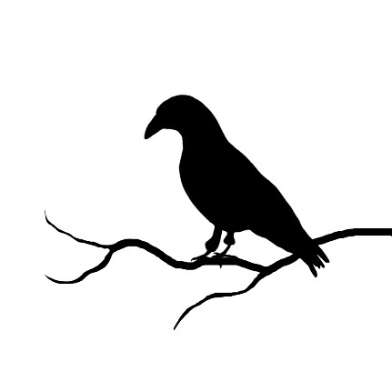
:::

Silent, Death comes in the shape

Of a stranger dressed in black,

While I sit down at the keyboard

And decide to end my song.

Tall and dark and smiling,

He sits beside me now and plays.

The song is mine - I know it well,

While his long, white fingers play.

Ebony stares into my soul,

Polished ivory brightly glows

As he plays the final notes.

His ghoulish air and smell of death

Accent the gruesome tone,

Dreadful, flat reminders pound

Deep within my soul.

His sharp insensitivity

Makes it hard for me to think.

His pale lips curl into a smile.

His patience overwhelms me

As he plays the final notes.

Beside him stands a woman

With smoky dress and coal black hair.

An evil Raven sits with scarlet eyes

Screaming, "Dare, dare, dare!"

The only thing that is not black

Is her frozen, pallid mask.

Tall and thin and faceless,

She is colder still than he

As he plays the final notes.

The cigarette held in her hand

Conducts a hazy mist

That envelopes her in murky gloom

To compose a sense of fear.

The Lady of the Darkness waits

As he plays the final notes.

Impatient tapping of her toe

As useless as her cigarette,

Keeps perfect time with guided beat,

The Raven on her shoulder warns

As he plays the final notes.

The mistress stands with blue-black hair,

And shadows fill the room.

I feel cold, tense anxiety

As I realize my doom.

I begin to be afraid

As he plays the final notes.

Jet-black stallions, three, arrive

As blood streams down the wall.

Instead there might be angels

In another place and time

As he plays the final notes.

I listen closely to my song

To try to change the end.

The early phrases harmonized,

The present tone is dead

As he plays the final notes.

The Raven screams impatiently,

The Lady taps her toe,

And the blood-stained walls grow dark

As he plays the final notes.

A frantic fear attacks my heart,

As the blood slows and stops

As he plays the final notes.

She covers me with heavy cloth

As he plays the final note.

-Theresa (Briscoe) Tschetter
