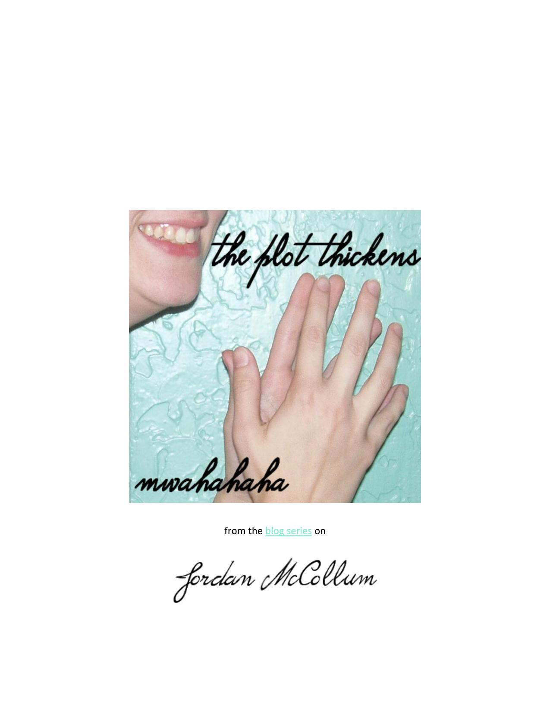

::: {}
<svg xmlns="http://www.w3.org/2000/svg" xmlns:xlink="http://www.w3.org/1999/xlink" version="1.1" width="100%" height="100%" viewbox="0 0 1275 1650" preserveaspectratio="none">
`<image width="1275" height="1650" xlink:href="cover.jpeg">`{=html}`</image>`{=html}
</svg>
:::

## from th[e blog series](http://jordanmccollum.com/series/plot-thickens/) on

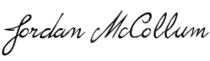

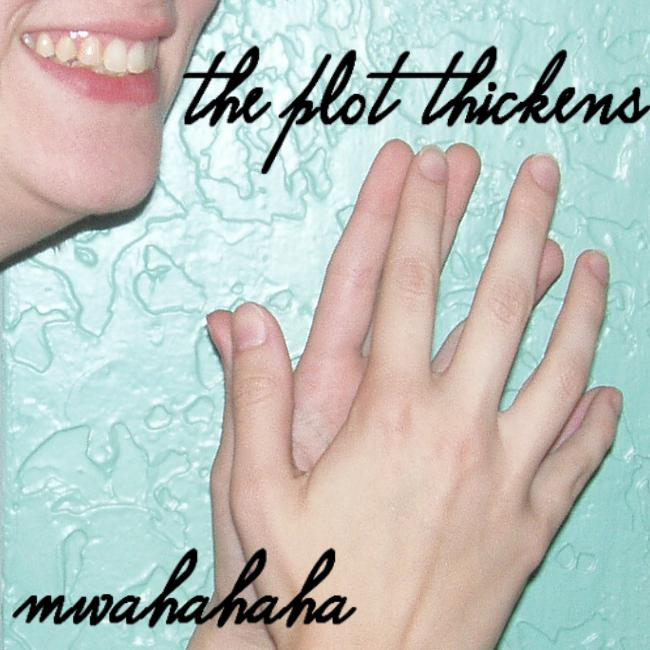

::: {}
:::

## **Contents** 

[The plot thickens! \...\...\...\...\...\...\...\...\...\...\...\...\...\...\...\...\...\...\...\...\...\...\...\...\...\...\...\...\...\...\...\...\...\...\...\...\...\...\..... 4 ](#index_split_001.html_page_4)

[An "organic" story \...\...\...\...\...\...\...\...\...\...\...\...\...\...\...\...\...\...\...\...\...\...\...\...\...\...\...\...\...\...\...\...\...\...\...\...\...\...\..... 6 ](#index_split_001.html_page_6)

[Making it up as she went along---the Winchester Mystery Story \...\...\...\...\...\...\...\...\...\...\...\...\...\...\.... 7 ](#index_split_001.html_page_7)

[Becoming a story architect \...\...\...\...\...\...\...\...\...\...\...\...\...\...\...\...\...\...\...\...\...\...\...\...\...\...\...\...\...\...\...\...\...\.... 10 ](#index_split_001.html_page_10)

 

[A story in three acts \...\...\...\...\...\...\...\...\...\...\...\...\...\...\...\...\...\...\...\...\...\...\...\...\...\...\...\...\...\...\...\...\...\...\...\...\...\... 12 ](#index_split_001.html_page_12)

[The story question \...\...\...\...\...\...\...\...\...\...\...\...\...\...\...\...\...\...\...\...\...\...\...\...\...\...\...\...\...\...\...\...\...\...\...\...\...\..... 13 ](#index_split_001.html_page_13)

[The five act story structure \...\...\...\...\...\...\...\...\...\...\...\...\...\...\...\...\...\...\...\...\...\...\...\...\...\...\...\...\...\...\...\...\...\.... 15 ](#index_split_001.html_page_15)

[The act structure in action \...\...\...\...\...\...\...\...\...\...\...\...\...\...\...\...\...\...\...\...\...\...\...\...\...\...\...\...\...\...\...\...\...\..... 17 ](#index_split_001.html_page_17)

[**Three act structure** \...\...\...\...\...\...\...\...\...\...\...\...\...\...\...\...\...\...\...\...\...\...\...\...\...\...\...\...\...\...\...\...\...\...\...\...\... 17 ](#index_split_001.html_page_17)

[**Freytag's Five Act Structure** \...\...\...\...\...\...\...\...\...\...\...\...\...\...\...\...\...\...\...\...\...\...\...\...\...\...\...\...\...\...\...\.... 17 ](#index_split_001.html_page_17)

[***My*** **Five Act Structure** \...\...\...\...\...\...\...\...\...\...\...\...\...\...\...\...\...\...\...\...\...\...\...\...\...\...\...\...\...\...\...\...\...\...\..... 18 ](#index_split_001.html_page_18)

[Pros and cons of the three act structure \...\...\...\...\...\...\...\...\...\...\...\...\...\...\...\...\...\...\...\...\...\...\...\...\...\...\.... 20 ](#index_split_001.html_page_20)

[**Pros** \...\...\...\...\...\...\...\...\...\...\...\...\...\...\...\...\...\...\...\...\...\...\...\...\...\...\...\...\...\...\...\...\...\...\...\...\...\...\...\...\...\...\...\...\... 20 ](#index_split_001.html_page_20)

[**Cons**\...\...\...\...\...\...\...\...\...\...\...\...\...\...\...\...\...\...\...\...\...\...\...\...\...\...\...\...\...\...\...\...\...\...\...\...\...\...\...\...\...\...\...\...\... 20 ](#index_split_001.html_page_20)

 

[A quick look at the Snowflake Method \...\...\...\...\...\...\...\...\...\...\...\...\...\...\...\...\...\...\...\...\...\...\...\...\...\...\...\.... 22 ](#index_split_001.html_page_22)

[A ten-step snowflake versus a five-step star: Organizing a manuscript my way \...\...\...\...\...\...\... 25 ](#index_split_001.html_page_25)

[Pros and cons of the Snowflake Method \...\...\...\...\...\...\...\...\...\...\...\...\...\...\...\...\...\...\...\...\...\...\...\...\...\...\.... 27 ](#index_split_001.html_page_27)

[**Pros** \...\...\...\...\...\...\...\...\...\...\...\...\...\...\...\...\...\...\...\...\...\...\...\...\...\...\...\...\...\...\...\...\...\...\...\...\...\...\...\...\...\...\...\...\... 27 ](#index_split_001.html_page_27)

[**Cons**\...\...\...\...\...\...\...\...\...\...\...\...\...\...\...\...\...\...\...\...\...\...\...\...\...\...\...\...\...\...\...\...\...\...\...\...\...\...\...\...\...\...\...\...\... 27 ](#index_split_001.html_page_27)

 

[A quick overview of the Hero's Journey \...\...\...\...\...\...\...\...\...\...\...\...\...\...\...\...\...\...\...\...\...\...\...\...\...\...\..... 29 ](#index_split_001.html_page_29)

[**The Hero's Journey** \...\...\...\...\...\...\...\...\...\...\...\...\...\...\...\...\...\...\...\...\...\...\...\...\...\...\...\...\...\...\...\...\...\...\...\...\... 29 ](#index_split_001.html_page_29)

[Archetypal characters in the Hero's Journey \...\...\...\...\...\...\...\...\...\...\...\...\...\...\...\...\...\...\...\...\...\...\...\...\.... 32 ](#index_split_001.html_page_32)

[Applying the Hero's Journey \...\...\...\...\...\...\...\...\...\...\...\...\...\...\...\...\...\...\...\...\...\...\...\...\...\...\...\...\...\...\...\...\..... 34 ](#index_split_001.html_page_34)

[The Hero (and Heroine)'s Journey---Hero's Journey in romance \...\...\...\...\...\...\...\...\...\...\...\...\...\...\... 35 ](#index_split_001.html_page_35)

[Cons of the Hero's Journey \...\...\...\...\...\...\...\...\...\...\...\...\...\...\...\...\...\...\...\...\...\...\...\...\...\...\...\...\...\...\...\...\...\.... 37 ](#index_split_001.html_page_36)

 

 

[Overview of Larry Brooks's Story Structure \...\...\...\...\...\...\...\...\...\...\...\...\...\...\...\...\...\...\...\...\...\...\...\...\...\... 38 ](#index_split_001.html_page_38)

[Story structure in action \...\...\...\...\...\...\...\...\...\...\...\...\...\...\...\...\...\...\...\...\...\...\...\...\...\...\...\...\...\...\...\...\...\...\..... 40 ](#index_split_001.html_page_40)

[The Hero's Journey with Story Structure \...\...\...\...\...\...\...\...\...\...\...\...\...\...\...\...\...\...\...\...\...\...\...\...\...\...\.... 43 ](#index_split_001.html_page_43)

 

[Setting up the story question \...\...\...\...\...\...\...\...\...\...\...\...\...\...\...\...\...\...\...\...\...\...\...\...\...\...\...\...\...\...\...\...\... 46 ](#index_split_001.html_page_46)

 

[The End \...\...\...\...\...\...\...\...\...\...\...\...\...\...\...\...\...\...\...\...\...\...\...\...\...\...\...\...\...\...\...\...\...\...\...\...\...\...\...\...\...\...\...\.... 48 ](#index_split_001.html_page_48)

[Bonus Features \...\...\...\...\...\...\...\...\...\...\...\...\...\...\...\...\...\...\...\...\...\...\...\...\...\...\...\...\...\...\...\...\...\...\...\...\...\...\...\.... 49 ](#index_split_001.html_page_49)

**The Plot Thickens (Mwahahaha)** Subscribe for more on writing technique

 

[**The plot thickens!**](http://jordanmccollum.com/2009/09/plot-thickens/)

(I'm mentally referring to this series as "Mwahahaha." Three ha's, if you please.)

We've already discussed plotting [briefly---](http://jordanmccollum.com/2009/09/write/)but now let's get into it. What do you want to learn about plotting? Are you a plotter or a pantser? Have you changed "sides"? (I have.) If so, why?

**I used to be a pantser**---some romantic notions about a story springing fully formed from my head like Athena from the mind of Zeus, and fears about outlining killing my muse. I would start off with an interesting beginning, a twist or two in mind, and the end goal. I would make up the middle parts as I went along.

**And then I got stuck.**

*For like a month.* (That's a very long time for me, when I'm in the middle of the draft and supposedly letting those unstifled ideas flow.)

I finally got unstuck, but **what I made up as I went along ultimately didn't work**. It all had to be rewritten, and should I hope to publish that MS one day, I'm probably going to have to toss most of it and do a whole new plot (with one or two of the same twists and turns, because they made those characters who they were, but other than that, starting from scratch with the characters/situation).

My next project was something I did with one of my best friends. We came up with an idea to write parallel novels with four main characters (a hero and heroine for each of us, with her heroine and my hero as siblings).

Oh, and also it was going to be a murder mystery (on my side; less so on hers, since they couldn't all be investigating). We had to know who did it, when, and why---what events led up

to it, what other characters were involved.

And since the investigation was part of my story line, *I* had to plot.

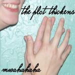

To my surprise, **instead of killing my muse, plotting fueled it**. I

got to know the murderer (with a 1st person [character freewrite)](http://jordanmccollum.com/2009/07/characters-head/) and his motivations. I searched for the worst possible thing that could happen---and the next, and the next, and the next---and made sure even the good things that happened were timed to

my characters' disadvantage.

*I came to love turning the screws.*

by Jordan McCollum **4** from http://JordanMcCollum.com **The Plot Thickens (Mwahahaha)** Subscribe for more on writing technique

 

To me, **plotting is your first chance to know your story**. You may be like I was, and have an ending and one or two twists in mind, and take off to discover the rest. And there's joy in discovering the story, finding the characters and their twists and turns.

But when I'm plotting, I get to experience that all at once. I get to discover---*engineer*---the twists and turns in a matter of hours, to hold the whole story in my mind (which I just can't do with 100,000 words). As I mentioned last week, when I know what's coming, **I can plant clues, turn those screws to make the coming disasters even worse, or foreshadow**. Naturally, I'll have to go back and tweak all those things, but some of my favorite nuances have come from knowing where I'm going and finding a happy coincidence in the present scene.

I'm hooked.

What about you? To reiterate the original questions: **What do you want to learn about plotting? Are you a plotter or a pantser? Have you changed "sides"? If so, why?**

*Tapping pencil b[y](http://www.flickr.com/people/tomsaint/)* [*Tom St. George*](http://www.flickr.com/people/tomsaint/) 

 

by Jordan McCollum **5** from http://JordanMcCollum.com **The Plot Thickens (Mwahahaha)** Subscribe for more on writing technique

 

[**An "organic" story**](http://jordanmccollum.com/2009/09/organic-story/)

Now I've shared my experience with my "conversion" to plotting. And it turns out **I wasn't**

**alone**. As Kat[ie](http://jordanmccollum.com/2009/09/plot-thickens/#comment-621) [pointed out](http://jordanmccollum.com/2009/09/plot-thickens/#comment-621)[,](http://jordanmccollum.com/2009/09/plot-thickens/#comment-621) it seems like most of us had the same problem:

starting out as a pantster, realizing that writing-by-the-seat-of-our-pants exposes our weak areas, and realizing that plotting is necessary to some degree.

I think that the **mystique of the organic story**, one that is so perfect and beautiful that it just

wrote itself, is one of the big things that convinced a lot

of us (or all of us) to become pantsers (and maybe even

writers). There's this romantic notion that **"real" writers, "great" writers sit down and pound out a**

**fabulous story**, with minimal rewriting and *never, no never, no never any planning in advance*.

And then we try it---and somehow it doesn't seem to

work. We learn more about plotting, and give that a

try---and lo and behold, we have *story arcs*. We have a *non-sagging middle*. We have a *character changing and growing* through the climax and resolution.

Granted, these don't always automatically fall in line with plotting and planning---but often **when we start a story with these things in mind, we are more mindful of them** not only in the planning but in the writing, and look for opportunities to help our characters grow and change, to continually challenge them. (Or, as I like to put it, to put the screws to them.)

So, our mission (should you choose to accept it!) for this series is to look at **the whys** (for the unconvinced) **and the hows of plotting**.

**What do you think? How can learning about plotting help you? Do you think you'll ever go back to pantsing?**

*Flying fingers by* [*The Hamster Factor*](http://www.flickr.com/people/disaster_area/) 

 

by Jordan McCollum **6** from http://JordanMcCollum.com **The Plot Thickens (Mwahahaha)** Subscribe for more on writing technique

 

[**Making it up as she went along---the Winchester Mystery Story**](http://jordanmccollum.com/2009/09/story-structure-winchester-mystery/)

Larry Brooks, "the story fixer," had a recent post that really got me thinking about this[---Story](http://storyfix.com/story-structure-vs-story-architecture-%E2%80%9Cdude%E2%80%A6-what%E2%80%99s-the-diff%E2%80%9D)

[Structure vs. Story Architecture: "Dude... what's the diff?"](http://storyfix.com/story-structure-vs-story-architecture-%E2%80%9Cdude%E2%80%A6-what%E2%80%99s-the-diff%E2%80%9D)

**All stories**, says Brooks, **have structure**. And, to employ my own analogy, so do all buildings. But **not all buildings are created equal**:

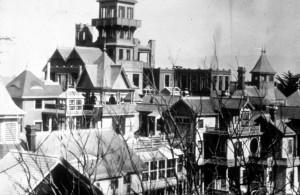

 

by Jordan McCollum **7** from http://JordanMcCollum.com **The Plot Thickens (Mwahahaha)** Subscribe for more on writing technique

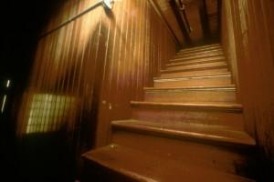

 

You might recognize this place, or the legend behind it. The owner believed that her house must be under construction *always*, or she would die. But they couldn't use a master building plan.

Considering that, the Winchester Mystery House is pretty well-built. Yeah, it h[as stairs that lead](http://www.winchestermysteryhouse.com/story.html)

[to nowhere](http://www.winchestermysteryhouse.com/story.html) and doors that open out from the second floor (no stairs on that one---maybe move those first stairs over there?). It's fun---it's a blast to explore, and I bet Sarah Winchester had an awesome time throwing in every element she could think of.

It has a decent foundation---instead of leveling it, the

1906 San Francisco earthquake only knocked off the top three stories. After the quake it stood four stories. The

remaining structure is a rambling, 160-room, 4.5-acre

mansion. It required more than 20,000 gallons of

paint---and it constantly needed painting.

**I think we've all gotten to the end of a story, looked**

**back and seen our own Winchester Mystery Structure**.

The Winchester Mystery House *has* structure. In some sense, it has architecture---but not *really*. There is no plan, and the closest thing they had to a designer (architect) was a crazy woman.

 

by Jordan McCollum **8** from http://JordanMcCollum.com **The Plot Thickens (Mwahahaha)** Subscribe for more on writing technique

 

**And "rambling" is right**. Dead ends, doors and promises that go nowhere, accidental MacGuffins. . . . After round 28,657 of revisions, *I got tired of writing stories that looked like they were designed by a crazy woman*.

**What do you think? Have you ever written a "Winchester Mystery Story"?**

*Photo credits: exterior shot and stairs to nowhere courtesy of the * [*Winchester Mystery House*](http://www.winchestermysteryhouse.com/)[*; r*](http://www.winchestermysteryhouse.com/)*ooves---*

[*the_photographer**; w*](http://www.flickr.com/people/the_photographer/)*indows to windows[---](http://www.flickr.com/people/flavor32/)*[*Emily Hoyer*](http://www.flickr.com/people/flavor32/) 

 

by Jordan McCollum **9** from http://JordanMcCollum.com **The Plot Thickens (Mwahahaha)** Subscribe for more on writing technique

 

[**Becoming a story architect**](http://jordanmccollum.com/2009/09/story-architect/)

I think most of us have to try a f[ew Winchester Mystery Stories](#index_split_001.html_page_6) before we're ready to become **story architects**.

I really like the analogy of architecture here because I like floor plans a floor plan isn't a complete house. It's a sketch of what you plan to build. It's **an easy way to look at a scaled-down model** of where you think you want the major rooms to go, where the appliances will be, where

the doors are, etc. It isn't your house.

The floor plan can change even after you start building

your story. **Sometimes we "remodel" as we "build"**---we decide this doorway should be a window and the front entrance should go here. We change the door to a double door; we upgrade the A/C or the wiring; we knock out a wall and add a new bathroom. We scrap the entire second floor.

Having a floor plan doesn't mean we *have* to build that house---or even that we'd all build the same house with the same floor plan. But having a floor plan means we don't end up six months into the project with 123 bedrooms, 16 dining rooms and no kitchen or bathrooms.

On the other hand, the floor plan **is just a basic sketch, which can be improved upon, revised, and changed during the process of writing**. In fact, you probably wouldn't recognize the house just from the floor plan.

For me (and others), the floor plan is such a basic sketch that once we've gotten that built, **we still have a long way to go**

**before we have a finished product**. Once we have the events down in the first draft, we still have revising and finishing to do---furnishing, painting, decorating, accessorizing (moving all our crap in ).

There's a long way from the bare drywall to the furnished home we hope to end up with. And even after we slap on the paint and get our boxes through the door, it'll still take a lot of work---and maybe some more paint, some help

from friends and professionals, a lot of reading catalogs

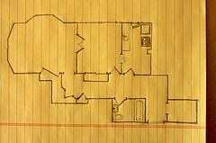

and home magazines. . . .

But finally, after all that, we have a home **we can be proud of**---and one that *we didn't have to completely rebuild six*

by Jordan McCollum **10** from http://JordanMcCollum.com **The Plot Thickens (Mwahahaha)** Subscribe for more on writing technique

 

*times*. (Okay, I've probably beaten that analogy to death.)

**What do you think? Do you like to consider yourself a "story architect? How much detail (or freedom) do you need in your "floor plan" to make a house work?**

*Next week, we'll start looking at methods of plotting---and don't forget, I'm looking for volunteers to talk about how they plot! And tomorrow---free goodies!*

*Photo credit: floor plan[---](http://www.flickr.com/people/rcrowley/)*[*Richard Crowley*](http://www.flickr.com/people/rcrowley/)[*; d*](http://www.flickr.com/people/rcrowley/)*ry wall[---](http://www.flickr.com/people/tnboriqua/)*[*Pattie*](http://www.flickr.com/people/tnboriqua/)[*;*](http://www.flickr.com/people/tnboriqua/) *room and photo[---](http://www.flickr.com/people/christopher_barson/)*[*Christopher Barson*](http://www.flickr.com/people/christopher_barson/) 

 

by Jordan McCollum **11** from http://JordanMcCollum.com **The Plot Thickens (Mwahahaha)** Subscribe for more on writing technique

 

[**A story in three acts**](http://jordanmccollum.com/2009/09/story-acts/)

The most basic story structure is the **story in three acts**. The three act structure has been used since . . . well, forever, but in recent history, the biggest proponent of this structure is Syd Field

in his book [*Screenplay*](http://www.amazon.com/gp/product/0385339038?ie=UTF8&tag=mamablogga-20&linkCode=as2&camp=1789&creative=9325&creativeASIN=0385339038) (although it's been applied to all kinds of stories, not just movies).

So what are the structures in the three-act story?

 

**Act I is the "setup,"** where we lay our scene (and our characters). This is where we establish the story world, our characters and their relationships. That isn't to say there's no conflict here, nor that there's nothing happening. If there isn't some kind of conflict here, readers are going to get bored.

Act I is about 25% of the story, and ends in the **first turning point**. This is the point at which the story world gets turned on its head, and we get the story question (Will our hero(ine) win?).

**Act II is the "confrontation" or the "rising action."** The name hints at what happens in here--- the hero(ine) works on confronting the antagonist in ever-escalating conflicts. Things don't go their way, of course, or the story would be over pretty quickly.

In the second act, which lasts for about half of the book, the hero(ine) learns and acquires new skills through these confrontations, arming themselves for the big confrontation at the end of this act/the beginning of Act III: the **climax or second turning point**.

**Act III is the "resolution."** In the climax, we answer the story question from the first turning point. The hero(ine) uses the knowledge and skills s/he's gained in Act II, which have made him/her strong enough to defeat the antagonist. Sometimes this also includes the hero(ine) coping with his/her newfound strength.

**What do you think? Can you see the three-act structure in your work or others'? Have you used this structure to plan or strengthen your work?**

*Some help from * [*Wikipedia*](http://en.wikipedia.org/wiki/Three_act_structure)

by Jordan McCollum **12** from http://JordanMcCollum.com **The Plot Thickens (Mwahahaha)** Subscribe for more on writing technique

 

[**The story question**](http://jordanmccollum.com/2009/09/story-question/)

The last story spawned an interesting discussion in the comments about story questions. To be quite honest, I was familiar with the concept, but I'd never given it that

much thought. I linked to a great article on [story questions](http://writingonthewallblog.blogspot.com/2008/10/whats-my-story-question.html) by my friend Annette Lyon, but our discussion also brought out a few more interesting points that I wanted to share.

**The story question is the basic concept of the story**. It's asked (or hinted at) at the beginning of the story, and answered by the end. It's the **controlling, overarching action of the story**.

In a romance, it's "Will the boy win the girl?" In a mystery, it's "Will they catch the murderer?" (And the answer is supposed to be yes on both of those!)

I like to think in romantic suspense, both of those are the story questions, but **when it comes down to it, there can only be one**---one question whose answer brings the book to a satisfying conclusion. If the hero wins the girl before he catches the bad guys, then catching the bad guys is the story question---the story would be incomplete without it. (And vice versa.) There is only one story question (the book only ends once ). However, there must be a number of intermediate goals and questions.

Make sure your story is **asking and answering the same overarching question**. Don't start off asking "Can Jezebel win Horatio's heart?" and end with "Yes, Horatio *can* win the Nobel Prize!"

(\*cough\*cough[\*Winchester Mystery Story\*co](#index_split_001.html_page_6)ugh\*)

So how can you make sure you're setting up the right story question? Let's use Jezebel and Horatio. If we want Horatio's quest for the Nobel Prize to be the story question---if winning the prize ends the story---then **make sure it ends the book**. Answer (and, most likely, ask) Jezebel's question within the bounds of the story created by Horatio's question. Show them getting together (or not) before they award the prize.

Another way to do this is to **make one question dependent on another**. If Jezebel's quest for love is the overarching question, Horatio's quest for the Nobel Prize should *depend* on her question. Maybe Jezebel did her dissertation on an obscure enzyme that's just the breakthrough Horatio needed, but he would never know that until he looks up from his test

tubes.

A third way is to **answer an intermediate question without satisfaction, making another answer (the story question) necessary**. Maybe Horatio does with the Nobel Prize (because he passed off Jezebel's work as his own, let's say, and she is furious and leaves him and gets a lawyer). But even after he's won, his life is empty. He misses her annotated love notes, her pocket protector, her obscure jokes. He tracks her down in

by Jordan McCollum **13** from http://JordanMcCollum.com **The Plot Thickens (Mwahahaha)** Subscribe for more on writing technique

 

her Antarctic research station, proclaims his love (and promises to publish the truth about her research).

Thanks to everybody who joined in the discussion yesterday---I certainly learned something. I realized that part of the problem I've had with a few pieces I've been plotting was that *I was answering the wrong story question*. I'll have to find a different question to ask, or find a way to answer the question I'm already asking in the conclusion.

**What do you think? Are you asking and answering the same question? How else can you make sure the right question is the story question?**

*Photo credits: question[---](http://www.sxc.hu/profile/svilen001)*[*Svilen Mushkatov*](http://www.sxc.hu/profile/svilen001)[*; f*](http://www.sxc.hu/profile/svilen001)*rustrated[---](http://www.sxc.hu/profile/deboer)*[*John De Boer*](http://www.sxc.hu/profile/deboer) 

 

by Jordan McCollum **14** from http://JordanMcCollum.com **The Plot Thickens (Mwahahaha)** Subscribe for more on writing technique

 

[**The five act story structure**](http://jordanmccollum.com/2009/09/act-story-structure/)

Almost a corollary to the three act story structure is the five act story structure. Its most

notable proponent is Gustav Freytag (in [*Freytag's Technique of the Drama*)](http://www.amazon.com/gp/product/0554432137?ie=UTF8&tag=mamablogga-20&linkCode=as2&camp=1789&creative=9325&creativeASIN=0554432137).

The basic difference between three and five act structures is that the second act in the three act structure is divided into three acts in the five act structure. (Uh . . . what?) It's like this: the **confrontation phase of the story is divided into the rising action, turning point and falling action**.

Basically, the middle **turning point** is where things turn around for the hero. It's not the ultimate confrontation, but after this point, the hero is able to start applying some of the things he's learned---to start succeeding. I guess that's why they call it the "falling" action. Because . . . things are falling into place? (\*cough\*cough\**dumb name*\*cough\*)

I'm going to blame this on my middle school English teacher---but **I think this structure is a little misleading**. First of all, the "falling action" sounds an awful lot like the denouement---the events after the climax. In fact, that's exactly how I learned the term. (I honestly can't think of any reason to call the third quarter or so of the book the "falling action." That sounds boring.)

Here's how I was taught a five-act structure (please, don't hate on me because of my mad Paint skills. You know you wish you had 8-bit graphics skillz.):

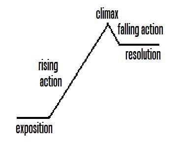

 

The line graph here is somewhat representative. In the **exposition**, the hero isn't making a lot of progress toward his ultimate goal---the final confrontation with the antagonist.

 

by Jordan McCollum **15** from http://JordanMcCollum.com **The Plot Thickens (Mwahahaha)** Subscribe for more on writing technique

 

Then comes the **rising action**---he's started on the path toward the confrontation. The rising action leads to the **climax**.

After that final confrontation, we have a very short **falling action**---it's *not* as long as the rising action, it's just tying up the loose ends. And then there's the **resolution**: the character's final situation. Notice that this is much higher than the exposition, because *the character has changed*.

This might be a little misleading, too. Really, the rising action is anything but a straight line---we

have all tho[se intermediate story questions](#index_split_001.html_page_12) to answer. The hero has to learn and acquire new skills (like 8-bit graphic skillz, yo), and growing and learning and changing are usually **painful and fraught with setbacks**. So the rising action might really look like this:

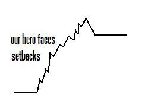

 

The three act structure would divide the acts at the end of the exposition and either at the climax or just before the resolution (depending on who you ask ).

**What do you think? How would you apportion or draw the five acts in the five act structure? What is with the name "falling action," and what would be a better name?**

 

by Jordan McCollum **16** from http://JordanMcCollum.com **The Plot Thickens (Mwahahaha)** Subscribe for more on writing technique

 

[**The act structure in action**](http://jordanmccollum.com/2009/09/act-structure-action/)

I have a three-year-old, and as three-year-olds are wont to do, he likes to watch the same movie over and over and over for about two weeks straight. So when I wanted to show the three- and five-act structures in action, I knew I

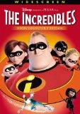

had to use his latest obsession[: *The Incredibles*.](http://www.amazon.com/gp/product/B00005JN4W?ie=UTF8&tag=mamablogga-20&linkCode=as2&camp=1789&creative=9325&creativeASIN=B00005JN4W)

I'm **comparing the different structures' divisions of the "text"** here, so the synopsis will be largely the same, but the placement of the acts will vary

amon[g the three act,](#index_split_001.html_page_11) [Freytag's five act](#index_split_001.html_page_14)  an[d](#index_split_001.html_page_14) [my five act](#index_split_001.html_page_14)  structures.

[**Three act structure**](http://jordanmccollum.com/2009/09/story-acts/)

(Paragraphing is mostly for readability.)

**Act I---Setup**---the characters' world (still with conflict): Super heroes were celebrated icons. Bob (Mr. Incredible) and Helen (ElastiGirl), super heroes, get married. Super heroes fall out of favor and are hidden by the government.

Fastforward 15 years, and Bob and Helen are trying to look like a typical suburban family. Bob is dissatisfied with his life. The kids aren't happy with hiding (or having) their super powers. Bob loses his job.

**First turning point**: Mr. Incredible is offered a secret super hero assignment and decides to take it. He also decides not to tell his wife that he has been fired or offered this high-paying assignment.

**Act II---Confrontation**---lots of rising conflicts: Mr. Incredible completes the assignment on a remote island. When he returns for a second assignment, he finds out there's a villain, learns of the villain's secret plans and is captured. His wife and kids come to save them. They learn to use their powers together, but are captured. They watch as the villain's dastardly plan plays out in their home town, then the villain leaves to play his role there as well.

**Second turning point/climax**: Working together, the family escapes and pursues the villain and his evil robot. They defeat the robot.

**Act III---Resolution**: They return home and save the baby from the villain. They're now a family of super heroes, and are happy and united against the forces of evil.

[**Freytag's Five Act Structure**](http://jordanmccollum.com/2009/09/act-story-structure/)

**Act I---Setup**: Super heroes were celebrated icons. Bob (Mr. Incredible) and Helen (ElastiGirl), super heroes, get married. Super heroes fall out of favor and are hidden by the government.

 

by Jordan McCollum **17** from http://JordanMcCollum.com **The Plot Thickens (Mwahahaha)** Subscribe for more on writing technique

 

Fastforward 15 years, and Bob and Helen are trying to look like a typical suburban family. Bob is dissatisfied with his life. The kids aren't happy with hiding their super powers. Bob loses his job.

**Act II---Rising Action**: Mr. Incredible is offered a secret super hero assignment and decides to take it. He also decides not to tell his wife that he has been fired or offered this high-paying assignment. (This is really the divider between act I and II still.)

Mr. Incredible completes the assignment on a remote island. When he returns for a second assignment, he finds out there's a villain and learns of the villain's secret plans.

**Act III---Turning Point/Midpoint**: Suspecting her husband is doing something not-so-good, Helen activates the homing beacon in his super suit. She knows where he is now---but the homing beacon alerts the villain of Mr. Incredible's presence and he's captured again.

**Act IV---Falling Action**: (booooring name). Helen and the kids come to his rescue. They learn to work together as a team, but are ultimately captured. The villain attacks their hometown with his evil robot.

**Act V---Resolution**: They escape and defeat the evil robot. They return home and rescue the baby from the villain. They are happy and united as a family against the forces of evil.

[***My*** **Five Act Structure** ](http://jordanmccollum.com/2009/09/act-story-structure/)

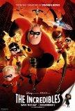

**Act I---Setup**: Super heroes were celebrated icons. Bob (Mr. Incredible) and Helen (ElastiGirl), super heroes, get married. Super heroes fall out of favor and are hidden by the government.

Fastforward 15 years, and Bob and Helen are trying to look like a typical suburban family. Bob is dissatisfied with his life. The kids aren't happy with hiding their super powers. Bob loses his job.

**Act II---Rising Action**: Mr. Incredible is offered a secret super hero assignment and decides to take it. He also decides not to tell his wife that he has been fired or offered this high-paying assignment. (This is really the divider between act I and II still.)

Mr. Incredible completes the assignment on a remote island. When he returns for a second assignment, he finds out there's a villain and learns of the villain's secret plans.

Suspecting her husband is doing something not-so-good, Helen activates the homing beacon in his super suit. She knows where he is now---but the homing beacon alerts the villain of Mr. Incredible's presence and he's captured again.

Helen and the kids come to his rescue. They learn to work together as a team, but are ultimately captured.

by Jordan McCollum **18** from http://JordanMcCollum.com **The Plot Thickens (Mwahahaha)** Subscribe for more on writing technique

 

**Act III---Climax**: The villain attacks their hometown with his evil robot. They escape and defeat the evil robot. They return home and rescue the baby from the villain.

**Act IV---Falling action**: A few months later, they attend a track meet for their son with superhuman speed (who was acting out in the setup b/c he had no other outlet), whom they finally let compete in sports. Their shy daughter is now confident enough to ask her long-time crush on a date---and *he's* the one who gets flustered.

**Act V---Resolution**: As they leave a track meet, a new villain appears. They don their masks and grin, ready to take on the new challenge.

**Quiz time: read Acts IV and V under My Five Act Structure. What's the story question? Did they ask and answer the same question?**

 

by Jordan McCollum **19** from http://JordanMcCollum.com **The Plot Thickens (Mwahahaha)** Subscribe for more on writing technique

 

[**Pros and cons of the three act structure**](http://jordanmccollum.com/2009/09/pros-cons-act-structure/)

We've talked about the basics of the three-act structure by [Syd Field.](http://www.amazon.com/gp/product/0385339038?ie=UTF8&tag=mamablogga-20&linkCode=as2&camp=1789&creative=9325&creativeASIN=0385339038) Now, we'll weigh some of the pros and cons of using this method to plot our stories.

**Pros**

First of all, we have to acknowledge that this structure is very simple. In some ways, that's one of its strengths. Because there's not a whole lot set in stone, the three-act structure is **highly flexible**.

It's also **almost universally applicable**. Even if you haven't used the three act structure in plotting your story, odds are good you can apply it now. In fact, all of

the plotting methods that we'll examine later can be sketched out on the three act structure outline, too.

Finally, it's very popular: it's easy to find examples of the three-act structure in virtually every story we know and love. It's familiar to readers, easy to understand and apply, and almost what we expect when reading a story.

**Cons**

However, this kind of outline of the three act structure is a little generic. It doesn't offer a whole lot of guidance in the way of how to keep building in the story. **It doesn't give us a way to avoid the dreaded "sagging middle."**

Some critics of the three-act structure, such as former Writers' Guild Directo[r James Bonnet,](http://www.amazon.com/gp/product/1932907114?ie=UTF8&tag=mamablogga-20&linkCode=as2&camp=1789&creative=9325&creativeASIN=1932907114)

say that the **three-act structure is ** [**an artificial superimposition**](http://www.writersstore.com/article.php?articles_id=555)[.](http://www.writersstore.com/article.php?articles_id=555)

On the other hand, Bonnet argues that studying structure doesn't automatically make you a wizard at writing well-structured stories. But come on---not studying structure is even less likely

to help you [avoid Winchester Mystery Stories.](#index_split_001.html_page_6)

Bonnet's alternative (emphasis added):

Aristotle's classical structure, which is the dominant feature of this structure, can stand alone. All of the structures you might find in the act are already built into the problem solving action that encounters resistance, namely: **conflict, complications, crises (turning points) climax and resolution**. It is, in fact, the structure of any problem solving action (real or fiction) that encounters resistance.

Does that sound a little familiar ?

 

by Jordan McCollum **20** from http://JordanMcCollum.com **The Plot Thickens (Mwahahaha)** Subscribe for more on writing technique

 

**What do you think? What weaknesses and strengths do you see in using the three-act structure to plot your story? Would you use it?**

*Picture b[y](http://www.flickr.com/people/lucianvenutian/)* [*Luke*](http://www.flickr.com/people/lucianvenutian/) 

 

by Jordan McCollum **21** from http://JordanMcCollum.com **The Plot Thickens (Mwahahaha)** Subscribe for more on writing technique

 

[**A quick look at the Snowflake Method**](http://jordanmccollum.com/2009/09/snowflake-method/)

Th[e Snowflake Method](http://www.advancedfictionwriting.com/art/snowflake.php) is the second plotting method we're going to look at. Well, creator Randy Ingermanson might not call is a "plotting method"---he'd probably prefer to describe it as a "design method."

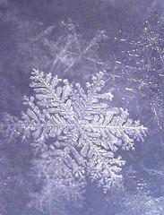

Good stories, he says, come from good design. (It can certainly make them easier to write!) So Randy came up with a way to design and even write a story from a high-level, hook-type idea to a full novel in ten steps. This way, you can identify a "broken" story before you begin---and build yourself a better one.

Before you freak out because you've found the new-improved-easy way to plot a story, let me insert here that they're not easy steps--- step 10, for example, is to write the novel. Oy.

We're going to take a quick look at the method so we're all on

common ground---but do note that the fu[ll Snowflake Method](http://www.advancedfictionwriting.com/art/snowflake.php) article adds much more detail to these steps.

Let's start at the beginning---the idea. **Sum up your idea in one sentence**, preferably of less than fifteen words. No, seriously.

Don't worry about fitting the whole story in there. Just hit the set up (or the hero or the villain) and one or two major points. Randy suggests using the one-line blurbs from the NYT Bestseller list as an example. And we will, too:

The murder of a curator at the Louvre leads to a trail of clues found in the work of Leonardo and to the discovery of a centuries-old secret society.

In step two, we take this sentence and **expand it into a paragraph, with, as Randy says, "three disasters plus an ending."** One sentence per act, if you will (I guess that'd be a five-act structure).

Uh . . . okay, it's been a couple years since I read [*The Da Vinci Code*,](http://www.amazon.com/gp/product/0307474275?ie=UTF8&tag=mamablogga-20&linkCode=as2&camp=1789&creative=9325&creativeASIN=0307474275) but I think it might go like this:

A curator at the Louvre is murdered and his \[hot\] granddaughter and a \[dowdy\*\] religious symbologist are called to investigate. They find a trail of clues pointing toward a secret society and the Holy Grail, but the police are pursuing them. Following the clues, they flee the country with the aid of the symbologist's friend and mentor. The friend and mentor betrays them and tries to force them to reveal the location of the Holy Grail. He is arrested and they discover that the hot granddaughter is a lineal descendant of Jesus Christ---the Holy Grail.

by Jordan McCollum **22** from http://JordanMcCollum.com **The Plot Thickens (Mwahahaha)** Subscribe for more on writing technique

\*No offense to Hanks, but seriously, I had a short, balding professor in mind as I read. Yeah, that's not what Brown described. So sue me.

In step three, we leave off with our plot summary and come to focus on our characters. They're important too, you know. **The major characters each get a summary page here on their motivations, goals and characteristics**. (Forgive me if we don't do that here.)

In step four, we come back to our plot summary and **expand each sentence from that paragraph into a paragraph of its own**, making the summary roughly a page, too.

Now we're going back to the characters---step five is to **write the plot summary from the POV of each big character**---and yes, the plot summary should differ among them---most especially between the hero(es) and the villain(s), but also, in, say, a romance, the hero and the heroine will have a very different perspective on events.

Really, these **summaries are as much about the characters themselves**---their reactions, perceptions, motivations, interpretations, etc.---as they are about the events of the novel. Major characters' plot summaries should take a page; minors get half a page.

Guess where we're going now? Yep, hopping back to the plot summary---now we're going to **make that one-page synopsis into a four-page synopsis**. Again, it's basically making the sentences from the last go-round into paragraphs and the paragraphs into pages.

Step seven takes us back to the characters (you knew that, didn't you?). Now we're making their pages into character charts (which you know I'm pretty *meh* about). Says Randy, the most important aspect to these charts will be to answer the question **"How will this character change by the end of the novel?**"

For step eight we head back to our plot synopsis and **make a list of scenes for the novel**. The whole novel. (Now *that* is outlining!) In this step, we focus on just the basic facts---events, POV, locations. Step nine is along the same vein (fooled you there, didn't I?!)---a **narrative summary of each scene**, with all the good dialogue and descriptions and tidbits that our doubtlessly

floating around in your head now. (This step is optional,

Randy says.)

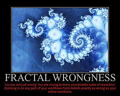

As I mentioned before, step 10 is "write the novel."

As you move through the steps, of course, **you're free** (and even encouraged) **to revise previous steps' work**. As always, we have to be flexible to new developments---

 

by Jordan McCollum **23** from http://JordanMcCollum.com **The Plot Thickens (Mwahahaha)** Subscribe for more on writing technique

 

ready to add a dining room if we find the perfect chandelier .

So, you're wondering, what's with the name? The name comes from [a **simple fractal**.](http://math.rice.edu/%7Elanius/frac/koch/koch.html) You start with a triangle, then replace each straight line with a line with a peak: \_/\\\_ . Star of David. Do it again. More complex, semi-snowflakey thing. Repeat. Even more complex snowflake.

**What do you think? Could you take a story from an idea to a novel (or outline) like this? What strengths or weaknesses do you see?**

*Photo credits: snowflake[---](http://www.flickr.com/people/piper/)*[*Julie Falk*](http://www.flickr.com/people/piper/)[*; ta*](http://www.flickr.com/people/piper/)*pping pencil[---](http://www.flickr.com/people/tomsaint/)*[*Tom St. George*](http://www.flickr.com/people/tomsaint/)[*; f*](http://www.flickr.com/people/tomsaint/)*ractal wrongness[---](http://www.flickr.com/people/themadlolscientist/)*[*the mad LOLscientist*](http://www.flickr.com/people/themadlolscientist/) 

 

by Jordan McCollum **24** from http://JordanMcCollum.com **The Plot Thickens (Mwahahaha)** Subscribe for more on writing technique

 

[**A ten-step snowflake versus a five-step star: Organizing a manuscript my way**](http://jordanmccollum.com/2009/10/personalizing-snowflake-method/)

*by * [*Carol J. Garvin*](http://careann.wordpress.com/) 

If you were to ask, my family would tell you I have a thing for snowflakes. Childhood efforts to catch and melt them on my tongue evolved into a slightly out-of-control adult passion to amass the ultimate collection including jewelry, embroidered fabrics, candles and other home accessories. Every December we dangle giant snowflakes in our windows instead of wreaths and display a tree decorated entirely with a variety of snowflakes set aglow by tiny white twinkle lights.

It isn't surprising, therefore, that the idea of a "snowflake" method of writing would appeal to

me. Of course, if you've read any of my whining about [outlines and plotting](http://careann.wordpress.com/2009/09/16/is-it-outlining-or-plotting/) you might guess that I'd grasp at anything likely to improve my odds of producing a more organized manuscript.

I've never liked being tied to an outline so when Randy Ingermanson's recommended Ten Steps of Design appeared to offer a less rigid approach I gave it a try.

The first step in the [Snowflake approach](http://www.advancedfictionwriting.com/art/snowflake.php) required getting the essence of my story condensed into one sentence---always a challenge but something I was going to have to do sooner or later to answer the always-dreaded, "What's your novel about?" question. The second step was to expand that one sentence into a short paragraph---once again a useful exercise that could later form the basis of a synopsis. I shirked somewhat on the third step that called for a full-page summary sheet for each of my characters and instead created summary paragraphs.

At this point my good intentions balked. The remaining steps had me spending **too much time repeatedly going over the same ground in an effort to record information that I hadn't yet created**. I wasn't developing a snowflake design so much as creating a daisy pattern, each step causing me to return to the centre fulcrum and trace ever-increasing loops.

All this building on the basics was meant to leave me with the story virtually complete and thus simplify the writing process. The theory is sound but **for me it had the effect of capping the fountain of creativity and dragging me to a standstill**.

I didn't cease writing permanently, of course. I examined what had been working and analyzed

why it no longer was. Just as Jordan suggested in her post on [story architecture. I](#index_split_001.html_page_9) learned that what I need is to have a basic plan in place but with reassurance that I'm not locked into following its every detail. I need more flexibility than the true Snowflake Method allows. As a result, **I adapted the steps for an abbreviated approach that helps create my initial building blocks and then keeps track of scenes and chapter content as I write**.

 

by Jordan McCollum **25** from http://JordanMcCollum.com **The Plot Thickens (Mwahahaha)** Subscribe for more on writing technique

 

If I have to backtrack occasionally to accommodate a new character or scene, that's okay but usually I write straight through to the conclusion of a bare bones first draft. As I review and revise I add a succession of new layers of description and detail to flesh out the story, setting and characters.

Since I skip half the steps, what I'm doing doesn't represent the true Snowflake Method but only a vague version of it. It has just five points (kind of like a star rather than a snowflake):

1\. Create a one-sentence summary of the story. 2. Expand the one sentence into a paragraph that outlines the story basics. 3. Expand the paragraph into a page or two that introduces the main characters, the

conflict, complications, and resolution. Include how the MC will change throughout the story (i.e., intended character arc).

4\. Create a spreadsheet into which highlights of each chapter's action will be inserted as

the first draft is written.

5\. Revise draft, adding details and description to enrich the writing.

I could be criticized for taking shortcuts and not giving the Snowflake Method a fair try but I've already admitted **I need flexibility**. My commitment to begin with that method didn't extend to any kind of promise that I would stay with it. I truly believe **each novelist must approach story building via whatever method works**, however unique it might be. There is no one right way that will suit everyone. The only way to guarantee the successful completion of a novel is to keep writing and the smart novelist utilizes whatever tools it takes to reach that goal.

**About the author**

*Carol J. Garvin, blogging at * [*Careann's Musings*](http://careann.wordpress.com/)[*,*](http://careann.wordpress.com/) *is a freelance writer with articles in various Canadian magazines and publications. She lives in southwestern British Columbia and is a member of the Federation of BC Writers and the Langley Writers' Guild. She has written a family memoir that is not meant for publication, and began writing novels ten years ago. She is on her third but so far none are ready to send out into the world quite yet . . . but soon. Besides writing, her other passions are her church and family, gardening, reading, music, painting and purebred dogs.*

 

by Jordan McCollum **26** from http://JordanMcCollum.com **The Plot Thickens (Mwahahaha)** Subscribe for more on writing technique

 

[**Pros and cons of the Snowflake Method**](http://jordanmccollum.com/2009/10/pros-cons-snowflake-method/)

Th[e Snowflake Method](#index_split_001.html_page_21) of  [story design](http://www.advancedfictionwriting.com/art/snowflake.php)  is just one way to create a plot---but it's not the best way, nor is it even a good way for all of us. (And we'll continue to look at more methods to plot

stories over the next two weeks.) We've already seen how Carol [adapted the Snowflake](#index_split_001.html_page_24)

[Method](#index_split_001.html_page_24) to suit her needs as a writer, using its strengths for her and discarding its potential weaknesses. So what are the potential strengths and weaknesses of the Snowflake Method, so we can do this for ourselves?

**Pros**

After spending so much time refining them and writing about them, **you get to know your characters and your plot well**. Really well. Before you even write one word of your story, you have pages and pages of information on the characters, their backgrounds, how they see the

story unfolding. You know the events, the sequence, the logic there.

Another strength is that **you can start with almost nothing and "grow" a plot "naturally."** If you start with just the most basic idea---say, National Treasure for the Amish or something ---you can develop your characters and your plot.

Also, the method's steps alternate between working on characters and on the plot, ensuring that you develop both---but that you don't have to spend so long working straight on each one that you get bored.

Simply put, if you like to know as much as you can about a book before you start writing, this can be a great way to discover your characters and their storylines.

**Cons**

On the other hand, using this method **can lead to analysis paralysis**---you can spend so long trying to perfect your outline and your character profiles that you never actually get around to writing anything.

Or, somewhat conversely, if you go through the first nine steps of this method, for some writers that level of detail in planning **can sap the fun out of writing**. For all the writers I know, the joy of the journey of writing is in discovery, and if you've made all your

discoveries before you start writing, sometimes there's

nothing left to motivate you to write on.

And I can say this from experience. Yes, while I *am*  [a fully](#index_split_001.html_page_3)

[converted pantser,](#index_split_001.html_page_3) I forgot to mention that my first attempts at plotting almost put me off the practice

by Jordan McCollum **27** from http://JordanMcCollum.com **The Plot Thickens (Mwahahaha)** Subscribe for more on writing technique

 

forever. I used the Snowflake Method to plot two books in between my second and third completed manuscripts. I managed to slog through fourteen pages of notes, outlines and character profiles (through step six) before I let myself get to actually writing.

And it wasn't any fun. It was an intense struggle to get out a mediocre first chapter. (I'm okay with mediocre first chapters in first drafts, of course, but for the amount of effort made it at least mediocre---well, if I didn't enjoy writing it, why would I believe anyone would enjoy reading it?) Although I loved and still do love the idea, I don't know if I'll ever be able to write that book now.

(Luckily, I've tried a few other methods with more success, which we'll get to next week.)

Lastly, like the [act structure,](#index_split_001.html_page_11) the Snowflake Method **doesn't give a whole lot of direction for the actual events**. I sometimes turn to plotting hoping that I'll find a plotting method that will tell me exactly what I should have my characters do next. Yeah, not so much.

But beyond "three disasters and an ending," there's very little direction in the Snowflake Method on how to get from A to B. There's just **not much in the way of actual structure for a story**. Next week, we'll start looking at methods with a little more guidance on what kind of events and disasters we should have to help craft compelling, non-rambling stories that move along with purpose toward our goal.

**What do you think? What other strengths and weaknesses do you see in the Snowflake Method? Have you tried it?**

*Photo credits: growing plants[---](http://www.flickr.com/people/danielgreene/)*[*Daniel Greene*](http://www.flickr.com/people/danielgreene/)[*; w*](http://www.flickr.com/people/danielgreene/)*riter's block[---](http://www.flickr.com/people/jonnowitts/)*[*Jonno Witts*](http://www.flickr.com/people/jonnowitts/) 

 

by Jordan McCollum **28** from http://JordanMcCollum.com **The Plot Thickens (Mwahahaha)** Subscribe for more on writing technique

 

[**A quick overview of the Hero's Journey**](http://jordanmccollum.com/2009/10/quick-overview-heros-journey/)

So far, we've looked at two plotting methods. One helped us [parse our story into parts,](#index_split_001.html_page_11) the

other helped u[s grow it from an idea. But a](#index_split_001.html_page_21) weakness of both is that neither really tells us what kind of events we need in a story---especially in the sagging middle.

The Hero's Journey is based on the universal archetype work of Carl Jung, as applied by Joseph Campbell. Campbell studied myths, legends and tales from around the world, and observed

that most of the stories followed a similar pattern. However, it w[as Christopher Vogler](http://www.thewritersjourney.com/) that

applied the Hero's Journey to writing (and film) technique and story structure in [*The Writer's*](http://www.amazon.com/gp/product/193290736X?ie=UTF8&tag=mamablogga-20&linkCode=as2&camp=1789&creative=9325&creativeASIN=193290736X)

[*Journey*.](http://www.amazon.com/gp/product/193290736X?ie=UTF8&tag=mamablogga-20&linkCode=as2&camp=1789&creative=9325&creativeASIN=193290736X)

I first learned about the hero's journey in high school. We had this really cool interactive website---man, I wish I still had the URL . . . what? Why are you looking at me that way? Yes, we had interactive websites when I was in high school. This was like ten years ago. You're just jealous.

Ahem. Anyway. Since then, I've come across the hero's journey . . . oh, a million times. The bulk of this post actually comes from my notes from the most recent encounter, a presentation by

[Annette Lyon](http://www.annettelyon.com/) to the local League of Utah Writers chapter in April June (I'm good with calendars). While there are a full seventeen stages of Campbell's journey, Vogler reduces the steps to the twelve here.

**The Hero's Journey**

The story begins in **The Ordinary World**. Here, of course, we meet the hero and his problems.

This is how we can introduce the [story question---](#index_split_001.html_page_12)the protagonist's underlying quest (Can heroine find her place in the world? Can hero mend his bitter, broken heart? Can Jimmy save his grandpa's farm?). The story question and the ordinary world may foreshadow the story world---three words: Wizard of Oz.

Then comes the **Call to Adventure**. A herald arrives, announcing the change. (I just watched

[*Harry Potter and the Sorcerer's Stone*](http://www.amazon.com/gp/product/B000W74EQC?ie=UTF8&tag=mamablogga-20&linkCode=as2&camp=1789&creative=9325&creativeASIN=B000W74EQC) again this weekend, and the call is super obvious there, yes?) The *hero* must act---it's not an open-ended kind of catchall cast call. In some cases, a "we need someone who has X, Y and Z characteristics" might work, but we often see more of a "We need YOU" call.

Normally, the hero isn't interested. Obviously, this is going to be hard work, and maybe I don't want to find my place in the world/mend my heart/save the farm *that* badly. This is the **Refusal of the Call**.

Fear doesn't have to be the only reason for refusal---he may also have noble reasons, or perhaps other characters are preventing him from leaving (on purpose or inadvertently). Again,

 

by Jordan McCollum **29** from http://JordanMcCollum.com **The Plot Thickens (Mwahahaha)** Subscribe for more on writing technique

 

this is HP1---his aunt and uncle refuse to let him even open the letter, and whisk him off to some rocky outcropping.

Sometimes it takes a mentor to get the hero on the right path. So next we have the **Meeting with the Mentor**. (This can also take place *after* the hero has committed to the adventure, or kind of concurrently . . . anyway.) This gets the hero (and the story) moving again. The mentor often provides hero with training and/or an object that will help in the quest.

Now we're ready for **Crossing the First Threshold**. This is where the hero leaves the Ordinary World and enters the New, Special Story World. (Again, this is dramatized well in *The Wizard of Oz*---literally in Technicolor---but lots of movies actually have big cues for this transition--- change in tempo, location, lighting, music, etc.). This is where our hero faces his first test, the first challenge to his commitment. Life will never be the same once the hero passes the threshold.

The bulk of the story comes in the **Tests, Allies and Enemies** phase. Here, the hero adjusts to the New World, often with tests of skill. He meets lots of people and has to determine whether they're allies or enemies. In these sections, we see groups coming together and people gathering. The hero picks up his sidekicks and possibly a rival. In HP1, this is everything from the Hogwarts Express to the sorting, and then all the inner skirmishes the kids face.

Then things start to get serious with the **Approach to the Inmost Cave** (can't you just hear a booming, echoing voice?). This is the first of two big, final tests---it's preparatory to the final test, though sometimes the character *thinks* it's the final test. However, this will only prepare him for a later Ordeal.

In the Inmost Cave, we often run into illusions and characters who determine the hero's worthiness. The hero must use what he's learned so far to get through, and sometimes he enters a *new* Special World. In the original Star Wars trilogy, this is most obvious when Luke actually goes into a cave to confront an illusion of Darth Vader. In Harry Potter, Harry, Ron and Hermione have to use what they've learned to get past Fluffy, the deadly vines, the swarm of keys and the living chess set.

These ordeals strip the hero of his friends, leaving him alone for the final Ordeal. But since that's kind of heavy, there's often a break here---some comic relief, a campfire scene (or this can be after the Ordeal). This can also be a scene where they think they've won---and then they find out there's just one more "little" problem.

**The Ordeal**. This may be the climax. It's a "final exam" for the hero to show off his newly-gained knowledge. Here he battles the real villain (not to be confused with the rival, who is *so* trivial now), and faces his greatest fears. The hero has to be willing to sacrifice something huge and/or die here.

 

by Jordan McCollum **30** from http://JordanMcCollum.com **The Plot Thickens (Mwahahaha)** Subscribe for more on writing technique

 

But it all pays off, because next he gets to seize the sword---he gets **The Reward**. The hero captures or finds the Elixir---an actual treasure, some treasure of knowledge---or accomplishes the point of the quest. Now we can celebrate (another good place for a campfire scene).

Here, the hero has an epiphany---he understands something new about himself. He's grown, and that itself might be the Elixir.

In an action-oriented story, or a story that Will. Never. End. (Make! It! Stop!), we come next to **The Road Back**. The hero heads back to the Ordinary World with the Elixir. The Villain comes back (I've heard this referred to as always having to slay the dragon twice).

Now, we have the **Resurrection**, which is often the climax. This is the biggest ordeal of all, something that pushes him to the limit. Remember that after the Ordeal, the hero realized he was changed. Here, we get to see that change in action. What part of himself did he sacrifice or lose? If this is the climax, then *this* is where the hero finally triumphs over evil once and for all, he vanquishes the Villain and the Villain is changed forever.

And we get back on the road back to home for our triumphal **Return with the Elixir**. Here we have the denouement. Characters receive their rewards or punishments. We wrap up all the loose threads---but a surprise or two in here is always fun!

After this, though, the hero may leave because with the Elixir, he no longer belongs in the Ordinary World. Frodo is the classic example of this.

Naturally, as Campbell also examined characters, we'll take a look at archetypal characters in the hero's journey tomorrow.

*Want to go mo[re](http://blog.dawnsrise.com/2009/09/story-structure-part-1-of-12.html)* [*in-depth in the Hero's Journey*](http://blog.dawnsrise.com/2009/09/story-structure-part-1-of-12.html)[*? Ch*](http://blog.dawnsrise.com/2009/09/story-structure-part-1-of-12.html)*eck out Andrew Rosenberg's (Iapetus999)*

*current * [*blog series*](http://blog.dawnsrise.com/2009/09/story-structure-part-1-of-12.html)[*!*](http://blog.dawnsrise.com/2009/09/story-structure-part-1-of-12.html)

**What do you think? Can you see the Hero's Journey in popular books and movies today? How about your own work?**

 

by Jordan McCollum **31** from http://JordanMcCollum.com **The Plot Thickens (Mwahahaha)** Subscribe for more on writing technique

 

[**Archetypal characters in the Hero's Journey**](http://jordanmccollum.com/2009/10/archetypal-characters-heros-journey/)

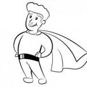

The Hero's Journey started with Joseph Campbell looking at heroes across mythology. He found that not only do heroes have a lot in common, but so do other roles in their stories. Again, Christopher

Vogler adapted this for writers in [*The Writer's Journey*,](http://www.amazon.com/gp/product/193290736X?ie=UTF8&tag=mamablogga-20&linkCode=as2&camp=1789&creative=9325&creativeASIN=193290736X) so we'll be using his terminology.

The **Hero** is our protagonist. The audience identifies with him (or her). He grows in the course of the story, and is involved in most of the

action. He has a character flaw, of course (if he were [perfect, could he grow? And would he be](http://jordanmccollum.com/2009/06/perfection-isnt-appealing/)

[interesting?)](http://jordanmccollum.com/2009/06/perfection-isnt-appealing/) This flaw is often the flipside of his biggest strength---his optimism means he has false hope, love of family means he won't sacrifice his dad's to save the world, etc. But he must be willing to sacrifice when we get to that climactic point of the story.

The first archetypal character he usually meets is the **Herald**, the character who issues the call to adventure. His challenge announces a coming change, that all is not well in the Ordinary World. He also gives the Hero motivation to go on the adventure.

The Herald doesn't have to actually *be* a person---in Lord of the Rings, it's the ring; in Harry Potter, it's the letters; in Star Wars: A New Hope, it's Obi-Wan's invitation to come with him and learn the ways of the Force. (You could try to argue it's meeting R2-D2, but remember that R2 bore a message for someone *else*).

He usually has a **Mentor** who teaches him. Often, the Mentor gives him a useful gift as well as motivates the hero into accepting the call. (Technically, the mentor doesn't have to be a person either---and I don't just mean disembodied voices and Force ghosts, either. It can be anything that teaches the Hero and prepares him for the coming tests.)

Along the way, the Hero encounters **Threshold Guardians** who block his path. These obstacles are tests for the Hero---have his skills developed enough? The guardians may be working for the good side or the bad side, or no one at all (but it's hard to make someone who makes trouble for his own sake believable for very long, you know?)

The **Trickster** is often a sidekick. He often balances the drama with comic relief and brings things into perspective.

The **Shape-Shifter** can be his or her own character---or it can be combined with another character type. As the name states, he's not what he appears to be. Revealing his "real" self can create big change in the story---but they may or may not be evil. They may switch sides, but they may become good. In fact, in a romance, the romantic leads are often Shape-Shifters because they must change to enter into a relationship. (Heck, even the Hero might be a Shape-Shifter, since he has to learn and grow throughout the course of the story.)

 

by Jordan McCollum **32** from http://JordanMcCollum.com **The Plot Thickens (Mwahahaha)** Subscribe for more on writing technique

 

The Hero may encounter a rival---someone who's competing for an intermediary goal, or the girl, etc. But it's the **Shadow** that is the true villain. He tests the Hero's true abilities and worthiness, and forces the Hero to rise to the challenge. He's often a shape-shifter, appearing beautiful, elegant or good.

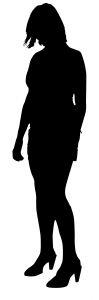

And nothing is complete without a few examples, right?

 

**Harry Potter** **Star Wars IV-VI**

**Hero** Harry Luke

**Shadow** Voldemort Darth Vader **Mentor** Hagrid, Dumbledore Obi-Wan

**Herald** Letters Obi-Wan **Shape shifters** Literally: McGonagall Leia, Vader/Anakin, Obi-Wan

**Trickster** Fred & George Han, C3PO, R2-D2 **Threshold Guardians** Neville, Fluffy Stormtroopers

**What do you think? How do you see these archetypal characters, either in others' works or your own?**

*Image credits: superhero[---](http://www.sxc.hu/profile/Scyza)*[*Stefanie L.*](http://www.sxc.hu/profile/Scyza)[*; s*](http://www.sxc.hu/profile/Scyza)*hadow[---](http://www.sxc.hu/profile/mzacha)*[*Michal Zacharzewski*](http://www.sxc.hu/profile/mzacha) 

 

by Jordan McCollum **33** from http://JordanMcCollum.com **The Plot Thickens (Mwahahaha)** Subscribe for more on writing technique

 

[**Applying the Hero's Journey**](http://jordanmccollum.com/2009/10/applying-heros-journey/)

The Hero's Journey is one of the more useful plotting methods we've looked at so far, because of the specific nature of most of the steps. And I can say this from experience---I've used the Hero's Journey (both Vogler's and Jung's versions) to plot at least six books. Of those, I've actually written two of them (one with Vogler's outline and the other with Jung's).

The Hero's Journey is a fun method to use for plotting, because it **gives a great structure that we instinctively recognize** (since it's based on archetypes from fairy tales and all those myths

we had to study in high school). It has some very **specific steps** to follow, so you have clear suggestions on the types of events to include.

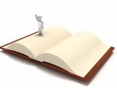

However, sometimes I've been disappointed by the Hero's Journey as a plotting method---when I expect to look at a list of steps and magically have the list tell me exactly how I should handle each of those scenes. That's not really what it's for---**we still have to use our imagination**.

And, as with all plotting methods, we have to be flexible. **Not all books require all steps**. A murder mystery, for example, may open after the hero has finally accepted the call---when he arrives on the crime scene. He may have another call to adventure, though---something that makes the case personal, if it isn't already. And, of course, in writing, we have to stay flexible, too. My Hero's Journey outlines bear only a passing resemblance to the finished products---in fact, I'm not totally sure I even have all the steps left in the manuscripts.

Sometimes it's tough to see how the Hero's Journey applies to different genres. Like I said, sometimes in mysteries, we jump in in the middle of the Journey. At Annette's presentation a few months ago, someone asked about applying the Hero's Journey to a romance. I was

actually convinced to use the Hero's Journey b[y *The Everything Guide to Writing a Romance*](http://www.amazon.com/gp/product/1598695371?ie=UTF8&tag=mamablogga-20&linkCode=as2&camp=1789&creative=9325&creativeASIN=1598695371)

[*Novel*,](http://www.amazon.com/gp/product/1598695371?ie=UTF8&tag=mamablogga-20&linkCode=as2&camp=1789&creative=9325&creativeASIN=1598695371) which I won on  [the Romance Writers' Revenge blog](http://romancewritersrevenge.com/)[---](http://romancewritersrevenge.com/)and **tomorrow, we'll have co-author Faye Hughes here to discuss how the Hero's Journey plays out in a romance**!

Now the Hero's Journey is one of my favorite methods of plotting. **Have you used the Hero's Journey? How have you seen it applied in your works or in others'?**

*Image credit[:](http://bigphoto1.blogspot.com/)* [*Svilen Mushkatov*](http://bigphoto1.blogspot.com/) 

 

by Jordan McCollum **34** from http://JordanMcCollum.com **The Plot Thickens (Mwahahaha)** Subscribe for more on writing technique

 

[**The Hero (and Heroine)'s Journey---Hero's Journey in romance**](http://jordanmccollum.com/2009/10/hero-heroines-journey-romance/)

*by Faye Hughes*

Thanks, Jordan, for allowing me to join you on your blog today. It's such a pleasure to be here.

I'm going to be talking about plotting a romance novel usin[g the hero's journey paradigm. N](#index_split_001.html_page_28)ow, first, a disclaimer: This approach works for a lot of romance novelists but it may not work for you. We're all individuals so we all approach the plotting process from a different viewpoint . . . and you know what? That's just fine.

The hero's journey is based on the work of screenwriter Christopher Vogler, whose book [*The*](http://www.amazon.com/gp/product/193290736X?ie=UTF8&tag=mamablogga-20&linkCode=as2&camp=1789&creative=9325&creativeASIN=193290736X)

[*Writer's Journey: Mythic Structure for Writers*](http://www.amazon.com/gp/product/193290736X?ie=UTF8&tag=mamablogga-20&linkCode=as2&camp=1789&creative=9325&creativeASIN=193290736X) was in turn based upon his interpretation of the archetypes described by Joseph Campbell in his seminal work on mythology, *The Hero with a Thousand Faces*. Romance author and lecturer Debra Dixon used Vogler's interpretations in her fabulous---and when I say, "fabulous," I mean you REALLY need to get a copy of this if you're

writing a romance novel---book[, *Goal, Motivation, and Conflict*.](http://www.gryphonbooksforwriters.com/?page=shop/flypage&wt=1.00&product_id=22&CLSN_1737=12550245031737c115837df28cc3fd2f)

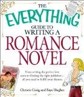

Basically, Vogler suggested that all fictional heroes---whether in a novel or a screenplay---would follow a similar path during the course of the story. When Vogler's insights regarding the hero's journey are applied to the

tradition[al three-act paradigm](#index_split_001.html_page_11) for writing a romance novel, the result can flesh out the plot and give insight into character.

It can also ensure that you'll **avoid the saggy middle** and other plot pitfalls.

The hero's journey paradigm includes:

**I. Act One**

a\. Ordinary World: The H/H (hero and heroine) are in their normal world before story begins.

b\. Call to Adventure: The H/H learn of the problem, receive a challenge or the call to adventure **that can lead to their romance**. c. Refusal of the Call: The hero or heroine (or both) refuses the call (due to their respective internal conflicts).

d\. Meeting with the Mentor: The H/H meet with a mentor who offers advice or training.

e\. Crossing the First Threshold: The H/H take the **first step toward the romance (the first kiss, perhaps)**.

**II. Act Two**

 

by Jordan McCollum **35** from http://JordanMcCollum.com **The Plot Thickens (Mwahahaha)** Subscribe for more on writing technique

 

a\. Tests, Allies, Enemies: The H/H face and resolve their numerous non-primary conflicts and meet the secondary characters who will **hinder or help them on their path to true love.**

b\. Approach to the Inmost Cave: The H/H encounter numerous obstacles while pursuing their **primary goal (an HEA \[Happily Ever After\])**. c. Supreme Ordeal: A major plot point where an important secondary conflict **seems to doom the romance** (could also include the primary conflict peripherally, though not always).

d\. Reward: The H/H overcome their secondary conflict.

**III. Act Three**

a\. The Road Back: The H/H begin the return to their ordinary world, although the primary conflict is still unresolved.

b\. Resurrection: The **Dark Moment** where the H/H **face the loss of their romance and must use every lesson they have learned along their journey to resurrect their love**.

c\. Return with Elixir: The H/H return from their journey with the **"elixir"---their HEA**.

The reason I like using The Hero's Journey paradigm for writing a romance is that it ensures we have all of the elements needed for a successful romance novel in our book.

Happy Writing!

**About the author**

*Faye Hughes, a Mississippi native currently living in New York, is the award-winning author of seven highly-acclaimed novels of romantic fiction published by Bantam, Zebra and Meteor. Heralded as one of the rising stars of contemporary romantic fiction during the 1990s, Faye received two W.I.S.H. (Women In Search of a Hero) awards for her work from Romantic Times BOOKLovers Magazine. Two of her romance novels have been optioned for television movies.*

*Her website is at * [*www.FayeHughes.net*](http://jordanmccollum.com/series/plot-thickens/page/4/www.FayeHughes.net)[*. Sh*](http://jordanmccollum.com/series/plot-thickens/page/4/www.FayeHughes.net)*e and nonfiction co-author Christie Craig have a joint*

*website at * [*www.WritewithUs.net*](http://jordanmccollum.com/series/plot-thickens/page/4/www.WritewithUs.net)[*.*](http://jordanmccollum.com/series/plot-thickens/page/4/www.WritewithUs.net)

 

by Jordan McCollum **36** from http://JordanMcCollum.com **The Plot Thickens (Mwahahaha)** Subscribe for more on writing technique

 

**Cons of the Hero's Journey**

No plotting method is perfect---though a lot of Hero's Journey fans may tell you that the HJ comes close . However, academics and scholars have pointed out some weaknesses in using the Hero's Journey as a template for a novel or movie.

On a scholarly level, many point out that Campbell's theories (the basis for Vogler's, if you'll recall) may not really be supported by the full body of mythology and fairy tales. He uses the Western canon, and even then, not the worldwide canon, to support his theories, and within mythological studies today, most consider his work an **overgeneralization** at best.

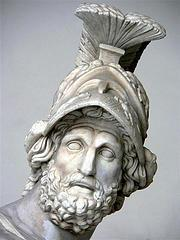

As Eileen mentioned [in the comments](http://jordanmccollum.com/2009/10/hero-heroines-journey-romance/#comment-900) on the last post, the Hero's Journey can sometimes seem a little formulaic. However, that's not always a bad thing. Romance, mysteries/thrillers/suspense, and inspirational novels are all "formulaic"---they have a prescribed formula, and if you break with it, well, good luck with the audience. Fans of those genres read them *because* they know how they're going to turn out, and that reaffirmation is powerful.

On the other hand, some do believe that adhering to the Hero's Journey had produced a **lack of originality and clichés** in pop culture, especially in movies. (However, I still think it's versatile enough to use---just try to give your story events a fresh twist. Isn't that what we should be doing anyway?)

Finally, the Hero's Journey **isn't all that kind to women**---and not just because it's not called the "Heroine's Journey." While it's certainly possible to use a woman instead of a man as a protagonist, Campbell's archetypal roles for women include mother, witch and damsel in distress. Not exactly a strong, empowered female role model, eh?

Critical analysis aside, however, **the Hero's Journey can still be a good model for plotting a story**---even if it doesn't magically give you the story events that will make your story a perfect, marketable marvel.

**How has the Hero's Journey fallen short for you and your story telling?**

*Photo b[y](http://www.flickr.com/people/mharrsch/)* [*Mary Harrsch*](http://www.flickr.com/people/mharrsch/) 

 

by Jordan McCollum **37** from http://JordanMcCollum.com **The Plot Thickens (Mwahahaha)** Subscribe for more on writing technique

 

[**Overview of Larry Brooks's Story Structure**](http://jordanmccollum.com/2009/10/overview-larry-brookss-story-structure/)

This is the most recent plotting method I've come across. Simply called ["**Story Structure**,"](http://storyfix.com/category/story-structure-series) this method gives great advice for partitioning your story as well as the major events and turning points. I used it in my most recent WIP (which I reached the end of late Saturday night ), and it was really helpful to pace myself (though I ended up short on word count, I know I'll add more in revisions).

Larry Brooks, author of many, many scripts, four published novels,

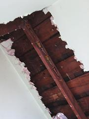

and the blo[g StoryFix,](http://storyfix.com/) published this in a blog series. It's very much

worth it to read [the Story Structure full series,](http://storyfix.com/category/story-structure-series) but I'll give a quick overview here.

The structure is in [four parts](http://storyfix.com/story-structure-series-1-introducing-the-four-parts-of-story) with three  [turning points](http://storyfix.com/story-structure-series-2-%E2%80%93-milestones-along-the-4-part-storytelling-road)  separating them (plus two "pinch points"). Each part of the story should be about one quarter of the story.

[Part one](http://storyfix.com/3-%E2%80%93-five-missions-for-the-set-up-part-1-of-your-story) is the **Set-up**. In this part of the story, we meet the characters and are introduced to the story question. (If you're reading this and thinking "Oh, the Ordinary World," you're not alone.) Here we also establish what's at stake, but most of all, we're

working up to the turning point at the end of this part: **Plot Point 1** (what we commonly call the Inciting Incident).

Brooks says that [First Plot Point](http://storyfix.com/story-structure-series-4-%E2%80%93-the-most-important-moment-in-your-story-the-first-plot-point) is the most important moment in your story. Located 20-25% of the way into your story, it's

the moment when the story's primary conflict makes its initial center-stage appearance. It may be the first full frontal view of it, or it may be the escalation and shifting of something already present.

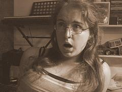

This is a huge turning point---where the whole world gets turned on its head. (If you like, you can say this is where we formally pose the story question.)

PP1 bridges into [Part 2---](http://storyfix.com/story-structure-series-5-part-2-of-your-story-the-response)the **Response**. The hero/heroine responds to the first plot point. This response can be a refusal, shock, denial, etc., etc. That doesn't mean they have to do nothing---they have to do something, and something more than sitting and stewing---but their reactions are going to be . . . well, reactive. The hero(ine) isn't ready to go on the offensive to save the day quite yet---they're still trying to preserve the status quo.

 

by Jordan McCollum **38** from http://JordanMcCollum.com **The Plot Thickens (Mwahahaha)** Subscribe for more on writing technique

 

In the middle of this part (about 3/8s of the way through your story), com[es **Pinch Point 1**.](http://storyfix.com/story-structure-series-9-%E2%80%93-pinch-points) Brooks defines a pinch point as "an example, or a reminder, of the nature and implications of the antagonistic force, that is not filtered by the hero's experience. We see it for ourselves in a direct form." So it's something bad that we get to see happen, showing us how bad the bad guy is, raising the stakes.

At the end of the Response comes the [**Mid-Point**.](http://storyfix.com/story-structure-steries-6-wrapping-your-head-around-the-mid-point-milestone) As the name suggests, this is halfway through the story. And here, the hero and/or the reader receives some new bit of information. It's pretty important, though---this is the kind of revelation that changes how we view the story world, changing the context for all the scenes that come after it.

Then we swing into [Part Three,](http://storyfix.com/story-structure-series-7%e2%80%a6-the-part-3-attack) the **Attack**. *Now* our hero(ine) is ready to go on the offensive. He's not going

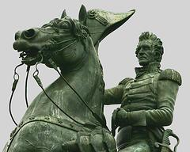

to operate on the bad guy's terms anymore---he's taking matters into his own hands, and he's going after the bad guy. This is the proactive hero's playing field now.

In the middle of this part (5/8s of the way through the

story), comes **Pinch Point 2**, which is just like PP1---a show of how bad the bad guy is.

Part Three ends with a lull before th[e **Second Plot Point**,](http://storyfix.com/story-structure-series-8-%E2%80%93-the-second-plot-point)

our last new information in the story. This last revelation is often the key to solving the mystery or fixing the problem---it's the last piece of info the hero needs to make his world right. This comes 75% of the way into the story.

And now we're ready for [Part Four,](http://storyfix.com/story-structure-series-10-part-4-the-final-act) the **Resolution**. Our hero steps up and takes the lead for the final chases, the last showdowns. Here we get to see how much of a hero he really is---he passes his final tests, proves he's changed and finally, saves the day.

Simple, right? Uh, kind of. Since examples always help me, we're going to have a guest post this week talking about how this author is applying this structure to her story. And of course, I need

to give credit to the person that pointed out Larry Brooks's story structure to m[e, Jaime Theler.](http://jaimetheler.blogspot.com/2009/08/stop-presses.html)

**What do you think? Can you see this in place in your writing, or in other works? What advantages do you see to this method?**

*Photo credits: cutaway (to see structure, yeah?)[---](http://www.flickr.com/people/buffaloreuse/)*[*Buffalo ReUse*](http://www.flickr.com/people/buffaloreuse/)[*; g*](http://www.flickr.com/people/buffaloreuse/)*asp[---](http://www.flickr.com/people/nevrlndtink/)*[*Becka Spence*](http://www.flickr.com/people/nevrlndtink/)[*; a*](http://www.flickr.com/people/nevrlndtink/)*ttack[---](http://www.flickr.com/people/bootbearwdc/)*[*D. B. King*](http://www.flickr.com/people/bootbearwdc/) 

 

by Jordan McCollum **39** from http://JordanMcCollum.com **The Plot Thickens (Mwahahaha)** Subscribe for more on writing technique

 

[**Story structure in action**](http://jordanmccollum.com/2009/10/story-structure-action/)

*by * [*C. Michelle Jefferies*](http://cmichellejefferiesauthor.yolasite.com/) 

We've been talking about Story Structure according to Larry Brooks' formula. There are many single elements that, combined, make a solid structure. These include: concept, theme, the four parts of story (introduction, reactive stage, proactive stage, and the resolution), and the five points in the story that move the plot along (plot point #1, pinch point #1, mid-point, pinch point #2, all is lost moment, and plot point #2).

What I have been asked to do today is illustrate how I have used all of these individual points to make a story with a solid structure in my own work. My next post will deal with how the Hero's Journey can be used to augment the character arc.

The first thing we need to address is **Concept**, as in "what is the story about?" In two words, my story concept is

about second chances. **Theme**, on the other hand, is more detailed. My theme is: pursuing their dreams and finding happiness by making up one's mind and taking action.

Once we have concept and theme we can concentrate on the parts and points in the story. To give you an example that flows well, I will be using both the parts and points in the order they are supposed to be in, rather than

addressing them separately.

**Part one: Introduction**---we see the main character, who is at a fancy restaurant waiting for her date. She is dressed to the nines, expecting this to be the dinner when he proposes. Instead of proposing, he tells her it's over---that there's another girl. She goes home devastated and publicly humiliated. We see her life in the after effects of that action. We introduce theme and set things in action by "calling the MC to action", or reaction on her part. However, that isn't the first plot point. Although the event is important, it comes too soon, and doesn't deal directly with the main plotline of the book.

Next, we experience **plot point #1**the MC is at work and her friend who just happens to be a guy talks her into going out with his brother. This is where the MC can either accept or decline. However, she will accept the "blind date" because the story doesn't move forward if she chooses not to. Plot point #1 brings us to the second part of the book.

**Part two: Reactive stage**---this is where the MC is going to be reacting to the first plot point and in my case the introduction of the theme. The MC is feeling confused. She thought for sure that the ex was "the one" and is feeling less than pretty and very imperfect---all reactions to the theme. She has a good time with the brother and that leaves her feeling confused too,

 

by Jordan McCollum **40** from http://JordanMcCollum.com **The Plot Thickens (Mwahahaha)** Subscribe for more on writing technique

 

wondering if her feelings for the ex weren't true and whether she knows what she is thinking at all.

**Pinch point #1** is where the reader is reminded of the plot and the opposing forces. The MC sees the ex with the new girl. It hurts more then she thought it would. Her first line of defense is her guy friend. He comforts her and makes her feel better.

The **Mid-point** is when things change. This point is often a place where the writer reveals information to the reader that opens up whole new possibilities. Sometimes the reader knows something that the MC doesn't even know. My MC finds that she has feelings for both of the brothers. The guy friend finds that he has feelings for the MC too and hates that he has introduced her to his brother. By his "code," he should back off and let the older brother have his chance with her. This "reaction" of both the MC and the guy leads us to part three.

**Part three: Proactive stage**---now the MC has moved from reacting to plot point #1 to being proactive and starting to do things to remedy the situation. My MC is watching both guys carefully and assessing her feeling for each of them. She makes opportunities to talk with the friend while still dating the brother.

**Pinch point #2**---Another crisis point in the story, edging up the pace and arc. The MC sees her friend with another girl and her jealousy flares.

Often times at this point, Brooks suggests that there is a "lull moment" where the characters think all is lost and there is no hope. This would be the MC going home eating a pint of ice cream and crying while watching some sappy love movies.

**Plot point #2** comes at about \[3/4s or\] 4/5s of the way through the book. This is the huge crisis moment, the

event that changes everything. After this point in time, no new characters or information may be allowed into the

story. The MC is at Thanksgiving with the brother and has had a heated moment with the friend, who she thought

wasn't interested. The spark is still there and it is stronger. The brother proposes and she has to make a decision---to live a relatively happy life with a good guy, or take a

chance with the friend and truly love someone. She says no and runs. The friend follows her at the brother's request, oblivious to the attraction between them.

**Part four, resolution**---plot point #2 brings us massive change in the MC's life. Now that everything has changed for my MC, she makes decisions that bring about resolution. She confesses her feelings and they finally kiss. They live happily ever after, or at least until the book ends.

 

by Jordan McCollum **41** from http://JordanMcCollum.com **The Plot Thickens (Mwahahaha)** Subscribe for more on writing technique

 

**What do you think? Does seeing the points of the story illustrated make the application a little clearer? How would you apply the structure to a romance?**

**About the author**

[*C. Michelle Jefferies*](http://cmichellejefferiesauthor.yolasite.com/) *practically grew up in a library. When she was ten, she realized she wanted to write stories like the science fiction books she loved to read. A mother of six, she put her writing on the back burner while she focused on raising her young children. When her children were old enough for her to spend a few hours on the computer, without them burning the house*

*down, she returned to writing and hasn't stopped since. She blogs at * [*My life in a laptop*](http://cmichellejefferies.blogspot.com/)[*.*](http://cmichellejefferies.blogspot.com/)

*Photo credits: house frame[---](http://www.flickr.com/people/froosh/)*[*Robin Frousheger*](http://www.flickr.com/people/froosh/)[*; c*](http://www.flickr.com/people/froosh/)*oncrete house[---](http://www.flickr.com/people/concrete_forms/)*[*Concrete Forms*](http://www.flickr.com/people/concrete_forms/) 

 

by Jordan McCollum **42** from http://JordanMcCollum.com **The Plot Thickens (Mwahahaha)** Subscribe for more on writing technique

 

[**The Hero's Journey with Story Structure**](http://jordanmccollum.com/2009/10/heros-journey-story-structure/)

*by * [*C. Michelle Jefferies*](http://cmichellejefferiesauthor.yolasite.com/) 

Brooks' Story Structure is, in my opinion, the best prescribed formula for how to place a story together. However, I originally used The Hero's Journey (hereafter referred to as HJ) to plot out my current WIP. A lot of what is also called "The Mythic Structure", within the HJ, makes sense as a template as to where to place each item the story needs. One thing I disliked about HJ was the common opinion that you could move items around to your liking, therefore maybe putting certain things in the wrong place.

I have found, however, that HJ is a good characterization tool for creating a proper arc. It can also add understanding to Brooks' Structure if applied properly. Used together I find that I have a more, well-rounded picture of the story.

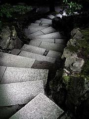

What we recognize as Concept and Theme in Structure, is the Story Question in the HJ. The question I asked is: Can the MC survive being dumped by the man she thought was her life, and move on? A secondary plot question is: Which guy is right for my MC? These questions begin the thought process of how my character is going to grow in this story---the beginning of that character arc.

The **Ordinary World in HJ is the equivalent of Part one: Introduction** in Structure. *We see the main character, who is at a fancy restaurant, unknowingly waiting for her date to dump her.* As character arc, we are finding out what her ordinary world is: what she is thinking, what she is wearing, whether she likes the restaurant and how excited she is about getting married. This is the place for us to start identifying with the MC and establish emotions and rapport with her. Because, when that devastating information comes, we want our reader to be emotionally invested in the MC, enough that they don't put the book down.

We introduce theme and set things in action by 'calling the MC to action', or reaction on her part. **The Call to Action in HJ is not plot point #1**. Although the event is important, the MC or Heroine, refuses to act. *The Call is the boyfriend dumping her in public*, which leads us to the **Refusal of the Call**. *My MC goes home and cries, thinking her world is over. She locks herself in her room with a half gallon of ice cream.* These actions are giving us more depth into the characters' personality.

At this point in time we also have what is called Meeting with the Mentor. Sometimes the mentor is the one delivering the call. Sometimes it is the person the MC goes to for advice and help. My MC doesn't have a "mentor." She has her friend, who just happens to be a guy, who she goes to for advice and safe friendship after the disastrous date. The relationship between

 

by Jordan McCollum **43** from http://JordanMcCollum.com **The Plot Thickens (Mwahahaha)** Subscribe for more on writing technique

 

the MC and the mentor is another way that we develop character. How they relate reveals a lot about the MC.

Next, we experience what HJ calls **Crossing the First Threshold or plot point #1**. *The MC is at work, and her friend talks her into going out with his brother. By accepting the date with her friend's brother, she has accepted that the ex is a jerk and she needs to move on, thus figuratively putting the ice cream securely in the freezer*. She moves from what we saw as her ordinary world into the new reality. This area is often a point where our MC struggles to become better and braver, and to take that step into the post-First Threshold world.

Now we enter **Part two: reaction, the Tests, Enemies, and Allies** stage of the book. *This is where the MC adjusts to her new reality---post ex. She begins down a road of new possibilities*. Characters, enemies, and trials are introduced during this part. This is where in the "tree" theory after you put your character in the tree, (Crossing the Threshold), you begin to throw small rocks at her. The MC reacts to what her life has dealt her.

As we **Approach the Innermost Cave which is Structure's Mid-point** the plot begins to get serious and the "rocks" get a lot bigger. This point is often a place where the writer reveals information to the reader that opens up whole new possibilities. Sometimes the reader knows something that the MC doesn't even know. *My MC finds that she has feelings for both of the brothers. The guy friend finds that he has feelings for the MC too and hates that he has introduced her to his brother. By his "code," he should back off and let the older brother have his chance with her.*

This "reaction" from both the friend and the MC leads us to Part three, proactive stage. This is a time of trials for the MC. She finds out who her real friends are and what she is made of, the previous trials proving her mettle.

As we near The Ordeal, we can have either the "lull moment" where the characters think all is

lost and there is no hope, or a "I've finally succeeded and this is the end, only to find out it isn't" moment. *My MC has an all is lost moment, and feels that she will never*

*know who is right for her, and she will be single her whole life*. This point in the story is a place where we again feel sympathy for the MC and deepens our concern for what happens to her.

**The Ordeal or Plot point #2** comes at about \[3/4s or\] 4/5s way through the book. This is the huge crisis moment, the event that changes everything. After this point in time, no

new characters or information may be allowed into the story. *The MC is at Thanksgiving with the brother and has had a heated moment with the friend who she thought wasn't interested. The spark is still there and it has grown stronger. The brother proposes and she has to make a decision---to live a relatively happy life with a good guy, or take a chance with the friend and*

by Jordan McCollum **44** from http://JordanMcCollum.com **The Plot Thickens (Mwahahaha)** Subscribe for more on writing technique

 

*truly love someone. She says no and runs. The friend follows her at the brother's request, oblivious to the attraction between them.* This is the refining fire for our MC, the culmination of all previous actions. This is where the reader is cheering for the MC to succeed.

**Her decision is the Reward**. She has proven herself, and has demonstrated to everyone that she has grown and is stronger for it. We are still cheering for her and her success.

What Structure calls **Part four, resolution, HJ calls Return With Elixir**. The Ordeal brings us massive change in the MC's life. Now that everything has changed for my MC, she makes decisions that bring about resolution. *She confesses her feelings and they finally kiss. They live happily ever after, or at least until the book ends.* This is where the MC moves into the new ordinary world and we see not only the comparison to the old world but we see the Story Question answered. We tie up all the loose ends for the reader as well.

**What do you think? How would you line up the Hero's Journey and Story Structure?**

**About the author**

[*C. Michelle Jefferies*](http://cmichellejefferiesauthor.yolasite.com/) *practically grew up in a library. When she was ten, she realized she wanted to write stories like the science fiction books she loved to read. A mother of six, she put her writing on the back burner while she focused on raising her young children. When her children were old enough for her to spend a few hours on the computer, without them burning the house*

*down, she returned to writing and hasn't stopped since. She blogs at * [*My life in a laptop*](http://cmichellejefferies.blogspot.com/)[*.*](http://cmichellejefferies.blogspot.com/)

*Photo credits: path[---](http://jordanmccollum.com/series/plot-thickens/page/4/katgloor.com)*[*Kat Gloor*](http://jordanmccollum.com/series/plot-thickens/page/4/katgloor.com)[*; p*](http://jordanmccollum.com/series/plot-thickens/page/4/katgloor.com)*ath through structure (bridge)[---](http://www.flickr.com/people/7682623@N02/)*[*Jo Ann Deasy*](http://www.flickr.com/people/7682623@N02/) 

 

by Jordan McCollum **45** from http://JordanMcCollum.com **The Plot Thickens (Mwahahaha)** Subscribe for more on writing technique

 

[**Setting up the story question**](http://jordanmccollum.com/2009/10/setting-story-question/)

We discussed the [Story Question](#index_split_001.html_page_12) at the beginning of our series on plotting. The more we've discussed plotting, however, the more I realize I have more to say on this topic.

The first time we talked about it, we defined the story question like this (well, we're using different emphasis this time):

The story question is the basic concept of the story. It's asked (**or hinted at**) at the beginning of the story, and answered by the end. It's the controlling, overarching action of the story.

So how do we hint at the story question at the beginning, especially if we don't plan to formally ask it until the Call to Adventure, or Plot Point #1?

In all the plotting paradigms we've looked at, there's a period at the beginning of the story where we get to see the character's world: the Ordinary World, the Setup. Note that the three act, the five act and Brooks's story structures all place the transition from this world at the 1/4 point, where we're introduced to the BIG conflict.

But how can we introduce the story question in the beginning if we can't actually "ask" it for some 25,000 words?

As we show the Ordinary World, we have to show something is wrong there---**something is missing**. Something is lacking---**something that the conclusion of our story will bring to him or her**.

If it's a romance, we need to see in the beginning that the hero and heroine are lacking something---they're alone. If it's a mystery, we need to see a lack of justice (which an unsolved murder portrays nicely). Perhaps our main character is naive (or jaded), and the end of the story will bring knowledge or wisdom (or crack his hard exterior).

That doesn't mean, however, that our characters have to spend the first quarter of the book whining about how lonely they are, and it doesn't mean we have to wait until the 1/4 point to introduce them (conversely, we aren't obligated to have them meet, sparks flying, on page 1, line 1).

**We have to have conflict in the Ordinary World**. If you'll recall[,](#index_split_001.html_page_16) [in](#index_split_001.html_page_16) [*The Incredibles*](#index_split_001.html_page_16)[,](#index_split_001.html_page_16) this conflict related directly to the main plot---each member of the family was having a hard time, challenged by the Ordinary World. When we ask the story question (well, at each of the turning points), the stakes are raised for each member of the family.

 

by Jordan McCollum **46** from http://JordanMcCollum.com **The Plot Thickens (Mwahahaha)** Subscribe for more on writing technique

 

**This conflict in the Ordinary World should relate to the main plot**. Imagine if we spend 25,000 words worrying about whether Pa's crop will come in, and at the 1/4 turning point, we ask if Angelica can find true love. Can you imagine readers' whiplash---and disappointment (or even outrage) that they just wasted X amount of time reading about something that has nothing to do with the story? That all those characters we cared about don't matter anymore?

Even if we ask if Angelica can find Pa's murderer, was the treatise on chopping cotton really necessary? Only if someone killed him for his crop, and even then, the first section might need to be adjusted a little to focus on the story question and not the agricultural practices of white sharecroppers in the 1930s.

**What do you think? How have you set up your conflict before asking the story question?**

*Photo credits: question[---](http://www.sxc.hu/profile/svilen001)*[*Svilen Mushkatov*](http://www.sxc.hu/profile/svilen001) 

 

by Jordan McCollum **47** from http://JordanMcCollum.com **The Plot Thickens (Mwahahaha)** Subscribe for more on writing technique

 

[**The End**](http://jordanmccollum.com/2009/10/the-end/)

Well, that wraps up our series on plotting. It's been fun, hasn't it? We've learned about the

[three act structure](#index_split_001.html_page_11)[,](#index_split_000.html_11) the  [snowflake method](#index_split_001.html_page_21)[,](#index_split_000.html_21) th[e](#index_split_001.html_page_28) [Hero's Journey](#index_split_001.html_page_28)  and Larry Brook[s's](#index_split_001.html_page_28) [story](#index_split_001.html_page_28)

[structure. We](#index_split_001.html_page_28)'ve seen them applied to fellow writers' works.

We started off talking about [the need for plotting---](#index_split_001.html_page_3)and of course, there are still going to be some of us that don't believe in plotting. The arguments are the same (and I used to make them myself)---plotting kills our creative drive. Plotting is boring. Plotting is stifling.

And no, there's no plotting method out there that will manufacture ideas for us, but there are lots that help us imagine the types of ideas that will move our stories forward. And yes, the joy of writing is in

creating and discovering the twists and turns---but **knowing what landmarks we're shooting**

**for can make sure we don't end up going in circles**, or remodeling [a](#index_split_001.html_page_6) [Winchester Mystery story](#index_split_001.html_page_6)[,](#index_split_001.html_page_6) where two thirds of it will have to be jettisoned before we could ever hope to create a livable structure.

**Plotting doesn't have to mean you write out a scene-by-scene outline**. When I plotted my most recent MS (using Story Structure), I had the beginning, five landmarks, a twist and the end in mind, plus a freewrite brainstorm of backstory/ideas/plot (about 3 pages). Right now, a lot of the transitions need work, but I never felt lost, never got stuck because I wasn't sure where I was going and finished the first draft in about 55 days. I know it has a **solid backbone**, even if some of the stuff in between is a little flabby---and that's not bad shape to be in after the first draft (not to mention eight weeks, and I took a couple weeks off in there, too).

**When we plot, we have to do what works for us**. So many of the writers we had guest posts from over the last few weeks mentioned how they **customized that plotting method to meet their needs**.

If you've never plotted before, or if you've never *successfully* plotted before, why not give it a try?

**What do you think? What's keeping you from plotting? Or are there any other plotting methods you like?**

 

by Jordan McCollum **48** from http://JordanMcCollum.com **The Plot Thickens (Mwahahaha)** Subscribe for more on writing technique

 

**Bonus Features**

 

I've collected a few resources that I've been saving to share here in the bonus features.

 

[Carol,](http://careann.wordpress.com/) author of one of our guest posts,  [suggested](http://jordanmccollum.com/2009/10/share-favorite-plotting-resources/#comment-1043)  mind mapping to help in plotting:

I sometimes use '**mind mapping**' as a part of my initial story explorations. It's kind of like pre-planning for me --- a word web of associated ideas. It was a way of organizing material for my articles but it can be applied to fiction as well.

 

Holly Lisle, author of over 30 novels and winner of the Compton Crook Award, offers a **free**

**plotting clinic in PDF and email** form. Th[e](http://hollylisle.com/fm/Workshops/plot-outline1.html) [Create A Professional Plot Outline](http://hollylisle.com/fm/Workshops/plot-outline1.html) does require you to sign up with an email address, but the course and PDF are free once you do.

 

Tracy Montoya is the author of eight novels and the winner of the Daphne du Maurier award, the Beacon Award, and the Golden Quill award for romantic suspense. Recently, she visited

Romance University for a post on [**Plot Mapping**](http://romanceuniversity.org/2009/10/19/do-all-roads-lead-to-plot-mapping/) **using the three act structure**.

 

Author of over ten novels and owner of the popular online writing community Forward Motion (founded by Holly Lisle above), Lizette Gifford uses an in-depth plotting technique she calls "phase outlining." It's **more detailed than even a scene-by-scene outline**, as you can see in her

article ["It\'s Just a Phase."](http://www.fmwriters.com/Visionback/Issue%2015/phase.htm) (Like Story Structure, I found this method [via](http://jaimetheler.blogspot.com/2009/10/to-nano-or-not-to-nano.html) [Jaime Theler](http://jaimetheler.blogspot.com/2009/10/to-nano-or-not-to-nano.html)[.)](http://jaimetheler.blogspot.com/2009/10/to-nano-or-not-to-nano.html)

 

Finally, in her book *A Natural History of the Romance Novel,* Pamela Regis gives an outline of

the [**eight essential elements of a romance**](http://books.google.com/books?id=juPQyVJrsFAC&lpg=PA27&ots=Fbv31yY_Sm&dq=pamela%20regis%20elements%20romance&pg=PA30#v=onepage&q=&f=false) (which nicely mirror many of the plotting techniques discussed here) and **three "accidental" elements**. Google Books has her book, cued here to the section on these elements.

 

by Jordan McCollum **49** from http://JordanMcCollum.com
