Contents

[Chapter 1: The Challenge](#Chapter01.html)

[Part I: Things You Think You Know](#Part01.html)

[Chapter 2: Redefining the Year](#Chapter02.html)

[Discard Annualized Thinking](#Chapter02.html_sec1)

[Great Things Happen at Year-End](#Chapter02.html_sec2)

[Periodization](#Chapter02.html_sec3)

[12 Weeks Equals a Year](#Chapter02.html_sec4)

[Chapter 3: The Emotional Connection](#Chapter03.html)

[Your Brain and Vision](#Chapter03.html_sec5)

[Chapter 4: Throw Out the Annual Plan](#Chapter04.html)

[12 Week Planning](#Chapter04.html_sec6)

[Setting Goals](#Chapter04.html_sec7)

[Chapter 5: One Week at a Time](#Chapter05.html)

[The Weekly Plan](#Chapter05.html_sec8)

[Chapter 6: Confronting the Truth](#Chapter06.html)

[Measuring Results](#Chapter06.html_sec9)

[Weekly Scorecard](#Chapter06.html_sec10)

[Chapter 7: Intentionality](#Chapter07.html)

[The Importance of Yes and No](#Chapter07.html_sec11)

[Blocking Your Time](#Chapter07.html_sec12)

[Chapter 8: Accountability as Ownership](#Chapter08.html)

[Chapter 9: Interest versus Commitment](#Chapter09.html)

[Chapter 10: Greatness in the Moment](#Chapter10.html)

[Performing in the Moment](#Chapter10.html_sec13)

[Chapter 11: Intentional Imbalance](#Chapter11.html)

[Part II: Putting It All Together](#Part02.html)

[Chapter 12: The Execution System](#Chapter12.html)

[Three Principles](#Chapter12.html_sec14)

[Five Disciplines](#Chapter12.html_sec15)

[The Emotional Cycle of Change](#Chapter12.html_sec16)

[Closed System](#Chapter12.html_sec17)

[Chapter 13: Establish Your Vision](#Chapter13.html)

[Impossible, Possible, Probable, Given](#Chapter13.html_sec18)

[Crafting Your Vision](#Chapter13.html_sec19)

[Thinking Shift](#Chapter13.html_sec20)

[Team Application](#Chapter13.html_sec21)

[Team Visions](#Chapter13.html_sec22)

[Common Pitfalls and Success Tips](#Chapter13.html_sec23)

[Chapter 14: Develop Your 12 Week Plan](#Chapter14.html)

[Planning Is Beneficial](#Chapter14.html_sec24)

[Game Changer](#Chapter14.html_sec25)

[A Good Plan Fosters Solid Execution](#Chapter14.html_sec26)

[Long-Term Capacity versus Short-Term Results](#Chapter14.html_sec27)

[Effective Plan Structure](#Chapter14.html_sec28)

[Establish Your 12 Week Goals](#Chapter14.html_sec29)

[Writing Your 12 Week Plan](#Chapter14.html_sec30)

[Thinking Shift](#Chapter14.html_sec31)

[Team Application](#Chapter14.html_sec32)

[Common Pitfalls and Success Tips](#Chapter14.html_sec33)

[Chapter 15: Installing Process Control](#Chapter15.html)

[Making Sure Things Get Done](#Chapter15.html_sec34)

[Weekly Plans](#Chapter15.html_sec35)

[Don't Go It Alone](#Chapter15.html_sec36)

[The Weekly Routine](#Chapter15.html_sec37)

[Thinking Shift](#Chapter15.html_sec38)

[Team Application](#Chapter15.html_sec39)

[Common Pitfalls](#Chapter15.html_sec40)

[Chapter 16: Keeping Score](#Chapter16.html)

[Thinking Shift](#Chapter16.html_sec41)

[Team Application](#Chapter16.html_sec42)

[Common Pitfalls and Success Tips](#Chapter16.html_sec43)

[Chapter 17: Take Back Control of Your Day](#Chapter17.html)

[Performance Time](#Chapter17.html_sec44)

[Model Work Week](#Chapter17.html_sec45)

[Thinking Shift](#Chapter17.html_sec46)

[Team Application](#Chapter17.html_sec47)

[Common Pitfalls and Success Tips](#Chapter17.html_sec48)

[Chapter 18: Taking Ownership](#Chapter18.html)

[Actions to Create Greater Accountability in Your Life](#Chapter18.html_sec49)

[Thinking Shift](#Chapter18.html_sec50)

[Team Application](#Chapter18.html_sec51)

[Common Pitfalls and Success Tips](#Chapter18.html_sec52)

[Chapter 19: 12 Week Commitments](#Chapter19.html)

[The Power of Commitments](#Chapter19.html_sec53)

[Personal Commitments](#Chapter19.html_sec54)

[Commitments to Others](#Chapter19.html_sec55)

[Thinking Shift](#Chapter19.html_sec56)

[Team Application](#Chapter19.html_sec57)

[Common Pitfalls and Success Tips](#Chapter19.html_sec58)

[Chapter 20: Your First 12 Weeks](#Chapter20.html)

[Resistance Monsters](#Chapter20.html_sec59)

[The Need for Immediate Gratification](#Chapter20.html_sec60)

[Big Change and Multiple Goals](#Chapter20.html_sec61)

[Old Habits](#Chapter20.html_sec62)

[Victim Thinking](#Chapter20.html_sec63)

[Your First 12 Weeks](#Chapter20.html_sec64)

[Your First Four Weeks](#Chapter20.html_sec65)

[Your Second Four Weeks](#Chapter20.html_sec66)

[Your Last Four Weeks (and the Secret of the 13th Week)](#Chapter20.html_sec67)

[Success Tips](#Chapter20.html_sec68)

[Team Application](#Chapter20.html_sec69)

[After-Action Review](#Chapter20.html_sec70)

[Chapter 21: Final Thoughts and the 13th Week](#Chapter21.html)

[References](#References.html)

Additional Praise for The 12 Week Year

"Time is the single biggest roadblock that restricts human progress. The 12 Week Year provides a roadmap to drive velocity, output, and results. Speed of execution is the driving force to success, and Brian Moran and Mike Lennington help you win this race. A must-read for those seeking to reach their full potential."

---Josh Linkner, New York Times bestselling author of Disciplined Dreaming

"Moran and Lennington's view of accountability is a game changer. If we all wake up to the fact that freedom of choice is the foundation of accountability, the word will take on a whole new meaning."

---Cali Ressler and Jody Thompson, coauthors of Why Managing Sucks and How to Fix It

"Using the 12 Week Year has been the single best thing I have done personally and professionally!"

---Wicho Hernandez, President, LINQ Financial

"What I like about The 12 Week Year is that it helps you produce results! Ideas are great---and this book has plenty of them---but they aren't worth a hill of beans until you act on them. I've been endorsing Moran and Lennington's work to my clients for years. Why? The system works!"

---Bill Cates, author of Beyond Referrals; How to Use the Perpetual Revenue System™ to Turn Referrals into High-Value Clients

"The 12 Week Year is by far the most practical book on what it takes to execute well that I have ever encountered. If you really read this book, if you study it, if you commit yourself to apply it---it will transform your results in business and in life."

---James Shoemaker, CEO, Shoemaker Financial

"Over two decades running businesses, teaching others to do it, writing and speaking about it, day-to-day execution remains the toughest part of the code to get right. In one book Brian and Mike have put everything before it to shame."

---Dick Cross, author of Just Run It!

"The 12 Week Year is one of the best 'how-to' books I've ever read. It will work for you!"

---Jack Krasula, Host of "Anything is Possible," NewsTalk 760 WJR

"The 12 Week Year is a must-read for anyone who is seeking a more balanced and successful personal and professional life. Not only does it introduce many great and practical ideas for improving your performance in business, it also includes step-by-step action items to actually implement those ideas."

---Robert Fakhimi, CEO and President, Mass Mutual San Francisco

"In my career I have only experienced two different things that I consider to be game changers, and The 12 Week Year process is one. It has transformed our agency from top to bottom."

---Gregory A. McRoberts, Managing Partner, WestPoint Financial Group

"The 12 Week Year is genius! The only way I can stay on schedule, as an author, speaker, business-owner, husband, and father of four is by subscribing to this simple, yet brilliant strategy. Don't let another year go by without discovering the power of this fantastic program. It will revolutionize your life, turning dreams into reality!"

---Patrick Kelly, author of national bestseller, Tax-Free Retirement

"The principals and disciplines of high performance outlined in this book will change your personal and business life and will create a sense of urgency."

---Harris S. Fishman, President, First Financial Group

"Brian and Mike are onto something truly empowering, sometimes life does get in the way, but if you think about the long-term benefits of your actions, you will never disappoint yourself or others around you. The exercises and life plans that are in this book make it a must-read for everyone, professionally and personally."

---Michael Vesuvio, President, Emerald Financial

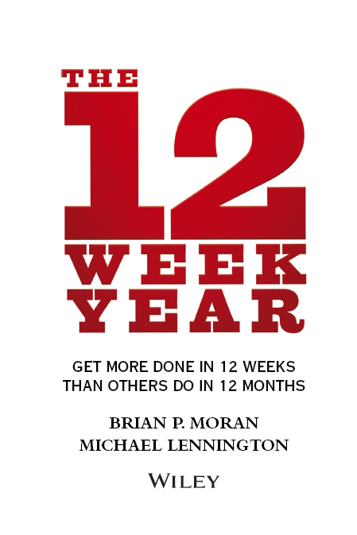

Cover design: Paul McCarthy

Copyright © 2013 by Brian P. Moran and Michael Lennington. All rights reserved.

Published by John Wiley & Sons, Inc., Hoboken, New Jersey.

Published simultaneously in Canada.

No part of this publication may be reproduced, stored in a retrieval system, or transmitted in any form or by any means, electronic, mechanical, photocopying, recording, scanning, or otherwise, except as permitted under Section 107 or 108 of the 1976 United States Copyright Act, without either the prior written permission of the Publisher, or authorization through payment of the appropriate per-copy fee to the Copyright Clearance Center, 222 Rosewood Drive, Danvers, MA 01923, (978) 750-8400, fax (978) 646-8600, or on the web at [www.copyright.com](http://www.copyright.com). Requests to the Publisher for permission should be addressed to the Permissions Department, John Wiley & Sons, Inc., 111 River Street, Hoboken, NJ 07030, (201) 748-6011, fax (201) 748-6008, or online at [www.wiley.com/go/permissions](http://www.wiley.com/go/permissions).

Limit of Liability/Disclaimer of Warranty: While the publisher and author have used their best efforts in preparing this book, they make no representations or warranties with the respect to the accuracy or completeness of the contents of this book and specifically disclaim any implied warranties of merchantability or fitness for a particular purpose. No warranty may be created or extended by sales representatives or written sales materials. The advice and strategies contained herein may not be suitable for your situation. You should consult with a professional where appropriate. Neither the publisher nor the author shall be liable for damages arising herefrom.

For general information about our other products and services, please contact our Customer Care Department within the United States at (800) 762-2974, outside the United States at (317) 572-3993 or fax (317) 572-4002.

Wiley publishes in a variety of print and electronic formats and by print-on-demand. Some material included with standard print versions of this book may not be included in e-books or in print-on-demand. If this book refers to media such as a CD or DVD that is not included in the version you purchased, you may download this material at <http://booksupport.wiley.com>. For more information about Wiley products, visit [www.wiley.com](http://www.wiley.com).

Library of Congress Cataloging-in-Publication Data:

Moran, Brian, 1959--

The 12 week year : get more done in 12 weeks than others do in 12 months / Brian Moran and Michael Lennington.

pages cm

ISBN 978-1-118-50923-4 (cloth); ISBN 978-1-118-61629-1 (ebk); ISBN 978-1-118-61636-9 (ebk); ISBN 978-1-118-61642-0 (ebk)

1\. Success in business. 2. Success. 3. Organizational effectiveness. I. Lennington, Michael, 1958- II. Title. III. Title: Twelve week year.

HF5386.M753 2013

650.1---dc23

2012049843

# Chapter 1

# The Challenge

How is it that some people seem to accomplish so much while the vast majority of people never accomplish what they are capable of? If you could fully tap your potential, what might be different for you? How would your life change if each and every day you performed up to your full potential? What would be different six months, three years, and five years down the road if each day you were at your best?

That set of questions, that core concept, is what the past dozen years or so have been about for Mike and me. For years, we have been helping our clients to execute more effectively. We work with individuals, teams, and corporations to make plans to help them achieve their goals. Our quest has been to unlock the secret to helping individuals and organizations perform at their best and live the life they are truly capable of.

::: {}

------------------------------------------------------------------------
:::

:::::: {}
::: {}
"If we did the things we are capable of doing, we would literally astound ourselves."
:::

::: {}
---Thomas Edison
:::

::: {}

------------------------------------------------------------------------
:::
::::::

I agree with Steven Pressfield, author of The War of Art, that most of us have two lives: the lives we live and the lives we are capable of living. It's the latter that intrigues me. It's the life, I believe, that we all deeply desire. It's the life that we know exists somewhere deep inside us that we wish we could actualize. This life isn't driven by the you who settles or gives in to procrastination and doubt, but by the optimal you, the best you, the confident you, the healthy you. The you who shows up with your best stuff, making things happen, making a difference, living a life of significance.

Being your optimal self sounds great doesn't it? But how do you become that other you? What does it take to be your best? That's an interesting question, and as I've had the opportunity to travel and meet thousands of people, I often ask them, "What does it take to be your best, to be great?" As you might imagine, I get a lot of different answers.

In this book we will show you how to increase your current results by four times or more, in a very short period of time. You will learn exactly what it takes to perform at your best every day. We will unwrap the secrets of top performers in a way that allows you to align your thinking and your actions to produce staggering results. You are about to learn that creating greatness in your life or in your organization isn't complicated. In fact, it's quite uncomplicated, but that doesn't mean that it's easy.

The number-one factor holding people back from achieving what they are truly capable of is not a lack of knowledge, intellect, or information. It's not a new strategy or idea. It's not a larger network of connected people. It's not hard work, natural talent, or luck. Of course all these things help, they all play a factor, but they are not the factors that make the difference.

You've no doubt heard the saying knowledge is power. I disagree. Knowledge is only powerful if you use it, if you act on it. People spend lifetimes acquiring knowledge, but to what purpose? Knowledge alone benefits no one unless the person acquiring it does something with it. And great ideas are worthless unless they are implemented. The marketplace only rewards those ideas that get implemented. You can be smart and have access to lots of information and great ideas; you can be well connected, work hard, and have lots of natural talent, but in the end, you have to execute. Execution is the single greatest market differentiator. Great companies and successful individuals execute better than their competition. The barrier standing between you and the life you are capable of living is a lack of consistent execution. Effective execution will set you free. It is the path to accomplish the things you desire.

Think about the areas in your life where you've fallen short, accomplished less than you desire, or less than you feel you're capable of. In each of those scenarios, if you look critically, the breakdown is most often in the execution. Take for instance a new idea that someone else has used to create success. How often does that idea fail when a different person tries it?

One of our clients is a large insurance company with more than 2,000 agents. Within the company there is one agent who is a perennial top producer year-in and year-out. As you might expect, over the years, other agents have asked him if he would share his approach with them. Without hesitation the top producer would take time out from his busy schedule to walk them through exactly what he did to create his success. Do you know how many people replicated his success? You guessed it, zero. He now refuses to share his secret because no one follows through with what he teaches them.

Sixty-five percent of Americans are overweight or obese. Do you think there is some secret to losing weight and getting fit? The diet and fitness industry is a \$60 billion industry. Each year new books are published on diet and exercise. When I searched "diet books" on the Internet my search came back with 45,915 results. Almost 46,000 books; some with familiar titles like The Atkins Diet, or South Beach Diet, some with less familiar titles like Run Fat B!tch Run. Yet Americans continue to be overweight and out of shape. Most people know how to get back in shape---eat better, exercise more---they just don't do it. It's not a knowledge problem; it's an execution problem.

Our experience has shown that most people have the capacity to double or triple their income just by consistently applying what they already know. Despite this, people continue to chase new ideas thinking that the next idea is the one that will magically make it all better.

Ann Laufman is a great example of the benefits of executing the right idea. Ann is a financial advisor with Mass Mutual in Houston. Ann had always done well and by any measure was successful, yet she felt like she was capable of more but was not quite sure how to get there. When her managing partner introduced The 12 Week Year to the agency, Ann got involved. In the end, Ann experienced a 400 percent increase in production and became the first female associate of the year in the 103-year history of Mass Mutual Houston.

What is interesting about this is that Ann didn't start to work with more affluent clients, write bigger cases, or expand her target market---all things that most advisors would pursue to increase their production. Instead, Ann focused on improving her execution by doing what she had already been doing, just doing it more steadily. By consistently executing the critical few tasks and strategies that most supported her success, she was able to create a huge increase---and all of this without working longer hours.

Ann's situation is not unique. We have thousands of examples where individuals and entire organizations have experienced amazing results by simply learning to execute.

::: {}

------------------------------------------------------------------------
:::

::::: {}
::: {}
"It's not what you know; it's not even who you know; it's what you implement that counts."
:::

::: {}

------------------------------------------------------------------------
:::
:::::

In The 12 Week Year, we will show you how to perform at your best and achieve the things in life that matter most to you through effective execution. Most of the stuff that we'll discuss, you already know, but as I mentioned earlier, there is a big difference between knowing and doing. We will teach you how to consistently take action on the things that will shape your success.

The concepts in this book have been developed and proven in the field through our ongoing execution work with clients. We've included only what works, and have eliminated the rest. The final product is a concise but powerful book that delivers. While we do hope the book is thought-provoking, it's more important to us that it inspires you to action.

We have written The 12 Week Year to close the execution gap. It is written in a way that allows you to understand the fundamental concepts of execution and actually apply them right away.

The book is split into two parts. Part I helps you understand the process to achieve your most valuable goals in only weeks. Part II is all about making your goals happen. It gives you the specific tools and tips needed to support the ideas in Part I of the book.

Our 12 week execution system is both flexible and scalable. The concepts apply equally well for individuals as well as groups, both personally and professionally. We have had entire organizations as well as individuals apply the 12 Week Year with great success.

While the book is concise, the concepts it contains are powerful. It is possible for you to dramatically improve your results by applying them. We know this to be true because of the thousands of responses from the readers of our first edition.

In this book, we will show you how to substantially increase your current results, lower your stress, build your confidence, and feel better about yourself. Not by working harder, but by focusing on the activities that matter most, maintaining a sense of urgency to get those things done, and shedding the low-value activity that keeps you stuck.

Get ready: You are about to experience the 12 Week Year!

---Brian P. Moran and Michael Lennington

# Part I

# Things You Think You Know

Part I will provide fresh insights regarding what it takes to be great and challenge what you think you know about what it takes to perform at your best and achieve your potential.

::: {}

------------------------------------------------------------------------
:::

:::::: {}
::: {}
"It's what you learn after you know it all that counts."
:::

::: {}
---John Wooden
:::

::: {}

------------------------------------------------------------------------
:::
::::::

# Chapter 2

# Redefining the Year

Most people, and most organizations for that matter, don't lack ideas. Whether they're effective marketing techniques, sales ideas, cost-cutting measures, or customer service enhancements, there are always more ideas than you can effectively implement. The breakdown is not in knowing, but in applying.

::: {}

------------------------------------------------------------------------
:::

:::::: {}
::: {}
"You can't build a reputation on what you're going to do."
:::

::: {}
---Henry Ford
:::

::: {}

------------------------------------------------------------------------
:::
::::::

One of the things that gets in the way of individuals and organizations achieving their best is the annual planning process. As strange as this is going to sound, annual goals and plans are often a barrier to high performance. I'm not saying that annual goals and plans don't have a positive impact; they do. There is no question you will do better with annual goals and plans than without any goals or plans; however, we have found that this annual process inherently limits performance.

As we worked with clients over the years, we noticed an interesting pattern emerging. Most of them believed, either consciously or unconsciously, that their success and failure was determined by what they had achieved over the course of a year. They set annual goals, created annual plans, and in many cases broke the goals down into quarterly, monthly, and sometimes even weekly plans. But in the end, they evaluated their success annually. The trap is what we call annualized thinking.

# Discard Annualized Thinking

At the heart of annualized thinking is an unspoken belief that there is plenty of time in the year to make things happen. In January, December looks a long way off.

Think about it; we begin the year with big goals but by the end of January we usually find ourselves slightly behind where we need to be. While we're certainly not pleased, we're not too worried, either, because we think to ourselves: "I've got plenty of time. I've got 11 more months to catch up." At the end of March we're still a bit behind, but again we're not too worried. Why? Because we still think we've got plenty of time to catch up. And this thought pattern prevails late into the year.

We mistakenly believe that there is a lot of time left in the year, and we act accordingly. We lack a sense of urgency, not realizing that every week is important, every day is important, every moment is important. Ultimately, effective execution happens daily and weekly!

Another flawed premise with annualized thinking is the notion that, sometime later in the year, we will experience a significant improvement in results. It's as if something magical will happen in late September or October that will result in a substantial increase. If we can't produce a substantial increase this week, why do we think we can do it for the entire year?

The fact is every week counts! Every day counts! Every moment counts! We need to be conscious of the reality that execution happens daily and weekly, not monthly or quarterly.

Annualized thinking and planning more often than not leads to less than optimal performance. In order to perform at your best you will need to get out of the annual mode and scrub your annualized thinking. Stop thinking in terms of a year; instead focus on shorter time frames.

The annual execution cycle blinds people to the reality that life is lived in the moment and that ultimately success is created in the moment. It lulls people into believing that they can put things off---critical activity---and still accomplish what they desire, still achieve their goals.

At this point, you might argue that almost every organization operates this way and many of them hit their goals and make plan. I would argue back that making plan does not mean that they are accomplishing what they are capable of.

We've had successful organizations increase their results by 50 percent in just 12 short weeks. In one example, we helped a billion dollar brokerage operation double its sales productivity in six months. That is just not possible operating in an annual execution cycle. However organizations or individuals are performing, they will perform better in a nonannualized environment.

Discard annualized thinking and watch what happens.

# Great Things Happen at Year-End

You've probably seen advertisements or heard the pitches proclaiming "unbeatable deals" as the end of the year approaches. The fact is, these end-of-year pushes get results and are standard practice in many industries.

If you've ever been part of a year-end push, you know that everyone is focused on getting business in and completing important tasks. The difference between success and failure for the whole year can hang in the balance during the last 60 days. More often than not, results spike upward as the days left in the year dwindle toward zero.

::: {}

------------------------------------------------------------------------
:::

::::: {}
::: {}
"There's nothing like a deadline to get you motivated."
:::

::: {}

------------------------------------------------------------------------
:::
:::::

It happens all the time in the insurance and financial services industries. For many agents and firms December is traditionally the best month of the year, and the fourth quarter often represents 30 to 40 percent of the annual sales. It is amazing what happens when people have a goal and a deadline.

Year-end is certainly a rousing time in most industries. Activity is up and people are focused. With little time to waste and with clear objectives to meet, workers focus on the critical projects and opportunities. Tasks that are not directly related to driving results are pushed aside for what really matters in the short-term.

At this time of year there also seems to be an increase in performance-related conversations. Management, focused on achieving their own performance goals, spends more time with associates reviewing results and encouraging them more than at any other time of the year.

What is it about year-end? Why do people behave differently in November and December than they do in July and August? Inevitably, it is because there is a deadline, which for most people is December 31.

The end of the year represents a line in the sand, a point at which we measure our success or failure. Never mind that it's an arbitrary deadline; everyone buys into it. It is the deadline that creates the urgency.

Whether self-imposed or company-driven, November and December is crunch time. People procrastinate less at this time of year. Recognizing that time is running out, people address barriers and tasks that they had been avoiding earlier in the year. In these remaining days, a strong sense of urgency replaces diffusion and downtime. People pull out all the stops to get business placed before the year ends and there is a strong surge to cross the finish line before time runs out.

In addition, there is a feeling of excitement that comes with the anticipation of a new year. Regardless of how you performed this year, you're hopeful that next year will be better. If you had a tough year, the coming year provides you an opportunity to start fresh. If you've had a great year, you get a chance to build off of that. Either way, a new year holds lots of hope and high expectations of good things to come.

Year-end is an exciting and productive time. The final five or six weeks of the year are the most fascinating time of the entire year. During this period there is a frantic rush to end the year strong and to kick off the new one with gusto. The problem is that this urgency exists for just a handful of weeks. Wouldn't it be great if you could create that energy, focus, and commitment every week throughout the year? Well, you can! The 12 Week Year and the concept of periodization will show you how.

# Periodization

Periodization began as an athletic training technique designed to dramatically improve performance. Its principles are focus, concentration, and overload on a specific skill or discipline. Periodization in sports is a focused training regimen that concentrates on one skill at a time for a limited period, usually four to six weeks. After each four- to six-week period, the athlete then moves to the next skill in sequence. In this way, capacity in each skill is maximized. Eastern European athletes were the first to apply this technique in their Olympic training in the 1970s. Periodization is still widely used today in various training regimens.

::: {}

------------------------------------------------------------------------
:::

:::::: {}
::: {}
"We are what we repeatedly do. Excellence then is not an act, but a habit."
:::

::: {}
---Aristotle
:::

::: {}

------------------------------------------------------------------------
:::
::::::

We realized how periodization could be powerful for our clients and in our own practice, so we adapted the technique for business and personal success. We have developed a 12 week approach to periodization that moves beyond just training to focus on the critical factors that drive income and life balance. The 12 Week Year defines what's important for you to do today so that your long-term objectives can be attained.

The 12 Week Year is a structured approach that fundamentally changes the way you think and act. It's important to understand that the results you achieve are a direct byproduct of the actions you take. Your actions, in turn, are manifestations of your underlying thinking. Ultimately, it is your thinking that drives your results; it is your thinking that creates your experiences in life. (See [Figure 2.1](#Chapter02.html_figure2-1).)

::: {}
[Figure 2.1](#Chapter02.html_figureanchor2-1) Your results are ultimately a manifestation of your thinking.

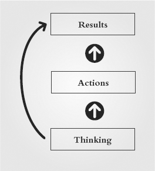
:::

In the long run, your actions are always congruent with your underlying thinking. When you focus on changing your actions, you experience incremental improvements; however, when your thinking shifts---everything changes. Your actions naturally realign with your new thought patterns. This is how breakthroughs are created. Breakthrough results don't start with your actions, they are first created in your thinking. Herein lies the power of the 12 Week Year; it shifts your mind-set, thereby creating opportunities for breakthrough.

The result is a heightened sense of urgency and an increased focus on the critical few, those important core activities that drive success and fulfillment, and the daily execution of those items to guarantee the achievement of your long-term objectives. The 12 Week Year provides the tools and focus for individuals and organizations to be highly successful. It creates a sense of clarity regarding what is important, and a sense of urgency each day to do what is necessary. Furthermore, it addresses harvesting today's opportunities and also planting the essential seeds necessary to ensure continued success.

# 12 Weeks Equals a Year

Forget about a year. By now you can see the pitfalls associated with annualized thinking. Let's redefine a year: A year is no longer 12 months, it is now only 12 weeks. That's right, a year is now a 12 week period. There are no longer four periods in a year; that's old thinking. Now, there is just a 12 Week Year, followed by the next 12 Week Year, ad infinitum. Each 12 week period stands on its own---it is your year.

Think about the implications of a 12 Week Year. The excitement, energy, and focus that happen every December now happen continuously. The year-end push to hit your goals now happens not once every 12 months, but all the time. The reason people start to behave differently in November and December is because they know that come December 31, they will measure their success or failure. As I pointed out earlier, December 31 is an arbitrary date, but since it marks the end of the calendar year it seems like a good time to take stock. There is nothing magical about this date other than the significance we give it. We have clients whose fiscal year ends on June 30 and they experience a surge in June as the organization strives to close out the year with a strong finish. The date is largely immaterial; what matters is that there is a point in time where the game ends and success or failure is proclaimed.

The 12 Week Year creates a new endgame date for you to assess your success (or lack thereof). The great thing about having a 12 Week Year is that the deadline is always near enough that you never lose sight of it. It provides a time horizon that is long enough to get things done, yet short enough to create a sense of urgency and a bias for action. It's human nature that we behave differently when a deadline approaches. We procrastinate less, we reduce or eliminate avoidance activity, and we focus more on the things that matter.

The 12 Week Year also forces you to confront your lack of execution. After all, how many bad weeks can you have in a 12 Week Year and still have a great year? Since you can't afford to have more than one or two bad weeks, every day of the week automatically becomes more important.

The 12 Week Year narrows your focus to the week and, more to the point, the day, which is where execution occurs. You no longer have the luxury of putting off the critical activities, imagining that there is plenty of time left in the year. Effective execution does not happen monthly, quarterly, or semi-annually; it happens daily, ultimately moment by moment. The 12 Week Year brings that reality front and center.

In addition, you now experience the anticipation of a new year every 12 weeks. In the past if an individual had set a stretch goal for the year that by the third quarter had clearly become unattainable, the lack of achievement became demoralizing. It's not uncommon for individuals and even entire teams to have mentally given up on their goals before October. With the 12 Week Year, that will never happen again. Every 12 weeks you get a fresh start---a new year! So if you've had a tough 12 Week Year you can just shake it off, regroup, and start again. If you've had a strong 12 Week Year you can build on that momentum. Either way, every 12 weeks is a new start.

::: {}

------------------------------------------------------------------------
:::

::::: {}
::: {}
"The 12 Week Year changes everything!"
:::

::: {}

------------------------------------------------------------------------
:::
:::::

And just like you do at the end of a calendar year, every 12 weeks you take a break, celebrate, and reload. It might be a three-day weekend or a weeklong vacation; the important thing is that you take time out to reflect, regroup, and reenergize. For success-oriented people it's easy to look at what lies ahead and not fully appreciate the ground already covered. The 12 Week Year presents, at a minimum, four times as many opportunities to recognize and celebrate your progress and accomplishments.

Focusing on a 12 Week Year keeps you from getting ahead of yourself and ensures that each week counts.

# Chapter 3

# The Emotional Connection

Effective execution isn't complicated, but it's not necessarily easy, either. In fact, most people and companies struggle to execute well. Execution invariably requires taking new actions, and new actions are often uncomfortable.

When faced with a course of action that includes difficult or uncomfortable tasks, the short-term costs of taking action can seem so much greater than the long-term benefits of reaching the goal. Because of this, individuals and entire organizations often abandon both the tasks, and ultimately, the entire strategy. We have found from experience that to execute successfully it is essential to have a strong emotional stake in the outcome.

Without a compelling reason to choose otherwise, most people will take comfortable actions over uncomfortable ones. The issue is that the important actions are often the uncomfortable ones. In our experience, the number-one thing that you will have to sacrifice to be great, to achieve what you are capable of, and to execute your plans, is your comfort. The secret to living your life to its potential is to value the important stuff above your own comfort. Therefore, the critical first step to executing well is creating and maintaining a compelling vision of the future that you want even more than you desire your own short-term comfort, and then aligning your shorter term goals and plans, with that long-term vision.

Think about what you truly want to achieve. What legacy do you want to create? What do you want for yourself and for your family? What do you want spiritually? What level of security do you seek? What level of income and fulfillment do you want from your career? What interests do you wish you could pursue? What do you really want to do with the time you have been allotted?

If you are going to perform at a high level, take new ground, and be great, then you better have a vision that is compelling. In order to achieve a level of performance that is greater than your current performance, you will need a vision of the future that is bigger than the present. You must find a vision with which you are emotionally connected. Without a compelling vision, you will discover there is no reason to go through the pain of change.

::: {}

------------------------------------------------------------------------
:::

:::::: {}
::: {}
"Behind every impossible achievement is a dreamer of impossible dreams."
:::

::: {}
---Robert K. Greenleaf
:::

::: {}

------------------------------------------------------------------------
:::
::::::

Vision is the starting point of all high performance. You create things twice; first mentally, then physically. The biggest barrier to high performance is not the physical manifestation but the mental creation. You will never outpace your mental models. Vision is the first place where you engage your thinking about what is possible for you.

You must be clear on what it is you want to create. Most people focus primarily on their business or career, but business is just part of life, and it is actually your life vision that gives traction and relevance to your business. That is why we begin with your personal vision, what you want your life to look like in the future. After that is established, we move on to what your business needs to look like in order to align with and enable your personal vision. The more personally compelling your vision is, the more likely it is that you will act upon it. It is your personal vision that creates an emotional connection to the daily actions that need to take place in your business.

In order to tap the incredible power of your vision you need a future that is bigger than the present. If you're going to create a breakthrough---if you're going to reach the next level---you will need to move through fear, uncertainty, and discomfort. It is your personal vision that keeps you in the game when things become difficult.

A compelling personal vision creates passion. Think about something that you are passionate about, and you will always find a clear vision behind it. If you find you're lacking passion in either your business or in a relationship, it's not a crisis of passion; it's a crisis of vision. We will show you how to craft a compelling personal vision and a business vision that aligns with and supports your life goals.

::: {}

------------------------------------------------------------------------
:::

:::::: {}
::: {}
"All my life I wanted to be somebody. Now I see I should have been more specific."
:::

::: {}
---Lily Tomlin
:::

::: {}

------------------------------------------------------------------------
:::
::::::

The first step is to create a personal vision, a vision that clearly captures and articulates what you want in life. The personal vision should define the life you want to live in all areas, including spiritual, relationships, family, income, lifestyle, health, and community. The personal vision creates the foundation for an emotional link to your business and career objectives so that there is a strong alignment between what you pursue in your business and the life you desire to live.

Your business vision is most powerful when it is developed in light of your personal vision. The reason so many people fail to follow through when things become difficult is due to this lack of connection with their personal lives.

Your business objectives are not the end in themselves, but the means to an end. Too often, managers and associates plan for business success but fail to connect with the real power source that will enable them to achieve that success. In essence, the personal vision is the reason why we work in the first place.

Once you understand the linkage between your life vision and your business success, you can define exactly what level of income or production your business must deliver in order to support your complete vision.

Vision provides you with that line of sight, that emotional link, to help you overcome the challenges and execute. When the task seems too difficult or unpleasant, you can reconnect with your personal objections and vision. It is this emotional connection that will provide you with the inner strength to forge ahead in spite of any difficulties, thus enabling you to achieve your dreams and desires.

# Your Brain and Vision

The brain is an amazing organ. As David Frost once pointed out "It starts working the moment you get up in the morning and doesn't stop until you get into work."

Our brains are wonderful, powerful, and inconsistent. Due to its multiple functions, sometimes your brain can seem to be working at cross-purposes with itself. Have you ever felt like your brain was in conflict with itself? If so, you're not alone (or crazy). There is some groundbreaking research that explains what you're experiencing and offers powerful insights on how you can use your brain more effectively to live the life you desire.

Researchers have found that a portion of the brain, the amygdala, reacts negatively when we are facing uncertainty and risk. This response is quite helpful in avoiding danger and staying alive. Unfortunately, when we imagine the future as being vastly different from today, we experience uncertainty because we don't know how to create and maintain the future we are imagining. When this happens the amygdala kicks in.

That's when the part of our brain that avoids risk gets in our way. It seeks to keep us out of uncertain and risky situations. When you start to envision a future that stretches your comfort zone and is significantly bigger and bolder than what you are currently living, the amygdala tries to shut down the process before you do anything that could be detrimental.

That's the bad news. At one level we are all wired to resist change and postpone greatness. The good news is there is also a portion of your brain, called the prefrontal cortex (PFC) that acts as a counterbalance to the amygdala. The PFC lights up when you look out over open vistas, and interestingly, when you imagine greatness for yourself in the future. Scientists can track increased electrical impulses in the PFCs of test subjects when they think about a compelling future.

Research has also shown that our brains have a powerful capacity to change. In the past, scientists thought that our brains were essentially static after we became adults, but they now know that the brain can change over time. The areas that we use frequently actually grow in the density of neural connections and in size.

This capacity for our brains to change is called neuroplasticity. Here's why it's such a big deal: Your brain has the ability to change and develop physiologically, and it does so based on how you use it.

That is good news and bad news. The bad news is that unless you intentionally engage the PFC, you are by default, relatively strengthening the portion of your brain that resists change and keeps you stuck. The good news is that you can change your brain simply by what you think about. You have the ability to strengthen and develop your brain by thinking about a compelling future for yourself, by regularly and repeatedly thinking about an inspiring vision where you emotionally connect with the life you desire.

And here's what may be the best part; when you think about a compelling vision, the neurons that fire in your brain are the same neurons that fire when you act on your vision. What that means is that you can literally train your brain to act on your vision just by thinking about it. The first step, though, is creating an inspiring vision and learning how to stay connected with it.

::: {}

------------------------------------------------------------------------
:::

:::::: {}
::: {}
"Tell me, what is it you plan to do with your one wild and precious life?"
:::

::: {}
---Mary Oliver
:::

::: {}

------------------------------------------------------------------------
:::
::::::

# Chapter 4

# Throw Out the Annual Plan

Once you have a clear vision of where you want to go, you will need a plan to get there. Imagine yourself driving across country on a family vacation without a map. You will probably agree that this is not a good idea!

::: {}

------------------------------------------------------------------------
:::

::::: {}
::: {}
"A vision without a plan is a pipe dream."
:::

::: {}

------------------------------------------------------------------------
:::
:::::

Having a plan to achieve your vision and your professional goals is even more essential than having a map to navigate a cross-country trek. Yet the sad truth is that most individuals spend more time planning a trip than they do planning their business.

Working from a plan has three distinct benefits:

:::::: {}
::: {}
1. It reduces mistakes.
:::

::: {}
2. It saves time.
:::

::: {}
3. It provides focus.
:::
::::::

Planning allows you to think through in advance the best approach to achieving your goals. You make your mistakes on paper, which reduces miscues during implementation.

In addition, studies have shown that planning saves significant time and resources. This may seem paradoxical. In fact, many people feel that if they are not constantly doing, they are not productive. The reality is that planning is some of the most productive time you can have.

Finally, planning---like a good road map---keeps you focused and on purpose. This is vital, as there are all kinds of day-to-day distractions to pull you off course. Your plan continually brings you back to the strategically important items.

# 12 Week Planning

Like no other approach that we are aware of, 12 week planning delivers these benefits and then some over traditional annual planning. We're not talking about quarterly planning---remember, that's part of the outdated annualized-thinking model. With 12 week planning, every 12 weeks stands alone; every 12 weeks is a new year and a fresh opportunity to be great.

Twelve week planning also offers three additional and distinct differences from annual planning. The first thing that is different with 12 week planning is that it is more predictable than 12 month planning. The farther you plan into the future, the less predictability you have. With long-term plans, assumptions are stacked upon earlier assumptions, which are stacked upon even earlier assumptions. If you're that good at predicting the future, call me; I'd love to talk to you about your stock picks!

The reality is that it is very difficult, if not impossible, to determine what your daily actions should be 11 or 12 months into the future. That is why annual plans are generally objective-based.

With a 12 week plan, predictability is much greater. You can define, with a high degree of certainty, what actions you need to implement each week over the next 12 weeks. Twelve week plans are both numbers- and activity-based. They create a strong connection between the actions you take today and the results you want to achieve.

The second difference with 12 week planning is that it is more focused. Most annual plans have too many objectives, which is one of the primary reasons execution fails. The reason most plans contain so much is because you're planning for 12 months, laying out all the things you want to achieve over the next 365 days. It's no wonder you become disillusioned and frustrated. You end up spread too thin and diffused---not a recipe for greatness.

There will always be more opportunities than you can effectively pursue. With the 12 Week Year, the approach is to be great at a few things instead of mediocre at many things. In 12 week planning, you identify the top one to three things that will have the greatest impact, and pursue those with intensity. The 12 week plan focuses on a few key areas and creates the energy and urgency to act.

The third thing that is different with 12 week plans is the structure. In our experience, most plans are written with the unspoken goal of just developing a good plan. Most often these plans are then placed in a nice binder and rarely get implemented.

# Setting Goals

The whole point of planning should be to help you identify and implement the critical few actions that you need to take to reach your goal. If planning didn't help you execute better, there would be no reason to plan. However, the sad fact is that most plans are not written with implementation in mind. The way the plan is structured and how it is written impacts your ability to effectively execute. Effective planning strikes a working balance between too much complexity and too little detail. Your plan should start by identifying your overall goal(s) for the 12 weeks. The goal defines success for the 12 Week Year. It represents a great 12 weeks, and also represents intentional progress toward your longer-term vision.

::: {}

------------------------------------------------------------------------
:::

:::::: {}
::: {}
"If you don't know where you are going, you'll end up someplace else."
:::

::: {}
---Yogi Berra
:::

::: {}

------------------------------------------------------------------------
:::
::::::

Once you have established your 12 week goals, tactics will then need to be determined. The easiest way to do this is to break your 12 week goal down to its individual parts. For example, if your 12 week goal is to earn \$10,000 and lose 10 pounds, you should write tactics for your income goal and your weight loss goal separately. Tactics are the daily to-do's that drive the attainment of your goals. Tactics must be specific, actionable, and include due dates and assigned responsibilities. We'll have more to say on how to write effective tactics a little later in the application section.

The 12 week plan is structured so that if the tactics are completed on a timely basis the goals are achieved. Remember, in order to keep from losing your way with a 12 week focus, you will need to align your 12 week plan to your longer-term vision.

A 12 week plan is powerful. It allows you to focus on what's important now. Remember that the 12 week plan is not part of an annual plan; that's old annualized thinking.

Twelve weeks is long enough to get things done, and yet is short enough to create and maintain a sense of urgency. For top performers, 12 week plans provide a step-by-step road map that eliminates diffusion and delays, and demands immediate action.

::: {}

------------------------------------------------------------------------
:::

::::: {}
::: {}
For actual examples of 12 week plans join the 12 Week Year community at [www.12weekyear.com/gettingstarted](http://www.12weekyear.com/gettingstarted). It's free!
:::

::: {}

------------------------------------------------------------------------
:::
:::::

# Chapter 5

# One Week at a Time

Long-term results are created by the actions you take every day. Sir William Osler, founder of Johns Hopkins School of Medicine, said that the secret of his success was living his life in "day-tight compartments." What he found was that, while we plan for the future, we act in the day. To be truly effective, your daily activity must align with your long-term vision, strategies, and tactics.

In the end, you have greater control over your actions than you do your results. Your results are created by your actions. That's why it is so important to construct plans that are not only numbers-based, but also identify specific, critical activity.

::: {}

------------------------------------------------------------------------
:::

::::: {}
::: {}
"The greatest predictor of your future are your daily actions."
:::

::: {}

------------------------------------------------------------------------
:::
:::::

The physical universe will not respond to your desires, no matter how passionate or intense they are. The one thing that moves the universe is action. As we discussed earlier, vision matters in that it defines the end game and the overall direction you want to go. Vision also provides the motivation to act, but vision without action is just a dream. It is the consistent action that turns a dream into reality.

This is where progress most often breaks down. Most of us aspire to improve some area of our lives. Whether you want to earn more money, find a new job, meet the right mate, lose a few pounds, improve a relationship, or be a better golfer, parent, or person, desire alone is not enough.

It's not enough to have the intention of changing; you have to act on that intention for things to get better---and not just once, but consistently. As the ancient Roman philosopher Lucretius pointed out: "The fall of dropping water wears away the stone." Consistent action on the critical tasks needed to reach your goal is the key to getting what you want in life.

Your current actions are creating your future. If you want to know what your future holds, look to your actions; they are the best predictor of your future. You want to predict your future health, look at your current eating and exercise habits. You want to predict the health of your marriage, look at your interactions with your spouse. You want to predict your career path and future income, look at the actions you take each business day. Your actions tell the story.

# The Weekly Plan

::: {}

------------------------------------------------------------------------
:::

:::::: {}
::: {}
"An ounce of action is worth a ton of theory."
:::

::: {}
---Ralph Waldo Emerson
:::

::: {}

------------------------------------------------------------------------
:::
::::::

The weekly plan is a powerful tool that translates your 12 week plan into daily and weekly action. The weekly plan is the instrument that organizes and focuses your week. It becomes your weekly game plan. This will keep you on track with your core activity each day. Weekly plans allow you to structure your activities so that you are focused on both the long-term and short-term tasks that are truly important. This allows you to stay focused and productive in the moment instead of getting caught up in all the noise and distractions that easily derail you.

The weekly plan is not a glorified to-do list; rather it reflects the critical strategic activity from your 12 week plan that needs to take place this week in order for you to achieve your goals.

The starting point for an effective weekly plan is your 12 week plan. The 12 week plan contains all of the tactics you need to execute in order to achieve your 12 week goals. Each tactic has a designated week for completion, and these tactics drive your weekly plan by dictating your daily actions. The weekly plan then is simply a derivative of the 12 week plan---in essence a one-twelfth slice of the 12 week plan.

To use your weekly plan effectively, you will need to spend the first 15 or 20 minutes at the beginning of each week to review your progress from the past week and plan the upcoming one. In addition, the first five minutes of each day should be spent reviewing your weekly plan to plan that day's activities.

A 12 Week Year creates greater focus by highlighting the value of each week. With the 12 Week Year, a year is now equivalent to 12 weeks, a month is now a week, and a week is now a day. When you look at it this way, the importance and power of each day becomes even greater. Your weekly plan enables you to focus your actions and be great at a few things rather than mediocre at many. To ensure that you get the most from your efforts, a weekly plan is a powerful and indispensable tool.

Your weekly plan encompasses your strategies and priorities, your long-term and short-term tasks, and your commitments in the context of time. It helps you focus on the elements of your plan that must happen each week to keep you on track with your 12 Week Year goals. Your goals in turn keep you on track with your vision. Everything is powerfully aligned.

To really benefit from this tool you will need to carry it with you and work from it on a daily basis. Start each day with your weekly plan. Check in with it several times throughout the day. If you've scheduled a tactic to be completed that day, don't go home until it is done. This ensures that the critically important tasks, your plan tactics, are completed each week.

Visit our website at [www.12WeekYear.com](http://www.12WeekYear.com) to see a sample of a weekly plan and the other tools in our Achieve! website. The weekly plan, more than any other tool, will help you execute on a daily and weekly basis and will help you achieve your vision!

# Chapter 6

# Confronting the Truth

Have you ever wondered why sports are so motivating? In fact, not only are they motivating to the players, but also to spectators. Can you imagine people---fans---coming to watch you work, paying for the privilege to see you in action? One of the key reasons sports are so stimulating is that we keep score.

Scorekeeping is at the heart of competition. We keep track of scores, measurements, and stats to determine success and identify areas for improvement. At any point during a sporting event, every player, coach, and fan knows exactly where their team stands. This information provides a base of knowledge to guide decisions that lead to better performance and success. In other words, scorekeeping lets us know if what we're doing is effective. Too often in business we fail to keep score, and without some objective measure, we cannot know for certain if we are being effective. Just as in athletics, measurement drives the business process.

In the 1960s Frederick Herzberg, an industrial psychologist, set out to determine what motivates people in the workplace. His extensive research identified the top two motivators as achievement and recognition. We contend that the only way to know if you are achieving is through measurement---that is, keeping score. A common misconception is that scoring damages self-esteem, but research indicates the opposite: Measurement builds self-esteem and confidence because it documents progress and achievement.

# Measuring Results

Scorekeeping functions as a reality check, providing performance feedback and insight into your effectiveness. Effective measurement removes the emotion from the evaluation process and paints an honest picture of your performance. The data is not concerned with effort or intentions; it simply focuses on outcomes.

We all have a tendency from time to time to rationalize lackluster results, but with effective scorekeeping we are forced to confront the reality of our situation, even when it's uncomfortable. While this can be difficult, the sooner we confront reality, the sooner we can shift our actions toward producing more desirable results. That's what effective measurement does; it demands our attention and causes us to respond more immediately, increasing the likelihood of success down the road.

::: {}

------------------------------------------------------------------------
:::

:::::: {}
::: {}
"In God we trust; all others must bring data."
:::

::: {}
---W. Edwards Deming
:::

::: {}

------------------------------------------------------------------------
:::
::::::

Measurement drives the execution process. It is the anchor of reality. Can you imagine the CEO of a large corporation not knowing the numbers? It's no different for you and me. As the CEO of your own life and business, you need to know the numbers. Measurement provides important feedback that allows you to make intelligent decisions.

Effective measurement captures both lead and lag indicators that provide comprehensive feedback necessary for informed decision making. Lag indicators---things like income, sales, commission dollars, pounds lost, body fat percentage, overall cholesterol levels---represent the end results that you are striving to achieve. Lead indicators are the activities that produce the end results---for instance the number of sales calls, or referrals are lead indicators in the sales process. While most companies and individuals effectively measure lag indicators, many tend to disregard lead indicators. An effective measurement system will have a combination of complementary lead and lag indicators.

The most important lead indicator you have is a measure of your execution. Ultimately, you have greater control over your actions than over your results. Your results are created by your actions. An execution measure indicates whether you did the things you said were most important to achieving your goals.

Keep in mind that you started with a vision, a compelling vision of the future that is bigger than the present. Then you established a set of 12 week goals that are aligned with that vision. For each goal, you developed actions or tactics that describe the steps that you must take to achieve your goals. The element you have the most direct control over is the execution of your tactics. Knowing to what degree you followed through on those tactics is the execution measure. Because your 12 week goals were established in light of your longer-term vision, the execution measure also represents progress toward your vision.

Having a way to measure your execution is critical because it allows you to pinpoint breakdowns and respond quickly. Unlike results, which can lag weeks, months, and in some cases years behind your actions, an execution measure provides more immediate feedback, which allows you to make game-time adjustments much faster. An execution measure is important for another reason as well. If you are not hitting your goal, you need to know whether it is due to a flaw in plan content or in execution, because there is a big difference in how to handle these two breakdowns. A breakdown in plan content occurs when strategies and tactics are not effective, while a breakdown in execution occurs when you fail to fully implement the plan tactics.

More than 60 percent of the time the breakdown occurs in the execution process, but usually people assume the plan is at fault and change it. This is a mistake, because you don't know if the plan doesn't work if you're not working the plan. Effective measurement will help you pinpoint the source of the breakdown so that you can address it head-on. In most cases, unless you are executing at a reasonably high level, there is no need to change or adjust your plan. The great thing is that every time you execute, you get feedback. If your actions don't produce what you expected, you can make the necessary adjustments to your plan based on market feedback---but first you must execute the plan. Too often people want to change the plan before they've really executed it. As a general rule, you should rarely change the plan unless you've been effectively completing your plan tactics and it is still not producing. You could have created an awesome plan, but you'll never know unless you actually implement it.

However, if you are executing at a high level and the results you want are not coming, then it's time to go back and adjust the plan. Physics tells us that for every action there is a reaction, so the good news is that every time you execute, you produce something---it may not be what you expected, but something will happen. This something is market feedback, and it's impossible to effectively adjust your plan without it. Without knowing what tactics you executed, any changes you make will be based purely on guesswork.

::: {}

------------------------------------------------------------------------
:::

:::::: {}
::: {}
"Truth is the only safe ground to stand on."
:::

::: {}
---Elizabeth Cady Stanton
:::

::: {}

------------------------------------------------------------------------
:::
::::::

# Weekly Scorecard

The best way to measure your execution is to work from a weekly plan (based upon your 12 Week Plan) and evaluate the percentage of tactics completed. For the 12 Week Year we've developed a tool called the Weekly Scorecard. If you've followed the process thus far, you understand that the weekly plan represents the critical activities that you need to accomplish each week to achieve your overall goals. The weekly scorecard then provides an objective measure of how well you executed your weekly plan. With the weekly scorecard you measure execution, not results. You score yourself on the percentage of activities you complete each week.

We urge you to strive for excellence, not perfection. We have found that if you successfully complete 85 percent of the activities in your weekly plan, then you will most likely achieve your objectives. Remember that your plan contains the top priorities that will add the most value and have the greatest impact. In other words, you only need to be 85 percent effective on the top priorities to achieve excellence!

A word of caution: Scorekeeping is not for the faint of heart. There will be times when you don't execute well and score poorly. People often drop out when they reach this point because they lack the courage to face the reality of their actions. Instead of scoring their performance, they distract themselves with other things that seem important in the moment. With the 12 Week Year there is nowhere to hide. It shines a light on where you are performing and where you are not. All of us, from time to time, will struggle to execute. The 12 Week Year system forces you to confront your lack of execution---and it's uncomfortable, but it is the very thing that is required if you're going to perform at your best. We call this discomfort productive tension.

Productive tension is the uncomfortable feeling you get when you're not doing the things you know you need to do. Our natural inclination when confronted with discomfort is to resolve it. In an effort to do this, people generally go one of two ways. The easy way out is to simply stop using the system and turn off the light that is shining on your performance breakdowns. Typically, this takes the form of passive resistance and you put off scoring your week and tell yourself that you'll get to it later, but later never comes.

The other way is to use productive tension as a catalyst for change. Instead of responding to the discomfort by bailing out, high achievers use the tension as an impetus to move forward. If you decide that quitting is not an option, then the discomfort of productive tension will eventually compel you to take action on your tactics. This encourages you to move forward by executing your plan.

Even with a weekly score of 65 to 70 percent you will do well if you stay in the game. You won't accomplish what you are capable of, but you will do well. It's important to remember that the process is not about being perfect, but rather about getting better and better.

Measurement drives the process. Effective scorekeeping is essential if you want to execute well and perform at your best. Take time to establish a set of key measures that include lead and lag indicators and, most importantly, be sure to score your execution. Have the courage to measure your performance!

# Chapter 7

# Intentionality

Everything you want to accomplish in life requires an investment of your time, so when you want to improve your results, you must face the fact that your supply of time is completely inelastic---and perishable.

Even in this era of rapid innovation and technological advancement, time, more than any other resource, still limits our results. When we ask our clients what keeps them from achieving more, most often we hear that it's a lack of time---and yet, time is the most squandered of all personal resources. A study conducted a few years ago by [Salary.com](http://Salary.com) found that the average person wastes nearly two hours of every working day!

# The Importance of Yes and No

The reality is that if you are not purposeful about how you spend your time, then you leave your results to chance. While it's true that we control our actions and not our outcomes, our results are created by our actions. It stands to reason that the actions that we choose to take throughout our day ultimately determine our destiny.

In spite of the priceless value of time, many people engage each day on its own terms. In other words, they satisfy the various demands of the day as they are presented, spending whatever time is needed to respond without giving much thought as to the relative value of the activity. This is a reactive approach in which the day is controlling you, and prevents you from performing at your best.

To realize your potential, you must learn to be more mindful about how you spend your time. Living with clear intention goes against the powerful natural tendency to be reactive because it requires you to organize your life around your priorities and consciously choose those activities that align with your goals and vision.

When you spend your time with intention, you know when to say yes and when to say no. You are probably aware when you are procrastinating or engaging in low-level activity to avoid tackling a less comfortable high-payoff activity. When you use your time intentionally, you waste less of it and spend more of it on your high-value actions, but to do this you must be willing to be disciplined and structure your days and weeks. The best way to do this is to use your 12 week plan to drive your activity so that in the end, you set your goals for the day instead of letting the day direct you. Intentionality is your secret weapon in your war on mediocrity.

::: {}

------------------------------------------------------------------------
:::

:::::: {}
::: {}
"It's not enough to be busy; so are the ants. The question is: What are we busy about?"
:::

::: {}
---Henry David Thoreau
:::

::: {}

------------------------------------------------------------------------
:::
::::::

# Blocking Your Time

Benjamin Franklin said, "If we take care of the minutes, the years will take care of themselves." That is wise counsel. The challenge in applying this wisdom is that throughout the day things come up---things that you didn't anticipate that will eat up your valuable minutes.

Trying to reduce these interruptions usually doesn't work well and it can be more difficult than just dealing with them. In our opinion, the key to successful time use---intentional time use---is not trying to eliminate these unplanned interruptions, but instead to block out regular time each week dedicated to your strategically important tasks. We call this Performance Time and find that it is the best approach to effectively allocating time that we have ever encountered. It utilizes a simple time-blocking system to regain control of your day and maximize your effectiveness.

There are three primary components of performance time: strategic blocks, buffer blocks, and breakout blocks.

::::::::: {}
:::: {}
Strategic Blocks: A strategic block is a three-hour block of uninterrupted time that is scheduled into each week. During this block you accept no phone calls, no faxes, no emails, no visitors, no anything. Instead, you focus all of your energy on preplanned tasks---your strategic and money-making activities.

::: {}
Strategic blocks concentrate your intellect and creativity to produce breakthrough results. You will likely be astounded by the quantity and quality of the work you produce. For most people, one strategic block per week is sufficient.
:::
::::

:::: {}
Buffer Blocks: Buffer blocks are designed to deal with all of the unplanned and low-value activities---like most email and voicemail---that arise throughout a typical day. Almost nothing is more unproductive and frustrating than dealing with constant interruptions, yet we've all had days when unplanned items dominated our time.

::: {}
For some, one 30-minute buffer block a day is sufficient, while for others, two separate one-hour blocks may be necessary. The power of buffer blocks comes from grouping together activities that tend to be unproductive so that you can increase your efficiency in dealing with them and take greater control over the rest of your day.
:::
::::

:::: {}
Breakout Blocks: One of the key factors contributing to performance plateaus is the absence of free time. Very often entrepreneurs and professionals get caught up in working longer and harder, but this approach kills your energy and enthusiasm. To achieve greater results, what's often necessary is not actually working more hours, but rather taking some time away from work. It's not by chance that people often quote the famous proverb "All work and no play makes Jack a dull boy." When we don't take time off from work, we can lose our creative edge.

::: {}
An effective breakout block is at least three-hours long and spent on things other than work. It is time scheduled away from your business during normal business hours that you will use to refresh and reinvigorate your mind, so that when you return to work, you can engage with more focus and energy.
:::
::::
:::::::::

::: {}

------------------------------------------------------------------------
:::

::::: {}
::: {}
"If you are not in control of your time, you are not in control of your results."
:::

::: {}

------------------------------------------------------------------------
:::
:::::

Performance time applies to more than just strategic, buffer, and breakout blocks. The more you can create routine in your days and weeks, the more effective your execution will be. The best way to accomplish this is to create a picture of an ideal week.

The concept of an ideal week is to plan on paper all the critical tasks that occur in a typical week and organize them so you can be most productive. If you can't fit all the things you do on paper, there is no way you will get them done in reality, so the exercise of strategically planning your week will cause you to make some hard choices about how you use your time.

As you create your ideal week, it helps to schedule routine tasks at the same time, on the same day each week, if possible. Consider when you tend to be at your best. Are you a morning person or are you better in the afternoon or evening? Schedule your most important activities during your prime time. We will walk you through how to create your model week in Chapter 17.

For many of our clients, performance time has had an immediate impact on results. Just gaining control over a few hours each week often has a dramatic effect. Learn to use your time with greater intention and you will not only be more effective, but you will also feel a greater sense of control, less stress, and increased confidence.

::: {}

------------------------------------------------------------------------
:::

::::: {}
::: {}
For more on time blocking join the 12 Week Year community at [www.12weekyear.com/gettingstarted](http://www.12weekyear.com/gettingstarted). It's free!
:::

::: {}

------------------------------------------------------------------------
:::
:::::

# Chapter 8

# Accountability as Ownership

Accountability is perhaps the most misunderstood concept in business and life. Most people equate it with bad behavior, poor performance, and negative consequences. As an example, when an athlete does something in violation of the league's conduct policy, the commissioner will state publicly that the league will hold this athlete accountable and then issues a fine or suspension. It's no wonder that most people want nothing to do with accountability.

::: {}

------------------------------------------------------------------------
:::

:::::: {}
::: {}
"Our last free act---after which no further free acts are possible---is to deny that we are free."
:::

::: {}
---Peter Koestenbaum
:::

::: {}

------------------------------------------------------------------------
:::
::::::

People often talk about holding others accountable, especially in business situations. Often you'll hear management say something like, "We need to do a better job of holding people accountable." I've even heard individuals who truly desire to perform better say, "I just need someone to hold me accountable." These types of statements reflect the mistaken notion that accountability is something that can and must be imposed; that's not accountability, that's consequences. In fact, it is impossible to hold someone else accountable. I like to joke that you can hold a baby and you can hold a bag of groceries, but you can't hold someone accountable.

Accountability is not consequences, but ownership. It is a character trait, a life stance, a willingness to own your actions and results regardless of the circumstances. In the book Freedom and Accountability at Work: Applying Philosophic Insight to the Real World, the authors Peter Koestenbaum and Peter Block discuss accountability as follows:

We have a small way of thinking about accountability. We think that people want to escape from being accountable. We believe that accountability is something that must be imposed. We have to hold people accountable, and we devise reward and punishment schemes to do this. These beliefs are so dominant in our culture that they are difficult to question, yet they are the very beliefs that keep us from experiencing what we long for.

The very nature of accountability rests in the understanding that each and every one of us has freedom of choice. It is this freedom of choice that is the foundation of accountability.

Accountability is the realization that you always have choice; that, in fact, there are no have-to's in life. Have-to's are those things we hate to do but do anyway because we have to. The fact is that there are no have-to's. Everything we do in life is a choice. Even in an environment where there are requirements of you, you still have choice, but there is a big difference when you approach something as a choose-to versus a have-to. When something is a have-to it's a burden, it's cumbersome, and, at best, you meet the minimum standards; however, the realization that you ultimately have choice creates a very different scenario. When you choose to do something, you are able to tap your resources and give your best. It is a much more empowering stance. Ultimately, you choose your actions, your results, your consequences.

::: {}

------------------------------------------------------------------------
:::

::::: {}
::: {}
"Accountability is not consequences; it's ownership."
:::

::: {}

------------------------------------------------------------------------
:::
:::::

All of us have a tendency to look outside of ourselves for things to change and improve. We are waiting for the economy to pick up, for the housing market to turn around, or for our company to come up with a new product, more competitive pricing, or better advertising. It's easy to become a victim to outside circumstances, spending time and energy hoping and imagining what our lives would be like if the world around us were different, believing that these are the keys to improving our results. The truth is you don't control any of these things. The only things you control are your thinking and your actions. But those are enough if (and it's a big if) you are willing to own them.

Don't get the wrong impression that somehow accountability as we've described it here is passive. It's quite the contrary. True accountability actively confronts the truth, it confronts with freedom of choice and the consequences of those choices. In this way accountability is extremely empowering, but you must be willing to confront reality and the truth of your situation.

How you view accountability and to what degree you embrace it affects everything you do, from your relationships to your ability to execute effectively. When you understand that true accountability is about choice and taking ownership of your choices, everything changes. You move from resistance to empowerment, from limits to possibilities, and from mediocrity to greatness.

At the end of the day, the only accountability that truly exists is self-accountability. The only person who can hold you accountable for anything is you, and to be successful you must develop the mental honesty and courage to own your thinking, actions, and results.

# Chapter 9

# Interest versus Commitment

Commitments are a powerful part of the 12 Week Year. An ability to make and keep commitments improves results, builds trust, and fosters high-performance teams, yet many of us avoid making commitments, and worse yet, we often break them when the going gets tough. To be truly great at what we do, we have to become better at keeping our promises.

::: {}

------------------------------------------------------------------------
:::

:::::: {}
::: {}
"Commitment is an act, not a word."
:::

::: {}
---Jean-Paul Sartre
:::

::: {}

------------------------------------------------------------------------
:::
::::::

There is an old anecdote about commitments involving a chicken and a pig at breakfast time. The chicken has contributed the egg and is therefore merely interested in the breakfast; the pig, however, contributes the bacon, and is thus completely committed. It's a humorous story, but ultimately paints a negative picture of commitment. In reality, kept commitments benefit both parties involved by improving relationships, strengthening integrity, and building self-confidence. Commitments are powerful and, oftentimes, life changing.

I'm sure you can recall a time when you were determined to accomplish something meaningful and you were willing to do whatever it took to make it happen. One of the most powerful commitments that I have ever made was to my father. It was the summer after my first year of college and I remember the conversation like it was yesterday. The two of us were working in his garden, talking about my freshman year. It quickly became apparent to me during that conversation that my father and I had different perspectives on the purpose of college.

The issue was my grades. I was on the dean's list, but unfortunately for me, the dean kept two lists, and I was on the one for academic probation. My father explained that he was unwilling to continue helping with tuition unless my results improved. I felt terrible and made a commitment that day to my father and myself. I promised him that when I went back to school in the fall, I would get all A's. He challenged me to meet my commitment by adding to the stakes: If I did get all A's, he would give me \$500; if I didn't, I would owe him \$500.

When I went back to school that fall, I pulled out all the stops. I went to class, took notes in lectures, read the texts, and did the homework. I also stopped socializing as much as I had during my first year. In the end, I got the grades---straight A's. The \$500 is long gone, but that commitment changed my life. I started showing up on the real dean's list and I never went back.

My story is a great example of commitment. A commitment is a personal promise. Keeping your promises to others builds trust and strong relationships, and keeping promises to yourself builds character, esteem, and success.

::: {}

------------------------------------------------------------------------
:::

:::::: {}
::: {}
"Unless commitment is made, there are only promises and hopes; but no plans."
:::

::: {}
---Peter Drucker
:::

::: {}

------------------------------------------------------------------------
:::
::::::

A definition of commitment that I like is "the state of being bound emotionally or intellectually to a course of action. . ." (American Heritage Dictionary, Fourth Edition) From this perspective, a commitment is a conscious choice to act in order to create a desired result.

We all know intuitively that an ability to keep commitments is fundamental to effective execution and high performance, but many of us fall short of our commitments on a regular basis. It seems that when things get difficult, we find reasons why we can't keep our promises and we shift our focus to other activities. Often our interest wanes when things get tough. It is important to understand that there is a difference between interest and commitment: When you're interested in doing something, you do it only when circumstances permit, but when you're committed to something, you accept no excuses, only results.

When we commit to something, we do things that we would not ordinarily do. The question of if goes away and the only question you ask is how. Commitment is powerful, but there are times when all of us struggle to commit.

Here are the four keys to successful commitments:

:::::::: {}
::: {}
1. Strong desire: In order to fully commit to something, you need a clear and personally compelling reason. Without a strong desire you will struggle when the implementation gets difficult, but with a compelling desire, seemingly insurmountable obstacles are seen as challenges to be met. The desired end result needs to be meaningful enough to get you through the hard times and keep you on track.
:::

:::: {}
2. Keystone actions: Once you have an intense desire to accomplish something, you then need to identify the core actions that will produce the result you're after. In today's world, many of us have become spectators rather than participants. We must remember that it's what we do that counts.

::: {}
In most endeavors there are often many activities that help you accomplish your goal. However there are usually a few core activities that account for the majority of the results, and in some cases there are only one or two keystone actions that ultimately produce the result. It is critical that you identify these keystones and focus on them.
:::
::::

::: {}
3. Count the costs: Commitments require sacrifice. In any effort there are benefits and costs. Too often we claim to commit to something without considering the costs, the hardships that will have to be overcome to accomplish your desire. Costs can include time, money, risk, uncertainty, loss of comfort, and so on. Identifying the costs before you commit allows you to consciously choose whether you are willing to pay the price of your commitment. When you face any of these costs, it is extremely helpful to recognize that you anticipated them and decided that reaching your goal was worth it.
:::

::: {}
4. Act on commitments, not feelings: There will be times when you won't feel like doing the critical activities. We've all been there. Getting out of bed at 5:30 a.m. to jog in the winter cold can be daunting, especially when you're in a toasty warm bed. It is during these times that you will need to learn to act on your commitments instead of your feelings. If you don't, you will never build any momentum and will get stuck continually restarting or, as is so often the case, giving up. Learning to do the things you need to do, regardless of how you feel, is a core discipline for success.
:::
::::::::

Many times commitments are made more arduous by the time frame for which they are made. It is difficult to commit to anything for a lifetime---even keeping a promise for an entire year can be challenging. With the 12 Week Year you are not asked to make lifetime or even annual commitments, but rather 12 week commitments. It is much more feasible to establish and keep a commitment for 12 weeks than to keep it for 12 months. At the end of the 12 weeks, you reassess your commitments and begin again.

Our commitments ultimately shape our lives. They support sound marriages, create lasting relationships, drive our results, and help build our character. There is just something incredibly empowering about knowing if you say you're going to do something that you can count on yourself, that you don't need to hedge your bets.

# Chapter 10

# Greatness in the Moment

They say that with technology the world is now smaller; I think it's also moving faster. Life seems to be getting busier and speeding up.

Don't get me wrong; technology is great. My phone now has way more computing capability and usefulness than the first laptop I purchased in 1988 for about six grand. The downside is that we now have very little downtime in our day. It used to be that on the drive to and from work you could ramp up and ramp down, but now most people spend that time on the phone. The natural margin in our day is disappearing but we still need time to mentally relax.

In this hurried new world, multitasking has become a highly valued skill. The belief is that in order to get the most out of my day, I need to be fully scheduled, fully committed, and constantly on the run. The fear is that I might miss out on something good, so I hurry from one meeting or event to the next, squeezing in a phone call or two in between. When I'm in meetings, I'm constantly checking my email and messages because I don't want to miss anything, and with texting I can carry on two or three conversations at one time. Not many people would admit that this is the way they operate, but just look around you---this is the way most people behave.

In our efforts to not miss anything, we unwittingly miss everything. Our attention is spread over various subjects and conversations, and when we strive to do so much, we actually apply very little of ourselves to any individual activity. We feel stressed out, burned out, exhausted, frustrated, and disconnected. In the end, this approach practically guarantees that we will be mediocre by virtue of the fact that nothing gets our full attention, not the important projects, not the important conversations, and not the important people.

Most people are running so fast, they miss life. They are in one place physically and another place mentally. You are most effective when you are mentally where you are physically---when you are present in the moment. Athletes call it "playing in the zone." When you're present in the moment, your thinking is clear and focused, decisions come easily, and you move through tasks almost effortlessly. When you are in the moment, you live with grace and ease. When you are totally present in the moment, when you connect with the now, life is more enjoyable.

::: {}

------------------------------------------------------------------------
:::

:::::: {}
::: {}
"The best thing about the future is that it comes one day at a time."
:::

::: {}
---Abraham Lincoln
:::

::: {}

------------------------------------------------------------------------
:::
::::::

You can't change the past or act in the future. The current moment---the eternal right now---is all you have. Right now, you can affect what happens to you for the rest of your life. The future is created now, our dreams are achieved in the moment.

My wife Judy and I are both cancer survivors. For those of you who have dealt with cancer, either yourself or with a family member, you know firsthand how quickly you gain an appreciation for the present moment. The fact is that life happens in the moment, life is lived in the moment, and ultimately, greatness is created in the moment.

# Performing in the Moment

Like many people around the world, every couple of years I tune into the Olympic Games to watch amazing athletes do incredible things. A few years back, as I watched the events, the following thought crossed my mind: When does a champion become great? The obvious answer seemed to be when the individual achieves a high level of performance, such as winning a gold medal, but as I considered my own question further, I came to the conclusion that greatness is not achieved when the result is reached, but rather long before that, when an individual chooses to do the things that he knows he needs to do.

Let's stick with the Olympic athlete as an example. The athlete becomes great not when she breaks a world record and wins a medal. That's when the world recognizes her, but in reality the event is just the evidence of her greatness. The athlete achieved greatness months, perhaps years, earlier when she decided to run the extra mile, swim the extra laps, or to perform just one jump more.

I would argue that Michael Phelps didn't achieve greatness when he won his eighteenth gold medal or when he won his first. He became great when he decided to do the things that would allow him to win. He achieved greatness the moment he chose to put the effort into his training, spending the hours in the gym and pool and eating the foods his body needed instead of those he wanted, strengthening his mental resolve. The gold medal wins were simply the evidence of his greatness. Michael Phelps had actually achieved greatness many years earlier.

Results are not the attainment of greatness, but simply confirmation of it. You become great long before the results show it. It happens in an instant, the moment you choose to do the things you need to do to be great.

::: {}

------------------------------------------------------------------------
:::

:::::: {}
::: {}
"Let him who would enjoy a good future waste none of his present."
:::

::: {}
---Roger Ward Babson
:::

::: {}

------------------------------------------------------------------------
:::
::::::

What I find profound is that the difference between greatness and mediocrity on a daily and weekly basis is slim, yet the difference in results down the road is tremendous. The difference between greatness and mediocrity for a salesperson is two or three extra appointments a week, five or ten more calls a day, three hours out of a 45-hour workweek spent working on their business. For a manager or leader, it's recognizing the good work of one more person each day, delegating a task instead of doing it themselves, spending three hours of their week on strategic priorities, giving verbal praise and encouragement to someone who's struggling. On a daily and weekly basis these differences seem minor, but in the long run they are significant.

Each and every one of us has the God-given ability to be great. What makes a champion is the discipline to do the extra things even when---especially when---you don't feel like it.

The encouraging news is that, regardless of how you've performed in the past or how you are performing currently, you can be great, beginning today, simply by choosing to do the things you know you need to do. It really is no more complicated than that. In the end, you are either great in the moment or not at all.

In the first chapter I wrote about the two lives most of us have: the one we live and the one we are capable of living. Don't settle for anything less than the life you are capable of. Make a commitment to be great each day and watch what can happen in just 12 short weeks.

# Chapter 11

# Intentional Imbalance

The 12 Week Year is powerful and life changing. Although the bulk of examples we use in this book address the application of the 12 Week Year for your business, it applies equally well in all areas of your life.

One challenge most of us face is balancing our time and energy---between work and family, community service and recreation, exercise and relaxation, personal passions and obligations. Too much time and effort spent in a single area can create burnout and a lack of fulfillment overall. You can start to feel as if one area of your life is draining your energy, stealing your joy, and subverting your real purpose in life. It's no wonder so many people are seeking ways to regain balance in their lives.

::: {}

------------------------------------------------------------------------
:::

:::::: {}
::: {}
"The challenge of work-life balance is without question, one of the most significant struggles faced by modern man."
:::

::: {}
---Stephen Covey
:::

::: {}

------------------------------------------------------------------------
:::
::::::

If taken literally, the phrase life balance is something of a misnomer. It is natural to think that the goal of life balance is to spend equal time and energy in the various areas of your life, but in reality, that is not practical and it would not necessarily create the life you desire. Trying to spend equal time in each area is unproductive and often frustrating. Life balance is not about equal time in each area; life balance is more about intentional imbalance.

Life balance is achieved when you are purposeful about how and where you spend your time, energy, and effort. At different times in your life you will choose to focus on one area over another, and that's perfectly fine, provided it's intentional. Life has different seasons, each with its own set of challenges and blessings.

::: {}

------------------------------------------------------------------------
:::

:::::: {}
::: {}
"There's no such thing as work-life balance. There are work-life choices, and you make them, and they have consequences."
:::

::: {}
---Jack Welch
:::

::: {}

------------------------------------------------------------------------
:::
::::::

The 12 Week Year is a terrific process to help you live a life of intentional imbalance. Many of our clients use the 12 Week Year to focus on a few key areas in their lives and gain new ground. Think about what could be different for you if every 12 weeks you focused on a few key areas in your life and made significant improvement.

Think about your health and fitness. What might be different if for the next 12 weeks you made a commitment to improve in this area? One option is to set a 12 week goal in this area and build a 12 week plan. In this scenario, you would identify a handful of tactics that you would execute on a daily and weekly basis over the next 12 weeks. Your plan may include tactics like these:

- Do 20 minutes of cardio three times a week.
- Train with weights three times a week.
- Drink at least six glasses of water each day.
- Limit calorie intake to 1,200 daily.

The other option is to again set a 12 week goal but, rather than building a tactical plan, you identify a keystone (or core) action and commit to completing it for the next 12 weeks. In certain instances a full plan works best, while in others a keystone commitment is most productive.

What about your relationships---your spouse or significant other, family, and close friends? You can use the 12 Week Year to build better relationships or create more romance or intimacy with your mate. How might those relationships be different if you committed yourself to making real progress over the next 12 weeks? This can be as simple as making an action commitment like having one date night or family night a week and following through for the next 12 weeks. It truly is incredible what you can accomplish in just 12 weeks when you commit to a specific action.

Consider other areas like your spiritual, financial, emotional, intellectual, and community life. Maybe it's time to get out of debt, or finish that degree you put on hold. Perhaps you've been thinking about writing a book, starting a foundation, or learning a new language. You might not be able to complete goals like these in 12 weeks, but you can sure make significant progress. Breaking your bigger goals into 12 week segments allows you to not only make consistent progress, but also to celebrate the milestones along the way. When you are making real progress you feel greater satisfaction, feel more fulfilled, and stay motivated to see the project through to completion.

To decide what to focus on, start with your vision, then rate yourself in the seven areas of life balance (i.e., spiritual, spouse/partner, family, community, physical, personal, and business). I like to use a scale from 1 to 10 to rate my level of satisfaction. A score of 10 is the best that I can be in an area---in other words 10 is "great," by my definition; conversely a score of 1 would be "terrible," by my definition. Notice that I am using my definition of success and satisfaction as the basis for my assessment. If you are single, for example, and you are happy with that, you might score yourself a 10 under the key relationship category.

Each of these areas is either a source of energy or a drain of it. Think about it: If your work life is stressful, full of uncertainty, and unfulfilling, it is bound to affect your personal life. However, if your career provides you a nice income and you enjoy what you do, that creates energy and momentum across the other areas, and will have a positive effect.

The 12 Week Year has the power to increase your income and material wealth two-, three-, or even fourfold. It also has the power to help you experience the same magnitude of improvement in any area you choose. Apply the 12 Week Year to all areas of your life and be prepared for some amazing things to happen!

Be encouraged!

# Part II

# Putting It All Together

Part II provides additional insights and captures more than a decade of learning about what it takes to consistently apply the fundamentals of execution. We provide proven tools, templates, and tips to help you apply the 12 Week Year in a powerful way and achieve your goals.

::: {}

------------------------------------------------------------------------
:::

::::: {}
::: {}
"A year from now you'll wish you had started today!"
:::

::: {}

------------------------------------------------------------------------
:::
:::::

# Chapter 12

# The Execution System

The 12 Week Year is an execution system that helps you operate at your best each day by creating clarity and focus on what matters most and a sense of urgency to do it now. As a result, more of the important stuff gets done day in and day out. A few days or weeks of that is no big deal, but when you put together day after day after day---week after week after week---the result is like compound interest, and in just 12 weeks you can be in a very different position, both personally and professionally.

You may have noticed as you read through the first section of this book that, in addition to restructuring your year into 12 weeks, there are a number of fundamental elements that we discussed as well. In fact, there are eight elements that we believe are fundamental to high performance in any endeavor. Those eight elements are:

- Vision
- Planning
- Process Control
- Measurement
- Time Use
- Accountability
- Commitment
- Greatness in the Moment

In this section, we've organized these elements into a set of three principles and five disciplines. We have found that organizing them in this way will help you better understand how they operate as a holistic system, making it easier for you to apply them consistently.

One of the challenges with these disciplines and principles is that most people know what they are---but knowing and doing are two very different things. As you learn to leverage these more effectively in your business and personal life, you will be amazed at what you can accomplish and how quickly you can do it.

# Three Principles

The 12 Week Year builds on a foundation of three principles that in the end determine an individual's effectiveness and success. These principles are:

:::::: {}
::: {}
1. Accountability
:::

::: {}
2. Commitment
:::

::: {}
3. Greatness in the Moment
:::
::::::

Let's take a closer look at each one.

::::::: {}
::: {}
Accountability: Accountability is ultimately ownership. It is a character trait, a life stance, a willingness to own actions and results, regardless of the circumstances. The very nature of accountability rests on the understanding that each and every one of us has freedom of choice. It is this freedom of choice that is the foundation of accountability. The ultimate aim of accountability is to continually ask one's self, "What more can I do to get the result?"
:::

:::: {}
Commitment: Commitment is a personal promise that you make to yourself. Keeping your promises to others builds strong relationships, and keeping promises to yourself builds character, esteem, and success.

::: {}
Commitment and accountability go hand-in-glove. In a sense, commitment is accountability projected into the future. It is ownership of a future action or result. Building your commitment capacity has a dramatic effect on your personal and business results. The 12 Week Year helps you to build the capacity to follow through on critical commitments and achieve breakthrough results in all areas.
:::
::::

::: {}
Greatness in the Moment: As I wrote in Chapter 10, greatness is not achieved when a great result is reached, but long before that, when an individual makes the choice to do what is necessary to become great. The results are not the attainment of greatness, but simply confirmation of it. You become great long before the results show it. It happens in an instant, the moment you choose to do the things you need to do to be great, and each moment that you continue to choose to do those things.
:::
:::::::

These three principles---accountability, commitment, and greatness in the moment---form the foundation of personal and professional success.

# Five Disciplines

The 12 Week Year tackles both the way you think and the actions you take. At the action level, it concentrates on building capacity within a set of success disciplines that are required for effective execution. We have found that top performers---whether athletes or business professionals---are great, not because their ideas are better, but because their execution disciplines are better. These five disciplines are:

:::::::: {}
::: {}
1. Vision
:::

::: {}
2. Planning
:::

::: {}
3. Process Control
:::

::: {}
4. Measurement
:::

::: {}
5. Time Use
:::
::::::::

The 12 Week Year will help you apply these disciplines in a way that leverages your knowledge and skills, and fosters consistent action.

:::::::: {}
::: {}
Vision: A compelling vision creates a clear picture of the future. It is critical that your business vision aligns with and enables your personal vision. This alignment ensures a powerful emotional connection that promotes a sustained commitment, and continual action.
:::

::: {}
Planning: An effective plan clarifies and focuses on the top-priority initiatives and actions needed to achieve the vision. A good plan is constructed in a manner that facilitates effective implementation.
:::

::: {}
Process Control: Process control consists of a set of tools and events that align your daily actions with the critical actions in your plan. These tools and events ensure that more of your time is spent on strategic and money making activities.
:::

::: {}
Measurement: Measurement drives the process. It is the anchor of reality. Effective measurement combines both lead and lag indicators that provide comprehensive feedback necessary for informed decision making.
:::

::: {}
Time Use: Everything happens in the context of time. If you are not in control of your time, then you are not in control of your results. Using your time with clear intention is a must.
:::
::::::::

It's important that you see the interconnectedness of these five disciplines. If you don't have a clear, compelling vision, then the other disciplines really don't matter because you are not living a life by design but by chance. If you have a vision but no plan, then you have a pipe dream. If you have a vision and a focused plan but lack process control, then you'll have a lot of frustration, because some days you will execute and make progress and some days you won't. If you have those disciplines in place but lack the courage to keep score, then there is no way for you to know what's working and what isn't. There is no way for you to make game-time adjustments that can accelerate your success. Finally, if all of those are in place but you are not intentional about what you say yes to and what you say no to, then the day is controlling you.

# The Emotional Cycle of Change

To apply the 12 Week Year will require change, and change is uncomfortable. It's helpful to understand the process we go through emotionally when faced with change, so we won't be derailed by it. Whenever we decide to make a change in our lives, we experience an emotional roller coaster. Psychologists Don Kelley and Daryl Connor describe this phenomenon in a paper called "The Emotional Cycle of Change." Kelley and Connor's emotional cycle of change (ECOC) includes five stages of emotional experience, which we will explore here (with slight modification based on our experience). Regardless of the change you choose to make, you will experience this cycle. You can plot new relationships, new purchases, new jobs, and new neighborhoods on the ECOC, and it's always the same. Sometimes the highs are higher, and sometimes the lows are lower; sometimes the cycle is shorter, and other times it's longer, but in all cases, you will experience this cycle when you decide to make a change in your life ([Figure 12.1](#Chapter12.html_figure12-1)).

::: {}
[Figure 12.1](#Chapter12.html_figureanchor12-1) The emotional cycle of change that we use is adapted from Kelley/Connor's model of change cycles based upon interaction with our clients implementing the 12 Week Year.

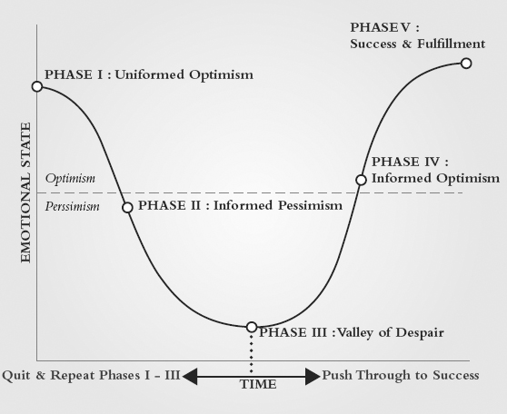
:::

There are five stages that people move through emotionally when changing their behavior:

:::::::: {}
::: {}
I. Uninformed Optimism
:::

::: {}
II. Informed Pessimism
:::

::: {}
III. Valley of Despair
:::

::: {}
IV. Informed Optimism
:::

::: {}
V. Success and Fulfillment
:::
::::::::

The first stage of change is most often exciting, as we imagine all of the benefits and have not yet experienced any of the costs. Our emotions are driven by our uninformed optimism, which is in the positive emotional area of the graph. You see all of the benefits of the change and none of the downside, so this stage is fun. You are brainstorming ideas and strategizing how you might create the new level of results that you desire.

Unfortunately, uninformed optimism doesn't last long. As you learn more about the reality of what it takes to change, positive emotions can quickly sour. The second stage of change, informed pessimism, is characterized by a shift to a negative emotional state. At this point, the benefits don't seem as real, important, or immediate, and the costs of the change are apparent. You start to question if the change is really worth the effort and begin to look for reasons to abandon the effort. If that's not bad enough, things get worse.

I call the third stage the valley of despair. This is when most people give up. All of the pain of change is felt and the benefits seem far away or less important---and there is a fast, easy way to end the discomfort: Going back to the way you used to do things. After all, you rationalize that it wasn't so bad before.

If you quit on change when you are in the valley of despair, you go back to the first stage, uninformed optimism, which is a whole lot more fun than being in the valley!

It is precisely at this stage---the valley of despair---that having a compelling vision is critical. Nearly all of us have had times in our lives when we wanted something so badly we were willing to pay any price and overcome any hurdle to get it. Maybe it was your first car, maybe it was getting into that college you always dreamed of attending, maybe it was pursuing the person whom you wanted to marry, maybe it was your dream job---whatever it was, you wanted it so badly that you willingly paid the price of your own comfort to get it. Wanting passionately to reach your vision, combined with commitment and the tools and events of process control, is the way through the valley to the next stage of change.

The fourth stage is informed optimism. At this stage, your likelihood of success is much higher. You are back in the positive emotional area of the cycle. The benefits of your actions are starting to bear fruit and the costs of change are lessened because your new thoughts and actions are becoming more routine. The key at this stage is to not stop!

Success and fulfillment is the final stage of the ECOC. At this final stage of change, the benefits of your new behaviors are fully experienced and the costs of change are virtually gone. The actions, which at the beginning were difficult and uncomfortable, have now become routine. Every time you complete the cycle, you build not only your capacity, but also your confidence. At this point you can move on to the next change that you want to implement with greater assurance of success.

The ECOC is the description of the emotional impact of change. By being aware of this cycle, you are less likely to be derailed by negative emotions and are able to manage change more effectively.

# Closed System

The 12 Week Year is a closed system in that it contains everything you need to succeed.

In our two-day workshop we have the participants list everything it takes to excel. Then, we list all those items on a flip chart. Typically, there are more than 20 and the list fills one to two large sheets of paper. When we go through each item, every one of them is represented in these disciplines and principles; that is why if you apply the 12 Week Year fully, as a complete system, you can't help but improve.

The challenge is that not everyone applies it as a system. Often people will apply some of the elements and not apply others. Like any system, the whole is exponentially greater than the sum of the parts. Apply and leverage any one of the disciplines or principles and you will gain from it, but the real breakthrough comes when all of them are applied in their entirety. When applied in this way, the 12 Week Year becomes a self-correcting system that creates a breadcrumb trail that allows you to pinpoint any breakdowns and take corrective action on a timely basis. It is a deliberate practice system that is designed for continuous improvement.

In addition to being a closed system, the 12 Week Year also facilitates change. When you install the 12 Week Year as your operating system, it makes subsequent change easier. Let's use a computer as an analogy: You can have the best software money can buy, but if your operating system is not working, those programs are worthless. We've all experienced this from time to time when the printer won't print, the document won't open, or your computer is frozen.

When you install the 12 Week Year as your operating system, it leverages your other business systems. For instance, most companies have systems for marketing, sales, products, service, technology, and other business processes. Without a system for execution, we tend to hang onto our existing systems because that is what is familiar and predictable---especially when we are faced with change. When the 12 Week Year is your operating system, it supports all your other business systems, so when change comes---and it will---you do not experience a massive upheaval ([Figure 12.2](#Chapter12.html_figure12-2)). Instead, you can easily incorporate new systems like plug-and-play software.

::: {}
[Figure 12.2](#Chapter12.html_figureanchor12-2) The 12 Week Year is not bolted on top of everything else you have to do. In order for it to work in the long term, it must become the system you use to get everything else done. It must become your execution system.

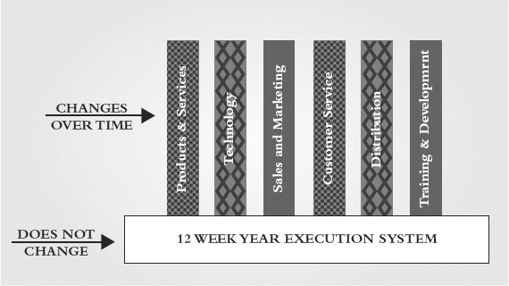
:::

People need stability; we need some things to remain the same. The 12 Week Year as an operating system stays the same. It provides a consistent platform to implement corporate initiatives and change efforts without the chaos that usually accompanies change. For an individual, it functions as the daily foundation that doesn't change. The 12 Week Year is not one more thing you do, it is how you get things done!

In the following chapters we will take a deep dive into the disciplines and principles of the 12 Week Year. We will provide you with even greater insight, as well as tools and exercises you can use to effectively apply and leverage these fundamentals to achieve more in 12 weeks than most do in 12 months.

# Chapter 13

# Establish Your Vision

The first step to creating breakthrough with the 12 Week Year is to craft a great vision for yourself. This should be a fun and inspiring exercise. Vision is critical because there will be days when you just won't feel like taking action on your plan. To help you stay on track, you will need a powerful reason why---and that's your vision.

Sal Durso, a long-time friend and client, has a personal take on the power of vision.

We have applied the disciplines of the 12 Week Year in our firm for years. It has become second nature to us, it is the way that we get stuff done, and it is the way that we stay on track even when things get in the way.

Not long ago our firm lost a big part of our revenue when a group of our key advisors left and took with them their clients and their revenue. As you would expect, this was an extremely trying time for the firm, and it impacted me both personally and professionally. The people leaving were not just business associates, they were long-time friends as well, and their loss was felt deeply by all of us who remained.

I could have put my victim glasses on and placed all of the blame for this loss squarely on those who had left. Okay, looking back there may have been at least a couple of days that I had a why-me attitude, but in the end my desire and vision to build a business that would survive long past my stewardship took over.

It was during this time that I took a much-needed summer trip to the incredible state of Alaska. While there, I intentionally shifted my thinking and reflected on the things that have made my life so incredibly wonderful. A relationship with a God who loves me, a wife and family who any man would be proud of, and a business that is approaching a milestone that few will ever see---50 years in profitable operation!

As part of the trip to Alaska, we took a fantastic rafting journey down the Kennicott River. As we navigated our way around yet another scenic bend in the river, an incredible sea of purple flowers appeared. The flowers spread across the mountainside as far as the eye could see. Our guide said that this was called "fireweed," and just a few years ago this vista had been a charred remnant of a forest fire. When this purple blanket appears, it is the first sign that the forest is regenerating. It filled me with awe and a sense of hope and expectation for the new forest that was to come. Apparently even nature has a way to create a vision for what is to follow.

It occurred to me then that rather than contemplate the charred remains of our loss, we needed to focus on the new signs of rebirth in our business. As leader of the organization it was clear to me that our firm needed the same vision that I just had, and it was my role to set it.

Arriving back in my office excited and refreshed, much of the next few weeks was spent talking with each of our team members, asking them what they felt made our organization unique, and what they thought about the future. These discussions and hours of contemplation helped me craft a vision that one year later is our fireweed field---the guiding light for our company.

A year after our forest fire, the fireweed has emerged, and the young saplings that will make us stronger than ever before are germinating. Our leadership team, advisors, and staff all say that our firm is a better place because of what happened a short year ago. As leaders I know the vision that we all are committed to is the change agent that will shape our organization for years to come. True success will happen when people bound by a common vision work together for a common outcome. More firestorms may come, but our vision and faith will carry us through.

Sal saw the power of vision to create movement and progress and took action. Many people miss out on the potential of vision to create the emotional energy needed to inspire positive action even in an environment of charred earth. Do you have charred earth like Sal had, or are you doing fine but aspire to greater heights? In both scenarios, a compelling vision is a powerful force to move you forward.

The most powerful visions address and align your personal aspirations with your professional dreams. In the end, your professional vision often funds and enables your personal vision. For your vision to help you to push through the discomfort of change, you must be clear on what it is you want to create in life. Most people focus primarily on their business or career, but your business is just part of your life, and it is actually your life vision that gives traction and relevance to your business.

The best visions are big ones. In our experience, nothing great is ever accomplished without first being preceded by a big vision. All of the great accomplishments of mankind from medicine to technology to space travel to the World Wide Web were first envisioned and then created. All of your big personal accomplishments must also be preceded by big visions. So we challenge you to dream big and imagine true greatness for yourself. Your vision should be big enough that it makes you feel at least a little bit uncomfortable.

# Impossible, Possible, Probable, Given

Unfortunately, when we imagine a future that is significantly bigger than our current reality, we can begin to think that it is impossible for us. We can see others who have achieved great things, but we start to think that there is no way that we can get there. When you start to envision a significant accomplishment that is well beyond what you've achieved in the past, the question most people immediately ask is: How would I do this? This is the wrong question so early in the process. The fact is, you don't know how to do it because if you did, you would likely be doing it already and living that reality. The fact that you don't know how to do it creates the perception that it is impossible, at least for you, and it makes you think of new goals on a sliding scale of impossibility to certainty. Your ability to do something is malleable in this mind-set. The problem is that, if you think something is impossible, you will never attain it. Henry Ford said, "If you think you can or think you can't, you're right." The first step, then, to reaching your biggest dreams is to shift from impossible thinking to possible thinking. You do this not by asking How? but by asking What if ? What would be different for you, your family, your friends, your team, your clients, and your community? By asking What if ?, you give yourself permission to entertain the possibility and begin to connect with the benefits. As you do this, the desire intensifies and the door on your future cracks open just a fraction, but enough so you automatically begin to shift from impossible to possible thinking.

Once you see your vision as possible, then you begin the shift from possible to the next level: probable. You make this shift by asking the question that we avoided earlier: How might I? How is not a bad question; in fact, it is a perfectly good question, but the timing is critical. Ask it too early, and it shuts down the whole process, but once you see your vision as possible, the question of how is an essential one. If the question of what if ? is the visioning question, then the question of how is the planning question.

The final shift needed in your thinking to create an effective vision is to move from probable to given. This shift happens naturally as you begin to implement the planned actions. Given is a powerful state of mind where any question of doubt is gone and, mentally, you are already standing in the end results. As you see the results start to materialize, your thinking shifts almost automatically to given (see [Figure 13.1](#Chapter13.html_figure13-1)).

::: {}
[Figure 13.1](#Chapter13.html_figureanchor13-1) The execution journey is first a thinking journey. If you think that something is impossible---it is. The most important thing is to believe that you can reach your goals.

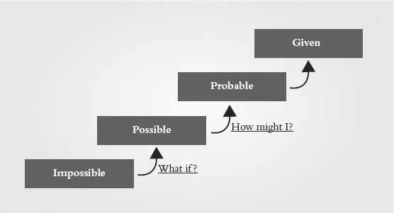
:::

# Crafting Your Vision

The best visions balance your personal and professional lives. Typically your passion comes from your personal vision, and passion is the energy source that helps you push through the pain of change and the valley of despair. If you're going to create breakthrough and reach your next level, you will need to move through the fear, uncertainty, and discomfort of the valley of despair. It is your personal vision that keeps you in the game when things become difficult.

Your vision provides you with a line of sight, an emotional link to help you overcome the challenges and execute. When the task seems too difficult or unpleasant, you can reconnect with your vision. It is this emotional connection that will provide you with the inner strength to forge ahead in spite of any difficulties, enabling you to achieve your dreams and desires.

There are three time horizons that you'll want to focus your vision on:

:::::: {}
::: {}
1. Long-term aspirations
:::

::: {}
2. Mid-term goals, about three years into the future
:::

::: {}
3. 12 Weeks (covered in the next chapter)
:::
::::::

## Aspirational Vision

So let's start with the long-term aspirational vision. In formulating your vision, you must let your mind expand to imagine and even embrace the possibilities that often get pushed aside in our daily lives as being not immediate enough to command our attention, impractical, or too audacious to even consider, let alone pursue. Take a few minutes right now and think about all of the things that you want to have, do, and be in your life. What is most important to you physically, spiritually, mentally, relationally, financially, professionally, and personally? How much time freedom do you want? What income do you desire? Write everything you can think of on a sheet of paper; leave nothing off the page.

Now, take the items from your page that you connect with emotionally and construct a vision for your life 5, 10, 15 years into the future. Be bold, be courageous; create a life vision that inspires you and fulfills your purpose. There are no right or wrong answers. This is the life you deeply desire.

Aspirational Vision

- \_\_\_\_\_\_\_\_\_\_\_\_\_\_\_\_\_\_\_\_\_\_\_\_\_\_\_\_\_\_\_\_\_\_\_\_\_\_\_\_\_\_\_\_\_\_
- \_\_\_\_\_\_\_\_\_\_\_\_\_\_\_\_\_\_\_\_\_\_\_\_\_\_\_\_\_\_\_\_\_\_\_\_\_\_\_\_\_\_\_\_\_\_
- \_\_\_\_\_\_\_\_\_\_\_\_\_\_\_\_\_\_\_\_\_\_\_\_\_\_\_\_\_\_\_\_\_\_\_\_\_\_\_\_\_\_\_\_\_\_
- \_\_\_\_\_\_\_\_\_\_\_\_\_\_\_\_\_\_\_\_\_\_\_\_\_\_\_\_\_\_\_\_\_\_\_\_\_\_\_\_\_\_\_\_\_\_
- \_\_\_\_\_\_\_\_\_\_\_\_\_\_\_\_\_\_\_\_\_\_\_\_\_\_\_\_\_\_\_\_\_\_\_\_\_\_\_\_\_\_\_\_\_\_
- \_\_\_\_\_\_\_\_\_\_\_\_\_\_\_\_\_\_\_\_\_\_\_\_\_\_\_\_\_\_\_\_\_\_\_\_\_\_\_\_\_\_\_\_\_\_
- \_\_\_\_\_\_\_\_\_\_\_\_\_\_\_\_\_\_\_\_\_\_\_\_\_\_\_\_\_\_\_\_\_\_\_\_\_\_\_\_\_\_\_\_\_\_
- \_\_\_\_\_\_\_\_\_\_\_\_\_\_\_\_\_\_\_\_\_\_\_\_\_\_\_\_\_\_\_\_\_\_\_\_\_\_\_\_\_\_\_\_\_\_

## Three-Year Vision

Now that we've got you thinking about the possibilities in your life, let's get specific. Based on your long-term vision, what do you want to create over the next three years? Describe in as much detail as possible what a great personal and professional life would look like three years from today. The more specific you are at this stage, the easier it will be to create your 12 week goals and your plan.

Three-Year Vision

- \_\_\_\_\_\_\_\_\_\_\_\_\_\_\_\_\_\_\_\_\_\_\_\_\_\_\_\_\_\_\_\_\_\_\_\_\_\_\_\_\_\_\_\_\_\_
- \_\_\_\_\_\_\_\_\_\_\_\_\_\_\_\_\_\_\_\_\_\_\_\_\_\_\_\_\_\_\_\_\_\_\_\_\_\_\_\_\_\_\_\_\_\_
- \_\_\_\_\_\_\_\_\_\_\_\_\_\_\_\_\_\_\_\_\_\_\_\_\_\_\_\_\_\_\_\_\_\_\_\_\_\_\_\_\_\_\_\_\_\_
- \_\_\_\_\_\_\_\_\_\_\_\_\_\_\_\_\_\_\_\_\_\_\_\_\_\_\_\_\_\_\_\_\_\_\_\_\_\_\_\_\_\_\_\_\_\_
- \_\_\_\_\_\_\_\_\_\_\_\_\_\_\_\_\_\_\_\_\_\_\_\_\_\_\_\_\_\_\_\_\_\_\_\_\_\_\_\_\_\_\_\_\_\_
- \_\_\_\_\_\_\_\_\_\_\_\_\_\_\_\_\_\_\_\_\_\_\_\_\_\_\_\_\_\_\_\_\_\_\_\_\_\_\_\_\_\_\_\_\_\_
- \_\_\_\_\_\_\_\_\_\_\_\_\_\_\_\_\_\_\_\_\_\_\_\_\_\_\_\_\_\_\_\_\_\_\_\_\_\_\_\_\_\_\_\_\_\_
- \_\_\_\_\_\_\_\_\_\_\_\_\_\_\_\_\_\_\_\_\_\_\_\_\_\_\_\_\_\_\_\_\_\_\_\_\_\_\_\_\_\_\_\_\_\_

# Thinking Shift

By its nature, vision is a thinking exercise, but how you view the concept of vision will impact the degree to which you leverage and benefit from it.

The predominant limiting belief regarding vision is that it is soft and fluffy, insignificant in the success equation and the attainment of results. As you now know, that is not the case. Vision, when engaged properly, is the ignition switch and power source of high performance. It is the all-important why behind the things you do. When viewed in this light, vision has the power to enable one to confront and conquer fears, take bold consistent action, and live a life of significance.

The shift in thinking from seeing vision as fluff, to seeing it as the mother of all antecedents is a fundamental shift in thinking that will pay huge dividends. When you understand the true power of vision, you will want to spend more time connecting with your own vision to begin to free yourself from the self-imposed limitations that have held you back. Vision is the starting point of all high performance.

# Team Application

While vision is generally an intensely personal exercise, a manager can often take specific actions that will help their direct reports to more effectively leverage their visions. Vision is the best starting point for all effective performance-based coaching relationships, because vision creates ownership. If your direct reports take ownership of their visions, it will be much easier to help them to own their goals and plan tactics as well. This is a critical step, because without it the goals and plans they develop will be yours, not theirs.

Review the visions of your team in individual one-on-one sessions. Ask permission to review their professional visions with them. Dig into why the business vision they have is important to them. Explore what achieving their business goals enables in their personal lives. Inquire about the level of ownership and emotional connection they have for their vision.

Questions That Uncover the Degree of Ownership

- Why are the elements of your vision important to you?
- What will you be able to do if you reach your vision that you cannot do now?
- What will be different for you, your family, your friends, your peers, your clients, your community, if you reach that goal?
- Are you willing to commit to the actions needed to reach your vision?
- Who have you shared your vision with?
- How often have you looked at your vision since you wrote it?
- What actions do you have to take to make progress on your vision and reach your 12 week goal?
- What risks or barriers exist that may get in the way of you reaching your vision and goals?
- How can I best support and help you achieve your goals and vision?

Once they have clear ownership of their visions, the next step is to help them build an action plan to achieve them. The how-to section on 12 week planning in Chapter 14 will help you to assist with that step.

When you conduct individual coaching sessions with your direct reports (and we encourage you to do these at least monthly), start the conversations with their vision. Are they making progress? Discuss their willingness to take the day-to-day actions necessary to reach it. If they are unwilling to take the difficult actions, confront them with the reality that they won't attain their long-term vision. The breakdown is a question of ownership. When an individual is reluctant to take the necessary actions required to accomplish a goal, it is an indication that they own their current comfort more than they own the future described in their vision. In these cases, people have a couple of choices: They can either lower their expectations in life, or find the courage and discipline to execute the plan tactics consistently. The good news is that many times when confronted with this choice, your team members will reconnect and choose their aspirational vision over mediocrity.

# Team Visions

As a leader, it's important that you establish a team vision for your company, division, or group. We are not talking about a vision statement that is worded just so and framed and hung on the wall. The team vision is similar to the individual vision in that it describes the destination at a fixed point in the future. As a group, you will want to put some stakes in the ground with regard to what matters most. This is best accomplished by having each team member first work through their individual visions, then come together as a group to create a common team vision.

When creating the team vision, you will want to apply many of the same dynamics used in creating your personal visions. Start with the long-term by having everyone brainstorm what a great company or office would look like in the future. Get them to be as specific as possible and assign numeric values where applicable. Give everyone a chance to share their thoughts with the group, then narrow the horizon, look three years out, and work together to determine the specific elements that will stay part of the vision and those that won't.

# Common Pitfalls and Success Tips

::::::::::: {}
:::: {}
Pitfall 1: You don't take the power of vision seriously.

::: {}
Some people, especially type-A people, think that vision is fluff. Those who think about vision this way tend to leap past the question of purpose and dive into action. The problem is that when the going gets difficult, it is harder to stay committed to the work in the long run because there is no compelling reason, no persuasive why. The behaviors associated with this pitfall are not keeping your vision in front of you, not aligning your plans with it, and not remembering what is in it.
:::
::::

:::: {}
Pitfall 2: The vision isn't meaningful to you.

::: {}
Sometimes we are superficial in crafting our vision. We capture what we think we want---what we think we are supposed to want---rather than capturing what is meaningful to us. Visioning takes time. Keep working on it until you have something that connects emotionally.
:::
::::

:::: {}
Pitfall 3: Your vision is too small.

::: {}
A small vision doesn't call on our best efforts. We don't have to reach and we don't sacrifice our comfort. A small vision might be achievable, but we leave our best undelivered. To be most effective, your vision should make you feel uncomfortable and challenge you to do things differently---and do different things.
:::
::::

:::: {}
Pitfall 4: You don't connect your vision to your daily actions.

::: {}
Each day is an opportunity to either make progress on your vision or tread water. If you work from a plan that is aligned with your vision, you can be sure that you are acting on the most important things every day.
:::
::::
:::::::::::

You've crafted your vision and checked to avoid making those common mistakes. Now, here are three important action steps to take to make your vision even more powerful for you:

::::::::: {}
:::: {}
Success Tip 1: Share it with others.

::: {}
Sharing your vision increases your commitment to it. When you tell someone else what you want in life, you feel more responsibility to act.
:::
::::

:::: {}
Success Tip 2: Stay in touch with your vision.

::: {}
Print it out and keep it with you. Review it each morning and update it every time that you discover ways to make it more vivid and meaningful to you.
:::
::::

:::: {}
Success Tip 3: Live with intention.

::: {}
At the end of each day, take a few minutes to reflect on the progress that you made today. Did it move you forward, or was it filled with activity that wasn't related to your vision? Resolve to be intentional in your actions to make progress on your vision. What action will you take tomorrow?
:::
::::
:::::::::

# Chapter 14

# Develop Your 12 Week Plan

This chapter will guide you through the development of your first 12 week plan. Before you create a 12 week plan, you must define and commit to your vision. If you have not already done so, be sure to work through Chapter 13, "Establish Your Vision," to prepare you to set an effective 12 week goal and to create a solid plan to reach it.

# Planning Is Beneficial

Unless your job is mostly reactionary in nature, it's hard to argue against the value of planning. Planning enables you to allocate your time and resources to your highest-value opportunities, it increases your odds of successfully hitting your goals, it helps you to coordinate your team, and it creates a competitive advantage.

In spite of the proven benefits of working from a plan, not everyone does so. One reason for this is that many people have a bias for taking action. While an action bias can be a good thing, it can also get in the way of effective execution. We can get impatient, and want to get on with things too quickly. An effective plan takes time to create, and it requires some hard work. It may seem counterintuitive, but by taking time to plan up front, the overall time and effort to complete a task can be significantly reduced.

Another reason that many people don't work from a plan is that they have a belief that goes something like, "I already know what I need to do, so I don't need a plan to get it done." On the surface this may seem reasonable, but unfortunately there is almost always a gap between what people know and what they do. For example, many people want to get into better physical shape, and virtually all of them know that it takes a healthy diet and exercise, but, sadly, most people don't ever become more fit. That's because simply knowing what to do just isn't enough. The world is noisy, the unexpected happens, distractions arise, our innate desire for comfort tugs at us, and we lose focus on the things that we know we should do.

That's why to increase your odds of success, one of the most powerful things you can do is to create, and work from, a written plan.

Twelve week planning isn't just valuable for business. A well-written plan can positively impact almost any area of your life. J.K. McAndrews tells this short story about his son and the 12 Week Year.

My son Kevin is a senior at LSU and a couple of years ago he was really struggling with balancing his time between school, fraternity, and his job with the football team. Over Christmas break that year I taught him the basic principles of the 12 Week Year and beginning with the next semester he developed clearly defined goals with strategies and tactics to support them. Since then he sends me a weekly plan every Sunday night and even added his own wrinkle by finding an inspirational quote that will motivate him for that particular week. His grades have improved, and, more importantly, he has had a better focus on his goals, is more organized, and has definitely come to understand the term greatness in the moment.

# Game Changer

Operating in the 12 Week Year execution cycle creates an increased premium on the value of time. In 12 weeks, each day counts toward reaching your goals. The value of each moment is brought into sharp focus when there are only 12 weeks in your entire year. One of the benefits that comes from applying the 12 Week Year is learning to act in the moment because that's where the future that you will experience is being created.

Living your life in the moment, however, can be done in two very different ways---either reactively or proactively. If you are reactive in the moment, you risk taking suboptimal actions because the primary drivers of your actions are input triggers---the phone rings, the email dings, a new task appears, someone knocks on your door, and off you go. It is difficult in the moment to know what your highest value activities are because you are typically not choosing between good activity and bad activity; you are choosing between higher value and lower value activity and that ranking often isn't clear in the moment.

That's why 12 week planning is so beneficial. With an action-based plan, you don't have to rely on input triggers to initiate your actions; instead, your plan triggers your actions. Your action choices are made proactively at the beginning of the 12 weeks when you create your plan. In short, a 12 week plan helps you to get more of the right things done each day, and ultimately it helps you reach your goals faster and with greater impact.

Another benefit of 12 week planning is a fiercely consistent focus on the few vital actions that drive your results. You can't effectively pursue a large number of different things in a 12 Week Year because there simply isn't enough time to get everything done. In 12 weeks, you only focus on the minimum number of actions that are most important to hit your goal.

You also benefit from 12 week planning because of the short time horizon. Uncertainty is reduced due to the shortened time frame, and as a result you can plan effectively at the action level. Annual plans are typically not action-based because it is nearly impossible to predict the action needed four or more months out. This is a profound benefit of the 12 Week Year.

Due to increased uncertainty, most annual plans are objective-based and cannot be executed as written. Typical annual plans tell you what has to be achieved but they don't specify how. When the how is not clearly defined you lose a sense of scope and can easily take on more than you can physically execute.

The daily and weekly how's of a 12 week plan are what makes it execution-friendly. When you get down to action-level granularity on your plan, you are setting yourself up for success.

Here is how our friend Patrick Morin describes his experience with 12 week planning.

My passion for the 12 Week Year began with a challenge to drop 38 pounds that just wouldn't go away. The Period Goal, Strategy, and Tactics fit perfectly into solving my nagging weight problem and also gave me exactly the right tools to prepare for a triathlon. After reaching my goal, and buzzing with my new fitness, I looked around for other ways to apply the 12 Week Year.

At that time, we were raising money for a new start-up company in the healthcare industry. We had started in earnest in January, writing all the required documents, and preparing the product. The process was taking longer than we had anticipated and we continued to have to fund the company internally. It was straining both resources and patience.

It seemed to me that this would be the perfect place to implement the 12 Week Year.

On a Monday in early July, I gathered the senior staff to plan it out. The critical objective was pretty clear---in order for the idea (and the company) to survive we would have to finish the Private Placement Memorandum and raise the money in the next 12 weeks. The economic climate at the time could best be described as "dismal." Investors, in general, were hard to come by and this would require a Herculean effort.

The vision for the company was clear, the next step was to create a 12 week plan to acquire funding. We had to forget the previous six months' slog and focus only on the 12 weeks ahead.

Using the battle cry "every day is a week," we finished a 100-page PPM in the first week. We got it to our legal team for review and a week later, we were green-lighted. That's when the real energy kicked in.

Reaching out to a network of hundreds of people that were personally known to each of us, we found a critical mass of people willing to step in and we closed the first round on October 10th!

The energy created around this effort continued through our development efforts and each of our projects took on its own 12 Week Year. The company's cadence was remarked upon by investors, employees, and officers alike.

# A Good Plan Fosters Solid Execution

Imagine driving cross-country with directions that have turns out of order, combine several instructions into one, and leave out big chunks of the trip. You'd probably want to smack the person who created those directions, and would either stop to get better directions or give up and go home in frustration.

That may sound silly, but I bet that you would be surprised by how many people create business plans just like those bad directions! We see plans all the time that are missing steps, lump complicated time-consuming processes into a single tactic, and have actions out of sequence. Worse yet, rather than specifying the actions needed to reach the goal, many times the plan is just a collection of thoughts and ideas. It would be like driving from Miami to Chicago using directions that said something like, "get in your car and drive in the general direction of Chicago." Plans like this are way too common and they keep you from executing.

Writing an effective 12 week plan is key to accomplishing great things in only 12 weeks. The plan defines the actions that you will need to take each week of the 12 to reach your goal.

# Long-Term Capacity versus Short-Term Results

Plans can both build capacity for the future and drive short-term results. Every plan should have a goal to drive results in the current 12 weeks. If the plan is for your business, this means that it should always target income to be realized in the current 12 weeks.

Some plans may also target building future capacity. Capacity objectives include such things as pursuing education, hiring staff, updating technology, implementing new systems, and so on. Effort and resources expended to build capacity happens immediately, while the benefits are realized sometime in the future. That's why it's important to always have activity in your plan that creates required short-term results.

# Effective Plan Structure

The structure of the plan that you write matters if you want to set yourself up to be successful. A good plan starts with a good goal. If your goal is not specific or measureable, the plan that you write will also be vague. The more specific and measureable your 12 week goals, the easier it will be to write a solid 12 week plan.

Many 12 week efforts are comprised of two or three goals. For example, you might have a 12 week goal to lose 10 pounds and another goal to generate \$105,000 in new business. Each of these goals then becomes a planning target for which you need to write tactics. Tactics for the weight goal are specific actions you must take to achieve your desired weight. If you are working to lose weight, your tactics might include limit calorie intake to 1,200 per day and do 20 minutes of cardio three times per week. Note that these tactics start with a verb, and are complete sentences. The way that you write your goals and tactics matters. Your income goal of \$105,000 would have a separate set of tactics.

There are five criteria that will help you create better 12 week plans when you are writing goals and tactics:

::::::::::::: {}
:::: {}
Criteria 1: Make them specific and measurable.

::: {}
For each goal and/or tactic, be sure to quantify and qualify what success looks like. How many calls will you make? How many pounds will you lose? How far will you run? How much income will you earn? The more specific you can be, the better!
:::
::::

:::: {}
Criteria 2: State them positively.

::: {}
Focus on what you want to happen that is positive. For example, rather than focusing on a 2 percent error rate, you would target a 98 percent accuracy rate.
:::
::::

:::: {}
Criteria 3: Ensure they are a realistic stretch.

::: {}
If you can accomplish the goal without doing anything differently, then you probably need to stretch more. If it is absolutely impossible, then factor it back a little. If you have never asked for a business referral in your life, a tactic like "Ask for referrals in every client interaction" might be a bridge too far. A more realistic tactic that will still be a stretch might be "Ask for a referral in at least one client meeting each week."
:::
::::

:::: {}
Criteria 4: Assign accountability.

::: {}
This applies to people who are executing as part of a team (if you're on your own, the accountability is all yours). Individual accountability for each goal and tactic is critical! Everyone's challenge is no one's challenge.
:::
::::

:::: {}
Criteria 5: Be time-bound.

::: {}
There is nothing like a deadline to get things started and keep them moving. Make sure to include a date by which the goal is to be reached, or the tactic is to be executed.
:::
::::
:::::::::::::

In addition to the previous criteria, each tactic should start with a verb, be a complete sentence, and be executable as written in the week that it is due. [Figure 14.1](#Chapter14.html_figure14-1) illustrates a sample 12 week plan.

::: {}
[Figure 14.1](#Chapter14.html_figureanchor14-1) A sample 12 week plan.

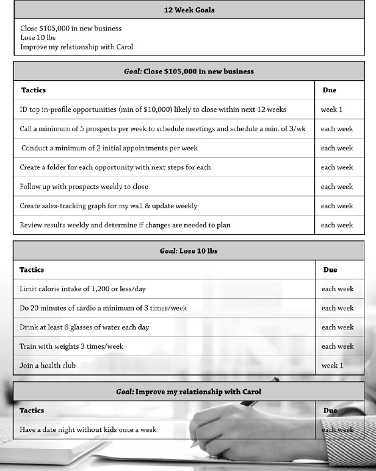
:::

# Establish Your 12 Week Goals

Deciding where you are going is the first step to getting there. Effective planning absolutely begins with a well-written, specific, and measureable 12 week goal---a goal that you own, that, if you hit it, creates meaningful benefits for you---a goal that makes a difference.

The 12 week goal is the bridge between your vision and your 12 week plan. Your 12 week goal should be a realistic stretch for you. If it isn't realistic, you will become discouraged. If it isn't a stretch you don't need the 12 Week Year because your current way of operating will achieve your goal.

It's now time to set your 12 week goal that aligns with your long-term vision and also represents greatness for you in and of itself in the next 12 weeks. Get started by going back to Chapter 13 to review your long-term and three-year visions. Decide on the progress that you are willing to commit to achieving in the next 12 weeks. Once you've decided on your 12 week goal, record it.

12 Week Goal(s)

- \_\_\_\_\_\_\_\_\_\_\_\_\_\_\_\_\_\_\_\_\_\_\_\_\_\_\_\_\_\_\_\_\_\_\_\_\_\_\_\_\_\_\_\_\_\_
- \_\_\_\_\_\_\_\_\_\_\_\_\_\_\_\_\_\_\_\_\_\_\_\_\_\_\_\_\_\_\_\_\_\_\_\_\_\_\_\_\_\_\_\_\_\_
- \_\_\_\_\_\_\_\_\_\_\_\_\_\_\_\_\_\_\_\_\_\_\_\_\_\_\_\_\_\_\_\_\_\_\_\_\_\_\_\_\_\_\_\_\_\_
- \_\_\_\_\_\_\_\_\_\_\_\_\_\_\_\_\_\_\_\_\_\_\_\_\_\_\_\_\_\_\_\_\_\_\_\_\_\_\_\_\_\_\_\_\_\_

The best 12 week goals are realistic but enough of a stretch that they will call on you to deliver your very best.

Why is your 12 week goal important to you? If you hit it, what will be different?

:::::::::: {}
::: {}
\_\_\_\_\_\_\_\_\_\_\_\_\_\_\_\_\_\_\_\_\_\_\_\_\_\_\_\_\_\_\_\_\_\_\_\_\_\_\_\_\_\_\_\_\_\_
:::

::: {}
\_\_\_\_\_\_\_\_\_\_\_\_\_\_\_\_\_\_\_\_\_\_\_\_\_\_\_\_\_\_\_\_\_\_\_\_\_\_\_\_\_\_\_\_\_\_
:::

::: {}
\_\_\_\_\_\_\_\_\_\_\_\_\_\_\_\_\_\_\_\_\_\_\_\_\_\_\_\_\_\_\_\_\_\_\_\_\_\_\_\_\_\_\_\_\_\_
:::

::: {}
\_\_\_\_\_\_\_\_\_\_\_\_\_\_\_\_\_\_\_\_\_\_\_\_\_\_\_\_\_\_\_\_\_\_\_\_\_\_\_\_\_\_\_\_\_\_
:::

::: {}
\_\_\_\_\_\_\_\_\_\_\_\_\_\_\_\_\_\_\_\_\_\_\_\_\_\_\_\_\_\_\_\_\_\_\_\_\_\_\_\_\_\_\_\_\_\_
:::

::: {}
\_\_\_\_\_\_\_\_\_\_\_\_\_\_\_\_\_\_\_\_\_\_\_\_\_\_\_\_\_\_\_\_\_\_\_\_\_\_\_\_\_\_\_\_\_\_
:::

::: {}
\_\_\_\_\_\_\_\_\_\_\_\_\_\_\_\_\_\_\_\_\_\_\_\_\_\_\_\_\_\_\_\_\_\_\_\_\_\_\_\_\_\_\_\_\_\_
:::
::::::::::

# Writing Your 12 Week Plan

Now it's time to write your first 12 week plan. The plan is the roadmap needed to reach your 12 week goals. The best plans are focused on one or two things that you want to make progress on in the next 12 weeks. The fewer goals and weekly actions there are, the easier the plan will be to execute.

As George Patton once said, "A good plan today is better than a perfect plan tomorrow." Don't overanalyze the content of your plan. Don't be concerned that your plan isn't perfect---there are no perfect plans. Once you have a good plan, your execution of the tactics will help you to learn what works best so you can refine your plan from there.

Keep in mind that at its most basic level, planning is just problem solving. Your plan solves the problem of how to close the gap between your results today and your 12 week goal.

To get started, write your first 12 week goal as Goal 1. Write each additional goal separately. You may find that you have just one goal; that's fine. Next, for each of your goals, define the highest-priority daily and weekly actions that you must take to reach that goal. In order to do this it might be helpful to brainstorm on a separate sheet of paper all the things you could do and then select the ones that will have the greatest impact. Some actions may be repeating (e.g., "work out each day"), while other actions will happen only once in the 12 weeks (e.g.,"join a health club"). For those actions you decide to implement write them as full sentences that start with a verb and describe the action that you intend to take. Finally, specify in the "Week Due" column the week (1 through 12) in which you intend to execute each action.

Goal 1:\_\_\_\_\_\_\_\_\_\_\_\_\_\_\_\_\_\_\_\_\_\_\_\_\_\_\_\_\_\_\_\_\_\_\_\_\_\_\_\_\_\_\_

  Tactics   Week Due
  --------- ----------
             
             
             
             
             
             

Goal 2:\_\_\_\_\_\_\_\_\_\_\_\_\_\_\_\_\_\_\_\_\_\_\_\_\_\_\_\_\_\_\_\_\_\_\_\_\_\_\_\_\_\_\_

  Tactics   Week Due
  --------- ----------
             
             
             
             
             

Goal 3:\_\_\_\_\_\_\_\_\_\_\_\_\_\_\_\_\_\_\_\_\_\_\_\_\_\_\_\_\_\_\_\_\_\_\_\_\_\_\_\_\_\_\_

  Tactics   Week Due
  --------- ----------
             
             
             
             
             

Before you put your plan down, ask yourself these questions:

- What actions will you struggle with?

:::::::: {}
::: {}
\_\_\_\_\_\_\_\_\_\_\_\_\_\_\_\_\_\_\_\_\_\_\_\_\_\_\_\_\_\_\_\_\_\_\_\_\_\_\_\_\_\_\_\_\_\_
:::

::: {}
\_\_\_\_\_\_\_\_\_\_\_\_\_\_\_\_\_\_\_\_\_\_\_\_\_\_\_\_\_\_\_\_\_\_\_\_\_\_\_\_\_\_\_\_\_\_
:::

::: {}
\_\_\_\_\_\_\_\_\_\_\_\_\_\_\_\_\_\_\_\_\_\_\_\_\_\_\_\_\_\_\_\_\_\_\_\_\_\_\_\_\_\_\_\_\_\_
:::

::: {}
\_\_\_\_\_\_\_\_\_\_\_\_\_\_\_\_\_\_\_\_\_\_\_\_\_\_\_\_\_\_\_\_\_\_\_\_\_\_\_\_\_\_\_\_\_\_
:::

::: {}
\_\_\_\_\_\_\_\_\_\_\_\_\_\_\_\_\_\_\_\_\_\_\_\_\_\_\_\_\_\_\_\_\_\_\_\_\_\_\_\_\_\_\_\_\_\_
:::
::::::::

- What will you do to overcome those struggles?

:::::::: {}
::: {}
\_\_\_\_\_\_\_\_\_\_\_\_\_\_\_\_\_\_\_\_\_\_\_\_\_\_\_\_\_\_\_\_\_\_\_\_\_\_\_\_\_\_\_\_\_\_
:::

::: {}
\_\_\_\_\_\_\_\_\_\_\_\_\_\_\_\_\_\_\_\_\_\_\_\_\_\_\_\_\_\_\_\_\_\_\_\_\_\_\_\_\_\_\_\_\_\_
:::

::: {}
\_\_\_\_\_\_\_\_\_\_\_\_\_\_\_\_\_\_\_\_\_\_\_\_\_\_\_\_\_\_\_\_\_\_\_\_\_\_\_\_\_\_\_\_\_\_
:::

::: {}
\_\_\_\_\_\_\_\_\_\_\_\_\_\_\_\_\_\_\_\_\_\_\_\_\_\_\_\_\_\_\_\_\_\_\_\_\_\_\_\_\_\_\_\_\_\_
:::

::: {}
\_\_\_\_\_\_\_\_\_\_\_\_\_\_\_\_\_\_\_\_\_\_\_\_\_\_\_\_\_\_\_\_\_\_\_\_\_\_\_\_\_\_\_\_\_\_
:::
::::::::

# Thinking Shift

Without a well-written plan, you are setting yourself up for poor execution. The way you think about planning itself is going to affect the quality of your plan and your success with the 12 week year overall. Let's take a look at some common mental breakdowns that might get in your way.

Most people know that they are supposed to work from a plan, but if their experience has been that their plan rarely gets executed, they won't take the time to create a well-written one. If that has been your experience with planning, remember that a 12 week plan is quite different. A 12 week plan gets down to the critical actions that you will need to take each week to reach your goal. Actions make all the difference in a plan. You can't act on the objectives or goals that make up a typical 12 month plan, but you can execute the actions that make up a 12 week plan.

Another thinking barrier to effective planning is that you don't have enough time to plan. This thinking is common, but it is flawed. Years ago I was involved in an informal study that showed the time benefit of planning. If you take time to plan before engaging with a complex task, you reduce the overall time required to complete the task by as much as 20 percent.

# Team Application

As a team leader, having your team engaged with the 12 Week Year can be transformational. Imagine if everyone on your team fully owned their aspirational visions and their 12 week goals. What would be different for you if your team was consistently executing on their highest value activities week in and week out?

There are a few things that you can do as a manager to help your team get on the 12 Week Year quickly and with greatest impact. The first step is to ask them to read The 12 Week Year, and have them work through the vision and planning templates. After they have created their vision and plan, schedule an individual sit-down with each person on your team to review their 12 week goals and plans. The purpose of this meeting is to refine their plan and to establish your role in helping them reach their 12 week goal.

As you conduct these meetings with your team, start the conversation by focusing on their 12 week goals. Do they own the goal or are they just interested in it? Is the goal realistic and still a stretch for them? Do they believe that they can reach their goal? Make appropriate suggestions for changing their goal if necessary, but make sure that the goal remains theirs, not yours, if you want them to own it.

Once you have finished with the 12 week goal, shift to their tactical plan. As you provide coaching advice, seek to keep their plans focused on just the fewest number of goals, and fewest number of tactics that are needed to reach each goal. Refer to the criteria earlier in the chapter for well-written goals and tactics for ideas on how to help them improve their plans.

## Team Planning

As a manager, or as a member of a team, sometimes it is necessary to create joint goals and plans. Often effective team planning can more effectively leverage talent and resources than individual plans can.

The process of team planning is similar to the individual process except that the team sets a goal and builds a plan jointly. Ask for participant input toward the overall goal for the 12 weeks. Finalize the goal with the team and ensure that they own the goal jointly and individually.

Next, brainstorm the tactics needed to reach each goal; then, select the smallest possible number of the brainstormed tactics that, when executed, will attain the goal.

It is important that each tactic be assigned to one individual even if several people will work on it. Individual accountability for tactics is critical to drive the team execution process. However, if one of the team tactics will be completed individually by multiple team members, you will be better served by assigning a subset of the team goal to each team member. For example, if the team tactic is to conduct 20 prospecting meetings per week, and there are four team members, each might be individually assigned five prospecting meetings as their individual tactic.

There are two last bits of advice when planning for teams: First, don't overestimate the capacity of your team. The best team plans are succinct and contain the minimal amount of activity to reach the team goal---no more. Second, don't front-load the plan; instead, if possible, balance the actions over the entire 12 weeks.

# Common Pitfalls and Success Tips

Don't let these five common pitfalls derail your achievement:

:::::::::::::: {}
:::: {}
Pitfall 1: Your 12 week plan does not align with your long-term vision.

::: {}
It is important that your 12 week goals and your plan are aligned with, and an extension of, your longer-term vision. When you set your goals, be certain that they are connected to your vision and determine where you need to be at the end of 12 weeks to be on pace with your long-term goals.
:::
::::

::::::::: {}
Pitfall 2: You aren't staying focused

::: {}
Focus is critical. If you establish too many goals, you end up with too many priorities and too many tactics to effectively execute. Everything cannot be a priority. You will need to say no to some things in order to be great at the things that matter most. It takes courage to limit your focus to a few key areas. Remember, each 12 weeks is a new year. Imagine if every 12 weeks you identified one or two key areas and went after those with passion and focus.
:::

::: {}
Then, at the end of that 12 week period, you identified one or two new areas to focus on. The 12 Week Year is designed to help you focus on a few key areas and make significant progress in a short period of time.
:::

:::: {}
Pitfall 3: You don't make the tough choices.

::: {}
For each goal, it's not uncommon to identify 8, 10, or more tactics (actions) you could take to move the ball down the field. In most cases, implementing every tactic you can think of is not necessary and, in fact, can be a hindrance. Although it's helpful to brainstorm all the tactics you can think of, that doesn't mean you have to implement all of them. Trying to execute too many tactics can spread you too thin and leave you feeling overwhelmed. Despite this, it's important to remember that there is no right number of tactics. As with your goals, the general rule is less is more. If you can accomplish the goal with four tactics, then you don't need five. Brainstorm all the tactics you can, and then select the critical few.
:::
::::

::: {}
Pitfall 4: You don't keep it simple.
:::

::: {}
The task of planning can become very complex. In some companies, entire departments exist for the sole purpose of drafting strategic plans. For the purposes of The 12 Week Year, keep it simple. If you feel like it's getting too complicated, it probably is. Focus on a few key areas and the actions you can take to hit your goals.
:::
:::::::::

:::: {}
Pitfall 5: You don't make it meaningful.

::: {}
You must build your plan around the most important items or there will be too little traction for you in the implementation phase. Too often people build their plan around the goals that someone else thinks are important. Although executing your plan is not complex, it is not necessarily easy, either. If your plan is not meaningful to you, then you will struggle to execute it. Be certain that you focus on the areas that matter most.
:::
::::
::::::::::::::

# Chapter 15

# Installing Process Control

The 12 Week Year starts with a vision, and from that vision, you establish a set of 12 week goals. Based on those goals you develop a 12 week plan. Then comes process control.

Mike Tyson said that everyone has a plan until they get hit in the mouth. Process control is a set of tools and events that help you work your plan, even when you get hit in the mouth.

# Making Sure Things Get Done

It's not enough to have a vision and a plan. If your goals and plan are designed to help you achieve a higher level of performance, then you most likely have specific tactics that are new actions for you. New actions are almost always uncomfortable. That's one of the things that makes change so difficult. It's one thing to identify the actions needed to create a better result; it's a whole other thing to consistently do them. Without structural and environmental support, follow through becomes a constant exercise of willpower. Relying on willpower occasionally can work, but as studies have shown, willpower has a fatigue factor, and as we've all experienced, sometimes we have the willpower and sometimes we don't.

If you are going to achieve what you are capable of, you can't leave it up to willpower alone. Process control uses tools and events to create support structures that can augment, and in some cases take the place of, willpower. I can promise you that Michael Phelps, who holds more gold medals than any other Olympian, had days when he didn't feel like getting in the pool or working out in the gym---but he did. That's because he has structures in place that make it easier for him to get in the pool than not to. If you're going to be great, you need support structures just like he has. So whether you've got a surplus of discipline on a particular day or not, you work your plan.

There are two items I want to share with you that will form the foundation of your support. The first is the weekly plan.

# Weekly Plans

The weekly plan is a powerful tool that translates the 12 week plan into daily and weekly action. The weekly plan is the instrument that organizes and focuses your week. It becomes your game plan for each week. The weekly plan is not a glorified to-do list; rather, it reflects the critical strategic activity that needs to take place that week in order to achieve your goals.

Keep in mind that the weekly plan is a derivative of your 12 week plan. It is not something that you create each week based on what happens to be urgent at the time. On the contrary, the weekly plan is populated with the tactics from the 12 week plan that are due that particular week. This process ensures that the weekly plan contains only those actions that are strategic and critical in nature. Because the weekly plan is driven by the 12 week plan, which is connected to your long-term vision, you can be confident that the actions it contains are, by default, the most important actions of the week. If these tactics get done, you've had a great week; if not, you've lost a week. Having this level of clarity each week is not only powerful, it's life changing.

[Figure 15.1](#Chapter15.html_figure15-1) is a sample weekly plan from our online system, Achieve! In this example, you can see that each individual goal is stated and has the affiliated tactics that are due this week. We strongly recommend that you print a copy and calendarize these critical activities. The printed weekly plan then becomes the document that you use to manage each day and ensure that these items get completed this week.

::: {}
[Figure 15.1](#Chapter15.html_figureanchor15-1) Your weekly plan is the cornerstone of effective execution. It captures the actions due each week that are needed to reach your 12 week goal.

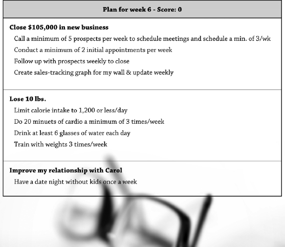
:::

# Don't Go It Alone

The second element of process control is peer support. There was a fascinating article in Fast Company in May 2005, entitled "Change or Die," that presented studies conducted with patients who had severe medical conditions that required lifestyle changes in order to live. The sad fact was that after only 12 months, 90 percent of the patients had reverted back to their old lifestyles, virtually guaranteeing an impending death. Faced with the imminent threat of death, an overwhelming majority of people still failed to consistently make more productive choices.

There was a group that had a much higher success rate---almost seven times greater. These patients were involved in peer support sessions, and they had a success rate of nearly 80 percent. The groups not involved in peer support had a 10 percent success rate. These statistics remind me of what George Shinn, the owner of the Charlotte Hornets basketball team, once said: "There is no such thing as a self-made man. You will reach your goals only with the help of others." The groups involved in peer support met on a regular basis and discussed their progress, struggles, and challenges. By encouraging one another, they generally stayed on track. The lesson is that if you are implementing change, don't go it alone. Your chances of success are seven times greater if you employ peer support.

In working with thousands of clients over the past decade, we have experienced the same dynamic. When clients meet regularly with a group of peers, they perform better; when they don't, performance suffers. We recommend forming a group of two to four committed individuals to meet weekly. We call these meetings WAMs, which stands for Weekly Accountability Meeting. Assuming you've read the chapter on accountability, then you know this meeting is not about trying to hold each other accountable, but rather fostering individual accountability to consistently execute your plan.

The WAM is a critical element of process control. It's a short meeting that is typically held on Monday morning after everyone has had a chance to plan their week and it lasts approximately 15 to 30 minutes. This is not a punitive session where we try to hold others accountable and dole out negative consequences or tongue lashing for those who are faltering. The WAM is used to confront breakdowns, recognize progress, create focus, and encourage action.

Most WAMs loosely follow a standard agenda, as follows. Feel free to amend the agenda as you see fit as long as you keep the focus on the execution.

Weekly Accountability Meeting Agenda

:::::::::: {}
::::::: {}
I. Individual Report Out: Each member states how they are tracking against their goals and how well they executed. Here are four areas to focus on:

::: {}
a. Your results for the 12 Week Year to date.
:::

::: {}
b. Your weekly execution score.
:::

::: {}
c. Intentions for the coming week.
:::

::: {}
d. Feedback and suggestions from the group.
:::
:::::::

::: {}
II. Successful Techniques: As a group, discuss what's been working well and how to incorporate these techniques into one another's plan.
:::

::: {}
III. Encouragement.
:::
::::::::::

The format is pretty straightforward. Each individual gets a few minutes to report out to the group. You will want to comment on your results to date. Are you on track, ahead of where you should be at this point, or behind? Next, you'll tell the group your weekly execution score. (You'll learn how to calculate this in Chapter 16.) You will also announce your intentions for this week as they relate to your execution. Finally, the group will challenge you, congratulate you, and provide feedback and suggestions. After each member has reported out, you can have a short conversation on what members are doing that is working well and is transferable to others' plans and goals. The WAM ends with encouraging the group to have a productive week.

Lezlee Liljenberg leveraged her team's WAMs as the starting point for redesigning how the team spent their days. Here's how Lezlee describes it.

Overall, executing our 12 week plans made us more aware that every day counts! When we started, we assigned each staff member an area of interest, and they created an action plan to grow that area. Each 12 Week Year we evaluated those assignments and realigned what needed to happen accordingly.

Weekly accountability meetings were probably the biggest success of all of the areas for us. When staff began to evaluate all that they achieved on a weekly basis they became more aware of where they spent their time.

We decided to spend a day with each staff person with our only focus being how they spent their day. Doing this we were able to determine where and how they were wasting time. This also helped us to make tough decisions to address some tasks that were more time consuming than productive. The ROI on some of the tasks showed that they were not worth it and needed to be eliminated. If we didn't check in together as a team each week to review our progress we probably never would have done this.

Getting rid of annualized thinking helped us to know we had to hit the numbers quicker and the WAMs helped us to do that. The leader is responsible for making sure the 12 Week Year stays on track and that the group does not venture away from the vision and the 12 week plan. My advice: attend a WAM and stick to your plan, and the 12 Week Year will work!

# The Weekly Routine

The only way you will reach your 12 week goals is by taking action on your plan each day. The weekly plan and the WAM are two steps in a three step process called the weekly routine. These easy-to-follow steps will ensure that you execute each week and accomplish your goals.

The weekly routine consists of three simple, yet powerful steps:

:::::: {}
::: {}
1. Score your week
:::

::: {}
2. Plan your week
:::

::: {}
3. Participate in a WAM
:::
::::::

## Step 1: Score Your Week

In Chapter 16 you will see how the 12 Week Year enables you to effectively measure your execution through a weekly scorecard. This measure, more than any other, is the most powerful indicator of success that you have. As part of your weekly routine, you will want to take a few minutes each week and score your execution. You will learn more details about how to calculate these numbers in Chapter 16, but for now, just know that it is an essential part of your weekly routine.

## Step 2: Plan Your Week

So far, we have talked in detail about the importance of having and working from a weekly plan. If you are using Achieve!, the system will automatically populate your weekly plan with the tactics that are due this week. If you are using a paper system like Freehand, then you will need to refer to your 12 week plan, pull out those tactics that are due this week, and transfer them to your weekly plan. In either case, don't start a week without a weekly plan.

Each week you will need to schedule about 15 minutes to score and plan your week. Approximately 70 percent of our clients perform this task first thing Monday morning. The other 30 percent do it sometime between Friday afternoon and Monday morning. It really doesn't matter when you do it as long as you schedule a time that you can be consistent with each week.

## Step 3: Participate in a WAM

As I discussed previously, your probability of success greatly increases when you meet regularly with a small group of peers. Make a short list of those who you would like to WAM with each week, then contact those people and determine a regular day and time to meet. Also decide if you'll meet in person or over the phone. Have each member enter the WAM in the calendar as a recurring event.

These three simple steps form the basis of your high performance system. The steps are easy to do---and even easier not to do. If you really are serious about your goals, then commit to this weekly routine.

# Thinking Shift

Often people assume that because they know what they need to do, they won't benefit from a weekly plan. Based on numerous studies and our experience with thousands of clients, that is just not the case. A plan between your ears is not nearly as effective as a plan on paper. In our experience, you are 60 to 80 percent more likely to execute a written weekly plan than a plan that is in your head.

Putting your plan to paper eliminates ambiguity and creates transparency. For some, this transparency is excruciatingly uncomfortable and produces all kinds of unproductive thinking that can keep you from creating a clear, written plan. The thinking often goes like this: "I know what I need to do, so I don't need to write it down." Or "I need more flexibility than that. Writing it down just restricts me." Or, here's another one: "I'm extremely busy; I don't have time for that." All of these are excuses designed to avoid personal accountability.

Some people have the same kind of limited thinking when it comes to the WAM meetings. They say, "I don't have time for that," or "Only weak people need that." All of these thoughts and comments are smoke screens that reveal a deeper fear of transparency and accountability.

Make no mistake, you will be more successful if you work from a written weekly plan and meet regularly with a group of your peers! Don't kid yourself; you're not different. To get the most out of your time and life, align your thinking with the benefits of the steps in the weekly routine.

# Team Application

The 12 Week Year is a cultural change, a new way of operating. Lee Iacocca, former automotive CEO, said that the speed of the leader is the speed of the team. As the leader of your group, you ultimately shape the culture of your organization through your conversations, your actions, and your focus. The 12 Week Year is a cultural shift. For the organization to be successful in adopting it as an operating system and achieving the results you desire, you will need to champion the cause.

Because culture is a reflection of the leader, your actions more than anything else will have the greatest impact on determining whether your team fully adopts and profits from the 12 Week Year. Your first task is to model the behavior that you want to see in them. That starts with you adopting the weekly routine, scoring and planning each week, and participating in a WAM.

The next step is for you to individually inspect all of your direct reports' habits. Do they have a plan each week? Are they scoring each week? Are they actively participating in a WAM? There will be times when your people struggle. These are typically the times when they stop planning and scoring and drop out of the WAM groups. This is the exact opposite of what they need; it is critical that they stay engaged. At these times they will need your leadership and encouragement to stay in the game. You will want to formally review their weekly plans and scorecards with them at least once a month in a scheduled one-on-one coaching session.

Occasionally, you may want to sit in on one of their WAM meetings and provide some coaching and encouragement. Keep it positive. Recognize and celebrate early successes and maintain the focus on execution.

# Common Pitfalls

Don't let these common pitfalls rob you of your success.

:::::::::::::::: {}
::::: {}
Pitfall 1: You don't plan each week.

::: {}
Getting off to a fast start each week creates momentum and helps you to be more productive throughout the week. Monday is often a stress-filled day and we can feel behind from the moment it begins. Often at the beginning of the week we just jump right in with email, voicemail, and whatever else may be awaiting us.
:::

::: {}
In addition to just diving into our week, other things can get in the way of us taking time to plan the week---including a negative mind-set. Maybe one of the following thoughts has slowed you down:
:::

- You have no time for it. You think that you're just too busy and that you'll get to it later, but later never comes.
- You don't need it. The misguided thinking that somehow you're the exception and don't need a game plan for the week. Watch how quickly the time slips away!
- You're above it. Thinking that a weekly plan is for beginners and someone in your position doesn't need it.
- You already know it. The thinking that you already know what you need to do, so there's no benefit to writing it down or planning things out.
- You don't want to be accountable. For some, working from a written weekly plan creates a level of discomfort because it continually reminds them when they are not doing what they know they should be doing.
:::::

:::: {}
Pitfall 2: You include all your tasks.

::: {}
The weekly plan does not contain everything you do in your job, just the strategic items from your 12 week plan. You should have a separate sheet with to-do items and callbacks. Do not dilute your plan by adding all the lower-level activities that you do in the course of your day. Keep the weekly plan for only strategic items and commitments.
:::
::::

:::: {}
Pitfall 3: You assume that each week is the same.

::: {}
Another mistake that many make is assuming that each week has the same activity so they create one weekly plan and then copy it each week. It's highly possible that many of your weeks look similar, but it's unlikely that all 12 weeks have the exact same activities due. Even if you are the statistical exception, the benefit of spending five to ten minutes to set up your coming week pays big dividends.
:::
::::

:::: {}
Pitfall 4: You add tactics weekly.

::: {}
Keep in mind that a weekly plan is essentially a one-twelfth slice of your 12 week plan. Occasionally, you may add a tactic to your weekly plan, but this should not happen frequently. Most new tactics should be added to the 12 week plan first, and then flow through to the weekly plan. This prevents you from getting drawn into urgent activities that are not necessarily strategic.
:::
::::

:::: {}
Pitfall 5: You don't use it to guide your day.

::: {}
Once you've created your weekly plan, you will want to use it daily to keep you on track with the activities that are most important to achieving your goals. Check in with your weekly plan first thing each morning, once or twice throughout the day, and before you go home. When you learn to guide your daily activity based on your weekly plan, you will begin to experience truly breakthrough performance.
:::
::::

:::: {}
Pitfall 6: You don't make it part of your routine.

::: {}
Each of us has a routine. Routines are an important part of consistent success. Make the decision right now to incorporate the weekly routine.
:::
::::
::::::::::::::::

# Chapter 16

# Keeping Score

Measurement drives the execution process. It is your touchstone with reality. Truly effective measurement combines both lead and lag indicators to provide the comprehensive feedback needed for informed decision making. It is the feedback loop that lets you know if your actions are effective.

Adam Black discusses the impact that his simple and daily measurement system had on his results.

The 12 Week Year was suggested to me by a business partner at the end of 2011. It was perfect timing. After reading the book several times I knew without a doubt that this system fit me perfectly.

I am the typical Type A personality, hard charging, aggressive, but sometimes missing the small details. With the 12 Week Year, I was able to slow myself down and systematically project what I wanted to achieve in a 12 Week Year in order to ultimately reach my longer-term objectives. I found that the beauty of it was that I could adjust my 12 week plans based on how my numbers moved.

To help me stay focused on my highest value tasks, I created a simple 12 week calendar as a visual aid to measure my progress. The calendar keeps track of my two key daily lead and lag metrics every day. When I go home each night, I now know exactly where I stand in terms of my 12 week goal.

By tying these daily metrics to reaching my 12 week goal for dollar volume and units, I saw an increase of 65 percent in unit and dollar volume in 2012! As a result of applying the 12 Week Year, I've also already met my company's standard to qualify as a Top Producer and will be rewarded with a trip in 2013.

To say that the 12 Week Year has revolutionized my business would be an understatement. With the 12 Week Year it became easier to reach my goals. No more rushing at the end of the year to meet an annual number.

It has actually enriched my life so I can meet my goals, provide for my family and spend more time doing the things I love away from work.

As Adam discovered, measurement doesn't have to be complicated to be effective, but it does have to be timely.

In the best measurement systems, there are lead indicators and lag indicators, as we discussed in Chapter 6. The lag indicators are the end results, and your 12 week goals are the ultimate lagging indicators. If you are tracking progress towards your goals, then you are tracking lag indicators.

Lead indicators are the things that happen early in the execution process. They are the things that drive the lags. Most people are pretty good at tracking the lag indicators, but the opportunity for growth is usually the greatest with the lead indicators.

What are the lead indicators for your goals? Let's say that you want to lose 10 pounds. The total weight goal of 10 pounds is a lag indicator because it happens at the end of the 12 weeks. A good lead measure might be the number of calories that you eat daily or weekly. Another might be the number of workouts you have each week, such as miles jogged, laps swum, minutes on the elliptical---you get the idea. Whatever indicators you decide to measure, be sure to track and record your progress each week of your 12 Week Year!

In general, the more frequent a measure is, the more useful it is. For example, quarterly measures are typically better than annual measures. Annual measures provide feedback only once over a 12-month period, but if you are trying to improve a result and you only measure it once a year, there's no feedback throughout the year to help you determine if your actions are productive or not. Similarly, monthly measures are better than quarterly ones. They provide more frequent feedback. Weekly is better than monthly, and daily is often better than weekly.

With the 12 Week Year, we have you establish 12 week goals, so at the very least you will have a success measure that is no longer than 12 weeks. Even so, you will be well served to identify a set of lead indicators that you can track monthly, weekly, or daily.

At this point you've most likely set your 12 week goals, and built your 12 week plan, so now is the time to establish a set of lead and lag indicators for each of your goals. If you haven't set your goals and created your plan, come back to this exercise after you have completed those steps.

## 12 Week Goal #1

Lead and Lag Indicators

- \_\_\_\_\_\_\_\_\_\_\_\_\_\_\_\_\_\_\_\_\_\_\_\_\_\_\_\_\_\_\_\_\_\_\_\_\_\_\_\_\_\_\_\_\_\_
- \_\_\_\_\_\_\_\_\_\_\_\_\_\_\_\_\_\_\_\_\_\_\_\_\_\_\_\_\_\_\_\_\_\_\_\_\_\_\_\_\_\_\_\_\_\_
- \_\_\_\_\_\_\_\_\_\_\_\_\_\_\_\_\_\_\_\_\_\_\_\_\_\_\_\_\_\_\_\_\_\_\_\_\_\_\_\_\_\_\_\_\_\_
- \_\_\_\_\_\_\_\_\_\_\_\_\_\_\_\_\_\_\_\_\_\_\_\_\_\_\_\_\_\_\_\_\_\_\_\_\_\_\_\_\_\_\_\_\_\_

## 12 Week Goal #2

Lead and Lag Indicators

- \_\_\_\_\_\_\_\_\_\_\_\_\_\_\_\_\_\_\_\_\_\_\_\_\_\_\_\_\_\_\_\_\_\_\_\_\_\_\_\_\_\_\_\_\_\_
- \_\_\_\_\_\_\_\_\_\_\_\_\_\_\_\_\_\_\_\_\_\_\_\_\_\_\_\_\_\_\_\_\_\_\_\_\_\_\_\_\_\_\_\_\_\_
- \_\_\_\_\_\_\_\_\_\_\_\_\_\_\_\_\_\_\_\_\_\_\_\_\_\_\_\_\_\_\_\_\_\_\_\_\_\_\_\_\_\_\_\_\_\_
- \_\_\_\_\_\_\_\_\_\_\_\_\_\_\_\_\_\_\_\_\_\_\_\_\_\_\_\_\_\_\_\_\_\_\_\_\_\_\_\_\_\_\_\_\_\_

## 12 Week Goal #3

Lead and Lag Indicators

- \_\_\_\_\_\_\_\_\_\_\_\_\_\_\_\_\_\_\_\_\_\_\_\_\_\_\_\_\_\_\_\_\_\_\_\_\_\_\_\_\_\_\_\_\_\_
- \_\_\_\_\_\_\_\_\_\_\_\_\_\_\_\_\_\_\_\_\_\_\_\_\_\_\_\_\_\_\_\_\_\_\_\_\_\_\_\_\_\_\_\_\_\_
- \_\_\_\_\_\_\_\_\_\_\_\_\_\_\_\_\_\_\_\_\_\_\_\_\_\_\_\_\_\_\_\_\_\_\_\_\_\_\_\_\_\_\_\_\_\_
- \_\_\_\_\_\_\_\_\_\_\_\_\_\_\_\_\_\_\_\_\_\_\_\_\_\_\_\_\_\_\_\_\_\_\_\_\_\_\_\_\_\_\_\_\_\_

Be sure to track these measures each week. Use a spreadsheet, a word table, or the "Key Measures" section of our website to help you record and monitor your progress.

As we discussed in the first section of the book, the most effective lead indicator you can have is a measure of your weekly execution. It is critical that you measure execution. We have found that if you execute a minimum of 85 percent of the actions due in your weekly plan each week, you are very likely to hit your goals at the end of the 12 weeks.

Whether you use the online tool, our paper system, or a legal pad, taking time each week to measure your execution is essential. [Figure 16.1](#Chapter16.html_figure16-1) is a sample weekly scorecard from Achieve!, our suite of online tools. You can create one almost as easily using our paper-based system called Freehand.

::: {}
[Figure 16.1](#Chapter16.html_figureanchor16-1) Your weekly scorecard shows the percentage of tactics that you completed in the previous week. Score an average of 85 percent or higher, and you are on track to hit your 12 week goal.

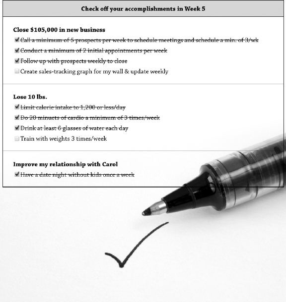
:::

In both cases you'll notice that what you measure on a weekly basis is the execution of your planned tactics, not your results. You simply check off or count up those tactics that you completed last week, regardless of the results you got.

Let's go back to my fitness example. My goal is to lose 10 pounds during this 12 week period. My plan includes tactics like the following:

- Do 20 minutes of cardio a minimum of five times a week.
- Train with weights three time per week.
- Drink at least six glasses of water each day.
- Limit my calorie intake to 1,200 per day.

As part of my measurement system I'm going to weigh myself each week and record my weight, but my weight is a lag indicator, so I'm also going to score my execution. To score my execution in this case, I would identify the number of tactics I completed as a percentage of the number possible. The online system Achieve! does this automatically for me. So if I complete three out of four, my weekly execution score would be 75 percent.

The results measure and the execution measure are separate. In my example, I may have lost two pounds this week but still only scored 75 percent. Because the results are lagging, I want to pay close attention to both measures, and even though I lost two pounds, I did not have a good week from an execution standpoint. What that tells me is that unless I execute better next week, my weight loss will stall out.

# Thinking Shift

This is a major shift in thinking for most people. The thinking shift is twofold. First, is the shift to embrace measurement and not to shy away from it, as is so often the case. Yes, measurement is cold and unsympathetic and at times even harsh. It discounts effort and has no regard for interruptions or distractions, or any other excuse you can muster. But in the end measurement is helpful and necessary. Without measurement there is no way for you to know, unequivocally if you are making progress. Without measurement there is no way for you to know what adjustments would be productive. Without measurement it's virtually impossible to hit your goals.

The second thinking shift is to focus more on the actions than the results. Remember, you have greater control over your actions than you do your outcomes. Your outcomes are driven by your actions. The weekly plan and the weekly scorecard are focused on your actions. The scorecard measures whether you did what you said was most important in order to achieve your goals. As a result, your weekly scorecard is the most accurate predictor of your future. If you faithfully complete the critical actions on a daily and weekly basis, the results will come. So the process is less about the end result and more about the daily actions. That is why the scorecard only measures your execution and not your results.

# Team Application

As a manager or leader, how you think about measurement and how you engage with it will ultimately impact your team's productivity and results. Too many managers mistakenly think about measurement as accountability. This mind-set creates all kinds of dysfunction and barriers to high performance. When managers think this way about measurement, they tend to use it to trigger negative consequences for their direct reports. In other words, when measurement is seen as the accountability system, then managers use measurement and negative consequences to hold people accountable. In this environment, employees and associates quickly learn to avoid measurement---and their manager.

The more you use measurement to trigger negative consequences, the more your team will avoid and even openly resist measurement. Measurement is not accountability; it's simply feedback. The more effective use of measurement is as a feedback mechanism to identify breakdowns, progress, and successes. In this way measurement allows you to confront reality and breakdowns without the pushback and collateral damage associated with negative consequences.

Ideally, you want the performers to measure themselves. If they rely on you to track and tally their key measures, that is often an indication of a lack of ownership on their part. Think about that. If you were really committed to your goals and had a strong desire to accomplish them, wouldn't you track your progress? You know you have ownership when associates measure and track their own metrics.

When your team is on the 12 Week Year you will want to ensure that each of them has established a set of key measures, lead and lag indicators, that they are committed to tracking. This doesn't need to be a long list of measures, but rather just a handful of metrics that provide meaningful feedback to the individual.

In addition, with your team on the 12 Week Year, you now have the platform to coach from. Everything you need to effectively coach your people to higher performance and more consistent results is available through the 12 Week Year. One of those items is the weekly scorecard. As a manager, you'll want to check in with how your direct reports are scoring on a weekly basis. Without even knowing the specifics of an individual's plan, I can ascertain through their weekly score how likely it is that they will accomplish their goals. By inquiring about their weekly scores, you can know immediately if someone is at risk. If you have a direct report who scores less than 60 percent on any given week, it's an indication that they may need some help. One score doesn't make or break a 12 Week Year, but it certainly can be a red flag that some level of intervention is needed if the individual is to have any chance of hitting their 12 week goals.

# Common Pitfalls and Success Tips

Once you have determined your metrics and are tracking them weekly, here are some pitfalls to avoid and tips to make the metrics work for you.

:::::::::::::::::: {}
:::: {}
Pitfall 1: You think that measurement is complicated or unimportant.

::: {}
Too many people use the I'm-not-a-numbers-person excuse as a reason to avoid measuring. Don't let that be you. If you are going to perform at your best and achieve your goals, you will need to measure.
:::
::::

:::: {}
Pitfall 2: You don't schedule a block of time each week to assess your progress.

::: {}
Determine a time each week, either at the end of the week or the first thing Monday morning, and block this time to score your execution, track your indicators, and plan your upcoming week. For most people 10 to 15 minutes is sufficient.
:::
::::

:::: {}
Pitfall 3: You abandon the system when you don't score well.

::: {}
Too often people abandon the system and stop scoring when they have two bad weeks in a row. Have the courage to assess each week and don't back down, even when you have a disappointing week.
:::
::::

:::: {}
Tip 1: Review your weekly score with a buddy or a small group of peers each week.

::: {}
Studies show that when people leverage teams, they get significantly more done on their plans. See the section on WAMs in chapter 15.
:::
::::

:::: {}
Tip 2: Commit to make progress each week.

::: {}
Maybe you can't improve your execution from 45 to 85 percent in one week, but you can move from 45 to 55 or 60 percent. Focus on making progress. The goal is to raise your level of execution each week. A weekly score that is increasing is a positive sign that bodes well for succeeding with your goals.
:::
::::

:::: {}
Tip 3: Remember that a weekly score of less than 85 percent isn't necessarily bad.

::: {}
A score of 65 percent might be an improvement in activity from the past 12 weeks. Even at 65 percent most people will see an improvement in their results. The question you need to ask yourself is this: "Is an execution score of 65 percent enough to accomplish my 12 week goals?"
:::
::::

::::: {}
Tip 4: Don't be afraid to confront what your numbers are telling you.

::: {}
If you are unwilling to confront reality, then you will never be able to change it.
:::

::: {}
When you track leading indicators, your execution system will help you to identify the root causes of any performance breakdowns you may experience. When there is a breakdown in your results, you need to know if it was caused by a breakdown in your execution or your plan content. There's a BIG difference and the only way to know for sure is by measuring both results and execution.
:::
:::::
::::::::::::::::::

# Chapter 17

# Take Back Control of Your Day

One of the barriers that our clients often cite when explaining what keeps them from achieving more of what they are capable of is a lack of time. The lack-of-time reason is so common that it seems very real, yet more often than not, it is a smokescreen that covers over the real barrier. In fact, what most often keeps you from being exceptional is not a lack of time, but the way you allocate the time that you have. I know that sounds like semantics, but it's an important distinction.

Here is an encouraging story of how time blocking allowed Annette Batista to balance competing demands on her time and still excel at what was most important to her.

It has been almost two years since I first read the 12 Week Year. I devoured it and applied the principles not only in my home business but on a personal and professional level as well.

My 12 week goals were to be on pace each 12 weeks for the yearly award given to the top performers and to begin to homeschool my child. In order to do this I knew I needed a good plan.

I am an Outreach Counselor. In that role I educate clients about their medical benefits; I assist them in choosing a medical plan and doctor for themselves and/or their children as well as a dental plan and dentist for their children. To meet my goals, each month I have to complete 650 phone calls and conduct 100 home visits. I also have to do presentations at local agencies, attend health fairs and community meetings, and do a minimum of 15 community contacts each month, 8 of which have to be done face to face. I have an area of six zip codes to cover in two counties.

I worried how I would get all this done. What could I do daily that would get me where I wanted to be by being steady and consistent? My profession is demanding and rewarding at the same time. I am also a wife, mother, and grandmother. Becoming intentional about my plan in order to achieve everything I wanted to do would be critical.

Time blocking effectively helped me to reach my goals. I use buffer blocks each morning, usually for one hour from 7:30 A.M. to 8:30 A.M. to check my email, send out an encouraging word to my colleagues and then prioritize my contact lists by order of importance.

I then move on to the time blocks that I schedule each day to perform my key activities. For the next four hours, 8:30 A.M. to 12:30 P.M. each day, I either make phone calls or home visits. These time blocks help me to stay on top of my very demanding workload.

My time blocking works so well that by Tuesday when I'm supposed to start calling my daily lists, I have already completed them. My weekly call lists are usually completed one to two weeks early each month.

Next come my breakout blocks. After lunch each day, I start homeschooling, which takes me exactly three hours to do. Teaching gives me a break from work. I like teaching and my son enjoys learning. The different subjects we cover---Bible, Language Arts, Science, Math, History, and Geography---provide a great way to tune into several different options within my breakout block. So things are not mundane and boring.

When homeschooling is done I finish my day with another buffer block wrapping up with a few calls, data entry of what has been done for the day, and checking my email one last time before the day ends to make sure nothing major is pending for the next day.

Using the disciplines of time blocking in the 12 Week Year, I have been able to work ahead. Sometimes even two weeks ahead. When I have gone on vacation I have been able to enjoy it because I know I won't have things "pending" or undone when I get back.

I have taken ownership of my plan. I have chosen to excel. My choices have gained me the respect of my manager and supervisor as well as my colleagues, family, and friends.

All this being said, I not only accomplished my goal of earning the Outreach Counselor of the Year Award in 2011---I also received that award this year (2012), something that has never been done before. On a personal level, my husband and I are applying this to our finances and are determined to be out of debt, with the exception of our mortgage by December of next year. We will accomplish in 12 months what would normally take 18 to 36 months.

Effective time use can be the difference between mediocre and great performance. The problem is that the world is rife with potential distractions and interruptions that arise non-stop throughout the day. A study conducted by Eric Horvitz of Microsoft Research and Shamsi Iqbal of the University of Illinois found that after being distracted from serious mental tasks by things like emails or instant messages, the typical Microsoft worker took an average of 15 minutes to get back on their original task.

Further, a 2005 time-use study published by Basex, a business research firm, concluded that 28 percent of the average professional's time in a day was spent on interruptions and associated recovery time! That's about 11 distracted hours in a 40-hour week!

The choices that you make on how you spend your time, ultimately create your results in life. The great people, the giants of history whether in politics, culture, art, science, religion, or any endeavor you can think of, had no more time in each day than you do. What they did with their time made all the difference. The breakdown lies in your moment-by-moment choices. Most people make choices that increase their short-term benefits and minimize their short-term costs.

In 2011, the average American spent 2.8 hours a day watching TV. That's 12 percent of our lives---and that number does not include the hours spent on the newly available entertainment devices such as smartphones and tablets. We often watch TV to escape and to relax. We do it partly because it's easy; we don't have to do anything except change the channel. TV may be beneficial in some ways, but helping us to live a life of significance isn't one of them.

Sometimes the choices you make are not as obviously low-value as your TV and couch time. Some of your choices may make it seem like you are staying busy when in reality you are choosing to avoid your more important, and often more difficult activity. This tendency shows up everywhere in our lives and includes things like following up on emails and messages rather that tackling the more difficult, but higher-payoff activities like making sales calls, exercising, and confronting difficult relationship problems.

Spending leisure time and doing comfortable tasks is undoubtedly healthy in moderation, but when we consistently choose comfortable activity, we are dooming ourselves to lives lived far short of our capabilities. Eventually the excessive time we spend maximizing comfort in the moment leads to inevitable delayed costs and unrealized achievements. As Ralph Waldo Emerson once said, "Eventually everyone sits down to a banquet of consequences."

To become fit requires discomfort, to earn a significant income requires discomfort, to become great at anything, requires you to pay the price. To accomplish what you desire will take sacrifice. The number-one thing you will need to sacrifice is your comfort.

To become great, you must choose to allocate your time to your greatest opportunities. You will have to choose to spend time on the difficult things that create your biggest payoffs. To be great you will need to live with intention. That will require you to be clear on what matters most, and then to have the courage to say no to things that distract you. You will need to guard your time intensely, delegating or eliminating everything possible that is not one of your strengths or does not help you advance your goals.

Based on the talents that you have developed and honed, you have certain strengths and weaknesses. Your strengths and weaknesses taken together, impact your ability to produce the results you seek.

Many people spend significant amounts of time and energy attempting to eliminate their weaknesses. In general, striving to reduce the weaknesses that limit your results is worthwhile and noble. Everyone has weaknesses that they need to shore up to be successful; however, a weakness will rarely become a strength. If you are not in a role that plays to or magnifies your strengths, you are probably in the wrong spot.

In reality, it is the focused and concentrated application of your strengths that will produce your greatest achievements. Successful individuals work to their strengths. Truly outstanding performers have gone a step further and work to what we call their unique capability. Unique capabilities are one or two things you do absolutely the best. They also tend to be the things that you enjoy doing. Whether you know it or not, your unique capabilities are responsible for your greatest successes and joys throughout your life.

To be your best, you must intentionally align your time and activities with your strengths and your unique capabilities. When you do, you will also experience a new and ever-increasing level of performance and satisfaction.

To achieve this level of performance will require that you carve out time for the strategic---those actions that are important, but not necessarily urgent. Strategic activities don't typically have an immediate payback, yet they create substantial returns in the future. To stay focused on your strengths, you will need to manage your interruptions and keep the low-payoff activities to a minimum.

# Performance Time

Effective time use is one of the five disciplines of the 12 Week Year. In combination with the other four---vision, planning, process control, and scorekeeping---it is part of the proven 12 Week Year execution system.

Everything that we achieve in life happens in the context of time. The important things will get done only if you allocate time to them. One of the building blocks of your success is the ability to spend time on what matters most.

Performance Time is an easy-to-use time-blocking system that allows you to operate like the CEO of your business and life by spending your most valuable asset---your time---with intention. Your commitment and ability to apply Performance Time is a manifestation of personal leadership. If you live with the intentionality of effective time use, you will become a more effective leader of those around you, and you will build your business and personal success at a faster rate.

As discussed in Chapter 7, there are three components that form the foundation of effective time use; they are: strategic blocks, buffer blocks, and breakout blocks. Each of these three time blocks is designed to help you accomplish key activities more efficiently.

Strategic blocks are three hours in length and should be scheduled early in your week so that if one gets interrupted or cancelled, you have time to reschedule it. They are blocks of time when you work on your business, not in it. Strategic blocks should also be scheduled during times when your work activity is typically lowest. One strategic block per week is usually adequate.

Buffer blocks are designed to deal with the lower-level activity and are typically between 30 minutes and one hour in length, scheduled one to two times per day. The actual amount of time for buffer blocks will depend upon the amount of email, phone calls, interruptions, and other "administrivia" you normally are required to handle.

Breakout blocks are designed to prevent burnout and create more free time. They are three hours in length, and should be scheduled once a week---after the rest of the 12 Week Year is working for you. We recommend that you only have one per month until everything else is working, and you are executing well.

In addition to these three categories, you will also want to schedule blocks of time to execute other important activities.

# Model Work Week

In order to allocate your time effectively, it's helpful to create a picture of a highly productive week---a model work week. In the following exercise you will create a model week, using time blocks for your critical activities. Allocating your time in this way will enable you to generate the success you desire. The intent is to first design a week that allows you to be your most productive, and then to begin to adjust your actual schedule to align with your model week.

The model week doesn't try to eliminate low-value activities from your week; that doesn't work very well. Instead you will carve out time each week to focus on your high-value, high-payoff activities. If you have a 12 week plan, those high-payoff activities are the actions in your plan.

Pencil in your time blocks, beginning with your strategic blocks, next moving to your buffer blocks, then ending with your breakout block. Then, fill in the other important activities that need to happen each week.

Let's get started. Using the template in [Figure 17.1](#Chapter17.html_figure17-1) complete the following 5 steps.

::: {}
[Figure 17.1](#Chapter17.html_figureanchor17-1) Model work week.

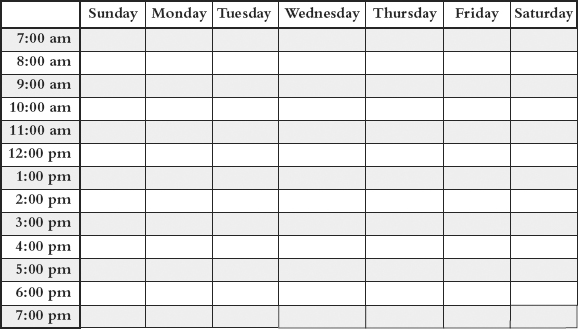
:::

:::::::::::::::::: {}
::: {}
1. Block out 15 minutes first thing Monday morning to review the prior week and to plan for the current week.
:::

::: {}
2. Schedule your three-hour strategic block.
:::

::: {}
3. Schedule one to two buffer blocks each day, Monday through Friday, typically one in the morning and one near the end of the day (e.g., 11:00-12:00 and 4:00-5:00). Remember that the amount of buffer time varies by individual and administrative workload.
:::

::: {}
4. Schedule a breakout block.
:::

::::::::::::: {}
5. Schedule all additional important activities.

::: {}
a. Client and prospect appointments
:::

::: {}
b. Standing meetings
:::

::: {}
c. Marketing and sales
:::

::: {}
d. Planning
:::

::: {}
e. Required administrative and operational tasks
:::

::: {}
f. Preparation for client meetings and customer service
:::

::: {}
g. Project work
:::

::: {}
h. Referral lunches
:::

::: {}
i. One-on-one coaching sessions
:::

::: {}
j. Personal tasks
:::
:::::::::::::
::::::::::::::::::

Initially, it might seem like there is very little time left in your week. While that may be true, if you've done the exercise properly you will notice that all the critical and important activities are accounted for. The items you've scheduled are the tasks that are instrumental in achieving your vision and taking your business to the next level. It is crucial that you construct a week that works on paper before trying to execute it. If you can't get it to work on paper, then there is no way it will work in actual practice.

In the end, everything happens in the context of time. If you are not in control of your time, then you won't be in control of your results. Personal effectiveness is about your intentionality.

## Performance Time Agendas

Following are suggested agendas for strategic and buffer blocks. The agendas will help you leverage these critical time blocks more effectively.

Strategic Block---Sample Agenda, 3 Hours

- Reconnect with your vision: 5-10 minutes. Review your vision and assess your progress. Are you advancing, are you making progress, is there still an emotional connection?
- 12 week review: 10-15 minutes. Review your metrics. Look at your results against your goals. Inspect your weekly execution score and your lead and lag indicators. Are you executing at a high level and is it producing? If not, what can you do this week to improve?
- Assess performance breakdowns: 10-20 minutes. Is there a breakdown? If so, what is the root cause? Do you need to adjust your plan, or just execute better?
- Work on plan tactics: 2--2.5 hours. Use this time to complete tactics from your 12 week plan.
- Other examples of strategic block activity:
  - Read a book.
  - Take an online course.
  - Plan for the next 12 Week Year (most often done in week 12 or 13).

Buffer Block---Sample Agenda, 30 to 60 Minutes

- Review and respond to email.
- Listen to voicemail and respond as needed.
- Make necessary outbound calls.
- Follow up on to-do list items.
- Take quick meetings with staff to answer questions or to plan follow-up.
- Organize and file work in process and completed items.
- Identify any new to-do list items and record.

These agendas are just samples but notice the type of activity in a strategic block versus a buffer block. Strategic blocks are reserved for the critical, high payoff activity, while the buffer blocks are designed to deal with the low-level, busy work.

Performance Time is a unique system for blocking your time out each week. It will help you to allocate time to the things that matter most. What would be different for you if you were consistently able to get more of your most important things done in your life and in your business? Where could you be 12 weeks from now? Three years from now? Often, within just one week of applying the concepts, you will begin to see results, and may feel more in control of your time than you have in years.

# Thinking Shift

Given the value and the limited supply of time, it is interesting that almost all of us have difficulty spending it as effectively as we would like to. Many clients we work with, driven by the natural desire to earn revenue whenever the opportunity arises, will discard their pre-planned schedule without a second thought to accommodate the requests of prospects and clients. They do this repeatedly, seemingly without regard to the long-term impact on their business. In effect, the time that could be spent building their own future is instead spent on building someone else's.

In the final analysis, many of our clients value others' time above their own. To achieve breakthrough, you must come to think about your own time as at least as important as that of your customers. Only in this way can you build your business and, ironically, also improve your client service simultaneously.

Another belief that gets in the way of effective execution and efficient time use, is that you can get it all done. If you assume that when you work fast enough, hard enough, or long enough you can do everything, you are in for an unpleasant surprise. A study from a few years ago found that the average professional has about 40 hours of unfinished work in their queue at any given point in time.

It's important to realize the simple truth that you can't do it all; otherwise you will continue to labor under the false belief that you will eventually catch up, and finally get to the important stuff. You will continue to use all of your time on the urgent day-to-day activity and postpone the strategic that is required to create breakthrough and, ultimately, the life you desire.

If you frequently defer the strategic work to accomplish the urgent, lower-value activities, you will never accomplish great things. If you work under the belief that you can eventually get the important things done by first working through the urgent ones, you will likely never get to the strategic stuff. The thinking that says, "I will start building my ideal future tomorrow, or next week, or next month," is fatally flawed. The future you are going to live is the one you are creating right now at this very moment.

Reaching a breakthrough isn't about being incremental. Breakthroughs require a profound change in the way that you work before it shows up in your results. For some, breakthrough results may mean a 20 percent increase in income. For others, it may mean doubling their business. For still others, breakthrough may be taking more time off while maintaining their income. In each case, creating a breakthrough will require a willingness to change how time is allocated.

These kinds of performance increases may sound inspiring, but if you are already nearing the capacity of your current system, you may honestly feel that there just isn't enough time in the week for a breakthrough. Our clients often view higher performance levels as possible for others, but not possible for themselves. Many times they feel that they are already working too hard, and the thought of working harder to earn more is unattractive. They may even have a real fear of success---the fear that says, "My current system cannot handle the level of activity that will come with greater success."

It seems like common sense to think that you have to work proportionally harder to earn more, but that kind of thinking is exactly what limits what you can accomplish in life.

Think about this: People earning \$1,000,000 per year aren't working 10 times harder than people earning \$100,000. In fact, they are sometimes working less---but they are working differently.

The fact is, you won't reach a breakthrough if you are not willing to change how you currently allocate your time. To get different results, you will have to do things differently and do different things.

Don't let the mechanics blur the concept. To be your best, you will need to carve out time to work strategically. You will need to find a way to efficiently handle the low-payoff activities. And you need time to refresh and rejuvenate.

# Team Application

As a manager, your communication and actions influence the culture of your team. It is important that your words and actions align if you want to have the greatest positive impact.

If you want your team to spend their time with more intention, you need to do so with yours. Create a model work week that incorporates the three core Performance Time blocks and other strategic activity like team meetings and one-on-one coaching sessions, then, commit to working it each week.

If you apply the Performance Time system, you are likely to create benefits for yourself as well as your team. Your team will learn that you have intentionality when it comes to your time, and that creates the space for them to do the same. Additionally, if you have buffer blocks at consistent times each day, your team members will know that they can get your attention at those times and will feel that they have more reliable access to you when they need it.

One client of ours in the financial services industry, found that when he applied Performance Time and scheduled his buffer blocks at the same time each day, he improved the service he was providing to his associates. On the surface that may seem counterintuitive. He was now only available an hour each day for spur-of-the-moment questions and meetings with his team. The rest of the day he was focused on working his plan. What he and his team found was that now they could find him each day like clockwork. They no longer had to chase him to get his attention, not knowing if he would be available to meet with them. Now, his team knows when and where they can find him and they experience a higher level of service even though the time windows for meeting with him are limited to an hour each day.

A third benefit is that when you apply Performance Time yourself, you will also become more grounded in it and have the standing and the experience to help your team members leverage it.

In addition to modeling Performance Time, you can also honor the other members of your team in their application of the system. When they have a strategic block, make it okay to ask you to come back later, and next time try not to interrupt it in the first place.

Everything that you and your team accomplish happens in the context of time---use it with clear intention!

# Common Pitfalls and Success Tips

::::::::::::::: {}
:::: {}
Pitfall 1: You conduct business as usual.

::: {}
It's unproductive to allow your old time-allocation habits to drive your activity. It's easy to fall into your old habits because they are comfortable and you can apply them with little effort. To create new results you will have to be willing to pass through fear, uncertainty, and discomfort, and ultimately create new and more productive habits.
:::
::::

:::: {}
Pitfall 2: You don't focus on one thing at a time in your strategic blocks.

::: {}
Multitasking is seen by many as a virtue. The reality is that multitasking lowers your overall productivity and your results. Instead of increasing your effectiveness, multitasking actually slows you down and increases the chances of mistakes, according to David E. Meyer, Director of the Brain, Cognition and Action Laboratory at the University of Michigan. When you mentally push back a primary task and pick up a new task, you increase the time needed to finish the primary task by 25 percent on average.
:::
::::

:::: {}
Pitfall 3: You allow distractions to steal your attention.

::: {}
In our modern world, technology can be a major distraction. Each day there are more and more opportunities for distractions and avoidance. Allowing smartphones, social media, and the Internet to distract you from your higher value activities will keep you from accomplishing your goals. Some spontaneity is healthy, but if you are not purposeful with your time, you won't tap into your capabilities. Learn to isolate yourself from those distractions when there is important work to be done.
:::
::::

:::: {}
Pitfall 4: You think being busy is the same as being productive.

::: {}
You can work on email, voicemail, messages, and administrative tasks and be busy all day, but those activities don't often drive great results in your life. Sure, you're busy, but are you productive? Learn to prioritize your most important activities and do those things before you work on anything else.
:::
::::

:::: {}
Tip 1: Work from a written weekly plan.

::: {}
A written weekly plan that is tied to your 12 week goals keeps you from allocating too much time to the emergent stuff versus the strategic. By working from a weekly plan and following your model week, you are setting yourself up for success.
:::
::::

:::: {}
Tip 2: Input your model week into your calendar.

::: {}
Set up your calendar with your model time blocks as recurring appointments. This will eliminate many potential scheduling conflicts from week to week. There will be times that you move your time blocks, but most often you won't have to. Even if you travel (like I do) or if your weeks are anything but routine (like mine), you will find that spending five minutes adjusting your time blocks on Monday morning to match your week will probably work for you.
:::
::::
:::::::::::::::

# Chapter 18

# Taking Ownership

We have all heard stories of people who refuse to take responsibility for their actions and blame others for their failures. It's their parents' fault, their boss's fault, the fault of the conservatives or liberals, the cigarette companies, the fast-food industry---the system is out to get them. Whah, whah, whah! Someone or something else is always the cause of their failure. Our culture supports this victim mentality more and more. In fact, our legal system even promotes it. We now reward people for not taking responsibility for their choices and finding someone or something other than themselves to blame.

In spite of the perceived benefits, people with a victim mind-set pay a terrific price. A victim allows his success to be limited by external circumstances, people, or events. As long as we continue to be victims of our circumstances, we will experience life as a struggle and others as a threat.

Accountability, on the other hand, allows you to gain control of your life, to shape your destiny, and to fulfill your potential. In its purest form, accountability is simply taking ownership of one's actions and results. The fact of the matter is that successful people are accountable.

Accountability is not about blaming yourself or punishing others. It is simply a stance in life in which people acknowledge their role in outcomes. Accountability is not concerned with fault, but rather what it takes to create better results. Until we and our organizations accept ownership of our actions and our outcomes, we will be helpless to change or improve our results. Once we accept that our actions have an impact on the outcome then, and only then, are we truly empowered to create the results we desire.

When we acknowledge our accountability, our focus shifts from defending our actions to learning from them. Failures simply become feedback in the ongoing process of becoming excellent. Unfavorable circumstances and uncooperative people don't prohibit us from reaching our goals. We stand in a different way, thereby creating different results.

Here is how Danny Fuentes internalized it.

As I came home from your 12 Week Year seminar I was very enthusiastic and ready to make some needed change in the way I conduct my business, and really get to work.

As it turns out, I could not log on to the system and it took a week and a half to finally get that resolved. By then we were well into the holidays and I was falling right back into the same old "looking for an excuse" mind set. I was feeling that I had not even gotten started and I was already two weeks behind. I certainly could find it easy to blame the lack of access to the website, holiday schedules, and the white-chip busy work that lets me feel like I can justify my job.

In the end, this is simply about being accountable to no one but yourself and not looking for excuses even when they are right there asking you to use them.

It is a difficult adjustment to do the hard things, those things that I have told myself that after 23 years of working here, I deserve not to do.

In the end, it is a great opportunity to use the tools provided to make some needed and sometimes very painful changes. It really came down to the reality that if I am not willing to be disciplined in my daily activity, nothing will change and my vision will never come to pass.

I have no one to blame but myself for my failure or success. The challenge is to somehow stay in the frame of mind that allows me to remember that the little things done today matter.

I am appreciative of your sharing this process in a way that I can internalize to change my way of thinking, and more importantly, doing.

This cannot be the flavor of the month for me. This must be a lifestyle change that I continue to develop and perfect. I am under no illusion that old habits are easy to break. This however, has allowed me to have a process as opposed to just a desire to improve.

Clearly, Danny gets it. There are always roadblocks and setbacks in any worthwhile endeavor and it's easy to use them as reasons---or rather, excuses---why you're not able to complete the work that needs to be done. At times, you might even feel justified in your excuses. There may be certain circumstances beyond your control that derail you, insurmountable obstacles that no one in his or her right mind would expect you to overcome.

When Dustin Carter was a young boy he was rushed to the hospital with a rare blood disease. To save his life the doctors had to amputate both of his arms and both of his legs. Can you imagine? I can't. I've had my share of challenges, but nothing like this. I can't begin to fathom the horror, waking up from surgery with no arms or legs. How do you not feel sorry for yourself, feeling like life has dealt you a bad hand? If anyone ever had a reason to feel sorry for himself, it was Dustin.

The funny thing is that if Dustin felt that way, it wasn't for long. Not only did he not let his physical challenges hold him back, he learned to excel physically. Imagine waking up one day with no arms and legs, thinking about what you want to do in life. Of all the choices you have, wrestler would probably not be high on the list. Not so with Dustin. In fact, wrestling is what he chose to do---and through hard work and hours of training, he became a very accomplished wrestler. Dustin did more than just overcome his physical challenges; he destroyed them! And in the process, became an inspiration to millions of other people who face challenges of all sorts.

Barriers? Really? When I think about what Dustin had to overcome, and I look at the things I let hold me back, I'm embarrassed. What about you? What do you let stand in your way?

Think about the barriers and obstacles that you've let keep you from your goals.

Isn't it time that you stopped making excuses and letting things stand between you and the life you want to have? The life you are currently living is a result of the choices you've made. You can blame the circumstances, your upbringing, your family, the schools you attended, your boss, or the politicians. The fact is, you don't control any of that. What you control is how you respond. Being accountable is not easy, and at times it is very unpleasant, but if you are serious about your goals, you must take ownership of your situation.

Taking ownership means that you stop looking outside yourself. Stop letting all those things keep you from living the life you desire, the life you are capable of. In the end, nobody, outside of a few close friends, really cares if you succeed or not. You can make all the excuses you want; the world doesn't care. As harsh as that sounds, it's the truth. Oh, you may from time to time get a little sympathy, and maybe if you're really lucky a free beer, but that's about it. Giving away your power will never create the success you long for. Resolve right now to never again let excuses get in the way of you achieving your goals.

# Actions to Create Greater Accountability in Your Life

Here are four things you can do to foster greater accountability and get more of what you want in life.

::::::: {}
::: {}
1. Resolve never to be the victim again. You cannot achieve a life of significance if you continue to give your power away. Make a decision to never be the victim again. Notice when you are making excuses and settling for mediocrity. Focus on the things you can control. Accountability is first a mind-set, then an action. To live your vision, take ownership of your thinking, actions, and results.
:::

::: {}
2. Stop feeling sorry for yourself. Feeling sorry for yourself produces nothing but self-pity and, if you do enough of it, depression. It's okay to be disappointed and sad when things don't go your way, but don't let that linger and turn into self-pity. Learn to manage your thinking and your attitude.
:::

::: {}
3. Be willing to take different actions. If you want different results, then you need to be willing to do things differently and do different things. As my friend Lou Cassara, author of From Selling to Serving, says, if you want something you don't currently have, you need to do something you're not currently doing. Taking action will not only change your outcomes; it will also change your attitude. I've found that when I'm feeling discouraged, one of the quickest ways to change my outlook is by taking action.
:::

::: {}
4. Associate with "Accountables." There is a proverb that says, "He who walks with the wise grows wise." Who you associate with matters. Stay away from victims and excuse makers. Treat that mind-set like a deadly, contagious disease. Nurture relationships with people who are accountable. If you have important people in your life that are excuse makers, be a positive influence; have them read this chapter and model accountability.
:::
:::::::

::: {}

------------------------------------------------------------------------
:::

:::::: {}
::: {}
"Everybody, sooner or later, sits down to a banquet of consequences."
:::

::: {}
---Robert Louis Stevenson
:::

::: {}

------------------------------------------------------------------------
:::
::::::

Take a few minutes right now and capture any actions that you would like to take to create more accountability in your life and your business:

::::::::::: {}
::: {}
\_\_\_\_\_\_\_\_\_\_\_\_\_\_\_\_\_\_\_\_\_\_\_\_\_\_\_\_\_\_\_\_\_\_\_\_\_\_\_\_\_\_\_\_\_\_
:::

::: {}
\_\_\_\_\_\_\_\_\_\_\_\_\_\_\_\_\_\_\_\_\_\_\_\_\_\_\_\_\_\_\_\_\_\_\_\_\_\_\_\_\_\_\_\_\_\_
:::

::: {}
\_\_\_\_\_\_\_\_\_\_\_\_\_\_\_\_\_\_\_\_\_\_\_\_\_\_\_\_\_\_\_\_\_\_\_\_\_\_\_\_\_\_\_\_\_\_
:::

::: {}
\_\_\_\_\_\_\_\_\_\_\_\_\_\_\_\_\_\_\_\_\_\_\_\_\_\_\_\_\_\_\_\_\_\_\_\_\_\_\_\_\_\_\_\_\_\_
:::

::: {}
\_\_\_\_\_\_\_\_\_\_\_\_\_\_\_\_\_\_\_\_\_\_\_\_\_\_\_\_\_\_\_\_\_\_\_\_\_\_\_\_\_\_\_\_\_\_
:::

::: {}
\_\_\_\_\_\_\_\_\_\_\_\_\_\_\_\_\_\_\_\_\_\_\_\_\_\_\_\_\_\_\_\_\_\_\_\_\_\_\_\_\_\_\_\_\_\_
:::

::: {}
\_\_\_\_\_\_\_\_\_\_\_\_\_\_\_\_\_\_\_\_\_\_\_\_\_\_\_\_\_\_\_\_\_\_\_\_\_\_\_\_\_\_\_\_\_\_
:::

::: {}
\_\_\_\_\_\_\_\_\_\_\_\_\_\_\_\_\_\_\_\_\_\_\_\_\_\_\_\_\_\_\_\_\_\_\_\_\_\_\_\_\_\_\_\_\_\_
:::
:::::::::::

# Thinking Shift

Accountability is a massive thinking shift. As we've discussed, our society views accountability as consequences. Accountability is not consequences; it's ownership. It is the realization that even though you don't control the circumstances, you do control how you respond. It is the understanding that the quality of your choices determines the quality of your life. It is the recognition that in any situation you always, always, always have choice. The choices you have in a given situation may not be very attractive, but you still have choices, and that is an important and empowering distinction.

How you think about accountability affects everything.

# Team Application

The long-term benefits of accountability are clear: better results, an increased sense of control, less stress, and a greater general sense of well-being, for organizations as well as individuals.

Imagine a scenario where the culture of your company embraces accountability. Where accountability is viewed as positive and where associates willingly agree to accountable relationships. Consider the possibility of an organization where instead of having to hold people accountable, that accountability is simply a part of the way everyone operates.

Leaders need to move beyond the limited notion of accountability as consequences. Every organization we've worked with talks about holding their people accountable. Accountability cannot be imposed, demanded, or coerced. It is an inevitable outgrowth of freedom. As leaders try to hold their people accountable, it puts people on the defensive and unintentionally produces a victim culture. The very act of holding someone accountable leaves no room for the individual to own their actions or the result. Even the most accountable among us naturally push back.

People deliver on what they own. As a leader, one of your main jobs is to foster ownership of the things that matter most. That won't happen if you continue to try to hold your associates accountable.

I'm not saying you don't confront. I'm not saying you don't apply consequences. Consequences play a role in shaping behavior, but you will never get discretionary effort without ownership. You need to create the space for your people to own it.

Here are a few tips on how you can you create accountability within your organization.

- Become aware of victim conversations. Take notice of how you and others in your organization talk about failure. Focus those conversations on first acknowledging reality and then on what can be done differently in the future. Remember that the results we get are directly linked to our thinking. Practice a way of thinking and speaking that recognizes ownership of your actions and results.
- Model accountability. Actions speak louder than words. If you want others to be accountable, then demonstrate accountability in action. Be a role model by making it both expected and safe to embrace accountability.
- Clarify expectations. Accountability starts with clear expectations. Knowing what is expected is fundamental to individual and organizational accountability. As an individual you need to be very specific with regard to the results you're targeting and how you will measure success.
- Learn from life. You will make mistakes. You will not always get the result you're after, especially on the first try. These failures are full of information. Learn to view them as valuable feedback that can be used to improve future outcomes. God has a great way of giving us the same lessons over and over until we learn them.
- Focus on the future. Accountability is not about the past, but about the future. So often we make judgments about the past as either good or bad, when, in many cases, the past just is. Forget about blame, forget about guilt, and move forward by focusing on the future and what you can do to get better results.

Your thoughts and beliefs regarding accountability shape your actions and the results of the organization. What might be different if your view of accountability shifted? How would your culture be different if you confronted advisors and associates with their freedom? How would that change your role and your relationships with your team?

When you as a leader change the way you engage and think about accountability, it will change the conversation, the relationship, the results, and the company!

# Common Pitfalls and Success Tips

::::::::::: {}
:::: {}
Pitfall 1: You continue to view accountability as consequences.

::: {}
By now you should be clear that accountability is not the same as consequences. Continuing to treat accountability as consequences will prevent you from achieving your potential and severely limit those you work with. Write it on a sheet of paper and hang it on your wall: Accountability is not consequences; it's ownership.
:::
::::

:::: {}
Pitfall 2: You look outside yourself.

::: {}
Waiting for things beyond your control to change is another major pitfall. Whether it's the economy, your company, your boss, or your spouse, waiting for something or someone to change is terribly unproductive and frustrating.
:::
::::

:::: {}
Tip 1: Acknowledge reality.

::: {}
As Elizabeth Cady Stanton said: "Truth is the only safe ground to stand on." Accountability deals in reality. When you take full ownership, there is no room for anything less than honest candor with yourself and with others. The situation is what it is. The only chance you have of improving it starts with acknowledging reality.
:::
::::

:::: {}
Tip 2: Focus on what you can control.

::: {}
To be effective you will want to focus on the things that you can control. You don't control the circumstances or others. The only things you control are your thinking and your actions. Spend your energy on the things you control. Work on keeping your thinking and your actions productive.
:::
::::
:::::::::::

# Chapter 19

# 12 Week Commitments

This is an email I received from my friend Mick White.

Today is my 36th birthday. This has been on my heart for a while. It's time to share.

Nearly two years ago (Gregorian Calendar, not 12 Week Year Calendar), we went through the 12 Week Year training. A lot has happened in those two years, personally and professionally. I want to share a story about how the 12 Week Year impacted me personally, as I know you hear all the time about the great things it's doing in our business.

In the afternoon of the second day of the workshop, you walked us through the concept of commitments, and you stated the four keys to successful commitments: 1. Burning desire; 2. Clear actions; 3. Count the costs; and 4. Act on commitments, not feelings. As I thought about what I was going to truly commit to doing (like Noah going after the mosquitoes), I wanted a true commitment that would change my life. I remember writing down my commitment and thinking to myself, "I hope nobody else sees this . . . and I certainly hope Brian doesn't call on me to share my commitments."

You see, I wrote down that I was going to call my Mom every day Monday through Friday. It seems simple, doesn't it?

My Mom and I had a beautiful relationship. She was my biggest cheerleader. I was her rock. There was no woman like my mother. From September 30, 2009, to June 11, 2011, I called my mom every day, Monday through Friday (we took the weekends off). It wasn't always easy to find the time during the day. It wasn't always convenient. And unfortunately, I'm ashamed to say, at times it felt like a burden.

However, I do know this, it was the highlight of my mom's day. Each and every time I called, it was the highlight of her day. Now, looking back, it was the highlight of my day.

Because of that commitment I made on October 1, 2009, my mom and I talked on the phone at least 440 times during those 88 weeks. I have some priceless voicemails, many, many wonderful memories, and a deeper relationship with my mom.

Friday June 11, 2011 was the last day I ever talked with my mom, as she died unexpectedly on Monday morning June 13, 2011.

For my current 12 week plan, I wasn't able to add "Call Mom every day, Monday through Friday" as a commitment. There isn't a day that goes by that I don't wish I could call her, and, on my birthday, I wish I could hear her voice.

The commitment I made changed my life. I'm forever indebted to you. I'm COMMITTED to executing my new plan, as I work to be the person my mom always thought I was.

In this message, I'm struck by how such a seemingly simple commitment can have such a profound effect. Sometimes it's the tiniest of commitments that have the biggest impact when we follow through with them. Twelve week commitments can truly be life changing.

# The Power of Commitments

Commitment is the second of the three principles of the 12 Week Year. It is defined in the American Heritage Dictionary, Fourth Edition, as "The state of being bound emotionally or intellectually to a course of action, or to another person or persons." A commitment is a conscious decision to take specific action to create a desired result.

Commitments are powerful. In a way, commitment is accountability projected into the future. You decide beforehand that you will do whatever it takes to reach your goal, and the more accountable you are, the more likely you will meet your commitments.

::: {}

------------------------------------------------------------------------
:::

::::: {}
::: {}
Commitment: "The state of being bound emotionally or intellectually to some course of action."
:::

::: {}

------------------------------------------------------------------------
:::
:::::

We all have examples in our lives of the power of commitment. A time when we locked on to a goal or objective and were willing to do whatever it took to reach it. Think back on a time like that for you. What were you feeling as you followed through and kept your commitment? How did it feel to reach your goal? How did it make you feel about your ability to reach other goals? How did the vision of your ultimate goal affect your decisions and actions, even when you were faced with adversity or were tempted to give up?

I want to look at commitments on two levels. The first level describes what we refer to as personal commitments, those we make with ourselves. The second is about the commitments we make to others---our word. Let's start with the personal commitments.

# Personal Commitments

A personal commitment is a promise you make with yourself to take specific actions. It may be working out consistently, spending time with the family, stopping smoking, or making a certain number of sales calls each day. Take a few minutes right now and think about two personal commitments that you have made and kept with yourself.

- Identify two personal commitments you succeeded in keeping:

::::::: {}
::: {}
\_\_\_\_\_\_\_\_\_\_\_\_\_\_\_\_\_\_\_\_\_\_\_\_\_\_\_\_\_\_\_\_\_\_\_\_\_\_\_\_\_\_\_\_\_\_\_\_\_\_\_\_\_\_\_\_\_\_\_\_\_\_\_\_\_\_\_\_\_\_\_
:::

::: {}
\_\_\_\_\_\_\_\_\_\_\_\_\_\_\_\_\_\_\_\_\_\_\_\_\_\_\_\_\_\_\_\_\_\_\_\_\_\_\_\_\_\_\_\_\_\_\_\_\_\_\_\_\_\_\_\_\_\_\_\_\_\_\_\_\_\_\_\_\_\_\_
:::

::: {}
\_\_\_\_\_\_\_\_\_\_\_\_\_\_\_\_\_\_\_\_\_\_\_\_\_\_\_\_\_\_\_\_\_\_\_\_\_\_\_\_\_\_\_\_\_\_\_\_\_\_\_\_\_\_\_\_\_\_\_\_\_\_\_\_\_\_\_\_\_\_\_
:::

::: {}
\_\_\_\_\_\_\_\_\_\_\_\_\_\_\_\_\_\_\_\_\_\_\_\_\_\_\_\_\_\_\_\_\_\_\_\_\_\_\_\_\_\_\_\_\_\_\_\_\_\_\_\_\_\_\_\_\_\_\_\_\_\_\_\_\_\_\_\_\_\_\_
:::
:::::::

Now think about what the results were for you when you kept these commitments. How did you feel about yourself? Was it easier to make and keep other self-promises later on as a result of keeping these? How did you feel about your ability to do what it took to get the result no matter what? Capture your thoughts below.

- Benefits of keeping personal commitments:

:::::::: {}
::: {}
\_\_\_\_\_\_\_\_\_\_\_\_\_\_\_\_\_\_\_\_\_\_\_\_\_\_\_\_\_\_\_\_\_\_\_\_\_\_\_\_\_\_\_\_\_\_\_\_\_\_\_\_\_\_\_\_\_\_\_\_\_\_\_\_\_\_\_\_\_\_\_
:::

::: {}
\_\_\_\_\_\_\_\_\_\_\_\_\_\_\_\_\_\_\_\_\_\_\_\_\_\_\_\_\_\_\_\_\_\_\_\_\_\_\_\_\_\_\_\_\_\_\_\_\_\_\_\_\_\_\_\_\_\_\_\_\_\_\_\_\_\_\_\_\_\_\_
:::

::: {}
\_\_\_\_\_\_\_\_\_\_\_\_\_\_\_\_\_\_\_\_\_\_\_\_\_\_\_\_\_\_\_\_\_\_\_\_\_\_\_\_\_\_\_\_\_\_\_\_\_\_\_\_\_\_\_\_\_\_\_\_\_\_\_\_\_\_\_\_\_\_\_
:::

::: {}
\_\_\_\_\_\_\_\_\_\_\_\_\_\_\_\_\_\_\_\_\_\_\_\_\_\_\_\_\_\_\_\_\_\_\_\_\_\_\_\_\_\_\_\_\_\_\_\_\_\_\_\_\_\_\_\_\_\_\_\_\_\_\_\_\_\_\_\_\_\_\_
:::

::: {}
\_\_\_\_\_\_\_\_\_\_\_\_\_\_\_\_\_\_\_\_\_\_\_\_\_\_\_\_\_\_\_\_\_\_\_\_\_\_\_\_\_\_\_\_\_\_\_\_\_\_\_\_\_\_\_\_\_\_\_\_\_\_\_\_\_\_\_\_\_\_\_
:::
::::::::

In Chapter 9 we discussed how powerful commitments are, and yet there are times when all of us struggle to follow through on the commitments we make.

New Year's resolutions are often great examples of this type of struggle. In fact, most New Year's resolutions are abandoned long before the goal is even close to being realized. Let's take a look at why that is. To frame your thinking, we will use an iceberg as a metaphor (see [Figure 19.1](#Chapter19.html_figure19-1)). As you are probably aware, a small portion of an iceberg---approximately 10 percent---is above the waterline, with the bulk of the iceberg submerged below the waterline. What I'm suggesting is that human beings are much like icebergs in that, at any moment, there are only a small fraction of our thoughts, emotions, and physical sensations that we are aware of---above our waterline of consciousness.

::: {}
[Figure 19.1](#Chapter19.html_figureanchor19-1) The Iceberg of Intentions.

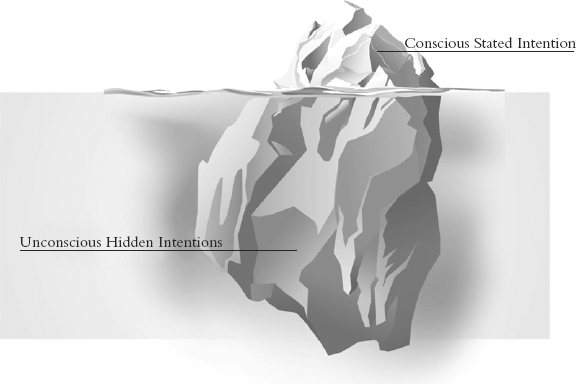
:::

Using the iceberg metaphor where do you think intentions fall: above the waterline or below? If you think about it, you will realize that intentions fall both above and below the waterline.

What this means is that we have intentions that we are aware of---stated intentions---and those of which we are not aware---hidden intentions. Often, the stated intentions which I am aware of are in conflict with intentions that I am unaware of. Let's look at an example of conflicting intentions.

A common New Year's resolution is to lose weight. During our workshop we often ask the question, "Who here is overweight by your own standard?" Typically at least half the hands go up. Consider the question for yourself: Are you overweight by your own standard? If your answer is yes, then you have conflicting intentions. At the 10 percent level, your intention is to reach your ideal weight, but at the 90 percent level, based on results, you have different intentions.

When we ask participants to list some of the hidden intentions we get the following:

- I like to eat and don't want to give up the enjoyment of food.
- I don't want to get out of my warm bed to run in cold weather.
- I don't want to expend effort.
- I don't see myself at that weight; I've always been heavy.
- There is not enough time.

Technically, these reasons are the manifestations of deeper intentions, like the desire for comfort, pleasure, satisfaction, relaxation, entitlement, and so on. The point is that often hidden intentions exist below the waterline and conflict with our stated intentions, so we struggle to keep our commitments and following through on our intentions.

Successful commitment occurs when your stated intentions are stronger than your hidden intentions, or when you consciously reconcile the conflict.

Let's look at a business example. For many sales professionals generating consistent referrals can be the difference between success and failure, but, even sales reps with a stated intention to ask for a certain number of referrals per week, often don't ask. Clearly something is getting in the way. What might be some of the sales reps' hidden intentions regarding asking for referrals?

Possible hidden intentions:

- I haven't earned the referral.
- I don't want to risk the current sale by asking for a referral.
- I have a fear of rejection.
- I don't want to appear needy.
- I want to be liked.
- It might make the situation uncomfortable.

The probability of a sales rep with a set of hidden intentions like these asking for a referral is close to zero. To be effective the rep would need to first know that these intentions exist, and then reconcile them with the desire to gain referrals.

In Chapter 9 we gave you four keys to successful commitments; as a reminder they are:

::::::: {}
::: {}
1. Strong desire.
:::

::: {}
2. Keystone actions.
:::

::: {}
3. Count the costs.
:::

::: {}
4. Act on commitments, not feelings.
:::
:::::::

Now let's put these four keys to use.

::: {}

------------------------------------------------------------------------
:::

:::::::::::::::: {}
::: {}
Commitment Exercise
:::

::: {}
In this exercise we will have you work through the process of establishing a set of 12 week commitments.
:::

::: {}
Below is a 12 Week Year commitment worksheet with steps you can follow to complete:
:::

::::::::::: {}
:::: {}
1. First, determine a few goals that would represent a real breakthrough for you in one of the categories in the commitment wheel: spiritual, spouse/relationship, family, community, physical, personal, or business. Write these goals in the section of [Figure 19.2](#Chapter19.html_figure19-2) titled "Goal Statements." Remember to state these goals positively and with as much specificity as possible; make them measureable. As an example let's use this goal: I will weigh 185 pounds and have 10 percent body fat.

::: {}
[Figure 19.2](#Chapter19.html_figureanchor19-2) Personal commitments are a powerful way that you can create change in your life every 12 weeks.

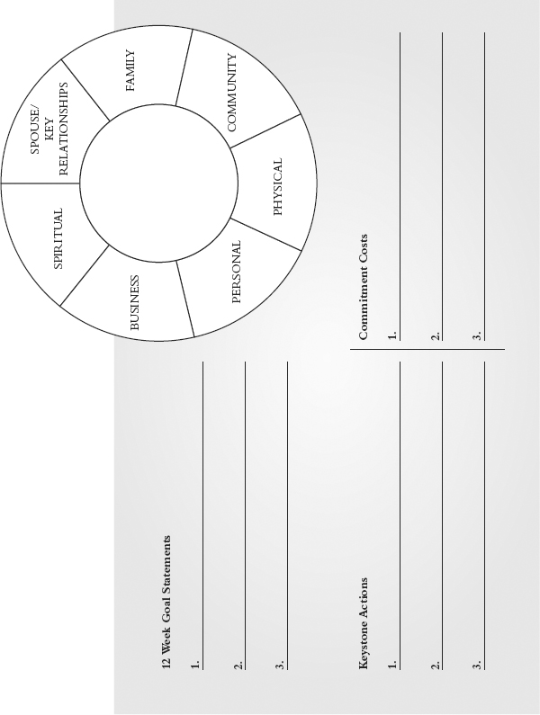
:::
::::

:::::: {}
2. Next identify the keystone action that will have the biggest impact on reaching your goal. It's important to note that we are not saying that this is necessarily the only action that you will need to take; it's just the one with the greatest impact. Ideally, this action is something that you can engage in daily or weekly. Write one action for each goal in the column labeled "Keystone Actions."

::: {}
Sticking with my example of getting in shape, there are a lot of things I can do to lose weight and get fit. The two basic categories are diet and exercise, but within those I have dozens of choices regarding my nutritional choices and exercise habits. I need to choose one action that, more than any other, will positively impact my fitness. Ideally, it should be catalytic in that it will encourage me to do the other actions as well.
:::

::: {}
Personally, if I work out four or more times per week, my eating habits automatically improve, so my keystone action for getting fit is working out.
:::

::: {}
This is an important step because to be successful you will need to not only commit to your goal, but also, more importantly, commit to your keystone action!
:::
::::::

::: {}
3. Now, determine the costs that you will have to pay to consistently take that action every week. Write those in the box under "Commitment Costs." This is where you surface any hidden intentions that may conflict with your stated goal. For example, the costs of working out every day might include giving up TV, cutting back on golf, socializing less, spending less time with my family, getting up earlier, and exercising regardless of how tired I feel. The costs of dieting might include giving up some of my favorite foods, reducing the number of times I eat out, and eating smaller portions.
:::

::: {}
4. Finally, circle the keystone actions for which you are willing to pay the costs. They are now your commitments for the next 12 Week Year! These are the actions that you will enter into your 12 week plan and execute each week.
:::
:::::::::::

::: {}

------------------------------------------------------------------------
:::
::::::::::::::::

# Commitments to Others

The second type of commitment that I want to explore relates to the promises you make to others. To begin to address how to be even more successful in keeping these promises, take a few minutes and answer the questions below:

- Think about a time when someone promised you something that was very important to you and didn't do it. Describe the situation and how it made you feel.
- Recall a specific time when you made a commitment to someone else and you didn't come through. How did they feel? How did you feel?
- What is the impact of broken promises on each party and on the relationships?
- When we ask participants in our workshops to tell us the results of a broken promise, here are just a few examples of comments we hear:
  - Loss of integrity
  - Loss of confidence in the person who let us down
  - Loss of trust
  - Breakdown in relationship

It's a short list, and an ugly one! Not following through on your commitments destroys relationships and contributes to failure and self-esteem issues.

Most relational pain comes as a result of broken promises, either explicit or implicit. Explicit promises are your stated word, while implicit promises are inferred. Some common examples of implicit promises are:

- For a father or mother to protect their children from harm
- For a spouse to love and comfort their partner
- For a leader to provide vision and to act fairly
- For a leader to provide training and development

We all have implicit promises with others that we need to be aware of. What are the implicit promises that you have in your professional and personal life? How are you delivering on these? In what ways can you improve?

Just as there are steps to making and keeping personal commitments, there are also some key steps to keeping your stated promises with others:

- A strong desire to keep your word. If your word means little, then you will struggle to keep your promises. If you understand the fallout of broken promises and the benefits of keeping your promises, and if your word is important to you, then you will be more likely to keep your promises with others.
- Count the costs. Just like with personal commitments it is important to count the costs before making a promise to someone, even though there are times when it is difficult in the moment to stop and consider them. If you commit, only later to realize that you are unable or unwilling to follow through, re-negotiate the promise quickly before it's due.
- Act on your promises. Similar to personal commitments, there will be times when you just flat out don't feel like following through. Those are the times when you will need to intentionally act on your promises, not your feelings.

# Thinking Shift

To be consistent with your commitments will require you to align your thinking with a few core beliefs. The first is that it is okay to say no. People would rather you say no than break a promise. The challenge is that in the moment it can be hard to say no because you don't want to disappoint anyone. They are standing right there in front of you, and you have this opportunity to contribute and help them out. It feels so much better to say yes, than no, but while saying no may disappoint in the moment, it is so much better in the long run than being overcommitted and not delivering on your promises. It's okay to say no; it really is.

Because commitments will require you to sacrifice, in addition to learning to say no, you will need to train yourself to think about and connect with the longer-term benefits versus the short-term inconvenience and discomfort. Delayed gratification is the productive thought. This is not a concept that most people seem interested in, yet it remains the straightest line to your goals. That is why the first key to effective commitments is a strong desire. The commitment mind-set is to choose pleasurable results over pleasurable activity.

With commitments, and anything you are serious about for that matter, don't give yourself a psychological out. Jim Collins wrote a terrific article for Fast Company entitled "Leadership Lessons of a Rock Climber." In it he introduced the concept of failure versus "fallure." Jim used his experience as a rock climber to describe the concept. Here's an excerpt:

Failure and fallure. The difference is subtle, but it is all the difference in the world. In fallure, you still do not get up the route, but you never let go. In fallure you fall; in failure you let go. Going to fallure means full commitment to go up---even if the odds of success are less than 20%, 10%, or even 5%. You leave nothing in reserve, no mental or physical resource untapped. In fallure, you never give yourself a psychological out: "Well, I didn't really give it everything. . . . I might have made it with my best effort." In fallure, you always give your full best---despite the fear, pain, lactic acid, and uncertainty. To the outside observer, failure and fallure look similar (you fly through the air in both cases), but the inner experience of fallure is totally different from that of failure.

You'll only find your true limit when you go to fallure, not failure.

Commitments by definition demand you "go to fallure, not failure." Set it in your mind right now that the process is more important than the result. You don't control the result; what you control are your actions. Don't worry that your goal might be too big or that you might fall short---so what? When you make a commitment, don't give yourself an out.

The final suggestion as it relates to your thinking is this: You need to know that every time you push through the fear, uncertainty, and doubt that accompanies any challenge, the benefits go far beyond the particular situation and shape who you become in the process. There is something empowering and liberating about knowing if you say you're going to do something that you can count on yourself to come through!

# Team Application

As a leader, your ability to make and keep commitments is essential in building and maintaining strong relationships and a productive workforce. Broken promises drain emotional bank accounts and damage relationships.

One of our clients, Jim, the CEO of a successful financial services firm, was meeting with one of his direct reports and sensed an underlying tension. The conversation seemed less open and much more strained than usual, so Jim confronted the problem and asked if anything was wrong. The person pointed out that Jim had agreed to do something but had failed to follow through with it. Until that moment, Jim had been completely unaware of the broken promise. When he looked back through his notes, sure enough, there it was, his commitment to check on an item and get back within the week. At that point two months had passed since he had made the agreement.

What I find interesting about this situation is that the associate had not said anything about it, and may have never said anything if Jim hadn't had the insight to notice and the courage to ask, but clearly it was affecting how he felt about Jim and his working relationship with him.

You are not going to be perfect, but as much as possible, be aware of the commitments you make and do everything in your power to deliver on time.

If you want a culture that is good at keeping commitments and people who follow through on what they say, then be a role model for your team.

# Common Pitfalls and Success Tips

::::::::::::::: {}
:::: {}
Pitfall 1: You miss a commitment once and give up.

::: {}
Sometimes life gets in the way and you are not able to meet your commitments, so you disappoint yourself and others. When this happens, it is important to get right back on the horse. Don't give up!
:::
::::

:::: {}
Pitfall 2: You fail to confront missed commitments.

::: {}
A commitment isn't an interest that gets abandoned when it gets difficult. When things get in the way of meeting a commitment, it is important to dig into why. Confront the breakdown right away and recommit to paying the price. In that way, you grow your ability to make and meet commitments in the future.
:::
::::

:::: {}
Pitfall 3: You don't value your word.

::: {}
Sometimes we make promises that we cannot keep. Many times we know this before we make the promise. We avoid short-term relationship pain by saying yes when we should say no. The problem is that when you break your word, you damage relationships. Others feel that they can no longer trust you. When you value keeping your word, you avoid making promises that you know you cannot or will not keep.
:::
::::

:::: {}
Tip 1: Don't overcommit.

::: {}
Commitments are serious; treat them that way. Don't take on more than you can handle. With personal commitments two or three is usually plenty, and in some cases committing to one thing is even better. With your promises to others, know that most people would rather hear you say no than say yes and not deliver.
:::
::::

:::: {}
Tip 2: Go public with your commitments.

::: {}
If you are serious about your commitments, then tell someone you trust. Any time you tell a friend or coworker about a commitment, it creates an added level of determination on your part to follow through.
:::
::::

:::: {}
Tip 3: Buddy up.

::: {}
As with so many things in life, it's easier with a friend. Where possible, find a friend, coworker, or family member to engage along with you. The support and encouragement increases your odds of success and makes the process more fun.
:::
::::
:::::::::::::::

# Chapter 20

# Your First 12 Weeks

The purpose of this chapter is to give you a proven path for the next 12 weeks so you can apply the concepts of the 12 Week Year in your life and in your profession. We wrote this book with the fundamental intent that it could be executed as written. There is nothing else you need to get going with the 12 Week Year, so let's get started!

Research on what it takes to make change happen, and to sustain it, shows that there are some things that you can do to increase your odds of being successful with the 12 Week Year. The approach we've outlined in this chapter, as well as the fundamental design of the program itself, leverages what it takes for you to change effectively.

As you read through this chapter, feel free to dip into relevant chapters in this book for more detail and ideas to support you. It is our deepest desire to help you create new results in your life. As you apply the 12 Week Year, please email us to let us know how you are doing.

The 12 Week Year is designed to help you to perform at your best through more effective execution, but to realize its full value, there are a few things that will help you to increase your odds of success.

# Resistance Monsters

We would all be great if we did not encounter resistance when pursuing our life's intentions. The reality is, the world requires that an effort be expended to accomplish great things. That effort is what stops many from becoming what they are capable of becoming.

If you have read the book up to this point, you are aware of many of the barriers to change. In fact, the emotional cycle of change maps the emotional response to these barriers over time. The good news is that there are simple things that you can do to overcome these barriers, but first it is helpful to be aware of the barriers themselves.

The barriers to change are the monsters that you will face before you can reach your goals. Just like the monster under your bed at night when you were six, the resistance monster seems much less scary by light of day. So we're going to take a look at some of the most common barriers to change.

There are many great books that dig into the barriers to change; Switch by Chip and Dan Heath, The Power of Habit by Charles Duhigg, Feel the Fear and Do It Anyway by Susan Jeffers, are a few of our favorites. For a deeper dive into the barriers and their solutions, I recommend that you read these powerful books. But for our immediate purposes, I just want to connect the dots between the common barriers to change to establish the rationale for the powerful tools of the 12 Week Year.

# The Need for Immediate Gratification

Given a choice, people choose immediate and certain short-term comfort over potential long-term benefits almost every time, unless there is a compelling reason to choose otherwise. What this means is that even if a change could be hugely beneficial when implemented, if the immediate costs outweigh the immediate benefits, many will choose not to engage.

To change your tendency to choose comfort over growth, the 12 Week Year brings your vision into the present via the 12 week goal. The goal links the actions that you take each day as part of your plan to your long-term vision. That's why one of the recommended actions is that you review your vision for at least a few minutes each day.

One of our clients who is in sales told us that he secretly hated to meet new people! That was an issue in his sales role since meeting new prospects in most cases is the required first step to selling something. He told us that the way he overcame that potentially career-ending issue was that he would pull out his vision just before he walked into a meeting with a new prospect, place it over his steering wheel, and read it aloud. In this way, he reconnected with his personal motivation, his why for doing this job in the first place.

By behaving this way each time he met someone new, he reset his in-the-moment benefit/price equation. Rather than choosing his short-term comfort, he chose his vision instead, and in the process, he chose to meet with new prospects. His vision and his daily actions were intentionally and powerfully aligned.

# Big Change and Multiple Goals

A research study by Amy N. Dalton and Stephen A. Spiller, found that the benefits of planning diminish rapidly, if not altogether, if you pursue and plan with more than one goal.

The study posited that in itself the act of planning for multiple goals discouraged people when they were forced to consider all of the obstacles, constraints, and forgone pleasurable activities, involved in reaching their goals. Intuitively this makes some sense. When people are confronted with a big project such as cleaning a very messy house with multiple rooms and many sub-projects such as piled-high laundry and dirty carpets, they can feel overwhelmed and ultimately fail to take any action at all.

This also makes sense in the context of the emotional cycle of change introduced in Chapter 12. The shift from the first stage of change, uninformed optimism, to the second stage, informed pessimism, begins with the development of a written plan that identifies the costs that must be paid to reach the goal. The way that you think about the magnitude of the execution effort affects your willingness to take action.

Imagine for a moment that you have a plan to balance your personal budget, a weight loss goal with a diet and exercise plan, a plan to get married in six months, and to top it off, you have just taken a new job as a goal-based project manager!

Now imagine that you add one more goal with a plan on top of all that. You decide, for example, to drive from Cleveland to Chicago to attend a wedding this coming Saturday. On top of everything else on your plate, you have added a new goal (to attend the wedding) and a new plan (the directions to get there). According to the research, you should be overwhelmed and, rejecting plans altogether, making decisions on what feels right in the moment.

That's not what you do though, is it? In fact, you get in your car and using the directions you arrive on time and attend the wedding. How is that possible? Well, of course, the answer is obvious: You are only executing against one goal at a time when you are driving. You are not completing a project, balancing your checkbook, or exercising while you drive. You compartmentalize and set aside the divergent goals and their actions and you focus instead on executing your directions one turn at a time until you reach your goal. You don't think about the trip in a way that overwhelms you.

It turns out that using that trip approach works with your other goals as well. The drive confines your focus because you physically cannot do anything else while you drive. You might think about your other goals during the times between lane changes and map checks---on a long stretch of interstate, for example---but when you are actively making turns, all you are doing is focusing on driving.

In the book Switch, Chip and Dan Heath point out that when your perception of the magnitude of a big change shrinks in your thinking, you are more likely to achieve your goal. It is important to note, that the ultimate goal doesn't shrink; it is just your thinking about it that matters.

The Dalton and Spiller study also confirms this. It found that if you think that your plan to reach multiple goals actually is manageable, then you are more likely to execute it and planning becomes beneficial for multiple goals as well. If you think your plan is manageable, you will execute it and benefit from it! In other words, the way you think about your plan, affects your ability to execute!

Switch describes two ways to "shrink" change: First, limit the initial investment in time (e.g., spend five minutes cleaning), and second, set progress milestones that are quickly within reach (clean the small bathroom). By doing this, your thinking about the magnitude of your change shifts, and you can get "unstuck," and begin to act.

The 12 Week Year itself is designed to create a sense of measureable progress right out of the gate. In fact, at this point in your reading you have already successfully taken the first few steps in your first 12 Week Year just by getting this far.

In 12 weeks, your progress is visible and immediate. Your first day with your first weekly plan puts you in an elite group of people who are acting to reach new heights in their lives. If you implement the routines of the 12 Week Year, you are immediately acting to become proficient at execution, a skill that will pay great dividends for the rest of your life.

The disciplines of the 12 Week Year also keep you on track even when you have multiple goals. When you set near-term 12 week goals with daily and weekly actions, you have in essence turn-by-turn directions to achieve each goal. In addition, you track immediate progress each day, while each week, you allocate time in your strategic blocks to keep you focused on one goal and action at a time. Taken together, the components of the 12 week system help you get through the multiple-goal barrier to execution one day at a time.

# Old Habits

Your current actions are creating your current results. To create new results---to reach your 12 week goal, for instance---you will have to do things differently and do different things. The problem is that your existing environment and your old triggers, provoke you to continue with your old behavior loops, your old habits.

In his book, The Power of Habit, Charles Duhigg describes a four-step approach to overcome old habits and to create new ones, and one of the key steps he identifies is to work from a plan. A written action plan, what psychologists call "implementation intentions," helps to create new behaviors even in the presence of your old environmental triggers. A plan creates a new set of conscious action choices that can help produce new results in an old environment.

The weekly execution routine of the 12 Week Year creates a new execution environment with a set of new action cues and planned behaviors that change everything. If you consistently apply the weekly routine your 12 week goal will likely become a reality.

# Victim Thinking

Sometimes people give away their power to the external by seeing their barriers as insurmountable. They would be great, but their circumstances won't let them.

As long as you see the solution to your greatness as being outside of you, you will remain powerless to change. The reality is that the only things you control are the way you think and the way you act; everything else, you can only try to influence. Personal accountability---ownership of your vision, goals, and plan---is the single most important thing that you can do to become great. Re-read Chapters 8 and 18 to remind yourself of the power of accountability as ownership. They are probably the most powerful chapters in the book.

# Your First 12 Weeks

Your first 12 Week Year may well be your most important. If you decide to dabble with the 12 Week Year to get familiar with it, you probably won't see great results. Here is Casey Johnson's experience with dabbling at first, and then what happened when he committed to fully engaging with the system.

To get the most value from the 12 Week Year my advice to you is to sell out to it from the get-go. Set your ego aside and acknowledge that someone else might know some things that you don't, and they might be able to help you get better.

I was first introduced to the 12 Week Year in March when my firm hosted a two-day training session with the authors of the book. At first I wasn't bought in. I dabbled with the concept and didn't see much in terms of improvement.

I thought that I already knew what I needed to do to be successful, and I felt that there wasn't anything that I could learn from the 12 Week Year. It turns out I was wrong.

Three months later in July, my results were not where I wanted them to be and they were well below what I felt that I was capable of delivering. At that point I was presented with the opportunity to hire a 12 Week Year coach and I took it. I decided that I would fully engage with the 12 Week Year for the first time.

As I look back now, that first 12 weeks of full engagement was all about setting up the habit of executing the 12 Week Year process. I set a goal that was a stretch for me and I built a plan that focused on driving my weekly business building activity---asking for referrals in every meeting, and conducting six openers (face-to-face sales calls) each week. I worked to build in the process of using a weekly plan, and I scored myself each week (by the way, don't lie about your score---it won't push you to get better if you do). I met with my coach and attended a WAM each week to help me confront my performance breakdowns.

I changed many things, but the most important might have been that I started to value my time much more than I used to. Time spent has an opportunity cost---now if I am not tenacious about spending it on my highest value activities I feel like I am losing money.

After my first 12 weeks, I had the 12 Week Year successfully installed. My activity was up, and the results were starting to appear. By the end of my second 12 weeks, I had closed more business than I had in the previous year and a half! In my company's annual life (sales) promotion, I was the number 4 agent in the country for delivered first-year commissions at my experience level! I had done OK the year before, but my name wasn't even on the list of top performers. It is now!

I tell anybody that will listen, that if you are thinking about the 12 Week Year, don't dabble---engage.

Casey's story is exciting, but it isn't unique. The 12 Week Year can help you to reach your goals faster than you ever thought possible. The key is to fully engage in the first 12 weeks.

To apply the 12 Week Year well, you will need more intentionality regarding how you think and act each day and week. The good news is that the 12 Week Year is designed to help you do exactly that. Every 12 weeks has a pattern, similar in many ways to a 12 month year.

The first repeating pattern that happens every 12 weeks, is to set (or reconnect with) your long-term vision. The good news is that you have probably already accomplished this step. If not, I suggest that you go to Chapter 13 and create your vision.

After you have determined your vision, the next step in your first 12 week routine is to set a 12 week goal that represents progress toward your vision and that is a great result in and of itself. Once your goal is set, you will build a 12 week plan to reach it.

Creation or refinement of your vision, goal, and plan is something that happens before each 12 Week Year begins.

Your first 12 Week Year is unique. In fact it's helpful to frame it in three four-week periods.

# Your First Four Weeks

Studies have shown that when you are introduced to a new concept or habit, the sooner and more often you act on it, the more likely it is that you will incorporate it into your daily routine.

If the next 12 weeks is going to be a breakthrough for you, it will be because you decided to do the things necessary to drive your performance to new levels. Use the tools and concepts of the 12 Week Year to effectively work the plan that you have created.

Take the time each week for the strategically important items that matter most over the long term.

Focus on the foundational practices of the 12 Week Year and make them yours as quickly as you can. Install the weekly routine and make these three steps your new habits.

:::::: {}
::: {}
1. Plan your week
:::

::: {}
2. Score your week
:::

::: {}
3. Participate in a Weekly Accountability Meeting (WAM)
:::
::::::

To help you execute better it's important to also block your time and track your key measures.

Decide right now to commit to staying on track for your first four weeks. The first four weeks are critical. These first weeks are all about getting a fast start toward your goal, and establishing the 12 Week Year as your execution system. In your first four weeks, use the weekly routine to get some early successes and to establish some new habits. A good start makes the end goal more attainable. Don't start a week without a weekly plan. Each week take a few minutes and score your execution (score from Week 2 on; there is nothing to score until you have finished Week 1).

Attend your Weekly Accountability Meetings and engage. Pay attention to your scores, track your progress, and respond to any performance breakdowns.

# Your Second Four Weeks

You probably know people who tend to start strong with new things but then abandon them before they experience the full results. Don't do that! Seriously, once you start the 12 Week Year, it gets easier and easier each week. It becomes your routine. The second four weeks are important because the newness of the 12 weeks has worn off, and the end of the year is still a way off. There might not be as much urgency for you in these middle weeks.

It is precisely now when you can set yourself up for success for this, and your subsequent 12 Week Years. You should be seeing progress in your lead and lag numbers, your weekly scores should be improving toward 85 percent, and you should have a sense of progress toward your goal. If not, identify the breakdown and commit to resolving it. Whether it's your plan, your execution effort, or both, now is the time to address it. Learning to use the 12 Week Year as a deliberate practice system is a skill that will pay off for you.

# Your Last Four Weeks (and the Secret of the 13th Week)

The last four weeks of the 12 Week Year are your chance to finish strong. Whether you are on track to hit your 12 week goal or not, by finishing strong you will create positive results and set yourself up for the next 12 weeks as well. At this point you have successfully done what most people rarely do, intentionally change the way you think and act to create a permanent leap in your performance and your capacity.

In the first 12 weeks you have two basic goals: One is to hit your 12 week goal, and the other, perhaps more important, is to learn how to apply the 12 Week Year effectively. Make this a learning experience. Pay attention to what worked for you and what didn't. Carry that learning into the next 12 weeks.

That's what the 13th week is for. It's a chance to have an extra week of effort, if you need it to hit your goals. It also provides a time to assess your performance and decide what if anything you will do differently in the next 12 weeks. Finally, Week 13 is an opportunity to recognize and celebrate your progress and success.

# Success Tips

We send out coaching emails to our community at key times over their first 12 weeks. We have collected them for you on the following pages to refer to as reminders during your first 12 weeks to help you stay on track. Bookmark this section and return to it for inspiration. Also, visit our website at [www.12weekyear.com](http://www.12weekyear.com) and sign up for the Weekly Success Tips.

::: {}

------------------------------------------------------------------------
:::

::::::::::: {}
::: {}
Week 2 Coaching
:::

::: {}
Congratulations, you've completed your first week using the 12 Week Year Performance System. If you haven't scored last week yet, take a few minutes now to score it and to plan the upcoming week. Once that is complete, mentally answer the following questions:
:::

- How did you score?
- What were your successes?
- How could you have been more effective?

::: {}
Your first week's score is not all that important. What is important is that you block out time each week to score and plan your week. You've made a commitment to improving and you invested time in determining your future and building a plan to accomplish your objectives. At this point all you need to do is execute your plan.
:::

::: {}
Effective execution takes place daily and weekly. The key to achieving your 12 week goals is to consistently apply the system. Over time, you will see your scores improve. A score trend that is rising is an indication of more effective execution.
:::

::: {}
Remember you don't have to be perfect; just be consistent and persistent. Have a great week!
:::

::: {}
"I don't think there is any other quality so essential to success as the quality of perseverance. It overcomes almost everything, even nature."
:::

::: {}
---John D. Rockefeller
:::

::: {}

------------------------------------------------------------------------
:::
:::::::::::

::: {}

------------------------------------------------------------------------
:::

:::::::::: {}
::: {}
Week 3 Coaching
:::

::: {}
Welcome to Week 3 of the 12 weeks! Wherever you are in the application of the 12 Week Year, that's okay. Don't worry too much about your scores or even if you haven't yet completed a weekly plan and scorecard. The decisive moment is right now.
:::

::: {}
The key to execution is to consistently apply the system.
:::

::: {}
Commit to your vision and your plan, and then re-commit to taking action---starting today. If you haven't yet written your 12 week plan, then do it before the day ends. If you haven't yet completed a weekly plan or scored your week, commit to do it this week.
:::

::: {}
If you have been successful so far in applying the 12 Week Year system, great job! The most important objective during your first few weeks using the 12 Week Year is to engage. Once you are familiar with the routine of daily and weekly execution, then work on improving your weekly scores.
:::

::: {}
Wherever you are, you've made a commitment to improving. You have invested time in envisioning your future and in building a plan to get there. Now all you need to do is execute your plan.
:::

::: {}

------------------------------------------------------------------------
:::
::::::::::

::: {}

------------------------------------------------------------------------
:::

::::::::::: {}
::: {}
Week 5 Coaching
:::

::: {}
Welcome to Week 5. How did you score last week? Are you on track with your 12 week goal?
:::

::: {}
There are seven weeks left in this 12 Week Year. Seven weeks to make good things happen. A 12 Week Year is not a lot of time, so it is essential that you execute this week! Effective execution happens daily and weekly. With only seven weeks left, you can't afford to score less than 85 percent from here on in.
:::

::: {}
Your weekly score matters. You can score less than 85 percent and still experience significant increases in your business; however, you are leaving a lot on the table. The difference between good and great has a bold line of demarcation---it is 85 percent, week after week after week.
:::

::: {}
You are five weeks into the first 12 weeks. What would be different if you had scored 85 percent or better each of the last several weeks? Think about where you would be today. It is amazing the difference in just five weeks! Five weeks of 85 percent or better can change your results; it can change your life.
:::

::: {}
Think about the impact of three or four or five 12 Week Years of 85 percent.
:::

::: {}
Have an 85 percent week!
:::

::: {}

------------------------------------------------------------------------
:::
:::::::::::

::: {}

------------------------------------------------------------------------
:::

::::::::::: {}
::: {}
Week 8 Coaching
:::

::: {}
It's Week 8 already! It's amazing how quickly a 12 Week Year goes by. One interesting thing that often happens around this time in each 12 weeks is what we call productive tension.
:::

::: {}
With the 12 Week Year, there is a clear line-of-sight that is created regarding lack of performance, which existed prior to applying the 12 Week Year but was not so evident. Productive tension is the uncomfortable feeling you get when you're not doing the things you know you need to do.
:::

::: {}
Our natural inclination when confronted with productive tension is to resolve it. In our effort to do this, we generally go one of two ways. The easy way out is to simply stop using the system. In this way you can turn off the light that is shining on your performance breakdowns. Typically this takes the form of passive resistance---you just put off completing a weekly plan and scoring your week, telling yourself that you'll get to it later and later never comes.
:::

::: {}
The other way is to use productive tension as a catalyst for change. Instead of responding to the discomfort by bailing out, use productive tension as an impetus to move forward into the change.
:::

::: {}
Productive tension is exactly what you want to experience. It is the lead indicator of substantive change.
:::

::: {}
If you eliminate bailing out as an option, then the discomfort of productive tension will eventually compel you to take action on your tactics. If turning back is not an option, then the only way to resolve the discomfort is to move forward by executing your plan.
:::

::: {}
Learn to leverage productive tension for more effective execution and greater results. Take action!
:::
:::::::::::

::: {}

------------------------------------------------------------------------
:::

:::::::::::::::: {}
::: {}
Week 11 Coaching
:::

::: {}
Welcome to Week 11. We have just one more week before this year is over. How have you done this year? Will you achieve your 12 week goal? Are you executing your plan?
:::

::: {}
Remember our thinking drives our actions and ultimately creates our results. Are you still thinking that there is a lot of time left in the year or are you focused on the next few days as year-end?
:::

::: {}
In the book Good to Great, author Jim Collins profiles a high-school cross-country running team that has won two consecutive state championships. The program had been transformed from being top-twenty in the state to consistent contenders and state champs. "I don't get it," said one of the coaches. "Why are we so successful? We don't work any harder than other teams. And what we do is just so simple. Why does it work?"
:::

::: {}
The answer might surprise you. The reason the team is so successful is because they finish strong. "We run best at the end of workouts. We run best at the end of races. And we run best at the end of the season."
:::

::: {}
The 12 Week Year is all about finishing strong. The end of the season is now. We have less than two weeks left in the year, less than two weeks to achieve your goals.
:::

::: {}
Focus your energy on finishing the 12 Week Year strong. Next week, next month is too late. What can you do this week? This day!
:::

::: {}
Make a commitment to finish strong:
:::

::: {}
Finish the 12 weeks strong!
:::

::: {}
Finish the week strong!
:::

::: {}
Finish the day strong!
:::

::: {}
Be great!
:::

::: {}

------------------------------------------------------------------------
:::
::::::::::::::::

# Team Application

The first 12 weeks is a critical time for a manager wishing to fully leverage the 12 Week Year. Your team will look to you to determine if this is a new team direction or the flavor of the month.

One important thing that you can do is to recognize progress early and often. Do this both individually and with the team. Create a sense of progress and momentum each week and be sure to recognize process change. You don't control the outcomes, so focus on the process.

Review your direct reports' 12 week plans in the first week. Make suggestions for improvement, as appropriate, but make sure that the writer of the plan maintains control. Don't let your team execute from poorly written plans, especially in the first 12 weeks.

Check in to the Weekly Accountability Meetings (WAMs), if appropriate. Be encouraging! When you attend, bring your weekly plan and your score from last week so you can lead by example.

Be sure to check in individually with everyone on their progress at least once every three weeks. Ask to see their plans, weekly plans, average scores, and lead and lag measures. As the old saying goes, inspect when you expect.

# After-Action Review

One of the qualities of a leader is that they are always striving to get better, and to help their team get better. After-action reviews at the end of the first 12 weeks, and subsequent years for that matter, are an effective way to facilitate learning and improvement for you and your team. An after-action review involves taking time to review and identify what worked and ways to be even more effective next time. Be sure to conduct a robust after-action review at the end of each 12 Week Year.

# Chapter 21

# Final Thoughts and the 13th Week

At the end of every 12 Week Year, there is a 13th week. The 13th week exists as an opportunity for you to review your results from the previous 12 weeks, and to launch you into the next 12 Week Year with fresh goals and a plan to reach them.

This chapter is in a sense the 13th week of this book.

The 12 Week Year is a system that helps you perform better through more effective execution. We hope that by now you can see how the 12 Week Year is a complete system that has everything you need to dramatically improve your results in just about any area of your life. That is if you engage with it.

The power of the 12 Week Year is only realized through application. Tens of thousands of our clients have embraced the system, have executed their plans, and achieved amazing results. It is our sincerest hope that you have big expectations for what the 12 Week Year can do for you.

The 12 Week Year is more than just a system. It is also a community. Our vision is to positively impact as many people as we can. We want to introduce you to people just like you that have successfully engaged with the 12 Week Year. We encourage you to connect with us on Facebook and LinkedIn and join the thousands who are using the 12 Week Year to achieve their goals faster and improve their lives. For additional resources and to connect with other 12 Week Year enthusiasts, visit [www.12weekyear.com](http://www.12weekyear.com) and join the community.

Thank you for buying and reading this book. If you take up these ideas and plant them in your life, we believe that you will come to see this as one of the best investments of your time and money that you will ever make. If the 12 Week Year makes a difference in your life, share it with your friends and coworkers, start a local chapter, or become a certified trainer.

Thomas Edison said that if we only did what we are capable of doing, we would literally astound ourselves. You are capable of great things! You have everything you need to be great right now. Stop waiting for things to be just right and start where you stand. In a very short time, you will be amazed at the changes in your thinking, actions, and results. At the beginning of the book I mentioned that most of us have two lives: the life we live and the life we are capable of. Never settle for anything less than what you are capable of!

We would love to hear how you're doing with the 12 Week Year. E-mail us and let us know.

Be encouraged,

Brian and Michael

:::::::: {}
::: {}
[www.12weekyear.com](http://www.12weekyear.com)
:::

::: {}
Facebook: [www.facebook.com/The12WeekYear](http://www.facebook.com/The12WeekYear)
:::

::: {}
LinkedIn: [www.linkedin.com/in/brianpmoran](http://www.linkedin.com/in/brianpmoran)
:::

::: {}
Twitter: \@brianpmoran; <https://twitter.com/brianpmoran>
:::

::: {}
blog: <http://brianpmoran.com/blog>
:::
::::::::

References

Cassara, Lou. From Selling to Serving: The Essence of Client Creation. Chicago: Dearborn Trade Publishing, 2004.

Collins, Jim. Good to Great: Why Some Companies Make the Leap . . . and Others Don't. New York: HarperCollins, 2001.

Collins, Jim. "Leadership Lessons of a Rock Climber." Fast Company, December 2003.

Dalton, Amy N., and Stephen A. Spiller. "Too Much of a Good Thing: The Benefits of Implementation Intentions Depend on the Number of Goals." Journal of Consumer Research 39 (October 2012).

Deutschman, Alan. "Change or Die." Fast Company, May 1, 2005.

Duhigg, Charles. The Power of Habit: Why We Do What We Do in Life and Business. New York: Random House, 2012.

Heath, Chip, and Dan Heath. Switch: How to Change Things When Change Is Hard. New York: Broadway Books, 2010.

Jeffers, Susan. Feel the Fear and Do It Anyway. New York: Random House, 1987.

Kelley, Don, and Daryl R. Connor. "The Emotional Cycle of Change," in The 1979 Annual Handbook for Group Facilitators, edited by John E. Jones and J. William Pfeiffer. New York: John Wiley & Sons, 1979.

Koestenbaum, Peter, and Peter Block. Freedom and Accountability at Work: Applying Philosophic Insight to the Real World. San Francisco: Jossey-Bass, 2001.

Lohr, Steve. "Slow Down, Brave Multitasker, and Don't Read This in Traffic." New York Times, March 25, 2007.

Malachowski, Dan. "Wasted Time at Work Still Costing Companies Billions," June 2005, [www.salary.com/wasted-time-at-work-still-costing-companies-billions-in-2006/](http://www.salary.com/wasted-time-at-work-still-costing-companies-billions-in-2006/).

Moran, Brian. "Performance Change with Pre-Task Planning Applied Prior to Task Execution." Study conducted in 1989 by Senn-Delaney Management Consultants. Results not published.

Pressfield, Steven. The War of Art: Break Through the Blocks and Win Your Inner Creative Battles. New York: Black Irish Entertainment, 2002.

U.S. Bureau of Labor Statistics. "American Time Use Survey," 2011.

12 Week Year Services

At the 12 Week Year we have a wide array of products and services designed to support individuals and organizations in their quest to be great.

Products and Services offered:

- 12 Week Year Workshops
- Leadership Development Courses
- Consulting Services
- Executive Team Engagements
- On-line Video Courses
- Train-The-Trainer
- Tailored 12 Week Plan Templates
- Self-Study Guides

Also, be sure to check out Achieve! at [www.12weekyear.com](http://www.12weekyear.com), which features our proprietary suite of online tools to help you leverage the disciplines of the 12 Week Year to your greatest advantage.

::: {}

------------------------------------------------------------------------
:::

:::::::::: {}
::: {}
To learn more about our 12 Week Year services:
:::

::: {}

:::

:::::: {}
::: {}
Visit [www.12weekyear.com](http://www.12weekyear.com)
:::

::: {}
E-mail us at: <info@12weekyear.com>
:::

::: {}
Call us at: 517-699-3570 or 877-699-3570
:::
::::::

::: {}

------------------------------------------------------------------------
:::
::::::::::

Have Brian Moran Speak to Your Team!

Brian will inspire your team to achieve more in the next 12 weeks than most will in the next 12 months

Most companies spend considerable time, effort, and money providing new techniques and ideas to their teams, and yet there almost always remains a big gap between learning new concepts and applying them.

"GREAT IDEAS ARE WORTHLESS UNLESS THEY ARE IMPLEMENTED."

Maybe it's time to give them what they really need---a system to execute. Great ideas are not enough. The market rewards only those ideas that get implemented. Let Brian show your team what it takes to execute at a high level and to achieve their goals and aspirations using the 12 Week Year.

Brian's engaging and interactive sessions range from a one-hour keynote to a one-day workshop, and offer fresh insight into what it takes to achieve greatness.

::: {}

------------------------------------------------------------------------
:::

::::::::: {}
::: {}
To hire Brian to speak to your team:
:::

::: {}

:::

::::: {}
::: {}
Visit: <http://brianpmoran.com>
:::

::: {}
Call us at: 517-699-3570 or 877-699-3570
:::
:::::

::: {}

------------------------------------------------------------------------
:::
:::::::::

12 Week Year Coach

For many people, the greatest barrier to reaching their significant 12 week goals isn't a lack of good ideas to try; the most common issue is that their old habits and existing systems will push back against the change.

That's why we offer certified coaching support for the 12 Week Year. Case studies have shown that the support of a coach can increase the odds of success by as much as 95 percent. Our coaches are trained to help you leverage the disciplines and principles of the 12 Week Year in such a way that you reach your goals faster.

A Certified 12 Week Year coach is with you every step of the way, keeping you on track with your goals and plans

We offer coaching programs to suit any need, ranging from a single one-hour kick-off session to a full 12 week individualized coaching program. We also have tailored coaching platforms for executives, individuals, and groups.

::: {}

------------------------------------------------------------------------
:::

:::::::::: {}
::: {}
To learn more about our 12 Week Year coaching programs:
:::

::: {}

:::

:::::: {}
::: {}
Visit: [www.12weekyearcoach.com](http://www.12weekyearcoach.com)
:::

::: {}
E-mail us at: <coach@12weekyear.com>
:::

::: {}
Call us at: 517-699-3570 or 877-699-3570
:::
::::::

::: {}

------------------------------------------------------------------------
:::
::::::::::
