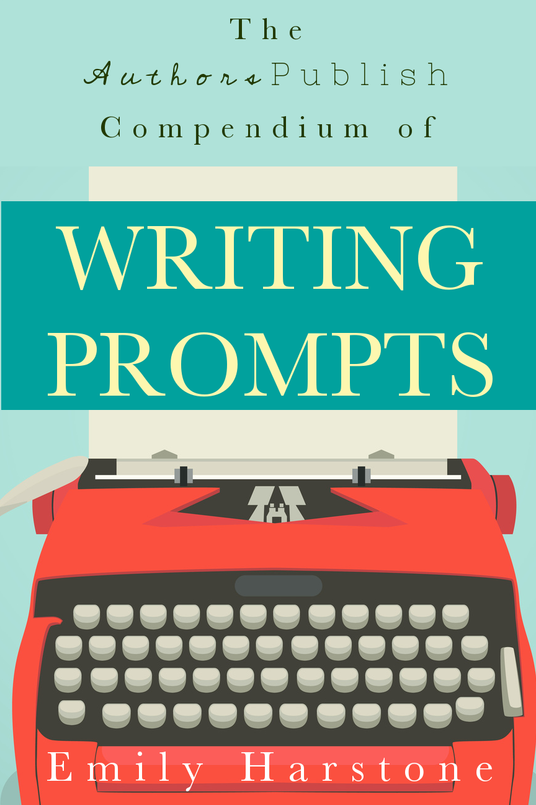

::: {}
<svg xmlns="http://www.w3.org/2000/svg" xmlns:xlink="http://www.w3.org/1999/xlink" version="1.1" width="100%" height="100%" viewbox="0 0 900 1350" preserveaspectratio="none">
`<image width="900" height="1350" xlink:href="cover.jpeg">`{=html}`</image>`{=html}
</svg>
:::

Copyright\*2015\*Authors\*Publish\*Press.\*

All\*rights\*reserved.\*

Do\*not\*distribute\*this\*book\*without\*explicit\*permission.\*\*

\*

To\*download\*a\*copy\*of\*this\*book,\*please\*visit:\*\*

http://www.authorspublish.com/writingFpromptsF compendium/\*

\*

\*

Errors,\*corrections,\*comments,\*complaints,\*etc.,\*should\*be\* sent\*to:\*mailto:support@authorspublish.com\* **!**

\*

\*

Published\*by\*Authors\*Publish\*Press\* Bellingham,\*WA**!** **!**

## The

 

 

Authors ! Publish !

 

Compendium of

!

 

Writing

 

Prompts

 

!

Emily Harstone

## **TABLE OF CONTENTS**

 

\*

 

**INTRODUCTION)** **11**!

 

**REGULAR)WRITING)PROMPTS)** **16**!

Prompt: Three Minute Warm Up \* 17!

Prompt: Eavesdropping \* 20!

Prompt: From The Perspective of... 22!

Prompt: Sentence Stealing\* 23 !

Prompt: First Sentence, Last Sentence 24!

Prompts: Words from Another\* 26!

Prompt: 10 Word Short Story 27!

 

**CLASSIC)PROMPTS)** **28**!

Prompt: Fable 29!

Prompt: Avoidance 31 !

Prompt: Genre Twist 33!

Prompt: Alternative Biography 35!

Prompt: Invasion 37!

Prompt: Personal Apocalypse 39!

Prompt: Absurd Superpower 41!

Prompt: Ghost 43!

Prompt: Time Traveler 45!

Prompt: Castaway 46!

Prompt: The Reader Knows 48!

Prompt: Rear Window 50!

Prompt: Unusual Houses 52!

Prompt: Amnesia 54!

Prompt: Without The Wheel 56!

Prompt: Wrongly Accused 57!

Prompt: Cell Phone Independent 59!

Prompt: Stuck 61!

Prompt: Groundhog Hour 62!

Prompt: A Thousand Years 64!

Prompt: One Last Wish 66!

Prompt: Meet Cute \* 68!

Prompt: Micro Fiction 70 !

Prompt: For the Love of a Good Title 71!

Prompt: The Curse \* 72!

Prompt: We Stayed Up All Night 73!

Prompt: Not A Dream \* 74!

Prompt: Down The Rabbit Hole 76!

 

**PROMPTS)FOR)NOVELISTS)** **78**!

Prompt: The Best First Line\* 79!

Prompt: Character Sketch \* 82!

Character Sketch Questionnaire 83!

Prompt: Circus Time 85!

Prompt: A New Perspective 86!

Prompt: Inheritance 88!

Prompt: Bedroom 89!

Prompt: 50/50 91!

Prompt: Gender Swap 93!

Prompt: Length Play \* 95!

Prompt: The Weirdest Thing 97!

 

**PROMPTS)FOR)POETS)** **98**!

Prompt: Write an Erasure \* 99!

Prompt: A Few Words 101!

Prompt: A Poem in Parts \* 103!

Prompt: Coffee Poem 105!

Prompt: Rhyming Poem 106!

Prompt: Sonnet 108!

Prompt: A Poem and Push Ups 109!

Prompt: Poem Around a Word 111!

Prompt: The First and Last Line \* 112!

 

**PROMPTS)FOR)CREATIVE)NONFICTION)WRITERS)** **113**!

Prompt: Six Word Memoir 115!

\*Prompt: Tell it Slant 116!

Prompt: Family History 118!

Prompt: The Movie Version 120!

Prompt: Travel Tales 121!

Prompt: From Your Parent's Perspective 123!

 

**PROMPTS)FOCUSED)ON)CRAFT)** **124**!

Prompt: Someone that You Used to Know 125 !

Prompt: Four Senses\* 128!

Prompt: No Description 130!

Prompt: Multiple Angles\* 132!

Prompt: Location, Location, Location 134!

Prompt: No Adjectives\* 136!

Prompt: Mad Scientist 138 !

 

**PROMPTS)FOR)GROUPS)** **140**!

Prompt: Twist Ending 141!

Prompt: Folded poem 143!

Prompt: Title, Name, Location, 145!

Prompt: Secret Topic 146!

!

 

::: {}
:::

T h e A u t h o r s ! P u b l i s h ! C o m p e n d i u m o f W r i t i n g P r o m p t s

 

Introduction!

 

Writing prompts are little exercises designed to

help a person start writing. They are often used in classrooms to generate new work, but many creative writers use them daily. Often these writers do not keep the work they generate but use it as a way to jump start their daily writing habit. They move on from the prompt to work on longer pieces in progress. Prompts generally take 3-15 minutes to complete.

Why do writing prompts? They are an excellent way

of combating writer's block. For many people they are a way to start that creative fire when nothing else is working. Others swear by them as a preventive measure, as a great way to ward off writer's block. Prompts are very effective at combating and preventing writer's block, but they also do a lot more then that.

T h e A u t h o r s ! P u b l i s h ! C o m p e n d i u m o f W r i t i n g P r o m p t s

 

Often writing that begins just as a prompt, can be

edited into a poem or a piece of flash fiction, or even expanded into a short story. Some novels have even been generated by prompts.

They are very powerful tools. When I first started

writing, many of the poems I wrote came out of prompts. They really helped improve my craft. Prompts allowed my transition from a teenager that writes into a well-groomed writer.

Whenever I start a prompt, I think of it as an

exercise. I just focus on completing the prompt (in the allotted time, if that is a factor).

Afterwards I might go back and edit it and it might

become a complete poem in its own right; but if I think about that while I am trying to compose the poem that will distract me, and decrease the odds that the prompt will be successful. This is because I write the most unique poems T h e A u t h o r s ! P u b l i s h ! C o m p e n d i u m o f W r i t i n g P r o m p t s

 

when I write for fun. What I mean by fun is just for myself, never planning to publish it or even show it to anyone else.

Prompts are not just about generating writing.

Good prompts also serve secondary purposes. They improve your craft as a writer. Some do this by focusing on character and plot development. Others do it by focusing on certain elements of writing, such as sentence structure or line breaks.

It is hard to focus on details like that organically,

particularly if you are in the middle of a 300 page novel. Prompts allow you to focus on specific elements of craft without being distracted by all the other elements that go into creating a good piece of fiction or a poem.

Writing prompts are invaluable because they help

the writer in all the aforementioned ways. This book contains many writing prompts, most of which have been tested by writing groups, classes, or individuals. These writing prompts serve a wide variety of purposes. Some T h e A u t h o r s ! P u b l i s h ! C o m p e n d i u m o f W r i t i n g P r o m p t s

 

are aimed at groups, but most are aimed at individuals. Some focus on helping poets while others are aimed at novelists.

When you read this book you don't need to read it

in order, cover-to-cover. You can just read the sections that pertain to the kind of writing that you do. Or, you can start with one of the last chapters and then go to one of the first. You also do not have to do all the prompts. Different prompts appeal to different people.

It is good to skim sections that you initially think do

not apply to you. Prompts are difficult to categorize and so many cross over from one area into another. Sometimes the best exercises that get you started writing are very different from what you actually do as a writer.

For example, many fiction writers warm up with a

poetry prompt. Also even though I do not personally publish creative non-fiction, some of my personal favorite prompts belong in that section.

T h e A u t h o r s ! P u b l i s h ! C o m p e n d i u m o f W r i t i n g P r o m p t s

 

Many of the writing prompts in the book were

previously published in Authors Publish Magazine. However, many of them have been edited and updated for this new context. A large number of them are brand new and will never appear in the magazine or elsewhere.

I have put an asterisk (\*) beside the prompts that

have been particularly successful in the past, either in a classroom setting or for the magazine, so that you can start with some of those if you like. No matter how many prompts you have done before, or how few, I hope you can get a lot out of this book.

::: {}
:::

T h e A u t h o r s ! P u b l i s h ! C o m p e n d i u m o f W r i t i n g P r o m p t s

 

Regular!Writing!Prompts!

 

Introduction!

The following prompts are all ones you can do more than once, with very different results each time. The first prompt is one you can do daily, but most of the others require monthly re-visits. Some of my favorite prompts are in this section.

::: {}
:::

T h e A u t h o r s ! P u b l i s h ! C o m p e n d i u m o f W r i t i n g P r o m p t s

**Prompt: Three Minute Warm Up \*** This is a writing technique that is very popular for screen writers. However, it seems to work well for writers of fiction and poetry. I always enjoy doing this writing exercise even if I am not stuck. When I am in the middle of writing something else, doing this exercise before going further helps my writing feel fresh. I recommend that you try doing this exercise daily, if only for a week or two.

First do some arm stretches to get your blood flowing. This is important, because the blood flow actually helps you think better. It might not seem obvious at first, but getting your blood flowing will make your brain work that much better because of the extra blood flow reaching your thought-producing brain cells.

After stretching, write down a title on the top of your page. It should not be very long. Often my titles are very cliché and obvious, like *The Dark Island*, or *The Wishing Well*. T h e A u t h o r s ! P u b l i s h ! C o m p e n d i u m o f W r i t i n g P r o m p t s

 

Next you should set a timer for three minutes. Then you should write as fast as you can until the timer runs out. Don't try to make sense, don't try to match the title, just try to write as fast as you can without even thinking about it. If you are writing as fast as you can, you will end up writing about unusual things. Things you would otherwise never write about.

After the timer is up, your writing might be hard to read, it might not make sense in places, but you will have created something new and interesting. You also will have warmed up your writing muscles, and will be prepared to work on more serious writing.

I do this exercise most days. I recommend that after each session, you should record the number of words you can write in a minute. If you do this exercise often enough, your writing will get faster and faster. When I started I could only write about 120 words in three minutes, and after about a month, I could write 165 words in three T h e A u t h o r s ! P u b l i s h ! C o m p e n d i u m o f W r i t i n g P r o m p t s

 

minutes. Not only that, my writing got more polished, even as it got faster.

::: {}
:::

T h e A u t h o r s ! P u b l i s h ! C o m p e n d i u m o f W r i t i n g P r o m p t s

**Prompt: Eavesdropping \***

One of the best ways to learn how to write natural, compelling dialogue is to listen to people. Not necessarily people you know, because you're likely to get caught up in the conversation yourself and that makes it less about observing and more about discussion.

Instead, to really get a good feeling for how different people talk, you should go to a public place. It could be a coffee shop, or a restaurant, or even a park or a mall, but it should be fairly busy, but not so loud that you can\'t overhear someone.

Bring your notebook so that you can write down the snippets of conversation you overhear. You shouldn\'t just write down the interesting bits, the outrageous statements heard out of context; but instead try to get a better idea of the full range of the conversation.

You don\'t have to write everything down, because it is good to get a feeling for some things just by listening.

T h e A u t h o r s ! P u b l i s h ! C o m p e n d i u m o f W r i t i n g P r o m p t s

 

When you\'re just listening you are more likely to pick up other things, like accents, facial expressions, etc., which can give you a better idea of how the conversation is going.

You can do this exercise numerous times per-day, such as when you are running errands at the farmers market or waiting for a late friend to show up at a coffee shop, but when you do it deliberately you tend to get the best results.

After you have about a half page of notes, or just a quote you find particularly interesting, write a page of mostly dialog, ideally involving two people talking to each other. These two people can be based off the individuals you have observed or they could be entirely created by you.

If you do this exercise enough your ability to write accurate engaging dialog should increase. Also it is a great way to beat writers block.

T h e A u t h o r s ! P u b l i s h ! C o m p e n d i u m o f W r i t i n g P r o m p t s

**Prompt: From The Perspective of...** The goal of this prompt is to take on the perspective of an animal or an intimate object, any animal or intimate object and write from the perspective of that creature or thing.

I love this simple prompt. It is easy and fun to do. I usually set a six minute timer for it, but you can set a longer timer (or a shorter one). Whatever works for you.

I try doing this all the time from all sorts of different perspectives. You learn very different things when writing from the perspective of a tea towel or a badger than you do when writing from the perspective of a person.

::: {}
:::

T h e A u t h o r s ! P u b l i s h ! C o m p e n d i u m o f W r i t i n g P r o m p t s

**Prompt: Sentence Stealing\***

Pick a book from your shelf that you haven't read recently. This book should be one that you enjoy. It can be a book of poetry, or prose, even a play or non fiction. It should not be a dictionary or an encyclopedia.

Start a 10 minute timer, and then open to a random page. Write down the first sentence you see and go from there, making up your own story and plot, doing whatever you want to do, but keeping in mind that first line.

If at any point you get stuck, you just open the book to another page, and choose another random sentence and insert it as the beginning as a new paragraph or stanza. Then proceed from that point.

You can easily repeat this step, of opening up the book and choosing a random line, whenever you get stuck. This is a fun exercise that equals good results.

T h e A u t h o r s ! P u b l i s h ! C o m p e n d i u m o f W r i t i n g P r o m p t s

**Prompt: First Sentence, Last Sentence** This is prompt is a little different. There are two options for it. The first is to do it with a friend, the second is to do it on your own. Pick your option and then proceed.

**Option\'One:**

Ask a friend to write down two sentences. The sentences should be seemingly unrelated.

These sentences are the first and last sentences of your story, the middle is entirely up to you. You just have to start and end with the sentences they wrote.

**Option\'Two:**

Option Two is essentially the same prompt. Except instead of your friend coming up with the sentences, I will. Your sentences are *"He woke in the dark, his feet were cold.*" and *"The hot air balloons were still visible in the distance."* You can choose which sentence to start with and T h e A u t h o r s ! P u b l i s h ! C o m p e n d i u m o f W r i t i n g P r o m p t s

 

which one to end with. But you must start and end your story with the sentences that I wrote.

::: {}
:::

T h e A u t h o r s ! P u b l i s h ! C o m p e n d i u m o f W r i t i n g P r o m p t s

**Prompts: Words from Another\*** This prompt is similar to the sentence stealer prompt, but often produces very different results.

For this prompt I want you to grab a book off your shelf, it should be a book that is written by someone who has a writing style that is very different than your natural style. It can be a book you have read or one you have not.

Browse through the book till you find a page that appeals to you. Then pick up to ten words or phrases from that page. Phrases should contain no more than 3 words.

Write down all these words and phrases at the top of the page that you are working on. Now start to write. You can write a short story, flash fiction, or poem.

Incorporate the words you wrote down into the piece in the order you wrote them down. You end up writing about different things then you normally do, when you are incorporating another person's language into your own writing.

T h e A u t h o r s ! P u b l i s h ! C o m p e n d i u m o f W r i t i n g P r o m p t s

**Prompt: 10 Word Short Story**

This is a prompt I have experimented with over and over again. It is a great challenge to give yourself. Can you tell a complete story using 10 words?

I usually set a timer for five minutes at the beginning of a longer writing session and do this exercise, before turning to the work at hand. It is a great way to warm up and a lot of fun.

::: {}
:::

T h e A u t h o r s ! P u b l i s h ! C o m p e n d i u m o f W r i t i n g P r o m p t s

 

!Classic!Prompts!

 

Introduction!

This is the largest section of the book and the prompts found in this section tend to be reader's and student's favorites. These prompts are fun and can work for most writers regardless of the genre they generally write in.

::: {}
:::

T h e A u t h o r s ! P u b l i s h ! C o m p e n d i u m o f W r i t i n g P r o m p t s

**Prompt: Fable**

A fable is a fictional story that features animals, plants, mythical creatures, inanimate objects or forces of nature which are anthropomorphized, and that illustrates or leads to an interpretation of a moral lesson or point.

Fables are all around us. They were told to us as kids and we repeat them as adults. Fables have been modified over time. Hansel and Gretel were transformed from helpless children to witch hunters with weapons and skills in a recent Hollywood movie. Fables are flexible that way.

In this exercise I want you to take at least 15 minutes to write your own fable. It could be a fictionalized version of your life where suddenly your basil plant can talk to you, or your cat is a runway model. It could be a modernized version of a more traditional fable, or it could be something completely new about a talking tree and a talking car that fall in love.

T h e A u t h o r s ! P u b l i s h ! C o m p e n d i u m o f W r i t i n g P r o m p t s

 

Ultimately the contents are up to you. Your story just has to involve traditional myth elements, including a moral, of some sort.

::: {}
:::

T h e A u t h o r s ! P u b l i s h ! C o m p e n d i u m o f W r i t i n g P r o m p t s

**Prompt: Avoidance**

A lot of writers come back to the same themes again and again, from father issues to aliens; most writers seem to have their private preoccupation. The problem with this is that you want to have work that sounds different, that explores new themes and interesting topics.

For a long time, every piece of writing I worked on had the word 'lull' in it. I also enjoyed writing about dusk and metronomes. Now most of those words are gone from my work, even though I am still writing about the same topic.

One of my students said he can never write a story without starting with a character waking up; another said that she somehow manages to kill a character in every chapter if she doesn\'t stop herself.

One of the easiest ways to be creative and write about new things is to make it clear what you normally write about. Some people are not even aware of their themes or tendencies in their work.

T h e A u t h o r s ! P u b l i s h ! C o m p e n d i u m o f W r i t i n g P r o m p t s

 

For this exercise you are to write down all the themes and words that you tend to use most often.

Then you have to come up with a theme or a plot, or a setting that has nothing in common with what you normally write about. Write for fifteen minutes.

After you are finished, review your work while looking at the list of themes and words that you tend to use. If you managed to use of those words or veer into one of those themes, either cut that part out or start over again.

Even if you never write about this particular setting or theme again, you have stretched your writing muscles in a new way.

::: {}
:::

T h e A u t h o r s ! P u b l i s h ! C o m p e n d i u m o f W r i t i n g P r o m p t s

**Prompt: Genre Twist**

There are writers who always write horror, those who always write romance, and those that jump around a lot from sci-fi to literature and mystery all in the space of one week.

But even for those flexible writers there are genres they avoid. I do not like to read or watch horror, so the idea of writing it, is beyond me. However, this writing prompt is all about getting outside of your comfort zone and trying things you normally would not try.

Think of your least favorite genre, the kind of movie your significant other would drag you to, or the type of book a friend might force you to read. Any genre that makes you uncomfortable will work.

Now your challenge is to write a flash fiction piece (up to 1000 words) or a poem in that genre. You can honor the conventions of that genre or you can ignore them. Or, you can just put a twist in an otherwise time honored T h e A u t h o r s ! P u b l i s h ! C o m p e n d i u m o f W r i t i n g P r o m p t s

 

convention. Perhaps the cowboys in your Western will ride on unicorns rather than horses.

In any event, have fun with this prompt. It is sure to get you out of any writing rut and thinking about new things.

::: {}
:::

T h e A u t h o r s ! P u b l i s h ! C o m p e n d i u m o f W r i t i n g P r o m p t s

**Prompt: Alternative Biography** When my father was young, long before I was born, he was accepted into Stanford University in the math program. He planned to attend Stanford, but instead stopped at Washington State University and decided to stay after touring the art department. He met my mother in a watercolor class. They have now been married for over 35 years.

If I was writing an alternative version of my father's life, he might never have attended WSU. In this version of his life, he would have never encountered my mother, as they would have been in very different geographical locations. All sorts of other options and events would ensue.

With this writing prompt you are given full permission to alter reality; however, you start out by only changing one event, and then by exploring the repercussions of this event.

T h e A u t h o r s ! P u b l i s h ! C o m p e n d i u m o f W r i t i n g P r o m p t s

 

Give yourself about 15 minutes to start, but if the exercise really pulls you in, I encourage you to try it more than once. Each time, alter different events or explore other possible repercussions. You can alter events in your own life or in the life of your family members.

This exercise is all about exploring the fork in the road. The possibilities that lie on the road less traveled. It is also a good creative assignment, with a firm foundation in reality but plenty of room for discovery.

::: {}
:::

T h e A u t h o r s ! P u b l i s h ! C o m p e n d i u m o f W r i t i n g P r o m p t s

**Prompt: Invasion**

You wake up in bed. You hear the sound of a gun being loaded, or a vase being broken, or the door being kicked in.

You start writing from the point of being woken up by a strange and dangerous sound. What happens next is up to you.

You could be writing from your own point of view, or the point of view of a character. In the story the narrator could have been sleeping at home, or in a cabin, a hotel, or a friend's house. The narrator could be in their home town or a strange city.

So many elements of this story are up to you. It is your choice what happens next. This could become a serious story or a comedic farce. The direction you take is completely up to you.

You could even try this prompt in poetic form for a bit of fun.

T h e A u t h o r s ! P u b l i s h ! C o m p e n d i u m o f W r i t i n g P r o m p t s

 

The great thing to do with this prompt is to pass it on to friends so that you see some of the different ways it could be interpreted.

::: {}
:::

T h e A u t h o r s ! P u b l i s h ! C o m p e n d i u m o f W r i t i n g P r o m p t s

**Prompt: Personal Apocalypse**

Everyone seems to be thinking about the end times these days. Apocalyptic and post apocalyptic novels are frequently featured on best-sellers lists. Many authors have found new and inventive ways of destroying the world and bringing about a new era.

However, one of the challenges many authors face in creating these new worlds is the description of how the old era ended and the new one began. Sometimes they just get too caught up in describing how earth is ending that you don't feel any emotions about the destruction.

This prompt is a very simple one. Imagine that the earth or humanity, as we know it, is being destroyed. This destruction can be caused by a tried and true method such as global warming or zombies, or it can be in an inventive and creative way, for example, city sized sink holes.

The way the earth is changed or destroyed is not that important. You don't even need to decide on any one T h e A u t h o r s ! P u b l i s h ! C o m p e n d i u m o f W r i t i n g P r o m p t s

 

method, you can even just have a general idea of how the earth is different, not knowing what made it different.

In this exercise we are not focused on the way the earth is destroyed, but rather on how it affects the main character of your story. You are to write a first person narrative from the point of view of someone who is enduring the apocalyptic, or surviving in a post apocalyptic world.

Give yourself around 30 minutes to write about a particular day or event in this character's life. Focus on how they are reacting to the events around them. Are they astonished by the destruction of earth, or have they just grown accustomed to it? How do they eat? Where do they sleep?

This exercise is a lot of fun because it stretches creative muscles. It also helps you create a character on the spot. A character that has survived an apocalypse is probably a little different than one that can pick up take-out at the mall.

T h e A u t h o r s ! P u b l i s h ! C o m p e n d i u m o f W r i t i n g P r o m p t s

**Prompt: Absurd Superpower**

As a child I often imagined myself or my characters with superpowers ranging from invisibility to wings. Now that I am an adult, I like to play with superpowers that are more unusual, perhaps even deeply impractical.

Today's writing prompt is to write for fifteen minutes about a human being that has a strange ability. They could have always had this ability or it could have been gifted to them later in life by a meter maid, or a lightening strike or any number of things.

The main point of the prompt is not how they got this ability, but rather what it is, and how it changes their life. This ability shouldn't be anything incredible or predictable, like super strength or x-ray vision. It should be something unexpected.

For example, your main character could have the ability to know everyone's full given name, without anyone telling them that name. Any new person the main character T h e A u t h o r s ! P u b l i s h ! C o m p e n d i u m o f W r i t i n g P r o m p t s

 

passes by on the street would have their name spelled out and floating near their shoulder.

Or your main character could have the ability to speak with bugs. Or perhaps they could turn any dairy product into a soy product just by touching it.

In this prompt you are to focus on the absurdity of having a secret ability and how it might affect one's life to have a strange gift that no one else would have.

This prompt is a great way to exercise your imagination and have fun.

::: {}
:::

T h e A u t h o r s ! P u b l i s h ! C o m p e n d i u m o f W r i t i n g P r o m p t s

**Prompt: Ghost**

We are not looking for traditional ghost stories here. We don't want you to retell the ghost story that your cousin told you around the campfire in ninth grade.

Your ghost story must include five of the following ten words: marriage, lake, cell phone, bookstore, manicure, stiletto, champagne, disco, clarinet, or chocolate.

The more of these words you use the funnier, strange, and challenging the assignment becomes. Some of the best writing occurs when we stop writing about what we are normally preoccupied with and start writing about words and ideas that would not normally occur to us.

There is one more element to this writing prompt, you are not permitted to use any of the following five words in your story: pale, white, sheet, spirit, and fluttering.

By avoiding these words, we avoid some of the cliché language and imagery that has developed around T h e A u t h o r s ! P u b l i s h ! C o m p e n d i u m o f W r i t i n g P r o m p t s

 

ghosts. We are forced to breathe some fresh air into this haunted genre.

Just write whatever your heart desires while following the aforementioned rules. Your version of a ghost story can be silly, scary, twisted, absurd, whimsical, or anything you want it to be. Have fun with the language, play with the genre, and create something new.

::: {}
:::

T h e A u t h o r s ! P u b l i s h ! C o m p e n d i u m o f W r i t i n g P r o m p t s

**Prompt: Time Traveler**

The writing prompt today is simple. There are no catches, no hitches, no hidden rules.

Set a timer for twenty minutes and start writing about your main character, a time traveler.

Your main character does not need to travel in time during the story itself, but the fact that he or she can travel in time has to affect the way they act and interact with other people. It has to be one of the central aspects of their character, although certainly not the only aspect.

Your short story can cover anything: A trip in time, the time traveler at home with their partner, the time traveler trying to fix their machine, the time traveler passing through time without a machine.

The possibilities are endless so start your timer and get writing.

T h e A u t h o r s ! P u b l i s h ! C o m p e n d i u m o f W r i t i n g P r o m p t s

**Prompt: Castaway**

Your main character is stuck on a small island with only three items. You get to decide what three items. They could be deeply practical items like a water filter and a lighter or they can be purely random, unpractical items like lipstick and hairspray.

The main character must be alone. There are no other people on the island. There can be animals though.

How your character ended up on this island is up to you. Your character doesn't have to be shipwrecked; he could have been on a plane that crashed or she could be a survivalist who was deliberately stranded on the island for a period of time.

You also get to decide what your character's focus will be. Will he or she be determined to survive or to escape, or is there a third option? Maybe they will use all that free time to write poems. Their fate is up to you.

T h e A u t h o r s ! P u b l i s h ! C o m p e n d i u m o f W r i t i n g P r o m p t s

 

Don't spend too long planning this writing, just picture a main character and an island in your head and start writing, see where the words lead you.

::: {}
:::

T h e A u t h o r s ! P u b l i s h ! C o m p e n d i u m o f W r i t i n g P r o m p t s

**Prompt: The Reader Knows**

Most of Shakespeare plays hinge on the fact that the audience knows more than the characters. In Romeo and Juliet, we know that Juliet is not actually dead, even though Romeo takes his own life believing that she is already dead. In the Twelfth Night we know who is a male pretending to be a female and who is a female pretending to be a male, even if most other characters don't seem to have a clue.

Many authors rely on this technique. It easily creates humor and tension in stories. For this writing exercise we are going to do that for our readers. Write about a theft, the theft is an inside job. For example, a husband stole something from his wife, or a wife stole something from her husband. The exact details are up to you.

While writing this, make sure that the reader knows who stole what, but that all the other characters, except the thief, haven't a clue what is going on. If there are very few T h e A u t h o r s ! P u b l i s h ! C o m p e n d i u m o f W r i t i n g P r o m p t s

 

characters, perhaps only the husband and the wife, the story will most likely be more humorous, but it ultimately depends on what was stolen.

If the item is something trivial like a list, cookies, or a piece of stage jewelry, it will most likely be a comedic story. But if the item was something of value, like a rare antique, a family heirloom, or a love letter, the stakes are altered entirely.

Have fun coming up with the details, and exploring this new situation.

::: {}
:::

T h e A u t h o r s ! P u b l i s h ! C o m p e n d i u m o f W r i t i n g P r o m p t s

**Prompt: Rear Window**

Rear Window is a classic Alfred Hitchcock movie starring Jimmy Stewart as a professional photographer stuck in his tiny New York apartment because of an accident.

He has very little to do all day, which has turned him into a watcher.

The rear window of his apartment faces a courtyard where he can see lots of other people in their gardens and apartments, going about their business. It's mostly casual entertainment until he thinks he sees a murder.

The rest of the movie is focused on proving to the police that a woman was killed. There is humor as well as terror in the movie. Rear Window has influenced a whole genre of claustrophobic thrillers.

Today your prompt is to come up with your own rear window plot. The details are up to you. You get to decide who the main character is and why they are essentially T h e A u t h o r s ! P u b l i s h ! C o m p e n d i u m o f W r i t i n g P r o m p t s

 

trapped in their apartment or house. You also decide what city or town are they living in and who lives nearby

You also get to decide what they think they see happening (a murder, an affair, etc.) and if they are in fact correct in that assumption.

I really like this exercise because it balances flexibility with structure. This is an opportunity to create something new within the comforting constructs of the pre-existing structure.

::: {}
:::

T h e A u t h o r s ! P u b l i s h ! C o m p e n d i u m o f W r i t i n g P r o m p t s

**Prompt: Unusual Houses**

When I was growing up I was obsessed with the Boxcar Children, not the later books when the children were wealthy and supported, but the first book when they were making a life for themselves in an abandoned boxcar. The books where homes were established in churches, barns, buses, boats, and trees all captured my imagination.

In this writing prompt imagine a story centered on a main character or a group of main characters who live in or are building an unusual house for themselves. The traditional way to do this, in books like *'My Side of the Mountain'* or *'The Boxcar Children'* is to follow a child protagonist as they flee their parents or social services. However, that does not need to be the case.

If you don't feel like writing a whole narrative about why these characters have come to live in this house you can discard the characters and instead focus on providing details about the house. Is it made from scratch, or a T h e A u t h o r s ! P u b l i s h ! C o m p e n d i u m o f W r i t i n g P r o m p t s

 

modified rocket ship, or something else entirely? What does it contain? What does it look like? How does it function? These are all details you can include.

In fact, if you start describing the modified house you might find that a much larger story extends from it. By describing the house, you might even learn who made it and who lives in it. This is a fun exercise because it stretches the imagination and allows for unusual thoughts to occur.

::: {}
:::

T h e A u t h o r s ! P u b l i s h ! C o m p e n d i u m o f W r i t i n g P r o m p t s

**Prompt: Amnesia**

Amnesia has been a great literary prop for centuries. One of the greatest action characters of our time had amnesia: *Jason Bourne*. But he is not the only one. In *See Jane Run* by Joy Fielding the main character has amnesia. The same is true of *Before I Go to Sleep* by S.J. Watson.

However, this prompt does not require that your main character has amnesia, but just that one of your characters does. It has to affect the way the story proceeds in one way or another.

The other decision you have to make is what kind of amnesia your main character has. The two main kinds are Anterograde amnesia and retrograde amnesia. Anterograde amnesia is an inability to create new memories after the event that caused the amnesia. Long term memories are intact but nothing from the recent past.

T h e A u t h o r s ! P u b l i s h ! C o m p e n d i u m o f W r i t i n g P r o m p t s

 

Retrograde amnesia is where most memories created prior to the event are lost, but new memories after the event remain intact. Both can occur at the same time in the same person.

This is a fun exercise because you get to play with unusual parameters, however the details, the plot, the point of view, and the kind of amnesia, are all up to you.

::: {}
:::

T h e A u t h o r s ! P u b l i s h ! C o m p e n d i u m o f W r i t i n g P r o m p t s

**Prompt: Without The Wheel**

This writing prompt is to write a short story set in an alternative reality. We are still on earth in this story but on an earth where the wheel has never been invented. The world still works, technological advances still occurred, but there are no wheels.

Write a short story involving this world. It can directly address the fact that there are no wheels or it can just focus on characters and actions that are happening in this world. The details are entirely up to you.

The real challenge with this prompt is to get your mind to work in a different way than it usually does. For writers that usually write pieces focusing on the normal drama of everyday, this can be particularly helpful.

T h e A u t h o r s ! P u b l i s h ! C o m p e n d i u m o f W r i t i n g P r o m p t s

**Prompt: Wrongly Accused**

In '*The Fugitive'* a doctor is accused of killing his wife. In '*Double Jeopardy'* a wife is accused of killing her husband. Both did not commit the crime they are accused of. They are both innocent. That has been a reoccurring theme in movies and literature for a very long time.

It can be a lot of fun to play with this theme. You can learn a lot by putting characters, new or already created, in such an unusual situation.

You should write this prompt from one character's point of view. This main character does not have to be accused, but they can be. They can also be a detective investigating the case, or a close friend or family member of the accused.

The story can take place at any point during the plot. You don't have to write the whole story arc. You could just focus on the initial accusation, or on the trial, or any other aspect of the story.

T h e A u t h o r s ! P u b l i s h ! C o m p e n d i u m o f W r i t i n g P r o m p t s

 

Just think of this as a 15 minute exercise, and it is up to you whether you want to write more. You don't even have make it clear that one of the characters is falsely accused, however it should be something that you keep in mind.

Explore this prompt; it is a good way to see how characters react under pressure.

::: {}
:::

T h e A u t h o r s ! P u b l i s h ! C o m p e n d i u m o f W r i t i n g P r o m p t s

**Prompt: Cell Phone Independent** Chris Carter, the creator of the X-files has talked about how the series would not have worked before the invention of cell phones. Many books and stories now rely on the ease of communication that cell phones bring.

Ann Patchett, the author of Bel Canto, has mentioned on several occasions that her latest novel was set in the Amazon because she wanted to tell a story that drew its tension from the lack of communications, a tension that could be resolved with cell phones.

Ann visited the Amazon before finishing the book. She was tramping through a remote region with a group on a tour when a man's phone started to ring. It was a friend calling to schedule a round of golf. Ann decided that her readers didn't need to know that. For the purpose of her story the Amazon could remain a remote, signal-free jungle.

The challenge for this prompt is to write a story that does not rely on technology but instead, focuses on T h e A u t h o r s ! P u b l i s h ! C o m p e n d i u m o f W r i t i n g P r o m p t s

 

communication, and the tension that a lack of communication can bring.

Where you take the details of this prompt are entirely up to you; just make sure that none of your characters can use their cell phone.

::: {}
:::

T h e A u t h o r s ! P u b l i s h ! C o m p e n d i u m o f W r i t i n g P r o m p t s

**Prompt: Stuck**

Imagine that a character is trapped somewhere. It could be a small room, a well, a crashed car, a stuck elevator, or any number of small claustrophobic spaces.

They have been stuck there for at least thirty minutes when you start writing your story. This is important because they already have to be nervous at this point.

All the other details are up to you, but there are many important factors to consider. Can they communicate with anyone on the outside? Do they need to be somewhere else urgently? Are they alone in that space? How did they get there? Is this a matter of life and death or just an inconvenience? Are they naturally a little claustrophobic?

Set a timer for 15 minutes while writing this and find out where the prompt takes you. When the time is up the character might still be stuck in the space or they could be free. That is up to you.

T h e A u t h o r s ! P u b l i s h ! C o m p e n d i u m o f W r i t i n g P r o m p t s

**Prompt: Groundhog Hour**

*'Groundhog Day'* is a movie about a TV weatherman played by Bill Murray. His character relives the same day over and over again for almost the entirety of the movie. Only he knows that he is reliving the day over and over again; everyone else around him resets, and they do not know they are stuck in a time loop.

Now, this concept of time loops has been used a lot in books, in TV shows, and in movies. It is common to encounter this kind of plot, and at this point most of these books, episodes, and movies veer into the cliché. Still, some authors seem to be able to find new and interesting ways to play with this concept.

Just last year Kate Atkinson published the book '*Life after Life'* about a person doomed to die and live again. No matter what happened, the main character would come back and experience the same life, the same time period, the same family, but only she would retain any memories T h e A u t h o r s ! P u b l i s h ! C o m p e n d i u m o f W r i t i n g P r o m p t s

 

of past lives and where choices she made in the past took her. It is a great read.

Your prompt today is to take the concept of looped time and play with it. You get to choose the amount of time; be it a minute, hour, a day, or a year. You get to choose all the elements of the story. Just start with a time loop and go from there.

::: {}
:::

T h e A u t h o r s ! P u b l i s h ! C o m p e n d i u m o f W r i t i n g P r o m p t s

**Prompt: A Thousand Years**

In '*Schild's Ladder'* a science fiction novel by Greg Egan, most of the characters live far longer than normal human life spans. They are immortal, more or less. Some are incorporeal and others have bodies but not necessarily the same ones they were born with. Most of the characters in the book are scientists of some sort or another.

The book is fascinating because of this. Usually when we encounter immortals in books, they are the exception to the rule, and the only person who will live that long. Either that or they are vampires.

I am challenging you to create a society where the average lifespan is a thousand years. The creation and details of this society are entirely up to you. The details of how the society is affected by the average lifetime, is up to you.

There are so many potential ideas to explore within this prompt. I have tried it several times and have always produced very different realities, some fully formed, and T h e A u t h o r s ! P u b l i s h ! C o m p e n d i u m o f W r i t i n g P r o m p t s

 

others more about how individuals are affected by the situation.

All the details are up to you. Happy Writing!

::: {}
:::

T h e A u t h o r s ! P u b l i s h ! C o m p e n d i u m o f W r i t i n g P r o m p t s

**Prompt: One Last Wish**

Imagine a character sitting in a room. There are a lot of cords and tubes. It looks like they are in a hospital. The person next to them is on a bed. It could be the main character's mother, father, spouse, or someone else entirely.

Before this person dies, they tell the main character, the person who is most likely narrating this story, their dying wish. Then they pass on.

It is your task to write the story, not of the room or the dying, but of the wish, what it is and where it leads the main character.

You can tell this story from any perspective, but I have found that this prompt generally works best when it is told from the point of view of the main character. First person narration really works.

You can start the story at any point. You can start it right after the main character is told the wish, you can start it T h e A u t h o r s ! P u b l i s h ! C o m p e n d i u m o f W r i t i n g P r o m p t s

 

right before they have been informed of the wish, or it could be set in the future where they already know about the wish and have had time to try to do something about it.

No matter where you go with this prompt, have fun with it.

::: {}
:::

T h e A u t h o r s ! P u b l i s h ! C o m p e n d i u m o f W r i t i n g P r o m p t s

**Prompt: Meet Cute \***

A "Meet Cute" is the moment in fiction when two characters that will have a relationship meet for the first time. Most romantic comedies have a "meet cute," as do most young adult novels. You know that moment when the woman drops her books and the man picks them up? That is one of millions of options for a meet cute.

When I met my husband for the first time it was significant to me that we had unknowingly lived less than 10 minutes away from each other for over a year in Seattle, yet we met at the party of a mutual friend in New York when we were living an hour and a half away from one another.

Now our "meet cute" was not the kind in movies. We talked for a while, and then when I left he ran down two flights of stairs to hug me goodbye, completely ignoring a mutual friend I had attended the party with.

T h e A u t h o r s ! P u b l i s h ! C o m p e n d i u m o f W r i t i n g P r o m p t s

 

But the challenge this prompt is to write an original meet cute scene. It can be completely fictional or it can be a fictionalization of how you met your significant other. This is a fun exercise because it can be so entertaining to introduce characters to one another, and you can learn a lot by playing with a scenario as simple as this one.

::: {}
:::

T h e A u t h o r s ! P u b l i s h ! C o m p e n d i u m o f W r i t i n g P r o m p t s

**Prompt: Micro Fiction**

This prompt has to do with length more than content. The prompt is to write a story using less than 300 words. A story of this length is considered to be a work of micro fiction. These pieces are usually longer than 100 words in length but they do not have to be.

However, to make writing this piece of micro fiction a little more challenging, we have an added twist. You have to include 5 of the 8 words listed below in your story.

Obviously this makes it a little trickier, but it also makes certain aspects of it easier, since we have already chosen at least 5 of the words your piece will contain.

The words are: *Hawaii***,***%boots,%map,%shelter,%elm,%book,%saw,* and *gum***.**

T h e A u t h o r s ! P u b l i s h ! C o m p e n d i u m o f W r i t i n g P r o m p t s

**Prompt: For the Love of a Good Title** A good title can go a long way. It can intrigue the reader and it can even change one aspect of a story, so that the reader interprets it in a different way.

Some of my favorite classic titles include 'A Widow for A Year', 'Love in the Time of Cholera', 'Pig Earth', 'A Wrinkle in Time', and 'The Glass Castle'.

Below I have written three titles that may intrigue a reader. You have to pick one of them and write a short story around it. Just set a timer and give yourself 20 minutes and see how far you go in the story. There is no right or wrong way to interpret the titles below.

*The%Professional%Student*

*A%World%Without%Ketchup*

*The%Only%Island*

Have fun coming up with a story to match one of these titles.

T h e A u t h o r s ! P u b l i s h ! C o m p e n d i u m o f W r i t i n g P r o m p t s

**Prompt: The Curse \***

A curse is a common trope, from Fairy Tales to Buffy the Vampire Slayer, curses have been used to throw a twist into the plot.

Sometimes the reader knows the curse from the start, which is how most fairy tales work. Or sometimes they know the curse from the start but they don't know the catch, which is how it works in Buffy the Vampire Slayer.

It is fun to play around with the idea of a curse, and I encourage you to do so by writing either a poem or a short story about a curse. Your curse could be metaphorical or real but it should involve some sort of twist or surprise. Remember with a prompt this flexible, a lot of things are possible.

T h e A u t h o r s ! P u b l i s h ! C o m p e n d i u m o f W r i t i n g P r o m p t s

**Prompt: We Stayed Up All Night** This writing prompt is pretty simple. You can take it in any direction you want. Your response could be a poem, non-fiction, flash fiction, or fiction.

Just take the Phrase "We stayed up all night" and make it the first sentence of your piece.

Now the nice thing about a phrase like this is that it jump-starts your creativity, but it is also very open ended. Different people think of different things when they hear a phrase like that.

I might think of an all night art walk and someone else might think of a romance. Another person's approach could be a sci-fi story where it is unusual to be awake during the day.

T h e A u t h o r s ! P u b l i s h ! C o m p e n d i u m o f W r i t i n g P r o m p t s

**Prompt: Not A Dream \***

Whenever I encounter dreams posing as reality at the beginning of TV shows or movies, or embedded into books, I am always frustrated. It is not as if I do not find dreams interesting, they are, but I hate how they can lead you in the wrong direction as an audience member or a reader.

For this writing prompt, I want you to take a dream you have had, and turn it into a story; a real story with real characters. No one wakes up. If there are surreal aspects of the dream, then there can be surreal aspects of the story. You don't have to explain them away; they can just be there.

If you don't remember your dreams, take a common trope that exists in dreams like being dead or showing up to school in your underwear, and turn that into a short story.

T h e A u t h o r s ! P u b l i s h ! C o m p e n d i u m o f W r i t i n g P r o m p t s

 

Just remember that you are taking a dream and turning it into a story, and in that story it is reality, there is no "reveal" at the end.

::: {}
:::

T h e A u t h o r s ! P u b l i s h ! C o m p e n d i u m o f W r i t i n g P r o m p t s

**Prompt: Down The Rabbit Hole** Alice's Adventures in Wonderland by Lewis Carroll is one of the most famous children books in the world. Even if you have not read the book, you have most likely seen some adaptation or version of it. It is frequently adapted and highly influential. Like many other children's books, the plot hinges on the character finding herself in a new world, very different from her own.

For this prompt I want you to invent a character, you can name him or her anything but Alice, and put that character down a rabbit hole. It doesn't have to be the same rabbit hole, but it does have to lead to another world. That other world can be the same as Wonderland, or it can be slightly altered, or entirely different. It can even be an already established other world, such as Narnia or Tatooine.

Write for only 15 minutes. So you can start with your character already down the rabbit whole if you want, or not. All the details are up to you.

T h e A u t h o r s ! P u b l i s h ! C o m p e n d i u m o f W r i t i n g P r o m p t s

::: {}
:::

T h e A u t h o r s ! P u b l i s h ! C o m p e n d i u m o f W r i t i n g P r o m p t s

 

Prompts!for!Novelists!

 

Introduction!

Most of the classic writing prompts work well for novelists, many which you could modify to suit your main character or charterers as a way to get to know them better.

However, all the prompts in this section work best with an established book, story, and characters. They are designed to deepen the novelist's understanding of the novel, of his or her characters, and the way plot works.

When writing a novel, one often gets stuck on a particular scene or the ending, these are good prompts to turn to, if you are ever stuck.

T h e A u t h o r s ! P u b l i s h ! C o m p e n d i u m o f W r i t i n g P r o m p t s

**Prompt: The Best First Line\***

A really silly first line will stop me from reading the rest of the book, and a really good first line will prompt me to take the book up to the cash register. Because of this I have always put a lot of effort into my first lines. A good first line tends to lead to a good first page, and a good first page tends to lead to a good first chapter, and so on and so forth.

One of the ways I generate first lines is by picturing the story I have in mind and then reading a couple of my favorite first lines. After I review my favorite lines I set a timer for ten minutes. In those ten minutes I focus on writing as many first lines as I can. After the ten minutes are over I take a break and then review the lines, removing and refining my favorite first line.

This is our writing prompt for today, but in case you don't have any of your favorite first lines handy I have included some of my favorite first lines below, to get you started:

T h e A u t h o r s ! P u b l i s h ! C o m p e n d i u m o f W r i t i n g P r o m p t s

 

"Many& years& later,& as& he& faced& the& firing& squad,& Colonel& Aureliano&Buendía&was&to&remember&that&distant&afternoon& when&his&father&took&him&to&discover&ice."&&

Gabriel&García&Márquez,&A&Hundred&Years&of&Solitude&

"It&was&a&wrong&number&that&started&it,&the&telephone&ringing& three×&in&the&dead&of&night,&and&the&voice&on&the&other& end&asking&for&someone&he&was¬."&

Paul Auster, *City of Glass*

"In M---, an important town in northern Italy, the widowed Marquise of O---, a lady of unblemished reputation and the mother of several well-brought-up children, inserted the following announcement in the newspapers: that she had, without knowledge of the cause, come to find herself in a certain situation; that she would like the father of the child she was expecting to disclose his identity to her; and that T h e A u t h o r s ! P u b l i s h ! C o m p e n d i u m o f W r i t i n g P r o m p t s

 

she was resolved, out of consideration for her family, to marry him."

 

Henrich Von Kliest, The Marquise of O- "It was a bright cold day in April, and the clocks were striking thirteen."

George Orwell, *1984*

::: {}
:::

T h e A u t h o r s ! P u b l i s h ! C o m p e n d i u m o f W r i t i n g P r o m p t s

**Prompt: Character Sketch \***

When writing one often gets stuck with figuring out what a character will do next. The better one knows a character, the easier it is to write what happens next.

One of the ways I get a better handle on my characters is to create a cheat sheet. I make a one page list of very basic questions, print out a couple copies, and then fill out a questionnaire for each of my major characters.

Then, when I am writing, I refer back to the sheet if I forget any of the details about them, or if I feel stuck for where to go next. All the information on the sheet does not necessarily make into the book, that is not the point; but it always informs my understanding of the character.

A very basic example of the questionnaire is included below if you want to start with a template. Feel free to alter it as you wish, or to start from scratch.

Enjoy the exercise!

T h e A u t h o r s ! P u b l i s h ! C o m p e n d i u m o f W r i t i n g P r o m p t s

**Character Sketch Questionnaire** Full Name:

Height:

Weight:

Age:

Hair Color:

Distinguishing Features:

Tattoos/Scars:

Hometown:

Current City:

Education:

Relationship Status:

Siblings:

Favorite Food:

Favorite Book:

T h e A u t h o r s ! P u b l i s h ! C o m p e n d i u m o f W r i t i n g P r o m p t s

 

Favorite Word:

Favorite Movie:

Favorite Childhood Memory:

Pet Peeves:

Hobbies:

Medical Issues:

::: {}
:::

T h e A u t h o r s ! P u b l i s h ! C o m p e n d i u m o f W r i t i n g P r o m p t s

**Prompt: Circus Time**

If you have been writing one book for a long time, you can begin to feel stuck in the characters, stifled by the setting, and bogged down by the plot.

This is an easy exercise to clear your mind, but it is also a good exercise to try if you are just getting used to a new character.

What you do is place any or all of your characters in a new and very different setting. I suggest the circus because it gives you a lot of options. If that setting does not appeal to you, or your story is already set in a similar place, change it to the jungle, or a submarine.

This is a good exercise to try because it stretches your writing muscles and helps you understand your characters better.

T h e A u t h o r s ! P u b l i s h ! C o m p e n d i u m o f W r i t i n g P r o m p t s

**Prompt: A New Perspective**

When writers block plagues you during a writing project the best thing to do is shift perspectives. This same trick also works when you want your writing to feel fresher, or if you want to add another dimension to the text on the page.

Take a part of the text you are really struggling with, or a scene you can picture in your head but just can't put down on paper. Walk through this section of the text in your head so that you know what is going to happen.

Before you put pen to paper or fingers to keyboard, imagine seeing this scene from an unusual perspective. This perspective could be a reasonable one, it could be the viewpoint of a child hiding in a cupboard who does not entirely understand what is going on or it could be a spy camera from a jealous lover.

It could also be a less realistic perspective, for example you could write from the point of view of the family pet or the television set.

T h e A u t h o r s ! P u b l i s h ! C o m p e n d i u m o f W r i t i n g P r o m p t s

 

When you write out this perspective, don't try to make it perfect, write it out quickly, and have fun with this section. You are not planning to keep it in the novel or story; it is just a way to explore a scene.

Once you are finished you can keep it for your own records or play with it a little more, but it should have given you more insight into your own writing, as well as helped you push further into the text.

::: {}
:::

T h e A u t h o r s ! P u b l i s h ! C o m p e n d i u m o f W r i t i n g P r o m p t s

**Prompt: Inheritance**

In this prompt, the main character of your novel receives an inheritance, not from a parent but from a wealthy uncle or aunt, someone they barely know. This inheritance is not money, or jewels, or even valuable antiques. This inheritance is a strange device.

What this strange device is exactly is up to you. You can make it a robot, or a hovercraft, or a portable time machine, anything strange and electronic will work for the purpose of the prompt.

It is up to you if the device itself works or not. You get to decide if it is functional, and how functional it is. Perhaps it is a ten minute time machine, or the robot just ends up being able to sweep.

This is the sort of prompt that has a lot of flexibility built in. You can make it a funny story, or a tragic one, it is all up to you!

T h e A u t h o r s ! P u b l i s h ! C o m p e n d i u m o f W r i t i n g P r o m p t s

**Prompt: Bedroom**

Choose one of the main characters in your novel, perhaps one that you are struggling to understand. Now imagine what his or her bedroom looks like.

What if they don't have a bedroom? Perhaps he or she is homeless, or in the army, or in some other situation where they do not have a bedroom at the moment. Instead imagine the room that is most important to them. Perhaps it is a public library, or their childhood bedroom, or their parent's dining room.

Write about whatever room is most important to your character. Describe this room in great deal. Where is it positioned in the building? Is it part of a house or an apartment? What is hanging on the walls? How messy is the room? Is their a desk? What kind of bed is there?

Give yourself fifteen to twenty minutes to write down all the details. By the time you have described the room, you T h e A u t h o r s ! P u b l i s h ! C o m p e n d i u m o f W r i t i n g P r o m p t s

 

should have grown to understand that character a lot better.

::: {}
:::

T h e A u t h o r s ! P u b l i s h ! C o m p e n d i u m o f W r i t i n g P r o m p t s

**Prompt: 50/50**

Some writers pepper their books with dialogue, some rarely add any dialogue. Conversations are mostly recapped, and they don't actually happen live. I love dialogue. You can add wit to an otherwise dull section of the book with dialogue, and you can give a character more dimension through the words they choose to say out loud.

My favorite authors often have a secondary character say something significant out loud that the main character ignores or misunderstands, but the audience connects with. Anne Tyler is particularly good at this. In 'The Beginners Goodbye' you understand through dialogue that the marriage at the core of the novel was not a great one, long before the narrator realizes this fact himself.

The exercise is to write a scene that is at least 50% dialogue.

You can use any characters and setting that you like, but you have to write a scene where the focus is on the actual T h e A u t h o r s ! P u b l i s h ! C o m p e n d i u m o f W r i t i n g P r o m p t s

 

conversation, not one person's interpretation of the conversation. The tone and mood are also up to you, although I personally find it easiest to write witty banter-filled dialogue.

::: {}
:::

T h e A u t h o r s ! P u b l i s h ! C o m p e n d i u m o f W r i t i n g P r o m p t s

**Prompt: Gender Swap**

Are you working on a novel? Or do you have a favorite character from a novel by another writer? This is an exercise that requires an established character, one that you know very well.

Pick a character and then write down his or her name at the top of a sheet of paper. If your character is male, write a female version of his name; for example, Henry Lee would become Henrietta Lee. Not all names can change gender so easily, so if you have to modify it a little more go ahead. If your character is female write down the male version of her name.

Your main character for this writing prompt is the same character that you initially chose. The only thing that has changed is their gender.

Now that you have a name and a character, you have to do something with them. If you have already written most of your book, or if you have taken your character from an T h e A u t h o r s ! P u b l i s h ! C o m p e n d i u m o f W r i t i n g P r o m p t s

 

already existing text, you should probably take an existing scene and re-write it with the main character now having the opposite gender. Or you can write a scene from scratch.

There is a lot of room for flexibility. You can take this prompt in a comedic direction or a serious one. It is all up to you.

::: {}
:::

T h e A u t h o r s ! P u b l i s h ! C o m p e n d i u m o f W r i t i n g P r o m p t s

**Prompt: Length Play \***

This is one of the exercises that can really help improve your editing and writing skills. First, choose a chapter that you wrote. It should be about five pages long.

Review what you wrote and then make the work at least two pages longer. You can do this by adding more description, or by adding depth to the characters, or by adding more dialogue. Your options for making the piece longer are endless.

Then once you have added those extra two pages read what you wrote. Now don't read any further in the exercise until you have done all these steps. If you have already done all the previously mentioned steps, please read on.

The next step is to take this approximately eight page story or chapter and make it only two pages long. You should cover all the important information that the story contained in two pages.

T h e A u t h o r s ! P u b l i s h ! C o m p e n d i u m o f W r i t i n g P r o m p t s

 

You could do this just by editing what you have written, however, I prefer to completely rewrite the story. I even hide the other version of the story while I am working on this step, so I am not tempted to glance at it.

Once you have finished with the short version of the story, you will have three very different versions of the same piece. Don't compare them right away. Don't look at them for a couple of weeks; then when you do, you will be seeing them with fresh eyes.

You might like one version a lot better then the others but often each version will have something good about it. This is a great exercise because it strengthens your ability to edit and it also alters your perspective on work.

::: {}
:::

T h e A u t h o r s ! P u b l i s h ! C o m p e n d i u m o f W r i t i n g P r o m p t s

**Prompt: The Weirdest Thing**

Often when I have a new class of students I ask everyone to introduce themselves to the class by stating one weird personal fact about themselves.

I have heard some very interesting facts this way. However, for this prompt I want you to write down the names of three of your characters. I then want you to write down one interesting fact about each of them.

 

The fact can be something you already know, something contained in your book, or it could be something brand new, that is not in the book at all, and never will be. This fact should open up a new aspect of the character to.

For an extra challenge, try to phrase the fact as they would phrase it, if they were telling it you.

T h e A u t h o r s ! P u b l i s h ! C o m p e n d i u m o f W r i t i n g P r o m p t s

 

Prompts!for!Poets!!!

 

Introduction!

Poetry prompts are some of the most fun prompts to do in my opinion. You don't necessarily have to be a poet to do them. They can be very helpful to do if you are a fiction writer who is stuck or just a prose writer that wants to experiment. A lot of these prompts can be done over and over again, just like the prompts in the regular prompts section.

::: {}
:::

T h e A u t h o r s ! P u b l i s h ! C o m p e n d i u m o f W r i t i n g P r o m p t s

**Prompt: Write an Erasure \***

An erasure is a poem that starts out with a piece of existing text, but instead of adding to it, you subtract. Some poets cut words or sentences out with a knife, most write over it with a sharpie. The text they are altering could be a newspaper article, or a page from a book. They turn the prose into a poem by subtracting words and by using only the words given to them.

The writing prompt is for you to create an erasure poem. You can use a page (or pages) from an old book you rescued from the sidewalk or you can use the newspaper. You could also find a book online that is in the public domain and print one of the pages off. Personally if I am going to do an erasure, I actually like to do the same page more than once and compare the results.

I highly recommend that you do this exercise without reading the whole page or article first. I find the poems tend to be more creative if you experiment that way.

T h e A u t h o r s ! P u b l i s h ! C o m p e n d i u m o f W r i t i n g P r o m p t s

 

Feel free to erase as much or as little as you want. Some people cover up a few words, others remove hundreds of words per page, leaving just a few. When you are creating your erasure do whatever feels natural to you.

When you are making your first erasure, it is best to do it with a black marker or a sharpie, but as you make more, you might want to be more creative with how you cover up the words you don't want to use.

::: {}
:::

T h e A u t h o r s ! P u b l i s h ! C o m p e n d i u m o f W r i t i n g P r o m p t s

**Prompt: A Few Words**

When you write you often discover that you favor certain words. Maybe you really like the word red, or metronome, or poem, and those words crop up frequently. You might not notice it when writing fiction, but in poems where the language is more sparse it becomes obvious.

This exercise is to write a poem, so the words will stand out more. If you are a fiction writer it can be fun to stretch your poetry muscles.

If you know the words you use most often, write them down. Those are the words you can't use in the poem. If you are not sure which words you use more frequently, just skip that step.

Write&down&the&following&words&on&the&top&of&your&sheet&of& paper:&&

Cowboy,&Desk,&Figs,&Light,&Runaway.&

T h e A u t h o r s ! P u b l i s h ! C o m p e n d i u m o f W r i t i n g P r o m p t s

 

Now you have to use at least 3, if not all 5 of the words in your poem. Hopefully the words I have listed are not the same ones you use often; hopefully these are word you would generally not use at all.

::: {}
:::

T h e A u t h o r s ! P u b l i s h ! C o m p e n d i u m o f W r i t i n g P r o m p t s

**Prompt: A Poem in Parts \***

I first did this poetry prompt when I was 14 years old. My teacher at the time asked us to write down the numbers 1 to 10 over two pages on the left hand margin, in irregular intervals. I am going to ask you to do that now if you are doing this prompt on paper. If you are doing it on the computer just type the number 1.

I like to start this writing prompt, which I have done more than any other, with a title. The title is always a variation on a theme: Ten for Toronto, Ten for my Brother, Ten in the Midnight Coffee Shop, etc. You don't have to write a title now, but it is helpful to have a theme in mind when writing this prompt, in my experience.

The whole point of this prompt is to write a segmented poem, with ten parts, that somehow create a greater whole. While writing this you get to decide what kind of text goes between the various numbers, you get to decide if T h e A u t h o r s ! P u b l i s h ! C o m p e n d i u m o f W r i t i n g P r o m p t s

 

it rhymes or varies in length, all those little details are up to you. However, you should make sure to play with form.

This is not a straight forward narrative or descriptive poem, if it was the numbers would only impede it, use the numbers and the sections to your advantage to talk about different ideas and to vary the tone of the poem.

::: {}
:::

T h e A u t h o r s ! P u b l i s h ! C o m p e n d i u m o f W r i t i n g P r o m p t s

**Prompt: Coffee Poem**

This prompt is a little different. Your challenge is to write a poem about coffee. Although there is one tiny catch. You can never use the words coffee, beans, black, milky, cafe, or caffeine in this poem. You must convey the idea of coffee, of drinking it, without ever mentioning these words.

Obviously, this is a little tricky. If you want to write a first draft containing these words, go right ahead. But then you must edit them out.

The challenge of this prompt is to convey something without stating it. It is also fun to challenge one's mind to use new and different language to describe something you encounter everyday, even if you don't drink it yourself.

T h e A u t h o r s ! P u b l i s h ! C o m p e n d i u m o f W r i t i n g P r o m p t s

**Prompt: Rhyming Poem**

Poems don't have to rhyme anymore. They haven't in a very long time. Still, every once in a while I encounter someone who believes that poems have to rhyme, that it is one of the requirements to writing a poem.

Most of the time I write in free verse, without any rhymes except the occasional half rhyme. However, I think it is fun to play with rhyme.

My challenge to you today is one of my all time favorite writing prompts, to write a rhyming poem about a historical figure or established fictional character. This means that you could write about anyone: The Great Gatsby, Abraham Lincoln, or Michael Jordan are just a few of your endless options.

It is a fun prompt and often equals great results. I have read wonderful poems about J.R. Tolkien, Tom Sawyer, Winston Churchill and many others because of this T h e A u t h o r s ! P u b l i s h ! C o m p e n d i u m o f W r i t i n g P r o m p t s

 

prompt. So, choose your historical figure or fictional character and have fun.

::: {}
:::

T h e A u t h o r s ! P u b l i s h ! C o m p e n d i u m o f W r i t i n g P r o m p t s

**Prompt: Sonnet**

There are many kinds of sonnets. Shakespeare's sonnets are not the only option. There are sonnets that stick to the Italian method. There are ones that are only concerned with iambic pentameter. One only contains the word watermelon over and over again for fourteen lines, and it is still technically a sonnet. Gerald Stern has his own kind of "American" sonnet.

But for the purposes of our prompt, your sonnet must contain 14 lines. It is up to you if those lines contain rhymes or iambic pentameter. For this prompt your sonnet must also contain a turn, the traditional twist of Shakespearean sonnets, where the last two lines alter the meaning of the rest of the poem.

T h e A u t h o r s ! P u b l i s h ! C o m p e n d i u m o f W r i t i n g P r o m p t s

**Prompt: A Poem and Push Ups** Many writers have a physically active lifestyle, and many of these writers believe that this physical activity aids them in their creative endeavors.

I recently started doing this unusual writing prompt myself and have found it to be a lot of fun. It has equaled some interesting results. The first thing I do is write down a title and then the number of lines I plan to write. On the side of the page I write down the number for every line. I usually do no more than 12 lines.

I often use a piece of paper and not a computer for this prompt because I tend to sweat. Once I write down the line numbers I decide what exercise I am going to do. I usually do something like jumping jacks or squats that are easy to count. I don't like to do more than one form of exercise because the main point is the writing.

Before I write the first line I have to do 20 jumping jacks, or 30 squats, or 5 pushups, etc., and then I write a line of T h e A u t h o r s ! P u b l i s h ! C o m p e n d i u m o f W r i t i n g P r o m p t s

 

poetry. For each line of poetry that I write, I do the same amount of physical exercise.

It is really strange to go between one activity and the other, but I have found that I am more likely to write poems with a lot of energy and strangeness in them, while doing this prompt.

::: {}
:::

T h e A u t h o r s ! P u b l i s h ! C o m p e n d i u m o f W r i t i n g P r o m p t s

**Prompt: Poem Around a Word**

Everyone has a favorite word or words. They are ones that easily come to mind and that we generally use a lot. Although occasionally the word is one you really like but is not particularly useful, like Parabola or cloisonné.

I want you to pick one of those words that belong to the second category. A word that you love but that you don't often use. Write that word down at the top of the page. It is the title of your poem.

Then I want you to approach the word in two ways, the first is to approach it for the associations you have with the word, what you think about when you think of it. The second is to approach the word and focus on the literal meaning of the word.

You should give yourself about 10 minutes to write the prompt. It is fun and can equal some interesting results.

T h e A u t h o r s ! P u b l i s h ! C o m p e n d i u m o f W r i t i n g P r o m p t s

**Prompt: The First and Last Line \*** This is a simple prompt that can equal interesting results. The idea is to write down the first sentence of the poem. Then copy and paste it further down the page. Then write the middle of your poem. Write as much as you want, you don't have to think about that last line at the end of the page, but your poem should be progressing in that direction.

The first and last line of the poem should be identical. At least for the purpose of the draft. Once you go back and edit, you can tweak it a little, if you so desire.

You can create a lot of interesting tension with this strategy. If the context is right the same sentence can mean something completely different. This is a great prompt that I have done many times with very different results.

T h e A u t h o r s ! P u b l i s h ! C o m p e n d i u m o f W r i t i n g P r o m p t s

 

Prompts!for!Creative!Nonfiction!

Writers!

 

Introduction!

Creative Non-Fiction has many forms and many variations. Some writers are sticklers for facts. Others, like Truman Capote, alter the facts to suit their literary sensibilities. When Capote wrote *In Cold Blood* he changed only minor inconsequential facts, but he did so because he felt like they could be phrased in a more appealing way. Others like James Fray have become notorious for making up huge parts of their so-called memoirs.

Now I am not encouraging anyone to do that, but a lot of the prompts in this section focus on stretching your creative muscles rather than your non-fiction, research muscles. If you use some of these exercises as part of a T h e A u t h o r s ! P u b l i s h ! C o m p e n d i u m o f W r i t i n g P r o m p t s

 

larger body of work, I encourage you to edit the truth back into them. However, I think a lot of valuable lessons can be learned by playing with facts. Even if you are not usually a writer of non-fiction, these prompts can help deepen your connection to your craft, regardless of genre.

::: {}
:::

T h e A u t h o r s ! P u b l i s h ! C o m p e n d i u m o f W r i t i n g P r o m p t s

**Prompt: Six Word Memoir**

This prompt is a great way to warm up your brain and it is also a good challenge. I sometimes assign it in classroom settings as a way for classmates to introduce themselves to each other.

The goal is to write your life story using only six words. I really like setting a 5 minute timer and writing a couple of options down before deciding which one to go with.

There are a lot of angles one can focus on in their own life so that there are a lot of different ways you can tell your life story, even using just six words. It is a great challenge.

::: {}
:::

T h e A u t h o r s ! P u b l i s h ! C o m p e n d i u m o f W r i t i n g P r o m p t s

**\*Prompt: Tell it Slant**

"Tell all the Truth but tell it slant--" is a famous quote by Emily Dickinson. It is a principle many writers have adopted both in fiction and non fiction. This is one of my favorite prompts and I rarely write creative non fiction in any other context.

In this exercise the point is to tell a story you know well. It does not have to be your story though, it can be the story of how your parents met, or a story a friend told you repeatedly. It can be something that happened to you, a car accident, or a purse snatching, how you met your significant other, or how you left them.

You take this story and write about it. But instead of writing it down exactly as you believed it happened, change one key element of the story.

This key element should vary depending on the story, but it should affect the way the story is told. If you are writing about how your parents met, you could write from the T h e A u t h o r s ! P u b l i s h ! C o m p e n d i u m o f W r i t i n g P r o m p t s

 

point of view of an omnipresent narrator. If you are writing about the time your purse was stolen you can write from the point of view of the thief, or the cop who arrived late to the scene.

If you find it hard to switch narrative perspectives, you can always change another element of the story. If you were uninjured in the car accident, you can alter that fact in the story, but make sure whatever 'truth' you alter affects the story as a whole.

This is a great exercise for defeating writers block because it involves mining your life and friend's life for material that already exists, but retelling it from a fresh perspective.

::: {}
:::

T h e A u t h o r s ! P u b l i s h ! C o m p e n d i u m o f W r i t i n g P r o m p t s

**Prompt: Family History**

My mother told me many stories about her family, while I was growing up. Sometimes I will remind her of them now, and many she still remembers, but some she has forgotten.

She also wrote a number of fictionalized versions of her days growing up, and now sometimes I will read over them, appreciating them even more than when she first read them to me.

For this prompt I want you to take one of the stories your parents or grandparents tell over and over again and write it down. It should be an event that you were not present for, or one that you don't remember. I don't want you to talk to the family about the event before writing the story, I just want you to write down what you remember them saying.

If you don't remember an important detail, or want to add more concrete information to flesh the story out, make it T h e A u t h o r s ! P u b l i s h ! C o m p e n d i u m o f W r i t i n g P r o m p t s

 

up. This exercise is not about being accurate; it is about blending fact and fiction.

I encourage you to write this story from the first person perspective. I think that you will get the most out of writing it, and write the strongest story, if you tell it from this perspective.

::: {}
:::

T h e A u t h o r s ! P u b l i s h ! C o m p e n d i u m o f W r i t i n g P r o m p t s

**Prompt: The Movie Version**

This is non fiction with a twist. I want you to think about something that has happened to you recently. It should be a pretty minor event, but not too minor. Perhaps your dog had puppies, or you had to babysit a stranger's child for an hour. Nothing life changing. If you want it can even be pretty insignificant, like a description of your normal morning, or cooking dinner. Make sure you choose an event before you read the next part of the prompt.

Now that you know what you are going to write about, I don't want you to write about it in a truthful way. I want you to make it exciting. I want you to write it as if it was part of a movie. It can be particularly helpful with this prompt, to pick a genre of movie first and than skew the writing in that direction. For example, your story could now be part of a romantic comedy or an action movie.

I want you to set a timer and write for at least 15 minutes. I want you to have fun with this project. Happy writing!

T h e A u t h o r s ! P u b l i s h ! C o m p e n d i u m o f W r i t i n g P r o m p t s

**Prompt: Travel Tales**

This prompt is to write about an experience one had while traveling. I don't mean that I want you to write about the trip you took, the planes you flew on, or the weird buses you had to take, or the fancy hotel you stayed at. I want you to write about a different location from the perspective of outsider interacting with another culture.

This is less about visiting the Eiffel Tower and looking at the Mona Lisa, and more about the individuals that you interacted with in these other places, and their cultural norms.

For example when I was in China, I was invited to 3 a.m. dim sum by fellow students at the University. This was a normal part of their culture. Not just in terms of dim sum, but in terms of eating, which they normally did at 3 a.m. Also it was normal in terms of sleeping, as most students there did not fall asleep till 4-4:30 in the morning.

T h e A u t h o r s ! P u b l i s h ! C o m p e n d i u m o f W r i t i n g P r o m p t s

 

Now your story does not need to travel that far. Even within a state or a country there are a lot of differences. When I moved from New York to Washington State, I faced a number of enormous cultural differences.

So think about what you want to write about and then start a 15 minute timer.

::: {}
:::

T h e A u t h o r s ! P u b l i s h ! C o m p e n d i u m o f W r i t i n g P r o m p t s

**Prompt: From Your Parent's Perspective** This prompt is an interesting one, and very simple. Think of an event in your life where one or both of your parents was present.

Ideally it should be something you have written about before, from your own perspective, but it does not have to be. It should be an event of some personal significance to you, but it does not need to be important for them. It could even be something you suspect that they have forgotten by now.

Now take that event and choose one of your parent's perspectives to write it down from. Don't try to do both. That is tricky. Try and imagine how your mother or father interpreted it. Set a 15 minute timer and try as best as you can to write it down from their perspective.

T h e A u t h o r s ! P u b l i s h ! C o m p e n d i u m o f W r i t i n g P r o m p t s

 

Prompts!Focused!on!Craft!

 

Introduction!

The prompts in this section focus on particular elements of craft and they help writers focus on these elements and learn more about them. The prompts in this chapter can help you with character development, description, narrative structure, and many other elements of craft.

::: {}
:::

T h e A u t h o r s ! P u b l i s h ! C o m p e n d i u m o f W r i t i n g P r o m p t s

**Prompt: Someone that You Used to Know** This prompt focuses on character development for fiction, although it also could be of interest to writers of non-fiction.

Sometimes it is hard to create characters from scratch; sometimes you just need a starting point. That is why a lot of authors include fictionalized versions of their family members in novels. However sometimes it hard to write honestly and with perspective about someone you know.

This exercise is an easy way to create a character, and even if you never use that character again, you still will have discovered new ideas and a new technique for character creation.

Think back to your childhood or to your early adulthood and think of someone that you knew then. It should be someone that you used to be close to, but no longer keep in touch with. It could be someone who moved away, an ex, or maybe a friend who transferred to another college.

T h e A u t h o r s ! P u b l i s h ! C o m p e n d i u m o f W r i t i n g P r o m p t s

 

Based on the person you used to know, create a character. This character should be living an imagined life, the life they ended up leading after you lost touch with them. You can try and make this life as realistic as possible or you can base it off their hopes and dreams at the time.

For five minutes think about this person and this future life you cooked up for them. You can jot down notes, but don\'t focus on the writing, focus on the person.

Then when the five minutes of imagining are up, create a new name for them and write a piece featuring this character; it can involve anything in their imagined life. It could be what their day is like, what it is like for them when their first child is born, anything you want.

Write for no more then 15 minutes. By then you should have an even better sense of this character and if they would work out in your imagined universe.

T h e A u t h o r s ! P u b l i s h ! C o m p e n d i u m o f W r i t i n g P r o m p t s

 

It is a fun writing exercise that may turn out to be useful if you decide this character would work in a short story or a novel.

::: {}
:::

T h e A u t h o r s ! P u b l i s h ! C o m p e n d i u m o f W r i t i n g P r o m p t s

**Prompt: Four Senses\***

Most people have five senses: Taste, touch, smell, sight, and hearing. However, when we write we tend to focus on only one of those, sight.

This exercise is designed to focus on improving the diversity of our senses when it comes to writing. Set a timer for 15 minutes. This is a short exercise.

Now focus on writing without mentioning sight at all. You can write from the point of view of a blind person, or simply leave out all references to what everything looks like.

If you are writing from a first person perspective this exercise is much easier. After all, you spend much of your life listening, tasting, touching, and smelling the world around you.

This is a great exercise for two reasons. The first is that it generally gets the writer out of the rut of relying heavily on visual images and opens up a number of other options for T h e A u t h o r s ! P u b l i s h ! C o m p e n d i u m o f W r i t i n g P r o m p t s

 

them. The second is that you often find yourself noticing your other senses more after it.

::: {}
:::

T h e A u t h o r s ! P u b l i s h ! C o m p e n d i u m o f W r i t i n g P r o m p t s

**Prompt: No Description**

I often create characters by picturing what they look like first. For example, I think of their hair, the color and length of it, or I think of how tall they might be. If I am worried the character looks too much like me, I always make them short, because one of my most noticeable features is my height.

After I know what they look like, I go on to explain the rest of their personality to myself. All these things are just written down in my notes, I would never add them into the book, because by the time I write the book their personality will be broadcast by their actions.

I have noticed that in a lot of books the author focuses on telling us what the characters are like instead of showing examples. Occasionally that is necessary, but often it is not.

In this exercise I want you to picture a character in your mind, perhaps even one you have already developed, and T h e A u t h o r s ! P u b l i s h ! C o m p e n d i u m o f W r i t i n g P r o m p t s

 

then I want you to write about this character without using any physical description. In other words, if your character is fit, I don't want to be told that, I want to see her running for miles, or easily rearranging furniture.

I also do not want you to describe what the character likes or dislikes, instead I want to learn these things by knowing what music the character listens to on a run, or what they order at a coffee shop, or what they talk about with friends. Everything about your main character that your readers need to know should be made clear by that character's direct actions.

The first time you do this exercise you should limit yourself to writing for 15 minutes. But after the first time, feel free to do it without a timer. This is one of my favorite exercises because it leads to the development of a compelling, truthful character.

T h e A u t h o r s ! P u b l i s h ! C o m p e n d i u m o f W r i t i n g P r o m p t s

**Prompt: Multiple Angles\***

This exercise involves several steps. The only material you need is a pen (or pencil), a piece of paper, and a timer.

Once you have all your materials set up, picture a character in your head. After you have thought about the character for a minute or two, set a timer for five minutes. Write during these five minutes. After the timer buzzes, read over what you have written.

Next set another timer for five minutes. Now try to convey the character from the perspective of another person. Once the timer buzzes review what you have written again.

Before you set the timer a third time, imagine how your character would behave in a foreign country. Write about how the character behaves in this situation.

The fourth timer is set for only one minute. Now try to convey this character in just one sentence.

T h e A u t h o r s ! P u b l i s h ! C o m p e n d i u m o f W r i t i n g P r o m p t s

 

By the end of this exercise you should have a much better sense of this new character that you have created. You should know how they would behave in all sorts of strange situations. If you like this character you can even keep him or her around for a longer project.

::: {}
:::

T h e A u t h o r s ! P u b l i s h ! C o m p e n d i u m o f W r i t i n g P r o m p t s

**Prompt: Location, Location, Location** Setting is the key to many stories. *I Capture the Castle* by Dodi Smith would not be nearly so powerful if it was set elsewhere. *The Great Gatsby* would be a completely different story if it took place in the Midwest. So many stories rely on their location to tell the story.

This exercise is one of creating a solid setting. Think of a place you would like to write about, then find a photo of it. Maybe it will be a photo you took, or one you found on the internet.

Focus on the photo but don't describe what is going on in it, instead add details to it, expand from it, try and flesh out the world. Use it as a jumping off point for your imagination.

Don't try to add characters or a plot, just imagine the details of the land itself. Describe the weather there, the temperature, the types of trees, and ferns. Or perhaps it is T h e A u t h o r s ! P u b l i s h ! C o m p e n d i u m o f W r i t i n g P r o m p t s

 

a desert and you have to describe it in terms of dust, sky, and sand.

This exercise is all about imagining the environment. Try and spend at least ten minutes describing it on paper. After the first ten minutes you can do anything, you can save the location for later, you can add people, you could even throw the exercise away. No matter what you do from there, you will have improved your ability to create a detailed setting.

::: {}
:::

T h e A u t h o r s ! P u b l i s h ! C o m p e n d i u m o f W r i t i n g P r o m p t s

**Prompt: No Adjectives\***

"When you catch an adjective, kill it. No, I don't mean utterly, but kill most of them--then the rest will be valuable. They weaken when they are close together. They give strength when they are far apart." *Mark Twain*

An adjective is a describing word. In general, its purpose is to modify the word following it. Good, more, better, old, far, most: These are all examples of common adjectives.

A lot of writers depend on adjectives far more than they mean to. We often use them when talking without even noticing them. They easily slip into our writing. We modify words that don't require modifying.

This exercise forbids the use of adjectives. You cannot use any while writing it, and afterwards you should edit it again, just to make sure that there are no adjectives. A few days later read it over. It should be refreshing to read a piece of writing that contains no adjectives.

T h e A u t h o r s ! P u b l i s h ! C o m p e n d i u m o f W r i t i n g P r o m p t s

 

You should try to give yourself ten to fifteen minutes to complete this exercise. You can write about anything you want to while doing this exercise, but it is easiest to execute if you have a narrative structure to follow. You can also try editing all of the adjectives out of a piece of writing that you previously completed. It could really change an existing piece.

::: {}
:::

T h e A u t h o r s ! P u b l i s h ! C o m p e n d i u m o f W r i t i n g P r o m p t s

**Prompt: Mad Scientist**

Mad Scientists are an established stereotype now and they appear in movies, in TV shows, and books. It is usually hard to take them seriously. Still, they manage to be an enticing theme and many people play with the audience's expectations.

In the TV show *Fringe*, one of the main characters, Walter, was a mad scientist. He had invented and done many terrible things. However, he was one of the protagonists of the TV show, and one of its most beloved characters. He was so compelling because he managed to be both intelligent and helpless, and in turn he was both witty and witless because part of his brain was missing.

This is your turn to create a mad scientist. Your character can behave in any way you desire and you can craft all the details. The only thing that has to be true is that your main character must be a mad scientist. This prompt is mostly a character study, so the plot is not as important as the T h e A u t h o r s ! P u b l i s h ! C o m p e n d i u m o f W r i t i n g P r o m p t s

 

creation of the character, so really focus on creating a compelling mad scientist.

::: {}
:::

T h e A u t h o r s ! P u b l i s h ! C o m p e n d i u m o f W r i t i n g P r o m p t s

 

Prompts!for!Groups!

 

Introduction!

Some of the most creative prompts are ones that can be done with two or more people. Collaborative energy can be a wonderful thing and create some very unexpected results.

::: {}
:::

T h e A u t h o r s ! P u b l i s h ! C o m p e n d i u m o f W r i t i n g P r o m p t s

**Prompt: Twist Ending**

One of the most controversial of all plot moves is the twist ending. A twist ending can make a great book better, as it does in *Fight Club* or in the short story *The Lottery*, but it can also ruin a book or movie if written improperly.

But it can be fun to write twist endings. One of my favorite ways to practice twist endings is with a partner. This exercise requires two writers.

Once you have that partner, each decide independently what you are going to write about. Then without telling the other what your subject matter is, write the first page. The subject matters do not have to be related, one could be writing about the jungle, the other a dying parent.

Then after one page (or ten minutes) switch. Read over the others piece carefully. Make sure you understand the themes and content. Then start to write the conclusion, make sure to incorporate the same themes but go in an entirely different direction than the writer intended.

T h e A u t h o r s ! P u b l i s h ! C o m p e n d i u m o f W r i t i n g P r o m p t s

 

If it is not clear where the original author was headed, then just try to make sure your ending is not an obvious one. For example, no one dies or gets married, unless the story is about school or sharks.

It is so much fun to see your story with your writing partner's ending. It should come as a complete surprise.

::: {}
:::

T h e A u t h o r s ! P u b l i s h ! C o m p e n d i u m o f W r i t i n g P r o m p t s

**Prompt: Folded poem**

I often do this prompt in class with my students. It is energizing and entertaining. It is also very freeing. Students tend to write more cliché poems when they are working on their own, however working with a partner really frees them up to be more creative.

You just need one person to partner with to do this prompt but it can also be fun to do with a group of people and then have each pair read their collaborative works out loud afterwards.

This is definitely not a prompt aimed at poets. Writers with any background can have fun with it.

Both you and your partner should start off with a piece of paper, write a title down and then trade sheets with your partner. Look at their title and write down two lines of a poem. Fold the paper over so that the first line is covered. Then trade sheets with your partner.

T h e A u t h o r s ! P u b l i s h ! C o m p e n d i u m o f W r i t i n g P r o m p t s

 

Do not unfold the paper. Look at the visible line that they wrote and go from there.

Write two lines, cover everything but the last line and trade sheets. Do this as many times as you want, but make sure to do this at least five times.

If you run out of space start another sheet.

Only after you decide that the poem is finished can you unfold the piece of paper and read out loud the whole poem. Often they are very funny and contain a lot of interesting twists and turns.

::: {}
:::

T h e A u t h o r s ! P u b l i s h ! C o m p e n d i u m o f W r i t i n g P r o m p t s

**Prompt: Title, Name, Location,** This is a fun prompt to do with a large group. Each person writes a title at the top of their piece of paper and then they pass it down. On the sheet they receive they write the name of the protagonist down, then pass it on. When the next sheet of paper is passed to them with the title and name already there they add the location.

They then pass the piece of paper on for the last time. The person who receives the paper last, has to write a story that follows the title and features a main character with that name. It has to be set at the location assigned to them on the paper.

They have between 5-10 minutes to write this very short story.

This is a fun exercise and it is great to read the results out loud afterwards. I like reading the title, name, and location out loud before heading into the story.

T h e A u t h o r s ! P u b l i s h ! C o m p e n d i u m o f W r i t i n g P r o m p t s

**Prompt: Secret Topic**

This is a great game to play with a larger group of writers. It is a good way to break the ice in a class or to warm up everyone's brains after a break. It can even be fun at parties.

First everyone writes down a word. The word must be something concrete like porcupine. Under the word they can write up to 5 other words. These five additional words are ones that are usually used to describe the original word. In the case of porcupine, they might be, spikes, animal, spiny, small, and woods.

All of these pieces of paper (I like doing it on cue cards) go into a hat or a bowl and are shuffled, then everyone picks one out. If someone gets their own, it is no big deal, it is still a challenge.

At this point start a timer. If it is the first round of the game, you should probably set it for four minutes, however if you want to really challenge people or you have already T h e A u t h o r s ! P u b l i s h ! C o m p e n d i u m o f W r i t i n g P r o m p t s

 

played a couple of rounds, you can lower it to three or even two minutes.

Everyone has to write about the concrete word assigned to them, without using the word itself or any of the additional words written on the sheet of paper that are commonly used to describe that word.

After the timer is up everyone reads their paragraph or so out loud. Then everyone has to guess what the subject matter is. If the author does a good job it should be pretty obvious. This game can be a lot of fun and it can teach you a lot about how to indirectly convey a message.
